<div style="text-align: center; font-family: Arial, sans-serif; margin: 0; padding: 50px;">
    <p style="font-style: italic; font-size: 14px;">Universidad Peruana de Ciencias Aplicadas- Ingeniería de Software - Ciclo 2025-10</p>
    <h1 style="margin: 10px 0; border-bottom: none;">1ASI0729 - Desarrollo de aplicaciones Open Source</h1>
    
    <h4 style="margin: 10px 0; border-bottom: none;">NRC: 4307</h4>
    <h4 style="margin: 10px 0; border-bottom: none;">Profesor: Bautista Ubillús, Efraín Ricardo</h4>
    <h2 style="margin: 10px 0; border-bottom: none;">Informe de Trabajo Final</h2>
    <h3 style="margin: 10px 0; border-bottom: none;">Startup: Galaxia Wonder</h3>
    <h3 style="margin: 10px 0; border-bottom: none;">Producto: ProP GMS</h3>
    <h4 style="margin: 10px 0; border-bottom: none;">Integrantes:</h4>
    <ul style="display: inline-block; text-align: left; padding: 0;">
        <li style="padding: 5px 0;">Aponte Cruzado, Andrea Marielena (202224135)</li>
        <li style="padding: 5px 0;">León Vivas, Fabrizio Amir (20211b994)</li>
        <li style="padding: 5px 0;">Lopez Acuña, Mario Joaquín (202116250)</li>
        <li style="padding: 5px 0;">Orozco Torres, Álvaro Joaquín (202220783)</li>
        <li style="padding: 5px 0;">Reaño Delgadillo, Henry Paolo (20221e247)</li>
    </ul>
    <h4 style="margin: 10px 0; border-bottom: none;">Abril de 2025</h4>
</div>


<div style="page-break-before: always;"></div>

# Registro de Versiones del Informe

<table style="border-collapse: collapse; width: 100%; text-align: left;">
    <thead>
        <tr>
            <th style="border: 1px solid black; padding: 8px; font-weight: bold; text-align: center;">Versión</th>
            <th style="border: 1px solid black; padding: 8px; font-weight: bold; text-align: center;">Fecha</th>
            <th style="border: 1px solid black; padding: 8px; font-weight: bold; text-align: center;">Autor</th>
            <th style="border: 1px solid black; padding: 8px; font-weight: bold;">Descripción de modificación</th>
        </tr>
    </thead>
    <tbody>
        <tr>
            <td>1.0</td>
            <td>25/04/2025</td>
            <td>
                <ul>
                    <li>Aponte Cruzado, Andrea Marielena</li>
                    <li>León Vivas, Fabrizio Amir</li>
                    <li>López Acuña, Mario Joaquín</li>
                    <li>Orozco Torres, Álvaro Joaquín</li>
                    <li>Reaño Delgadillo, Henry Paolo</li>
                </ul>
            </td>
            <td>
                <strong>Adición de secciones:</strong><br>
                <p style="display: block; margin: 2px 0; text-indent: 0px; font-weight: bold;">Registro de Versiones del Informe</p>
                <p style="display: block; margin: 2px 0; text-indent: 0px; font-weight: bold;">Project Report Collaboration Insights</p>
                <p style="display: block; margin: 2px 0; text-indent: 0px; font-weight: bold;">Student Outcome</p>
                <p style="display: block; margin: 2px 0; text-indent: 0px; font-weight: bold;">1.1. Startup Profile</p>
                <p style="display: block; margin: 2px 0; text-indent: 10px;">1.1.1. Descripción de la Startup</p>
                <p style="display: block; margin: 2px 0; text-indent: 10px;">1.1.2. Perfiles de integrantes del equipo</p>
                <p style="display: block; margin: 2px 0; text-indent: 0px; font-weight: bold;">1.2. Solution Profile</p>
                <p style="display: block; margin: 2px 0; text-indent: 10px;">1.2.1. Antecedentes y problemática</p>
                <p style="display: block; margin: 2px 0; text-indent: 10px;">1.2.2. Lean UX Process</p>
                <p style="display: block; margin: 2px 0; text-indent: 20px;">1.2.2.1. Lean UX Problem Statements</p>
                <p style="display: block; margin: 2px 0; text-indent: 20px;">1.2.2.2. Lean UX Assumptions</p>
                <p style="display: block; margin: 2px 0; text-indent: 20px;">1.2.2.3. Lean UX Hypothesis Statements</p>
                <p style="display: block; margin: 2px 0; text-indent: 20px;">1.2.2.4. Lean UX Canvas</p>
                <p style="display: block; margin: 2px 0; text-indent: 0px; font-weight: bold;">1.3. Segmentos objetivo</p>
                <p style="display: block; margin: 2px 0; text-indent: 0px; font-weight: bold;">2.1. Competidores</p>
                <p style="display: block; margin: 2px 0; text-indent: 10px;">2.1.1. Análisis competitivo</p>
                <p style="display: block; margin: 2px 0; text-indent: 10px;">2.1.2. Estrategias y tácticas frente a competidores</p>
                <p style="display: block; margin: 2px 0; text-indent: 0px; font-weight: bold;">2.2. Entrevistas</p>
                <p style="display: block; margin: 2px 0; text-indent: 10px;">2.2.1. Diseño de entrevistas</p>
                <p style="display: block; margin: 2px 0; text-indent: 10px;">2.2.2. Registro de entrevistas</p>
                <p style="display: block; margin: 2px 0; text-indent: 10px;">2.2.3. Análisis de entrevistas</p>
                <p style="display: block; margin: 2px 0; text-indent: 0px; font-weight: bold;">2.3. Needfinding</p>
                <p style="display: block; margin: 2px 0; text-indent: 10px;">2.3.1. User Personas</p>
                <p style="display: block; margin: 2px 0; text-indent: 10px;">2.3.2. User Task Matrix</p>
                <p style="display: block; margin: 2px 0; text-indent: 10px;">2.3.3. User Journey Mapping</p>
                <p style="display: block; margin: 2px 0; text-indent: 10px;">2.3.4. Empathy Mapping</p>
                <p style="display: block; margin: 2px 0; text-indent: 10px;">2.3.5. As-is Scenario Mapping</p>
                <p style="display: block; margin: 2px 0; text-indent: 0px; font-weight: bold;">2.4. Ubiquitous Language</p>
                <p style="display: block; margin: 2px 0; text-indent: 0px; font-weight: bold;">3.1. To-Be Scenario Mapping</p>
                <p style="display: block; margin: 2px 0; text-indent: 0px; font-weight: bold;">3.2. User Stories</p>
                <p style="display: block; margin: 2px 0; text-indent: 0px; font-weight: bold;">3.3. Impact Mapping</p>
                <p style="display: block; margin: 2px 0; text-indent: 0px; font-weight: bold;">3.4. Product Backlog</p>
                <p style="display: block; margin: 2px 0; text-indent: 0px; font-weight: bold;">4.1. Style Guidelines</p>
                <p style="display: block; margin: 2px 0; text-indent: 10px;">4.1.1. General Style Guidelines</p>
                <p style="display: block; margin: 2px 0; text-indent: 10px;">4.1.2. Web Style Guidelines</p>
                <p style="display: block; margin: 2px 0; text-indent: 0px; font-weight: bold;">4.2. Information Architecture</p>
                <p style="display: block; margin: 2px 0; text-indent: 10px;">4.2.1. Organization Systems</p>
                <p style="display: block; margin: 2px 0; text-indent: 10px;">4.2.2. Labeling Systems</p>
                <p style="display: block; margin: 2px 0; text-indent: 10px;">4.2.3. SEO Tags and Meta Tags</p>
                <p style="display: block; margin: 2px 0; text-indent: 10px;">4.2.4. Searching Systems</p>
                <p style="display: block; margin: 2px 0; text-indent: 10px;">4.2.5. Navigation Systems</p>
                <p style="display: block; margin: 2px 0; text-indent: 0px; font-weight: bold;">4.3. Landing Page UI Design</p>
                <p style="display: block; margin: 2px 0; text-indent: 10px;">4.3.1. Landing Page Wireframe</p>
                <p style="display: block; margin: 2px 0; text-indent: 10px;">4.3.2. Landing Page Mock-up</p>
                <p style="display: block; margin: 2px 0; text-indent: 0px; font-weight: bold;">4.4. Web Applications UX/UI Design</p>
                <p style="display: block; margin: 2px 0; text-indent: 10px;">4.4.1. Web Applications Wireframes</p>
                <p style="display: block; margin: 2px 0; text-indent: 10px;">4.4.2. Web Applications Wireflow Diagrams</p>
                <p style="display: block; margin: 2px 0; text-indent: 10px;">4.4.2. Web Applications Mock-ups</p>
                <p style="display: block; margin: 2px 0; text-indent: 10px;">4.4.3. Web Applications User Flow Diagrams</p>
                <p style="display: block; margin: 2px 0; text-indent: 0px; font-weight: bold;">4.5. Web Applications Prototyping</p>
                <p style="display: block; margin: 2px 0; text-indent: 0px; font-weight: bold;">4.6. Domain-Driven Software Architecture</p>
                <p style="display: block; margin: 2px 0; text-indent: 10px;">4.6.1. Software Architecture Context Diagram</p>
                <p style="display: block; margin: 2px 0; text-indent: 10px;">4.6.2. Software Architecture Container Diagrams</p>
                <p style="display: block; margin: 2px 0; text-indent: 10px;">4.6.3. Software Architecture Components Diagrams</p>
                <p style="display: block; margin: 2px 0; text-indent: 0px; font-weight: bold;">4.7. Software Object-Oriented Design</p>
                <p style="display: block; margin: 2px 0; text-indent: 10px;">4.7.1. Class Diagrams</p>
                <p style="display: block; margin: 2px 0; text-indent: 10px;">4.7.2. Class Dictionary</p>
                <p style="display: block; margin: 2px 0; text-indent: 0px; font-weight: bold;">4.8. Database Design</p>
                <p style="display: block; margin: 2px 0; text-indent: 10px;">4.8.1. Database Diagram</p>
                <p style="display: block; margin: 2px 0; text-indent: 0px; font-weight: bold;">5.1. Software Configuration Management</p>
                <p style="display: block; margin: 2px 0; text-indent: 10px;">5.1.1. Software Development Environment Configuration</p>
                <p style="display: block; margin: 2px 0; text-indent: 10px;">5.1.2. Source Code Management</p>
                <p style="display: block; margin: 2px 0; text-indent: 10px;">5.1.3. Source Code Style Guide & Conventions</p>
                <p style="display: block; margin: 2px 0; text-indent: 10px;">5.1.4. Software Deployment Configuration</p>
                <p style="display: block; margin: 2px 0; text-indent: 0px; font-weight: bold;">5.2. Landing Page, Services & Applications Implementation</p>
                <p style="display: block; margin: 2px 0; text-indent: 10px;">5.2.1. Sprint Planning 1</p>
                <p style="display: block; margin: 2px 0; text-indent: 10px;">5.2.2. Aspect Leaders and Collaborators</p>
                <p style="display: block; margin: 2px 0; text-indent: 10px;">5.2.3. Sprint Backlog 1</p>
                <p style="display: block; margin: 2px 0; text-indent: 10px;">5.2.4. Development Evidence for Sprint Review</p>
                <p style="display: block; margin: 2px 0; text-indent: 10px;">5.2.5. Execution Evidence for Sprint Review</p>
                <p style="display: block; margin: 2px 0; text-indent: 10px;">5.2.6. Services Documentation Evidence for Sprint Review</p>
                <p style="display: block; margin: 2px 0; text-indent: 10px;">5.2.7. Software Deployment Evidence for Sprint Review</p>
                <p style="display: block; margin: 2px 0; text-indent: 10px;">5.2.8. Team Collaboration Insights during Sprint</p>
                <p style="display: block; margin: 2px 0; text-indent: 0px; font-weight: bold;">Conclusiones</p>
            </td>
        </tr>
    </tbody>
</table>


<div style="page-break-before: always;"></div>

# Project Report Collaboration Insights

El desarrollo del informe se realizó en un repositorio dedicado en la organización de GitHub. Enlace: [https://github.com/GalaxiaWonder-OpenSource/ProjectReport](https://github.com/GalaxiaWonder-OpenSource/ProjectReport)

Se presenta una tabla que especifica qué miembro del equipo se corresponde con qué usuario de GitHub.

<table cellpadding="6" cellspacing="0" style="border-collapse: collapse; width: 100%;">
  <tr>
    <th>Team Member <br>(Last Name, First Name)</th>
    <th>GitHub Username</th>
  </tr>
  <tr>
    <td>Aponte Cruzado, Andrea Marielena</td>
    <td>iconicmiau</td>
  </tr>
  <tr>
    <td>León Vivas, Fabrizio Amir</td>
    <td>CodyLionVivo</td>
  </tr>
  <tr>
    <td>López Acuña, Mario Joaquín</td>
    <td>tertegen</td>
  </tr>
  <tr>
    <td>Orozco Torres, Álvaro Joaquín</td>
    <td>L1LZ4Z</td>
  </tr>
  <tr>
    <td>Reaño Delgadillo, Henry Paolo</td>
    <td>PaoloHRRR</td>
  </tr>
</table>

**TB1**

Para este entregable que ha elaborado el informe desde el capitulo I hasta el capítulo V en base al proceso de investigación realizado en equipo y diseño del sistema (integralmente).


<div style="page-break-before: always;"></div>

# Contenido

- [Registro de Versiones del Informe](#registro-de-versiones-del-informe)
- [Project Report Collaboration Insights](#project-report-collaboration-insights)
- [Student Outcome](#student-outcome)
- [1.1. Startup Profile](#11-startup-profile)
  - [1.1.1. Descripción de la Startup](#111-descripción-de-la-startup)
  - [1.1.2. Perfiles de integrantes del equipo](#112-perfiles-de-integrantes-del-equipo)
- [1.2. Solution Profile](#12-solution-profile)
  - [1.2.1 Antecedentes y problemática](#121-antecedentes-y-problemática)
  - [1.2.2 Lean UX Process](#122-lean-ux-process)
    - [1.2.2.1. Lean UX Problem Statements](#1221-lean-ux-problem-statements)
    - [1.2.2.2. Lean UX Assumptions](#1222-lean-ux-assumptions)
    - [1.2.2.3. Lean UX Hypothesis Statements](#1223-lean-ux-hypothesis-statements)
    - [1.2.2.4. Lean UX Canvas](#1224-lean-ux-canvas)
- [1.3. Segmentos objetivo](#13-segmentos-objetivo)
- [2.1. Competidores](#21-competidores)
  - [2.1.1. Análisis competitivo](#211-análisis-competitivo)
  - [2.1.2. Estrategias y tácticas frente a competidores](#212-estrategias-y-tácticas-frente-a-competidores)
- [2.2. Entrevistas](#22-entrevistas)
  - [2.2.1. Diseño de entrevistas](#221-diseño-de-entrevistas)
  - [2.2.2. Registro de entrevistas](#222-registro-de-entrevistas)
  - [2.2.3. Análisis de entrevistas](#223-análisis-de-entrevistas)
- [2.3. Needfinding](#23-needfinding)
  - [2.3.1. User Personas](#231-user-personas)
  - [2.3.2. User Task Matrix](#232-user-task-matrix)
  - [2.3.3. User Journey Mapping](#233-user-journey-mapping)
  - [2.3.4. Empathy Mapping](#234-empathy-mapping)
  - [2.3.5. As-is Scenario Mapping](#235-as-is-scenario-mapping)
- [2.4. Ubiquitous Language](#24-ubiquitous-language)
- [3.1. To-Be Scenario Mapping](#31-to-be-scenario-mapping)
- [3.2. User Stories](#32-user-stories)
- [3.3. Impact Mapping](#33-impact-mapping)
- [3.4. Product Backlog](#34-product-backlog)
- [4.1. Style Guidelines](#41-style-guidelines)
  - [4.1.1. General Style Guidelines](#411-general-style-guidelines)
  - [4.1.2. Web Style Guidelines](#412-web-style-guidelines)
- [4.2. Information Architecture](#42-information-architecture)
  - [4.2.1. Organization Systems](#421-organization-systems)
  - [4.2.2. Labeling Systems](#422-labeling-systems)
  - [4.2.3. SEO Tags and Meta Tags](#423-seo-tags-and-meta-tags)
  - [4.2.4. Searching Systems](#424-searching-systems)
  - [4.2.5. Navigation Systems](#425-navigation-systems)
- [4.3. Landing Page UI Design](#43-landing-page-ui-design)
  - [4.3.1. Landing Page Wireframe](#431-landing-page-wireframe)
  - [4.3.2. Landing Page Mock-up](#432-landing-page-mock-up)
- [4.4. Web Applications UX/UI Design](#44-web-applications-uxui-design)
  - [4.4.1. Web Applications Wireframes](#441-web-applications-wireframes)
  - [4.4.2. Web Applications Wireflow Diagrams](#442-web-applications-wireflow-diagrams)
  - [4.4.3. Web Applications Mock-ups](#443-web-applications-mock-ups)
  - [4.4.4. Web Applications User Flow Diagrams](#444-web-applications-user-flow-diagrams)
- [4.5. Web Applications Prototyping](#45-web-applications-prototyping)
- [4.6. Domain-Driven Software Architecture](#46-domain-driven-software-architecture)
  - [4.6.1. Software Architecture Context Diagram](#461-software-architecture-context-diagram)
  - [4.6.2. Software Architecture Container Diagrams](#462-software-architecture-container-diagrams)
  - [4.6.3. Software Architecture Components Diagrams](#463-software-architecture-components-diagrams)
- [4.7. Software Object-Oriented Design](#47-software-object-oriented-design)
  - [4.7.1. Class Diagrams](#471-class-diagrams)
  - [4.7.2. Class Dictionary](#472-class-dictionary)
- [4.8. Database Design](#48-database-design)
  - [4.8.1. Database Diagram](#481-database-diagram)
- [5.1. Software Configuration Management](#51-software-configuration-management)
  - [5.1.1. Software Development Environment Configuration](#511-software-development-environment-configuration)
  - [5.1.2. Source Code Management](#512-source-code-management)
  - [5.1.3. Source Code Style Guide & Conventions](#513-source-code-style-guide--conventions)
  - [5.1.4. Software Deployment Configuration](#514-software-deployment-configuration)
- [5.2. Landing Page, Services & Applications Implementation](#52-landing-page-services--applications-implementation)
  - [5.2.1. Sprint Planning 1](#521-sprint-planning-1)
  - [5.2.2. Aspect Leaders and Collaborators](#522-aspect-leaders-and-collaborators)
  - [5.2.3. Sprint Backlog 1](#523-sprint-backlog-1)
  - [5.2.4. Development Evidence for Sprint Review](#524-development-evidence-for-sprint-review)
  - [5.2.5. Execution Evidence for Sprint Review](#525-execution-evidence-for-sprint-review)
  - [5.2.6. Services Documentation Evidence for Sprint Review](#526-services-documentation-evidence-for-sprint-review)
  - [5.2.7. Software Deployment Evidence for Sprint Review](#527-software-deployment-evidence-for-sprint-review)
  - [5.2.8. Team Collaboration Insights during Sprint](#528-team-collaboration-insights-during-sprint)
- [Conclusiones](#conclusiones)


<div style="page-break-before: always;"></div>

# Student Outcome

<table style="border-collapse: collapse; width: 100%; text-align: left;">
    <thead>
        <tr>
            <th style="border: 1px solid black; padding: 8px; font-weight: bold; width: 25%;">Criterio Específico</th>
            <th style="border: 1px solid black; padding: 8px; font-weight: bold; width: 45%;">Acciones realizadas</th>
            <th style="border: 1px solid black; padding: 8px; font-weight: bold; width: 30%;">Conclusiones</th>
        </tr>
    </thead>
    <tbody>
        <tr>
            <td>
                Comunica oralmente con efectividad a diferentes rangos de audiencia.
            </td>
            <td>
                <strong>TB1:</strong><br>
                <ul>
                    <li><strong>Andrea:</strong> Lideré el diseño de la Landing Page y la Web Application, trabajando de cerca con el equipo para mantener una visión compartida y bien ejecutada. </li>
                    <li><strong>Fabrizio:</strong> Participé activamente en las reuniones del equipo y siempre mostré iniciativa para asumir tareas que no contaban con un responsable asignado. </li>
                    <li><strong>Mario:</strong> Participé activamente en las reuniones a lo largo del proyecto y fomenté un ambiente de confianza y colaboración dentro del equipo. </li>
                    <li><strong>Álvaro:</strong> Coordiné la asignación de tareas durante todo el entregable, estuve presente en todas las reuniones del equipo y compartí conocimientos sobre diseño basado en componentes para fortalecer el trabajo colaborativo. </li>
                    <li><strong>Henry:</strong> Lideré las entrevistas para levantar los requisitos del proyecto, formé parte activa de todas las reuniones del equipo y mantuve siempre una actitud colaborativa para apoyar a mis compañeros. </li>
                </ul>
            </td>
            <td>
                <strong>TB1:</strong>Durante el primer entregable el equipo mantuvo una buena comunicación mediante constantes reuniones para delegar trabajos, coordinar el diseño la Landing Page, Web Application y diseño basado en el dominio. La toma de requisitos mediante entrevistas fue un punto vital para el exito de este entregable. Si bien el equipo trabaja bien y organizado, aún hay margen de mejora con respecto a los siguientes entregables.<br>
            </td>
        </tr>
        <tr>
            <td>
                Comunica por escrito con efectividad a diferentes rangos de audiencia
            </td>
            <td>
                <strong>TB1:</strong><br>
                <ul>
                    <li><strong>Andrea:</strong> Me comunique con mi equipo mediante mensajes de WhatsApp y Discord para coordinar el diseño del sistema. Aporte redactando sobre el diseño de la Landing Page y Workflows en el reporte.</li>
                    <li><strong>Fabrizio:</strong> Redacte la Arquitectura de Información del proyecto y me comunique con mis compañeros por medios escritos como WhatsApp. </li>
                    <li><strong>Mario:</strong> Estuve atento a todos los mensajes del equipo a través de los medios por los cuales nos comunicamos por si necesitaban apoyo en alguna tarea. Aporte en la redacción del Style Guidelines en el proyecto. </li>
                    <li><strong>Álvaro:</strong> Coordine reuniones de trabajo y delegue tareas a través de canales como Whatsapp y Discord. Redacte gran parte del capítulo dos y tres.</li>
                    <li><strong>Henry:</strong> Siempre estuve atento a los mensajes del equipo para poder apoyarlos en lo que necesiten. Redacte gran parte del capítulo cuatro, y apoye fuertemente en la redacción del capítulo tres. </li>
                </ul>
            </td>
            <td>
                <strong>TB1:</strong>Durante el primer entregable hubo altibajos en la elaboración del reporte, sobretodo en la última semana. A pesar de ello, el equipo trabajo de manera constante durante todo el proyecto. Todos los capítulos del reporte tienen detrás horas de investigación con la misión de que sea entendible para cualquier persona que lo lea.<br>
            </td>
        </tr>
    </tobdy>
</table>

<div style="page-break-before: always;"></div>

# Capítulo I: Introducción

## 1.1. Startup Profile

### 1.1.1. Descripción de la Startup
Galaxia Wonder está comprometida con la transformación digital en el sector de la ingeniería civil. Nos especializamos en el desarrollo de soluciones tecnológicas que optimizan la planificación, gestión y ejecución de proyectos de construcción, reduciendo errores en los expedientes técnicos y mejorando la colaboración entre equipos multidisciplinarios.

Misión: Nuestra misión es optimizar la gestión y coordinación de los expedientes técnicos en el sector de obras civiles a través de soluciones tecnológicas innovadoras. Buscamos reducir errores en la recopilación y procesamiento de información, mejorando la eficiencia y precisión en la toma de decisiones. Mediante herramientas accesibles y colaborativas, facilitamos el trabajo de contratistas y especialistas, asegurando un flujo de información claro y estructurado.

Visión: Nuestro objetivo es convertirnos en la plataforma de mayor confianza para pequeñas empresas y contratistas independientes que elaboran expedientes técnicos, destacándonos por reducir errores y optimizar la eficiencia operativa. En los próximos tres años, aspiramos a alcanzar el 3% de las empresas consultoras de obra en Lima Metropolitana, impulsando la modernización y digitalización de los procesos constructivos en todo el país.

### 1.1.2. Perfiles de integrantes del equipo

<table style="width: 100%; border-collapse: collapse; margin-bottom: 20px;">
        <thead>
            <tr>
                <th style="border: 1px solid #ddd; padding: 10px; text-align: left; width: 25%;">Foto</th>
                <th style="border: 1px solid #ddd; padding: 10px; text-align: left; width: 15%;">Nombres y Apellidos</th>
                <th style="border: 1px solid #ddd; padding: 10px; text-align: left; width: 15%;">Código de Alumno</th>
                <th style="border: 1px solid #ddd; padding: 10px; text-align: left; width: 15%;">Carrera</th>
                <th style="border: 1px solid #ddd; padding: 10px; text-align: left; width: 30%;">Habilidades</th>
            </tr>
        </thead>
        <tbody>
            <tr>
                <td style="border: 1px solid #ddd; padding: 10px; text-align: left; background-color: #f2f2f2; color: #333;"></td>
                <td style="border: 1px solid #ddd; padding: 10px; text-align: left; background-color: #f2f2f2; color: #333;">Aponte Cruzado, Andrea Marielena</td>
                <td style="border: 1px solid #ddd; padding: 10px; text-align: left; background-color: #f2f2f2; color: #333;">202224135</td>
                <td style="border: 1px solid #ddd; padding: 10px; text-align: left; background-color: #f2f2f2; color: #333;">Ingeniería de Software</td>
                <td style="max-width: 300px; overflow: hidden; text-overflow: ellipsis; white-space: normal;">
                    <ul>
                        <li>Diseño web</li>
                        <li>Gestión y diseño de bases de datos SQL y noSQL</li>
                        <li>Programación en C++ y Python</li>
                    </ul>
                </td>
            </tr>
            <tr>
                <td style="border: 1px solid #ddd; padding: 10px; text-align: left; background-color: #f2f2f2; color: #333;"></td>
                <td style="border: 1px solid #ddd; padding: 10px; text-align: left; background-color: #f2f2f2; color: #333;">León Vivas, Fabrizio Amir</td>
                <td style="border: 1px solid #ddd; padding: 10px; text-align: left; background-color: #f2f2f2; color: #333;">20211b994</td>
                <td style="border: 1px solid #ddd; padding: 10px; text-align: left; background-color: #f2f2f2; color: #333;">Ingeniería de Software</td>
                <td style="max-width: 300px; overflow: hidden; text-overflow: ellipsis; white-space: normal;">
                    <ul>
                        <li>Desarrollo front-end</li>
                        <li>Conocimiento de TI en sistemas basados en UNIX</li>
                        <li>Competente en C++, JavaScript y Python</li>
                        <li>Experiencia con Frameworks ágiles</li>
                    </ul>
                </td> 
            </tr>
            <tr>
                <td style="border: 1px solid #ddd; padding: 10px; text-align: left; background-color: #f2f2f2; color: #333;"></td>
                <td style="border: 1px solid #ddd; padding: 10px; text-align: left; background-color: #f2f2f2; color: #333;">Lopez Acuña, Mario Joaquín</td>
                <td style="border: 1px solid #ddd; padding: 10px; text-align: left; background-color: #f2f2f2; color: #333;">202116250</td>
                <td style="border: 1px solid #ddd; padding: 10px; text-align: left; background-color: #f2f2f2; color: #333;">Ingenería de Software</td>
                <td style="max-width: 300px; overflow: hidden; text-overflow: ellipsis; white-space: normal;">
                    <ul>
                        <li>Diseño web</li>
                        <li>Manejo de Azure para la gestión de máquinas virtuales</li>
                        <li>Conocimiento en sistemas Linux</li>
                        <li>Competente en C++, JavaScript y Python</li> 
                    </ul>
                </td>
            </tr>
            <tr>
                <td style="border: 1px solid #ddd; padding: 10px; text-align: left; background-color: #f2f2f2; color: #333;"></td>
                <td style="border: 1px solid #ddd; padding: 10px; text-align: left; background-color: #f2f2f2; color: #333;">Orozco Torres, Álvaro Joaquín</td>
                <td style="border: 1px solid #ddd; padding: 10px; text-align: left; background-color: #f2f2f2; color: #333;">202220783</td>
                <td style="border: 1px solid #ddd; padding: 10px; text-align: left; background-color: #f2f2f2; color: #333;">Ingenería de Software</td>
                <td style="max-width: 300px; overflow: hidden; text-overflow: ellipsis; white-space: normal;">
                    <ul>
                        <li>Programación con Python y JavaScript</li>
                        <li>Fundamentos de arquitectura de software</li>
                        <li>Diseño UX/UI con figma</li>
                        <li>Aplicación de herramientas y prácticas para la agilidad</li>
                        <li>Buenas prácticas de programación orientada a objetos, patrones, code quality & readability</li>
                    </ul>
                </td>
            </tr>
            <tr>
                <td style="border: 1px solid #ddd; padding: 10px; text-align: left; background-color: #f2f2f2; color: #333;"></td>
                <td style="border: 1px solid #ddd; padding: 10px; text-align: left; background-color: #f2f2f2; color: #333;">Reaño Delgadillo, Henry Paolo</td>
                <td style="border: 1px solid #ddd; padding: 10px; text-align: left; background-color: #f2f2f2; color: #333;">20221e247</td>
                <td style="border: 1px solid #ddd; padding: 10px; text-align: left; background-color: #f2f2f2; color: #333;">Ingenería de Software</td>
                <td style="max-width: 300px; overflow: hidden; text-overflow: ellipsis; white-space: normal;">
                    <ul>
                        <li>Conocimiento en sistemas operativos tipo Linux</li>
                        <li>Manejo de Azure para la gestión de máquinas virtuales</li>
                        <li>Conocimiento avanzado en sistemas Linux.</li>
                        <li>Familiaridad con SOA y Layered Architecture.</li>
                    </ul>
                </td> 
            </tr>
        </tbody>
</table>

<div style="page-break-before: always;"></div>

## 1.2. Solution Profile

### 1.2.1. Antecedentes y problemática

**Aproximación preliminar a los antecedentes**

En el sector de la ingeniería civil, la planificación y coordinación de cronogramas en proyectos de construcción representa un desafío significativo para empresas consultoras y contratistas independientes. La falta de herramientas eficientes para gestionar estos procesos genera problemas como retrasos en la ejecución de las obras, dificultades en la gestión documental y una toma de decisiones poco ágil debido a la complejidad de manejar múltiples proyectos simultáneamente.

Además, muchas empresas pequeñas dependen de sistemas de gestión de archivos en la nube que no están diseñados específicamente para la planificación de proyectos, mientras que otras incluso carecen de un sistema estructurado, recurriendo a métodos desorganizados o herramientas genéricas que no optimizan su flujo de trabajo. Esta falta de estandarización dificulta la organización y el acceso rápido a información crítica, afectando directamente la eficiencia en la coordinación de actividades, la trazabilidad de los cambios en los cronogramas y la comunicación entre las distintas áreas del proyecto.

**Objetivos de la Solución:**

El sistema de planificación de proyectos de ingeniería civil propuesto busca abordar estos problemas proporcionando una plataforma centralizada que permita garantizar y optimizar la gestión de planificación. Entre sus principales objetivos están:
- Reducir el tiempo que toma la replanificación ante errores o ajustes en los cronogramas.
- Agilizar la toma de decisiones empresariales mediante una mejor estructuración y visualización de la información.
- Mejorar la comunicación y coordinación entre distintas áreas involucradas en los proyectos.

**Alcance y Restricciones:**

- La solución debe adaptarse a empresas consultoras y contratistas independientes con distintos niveles de adopción tecnológica, priorizando una interfaz intuitiva y de fácil uso para minimizar barreras de entrada.

- Para asegurar su adopción, deberá ser accesible desde dispositivos móviles y computadoras, garantizar la seguridad de los datos y permitir la integración con sistemas existentes. Además, debe ser escalable y eficiente, evitando complejidad innecesaria que dificulte su implementación.

**Análisis 5W+2H**

***What?***

Falta de control y coordinación de documentos y errores en la toma de datos que persisten durante el desarrollo y posterior entrega del expediente técnico que generan sobrecostos, retrasos y problemas legales.

***Why?***

Falta de un sistema centralizado que facilite la recopilación, almacenamiento y validación de datos en el expediente ténico.

***Who?***

A empresas pequeñas y contratistas independientes de consultoria de obras.

***When?***

En la actualidad, de manera continua a lo largo del tiempo.

***Where?***

En la planificación de un proyecto de obra civil, antes de su adjudicación.

***How?***

Se mide a través del los sobrecostos del expediente técnico.

***How much?***

A la gran mayoría de contratistas que realizan expedientes técnicos.

<div style="page-break-before: always;"></div>

### 1.2.2 Lean UX Process.

#### 1.2.2.1. Lean UX Problem Statements.

Actualmente, el sector de consultoría en obras civiles se centra principalmente en la rápida elaboración de expedientes técnicos. Sin embargo, se suelen pasar por alto aspectos cruciales como la correcta organización de documentos, la comunicación y coordinación entre áreas, y la adaptación a los cambios.

Nuestro producto aborda estos problemas mediante funcionalidades que incluyen la gestión de múltiples proyectos, la segmentación del expediente técnico, un sistema de comunicación transversal a las especialidades y un sistema de control de cambios durante el desarrollo y la entrega del expediente técnico.

Por ello, nuestro enfoque inicial está dirigido a pequeñas empresas y contratistas independientes de consultoría en obras civiles.

Consideraremos que el problema está resuelto cuando estas pequeñas empresas o contratistas independientes logren reducir en un 50% el tiempo dedicado a replanificar errores durante el desarrollo del expediente técnico.

#### 1.2.2.2. Lean UX Assumptions.

**Business Outcomes**
* Alcanzar el 3% de las empresas consultoras de obras en Lima Metropolitana en un plazo de 3 años.
* Reducir en un 50% el tiempo necesario para replanificar ante errores de planificación.

**Users**

**1. Víctor Umeres - Contratista, Dueño de empresa constructora**
* Tomar decisiones estratégicas sobre múltiples proyectos.
* Conocer, evaluar y considerar múltiples datos.
* Mantener un flujo de trabajo organizado.
* Gestionar los cambios en planificación.

**2. Ana Ramos - Especialista de área**
* Realizar trabajos de investigación obteniendo datos precisos.
* Organizar datos de manera legible, bajo estándares claros.

**User Outcomes**

**1. Víctor Umeres - Contratista, Dueño de empresa constructora**
* Agilizar la toma de decisiones empresariales.
* Sentir control y dominio del sistema.
* Responder eficazmente al cambio.

**2. Ana Ramos - Especialista de área**
* Garantizar una entrega a tiempo de su sección correspondiente de la memoria descriptiva.
* Obtener datos precisos y de calidad.
* Mejorar la comunicación y coordinación con distintas áreas.

**Solutions**

* Dashboard de proyectos
* Comunicados 
* Recordatorios
* Subir y descargar archivos
* Documentación de funcionalidades
* Gestión de calendarios
* Gestión de proyectos
* Mensajes
* Ficheros para documentos compartidos
* Replanteo de documentos post-entrega
* Creación de ajustes contractuales
* Creación de plantillas métricas

<div style="page-break-before: always;"></div>

#### 1.2.2.3. Lean UX Hypothesis Statements.

Hemos formulado como equipo las siguientes hipótesis orientadas a probar las distintas funcionalidades que hemos obtenido como parte del Lean UX Process:

* Creemos que lograremos llegar al 3% de las empresas consultoras de obra de Lima Metropolitana en 3 años si Víctor alcanza sentir control y dominio del sistema con documentación de funcionalidades
* Creemos que lograremos  llegar al 3% de las empresas consultoras de obra de Lima Metropolitana en 3 años si Ana Ramos alcanza mejorar la comunicación y coordinación con distintas áreas con ficheros para documentos compartidos 
* Creemos que lograremos  llegar al 3% de las empresas consultoras de obra de Lima Metropolitana en 3 años si Ana Ramos alcanza mejorar la comunicación y coordinación con distintas áreas con subir y descargar archivos
* Creemos que lograremos incrementar en un 50% la cantidad de proyectos planificados a tiempo en 5 años si Víctor Umeres alcanza responder eficazmente al cambio con creación de ajustes contractuales.
* Creemos que lograremos incrementar en un 50% la cantidad de proyectos planificados a tiempo en 5 años si Víctor Umeres alcanza responder eficazmente al cambio con replanteo de documentos post-entrega.
* Creemos que lograremos incrementar en un 50% la cantidad de proyectos planificados a tiempo en 5 años si Víctor Umeres alcanza agilizar la toma de decisiones empresariales con dashboard de proyectos.
* Creemos que lograremos incrementar en un 50% la cantidad de proyectos planificados a tiempo en 5 años si Víctor Umeres alcanza agilizar la toma de decisiones empresariales con gestión de proyectos.
* Creemos que lograremos incrementar en un 50% la cantidad de proyectos planificados a tiempo en 5 años si Víctor Umeres alcanza agilizar la toma de decisiones empresariales con gestión de calendarios.
* Creemos que lograremos incrementar en un 50% la cantidad de proyectos planificados a tiempo en 5 años si Ana Ramos alcanza mejorar la comunicación y coordinación con distintas áreas con mensajes.
* Creemos que lograremos incrementar en un 50% la cantidad de proyectos planificados a tiempo en 5 años si Ana Ramos alcanza garantizar una entrega a tiempo de su sección correspondiente de la memoria descriptiva con comunicados.
* Creemos que lograremos incrementar en un 50% la cantidad de proyectos planificados a tiempo en 5 años si Ana Ramos alcanza garantizar una entrega a tiempo de su sección correspondiente de la memoria descriptiva con recordatorios.
* Creemos que lograremos reducir en 50% el tiempo que toma replanificar ante errores de planificación si Carlos Mendoza alcanza solicitar ajustes contractuales de forma oportuna con solicitud de ajustes contractuales.
* Creemos que lograremos llegar al 3% de las empresas consultoras de obra de Lima Metropolitana en 3 añossi Carlos Mendoza alcanza control de seguimiento para verificar la planificación de la obra con resumen de detalles clave.
* Creemos que lograremos llegar al 3% de las empresas consultoras de obra de Lima Metropolitana en 3 años si Carlos Mendoza alcanza control de seguimiento para verificar la planificación de la obra con permisos de acceso al cliente.

<div style="page-break-before: always;"></div>

#### 1.2.2.4. Lean UX Canvas.

El Lean UX Canvas del proyecto muestra un enfoque claro hacia la mejora de la planificación de proyectos en ingeniería civil, orientado principalmente a consultoras pequeñas y contratistas independientes. Se identificaron problemáticas como la coordinación de cronogramas, la recopilación de datos técnicos y el uso limitado de herramientas digitales. Las soluciones propuestas incluyen funcionalidades como dashboards, gestión de calendarios, archivos compartidos y comunicación interna. Los usuarios clave —como especialistas de área, contratistas y entidades contratantes— validan estas necesidades. El objetivo es aumentar en un 50% los proyectos entregados a tiempo en 5 años y alcanzar al 3% del mercado en Lima Metropolitana en 3 años.


<div style="page-break-before: always;"></div>

## 1.3. Segmentos Objetivo
**1. Contratista**

Según los datos del OSCE, se observa que la mayoría de los líderes son hombres de aproximadamente 40 años con estudios universitarios que les permiten gestionar proyectos de menor escala con eficiencia y calidad. 

Investigaciones adicionales del INEI y del Ministerio de Vivienda respaldan esta tendencia, evidenciando que en el sector de la construcción las empresas son lideradas por profesionales en edades similares, lo que se traduce en un perfil sólido y enfocado en la optimización de recursos.

- Género: Masculino
- Edad promedio: 40 años
- Formación: Nivel universitario en ingeniería civil o áreas afines

**2. Especialista de Área**

Los datos del OSCE sugieren que estos expertos, en su mayoría hombres, tienen una edad promedio de 38 años y cuentan con estudios de posgrado o especializaciones en técnicas avanzadas. 

Los análisis del INEI confirman que la formación especializada es un factor clave en la competitividad del sector.

- Género: Masculino
- Edad promedio: 38 años
- Formación: Estudios de posgrado o especialización de técnica avanzada

**3. Entidad Contratante**

Según el análisis de los datos del OSCE, los clientes, en su mayoría hombres, tienen en promedio de 35 años y cuentan con formación que varía entre lo técnico y lo universitario. 

Esta información es complementada por estudios del INEI y por reportes del Ministerio de Vivienda, que indican que el perfil del contratante individual se orienta hacia la búsqueda de soluciones accesibles y de alta calidad, fundamentales para la realización de proyectos residenciales o comerciales en pequeña escala.

- Género: Masculino
- Edad promedio: 35 años
- Formación: Nivel tecnico y universitario

<div style="page-break-before: always;"></div>


<div style="page-break-before: always;"></div>

# Capítulo II: Requirements Elicitation & Analysis

## 2.1. Competidores
### 2.1.1. Análisis Competitivo
El análisis competitivo es fundamental para desarrollar una estrategia sólida en el mercado, ya que permite comprender qué soluciones existen, cómo operan y qué valor ofrecen a los clientes. A través de esta metodología, se pueden detectar brechas en el mercado y evaluar qué necesidades de los clientes aún no están cubiertas. Por ese motivo, se presentará el siguiente cuadro con el análisis competitivo correspondiente.

<table style="width: 100%; border-collapse: collapse; text-align: left; page-break-inside: auto;">
    <thead>
        <tr>
            <th style="border: 1px solid #000; padding: 10px; font-weight: bold;" colspan="6">Competitive Analysis Landscape</th>
        </tr>
        <tr>
            <th style="border: 1px solid #000; padding: 10px;font-weight: bold;" colspan="2" rowspan="2">¿Por qué llevar a cabo este análisis?</th>
            <th style="border: 1px solid #000; padding: 10px;font-weight: bold;" colspan="4">¿Cuáles son las principales ventajas competitivas frente a nuestros competidores?</th>
        </tr>
        <tr>
            <td style="border: 1px solid #000; padding: 10px;" colspan="4">El resultado de analizar el mercado y a los competidores directos e indirectos proporciona datos que serán utilizados para delimitar estrategias con el fin de posicionar nuestro producto en el mercado competitivo.</td>
        </tr>
        <tr>
            <th style="border: 1px solid #000; padding: 10px;font-weight: bold;" colspan="2">(En la cabecera colocar por cada competidor nombre y logo)</th>
            <th style="border: 1px solid #000; padding: 10px;font-weight: bold; width: 20%; text-align: center;">Galaxia Wonder
            
            </th>
            <th style="border: 1px solid #000; padding: 10px;font-weight: bold; width: 20%; text-align: center;">
                Autodesk Construction Cloud
                
            </th>
            <th style="border: 1px solid #000; padding: 10px;font-weight: bold; width: 20%; text-align: center;">
                Procore
                
            </th>
            <th style="border: 1px solid #000; padding: 10px;font-weight: bold; width: 20%; text-align: center;">
                Deltek ComputerEase
                
            </th>
        </tr>
    </thead>
    <tbody>
        <tr>
            <th style="border: 1px solid #000; padding: 10px; font-weight: normal; width: 12%; writing-mode: tb-rl; text-align: center; vertical-align: middle; white-space: nowrap; font-weight: bold; width: 8%;" rowspan="2">Perfil</th>
            <th style="border: 1px solid #000; padding: 10px; font-weight: normal; width: 12%;">Overview</th>
            <td style="border: 1px solid #000; padding: 10px;" style="text-align:center;">
                Galaxia Wonder ofrece un sistema de gestión de proyectos de ingeniería civil diseñado para contratistas, consultoras pequeñas de obras y subcontratistas. La plataforma permite gestionar proyectos, planificar cronogramas, controlar costos, administrar documentación técnica y organizar expedientes técnicos en un solo lugar, asegurando eficiencia y cumplimiento de plazos.
            </td>
            <td style="border: 1px solid #000; padding: 10px;" style="text-align:center;">
                Esta plataforma conecta flujos de trabajo, equipos y datos en todas las etapas de la construcción, facilitando la colaboración y mejorando la eficiencia en proyectos de construcción.
            </td>
            <td style="border: 1px solid #000; padding: 10px;" style="text-align:center;">
                Procore ofrece una solución integral en línea para la gestión de proyectos de construcción, incluyendo control de costos, comunicaciones y colaboración, utilizada ampliamente en la industria.
            </td>
            <td style="border: 1px solid #000; padding: 10px;" style="text-align:center;">
                Software de contabilidad y gestión de proyectos de construcción que integra costos laborales con herramientas remotas, ayudando a las empresas a gestionar eficazmente sus proyectos y finanzas.
            </td>
        </tr>
        <tr>
            <th style="border: 1px solid #000; padding: 10px; font-weight: normal; width: 12%;">Ventaja competitiva ¿Qué valor ofrece a los clientes?</th>
            <td style="border: 1px solid #000; padding: 10px;" style="text-align:center;">
                Galaxia Wonder se diferencia por ser una nube especializada en la gestión de proyectos de ingeniería civil, ofreciendo una solución integral que combina planificación, control de costos, gestión documental y expedientes técnicos en una sola plataforma.
            </td>
            <td style="border: 1px solid #000; padding: 10px;" style="text-align:center;">
                Ofrece una integración completa de herramientas para la gestión de proyectos de construcción, desde el diseño hasta la adjudicación.
            </td>
            <td style="border: 1px solid #000; padding: 10px;" style="text-align:center;">
                Procore destaca por su interfaz intuitiva y facilidad de uso, lo que permite a los equipos de construcción gestionar proyectos de manera efectiva sin necesidad de una curva de aprendizaje extensa.
            </td>
            <td style="border: 1px solid #000; padding: 10px;" style="text-align:center;">
                Se enfoca en ofrecer una solución integral para la planificación y gestión de proyectos en el sector de la construccción.
            </td>
        </tr>
        <tr>
            <th style="border: 1px solid #000; padding: 10px; font-weight: normal; width: 12%; writing-mode: tb-rl; text-align: center; vertical-align: middle; white-space: nowrap; font-weight: bold; width: 8%;" rowspan="5">Perfil de marketing</th>
            <th style="border: 1px solid #000; padding: 10px; font-weight: normal; width: 12%;">Mercado objetivo</th>
            <td style="border: 1px solid #000; padding: 10px;">
                <ul>
                    <li>Contratistas independientes.</li>
                    <li>Consultoras pequeñas de obras.</li>
                </ul>
            </td>
            <td style="border: 1px solid #000; padding: 10px;">
                <ul>
                    <li>Grandes empresas de construcción.</li>
                    <li>Consultoras de ingeniería.</li>
                </ul>
            </td>
            <td style="border: 1px solid #000; padding: 10px;">
                <ul>
                    <li>Contratistas generales.</li>
                    <li>Subcontratistas.</li>
                    <li>Empresas constructoras.</li>
                </ul>
            </td>
            <td style="border: 1px solid #000; padding: 10px;">
                <ul>
                    <li>Contratistas de construcción.</li>
                </ul>
            </td>
        </tr>
        <tr>
            <th style="border: 1px solid #000; padding: 10px; font-weight: normal; width: 12%;">Estrategias de marketing</th>
            <td style="border: 1px solid #000; padding: 10px;">
                <ul>
                    <li>Prueba Gratuita de 14 o 30 Días.</li>
                    <li>Casos de Éxito.</li>
                    <li>Campañas de redes sociales.</li>
                </ul> 
            </td>
            <td style="border: 1px solid #000; padding: 10px;">
                <ul>
                    <li>Marketing de Contenidos.</li>
                    <li>Webinars y Formación en Línea.</li>
                    <li>Publicidad Digital y Redes Sociales.</li>
                </ul>
            </td>
            <td style="border: 1px solid #000; padding: 10px;">
                <ul>
                    <li>Email Marketing.</li>
                    <li>Convenios con Empresas Constructoras y Gobiernos.</li>
                    <li>Eventos en línea.</li>
                </ul>
            </td>
            <td style="border: 1px solid #000; padding: 10px;">
                <ul>
                    <li>Eventos y Webinars de Capacitación.</li>
                    <li>Estrategia de Publicidad Directa.</li>
                    <li>Referencias y Testimonios.</li>
                </ul>
            </td>
        </tr>
        <tr>
            <th style="border: 1px solid #000; padding: 10px; font-weight: normal; width: 12%;">Productos & Servicios</th>
            <td style="border: 1px solid #000; padding: 10px;">
                <ul>
                    <li>Aplicación web para gestión de proyectos, planificación y optimización de recursos para agilizar los procesos y plazos del desarrollo de un proyecto.</li>
                    <li>Gestor de expedientes y fichas técnicas en base a roles predefinidos.</li>
                    <li>Funciona como nube para almacenamiento de documentos.</li>
                </ul>
            </td>
            <td style="border: 1px solid #000; padding: 10px;">
                <ul>
                    <li>Plataforma para la gestión de licitaciones y conexión con contratistas, facilitando la comunicación durante las fases iniciales del proyecto.</li>
                    <li>Herramienta para la gestión de planos y documentos en proyectos de construcción, permitiendo a los equipos acceder y actualizar información en tiempo real en la obra.</li>
                    <li>Servicios adicionales para adaptar el software a las necesidades específicas de cada cliente o tipo de proyecto.</li>
                </ul>
            </td>
            <td style="border: 1px solid #000; padding: 10px;">
                <ul>
                    <li>Construction Financials: Herramienta enfocada en la gestión financiera del proyecto, como presupuestos, órdenes de cambio y pagos a contratistas, integrando la contabilidad con la gestión del proyecto.</li>
                    <li>Consultoría personalizada: Servicios de implementación y consultoría para adaptar el software a las necesidades de cada cliente.</li>
                </ul>
            </td>
            <td style="border: 1px solid #000; padding: 10px;">
                <ul>
                    <li>Software de contabilidad para la construcción</li>
                    <li>Gestión de proyectos: Herramienta de gestión integral que ayuda a los contratistas a planificar, programar y controlar los proyectos, asegurando que se mantengan dentro del presupuesto y cronograma.</li>
                    <li>Soporte técnico y consultoría</li>
                </ul>
            </td>
        </tr>
        <tr>
            <th style="border: 1px solid #000; padding: 10px; font-weight: normal; width: 12%;">Precios & Costos</th>
            <td style="border: 1px solid #000; padding: 10px;" style="text-align:center;">
                Galaxia Wonder brinda una modelo de precios basado en suscripción. Además, evalua las funciones y caracteristicas del software en base al cliente.
            </td>
            <td style="border: 1px solid #000; padding: 10px;" style="text-align:center;">
                Utiliza un modelo de precios basado en suscripción. Ofrece prubas gratuitas para su producto BIM 360.
            </td>
            <td style="border: 1px solid #000; padding: 10px;" style="text-align:center;">
                Procore utiliza un modelo de precios basado en suscripción. Los precios varian dependiendo de la organización, rondando entre $1,000 a $2,000 USD al mes. Además, ofrece una prueba gratuita de 14 días.
            </td>
            <td style="border: 1px solid #000; padding: 10px;" style="text-align:center;">
                Deltek ComputerEase ofrece un modelo basado en suscripción o licencias perpetuas, dependiendo de las necesidades del cliente. Asimismo, cuenta con una demostración gratuita que debe ser solicitada.
            </td>
        </tr>
        <tr>
            <th style="border: 1px solid #000; padding: 10px; font-weight: normal; width: 12%;">Canales de distribución (Web y/o Móvil)</th>
            <td style="border: 1px solid #000; padding: 10px;" style="text-align:center;">
                Aplicación web.
            </td>
            <td style="border: 1px solid #000; padding: 10px;" style="text-align:center;">
                Dispone de aplicación web y aplicación móvil.
            </td>
            <td style="border: 1px solid #000; padding: 10px;" style="text-align:center;">
                Dispone de aplicación web y aplicación móvil.
            </td>
            <td style="border: 1px solid #000; padding: 10px;" style="text-align:center;">
                Solo dispone de aplicación web.
            </td>
        </tr>
        <tr>
            <th style="border: 1px solid #000; padding: 10px; font-weight: normal; width: 12%; writing-mode: tb-rl; text-align: center; vertical-align: middle; white-space: nowrap; font-weight: bold; width: 8%;" rowspan="6">Análisis SWOT</th>
            <th style="border: 1px solid #000; padding: 10px; font-weight: normal; width: 12%;" colspan="5">Realice esto para su startup y sus competidores. Sus fortalezas deberían apoyar sus oportunidades y contribuir a lo que ustedes definen como su posible ventaja competitiva.</th>
        </tr>
        <tr>
            <th style="border: 1px solid #000; padding: 10px; font-weight: normal; width: 12%;">Fortalezas</th>
            <td style="border: 1px solid #000; padding: 10px;">
                <ul>
                    <li>Enfoque Específico en Ingeniería Civil.</li>
                    <li>Funciona como una nube.</li>
                    <li>Gestión Integral de Expedientes Técnicos.</li>
                </ul>
            </td>
            <td style="border: 1px solid #000; padding: 10px;">
                <ul>
                    <li>Es uno de los líderes en la tecnología BIM, lo que le permite ofrecer soluciones avanzadas para la gestión de la construcción desde la planificación hasta la adjudicación.</li>
                    <li>Esta posicionada como el estándar en la industria de la construcción.</li>
                    <li>Su infraestructura en la nube permite que los equipos de trabajo se conecten de manera remota desde cualquier lugar y dispositivo.</li>
                </ul>
            </td>
            <td style="border: 1px solid #000; padding: 10px;">
                <ul>
                    <li>Amplia red de colaboradores e integraciones con otros sistemas de la industria.</li>
                    <li>Ofrece una solución compacta, convirtiéndose en una opción atractiva para las grandes empresas.</li>
                </ul>
            </td>
            <td style="border: 1px solid #000; padding: 10px;">
                <ul>
                    <li>Ofrece tanto herramientas de contabilidad como de gestión de proyectos, lo que permite a los contratistas tener una visión clara de sus operaciones y finanzas.</li>
                    <li>Deltek ha ganado una base de clientes leales que aprecian la fiabilidad y la precisión de su software en la gestión financiera.</li>
                </ul>
            </td>
        </tr>
        <tr>
            <th style="border: 1px solid #000; padding: 10px; font-weight: normal; width: 12%;">Debilidades</th>
            <td style="border: 1px solid #000; padding: 10px;">
                <ul>
                    <li>Dependencia de Internet.</li>
                    <li>Requiere inversión en marketing y captación de clientes.</li>
                    <li>Funcionalidades menos competitivas.
                </ul>
            </td>
            <td style="border: 1px solid #000; padding: 10px;">
                <ul>
                    <li>El precio de las suscripciones puede ser alto, especialmente para empresas pequeñas o medianas.</li>
                    <li>Los productos de Autodesk pueden ser complejos y requerir tiempo para aprender a usarlos de manera eficiente, lo que puede ser una barrera para empresas pequeñas o sin experiencia.</li>
                </ul>
            </td>
            <td style="border: 1px solid #000; padding: 10px;">
                <ul>
                    <li>Aunque tiene muchas funciones, la personalización de algunas herramientas puede ser limitada en comparación con otros competidores.</li>
                    <li>Los costos de suscripciones pueden ser prohibitivos para pequeñas empresas o aquellos con presupuestos ajustados, especialmente cuando se incluyen módulos adicionales.</li>
                </ul>
            </td>
            <td style="border: 1px solid #000; padding: 10px;">
                <ul>
                    <li>Enfoque limitado en gestión de proyectos.</li>
                    <li>Interfaz menos moderna.</li>
                    <li>Precios menos competitivos.</li>
                </ul>
            </td>
        </tr>
        <tr>
            <th style="border: 1px solid #000; padding: 10px; font-weight: normal; width: 12%;">Oportunidades</th>
            <td style="border: 1px solid #000; padding: 10px;">
                <ul>
                    <li>Crecimiento del Sector Construcción.</li>
                    <li>Digitalización y Transformación Digital.</li>
                    <li>Integración con Otras Plataformas.</li>
                </ul>
            </td>
            <td style="border: 1px solid #000; padding: 10px;">
                <ul>
                    <li>Expansión a nuevos mercados.</li>
                    <li>Aumento de la demanda de soluciones colaborativas.</li>
                    <li>Avances tecnológicos.</li>
                </ul>
            </td>
            <td style="border: 1px solid #000; padding: 10px;">
                <ul>
                    <li>Crecimiento en mercados internacionales.</li>
                    <li>Innovación en la automatización.</li>
                    <li>Ampliación de funcionalidades.</li>
                </ul>
            </td>
            <td style="border: 1px solid #000; padding: 10px;">
                <ul>
                    <li>Expansión a nuevas funciones.</li>
                    <li>Integración con nuevas tecnologías.</li>
                    <li>Adopción de nuevas plataformas móviles.</li>
                </ul>
            </td>
        </tr>
        <tr>
            <th style="border: 1px solid #000; padding: 10px; font-weight: normal; width: 12%;">Amenazas</th>
            <td style="border: 1px solid #000; padding: 10px;">
                <ul>
                    <li>Resistencia al Cambio por Parte de Empresas Tradicionales.</li>
                    <li>Preocupaciones de Seguridad y Privacidad.</li>
                    <li>Integración al mercado como una startup emergente.</li>
                </ul>
            </td>
            <td style="border: 1px solid #000; padding: 10px;">
                <ul>
                    <li>Competencia creciente.</li>
                    <li>Riesgo de obsolescencia.</li>
                    <li>Condiciones económicas globales.</li>
                </ul>
            </td>
            <td style="border: 1px solid #000; padding: 10px;">
                <ul>
                    <li>Problemas con la adopción en mercados más pequeños.</li>
                    <li>Desafíos de integración.</li>
                </ul>
            </td>
            <td style="border: 1px solid #000; padding: 10px;">
                <ul>
                    <li>Presión de precios bajos.</li>
                    <li>Cambios tecnológicos rápidos.</li>
                    <li>Competencia de plataformas más completas.</li>
                </ul>
            </td>
        </tr>
    </tbody>
</table>

### 2.1.2. Estrategias y tácticas frente a competidores

#### 1. Destacar la Especialización en Ingeniería Civil y la Excelencia Técnica
* Contexto:
    * Fortalezas de competidores: Se posicionan como estándar en la industria, poseen amplia red de colaboradores e integraciones, y ofrecen herramientas integrales para gestionar operaciones y finanzas.
    * Nuestras fortalezas: Enfoque específico en ingeniería civil, funcionamiento basado en la nube y gestión integral de expedientes técnicos.
* Tactica:
    * Utilizar estudios de caso y campañas de marketing que demuestren la eficacia de nuestra solución y resalten nuestra experiencia en el área.

#### 2. Ofrecer Precios Competitivos y Optimizar la Usabilidad
* Contexto:
    * Debilidades de competidores: Ofrecen precios elevados para empresas pequeñas o medianas y presentan un enfoque limitado en la gestión de proyectos.
    * Nuestras debilidades: Requieren mayor inversión en marketing y captación de clientes, y dependen en gran medida de la conectividad a Internet.
* Tactica:
    * Realizar pruebas de usabilidad para garantizar que nuestra interfaz sea intuitiva y accesible, proporcionando una experiencia de usuario óptima.

#### 3. Aprovechar el Crecimiento del Mercado y la Transformación Digital
* Contexto:
    * Oportunidades del mercado: Aumento de la demanda de soluciones colaborativas y expansión en mercados internacionales.
    * Nuestras oportunidades: Crecimiento del sector de la construcción y aceleración de la digitalización.
* Tactica:
    * Lanzar campañas digitales dirigidas a aquellas empresas que aún no han modernizado sus procesos, con el objetivo de captar nuevos clientes y ampliar nuestra presencia en el mercado.

#### 4. Posicionar una Plataforma Flexible, Segura y Centrada en el Cliente
* Contexto:
    * Amenazas de competidores: Problemas de adopción en mercados pequeños, rápidos cambios tecnológicos y competencia creciente.
    * Nuestras amenazas: Resistencia al cambio por parte de empresas tradicionales y preocupaciones en materia de seguridad y privacidad.
* Tácticas:
    * Adaptar la herramienta a las necesidades específicas de cada usuario, reduciendo la curva de aprendizaje y ofreciendo soporte continuo para facilitar la adopción y generar confianza.
    * Ofrecer garantías y certificaciones de seguridad que respalden nuestro compromiso con la protección de la información.
    * Permitir a los clientes dar retroalimentación u observaciones sobre el avance del proyecto.

<div style="page-break-before: always;"></div>

## 2.2. Entrevistas

### 2.2.1. Diseño de entrevistas

**Lista de preguntas**

Cada conjunto de preguntas fue elaborado de forma específica para los distintos segmentos objetivo y están enfocadas en entender cómo trabajan, qué herramientas usan y qué problemas enfrentan al planificar o modificar proyectos técnicos. Para asegurar que el flujo de la entrevista fluya, recreamos una conversación completa, simulando una entrevista real. Esto permitió detectar momentos en los que el ritmo se rompía o había redundancias. A partir de ese ejercicio, ajustamos el orden de las preguntas, cuidando que se mantuviera el enfoque natural sin perder precisión técnica.

Las preguntas enumeradas con un solo número corresponden a las preguntas principales, pensadas para guiar la entrevista y generar insights valiosos. Por otro lado, se incluyen preguntas complementarias que permiten profundizar la conversación según la respuesta del entrevistado. 


**Preguntas para Contratista / Proyectista**

**Empathy and Persona**

1. Primero, díganos un poco sobre usted y a qué se dedica.
  1.1. En base a su respuesta, se pregunta los campos que no se hayan podido llenar directamente según el formato presente en Plantilla de datos generales.
2. Cuéntenos, ¿Cómo luce un día típico de trabajo para usted?
3. ¿Qué herramientas utiliza en su día a día para realizar o apoyarse en el desarrollo de estas labores?
4. De estas actividades, ¿Qué parte identifica usted como la más laboriosa o frustrante?
5. ¿Qué cree que necesite para revertir esta situación?
6. Y de ellas, ¿Cuál cree usted que es la más importante, y por qué razón?

**Domain Model**

7. Describir el dominio en base a lo aprendido autónomamente y en base a ello.
  7.1. ¿Las secciones que hemos planteado son correctas? ¿Son un reflejo de su trabajo?
  7.2. ¿Cuál de estas (del nuevo modelo) considera que es la más importante o fundamental para el éxito de la planificación del proyecto? ¿Por qué razón?
8. En base a su experiencia, ¿Cómo organiza los documentos de un expediente técnico? (directorios, carpetas, documentos)
9. ¿Cómo es la organización y repartición de tareas en la elaboración de un expediente técnico?
10. ¿Qué valor tiene la comunicación entre especialistas del expediente técnico?
11. ¿Qué otras áreas de la organización se involucran directa o indirectamente en la elaboración de los expedientes técnicos? ¿Cómo se relacionan con el equipo principal?
12. ¿Qué tan importante es el cumplimiento de plazos con respecto al expediente técnico? ¿Se realizan estimaciones de tiempo?
13. ¿Es posible que deba realizar cambios al expediente técnico durante su desarrollo o tras la adjudicación de la obra?
    - ¿Cómo se realiza este proceso y qué tan importante o difícil resulta para la organización lidiar con él?

> La pregunta 13 es fundamental para validar nuestra hipótesis de Lean UX Iteración # 3.

**Preguntas para Especialista de área**

**Empathy and Persona**

1. Primero, díganos un poco sobre usted y a qué se dedica.
  1.1. En base a su respuesta, se pregunta los campos que no se hayan podido llenar directamente según el formato presente en Plantilla de datos generales.
2. Cuéntenos, ¿Cómo es trabajar en la elaboración de un expediente técnico de obra / proyecto?
3. ¿Qué herramientas utiliza para apoyarse en el desarrollo de estas labores?
4. De estas actividades, ¿Qué parte identifica usted como la más laboriosa o frustrante?
5. ¿Qué cree que necesite para revertir esta situación?
6. Y de ellas, ¿Cuál cree usted que es la más importante, y por qué razón?

**Domain Model**

7. ¿Cómo obtiene la información o datos necesarios para elaborar su parte del expediente técnico?
8. ¿Qué procesos sigue para transformar esa información en entregables o documentos técnicos?
9. ¿Cómo presenta o entrega finalmente su trabajo? ¿En qué formato y a través de qué canal?
10. ¿Qué estándares, normativas o lineamientos debe cumplir en su especialidad?
11. ¿Cómo asegura que su trabajo cumpla con los cronogramas establecidos?
12. ¿Qué tan fácil o difícil es coordinar con su equipo directo? ¿Qué herramientas utilizan para ello?
13. ¿Cómo se comunica con otras áreas técnicas (como estructuras, arquitectura, etc.) durante el desarrollo del expediente?

<div style="page-break-before: always;"></div>

**Tabla de datos generales**

La plantilla de datos generales permite obtener información básica sobre los entrevistados, como su entorno, personalidad, herramientas favoritas y preferencias tecnológicas. Esta información sirve como punto de partida para profundizar durante la entrevista.

<table style="
        width: 100%;
        text-align: left;
        font-size: 14px;">
  <thead>
    <tr>
      <th style="width: 50%; border: 1px solid #000;">Campo</th>
      <th style="width: 50%; border: 1px solid #000;">Valor</th>
    </tr>
  </thead>
  <tbody>
    <tr><td style="border: 1px solid #000;">Género</td><td style="border: 1px solid #000;"></td></tr>
    <tr><td style="border: 1px solid #000;">Personalidad</td><td style="border: 1px solid #000;"></td></tr>
    <tr><td style="border: 1px solid #000;">Nombre</td><td style="border: 1px solid #000;"></td></tr>
    <tr><td style="border: 1px solid #000;">Edad</td><td style="border: 1px solid #000;"></td></tr>
    <tr><td style="border: 1px solid #000;">Ocupación</td><td style="border: 1px solid #000;"></td></tr>
    <tr><td style="border: 1px solid #000;">Estado Civil</td><td style="border: 1px solid #000;"></td></tr>
    <tr><td style="border: 1px solid #000;">Dispositivos favoritos</td><td style="border: 1px solid #000;"></td></tr>
    <tr><td style="border: 1px solid #000;">Browsers (Safari, Google, Chrome, Mozilla, Edge, etc.)</td><td style="border: 1px solid #000;"></td></tr>
    <tr><td style="border: 1px solid #000;">Canales o medios de comunicación</td><td style="border: 1px solid #000;"></td></tr>
    <tr><td style="border: 1px solid #000;">Marcas e influencers</td><td style="border: 1px solid #000;"></td></tr>
  </tbody>
</table>

<div style="page-break-before: always;"></div>

### 2.2.2. Registro de entrevistas

<table style="
          width: 100%;
          border-collapse: collapse;
          font-family: Arial, sans-serif;
          margin-bottom: 40px;">
  <thead>
    <tr>
      <th style="
            text-align: left;
            padding: 12px;
            background-color: #f0f0f0;
            font-size: 22px;"><strong>SEGMENTO OBJETIVO: CONTRATISTA</strong></th>
      <th style="
            text-align: left;
            padding: 12px;
            background-color: #f0f0f0;
            font-size: 22px;"><strong>#1</strong></th>
    </tr>
  </thead>
  <tbody>
    <tr>
      <td colspan="2" style="padding: 0; vertical-align: top; background-color: #fff border-top: 1px solid #ddd;" style="padding: 0; vertical-align: top; background-color: #fff border-top: 1px solid #ddd;">
        <div style="display: flex; gap: 24px; align-items: flex-start; background-color: #fafafa; border-radius: 10px; padding: 24px;">
          <div style="flex: 1; display: flex; flex-direction: column;">
            <p style="font-size: 18px; font-weight: bold; color: #2c3e50; margin-bottom: 12px; padding-bottom: 6px;">Datos generales</p>
            <ul style="margin: 0; padding-left: 20px; list-style-type: disc; font-size: 1.05em; line-height: 1.7; color: #333;">
              <li><strong>Nombres:</strong> William Martín</li>
              <li><strong>Apellidos:</strong> Salcedo Vásquez</li>
              <li><strong>Edad:</strong> 57</li>
              <li><strong>Distrito:</strong> San Juan de Lurigancho</li>
              <li><strong>URL Entrevista:</strong> <a href="https://upcedupe-my.sharepoint.com/:v:/g/personal/u20221e247_upc_edu_pe/EREC9iNRgJhIinK3osJI6IYBrl5jviZ00gGwKmbTa1DFvA?nav=eyJyZWZlcnJhbEluZm8iOnsicmVmZXJyYWxBcHAiOiJTdHJlYW1XZWJBcHAiLCJyZWZlcnJhbFZpZXciOiJTaGFyZURpYWxvZy1MaW5rIiwicmVmZXJyYWxBcHBQbGF0Zm9ybSI6IldlYiIsInJlZmVycmFsTW9kZSI6InZpZXcifX0%3D&e=LTJHiH" target="_blank">Ver video</a></li>
              <li><strong>Timestamp:</strong> 00:00</li>
              <li><strong>Duración:</strong> 04:51</li>
            </ul>
          </div>
          
        </div>
      </td>
    </tr>
    <tr>
      <td colspan="2" style="padding: 0; vertical-align: top; background-color: #fff border-top: 1px solid #ddd;">
        <div style="background-color: #f9f9f9; border-radius: 10px; padding: 24px; margin-top: 12px;">
          <p style="font-size: 18px; font-weight: bold; color: #2c3e50; margin-bottom: 12px; padding-bottom: 6px;">Resumen</p>
          <ul style="padding-left: 20px; list-style-type: disc; color: #333; font-size: 1em; margin: 0;">
            <li><strong>Personalidad:</strong> Guardian. Demuestra un claro respeto por las normas y el cumplimiento de los acuerdos.</li>
            <li><strong>Marcas:</strong> Microsoft y Autodesk Inc. Principalmente sigue marcas porque ofrecen herramientas o soluciones valiosas para su trabajo.</li>
            <li><strong>Uso de tecnología:</strong> Medio, práctico. Posee habilidades de navegación, ofimática y uso de software específico para su trabajo.</li>
            <li><strong>Canales:</strong> Plataformas y herramientas de Microsoft (Microsoft Teams, por ejemplo). Demuestra un grado de integración alto con las herramientas de ofimática de Microsoft.</li>
            <li><strong>Browsers:</strong> Google Chrome. Sin una razón específica, posiblemente debido a la popularidad de Google.</li>
            <li><strong>Dispositivos:</strong> Celular y Laptop. Esto es debido a la portabilidad, lo que le permite seguir trabajando sin estar atado a una oficina.</li>
            <li><strong>Background:</strong> Su experiencia ha estado tanto en la parte administrativa (como gerente) como en la parte operativa (como residente de obra), actividad que suele extrañar. </li>
            <li>
              <strong>Frustraciones:</strong>
              <ul style="list-style-type: circle; padding-left: 20px;">
                <li>El factor distancia, pues no siempre puede estar en el lugar de la obra para dar su mejor juicio.</li>
                <li>La poca interconexión entre sistemas, pues muchos procesos dependen de autorizaciones que terminan en lo manual, muchas veces.</li>
              </ul>
            </li>
            <li>
              <strong>Flujos principales:</strong>
              <ul style="list-style-type: circle; padding-left: 20px;">
                <li>Comunicación / contacto con el cliente.</li>
                <li>Seguimiento de normativas y acuerdos (contratos).</li>
                <li>Conceder y solicitar autorización entre distintas áreas.</li>
                <li>Seguimiento y cumplimiento de calendarización.</li>
              </ul>
            </li>
          </ul>
        </div>
      </td>
    </tr>
  </tbody>
</table>

<div style="page-break-before: always;"></div>

<table class="tabla-entrevista">
  <thead>
    <tr>
      <th style="
            text-align: left;
            padding: 12px;
            background-color: #f0f0f0;
            font-size: 22px;"><strong>SEGMENTO OBJETIVO: CONTRATISTA</strong></th>
      <th><strong>#2</strong></th>
    </tr>
  </thead>
  <tbody>
    <tr>
      <td colspan="2" style="padding: 0; vertical-align: top; background-color: #fff border-top: 1px solid #ddd;">
        <div style="display: flex; gap: 24px; align-items: flex-start; background-color: #fafafa; border-radius: 10px; padding: 24px;">
          <div style="flex: 1; display: flex; flex-direction: column;">
            <p style="font-size: 18px; font-weight: bold; color: #2c3e50; margin-bottom: 12px; padding-bottom: 6px;">Datos generales</p>
            <ul style="margin: 0; padding-left: 20px; list-style-type: disc; font-size: 1.05em; line-height: 1.7; color: #333;">
              <li><strong>Nombres:</strong> Mario Encarnación</li>
              <li><strong>Apellidos:</strong> López Saldaña</li>
              <li><strong>Edad:</strong> 64</li>
              <li><strong>Distrito:</strong> La Molina</li>
              <li><strong>URL Entrevista:</strong> <a href="https://upcedupe-my.sharepoint.com/:v:/g/personal/u20221e247_upc_edu_pe/EREC9iNRgJhIinK3osJI6IYBrl5jviZ00gGwKmbTa1DFvA?nav=eyJyZWZlcnJhbEluZm8iOnsicmVmZXJyYWxBcHAiOiJTdHJlYW1XZWJBcHAiLCJyZWZlcnJhbFZpZXciOiJTaGFyZURpYWxvZy1MaW5rIiwicmVmZXJyYWxBcHBQbGF0Zm9ybSI6IldlYiIsInJlZmVycmFsTW9kZSI6InZpZXcifX0%3D&e=LTJHiH" target="_blank">Ver video</a></li>
              <li><strong>Timestamp:</strong> 04:52</li>
              <li><strong>Duración:</strong> 04:37</li>
            </ul>
          </div>
          
        </div>
      </td>
    </tr>
    <tr>
      <td colspan="2" style="padding: 0; vertical-align: top; background-color: #fff border-top: 1px solid #ddd;">
        <div style="background-color: #f9f9f9; border-radius: 10px; padding: 24px; margin-top: 12px;">
          <p style="font-size: 18px; font-weight: bold; color: #2c3e50; margin-bottom: 12px; padding-bottom: 6px;">Resumen</p>
          <ul style="padding-left: 20px; list-style-type: disc; color: #333; font-size: 1em; margin: 0;">
            <li><strong>Personalidad:</strong> Guardián. Lleva la gran responsabilidad de dirigir una empresa con más de 30 años en el mercado que trabaja para el Estado Peruano. El cumplimiento de las normativas, los acuerdos y las expectativas de los clientes son su máxima prioridad.</li>
            <li><strong>Marcas:</strong> Microsoft, Autodesk Inc y S10. Son herramientas que utiliza en su trabajo.</li>
            <li><strong>Uso de tecnología:</strong> Minimo. Su empresa refleja un nivel de adopción de la tecnología bastante bajo, incluyendo prácticas poco convencionales como almacenar archivos en discos duros físicos.</li>
            <li><strong>Canales:</strong> WhatsApp. Lo usa como medio de comunicación y transferencia de archivos.</li>
            <li><strong>Browsers:</strong> Google Chrome. Sin razón en particular, posiblemente por la popularidad de Google.</li>
            <li><strong>Dispositivos:</strong> Celular y Laptop. Debido a su portabilidad.</li>
            <li><strong>Background:</strong> En 1992 fundó su empresa dedicada a la ejecución de obras para empresas privadas, consolidando experiencia como residente de obra. En la actualidad su empresa se dedica a la consultoría y elaboración de expedientes técnicos para el Estado Peruano.</li>
            <li>
              <strong>Frustraciones:</strong>
              <ul style="list-style-type: circle; padding-left: 20px;">
                <li>La adopción de tecnología.</li>
                <li>Capacitación de personal.</li>
              </ul>
            </li>
            <li>
              <strong>Flujos principales:</strong>
              <ul style="list-style-type: circle; padding-left: 20px;">
                <li>Estudios básicos (medidas descriptivas).</li>
                <li>Elaboración y seguimiento de calendario.</li>
                <li>Gestión de observaciones y compatibilidad.</li>
                <li>Seguimiento del contrato.</li>
              </ul>
            </li>
          </ul>
        </div>
      </td>
    </tr>
  </tbody>
</table>

<div style="page-break-before: always;"></div>

<table class="tabla-entrevista">
  <thead>
    <tr>
      <th style="
            text-align: left;
            padding: 12px;
            background-color: #f0f0f0;
            font-size: 22px;"><strong>SEGMENTO OBJETIVO: CONTRATISTA</strong></th>
      <th><strong>#3</strong></th>
    </tr>
  </thead>
  <tbody>
    <tr>
      <td colspan="2" style="padding: 0; vertical-align: top; background-color: #fff border-top: 1px solid #ddd;">
        <div style="display: flex; gap: 24px; align-items: flex-start; background-color: #fafafa; border-radius: 10px; padding: 24px;">
          <div style="flex: 1; display: flex; flex-direction: column;">
            <p style="font-size: 18px; font-weight: bold; color: #2c3e50; margin-bottom: 12px; padding-bottom: 6px;">Datos generales</p>
            <ul style="margin: 0; padding-left: 20px; list-style-type: disc; font-size: 1.05em; line-height: 1.7; color: #333;">
              <li><strong>Nombres:</strong> Raúl Fernando</li>
              <li><strong>Apellidos:</strong> Reaño García</li>
              <li><strong>Edad:</strong> 56</li>
              <li><strong>Distrito:</strong> San Juan de Lurigancho</li>
              <li><strong>URL Entrevista:</strong> <a href="https://upcedupe-my.sharepoint.com/:v:/g/personal/u20221e247_upc_edu_pe/EREC9iNRgJhIinK3osJI6IYBrl5jviZ00gGwKmbTa1DFvA?nav=eyJyZWZlcnJhbEluZm8iOnsicmVmZXJyYWxBcHAiOiJTdHJlYW1XZWJBcHAiLCJyZWZlcnJhbFZpZXciOiJTaGFyZURpYWxvZy1MaW5rIiwicmVmZXJyYWxBcHBQbGF0Zm9ybSI6IldlYiIsInJlZmVycmFsTW9kZSI6InZpZXcifX0%3D&e=LTJHiH" target="_blank">Ver video</a></li>
              <li><strong>Timestamp:</strong> 09:29</li>
              <li><strong>Duración:</strong> 04:01</li>
            </ul>
          </div>
          
        </div>
      </td>
    </tr>
    <tr>
      <td colspan="2" style="padding: 0; vertical-align: top; background-color: #fff border-top: 1px solid #ddd;">
        <div style="background-color: #f9f9f9; border-radius: 10px; padding: 24px; margin-top: 12px;">
          <p style="font-size: 18px; font-weight: bold; color: #2c3e50; margin-bottom: 12px; padding-bottom: 6px;">Resumen</p>
          <ul style="padding-left: 20px; list-style-type: disc; color: #333; font-size: 1em; margin: 0;">
            <li><strong>Personalidad:</strong> Guardián. Como contratista de ejecución de obra, entiende la importancia de seguir lo establecido en el expediente técnico.</li>
            <li><strong>Marcas:</strong> Microsoft, Autodesk Inc y S10. Son herramientas que utiliza en su trabajo.</li>
            <li><strong>Uso de tecnología:</strong> Mínimo. Su empresa refleja un nivel de adopción de la tecnología bastante bajo, sin un grado de integración completa en las operaciones de empresa.</li>
            <li><strong>Canales:</strong> WhatsApp y Telegram. Los usa como canales de comunicación.</li>
            <li><strong>Browsers:</strong> Google Chrome. Sin razón en particular, posiblemente por la popularidad de Google.</li>
            <li><strong>Dispositivos:</strong> Celular y PC. Son aquellos que le resultan más familiares.</li>
            <li><strong>Background:</strong> Es gerente de su propia empresa dedicada a la ejecución de acabados finos en obras, públicas o privadas.</li>
            <li>
              <strong>Frustraciones:</strong>
              <ul style="list-style-type: circle; padding-left: 20px;">
                <li>Realizar consultas al residente de obra ante incompatibilidad de planos.</li>
              </ul>
            </li>
            <li>
              <strong>Flujos principales:</strong>
              <ul style="list-style-type: circle; padding-left: 20px;">
                <li>Seguir y cumplir los lineamientos de el expediente técnico.</li>
                <li>Realizar consultas o solicitar revisiones ante incompatibilidad de planos.</li>
              </ul>
            </li>
          </ul>
        </div>
      </td>
    </tr>
  </tbody>
</table>

<div style="page-break-before: always;"></div>

<table class="tabla-entrevista">
  <thead>
    <tr>
      <th style="
            text-align: left;
            padding: 12px;
            background-color: #f0f0f0;
            font-size: 22px;"><strong>SEGMENTO OBJETIVO: ESPECIALISTA</strong></th>
      <th><strong>#1</strong></th>
    </tr>
  </thead>
  <tbody>
    <tr>
      <td colspan="2" style="padding: 0; vertical-align: top; background-color: #fff border-top: 1px solid #ddd;">
        <div style="display: flex; gap: 24px; align-items: flex-start; background-color: #fafafa; border-radius: 10px; padding: 24px;">
          <div style="flex: 1; display: flex; flex-direction: column;">
            <p style="font-size: 18px; font-weight: bold; color: #2c3e50; margin-bottom: 12px; padding-bottom: 6px;">Datos generales</p>
            <ul style="margin: 0; padding-left: 20px; list-style-type: disc; font-size: 1.05em; line-height: 1.7; color: #333;">
              <li><strong>Nombres:</strong> Luis Enrique</li>
              <li><strong>Apellidos:</strong> Agreda Sobrino</li>
              <li><strong>Edad:</strong> 26</li>
              <li><strong>Distrito:</strong> Surco</li>
              <li><strong>URL Entrevista:</strong> <a href="https://upcedupe-my.sharepoint.com/:v:/g/personal/u20221e247_upc_edu_pe/EREC9iNRgJhIinK3osJI6IYBrl5jviZ00gGwKmbTa1DFvA?nav=eyJyZWZlcnJhbEluZm8iOnsicmVmZXJyYWxBcHAiOiJTdHJlYW1XZWJBcHAiLCJyZWZlcnJhbFZpZXciOiJTaGFyZURpYWxvZy1MaW5rIiwicmVmZXJyYWxBcHBQbGF0Zm9ybSI6IldlYiIsInJlZmVycmFsTW9kZSI6InZpZXcifX0%3D&e=LTJHiH" target="_blank">Ver video</a></li>
              <li><strong>Timestamp:</strong> 13:30</li>
              <li><strong>Duración:</strong> 04:00</li>
            </ul>
          </div>
          
        </div>
      </td>
    </tr>
    <tr>
      <td colspan="2" style="padding: 0; vertical-align: top; background-color: #fff border-top: 1px solid #ddd;">
        <div style="background-color: #f9f9f9; border-radius: 10px; padding: 24px; margin-top: 12px;">
          <p style="font-size: 18px; font-weight: bold; color: #2c3e50; margin-bottom: 12px; padding-bottom: 6px;">Resumen</p>
          <ul style="padding-left: 20px; list-style-type: disc; color: #333; font-size: 1em; margin: 0;">
            <li><strong>Personalidad:</strong> Racional. Busca trabajar de manera eficiente, en el justo nivel de cumplimiento de estándares.</li>
            <li><strong>Marcas:</strong> Microsoft, Autodesk Inc, S10 y Apple. Son marcas que proporcionan herramientas útiles para su trabajo, como Microsoft Project.</li>
            <li><strong>Uso de tecnología:</strong> Bajo. Como asistente de costos y cronograma, se encarga de la digitalización de las operaciones de la empresa para la que trabaja. Para ello, ha tenido que aprender a utilizar todas las herramientas necesarias. Sin embargo, demuestra un bajo nivel de competencia digital, lo que afecta su capacidad de adopción de nuevas herramientas.</li>
            <li><strong>Canales:</strong> WhatsApp. Su principal medio de comunicación con su equipo.</li>
            <li><strong>Browsers:</strong> Google Chrome y Safari. Usa un celular iPhone, para el cual utiliza Safari. En su PC utiliza Google Chrome.</li>
            <li><strong>Dispositivos:</strong> Celular y PC. Son aquellos que soportan las herramientas que necesita para realizar su trabajo.</li>
            <li><strong>Background:</strong> Es asistente de costos y cronograma. Se encarga de la fase de digitalización de los procesos para la empresa que trabaja.</li>
            <li>
              <strong>Frustraciones:</strong>
              <ul style="list-style-type: circle; padding-left: 20px;">
                <li>Aprender nuevas herramientas de software.</li>
                <li>Transferencia de archivos.</li>
              </ul>
            </li>
            <li>
              <strong>Flujos principales:</strong>
              <ul style="list-style-type: circle; padding-left: 20px;">
                <li>Seguir y cumplir los lineamientos de el expediente técnico.</li>
                <li>Realizar consultas o solicitar revisiones ante incompatibilidad de planos.</li>
              </ul>
            </li>
          </ul>
        </div>
      </td>
    </tr>
  </tbody>
</table>

<div style="page-break-before: always;"></div>

<table class="tabla-entrevista">
  <thead>
    <tr>
      <th style="
            text-align: left;
            padding: 12px;
            background-color: #f0f0f0;
            font-size: 22px;"><strong>SEGMENTO OBJETIVO: ESPECIALISTA</strong></th>
      <th><strong>#2</strong></th>
    </tr>
  </thead>
  <tbody>
    <tr>
      <td colspan="2" style="padding: 0; vertical-align: top; background-color: #fff border-top: 1px solid #ddd;">
        <div style="display: flex; gap: 24px; align-items: flex-start; background-color: #fafafa; border-radius: 10px; padding: 24px;">
          <div style="flex: 1; display: flex; flex-direction: column;">
            <p style="font-size: 18px; font-weight: bold; color: #2c3e50; margin-bottom: 12px; padding-bottom: 6px;">Datos generales</p>
            <ul style="margin: 0; padding-left: 20px; list-style-type: disc; font-size: 1.05em; line-height: 1.7; color: #333;">
              <li><strong>Nombres:</strong> Manuel Bejamín</li>
              <li><strong>Apellidos:</strong> Anyaypoma Ocon</li>
              <li><strong>Edad:</strong> 45</li>
              <li><strong>Distrito:</strong> Surco</li>
              <li><strong>URL Entrevista:</strong> <a href="https://upcedupe-my.sharepoint.com/:v:/g/personal/u20221e247_upc_edu_pe/EREC9iNRgJhIinK3osJI6IYBrl5jviZ00gGwKmbTa1DFvA?nav=eyJyZWZlcnJhbEluZm8iOnsicmVmZXJyYWxBcHAiOiJTdHJlYW1XZWJBcHAiLCJyZWZlcnJhbFZpZXciOiJTaGFyZURpYWxvZy1MaW5rIiwicmVmZXJyYWxBcHBQbGF0Zm9ybSI6IldlYiIsInJlZmVycmFsTW9kZSI6InZpZXcifX0%3D&e=LTJHiH" target="_blank">Ver video</a></li>
              <li><strong>Timestamp:</strong> 17:31</li>
              <li><strong>Duración:</strong> 04:47</li>
            </ul>
          </div>
          
        </div>
      </td>
    </tr>
    <tr>
      <td colspan="2" style="padding: 0; vertical-align: top; background-color: #fff border-top: 1px solid #ddd;">
        <div style="background-color: #f9f9f9; border-radius: 10px; padding: 24px; margin-top: 12px;">
          <p style="font-size: 18px; font-weight: bold; color: #2c3e50; margin-bottom: 12px; padding-bottom: 6px;">Resumen</p>
          <ul style="padding-left: 20px; list-style-type: disc; color: #333; font-size: 1em; margin: 0;">
            <li><strong>Personalidad:</strong> Guardián. Demuestra un gran compromiso por mantener el cumplimiento de normativas y estándares, aunque eso resulte en complicaciones.</li>
            <li><strong>Marcas:</strong> Microsoft y Cisco. Marcas de alta envergadura que proporcionan herramientas especializadas, confiables y robustas para su trabajo.</li>
            <li><strong>Uso de tecnología:</strong> Alto. Como jefe de TIC en el INEN, posee un gran entendimiento y habilidad para el manejo de la tecnología, necesario para la posición que ocupa y formando parte de su quehacer diario.</li>
            <li><strong>Canales:</strong> WhatsApp y X (Twitter). </li>
            <li><strong>Browsers:</strong> Google Chrome, Firefox e Internet Explorer. Usa estos browsers según la compatibilidad de ciertos sistemas legacy con los que debe interactuar como parte de su trabajo.</li>
            <li><strong>Dispositivos:</strong> PC, Laptop y Celular</li>
            <li><strong>Background:</strong> Trabaja en el INEN desde hace más de 10 años como especialista en Redes y Telecomunicaciones.</li>
            <li>
              <strong>Frustraciones:</strong>
              <ul style="list-style-type: circle; padding-left: 20px;">
                <li>Elaboración de documentación exhaustiva en conformidad con la ley.</li>
              </ul>
            </li>
            <li>
              <strong>Flujos principales:</strong>
              <ul style="list-style-type: circle; padding-left: 20px;">
                <li>Reuniones de coordinación de especialistas.</li>
                <li>Elaboración de documentación para los expedientes técnicos.</li>
              </ul>
            </li>
          </ul>
        </div>
      </td>
    </tr>
  </tbody>
</table>

<div style="page-break-before: always;"></div>

<table class="tabla-entrevista">
  <thead>
    <tr>
      <th style="
            text-align: left;
            padding: 12px;
            background-color: #f0f0f0;
            font-size: 22px;"><strong>SEGMENTO OBJETIVO: ESPECIALISTA</strong></th>
      <th><strong>#3</strong></th>
    </tr>
  </thead>
  <tbody>
    <tr>
      <td colspan="2" style="padding: 0; vertical-align: top; background-color: #fff border-top: 1px solid #ddd;">
        <div style="display: flex; gap: 24px; align-items: flex-start; background-color: #fafafa; border-radius: 10px; padding: 24px;">
          <div style="flex: 1; display: flex; flex-direction: column;">
            <p style="font-size: 18px; font-weight: bold; color: #2c3e50; margin-bottom: 12px; padding-bottom: 6px;">Datos generales</p>
            <ul style="margin: 0; padding-left: 20px; list-style-type: disc; font-size: 1.05em; line-height: 1.7; color: #333;">
              <li><strong>Nombres:</strong> Jesús Josecarlos</li>
              <li><strong>Apellidos:</strong> Merino Fernández</li>
              <li><strong>Edad:</strong> 35</li>
              <li><strong>Distrito:</strong> Trujillo</li>
              <li><strong>URL Entrevista:</strong> <a href="https://upcedupe-my.sharepoint.com/:v:/g/personal/u20221e247_upc_edu_pe/EREC9iNRgJhIinK3osJI6IYBrl5jviZ00gGwKmbTa1DFvA?nav=eyJyZWZlcnJhbEluZm8iOnsicmVmZXJyYWxBcHAiOiJTdHJlYW1XZWJBcHAiLCJyZWZlcnJhbFZpZXciOiJTaGFyZURpYWxvZy1MaW5rIiwicmVmZXJyYWxBcHBQbGF0Zm9ybSI6IldlYiIsInJlZmVycmFsTW9kZSI6InZpZXcifX0%3D&e=LTJHiH" target="_blank">Ver video</a></li>
              <li><strong>Timestamp:</strong> 22:18</li>
              <li><strong>Duración:</strong> 04:55</li>
            </ul>
          </div>
          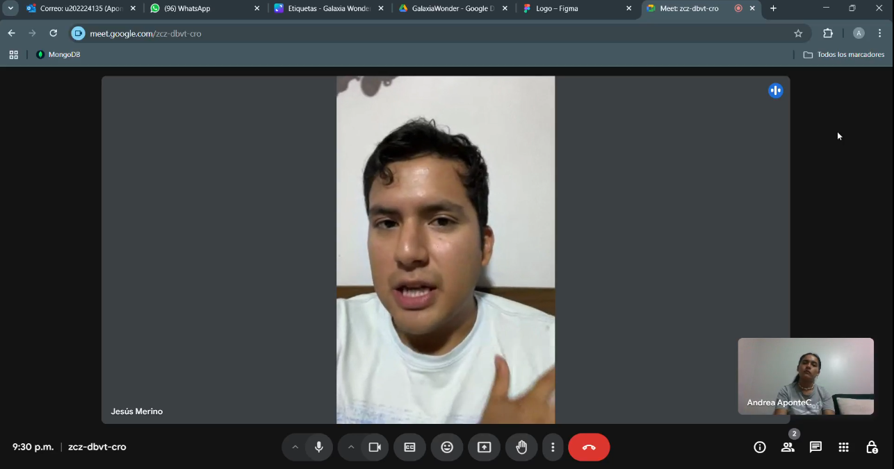
        </div>
      </td>
    </tr>
    <tr>
      <td colspan="2" style="padding: 0; vertical-align: top; background-color: #fff border-top: 1px solid #ddd;">
        <div style="background-color: #f9f9f9; border-radius: 10px; padding: 24px; margin-top: 12px;">
          <p style="font-size: 18px; font-weight: bold; color: #2c3e50; margin-bottom: 12px; padding-bottom: 6px;">Resumen</p>
          <ul style="padding-left: 20px; list-style-type: disc; color: #333; font-size: 1em; margin: 0;">
            <li><strong>Personalidad:</strong> Guardián. Demuestra un profundo entendimiento y aceptación de las normativas que constriñen su trabajo y se alinea siempre a su cumplimiento.</li>
            <li><strong>Marcas:</strong> Autodesk Inc y Microsoft. Principalmente por software especializado de trabajo.</li>
            <li><strong>Uso de tecnología:</strong> Medio. Posee dominio suficiente de la tecnología que utiliza y la integra naturalmente en su flujo de trabajo diario.</li>
            <li><strong>Canales:</strong> Instagram, X (Twitter) y WhatsApp. En su mayoría son redes de uso personal.</li>
            <li><strong>Browsers:</strong> Brave</li>
            <li><strong>Dispositivos:</strong> Celular y PC.</li>
            <li><strong>Background:</strong> Es ingeniero civil de profesión y tiene un profundo entendimiento del funcionamiento del proceso de planificación y ejecución de proyectos.</li>
            <li>
              <strong>Frustraciones:</strong>
              <ul style="list-style-type: circle; padding-left: 20px;">
                <li>Solucionar errores en los expedientes técnicos causados por mala praxis de otros especialistas de área.</li>
                <li>Coordinar la elaboración del expediente técnico en conjunto a múltiples especialistas de área.</li>
              </ul>
            </li>
            <li>
              <strong>Flujos principales:</strong>
              <ul style="list-style-type: circle; padding-left: 20px;">
                <li>Reuniones de coordinación de especialistas.</li>
                <li>Cumplir con los entregables (avances de los expedientes por etapas).</li>
                <li>Cálculo de materiales de obra y precios unitarios (presupuesto por área de especialidad).</li>
                <li>Analizar datos para identificar posibles riesgos.</li>
              </ul>
            </li>
          </ul>
        </div>
      </td>
    </tr>
  </tbody>
</table>

<div style="page-break-before: always;"></div>

<table class="tabla-entrevista">
  <thead>
    <tr>
      <th style="
            text-align: left;
            padding: 12px;
            background-color: #f0f0f0;
            font-size: 22px;"><strong>SEGMENTO OBJETIVO: ENTIDAD CONTRATANTE</strong></th>
      <th><strong>#1</strong></th>
    </tr>
  </thead>
  <tbody>
    <tr>
      <td colspan="2" style="padding: 0; vertical-align: top; background-color: #fff border-top: 1px solid #ddd;">
        <div style="display: flex; gap: 24px; align-items: flex-start; background-color: #fafafa; border-radius: 10px; padding: 24px;">
          <div style="flex: 1; display: flex; flex-direction: column;">
            <p style="font-size: 18px; font-weight: bold; color: #2c3e50; margin-bottom: 12px; padding-bottom: 6px;">Datos generales</p>
            <ul style="margin: 0; padding-left: 20px; list-style-type: disc; font-size: 1.05em; line-height: 1.7; color: #333;">
              <li><strong>Nombres:</strong> Aldo Kevin</li>
              <li><strong>Apellidos:</strong> Apolinario Vivas</li>
              <li><strong>Edad:</strong> 34</li>
              <li><strong>Distrito:</strong> El Agustino</li>
              <li><strong>URL Entrevista:</strong> <a href="https://upcedupe-my.sharepoint.com/:v:/g/personal/u20221e247_upc_edu_pe/EREC9iNRgJhIinK3osJI6IYBrl5jviZ00gGwKmbTa1DFvA?nav=eyJyZWZlcnJhbEluZm8iOnsicmVmZXJyYWxBcHAiOiJTdHJlYW1XZWJBcHAiLCJyZWZlcnJhbFZpZXciOiJTaGFyZURpYWxvZy1MaW5rIiwicmVmZXJyYWxBcHBQbGF0Zm9ybSI6IldlYiIsInJlZmVycmFsTW9kZSI6InZpZXcifX0%3D&e=LTJHiH" target="_blank">Ver video</a></li>
              <li><strong>Timestamp:</strong> 27:14</li>
              <li><strong>Duración:</strong> 03:00</li>
            </ul>
          </div>
          
        </div>
      </td>
    </tr>
    <tr>
      <td colspan="2" style="padding: 0; vertical-align: top; background-color: #fff border-top: 1px solid #ddd;">
        <div style="background-color: #f9f9f9; border-radius: 10px; padding: 24px; margin-top: 12px;">
          <p style="font-size: 18px; font-weight: bold; color: #2c3e50; margin-bottom: 12px; padding-bottom: 6px;">Resumen</p>
          <ul style="padding-left: 20px; list-style-type: disc; color: #333; font-size: 1em; margin: 0;">
            <li><strong>Personalidad:</strong> Idealista. Persigue sus objetivos personales sin comprometer su ética.</li>
            <li><strong>Marcas:</strong> Podcasts de educación en general.</li>
            <li><strong>Uso de tecnología:</strong> Medio-bajo. Usa frecuentemente la tecnología a nivel personal para consumir contenidos en línea.</li>
            <li><strong>Canales:</strong> LinkedIn. </li>
            <li><strong>Browsers:</strong> Google Chrome y Safari. Usa estos browsers según el dispositivo que esté utilizando.</li>
            <li><strong>Dispositivos:</strong> Laptop y Celular</li>
            <li><strong>Background:</strong> Trabaja en el INEN desde hace más de 10 años como especialista en Redes y Telecomunicaciones.</li>
            <li>
              <strong>Frustraciones:</strong>
              <ul style="list-style-type: circle; padding-left: 20px;">
                <li>Asegurar que sus expectativas sean cumplidas por el proyectista.</li>
              </ul>
            </li>
            <li>
              <strong>Flujos principales:</strong>
              <ul style="list-style-type: circle; padding-left: 20px;">
                <li>Contactar con el proyectista.</li>
                <li>Presentar el requerimiento del proyecto.</li>
              </ul>
            </li>
          </ul>
        </div>
      </td>
    </tr>
  </tbody>
</table>

<div style="page-break-before: always;"></div>

<table class="tabla-entrevista">
  <thead>
    <tr>
      <th style="
            text-align: left;
            padding: 12px;
            background-color: #f0f0f0;
            font-size: 22px;"><strong>SEGMENTO OBJETIVO: ENTIDAD CONTRATANTE</strong></th>
      <th><strong>#2</strong></th>
    </tr>
  </thead>
  <tbody>
    <tr>
      <td colspan="2" style="padding: 0; vertical-align: top; background-color: #fff border-top: 1px solid #ddd;">
        <div style="display: flex; gap: 24px; align-items: flex-start; background-color: #fafafa; border-radius: 10px; padding: 24px;">
          <div style="flex: 1; display: flex; flex-direction: column;">
            <p style="font-size: 18px; font-weight: bold; color: #2c3e50; margin-bottom: 12px; padding-bottom: 6px;">Datos generales</p>
            <ul style="margin: 0; padding-left: 20px; list-style-type: disc; font-size: 1.05em; line-height: 1.7; color: #333;">
              <li><strong>Nombres:</strong> Lucero Martina</li>
              <li><strong>Apellidos:</strong> Villanes Santillán</li>
              <li><strong>Edad:</strong> 26</li>
              <li><strong>Distrito:</strong> Villa María del Triunfo</li>
              <li><strong>URL Entrevista:</strong> <a href="https://upcedupe-my.sharepoint.com/:v:/g/personal/u20221e247_upc_edu_pe/EREC9iNRgJhIinK3osJI6IYBrl5jviZ00gGwKmbTa1DFvA?nav=eyJyZWZlcnJhbEluZm8iOnsicmVmZXJyYWxBcHAiOiJTdHJlYW1XZWJBcHAiLCJyZWZlcnJhbFZpZXciOiJTaGFyZURpYWxvZy1MaW5rIiwicmVmZXJyYWxBcHBQbGF0Zm9ybSI6IldlYiIsInJlZmVycmFsTW9kZSI6InZpZXcifX0%3D&e=LTJHiH" target="_blank">Ver video</a></li>
              <li><strong>Timestamp:</strong> 30:15</li>
              <li><strong>Duración:</strong> 01:44</li>
            </ul>
          </div>
          
        </div>
      </td>
    </tr>
    <tr>
      <td colspan="2" style="padding: 0; vertical-align: top; background-color: #fff border-top: 1px solid #ddd;">
        <div style="background-color: #f9f9f9; border-radius: 10px; padding: 24px; margin-top: 12px;">
          <p style="font-size: 18px; font-weight: bold; color: #2c3e50; margin-bottom: 12px; padding-bottom: 6px;">Resumen</p>
          <ul style="padding-left: 20px; list-style-type: disc; color: #333; font-size: 1em; margin: 0;">
            <li><strong>Personalidad:</strong> Idealista. Persigue sus objetivos personales sin comprometer su ética.</li>
            <li><strong>Marcas:</strong> Vlogs en general.</li>
            <li><strong>Uso de tecnología:</strong> Medio-bajo. Usa frecuentemente la tecnología a nivel personal para consumir contenidos en línea.</li>
            <li><strong>Canales:</strong> TikTok e Instagram. </li>
            <li><strong>Browsers:</strong> Google Chrome y Edge.</li>
            <li><strong>Dispositivos:</strong> Laptop y Celular</li>
            <li><strong>Background:</strong> Es ingeniera industrial con 5 años de experiencia en el año de logística.</li>
            <li>
              <strong>Frustraciones:</strong>
              <ul style="list-style-type: circle; padding-left: 20px;">
                <li>Asegurar que el proyecto sea finalizado a tiempo.</li>
              </ul>
            </li>
            <li>
              <strong>Flujos principales:</strong>
              <ul style="list-style-type: circle; padding-left: 20px;">
                <li>Contactar con el proyectista.</li>
                <li>Supervisar el avance del proyecto.</li>
              </ul>
            </li>
          </ul>
        </div>
      </td>
    </tr>
  </tbody>
</table>

<div style="page-break-before: always;"></div>

<table class="tabla-entrevista">
  <thead>
    <tr>
      <th style="
            text-align: left;
            padding: 12px;
            background-color: #f0f0f0;
            font-size: 22px;"><strong>SEGMENTO OBJETIVO: ENTIDAD CONTRATANTE</strong></th>
      <th><strong>#3</strong></th>
    </tr>
  </thead>
  <tbody>
    <tr>
      <td colspan="2" style="padding: 0; vertical-align: top; background-color: #fff border-top: 1px solid #ddd;">
        <div style="display: flex; gap: 24px; align-items: flex-start; background-color: #fafafa; border-radius: 10px; padding: 24px;">
          <div style="flex: 1; display: flex; flex-direction: column;">
            <p style="font-size: 18px; font-weight: bold; color: #2c3e50; margin-bottom: 12px; padding-bottom: 6px;">Datos generales</p>
            <ul style="margin: 0; padding-left: 20px; list-style-type: disc; font-size: 1.05em; line-height: 1.7; color: #333;">
              <li><strong>Nombres:</strong> Álvaro Martín</li>
              <li><strong>Apellidos:</strong> Torres Huamaní</li>
              <li><strong>Edad:</strong> 27</li>
              <li><strong>Distrito:</strong> San Juan de Lurigancho</li>
              <li><strong>URL Entrevista:</strong> <a href="https://upcedupe-my.sharepoint.com/:v:/g/personal/u20221e247_upc_edu_pe/EREC9iNRgJhIinK3osJI6IYBrl5jviZ00gGwKmbTa1DFvA?nav=eyJyZWZlcnJhbEluZm8iOnsicmVmZXJyYWxBcHAiOiJTdHJlYW1XZWJBcHAiLCJyZWZlcnJhbFZpZXciOiJTaGFyZURpYWxvZy1MaW5rIiwicmVmZXJyYWxBcHBQbGF0Zm9ybSI6IldlYiIsInJlZmVycmFsTW9kZSI6InZpZXcifX0%3D&e=LTJHiH" target="_blank">Ver video</a></li>
              <li><strong>Timestamp:</strong> 31:59</li>
              <li><strong>Duración:</strong> 03:56</li>
            </ul>
          </div>
          
        </div>
      </td>
    </tr>
    <tr>
      <td colspan="2" style="padding: 0; vertical-align: top; background-color: #fff border-top: 1px solid #ddd;">
        <div style="background-color: #f9f9f9; border-radius: 10px; padding: 24px; margin-top: 12px;">
          <p style="font-size: 18px; font-weight: bold; color: #2c3e50; margin-bottom: 12px; padding-bottom: 6px;">Resumen</p>
          <ul style="padding-left: 20px; list-style-type: disc; color: #333; font-size: 1em; margin: 0;">
            <li><strong>Personalidad:</strong> Idealista. Demuestra ser bastante deliberado en cuanto persigue sus objetivos y metas personales.</li>
            <li><strong>Marcas:</strong> Álvaro Soler.</li>
            <li><strong>Uso de tecnología:</strong> Medio-bajo. Usa frecuentemente la tecnología a nivel personal para consumir contenidos en línea.</li>
            <li><strong>Canales:</strong> TikTok e Instagram. </li>
            <li><strong>Browsers:</strong> Google Chrome.</li>
            <li><strong>Dispositivos:</strong> Celular.</li>
            <li><strong>Background:</strong> Es electricista de profesión y está comenzando a formar una familia.</li>
            <li>
              <strong>Frustraciones:</strong>
              <ul style="list-style-type: circle; padding-left: 20px;">
                <li>Asegurar que el proyectista haga un trabajo de calidad.</li>
              </ul>
            </li>
            <li>
              <strong>Flujos principales:</strong>
              <ul style="list-style-type: circle; padding-left: 20px;">
                <li>Contactar con el proyectista.</li>
                <li>Supervisar el avance del proyecto.</li>
              </ul>
            </li>
          </ul>
        </div>
      </td>
    </tr>
  </tbody>
</table>

<div style="page-break-after: always;"></div>

### 2.2.3. Análisis de entrevistas

**CONTRATISTAS**

**1. Resumen:** Los contratistas son en su mayoría varones adultos con experiencia previa como residentes de obra. Actualmente desempeñan la función de gerentes en oficinas, alejados del área operativa, lo cual les genera cierta nostalgia por “los viejos tiempos” en campo. Son personas sencillas, de trato directo y verbo fluido, con un alto respeto por las normas y los acuerdos establecidos. Presentan ciertas dificultades en el uso de tecnologías digitales, aunque muestran disposición al aprendizaje, motivados principalmente por aumentar la eficiencia de su organización.

**2. Edad:**  Las edades de los entrevistados de este segmento varían desde los 56 hasta los 64 años de edad. Se toma como edad representativa la media aritmética de los datos.

| Entrevistado | Mario López | Raúl Reaño | William Salcedo | Valor representativo |
|-|-|-|-|-|
| **Edad** | 64 | 56 | 57 | 59 |

**3. Personalidad:** La totalidad de los entrevistados (100%) se alínean al arquetipo de personalidad *Guardián*, debido a su respeto irrestricto y meticuloso de las normas y acuerdos. Se toma este arquetipo de personalidad como representativo.

| Entrevistado | Mario López | Raúl Reaño | William Salcedo | Valor representativo |
|-|-|-|-|-|
| **Personalidad** | Guardián | Guardián | Guardián | Guardián |

**4. Marcas e influencers:** La totalidad de los entrevistados (100%) mencionó las marcas Microsoft y Autodesk. De ellos, la gran mayoría (66.7%) mencionaron la marca S10. Se toma como marcas representativas Microsoft, Autodesk y S10.

| Marca | Frecuencia Absoluta | Frecuencia Relativa | Entrevistados que la siguen (%) |
|-|-|-|-|
| Microsoft | 3 | 37.5% | 100% |
| Autodesk Inc. | 3 | 37.5% | 100% |
| S10 | 2 | 25% | 66.7% |
| **Total** | 8 | 100% | - |

**5. Uso de tecnología:** La gran mayoría de los entrevistados (66.7%) demostró un nivel bajo de dominio e integración de la tecnología en su trabajo y vida diaria, mientras que la menor parte (33.3%) mostró un nivel intermedio. Se toma como nivel de uso de tecnología representativo el nivel Bajo.

| Nivel de uso de tecnología | Frecuencia Absoluta | % de entrevistados en este nivel |
|-|-|-|
| Bajo | 2 | 66.7% |
| Medio | 1 | 33.3% |
| Alto | 0 | 0% |
| **Total** | 3 | 100% |

**6. Canales:** La gran mayoría de los entrevistados (66.7%) mencionó utilizar WhatsApp como canal de comunicación, especialmente para el trabajo, mientras que la menor parte (33.3%) mencionó utilizar el ecosistema de Microsoft y Telegram.

| Canal de comunicación | Frecuencia Absoluta | Frecuencia Relativa | Entrevistados que lo usan (%) |
|-|-|-|-|
| WhatsApp | 2 | 50% | 66.7% |
| Ecosistema Microsoft | 1 | 25% | 33.3% |
| Telegram | 1 | 25% | 33.3% |
| **Total** | 4 | 100% | - |

**7. Browsers:** La totalidad de los entrevistados (100%) mencionó utilizar exclusivamente Google Chrome como su navegador web. Esta preferencia podría estar relacionada con su bajo nivel de dominio tecnológico, lo que los lleva a mantenerse en entornos digitales conocidos y seguros, sin explorar otras alternativas disponibles. Se toma como representativa la única alternativa mencionada.

| Navegador Web | Frecuencia Absoluta | Frecuencia Relativa | Entrevistados que lo usan (%) |
|-|-|-|-|
| Google Chrome | 3 | 100% | 100% |
| **Total** | 3 | 100% | - |

<div style="page-break-after: always;"></div>

**8. Dispositivos:** La totalidad de los entrevistados (100%) mencionó utilizar el celular como herramienta principal para acceder a recursos digitales. La gran mayoría (66.7%) reportó el uso de Laptops, mientras que una menor parte reportó el uso de computadoras de escritorio (33.3%). Se toma como representativa la clara tendencia hacia la portabilidad (Celular y Laptop).

| Dispositivo | Frecuencia Absoluta | Frecuencia Relativa | Entrevistados que lo usan (%) |
|-|-|-|-|
| Celular | 3 | 50% | 100% |
| Laptop | 2 | 33.3% | 66.7% |
| PC | 1 | 16.7% | 33.3% |
| **Total** | 6 | 100% | - |

**9. Flujos principales:** La totalidad de los entrevistados (100%) señaló la importancia del seguimiento y cumplimiento del calendario. La gran mayoría (66.7%) destacó la importancia del seguimiento del contrato y la gestión de observaciones y compatibilidad de los planos. De manera aislada se mencionaron otros flujos como el contacto con el cliente o la recaudación ded medidas descriptivas, entre otras. Estos últimos flujos tienen cierto grado de solapamiento con los flujos principales mayoritarios, cumpliendo un rol de apoyo o soporte.

| Flujo de trabajo | Frecuencia Absoluta | Frecuencia Relativa | Entrevistados que lo priorizan (%) |
|-|-|-|-|
| Comunicación / contacto con el cliente | 1 | 9.1% | 33.3% |
| Conceder y solicitar autorización entre distintas áreas | 1 | 9.1% | 33.3% |
| Estudios básicos (medidas descriptivas) | 1 | 9.1% | 33.3% |
| Elaboración del calendario | 1 | 9.1% | 33.3% |
| Seguimiento y cumplimiento del calendario | 3 | 27.3% | 100% |
| Seguimiento del contrato | 2 | 18.2% | 66.7% |
| Gestión de observaciones y compatibilidad de planos | 2 | 18.2% | 66.7% |
| **Total** | 11 | 100% | - |

<div style="page-break-after: always;"></div>

**ESPECIALISTA DE ÁREA**

**1. Resumen:** Los especialistas de área son en su mayoría varones adultos entre los 26 y 45 años, con formación en Ingeniería Civil y experiencia desarrollada dentro de una especialidad técnica. Muchos de ellos llegaron a su posición actual a través de la práctica profesional en empresas del rubro, aunque algunas áreas, como TI, requieren formación específica. Son personas estructuradas, con un fuerte apego a las normas y procesos establecidos, lo que les permite mantener el orden en sus funciones. Sin embargo, enfrentan ciertas dificultades en la comunicación con otras especialidades, influenciadas por la rigidez de las estructuras organizacionales en las que trabajan.

**2. Edad:**  Las edades de los entrevistados de este segmento varían desde los 26 hasta los 45 años de edad. Se toma como edad representativa la media aritmética de los datos.

| Entrevistado | Luis Agreda | Manuel Anaypoma | Jesús Merino | Valor representativo |
|-|-|-|-|-|
| **Edad** | 26 | 45 | 35 | 35 |

**3. Personalidad:** La gran mayoría de los entrevistados (100%) se alínean al arquetipo de personalidad *Guardián*, mientras que la menor parte (33.3%) refleja una personalidad de tipo *Racional*. Se toma el arquetipo *Guardián* como representativo.

| Entrevistado | Luis Agreda | Manuel Anaypoma | Jesús Merino | Valor representativo |
|-|-|-|-|-|
| **Personalidad** | Racional | Guardián | Guardián | Guardián |

**4. Marcas e influencers:** La totalidad de los entrevistados (100%) mencionó seguir la marca Microsoft. De ellos, la gran mayoría (66.7%) mencionaron la marca Autodesk, mientras que se encontraron casos aislados (33.3%) de S10, Cisco y Apple. Se toma como marcas representativas Microsoft y Autodesk.

| Marca | Frecuencia Absoluta | Frecuencia Relativa | Entrevistados que la siguen (%) |
|-|-|-|-|
| Microsoft | 3 | 37.5% | 100% |
| Autodesk Inc. | 2 | 25% | 66.7% |
| S10 | 1 | 12.5% | 33.3% |
| Cisco | 1 | 12.5% | 33.3% |
| Apple | 1 | 12.5% | 33.3% |
| **Total** | 8 | 100% | - |

**5. Uso de tecnología:** Los entrevistados mostraron niveles de dominio de la tecnología variados, que se correlacionan tanto con su edad como con sus respectivas especialidades. Se asigna un peso numérico a los niveles de habilidad y se toma como representativo el nivel que tenga como nivel el más próximo al promedio ponderado (Medio).

| Nivel de uso de tecnología | Frecuencia Absoluta | % de entrevistados en este nivel | Peso | Promedio Ponderado |
|-|-|-|-|-|
| Bajo | 1 | 33.3% | 1 | 0.3 |
| Medio | 1 | 33.3% | 2 | 0.7 |
| Alto | 1 | 33.3% | 3 | 1 |
| **Total** | 3 | 100% | - | 2 |

**6. Canales:** La totalidad de los entrevistados mencionó utilizar WhatsApp como canal de comunicación, especialmente para el trabajo. Por otro lado, la gran mayoría (66.7%) mencionó utilizar X (Twitter), mientras que la menor parte (33.3%) mencionó utilizar Instagram.

| Canal de comunicación | Frecuencia Absoluta | Frecuencia Relativa | Entrevistados que lo usan (%) |
|-|-|-|-|
| WhatsApp | 3 | 50% | 100% |
| X (Twitter) | 2 | 33.3% | 66.7% |
| Instagram | 1 | 16.7% | 33.3% |
| **Total** | 6 | 100% | - |

<div style="page-break-after: always;"></div>

**7. Browsers:** La gran mayoría de los entrevistados (66.7%) reportó utilizar Google Chrome como su navegador por defecto. Sin embargo, se presentaron casos particulares de utilizar otros navegadores de forma complementaria (correspondientes a 33.3%). Por ejemplo, usar Safari cuando se usa el teléfono iPhone o Internet Explorer debido a la necesidad de interactuar con sistemas Legacy. Se toma como representativo el uso de Google Chrome, pero se tiene presente los posibles casos adicionales de uso de otros navegadores debido a necesidades del momento.

| Navegador Web | Frecuencia Absoluta | Frecuencia Relativa | Entrevistados que lo usan (%) |
|-|-|-|-|
| Google Chrome | 2 | 40% | 66.7% |
| Safari | 1 | 20% | 33.3% |
| Firefox | 1 | 20% | 33.3% |
| Internet Explorer | 1 | 20% | 33.% |
| **Total** | 5 | 100% | - |

**8. Dispositivos:** La totalidad de los entrevistados (100%) mencionó utilizar el celular como herramienta principal para acceder a recursos digitales. La gran mayoría (66.7%) reportó el uso de Laptops, mientras que una menor parte reportó el uso de computadoras de escritorio (33.3%). Se toma como representativa la clara tendencia hacia la portabilidad (Celular y Laptop).

| Dispositivo | Frecuencia Absoluta | Frecuencia Relativa | Entrevistados que lo usan (%) |
|-|-|-|-|
| Celular | 3 | 50% | 100% |
| PC | 3 | 33.3% | 66.7% |
| Laptop | 1 | 16.7% | 33.3% |
| **Total** | 6 | 100% | - |

**9. Flujos principales:** La gran mayoría de los entrevistados destacaron la importancia de las reuniones de coordinación con otros especialistas. El resto de actividades destacadas fueron aquellas relacionadas con su propia área de especialidad dentro de la empresa que trabajan. Se toma como presentativo conjuntos de actividades relacionadas a un único fin conjunto:
- Análisis de información y elaboración de documentación
- Comunicación e intercambio de información
- Seguimiento y cumplimiento de planificación 

<table class="tabla-flujos">
  <thead>
    <tr>
      <th>Categoría</th>
      <th>Flujo de trabajo</th>
      <th>Frecuencia Absoluta</th>
      <th>Frecuencia Relativa</th>
      <th>Entrevistados que lo priorizan (%)</th>
    </tr>
  </thead>
  <tbody>
    <tr>
      <td rowspan="2"><strong>Comunicación e intercambio de información</strong></td>
      <td style="border: 1px solid #000;">Reuniones de coordinación de especialistas</td>
      <td style="border: 1px solid #000;">2</td>
      <td style="border: 1px solid #000;">25%</td>
      <td style="border: 1px solid #000;">2</td>
    </tr>
    <tr>
      <td style="border: 1px solid #000;">Realizar consultas o solicitar revisiones ante incompatibilidad de planos</td>
      <td style="border: 1px solid #000;">1</td>
      <td style="border: 1px solid #000;">12.5%</td>
      <td style="border: 1px solid #000;">1</td>
    </tr>
    <tr>
      <td rowspan="2"><strong>Seguimiento y cumplimiento de planificación</strong></td>
      <td style="border: 1px solid #000;">Seguir y cumplir los lineamientos de el expediente técnico</td>
      <td style="border: 1px solid #000;">1</td>
      <td style="border: 1px solid #000;">12.5%</td>
      <td style="border: 1px solid #000;">1</td>
    </tr>
    <tr>
      <td style="border: 1px solid #000;">Cumplir con los entregables</td>
      <td style="border: 1px solid #000;">1</td>
      <td style="border: 1px solid #000;">12.5%</td>
      <td style="border: 1px solid #000;">1</td>
    </tr>
    <tr>
      <td rowspan="3"><strong>Análisis de información y elaboración de documentación</strong></td>
      <td style="border: 1px solid #000;">Analizar datos para identificar posibles riesgos</td>
      <td style="border: 1px solid #000;">1</td>
      <td style="border: 1px solid #000;">12.5%</td>
      <td style="border: 1px solid #000;">1</td>
    </tr>
    <tr>
      <td style="border: 1px solid #000;">Cálculo de materiales de obra y precios unitarios</td>
      <td style="border: 1px solid #000;">1</td>
      <td style="border: 1px solid #000;">12.5%</td>
      <td style="border: 1px solid #000;">1</td>
    </tr>
    <tr>
      <td style="border: 1px solid #000;">Elaboración de documentación para los expedientes técnicos</td>
      <td style="border: 1px solid #000;">1</td>
      <td style="border: 1px solid #000;">12.5%</td>
      <td style="border: 1px solid #000;">1</td>
    </tr>
    <tr>
      <td style="border: 1px solid #000;"><strong>Total</strong></td>
      <td style="border: 1px solid #000;">8</td>
      <td style="border: 1px solid #000;">100%</td>
      <td style="border: 1px solid #000;">-</td>
      <td style="border: 1px solid #000;"></td>
    </tr>
  </tbody>
</table>

<div style="page-break-after: always;"></div>

**ENTIDAD CONTRATANTE**

**1. Resumen:** Los clientes (formalmente llamados "La Entidad Contrante") son predominante varones adultos jóvenes entre los 26 y 34 años de edad con entre 5 a 10 años de experiencia laboral. Se destacan por ser ambiciosos y estratégicos, pensar bien las cosas y tener mucho cuidado de que "las cosas marchen de acuerdo al plan". Buscan los servicios de consultoría principalmente para la planificación de su vivienda a futuro, pero también existen intereses de realizar negocios (alquiler, por ejemplo). Sus principales preocupaciones son el cumplimiento de plazos y sus expectativas.

**2. Edad:**  Las edades de los entrevistados de este segmento varían desde los 26 hasta los 34 años de edad. Se toma como edad representativa la media aritmética de los datos.

| Entrevistado | Aldo Apolinario | Lucero Villanes | Álvaro Torres | Valor representativo |
|-|-|-|-|-|
| **Edad** | 34 | 26 | 27 | 29 |

**3. Personalidad:** La totalidad de los entrevistados (100%) se alínean al arquetipo de personalidad *Idealista*, debido a que reflejan un alto grado de meticulosidad, cuidado y respeto a la ley de por medio a lograr sus objetivos personales.

| Entrevistado | Aldo Apolinario | Lucero Villanes | Álvaro Torres | Valor representativo |
|-|-|-|-|-|
| **Personalidad** | Idealista | Idealista | Idealista | Idealista |

**4. Marcas e influencers:** Los entrevistados no proporcionaron muchos detalles sobre las marcas e influencers que siguen (salvo a una única expeción) sin mostrar un concenso o tendencia clara. Se obtiene del análisis el entendimiento de que el perfil del entrevistado es el seguimiento de marcas e influencers en general y se toma dicha noción como representativa.

| Marca | Frecuencia Absoluta | Frecuencia Relativa | Entrevistados que la siguen (%) |
|-|-|-|-|
| Álvaro Soler | 1 | 33.3% | 33.3% |
| Vlogs en general | 1 | 33.3% | 33.3% |
| Podcasts en general | 1 | 33.3% | 33.3% |
| **Total** | 8 | 100% | - |

**5. Uso de tecnología:** La totalidad de los entrevistados (100%) demostraron un nivel de uso de la tecnología Medio. Se toma este nivel como representativo.

| Nivel de uso de tecnología | Frecuencia Absoluta | % de entrevistados en este nivel |
|-|-|-|
| Bajo | 0 | 0% |
| Medio | 3 | 100% |
| Alto | 0 | 0% |
| **Total** | 3 | 100% |

**6. Canales:** La gran mayoría de los entrevistados (66.7%) mencionó utilizar TikTok e Instagram como canal de comunicación, especialmente para el trabajo, mientras que la menor parte (33.3%) mencionó utilizar LinkedIn. Se toma como representativo el uso de las dos primeras redes sociales.

| Canal de comunicación | Frecuencia Absoluta | Frecuencia Relativa | Entrevistados que lo usan (%) |
|-|-|-|-|
| TikTok | 2 | 40% | 66.7% |
| Instagram | 2 | 40% | 66.7% |
| LinkedIn | 1 | 20% | 33.3% |
| **Total** | 5 | 100% | - |

**7. Browsers:** La totalidad de los entrevistados (100%) mencionó utilizar Google Chrome como su navegador web. Se mencionaron casos aislados (33.3%) de uso de Safari y Edge. Se toma como representativo el uso de Chrome, y se considera a Safari por la posibilidad de tener un dispositivo de Apple.

| Navegador Web | Frecuencia Absoluta | Frecuencia Relativa | Entrevistados que lo usan (%) |
|-|-|-|-|
| Google Chrome | 3 | 60% | 100% |
| Safari | 1 | 20% | 33.3% |
| Edge | 1 | 20% | 33.3% |
| **Total** | 5 | 100% | - |

<div style="page-break-after: always;"></div>

**8. Dispositivos:** La totalidad de los entrevistados (100%) mencionó utilizar el celular como herramienta principal para acceder a recursos digitales. De ellos, la gran mayoría (66.7%) reportó el uso de Laptops. Se toma como representativa la clara tendencia hacia la portabilidad (Celular y Laptop).

| Dispositivo | Frecuencia Absoluta | Frecuencia Relativa | Entrevistados que lo usan (%) |
|-|-|-|-|
| Celular | 3 | 60% | 100% |
| Laptop | 2 | 40% | 66.7% |
| **Total** | 5 | 100% | - |

**9. Flujos principales:** La totalidad de los entrevistados (100%) señaló la importancia del seguimiento y cumplimiento del calendario. La gran mayoría (66.7%) destacó la importancia del seguimiento del contrato y la gestión de observaciones y compatibilidad de los planos. De manera aislada se mencionaron otros flujos como el contacto con el cliente o la recaudación ded medidas descriptivas, entre otras. Estos últimos flujos tienen cierto grado de solapamiento con los flujos principales mayoritarios, cumpliendo un rol de apoyo o soporte.

| Flujo de trabajo | Frecuencia Absoluta | Frecuencia Relativa | Entrevistados que lo priorizan (%) |
|-|-|-|-|
| Contactar con el proyectista | 3 | 50% | 100% |
| Supervisar el avance del proyecto | 2 | 33.3% | 66.7% |
| Presentar el requerimiento del proyecto | 1 | 16.7% | 33.3% |
| **Total** | 6 | 100% | - |

<div style="page-break-before: always;"></div>

## 2.3. Needfinding

### 2.3.1. User Personas

Para la construcción de los segmentos objetivo, se consideraron principalmente características demográficas obtenidas a partir de las entrevistas, las cuales sirvieron de base tanto para definir los perfiles de los User Personas como para identificar sus motivaciones e intereses. De manera complementaria, se incorporaron habilidades y preferencias relacionadas con el uso de tecnología y herramientas, también derivadas del análisis de las entrevistas.

**Contratistas**

Edilberto Cáceres representa el segmento objetivo de Contratistas. Trabaja como generente general de su empresa consultora de obras. Es una persona muy experimentada en su trabajo que mantiene siempre una reputación impecable con respecto al cumplimiento de términos de referencia y normativas vigentes. Se destaca por su capacidad de liderazgo y manejo de equipos multifuncionales así como su manejo de los tiempos y cronogramas. 

<div style="text-align: center;">
  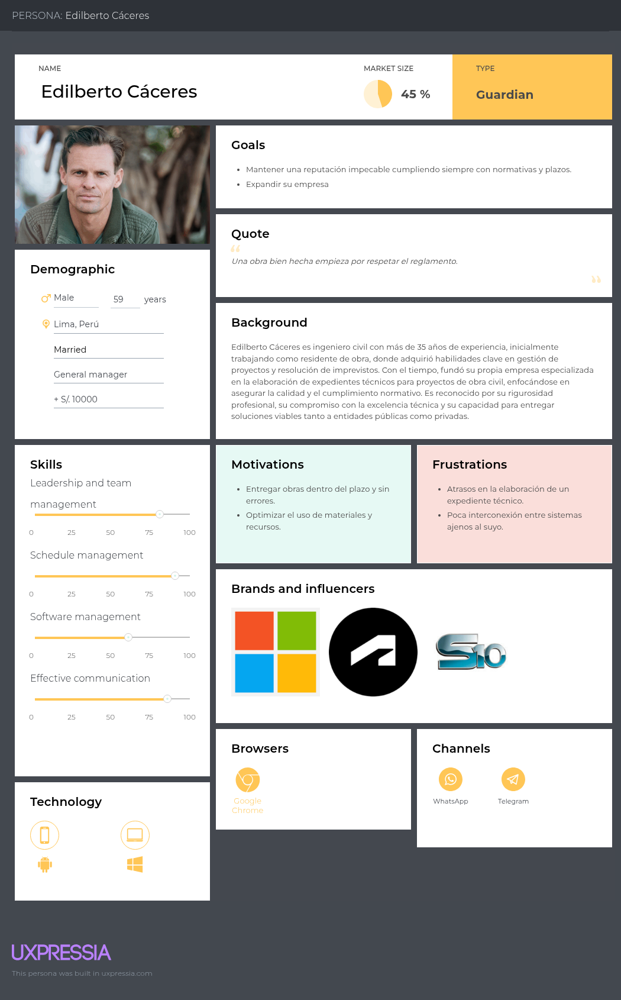
</div>

<div style="page-break-after: always;"></div>

**Especialistas**

José Rodríguez representa el segmento objetivo de Especialistas. Es arquitecto de profesión con mucha experiencia. Es una persona motivada, amante de la arquitectura. Tiene un fuerte sentido del cumplimiento de las normativas dentro de sus actividades en el trabajo. Se destaca por su alta capacidad para comunicarse con otros especialistas y por su capacidad de ánalisis.

<div style="text-align: center;">
  
</div>

<div style="page-break-after: always;"></div>

**Entidad contratante**

Alfonso Villarán representa el segmento objetivo de Entidad contratante. Se encuentra buscando un contratista para poder planificar su hogar en un terreno heredado. Es una persona precavida y que vela por la seguridad de su futura familia. Es alguien muy afín a la tecnología.

<div style="text-align: center;">
  
</div>

<div style="page-break-after: always;"></div>

### 2.3.2. User Task Matrix

Se considera para la realización de este User Task Matrix los User Persona, sus actividades, frecuencia e importancia.

<table border="1" cellpadding="5" cellspacing="0">
  <thead>
    <tr>
      <th rowspan="2">Task</th>
      <th colspan="2">Adilberto Cáceres</th>
      <th colspan="2">José Rodríguez</th>
      <th colspan="2">Alfonso Villarán</th>
    </tr>
    <tr>
      <th>Frecuencia</th>
      <th>Importancia</th>
      <th>Frecuencia</th>
      <th>Importancia</th>
      <th>Frecuencia</th>
      <th>Importancia</th>
    </tr>
  </thead>
  <tbody>
    <tr><td>Contacto con cliente</td><td>Alta</td><td>Alta</td><td>Baja</td><td>Alta</td><td>Nunca</td><td>Baja</td></tr>
    <tr><td>Conceder autorización de comunicación de áreas</td><td>Media</td><td>Alta</td><td>Baja</td><td>Alta</td><td>Nunca</td><td>Alta</td></tr>
    <tr><td>Planificación de cronogramas</td><td>Media</td><td>Alta</td><td>Media</td><td>Alta</td><td>Baja</td><td>Media</td></tr>
    <tr><td>Cumplimiento de cronogramas</td><td>Alta</td><td>Alta</td><td>Alta</td><td>Alta</td><td>Nunca</td><td>Baja</td></tr>
    <tr><td>Planificación de estudios básicos</td><td>Media</td><td>Alta</td><td>Alta</td><td>Alta</td><td>Nunca</td><td>Baja</td></tr>
    <tr><td>Ejecución de estudios básicos</td><td>Baja</td><td>Alta</td><td>Media</td><td>Alta</td><td>Nunca</td><td>Baja</td></tr>
    <tr><td>Seguimiento de normativas</td><td>Alta</td><td>Alta</td><td>Alta</td><td>Alta</td><td>Media</td><td>Alta</td></tr>
    <tr><td>Consultar a otras áreas</td><td>Media</td><td>Alta</td><td>Alta</td><td>Alta</td><td>Nunca</td><td>Baja</td></tr>
    <tr><td>Solicitar revisiones</td><td>Nunca</td><td>Baja</td><td>Alta</td><td>Alta</td><td>Alta</td><td>Alta</td></tr>
    <tr><td>Reuniones de coordinación</td><td>Alta</td><td>Alta</td><td>Alta</td><td>Media</td><td>Media</td><td>Alta</td></tr>
    <tr><td>Entregar avances de expediente</td><td>Media</td><td>Alta</td><td>Alta</td><td>Alta</td><td>Media</td><td>Baja</td></tr>
    <tr><td>Cálculo de materiales y precios unitarios</td><td>Media</td><td>Alta</td><td>Alta</td><td>Alta</td><td>Nunca</td><td>Baja</td></tr>
    <tr><td>Comunicarse con contratista</td><td>Nunca</td><td>Baja</td><td>Media</td><td>Alta</td><td>Alta</td><td>Alta</td></tr>
    <tr><td>Explicar requisitos</td><td>Media</td><td>Alta</td><td>Nunca</td><td>Baja</td><td>Alta</td><td>Alta</td></tr>
    <tr><td>Supervisar cumplimiento de requisitos</td><td>Alta</td><td>Alta</td><td>Media</td><td>Alta</td><td>Alta</td><td>Alta</td></tr>
  </tbody>
</table>

**INTERPRETACIÓN DE RESULTADOS**

* Edilberto Cáceres: Como contratista, participa frecuentemente en reuniones y coordinaciones tanto con el cliente como con los especialistas. Da especial importancia al cumplimiento de las normativas y los términos de referencia del proyecto. Para él, todas las etapas del expediente técnico —desde la coordinación inicial con el cliente hasta la elaboración de cada sección— son fundamentales.

* José Rodríguez: En su rol de especialista, mantiene una alta frecuencia de interacción con el contratista y otras especialidades. Considera crucial que el contratista realice revisiones constantes sobre sus entregables, ya que esto garantiza la coherencia e integración del expediente técnico.

* Alfonso Villarán: Como entidad contratante, realiza revisiones frecuentes sobre el avance del expediente técnico, siendo esta su actividad más importante. Sus tareas principales están enfocadas en la comunicación con el contratista y en asegurar el cumplimiento de los requisitos establecidos.

<div style="page-break-after: always;"></div>

### 2.3.3. User Journey Mapping

Se desarrolla el User Journey Mapping en base al As-Is del flujo de trabajo de los User Persona anteriormente elaborados.

**Contratista**

Se representa el flujo de trabajo del contratista en relación con el ciclo de vida de la planificación del proyecto, específicamente en la elaboración del expediente técnico. Se hace especial énfasis en las actividades vinculadas a la toma de requisitos del cliente, la recolección de datos de suelos y estudios básicos, así como en la elaboración de planos y cronogramas. A partir del análisis, se concluye que varios de estos procesos presentan oportunidades claras de automatización.

<div style="text-align: center;">
  
</div>

<div style="page-break-after: always;"></div>

**Especialista**

Se representa el flujo de trabajo habitual del especialista en el contexto de la elaboración de tareas dentro del expediente técnico. Se destaca especialmente la comunicación transversal entre distintas especialidades, identificando que esta interacción ocurre de forma constante y diaria a lo largo del proceso.

<div style="text-align: center;">
  
</div>

<div style="page-break-after: always;"></div>

**Entidad contratante**

Se representa el flujo habitual del contratante, desde la comunicación inicial con el contratista hasta la toma de requisitos y el inicio de la planificación y elaboración de los distintos documentos del expediente técnico. Se hace especial énfasis en el rol activo del cliente como supervisor del cumplimiento de sus propios requisitos a lo largo del proceso.

<div style="text-align: center;">
  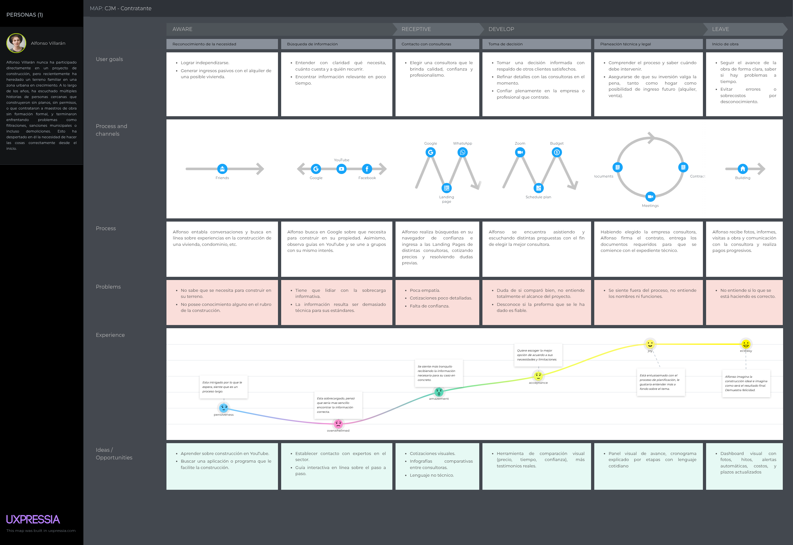
</div>

<div style="page-break-after: always;"></div>

### 2.3.4. Empathy Mapping

**Contratistas**

Se representan las necesidades, frustraciones y oportunidades del contratista, así como las percepciones de su entorno y sus propias observaciones. Se concluye que el contratista desempeña un rol central en la elaboración del expediente técnico, participando activamente en múltiples acciones clave a lo largo del proceso.

<div style="text-align: center;">
  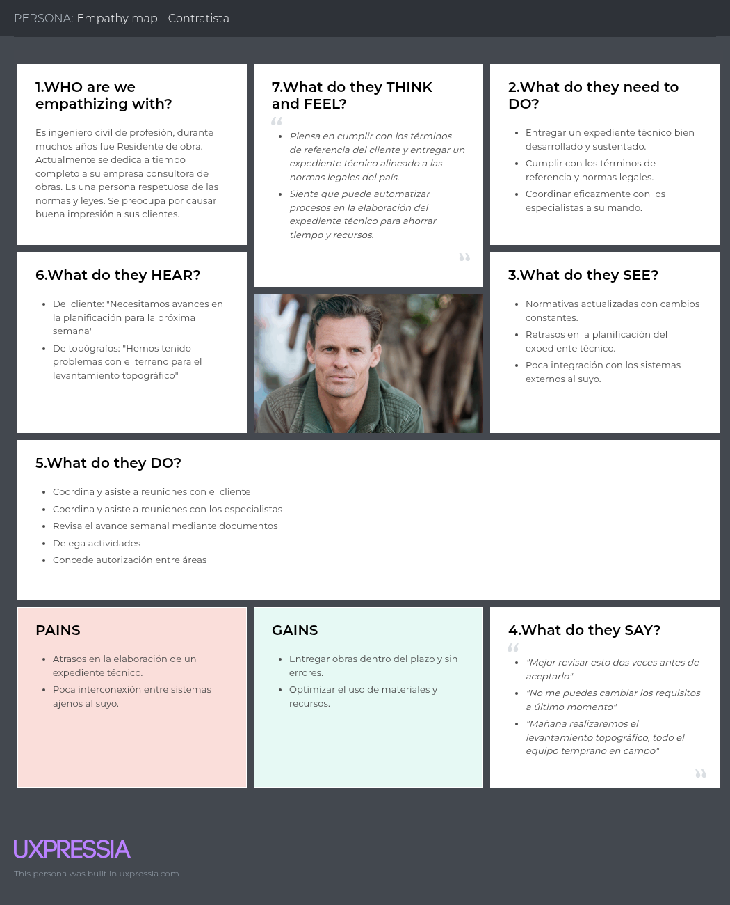
</div>

<div style="page-break-after: always;"></div>

**Especialistas**

Se representan las necesidades, frustraciones y oportunidades del especialista, así como las percepciones de su entorno y sus propias observaciones. Se hace especial énfasis en la importancia de la comunicación entre especialidades, la participación en reuniones de coordinación y el cumplimiento riguroso de las normativas establecidas.

<div style="text-align: center;">
  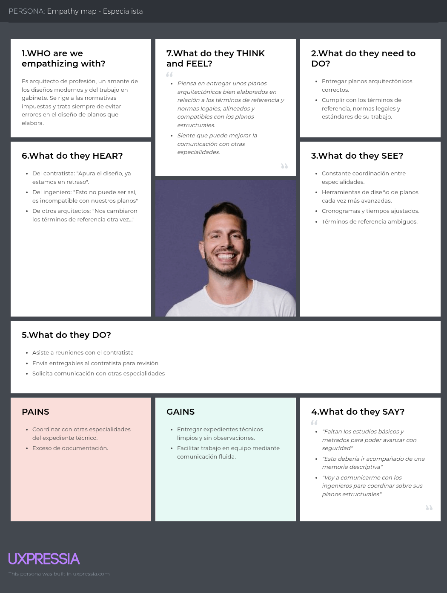
</div>

<div style="page-break-after: always;"></div>

**Entidad contratante**

Se representan las necesidades, frustraciones y oportunidades de la entidad contratante, junto con las percepciones de su entorno y sus propias observaciones. Se destaca especialmente la influencia de las experiencias compartidas por colegas y conocidos, así como la comunicación constante y directa que mantiene con el contratista a lo largo del proceso.

<div style="text-align: center;">
  
</div>

<div style="page-break-after: always;"></div>

### 2.3.5. As-is Scenario Mapping

Para elaborar esta sección del As-Is Scenario Mapping, el equipo trabajó en conjunto poniéndose en el lugar de los usuarios, con el objetivo de generar descripciones que reflejaran los pain points identificados en el Empathy Map. Aunque se contemplaron más tareas durante el análisis, el resultado final fue acotado de acuerdo con el alcance definido para nuestro proyecto.

**Contratista**

Este escenario representa el flujo de trabajo dentro del ciclo de vida de la planificación del proyecto. Se hace especial énfasis en el cumplimiento de los términos de referencia y en el seguimiento continuo durante la elaboración del expediente técnico.

<div style="text-align: center;">
  
</div>

<div style="page-break-after: always;"></div>

**Especialista**

Este escenario representa el flujo de trabajo del especialista durante la entrega de un encargo relacionado con el expediente técnico. Se resalta la importancia del cumplimiento de las normativas vigentes y la comunicación constante con otras especialidades para garantizar la coherencia y calidad del proyecto.

<div style="text-align: center;">
  
</div>

<div style="page-break-after: always;"></div>

**Entidad contratante**

Este escenario representa el flujo de trabajo de la entidad contratante, desde el primer contacto con el contratista hasta el seguimiento del proyecto. Se hace especial énfasis en la verificación y cumplimiento de los requisitos establecidos.

<div style="text-align: center;">
  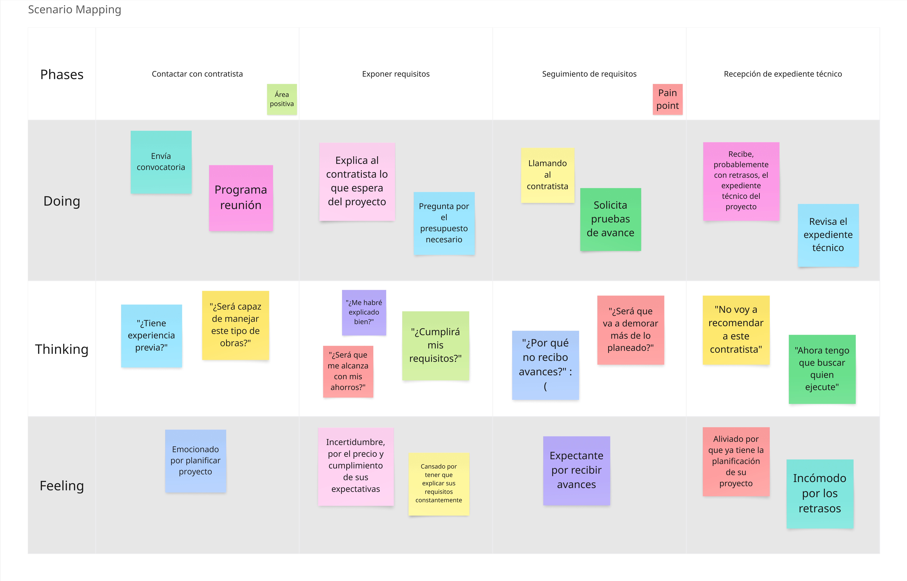
</div>

<div style="page-break-before: always;"></div>

## 2.4. Ubiquitous Language

### 2.4.1. Core

**Project Management (Gestión de proyectos)**

El bounded context de Project Management está dedicado a la planificación, ejecución y seguimiento de proyectos de construcción o ingeniería. Su enfoque se centra en la coordinación de tareas, el manejo de recursos, el monitoreo del progreso y la organización de roles. Este contexto asegura que todos los aspectos del proyecto estén alineados con los objetivos, plazos y presupuestos definidos, y que los especialistas trabajen de forma eficaz hacia los entregables acordados.

**1. Project (Proyecto):** Unidad estructurada de trabajo con objetivos, fechas y alcance definidos. Incluye múltiples tareas, hitos y recursos humanos, y está asociada a un contrato específico y tiene como producto final desarrollo de un expediente técnico. <br>
**2. Technical File (Expediente técnico):** El expediente técnico es un conjunto ordenado y sistemático de documentos que sustentan la viabilidad técnica, económica, ambiental y legal de un proyecto. Incluye planos, especificaciones, presupuestos, cronogramas, estudios de impacto, y otros documentos necesarios para su aprobación y ejecución.<br>
**3. Contractor (Contratista / Proyectista):** Persona responsable de ejecutar el proyecto. Firma un contrato con la entidad contratante y administra los recursos y personal de campo.<br>
**4. Coordinator (Coordinador):** Rol dentro del sistema encargado de la gestión operativa y documental del proyecto.<br>
**5. Specialist (Especialista):** Profesional técnico que participa en el proyecto con funciones específicas: ingeniero estructural, sanitario, eléctrico, arquitecto, etc.<br>
**6. Contracting entity (Entidad contratante):** Persona que encarga y financia el proyecto. Define los lineamientos y da seguimiento a la planificación del proyecto.<br>
**7. Schedule (Cronograma):** Representación temporal del proyecto. Incluye la calendarización de cada hito, tarea, actividades como reuniones y su duración estimada.<br>
**8. Milestone (Hito):** Evento clave dentro del cronograma que marca un avance importante o entregable específico del proyecto.<br>
**9. Task (Tarea):** Actividad puntual y necesaria asignada al especialista de área para alcanzar uno o más hitos del proyecto.<br>
**10. Meeting (Reunión):** Espacio programado para coordinar, resolver problemas o validar avances del proyecto.<br>
**11. Memorandum (Ayuda Memoria):** Documento breve que resume una reunión, visita o decisión técnica.<br>
**12. Risk Assessment Sheet (Ficha de riesgo):** Documento que identifica y evalúa riesgos potenciales del proyecto.<br>
**13. Descriptive memories of specialty (Memorias descriptivas de especialidad):** Descripciones técnicas de cada disciplina (estructura, sanitarios, eléctricos, etc.) que justifican diseño y soluciones propuestas.<br>
**14. Technical specifications (Especificaciones técnicas):** Detalles de calidad, materiales y ejecución para cada elemento del proyecto.<br>
**15. Budget (Presupuesto):** Estimación total de costos del proyecto, desglosado por partidas y rubros.<br>
**16. Quantity Take-Off (Metrados):** Cálculo de cantidades de obra (volúmenes, áreas, longitudes) basado en planos.<br>
**17. Medium Voltage System (Sistema de media tensión):** Infraestructura eléctrica que opera entre 1 kV y 35 kV. Se usa para distribución de energía en obras que requieren alto consumo (edificios, plantas, etc.).<br>
**18. Soil Mechanics Study (Estudio de mecánica de suelos):** Análisis de las propiedades del terreno donde se construirá, clave para diseño de cimentaciones.<br>
**19. Topographic Survey (Levantamiento topográfico):** Registro de la forma, elevación y características del terreno. Sirve de base para el diseño de planos.<br>
**20. Plains (Planos):** Representaciones gráficas del proyecto (arquitectura, estructuras, instalaciones, etc.). Estos pueden ser planos de estado actual o planos de especialidad.<br>
**21. Technical File Preparation Budget (Presupuesto de elaboración del expediente técnico):** Estimación del costo asociado al desarrollo completo del expediente técnico del proyecto.<br>
**22. Performance (Desempeño):** Indicador de cumplimiento de los hitos en el plazo previsto.<br>


**Change Management (Gestión del cambio)**

Este contexto se encarga de gestionar y documentar todas las modificaciones que afectan el proyecto durante su ejecución, ya sea en alcance, plazos, costos o diseño. Incluye el manejo de cambios contractuales formales, consultas técnicas, discrepancias entre planos y rediseños en campo. La trazabilidad y aprobación adecuada de estos cambios es crítica para mantener el control y la transparencia del proyecto.

**1. Change (Cambio):** Un término general que se refiere a cualquier modificación realizada al alcance, costo, cronograma o especificaciones técnicas del proyecto original.<br>
**2. Change Order (Adicional de obra):** Documento formal que aprueba costos o trabajos adicionales fuera del contrato original. Puede originarse por solicitud del cliente, incompatibilidades técnicas o condiciones imprevistas en obra.<br>
**3. Change Request (Solicitud de cambio):** Condición o especificación técnica o requisito solicitada por la Entidad Contratante (o su representante) durante el proceso de elaboración de un expediente técnico.<br>
**4. Technical query (Consulta técnica):** Pregunta formal que se genera durante la obra cuando hay ambigüedad o duda en la documentación técnica (planos, metrados, especificaciones).<br>
**5. Incompatibility of plans (Incompatibilidad de planos):** Discrepancia entre planos de distintas especialidades o versiones, que impide o dificulta la ejecución directa de la obra. Debe resolverse mediante coordinación técnica y puede derivar en una consulta técnica o un cambio de diseño.<br>
**6. Field redesign (Replanteo de obra):** Rediseño parcial que se realiza en campo debido a condiciones imprevistas, errores en planos o cambios validados.<br>
**7. Contractor (Contratista / Proyectista):** Persona ejecutora del proyecto. Responsable de la supervisión del diseño conforme a los planos, especificaciones y contrato.<br>
**8. Contracting entity (Entidad contratante):** Persona que encarga y financia el proyecto. Define los lineamientos y da seguimiento a la planificación del proyecto.<br>
**9. Contracting entity supervisor (Supervisor):** Profesional que representa a la entidad contratante en obra. Se encarga de supervisar la ejecución, verificar metrados, validar planos, y evaluar cualquier consulta o cambio.<br>
**10. Site Worker (Operario de obra):** Persona que ejecuta la obra, es decir, instala, construye, excava, vacía o pinta, dependiendo de su especialidad.<br>
<div style="page-break-before: always;"></div>

### 2.4.2. Support

**Organizations (Organizaciones)**

El contexto de organizaciones se encarga de la estructura interna de una empresa consultora de obra. Aquí se administran las organizaciones, sus miembros e invitaciones.

**1. Organization (Organización):** Representa a la empresa consultora de obra dentro del sistema.<br>
**2. Legal name (Razón ocial):** Nombre legal bajo el cual la empresa está registrada y opera, y es utilizado en todos los trámites y documentos legales.<br>
**3. Commercial name (Nombre comercial):** Nombre con el que se identifica su actividad económica, diferenciándose de otras empresas, ya sean similares o diferentes.<br>
**4. RUC (RUC):** Se trata de un identificador que identifica a una empresa como contribuyente para cualquier tipo de trámite o declaración que el contribuyente desee realizar en la Sunat.<br>
**5. Organization member (Miembro de organización):** Se trata de un trabajador de la organización. Es un empleado que se ha vinculado a la empresa consultora y que puede ser ingresado como miembro de un proyecto.<br>
**6. Worker (Trabajador):** Se trata del rol de los trabajadores dentro de la organización.<br>


**Notifications (Notificaciones)**

El contexto de notificaciones se encarga de gestionar el envío de mensajes relevantes dentro del sistema. Estos mensajes son generados por un coordinador y enviados a los usuarios correspondientes, quienes deben tomar conocimiento o realizar alguna acción sobre eventos o situaciones específicas. Las notificaciones se priorizan según su urgencia y se entregan a través de canales definidos.

**1. Notification (Notificación):** Representa un mensaje generado por un coordinador. La notificación comunica información importante a uno o más destinatarios para que tomen conocimiento o acción sobre una situación específica.<br>
**2. Sender (Remitente):** Es la entidad que origina la notificación. Puede ser un usuario o el propio sistema de manera automática.<br>
**3. Addressee (Destinatario):** Es el usuario designado para recibir la notificación.<br>
**4. Notification priority (Prioridad de notificación):** Indica el nivel de urgencia o criticidad de la notificación.<br>
**5. Coordinator (Coordinador):** Rol asignado a un usuario que puede ser miembro de la organización o ser parte de la entidad contratante. Envía notificación de reuniones a los especialistas, notificaciones de entrega de tareas.<br>
**6. Specialist (Especialista):** Rol asignado a un miembro de la organización o subcontratado. Reciben notificaciones de reuniones o notificaciones de tareas.<br>


**Files Management (Gestión de archivos)**

Este contexto gestiona los archivos dentro del sistema. Modela los archivos en carpetas y los relaciona a la sección donde se encuentran en el proyecto.

**1. Folder (Carpeta):** Es un espacio que agrupa archivos del expediente técnico. Puede encontrarse dentro de otra carpeta y puede tener carpetas dentro.<br>
**2. File (Archivo):** Es un elemento de una carpeta. Guarda información valiosa del expediente técnico en formato pdf, word, etc.<br>
**3. Workspace (Espacio de trabajo):** Es el espacio de trabajo que adquiere una organización para poder planificar sus proyectos dentro del sistema.<br>

<div style="page-break-before: always;"></div>

### 2.4.3. Generic

**Identity and Access Management (Gestión de identidad y acceso)**

El contexto de Identity and Access Management (IAM) se encarga de la asignación de roles y permisos A través de este contexto se asegura la correcta administración de accesos y roles, permitiendo una gestión eficiente y segura de los proyectos y equipos.

**1. Organization (Organización):** Unidad estructural dentro del sistema que representa a una empresa consultora. Agrupa usuarios (miembros) bajo una misma identidad corporativa y permite la gestión centralizada de proyectos, equipos y recursos humanos asociados.<br>
**2. Profile (Perfil):** Representación profesional de un usuario. Contiene su información personal relevante de acuerdo a su tipo de usuario.<br>
**3. User Type (Tipo de usuario):** Establece el tipo de usuario. Este puede ser Miembro de Organización o Entidad Contratante.<br>
**4. Organization Member (Miembro de Organización):** Tipo de usuario que pertenece a una Organización y trabaja en la elaboración de expedientes técnicos en un proyecto de esta.<br>
**5. ID Number (Número de documento):** Identificador legal de la entidad contratante o empresa consultora. En el caso de Entidades Contratantes, este puede ser DNI o RUC, según se trata de una persona natural o jurídica. En el caso de Empresas Consultoras, se tratará siempre de un RUC.<br>
**6. Contact Information (Información de contacto):** Grupo de datos como correo, número de teléfono y/o redes sociales de un usuario que permiten establecer contacto con este de forma externa a la plataforma.<br>
**7. License Number (Código de colegiado):** Documento o registro oficial que respalda la capacitación o habilitación del usuario para ejercer determinada función técnica.<br>
**8. Contractor (Contratista / Proyectista):** Rol asignado a un único miembro de la organización, típicamente el gerente. Se encarga de añadir miembros a su organización, gestionar todos los proyectos de la organización en general.<br>
**9. Contracting entity (Entidad contratante):** Rol asignado a un usuario ajeno a la organización. Puede solicitar cambios y realizar seguimiento a un proyecto por el que haya contratado al proyectista.<br>
**10. Project manager (Jefe de proyecto):** Rol asignado a un miembro de la organización. Este rol se encarga de supervisar el desarrollo de un proyecto, organizar reuniones de coordinación y garantizar el cumplimiento de las expectativas del cliente y las normas vigentes.<br>
**11. Coordinator (Coordinador):** Rol asignado a un usuario que puede ser miembro de la organización o ser parte de la entidad contratante. Apoya al jefe de proyecto en cuestiones más específicas, desempeñando las mismas o similares funciones de manera constante.<br>
**12. Specialist (Especialista):** Rol asignado a un miembro de la organización o subcontratado. Se encarga de realizar y entregar tareas para cumplir hitos relacionados a su especialidad.<br>
**13. Speciality (Especialidad):** Área técnica en la que el usuario se desempeña profesionalmente, como arquitectura, estructuras, saneamiento, electricidad, etc.<br>
**14. Architect (Arquitecto):** Subrol de especialista encargado del diseño arquitectónico del proyecto. Se responsabiliza de la organización espacial, funcional y estética del edificio, elaborando planos arquitectónicos y coordinando con las demás especialidades.<br>
**15. Health and security consultant (Consultor en salud y seguridad):** Subrol de especialista responsable de identificar y prevenir riesgos laborales y de obra. Asesora al equipo de diseño en materia de seguridad desde la etapa de anteproyecto y elabora planes de seguridad y salud aplicables a la ejecución.<br>
**16. Surveyor (Topógrafo):** Subrol encargado de realizar levantamientos del terreno para generar información precisa sobre cotas, pendientes y límites del predio. Esta información sirve como base para el diseño y la ejecución del proyecto.<br>
**17. Structural Engineer (Ingeniero estructural):** Subrol de especialista que diseña y calcula la estructura portante del proyecto. Se encarga de definir elementos como vigas, columnas y fundaciones, asegurando estabilidad y seguridad frente a cargas permanentes y eventuales.<br>
**18. Sanitary Engineer (Ingeniero sanitario):** Subrol de especialista responsable del diseño de sistemas de agua potable, desagüe, drenaje pluvial y ventilación sanitaria. Garantiza el funcionamiento eficiente y seguro de las instalaciones sanitarias del proyecto.<br>
**19. Electrical Engineer (Ingeniero eléctrico):** Subrol de especialista encargado de diseñar las instalaciones eléctricas del proyecto, incluyendo iluminación, tomacorrientes, tableros y protección. Asegura el cumplimiento de normas técnicas y la eficiencia energética.<br>
**20. Communications engineer (Ingeniero de comunicaciones):** Subrol de especialista que diseña los sistemas de telecomunicaciones del edificio, como red de datos, telefonía, CCTV y control de acceso. Coordina con el equipo eléctrico y arquitectónico para la correcta integración de estas redes.<br>

<div style="page-break-before: always;"></div>

**Billing (Facturación)**

Contexto encargado de gestionar la generación, emisión y control de facturas relacionadas a los contratos del proyecto. Administra montos, conceptos, fechas, estados de pago y documentos relacionados con cobros por servicios o entregables.

**1. Invoice (Factura):** Documento comercial que detalla los servicios prestados o entregables completados, junto con sus respectivos montos, impuestos y fechas. Es generado por el contratista y dirigido a la entidad contratante.<br>
**2. Billing Item (Ítem de facturación):** Elemento individual dentro de una factura que representa un concepto específico facturado (por ejemplo, avance de obra, expediente entregado, adicional aprobado).<br>
**3. Payment Status (Estado de pago):** Indica la situación actual de una factura: pendiente, en revisión, aprobada, rechazada o pagada.<br>
**4. Pending (Pendiente):** La factura ha sido emitida, pero aún no ha sido revisada por la entidad contratante. Está a la espera de validación.<br>
**5. Under Review (En revisión):** La factura está siendo evaluada por el supervisor o responsable de control. Se verifica su consistencia con el contrato, los entregables y los documentos adjuntos.<br>
**6. Approved (Aprobada):** La factura ha sido validada por la entidad contratante. Se encuentra autorizada para su pago dentro del plazo establecido.<br>
**7. Rejected (Rechazada):** La factura fue evaluada y no cumple con los requisitos contractuales o presenta errores. Se debe corregir y reenviar.<br>
**8. Paid (Pagada):** La factura ha sido cancelada total o parcialmente por la entidad contratante. El pago ha sido realizado al contratista.<br>


**Subscription (Suscripción)**

Bounded context encargado de gestionar el ciclo de vida de las suscripciones de usuarios o entidades dentro del sistema. Incluye la administración de planes, fechas de inicio y vencimiento, renovaciones, periodos de prueba, tarifas y estados. Este contexto asegura el control sobre el acceso a funcionalidades o servicios sujetos a suscripción, permitiendo aplicar reglas comerciales, restricciones y notificaciones automatizadas según el estado de cada suscripción.

**1. Subscription (Suscripción):** Acuerdo que permite a un usuario o entidad acceder a servicios, funcionalidades o información durante un periodo definido, bajo condiciones específicas (como tarifas, límites de uso, etc.).<br>
**2. Subscription Plan (Plan de suscripción):** Conjunto de condiciones que definen el nivel de acceso, duración, precio y beneficios de la suscripción. Puede haber distintos planes según el perfil del usuario.<br>
**3. Start Date (Fecha de inicio):** Fecha en la que comienza la vigencia de la suscripción. Marca el momento desde el cual el usuario puede hacer uso del servicio contratado.<br>
**4. End Date (Fecha de finalización):** Fecha en la que termina la vigencia de la suscripción, salvo que sea renovada o extendida.<br>
**5. Renewal (Renovación):** Acción de extender la suscripción una vez vencido el periodo anterior, ya sea de forma automática o manual.<br>
**6. Subscription Fee (Tarifa de suscripción):** Monto que el usuario debe pagar para acceder al servicio dentro del plan elegido.<br>

**Payments (Pagos)**

Bounded context encargado de gestionar el procesamiento de pagos dentro del sistema. Incluye la ejecución de transacciones mediante pasarelas externas, la validación de métodos de pago, la autorización y confirmación de operaciones, así como el seguimiento de estados de cada transacción

**1. Payment (Pago):** Representa la acción de pagar una factura u obligación<br>
**2. Payment Method (Método de pago):** Representa el método de pago como tarjeta de crédito, débito, transferencia bancaria.<br>
**3. Transaction (Transacción):** Representa el intento de pago y sus datos (monto, método, resultado, etc.).<br>
**4. Payment reference (Referencia de pago):** Código único para asociar pago con factura.<br>

<div style="page-break-before: always;"></div>


<div style="page-break-before: always;"></div>

# Capítulo III: Requirements Specification

## 3.1. To-Be Scenario Mapping

Para elaborar esta sección del To-be Scenario Mapping, el equipo trabajó en conjunto poniéndose en el lugar de los usuarios, y en base al escenario planteando en As-is se planteo una situación de mejora para los segmentos con ProP GMS presente en su flujo de trabajo.

**Contratista**

Este escenario representa el flujo de trabajo dentro del ciclo de vida de la planificación del proyecto. A diferencia del As-is Scenario se nota una clara mejora en la creación del proyecto y planificación de los cronogramas e hitos del expediente técnico.


<div style="page-break-before: always;"></div>

**Especialista**

Este escenario representa el flujo de trabajo del especialista durante la entrega de un encargo relacionado con el expediente técnico. A comparación del As-is Scenario se nota una clara mejora en el recepcionamiento de la tarea encargada para el especialista. Se mejora la coordinación y comunicación entre distitantas especialidades que trabajan en el expediente técnico.


<div style="page-break-before: always;"></div>

**Entidad contratante**

Este escenario representa el flujo de trabajo de la entidad contratante, desde el primer contacto con el contratista hasta el seguimiento del proyecto. Se nota una clara mejora con respecto al As-is Scenario en la supervisión del proyecto con respecto a los plazos establecidos e hitos entregados.


<div style="page-break-before: always;"></div>

## 3.2. User Stories

Se elaboraron historias de usuario, historias técnicas (para el API) e historias de sitio web estático, denotadas por US, TS y SWR respectivamente. Se aplicaron buenas prácticas como INVEST. En el cuadro a continuación, se visualizarán dichas historias de usuario, las épicas y sus respectivos criterios de aceptación.

<table style="width: 100%; border-collapse: collapse;">
    <thead>
        <tr>
            <th>Epic / Story ID</th>
            <th>Título</th>
            <th>Descripción</th>
            <th>Criterios de Aceptación</th>
            <th>Relacionado con (Epic ID)</th>
        </tr>
    </thead>
    <tbody>   
    <tr>
        <td>US001</td>
        <td>Ingresar nombre del proyecto</td>
        <td>Como contratista quiero asignar un nombre claro al proyecto para identificarlo fácilmente y mantenerlo organizado dentro del workspace</td>
        <td><strong>Scenario: Nombre obligatorio</strong><br>Given el contratista accede al formulario de creación de proyecto<br>When envía el formulario sin ingresar nombre<br>Then el sistema debe mostrar un mensaje indicando que el nombre es obligatorio<br><br></td>
        <td>EP01</td>
    </tr>
    <tr>
        <td>US002</td>
        <td>Ingresar fecha de inicio del proyecto</td>
        <td>Como contratista quiero establecer la fecha en que el proyecto comienza oficialmente para definir el punto de partida del cronograma técnico y administrativo</td>
        <td><strong>Scenario: Asignación automática de fecha de inicio</strong><br>Given el contratista accede al formulario de creación de proyecto<br>When el formulario es cargado<br>Then el campo 'Fecha de inicio' debe rellenarse automáticamente con la fecha actual<br>Then el campo debe estar deshabilitado para edición manual<br><br></td>
        <td>EP01</td>
    </tr>
    <tr>
        <td>US003</td>
        <td>Ingresar fecha de finalización del proyecto</td>
        <td>Como contratista quiero definir el plazo previsto para la ejecución del proyecto para planificar los hitos técnicos y asegurar la entrega oportuna del expediente</td>
        <td><strong>Scenario: Fecha válida</strong><br>Given el contratista accede al formulario de creación de proyecto<br>Given ha ingresado una fecha de finalización posterior a la fecha actual<br>When envía el formulario<br>Then el sistema debe guardar la fecha correctamente<br>Then mostrar un mensaje de confirmación<br><br><strong>Scenario: Fecha inválida</strong><br>Given el contratista accede al formulario de creación de proyecto<br>Given ha ingresado una fecha de finalización anterior o igual a la fecha actual<br>When envía el formulario<br>Then el sistema debe impedir la creación del proyecto<br>Then mostrar un mensaje 'La fecha de finalización debe ser posterior a la fecha actual'<br><br></td>
        <td>EP01</td>
    </tr>
    <tr>
        <td>US004</td>
        <td>Asociar contrato firmado y su fecha al proyecto</td>
        <td>Como contratista quiero vincular el contrato legal que respalda el proyecto para formalizar la ejecución del proyecto con la entidad contratante de manera legal y trazable</td>
        <td><strong>Scenario: Interfaz permite subir archivo local al workspace</strong><br>Given el contratista accede al formulario de creación de proyecto<br>When visualiza el campo para subir el contrato<br>Then el sistema debe mostrar un input para seleccionar un archivo local desde el dispositivo<br>Then el sistema debe aceptar formatos comunes como PDF, DOCX o imágenes<br><br><strong>Scenario: Subida del archivo y referencia al proyecto</strong><br>Given el contratista ha seleccionado un archivo válido<br>When confirma la subida del archivo<br>Then el sistema debe subir el archivo al workspace de la organización<br>Then crear una referencia de tipo PROJECT_CONTRACT<br>Then mostrar el archivo como referenciado dentro del formulario del proyecto<br><br><strong>Scenario: Contrato y fecha proporcionados correctamente</strong><br>Given el contratista ha subido el archivo del contrato<br>Given y ha ingresado una fecha válida de firma<br>When envía el formulario<br>Then el sistema debe asociar la referencia del archivo al proyecto<br>Then guardar la fecha de firma como parte del proyecto<br>Then mostrar un mensaje de confirmación<br><br><strong>Scenario: Contrato o fecha faltante</strong><br>Given el contratista accede al formulario de creación de proyecto<br>When envía el formulario sin haber completado ambos campos<br>Then el sistema debe impedir la creación del proyecto<br>Then mostrar un mensaje indicando que tanto el contrato como la fecha de firma son obligatorios<br><br></td>
        <td>EP01</td>
    </tr>
    <tr>
        <td>US005</td>
        <td>Seleccionar entidad contratante del proyecto</td>
        <td>Como contratista quiero asociar la entidad responsable del encargo del proyecto para formalizar y registrar correctamente la relación contractual desde el inicio</td>
        <td><strong>Scenario: Mostrar campo de correo electrónico</strong><br>Given el contratista accede al formulario de creación de proyecto<br>When visualiza el campo de entidad contratante<br>Then el sistema debe mostrar un campo de texto para ingresar el correo electrónico de la entidad contratante<br><br><strong>Scenario: Correo no vinculado a entidad contratante</strong><br>Given el contratista ha ingresado un correo que no está asociado a ninguna entidad contratante registrada<br>When envía el formulario<br>Then el sistema debe impedir la creación del proyecto<br>Then mostrar un mensaje indicando que el correo ingresado no corresponde a una entidad contratante válida<br><br><strong>Scenario: Correo válido ingresado</strong><br>Given el contratista ha ingresado un correo de una entidad contratante válida<br>When envía el formulario<br>Then el sistema debe asociar dicha entidad al proyecto<br>Then mostrar un mensaje de confirmación<br><br></td>
        <td>EP01</td>
    </tr>
    <tr>
        <td>US006</td>
        <td>Visualizar listado de proyectos accesibles</td>
        <td>Como miembro del equipo quiero consultar todos los proyectos a los que tengo acceso dentro de mi organización para identificar rápidamente los proyectos disponibles y comprender mi responsabilidad en cada uno</td>
        <td><strong>Scenario: Usuario ve el listado de proyectos accesibles</strong><br>Given el usuario pertenece a una organización con al menos un proyecto asignado<br>When accede a la sección de proyectos<br>Then el sistema debe mostrar una lista con los proyectos accesibles<br>Then cada proyecto debe mostrar el nombre, estado y el rol del usuario dentro del proyecto<br><br><strong>Scenario: Usuario sin proyectos asignados</strong><br>Given el usuario pertenece a una organización sin proyectos activos o asignados<br>When accede a la sección de proyectos<br>Then el sistema debe mostrar un mensaje informando que no tiene proyectos disponibles<br><br></td>
        <td>EP01</td>
    </tr>
    <tr>
        <td>US007</td>
        <td>Consultar los detalles de un proyecto específico</td>
        <td>Como miembro del equipo del proyecto quiero ver toda la información relevante de un proyecto en el que participo para comprender su estado, equipo, documentos y planificación para colaborar efectivamente</td>
        <td><strong>Scenario: Miembro del equipo accede a los detalles básicos del proyecto</strong><br>Given el usuario forma parte del equipo del proyecto<br>When solicita consultar los detalles del proyecto<br>Then el sistema debe mostrar el nombre, estado, fechas, entidad contratante y miembros del equipo<br>Then el sistema no debe mostrar el contrato ni las opciones de configuración si el usuario no es el contratista<br><br><strong>Scenario: Contratista accede a los detalles completos del proyecto</strong><br>Given el usuario forma parte del equipo del proyecto<br>Given y es el contratista (dueño de la organización del proyecto)<br>When solicita consultar los detalles del proyecto<br>Then el sistema debe mostrar todos los datos del proyecto, incluyendo contrato y opciones de configuración<br><br><strong>Scenario: Usuario no autorizado intenta acceder</strong><br>Given el usuario no forma parte del equipo del proyecto<br>When intenta consultar los detalles de dicho proyecto<br>Then el sistema debe denegar el acceso<br>Then mostrar un mensaje indicando que no tiene permisos para acceder a este proyecto<br><br></td>
        <td>EP01</td>
    </tr>
    <tr>
        <td>US008</td>
        <td>Editar nombre y descripción de un proyecto</td>
        <td>Como contratista quiero modificar los datos descriptivos del proyecto cuando haya errores o cambios de enfoque para mantener la información del proyecto clara y actualizada para los miembros del equipo</td>
        <td><strong>Scenario: Contratista actualiza nombre o descripción</strong><br>Given el usuario es el contratista del proyecto<br>Given se encuentra en la sección de configuración del proyecto<br>When envía el formulario con el nuevo nombre o descripción<br>Then el sistema debe guardar los cambios y mostrar un mensaje de confirmación<br><br><strong>Scenario: Campos vacíos al editar</strong><br>Given el contratista accede al formulario de edición<br>Given se encuentra en la sección de configuración del proyecto<br>When envía el formulario sin completar el nombre<br>Then el sistema debe impedir el guardado<br>Then mostrar un mensaje indicando que el nombre del proyecto es obligatorio<br><br></td>
        <td>EP01</td>
    </tr>
    <tr>
        <td>US009</td>
        <td>Cambiar el estado del proyecto</td>
        <td>Como contratista quiero actualizar manualmente la etiqueta de estado del proyecto para indicar su progreso para ayudar al equipo a interpretar en qué etapa se encuentra el proyecto</td>
        <td><strong>Scenario: Contratista cambia el estado del proyecto</strong><br>Given el usuario es el contratista del proyecto<br>Given se encuentra en la sección de configuración del proyecto<br>When confirma el cambio de estado<br>Then el sistema debe actualizar el estado del proyecto<br>Then mostrar un mensaje de confirmación<br><br><strong>Scenario: Usuario no autorizado intenta cambiar el estado</strong><br>Given el usuario no es el contratista<br>When intenta cambiar el estado del proyecto<br>Then el sistema debe bloquear la acción<br>Then mostrar un mensaje indicando que no tiene permisos para cambiar el estado<br><br></td>
        <td>EP01</td>
    </tr>
    <tr>
        <td>US010</td>
        <td>Actualizar entidad contratante y contrato del proyecto</td>
        <td>Como contratista quiero corregir o modificar formalmente la relación contractual del proyecto para mantener la validez legal del encargo ante cambios institucionales o errores de registro</td>
        <td><strong>Scenario: Actualizar entidad y contrato correctamente</strong><br>Given el usuario es el contratista del proyecto<br>Given se encuentra en la sección de configuración del proyecto<br>Given ha ingresado un nuevo correo de entidad contratante válido<br>Given ha seleccionado un nuevo archivo de contrato<br>When confirma el procedimiento<br>Then el sistema debe subir el nuevo contrato al workspace de la organización<br>Then crear una nueva referencia de tipo PROJECT_CONTRACT<br>Then asociar la nueva entidad contratante y el nuevo contrato al proyecto<br>Then mostrar un mensaje indicando que la actualización se realizó correctamente<br><br><strong>Scenario: Intento de cambiar entidad sin nuevo contrato</strong><br>Given el usuario es el contratista<br>Given se encuentra en la sección de configuración del proyecto<br>Given ha ingresado un nuevo correo de entidad contratante válido<br>Given no ha adjuntado un nuevo archivo de contrato<br>When confirma el procedimiento<br>Then el sistema debe impedir la modificación<br>Then mostrar un mensaje indicando que se requiere un nuevo contrato para cambiar la entidad contratante<br><br><strong>Scenario: Correo de entidad no registrada</strong><br>Given el contratista ha ingresado un correo que no corresponde a una entidad contratante registrada<br>When confirma el procedimiento<br>Then el sistema debe impedir la actualización<br>Then mostrar un mensaje indicando que la entidad contratante ingresada no es válida<br><br></td>
        <td>EP01</td>
    </tr>
    <tr>
        <td>US011</td>
        <td>Eliminar un proyecto</td>
        <td>Como contratista quiero descartar un proyecto si fue creado por error o ya no será ejecutado para mantener el entorno de trabajo limpio y enfocado solo en proyectos activos</td>
        <td><strong>Scenario: Mostrar advertencia y solicitar confirmación manual</strong><br>Given el usuario es el contratista del proyecto<br>Given se encuentra en la sección de configuración del proyecto<br>When intenta eliminar el proyecto<br>Then el sistema debe mostrar una advertencia informando que se eliminarán todos los datos del proyecto salvo los archivos subidos al workspace<br>Then el sistema debe solicitar una confirmación manual del tipo 'delete + nombre del proyecto'<br><br><strong>Scenario: Confirmación válida para eliminar proyecto</strong><br>Given el contratista ha recibido la advertencia<br>Given ha ingresado correctamente la frase de confirmación solicitada<br>When envía la confirmación<br>Then el sistema debe eliminar el proyecto definitivamente<br>Then mostrar un mensaje indicando que el proyecto fue eliminado exitosamente<br><br><strong>Scenario: Confirmación inválida impide eliminación</strong><br>Given el contratista ha recibido la advertencia<br>When envía una confirmación que no coincide con el formato requerido<br>Then el sistema debe cancelar la operación<br>Then mostrar un mensaje indicando que la confirmación no es válida<br><br><strong>Scenario: Usuario no autorizado intenta eliminar un proyecto</strong><br>Given el usuario no es el contratista<br>When intenta eliminar el proyecto<br>Then el sistema debe bloquear la acción<br>Then mostrar un mensaje indicando que no tiene permisos para eliminar el proyecto<br><br></td>
        <td>EP01</td>
    </tr>
    <tr>
        <td>US012</td>
        <td>Agregar miembro de organización al equipo de proyecto</td>
        <td>Como contratista quiero añadir miembros de su organización al equipo de un proyecto activo para formar y estructurar el equipo responsable de cumplir con los entregables del proyecto</td>
        <td><strong>Scenario: Visualizar miembros disponibles de la organización</strong><br>Given el contratista accede a la sección de configuración del equipo de un proyecto<br>When se despliega el campo de selección de miembro<br>Then el sistema debe mostrar todos los miembros de su organización<br>Then debe indicar visualmente cuáles ya pertenecen al equipo del proyecto<br><br><strong>Scenario: Seleccionar miembro que no pertenece al equipo</strong><br>Given el contratista visualiza la lista de los miembros de su organización<br>When selecciona un miembro que aún no forma parte del equipo<br>Then el sistema debe asignar al miembro seleccionado al campo 'miembro' del formulario<br><br><strong>Scenario: Seleccionar miembro que ya forma parte del equipo</strong><br>Given el contratista visualiza la lista de los miembros de su organización<br>When selecciona un miembro que ya forma parte del equipo<br>Then el sistema no debe realizar ninguna acción adicional<br>Then no debe mostrar errores<br><br></td>
        <td>EP02</td>
    </tr>
    <tr>
        <td>US013</td>
        <td>Buscar miembro por nombre o correo dentro de la organización</td>
        <td>Como contratista quiero filtrar eficientemente la lista de miembros de la organización al seleccionar integrantes del equipo para reducir el tiempo de búsqueda cuando la organización tiene muchos miembros</td>
        <td><strong>Scenario: La lista de miembros permite escribir texto</strong><br>Given el contratista accede a la sección de configuración del equipo<br>When abre la lista de miembros de su organización<br>Then el sistema debe permitir escribir texto directamente sobre la lista para activar el filtrado<br><br><strong>Scenario: Filtrado automático por nombre o correo</strong><br>Given el contratista ha empezado a escribir texto en la lista de miembros<br>When el texto ingresado coincide parcial o totalmente con un nombre o correo<br>Then el sistema debe mostrar solo los miembros cuyos nombres o correos coincidan con el texto ingresado<br><br><strong>Scenario: Sin coincidencias en la búsqueda</strong><br>Given el contratista ha ingresado texto que no coincide con ningún nombre o correo<br>When escribe en la lista<br>Then el sistema debe mostrar un mensaje indicando que no se encontraron coincidencias<br><br></td>
        <td>EP02</td>
    </tr>
    <tr>
        <td>US014</td>
        <td>Seleccionar rol del miembro del equipo</td>
        <td>Como contratista quiero definir el rol de cada miembro del equipo al momento de asignarlo para organizar el equipo de trabajo según funciones de coordinación o especialización</td>
        <td><strong>Scenario: Visualizar opciones de rol disponibles</strong><br>Given el contratista está en la sección de configuración del equipo de un proyecto<br>Given ha asignado un miembro al campo 'miembro' del formulario<br>When se despliega el campo para seleccionar el rol<br>Then el sistema debe permitir seleccionar entre las opciones 'COORDINATOR' y 'especialista'<br><br><strong>Scenario: Intento de confirmar sin seleccionar rol</strong><br>Given el contratista ha asignado un miembro al formulario<br>Given no ha seleccionado ningún rol<br>When confirma la incorporación<br>Then el sistema debe impedir la acción<br>Then mostrar un mensaje indicando que el rol es obligatorio<br><br></td>
        <td>EP02</td>
    </tr>
    <tr>
        <td>US015</td>
        <td>Seleccionar especialidad del miembro del equipo</td>
        <td>Como contratista quiero asignar la especialidad técnica del miembro del equipo si su rol es especialista para organizar correctamente al equipo por áreas de conocimiento y asignación de tareas</td>
        <td><strong>Scenario: Visualizar campo de especialidad al seleccionar rol 'especialista'</strong><br>Given el contratista está en el formulario de añadir miembro<br>When selecciona el rol 'especialista'<br>Then el sistema debe mostrar un campo para seleccionar una especialidad técnica<br><br><strong>Scenario: Ocultar campo de especialidad al seleccionar rol 'COORDINATOR'</strong><br>Given el contratista está en el formulario de añadir miembro<br>When selecciona el rol 'COORDINATOR'<br>Then el sistema no debe mostrar el campo de especialidad<br><br><strong>Scenario: Intento de confirmar sin seleccionar especialidad</strong><br>Given el contratista ha seleccionado el rol 'especialista'<br>Given no ha seleccionado una especialidad<br>When confirma la incorporación del miembro<br>Then el sistema debe impedir la acción<br>Then mostrar un mensaje indicando que la especialidad es obligatoria para eespecialistaas<br><br></td>
        <td>EP02</td>
    </tr>
    <tr>
        <td>US016</td>
        <td>Confirmar incorporación de los miembros seleccionados al proyecto</td>
        <td>Como contratista quiero revisar y confirmar los miembros que ha preparado para añadir al equipo del proyecto para tener control final antes de que se realicen los cambios en el equipo del proyecto</td>
        <td><strong>Scenario: Confirmar miembros con datos completos</strong><br>Given el contratista ha asignado correctamente todos los campos obligatorios del formulario<br>Given está en el formulario de añadir miembro<br>When confirma la incorporación<br>Then el sistema debe agregar el miembro al equipo del proyecto<br>Then mostrar un mensaje de confirmación<br><br><strong>Scenario: Intento de confirmar sin seleccionar un miembro</strong><br>Given el contratista está en el formulario de añadir miembro<br>When intenta confirmar sin haber seleccionado un miembro<br>Then el sistema debe impedir la acción<br>Then mostrar un mensaje indicando que debe seleccionar un miembro para continuar<br><br></td>
        <td>EP02</td>
    </tr>
    <tr>
        <td>US017</td>
        <td>Visualizar listado de miembros del equipo del proyecto</td>
        <td>Como miembro del proyecto quiero consultar los miembros que forman parte del equipo y sus roles para entender la estructura del equipo y saber quién cumple qué función</td>
        <td><strong>Scenario: Ver listado completo del equipo</strong><br>Given el usuario forma parte del equipo del proyecto<br>When accede a la sección del equipo del proyecto<br>Then el sistema debe mostrar todos los miembros del equipo<br>Then debe incluir para cada miembro: nombre, rol y especialidad (si aplica)<br><br><strong>Scenario: Visualizar opción de editar para miembros distintos a sí mismo</strong><br>Given el usuario es el contratista<br>Given está visualizando la lista de miembros del equipo<br>When selecciona a un miembro de equipo diferente de sí mismo<br>Then el sistema debe mostrar una opción para editar el rol junto a cada miembro editable<br>Then no debe mostrar dicha opción junto a su propio nombre<br><br><strong>Scenario: Visualizar opción de eliminar si es contratista</strong><br>Given el usuario es el contratista<br>Given está visualizando la lista de miembros del equipo<br>When selecciona a un miembro de equipo diferente de sí mismo<br>Then el sistema debe mostrar una opción de eliminar del equipo junto a cada miembro<br>Then no debe mostrar dicha opción junto a su propio nombre<br><br></td>
        <td>EP02</td>
    </tr>
    <tr>
        <td>US018</td>
        <td>Editar el rol de un miembro del equipo del proyecto</td>
        <td>Como contratista quiero modificar el rol de un miembro del equipo cuando cambien sus responsabilidades para mantener la estructura del equipo alineada con las necesidades del proyecto</td>
        <td><strong>Scenario: Usuario que no es contratista no ve la opción de editar rol</strong><br>Given el usuario no es el contratista del proyecto<br>When visualiza la lista de miembros del equipo<br>Then el sistema no debe mostrar ninguna opción para editar el rol<br><br><strong>Scenario: Permitir editar rol de un miembro</strong><br>Given el contratista ha abierto la opción para editar el rol de un miembro<br>When abre el formulario de edición de rol<br>Then el sistema debe mostrar un campo para seleccionar un rol<br>Then mostrar su valor actual<br><br><strong>Scenario: Confirmar nuevo rol correctamente</strong><br>Given el contratista ha seleccionado un nuevo rol para el miembro<br>When confirma la acción<br>Then el sistema debe actualizar el rol del miembro<br>Then mostrar un mensaje de confirmación<br><br><strong>Scenario: Impedir guardar sin seleccionar un rol</strong><br>Given el contratista ha accedido al formulario de edición de rol<br>Given no ha seleccionado ningún valor<br>When confirma la acción<br>Then el sistema debe impedir la acción<br>Then mostrar un mensaje indicando que el rol es obligatorio<br><br></td>
        <td>EP02</td>
    </tr>
    <tr>
        <td>US019</td>
        <td>Editar la especialidad de un miembro del equipo del proyecto</td>
        <td>Como contratista quiero modificar la especialidad técnica de un miembro que tenga el rol de especialista para mantener la asignación de especialidades actualizada para una correcta distribución de tareas</td>
        <td><strong>Scenario: Visualizar campo de especialidad al abrir el formulario si el rol es 'especialista'</strong><br>Given el contratista accede al formulario de edición de un miembro<br>Given el miembro tiene asignado el rol 'especialista'<br>When se carga el formulario<br>Then el sistema debe mostrar un campo para seleccionar una especialidad<br>Then mostrar su valor actual<br><br><strong>Scenario: Mostrar campo de especialidad al cambiar dinámicamente el rol a 'especialista'</strong><br>Given el contratista está editando el rol de un miembro del equipo<br>When cambia el valor del rol a 'especialista'<br>Then el sistema debe mostrar el campo de especialidad<br><br><strong>Scenario: Ocultar campo de especialidad al cambiar dinámicamente el rol a uno distinto de 'especialista'</strong><br>Given el contratista está editando el rol de un miembro del equipo<br>Given el rol estaba previamente en 'especialista'<br>When cambia el valor del rol a 'COORDINATOR'<br>Then el sistema debe ocultar el campo de especialidad<br><br><strong>Scenario: Guardar sin especialidad cuando el rol es 'especialista'</strong><br>Given el contratista ha asignado el rol 'especialista' a un miembro<br>Given no ha seleccionado una especialidad<br>When confirma la edición<br>Then el sistema debe impedir la acción<br>Then mostrar un mensaje indicando que la especialidad es obligatoria<br><br><strong>Scenario: Guardar correctamente con rol y especialidad asignados</strong><br>Given el contratista ha editado el rol a 'especialista'<br>Given ha seleccionado una especialidad<br>When confirma la edición<br>Then el sistema debe actualizar la especialidad del miembro<br>Then mostrar un mensaje de confirmación<br><br></td>
        <td>EP02</td>
    </tr>
    <tr>
        <td>US020</td>
        <td>Eliminar un miembro del equipo del proyecto sin tareas asignadas</td>
        <td>Como contratista quiero retirar a un miembro del equipo cuando ya no tiene función activa en el proyecto y no tiene tareas asignadas para mantener el equipo alineado y evitar confirmaciones accidentales</td>
        <td><strong>Scenario: Solicitar confirmación por input</strong><br>Given el contratista ha seleccionado eliminar a un miembro que no tiene tareas asignadas<br>When inicia la acción de eliminar<br>Then el sistema debe solicitar que escriba 'eliminar + nombre del miembro' para confirmar<br><br><strong>Scenario: Confirmación correcta por input</strong><br>Given el contratista ha ingresado correctamente el texto de confirmación<br>When confirma la acción<br>Then el sistema debe eliminar al miembro del equipo<br>Then mostrar un mensaje de confirmación<br><br><strong>Scenario: Confirmación incorrecta por input</strong><br>Given el contratista ha ingresado un texto incorrecto<br>When intenta confirmar la eliminación<br>Then el sistema debe cancelar la eliminación<br>Then mostrar un mensaje indicando que la confirmación no es válida<br><br></td>
        <td>EP02</td>
    </tr>
    <tr>
        <td>US021</td>
        <td>Eliminar un miembro del equipo del proyecto con tareas asignadas</td>
        <td>Como contratista quiero retirar a un miembro que ya no participa, controlando correctamente sus tareas y participaciones para mantener integridad del proyecto evitando tareas huérfanas y reuniones inconsistentes</td>
        <td><strong>Scenario: Mostrar advertencia si el miembro tiene tareas o reuniones</strong><br>Given el contratista ha seleccionado eliminar a un miembro del equipo<br>Given el miembro tiene tareas asignadas o está invitado a reuniones<br>When inicia la acción de eliminar<br>Then el sistema debe mostrar una advertencia indicando que todas las tareas asignadas al miembro cambiarán su estado a DRAFT y que será eliminado de todas las reuniones<br><br><strong>Scenario: Eliminar miembro y actualizar tareas y reuniones</strong><br>Given el contratista ha confirmado la eliminación del miembro<br>Given el miembro tenía tareas y reuniones asignadas<br>When confirma la eliminación<br>Then el sistema debe eliminar al miembro del equipo<br>Then cambiar todas sus tareas a estado DRAFT<br>Then eliminar al miembro de todas las reuniones del proyecto<br>Then mostrar un mensaje de confirmación<br><br></td>
        <td>EP02</td>
    </tr>
    <tr>
        <td>US022</td>
        <td>Visualizar opción de añadir hito al cronograma</td>
        <td>Como contratista quiero acceder a la funcionalidad de crear nuevos hitos en el cronograma del proyecto para permitir la planificación estructurada de entregables en etapas definidas</td>
        <td><strong>Scenario: Mostrar opción de crear hito si es contratista</strong><br>Given el usuario es el contratista<br>Given accede al cronograma del proyecto<br>When se carga la vista del cronograma<br>Then el sistema debe mostrar una opción para añadir un nuevo hito<br><br><strong>Scenario: Ocultar opción si el usuario no es contratista</strong><br>Given el usuario no es el contratista<br>When accede al cronograma del proyecto<br>Then el sistema no debe mostrar la opción para añadir hitos<br><br><strong>Scenario: Desplegar formulario al seleccionar la opción de crear hito</strong><br>Given el contratista accede al cronograma del proyecto<br>When selecciona la opción para añadir un nuevo hito<br>Then el sistema debe desplegar un formulario para ingresar los datos del hito<br><br></td>
        <td>EP03</td>
    </tr>
    <tr>
        <td>US023</td>
        <td>Ingresar nombre del hito del cronograma</td>
        <td>Como contratista quiero asignar un nombre claro y representativo al hito del cronograma para identificar fácilmente el propósito de cada etapa del proyecto</td>
        <td><strong>Scenario: Visualizar campo de nombre del hito</strong><br>Given el contratista ha abierto el formulario para añadir un hito<br>When se carga el formulario<br>Then el sistema debe mostrar un campo para ingresar el nombre del hito<br><br><strong>Scenario: Intento de continuar sin ingresar nombre</strong><br>Given el contratista está en el formulario para añadir un hito<br>Given no ha ingresado un nombre<br>When intenta finalizar la creación<br>Then el sistema debe impedir la acción<br>Then mostrar un mensaje indicando que el nombre del hito es obligatorio<br><br></td>
        <td>EP03</td>
    </tr>
    <tr>
        <td>US024</td>
        <td>Ingresar fechas de inicio y fin del hito</td>
        <td>Como contratista quiero definir el período que abarca un hito dentro del cronograma para estructurar temporalmente las etapas del proyecto y facilitar la planificación</td>
        <td><strong>Scenario: Visualizar campos de fecha</strong><br>Given el contratista ha abierto el formulario para añadir un hito<br>When se carga el formulario<br>Then el sistema debe mostrar un campo para la fecha de inicio<br>Then y otro campo para la fecha de fin del hito<br><br><strong>Scenario: Intento de continuar sin ingresar fechas</strong><br>Given el contratista está en el formulario de crear hito<br>When intenta confirmar la creación sin haber ingresado ninguna de las dos fechas<br>Then el sistema debe impedir la acción<br>Then mostrar un mensaje indicando que ambas fechas son obligatorias<br><br><strong>Scenario: Fecha de inicio posterior a la de fin</strong><br>Given el contratista ha ingresado una fecha de inicio posterior a la fecha de fin<br>When confirma la edición del campo de fecha de inicio<br>Then el sistema debe actualizar la fecha de fin para que coincida con la de inicio<br><br><strong>Scenario: Fecha de fin anterior a la de inicio</strong><br>Given el contratista ha ingresado una fecha de fin anterior a la fecha de inicio<br>When confirma la edición del campo de fecha de fin<br>Then el sistema debe actualizar la fecha de inicio para que coincida con la de fin<br><br></td>
        <td>EP03</td>
    </tr>
    <tr>
        <td>US025</td>
        <td>Confirmar creación del hito</td>
        <td>Como contratista quiero guardar un nuevo hito en el cronograma del proyecto para integrar el hito dentro de la planificación del proyecto y comenzar a estructurar entregables</td>
        <td><strong>Scenario: Confirmar hito con datos válidos</strong><br>Given el contratista ha completado el formulario con nombre y fechas<br>Given las fechas del hito se encuentran dentro del rango de fechas del proyecto<br>When confirma la creación del hito<br>Then el sistema debe crear el hito en el cronograma<br>Then mostrar un mensaje de confirmación<br><br><strong>Scenario: Intento de confirmar con datos incompletos</strong><br>Given el contratista está en el formulario de creación de hito<br>Given falta el nombre o alguna de las fechas<br>When intenta confirmar la creación<br>Then el sistema debe impedir la acción<br>Then mostrar un mensaje indicando que debe completar todos los campos obligatorios<br><br></td>
        <td>EP03</td>
    </tr>
    <tr>
        <td>US026</td>
        <td>Visualizar lista de hitos del cronograma del proyecto</td>
        <td>Como miembro del proyecto quiero consultar los hitos definidos en el cronograma del proyecto para entender la estructura temporal del proyecto y preparar las actividades por etapa</td>
        <td><strong>Scenario: Ver lista de hitos</strong><br>Given el usuario pertenece al equipo del proyecto<br>When accede a la sección de cronograma<br>Then el sistema debe mostrar la lista de hitos registrados<br>Then cada hito debe incluir su nombre, fecha de inicio y fecha de fin<br><br><strong>Scenario: Sin hitos en el cronograma</strong><br>Given el proyecto aún no tiene hitos registrados<br>When el usuario accede al cronograma<br>Then el sistema debe mostrar un mensaje indicando que no hay hitos creados<br><br><strong>Scenario: Mostrar opción de editar si es contratista</strong><br>Given el usuario accede a la lista de hitos del cronograma<br>When el sistema identifica que el usuario es el contratista<br>Then debe mostrarse una opción para editar cada hito<br>Then esta opción no debe mostrarse si el usuario no es el contratista<br><br><strong>Scenario: Mostrar opción de eliminar si es contratista</strong><br>Given el usuario accede a la lista de hitos del cronograma<br>When el sistema identifica que el usuario es el contratista<br>Then debe mostrarse una opción para eliminar cada hito<br>Then esta opción no debe mostrarse si el usuario no es el contratista<br><br></td>
        <td>EP03</td>
    </tr>
    <tr>
        <td>US027</td>
        <td>Editar nombre de un hito del cronograma</td>
        <td>Como contratista quiero modificar el nombre de un hito cuando sea necesario ajustarlo o corregirlo para mantener la claridad del cronograma frente al equipo y reflejar adecuadamente la etapa del proyecto</td>
        <td><strong>Scenario: Visualizar campo de nombre al editar hito</strong><br>Given el contratista accede a la edición de un hito existente<br>When se carga el formulario de edición<br>Then el sistema debe mostrar el campo de nombre con el valor actual prellenado<br><br><strong>Scenario: Editar y confirmar nuevo nombre</strong><br>Given el contratista ha editado el campo de nombre<br>When confirma la edición<br>Then el sistema debe actualizar el nombre del hito<br>Then mostrar un mensaje de confirmación<br><br><strong>Scenario: Intento de confirmar sin nombre</strong><br>Given el contratista ha dejado vacío el campo de nombre<br>When confirma la edición<br>Then el sistema debe impedir la acción<br>Then mostrar un mensaje indicando que el nombre es obligatorio<br><br></td>
        <td>EP03</td>
    </tr>
    <tr>
        <td>US028</td>
        <td>Editar fechas de inicio y fin de un hito</td>
        <td>Como contratista quiero ajustar el período de un hito en función de cambios en el cronograma del proyecto para mantener actualizada la planificación temporal y reflejar la realidad del avance</td>
        <td><strong>Scenario: Visualizar campos de fecha al editar</strong><br>Given el contratista accede al formulario de edición de un hito<br>When se carga la interfaz de edición<br>Then el sistema debe mostrar los campos de fecha de inicio y fecha de fin con sus valores actuales<br><br><strong>Scenario: Actualizar fechas válidas dentro del rango del proyecto</strong><br>Given el contratista ha modificado ambas fechas<br>Given las fechas están dentro del rango de fechas del proyecto<br>When confirma la edición<br>Then el sistema debe actualizar las fechas del hito<br>Then mostrar un mensaje de confirmación<br><br><strong>Scenario: Fecha de inicio posterior a la de fin</strong><br>Given el contratista ha ingresado una fecha de inicio posterior a la de fin<br>When confirma el campo de fecha de inicio<br>Then el sistema debe actualizar automáticamente la fecha de fin para igualarla a la de inicio<br><br><strong>Scenario: Fecha de fin anterior a la de inicio</strong><br>Given el contratista ha ingresado una fecha de fin anterior a la de inicio<br>When confirma el campo de fecha de fin<br>Then el sistema debe actualizar automáticamente la fecha de inicio para igualarla a la de fin<br><br></td>
        <td>EP03</td>
    </tr>
    <tr>
        <td>US029</td>
        <td>Eliminar un hito del cronograma</td>
        <td>Como contratista quiero eliminar un hito que ya no es necesario dentro del cronograma del proyecto para mantener el cronograma limpio y alineado con los hitos verdaderamente relevantes</td>
        <td><strong>Scenario: Solicitar confirmación manual por input</strong><br>Given el contratista ha seleccionado un hito para eliminar<br>When se despliega el diálogo de eliminación<br>Then el sistema debe solicitar que escriba 'eliminar + nombre del hito' para confirmar<br><br><strong>Scenario: Confirmación correcta por input</strong><br>Given el contratista ha escrito correctamente la confirmación<br>When confirma la eliminación<br>Then el sistema debe eliminar el hito del cronograma<br>Then mostrar un mensaje de confirmación<br><br><strong>Scenario: Confirmación incorrecta por input</strong><br>Given el contratista ha escrito una confirmación incorrecta<br>When intenta confirmar la eliminación<br>Then el sistema debe cancelar la operación<br>Then mostrar un mensaje indicando que la confirmación no es válida<br><br><strong>Scenario: Cancelar eliminación de hito</strong><br>Given el contratista ha iniciado la eliminación<br>When cancela la acción desde el diálogo de confirmación<br>Then el sistema no debe realizar ningún cambio en el cronograma<br><br></td>
        <td>EP03</td>
    </tr>
    <tr>
        <td>US030</td>
        <td>Confirmar eliminación de un hito con contenido asociado</td>
        <td>Como contratista quiero comprender las consecuencias de eliminar un hito que contiene tareas o reuniones vinculadas para tomar decisiones informadas y evitar la pérdida accidental de contenido importante</td>
        <td><strong>Scenario: Advertir sobre contenido vinculado</strong><br>Given el contratista ha seleccionado un hito que contiene tareas o reuniones<br>When se despliega el diálogo de eliminación<br>Then el sistema debe mostrar una advertencia indicando que se eliminarán también todas las tareas y reuniones asociadas al hito<br><br><strong>Scenario: Eliminar hito y su contenido al confirmar</strong><br>Given el contratista ha confirmado correctamente la eliminación del hito con contenido<br>When acepta la advertencia y finaliza la eliminación<br>Then el sistema debe eliminar el hito del cronograma<br>Then eliminar todas las tareas y reuniones asociadas<br>Then mostrar un mensaje de confirmación<br><br></td>
        <td>EP03</td>
    </tr>
    <tr>
        <td>US031</td>
        <td>Configurar orden de visualización de hitos del cronograma</td>
        <td>Como contratista quiero elegir cómo se ordenan los hitos al visualizarlos en el cronograma para mejorar la legibilidad y adaptarse al estilo de trabajo del contratista o del equipo</td>
        <td><strong>Scenario: Mostrar opciones de orden disponibles</strong><br>Given el contratista accede a la vista del cronograma<br>When abre el menú de configuración de orden<br>Then el sistema debe mostrar las siguientes opciones de orden:<br>Then 'Más próximos primero', 'Último al inicio', y 'Primero al inicio'<br><br><strong>Scenario: Aplicar orden por más próximos primero</strong><br>Given el contratista ha seleccionado 'Más próximos primero'<br>When confirma la selección<br>Then el sistema debe ordenar los hitos mostrando primero el hito actual y los futuros, y luego los pasados<br><br><strong>Scenario: Aplicar orden por último al inicio</strong><br>Given el contratista ha seleccionado 'Último al inicio'<br>When confirma la selección<br>Then el sistema debe mostrar los hitos en orden cronológico descendente<br><br><strong>Scenario: Aplicar orden por primero al inicio</strong><br>Given el contratista ha seleccionado 'Primero al inicio'<br>When confirma la selección<br>Then el sistema debe mostrar los hitos en orden cronológico ascendente<br><br></td>
        <td>EP03</td>
    </tr>
    <tr>
        <td>US032</td>
        <td>Visualizar lista de tareas del cronograma por hito</td>
        <td>Como miembro del proyecto quiero consultar las tareas planificadas dentro de los hitos del cronograma del proyecto para entender el trabajo técnico pendiente o en curso según la planificación del proyecto</td>
        <td><strong>Scenario: Visualizar tareas si es contratista o coordinador</strong><br>Given el usuario es el contratista o un coordinador del proyecto<br>When expande un hito del cronograma<br>Then el sistema debe mostrar todas las tareas asociadas a ese hito con detalles básicos como nombre, fecha límite y estado actual<br><br><strong>Scenario: Visualizar solo tareas asignadas si es eespecialistaa</strong><br>Given el usuario es un eespecialistaa<br>When expande un hito del cronograma<br>Then el sistema debe mostrar solo las tareas asignadas a ese eespecialistaa con detalles básicos como nombre, fecha límite y estado actual<br><br><strong>Scenario: Mostrar opción de añadir tarea solo si es contratista</strong><br>Given el usuario es el contratista<br>When expande un hito del cronograma<br>Then el sistema debe mostrar una opción para añadir una nueva tarea<br><br><strong>Scenario: Visualizar opción para editar tarea solo si es contratista</strong><br>Given el usuario es el contratista del proyecto<br>When visualiza la lista de tareas<br>Then el sistema debe mostrar una opción para editar el nombre junto a cada tarea<br><br><strong>Scenario: Visualizar opción de eliminar si es contratista</strong><br>Given el usuario es el contratista del proyecto<br>When visualiza la lista de tareas<br>Then el sistema debe mostrar la opción para eliminar junto a cada tarea<br><br></td>
        <td>EP04</td>
    </tr>
    <tr>
        <td>US033</td>
        <td>Ingresar nombre y especialidad de la tarea</td>
        <td>Como contratista quiero definir el objetivo técnico de una tarea y su ámbito de especialidad para estructurar claramente el trabajo técnico que debe realizarse dentro de cada hito del cronograma</td>
        <td><strong>Scenario: Visualizar campos de nombre y especialidad</strong><br>Given el contratista accede al formulario de creación de tarea<br>When se carga el formulario<br>Then el sistema debe mostrar un campo obligatorio para ingresar el nombre de la tarea<br>Then y una lista de especialidades para seleccionar una<br><br><strong>Scenario: Intento de continuar sin completar ambos campos</strong><br>Given el contratista está en el formulario de creación de tarea<br>When intenta continuar sin ingresar nombre o sin seleccionar especialidad<br>Then el sistema debe impedir la acción<br>Then mostrar un mensaje indicando que ambos campos son obligatorios<br><br></td>
        <td>EP04</td>
    </tr>
    <tr>
        <td>US034</td>
        <td>Ingresar nombre de la tarea</td>
        <td>Como contratista quiero asignar un nombre que identifique claramente el propósito de la tarea para permitir que el equipo reconozca fácilmente el objetivo técnico de cada actividad</td>
        <td><strong>Scenario: Visualizar campo de nombre de tarea</strong><br>Given el contratista accede al formulario para añadir una nueva tarea<br>When se carga el formulario<br>Then el sistema debe mostrar un campo obligatorio para ingresar el nombre de la tarea<br><br><strong>Scenario: Validar campo obligatorio de nombre</strong><br>Given el contratista está en el formulario de creación de tarea<br>When intenta continuar sin haber ingresado un nombre<br>Then el sistema debe impedir la acción<br>Then mostrar un mensaje indicando que el nombre es obligatorio<br><br></td>
        <td>EP04</td>
    </tr>
    <tr>
        <td>US035</td>
        <td>Seleccionar especialidad de la tarea</td>
        <td>Como contratista quiero definir la especialidad técnica necesaria para completar una tarea para asignar la tarea al perfil adecuado y permitir una distribución lógica del trabajo</td>
        <td><strong>Scenario: Visualizar lista de especialidades disponibles</strong><br>Given el contratista accede al formulario de creación de tarea<br>When se carga el formulario<br>Then el sistema debe mostrar un campo de selección con las especialidades disponibles<br><br><strong>Scenario: Validar selección de especialidad</strong><br>Given el contratista está en el formulario de creación de tarea<br>When intenta continuar sin haber seleccionado una especialidad<br>Then el sistema debe impedir la acción<br>Then mostrar un mensaje indicando que la especialidad es obligatoria<br><br></td>
        <td>EP04</td>
    </tr>
    <tr>
        <td>US036</td>
        <td>Ingresar fechas de inicio y vencimiento de la tarea</td>
        <td>Como contratista quiero definir el rango de tiempo durante el cual debe realizarse una tarea para mantener un cronograma preciso y detectar tareas retrasadas o vencidas</td>
        <td><strong>Scenario: Visualizar campos de fechas</strong><br>Given el contratista accede al formulario de creación de tarea<br>When se carga el formulario<br>Then el sistema debe mostrar campos separados para ingresar la fecha de inicio y la fecha de vencimiento<br><br><strong>Scenario: Validar que ambas fechas sean obligatorias</strong><br>Given el contratista está en el formulario de creación de tarea<br>When intenta confirmar la tarea sin haber ingresado una o ambas fechas<br>Then el sistema debe impedir la acción<br>Then mostrar un mensaje indicando que ambas fechas son obligatorias<br><br><strong>Scenario: Ajustar fecha si hay inconsistencias</strong><br>Given el contratista ha ingresado una fecha de inicio posterior a la de vencimiento<br>When confirma uno de los campos<br>Then el sistema debe actualizar automáticamente la otra fecha para que coincida<br><br><strong>Scenario: Validar que las fechas estén dentro del rango del hito</strong><br>Given el contratista ha ingresado fechas válidas<br>When las fechas están fuera del rango del hito al que se asignará la tarea<br>Then el sistema debe impedir la acción<br>Then mostrar un mensaje indicando que las fechas deben estar dentro del rango del hito<br><br></td>
        <td>EP04</td>
    </tr>
    <tr>
        <td>US037</td>
        <td>Confirmar creación de la tarea</td>
        <td>Como contratista quiero guardar una nueva tarea en el cronograma del proyecto una vez ingresados todos los campos requeridos para formalizar la existencia de la tarea y permitir su visualización y gestión dentro del flujo del proyecto</td>
        <td><strong>Scenario: Confirmar tarea con todos los datos requeridos</strong><br>Given el contratista ha ingresado el nombre, especialidad, fecha de inicio y fecha de vencimiento válidos<br>When confirma la creación de la tarea<br>Then el sistema debe crear la tarea en el cronograma<br>Then asignarle el estado inicial DRAFT<br>Then mostrar un mensaje de confirmación<br><br><strong>Scenario: Intento de confirmar con datos incompletos</strong><br>Given el contratista está en el formulario de creación de tarea<br>Given falta uno o más campos obligatorios<br>When intenta confirmar la creación<br>Then el sistema debe impedir la acción<br>Then mostrar un mensaje indicando que debe completar todos los campos obligatorios<br><br></td>
        <td>EP04</td>
    </tr>
    <tr>
        <td>US038</td>
        <td>Asignar responsable a una tarea</td>
        <td>Como contratista quiero designar a un miembro del equipo como responsable de ejecutar una tarea para garantizar la trazabilidad de la tarea y activar su flujo de trabajo</td>
        <td><strong>Scenario: Visualizar lista de miembros del equipo</strong><br>Given el contratista accede al formulario para asignar responsable a una tarea<br>When se carga la interfaz de asignación<br>Then el sistema debe mostrar una lista con todos los miembros del equipo del proyecto<br><br><strong>Scenario: Asignar responsable y cambiar estado a PENDING</strong><br>Given el contratista ha seleccionado un miembro de la lista<br>When confirma la asignación<br>Then el sistema debe registrar al miembro como responsable de la tarea<br>Then cambiar el estado de la tarea a PENDING<br>Then mostrar un mensaje de confirmación<br><br><strong>Scenario: Intento de asignar responsable sin selección</strong><br>Given el contratista está en el formulario de asignación<br>When intenta confirmar sin haber seleccionado un miembro<br>Then el sistema debe impedir la acción<br>Then mostrar un mensaje indicando que debe seleccionar un responsable<br><br></td>
        <td>EP04</td>
    </tr>
    <tr>
        <td>US039</td>
        <td>Filtrar responsables por especialidad afín a la tarea</td>
        <td>Como contratista quiero activar un filtro para facilitar la asignación de tareas a eespecialistaas compatibles para agilizar la asignación técnica de tareas evitando errores por desalineación de especialidades</td>
        <td><strong>Scenario: Visualizar opción para activar filtro por especialidad</strong><br>Given el contratista accede al formulario de asignación de responsable<br>When se carga la interfaz de selección<br>Then el sistema debe mostrar un checkbox o switch etiquetado como 'Filtrar por especialidad afín'<br><br><strong>Scenario: Alternar estado del filtro</strong><br>Given el checkbox o switch está visible en la interfaz<br>When el contratista activa o desactiva el filtro<br>Then el sistema debe registrar el cambio de estado del filtro y actualizar la lista mostrada<br><br><strong>Scenario: Filtrar lista al activar el filtro</strong><br>Given el filtro está activado<br>When se muestra la lista de miembros del equipo<br>Then el sistema debe mostrar solo a los miembros cuya especialidad coincida con la de la tarea<br><br></td>
        <td>EP04</td>
    </tr>
    <tr>
        <td>US040</td>
        <td>Editar nombre de una tarea</td>
        <td>Como contratista quiero modificar el nombre de una tarea para reflejar mejor su propósito o alcance para mejorar la claridad y comprensión de las actividades planificadas dentro del proyecto</td>
        <td><strong>Scenario: Mostrar campo de edición con nombre actual</strong><br>Given el contratista ha iniciado la edición del nombre de una tarea<br>When se despliega el formulario de edición<br>Then el sistema debe mostrar el campo con el nombre actual prellenado<br><br><strong>Scenario: Confirmar cambio de nombre</strong><br>Given el contratista ha modificado el nombre de una tarea<br>When confirma el cambio<br>Then el sistema debe actualizar el nombre de la tarea<br>Then mostrar un mensaje de confirmación<br><br></td>
        <td>EP04</td>
    </tr>
    <tr>
        <td>US041</td>
        <td>Editar nombre de una tarea</td>
        <td>Como contratista quiero modificar el nombre de una tarea para reflejar mejor su propósito o alcance para mejorar la claridad y comprensión de las actividades planificadas dentro del proyecto</td>
        <td><strong>Scenario: Mostrar campo de edición con nombre actual</strong><br>Given el contratista ha accedido a la opción de editar una tarea<br>When se despliega el formulario de edición<br>Then el sistema debe mostrar el campo de nombre con el valor actual prellenado<br><br><strong>Scenario: Validar campo obligatorio de nombre</strong><br>Given el contratista está editando el nombre de una tarea<br>When intenta confirmar sin haber ingresado un nuevo nombre<br>Then el sistema debe impedir la acción<br>Then mostrar un mensaje indicando que el nombre es obligatorio<br><br><strong>Scenario: Confirmar cambio de nombre</strong><br>Given el contratista ha modificado el nombre de una tarea<br>When confirma el cambio<br>Then el sistema debe actualizar el nombre de la tarea<br>Then mostrar un mensaje de confirmación<br><br></td>
        <td>EP04</td>
    </tr>
    <tr>
        <td>US042</td>
        <td>Editar especialidad de una tarea</td>
        <td>Como contratista quiero modificar la especialidad técnica requerida para una tarea según cambios en los entregables o enfoque para garantizar que cada tarea esté alineada con el perfil técnico adecuado</td>
        <td><strong>Scenario: Mostrar campo de especialidad con valor actual</strong><br>Given el contratista ha accedido a la opción de editar una tarea<br>When se despliega el formulario de edición<br>Then el sistema debe mostrar un campo de selección con la especialidad actual preseleccionada<br><br><strong>Scenario: Validar campo obligatorio de especialidad</strong><br>Given el contratista está editando la especialidad de una tarea<br>When intenta confirmar sin haber seleccionado una especialidad<br>Then el sistema debe impedir la acción<br>Then mostrar un mensaje indicando que la especialidad es obligatoria<br><br><strong>Scenario: Confirmar cambio de especialidad</strong><br>Given el contratista ha seleccionado una nueva especialidad<br>When confirma el cambio<br>Then el sistema debe actualizar la especialidad de la tarea<br>Then mostrar un mensaje de confirmación<br><br></td>
        <td>EP04</td>
    </tr>
    <tr>
        <td>US043</td>
        <td>Editar fechas de inicio y vencimiento de una tarea</td>
        <td>Como contratista quiero ajustar el período programado de una tarea ante cambios en el cronograma o entregables para mantener una planificación actualizada y coherente con el hito del cronograma</td>
        <td><strong>Scenario: Mostrar campos de fechas con valores actuales</strong><br>Given el contratista ha accedido a la opción de editar una tarea<br>When se despliega el formulario de edición<br>Then el sistema debe mostrar los campos de fecha de inicio y fecha de vencimiento con sus valores actuales prellenados<br><br><strong>Scenario: Validar que ambas fechas sean obligatorias</strong><br>Given el contratista está en el formulario de edición de fechas<br>When intenta confirmar sin haber completado ambos campos<br>Then el sistema debe impedir la acción<br>Then mostrar un mensaje indicando que ambas fechas son obligatorias<br><br><strong>Scenario: Ajustar automáticamente fechas inconsistentes</strong><br>Given el contratista ha ingresado una fecha de inicio posterior a la fecha de vencimiento, o viceversa<br>When confirma uno de los campos<br>Then el sistema debe ajustar automáticamente la otra fecha para que coincida<br><br><strong>Scenario: Validar que las fechas estén dentro del rango del hito</strong><br>Given el contratista ha ingresado nuevas fechas<br>When las fechas están fuera del rango del hito<br>Then el sistema debe impedir la acción<br>Then mostrar un mensaje indicando que las fechas deben estar dentro del rango del hito<br><br><strong>Scenario: Confirmar cambios en fechas</strong><br>Given el contratista ha ingresado fechas válidas dentro del rango del hito<br>When confirma la edición<br>Then el sistema debe actualizar las fechas de la tarea<br>Then mostrar un mensaje de confirmación<br><br></td>
        <td>EP04</td>
    </tr>
    <tr>
        <td>US044</td>
        <td>Activar filtro por especialidad al seleccionar responsable de una tarea</td>
        <td>Como contratista quiero mostrar solo los miembros cuya especialidad coincida con la especialidad de la tarea, tanto en la asignación como en la edición del responsable para facilitar una selección precisa del responsable técnico ideal</td>
        <td><strong>Scenario: Mostrar control de filtro en asignación o edición</strong><br>Given el contratista está asignando o editando el responsable de una tarea<br>When se carga la interfaz de selección<br>Then el sistema debe mostrar un switch o checkbox para activar el filtro por especialidad afín<br><br><strong>Scenario: Filtrar la lista al activar el filtro</strong><br>Given el filtro por especialidad está activado<br>When el contratista visualiza la lista de miembros del equipo<br>Then el sistema debe mostrar solo los miembros cuya especialidad coincida con la de la tarea<br><br><strong>Scenario: Desactivar filtro y mostrar lista completa</strong><br>Given el filtro ha sido desactivado manualmente<br>When se muestra la lista de miembros del equipo<br>Then el sistema debe mostrar nuevamente todos los miembros del equipo<br><br></td>
        <td>EP04</td>
    </tr>
    <tr>
        <td>US045</td>
        <td>Visualizar opción de entregar una tarea</td>
        <td>Como eespecialistaa quiero saber si tiene permitido enviar la entrega de una tarea que le fue asignada para acceder fácilmente al formulario de entrega solo cuando corresponde</td>
        <td><strong>Scenario: Mostrar opción de entrega si es responsable</strong><br>Given el usuario es el responsable asignado de la tarea<br>Given el estado de la tarea es PENDING<br>When visualiza los detalles de la tarea<br>Then el sistema debe mostrar un botón o enlace para iniciar la entrega de la tarea<br><br><strong>Scenario: Ocultar opción si no es responsable</strong><br>Given el usuario no es el responsable de la tarea<br>When visualiza los detalles de la tarea<br>Then el sistema no debe mostrar la opción para enviar entrega<br><br></td>
        <td>EP04</td>
    </tr>
    <tr>
        <td>US046</td>
        <td>Adjuntar archivos en la entrega de tarea</td>
        <td>Como eespecialistaa quiero subir documentos técnicos o evidencias como parte de la entrega de una tarea para centralizar la documentación técnica en el workspace de la organización y asegurar trazabilidad</td>
        <td><strong>Scenario: Visualizar input para adjuntar archivos</strong><br>Given el responsable accede al formulario de entrega de tarea<br>When se carga la interfaz<br>Then el sistema debe mostrar un campo para subir archivos desde el dispositivo<br><br><strong>Scenario: Subir archivos al workspace y generar referencia en la entrega</strong><br>Given el responsable ha seleccionado uno o más archivos válidos<br>When confirma la selección<br>Then el sistema debe subir automáticamente los archivos al workspace de la organización<br>Then crear referencias de tipo TASK_SUBMISSION para cada archivo<br>Then guardar en el entregable solo las referencias generadas<br>Then mostrar un mensaje de éxito<br><br><strong>Scenario: Rechazar archivos no válidos</strong><br>Given el responsable ha seleccionado archivos con formato no permitido<br>When intenta subirlos<br>Then el sistema debe impedir la acción<br>Then mostrar un mensaje indicando los formatos válidos (por ejemplo: PDF, DOCX, JPG, PNG)<br><br></td>
        <td>EP04</td>
    </tr>
    <tr>
        <td>US047</td>
        <td>Escribir notas en la entrega de tarea</td>
        <td>Como eespecialistaa quiero incluir observaciones, comentarios técnicos o explicaciones junto a los archivos entregados para facilitar la comprensión y revisión de la entrega por parte del coordinador o contratista</td>
        <td><strong>Scenario: Visualizar campo de notas</strong><br>Given el responsable accede al formulario de entrega de tarea<br>When se carga la interfaz<br>Then el sistema debe mostrar un campo de texto para ingresar notas o comentarios adicionales<br><br><strong>Scenario: Permitir entrega con o sin notas</strong><br>Given el responsable está completando la entrega<br>When envía la entrega sin ingresar notas<br>Then el sistema debe permitir continuar la acción sin mostrar advertencias<br><br><strong>Scenario: Guardar notas junto al entregable</strong><br>Given el responsable ha escrito comentarios técnicos en el campo de notas<br>When confirma la entrega<br>Then el sistema debe almacenar las notas como parte del entregable de la tarea<br><br></td>
        <td>EP04</td>
    </tr>
    <tr>
        <td>US048</td>
        <td>Enviar entrega de tarea</td>
        <td>Como eespecialistaa quiero finalizar el proceso de entrega de una tarea con los elementos completados para marcar la tarea como enviada para su revisión, asegurando trazabilidad y control de avances</td>
        <td><strong>Scenario: Confirmar entrega con archivos válidos</strong><br>Given el eespecialistaa ha adjuntado al menos una referencia a un archivo<br>When confirma la entrega<br>Then el sistema debe registrar un nuevo TaskSubmission<br>Then cambiar el estado de la tarea a SUBMITTED<br>Then mostrar un mensaje de confirmación<br><br><strong>Scenario: Evitar envío si no hay archivos adjuntos</strong><br>Given el eespecialistaa no ha adjuntado ninguna referencia a archivo<br>When intenta confirmar la entrega<br>Then el sistema debe impedir la acción<br>Then mostrar un mensaje indicando que se requiere al menos un archivo<br><br></td>
        <td>EP04</td>
    </tr>
    <tr>
        <td>US049</td>
        <td>Visualizar tareas pendientes de revisión</td>
        <td>Como coordinador o contratista quiero consultar todas las tareas del proyecto y saber cuáles requieren revisión para mantener control sobre el estado de avance de las tareas y facilitar la evaluación oportuna</td>
        <td><strong>Scenario: Habilitar acciones de revisión solo en tareas SUBMITTED</strong><br>Given el usuario visualiza la lista de tareas<br>When una tarea se encuentra en estado SUBMITTED<br>Then el sistema debe mostrar opciones para revisar dicha tarea (aprobar o rechazar)<br><br><strong>Scenario: No permitir revisión si la tarea no está enviada</strong><br>Given la tarea no se encuentra en estado SUBMITTED<br>When el usuario intenta revisarla<br>Then el sistema debe impedir la acción y mostrar un mensaje indicando que la tarea no está disponible para revisión<br><br></td>
        <td>EP04</td>
    </tr>
    <tr>
        <td>US050</td>
        <td>Aprobar entrega de tarea</td>
        <td>Como coordinador o contratista quiero marcar una tarea entregada como completada satisfactoriamente tras su revisión para cerrar formalmente el ciclo de ejecución de la tarea y reflejar su avance dentro del proyecto</td>
        <td><strong>Scenario: Mostrar opción de aprobar solo si la tarea está enviada</strong><br>Given el usuario accede a una tarea con estado SUBMITTED<br>When visualiza la entrega<br>Then el sistema debe mostrar la opción para aprobar la entrega<br><br><strong>Scenario: Confirmar aprobación de la entrega</strong><br>Given el usuario ha revisado la entrega y está conforme<br>When confirma la aprobación<br>Then el sistema debe cambiar el estado de la tarea a APPROVED<br>Then guardar la fecha y el usuario que aprobó la entrega<br>Then mostrar un mensaje de confirmación<br><br></td>
        <td>EP04</td>
    </tr>
    <tr>
        <td>US051</td>
        <td>Rechazar entrega de tarea con retroalimentación</td>
        <td>Como coordinador o contratista quiero marcar una entrega como no aceptada y proporcionar retroalimentación clara al eespecialistaa para garantizar la calidad del trabajo entregado y orientar mejoras en una nueva entrega</td>
        <td><strong>Scenario: Mostrar campo de retroalimentación al rechazar</strong><br>Given el usuario accede a una tarea en estado SUBMITTED<br>When selecciona la opción para rechazar la entrega<br>Then el sistema debe mostrar un campo obligatorio para escribir retroalimentación<br><br><strong>Scenario: Confirmar rechazo con retroalimentación</strong><br>Given el usuario ha escrito retroalimentación<br>When confirma el rechazo<br>Then el sistema debe cambiar el estado de la tarea a REJECTED<br>Then guardar la nota y el usuario que realizó la revisión<br>Then mostrar un mensaje de confirmación<br><br><strong>Scenario: Impedir rechazo sin retroalimentación</strong><br>Given el usuario ha seleccionado rechazar una entrega<br>When intenta confirmar sin escribir retroalimentación<br>Then el sistema debe impedir la acción<br>Then mostrar un mensaje indicando que el campo de retroalimentación es obligatorio<br><br></td>
        <td>EP04</td>
    </tr>
    <tr>
        <td>US052</td>
        <td>Volver a enviar una tarea rechazada</td>
        <td>Como eespecialistaa quiero realizar una nueva entrega luego de recibir retroalimentación en una revisión anterior para permitir el perfeccionamiento del trabajo técnico y el avance del proyecto tras correcciones</td>
        <td><strong>Scenario: Visualizar opción de reenviar tarea solo si fue rechazada</strong><br>Given el usuario es el responsable de la tarea<br>Given la tarea está en estado REJECTED<br>When accede a los detalles de la tarea<br>Then el sistema debe mostrar la opción para enviar una nueva entrega<br><br><strong>Scenario: Adjuntar archivos nuevos desde el dispositivo</strong><br>Given el responsable accede al formulario de nueva entrega<br>When se carga la interfaz<br>Then el sistema debe mostrar un input para subir archivos desde el dispositivo<br><br><strong>Scenario: Subir archivos al workspace y referenciarlos en la nueva entrega</strong><br>Given el eespecialistaa ha seleccionado archivos válidos<br>When confirma la subida<br>Then el sistema debe subir automáticamente los archivos al workspace de la organización<br>Then crear referencias de tipo TASK_SUBMISSION para cada archivo<br>Then incluir las referencias en la nueva entrega de tarea<br><br><strong>Scenario: Realizar nueva entrega y actualizar estado</strong><br>Given el eespecialistaa ha completado la nueva entrega con archivos adjuntos<br>When confirma el envío<br>Then el sistema debe guardar la entrega con sus comentarios y referencias<br>Then actualizar el estado de la tarea a SUBMITTED<br>Then mostrar un mensaje de confirmación<br><br><strong>Scenario: Impedir reenvío si no hay nuevos archivos</strong><br>Given el eespecialistaa intenta reenviar la tarea<br>When no ha adjuntado ningún archivo<br>Then el sistema debe impedir la acción<br>Then mostrar un mensaje indicando que debe adjuntar al menos un archivo nuevo<br><br></td>
        <td>EP04</td>
    </tr>
    <tr>
        <td>US053</td>
        <td>Eliminar una tarea del cronograma</td>
        <td>Como contratista quiero retirar tareas que ya no deben ser ejecutadas o que fueron registradas por error para mantener la planificación limpia, precisa y sin tareas obsoletas</td>
        <td><strong>Scenario: Solicitar confirmación antes de eliminar</strong><br>Given el contratista ha seleccionado la opción para eliminar una tarea<br>When se despliega el diálogo de eliminación<br>Then el sistema debe solicitar una confirmación escrita del tipo 'eliminar + nombre de la tarea'<br><br><strong>Scenario: Eliminar tarea si confirmación es correcta</strong><br>Given el contratista ha escrito correctamente la confirmación<br>When confirma la acción<br>Then el sistema debe eliminar la tarea del cronograma<br>Then mostrar un mensaje de confirmación<br><br><strong>Scenario: Cancelar eliminación si la confirmación es incorrecta</strong><br>Given el contratista ha escrito incorrectamente la confirmación<br>When intenta confirmar la acción<br>Then el sistema debe cancelar la operación<br>Then mostrar un mensaje indicando que la confirmación no es válida<br><br></td>
        <td>EP04</td>
    </tr>
    <tr>
        <td>US054</td>
        <td>Visualizar lista de reuniones del cronograma por hito</td>
        <td>Como miembro del proyecto quiero consultar las reuniones planificadas dentro de los hitos del cronograma del proyecto para entender la agenda de coordinación del equipo según el avance por etapas del proyecto</td>
        <td><strong>Scenario: Visualizar reuniones si es contratista o coordinador</strong><br>Given el usuario es el contratista o un coordinador del proyecto<br>When expande un hito del cronograma<br>Then el sistema debe mostrar todas las reuniones asociadas a ese hito con detalles como tema, fecha, hora y convocante<br><br><strong>Scenario: Visualizar solo reuniones en las que participa si es eespecialistaa</strong><br>Given el usuario es un eespecialistaa<br>When expande un hito del cronograma<br>Then el sistema debe mostrar solo las reuniones en las que el eespecialistaa está incluido como participante<br>Then cada reunión debe mostrar tema, fecha y hora<br><br><strong>Scenario: Mostrar opción de añadir reunión solo si es contratista o coordinador</strong><br>Given el usuario es el contratista o un coordinador<br>When expande un hito del cronograma<br>Then el sistema debe mostrar una opción para añadir una nueva reunión<br><br><strong>Scenario: Visualizar opción para editar reunión solo si es contratista o convocante</strong><br>Given el usuario es el contratista o es quien convocó la reunión<br>When visualiza la lista de reuniones<br>Then el sistema debe mostrar una opción para editar junto a cada reunión editable por el usuario<br><br><strong>Scenario: Visualizar opción de eliminar reunión solo si es contratista</strong><br>Given el usuario es el contratista del proyecto<br>When visualiza la lista de reuniones<br>Then el sistema debe mostrar una opción para eliminar junto a cada reunión<br><br></td>
        <td>EP05</td>
    </tr>
    <tr>
        <td>US055</td>
        <td>Visualizar detalles de una reunión</td>
        <td>Como miembro del proyecto quiero consultar toda la información relevante de una reunión agendada para conocer con claridad los objetivos, participantes y horarios de cada reunión</td>
        <td><strong>Scenario: Visualizar todos los campos de la reunión</strong><br>Given el usuario accede a los detalles de una reunión a la que tiene acceso<br>When se abre la vista de detalles<br>Then el sistema debe mostrar el tema, descripción, fecha de inicio, fecha de fin, convocante y lista de participantes<br><br><strong>Scenario: Mostrar solo si el usuario pertenece al proyecto</strong><br>Given el usuario no pertenece al equipo del proyecto<br>When intenta acceder a los detalles de una reunión<br>Then el sistema debe impedir el acceso<br>Then mostrar un mensaje indicando que no tiene permisos para visualizar esta información<br><br></td>
        <td>EP05</td>
    </tr>
    <tr>
        <td>US056</td>
        <td>Ingresar tema de la reunión</td>
        <td>Como contratista o coordinador quiero definir el tema principal que será tratado durante la reunión para comunicar claramente el propósito del encuentro al equipo participante</td>
        <td><strong>Scenario: Visualizar campo de tema de reunión</strong><br>Given el usuario accede al formulario de creación de una reunión<br>When se carga la interfaz<br>Then el sistema debe mostrar un campo obligatorio para ingresar el tema de la reunión<br><br><strong>Scenario: Validar que el campo de tema no esté vacío</strong><br>Given el usuario está completando el formulario de creación<br>When intenta continuar sin ingresar un tema<br>Then el sistema debe impedir la acción<br>Then mostrar un mensaje indicando que el tema es obligatorio<br><br></td>
        <td>EP05</td>
    </tr>
    <tr>
        <td>US057</td>
        <td>Ingresar descripción de la reunión</td>
        <td>Como contratista o coordinador quiero agregar una descripción con detalles complementarios sobre el propósito o los temas a tratar para proporcionar contexto adicional a los participantes antes de asistir a la reunión</td>
        <td><strong>Scenario: Visualizar campo de descripción en el formulario</strong><br>Given el usuario accede al formulario de creación de una reunión<br>When se carga la interfaz<br>Then el sistema debe mostrar un campo de texto para ingresar una descripción<br><br><strong>Scenario: Permitir continuar sin ingresar una descripción</strong><br>Given el campo de descripción está vacío<br>When el usuario confirma la creación de la reunión<br>Then el sistema debe permitir completar la acción sin mostrar advertencias<br><br><strong>Scenario: Guardar la descripción si fue ingresada</strong><br>Given el usuario ha ingresado una descripción<br>When confirma la creación de la reunión<br>Then el sistema debe guardar el texto como parte de los detalles de la reunión<br><br></td>
        <td>EP05</td>
    </tr>
    <tr>
        <td>US058</td>
        <td>Ingresar fechas y horarios de la reunión</td>
        <td>Como contratista o coordinador quiero definir la fecha y hora de inicio y fin de una reunión planificada para asegurar una correcta organización del cronograma y permitir que los participantes se preparen con anticipación</td>
        <td><strong>Scenario: Visualizar campos de fecha y hora de inicio y fin</strong><br>Given el usuario accede al formulario de creación de una reunión<br>When se carga la interfaz<br>Then el sistema debe mostrar campos para seleccionar la fecha y hora de inicio y fin de la reunión<br><br><strong>Scenario: Validar campos obligatorios de fechas</strong><br>Given el usuario ha dejado uno o ambos campos vacíos<br>When intenta confirmar la creación<br>Then el sistema debe impedir la acción<br>Then mostrar un mensaje indicando que ambos campos son obligatorios<br><br><strong>Scenario: Ajustar fechas si son inconsistentes</strong><br>Given el usuario ha ingresado una fecha de inicio posterior a la de fin, o viceversa<br>When confirma alguno de los campos<br>Then el sistema debe ajustar automáticamente la otra fecha para igualarla<br><br><strong>Scenario: Validar que las fechas estén dentro del rango del hito</strong><br>Given el usuario ha ingresado fechas válidas<br>When estas fechas están fuera del rango del hito al que se asociará la reunión<br>Then el sistema debe impedir la acción<br>Then mostrar un mensaje indicando que las fechas deben estar dentro del rango del hito<br><br></td>
        <td>EP05</td>
    </tr>
    <tr>
        <td>US059</td>
        <td>Ingresar fechas y horarios de la reunión</td>
        <td>Como contratista o coordinador quiero definir la fecha y hora de inicio y fin de una reunión planificada para asegurar una correcta organización del cronograma y permitir que los participantes se preparen con anticipación</td>
        <td><strong>Scenario: Visualizar campos de fecha y hora de inicio y fin</strong><br>Given el usuario accede al formulario de creación de una reunión<br>When se carga la interfaz<br>Then el sistema debe mostrar campos para seleccionar la fecha y hora de inicio y fin de la reunión<br><br><strong>Scenario: Validar campos obligatorios de fechas</strong><br>Given el usuario ha dejado uno o ambos campos vacíos<br>When intenta confirmar la creación<br>Then el sistema debe impedir la acción<br>Then mostrar un mensaje indicando que ambos campos son obligatorios<br><br><strong>Scenario: Ajustar fechas si son inconsistentes</strong><br>Given el usuario ha ingresado una fecha de inicio posterior a la de fin, o viceversa<br>When confirma alguno de los campos<br>Then el sistema debe ajustar automáticamente la otra fecha para igualarla<br><br><strong>Scenario: Impedir selección de fechas fuera del hito</strong><br>Given el usuario ha ingresado fechas válidas<br>When confirma la creación de la reunión<br>Then el sistema debe validar que las fechas estén dentro del rango del hito<br>Then si no lo están, debe impedir la acción y mostrar un mensaje indicando el error<br><br></td>
        <td>EP05</td>
    </tr>
    <tr>
        <td>US060</td>
        <td>Añadir participantes a una reunión</td>
        <td>Como contratista o coordinador quiero incluir a los miembros del equipo que deben asistir a la reunión para asegurar que los participantes pertinentes estén convocados desde el momento de su creación</td>
        <td><strong>Scenario: Visualizar lista de miembros del proyecto</strong><br>Given el usuario accede al formulario de creación de una reunión<br>When se carga la interfaz<br>Then el sistema debe mostrar una lista de todos los miembros del equipo del proyecto para su selección<br><br><strong>Scenario: Seleccionar participantes para convocar</strong><br>Given el usuario visualiza la lista de miembros<br>When selecciona uno o más miembros del equipo<br>Then el sistema debe añadirlos a la lista de participantes convocados<br><br></td>
        <td>EP05</td>
    </tr>
    <tr>
        <td>US061</td>
        <td>Buscar participantes por nombre o correo en reuniones</td>
        <td>Como contratista o coordinador quiero filtrar rápidamente la lista de miembros del proyecto al convocar una reunión para ahorrar tiempo al seleccionar participantes, especialmente en equipos grandes</td>
        <td><strong>Scenario: La lista de participantes permite escribir texto</strong><br>Given el usuario accede al formulario de creación de una reunión<br>When abre la lista de miembros del equipo para añadir participantes<br>Then el sistema debe permitir escribir texto directamente sobre la lista para activar el filtrado<br><br><strong>Scenario: Filtrado automático por nombre o correo</strong><br>Given el usuario ha empezado a escribir texto en la lista<br>When el texto ingresado coincide parcial o totalmente con un nombre o correo<br>Then el sistema debe mostrar solo los miembros cuyos nombres o correos coincidan con el texto ingresado<br><br><strong>Scenario: Sin coincidencias en la búsqueda</strong><br>Given el usuario ha ingresado texto que no coincide con ningún nombre o correo<br>When escribe en la lista<br>Then el sistema debe mostrar un mensaje indicando que no se encontraron coincidencias<br><br></td>
        <td>EP05</td>
    </tr>
    <tr>
        <td>US062</td>
        <td>Eliminar participantes de una reunión</td>
        <td>Como contratista o coordinador quiero ajustar la lista de personas convocadas a una reunión antes de confirmarla para asegurar que solo participen quienes realmente deben estar presentes, evitando errores o confusiones</td>
        <td><strong>Scenario: Visualizar lista editable de participantes seleccionados</strong><br>Given el usuario ha añadido al menos un participante a la reunión<br>When se carga el resumen de los participantes seleccionados<br>Then el sistema debe mostrar los nombres de los miembros añadidos junto con una opción para eliminarlos<br><br><strong>Scenario: Eliminar un participante de la reunión</strong><br>Given el usuario visualiza la lista de participantes seleccionados<br>When hace clic en la opción de eliminar junto a un nombre<br>Then el sistema debe quitar a ese miembro de la lista<br>Then actualizar la visualización de participantes en tiempo real<br><br></td>
        <td>EP05</td>
    </tr>
    <tr>
        <td>US063</td>
        <td>Confirmar creación de la reunión</td>
        <td>Como contratista o coordinador quiero finalizar el registro de una reunión con todos sus datos completados para añadir formalmente la reunión al cronograma y notificar a los participantes correspondientes</td>
        <td><strong>Scenario: Confirmar con todos los campos obligatorios completos</strong><br>Given el usuario ha ingresado un tema, fechas válidas y seleccionado al menos un participante<br>When confirma la creación<br>Then el sistema debe registrar la nueva reunión en el cronograma<br>Then asignar al usuario como convocante<br>Then mostrar un mensaje de confirmación<br><br><strong>Scenario: Impedir creación si faltan campos obligatorios</strong><br>Given el usuario no ha completado alguno de los campos obligatorios<br>When intenta confirmar la reunión<br>Then el sistema debe impedir la acción<br>Then mostrar un mensaje indicando qué campos faltan<br><br></td>
        <td>EP05</td>
    </tr>
    <tr>
        <td>US064</td>
        <td>Editar tema de una reunión</td>
        <td>Como contratista o convocante quiero actualizar el título o motivo principal de la reunión si cambia el enfoque para reflejar claramente el propósito actualizado del encuentro para todos los participantes</td>
        <td><strong>Scenario: Visualizar campo de tema con valor actual</strong><br>Given el usuario accede a la edición de una reunión<br>When abre el formulario de edición<br>Then el sistema debe mostrar el campo de tema con su valor actual prellenado<br><br><strong>Scenario: Actualizar tema y confirmar</strong><br>Given el usuario ha modificado el campo de tema<br>When confirma los cambios<br>Then el sistema debe guardar el nuevo tema de la reunión<br>Then mostrar un mensaje de confirmación<br><br><strong>Scenario: Validar tema como campo obligatorio</strong><br>Given el campo de tema está vacío<br>When el usuario intenta guardar los cambios<br>Then el sistema debe impedir la acción y mostrar un mensaje indicando que el campo es obligatorio<br><br></td>
        <td>EP05</td>
    </tr>
    <tr>
        <td>US065</td>
        <td>Editar descripción de una reunión</td>
        <td>Como contratista o convocante quiero actualizar la información complementaria o aclaratoria de una reunión ya agendada para brindar mayor claridad a los participantes sobre los temas a tratar o los objetivos del encuentro</td>
        <td><strong>Scenario: Visualizar campo de descripción con valor actual</strong><br>Given el usuario accede al formulario de edición de una reunión<br>When se carga la interfaz<br>Then el sistema debe mostrar el campo de descripción con el contenido actual prellenado<br><br><strong>Scenario: Actualizar descripción y guardar cambios</strong><br>Given el usuario ha modificado el texto en el campo de descripción<br>When confirma los cambios<br>Then el sistema debe guardar la nueva descripción de la reunión<br>Then mostrar un mensaje de confirmación<br><br></td>
        <td>EP05</td>
    </tr>
    <tr>
        <td>US066</td>
        <td>Editar fechas y horarios de una reunión</td>
        <td>Como contratista o convocante quiero modificar la fecha y hora de una reunión ya agendada si hay cambios en la planificación para mantener el cronograma actualizado y notificar correctamente a los participantes</td>
        <td><strong>Scenario: Visualizar fechas actuales para editar</strong><br>Given el usuario accede a la edición de una reunión<br>When se carga el formulario de edición<br>Then el sistema debe mostrar los campos de fecha de inicio y fin con sus valores actuales prellenados<br><br><strong>Scenario: Ajustar automáticamente fechas inconsistentes</strong><br>Given el usuario ingresa fechas que no siguen el orden lógico (inicio > fin o viceversa)<br>When confirma alguno de los campos<br>Then el sistema debe ajustar automáticamente la otra fecha para igualarla<br><br><strong>Scenario: Guardar cambios si las fechas son válidas y están dentro del hito</strong><br>Given el usuario ha ingresado fechas válidas dentro del rango permitido<br>When confirma los cambios<br>Then el sistema debe actualizar la reunión y mostrar un mensaje de confirmación<br><br><strong>Scenario: Impedir cambios si las fechas están fuera del rango del hito</strong><br>Given el usuario ha ingresado fechas válidas pero fuera del rango del hito<br>When intenta confirmar la edición<br>Then el sistema debe impedir la acción y mostrar un mensaje indicando el error<br><br></td>
        <td>EP05</td>
    </tr>
    <tr>
        <td>US067</td>
        <td>Editar participantes de una reunión</td>
        <td>Como contratista o convocante quiero ajustar la lista de personas convocadas tras cambios en la disponibilidad o roles para garantizar que solo los miembros pertinentes estén informados y participen activamente</td>
        <td><strong>Scenario: Visualizar participantes actuales para edición</strong><br>Given el usuario accede a la edición de una reunión<br>When se carga el formulario de edición<br>Then el sistema debe mostrar la lista actual de participantes seleccionados con opción para añadir o eliminar<br><br><strong>Scenario: Actualizar la lista de participantes</strong><br>Given el usuario ha añadido o eliminado participantes<br>When confirma los cambios<br>Then el sistema debe guardar la nueva lista de participantes<br>Then mostrar un mensaje de confirmación<br><br></td>
        <td>EP05</td>
    </tr>
    <tr>
        <td>US068</td>
        <td>Cancelar una reunión del cronograma</td>
        <td>Como contratista quiero eliminar reuniones que ya no son necesarias o que fueron agendadas por error para mantener el cronograma limpio y reflejar únicamente reuniones vigentes y relevantes</td>
        <td><strong>Scenario: Solicitar confirmación manual antes de cancelar</strong><br>Given el contratista ha seleccionado la opción para cancelar una reunión<br>When se despliega el cuadro de confirmación<br>Then el sistema debe solicitar que escriba el texto 'cancelar + nombre del tema de la reunión'<br><br><strong>Scenario: Cancelar la reunión si la confirmación es correcta</strong><br>Given el contratista ha ingresado correctamente el texto de confirmación<br>When confirma la acción<br>Then el sistema debe eliminar la reunión del cronograma<br>Then mostrar un mensaje de confirmación<br><br><strong>Scenario: Cancelar operación si la confirmación es incorrecta</strong><br>Given el contratista ha ingresado incorrectamente la confirmación<br>When intenta confirmar la cancelación<br>Then el sistema debe impedir la acción<br>Then mostrar un mensaje indicando que la confirmación no es válida<br><br></td>
        <td>EP05</td>
    </tr>
    <tr>
        <td>US069</td>
        <td>Visualizar estructura del expediente técnico del proyecto</td>
        <td>Como miembro del proyecto quiero consultar el contenido organizado del expediente técnico asociado al proyecto para acceder fácilmente a los documentos técnicos relevantes según la estructura definida por la empresa</td>
        <td><strong>Scenario: Visualizar estructura jerárquica de carpetas</strong><br>Given el usuario pertenece al equipo del proyecto<br>When accede a la sección de expediente técnico<br>Then el sistema debe mostrar la estructura de carpetas y subcarpetas en formato jerárquico tipo árbol<br><br><strong>Scenario: Visualizar archivos referenciados en cada carpeta</strong><br>Given el usuario ha expandido una carpeta<br>When se visualiza su contenido<br>Then el sistema debe mostrar los nombres de los archivos referenciados junto con su tipo y fecha de referencia<br><br><strong>Scenario: Permitir retroceder a la carpeta padre</strong><br>Given el usuario está navegando dentro de una subcarpeta<br>When desea volver al directorio superior<br>Then el sistema debe mostrar una opción para retroceder a la carpeta o directorio padre<br><br></td>
        <td>EP06</td>
    </tr>
    <tr>
        <td>US070</td>
        <td>Ver detalles de un archivo referenciado</td>
        <td>Como miembro del proyecto quiero consultar información completa sobre un archivo incluido en el expediente técnico para identificar el contenido, origen y propósito del archivo dentro del contexto del proyecto</td>
        <td><strong>Scenario: Visualizar información detallada del archivo</strong><br>Given el usuario está visualizando una carpeta del expediente técnico<br>When selecciona un archivo referenciado<br>Then el sistema debe mostrar los detalles del archivo como nombre, tipo, fecha de referencia, autor y ubicación original en el workspace<br><br><strong>Scenario: Permitir descargar el archivo</strong><br>Given el usuario ha abierto los detalles del archivo<br>When selecciona la opción de descarga<br>Then el sistema debe iniciar la descarga del archivo al dispositivo del usuario<br><br><strong>Scenario: Permitir vista previa del archivo si es compatible</strong><br>Given el usuario ha abierto los detalles del archivo<br>When selecciona la opción de vista previa<br>Then el sistema debe mostrar una vista previa del archivo si su tipo lo permite (por ejemplo: PDF, imágenes)<br><br></td>
        <td>EP06</td>
    </tr>
    <tr>
        <td>US071</td>
        <td>Crear carpeta dentro del expediente técnico</td>
        <td>Como contratista quiero organizar el expediente técnico mediante una estructura jerárquica clara para mantener ordenados los documentos técnicos según los estándares de la empresa y del proyecto</td>
        <td><strong>Scenario: Mostrar opción de crear carpeta solo si es contratista</strong><br>Given el usuario accede a la sección de expediente técnico<br>When el sistema identifica que el usuario es el contratista del proyecto<br>Then el sistema debe mostrar una opción para crear una nueva carpeta<br><br><strong>Scenario: Visualizar campo para nombre de la carpeta</strong><br>Given el contratista ha seleccionado la opción para crear una carpeta<br>When se despliega el formulario<br>Then el sistema debe mostrar un campo para ingresar el nombre de la nueva carpeta<br><br><strong>Scenario: Validar que el nombre de la carpeta no esté vacío</strong><br>Given el campo de nombre está vacío<br>When el contratista intenta confirmar la creación<br>Then el sistema debe impedir la acción<br>Then mostrar un mensaje indicando que el nombre es obligatorio<br><br><strong>Scenario: Confirmar creación con nombre válido</strong><br>Given el contratista ha ingresado un nombre válido<br>When confirma la creación<br>Then el sistema debe crear la carpeta en la ubicación actual del expediente técnico<br>Then mostrar un mensaje de confirmación<br><br></td>
        <td>EP06</td>
    </tr>
    <tr>
        <td>US072</td>
        <td>Renombrar carpeta del expediente</td>
        <td>Como contratista quiero actualizar el nombre de una carpeta si se cometió un error o cambió su propósito para mantener la organización del expediente técnico clara y alineada con los estándares del proyecto</td>
        <td><strong>Scenario: Mostrar opción para renombrar solo si es contratista</strong><br>Given el usuario está visualizando el expediente técnico<br>When el sistema identifica que el usuario es el contratista<br>Then debe mostrarse una opción para renombrar cada carpeta<br><br><strong>Scenario: Visualizar campo con nombre actual</strong><br>Given el contratista ha elegido renombrar una carpeta<br>When se despliega el campo de edición<br>Then el sistema debe mostrar el nombre actual editable de la carpeta<br><br><strong>Scenario: Validar que el nuevo nombre no esté vacío</strong><br>Given el campo está vacío<br>When el contratista intenta confirmar el cambio<br>Then el sistema debe impedir la acción<br>Then mostrar un mensaje indicando que el nombre es obligatorio<br><br><strong>Scenario: Guardar nuevo nombre si es válido</strong><br>Given el contratista ha ingresado un nuevo nombre válido<br>When confirma el cambio<br>Then el sistema debe actualizar el nombre de la carpeta y mostrar un mensaje de confirmación<br><br></td>
        <td>EP06</td>
    </tr>
    <tr>
        <td>US073</td>
        <td>Eliminar carpeta del expediente</td>
        <td>Como contratista quiero retirar una carpeta que fue creada por error o ya no es necesaria para mantener la estructura del expediente técnico ordenada y libre de elementos innecesarios</td>
        <td><strong>Scenario: Mostrar opción para eliminar solo si es contratista</strong><br>Given el usuario está visualizando la estructura del expediente<br>When el sistema identifica que el usuario es el contratista<br>Then debe mostrarse una opción para eliminar cada carpeta<br><br><strong>Scenario: Solicitar confirmación manual antes de eliminar</strong><br>Given el contratista ha seleccionado la opción de eliminar una carpeta<br>When confirma que desea eliminar la carpeta<br>Then el sistema debe solicitar escribir 'eliminar + nombre de la carpeta' para confirmar<br><br><strong>Scenario: Eliminar carpeta si la confirmación es correcta</strong><br>Given el contratista ha ingresado correctamente el texto de confirmación<br>When confirma la acción<br>Then el sistema debe eliminar la carpeta del expediente técnico<br>Then mostrar un mensaje de confirmación<br><br><strong>Scenario: Cancelar operación si la confirmación es incorrecta</strong><br>Given el contratista ha ingresado incorrectamente el texto de confirmación<br>When intenta confirmar la eliminación<br>Then el sistema debe impedir la acción<br>Then mostrar un mensaje indicando que la confirmación no es válida<br><br></td>
        <td>EP06</td>
    </tr>
    <tr>
        <td>US074</td>
        <td>Añadir referencia a archivo al expediente</td>
        <td>Como contratista quiero integrar documentos ya subidos al workspace dentro del expediente técnico sin duplicarlos para mantener una estructura ordenada y trazable sin aumentar el almacenamiento innecesariamente</td>
        <td><strong>Scenario: Visualizar opción para añadir referencia si es contratista</strong><br>Given el usuario está visualizando una carpeta del expediente técnico<br>When el sistema identifica que el usuario es el contratista<br>Then el sistema debe mostrar una opción para añadir archivos como referencias<br><br><strong>Scenario: Seleccionar archivo existente del workspace</strong><br>Given el contratista ha abierto el selector de archivos<br>When se carga la vista del workspace de la organización<br>Then el sistema debe mostrar los archivos disponibles para seleccionar como referencia<br><br><strong>Scenario: Confirmar referencia y asociarla al expediente</strong><br>Given el contratista ha seleccionado un archivo del workspace<br>When confirma su inclusión en la carpeta del expediente técnico<br>Then el sistema debe crear una referencia de tipo TECHNICAL_FILE_FOLDER hacia ese archivo<br>Then asociar dicha referencia a la carpeta actual del expediente técnico<br>Then mostrar un mensaje de confirmación<br><br></td>
        <td>EP06</td>
    </tr>
    <tr>
        <td>US075</td>
        <td>Eliminar referencia a archivo del expediente técnico</td>
        <td>Como contratista quiero retirar del expediente una referencia que fue añadida por error o ya no es necesaria para mantener la relevancia y organización del expediente sin afectar el archivo original en el workspace</td>
        <td><strong>Scenario: Visualizar opción para eliminar referencia si es contratista</strong><br>Given el usuario está visualizando una carpeta del expediente técnico<br>When el sistema identifica que el usuario es el contratista<br>Then el sistema debe mostrar una opción para eliminar cada referencia de archivo<br><br><strong>Scenario: Confirmar eliminación de referencia</strong><br>Given el contratista ha seleccionado una referencia para eliminar<br>When confirma la acción<br>Then el sistema debe eliminar solo la referencia del expediente técnico<br>Then mostrar un mensaje indicando que la eliminación fue exitosa<br><br></td>
        <td>EP06</td>
    </tr>
    <tr>
        <td>US076</td>
        <td>Iniciar solicitud de cambio desde una solicitud de cambio</td>
        <td>Como entidad contratante quiero solicitar formalmente una modificación del alcance, contenido o entrega del proyecto para asegurar que el cambio sea evaluado, aprobado o rechazado bajo un proceso trazable</td>
        <td><strong>Scenario: Visualizar formulario para solicitud de cambio</strong><br>Given la entidad contratante accede a la sección de solicitudes de cambio de un proyecto<br>When selecciona la opción para iniciar una nueva solicitud<br>Then el sistema debe mostrar un formulario con los campos: descripción del cambio (obligatorio)<br><br><strong>Scenario: Validar campos obligatorios del solicitud de cambio</strong><br>Given la entidad contratante ha dejado el campo de descripción vacío en el formulario<br>When intenta confirmar la solicitud<br>Then el sistema debe impedir la acción<br>Then mostrar un mensaje indicando que debe llenar todos los campos obligatorios<br><br><strong>Scenario: Crear solicitud de cambio y proceso de cambio válidamente</strong><br>Given la entidad contratante ha ingresado una descripción válida<br>When confirma la solicitud<br>Then el sistema debe registrar la nueva solicitud de cambio<br>Then crear un proceso de cambio con estado PENDING vinculado a esta solicitud<br>Then registrar como origen el tipo CHANGE_REQUEST con su ID asociado<br>Then mostrar un mensaje de confirmación<br><br><strong>Scenario: Impedir creación si ya existe un proceso PENDING</strong><br>Given el proyecto ya tiene un proceso de cambio en estado PENDING<br>When la entidad contratante intenta enviar una nueva solicitud<br>Then el sistema debe impedir la acción<br>Then mostrar un mensaje indicando que ya existe una solicitud pendiente en curso<br><br></td>
        <td>EP07</td>
    </tr>
    <tr>
        <td>US077</td>
        <td>Iniciar solicitud de cambio desde una consulta técnica</td>
        <td>Como residente de obra quiero reportar un problema técnico observado durante la ejecución del proyecto que requiere aprobación formal para ser modificado para registrar incidentes técnicos y estructurar su evaluación mediante un proceso formal de cambio</td>
        <td><strong>Scenario: Visualizar formulario para consulta técnica</strong><br>Given el residente de obra accede a la sección de consultas técnicas de un proyecto<br>When selecciona la opción para iniciar una nueva consulta técnica<br>Then el sistema debe mostrar un formulario con el campo: descripción del problema (obligatorio)<br><br><strong>Scenario: Validar campos obligatorios de la consulta</strong><br>Given el residente de obra ha dejado el campo de descripción vacío en el formulario<br>When intenta confirmar la solicitud<br>Then el sistema debe impedir la acción<br>Then mostrar un mensaje indicando que debe completar la descripción<br><br><strong>Scenario: Crear consulta técnica y proceso de cambio válidamente</strong><br>Given el residente de obra ha ingresado una descripción válida<br>When confirma la solicitud<br>Then el sistema debe registrar una nueva consulta técnica<br>Then crear un proceso de cambio con estado PENDING vinculado a esta consulta<br>Then registrar como origen el tipo TECHNICAL_QUERY con su ID asociado<br>Then cambiar el estado del proyecto asociado a CHANGE_REQUESTED<br>Then mostrar un mensaje de confirmación<br><br><strong>Scenario: Impedir creación si ya existe un proceso PENDING</strong><br>Given el proyecto ya tiene un proceso de cambio en estado PENDING<br>When el residente de obra intenta iniciar una nueva consulta técnica<br>Then el sistema debe impedir la acción<br>Then mostrar un mensaje indicando que ya existe una solicitud pendiente en curso<br><br></td>
        <td>EP07</td>
    </tr>
    <tr>
        <td>US078</td>
        <td>Visualizar detalles de proceso de cambio</td>
        <td>Como contratista quiero visualizar el motivo detrás de una solicitud de cambio iniciada por un cliente o residente para analizar el contexto del cambio y tomar una decisión fundamentada sobre su aprobación o rechazo</td>
        <td><strong>Scenario: Visualizar la justificación en detalle</strong><br>Given el contratista accede a un proceso de cambio en estado PENDING<br>When visualiza los detalles del proceso<br>Then el sistema debe mostrar la justificación ingresada por quien inició la solicitud<br><br><strong>Scenario: Indicar el origen del cambio</strong><br>Given el contratista accede a los detalles del proceso de cambio<br>When se muestra la información relacionada<br>Then el sistema debe indicar si el origen es una solicitud de cambio o una consulta técnica<br>Then mostrar el identificador y la descripción del origen<br><br></td>
        <td>EP07</td>
    </tr>
    <tr>
        <td>US079</td>
        <td>Ver proceso de cambio iniciados</td>
        <td>Como contratista o miembro del equipo quiero consultar todos los procesos de cambio registrados en el proyecto para analizar el historial de solicitudes y realizar un seguimiento efectivo del estado de los cambios</td>
        <td><strong>Scenario: Visualizar listado de procesos de cambio</strong><br>Given el usuario accede a la sección de solicitudes de cambio de un proyecto<br>When se carga la vista de procesos iniciados<br>Then el sistema debe mostrar una lista con todos los proceso de cambioes registrados en el proyecto<br>Then cada item debe incluir el tipo de origen, la fecha de creación, el estado actual y un resumen de la justificación<br><br><strong>Scenario: Filtrar lista por estado</strong><br>Given el usuario está visualizando la lista de procesos iniciados<br>When utiliza un filtro por estado (PENDING, APPROVED, REJECTED)<br>Then el sistema debe actualizar la lista para mostrar solo los procesos que coincidan con el estado seleccionado<br><br></td>
        <td>EP07</td>
    </tr>
    <tr>
        <td>US080</td>
        <td>Ver proceso de cambio iniciados (Entidad contratante)</td>
        <td>Como entidad contratante quiero consultar las solicitudes de cambio iniciadas por su organización para hacer seguimiento al estado de sus solicitudes y entender la evolución del proceso de evaluación</td>
        <td><strong>Scenario: Visualizar procesos iniciados por la entidad contratante</strong><br>Given la entidad contratante accede a la sección de solicitudes de cambio<br>When se carga la vista de procesos de cambio<br>Then el sistema debe mostrar solo los proceso de cambioes iniciados por su organización mediante solicitud de cambios<br>Then cada item debe incluir fecha, estado, descripción y justificación<br><br><strong>Scenario: Visualizar estado actualizado del proceso de cambio</strong><br>Given la entidad contratante está viendo una solicitud iniciada por ellos<br>When abre los detalles de un proceso de cambio<br>Then el sistema debe mostrar el estado actual (PENDING, APPROVED o REJECTED) y, si existe, la respuesta del contratista<br><br></td>
        <td>EP07</td>
    </tr>
    <tr>
        <td>US081</td>
        <td>Restringir acceso a proceso de cambioes iniciados fuera de la organización</td>
        <td>Como entidad contratante o residente de obra quiero mantener la confidencialidad de los procesos iniciados por otras organizaciones para proteger la integridad de los datos y asegurar la trazabilidad solo para actores autorizados</td>
        <td><strong>Scenario: Impedir visualización de procesos iniciados por otros</strong><br>Given un usuario pertenece a una organización distinta a la que inició el proceso de cambio<br>When intenta acceder a la lista o detalles de ese proceso de cambio<br>Then el sistema debe impedir el acceso<br>Then mostrar un mensaje indicando que el proceso no está disponible<br><br><strong>Scenario: Permitir acceso solo si la organización inició el proceso</strong><br>Given el usuario forma parte de la organización que inició el proceso (como entidad contratante o residente)<br>When accede a la sección de solicitudes de cambio<br>Then el sistema debe mostrar solamente los proceso de cambioes iniciados por esa organización y proyecto específico<br><br></td>
        <td>EP07</td>
    </tr>
    <tr>
        <td>US082</td>
        <td>Aprobar un proceso de cambio</td>
        <td>Como contratista quiero aceptar formalmente una solicitud de cambio tras evaluar su justificación para avanzar con la modificación del proyecto bajo respaldo documentado y ordenado</td>
        <td><strong>Scenario: Aprobar proceso y generar orden de cambio</strong><br>Given el contratista accede a un proceso de cambio en estado PENDING<br>Given ha ingresado una descripción válida para la aprobación<br>When confirma la aprobación<br>Then el sistema debe cambiar el estado del proceso de cambio a APPROVED<br>Then crear un adicional de obra asociado<br>Then actualizar el estado del proyecto a CHANGE_PENDING<br><br><strong>Scenario: Validar campo obligatorio: descripción</strong><br>Given el contratista accede a un proceso de cambio en estado PENDING<br>Given no ha ingresado una descripción para justificar la aprobación<br>When intenta confirmar la aprobación<br>Then el sistema debe impedir la acción<br>Then mostrar un mensaje indicando que la descripción es obligatoria<br><br></td>
        <td>EP08</td>
    </tr>
    <tr>
        <td>US083</td>
        <td>Rechazar un proceso de cambio</td>
        <td>Como contratista quiero denegar una solicitud de cambio que no se justifica o no puede ser atendida para mantener la estabilidad del proyecto evitando cambios innecesarios o mal fundamentados</td>
        <td><strong>Scenario: Rechazar proceso de cambio válidamente</strong><br>Given el contratista accede a un proceso de cambio en estado PENDING<br>Given ha ingresado una descripción con el motivo del rechazo<br>When confirma el rechazo<br>Then el sistema debe cambiar el estado del proceso de cambio a REJECTED<br><br><strong>Scenario: Validar campo obligatorio: motivo de rechazo</strong><br>Given el contratista accede a un proceso de cambio en estado PENDING<br>Given no ha ingresado una descripción del motivo de rechazo<br>When intenta confirmar el rechazo<br>Then el sistema debe impedir la acción<br>Then mostrar un mensaje indicando que debe ingresar una descripción para rechazar<br><br></td>
        <td>EP08</td>
    </tr>
    <tr>
        <td>US084</td>
        <td>Solicitar datos para registrar adicional de obra al aprobar</td>
        <td>Como contratista quiero completar los datos necesarios para formalizar la orden de cambio al aprobar una solicitud para emitir la orden de cambio de forma clara, contextualizada y documentada</td>
        <td><strong>Scenario: Solicitar campos requeridos para el adicional de obra</strong><br>Given el contratista ha decidido aprobar un proceso de cambio<br>When se inicia el procedimiento de aprobación<br>Then el sistema debe solicitar los siguientes campos: descripción del cambio (obligatorio), selección del hito relacionado (obligatorio)<br><br><strong>Scenario: Validar que se ingresen todos los campos</strong><br>Given el contratista ha dejado vacíos uno o más campos obligatorios<br>When intenta confirmar la aprobación<br>Then el sistema debe impedir la acción<br>Then mostrar un mensaje indicando que debe ingresar una descripción y seleccionar un hito<br><br><strong>Scenario: Registrar adicional de obra si los datos son válidos</strong><br>Given el contratista ha ingresado una descripción válida<br>Given y ha seleccionado un hito relacionado<br>When confirma la aprobación<br>Then el sistema debe registrar un nuevo adicional de obra con los datos proporcionados<br><br></td>
        <td>EP08</td>
    </tr>
    <tr>
        <td>US085</td>
        <td>Crear nuevo hito a partir de un adicional de obra aprobado</td>
        <td>Como contratista quiero incluir formalmente una etapa adicional en el cronograma del proyecto como resultado de un cambio aprobado para reflejar en la planificación oficial el impacto del cambio aprobado sobre el desarrollo del proyecto</td>
        <td><strong>Scenario: Solicitar datos para el nuevo hito</strong><br>Given el contratista ha aprobado un proceso de cambio<br>Given y el sistema ha generado un adicional de obra<br>When se activa la creación del hito asociado<br>Then el sistema debe solicitar los siguientes campos: nombre del hito (obligatorio), fecha de inicio (obligatoria), fecha de fin (obligatoria)<br><br><strong>Scenario: Validar campos vacíos</strong><br>Given el contratista no ha llenado uno o más campos requeridos<br>When intenta confirmar la creación del hito<br>Then el sistema debe impedir la acción<br>Then mostrar un mensaje indicando que todos los campos son obligatorios<br><br><strong>Scenario: Validar rango de fechas del proyecto</strong><br>Given el contratista ha ingresado fechas para el nuevo hito<br>When confirma la creación<br>Then el sistema debe validar que la fecha de inicio y fin estén dentro del rango del proyecto<br>Then impedir la creación si alguna fecha está fuera de rango<br>Then mostrar un mensaje indicando que las fechas deben estar dentro del plazo del proyecto<br><br><strong>Scenario: Ajuste automático entre fechas inconsistentes</strong><br>Given el contratista ha ingresado una combinación de fechas en la que la fecha de inicio es posterior a la de fin, o viceversa<br>When confirma el campo de fecha de inicio o fecha de fin<br>Then el sistema debe ajustar automáticamente la fecha que corresponda para igualarla a la otra, garantizando una secuencia cronológica válida<br><br><strong>Scenario: Registrar el nuevo hito correctamente</strong><br>Given el contratista ha completado todos los campos válidamente<br>When confirma la creación<br>Then el sistema debe registrar el nuevo hito dentro del cronograma del proyecto<br>Then vincularlo al adicional de obra aprobado<br><br></td>
        <td>EP08</td>
    </tr>
    <tr>
        <td>US086</td>
        <td>Registrar Respuesta al cambio luego de aprobar o rechazar</td>
        <td>Como contratista quiero dejar constancia formal de su decisión respecto a una solicitud de cambio para mantener un historial completo de las decisiones tomadas, incluyendo quién respondió y cuándo</td>
        <td><strong>Scenario: Registrar respuesta tras aprobación</strong><br>Given el contratista ha aprobado un proceso de cambio<br>When se completa el proceso de aprobación<br>Then el sistema debe registrar un Respuesta al cambio con la descripción ingresada, el contratista como autor y la fecha actual como respondedAt<br><br><strong>Scenario: Registrar respuesta tras rechazo</strong><br>Given el contratista ha rechazado un proceso de cambio<br>When se completa el proceso de rechazo<br>Then el sistema debe registrar un Respuesta al cambio con la descripción ingresada, el contratista como autor y la fecha actual como respondedAt<br><br></td>
        <td>EP08</td>
    </tr>
    <tr>
        <td>US087</td>
        <td>Crear una organización</td>
        <td>Como persona registrada en el sistema quiero iniciar el registro de una nueva organización consultora para poder organizar su estructura interna y comenzar a gestionar proyectos con su equipo</td>
        <td><strong>Scenario: Mostrar opción de creación siempre</strong><br>Given el usuario ha iniciado sesión<br>When accede a la sección de organizaciones<br>Then el sistema debe mostrar una opción para crear una nueva organización<br><br><strong>Scenario: Redirigir si no tiene workspace disponible</strong><br>Given el usuario no tiene un workspace disponible a su nombre<br>When selecciona la opción para crear una organización<br>Then el sistema debe redirigirlo a la sección de suscripciones<br>Then mostrar un mensaje indicando que necesita adquirir un workspace para continuar<br><br><strong>Scenario: Mostrar formulario si tiene workspace disponible</strong><br>Given el usuario tiene un workspace activo disponible<br>When selecciona la opción para crear una organización<br>Then el sistema debe mostrar el formulario de creación de organización<br><br></td>
        <td>EP09</td>
    </tr>
    <tr>
        <td>US088</td>
        <td>Crear una organización</td>
        <td>Como persona registrada en el sistema quiero registrar una nueva organización consultora para administrar su estructura interna y comenzar a gestionar proyectos con su equipo</td>
        <td><strong>Scenario: Mostrar opción de crear organización</strong><br>Given el usuario ha iniciado sesión en el sistema<br>When accede a la sección de organizaciones<br>Then el sistema debe mostrar la opción para crear una nueva organización<br><br><strong>Scenario: Abrir formulario de creación</strong><br>Given el usuario ha seleccionado la opción de crear una organización<br>When hace clic en dicha opción<br>Then el sistema debe mostrar el formulario para ingresar los datos de la organización<br><br></td>
        <td>EP09</td>
    </tr>
    <tr>
        <td>US089</td>
        <td>Ingresar razón social de la organización</td>
        <td>Como persona registrada quiero proporcionar la razón social durante la creación de una organización para registrar formalmente a la organización con el nombre legal requerido</td>
        <td><strong>Scenario: Mostrar campo de razón social</strong><br>Given el usuario accede al formulario de creación de organización<br>When se carga la interfaz<br>Then el sistema debe mostrar un campo para ingresar la razón social de la organización<br><br><strong>Scenario: Validar campo obligatorio</strong><br>Given el usuario ha dejado vacío el campo de razón social<br>When intenta confirmar el registro<br>Then el sistema debe impedir la acción<br>Then mostrar un mensaje indicando que la razón social es obligatoria<br><br></td>
        <td>EP09</td>
    </tr>
    <tr>
        <td>US090</td>
        <td>Ingresar nombre comercial de la organización</td>
        <td>Como persona registrada quiero proporcionar un nombre comercial durante la creación de una organización para identificar públicamente a la organización con un nombre amigable o representativo</td>
        <td><strong>Scenario: Mostrar campo de nombre comercial</strong><br>Given el usuario accede al formulario de creación de organización<br>When se carga la interfaz<br>Then el sistema debe mostrar un campo para ingresar el nombre comercial de la organización, indicando que es opcional<br><br></td>
        <td>EP09</td>
    </tr>
    <tr>
        <td>US091</td>
        <td>Ingresar RUC de la organización</td>
        <td>Como persona registrada quiero proporcionar el RUC como identificador tributario durante la creación de una organización para cumplir con los requisitos legales de registro y evitar duplicidades o inconsistencias</td>
        <td><strong>Scenario: Mostrar campo de RUC</strong><br>Given el usuario accede al formulario de creación de organización<br>When se carga la interfaz<br>Then el sistema debe mostrar un campo para ingresar el RUC de la organización<br><br><strong>Scenario: Validar que el RUC no esté vacío</strong><br>Given el usuario ha dejado el campo de RUC vacío<br>When intenta confirmar el registro<br>Then el sistema debe impedir la acción<br>Then mostrar un mensaje indicando que el RUC es obligatorio<br><br><strong>Scenario: Validar que el RUC tenga exactamente 11 caracteres</strong><br>Given el usuario ha ingresado un RUC con menos o más de 11 caracteres<br>When intenta confirmar el registro<br>Then el sistema debe impedir la acción<br>Then mostrar un mensaje indicando que el RUC debe tener exactamente 11 caracteres<br><br><strong>Scenario: Validar que el RUC contenga solo caracteres numéricos</strong><br>Given el usuario ha ingresado caracteres no numéricos en el RUC<br>When intenta confirmar el registro<br>Then el sistema debe impedir la acción<br>Then mostrar un mensaje indicando que el RUC debe contener solo números<br><br></td>
        <td>EP09</td>
    </tr>
    <tr>
        <td>US092</td>
        <td>Confirmar creación de la organización</td>
        <td>Como persona registrada quiero finalizar el proceso de creación de una organización una vez completado el formulario para registrar formalmente la organización dentro del sistema y habilitarla para operaciones posteriores</td>
        <td><strong>Scenario: Crear organización con datos válidos</strong><br>Given el usuario ha completado correctamente todos los campos obligatorios del formulario<br>When confirma el envío del formulario<br>Then el sistema debe registrar la nueva organización con estado ACTIVO<br>Then mostrar un mensaje de éxito<br><br><strong>Scenario: Impedir creación si faltan campos obligatorios</strong><br>Given el usuario ha dejado uno o más campos obligatorios incompletos o inválidos<br>When intenta enviar el formulario<br>Then el sistema debe impedir la creación de la organización<br>Then mostrar un mensaje indicando que debe corregir los errores antes de continuar<br><br></td>
        <td>EP09</td>
    </tr>
    <tr>
        <td>US093</td>
        <td>Visualizar organizaciones</td>
        <td>Como persona registrada quiero consultar las organizaciones de las que forma parte para acceder rápidamente a las entidades con las que colabora o gestiona proyectos</td>
        <td><strong>Scenario: Mostrar lista de organizaciones</strong><br>Given el usuario ha iniciado sesión<br>When accede a la sección de organizaciones<br>Then el sistema debe mostrar una lista con todas las organizaciones a las que pertenece<br>Then cada organización debe mostrar su nombre comercial (razón social si no lo tiene), estado y rol del usuario como miembro de la organización<br><br><strong>Scenario: Mensaje si no pertenece a ninguna organización</strong><br>Given el usuario no pertenece a ninguna organización<br>When accede a la sección de organizaciones<br>Then el sistema debe mostrar un mensaje indicando que aún no forma parte de ninguna organización<br><br></td>
        <td>EP09</td>
    </tr>
    <tr>
        <td>US094</td>
        <td>Acceder al dashboard de una organización</td>
        <td>Como persona registrada quiero ingresar a la vista principal de una organización a la que pertenece para gestionar proyectos, miembros, configuraciones y otros recursos desde un punto centralizado</td>
        <td><strong>Scenario: Acceder a organización desde la lista</strong><br>Given el usuario ha accedido a la sección de organizaciones<br>Given visualiza una organización a la que pertenece<br>When selecciona dicha organización<br>Then el sistema debe abrir el dashboard correspondiente a esa organización<br>Then mostrar las secciones relevantes como proyectos, miembros y configuración<br><br><strong>Scenario: Impedir acceso si no pertenece a la organización</strong><br>Given el usuario intenta acceder directamente a una organización que no figura en su lista<br>When envía una solicitud para abrir su dashboard<br>Then el sistema debe impedir el acceso<br>Then mostrar un mensaje indicando que no pertenece a dicha organización<br><br></td>
        <td>EP09</td>
    </tr>
    <tr>
        <td>US095</td>
        <td>Editar razón social de la organización</td>
        <td>Como contratista quiero actualizar la razón social registrada cuando existan cambios formales en la empresa para mantener alineada la información del sistema con los datos legales oficiales de la organización</td>
        <td><strong>Scenario: Mostrar campo editable solo si es contratista</strong><br>Given el usuario ha accedido a la sección de configuración de una organización<br>When el sistema identifica que el usuario es el contratista<br>Then el sistema debe mostrar un campo editable para modificar la razón social<br><br><strong>Scenario: Impedir edición si no es contratista</strong><br>Given el usuario no es el contratista de la organización<br>When accede a la sección de configuración<br>Then el sistema no debe mostrar la opción para editar la razón social<br><br><strong>Scenario: Validar campo obligatorio</strong><br>Given el contratista ha dejado vacío el campo de razón social<br>When intenta guardar los cambios<br>Then el sistema debe impedir la acción<br>Then mostrar un mensaje indicando que la razón social es obligatoria<br><br></td>
        <td>EP10</td>
    </tr>
    <tr>
        <td>US096</td>
        <td>Editar nombre comercial de la organización</td>
        <td>Como contratista quiero actualizar el nombre comercial cuando cambie la presentación pública de la organización para mantener la información visual y comunicacional coherente con la identidad actual de la empresa</td>
        <td><strong>Scenario: Mostrar acción solo si es contratista</strong><br>Given el usuario ha accedido a la sección de configuración de una organización<br>When se carga la interfaz con las acciones disponibles<br>Then el sistema debe mostrar la opción correspondiente (editar/eliminar) solo si el usuario es el contratista de la organización<br><br><strong>Scenario: Mostrar campo editable solo si es contratista</strong><br>Given el usuario ha accedido a la configuración de la organización<br>When el sistema identifica que es el contratista<br>Then el sistema debe mostrar un campo editable para modificar el nombre comercial<br><br><strong>Scenario: Impedir edición si no es contratista</strong><br>Given el usuario no es el contratista de la organización<br>When accede a la configuración de la organización<br>Then el sistema no debe mostrar el campo editable<br><br></td>
        <td>EP10</td>
    </tr>
    <tr>
        <td>US097</td>
        <td>Editar nombre comercial de la organización</td>
        <td>Como contratista quiero actualizar el nombre comercial cuando cambie la presentación pública de la organización para mantener la información visual y comunicacional coherente con la identidad actual de la empresa</td>
        <td><strong>Scenario: Mostrar acción solo si es contratista</strong><br>Given el usuario ha accedido a la sección de configuración de una organización<br>When se carga la interfaz con las acciones disponibles<br>Then el sistema debe mostrar la opción correspondiente (editar/eliminar) solo si el usuario es el contratista de la organización<br><br><strong>Scenario: Mostrar campo editable solo si es contratista</strong><br>Given el usuario ha accedido a la configuración de la organización<br>When el sistema identifica que es el contratista<br>Then el sistema debe mostrar un campo editable para modificar el nombre comercial<br>Then el campo debe indicarse explícitamente como opcional<br><br><strong>Scenario: Impedir edición si no es contratista</strong><br>Given el usuario no es el contratista de la organización<br>When accede a la configuración de la organización<br>Then el sistema no debe mostrar el campo editable<br><br></td>
        <td>EP10</td>
    </tr>
    <tr>
        <td>US098</td>
        <td>Eliminar organización (estado INACTIVE)</td>
        <td>Como contratista quiero desactivar una organización cuando ya no sea necesaria para proteger el sistema de errores accidentales y mantener control sobre el ciclo de vida de la entidad</td>
        <td><strong>Scenario: Mostrar acción solo si es contratista</strong><br>Given el usuario ha accedido a la sección de configuración de una organización<br>When se carga la interfaz con las acciones disponibles<br>Then el sistema debe mostrar la opción correspondiente (editar/eliminar) solo si el usuario es el contratista de la organización<br><br><strong>Scenario: Eliminar organización lógicamente</strong><br>Given el usuario es el contratista de la organización<br>When confirma la acción de eliminar la organización<br>Then el sistema debe marcar la organización con estado INACTIVE<br>Then no se deben eliminar inmediatamente los datos asociados<br>Then mostrar un mensaje indicando que la eliminación es reversible por un tiempo limitado<br><br><strong>Scenario: Impedir eliminación si no es contratista</strong><br>Given el usuario no es el contratista de la organización<br>When intenta eliminar la organización<br>Then el sistema debe impedir la acción<br>Then mostrar un mensaje indicando que solo el contratista puede realizar esta operación<br><br></td>
        <td>EP10</td>
    </tr>
    <tr>
        <td>US099</td>
        <td>Eliminar definitivamente la organización (vía confirmación por correo)</td>
        <td>Como contratista quiero eliminar de manera inmediata y permanente una organización cuando se justifique con una confirmación explícita para limpiar datos obsoletos o innecesarios del sistema sin esperar el periodo de eliminación lógica</td>
        <td><strong>Scenario: Mostrar opción solo si es contratista</strong><br>Given el usuario ha accedido a la configuración de una organización<br>When el sistema identifica que el usuario es el contratista<br>Then el sistema debe mostrar la opción de eliminación forzada<br><br><strong>Scenario: Solicitar confirmación por correo</strong><br>Given el contratista ha elegido la opción de eliminación forzada<br>When confirma la intención de eliminar<br>Then el sistema debe enviar un correo con un enlace o código de confirmación al contratista<br><br><strong>Scenario: Eliminar definitivamente al confirmar</strong><br>Given el contratista ha ingresado correctamente el código de confirmación o ha seguido el enlace<br>When se valida dicha confirmación<br>Then el sistema debe eliminar permanentemente la organización<br>Then eliminar todos los recursos asociados como proyectos y miembros<br>Then mantener los archivos intactos ya que están ligados al workspace<br><br><strong>Scenario: Impedir eliminación sin confirmación válida</strong><br>Given el contratista ha ingresado un código inválido o expirado<br>When intenta confirmar la eliminación forzada<br>Then el sistema debe impedir la acción<br>Then mostrar un mensaje de error indicando que la confirmación no es válida<br><br></td>
        <td>EP10</td>
    </tr>
    <tr>
        <td>US100</td>
        <td>Invitar a una persona a la organización</td>
        <td>Como contratista quiero incorporar nuevos miembros a la organización enviando invitaciones para expandir el equipo de trabajo de forma controlada y con trazabilidad</td>
        <td><strong>Scenario: Visualizar opción de invitar en configuración</strong><br>Given el usuario ha accedido a la sección de configuración de la organización<br>When el sistema identifica que es el contratista<br>Then el sistema debe mostrar una opción para enviar nuevas invitaciones<br><br><strong>Scenario: Enviar invitación por correo</strong><br>Given el contratista ha ingresado un correo válido en el formulario de invitación<br>When confirma el envío<br>Then el sistema debe crear una nueva invitación con estado PENDING<br>Then asociar la invitación a la persona y organización correspondiente<br>Then mostrar un mensaje de confirmación<br><br></td>
        <td>EP11</td>
    </tr>
    <tr>
        <td>US101</td>
        <td>Validar que no exista ya una invitación pendiente</td>
        <td>Como contratista quiero evitar el envío redundante de invitaciones a personas que ya han sido invitadas para mantener orden en el proceso de incorporación y evitar confusión en los usuarios</td>
        <td><strong>Scenario: Impedir nueva invitación si ya hay una pendiente</strong><br>Given la persona ya tiene una invitación en estado PENDING para esta organización<br>When el contratista intenta enviar una nueva invitación<br>Then el sistema debe impedir la acción<br>Then mostrar un mensaje indicando que ya se ha enviado una invitación pendiente<br><br><strong>Scenario: Permitir nueva invitación si la anterior fue rechazada</strong><br>Given la última invitación enviada a esa persona fue REJECTED<br>When el contratista intenta enviar una nueva invitación<br>Then el sistema debe permitir el envío<br>Then crear una nueva invitación con estado PENDING<br><br></td>
        <td>EP11</td>
    </tr>
    <tr>
        <td>US102</td>
        <td>Impedir invitar a alguien que ya es miembro</td>
        <td>Como contratista quiero evitar enviar invitaciones a personas que ya forman parte de la organización para prevenir errores y mantener consistencia en la gestión de miembros</td>
        <td><strong>Scenario: Detectar membresía previa</strong><br>Given la persona ya figura como miembro activo de la organización<br>When el contratista intenta enviarle una invitación<br>Then el sistema debe impedir la acción<br>Then mostrar un mensaje indicando que la persona ya pertenece a la organización<br><br></td>
        <td>EP11</td>
    </tr>
    <tr>
        <td>US103</td>
        <td>Ver listado de invitaciones enviadas</td>
        <td>Como contratista quiero consultar las invitaciones que ha enviado para incorporar miembros a la organización para dar seguimiento a quién ha sido invitado y qué respuesta ha dado</td>
        <td><strong>Scenario: Mostrar historial de invitaciones</strong><br>Given el usuario es contratista de una organización<br>When accede a la sección de gestión de invitaciones<br>Then el sistema debe mostrar una lista de todas las invitaciones enviadas con sus estados (PENDING, ACCEPTED, REJECTED)<br><br><strong>Scenario: Mostrar mensaje si no hay invitaciones</strong><br>Given la organización aún no tiene invitaciones registradas<br>When el contratista accede a la sección de invitaciones<br>Then el sistema debe mostrar un mensaje indicando que aún no se han enviado invitaciones<br><br></td>
        <td>EP11</td>
    </tr>
    <tr>
        <td>US104</td>
        <td>Aceptar o rechazar una invitación recibida</td>
        <td>Como persona invitada quiero responder a una invitación de ingreso a una organización para controlar su afiliación a organizaciones y gestionar de forma consciente su participación</td>
        <td><strong>Scenario: Mostrar invitaciones pendientes</strong><br>Given el usuario ha sido invitado a una organización<br>When accede a la sección de invitaciones<br>Then el sistema debe mostrar todas las invitaciones en estado PENDING dirigidas al usuario<br><br><strong>Scenario: Aceptar una invitación</strong><br>Given el usuario visualiza una invitación pendiente<br>When decide aceptar la invitación<br>Then el sistema debe cambiar el estado de la invitación a ACCEPTED<br>Then añadir al usuario como miembro de la organización con tipo WORKER<br>Then mostrar un mensaje de confirmación<br><br><strong>Scenario: Rechazar una invitación</strong><br>Given el usuario visualiza una invitación pendiente<br>When decide rechazar la invitación<br>Then el sistema debe cambiar el estado de la invitación a REJECTED<br>Then mostrar un mensaje de confirmación<br><br></td>
        <td>EP11</td>
    </tr>
    <tr>
        <td>US105</td>
        <td>Visualizar lista de miembros de la organización</td>
        <td>Como miembro de una organización quiero consultar quiénes forman parte de su organización para conocer la composición del equipo y facilitar la comunicación o coordinación</td>
        <td><strong>Scenario: Mostrar lista de miembros</strong><br>Given el usuario pertenece a una organización<br>When accede al dashboard de esa organización<br>Then el sistema debe mostrar una lista con todos los miembros actuales<br>Then cada miembro debe mostrar su nombre, rol (contratista o worker) y fecha de ingreso<br><br><strong>Scenario: Mostrar mensaje si no hay miembros</strong><br>Given el usuario pertenece a una organización que solo tiene un miembro registrado<br>When accede al dashboard<br>Then el sistema debe mostrar un mensaje indicando que todavía no hay otros miembros registrados<br><br><strong>Scenario: Mostrar opción de eliminar si es contratista</strong><br>Given el usuario es el contratista de la organización<br>When se muestra la lista de miembros<br>Then el sistema debe mostrar la opción de eliminar junto a cada miembro (excepto a sí mismo)<br><br></td>
        <td>EP11</td>
    </tr>
    <tr>
        <td>US106</td>
        <td>Eliminar miembro de la organización</td>
        <td>Como contratista quiero retirar a un miembro que ya no colabora dentro de la organización para mantener actualizada la lista de miembros activos y evitar responsabilidades innecesarias</td>
        <td><strong>Scenario: Eliminar miembro sin advertencias si no tiene asignaciones</strong><br>Given el contratista ha seleccionado un miembro sin tareas asignadas<br>When confirma la eliminación<br>Then el sistema debe eliminar al miembro de la organización<br>Then mostrar un mensaje de confirmación<br><br><strong>Scenario: Mostrar advertencia si tiene tareas asignadas</strong><br>Given el contratista ha seleccionado un miembro con tareas asignadas en uno o más proyectos<br>When intenta eliminar al miembro<br>Then el sistema debe mostrar un mensaje de advertencia indicando que todas las tareas asignadas pasarán a estado DRAFT<br>Then una vez confirmado, el sistema debe eliminar al miembro y actualizar automáticamente el estado de dichas tareas<br><br></td>
        <td>EP11</td>
    </tr>
    <tr>
        <td>US107</td>
        <td>Notificar a los participantes cuando se crea una reunión</td>
        <td>Como miembro del equipo quiero enterarse cuando ha sido convocado a una reunión del proyecto para asistir puntualmente y prepararse adecuadamente</td>
        <td><strong>Scenario: Generar notificación para cada participante</strong><br>Given se ha creado una nueva reunión y se han definido sus participantes<br>When la reunión es confirmada y registrada en el sistema<br>Then el sistema debe generar una notificación para cada participante<br>Then la categoría de la notificación debe ser REMINDER<br>Then el mensaje debe incluir el tema de la reunión, la fecha y hora<br>Then el target de la notificación debe ser la entidad MEETING correspondiente<br><br></td>
        <td>EP13</td>
    </tr>
    <tr>
        <td>US108</td>
        <td>Notificar al responsable cuando se acerca la fecha límite de una tarea</td>
        <td>Como eespecialistaa del proyecto quiero recibir un recordatorio oportuno antes de la fecha límite de una tarea para evitar retrasos y facilitar la entrega puntual del trabajo técnico</td>
        <td><strong>Scenario: Enviar notificación como recordatorio de vencimiento</strong><br>Given una tarea tiene un responsable y una fecha límite registrada<br>Given y faltan 48 horas o menos para la fecha de vencimiento<br>When se cumple la condición temporal<br>Then el sistema debe generar una notificación al responsable de la tarea<br>Then la categoría debe ser REMINDER<br>Then el mensaje debe indicar que la tarea está próxima a vencer, con su nombre y fecha límite<br>Then el target de la notificación debe ser la entidad TASK correspondiente<br><br></td>
        <td>EP13</td>
    </tr>
    <tr>
        <td>US109</td>
        <td>Notificar cuando se emite una respuesta a una solicitud de cambio</td>
        <td>Como persona que originó el proceso de cambio quiero ser informado cuando se toma una decisión formal sobre su solicitud para actuar con base en la decisión del contratista y continuar con los trabajos o ajustes necesarios</td>
        <td><strong>Scenario: Generar notificación al responder proceso de cambio</strong><br>Given un proceso de cambio ha sido aprobado o rechazado<br>Given y su origen es una solicitud de cambio de tipo CHANGE_REQUEST o TECHNICAL_QUERY<br>When se registra una respuesta oficial en el sistema<br>Then el sistema debe generar una notificación dirigida al originador del proceso<br>Then el título debe indicar si fue aprobado o rechazado<br>Then el mensaje debe incluir el resumen de la respuesta (notas)<br>Then la categoría debe ser INFO<br>Then el target debe ser la entidad CHANGE_RESPONSE correspondiente<br><br></td>
        <td>EP13</td>
    </tr>
    <tr>
        <td>US110</td>
        <td>Notificar cuando se crea un nuevo hito como parte de un cambio aprobado</td>
        <td>Como equipo del proyecto quiero enterarse cuando se incorpora un nuevo hito al cronograma como resultado de un cambio aprobado para replanificar tareas, coordinar reuniones y alinear entregables de acuerdo al nuevo alcance</td>
        <td><strong>Scenario: Notificar a los miembros del equipo sobre el nuevo hito</strong><br>Given un proceso de cambio ha sido aprobado<br>Given y como consecuencia se ha creado un nuevo hito en el cronograma<br>When se registra el nuevo hito en el sistema<br>Then el sistema debe generar una notificación a todos los miembros del proyecto<br>Then la categoría debe ser INFO<br>Then el título debe indicar que se ha añadido un nuevo hito al cronograma<br>Then el target debe ser la entidad MILESTONE correspondiente<br><br></td>
        <td>EP13</td>
    </tr>
    <tr>
        <td>US111</td>
        <td>Notificar a un usuario cuando es invitado a una organización</td>
        <td>Como persona externa al sistema o no miembro de la organización quiero ser informado cuando ha sido invitado a unirse a una organización para poder tomar una decisión informada sobre su participación</td>
        <td><strong>Scenario: Generar notificación al enviar invitación</strong><br>Given el contratista ha enviado una invitación a una persona para que se una a la organización<br>When la invitación es registrada en el sistema<br>Then el sistema debe generar una notificación para el destinatario<br>Then el mensaje debe indicar el nombre de la organización que lo ha invitado<br>Then la categoría debe ser INFO<br>Then el target debe ser la entidad ORGANIZATION correspondiente<br><br></td>
        <td>EP13</td>
    </tr>
    <tr>
        <td>US112</td>
        <td>Notificar recordatorio de vencimiento de factura</td>
        <td>Como usuario responsable de la cuenta de suscripción quiero recibir una alerta cuando una factura está próxima a vencer para evitar la suspensión del servicio por falta de pago</td>
        <td><strong>Scenario: Generar notificación 3 días antes del vencimiento</strong><br>Given existe una factura activa vinculada a la cuenta del usuario<br>Given faltan exactamente 3 días para la fecha de vencimiento<br>When se ejecuta el proceso automático de revisión de facturas<br>Then el sistema debe generar una notificación para el usuario responsable<br>Then el título debe indicar: 'Factura próxima a vencer'<br>Then la categoría debe ser ALERT<br>Then el target debe ser la entidad INVOICE correspondiente<br><br></td>
        <td>EP13</td>
    </tr>
    <tr>
        <td>US113</td>
        <td>Visualizar lista de notificaciones recibidas</td>
        <td>Como usuario del sistema quiero consultar todas las notificaciones que le han sido enviadas para estar al tanto de eventos importantes del sistema y tomar decisiones oportunas</td>
        <td><strong>Scenario: Mostrar listado de notificaciones</strong><br>Given el usuario ha iniciado sesión<br>When accede a la sección de notificaciones<br>Then el sistema debe mostrar la lista de notificaciones ordenadas por fecha de creación (más reciente primero)<br>Then cada notificación debe mostrar su título, fecha y estado (leída o no leída)<br><br><strong>Scenario: Mostrar mensaje si no hay notificaciones</strong><br>Given el usuario no ha recibido notificaciones<br>When accede a la sección de notificaciones<br>Then el sistema debe mostrar un mensaje indicando que no hay notificaciones disponibles<br><br></td>
        <td>EP14</td>
    </tr>
    <tr>
        <td>US114</td>
        <td>Ver detalles de una notificación específica</td>
        <td>Como usuario del sistema quiero consultar el contenido completo y contexto de una notificación para entender claramente la razón y el impacto del mensaje recibido</td>
        <td><strong>Scenario: Acceder al contenido completo de la notificación</strong><br>Given el usuario ha accedido a la lista de notificaciones<br>When selecciona una notificación de la lista<br>Then el sistema debe mostrar el mensaje completo de la notificación<br>Then debe indicarse la fecha de creación, la categoría y el tipo de entidad relacionada (target)<br><br><strong>Scenario: Permitir acceso al objeto vinculado (target)</strong><br>Given la notificación tiene un target definido<br>When el usuario visualiza los detalles<br>Then el sistema debe permitir navegar al detalle del elemento referido (por ejemplo, tarea, reunión, etc.) mediante un enlace o botón<br><br></td>
        <td>EP14</td>
    </tr>
    <tr>
        <td>US115</td>
        <td>Eliminar notificación manualmente</td>
        <td>Como usuario del sistema quiero descartar notificaciones que ya no son relevantes o útiles para mantener su bandeja de notificaciones limpia y enfocada</td>
        <td><strong>Scenario: Eliminar notificación desde la lista</strong><br>Given el usuario ha accedido a la lista de notificaciones<br>When selecciona la opción de eliminar junto a una notificación<br>Then el sistema debe eliminar la notificación sez|leccionada<br>Then mostrar un mensaje de confirmación o retroalimentación visual<br><br></td>
        <td>EP14</td>
    </tr>
    <tr>
        <td>US116</td>
        <td>Eliminar automáticamente notificaciones antiguas</td>
        <td>Como sistema quiero remover notificaciones que ya no son relevantes tras un largo periodo para mantener la base de datos limpia y evitar acumulación innecesaria de registros obsoletos</td>
        <td><strong>Scenario: Eliminar notificaciones con más de 90 días</strong><br>Given existen notificaciones con fecha de creación superior a 90 días<br>When se ejecuta el proceso de limpieza periódica del sistema<br>Then el sistema debe eliminar automáticamente dichas notificaciones<br><br></td>
        <td>EP14</td>
    </tr>
    <tr>
        <td>US117</td>
        <td>Elegir tipo de cuenta al iniciar el registro</td>
        <td>Como persona externa al sistema quiero indicar qué tipo de cuenta desea registrar para visualizar el formulario adecuado según el tipo de participación que tendrá en la plataforma</td>
        <td><strong>Scenario: Seleccionar tipo de cuenta antes de llenar datos</strong><br>Given el usuario accede a la página de registro<br>When el sistema carga el formulario inicial<br>Then el sistema debe mostrar un selector con las opciones de tipo de cuenta: ORGANIZATION_USER y CLIENT_USER<br>Then el usuario debe poder continuar solo después de elegir una opción<br><br></td>
        <td>EP15</td>
    </tr>
    <tr>
        <td>US118</td>
        <td>Mostrar campos de registro según tipo de cuenta seleccionado</td>
        <td>Como persona externa al sistema quiero llenar solo los campos necesarios para el tipo de cuenta elegida para facilitar el registro con un formulario claro y adaptado a sus necesidades</td>
        <td><strong>Scenario: Mostrar campos básicos para CLIENT_USER</strong><br>Given el usuario se encuentra en el formulario de registro<br>When selecciona CLIENT_USER como tipo de cuenta<br>Then se deben mostrar los campos: nombre completo, correo electrónico y contraseña<br>Then no deben mostrarse campos relacionados a profesión<br><br><strong>Scenario: Mostrar campos extendidos para ORGANIZATION_USER</strong><br>Given el usuario se encuentra en el formulario de registro<br>When selecciona ORGANIZATION_USER como tipo de cuenta<br>Then se deben mostrar los campos: nombre completo, correo electrónico, contraseña, nombre de la profesión y número de colegiatura<br>Then los campos profesionales deben marcarse como obligatorios<br><br></td>
        <td>EP15</td>
    </tr>
    <tr>
        <td>US119</td>
        <td>Validar campos requeridos según tipo de cuenta</td>
        <td>Como persona externa al sistema quiero completar correctamente los campos necesarios según el tipo de cuenta seleccionada para garantizar que el sistema tenga la información mínima necesaria para crear la cuenta correctamente</td>
        <td><strong>Scenario: Validación de CLIENT_USER</strong><br>Given el usuario ha seleccionado CLIENT_USER como tipo de cuenta<br>Given se encuentra en el formulario de registro<br>When intenta enviar el formulario sin llenar nombre completo, correo electrónico o contraseña<br>Then el sistema debe mostrar un mensaje indicando que todos esos campos son obligatorios<br>Then no se debe permitir enviar el formulario hasta completarlos correctamente<br><br><strong>Scenario: Validación de ORGANIZATION_USER</strong><br>Given el usuario ha seleccionado ORGANIZATION_USER como tipo de cuenta<br>Given se encuentra en el formulario de registro<br>When intenta enviar el formulario sin completar alguno de los campos: nombre completo, correo electrónico, contraseña, profesión o número de colegiatura<br>Then el sistema debe mostrar un mensaje indicando que todos los campos anteriores son obligatorios<br>Then no se debe permitir enviar el formulario hasta completarlos correctamente<br><br></td>
        <td>EP15</td>
    </tr>
    <tr>
        <td>US120</td>
        <td>Validar si el correo ya está registrado o en uso en una solicitud pendiente</td>
        <td>Como persona externa al sistema quiero saber si su correo ya está vinculado a una cuenta o en uso en una solicitud activa para evitar duplicar cuentas o solicitudes, y guiar correctamente el proceso de ingreso al sistema</td>
        <td><strong>Scenario: Correo ya asociado a un UserAccount</strong><br>Given el usuario se encuentra en el formulario de registro<br>When ingresa un correo electrónico ya vinculado a una cuenta existente<br>Then el sistema debe mostrar un mensaje indicando que el correo ya está registrado<br>Then puede sugerir recuperar el acceso en lugar de volver a registrarse<br><br><strong>Scenario: Correo asociado a una solicitud de registro pendiente</strong><br>Given el usuario ingresa un correo con una solicitud de registro activa (estado CONFIRMATION_PENDING)<br>When intenta enviar nuevamente el formulario de registro<br>Then el sistema debe mostrar un mensaje indicando que ya existe una solicitud pendiente para ese correo<br>Then debe sugerirse revisar el correo y completar el proceso de confirmación<br><br></td>
        <td>EP15</td>
    </tr>
    <tr>
        <td>US121</td>
        <td>Confirmar el registro mediante enlace recibido por correo</td>
        <td>Como persona que inició su registro quiero validar su identidad para activar su cuenta para garantizar que solo usuarios con acceso a su correo puedan finalizar el registro</td>
        <td><strong>Scenario: Confirmar registro con enlace válido</strong><br>Given el usuario ha recibido un correo con enlace de confirmación<br>When hace clic en el enlace dentro del periodo de validez<br>Then el sistema debe validar el token y completar el registro<br>Then mostrar un mensaje de confirmación indicando que la cuenta ha sido activada correctamente<br><br><strong>Scenario: Intentar confirmar con enlace vencido</strong><br>Given el usuario intenta acceder al enlace de confirmación fuera del periodo de validez<br>When abre el enlace expirado<br>Then el sistema debe mostrar un mensaje indicando que el enlace ha expirado<br>Then sugerir reiniciar el proceso de registro<br><br></td>
        <td>EP15</td>
    </tr>
    <tr>
        <td>US122</td>
        <td>Iniciar sesión desde el formulario de login</td>
        <td>Como usuario del sistema quiero autenticarse para acceder a las funcionalidades protegidas de la plataforma para trabajar dentro de su entorno personal o organizacional de forma segura</td>
        <td><strong>Scenario: Autenticarse con credenciales válidas</strong><br>Given el usuario se encuentra en el formulario de login<br>When ingresa un correo y contraseña válidos y envía el formulario<br>Then el sistema debe iniciar sesión y redirigir al dashboard correspondiente<br>Then debe generarse una sesión activa y un token válido<br><br></td>
        <td>EP16</td>
    </tr>
    <tr>
        <td>US123</td>
        <td>Mostrar error si las credenciales son incorrectas</td>
        <td>Como usuario del sistema quiero saber cuándo ha ingresado mal su correo o contraseña al intentar iniciar sesión para corregir rápidamente el error y evitar intentos fallidos o bloqueos innecesarios</td>
        <td><strong>Scenario: Credenciales inválidas</strong><br>Given el usuario se encuentra en el formulario de login<br>When envía un correo o contraseña incorrectos<br>Then el sistema debe mostrar un mensaje indicando que las credenciales son inválidas<br>Then no se debe iniciar sesión ni redirigir al usuario<br><br></td>
        <td>EP16</td>
    </tr>
    <tr>
        <td>US124</td>
        <td>Mantener sesión activa mientras el usuario interactúa</td>
        <td>Como usuario del sistema quiero permanecer autenticado mientras trabaja continuamente en la plataforma para evitar interrupciones y pérdida de información por cierre de sesión anticipado</td>
        <td><strong>Scenario: Extender validez de la sesión con actividad reciente</strong><br>Given el usuario ha iniciado sesión<br>Given realiza acciones en la plataforma (navegar, guardar, interactuar)<br>When transcurre el tiempo de expiración estándar sin inactividad<br>Then el sistema debe mantener la sesión activa<br>Then el usuario no debe ser redirigido a la pantalla de login<br><br></td>
        <td>EP16</td>
    </tr>
    <tr>
        <td>US125</td>
        <td>Cerrar sesión manualmente desde el sistema</td>
        <td>Como usuario del sistema quiero finalizar su sesión cuando termina de usar la plataforma para garantizar que nadie más acceda a su información tras dejar de utilizar el sistema</td>
        <td><strong>Scenario: Cerrar sesión desde el menú</strong><br>Given el usuario está autenticado y en cualquier parte del sistema<br>When selecciona la opción 'Cerrar sesión'<br>Then el sistema debe finalizar la sesión actual<br>Then redirigir al usuario a la pantalla de login<br><br></td>
        <td>EP16</td>
    </tr>
    <tr>
        <td>US126</td>
        <td>Solicitar restablecimiento de contraseña desde el login</td>
        <td>Como usuario que no recuerda su contraseña quiero recibir un enlace para restablecer su contraseña de forma segura para volver a acceder a su cuenta sin tener que crear una nueva</td>
        <td><strong>Scenario: Solicitar restablecimiento desde pantalla de login</strong><br>Given el usuario se encuentra en la pantalla de login<br>When selecciona la opción '¿Olvidaste tu contraseña?'<br>Then el sistema debe mostrar un formulario donde puede ingresar su correo registrado<br><br><strong>Scenario: Correo válido para restablecimiento</strong><br>Given el usuario ha ingresado un correo válido y registrado<br>When envía el formulario de recuperación<br>Then el sistema debe generar un token de restablecimiento y enviarlo por correo electrónico<br><br></td>
        <td>EP17</td>
    </tr>
    <tr>
        <td>US127</td>
        <td>Ver mensaje de confirmación tras solicitar restablecimiento</td>
        <td>Como usuario que solicitó recuperar su contraseña quiero saber que su solicitud fue aceptada y está siendo procesada para tener tranquilidad de que el sistema enviará el enlace correspondiente al correo indicado</td>
        <td><strong>Scenario: Confirmar solicitud de recuperación</strong><br>Given el usuario ha enviado un correo válido en el formulario de recuperación<br>When el sistema procesa la solicitud<br>Then el sistema debe mostrar un mensaje indicando que, si el correo está registrado, se ha enviado un enlace de restablecimiento<br><br></td>
        <td>EP17</td>
    </tr>
    <tr>
        <td>US128</td>
        <td>Acceder al formulario de nueva contraseña desde el enlace recibido</td>
        <td>Como usuario que ha solicitado restablecer su contraseña quiero establecer una nueva contraseña desde un enlace seguro para recuperar el control de su cuenta sin depender de soporte técnico</td>
        <td><strong>Scenario: Acceso al formulario de restablecimiento</strong><br>Given el usuario ha recibido un enlace válido de restablecimiento de contraseña<br>When hace clic en el enlace desde su correo<br>Then el sistema debe mostrar el formulario para ingresar y confirmar la nueva contraseña<br><br></td>
        <td>EP17</td>
    </tr>
    <tr>
        <td>US129</td>
        <td>Ver mensaje de éxito al completar el restablecimiento</td>
        <td>Como usuario que ha restablecido su contraseña quiero confirmar que su nueva contraseña fue aceptada para saber que ahora puede iniciar sesión normalmente con su nueva clave</td>
        <td><strong>Scenario: Mensaje de confirmación tras restablecimiento exitoso</strong><br>Given el usuario ha completado correctamente el formulario con su nueva contraseña<br>When envía el formulario<br>Then el sistema debe mostrar un mensaje indicando que la contraseña ha sido actualizada<br>Then y ofrecer un enlace para volver a la pantalla de login<br><br></td>
        <td>EP17</td>
    </tr>
    <tr>
        <td>US130</td>
        <td>Visualizar información personal registrada</td>
        <td>Como usuario autenticado quiero consultar los datos que el sistema tiene registrados sobre su identidad personal para verificar que su información esté actualizada y corregir posibles errores</td>
        <td><strong>Scenario: Mostrar los campos del perfil</strong><br>Given el usuario ha iniciado sesión<br>When accede a la sección de perfil personal<br>Then el sistema debe mostrar su nombre completo, correo electrónico, número de teléfono y, si corresponde, profesión y número de colegiatura<br><br></td>
        <td>EP18</td>
    </tr>
    <tr>
        <td>US131</td>
        <td>Editar nombre completo del perfil</td>
        <td>Como usuario autenticado quiero actualizar su nombre completo si ha cambiado o contiene errores para mantener una representación precisa de su identidad dentro del sistema</td>
        <td><strong>Scenario: Modificar nombre y guardar</strong><br>Given el usuario ha accedido a la sección de perfil personal<br>When edita el campo de nombre completo y guarda los cambios<br>Then el sistema debe actualizar el nombre completo del usuario<br>Then mostrar un mensaje de confirmación de la edición<br><br></td>
        <td>EP18</td>
    </tr>
    <tr>
        <td>US132</td>
        <td>Editar correo electrónico personal</td>
        <td>Como usuario autenticado quiero cambiar su correo personal si ha cambiado de proveedor o detecta un error para recibir correctamente todas las notificaciones e invitaciones del sistema</td>
        <td><strong>Scenario: Actualizar correo electrónico</strong><br>Given el usuario está autenticado<br>Given se encuentra en la sección de edición del perfil<br>When modifica el campo de correo electrónico y guarda los cambios<br>Then el sistema debe actualizar el correo registrado en su perfil<br>Then mostrar un mensaje de confirmación<br><br></td>
        <td>EP18</td>
    </tr>
    <tr>
        <td>US133</td>
        <td>Editar número de teléfono</td>
        <td>Como usuario autenticado quiero modificar su número de contacto registrado en el perfil para asegurar que su número actual esté disponible en caso de contacto, verificación o notificaciones</td>
        <td><strong>Scenario: Actualizar número de teléfono</strong><br>Given el usuario ha accedido a la edición del perfil<br>When modifica el campo de teléfono y guarda los cambios<br>Then el sistema debe registrar el nuevo número<br>Then mostrar un mensaje indicando que el cambio se realizó exitosamente<br><br></td>
        <td>EP18</td>
    </tr>
    <tr>
        <td>US134</td>
        <td>Visualizar los planes de suscripción disponibles</td>
        <td>Como persona interesada en suscribirse quiero conocer los distintos planes disponibles y sus características para elegir el plan más adecuado según sus necesidades y capacidades</td>
        <td><strong>Scenario: Acceder al catálogo de planes</strong><br>Given el usuario ha iniciado sesión<br>When navega a la sección de suscripciones<br>Then el sistema debe mostrar una lista de planes disponibles con nombre, precio, duración y beneficios (límite de proyectos, almacenamiento, miembros, etc.)<br><br></td>
        <td>EP19</td>
    </tr>
    <tr>
        <td>US135</td>
        <td>Visualizar los planes de suscripción disponibles</td>
        <td>Como persona interesada en suscribirse quiero conocer los distintos planes disponibles y sus características para elegir el plan más adecuado según sus necesidades y capacidades</td>
        <td><strong>Scenario: Acceder al catálogo de planes</strong><br>Given el usuario ha iniciado sesión<br>When navega a la sección de suscripciones<br>Then el sistema debe mostrar una lista de planes disponibles con nombre, precio, duración y beneficios (límite de proyectos, almacenamiento, miembros, etc.)<br><br></td>
        <td>EP19</td>
    </tr>
    <tr>
        <td>US136</td>
        <td>Contratar un nuevo plan de suscripción</td>
        <td>Como persona interesada en acceder a funcionalidades avanzadas quiero activar un plan que le permita gestionar organizaciones, proyectos y archivos para adquirir permisos y capacidad de uso según sus necesidades mediante un workspace asociado</td>
        <td><strong>Scenario: Seleccionar un plan para contratar</strong><br>Given el usuario ha accedido a la sección de planes de suscripción<br>When selecciona un plan específico<br>Then el sistema debe mostrar un resumen del plan seleccionado y solicitar confirmación para iniciar la contratación<br><br><strong>Scenario: Completar contratación con éxito</strong><br>Given el usuario ha confirmado el plan seleccionado<br>When completa el proceso de pago con éxito<br>Then el sistema debe crear una nueva suscripción con estado ACTIVE<br>Then asociar un nuevo workspace basado en las restricciones del plan<br>Then mostrar un mensaje de éxito indicando que la suscripción está activa<br><br></td>
        <td>EP19</td>
    </tr>
    <tr>
        <td>US137</td>
        <td>Ver detalles de la suscripción activa</td>
        <td>Como usuario con suscripción activa quiero consultar la información actual de su plan contratado para gestionar mejor sus fechas, límites y renovar a tiempo si es necesario</td>
        <td><strong>Scenario: Visualizar información de la suscripción</strong><br>Given el usuario cuenta con una suscripción activa<br>When accede a la sección de suscripción actual<br>Then el sistema debe mostrar el nombre del plan, fecha de inicio, fecha de vencimiento, estado de renovación, y restricciones aplicadas (miembros, almacenamiento, proyectos)<br><br></td>
        <td>EP19</td>
    </tr>
    <tr>
        <td>US138</td>
        <td>Cancelar una suscripción activa y mostrar restricciones asociadas</td>
        <td>Como usuario con suscripción activa quiero detener la renovación automática de su plan o darlo de baja para controlar su suscripción y entender las implicancias del cambio</td>
        <td><strong>Scenario: Confirmar cancelación de suscripción</strong><br>Given el usuario cuenta con una suscripción activa<br>When decide cancelarla desde la configuración de su suscripción<br>Then el sistema debe mostrar un mensaje de advertencia indicando que perderá el acceso a funcionalidades al finalizar la vigencia<br>Then debe mostrar claramente qué restricciones aplicarán (ej. sin creación de organizaciones, sin nuevos archivos)<br><br><strong>Scenario: Completar cancelación</strong><br>Given el usuario ha leído y aceptado las advertencias<br>When confirma la cancelación<br>Then el sistema debe cambiar el estado de la suscripción a CANCELLED<br>Then mostrar un mensaje confirmando la cancelación<br><br></td>
        <td>EP19</td>
    </tr>
    <tr>
        <td>US139</td>
        <td>Visualizar facturas generadas por suscripciones</td>
        <td>Como usuario con historial de suscripción quiero consultar las facturas emitidas asociadas a sus planes contratados para llevar control financiero y descargar los documentos para su archivo personal o contable</td>
        <td><strong>Scenario: Ver listado de facturas</strong><br>Given el usuario ha contratado una o más suscripciones en el sistema<br>When accede a la sección de facturación<br>Then el sistema debe mostrar una lista de facturas ordenadas por fecha de emisión<br>Then cada factura debe mostrar el monto total, el estado de pago, y el vencimiento<br><br></td>
        <td>EP19</td>
    </tr>
    <tr>
        <td>US140</td>
        <td>Visualizar el detalle de una factura</td>
        <td>Como usuario con historial de facturación quiero ver el contenido detallado de una factura emitida por el sistema para entender qué conceptos fueron cobrados y validar los importes incluidos</td>
        <td><strong>Scenario: Consultar desglose de factura</strong><br>Given el usuario está visualizando la lista de sus facturas<br>When selecciona una factura específica<br>Then el sistema debe mostrar el detalle de cada ítem de facturación, incluyendo descripción, precio unitario y subtotal<br>Then también debe mostrar el monto total, fecha de emisión, fecha de vencimiento y estado de pago<br><br></td>
        <td>EP19</td>
    </tr>
    <tr>
        <td>US141</td>
        <td>Iniciar pago manual de una factura pendiente</td>
        <td>Como usuario con una factura pendiente de pago quiero completar el pago voluntariamente antes de su vencimiento para evitar interrupciones en el acceso al sistema por falta de pago</td>
        <td><strong>Scenario: Pagar factura desde su vista detallada</strong><br>Given el usuario está visualizando una factura con estado PENDING<br>When selecciona la opción de pagar ahora<br>Then el sistema debe redirigirlo al flujo de pago según el método disponible (tarjeta, transferencia, etc.)<br>Then una vez confirmado el pago, debe actualizar el estado a PAID y mostrar un mensaje de éxito<br><br></td>
        <td>EP19</td>
    </tr>
    <tr>
        <td>US142</td>
        <td>Activar o desactivar pago automático</td>
        <td>Como usuario con suscripción activa quiero decidir si desea que las renovaciones se cobren automáticamente para evitar cobros inesperados o garantizar continuidad sin preocuparse por fechas</td>
        <td><strong>Scenario: Activar pago automático</strong><br>Given el usuario tiene una suscripción activa y pagos manuales<br>When activa la opción de pago automático<br>Then el sistema debe crear un acuerdo de pago recurrente con el método seleccionado<br>Then mostrar la fecha de próximo cobro automático<br><br><strong>Scenario: Desactivar pago automático</strong><br>Given el usuario tiene habilitado el pago automático<br>When desactiva la opción desde la configuración de su suscripción<br>Then el sistema debe desactivar el acuerdo de pago recurrente<br>Then mostrar un mensaje indicando que los próximos pagos deberán hacerse manualmente<br><br></td>
        <td>EP19</td>
    </tr>
    <tr>
        <td>US143</td>
        <td>Ver intentos de pago realizados (transacciones)</td>
        <td>Como usuario con pagos recientes o recurrentes quiero consultar los intentos de cobro realizados por el sistema para detectar pagos exitosos o fallidos y actuar con anticipación ante problemas</td>
        <td><strong>Scenario: Consultar historial de transacciones</strong><br>Given el usuario tiene pagos asociados a su suscripción<br>When accede a la sección de historial de pagos o a una factura específica<br>Then el sistema debe mostrar la lista de intentos con fecha, estado (éxito/fallo) y respuesta de la pasarela<br>Then debe poder identificar si fue un intento manual o automático<br><br></td>
        <td>EP19</td>
    </tr>
    <tr>
        <td>US144</td>
        <td>Ver detalles del workspace asociado a su suscripción</td>
        <td>Como usuario con suscripción activa quiero consultar los límites y capacidades asignados a su entorno de trabajo para organizar sus recursos según el espacio disponible y el número de proyectos o miembros permitidos</td>
        <td><strong>Scenario: Visualizar características del workspace</strong><br>Given el usuario tiene una suscripción activa con workspace asignado<br>When accede a la sección de detalles de workspace<br>Then el sistema debe mostrar la cantidad máxima de proyectos, almacenamiento disponible y número de miembros permitidos<br>Then también debe indicar qué organización está asociada al workspace<br><br></td>
        <td>EP19</td>
    </tr>
    <tr>
        <td>US145</td>
        <td>Mostrar advertencia si la organización está inactiva por falta de workspace</td>
        <td>Como miembro de una organización quiero entender por qué no puede acceder a las funciones administrativas de su organización para recibir orientación clara para reactivar el workspace mediante la suscripción correspondiente</td>
        <td><strong>Scenario: Advertencia al acceder a organización inactiva</strong><br>Given el usuario es parte de una organización que no tiene un workspace activo<br>When intenta acceder al dashboard o funciones administrativas de la organización<br>Then el sistema debe mostrar un mensaje indicando que la organización se encuentra inactiva por no tener un workspace asociado<br>Then debe ofrecer un enlace o instrucción para activar o renovar la suscripción correspondiente<br><br></td>
        <td>EP19</td>
    </tr>
    <tr>
        <td>US146</td>
        <td>Mostrar advertencia al intentar exceder el número máximo de miembros permitidos</td>
        <td>Como contratista de una organización quiero comprender por qué no puede añadir más personas al equipo para respetar los límites del plan contratado y evaluar la necesidad de un upgrade</td>
        <td><strong>Scenario: Intentar añadir miembro cuando se ha alcanzado el límite</strong><br>Given el número actual de miembros en la organización ha alcanzado el máximo permitido por el workspace<br>When el contratista intenta añadir un nuevo miembro al equipo<br>Then el sistema debe mostrar un mensaje de advertencia indicando que se ha alcanzado el número máximo de miembros<br>Then debe sugerir actualizar el plan para ampliar la capacidad<br><br></td>
        <td>EP19</td>
    </tr>
    <tr>
        <td>US147</td>
        <td>Mostrar advertencia al intentar subir archivos que superan la capacidad del workspace</td>
        <td>Como miembro de una organización quiero entender por qué no puede subir nuevos archivos al sistema para evitar pérdidas de tiempo y mantener la organización del almacenamiento según los límites contratados</td>
        <td><strong>Scenario: Superar el espacio de almacenamiento disponible</strong><br>Given el espacio total ocupado en el workspace está próximo o ya supera el límite permitido<br>When el usuario intenta subir uno o más archivos<br>Then el sistema debe mostrar un mensaje indicando que no se pueden subir los archivos debido a que se superaría la capacidad del workspace<br>Then debe sugerir eliminar archivos no utilizados o actualizar el plan de suscripción<br><br></td>
        <td>EP19</td>
    </tr>
    <tr>
        <td>US148</td>
        <td>Cambiar el idioma preferido desde la configuración de cuenta</td>
        <td>Como usuario autenticado quiero ajustar el idioma en el que desea navegar la plataforma para tener una experiencia más cómoda y comprensible al utilizar el sistema</td>
        <td><strong>Scenario: Seleccionar idioma desde la configuración</strong><br>Given el usuario ha iniciado sesión<br>Given accede a la configuración de cuenta<br>When modifica su idioma preferido entre las opciones disponibles<br>Then el sistema debe actualizar su preferencia<br>Then reflejar el nuevo idioma en la interfaz en la siguiente carga<br><br></td>
        <td>EP18</td>
    </tr>
    <tr><td>TS01</td><td>Crear organización</td><td>Como Developer, quiero implementar un endpoint que permita registrar una nueva organización para que los contratistas puedan iniciar la gestión de sus proyectos dentro del sistema.</td><td><br><br><strong>Scenario: Registrar una nueva organización exitosamente</strong><br>Given un contratista autorizado envía una solicitud POST al endpoint /organizations<br>And el cuerpo de la solicitud contiene razón social, RUC, nombre comercial<br>When el servidor recibe la solicitud<br>Then debe responder con un código 201 Created<br>And el cuerpo de la respuesta debe incluir los datos de la organización recién creada junto con su id<br><br><strong>Scenario: Enviar datos incompletos o inválidos</strong><br>Given un contratista envía una solicitud POST al endpoint /organizations<br>And el cuerpo de la solicitud omite campos obligatorios o incluye valores con formato inválido<br>When el servidor procesa la solicitud<br>Then debe responder con un código 400 Bad Request<br>And el cuerpo de la respuesta debe incluir un mensaje que indique los errores de validación<br><br></td><td>EP09</td></tr>
    <tr><td>TS02</td><td>Listar organizaciones</td><td>Como Developer, quiero implementar un endpoint que permita obtener todas las organizaciones a las que pertenece un usuario para que pueda visualizar y gestionar aquellas donde tiene participación activa.</td><td><br><br><strong>Scenario: Listar organizaciones exitosamente</strong><br>Given un usuario autenticado realiza una solicitud GET al endpoint /organizations<br>When el servidor recibe la solicitud<br>Then debe responder con un código 200 OK<br>And el cuerpo de la respuesta debe contener un arreglo con las organizaciones donde el usuario tiene algún rol<br>And cada organización debe incluir al menos: id, razón social, nombre comercial, descripción y el rol del usuario dentro de la organización<br><br><strong>Scenario: Usuario sin organizaciones asociadas</strong><br>Given un usuario autenticado realiza una solicitud GET al endpoint /organizations<br>And el usuario no pertenece a ninguna organización<br>When el servidor procesa la solicitud<br>Then debe responder con un código 200 OK<br>And el cuerpo de la respuesta debe contener una lista vacía<br><br></td><td>EP09</td></tr>
    <tr><td>TS03</td><td>Detalles de una organización</td><td>Como Developer, quiero implementar un endpoint que permita obtener los detalles de una organización específica para que los usuarios puedan visualizar su información completa y actualizada.</td><td><br><br><strong>Scenario: Obtener detalles exitosamente</strong><br>Given un usuario autenticado realiza una solicitud GET al endpoint /organizations/{id}<br>And el usuario pertenece a la organización con el id proporcionado<br>When el servidor recibe la solicitud<br>Then debe responder con un código 200 OK<br>And el cuerpo de la respuesta debe incluir: id, razón social, nombre comercial, RUC, descripción, y URL del logo (si existe)<br><br><strong>Scenario: Organización no encontrada</strong><br>Given el usuario autenticado realiza una solicitud GET al endpoint /organizations/{id}<br>And no existe una organización con el id proporcionado<br>When el servidor procesa la solicitud<br>Then debe responder con un código 404 Not Found<br>And el cuerpo de la respuesta debe incluir un mensaje "Organización no encontrada"<br><br></td><td>EP09</td></tr>
    <tr><td>TS04</td><td>Actualizar información de organización</td><td>Como Developer, quiero implementar un endpoint que permita actualizar los datos de una organización para que los contratistas puedan mantener su información empresarial al día, incluyendo la posibilidad de eliminar ciertos campos.</td><td><br><br><strong>Scenario: Actualizar campos exitosamente</strong><br>Given un contratista autorizado envía una solicitud PATCH al endpoint /organizations/{id}<br>And el cuerpo de la solicitud incluye uno o varios de los siguientes campos válidos: razón social, nombre comercial, descripción, logo<br>When el servidor recibe la solicitud<br>Then debe responder con un código 200 OK<br>And los cambios se reflejan inmediatamente<br>And el cuerpo de la respuesta debe incluir la organización actualizada<br><br><strong>Scenario: Eliminar campos opcionales dejando el campo en blanco</strong><br>Given el contratista autorizado envía un campo vacío para nombre comercial o descripción<br>When el servidor recibe la solicitud<br>Then se debe interpretar como una eliminación del campo<br>And el valor debe eliminarse del registro de la organización<br>And el cuerpo de la respuesta debe incluir la organización actualizada sin ese campo<br><br><strong>Scenario: Enviar campos con formato inválido</strong><br>Given el contratista autorizado envía valores con formato inválido o que exceden el límite de caracteres permitidos<br>When el servidor procesa la solicitud<br>Then debe responder con un código 400 Bad Request<br>And el cuerpo de la respuesta debe incluir los errores de validación por campo<br><br><strong>Scenario: Organización no encontrada</strong><br>Given se envía una solicitud PATCH al endpoint /organizations/{id} con un id inexistente<br>When el servidor procesa la solicitud<br>Then debe responder con un código 404 Not Found<br>And el cuerpo de la respuesta debe incluir un mensaje "Organización no encontrada"<br><br></td><td>EP10</td></tr>
    <tr><td>TS05</td><td>Eliminar organización</td><td>Como Developer, quiero implementar un endpoint que permita iniciar la eliminación de una organización, cambiando su estado a pendiente de eliminación para permitir su recuperación antes de eliminarla definitivamente.</td><td><br><br><strong>Scenario: Solicitud de eliminación exitosa</strong><br>Given un contratista autorizado envía una solicitud DELETE al endpoint /organizations/{id}<br>And la organización está activa<br>When el servidor recibe la solicitud<br>Then debe cambiar el estado de la organización a deletion_pending<br>And debe responder con un código 202 Accepted<br>And un mensaje "La organización ha sido marcada para eliminación y será eliminada permanentemente en 30 días"<br><br><strong>Scenario: Eliminar organización ya marcada</strong><br>Given la organización ya tiene el estado deletion_pending<br>When el contratista vuelve a enviar la solicitud DELETE<br>Then debe responder con un código 409 Conflict<br>And un mensaje "La organización ya está en proceso de eliminación"<br><br><strong>Scenario: Organización no encontrada</strong><br>Given la organización con el id proporcionado no existe<br>When se envía la solicitud DELETE<br>Then debe responder con un código 404 Not Found<br><br></td><td>EP10</td></tr>
    <tr><td>TS06</td><td>Añadir miembro a organización</td><td>Como Developer, quiero implementar un endpoint que permita añadir un nuevo miembro a una organización existente, asignándole un rol específico, para que pueda colaborar en la gestión de los proyectos de dicha organización.</td><td><br><br><strong>Scenario: Añadir miembro exitosamente</strong><br>Given un contratista autorizado envía una solicitud POST al endpoint /organizations/{organizationId}/members<br>And el cuerpo de la solicitud contiene un correo válido y un rol permitido<br>When el servidor recibe la solicitud<br>Then debe responder con un código 201 Created<br>And el cuerpo de la respuesta debe incluir los datos del nuevo miembro agregado<br><br><strong>Scenario: Añadir miembro con datos inválidos</strong><br>Given un contratista envía una solicitud POST al endpoint /organizations/{organizationId}/members<br>And el cuerpo de la solicitud omite el correo o el rol, o incluye un correo con formato inválido<br>When el servidor procesa la solicitud<br>Then debe responder con un código 400 Bad Request<br>And el cuerpo de la respuesta debe incluir un mensaje que indique los errores de validación<br><br><strong>Scenario: Añadir miembro ya existente</strong><br>Given el contratista envía un correo que ya pertenece a la organización<br>When intenta añadirlo nuevamente<br>Then el servidor debe responder con un código 409 Conflict<br>And el cuerpo de la respuesta debe incluir un mensaje "Este miembro ya forma parte de la organización"<br><br></td><td>EP11</td></tr>
    <tr><td>TS07</td><td>Actualizar estado de miembro de organización</td><td>Como Developer, quiero implementar un endpoint que permita actualizar el estado de un miembro dentro de una organización para gestionar su acceso según las necesidades administrativas (por ejemplo, activo, suspendido o removido).</td><td><br><br><strong>Scenario: Cambiar estado exitosamente</strong><br>Given un contratista autorizado envía una solicitud PATCH al endpoint /organizations/{organizationId}/members/{memberId}<br>And el cuerpo de la solicitud incluye un estado válido (active, suspended, removed)<br>When el servidor recibe la solicitud<br>Then debe responder con un código 200 OK<br>And el cuerpo de la respuesta debe reflejar el nuevo estado del miembro actualizado correctamente<br><br><strong>Scenario: Enviar estado inválido</strong><br>Given un contratista autorizado envía un estado que no está permitido<br>When el servidor procesa la solicitud<br>Then debe responder con un código 400 Bad Request<br>And el cuerpo de la respuesta debe incluir un mensaje "Estado no válido"<br><br><strong>Scenario: Intentar cambiar el estado de un miembro inexistente</strong><br>Given el miembro con el memberId indicado no existe en la organización<br>When se envía la solicitud PATCH<br>Then el servidor debe responder con un código 404 Not Found<br>And el cuerpo de la respuesta debe incluir un mensaje "Miembro no encontrado"<br><br></td><td>EP11</td></tr>
    <tr><td>TS08</td><td>Añadir proyecto a organización</td><td>Como Developer, quiero implementar un endpoint que permita registrar un nuevo proyecto vinculado a una organización existente, para que los contratistas puedan iniciar la gestión de sus proyectos dentro del sistema.</td><td><br><br><strong>Scenario: Crear proyecto exitosamente</strong><br>Given un contratista autorizado envía una solicitud POST al endpoint /organizations/{organizationId}/projects<br>And el cuerpo de la solicitud contiene los datos válidos del proyecto (nombre, fecha de inicio, descripción opcional)<br>When el servidor procesa la solicitud<br>Then debe responder con un código 201 Created<br>And el cuerpo de la respuesta debe incluir los datos del proyecto creado, incluyendo su id y la organización asociada<br><br><strong>Scenario: Crear proyecto con datos inválidos</strong><br>Given el contratista envía una solicitud POST con datos incompletos o con formato inválido<br>When el servidor procesa la solicitud<br>Then debe responder con un código 400 Bad Request<br>And el cuerpo de la respuesta debe incluir detalles de los errores de validación<br><br><strong>Scenario: Organización no encontrada</strong><br>Given el contratista envía una solicitud con un organizationId inexistente<br>When el servidor procesa la solicitud<br>Then debe responder con un código 404 Not Found<br>And el cuerpo de la respuesta debe incluir un mensaje "Organización no encontrada"<br><br></td><td>EP01</td></tr>
    <tr><td>TS09</td><td>Listar proyectos de organización</td><td>Como Developer, quiero implementar un endpoint que permita obtener todos los proyectos asociados a una organización, para que los usuarios autorizados puedan visualizarlos y gestionarlos.</td><td><br><br><strong>Scenario: Listar proyectos exitosamente</strong><br>Given un usuario autorizado realiza una solicitud GET al endpoint /organizations/{organizationId}/projects<br>And la organización existe y tiene proyectos registrados<br>When el servidor procesa la solicitud<br>Then debe responder con un código 200 OK<br>And el cuerpo de la respuesta debe contener una lista con los proyectos asociados a esa organización<br>And cada proyecto debe incluir al menos: id, nombre, estado, fecha de inicio<br><br><strong>Scenario: Organización sin proyectos</strong><br>Given un usuario autorizado realiza una solicitud GET al endpoint /organizations/{organizationId}/projects<br>And la organización existe pero no tiene proyectos registrados<br>When el servidor procesa la solicitud<br>Then debe responder con un código 200 OK<br>And el cuerpo de la respuesta debe ser una lista vacía<br><br><strong>Scenario: Organización no encontrada</strong><br>Given el usuario autorizado realiza una solicitud GET al endpoint con un organizationId inexistente<br>When el servidor procesa la solicitud<br>Then debe responder con un código 404 Not Found<br>And el cuerpo de la respuesta debe incluir un mensaje "Organización no encontrada"<br><br></td><td>EP01</td></tr>
    <tr><td>TS10</td><td>Detalles de un proyecto</td><td>Como Developer, quiero implementar un endpoint que permita obtener los detalles de un proyecto específico para que los usuarios autorizados puedan visualizar su información completa y actualizada.</td><td><br><br><strong>Scenario: Obtener detalles de un proyecto exitosamente</strong><br>Given un usuario autorizado realiza una solicitud GET al endpoint /organizations/{organizationId}/projects/{project-id}<br>And el proyecto existe<br>When el servidor procesa la solicitud<br>Then debe responder con un código 200 OK<br>And el cuerpo de la respuesta debe incluir: id, nombre, estado, fecha de inicio, descripción, cliente (si existe), contrato (si existe), y organización asociada<br><br><strong>Scenario: Proyecto no encontrado</strong><br>Given el usuario autorizado realiza una solicitud GET con un projectId inexistente<br>When el servidor procesa la solicitud<br>Then debe responder con un código 404 Not Found<br>And el cuerpo de la respuesta debe incluir un mensaje "Proyecto no encontrado"<br><br></td><td>EP01</td></tr>
    <tr><td>TS11</td><td>Añadir miembro de equipo con salario a proyecto</td><td>Como Developer, quiero implementar un endpoint que permita añadir un miembro de la organización a un proyecto para que pueda participar formalmente en su ejecución con un rol asignado.</td><td><br><br><strong>Scenario: Añadir miembro exitosamente</strong><br>Given un contratista autorizado envía una solicitud POST al endpoint /organizations/{organizationId}/projects/{project-id}/members<br>And el cuerpo de la solicitud contiene un userId y un rol válidos<br>And el usuario pertenece a la misma organización del proyecto<br>When el servidor procesa la solicitud<br>Then debe responder con un código 201 Created<br>And el cuerpo de la respuesta debe incluir los datos del nuevo miembro vinculado al proyecto<br><br><strong>Scenario: Usuario no pertenece a la organización del proyecto</strong><br>Given el contratista intenta añadir un userId que no forma parte de la organización vinculada al proyecto<br>When el servidor procesa la solicitud<br>Then debe responder con un código 400 Bad Request<br>And el cuerpo de la respuesta debe incluir un mensaje "El usuario no pertenece a la organización de este proyecto"<br><br><strong>Scenario: Usuario ya es miembro del proyecto</strong><br>Given el contratista envía una solicitud con un userId ya asignado al proyecto<br>When el servidor procesa la solicitud<br>Then debe responder con un código 409 Conflict<br>And el cuerpo de la respuesta debe incluir un mensaje "El usuario ya forma parte del proyecto"<br><br><strong>Scenario: Proyecto no encontrado</strong><br>Given el contratista envía una solicitud con un projectId inexistente<br>When el servidor procesa la solicitud<br>Then debe responder con un código 404 Not Found<br>And el cuerpo de la respuesta debe incluir un mensaje "Proyecto no encontrado"<br><br></td><td>EP02</td></tr>
    <tr><td>TS12</td><td>Listar miembros de proyecto</td><td>Como Developer, quiero implementar un endpoint que permita obtener la lista de miembros asignados a un proyecto para que los usuarios autorizados puedan visualizar quiénes forman parte del equipo.</td><td><br><br><strong>Scenario: Listar miembros exitosamente</strong><br>Given un usuario autorizado realiza una solicitud GET al endpoint /organizations/{organizationId}/projects/{project-id}/members<br>And el proyecto existe y tiene miembros asignados<br>When el servidor procesa la solicitud<br>Then debe responder con un código 200 OK<br>And el cuerpo de la respuesta debe contener una lista con los miembros del proyecto<br>And cada miembro debe incluir: id, nombre, correo, rol en el proyecto, y rol en la organización<br><br><strong>Scenario: Proyecto sin miembros asignados</strong><br>Given el usuario autorizado realiza una solicitud GET al endpoint /organizations/{organizationId}/projects/{project-id}/members<br>And el proyecto no tiene miembros asignados<br>When el servidor procesa la solicitud<br>Then debe responder con un código 200 OK<br>And el cuerpo de la respuesta debe ser una lista vacía<br><br><strong>Scenario: Proyecto no encontrado</strong><br>Given el usuario autorizado realiza una solicitud GET con un projectId inexistente<br>When el servidor procesa la solicitud<br>Then debe responder con un código 404 Not Found<br>And el cuerpo de la respuesta debe incluir un mensaje "Proyecto no encontrado"<br><br></td><td>EP02</td></tr>
    <tr><td>TS13</td><td>Actualizar información de miembro de proyecto</td><td>Como Developer, quiero implementar un endpoint que permita actualizar el rol de un miembro dentro de un proyecto, para mantener alineadas sus responsabilidades con las necesidades operativas del equipo.</td><td><br><br><strong>Scenario: Actualizar rol exitosamente</strong><br>Given un contratista autorizado envía una solicitud PATCH al endpoint /organizations/{organizationId}/projects/{project-id}/members<br>And el cuerpo de la solicitud incluye un rol válido diferente al actual<br>When el servidor procesa la solicitud<br>Then debe responder con un código 200 OK<br>And el cuerpo de la respuesta debe reflejar el nuevo rol del miembro en el proyecto<br><br><strong>Scenario: Rol inválido o no permitido</strong><br>Given el contratista envía un rol que no existe o que no está permitido para ese proyecto<br>When el servidor procesa la solicitud<br>Then debe responder con un código 400 Bad Request<br>And el cuerpo de la respuesta debe incluir un mensaje "Rol no válido"<br><br><strong>Scenario: Miembro no pertenece al proyecto</strong><br>Given el memberId proporcionado no está asignado al projectId indicado<br>When el servidor procesa la solicitud<br>Then debe responder con un código 404 Not Found<br>And el cuerpo de la respuesta debe incluir un mensaje "Miembro no encontrado en este proyecto"<br><br></td><td>EP02</td></tr>
    <tr><td>TS14</td><td>Actualizar información de proyecto</td><td>Como Developer, quiero implementar un endpoint que permita actualizar el nombre y el estado de un proyecto, para reflejar cambios en su identidad o etapa de ejecución.</td><td><br><br><strong>Scenario: Actualizar nombre del proyecto exitosamente</strong><br>Given un contratista autorizado envía una solicitud PATCH al endpoint /organizations/{organizationId}/projects/{project-id}<br>And el cuerpo de la solicitud contiene un nuevo nombre válido<br>When el servidor procesa la solicitud<br>Then debe responder con un código 200 OK<br>And el nuevo nombre debe reflejarse en los datos del proyecto<br><br><strong>Scenario: Actualizar estado del proyecto exitosamente</strong><br>Given un contratista autorizado envía una solicitud PATCH al endpoint /organizations/{organizationId}/projects/{project-id}<br>And el cuerpo de la solicitud contiene un estado válido dentro del flujo definido<br>When el servidor procesa la solicitud<br>Then debe responder con un código 200 OK<br>And el nuevo estado debe reflejarse inmediatamente en la información del proyecto<br><br><strong>Scenario: Enviar nombre o estado inválido</strong><br>Given el contratista incluye un nombre vacío o un estado no reconocido<br>When intenta guardar los cambios<br>Then debe responder con un código 400 Bad Request<br>And el cuerpo de la respuesta debe incluir los errores de validación correspondientes<br><br><strong>Scenario: Proyecto no encontrado</strong><br>Given el projectId no corresponde a ningún proyecto existente<br>When se envía la solicitud PATCH<br>Then el servidor debe responder con un código 404 Not Found<br>And el cuerpo de la respuesta debe incluir un mensaje "Proyecto no encontrado"<br><br></td><td>EP01</td></tr>
    <tr><td>TS15</td><td>Crear cronograma de proyecto</td><td>Como Developer, quiero implementar un endpoint que permita crear un cronograma para un proyecto existente, para que los contratistas puedan planificar y gestionar las actividades clave en una línea de tiempo.</td><td><br><br><strong>Scenario: Crear cronograma exitosamente</strong><br>Given un contratista autorizado envía una solicitud POST al endpoint /organizations/{organizationId}/projects/{project-id}/schedule<br>And el cuerpo de la solicitud incluye un rango de fechas válido (fecha de inicio y fin)<br>When el servidor procesa la solicitud<br>Then debe responder con un código 201 Created<br>And el cuerpo de la respuesta debe incluir el cronograma creado vinculado al proyecto<br><br><strong>Scenario: Proyecto ya tiene un cronograma</strong><br>Given el proyecto ya cuenta con un cronograma existente<br>When el contratista intenta crear uno nuevo<br>Then el servidor debe responder con un código 409 Conflict<br>And el cuerpo de la respuesta debe incluir un mensaje "Este proyecto ya tiene un cronograma registrado"<br><br><strong>Scenario: Datos inválidos en la solicitud</strong><br>Given el contratista envía fechas mal formateadas o con inconsistencias (inicio mayor que fin, etc.)<br>When el servidor procesa la solicitud<br>Then debe responder con un código 400 Bad Request<br>And el cuerpo de la respuesta debe incluir un mensaje que detalle los errores de validación<br><br><strong>Scenario: Proyecto no encontrado</strong><br>Given el projectId proporcionado no corresponde a ningún proyecto existente<br>When se envía la solicitud<br>Then el servidor debe responder con un código 404 Not Found<br>And el cuerpo de la respuesta debe incluir un mensaje "Proyecto no encontrado"<br><br></td><td>EP03</td></tr>
    <tr><td>TS16</td><td>Obtener detalles de cronograma</td><td>Como Developer, quiero implementar un endpoint que permita obtener los detalles del cronograma asociado a un proyecto, para que los usuarios puedan visualizar su planificación estructurada.</td><td><br><br><strong>Scenario: Obtener cronograma exitosamente</strong><br>Given un usuario autorizado realiza una solicitud GET al endpoint /organizations/{organizationId}/projects/{project-id}/schedule<br>And el proyecto cuenta con un cronograma registrado<br>When el servidor procesa la solicitud<br>Then debe responder con un código 200 OK<br>And el cuerpo de la respuesta debe incluir: fecha de inicio, fecha de fin, y una lista de hitos asociados al cronograma<br><br><strong>Scenario: Proyecto sin cronograma registrado</strong><br>Given el proyecto no tiene un cronograma creado<br>When el usuario autorizado realiza la solicitud GET<br>Then el servidor debe responder con un código 404 Not Found<br>And el cuerpo de la respuesta debe incluir un mensaje "Este proyecto no tiene un cronograma registrado"<br><br><strong>Scenario: Proyecto no encontrado</strong><br>Given el projectId proporcionado no corresponde a ningún proyecto existente<br>When se realiza la solicitud GET<br>Then el servidor debe responder con un código 404 Not Found<br>And el cuerpo de la respuesta debe incluir un mensaje "Proyecto no encontrado"<br><br></td><td>EP03</td></tr>
    <tr><td>TS17</td><td>Añadir hito al cronograma</td><td>Como Developer, quiero implementar un endpoint que permita registrar un nuevo hito dentro del cronograma de un proyecto, para reflejar eventos clave dentro de su planificación.</td><td><br><br><strong>Scenario: Añadir hito exitosamente</strong><br>Given un contratista autorizado envía una solicitud POST al endpoint /organizations/{organizationId}/projects/{project-id}/schedule/milestones<br>And el cuerpo de la solicitud incluye un nombre, fecha prevista, y opcionalmente descripción y duración<br>When el servidor procesa la solicitud<br>Then debe responder con un código 201 Created<br>And el cuerpo de la respuesta debe incluir los datos del hito registrado, vinculado al proyecto<br><br><strong>Scenario: Datos inválidos en el hito</strong><br>Given el contratista envía datos incompletos o inválidos (nombre vacío, fecha malformateada, duración negativa, etc.)<br>When el servidor procesa la solicitud<br>Then debe responder con un código 400 Bad Request<br>And el cuerpo de la respuesta debe incluir un mensaje de validación detallando los errores<br><br><strong>Scenario: Proyecto sin cronograma</strong><br>Given el proyecto especificado no tiene un cronograma registrado<br>When el contratista intenta añadir un hito<br>Then el servidor debe responder con un código 409 Conflict<br>And el cuerpo de la respuesta debe incluir un mensaje "Este proyecto aún no tiene un cronograma registrado"<br><br><strong>Scenario: Proyecto no encontrado</strong><br>Given el projectId proporcionado no corresponde a ningún proyecto existente<br>When se realiza la solicitud<br>Then el servidor debe responder con un código 404 Not Found<br>And el cuerpo de la respuesta debe incluir un mensaje "Proyecto no encontrado"<br><br></td><td>EP03</td></tr>
    <tr><td>TS18</td><td>Listar hitos del cronograma</td><td>Como Developer, quiero implementar un endpoint que permita obtener todos los hitos registrados en el cronograma de un proyecto, para que los usuarios puedan visualizar los eventos clave del mismo.</td><td><br><br><strong>Scenario: Listar hitos exitosamente</strong><br>Given un usuario autorizado realiza una solicitud GET al endpoint /organizations/{organizationId}/projects/{project-id}/schedule/milestones<br>And el cronograma del proyecto tiene al menos un hito registrado<br>When el servidor procesa la solicitud<br>Then debe responder con un código 200 OK<br>And el cuerpo de la respuesta debe contener una lista de hitos, donde cada uno incluye: id, nombre, fecha prevista, estado, duración (si existe), y descripción (si existe)<br><br><strong>Scenario: Cronograma sin hitos registrados</strong><br>Given el cronograma del proyecto no tiene hitos registrados<br>When se realiza la solicitud GET<br>Then debe responder con un código 200 OK<br>And el cuerpo de la respuesta debe incluir una lista vacía<br><br><strong>Scenario: Proyecto sin cronograma</strong><br>Given el proyecto no tiene un cronograma registrado<br>When se realiza la solicitud GET al endpoint<br>Then el servidor debe responder con un código 404 Not Found<br>And el cuerpo de la respuesta debe incluir un mensaje "Este proyecto no tiene un cronograma registrado"<br><br><strong>Scenario: Proyecto no encontrado</strong><br>Given el projectId proporcionado no corresponde a ningún proyecto existente<br>When se realiza la solicitud<br>Then el servidor debe responder con un código 404 Not Found<br>And el cuerpo de la respuesta debe incluir un mensaje "Proyecto no encontrado"<br><br></td><td>EP03</td></tr>
    <tr><td>TS19</td><td>Obtener detalles de hito</td><td>Como Developer, quiero implementar un endpoint que permita obtener la información detallada de un hito registrado en el cronograma de un proyecto, para que los usuarios puedan revisar su contenido y estado.</td><td><br><br><strong>Scenario: Obtener detalles del hito exitosamente</strong><br>Given un usuario autorizado realiza una solicitud GET al endpoint /organizations/{organizationId}/projects/{project-id}/schedule/milestones/{milestoneId}<br>And el hito existe dentro del cronograma del proyecto<br>When el servidor procesa la solicitud<br>Then debe responder con un código 200 OK<br>And el cuerpo de la respuesta debe incluir: id, nombre, fecha prevista, estado, descripción (si existe), y duración (si existe)<br><br><strong>Scenario: Hito no encontrado en el proyecto</strong><br>Given el milestoneId no está registrado en el cronograma del proyecto indicado<br>When se realiza la solicitud GET<br>Then el servidor debe responder con un código 404 Not Found<br>And el cuerpo de la respuesta debe incluir un mensaje "Hito no encontrado en este proyecto"<br><br><strong>Scenario: Proyecto no encontrado</strong><br>Given el projectId proporcionado no corresponde a ningún proyecto existente<br>When se realiza la solicitud<br>Then el servidor debe responder con un código 404 Not Found<br>And el cuerpo de la respuesta debe incluir un mensaje "Proyecto no encontrado"<br><br></td><td>EP03</td></tr>
    <tr><td>TS20</td><td>Actualizar información de hito</td><td>Como Developer, quiero implementar un endpoint que permita actualizar el estado y la duración de un hito, para reflejar el avance real del cronograma y ajustar las estimaciones según la ejecución del proyecto.</td><td><br><br><strong>Scenario: Actualizar estado del hito exitosamente</strong><br>Given un contratista autorizado envía una solicitud PATCH al endpoint /organizations/{organizationId}/projects/{project-id}/schedule/milestones/{milestoneId}<br>And el cuerpo de la solicitud contiene un nuevo estado válido (pendiente, en curso, finalizado)<br>When el servidor procesa la solicitud<br>Then debe responder con un código 200 OK<br>And el estado del hito debe actualizarse correctamente en la base de datos<br>And el cuerpo de la respuesta debe reflejar el nuevo estado<br><br><strong>Scenario: Actualizar duración del hito exitosamente</strong><br>Given el cuerpo de la solicitud incluye una nueva duración válida (valor numérico positivo)<br>When el servidor procesa la solicitud<br>Then debe responder con un código 200 OK<br>And la duración actualizada debe reflejarse correctamente en el hito<br><br><strong>Scenario: Enviar estado o duración inválidos</strong><br>Given el contratista ha enviado un estado no reconocido o una duración negativa/no numérica<br>When se procesa la solicitud<br>Then el servidor debe responder con un código 400 Bad Request<br>And el cuerpo de la respuesta debe incluir un mensaje con los errores de validación<br><br><strong>Scenario: Hito no encontrado en el proyecto</strong><br>Given el milestoneId no corresponde a ningún hito registrado en el proyecto indicado<br>When se envía la solicitud PATCH<br>Then el servidor debe responder con un código 404 Not Found<br>And el cuerpo de la respuesta debe incluir un mensaje "Hito no encontrado en este proyecto"<br><br></td><td>EP03</td></tr>
    <tr><td>TS21</td><td>Crear reunión</td><td>Como Developer, quiero implementar un endpoint que permita crear una reunión vinculada a un proyecto, para que los contratistas puedan organizar y coordinar las reuniones del equipo.</td><td><br><br><strong>Scenario: Crear reunión exitosamente</strong><br>Given un contratista autorizado envía una solicitud POST al endpoint /organizations/{organizationId}/projects/{project id}/schedule/milestones/{milestoneId}/meetings<br>And el cuerpo de la solicitud contiene un tipo de reunión (presencial o virtual), fecha, hora, y otros detalles necesarios<br>When el servidor procesa la solicitud<br>Then debe responder con un código 201 Created<br>And el cuerpo de la respuesta debe incluir los detalles de la reunión creada, incluyendo su id, tipo, fecha, hora, y detalles opcionales como lugar o enlace de la reunión<br><br><strong>Scenario: Datos inválidos en la reunión</strong><br>Given el contratista envía una solicitud POST con datos incompletos o inválidos (por ejemplo, una fecha en el pasado o enlace malformado)<br>When el servidor procesa la solicitud<br>Then debe responder con un código 400 Bad Request<br>And el cuerpo de la respuesta debe incluir un mensaje que detalle los errores de validación<br><br><strong>Scenario: Proyecto no encontrado</strong><br>Given el projectId proporcionado no corresponde a ningún proyecto existente<br>When se envía la solicitud POST<br>Then el servidor debe responder con un código 404 Not Found<br>And el cuerpo de la respuesta debe incluir un mensaje "Proyecto no encontrado"<br><br></td><td>EP05</td></tr>
    <tr><td>TS22</td><td>Listar todas las reuniones de un hito</td><td>Como Developer, quiero implementar un endpoint que permita obtener todas las reuniones asociadas a un hito específico dentro del cronograma de un proyecto, para facilitar su visualización y gestión.</td><td><br><br><strong>Scenario: Listar reuniones exitosamente</strong><br>Given un usuario autorizado realiza una solicitud GET al endpoint /organizations/{organizationId}/projects/{project-id}/schedule/milestones/{milestoneId}/meetings<br>And el hito especificado tiene reuniones asociadas<br>When el servidor procesa la solicitud<br>Then debe responder con un código 200 OK<br>And el cuerpo de la respuesta debe incluir una lista de reuniones asociadas al hito, donde cada reunión debe incluir: id, fecha, hora, tipo (presencial o virtual), lugar o enlace (según corresponda)<br><br><strong>Scenario: Hito sin reuniones asociadas</strong><br>Given el hito especificado no tiene reuniones registradas<br>When se realiza la solicitud GET<br>Then debe responder con un código 200 OK<br>And el cuerpo de la respuesta debe incluir una lista vacía<br><br><strong>Scenario: Hito no encontrado</strong><br>Given el milestoneId proporcionado no corresponde a ningún hito registrado en el cronograma del proyecto<br>When se realiza la solicitud GET<br>Then el servidor debe responder con un código 404 Not Found<br>And el cuerpo de la respuesta debe incluir un mensaje "Hito no encontrado"<br><br><strong>Scenario: Proyecto no encontrado</strong><br>Given el projectId proporcionado no corresponde a ningún proyecto existente<br>When se realiza la solicitud GET<br>Then el servidor debe responder con un código 404 Not Found<br>And el cuerpo de la respuesta debe incluir un mensaje "Proyecto no encontrado"<br><br></td><td>EP05</td></tr>
    <tr><td>TS23</td><td>Obtener detalles de reunión</td><td>Como Developer, quiero implementar un endpoint que permita obtener los detalles completos de una reunión específica registrada en un proyecto, para que los usuarios puedan acceder a la información relevante de la reunión.</td><td><br><br><strong>Scenario: Obtener detalles de reunión exitosamente</strong><br>Given un usuario autorizado realiza una solicitud GET al endpoint /organizations/{organizationId}/projects/{project-id}/schedule/milestones/{milestoneId}/meetings/{meetingId}<br>And la reunión existe y está asociada al proyecto<br>When el servidor procesa la solicitud<br>Then debe responder con un código 200 OK<br>And el cuerpo de la respuesta debe incluir: id, tipo (presencial o virtual), fecha, hora, lugar o enlace (según corresponda), temas y objetivos (si están registrados)<br><br><strong>Scenario: Reunión no encontrada</strong><br>Given el meetingId proporcionado no corresponde a ninguna reunión registrada en el proyecto<br>When se realiza la solicitud GET<br>Then el servidor debe responder con un código 404 Not Found<br>And el cuerpo de la respuesta debe incluir un mensaje "Reunión no encontrada"<br><br><strong>Scenario: Proyecto no encontrado</strong><br>Given el projectId proporcionado no corresponde a ningún proyecto existente<br>When se realiza la solicitud GET<br>Then el servidor debe responder con un código 404 Not Found<br>And el cuerpo de la respuesta debe incluir un mensaje "Proyecto no encontrado"<br><br></td><td>EP05</td></tr>
    <tr><td>TS24</td><td>Actualizar información de reunión</td><td>Como Developer, quiero implementar un endpoint que permita actualizar la fecha y los detalles generales de una reunión registrada, para reflejar cambios en la planificación o ajustes de última hora.</td><td><br><br><strong>Scenario: Actualizar fecha de reunión exitosamente</strong><br>Given un contratista autorizado envía una solicitud PATCH al endpoint /organizations/{organizationId}/projects/{project-id}/schedule/milestones/{milestoneId}/meetings/{meetingId}<br>And el cuerpo de la solicitud incluye una nueva fecha y hora válidas<br>When el servidor procesa la solicitud<br>Then debe responder con un código 200 OK<br>And la fecha y hora de la reunión deben actualizarse correctamente en la base de datos<br>And el cuerpo de la respuesta debe reflejar la nueva fecha y hora de la reunión<br><br><strong>Scenario: Actualizar detalles generales de reunión exitosamente</strong><br>Given un contratista autorizado envía una solicitud PATCH al endpoint /organizations/{organizationId}/projects/{project-id}/schedule/milestones/{milestoneId}/meetings/{meetingId}<br>And el cuerpo de la solicitud incluye nuevos detalles generales (temas a tratar, objetivos, lugar o enlace, según el tipo de reunión)<br>When el servidor procesa la solicitud<br>Then debe responder con un código 200 OK<br>And los detalles generales deben actualizarse correctamente en la reunión<br>And el cuerpo de la respuesta debe reflejar los nuevos detalles<br><br><strong>Scenario: Enviar datos inválidos en la solicitud</strong><br>Given el contratista ha enviado una solicitud PATCH con datos inválidos (fecha mal formateada, texto vacío o lugar/enlace mal ingresado)<br>When el servidor procesa la solicitud<br>Then debe responder con un código 400 Bad Request<br>And el cuerpo de la respuesta debe incluir un mensaje que detalle los errores de validación<br><br><strong>Scenario: Reunión no encontrada</strong><br>Given el meetingId proporcionado no corresponde a ninguna reunión registrada en el proyecto<br>When se envía la solicitud PATCH<br>Then el servidor debe responder con un código 404 Not Found<br>And el cuerpo de la respuesta debe incluir un mensaje "Reunión no encontrada"<br><br></td><td>EP05</td></tr>
    <tr><td>TS25</td><td>Añadir asistente de reunión</td><td>Como Developer, quiero implementar un endpoint que permita añadir un asistente a una reunión registrada, para que los participantes sean notificados y tengan acceso a la reunión.</td><td><br><br><strong>Scenario: Añadir asistente exitosamente</strong><br>Given un contratista autorizado envía una solicitud POST al endpoint /organizations/{organizationId}/projects/{project-id}/schedule/milestones/{milestoneId}/meetings/{meetingId}/attendees<br>And el cuerpo de la solicitud contiene un email válido de un nuevo asistente<br>When el servidor procesa la solicitud<br>Then debe responder con un código 201 Created<br>And el cuerpo de la respuesta debe incluir los datos del asistente añadido, incluyendo su email y rol<br><br><strong>Scenario: Asistente ya registrado</strong><br>Given el asistente proporcionado ya está registrado en la lista de participantes de la reunión<br>When el servidor procesa la solicitud<br>Then debe responder con un código 409 Conflict<br>And el cuerpo de la respuesta debe incluir un mensaje "Este asistente ya forma parte de la reunión"<br><br><strong>Scenario: Enviar email inválido</strong><br>Given el contratista envía una solicitud POST con un email mal formateado o no válido<br>When el servidor procesa la solicitud<br>Then debe responder con un código 400 Bad Request<br>And el cuerpo de la respuesta debe incluir un mensaje "Debe ingresar un correo electrónico válido"<br><br><strong>Scenario: Reunión no encontrada</strong><br>Given el meetingId proporcionado no corresponde a ninguna reunión registrada en el proyecto<br>When se envía la solicitud POST<br>Then el servidor debe responder con un código 404 Not Found<br>And el cuerpo de la respuesta debe incluir un mensaje "Reunión no encontrada"<br><br></td><td>EP05</td></tr>
    <tr><td>TS26</td><td>Editar/eliminar asistente de reunión</td><td>Como Developer, quiero implementar un endpoint que permita editar o eliminar un asistente de una reunión, para mantener actualizada la lista de participantes en caso de cambios en la asistencia.</td><td><br><br><strong>Scenario: Editar asistente exitosamente</strong><br>Given un contratista autorizado envía una solicitud PATCH al endpoint /organizations/{organizationId}/projects/{project-id}/schedule/milestones/{milestoneId}/meetings/{meetingId}/attendees/{attendeeId}<br>And el cuerpo de la solicitud contiene un nuevo email válido o rol para el asistente<br>When el servidor procesa la solicitud<br>Then debe responder con un código 200 OK<br>And el cuerpo de la respuesta debe incluir los datos del asistente actualizado, incluyendo su email y rol<br><br><strong>Scenario: Eliminar asistente exitosamente</strong><br>Given un contratista autorizado envía una solicitud DELETE al endpoint /organizations/{organizationId}/projects/{project-id}/schedule/milestones/{milestoneId}/meetings/{meetingId}/attendees/{attendeeId}<br>When el servidor procesa la solicitud<br>Then debe responder con un código 200 OK<br>And el asistente debe ser eliminado de la lista de participantes de la reunión<br>And el cuerpo de la respuesta debe incluir un mensaje "Asistente eliminado exitosamente"<br><br><strong>Scenario: Intentar editar asistente inexistente</strong><br>Given el attendeeId proporcionado no existe en la lista de asistentes de la reunión<br>When se envía la solicitud PATCH<br>Then el servidor debe responder con un código 404 Not Found<br>And el cuerpo de la respuesta debe incluir un mensaje "Asistente no encontrado"<br><br><strong>Scenario: Intentar eliminar asistente inexistente</strong><br>Given el attendeeId proporcionado no existe en la lista de asistentes de la reunión<br>When se envía la solicitud DELETE<br>Then el servidor debe responder con un código 404 Not Found<br>And el cuerpo de la respuesta debe incluir un mensaje "Asistente no encontrado"<br><br></td><td>EP05</td></tr>
    <tr><td>TS27</td><td>Crear tarea</td><td>Como Developer, quiero implementar un endpoint que permita crear una nueva tarea en un proyecto, para que los contratistas puedan organizar y asignar actividades dentro del cronograma del proyecto.</td><td><br><br><strong>Scenario: Crear tarea exitosamente</strong><br>Given un contratista autorizado envía una solicitud POST al endpoint /organizations/{organizationId}/projects/{project-id}/schedule/milestones/{milestoneId}/tasks<br>And el cuerpo de la solicitud contiene los datos válidos de la tarea (título, fecha de inicio, fecha de finalización, responsable asignado, etc.)<br>When el servidor procesa la solicitud<br>Then debe responder con un código 201 Created<br>And el cuerpo de la respuesta debe incluir los datos de la tarea recién creada, incluyendo su id, título, fecha de inicio, fecha de finalización y responsable asignado<br><br><strong>Scenario: Enviar datos inválidos en la solicitud</strong><br>Given el contratista envía una solicitud POST con datos incompletos o con formato inválido (por ejemplo, fecha mal formateada, campos vacíos, etc.)<br>When el servidor procesa la solicitud<br>Then debe responder con un código 400 Bad Request<br>And el cuerpo de la respuesta debe incluir un mensaje que detalle los errores de validación<br><br><strong>Scenario: Proyecto no encontrado</strong><br>Given el projectId proporcionado no corresponde a ningún proyecto existente<br>When se envía la solicitud POST<br>Then el servidor debe responder con un código 404 Not Found<br>And el cuerpo de la respuesta debe incluir un mensaje "Proyecto no encontrado"<br><br></td><td>EP04</td></tr>
    <tr><td>TS28</td><td>Listar tareas de hito</td><td>Como Developer, quiero implementar un endpoint que permita obtener todas las tareas asociadas a un hito específico dentro de un proyecto, para que los usuarios puedan visualizar todas las actividades vinculadas a ese hito en particular.</td><td><br><br><strong>Scenario: Listar tareas exitosamente</strong><br>Given un usuario autorizado realiza una solicitud GET al endpoint /organizations/{organizationId}/projects/{project-id}/schedule/milestones/{milestoneId}/tasks<br>And el hito especificado tiene tareas asociadas<br>When el servidor procesa la solicitud<br>Then debe responder con un código 200 OK<br>And el cuerpo de la respuesta debe incluir una lista de tareas asociadas al hito, donde cada tarea debe incluir: id, título, fecha de inicio, fecha de finalización, responsable asignado y estado de la tarea<br><br><strong>Scenario: Hito sin tareas asociadas</strong><br>Given el hito especificado no tiene tareas asociadas<br>When el servidor procesa la solicitud<br>Then debe responder con un código 200 OK<br>And el cuerpo de la respuesta debe incluir una lista vacía<br><br><strong>Scenario: Hito no encontrado</strong><br>Given el milestoneId proporcionado no corresponde a ningún hito registrado en el proyecto<br>When se realiza la solicitud GET<br>Then el servidor debe responder con un código 404 Not Found<br>And el cuerpo de la respuesta debe incluir un mensaje "Hito no encontrado"<br><br><strong>Scenario: Proyecto no encontrado</strong><br>Given el projectId proporcionado no corresponde a ningún proyecto existente<br>When se realiza la solicitud GET<br>Then el servidor debe responder con un código 404 Not Found<br>And el cuerpo de la respuesta debe incluir un mensaje "Proyecto no encontrado"<br><br></td><td>EP04</td></tr>
    <tr><td>TS29</td><td>Obtener detalles de tarea</td><td>Como Developer, quiero implementar un endpoint que permita obtener los detalles completos de una tarea asociada a un proyecto, para que los usuarios puedan visualizar toda la información relevante de la tarea.</td><td><br><br><strong>Scenario: Obtener detalles de tarea exitosamente</strong><br>Given un usuario autorizado realiza una solicitud GET al endpoint /organizations/{organizationId}/projects/{project-id}/schedule/milestones/{milestoneId}/tasks/{taskId}<br>And la tarea especificada existe dentro del proyecto<br>When el servidor procesa la solicitud<br>Then debe responder con un código 200 OK<br>And el cuerpo de la respuesta debe incluir los detalles de la tarea, como: id, título, descripción, fecha de inicio, fecha de finalización, responsable asignado, estado, y cualquier otro campo adicional<br><br><strong>Scenario: Tarea no encontrada</strong><br>Given el taskId proporcionado no corresponde a ninguna tarea registrada en el proyecto<br>When se realiza la solicitud GET<br>Then el servidor debe responder con un código 404 Not Found<br>And el cuerpo de la respuesta debe incluir un mensaje "Tarea no encontrada"<br><br><strong>Scenario: Proyecto no encontrado</strong><br>Given el projectId proporcionado no corresponde a ningún proyecto existente<br>When se realiza la solicitud GET<br>Then el servidor debe responder con un código 404 Not Found<br>And el cuerpo de la respuesta debe incluir un mensaje "Proyecto no encontrado"<br><br></td><td>EP04</td></tr>
    <tr><td>TS30</td><td>Actualizar información de tarea</td><td>Como Developer, quiero implementar un endpoint que permita actualizar la información de una tarea registrada en un proyecto, para que los contratistas puedan ajustar los detalles, responsable y fechas conforme a la evolución del proyecto.</td><td><br><br><strong>Scenario: Actualizar detalles de tarea exitosamente</strong><br>Given un contratista autorizado envía una solicitud PATCH al endpoint /organizations/{organizationId}/projects/{project-id}/schedule/milestones/{milestoneId}/tasks/{taskId}<br>And el cuerpo de la solicitud contiene los nuevos detalles de la tarea, como descripción, prioridad, etc.<br>When el servidor procesa la solicitud<br>Then debe responder con un código 200 OK<br>And el cuerpo de la respuesta debe reflejar los detalles actualizados de la tarea<br><br><strong>Scenario: Actualizar responsable de tarea exitosamente</strong><br>Given un contratista autorizado envía una solicitud PATCH al endpoint /organizations/{organizationId}/projects/{project-id}/schedule/milestones/{milestoneId}/tasks/{taskId}<br>And el cuerpo de la solicitud contiene un responsable válido (usuario existente)<br>When el servidor procesa la solicitud<br>Then debe responder con un código 200 OK<br>And el cuerpo de la respuesta debe reflejar el nuevo responsable asignado a la tarea<br><br><strong>Scenario: Actualizar fecha de tarea exitosamente</strong><br>Given un contratista autorizado envía una solicitud PATCH al endpoint /organizations/{organizationId}/projects/{project-id}/schedule/milestones/{milestoneId}/tasks/{taskId}<br>And el cuerpo de la solicitud contiene una nueva fecha de inicio y/o fecha de finalización válidas<br>When el servidor procesa la solicitud<br>Then debe responder con un código 200 OK<br>And el cuerpo de la respuesta debe reflejar las nuevas fechas de la tarea<br><br><strong>Scenario: Enviar datos inválidos en la solicitud</strong><br>Given el contratista envía datos inválidos (por ejemplo, fecha mal formateada, responsable no válido o descripción vacía)<br>When el servidor procesa la solicitud<br>Then debe responder con un código 400 Bad Request<br>And el cuerpo de la respuesta debe incluir un mensaje de validación con los errores encontrados<br><br><strong>Scenario: Tarea no encontrada</strong><br>Given el taskId proporcionado no corresponde a ninguna tarea registrada en el proyecto<br>When se envía la solicitud PATCH<br>Then el servidor debe responder con un código 404 Not Found<br>And el cuerpo de la respuesta debe incluir un mensaje "Tarea no encontrada"<br><br></td><td>EP04</td></tr>
    <tr><td>TS31</td><td>Crear solicitud de cambio</td><td>Como Developer, quiero implementar un endpoint que permita a los clientes crear una solicitud de cambio dentro de un proyecto, para que los cambios solicitados sean registrados y procesados de manera adecuada.</td><td><br><br><strong>Scenario: Crear solicitud de cambio exitosamente</strong><br>Given un cliente autorizado envía una solicitud POST al endpoint /organizations/{org-id}/projects/{project-id}/change-request<br>And el cuerpo de la solicitud contiene los datos válidos de la solicitud de cambio (título, descripción, motivo, documentos adjuntos)<br>When el servidor procesa la solicitud<br>Then debe responder con un código 201 Created<br>And el cuerpo de la respuesta debe incluir los detalles de la solicitud de cambio creada, incluyendo su id, título, descripción, motivo, y documentos adjuntos (si existen)<br><br><strong>Scenario: Enviar datos inválidos en la solicitud de cambio</strong><br>Given el cliente envía una solicitud POST con datos incompletos o con formato inválido (por ejemplo, descripción vacía o formato incorrecto en los documentos adjuntos)<br>When el servidor procesa la solicitud<br>Then debe responder con un código 400 Bad Request<br>And el cuerpo de la respuesta debe incluir un mensaje que detalle los errores de validación<br><br><strong>Scenario: Proyecto no encontrado</strong><br>Given el projectId proporcionado no corresponde a ningún proyecto registrado<br>When se envía la solicitud POST<br>Then el servidor debe responder con un código 404 Not Found<br>And el cuerpo de la respuesta debe incluir un mensaje "Proyecto no encontrado"<br><br></td><td>EP07</td></tr>
    <tr><td>TS32</td><td>Listar solicitudes de cambio</td><td>Como Developer, quiero implementar un endpoint que permita listar todas las solicitudes de cambio asociadas a un proyecto, para que los usuarios puedan ver todas las modificaciones solicitadas por los clientes.</td><td><br><br><strong>Scenario: Listar solicitudes de cambio exitosamente</strong><br>Given un usuario autorizado realiza una solicitud GET al endpoint /organizations/{org-id}/projects/{project-id}/change-request<br>And el proyecto tiene solicitudes de cambio registradas<br>When el servidor procesa la solicitud<br>Then debe responder con un código 200 OK<br>And el cuerpo de la respuesta debe incluir una lista de solicitudes de cambio asociadas al proyecto, donde cada solicitud debe incluir: id, título, motivo, fecha de creación, estado (pendiente, aceptada, denegada) y documentos adjuntos (si existen)<br><br><strong>Scenario: Proyecto sin solicitudes de cambio</strong><br>Given el proyecto no tiene solicitudes de cambio registradas<br>When se realiza la solicitud GET<br>Then debe responder con un código 200 OK<br>And el cuerpo de la respuesta debe incluir una lista vacía<br><br><strong>Scenario: Proyecto no encontrado</strong><br>Given el projectId proporcionado no corresponde a ningún proyecto registrado<br>When se realiza la solicitud GET<br>Then el servidor debe responder con un código 404 Not Found<br>And el cuerpo de la respuesta debe incluir un mensaje "Proyecto no encontrado"<br><br></td><td>EP07</td></tr>
    <tr><td>TS33</td><td>Obtener detalles de solicitud de cambio</td><td>Como Developer, quiero implementar un endpoint que permita obtener los detalles completos de una solicitud de cambio asociada a un proyecto, para que los usuarios puedan revisar a fondo la solicitud y tomar decisiones informadas.</td><td><br><br><strong>Scenario: Obtener detalles de solicitud de cambio exitosamente</strong><br>Given un usuario autorizado realiza una solicitud GET al endpoint /organizations/{org-id}/projects/{project-id}/change-request/{solicitud de cambioId}<br>And la solicitud de cambio existe dentro del proyecto<br>When el servidor procesa la solicitud<br>Then debe responder con un código 200 OK<br>And el cuerpo de la respuesta debe incluir los detalles completos de la solicitud de cambio, como: id, título, descripción, motivo, fecha de creación, estado, comentarios adicionales (si existen), y documentos adjuntos (si existen)<br><br><strong>Scenario: Solicitud de cambio no encontrada</strong><br>Given el solicitud de cambioId proporcionado no corresponde a ninguna solicitud registrada en el proyecto<br>When se realiza la solicitud GET<br>Then el servidor debe responder con un código 404 Not Found<br>And el cuerpo de la respuesta debe incluir un mensaje "Solicitud de cambio no encontrada"<br><br><strong>Scenario: Proyecto no encontrado</strong><br>Given el projectId proporcionado no corresponde a ningún proyecto registrado<br>When se realiza la solicitud GET<br>Then el servidor debe responder con un código 404 Not Found<br>And el cuerpo de la respuesta debe incluir un mensaje "Proyecto no encontrado"<br><br></td><td>EP07</td></tr>
    <tr><td>TS34</td><td>Aceptar / Denegar solicitud de cambio</td><td>Como Developer, quiero implementar un endpoint que permita aceptar o denegar una solicitud de cambio, para que los contratistas puedan procesar las solicitudes de cambio de acuerdo con la viabilidad del proyecto.</td><td><br><br><strong>Scenario: Aceptar solicitud de cambio exitosamente</strong><br>Given un contratista autorizado envía una solicitud PATCH al endpoint /organizations/{org-id}/projects/{project-id}/change-request/{solicitud de cambioId}<br>And la solicitud de cambio existe y está en estado pendiente<br>When el servidor procesa la solicitud<br>Then debe responder con un código 200 OK<br>And el cuerpo de la respuesta debe incluir un mensaje "Solicitud de cambio aceptada exitosamente"<br>And la solicitud de cambio debe actualizar su estado a "Aceptada"<br><br><strong>Scenario: Denegar solicitud de cambio exitosamente</strong><br>Given un contratista autorizado envía una solicitud PATCH al endpoint /projects/{projectId}/change-requests/{solicitud de cambioId}/deny<br>And la solicitud de cambio existe y está en estado pendiente<br>When el servidor procesa la solicitud<br>Then debe responder con un código 200 OK<br>And el cuerpo de la respuesta debe incluir un mensaje "Solicitud de cambio denegada exitosamente"<br>And la solicitud de cambio debe actualizar su estado a "Denegada"<br><br><strong>Scenario: Intentar aceptar solicitud de cambio ya aceptada</strong><br>Given la solicitud de cambio ya ha sido aceptada previamente<br>When se intenta aceptar nuevamente<br>Then debe responder con un código 400 Bad Request<br>And el cuerpo de la respuesta debe incluir un mensaje "Esta solicitud de cambio ya ha sido aceptada"<br><br><strong>Scenario: Intentar denegar solicitud de cambio ya denegada</strong><br>Given la solicitud de cambio ya ha sido denegada previamente<br>When se intenta denegar nuevamente<br>Then debe responder con un código 400 Bad Request<br>And el cuerpo de la respuesta debe incluir un mensaje "Esta solicitud de cambio ya ha sido denegada"<br><br><strong>Scenario: Solicitud de cambio no encontrada</strong><br>Given el solicitud de cambioId proporcionado no corresponde a ninguna solicitud registrada en el proyecto<br>When se envía la solicitud PATCH<br>Then debe responder con un código 404 Not Found<br>And el cuerpo de la respuesta debe incluir un mensaje "Solicitud de cambio no encontrada"<br><br><strong>Scenario: Proyecto no encontrado</strong><br>Given el projectId proporcionado no corresponde a ningún proyecto registrado<br>When se realiza la solicitud PATCH<br>Then debe responder con un código 404 Not Found<br>And el cuerpo de la respuesta debe incluir un mensaje "Proyecto no encontrado"<br><br></td><td>EP07</td></tr>
    <tr><td>TS35</td><td>Obtener detalles de desempeño de hito</td><td>Como Developer, quiero implementar un endpoint que permita obtener los detalles del desempeño de un hito específico, incluyendo el desempeño de las tareas asociadas a ese hito, para que los usuarios puedan evaluar el avance y la puntualidad en los entregables del proyecto.</td><td><br><br><strong>Scenario: Obtener detalles de desempeño de hito exitosamente</strong><br>Given un usuario autorizado realiza una solicitud GET al endpoint /organizations/{organizationId}/projects/{projectId}/schedule/milestones/{milestoneId}<br>And el hito especificado tiene tareas asociadas<br>When el servidor procesa la solicitud<br>Then debe responder con un código 200 OK<br>And el cuerpo de la respuesta debe incluir detalles sobre el desempeño del hito, tales como:<br><br>total_tareas: Total de tareas asociadas al hito<br><br>tareas_completadas: Cuántas tareas han sido completadas<br><br>tareas_pendientes: Cuántas tareas aún no han sido completadas<br><br>tareas_completadas_a_tiempo: Cuántas de las tareas completadas fueron entregadas a tiempo<br><br>tareas_completadas_fuera_de_tiempo: Cuántas de las tareas completadas no fueron entregadas a tiempo<br><br><strong>Scenario: Hito sin tareas asociadas</strong><br>Given el hito especificado no tiene tareas asociadas<br>When se realiza la solicitud GET<br>Then debe responder con un código 200 OK<br>And el cuerpo de la respuesta debe incluir un mensaje "Este hito no tiene tareas asociadas"<br><br><strong>Scenario: Hito no encontrado</strong><br>Given el milestoneId proporcionado no corresponde a ningún hito registrado en el proyecto<br>When se realiza la solicitud GET<br>Then el servidor debe responder con un código 404 Not Found<br>And el cuerpo de la respuesta debe incluir un mensaje "Hito no encontrado"<br><br><strong>Scenario: Proyecto no encontrado</strong><br>Given el projectId proporcionado no corresponde a ningún proyecto registrado<br>When se realiza la solicitud GET<br>Then el servidor debe responder con un código 404 Not Found<br>And el cuerpo de la respuesta debe incluir un mensaje "Proyecto no encontrado"<br><br></td><td>EP03</td></tr>
    <tr><td>TS36</td><td>Consultar notificaciones de usuario</td><td>Como Developer, quiero implementar un endpoint que permita a un usuario consultar todas las notificaciones asociadas a su cuenta, para que pueda ver los eventos importantes que le corresponden.</td><td><br><br><strong>Scenario: Consultar notificaciones exitosamente</strong><br>Given un usuario autorizado realiza una solicitud GET al endpoint /notifications<br>When el servidor procesa la solicitud<br>Then debe responder con un código 200 OK<br>And el cuerpo de la respuesta debe incluir una lista de notificaciones asociadas al usuario, donde cada notificación debe incluir: id, tipo, mensaje, fecha de creación, estado (leída/no leída)<br><br><strong>Scenario: Usuario sin notificaciones</strong><br>Given el usuario no tiene notificaciones asociadas a su cuenta<br>When el servidor procesa la solicitud GET<br>Then debe responder con un código 200 OK<br>And el cuerpo de la respuesta debe incluir una lista vacía<br><br><strong>Scenario: Consultar notificaciones filtradas por estado</strong><br>Given un usuario autorizado realiza una solicitud GET al endpoint /notifications con un parámetro de filtro de estado (por ejemplo, ?status=unread)<br>When el servidor procesa la solicitud<br>Then debe responder con un código 200 OK<br>And el cuerpo de la respuesta debe incluir únicamente las notificaciones que coinciden con el estado especificado (por ejemplo, "no leídas")<br><br><strong>Scenario: No encontrar notificaciones debido a parámetros incorrectos</strong><br>Given el usuario envía parámetros incorrectos en la solicitud GET (por ejemplo, un filtro de estado inválido)<br>When el servidor procesa la solicitud<br>Then debe responder con un código 400 Bad Request<br>And el cuerpo de la respuesta debe incluir un mensaje "Parámetro de solicitud inválido"<br><br><strong>Scenario: Usuario no encontrado</strong><br>Given el usuario no está autorizado o no existe en el sistema<br>When se realiza la solicitud GET<br>Then el servidor debe responder con un código 404 Not Found<br>And el cuerpo de la respuesta debe incluir un mensaje "Usuario no encontrado"<br><br></td><td>EP13</td></tr>
    <tr><td>TS37</td><td>Marcar notificación como leída</td><td>Como Developer, quiero implementar un endpoint que permita a un usuario marcar una notificación como leída, para que pueda llevar un control de las notificaciones que ha revisado.</td><td><br><br><strong>Scenario: Marcar notificación como leída exitosamente</strong><br>Given un usuario autorizado envía una solicitud PATCH al endpoint /notifications/{notificationId}<br>And la notificación existe y está asociada al usuario<br>When el servidor procesa la solicitud<br>Then debe responder con un código 200 OK<br>And el cuerpo de la respuesta debe incluir un mensaje "Notificación marcada como leída exitosamente"<br>And el estado de la notificación debe actualizarse a "leída"<br><br><strong>Scenario: Intentar marcar una notificación inexistente como leída</strong><br>Given el notificationId proporcionado no corresponde a ninguna notificación registrada en el sistema<br>When se envía la solicitud PATCH<br>Then debe responder con un código 404 Not Found<br>And el cuerpo de la respuesta debe incluir un mensaje "Notificación no encontrada"<br><br><strong>Scenario: Intentar marcar una notificación que ya está marcada como leída</strong><br>Given la notificación ya ha sido marcada como leída previamente<br>When el usuario intenta marcarla como leída nuevamente<br>Then debe responder con un código 200 OK<br>And el cuerpo de la respuesta debe incluir un mensaje "La notificación ya está marcada como leída"<br><br><strong>Scenario: Usuario no autorizado para marcar la notificación</strong><br>Given el usuario no tiene permisos para modificar la notificación (por ejemplo, la notificación pertenece a otro usuario)<br>When se intenta marcar la notificación como leída<br>Then debe responder con un código 403 Forbidden<br>And el cuerpo de la respuesta debe incluir un mensaje "No tienes permisos para modificar esta notificación"<br><br></td><td>EP14</td></tr>
    <tr><td>TS38</td><td>Obtener detalles de perfil</td><td>Como Developer, quiero implementar un endpoint que permita obtener los detalles del perfil de un usuario autenticado, para que el sistema pueda mostrar su información personal y profesional en la interfaz.</td><td><br><br><strong>Scenario: Obtener detalles del perfil exitosamente</strong><br>Given un usuario autenticado realiza una solicitud GET al endpoint /users/profile<br>When el servidor procesa la solicitud correctamente<br>Then debe responder con un código 200 OK<br>And el cuerpo de la respuesta debe incluir los datos del usuario: nombre, correo, rol, fecha de registro, teléfono, ocupación, especialización y años de experiencia<br><br><strong>Scenario: Usuario no autenticado</strong><br>Given no se proporciona un token de autenticación válido en la solicitud<br>When se realiza la solicitud al endpoint /users/profile<br>Then debe responder con un código 401 Unauthorized<br>And el cuerpo de la respuesta debe incluir un mensaje "No autorizado. Inicia sesión para continuar"<br><br><strong>Scenario: Error interno del servidor</strong><br>Given el usuario está autenticado<br>When ocurre un error inesperado al intentar obtener la información del perfil<br>Then se debe responder con un código 500 Internal Server Error<br>And el cuerpo de la respuesta debe incluir un mensaje "Error al obtener los datos del perfil"<br><br></td><td>EP18</td></tr>
    <tr><td>TS39</td><td>Actualizar datos personales</td><td>Como Developer, quiero implementar un endpoint que permita actualizar los datos personales de un usuario, para que pueda modificar su nombre, correo electrónico y otros detalles de contacto en el sistema.</td><td><br><br><strong>Scenario: Actualizar datos personales exitosamente</strong><br>Given un usuario autenticado envía una solicitud PUT al endpoint /users/profile<br>And el cuerpo de la solicitud contiene los campos nombre y correo electrónico actualizados<br>When el servidor procesa la solicitud correctamente<br>Then debe responder con un código 200 OK<br>And el cuerpo de la respuesta debe incluir los nuevos datos personales del usuario: nombre y correo electrónico<br><br><strong>Scenario: Campos obligatorios vacíos</strong><br>Given un usuario autenticado envía una solicitud PUT con campos obligatorios vacíos (como nombre o correo electrónico)<br>When el servidor procesa la solicitud<br>Then debe responder con un código 400 Bad Request<br>And el cuerpo de la respuesta debe incluir un mensaje "Los campos nombre y correo electrónico son obligatorios"<br><br><strong>Scenario: Formato de correo electrónico inválido</strong><br>Given un usuario autenticado envía una solicitud PUT con un correo electrónico en formato incorrecto<br>When el servidor procesa la solicitud<br>Then debe responder con un código 400 Bad Request<br>And el cuerpo de la respuesta debe incluir un mensaje "El correo electrónico proporcionado no es válido"<br><br><strong>Scenario: Usuario no autenticado</strong><br>Given un usuario no autenticado intenta actualizar sus datos personales<br>When se envía la solicitud PUT al endpoint /users/profile<br>Then debe responder con un código 401 Unauthorized<br>And el cuerpo de la respuesta debe incluir un mensaje "No autorizado. Inicia sesión para actualizar tus datos personales"<br><br></td><td>EP18</td></tr>
    <tr><td>TS40</td><td>Actualizar datos de perfil</td><td>Como Developer, quiero implementar un endpoint que permita actualizar la información profesional y otros detalles del perfil de un usuario, para que su perfil refleje su experiencia y habilidades más actuales.</td><td><br><br><strong>Scenario: Actualizar datos de perfil exitosamente</strong><br>Given un usuario autenticado envía una solicitud PUT al endpoint /users/profile/details<br>And el cuerpo de la solicitud contiene los campos actualizados como ocupación, especialización, años de experiencia, certificaciones<br>When el servidor procesa la solicitud correctamente<br>Then debe responder con un código 200 OK<br>And el cuerpo de la respuesta debe incluir los nuevos datos del perfil del usuario, incluyendo ocupación, especialización, años de experiencia y certificaciones<br><br><strong>Scenario: Campos obligatorios vacíos</strong><br>Given un usuario autenticado envía una solicitud PUT con campos obligatorios vacíos (como ocupación o especialización)<br>When el servidor procesa la solicitud<br>Then debe responder con un código 400 Bad Request<br>And el cuerpo de la respuesta debe incluir un mensaje "Los campos ocupación y especialización son obligatorios"<br><br><strong>Scenario: Datos inválidos</strong><br>Given un usuario autenticado envía una solicitud PUT con datos no válidos en los campos, como un número de experiencia con formato incorrecto<br>When el servidor procesa la solicitud<br>Then debe responder con un código 400 Bad Request<br>And el cuerpo de la respuesta debe incluir un mensaje "Los datos proporcionados son inválidos. Verifica la información ingresada"<br><br><strong>Scenario: Usuario no autenticado</strong><br>Given un usuario no autenticado intenta actualizar sus datos de perfil<br>When se envía la solicitud PUT al endpoint /users/profile/details<br>Then debe responder con un código 401 Unauthorized<br>And el cuerpo de la respuesta debe incluir un mensaje "No autorizado. Inicia sesión para actualizar tus datos de perfil"<br><br></td><td>EP18</td></tr>
    <tr><td>TS41</td><td>Login</td><td>Como Developer, quiero implementar un endpoint de login que reciba credenciales de usuario y devuelva un token de autenticación, para permitir el acceso seguro a los recursos de la plataforma.</td><td><br><br><strong>Scenario: Login exitoso</strong><br>Given se realiza una solicitud POST al endpoint /auth/login<br>And el cuerpo de la solicitud incluye un email y una contraseña válidos<br>When las credenciales son verificadas correctamente<br>Then el servidor debe responder con un código 200 OK<br>And el cuerpo de la respuesta debe incluir un accessToken, refreshToken, y datos del usuario como userId, nombre, y rol<br><br><strong>Scenario: Credenciales incorrectas</strong><br>Given se realiza una solicitud POST al endpoint /auth/login<br>And las credenciales no coinciden con ningún usuario registrado<br>When se intenta autenticar<br>Then el servidor debe responder con un código 401 Unauthorized<br>And el cuerpo de la respuesta debe incluir un mensaje "Credenciales incorrectas"<br><br><strong>Scenario: Usuario no registrado</strong><br>Given se realiza una solicitud POST al endpoint /auth/login<br>And el email proporcionado no pertenece a ningún usuario registrado<br>When se intenta autenticar<br>Then el servidor debe responder con un código 404 Not Found<br>And el cuerpo de la respuesta debe incluir un mensaje "Usuario no encontrado"<br><br><strong>Scenario: Campos obligatorios faltantes</strong><br>Given se realiza una solicitud POST al endpoint /auth/login<br>And falta el email o la contraseña en el cuerpo de la solicitud<br>When se procesa la solicitud<br>Then el servidor debe responder con un código 400 Bad Request<br>And el cuerpo de la respuesta debe incluir un mensaje "El correo electrónico y la contraseña son obligatorios"<br><br></td><td>EP16</td></tr>
    <tr><td>TS42</td><td>Refrescar Token</td><td>Como Developer, quiero implementar un endpoint para refrescar el token de autenticación usando un refreshToken, para mantener la sesión activa sin requerir un nuevo login.</td><td><br><br><strong>Scenario: Refrescar token exitosamente</strong><br>Given se realiza una solicitud POST al endpoint /auth/refresh-token<br>And el cuerpo de la solicitud contiene un refreshToken válido y no expirado<br>When se procesa la solicitud<br>Then el servidor debe responder con un código 200 OK<br>And el cuerpo de la respuesta debe incluir un nuevo accessToken y un nuevo refreshToken<br><br><strong>Scenario: Refresh token inválido</strong><br>Given se realiza una solicitud POST al endpoint /auth/refresh-token<br>And el refreshToken proporcionado no es válido<br>When se procesa la solicitud<br>Then el servidor debe responder con un código 401 Unauthorized<br>And el cuerpo de la respuesta debe incluir un mensaje "Token no válido"<br><br><strong>Scenario: Refresh token expirado</strong><br>Given se realiza una solicitud POST al endpoint /auth/refresh-token<br>And el refreshToken ha expirado<br>When se procesa la solicitud<br>Then el servidor debe responder con un código 403 Forbidden<br>And el cuerpo de la respuesta debe incluir un mensaje "El token ha expirado, inicie sesión nuevamente"<br><br><strong>Scenario: Refresh token no proporcionado</strong><br>Given se realiza una solicitud POST al endpoint /auth/refresh-token<br>And no se incluye un refreshToken en el cuerpo de la solicitud<br>When se procesa la solicitud<br>Then el servidor debe responder con un código 400 Bad Request<br>And el cuerpo de la respuesta debe incluir un mensaje "Se requiere un token de actualización"<br><br></td><td>EP16</td></tr>
    <tr><td>TS43</td><td>Cerrar sesión + invalidar token</td><td>Como Developer, quiero implementar un endpoint para cerrar sesión e invalidar el refreshToken, para asegurar que el usuario no pueda seguir autenticado tras finalizar su sesión.</td><td><br><br><strong>Scenario: Cierre de sesión exitoso</strong><br>Given se realiza una solicitud POST al endpoint /auth/logout<br>And el cuerpo de la solicitud contiene un refreshToken válido<br>When el servidor procesa la solicitud<br>Then debe responder con un código 200 OK<br>And el cuerpo de la respuesta debe incluir un mensaje "Sesión cerrada exitosamente"<br>And el refreshToken debe quedar invalidado para futuros usos<br><br><strong>Scenario: Refresh token inválido</strong><br>Given se realiza una solicitud POST al endpoint /auth/logout<br>And el refreshToken no es válido<br>When el servidor procesa la solicitud<br>Then debe responder con un código 401 Unauthorized<br>And el cuerpo de la respuesta debe incluir un mensaje "Token no válido o ya ha sido invalidado"<br><br><strong>Scenario: Refresh token no proporcionado</strong><br>Given se realiza una solicitud POST al endpoint /auth/logout<br>And no se incluye ningún refreshToken en el cuerpo de la solicitud<br>When el servidor procesa la solicitud<br>Then debe responder con un código 400 Bad Request<br>And el cuerpo de la respuesta debe incluir un mensaje "Se requiere un token para cerrar la sesión"<br><br></td><td>EP16</td></tr>
    <tr><td>TS44</td><td>Registro</td><td>Como Developer, quiero implementar un endpoint de registro que permita a nuevos usuarios crear una cuenta proporcionando su información básica, para que puedan autenticarse y acceder al sistema.</td><td><br><br><strong>Scenario: Registro exitoso</strong><br>Given se realiza una solicitud POST al endpoint /auth/register<br>And el cuerpo de la solicitud contiene campos válidos como nombre, apellido, email y contraseña<br>When el servidor procesa la solicitud<br>Then debe responder con un código 201 Created<br>And el cuerpo de la respuesta debe incluir los datos básicos del nuevo usuario (por ejemplo: userId, nombre, email)<br>And se debe enviar un correo de verificación de cuenta al email registrado<br><br><strong>Scenario: Email ya registrado</strong><br>Given se realiza una solicitud POST al endpoint /auth/register<br>And el email proporcionado ya pertenece a una cuenta existente<br>When el servidor procesa la solicitud<br>Then debe responder con un código 409 Conflict<br>And el cuerpo de la respuesta debe incluir un mensaje "Este correo electrónico ya está registrado"<br><br><strong>Scenario: Datos faltantes o inválidos</strong><br>Given se realiza una solicitud POST al endpoint /auth/register<br>And el cuerpo de la solicitud contiene campos vacíos o con formato incorrecto (por ejemplo, email mal formateado, contraseña muy corta)<br>When el servidor procesa la solicitud<br>Then debe responder con un código 400 Bad Request<br>And el cuerpo de la respuesta debe incluir un mensaje que indique el campo inválido o faltante<br><br><strong>Scenario: Error interno al registrar usuario</strong><br>Given el servidor recibe una solicitud válida<br>When ocurre un error inesperado durante el proceso de registro<br>Then debe responder con un código 500 Internal Server Error<br>And el cuerpo de la respuesta debe incluir un mensaje "No se pudo completar el registro. Intente nuevamente más tarde"<br><br></td><td>EP15</td></tr>
    <tr><td>TS45</td><td>Cambiar contraseña</td><td>Como Developer, quiero implementar un endpoint que permita a un usuario autenticado cambiar su contraseña actual, para mantener la seguridad de su cuenta.</td><td><br><br><strong>Scenario: Cambio de contraseña exitoso</strong><br>Given el usuario está autenticado<br>And realiza una solicitud PUT al endpoint /auth/change-password<br>And el cuerpo de la solicitud incluye los campos contraseñaActual, nuevaContraseña y confirmarNuevaContraseña<br>When las credenciales son válidas y las contraseñas nuevas coinciden<br>Then el servidor debe responder con un código 200 OK<br>And el cuerpo de la respuesta debe incluir un mensaje "Contraseña actualizada con éxito"<br>And la nueva contraseña debe reemplazar la anterior en el sistema<br><br><strong>Scenario: Contraseña actual incorrecta</strong><br>Given el usuario está autenticado<br>And envía un contraseñaActual que no coincide con la registrada<br>When el servidor procesa la solicitud<br>Then debe responder con un código 401 Unauthorized<br>And el cuerpo de la respuesta debe incluir un mensaje "La contraseña actual es incorrecta"<br><br><strong>Scenario: Contraseñas nuevas no coinciden</strong><br>Given el usuario está autenticado<br>And los campos nuevaContraseña y confirmarNuevaContraseña no son iguales<br>When se procesa la solicitud<br>Then debe responder con un código 400 Bad Request<br>And el cuerpo de la respuesta debe incluir un mensaje "Las nuevas contraseñas no coinciden"<br><br><strong>Scenario: Campos obligatorios faltantes</strong><br>Given el usuario está autenticado<br>And el cuerpo de la solicitud no incluye alguno de los campos requeridos<br>When se procesa la solicitud<br>Then debe responder con un código 400 Bad Request<br>And el cuerpo de la respuesta debe incluir un mensaje que indique los campos obligatorios faltantes<br><br></td><td>EP16</td></tr>
    <tr><td>TS46</td><td>Solicitar recuperar contraseña</td><td>Como Developer, quiero implementar un endpoint que permita a los usuarios solicitar la recuperación de su contraseña mediante correo electrónico, para que puedan restablecerla si la han olvidado.</td><td><br><br><strong>Scenario: Solicitud de recuperación exitosa</strong><br>Given se realiza una solicitud POST al endpoint /auth/forgot-password<br>And el cuerpo de la solicitud incluye un email registrado en el sistema<br>When se procesa la solicitud<br>Then el servidor debe responder con un código 200 OK<br>And el cuerpo de la respuesta debe incluir un mensaje "Se ha enviado un enlace para restablecer la contraseña"<br>And se debe enviar un correo electrónico con un enlace único y temporal para restablecer la contraseña<br><br><strong>Scenario: Email no registrado</strong><br>Given se realiza una solicitud POST al endpoint /auth/forgot-password<br>And el email no pertenece a ningún usuario registrado<br>When se procesa la solicitud<br>Then el servidor debe responder con un código 404 Not Found<br>And el cuerpo de la respuesta debe incluir un mensaje "El correo electrónico no está registrado"<br><br><strong>Scenario: Email inválido o mal formateado</strong><br>Given se realiza una solicitud POST al endpoint /auth/forgot-password<br>And el email tiene un formato incorrecto o está vacío<br>When se procesa la solicitud<br>Then el servidor debe responder con un código 400 Bad Request<br>And el cuerpo de la respuesta debe incluir un mensaje "Debe ingresar un correo electrónico válido"<br><br><strong>Scenario: Error al enviar el correo</strong><br>Given la solicitud es válida y el usuario está registrado<br>When ocurre un error al intentar enviar el correo de recuperación<br>Then el servidor debe responder con un código 500 Internal Server Error<br>And el cuerpo de la respuesta debe incluir un mensaje "No se pudo enviar el correo de recuperación. Intente más tarde"<br><br></td><td>EP17</td></tr>
    <tr><td>TS47</td><td>Renovar contraseña</td><td>Como Developer, quiero implementar un endpoint que permita a los usuarios restablecer su contraseña usando un token de recuperación válido, para que puedan recuperar el acceso a su cuenta de forma segura.</td><td><br><br><strong>Scenario: Renovación de contraseña exitosa</strong><br>Given se realiza una solicitud POST al endpoint /auth/reset-password<br>And el cuerpo de la solicitud incluye un token, nuevaContraseña y confirmarNuevaContraseña<br>When el token es válido y las contraseñas coinciden<br>Then el servidor debe responder con un código 200 OK<br>And el cuerpo de la respuesta debe incluir un mensaje "La contraseña se ha actualizado exitosamente"<br>And la nueva contraseña debe reemplazar la anterior<br><br><strong>Scenario: Token inválido o expirado</strong><br>Given se realiza una solicitud POST al endpoint /auth/reset-password<br>And el token es incorrecto, ha expirado o ya fue utilizado<br>When se procesa la solicitud<br>Then el servidor debe responder con un código 403 Forbidden<br>And el cuerpo de la respuesta debe incluir un mensaje "El token no es válido o ha expirado"<br><br><strong>Scenario: Contraseñas no coinciden</strong><br>Given se realiza una solicitud POST al endpoint /auth/reset-password<br>And nuevaContraseña y confirmarNuevaContraseña no son iguales<br>When se procesa la solicitud<br>Then el servidor debe responder con un código 400 Bad Request<br>And el cuerpo de la respuesta debe incluir un mensaje "Las contraseñas no coinciden"<br><br><strong>Scenario: Campos obligatorios faltantes</strong><br>Given se realiza una solicitud POST al endpoint /auth/reset-password<br>And el cuerpo de la solicitud no contiene alguno de los campos requeridos (token, nuevaContraseña, confirmarNuevaContraseña)<br>When se procesa la solicitud<br>Then el servidor debe responder con un código 400 Bad Request<br>And el cuerpo de la respuesta debe incluir un mensaje que indique los campos faltantes o inválidos<br><br><strong>Scenario: Contraseña insegura</strong><br>Given se realiza una solicitud POST con una nueva contraseña que no cumple los requisitos mínimos de seguridad<br>When se procesa la solicitud<br>Then el servidor debe responder con un código 400 Bad Request<br>And el cuerpo de la respuesta debe incluir un mensaje "La nueva contraseña no cumple con los requisitos de seguridad"<br><br></td><td>EP17</td></tr>
    <tr><td>TS48</td><td>Encriptación segura de credenciales</td><td>Como Developer, quiero implementar una función de encriptación de credenciales mediante salteo y hasheo, para garantizar que las contraseñas de los usuarios no se almacenen ni se procesen nunca en texto plano.</td><td><br><br><strong>Scenario: Almacenar nueva contraseña</strong><br>Given el sistema recibe una nueva contraseña como parte del registro o actualización de cuenta<br>When la contraseña va a ser almacenada en la base de datos<br>Then se debe generar un "salt" aleatorio único<br>And la contraseña debe ser hasheada utilizando un algoritmo robusto como bcrypt con el salt generado<br>And el hash resultante junto con el salt deben almacenarse de forma segura<br>And la contraseña original nunca debe almacenarse ni registrarse en texto plano<br><br><strong>Scenario: Verificar contraseña y permitir acceso</strong><br>Given el usuario envía su contraseña al iniciar sesión<br>When el sistema aplica el algoritmo de hash con el salt correspondiente<br>Then el resultado debe coincidir con el hash almacenado<br>And se debe permitir el acceso al usuario<br><br><strong>Scenario: Verificar contraseña y rechazar acceso</strong><br>Given el usuario envía su contraseña al iniciar sesión<br>When el sistema aplica el algoritmo de hash con el salt correspondiente<br>Then el resultado no debe coincidir con el hash almacenado<br>And se debe rechazar el acceso al usuario<br><br></td><td>EP16</td></tr>
    <tr><td>TS49</td><td>Límite de intentos de login</td><td>Como Developer, quiero implementar un mecanismo que limite la cantidad de intentos fallidos de inicio de sesión, para prevenir ataques de fuerza bruta contra las credenciales de los usuarios.</td><td><br><br><strong>Scenario: Superar el número máximo de intentos fallidos</strong><br>Given un usuario ha ingresado credenciales incorrectas varias veces consecutivas<br>When el número de intentos fallidos alcanza el límite definido (por ejemplo, 5 intentos)<br>Then el sistema debe bloquear temporalmente el intento de inicio de sesión para ese usuario o dirección IP<br>And se debe registrar el intento y la duración del bloqueo<br><br><strong>Scenario: Reintentar login después del tiempo de espera</strong><br>Given un usuario ha sido bloqueado por exceder el número de intentos fallidos<br>When ha transcurrido el tiempo de espera definido (por ejemplo, 15 minutos)<br>Then el sistema debe permitir nuevamente el intento de inicio de sesión<br><br><strong>Scenario: Restablecer contador de intentos al iniciar sesión exitosamente</strong><br>Given un usuario logra autenticarse correctamente<br>When el inicio de sesión es exitoso<br>Then el sistema debe restablecer el contador de intentos fallidos a cero<br><br><strong>Scenario: Informar sobre intentos fallidos restantes</strong><br>Given el usuario ha realizado uno o más intentos fallidos de login<br>When se realiza un nuevo intento con credenciales incorrectas<br>Then el sistema debe informar cuántos intentos restantes quedan antes del bloqueo<br><br></td><td>EP17</td></tr>
    <tr><td>TS50</td><td>Corroborar nivel de acceso</td><td>Como Developer, quiero implementar una verificación de nivel de acceso en cada solicitud del usuario, para asegurar que solo puedan ejecutar acciones autorizadas según su rol.</td><td><br><br><strong>Scenario: Acceso permitido según rol</strong><br>Given un usuario autenticado realiza una solicitud a un recurso protegido<br>When el sistema verifica los permisos asociados al rol del usuario<br>Then si el rol del usuario tiene acceso al recurso solicitado<br>And se debe permitir la ejecución de la acción<br><br><strong>Scenario: Acceso denegado por rol insuficiente</strong><br>Given un usuario autenticado realiza una solicitud a un recurso restringido<br>When el sistema verifica que el rol del usuario no tiene permiso para acceder a ese recurso<br>Then se debe denegar el acceso<br>And el sistema debe devolver un error de autorización, como 403 Forbidden<br><br></td><td>EP16</td></tr>
    <tr><td>TS51</td><td>Listar facturas de usuario</td><td>Como Developer, quiero implementar un endpoint que permita obtener el listado de facturas asociadas a un usuario, para que el usuario pueda consultar el historial de facturación relacionado con sus suscripciones.</td><td><br><br><strong>Scenario: Obtener listado de facturas exitosamente</strong><br>Given un usuario autenticado envía una solicitud GET al endpoint /users/invoices<br>When el usuario tiene facturas asociadas a sus suscripciones<br>Then el sistema debe responder con un código 200 OK<br>And el cuerpo de la respuesta debe incluir un arreglo de facturas con los campos invoiceId, fechaEmision, estado, montoTotal, fechaPago (si corresponde) y un enlace para ver el detalle<br><br><strong>Scenario: Usuario sin facturas registradas</strong><br>Given un usuario realiza una solicitud válida pero no tiene facturas generadas<br>When el servidor procesa la solicitud<br>Then debe responder con un código 200 OK<br>And el cuerpo de la respuesta debe contener un arreglo vacío<br><br><strong>Scenario: Usuario no encontrado</strong><br>Given el userId proporcionado no corresponde a ningún usuario registrado<br>When se realiza la solicitud GET<br>Then el sistema debe responder con un código 404 Not Found<br>And el cuerpo de la respuesta debe incluir un mensaje "Usuario no encontrado"<br><br></td><td>EP19</td></tr>
    <tr><td>TS52</td><td>Estado de una factura</td><td>Como Developer, quiero implementar un endpoint que permita consultar el estado de una factura asociada a un usuario, para que el usuario pueda conocer si la factura está pagada, pendiente o vencida.</td><td><br><br><strong>Scenario: Obtener estado de factura exitosamente</strong><br>Given un usuario autenticado envía una solicitud GET al endpoint /users/invoices/{invoiceId}/status<br>When la factura existe y está registrada en el sistema<br>Then el sistema debe responder con un código 200 OK<br>And el cuerpo de la respuesta debe incluir el estado de la factura, que puede ser uno de los siguientes: Pagada, Pendiente, o Vencida<br>And debe incluir la fecha de pago (si aplica) y la fecha límite de pago<br><br><strong>Scenario: Factura no encontrada</strong><br>Given un usuario intenta obtener el estado de una factura que no existe<br>When se realiza la solicitud GET<br>Then el sistema debe responder con un código 404 Not Found<br>And el cuerpo de la respuesta debe incluir un mensaje "Factura no encontrada"<br><br></td><td>EP19</td></tr>
    <tr><td>TS53</td><td>Selección del plan de suscripción</td><td>Como Developer, quiero implementar un endpoint que permita a los usuarios seleccionar un plan de suscripción, para que puedan elegir el plan que mejor se ajuste a sus necesidades y activar la suscripción.</td><td><br><br><strong>Scenario: Seleccionar un plan de suscripción correctamente</strong><br>Given un usuario autenticado envía una solicitud POST al endpoint /users/subscriptions<br>When el usuario selecciona un plan de suscripción válido con los datos correctos en el cuerpo de la solicitud<br>Then el sistema debe responder con un código 200 OK<br>And el cuerpo de la respuesta debe incluir los detalles del plan seleccionado, como planId, nombre, precio, cicloFacturacion, fechaActivacion, y fechaRenovacion<br><br><strong>Scenario: Selección de plan no válido</strong><br>Given el usuario envía una solicitud POST al endpoint /users/{userId}/subscriptions/select<br>When el plan seleccionado no es válido o no existe<br>Then el sistema debe responder con un código 400 Bad Request<br>And el cuerpo de la respuesta debe incluir un mensaje "El plan seleccionado no es válido"<br><br><strong>Scenario: Usuario sin suscripción activa</strong><br>Given el usuario no tiene una suscripción activa<br>When el usuario selecciona un plan de suscripción para activarlo<br>Then el sistema debe procesar la solicitud de activación del plan<br>And el sistema debe generar una factura prorrateada según el tiempo restante del ciclo de facturación actual<br><br></td><td>EP19</td></tr>
    <tr><td>TS54</td><td>Actualizar plan de suscripción</td><td>Como Developer, quiero implementar un endpoint que permita a los usuarios actualizar su plan de suscripción, para que puedan cambiar a un plan superior o inferior según sus necesidades.</td><td><br><br><strong>Scenario: Actualizar a un plan superior</strong><br>Given un usuario autenticado envía una solicitud PUT al endpoint /users/subscriptions<br>When el usuario selecciona un plan superior válido en el cuerpo de la solicitud<br>Then el sistema debe procesar el cambio de plan<br>And debe generar una factura prorrateada en función del tiempo restante del ciclo de facturación actual<br>And debe responder con un código 200 OK<br>And el cuerpo de la respuesta debe incluir los detalles del nuevo plan, como planId, nombre, precio, cicloFacturacion, fechaActivacion, fechaRenovacion<br><br><strong>Scenario: Actualizar a un plan inferior</strong><br>Given un usuario autenticado envía una solicitud PUT al endpoint /users/{userId}/subscriptions/update<br>When el usuario selecciona un plan inferior válido en el cuerpo de la solicitud<br>Then el sistema debe procesar el cambio de plan<br>And debe generar una factura prorrateada en función del tiempo restante del ciclo de facturación actual<br>And debe responder con un código 200 OK<br>And el cuerpo de la respuesta debe incluir los detalles del nuevo plan, como planId, nombre, precio, cicloFacturacion, fechaActivacion, fechaRenovacion<br><br><strong>Scenario: Intento de actualización con plan no válido</strong><br>Given el usuario intenta actualizar a un plan no válido<br>When se realiza la solicitud de actualización<br>Then el sistema debe responder con un código 400 Bad Request<br>And el cuerpo de la respuesta debe incluir un mensaje "El plan seleccionado no es válido"<br><br><strong>Scenario: Usuario no tiene suscripción activa</strong><br>Given el usuario no tiene una suscripción activa<br>When el usuario intenta actualizar su plan de suscripción<br>Then el sistema debe responder con un código 400 Bad Request<br>And el cuerpo de la respuesta debe incluir un mensaje "Debes tener una suscripción activa para actualizar tu plan"<br><br></td><td>EP19</td></tr>
    <tr><td>TS55</td><td>Visualizar plan de suscripción</td><td>Como Developer, quiero implementar un endpoint que permita a los usuarios visualizar el plan de suscripción actual al que están suscritos, para que puedan revisar los detalles de su suscripción activa.</td><td><br><br><strong>Scenario: Obtener detalles del plan de suscripción exitosamente</strong><br>Given un usuario autenticado envía una solicitud GET al endpoint /users/subscriptions<br>When el usuario tiene una suscripción activa<br>Then el sistema debe responder con un código 200 OK<br>And el cuerpo de la respuesta debe incluir los detalles del plan de suscripción actual, como planId, nombre, precio, cicloFacturacion, fechaActivacion, fechaRenovacion, y estado (Activo/Pendiente/Suspendido)<br><br><strong>Scenario: Usuario sin suscripción activa</strong><br>Given el usuario no tiene una suscripción activa<br>When el usuario realiza una solicitud GET al endpoint /users/{userId}/subscriptions/current<br>Then el sistema debe responder con un código 404 Not Found<br>And el cuerpo de la respuesta debe incluir un mensaje "No tienes una suscripción activa"<br><br></td><td>EP19</td></tr>
    <tr><td>TS56</td><td>Pagar factura</td><td>Como Developer, quiero implementar un endpoint que permita a los usuarios pagar sus facturas utilizando una pasarela de pagos, como Stripe, para asegurar un proceso de pago seguro y eficiente.</td><td><br><br><strong>Scenario: Pagar factura exitosamente</strong><br>Given un usuario autenticado envía una solicitud POST al endpoint /users/invoices/{invoiceId}/pay<br>And el cuerpo de la solicitud contiene un paymentMethod válido (por ejemplo, un token de tarjeta de crédito de Stripe)<br>When el sistema procesa el pago con la pasarela de pagos integrada (Stripe)<br>Then el sistema debe responder con un código 200 OK<br>And el cuerpo de la respuesta debe incluir el estado actualizado de la factura, con estado: Pagada<br>And debe incluir un mensaje "Pago realizado con éxito"<br>And debe actualizar el estado de la suscripción si el pago activa o renueva la suscripción<br><br><strong>Scenario: Pago rechazado</strong><br>Given el usuario intenta pagar con un paymentMethod no válido o con fondos insuficientes<br>When el sistema procesa el pago a través de la pasarela de pagos (Stripe)<br>Then el sistema debe responder con un código 400 Bad Request<br>And el cuerpo de la respuesta debe incluir un mensaje "Pago rechazado"<br>And debe especificar el motivo del rechazo (por ejemplo, fondos insuficientes, tarjeta caducada, etc.)<br><br><strong>Scenario: Usuario no tiene factura pendiente</strong><br>Given el usuario no tiene una factura pendiente de pago<br>When el usuario intenta pagar una factura<br>Then el sistema debe responder con un código 404 Not Found<br>And el cuerpo de la respuesta debe incluir un mensaje "No tienes facturas pendientes"<br>And no debe procesarse el pago<br><br></td><td>EP19</td></tr>
    <tr><td>TS57</td><td>Eliminar proyecto (soft delete)</td><td>Como Developer, quiero implementar un endpoint que permita marcar un proyecto como eliminado (soft delete), para preservar sus datos temporalmente y permitir su recuperación antes de ser eliminado definitivamente.</td><td><br><br><strong>Scenario: Eliminar proyecto exitosamente (soft delete)</strong><br>Given un contratista autorizado envía una solicitud DELETE al endpoint /organizations/{organizationId}/projects/{project-id}<br>And el proyecto está en estado activo o gestionable<br>When el servidor procesa la solicitud<br>Then debe cambiar el estado interno del proyecto a deletion_pending<br>And debe responder con un código 202 Accepted<br>And un mensaje "El proyecto ha sido marcado para eliminación y será eliminado definitivamente en X días"<br><br><strong>Scenario: Proyecto ya marcado para eliminación</strong><br>Given el proyecto ya tiene el estado deletion_pending<br>When se recibe una nueva solicitud DELETE sobre el mismo projectId<br>Then el servidor debe responder con un código 409 Conflict<br>And el cuerpo de la respuesta debe incluir un mensaje "El proyecto ya está en proceso de eliminación"<br><br><strong>Scenario: Proyecto no encontrado</strong><br>Given el projectId proporcionado no corresponde a ningún proyecto registrado<br>When se envía la solicitud DELETE<br>Then el servidor debe responder con un código 404 Not Found<br>And el cuerpo de la respuesta debe incluir un mensaje "Proyecto no encontrado"<br><br></td><td>EP01</td></tr>
    <tr><td>TS58</td><td>Eliminar usuario de proyecto</td><td>Como Developer, quiero implementar un endpoint que permita eliminar a un usuario del equipo de un proyecto, para que ya no tenga acceso ni participación activa en dicho proyecto.</td><td><br><br><strong>Scenario: Eliminar usuario del proyecto exitosamente</strong><br>Given un contratista autorizado envía una solicitud DELETE al endpoint /organizations/{organizationId}/projects/{project-id}/members/{memberId}<br>And el usuario forma parte del equipo del proyecto<br>When el servidor procesa la solicitud<br>Then debe eliminar la relación entre el usuario y el proyecto<br>And debe responder con un código 200 OK<br>And un mensaje "Miembro eliminado del proyecto exitosamente"<br><br><strong>Scenario: Usuario no pertenece al proyecto</strong><br>Given el memberId proporcionado no está asociado al projectId indicado<br>When se envía la solicitud DELETE<br>Then el servidor debe responder con un código 404 Not Found<br>And el cuerpo de la respuesta debe incluir un mensaje "Este usuario no forma parte del proyecto"<br><br><strong>Scenario: Proyecto no encontrado</strong><br>Given el projectId proporcionado no existe<br>When el servidor procesa la solicitud<br>Then debe responder con un código 404 Not Found<br>And el cuerpo de la respuesta debe incluir un mensaje "Proyecto no encontrado"<br><br></td><td>EP02</td></tr>
    <tr><td>TS59</td><td>Eliminar reunión</td><td>Como Developer, quiero implementar un endpoint que permita eliminar una reunión registrada en un proyecto, para que los contratistas puedan gestionar las reuniones que ya no son necesarias.</td><td><br><br><strong>Scenario: Eliminar reunión exitosamente</strong><br>Given un contratista autorizado envía una solicitud DELETE al endpoint /organizations/{organizationId}/projects/{project-id}/schedule/milestones/{milestoneId}/meetings/{meetingId}<br>When el servidor procesa la solicitud<br>Then debe responder con un código 200 OK<br>And la reunión debe ser eliminada del cronograma del proyecto<br>And el cuerpo de la respuesta debe incluir un mensaje "Reunión eliminada exitosamente"<br><br><strong>Scenario: Intentar eliminar una reunión inexistente</strong><br>Given el meetingId proporcionado no corresponde a ninguna reunión registrada en el proyecto<br>When se envía la solicitud DELETE<br>Then el servidor debe responder con un código 404 Not Found<br>And el cuerpo de la respuesta debe incluir un mensaje "Reunión no encontrada"<br><br><strong>Scenario: Intentar eliminar reunión de un proyecto inexistente</strong><br>Given el projectId proporcionado no corresponde a ningún proyecto registrado<br>When se envía la solicitud DELETE<br>Then el servidor debe responder con un código 404 Not Found<br>And el cuerpo de la respuesta debe incluir un mensaje "Proyecto no encontrado"<br><br></td><td>EP05</td></tr>
    <tr><td>TS60</td><td>Subir entregable de tarea</td><td>Como Developer, quiero implementar un endpoint que permita subir un entregable asociado a una tarea dentro de un proyecto, para que los contratistas puedan registrar avances y documentación de trabajo.</td><td><br><br><strong>Scenario: Subir entregable exitosamente</strong><br>Given un contratista autorizado envía una solicitud POST al endpoint /organizations/{organizationId}/projects/{project-id}/schedule/milestones/{milestoneId}/tasks/{taskId}/deliverables<br>And el cuerpo de la solicitud contiene un archivo válido (formato permitido: PDF, DOCX, PPTX, etc.) y una descripción opcional del entregable<br>When el servidor procesa la solicitud<br>Then debe responder con un código 201 Created<br>And el cuerpo de la respuesta debe incluir los detalles del entregable subido, incluyendo su id, nombre, archivo y descripción (si proporcionada)<br><br><strong>Scenario: Enviar archivo inválido o no permitido</strong><br>Given el contratista intenta subir un archivo que no tiene el formato permitido o excede el límite de tamaño<br>When el servidor procesa la solicitud<br>Then debe responder con un código 400 Bad Request<br>And el cuerpo de la respuesta debe incluir un mensaje "Debe subir un archivo válido"<br><br><strong>Scenario: Subir entregable sin archivo</strong><br>Given el contratista intenta enviar la solicitud sin incluir un archivo en el cuerpo de la solicitud<br>When el servidor procesa la solicitud<br>Then debe responder con un código 400 Bad Request<br>And el cuerpo de la respuesta debe incluir un mensaje "Debe adjuntar un archivo de entregable"<br><br><strong>Scenario: Tarea no encontrada</strong><br>Given el taskId proporcionado no corresponde a ninguna tarea registrada en el proyecto<br>When se envía la solicitud POST<br>Then el servidor debe responder con un código 404 Not Found<br>And el cuerpo de la respuesta debe incluir un mensaje "Tarea no encontrada"<br><br><strong>Scenario: Proyecto no encontrado</strong><br>Given el projectId proporcionado no corresponde a ningún proyecto existente<br>When se envía la solicitud POST<br>Then el servidor debe responder con un código 404 Not Found<br>And el cuerpo de la respuesta debe incluir un mensaje "Proyecto no encontrado"<br><br></td><td>EP04</td></tr>
    <tr><td>TS61</td><td>Eliminar tarea</td><td>Como Developer, quiero implementar un endpoint que permita eliminar una tarea asociada a un proyecto, para que los contratistas puedan gestionar las actividades del proyecto eliminando tareas innecesarias o incorrectas.</td><td><br><br><strong>Scenario: Eliminar tarea exitosamente</strong><br>Given un contratista autorizado envía una solicitud DELETE al endpoint /organizations/{organizationId}/projects/{project-id}/schedule/milestones/{milestoneId}/tasks/{taskId}<br>When el servidor procesa la solicitud<br>Then debe responder con un código 200 OK<br>And la tarea debe ser eliminada del proyecto<br>And el cuerpo de la respuesta debe incluir un mensaje "Tarea eliminada exitosamente"<br><br><strong>Scenario: Intentar eliminar tarea inexistente</strong><br>Given el taskId proporcionado no corresponde a ninguna tarea registrada en el proyecto<br>When se envía la solicitud DELETE<br>Then el servidor debe responder con un código 404 Not Found<br>And el cuerpo de la respuesta debe incluir un mensaje "Tarea no encontrada"<br><br><strong>Scenario: Intentar eliminar tarea de proyecto inexistente</strong><br>Given el projectId proporcionado no corresponde a ningún proyecto registrado<br>When se envía la solicitud DELETE<br>Then el servidor debe responder con un código 404 Not Found<br>And el cuerpo de la respuesta debe incluir un mensaje "Proyecto no encontrado"<br><br><strong>Scenario: Eliminar tarea asociada a un entregable</strong><br>Given la tarea seleccionada tiene entregables asociados<br>When se elimina la tarea<br>Then el servidor debe responder con un mensaje adicional "Esta tarea tiene entregables asociados, ¿deseas eliminarlos también?"<br><br></td><td>EP04</td></tr>
    <tr><td>SWR01</td><td>Cambiar segmento objetivo</td><td>Como visitante quiero contar con la opción de especificar qué tipo de visitante soy para obtener información relevante a mis propios intereses en el Landing Page</td><td><br><br><strong>Acceptance Criteria</strong><br><br>* Debe encontrarse en la parte superior del landing page, a simple vista<br><br>* Debe mostrar las opciones correspondientes a los segmentos entidad contratante y proyectista y eespecialistaa mediante nombres más comprensibles como "Miembro de organización consultora" y "Cliente"<br><br>* Al seleccionar una de las opciones, el contenido de la página debe ajustarse automáticamente a la opción correspondiente<br><br></td><td>EP12</td></tr>
    <tr><td>SWR02</td><td>Internacionalización</td><td>Como visitante quiero contar con internacionalización para adaptar el contenido de la Landing Page al idioma que entiendo mejor</td><td><br><br><strong>Acceptance Criteria</strong><br><br>* Al seleccionarlo, deben aparecer opciones todas las opciones de idioma<br><br>* Deben visualizarse los idiomas español e inglés<br><br>* Al seleccionar uno de los idiomas, el contenido de la página debe cambiar inmediatamente al idioma seleccionado<br><br></td><td>EP12</td></tr>
    <tr><td>SWR03</td><td>About Us</td><td>Como visitante quiero conocer más acerca del equipo detrás del producto para evaluar qué tan confiable es su origen</td><td><br><br><strong>Acceptance Criteria</strong><br><br>* Debe visualizarse el logo de la organización Galaxia Wonder<br><br>* Debe explicarse la misión de la organización<br><br>* Debe explicarse la visión de la organización<br><br>* Deben mencionarse los valores de la organización<br><br></td><td>EP12</td></tr>
    <tr><td>SWR04</td><td>Hero Section cliente</td><td>Como visitante del segmento cliente quiero visualizar un hero section para conocer rápidamente el valor principal del producto</td><td><br><br><strong>Acceptance Criteria</strong><br><br>* Debe visualizarse una imagen relativa y cercana al segmento de cliente según el user persona Alfonso Villarán mostrando una interacción y experiencia positiva con el producto<br><br>* Debe visualizarse un eslogan que venda la idea principal del producto<br><br></td><td>EP12</td></tr>
    <tr><td>SWR05</td><td>Hero Section contratista</td><td>Como visitante del segmento contratista quiero visualizar un hero section para conocer rápidamente el valor principal del producto</td><td><br><br><strong>Acceptance Criteria</strong><br><br>* Debe visualizarse una imagen relativa y cercana al segmento de cliente según los user personas José Rodríguez y Edilberto Cáceres mostrando una interacción y experiencia positiva con el producto<br><br>* Debe visualizarse un eslogan que venda la idea principal del producto<br><br></td><td>EP12</td></tr>
    <tr><td>SWR06</td><td>Call to action contratista</td><td>Como visitante del segmento contratista quiero contar con una sección que me indique como empezar a utilizar el producto</td><td><br><br><strong>Acceptance Criteria</strong><br><br>* Debe visualizarse una clara indicación de cuál es el primer paso a realizar como proyectistas (contacto)<br><br>* Debe visualizarse un formulario con los campos adecuados para iniciar contacto con la organización<br><br></td><td>EP12</td></tr><tr><td>SWR07</td><td>Call to action cliente</td><td>Como visitante del segmento cliente quiero contar con una sección que me indique como empezar a utilizar el producto</td><td><br><br><strong>Acceptance Criteria</strong><br><br>* Debe visualizarse una clara indicación de cuál es el primer paso a realizar como clientes (registro)<br><br>* Debe visualizarse un formulario con los campos adecuados para un registro según el tipo de cliente (Persona natural o jurídica)<br><br></td><td>EP12</td></tr>
    <tr><td>SWR08</td><td>Overview cliente</td><td>Como visitante del segmento cliente quiero contar con un resumen de las principales funcionalidades del producto para conocer cual es su propósito</td><td><br><br><strong>Acceptance Criteria</strong><br><br>* Deben visualizarse cuales son los principales features del producto<br><br>* Deben visualizarse íconos correspondientes a cada feature<br><br></td><td>EP12</td></tr>
    <tr><td>SWR09</td><td>Overview contratista</td><td>Como visitante del segmento contratista quiero un resumen de las principales funcionalidades del producto para para saber si el producto se adapta a las necesidades de mi empresa.</td><td><br><br><strong>Acceptance Criteria</strong><br><br>* Deben visualizarse cuales son los principales features del producto<br><br>* Deben visualizarse íconos correspondientes a cada feature<br><br></td><td>EP12</td></tr>
    <tr><td>SWR10</td><td>Beneficios cliente</td><td>Como visitante de segmento cliente quiero conocer los beneficios de utilizar el producto para mejorar mi experiencia durante la planificación del proyecto</td><td><br><br><strong>Acceptance Criteria</strong><br><br>* Debe visualizarse el beneficio principal del segmento cliente<br><br></td><td>EP12</td></tr>
    <tr><td>SWR11</td><td>Beneficios contratista</td><td>Como visitante de segmento contratista quiero conocer los beneficios de utilizar el producto para mejorar mi producción y gestión de tiempo en la planificación de expedientes técnicos</td><td><br><br><strong>Acceptance Criteria</strong><br><br>* Debe visualizarse el beneficio principal del segmento contratista<br><br></td><td>EP12</td></tr>
    <tr><td>SWR12</td><td>Testimonios cliente</td><td>Como visitante del segmento cliente quiero leer testimonios de otros clientes que hayan tenido experiencias con el producto para conocer los beneficios del mismo.</td><td><br><br><strong>Acceptance Criteria</strong><br><br>* Deben visualizarse descripciones e imagenes de clientes que tengan experiencias con el producto<br><br></td><td>EP12</td></tr>
    <tr><td>SWR13</td><td>Testimonios contratista</td><td>Como visitante del segmento contratista quiero leer testimonios de otros contratistas que hayan utilizado el producto para saber si empresas similares a la mía han obtenido buenos resultados al usarlo.</td><td><br><br><strong>Acceptance Criteria</strong><br><br>* Deben visualizarse descripciones e imagenes de contratistas que hallan utilizado el producto<br><br></td><td>EP12</td></tr>
    <tr><td>SWR14</td><td>Footer</td><td>Como visitante quiero acceder a información clave desde el pie de página para orientarme fácilmente sin tener que volver al inicio.</td><td><br><br><strong>Acceptance Criteria</strong><br><br>* Deben visualizarse enlaces a las principales secciones del Landing Page<br><br>* Debe visualizarse las redes sociales del proyecto<br><br>* Deben visualizarse los datos de contacto del proyecto<br><br></td><td>EP12</td></tr>
    <tr><td>SWR15</td><td>Header</td><td>Como visitante quiero contar con un sistema de navegación que me permita explorar fácilmente el contenido de la Landing Page</td><td><br><br><strong>Acceptance Criteria</strong><br><br>* Debe visualizarse el logo del producto, el cual redireccione a la seccion principal al hacerse click<br><br>* Deben visualizarse enlaces a las principales secciones del Landing Page<br><br></td><td>EP12</td></tr>
    <tr><td>SWR16</td><td>About The Product</td><td>Como visitante quiero conocer más acerca del producto que voy a adquirir para saber con que producto voy a trabajar</td><td><br><br><strong>Acceptance Criteria</strong><br><br>* Debe visualizarse una descripción sobre el producto<br><br>* Debe visualizarse un video demostrativo del producto<br><br></td><td>EP12</td></tr>
    <tr><td>SWR17</td><td>Términos y condiciones de uso</td><td>Como visitante, quiero conocer los términos y condiciones del servicio para estar informado sobre los lineamientos bajo los cuales opera el servicio</td><td><br><br><strong>Acceptance Criteria:</strong> <br><br> * Los Términos y Condiciones están disponibles a través de un enlace claramente visible en el footer de cualquier página del sitio web.<br> * El documento de Términos y Condiciones incluye referencias explícitas al Código de Ética de la ACM/IEEE y al Código de Ética del Colegio de Ingenieros del Perú (CIP).<br> * El contenido explica cómo se protege la privacidad del usuario, el uso de datos y la responsabilidad del equipo desarrollador. <br>* El documento está redactado en lenguaje claro y accesible para cualquier visitante, sin tecnicismos legales innecesarios.<br> * El documento incluye una fecha de última actualización y datos de contacto para dudas o reclamos.<br><br></td><td>EP12</td></tr>
    <tr><td>SWR18</td><td>Planes</td><td>Como visitante quiero conocer los planes del producto para evaluar cuál es el que más me conviene.</td><td><br><br><strong>Acceptance Criteria:</strong> <br><br> * Debe visualizarse la descripción del plan.<br> * Debe visualizarse el costo del plan.<br> * Debe visualizarse el nombre del plan.<br> * Debe visualizarse la comparación entre los dos planes.<br><br></td><td>EP12</td></tr>
    <tr>
        <td>EP01</td>
        <td>Gestión de Proyectos</td>
        <td>Como contratista o miembro del equipo quiero crear, visualizar y actualizar los proyectos de consultoría, junto con sus atributos críticos para mantener un control eficiente y trazable del ciclo de vida de cada encargo técnico</td>
        <td></td>
        <td>US001, US002, US003, US004, US005, US006, US007, US008, US009, US010, US011, TS07, TS08, TS09, TS10, TS14, TS57</td>
    </tr>
    <tr>
        <td>EP02</td>
        <td>Gestión del Equipo del Proyecto</td>
        <td>Como contratista quiero organizar y mantener actualizado el equipo de trabajo de cada proyecto para garantizar una asignación clara de roles y responsabilidades en cada etapa del desarrollo</td>
        <td></td>
        <td>US012, US013, US014, US015, US016, US017, US018, US019, US020, US021, TS11, TS12, TS13, TS58</td>
    </tr>
    <tr>
        <td>EP03</td>
        <td>Gestión del Cronograma e Hitos</td>
        <td>Como contratista o miembro del proyecto quiero definir y mantener un cronograma estructurado por etapas con entregables concretos para facilitar la planificación, seguimiento y control del avance del proyecto</td>
        <td></td>
        <td>US022, US023, US024, US025, US026, US027, US028, US029, US030, US031, TS15, TS16, TS17, TS18, TS19, TS20, TS35</td>
    </tr>
    <tr>
        <td>EP04</td>
        <td>Gestión de Tareas</td>
        <td>Como contratista, coordinador o eespecialistaa quiero crear, asignar, entregar y revisar tareas técnicas dentro del cronograma para garantizar el cumplimiento de los objetivos de cada hito mediante trabajo colaborativo y trazable</td>
        <td></td>
        <td>US032, US033, US034, US035, US036, US037, US038, US039, US040, US041, US042, US043, US044, US045, US046, US047, US048, US049, US050, US051, US052, US053, TS27, TS28, TS29, TS30, TS60, TS61</td>
    </tr>
    <tr>
        <td>EP05</td>
        <td>Gestión de Reuniones</td>
        <td>Como contratista o convocante quiero coordinar encuentros formales entre miembros del equipo durante el ciclo del proyecto para mejorar la comunicación, planificación y toma de decisiones a lo largo del desarrollo</td>
        <td></td>
        <td>US054, US055, US056, US057, US058, US059, US060, US061, US062, US063, US064, US065, US066, US067, US068, TS21, TS22, TS23, TS24, TS25, TS26, TS59</td>
    </tr>
    <tr>
        <td>EP06</td>
        <td>Gestión del Expediente Técnico</td>
        <td>Como contratista quiero estructurar, organizar y mantener actualizado el expediente técnico del proyecto para asegurar el orden documental y la trazabilidad de entregables técnicos exigidos por norma</td>
        <td></td>
        <td>US069, US070, US071, US072, US073, US074, US075</td>
    </tr>
    <tr>
        <td>EP07</td>
        <td>Registro de Solicitudes de Cambio</td>
        <td>Como residente de obra o entidad contratante quiero iniciar procesos formales de cambio en un proyecto cuando se identifican nuevas necesidades o problemas para asegurar que toda solicitud de modificación esté documentada, justificada y gestionada bajo un flujo formal</td>
        <td></td>
        <td>US076, US077, US078, US079, US080, US081, TS31, TS32, TS33, TS34</td>
    </tr>
    <tr>
        <td>EP08</td>
        <td>Evaluación y Decisión del Proceso de Cambio</td>
        <td>Como contratista quiero aprobar o rechazar formalmente las solicitudes de cambio recibidas para controlar la ejecución de modificaciones mediante decisiones responsables y documentadas</td>
        <td></td>
        <td>US082, US083, US084, US085, US086</td>
    </tr>
    <tr>
        <td>EP09</td>
        <td>Registro y Activación de Organización</td>
        <td>Como persona con suscripción activa quiero crear una nueva organización consultora asociada a su workspace para poder estructurar y administrar proyectos, equipos y documentos dentro de un entorno corporativo propio</td>
        <td></td>
        <td>US087, US088, US089, US090, US091, US092, US093, US094, TS01, TS02, TS03</td>
    </tr>
    <tr>
        <td>EP10</td>
        <td>Gestión de Invitaciones y Miembros de la Organización</td>
        <td>Como contratista quiero modificar los datos registrados de la organización o eliminarla cuando ya no sea necesaria para mantener la información actualizada y asegurar la gestión responsable del ciclo de vida de la organización</td>
        <td></td>
        <td>US095, US096, US097, US098, US099, TS04, TS05</td>
    </tr>
    <tr>
        <td>EP11</td>
        <td>Gestión de Invitaciones a la Organización</td>
        <td>Como contratista quiero invitar a personas externas para que se unan como miembros a su organización para formar y ampliar el equipo de trabajo manteniendo control sobre quién puede ingresar</td>
        <td></td>
        <td>US100, US101, US102, US103, US104, US105, US106, TS06, TS07</td>
    </tr>
    <tr>
        <td>EP12</td>
        <td>Landing Page</td>
        <td>Como usuario, quiero conocer los beneficios y el funcionamiento del producto para evaluar si se ajusta a mis necesidades antes de utilizarlo.</td>
        <td></td>
        <td>SWR01, SWR02, SWR03, SWR04, SWR05, SWR06, SWR07, SWR08, SWR09, SWR10, SWR11, SWR12, SWR13, SWR14, SWR15, SWR16, SWR17, SWR18</td>
    </tr>
    <tr>
        <td>EP13</td>
        <td>Gestión de notificaciones</td>
        <td>Como miembro de organizaciónm quiero visualizar y recibir notificaciones relevantes del sistema, para estar informado sobre acciones importantes como entregas, invitaciones, tareas asignadas y eventos del proyecto.</td>
        <td></td>
        <td>US107, US108, US109, US110, US111, US112, TS36</td>
    </tr>
    <tr>
        <td>EP14</td>
        <td>Interación con notificaciones</td>
        <td>Como miembro de organización quiero gestionar mis notificaciones (marcar como leídas o eliminarlas), para mantener organizada mi bandeja y enfocarme en lo que realmente importa dentro del sistema.</td>
        <td></td>
        <td>US113, US114, US115, US116, TS37</td>
    </tr>
    <tr>
        <td>EP15</td>
        <td>Registro y creación de cuenta</td>
        <td>Como visitante del sistema, quiero registrarme proporcionando mis datos personales, para poder acceder a las funcionalidades de la plataforma y participar en proyectos de consultoría.</td>
        <td></td>
        <td>US117, US118, US119, US120, US121, TS44</td>
    </tr>
    <tr>
        <td>EP16</td>
        <td>Autentificación y gestión de sesiones</td>
        <td>Como usuario registrado, quiero iniciar sesión y mantener una sesión activa, para acceder de forma segura y continua a mi entorno de trabajo.</td>
        <td></td>
        <td>US122, US123, US124, US125, TS41, TS42, TS43, TS45, TS48, TS50</td>
    </tr>
    <tr>
        <td>EP17</td>
        <td>Recuperación de acceso</td>
        <td>Como usuario registrado, quiero recuperar el acceso a mi cuenta cuando olvido mi contraseña, para evitar quedarme sin acceso y continuar trabajando sin interrupciones.</td>
        <td></td>
        <td>US126, US127, US128, US129, TS46, TS47, TS49
</td>
    </tr>
    <tr>
        <td>EP18</td>
        <td>Gestión del perfil personal</td>
        <td>Como usuario autenticado, quiero editar mi información personal como nombre, correo o idioma, para mantener mi perfil actualizado y disfrutar una experiencia adaptada a mis preferencias.</td>
        <td></td>
        <td>US130, US131, US132, US133, US148, TS38, TS39, TS40</td>
    </tr>
    <tr>
        <td>EP19</td>
        <td>Gestión de suscripciones y workspaces</td>
        <td>Como contratista, quiero gestionar mi suscripción y el uso de recursos del workspace, para asegurar que mi organización cuente con la capacidad necesaria para desarrollar sus proyectos de manera eficiente.</td>
        <td></td>
        <td>US134, US135, US136, US137, US138, US139, US140, US141, US142, US143, US144, US145, US146, US147, TS51, TS52, TS53, TS54, TS55, TS56, TS57, TS58, TS59, TS60</td>
    </tr>
    </tbody>
</table>

<div style="page-break-before: always;"></div>

## 3.3. Impact Mapping

Para la elaboración del Impact Mapping del producto se tomaron en cuenta los Business Goals planteados anteriormente, así como los User Persona que representan a nuestros segmentos y las User Stories creadas para ProP GMS.


Se concluye, a partir del artefacto analizado, que los tres segmentos identificados son fundamentales para alcanzar los objetivos establecidos por la empresa.

En primer lugar, lograr que el 3% de las empresas consultoras de obras en Lima utilicen ProP GMS será realidad si:

* Edilberto Cáceres es consciente del desempeño temporal en el cumplimiento de los hitos del expediente técnico.

* José Rodríguez participa activamente en las reuniones del proyecto.

* Alfonso Villarán supervisa de forma constante el cumplimiento de sus requisitos durante la elaboración del expediente técnico.

En segundo lugar, la meta de reducir en un 50% el tiempo requerido para replanificar un expediente técnico se podrá alcanzar si:

* Edilberto Cáceres responde con eficacia ante los cambios, siendo notificado oportunamente de cada solicitud del cliente y organizando adecuadamente el cronograma y los hitos del proyecto.

* José Rodríguez recibe notificaciones a tiempo sobre nuevas tareas asignadas y reuniones creadas.

* Alfonso Villarán solicita modificaciones de manera oportuna durante el desarrollo del expediente técnico.

<div style="page-break-before: always;"></div>

## 3.4. Product Backlog

La priorización de las SWR, US y TS se realizó de manera grupal, basándonos en los conocimientos técnicos y de dominio que cada miembro del equipo aportó. Para facilitar este proceso, utilizamos la herramienta YouTrack, que no solo nos permitió organizar y visualizar nuestras tareas de forma clara y estructurada, sino que también nos ayudó enormemente a coordinar esfuerzos, establecer prioridades de manera colaborativa y mantener una trazabilidad efectiva de todos los elementos durante el proyecto.


<a href="https://galaxiawonder.youtrack.cloud/dashboard?id=213-2" target="_blank">Ver tablero en YouTrack</a>

<b>Credenciales:</b>
<ul>
  <li>
    Correo: 
    <span style="cursor: default; color: inherit; text-decoration: none;">
      invitadogw&#64;galaxiawonder.com
    </span>
  </li>
  <li>Contraseña: GA14x4W0nd3r</li>
</ul>

<div style="page-break-before: always;"></div>

<table>
<thead>
<tr>
<th># Orden</th>
<th>User Story Id</th>
<th>Título</th>
<th>Descripción</th>
<th>Story Points<br/>(1 / 2 / 3 / 5 / 8)</th>
</tr>
</thead>
<tbody>
<tr>
<td>1</td>
<td>SWR01</td>
<td>Cambiar segmento objetivo</td>
<td>Como visitante quiero contar con la opción de especificar qué tipo de visitante soy para obtener información relevante a mis propios intereses en el Landing Page</td>
<td>1</td>
</tr> <tr>
<td>2</td>
<td>SWR06</td>
<td>Call to action Contratista</td>
<td>Como visitante del segmento contratista quiero contar con una sección que me indique como empezar a utilizar el producto</td>
<td>1</td>
</tr> <tr>
<td>3</td>
<td>SWR07</td>
<td>Call to action Cliente</td>
<td>Como visitante del segmento cliente quiero contar con una sección que me indique como empezar a utilizar el producto</td>
<td>1</td>
</tr> <tr>
<td>4</td>
<td>SWR05</td>
<td>Hero Section Contratista</td>
<td>Como visitante del segmento contratista quiero visualizar un hero section para conocer rápidamente el valor principal del producto</td>
<td>1</td>
</tr> <tr>
<td>5</td>
<td>SWR04</td>
<td>Hero Section Cliente</td>
<td>Como visitante del segmento cliente quiero visualizar un hero section para conocer rápidamente el valor principal del producto</td>
<td>1</td>
</tr> <tr>
<td>6</td>
<td>SWR09</td>
<td>Overview contratista</td>
<td>Como visitante del segmento contratista quiero un resumen de las principales funcionalidades del producto para para saber si el producto se adapta a las necesidades de mi empresa</td>
<td>1</td>
</tr> <tr>
<td>7</td>
<td>SWR08</td>
<td>Overview cliente</td>
<td>Como visitante del segmento cliente quiero contar con un resumen de las principales funcionalidades del producto para conocer cual es su propósito</td>
<td>1</td>
</tr> <tr>
<td>8</td>
<td>SWR11</td>
<td>Beneficios contratista</td>
<td>Como visitante de segmento contratista quiero conocer los beneficios de utilizar el producto para mejorar mi producción y gestión de tiempo en la planificación de expedientes técnicos</td>
<td>1</td>
</tr> <tr>
<td>9</td>
<td>SWR10</td>
<td>Beneficios cliente</td>
<td>Como visitante de segmento cliente quiero conocer los beneficios de utilizar el producto para mejorar mi experiencia durante la planificación del proyecto</td>
<td>1</td>
</tr>
<tr>
<td>10</td>
<td>SWR16</td>
<td>About The Product</td>
<td>Como visitante quiero conocer más acerca del producto que voy a adquirir para saber con que producto voy a trabajar</td>
<td>1</td>
</tr> <tr>
<td>11</td>
<td>SWR03</td>
<td>About Us</td>
<td>Como visitante quiero conocer más acerca del equipo detrás del producto para evaluar qué tan confiable es su origen</td>
<td>1</td>
</tr> <tr>
<td>12</td>
<td>SWR13</td>
<td>Testimonios contratista</td>
<td>Como visitante del segmento contratista quiero leer testimonios de otros contratistas que hayan utilizado el producto para saber si empresas similares a la mía han obtenido buenos resultados al usarlo</td>
<td>1</td>
</tr> <tr>
<td>13</td>
<td>SWR12</td>
<td>Testimonios cliente</td>
<td>Como visitante del segmento cliente quiero leer testimonios de otros clientes que hayan tenido experiencias con el producto para conocer los beneficios del mismo</td>
<td>1</td>
</tr> <tr>
<td>14</td>
<td>SWR02</td>
<td>Internacionalización</td>
<td>Como visitante quiero contar con internacionalización para adaptar el contenido de la Landing Page al idioma que entiendo mejor</td>
<td>1</td>
</tr>
<tr>
<td>15</td>
<td>SWR18</td>
<td>Planes</td>
<td>Como visitante quiero conocer los planes del producto para evaluar cuál es el que más me conviene.</td>
<td>1</td>
</tr>
<tr>
<td>16</td>
<td>SWR14</td>
<td>Footer</td>
<td>Como visitante quiero acceder a información clave desde el pie de página para orientarme fácilmente sin tener que volver al inicio</td>
<td>1</td>
</tr> <tr>
<td>17</td>
<td>SWR17</td>
<td>Términos y condiciones de uso</td>
<td>Como visitante quiero conocer los términos y condiciones del servicio para estar informado sobre los lineamientos bajos los cuales opera el servicio</td>
<td>1</td>
</tr> <tr>
<td>18</td>
<td>SWR15</td>
<td>Header</td>
<td>Como visitante quiero contar con un sistema de navegación que me permita explorar fácilmente el contenido de la Landing Page</td>
<td>1</td>
</tr>
<tr>
<td>19</td>
<td>US006</td>
<td>Visualizar listado de proyectos accesibles</td>
<td>Como miembro del equipo deseo consultar todos los proyectos a los que tengo acceso dentro de mi organización para identificar rápidamente los proyectos disponibles y comprender mi responsabilidad en cada uno.</td>
<td>1</td>
</tr>
<tr>
<td>20</td>
<td>US012</td>
<td>Agregar miembro de organización al equipo de proyecto</td>
<td>Como contratista deseo añadir miembros de su organización al equipo de un proyecto activo para formar y estructurar el equipo responsable de cumplir con los entregables del proyecto.</td>
<td>1</td>
</tr>
<tr>
<td>21</td>
<td>US013</td>
<td>Buscar miembro por nombre o correo dentro de la organización</td>
<td>Como contratista deseo filtrar eficientemente la lista de miembros de la organización al seleccionar integrantes del equipo para reducir el tiempo de búsqueda cuando la organización tiene muchos miembros.</td>
<td>1</td>
</tr>
<tr>
<td>22</td>
<td>US046</td>
<td>Adjuntar archivos en la entrega de tarea</td>
<td>Como especialista deseo subir documentos técnicos o evidencias como parte de la entrega de una tarea para centralizar la documentación técnica en el workspace de la organización y asegurar trazabilidad.</td>
<td>2</td>
</tr>
<tr>
<td>23</td>
<td>US058</td>
<td>Ingresar fechas y horarios de la reunión</td>
<td>Como contratista o coordinador deseo definir la fecha y hora de inicio y fin de una reunión planificada para asegurar una correcta organización del cronograma y permitir que los participantes se preparen con anticipación.</td>
<td>1</td>
</tr>
<tr>
<td>24</td>
<td>US059</td>
<td>Ingresar fechas y horarios de la reunión</td>
<td>Como contratista o coordinador deseo definir la fecha y hora de inicio y fin de una reunión planificada para asegurar una correcta organización del cronograma y permitir que los participantes se preparen con anticipación.</td>
<td>1</td>
</tr>
<tr>
<td>25</td>
<td>US072</td>
<td>Renombrar carpeta del expediente</td>
<td>Como contratista deseo actualizar el nombre de una carpeta si se cometió un error o cambió su propósito para mantener la organización del expediente técnico clara y alineada con los estándares del proyecto.</td>
<td>1</td>
</tr>
<tr>
<td>26</td>
<td>US075</td>
<td>Eliminar referencia a archivo del expediente técnico</td>
<td>Como contratista deseo retirar del expediente una referencia que fue añadida por error o ya no es necesaria para mantener la relevancia y organización del expediente sin afectar el archivo original en el workspace.</td>
<td>1</td>
</tr>
<tr>
<td>27</td>
<td>US080</td>
<td>Ver ChangeProcess iniciados (Entidad contratante)</td>
<td>Como entidad contratante deseo consultar las solicitudes de cambio iniciadas por su organización para hacer seguimiento al estado de sus solicitudes y entender la evolución del proceso de evaluación.</td>
<td>1</td>
</tr>
<tr>
<td>28</td>
<td>US081</td>
<td>Restringir acceso a ChangeProcesses iniciados fuera de la organización</td>
<td>Como entidad contratante o residente de obra deseo mantener la confidencialidad de los procesos iniciados por otras organizaciones para proteger la integridad de los datos y asegurar la trazabilidad solo para actores autorizados.</td>
<td>1</td>
</tr>
<tr>
<td>29</td>
<td>US087</td>
<td>Crear una organización</td>
<td>Como persona registrada en el sistema deseo iniciar el registro de una nueva organización consultora para poder organizar su estructura interna y comenzar a gestionar proyectos con su equipo.</td>
<td>1</td>
</tr>
<tr>
<td>30</td>
<td>US088</td>
<td>Crear una organización</td>
<td>Como persona registrada en el sistema deseo registrar una nueva organización consultora para administrar su estructura interna y comenzar a gestionar proyectos con su equipo.</td>
<td>1</td>
</tr>
<tr>
<td>31</td>
<td>US089</td>
<td>Ingresar razón social de la organización</td>
<td>Como persona registrada deseo proporcionar la razón social durante la creación de una organización para registrar formalmente a la organización con el nombre legal requerido.</td>
<td>1</td>
</tr>
<tr>
<td>32</td>
<td>US090</td>
<td>Ingresar nombre comercial de la organización</td>
<td>Como persona registrada deseo proporcionar un nombre comercial durante la creación de una organización para identificar públicamente a la organización con un nombre amigable o representativo.</td>
<td>1</td>
</tr>
<tr>
<td>33</td>
<td>US091</td>
<td>Ingresar RUC de la organización</td>
<td>Como persona registrada deseo proporcionar el RUC como identificador tributario durante la creación de una organización para cumplir con los requisitos legales de registro y evitar duplicidades o inconsistencias.</td>
<td>1</td>
</tr>
<tr>
<td>34</td>
<td>US092</td>
<td>Confirmar creación de la organización</td>
<td>Como persona registrada deseo finalizar el proceso de creación de una organización una vez completado el formulario para registrar formalmente la organización dentro del sistema y habilitarla para operaciones posteriores.</td>
<td>1</td>
</tr>
<tr>
<td>35</td>
<td>US094</td>
<td>Acceder al dashboard de una organización</td>
<td>Como persona registrada deseo ingresar a la vista principal de una organización a la que pertenece para gestionar proyectos, miembros, configuraciones y otros recursos desde un punto centralizado.</td>
<td>1</td>
</tr>
<tr>
<td>36</td>
<td>US095</td>
<td>Editar razón social de la organización</td>
<td>Como contractor deseo actualizar la razón social registrada cuando existan cambios formales en la empresa para mantener alineada la información del sistema con los datos legales oficiales de la organización.</td>
<td>1</td>
</tr>
<tr>
<td>37</td>
<td>US096</td>
<td>Editar nombre comercial de la organización</td>
<td>Como contractor deseo actualizar el nombre comercial cuando cambie la presentación pública de la organización para mantener la información visual y comunicacional coherente con la identidad actual de la empresa.</td>
<td>1</td>
</tr>
<tr>
<td>38</td>
<td>US097</td>
<td>Editar nombre comercial de la organización</td>
<td>Como contractor deseo actualizar el nombre comercial cuando cambie la presentación pública de la organización para mantener la información visual y comunicacional coherente con la identidad actual de la empresa.</td>
<td>1</td>
</tr>
<tr>
<td>39</td>
<td>US098</td>
<td>Eliminar organización (estado INACTIVE)</td>
<td>Como contractor deseo desactivar una organización cuando ya no sea necesaria para proteger el sistema de errores accidentales y mantener control sobre el ciclo de vida de la entidad.</td>
<td>1</td>
</tr>
<tr>
<td>40</td>
<td>US099</td>
<td>Eliminar definitivamente la organización (vía confirmación por correo)</td>
<td>Como contractor deseo eliminar de manera inmediata y permanente una organización cuando se justifique con una confirmación explícita para limpiar datos obsoletos o innecesarios del sistema sin esperar el periodo de eliminación lógica.</td>
<td>1</td>
</tr>
<tr>
<td>41</td>
<td>US100</td>
<td>Invitar a una persona a la organización</td>
<td>Como contractor deseo incorporar nuevos miembros a la organización enviando invitaciones para expandir el equipo de trabajo de forma controlada y con trazabilidad.</td>
<td>1</td>
</tr>
<tr>
<td>42</td>
<td>US102</td>
<td>Impedir invitar a alguien que ya es miembro</td>
<td>Como contractor deseo evitar enviar invitaciones a personas que ya forman parte de la organización para prevenir errores y mantener consistencia en la gestión de miembros.</td>
<td>1</td>
</tr>
<tr>
<td>43</td>
<td>US103</td>
<td>Ver listado de invitaciones enviadas</td>
<td>Como contractor deseo consultar las invitaciones que ha enviado para incorporar miembros a la organización para dar seguimiento a quién ha sido invitado y qué respuesta ha dado.</td>
<td>1</td>
</tr>
<tr>
<td>44</td>
<td>US104</td>
<td>Aceptar o rechazar una invitación recibida</td>
<td>Como persona invitada deseo responder a una invitación de ingreso a una organización para controlar su afiliación a organizaciones y gestionar de forma consciente su participación.</td>
<td>1</td>
</tr>
<tr>
<td>45</td>
<td>US105</td>
<td>Visualizar lista de miembros de la organización</td>
<td>Como miembro de una organización deseo consultar quiénes forman parte de su organización para conocer la composición del equipo y facilitar la comunicación o coordinación.</td>
<td>1</td>
</tr>
<tr>
<td>46</td>
<td>US106</td>
<td>Eliminar miembro de la organización</td>
<td>Como contractor deseo retirar a un miembro que ya no colabora dentro de la organización para mantener actualizada la lista de miembros activos y evitar responsabilidades innecesarias.</td>
<td>1</td>
</tr>
<tr>
<td>47</td>
<td>US111</td>
<td>Notificar a un usuario cuando es invitado a una organización</td>
<td>Como persona externa al sistema o no miembro de la organización deseo ser informado cuando ha sido invitado a unirse a una organización para poder tomar una decisión informada sobre su participación.</td>
<td>1</td>
</tr>
<tr>
<td>48</td>
<td>US145</td>
<td>Mostrar advertencia si la organización está inactiva por falta de workspace</td>
<td>Como miembro de una organización deseo entender por qué no puede acceder a las funciones administrativas de su organización para recibir orientación clara para reactivar el workspace mediante la suscripción correspondiente.</td>
<td>1</td>
</tr>
<tr>
<td>49</td>
<td>US146</td>
<td>Mostrar advertencia al intentar exceder el número máximo de miembros permitidos</td>
<td>Como contratista de una organización deseo comprender por qué no puede añadir más personas al equipo para respetar los límites del plan contratado y evaluar la necesidad de un upgrade.</td>
<td>1</td>
</tr>
<tr>
<td>50</td>
<td>US147</td>
<td>Mostrar advertencia al intentar subir archivos que superan la capacidad del workspace</td>
<td>Como miembro de una organización deseo entender por qué no puede subir nuevos archivos al sistema para evitar pérdidas de tiempo y mantener la organización del almacenamiento según los límites contratados.</td>
<td>1</td>
</tr>
<tr>
<td>51</td>
<td>US010</td>
<td>Actualizar entidad contratante y contrato del proyecto</td>
<td>Como contratista deseo corregir o modificar formalmente la relación contractual del proyecto para mantener la validez legal del encargo ante cambios institucionales o errores de registro.</td>
<td>1</td>
</tr>
<tr>
<td>52</td>
<td>US063</td>
<td>Confirmar creación de la reunión</td>
<td>Como contratista o coordinador deseo finalizar el registro de una reunión con todos sus datos completados para añadir formalmente la reunión al cronograma y notificar a los participantes correspondientes.</td>
<td>1</td>
</tr>
<tr>
<td>53</td>
<td>US116</td>
<td>Eliminar automáticamente notificaciones antiguas</td>
<td>Como sistema deseo remover notificaciones que ya no son relevantes tras un largo periodo para mantener la base de datos limpia y evitar acumulación innecesaria de registros obsoletos.</td>
<td>1</td>
</tr>
<tr>
<td>54</td>
<td>US118</td>
<td>Mostrar campos de registro según tipo de cuenta seleccionado</td>
<td>Como persona externa al sistema deseo llenar solo los campos necesarios para el tipo de cuenta elegida para facilitar el registro con un formulario claro y adaptado a sus necesidades.</td>
<td>1</td>
</tr>
<tr>
<td>55</td>
<td>US121</td>
<td>Confirmar el registro mediante enlace recibido por correo</td>
<td>Como persona que inició su registro deseo validar su identidad para activar su cuenta para garantizar que solo usuarios con acceso a su correo puedan finalizar el registro.</td>
<td>1</td>
</tr>
<tr>
<td>56</td>
<td>US123</td>
<td>Mostrar error si las credenciales son incorrectas</td>
<td>Como usuario del sistema deseo saber cuándo ha ingresado mal su correo o contraseña al intentar iniciar sesión para corregir rápidamente el error y evitar intentos fallidos o bloqueos innecesarios.</td>
<td>1</td>
</tr>
<tr>
<td>57</td>
<td>US129</td>
<td>Ver mensaje de éxito al completar el restablecimiento</td>
<td>Como usuario que ha restablecido su contraseña deseo confirmar que su nueva contraseña fue aceptada para saber que ahora puede iniciar sesión normalmente con su nueva clave.</td>
<td>1</td>
</tr>
<tr>
<td>58</td>
<td>US001</td>
<td>Ingresar nombre del proyecto</td>
<td>Como contratista deseo asignar un nombre claro al proyecto para identificarlo fácilmente y mantenerlo organizado dentro del workspace.</td>
<td>1</td>
</tr>
<tr>
<td>59</td>
<td>US074</td>
<td>Añadir referencia a archivo al expediente</td>
<td>Como contratista deseo integrar documentos ya subidos al workspace dentro del expediente técnico sin duplicarlos para mantener una estructura ordenada y trazable sin aumentar el almacenamiento innecesariamente.</td>
<td>1</td>
</tr>
<tr>
<td>60</td>
<td>US112</td>
<td>Notificar recordatorio de vencimiento de factura</td>
<td>Como usuario responsable de la cuenta de suscripción deseo recibir una alerta cuando una factura está próxima a vencer para evitar la suspensión del servicio por falta de pago.</td>
<td>1</td>
</tr>
<tr>
<td>61</td>
<td>US136</td>
<td>Contratar un nuevo plan de suscripción</td>
<td>Como persona interesada en acceder a funcionalidades avanzadas deseo activar un plan que le permita gestionar organizaciones, proyectos y archivos para adquirir permisos y capacidad de uso según sus necesidades mediante un workspace asociado.</td>
<td>1</td>
</tr>
<tr>
<td>62</td>
<td>US137</td>
<td>Ver detalles de la suscripción activa</td>
<td>Como usuario con suscripción activa deseo consultar la información actual de su plan contratado para gestionar mejor sus fechas, límites y renovar a tiempo si es necesario.</td>
<td>1</td>
</tr>
<tr>
<td>63</td>
<td>US138</td>
<td>Cancelar una suscripción activa y mostrar restricciones asociadas</td>
<td>Como usuario con suscripción activa deseo detener la renovación automática de su plan o darlo de baja para controlar su suscripción y entender las implicancias del cambio.</td>
<td>1</td>
</tr>
<tr>
<td>64</td>
<td>US139</td>
<td>Visualizar facturas generadas por suscripciones</td>
<td>Como usuario con historial de suscripción deseo consultar las facturas emitidas asociadas a sus planes contratados para llevar control financiero y descargar los documentos para su archivo personal o contable.</td>
<td>1</td>
</tr>
<tr>
<td>65</td>
<td>US142</td>
<td>Activar o desactivar pago automático</td>
<td>Como usuario con suscripción activa deseo decidir si desea que las renovaciones se cobren automáticamente para evitar cobros inesperados o garantizar continuidad sin preocuparse por fechas.</td>
<td>1</td>
</tr>
<tr>
<td>66</td>
<td>US144</td>
<td>Ver detalles del workspace asociado a su suscripción</td>
<td>Como usuario con suscripción activa deseo consultar los límites y capacidades asignados a su entorno de trabajo para organizar sus recursos según el espacio disponible y el número de proyectos o miembros permitidos.</td>
<td>1</td>
</tr>
<tr>
<td>67</td>
<td>US002</td>
<td>Ingresar fecha de inicio del proyecto</td>
<td>Como contratista deseo establecer la fecha en que el proyecto comienza oficialmente para definir el punto de partida del cronograma técnico y administrativo.</td>
<td>1</td>
</tr>
<tr>
<td>68</td>
<td>US003</td>
<td>Ingresar fecha de finalización del proyecto</td>
<td>Como contratista deseo definir el plazo previsto para la ejecución del proyecto para planificar los hitos técnicos y asegurar la entrega oportuna del expediente.</td>
<td>1</td>
</tr>
<tr>
<td>69</td>
<td>US004</td>
<td>Asociar contrato firmado y su fecha al proyecto</td>
<td>Como contratista deseo vincular el contrato legal que respalda el proyecto para formalizar la ejecución del proyecto con la entidad contratante de manera legal y trazable.</td>
<td>3</td>
</tr>
<tr>
<td>70</td>
<td>US005</td>
<td>Seleccionar entidad contratante del proyecto</td>
<td>Como contratista deseo asociar la entidad responsable del encargo del proyecto para formalizar y registrar correctamente la relación contractual desde el inicio.</td>
<td>1</td>
</tr>
<tr>
<td>71</td>
<td>US007</td>
<td>Consultar los detalles de un proyecto específico</td>
<td>Como miembro del equipo del proyecto deseo ver toda la información relevante de un proyecto en el que participo para comprender su estado, equipo, documentos y planificación para colaborar efectivamente.</td>
<td>2</td>
</tr>
<tr>
<td>72</td>
<td>US008</td>
<td>Editar nombre y descripción de un proyecto</td>
<td>Como contratista deseo modificar los datos descriptivos del proyecto cuando haya errores o cambios de enfoque para mantener la información del proyecto clara y actualizada para los miembros del equipo.</td>
<td>1</td>
</tr>
<tr>
<td>73</td>
<td>US009</td>
<td>Cambiar el estado del proyecto</td>
<td>Como contratista deseo actualizar manualmente la etiqueta de estado del proyecto para indicar su progreso para ayudar al equipo a interpretar en qué etapa se encuentra el proyecto.</td>
<td>1</td>
</tr>
<tr>
<td>74</td>
<td>US011</td>
<td>Eliminar un proyecto</td>
<td>Como contratista deseo descartar un proyecto si fue creado por error o ya no será ejecutado para mantener el entorno de trabajo limpio y enfocado solo en proyectos activos.</td>
<td>2</td>
</tr>
<tr>
<td>75</td>
<td>US016</td>
<td>Confirmar incorporación de los miembros seleccionados al proyecto</td>
<td>Como contratista deseo revisar y confirmar los miembros que ha preparado para añadir al equipo del proyecto para tener control final antes de que se realicen los cambios en el equipo del proyecto.</td>
<td>1</td>
</tr>
<tr>
<td>76</td>
<td>US017</td>
<td>Visualizar listado de miembros del equipo del proyecto</td>
<td>Como miembro del proyecto deseo consultar los miembros que forman parte del equipo y sus roles para entender la estructura del equipo y saber quién cumple qué función.</td>
<td>1</td>
</tr>
<tr>
<td>77</td>
<td>US018</td>
<td>Editar el rol de un miembro del equipo del proyecto</td>
<td>Como contratista deseo modificar el rol de un miembro del equipo cuando cambien sus responsabilidades para mantener la estructura del equipo alineada con las necesidades del proyecto.</td>
<td>1</td>
</tr>
<tr>
<td>78</td>
<td>US020</td>
<td>Eliminar un miembro del equipo del proyecto sin tareas asignadas</td>
<td>Como contratista deseo retirar a un miembro del equipo cuando ya no tiene función activa en el proyecto y no tiene tareas asignadas para mantener el equipo alineado y evitar confirmaciones accidentales.</td>
<td>1</td>
</tr>
<tr>
<td>79</td>
<td>US021</td>
<td>Eliminar un miembro del equipo del proyecto con tareas asignadas</td>
<td>Como contratista deseo retirar a un miembro que ya no participa, controlando correctamente sus tareas y participaciones para mantener integridad del proyecto evitando tareas huérfanas y reuniones inconsistentes.</td>
<td>1</td>
</tr>
<tr>
<td>80</td>
<td>US022</td>
<td>Visualizar opción de añadir hito al cronograma</td>
<td>Como contratista deseo acceder a la funcionalidad de crear nuevos hitos en el cronograma del proyecto para permitir la planificación estructurada de entregables en etapas definidas.</td>
<td>1</td>
</tr>
<tr>
<td>81</td>
<td>US023</td>
<td>Ingresar nombre del hito del cronograma</td>
<td>Como contratista deseo asignar un nombre claro y representativo al hito del cronograma para identificar fácilmente el propósito de cada etapa del proyecto.</td>
<td>1</td>
</tr>
<tr>
<td>82</td>
<td>US024</td>
<td>Ingresar fechas de inicio y fin del hito</td>
<td>Como contratista deseo definir el período que abarca un hito dentro del cronograma para estructurar temporalmente las etapas del proyecto y facilitar la planificación.</td>
<td>1</td>
</tr>
<tr>
<td>83</td>
<td>US025</td>
<td>Confirmar creación del hito</td>
<td>Como contratista deseo guardar un nuevo hito en el cronograma del proyecto para integrar el hito dentro de la planificación del proyecto y comenzar a estructurar entregables.</td>
<td>1</td>
</tr>
<tr>
<td>84</td>
<td>US026</td>
<td>Visualizar lista de hitos del cronograma del proyecto</td>
<td>Como miembro del proyecto deseo consultar los hitos definidos en el cronograma del proyecto para entender la estructura temporal del proyecto y preparar las actividades por etapa.</td>
<td>1</td>
</tr>
<tr>
<td>85</td>
<td>US027</td>
<td>Editar nombre de un hito del cronograma</td>
<td>Como contratista deseo modificar el nombre de un hito cuando sea necesario ajustarlo o corregirlo para mantener la claridad del cronograma frente al equipo y reflejar adecuadamente la etapa del proyecto.</td>
<td>1</td>
</tr>
<tr>
<td>86</td>
<td>US028</td>
<td>Editar fechas de inicio y fin de un hito</td>
<td>Como contratista deseo ajustar el período de un hito en función de cambios en el cronograma del proyecto para mantener actualizada la planificación temporal y reflejar la realidad del avance.</td>
<td>1</td>
</tr>
<tr>
<td>87</td>
<td>US029</td>
<td>Eliminar un hito del cronograma</td>
<td>Como contratista deseo eliminar un hito que ya no es necesario dentro del cronograma del proyecto para mantener el cronograma limpio y alineado con los hitos verdaderamente relevantes.</td>
<td>1</td>
</tr>
<tr>
<td>88</td>
<td>US032</td>
<td>Visualizar lista de tareas del cronograma por hito</td>
<td>Como miembro del proyecto deseo consultar las tareas planificadas dentro de los hitos del cronograma del proyecto para entender el trabajo técnico pendiente o en curso según la planificación del proyecto.</td>
<td>1</td>
</tr>
<tr>
<td>89</td>
<td>US037</td>
<td>Confirmar creación de la tarea</td>
<td>Como contratista deseo guardar una nueva tarea en el cronograma del proyecto una vez ingresados todos los campos requeridos para formalizar la existencia de la tarea y permitir su visualización y gestión dentro del flujo del proyecto.</td>
<td>1</td>
</tr>
<tr>
<td>90</td>
<td>US040</td>
<td>Editar nombre de una tarea</td>
<td>Como contratista deseo modificar el nombre de una tarea para reflejar mejor su propósito o alcance para mejorar la claridad y comprensión de las actividades planificadas dentro del proyecto.</td>
<td>1</td>
</tr>
<tr>
<td>91</td>
<td>US041</td>
<td>Editar nombre de una tarea</td>
<td>Como contratista deseo modificar el nombre de una tarea para reflejar mejor su propósito o alcance para mejorar la claridad y comprensión de las actividades planificadas dentro del proyecto.</td>
<td>1</td>
</tr>
<tr>
<td>92</td>
<td>US049</td>
<td>Visualizar tareas pendientes de revisión</td>
<td>Como coordinador o contratista deseo consultar todas las tareas del proyecto y saber cuáles requieren revisión para mantener control sobre el estado de avance de las tareas y facilitar la evaluación oportuna.</td>
<td>1</td>
</tr>
<tr>
<td>93</td>
<td>US050</td>
<td>Aprobar entrega de tarea</td>
<td>Como coordinador o contratista deseo marcar una tarea entregada como completada satisfactoriamente tras su revisión para cerrar formalmente el ciclo de ejecución de la tarea y reflejar su avance dentro del proyecto.</td>
<td>1</td>
</tr>
<tr>
<td>94</td>
<td>US052</td>
<td>Volver a enviar una tarea rechazada</td>
<td>Como especialista deseo realizar una nueva entrega luego de recibir retroalimentación en una revisión anterior para permitir el perfeccionamiento del trabajo técnico y el avance del proyecto tras correcciones.</td>
<td>2</td>
</tr>
<tr>
<td>95</td>
<td>US054</td>
<td>Visualizar lista de reuniones del cronograma por hito</td>
<td>Como miembro del proyecto deseo consultar las reuniones planificadas dentro de los hitos del cronograma del proyecto para entender la agenda de coordinación del equipo según el avance por etapas del proyecto.</td>
<td>2</td>
</tr>
<tr>
<td>96</td>
<td>US055</td>
<td>Visualizar detalles de una reunión</td>
<td>Como miembro del proyecto deseo consultar toda la información relevante de una reunión agendada para conocer con claridad los objetivos, participantes y horarios de cada reunión.</td>
<td>1</td>
</tr>
<tr>
<td>97</td>
<td>US061</td>
<td>Buscar participantes por nombre o correo en reuniones</td>
<td>Como contratista o coordinador deseo filtrar rápidamente la lista de miembros del proyecto al convocar una reunión para ahorrar tiempo al seleccionar participantes, especialmente en equipos grandes.</td>
<td>1</td>
</tr>
<tr>
<td>98</td>
<td>US069</td>
<td>Visualizar estructura del expediente técnico del proyecto</td>
<td>Como miembro del proyecto deseo consultar el contenido organizado del expediente técnico asociado al proyecto para acceder fácilmente a los documentos técnicos relevantes según la estructura definida por la empresa.</td>
<td>1</td>
</tr>
<tr>
<td>99</td>
<td>US070</td>
<td>Ver detalles de un archivo referenciado</td>
<td>Como miembro del proyecto deseo consultar información completa sobre un archivo incluido en el expediente técnico para identificar el contenido, origen y propósito del archivo dentro del contexto del proyecto.</td>
<td>1</td>
</tr>
<tr>
<td>100</td>
<td>US071</td>
<td>Crear carpeta dentro del expediente técnico</td>
<td>Como contratista deseo organizar el expediente técnico mediante una estructura jerárquica clara para mantener ordenados los documentos técnicos según los estándares de la empresa y del proyecto.</td>
<td>1</td>
</tr>
<tr>
<td>101</td>
<td>US076</td>
<td>Iniciar solicitud de cambio desde una ChangeRequest</td>
<td>Como entidad contratante deseo solicitar formalmente una modificación del alcance, contenido o entrega del proyecto para asegurar que el cambio sea evaluado, aprobado o rechazado bajo un proceso trazable.</td>
<td>1</td>
</tr>
<tr>
<td>102</td>
<td>US077</td>
<td>Iniciar solicitud de cambio desde una TechnicalQuery</td>
<td>Como residente de obra deseo reportar un problema técnico observado durante la ejecución del proyecto que requiere aprobación formal para ser modificado para registrar incidentes técnicos y estructurar su evaluación mediante un proceso formal de cambio.</td>
<td>1</td>
</tr>
<tr>
<td>103</td>
<td>US079</td>
<td>Ver ChangeProcess iniciados</td>
<td>Como contractor o miembro del equipo deseo consultar todos los procesos de cambio registrados en el proyecto para analizar el historial de solicitudes y realizar un seguimiento efectivo del estado de los cambios.</td>
<td>1</td>
</tr>
<tr>
<td>104</td>
<td>US082</td>
<td>Aprobar un ChangeProcess</td>
<td>Como contractor deseo aceptar formalmente una solicitud de cambio tras evaluar su justificación para avanzar con la modificación del proyecto bajo respaldo documentado y ordenado.</td>
<td>1</td>
</tr>
<tr>
<td>105</td>
<td>US083</td>
<td>Rechazar un ChangeProcess</td>
<td>Como contractor deseo denegar una solicitud de cambio que no se justifica o no puede ser atendida para mantener la estabilidad del proyecto evitando cambios innecesarios o mal fundamentados.</td>
<td>1</td>
</tr>
<tr>
<td>106</td>
<td>US085</td>
<td>Crear nuevo hito a partir de un ChangeOrder aprobado</td>
<td>Como contractor deseo incluir formalmente una etapa adicional en el cronograma del proyecto como resultado de un cambio aprobado para reflejar en la planificación oficial el impacto del cambio aprobado sobre el desarrollo del proyecto.</td>
<td>3</td>
</tr>
<tr>
<td>107</td>
<td>US093</td>
<td>Visualizar organizaciones</td>
<td>Como persona registrada deseo consultar las organizaciones de las que forma parte para acceder rápidamente a las entidades con las que colabora o gestiona proyectos.</td>
<td>1</td>
</tr>
<tr>
<td>108</td>
<td>US107</td>
<td>Notificar a los participantes cuando se crea una reunión</td>
<td>Como miembro del equipo deseo enterarse cuando ha sido convocado a una reunión del proyecto para asistir puntualmente y prepararse adecuadamente.</td>
<td>1</td>
</tr>
<tr>
<td>109</td>
<td>US108</td>
<td>Notificar al responsable cuando se acerca la fecha límite de una tarea</td>
<td>Como especialista del proyecto deseo recibir un recordatorio oportuno antes de la fecha límite de una tarea para evitar retrasos y facilitar la entrega puntual del trabajo técnico.</td>
<td>1</td>
</tr>
<tr>
<td>110</td>
<td>US110</td>
<td>Notificar cuando se crea un nuevo hito como parte de un cambio aprobado</td>
<td>Como equipo del proyecto deseo enterarse cuando se incorpora un nuevo hito al cronograma como resultado de un cambio aprobado para replanificar tareas, coordinar reuniones y alinear entregables de acuerdo al nuevo alcance.</td>
<td>1</td>
</tr>
<tr>
<td>111</td>
<td>US030</td>
<td>Confirmar eliminación de un hito con contenido asociado</td>
<td>Como contratista deseo comprender las consecuencias de eliminar un hito que contiene tareas o reuniones vinculadas para tomar decisiones informadas y evitar la pérdida accidental de contenido importante.</td>
<td>1</td>
</tr>
<tr>
<td>112</td>
<td>US031</td>
<td>Configurar orden de visualización de hitos del cronograma</td>
<td>Como contratista deseo elegir cómo se ordenan los hitos al visualizarlos en el cronograma para mejorar la legibilidad y adaptarse al estilo de trabajo del contratista o del equipo.</td>
<td>1</td>
</tr>
<tr>
<td>113</td>
<td>US033</td>
<td>Ingresar nombre y especialidad de la tarea</td>
<td>Como contratista deseo definir el objetivo técnico de una tarea y su ámbito de especialidad para estructurar claramente el trabajo técnico que debe realizarse dentro de cada hito del cronograma.</td>
<td>1</td>
</tr>
<tr>
<td>114</td>
<td>US043</td>
<td>Editar fechas de inicio y vencimiento de una tarea</td>
<td>Como contratista deseo ajustar el período programado de una tarea ante cambios en el cronograma o entregables para mantener una planificación actualizada y coherente con el hito del cronograma.</td>
<td>1</td>
</tr>
<tr>
<td>115</td>
<td>US015</td>
<td>Seleccionar especialidad del miembro del equipo</td>
<td>Como contratista deseo asignar la especialidad técnica del miembro del equipo si su rol es specialist para organizar correctamente al equipo por áreas de conocimiento y asignación de tareas.</td>
<td>1</td>
</tr>
<tr>
<td>116</td>
<td>US019</td>
<td>Editar la especialidad de un miembro del equipo del proyecto</td>
<td>Como contratista deseo modificar la especialidad técnica de un miembro que tenga el rol de specialist para mantener la asignación de especialidades actualizada para una correcta distribución de tareas.</td>
<td>1</td>
</tr>
<tr>
<td>117</td>
<td>US034</td>
<td>Ingresar nombre de la tarea</td>
<td>Como contratista deseo asignar un nombre que identifique claramente el propósito de la tarea para permitir que el equipo reconozca fácilmente el objetivo técnico de cada actividad.</td>
<td>1</td>
</tr>
<tr>
<td>118</td>
<td>US035</td>
<td>Seleccionar especialidad de la tarea</td>
<td>Como contratista deseo definir la especialidad técnica necesaria para completar una tarea para asignar la tarea al perfil adecuado y permitir una distribución lógica del trabajo.</td>
<td>1</td>
</tr>
<tr>
<td>119</td>
<td>US036</td>
<td>Ingresar fechas de inicio y vencimiento de la tarea</td>
<td>Como contratista deseo definir el rango de tiempo durante el cual debe realizarse una tarea para mantener un cronograma preciso y detectar tareas retrasadas o vencidas.</td>
<td>1</td>
</tr>
<tr>
<td>120</td>
<td>US038</td>
<td>Asignar responsable a una tarea</td>
<td>Como contratista deseo designar a un miembro del equipo como responsable de ejecutar una tarea para garantizar la trazabilidad de la tarea y activar su flujo de trabajo.</td>
<td>1</td>
</tr>
<tr>
<td>121</td>
<td>US039</td>
<td>Filtrar responsables por especialidad afín a la tarea</td>
<td>Como contratista deseo activar un filtro para facilitar la asignación de tareas a especialistas compatibles para agilizar la asignación técnica de tareas evitando errores por desalineación de especialidades.</td>
<td>1</td>
</tr>
<tr>
<td>122</td>
<td>US042</td>
<td>Editar especialidad de una tarea</td>
<td>Como contratista deseo modificar la especialidad técnica requerida para una tarea según cambios en los entregables o enfoque para garantizar que cada tarea esté alineada con el perfil técnico adecuado.</td>
<td>1</td>
</tr>
<tr>
<td>123</td>
<td>US044</td>
<td>Activar filtro por especialidad al seleccionar responsable de una tarea</td>
<td>Como contratista deseo mostrar solo los miembros cuya especialidad coincida con la especialidad de la tarea, tanto en la asignación como en la edición del responsable para facilitar una selección precisa del responsable técnico ideal.</td>
<td>1</td>
</tr>
<tr>
<td>124</td>
<td>US045</td>
<td>Visualizar opción de entregar una tarea</td>
<td>Como especialista deseo saber si tiene permitido enviar la entrega de una tarea que le fue asignada para acceder fácilmente al formulario de entrega solo cuando corresponde.</td>
<td>1</td>
</tr>
<tr>
<td>125</td>
<td>US048</td>
<td>Enviar entrega de tarea</td>
<td>Como especialista deseo finalizar el proceso de entrega de una tarea con los elementos completados para marcar la tarea como enviada para su revisión, asegurando trazabilidad y control de avances.</td>
<td>1</td>
</tr>
<tr>
<td>126</td>
<td>US053</td>
<td>Eliminar una tarea del cronograma</td>
<td>Como contratista deseo retirar tareas que ya no deben ser ejecutadas o que fueron registradas por error para mantener la planificación limpia, precisa y sin tareas obsoletas.</td>
<td>1</td>
</tr>
<tr>
<td>127</td>
<td>US047</td>
<td>Escribir notas en la entrega de tarea</td>
<td>Como especialista deseo incluir observaciones, comentarios técnicos o explicaciones junto a los archivos entregados para facilitar la comprensión y revisión de la entrega por parte del coordinador o contratista.</td>
<td>1</td>
</tr>
<tr>
<td>128</td>
<td>US051</td>
<td>Rechazar entrega de tarea con retroalimentación</td>
<td>Como coordinador o contratista deseo marcar una entrega como no aceptada y proporcionar retroalimentación clara al especialista para garantizar la calidad del trabajo entregado y orientar mejoras en una nueva entrega.</td>
<td>1</td>
</tr>
<tr>
<td>129</td>
<td>US056</td>
<td>Ingresar tema de la reunión</td>
<td>Como contratista o coordinador deseo definir el tema principal que será tratado durante la reunión para comunicar claramente el propósito del encuentro al equipo participante.</td>
<td>1</td>
</tr>
<tr>
<td>130</td>
<td>US057</td>
<td>Ingresar descripción de la reunión</td>
<td>Como contratista o coordinador deseo agregar una descripción con detalles complementarios sobre el propósito o los temas a tratar para proporcionar contexto adicional a los participantes antes de asistir a la reunión.</td>
<td>1</td>
</tr>
<tr>
<td>131</td>
<td>US060</td>
<td>Añadir participantes a una reunión</td>
<td>Como contratista o coordinador deseo incluir a los miembros del equipo que deben asistir a la reunión para asegurar que los participantes pertinentes estén convocados desde el momento de su creación.</td>
<td>1</td>
</tr>
<tr>
<td>132</td>
<td>US062</td>
<td>Eliminar participantes de una reunión</td>
<td>Como contratista o coordinador deseo ajustar la lista de personas convocadas a una reunión antes de confirmarla para asegurar que solo participen quienes realmente deben estar presentes, evitando errores o confusiones.</td>
<td>1</td>
</tr>
<tr>
<td>133</td>
<td>US064</td>
<td>Editar tema de una reunión</td>
<td>Como contratista o convocante deseo actualizar el título o motivo principal de la reunión si cambia el enfoque para reflejar claramente el propósito actualizado del encuentro para todos los participantes.</td>
<td>1</td>
</tr>
<tr>
<td>134</td>
<td>US065</td>
<td>Editar descripción de una reunión</td>
<td>Como contratista o convocante deseo actualizar la información complementaria o aclaratoria de una reunión ya agendada para brindar mayor claridad a los participantes sobre los temas a tratar o los objetivos del encuentro.</td>
<td>1</td>
</tr>
<tr>
<td>135</td>
<td>US066</td>
<td>Editar fechas y horarios de una reunión</td>
<td>Como contratista o convocante deseo modificar la fecha y hora de una reunión ya agendada si hay cambios en la planificación para mantener el cronograma actualizado y notificar correctamente a los participantes.</td>
<td>1</td>
</tr>
<tr>
<td>136</td>
<td>US113</td>
<td>Visualizar lista de notificaciones recibidas</td>
<td>Como usuario del sistema deseo consultar todas las notificaciones que le han sido enviadas para estar al tanto de eventos importantes del sistema y tomar decisiones oportunas.</td>
<td>1</td>
</tr>
<tr>
<td>137</td>
<td>US114</td>
<td>Ver detalles de una notificación específica</td>
<td>Como usuario del sistema deseo consultar el contenido completo y contexto de una notificación para entender claramente la razón y el impacto del mensaje recibido.</td>
<td>1</td>
</tr>
<tr>
<td>138</td>
<td>US115</td>
<td>Eliminar notificación manualmente</td>
<td>Como usuario del sistema deseo descartar notificaciones que ya no son relevantes o útiles para mantener su bandeja de notificaciones limpia y enfocada.</td>
<td>1</td>
</tr>
<tr>
<td>139</td>
<td>US132</td>
<td>Editar correo electrónico personal</td>
<td>Como usuario autenticado deseo cambiar su correo personal si ha cambiado de proveedor o detecta un error para recibir correctamente todas las notificaciones e invitaciones del sistema.</td>
<td>1</td>
</tr>
<tr>
<td>140</td>
<td>US133</td>
<td>Editar número de teléfono</td>
<td>Como usuario autenticado deseo modificar su número de contacto registrado en el perfil para asegurar que su número actual esté disponible en caso de contacto, verificación o notificaciones.</td>
<td>1</td>
</tr>
<tr>
<td>141</td>
<td>US067</td>
<td>Editar participantes de una reunión</td>
<td>Como contratista o convocante deseo ajustar la lista de personas convocadas tras cambios en la disponibilidad o roles para garantizar que solo los miembros pertinentes estén informados y participen activamente.</td>
<td>1</td>
</tr>
<tr>
<td>142</td>
<td>US078</td>
<td>Visualizar detalles de ChangeProcess</td>
<td>Como contractor deseo visualizar el motivo detrás de una solicitud de cambio iniciada por un cliente o residente para analizar el contexto del cambio y tomar una decisión fundamentada sobre su aprobación o rechazo.</td>
<td>1</td>
</tr>
<tr>
<td>143</td>
<td>US084</td>
<td>Solicitar datos para registrar ChangeOrder al aprobar</td>
<td>Como contractor deseo completar los datos necesarios para formalizar la orden de cambio al aprobar una solicitud para emitir la orden de cambio de forma clara, contextualizada y documentada.</td>
<td>1</td>
</tr>
<tr>
<td>144</td>
<td>US086</td>
<td>Registrar ChangeResponse luego de aprobar o rechazar</td>
<td>Como contractor deseo dejar constancia formal de su decisión respecto a una solicitud de cambio para mantener un historial completo de las decisiones tomadas, incluyendo quién respondió y cuándo.</td>
<td>1</td>
</tr>
<tr>
<td>145</td>
<td>US109</td>
<td>Notificar cuando se emite una respuesta a una solicitud de cambio</td>
<td>Como persona que originó el proceso de cambio deseo ser informado cuando se toma una decisión formal sobre su solicitud para actuar con base en la decisión del contratista y continuar con los trabajos o ajustes necesarios.</td>
<td>1</td>
</tr>
<tr>
<td>146</td>
<td>US014</td>
<td>Seleccionar rol del miembro del equipo</td>
<td>Como contratista deseo definir el rol de cada miembro del equipo al momento de asignarlo para organizar el equipo de trabajo según funciones de coordinación o especialización.</td>
<td>1</td>
</tr>
<tr>
<td>147</td>
<td>US068</td>
<td>Cancelar una reunión del cronograma</td>
<td>Como contratista deseo eliminar reuniones que ya no son necesarias o que fueron agendadas por error para mantener el cronograma limpio y reflejar únicamente reuniones vigentes y relevantes.</td>
<td>1</td>
</tr>
<tr>
<td>148</td>
<td>US073</td>
<td>Eliminar carpeta del expediente</td>
<td>Como contratista deseo retirar una carpeta que fue creada por error o ya no es necesaria para mantener la estructura del expediente técnico ordenada y libre de elementos innecesarios.</td>
<td>1</td>
</tr>
<tr>
<td>149</td>
<td>US101</td>
<td>Validar que no exista ya una invitación pendiente</td>
<td>Como contractor deseo evitar el envío redundante de invitaciones a personas que ya han sido invitadas para mantener orden en el proceso de incorporación y evitar confusión en los usuarios.</td>
<td>1</td>
</tr>
<tr>
<td>150</td>
<td>US117</td>
<td>Elegir tipo de cuenta al iniciar el registro</td>
<td>Como persona externa al sistema deseo indicar qué tipo de cuenta desea registrar para visualizar el formulario adecuado según el tipo de participación que tendrá en la plataforma.</td>
<td>1</td>
</tr>
<tr>
<td>151</td>
<td>US119</td>
<td>Validar campos requeridos según tipo de cuenta</td>
<td>Como persona externa al sistema deseo completar correctamente los campos necesarios según el tipo de cuenta seleccionada para garantizar que el sistema tenga la información mínima necesaria para crear la cuenta correctamente.</td>
<td>1</td>
</tr>
<tr>
<td>152</td>
<td>US120</td>
<td>Validar si el correo ya está registrado o en uso en una solicitud pendiente</td>
<td>Como persona externa al sistema deseo saber si su correo ya está vinculado a una cuenta o en uso en una solicitud activa para evitar duplicar cuentas o solicitudes, y guiar correctamente el proceso de ingreso al sistema.</td>
<td>1</td>
</tr>
<tr>
<td>153</td>
<td>US122</td>
<td>Iniciar sesión desde el formulario de login</td>
<td>Como usuario del sistema deseo autenticarse para acceder a las funcionalidades protegidas de la plataforma para trabajar dentro de su entorno personal o organizacional de forma segura.</td>
<td>1</td>
</tr>
<tr>
<td>154</td>
<td>US124</td>
<td>Mantener sesión activa mientras el usuario interactúa</td>
<td>Como usuario del sistema deseo permanecer autenticado mientras trabaja continuamente en la plataforma para evitar interrupciones y pérdida de información por cierre de sesión anticipado.</td>
<td>1</td>
</tr>
<tr>
<td>155</td>
<td>US125</td>
<td>Cerrar sesión manualmente desde el sistema</td>
<td>Como usuario del sistema deseo finalizar su sesión cuando termina de usar la plataforma para garantizar que nadie más acceda a su información tras dejar de utilizar el sistema.</td>
<td>1</td>
</tr>
<tr>
<td>156</td>
<td>US126</td>
<td>Solicitar restablecimiento de contraseña desde el login</td>
<td>Como usuario que no recuerda su contraseña deseo recibir un enlace para restablecer su contraseña de forma segura para volver a acceder a su cuenta sin tener que crear una nueva.</td>
<td>1</td>
</tr>
<tr>
<td>157</td>
<td>US127</td>
<td>Ver mensaje de confirmación tras solicitar restablecimiento</td>
<td>Como usuario que solicitó recuperar su contraseña deseo saber que su solicitud fue aceptada y está siendo procesada para tener tranquilidad de que el sistema enviará el enlace correspondiente al correo indicado.</td>
<td>1</td>
</tr>
<tr>
<td>158</td>
<td>US128</td>
<td>Acceder al formulario de nueva contraseña desde el enlace recibido</td>
<td>Como usuario que ha solicitado restablecer su contraseña deseo establecer una nueva contraseña desde un enlace seguro para recuperar el control de su cuenta sin depender de soporte técnico.</td>
<td>1</td>
</tr>
<tr>
<td>159</td>
<td>US130</td>
<td>Visualizar información personal registrada</td>
<td>Como usuario autenticado deseo consultar los datos que el sistema tiene registrados sobre su identidad personal para verificar que su información esté actualizada y corregir posibles errores.</td>
<td>1</td>
</tr>
<tr>
<td>160</td>
<td>US131</td>
<td>Editar nombre completo del perfil</td>
<td>Como usuario autenticado deseo actualizar su nombre completo si ha cambiado o contiene errores para mantener una representación precisa de su identidad dentro del sistema.</td>
<td>1</td>
</tr>
<tr>
<td>161</td>
<td>US134</td>
<td>Visualizar los planes de suscripción disponibles</td>
<td>Como persona interesada en suscribirse deseo conocer los distintos planes disponibles y sus características para elegir el plan más adecuado según sus necesidades y capacidades.</td>
<td>1</td>
</tr>
<tr>
<td>162</td>
<td>US135</td>
<td>Visualizar los planes de suscripción disponibles</td>
<td>Como persona interesada en suscribirse deseo conocer los distintos planes disponibles y sus características para elegir el plan más adecuado según sus necesidades y capacidades.</td>
<td>1</td>
</tr>
<tr>
<td>163</td>
<td>US140</td>
<td>Visualizar el detalle de una factura</td>
<td>Como usuario con historial de facturación deseo ver el contenido detallado de una factura emitida por el sistema para entender qué conceptos fueron cobrados y validar los importes incluidos.</td>
<td>1</td>
</tr>
<tr>
<td>164</td>
<td>US141</td>
<td>Iniciar pago manual de una factura pendiente</td>
<td>Como usuario con una factura pendiente de pago deseo completar el pago voluntariamente antes de su vencimiento para evitar interrupciones en el acceso al sistema por falta de pago.</td>
<td>1</td>
</tr>
<tr>
<td>165</td>
<td>US143</td>
<td>Ver intentos de pago realizados (transacciones)</td>
<td>Como usuario con pagos recientes o recurrentes deseo consultar los intentos de cobro realizados por el sistema para detectar pagos exitosos o fallidos y actuar con anticipación ante problemas.</td>
<td>1</td>
</tr>
<tr>
<td>166</td>
<td>US148</td>
<td>Cambiar el idioma preferido desde la configuración de cuenta</td>
<td>Como usuario autenticado deseo ajustar el idioma en el que desea navegar la plataforma para tener una experiencia más cómoda y comprensible al utilizar el sistema.</td>
<td>1</td>
</tr>
<tr>
<td>167</td>
<td>TS01</td>
<td>Crear organización</td>
<td>Como Developer, quiero implementar un endpoint que permita registrar una nueva organización para que los contratistas puedan iniciar la gestión de sus proyectos dentro del sistema</td>
<td>3</td>
</tr>
 <tr>
<td>168</td>
<td>TS02</td>
<td>Listar organizaciones</td>
<td>Como Developer, quiero implementar un endpoint que permita obtener todas las organizaciones a las que pertenece un usuario para que pueda visualizar y gestionar aquellas donde tiene participación activa</td>
<td>1</td>
</tr>
 <tr>
<td>169</td>
<td>TS03</td>
<td>Detalles de una organización</td>
<td>Como Developer, quiero implementar un endpoint que permita obtener los detalles de una organización específica para que los usuarios puedan visualizar su información completa y actualizada</td>
<td>1</td>
</tr>
 <tr>
<td>170</td>
<td>TS04</td>
<td>Actualizar información de organización</td>
<td>Como Developer, quiero implementar un endpoint que permita actualizar los datos de una organización para que los contratistas puedan mantener su información empresarial al día, incluyendo la posibilidad de eliminar ciertos campos</td>
<td>1</td>
</tr>
 <tr>
<td>171</td>
<td>TS05</td>
<td>Eliminar organización</td>
<td>Como Developer, quiero implementar un endpoint que permita iniciar la eliminación de una organización, cambiando su estado a pendiente de eliminación para permitir su recuperación antes de eliminarla definitivamente</td>
<td>1</td>
</tr>
 <tr>
<td>172</td>
<td>TS08</td>
<td>Añadir proyecto a organización</td>
<td>Como Developer, quiero implementar un endpoint que permita registrar un nuevo proyecto vinculado a una organización existente, para que los contratistas puedan iniciar la gestión de sus proyectos dentro del sistema</td>
<td>2</td>
</tr>
 <tr>
<td>173</td>
<td>TS09</td>
<td>Listar proyectos de organización</td>
<td>Como Developer, quiero implementar un endpoint que permita obtener todos los proyectos asociados a una organización, para que los usuarios autorizados puedan visualizarlos y gestionarlos</td>
<td>1</td>
</tr>
 <tr>
<td>174</td>
<td>TS10</td>
<td>Detalles de un proyecto</td>
<td>Como Developer, quiero implementar un endpoint que permita obtener los detalles de un proyecto específico para que los usuarios autorizados puedan visualizar su información completa y actualizada</td>
<td>1</td>
</tr>
 <tr>
<td>175</td>
<td>TS57</td>
<td>Eliminar proyecto (soft delete)</td>
<td>Como Developer, quiero implementar un endpoint que permita marcar un proyecto como eliminado (soft delete), para preservar sus datos temporalmente y permitir su recuperación antes de ser eliminado definitivamente</td>
<td>1</td>
</tr>
 <tr>
<td>176</td>
<td>TS14</td>
<td>Actualizar información de proyecto </td>
<td>Como Developer, quiero implementar un endpoint que permita actualizar el nombre y el estado de un proyecto, para reflejar cambios en su identidad o etapa de ejecución</td>
<td>1</td>
</tr>
 <tr>
<td>177</td>
<td>TS06</td>
<td>Añadir miembro a organización</td>
<td>Como Developer, quiero implementar un endpoint que permita añadir un nuevo miembro a una organización existente, asignándole un rol específico, para que pueda colaborar en la gestión de los proyectos de dicha organización</td>
<td>2</td>
</tr>
 <tr>
<td>178</td>
<td>TS07</td>
<td>Actualizar estado de miembro de organización</td>
<td>Como Developer, quiero implementar un endpoint que permita actualizar el estado de un miembro dentro de una organización para gestionar su acceso según las necesidades administrativas (por ejemplo, activo, suspendido o removido)</td>
<td>1</td>
</tr>
 <tr>
<td>179</td>
<td>TS11</td>
<td>Añadir miembro de equipo con salario a proyecto</td>
<td>Como Developer, quiero implementar un endpoint que permita añadir un miembro de la organización a un proyecto para que pueda participar formalmente en su ejecución con un rol asignado</td>
<td>2</td>
</tr>
 <tr>
<td>180</td>
<td>TS12</td>
<td>Listar miembros de proyecto</td>
<td>Como Developer, quiero implementar un endpoint que permita obtener la lista de miembros asignados a un proyecto para que los usuarios autorizados puedan visualizar quiénes forman parte del equipo</td>
<td>1</td>
</tr>
 <tr>
<td>181</td>
<td>TS58</td>
<td>Eliminar usuario de proyecto</td>
<td>Como Developer, quiero implementar un endpoint que permita eliminar a un usuario del equipo de un proyecto, para que ya no tenga acceso ni participación activa en dicho proyecto</td>
<td>1</td>
</tr>
 <tr>
<td>182</td>
<td>TS13</td>
<td>Actualizar información de miembro de proyecto</td>
<td>Como Developer, quiero implementar un endpoint que permita actualizar el rol de un miembro dentro de un proyecto, para mantener alineadas sus responsabilidades con las necesidades operativas del equipo</td>
<td>1</td>
</tr>
 <tr>
<td>183</td>
<td>TS15</td>
<td>Crear cronograma de proyecto</td>
<td>Como Developer, quiero implementar un endpoint que permita crear un cronograma para un proyecto existente, para que los contratistas puedan planificar y gestionar las actividades clave en una línea de tiempo</td>
<td>3</td>
</tr>
 <tr>
<td>184</td>
<td>TS16</td>
<td>Obtener detalles de cronograma</td>
<td>Como Developer, quiero implementar un endpoint que permita obtener los detalles del cronograma asociado a un proyecto, para que los usuarios puedan visualizar su planificación estructurada</td>
<td>1</td>
</tr>
 <tr>
<td>185</td>
<td>TS17</td>
<td>Añadir hito al cronograma</td>
<td>Como Developer, quiero implementar un endpoint que permita registrar un nuevo hito dentro del cronograma de un proyecto, para reflejar eventos clave dentro de su planificación</td>
<td>2</td>
</tr>
 <tr>
<td>186</td>
<td>TS18</td>
<td>Listar hitos del cronograma</td>
<td>Como Developer, quiero implementar un endpoint que permita obtener todos los hitos registrados en el cronograma de un proyecto, para que los usuarios puedan visualizar los eventos clave del mismo</td>
<td>1</td>
</tr>
 <tr>
<td>187</td>
<td>TS19</td>
<td>Obtener detalles de hito</td>
<td>Como Developer, quiero implementar un endpoint que permita obtener la información detallada de un hito registrado en el cronograma de un proyecto, para que los usuarios puedan revisar su contenido y estado</td>
<td>1</td>
</tr>
 <tr>
<td>188</td>
<td>TS20</td>
<td>Actualizar información de hito</td>
<td>Como Developer, quiero implementar un endpoint que permita actualizar el estado y la duración de un hito, para reflejar el avance real del cronograma y ajustar las estimaciones según la ejecución del proyecto</td>
<td>1</td>
</tr>
 <tr>
<td>189</td>
<td>TS21</td>
<td>Crear reunión</td>
<td>Como Developer, quiero implementar un endpoint que permita crear una reunión vinculada a un proyecto, para que los contratistas puedan organizar y coordinar las reuniones del equipo</td>
<td>3</td>
</tr>
 <tr>
<td>190</td>
<td>TS22</td>
<td>Listar todas las reuniones de un hito</td>
<td>Como Developer, quiero implementar un endpoint que permita obtener todas las reuniones asociadas a un hito específico dentro del cronograma de un proyecto, para facilitar su visualización y gestión</td>
<td>1</td>
</tr>
 <tr>
<td>191</td>
<td>TS23</td>
<td>Obtener detalles de reunión</td>
<td>Como Developer, quiero implementar un endpoint que permita obtener los detalles completos de una reunión específica registrada en un proyecto, para que los usuarios puedan acceder a la información relevante de la reunión</td>
<td>1</td>
</tr>
 <tr>
<td>192</td>
<td>TS24</td>
<td>Actualizar información de reunión</td>
<td>Como Developer, quiero implementar un endpoint que permita actualizar la fecha y los detalles generales de una reunión registrada, para reflejar cambios en la planificación o ajustes de última hora</td>
<td>1</td>
</tr>
 <tr>
<td>193</td>
<td>TS59</td>
<td>Eliminar reunión</td>
<td>Como Developer, quiero implementar un endpoint que permita eliminar una reunión registrada en un proyecto, para que los contratistas puedan gestionar las reuniones que ya no son necesarias</td>
<td>1</td>
</tr>
 <tr>
<td>194</td>
<td>TS25</td>
<td>Añadir asistente de reunión</td>
<td>Como Developer, quiero implementar un endpoint que permita añadir un asistente a una reunión registrada, para que los participantes sean notificados y tengan acceso a la reunión</td>
<td>2</td>
</tr>
 <tr>
<td>195</td>
<td>TS26</td>
<td>Edita/eliminar asistente de reunión</td>
<td>Como Developer, quiero implementar un endpoint que permita editar o eliminar un asistente de una reunión, para mantener actualizada la lista de participantes en caso de cambios en la asistencia</td>
<td>1</td>
</tr>
 <tr>
<td>196</td>
<td>TS27</td>
<td>Crear tarea</td>
<td>Como Developer, quiero implementar un endpoint que permita crear una nueva tarea en un proyecto, para que los contratistas puedan organizar y asignar actividades dentro del cronograma del proyecto</td>
<td>2</td>
</tr>
 <tr>
<td>197</td>
<td>TS61</td>
<td>Eliminar tarea</td>
<td>Como Developer, quiero implementar un endpoint que permita eliminar una tarea asociada a un proyecto, para que los contratistas puedan gestionar las actividades del proyecto eliminando tareas innecesarias o incorrectas</td>
<td>1</td>
</tr>
 <tr>
<td>198</td>
<td>TS28</td>
<td>Listar tareas de hito</td>
<td>Como Developer, quiero implementar un endpoint que permita obtener todas las tareas asociadas a un hito específico dentro de un proyecto, para que los usuarios puedan visualizar todas las actividades vinculadas a ese hito en particular</td>
<td>1</td>
</tr>
 <tr>
<td>199</td>
<td>TS35</td>
<td>Obtener detalles de desempeño de hito</td>
<td>Como Developer, quiero implementar un endpoint que permita obtener los detalles del desempeño de un hito específico, incluyendo el desempeño de las tareas asociadas a ese hito, para que los usuarios puedan evaluar el avance y la puntualidad en los entregables del proyecto</td>
<td>1</td>
</tr>
 <tr>
<td>200</td>
<td>TS29</td>
<td>Obtener detalles de tarea</td>
<td>Como Developer, quiero implementar un endpoint que permita obtener los detalles completos de una tarea asociada a un proyecto, para que los usuarios puedan visualizar toda la información relevante de la tarea</td>
<td>1</td>
</tr>
 <tr>
<td>201</td>
<td>TS30</td>
<td>Actualizar información de tarea</td>
<td>Como Developer, quiero implementar un endpoint que permita actualizar la información de una tarea registrada en un proyecto, para que los contratistas puedan ajustar los detalles, responsable y fechas conforme a la evolución del proyecto</td>
<td>1</td>
</tr>
 <tr>
<td>202</td>
<td>TS60</td>
<td>Subir entregable de tarea</td>
<td>Como Developer, quiero implementar un endpoint que permita subir un entregable asociado a una tarea dentro de un proyecto, para que los contratistas puedan registrar avances y documentación de trabajo</td>
<td>2</td>
</tr>
 <tr>
<td>203</td>
<td>TS31</td>
<td>Crear solicitud de cambio</td>
<td>Como Developer, quiero implementar un endpoint que permita a los clientes crear una solicitud de cambio dentro de un proyecto, para que los cambios solicitados sean registrados y procesados de manera adecuada</td>
<td>2</td>
</tr>
 <tr>
<td>204</td>
<td>TS32</td>
<td>Listar solicitudes de cambio</td>
<td>Como Developer, quiero implementar un endpoint que permita listar todas las solicitudes de cambio asociadas a un proyecto, para que los usuarios puedan ver todas las modificaciones solicitadas por los clientes</td>
<td>1</td>
</tr>
 <tr>
<td>205</td>
<td>TS33</td>
<td>Obtener detalles de solicitud de cambio</td>
<td>Como Developer, quiero implementar un endpoint que permita obtener los detalles completos de una solicitud de cambio asociada a un proyecto, para que los usuarios puedan revisar a fondo la solicitud y tomar decisiones informadas</td>
<td>1</td>
</tr>
 <tr>
<td>206</td>
<td>TS34</td>
<td>Aceptar/Denegar solicitud de cambio</td>
<td>Como Developer, quiero implementar un endpoint que permita aceptar o denegar una solicitud de cambio, para que los contratistas puedan procesar las solicitudes de cambio de acuerdo con la viabilidad del proyecto</td>
<td>1</td>
</tr>
 <tr>
<td>207</td>
<td>TS56</td>
<td>Pagar factura</td>
<td>Como Developer, quiero implementar un endpoint que permita a los usuarios pagar sus facturas utilizando una pasarela de pagos, como Stripe, para asegurar un proceso de pago seguro y eficiente</td>
<td>2</td>
</tr>
 <tr>
<td>208</td>
<td>TS55</td>
<td>Visualizar plan de suscripción</td>
<td>Como Developer, quiero implementar un endpoint que permita a los usuarios visualizar el plan de suscripción actual al que están suscritos, para que puedan revisar los detalles de su suscripción activa</td>
<td>1</td>
</tr>
 <tr>
<td>209</td>
<td>TS54</td>
<td>Actualizar plan de suscripción</td>
<td>Como Developer, quiero implementar un endpoint que permita a los usuarios actualizar su plan de suscripción, para que puedan cambiar a un plan superior o inferior según sus necesidades</td>
<td>1</td>
</tr>
 <tr>
<td>210</td>
<td>TS51</td>
<td>Listar facturas de usuario</td>
<td>Como Developer, quiero implementar un endpoint que permita obtener el listado de facturas asociadas a un usuario, para que el usuario pueda consultar el historial de facturación relacionado con sus suscripciones</td>
<td>1</td>
</tr>
 <tr>
<td>211</td>
<td>TS53</td>
<td>Selección del plan de suscripción</td>
<td>Como Developer, quiero implementar un endpoint que permita obtener el listado de facturas asociadas a un usuario, para que el usuario pueda consultar el historial de facturación relacionado con sus suscripciones</td>
<td>1</td>
</tr>
 <tr>
<td>212</td>
<td>TS52</td>
<td>Estado de una factura</td>
<td>Como Developer, quiero implementar un endpoint que permita consultar el estado de una factura asociada a un usuario, para que el usuario pueda conocer si la factura está pagada, pendiente o vencida</td>
<td>1</td>
</tr>
 <tr>
<td>213</td>
<td>TS50</td>
<td>Corroborar nivel de acceso</td>
<td>Como Developer, quiero implementar una verificación de nivel de acceso en cada solicitud del usuario, para asegurar que solo puedan ejecutar acciones autorizadas según su rol</td>
<td>1</td>
</tr>
 <tr>
<td>214</td>
<td>TS45</td>
<td>Cambiar contraseña</td>
<td>Como Developer, quiero implementar un endpoint que permita a un usuario autenticado cambiar su contraseña actual, para mantener la seguridad de su cuenta</td>
<td>1</td>
</tr>
 <tr>
<td>215</td>
<td>TS49</td>
<td>Límite de intentos de login</td>
<td>Como Developer, quiero implementar un mecanismo que limite la cantidad de intentos fallidos de inicio de sesión, para prevenir ataques de fuerza bruta contra las credenciales de los usuarios</td>
<td>1</td>
</tr>
 <tr>
<td>216</td>
<td>TS46</td>
<td>Solicitar recuperar contraseña</td>
<td>Como Developer, quiero implementar un endpoint que permita a los usuarios solicitar la recuperación de su contraseña mediante correo electrónico, para que puedan restablecerla si la han olvidado</td>
<td>1</td>
</tr>
 <tr>
<td>217</td>
<td>TS48</td>
<td>Encriptación segura de credenciales</td>
<td>Como Developer, quiero implementar una función de encriptación de credenciales mediante salteo y hasheo, para garantizar que las contraseñas de los usuarios no se almacenen ni se procesen nunca en texto plano</td>
<td>1</td>
</tr>
 <tr>
<td>218</td>
<td>TS47</td>
<td>Renovar contraseña</td>
<td>Como Developer, quiero implementar un endpoint que permita a los usuarios restablecer su contraseña usando un token de recuperación válido, para que puedan recuperar el acceso a su cuenta de forma segura</td>
<td>1</td>
</tr>
 <tr>
<td>219</td>
<td>TS40</td>
<td>Actualizar datos de perfil</td>
<td>Como Developer, quiero implementar un endpoint que permita actualizar la información profesional y otros detalles del perfil de un usuario, para que su perfil refleje su experiencia y habilidades más actuales</td>
<td>1</td>
</tr>
 <tr>
<td>220</td>
<td>TS44</td>
<td>Registro</td>
<td>Como Developer, quiero implementar un endpoint de registro que permita a nuevos usuarios crear una cuenta proporcionando su información básica, para que puedan autenticarse y acceder al sistema</td>
<td>1</td>
</tr>
 <tr>
<td>221</td>
<td>TS41</td>
<td>Login</td>
<td>Como Developer, quiero implementar un endpoint de login que reciba credenciales de usuario y devuelva un token de autenticación, para permitir el acceso seguro a los recursos de la plataforma</td>
<td>1</td>
</tr>
 <tr>
<td>222</td>
<td>TS43</td>
<td>Cerrar sesión + invalidar token</td>
<td>Como Developer, quiero implementar un endpoint para cerrar sesión e invalidar el <code>refreshToken</code>, para asegurar que el usuario no pueda seguir autenticado tras finalizar su sesión</td>
<td>2</td>
</tr>
 <tr>
<td>223</td>
<td>TS42</td>
<td>Refrescar Token</td>
<td>Como Developer, quiero implementar un endpoint para refrescar el token de autenticación usando un <code>refreshToken</code>, para mantener la sesión activa sin requerir un nuevo login</td>
<td>1</td>
</tr>
 <tr>
<td>224</td>
<td>TS36</td>
<td>Consultar notificaciones de usuario</td>
<td>Como Developer, quiero implementar un endpoint que permita a un usuario consultar todas las notificaciones asociadas a su cuenta, para que pueda ver los eventos importantes que le corresponden</td>
<td>1</td>
</tr>
 <tr>
<td>225</td>
<td>TS39</td>
<td>Actualizar datos personales</td>
<td>Como Developer, quiero implementar un endpoint que permita actualizar los datos personales de un usuario, para que pueda modificar su nombre, correo electrónico y otros detalles de contacto en el sistema</td>
<td>1</td>
</tr>
 <tr>
<td>226</td>
<td>TS37</td>
<td>Marcar notificación como leída</td>
<td>Como Developer, quiero implementar un endpoint que permita a un usuario marcar una notificación como leída, para que pueda llevar un control de las notificaciones que ha revisado</td>
<td>1</td>
</tr>
 <tr>
<td>227</td>
<td>TS38</td>
<td>Obtener detalles de perfil</td>
<td>Como Developer, quiero implementar un endpoint que permita obtener los detalles del perfil de un usuario autenticado, para que el sistema pueda mostrar su información personal y profesional en la interfaz</td>
<td>1</td>
</tr>
</tbody>
</table>


<div style="page-break-before: always;"></div>


<div style="page-break-before: always;"></div>

# Capítulo IV: Product Design

## 4.1. Style Guidelines

### 4.1.1. General Style Guidelines

**Branding**

**Descripcion general de la marca**

La startup Galaxia Wonder está comprometida con la transformación digital en el sector de la ingeniería civil. Nos especializamos en el desarrollo de soluciones tecnológicas que optimizan la planificación, gestión y ejecución de proyectos de construcción, reduciendo errores en los expedientes técnicos y mejorando la colaboración entre equipos multidisciplinarios.

<p align="center"></p>

**Mision:**

Nuestra misión es optimizar la gestión y coordinación de los expedientes técnicos en el sector de obras civiles a través de soluciones tecnológicas innovadoras. Buscamos reducir errores en la recopilación y procesamiento de información, mejorando la eficiencia y precisión en la toma de decisiones. Mediante herramientas accesibles y colaborativas, facilitamos el trabajo de contratistas y especialistas, asegurando un flujo de información claro y estructurado.

**Vision:**

Nuestro objetivo es convertirnos en la plataforma de mayor confianza para pequeñas empresas y contratistas independientes que elaboran expedientes técnicos, destacándonos por reducir errores y optimizar la eficiencia operativa. En los próximos tres años, aspiramos a alcanzar el 3% de las empresas consultoras de obra en Lima Metropolitana, impulsando la modernización y digitalización de los procesos constructivos en todo el país.

**Nombre del producto:**

El nombre de la propuesta de solucion es ProP GMS. La idea surge de la unión de cinco palabras “Project Planning Galacticos Managing System”. Este aspecto se relaciona con el dilema que busca solventar la plataforma y el rubro al que direcciona.

<p align="center"></p>

<div style="page-break-before: always;"></div>

**Colores:**

La apariencia visual de una plataforma influye directamente en cómo es percibida, especialmente en campos técnicos como la ingeniería civil. Por ello, se ha diseñado una paleta cromática estratégica, alineada con los principios de la psicología del color y orientada a transmitir profesionalismo, claridad y funcionalidad.

Los colores primarios seleccionados son:

<li>Azul profundo (#22396B), que comunica confianza, seriedad y estabilidad.

<li>Gris claro (#E1E8EC), ideal para aportar limpieza visual y resaltar contenidos sin generar distracción.

<p align="center">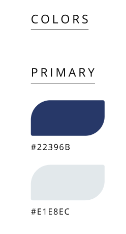</p>

Como colores secundarios se han incorporado:

<li>Amarillo vibrante (#FAB900), que aporta energía y dinamismo, asociado a la innovación y acción.

<li>Verde agua (#FFC570), que aporta frescura, equilibrio y se vincula con la sostenibilidad y el entorno natural.

<p align="center"></p>

<div style="page-break-before: always;"></div>

La paleta se completa con colores neutros:
<br>
<li>Negro azulado (#0C0C20), que proporciona contraste y fuerza visual.

<li>Blanco suave (#F6FAF9), que garantiza legibilidad y mantiene una estética limpia y profesional.

<p align="center"></p>

**Tipografia:**

La tipografía cumple un papel clave en la estructuración del contenido y en la orientación del usuario a lo largo de la interfaz. En este proyecto, se optó por el uso de la fuente Inter, seleccionada por su legibilidad y versatilidad en entornos digitales. La jerarquía visual se organiza en distintos niveles que definen claramente titulares, párrafos y elementos interactivos, asegurando una navegación fluida y coherente.

<p align="center"></p>

<div style="page-break-before: always;"></div>

**Encabezado:**

Los encabezados se dividen en tres estilos principales:
Display 1 (Bold, 40.5px) para titulares destacados.
Header 1 (Bold, 47px) para títulos principales.
Header 2 (Bold, 18px) para subtítulos o secciones intermedias.

<p align="center"></p>

**Parrafo:**

Los textos de párrafo siguen un enfoque funcional con:

Paragraph 1 (Regular, 12px) para bloques de texto estándar.
Paragraph 2 (Regular, 8px) para detalles secundarios o notas.

<p align="center"></p>

**Botones y enlaces:**

Para botones y enlaces, se utilizan estilos en negrita de 12px, diferenciando los botones en negro y los hipervínculos en verde agua, manteniendo la coherencia con la identidad cromática del sistema.

<p align="center"></p>

### 4.1.2. Web Style Guidelines

**Header**

El componente es una barra de navegacion que permite al usuario acceder a las secciones de la pagina web
<br>
<p align="center"></p>
<br>

**Botones**

Este conjunto de botones de accion, incluye opciones para descargar, exportar, denegar, aprobar, enviar y para que acceda a las redes sociales de la empresa.
<br>

<p align="center">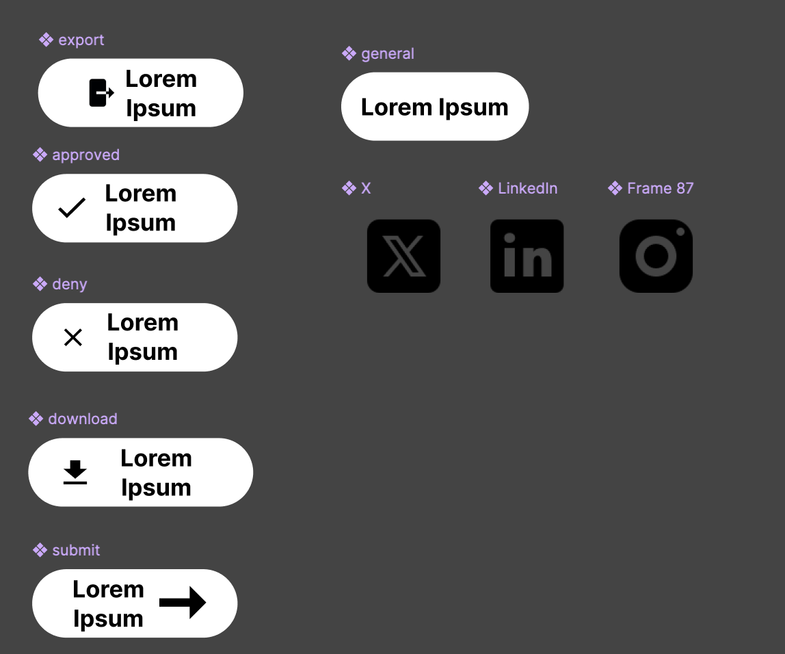</p>
<br>

**Boton internacional**

Este par de botones nos brindan la pagina web en ingles y español para que le usuario lo pueda cambiar.

<br>
<p align="center"></p>

<div style="page-break-before: always;"></div>

**Formulario**

Estos formularios son para que los usuarios se contacten con nosotros si necesitan  informacion 
<br>
<p align="center"></p>

<div style="page-break-before: always;"></div>

<div style="page-break-before: always;"></div>

## 4.2. Information Architecture

Information Architecture es el proceso de estructurar, organizar y etiquetar el contenido de un sistema digital de forma lógica y usable, facilitando la navegación, el acceso eficiente a la información y la comprensión del producto por parte del usuario. En el contexto de ProP GMS, nuestra plataforma en la nube para la gestión de proyectos de ingeniería civil, la AI es fundamental para que los usuarios puedan acceder fácilmente a funciones críticas como la planificación de tareas, el control de presupuesto, la gestión documental y la elaboración del expediente técnico.

### 4.2.1. Organization Systems

En ProP GMS, la arquitectura de la información se diseña estratégicamente para ofrecer una experiencia de usuario clara, eficiente y adaptada a tres tipos principales de usuarios: contratistas, especialistas de área y contratantes. Cada grupo accede a diferentes módulos y niveles de interacción con el sistema, lo que exige una organización inteligente del contenido tanto en su estructura visual como en su categorización.

A nivel visual, el sistema aplica una **organización jerárquica** en módulos como el dashboard principal, donde se prioriza la presentación del estado general de los proyectos, hitos relevantes y alertas. Esta jerarquía visual ayuda especialmente a los contratantes, quienes necesitan una visión panorámica para la toma de decisiones. Por otro lado, se utiliza una **organización secuencial** en flujos como la creación de organizaciones, miembros y cronogramas, siguiendo pasos lógicos que guían a los contratistas o especialistas en el ingreso de datos complejos, minimizando errores. Además, en la gestión de cronogramas y seguimiento de hitos, se incorpora una **organización matricial**, útil para comparar variables interrelacionadas como tareas, fechas y responsables, especialmente valiosa para los especialistas de área.

Respecto a la **categorización de contenido**, se utiliza un **enfoque alfabético** en elementos como nombres de organizaciones, miembros y proyectos, lo cual agiliza la búsqueda en listas extensas. En los módulos de cronogramas y control de hitos, se aplica una **organización cronológica**, lo que permite a los usuarios revisar el progreso y evolución del proyecto en orden temporal. Asimismo, se estructura el **contenido por tópicos** en áreas como la documentación técnica o la configuración de entidades, agrupando funciones similares bajo secciones claras como "Organizaciones", "Miembros", "Proyectos" y "Cronogramas". Finalmente, la **organización por audiencia** permite ofrecer vistas y funcionalidades diferenciadas: los contratistas podrán gestionar proyectos y cronogramas, los especialistas editar hitos y controlar el avance, y los contratantes visualizar informes y estados generales.

Esta combinación de **estrategias organizativas** garantiza que cada usuario encuentre lo que necesita en el momento preciso, optimizando su productividad y reduciendo la fricción en el uso del sistema. ProP GMS no solo organiza proyectos, sino que también organiza la experiencia del usuario para que sea tan robusta como intuitiva.

### 4.2.2. Labeling Systems

En este sistema, se utilizan etiquetas claras y mínimas para guiar a los usuarios —principalmente **contratistas**— a través de la plataforma, asegurando que puedan encontrar y comprender fácilmente las funcionalidades disponibles. Las etiquetas han sido seleccionadas con simplicidad y coherencia en mente, promoviendo una navegación intuitiva y evitando la sobrecarga cognitiva.

Por ejemplo, la etiqueta **Subscription** está asociada con la selección y gestión de planes. Esta etiqueta permite a los **contratistas** identificar rápidamente dónde activar o cambiar su plan actual. La etiqueta **Payments** conduce a las secciones donde los usuarios pueden visualizar y completar transacciones relacionadas con su suscripción, y se encuentra estrechamente vinculada a **Invoices** y **Subscription**.

Por su parte, **Invoices** representa el historial de facturación y las notificaciones relacionadas con cargos pendientes o completados. Los usuarios la asocian con recordatorios y el resumen financiero de su actividad. La etiqueta **Authentication** engloba funcionalidades como **Login**, **Sign up**, recuperación de contraseña y seguridad de credenciales, agrupando todos los accesos de identidad bajo un mismo concepto comprensible.

La etiqueta **Profile** indica el espacio donde los usuarios pueden editar, actualizar o gestionar su información personal y profesional. **Notifications** alerta a los usuarios sobre eventos importantes, especialmente respecto a pagos, tareas asignadas o cambios en los proyectos. **Dashboard** funciona como el centro de control donde se muestra un resumen de **Projects**, fechas clave e indicadores de desempeño.

La etiqueta **Change Requests** se utiliza para representar las solicitudes de modificación al proyecto, ya sea por parte de la entidad contratante o el equipo técnico, y está vinculada al historial de cambios y sus estados de aprobación. **Tasks** contiene la información sobre tareas asignadas, fechas límite y seguimiento del progreso, mientras que **Meetings** corresponde a la sección dedicada a las reuniones del proyecto, con una asociación directa con **Tasks** y **Schedule**.

**Schedule** agrupa **Tasks**, **Milestones** y **Meetings** dentro de un formato visual de cronograma para facilitar la planificación y seguimiento del proyecto. La etiqueta **Projects** lleva a la lista de proyectos gestionados en la plataforma. Por su parte, **Members** indica el área donde se pueden gestionar los roles y participantes de cada proyecto, y **Organization** hace referencia a la estructura organizativa detrás del usuario, incluyendo configuración de suscripción y control de acceso de los miembros.

Como ejemplo concreto de representación de datos, un proyecto puede tener distintos estados a lo largo de su ciclo de vida. Las etiquetas como **Draft**, **In progress**, **On hold**, **Cancelled** y **Completed** permiten al usuario identificar rápidamente el estado actual del proyecto. Estas etiquetas son simples, consistentes y reflejan claramente el progreso del trabajo, lo que mejora la experiencia del usuario y reduce posibles ambigüedades.

Asimismo, la etiqueta **Contact** puede aparecer en el pie de página, pero se relaciona mentalmente con contenidos como **Support**, **Help Center** o redes sociales, ayudando al usuario a anticipar qué tipo de información encontrará, aunque esté distribuida en distintas secciones del sitio.

Este sistema asegura que todos los usuarios, sin importar su nivel técnico, puedan navegar la plataforma con confianza, gracias a etiquetas predecibles y significativas que reflejan sus necesidades y objetivos.

<div style="page-break-before: always;"></div>

### 4.2.3. SEO Tags and Meta Tags

Los SEO Tags y Meta Tags son elementos fundamentales del código HTML que contribuyen significativamente al posicionamiento de un sitio web en los motores de búsqueda (SEO). Además, permiten definir cómo se muestra la información de la página cuando se comparte en redes sociales o aparece en los resultados de búsqueda de Google. A continuación, se detallan los SEO Tags y Meta Tags correspondientes a cada nivel.

<div style="font-size: 22px;">
  <strong>Landing Page</strong>
</div>

La Landing Page es la página pública principal del sitio. Su objetivo es atraer tráfico orgánico, mejorar el posicionamiento en motores de búsqueda y generar conversiones (registro, contacto, etc.). Por ello, requiere etiquetas orientadas al SEO, visibilidad y marketing digital.

**Title**

Propósito: Define el título que aparece en la pestaña del navegador y en los resultados de búsqueda.
```html
<title>Civil Engineering Project Management in the Cloud with ProP GMS</title>
```

**Meta Description**

Propósito: Resumen del contenido de la página. Aparece debajo del título en Google y afecta directamente la tasa de clics (CTR).
```html
<meta name="description" content="Optimize your civil engineering projects with our cloud-based platform. Planning, budgeting, technical files, and document management all in one place.">
```

**Meta Keywords**

Propósito: Palabras clave relacionadas con el contenido. Aunque tienen poco impacto en SEO moderno, aún se usan en algunas plataformas
```html
<meta name="keywords" content="civil engineering, project management, construction planning, budgeting, document control, cloud engineering software, technical files">
```

**Author**

Propósito: Especifica al autor del sitio o equipo de desarrollo.
```html
<meta name="author" content="Galaxia Wonder">
```

**Copyright**

Propósito: Se utiliza para informar que el conteniedo del sitio web está protegido por derechos de autor.
```html
<meta name="copyright" content="© 2025 Galaxia Wonder. All rights reserved.">
```

**Character encoding**

Propósito: Especificar la codificación de caracteres que debe utilizar el navegador al interpretar el contenido de una página HTML.
```html
<meta charset="utf-8">
```

<div style="page-break-before: always;"></div>

<div style="font-size: 22px;">
  <strong>Web Application</strong>
</div>

La Web Application es el panel privado para usuarios registrados. Aquí el enfoque no es atraer visitantes, sino mejorar la experiencia de usuario y mantener orden y estructura en la interfaz.

**Title**

Propósito: Muestra el nombre del proyecto activo o sección dentro del dashboard.
```html
<title>ProP GMS - Project Control</title>
```

**Meta Description**

Propósito: Aunque esta parte no se indexa, tener una descripción mejora la organización del contenido en navegadores o apps conectadas.
```html
<meta name="description" content="Monitor your projects, manage tasks, control budgets, and upload technical documentation from a single dashboard.">
```

**No Index**

Propósito: Evita que los motores de búsqueda indexen el dashboard privado.
```html
<meta name="robots" content="noindex, nofollow">
```

**Author**

Propósito: Especifica al autor del sitio o equipo de desarrollo.
```html
<meta name="author" content="Galaxia Wonder">
```

**Copyright**

Propósito: Se utiliza para informar que el conteniedo del sitio web está protegido por derechos de autor.
```html
<meta name="copyright" content="© 2025 Galaxia Wonder. All rights reserved.">
```

<div style="page-break-before: always;"></div>

### 4.2.4. Searching Systems

El sistema de búsqueda de **ProP GMS** ha sido diseñado para brindar a los usuarios una experiencia fluida, intuitiva y rápida a la hora de encontrar información específica dentro de un entorno con múltiples entidades y un alto volumen de datos. Las búsquedas están orientadas a tres perfiles principales de usuario: **contratistas**, **especialistas** y **entidades contratantes**, quienes interactúan con **Projects**, **Schedules**, **Teams**, **Tasks**, **Documents** y **Organizations**.

Desde la perspectiva del usuario, la funcionalidad de búsqueda busca minimizar la frustración y maximizar la eficiencia, permitiendo encontrar lo que se necesita en pocos pasos y con gran precisión.

El sistema permitirá búsquedas por texto directo. Esto significa que los usuarios podrán ingresar términos como el nombre de un **Project**, un **Organization Member** o una **Specialty**, y el sistema ofrecerá coincidencias relevantes. Por ejemplo, al escribir **Topography**, se podrán mostrar **Tasks**, **Meetings** o **Organization Members** que tengan esa especialidad.

También será posible buscar por **email** o **username**. Esta funcionalidad está especialmente pensada para facilitar la gestión de miembros en **Organizations** o **Projects**, reduciendo el tiempo que normalmente se emplea en la búsqueda manual dentro de listas extensas.

La búsqueda estará segmentada por tipo de entidad, lo cual quiere decir que el usuario podrá limitar los resultados según el contenido que necesite explorar: **Projects**, **Tasks**, **Meetings**, **Milestones**, **Organization Members**, entre otros.

Adicionalmente, el sistema contará con filtros por estado de entidad. Uno de los más importantes será el estado del proyecto (**ProjectStatus**), que ayuda al usuario a enfocar su búsqueda en proyectos que se encuentran en fases como **BASIC_STUDIES**, **DESIGN_IN_PROGRESS**, **UNDER_REVIEW**, **CHANGE_REQUESTED**, **CHANGE_PENDING** o **APPROVED**.

Otro filtro esencial será el estado de las tareas (**TaskStatus**), que permitirá a los **especialistas** y **coordinadores** ver rápidamente qué **Tasks** están en estado **DRAFT**, **PENDING**, **SUBMITTED**, **APPROVED** o **REJECTED**.

El filtro de especialidad técnica (**Specialty**) permitirá segmentar la información según disciplinas profesionales como **ARCHITECTURE**, **STRUCTURES**, **HSA**, **TOPOGRAPHY**, **SANITATION**, **ELECTRICITY** o **COMMUNICATIONS**. Esto es especialmente útil cuando se desea encontrar **Tasks** o **Organization Members** con un perfil técnico específico.

El objetivo principal del sistema de búsqueda de **ProP GMS** es que **contratistas**, **especialistas** y **entidades contratantes** accedan sin fricciones a la información crítica que necesitan, en un entorno ordenado, filtrable y accesible desde cualquier módulo del producto.

### 4.2.5. Navigation Systems

El sistema de navegación de **ProP GMS** está diseñado para guiar a los usuarios de forma intuitiva y eficiente a través de todos los componentes del producto, ya sea desde la **Landing Page** o dentro de la **Web Application**. Se ha estructurado una experiencia coherente que facilite la orientación y permita a los usuarios alcanzar sus objetivos sin fricciones.

En la **Landing Page**, se implementa una navegación clara mediante un **Header** fijo que contiene enlaces ancla hacia secciones clave como **About Us**, **Overviews**, **About the Product**, **Testimonials** y **Contact Us**, junto con una selección de idioma. El **Footer** también ofrece accesos rápidos a secciones auxiliares.

Dentro de la **Web Application**, **ProP GMS** ha sido diseñada con una estructura adaptable a los distintos perfiles de usuario: **contratistas**, **especialistas** y **entidades contratantes**. La interfaz utiliza una **Sidebar** fija que agrupa las funcionalidades principales por categoría. También se emplean **breadcrumbs** y cabeceras contextuales.

Para los **contratistas**, la navegación se centra en el control y la gestión integral de los **Projects**. Desde el módulo **Dashboard**, pueden acceder rápidamente a **Projects**, crear nuevos, asignar **Organization Members**, establecer objetivos y subir **Documents**. La navegación continúa hacia **Schedules**, **Tasks** y **Meetings**, que están interconectados dentro de cada **Project**. También tienen acceso a la gestión de **Organizations** y **Organization Members**.

Los **especialistas** comparten un flujo similar al de los **contratistas**, pero con funcionalidades ajustadas a su nivel de permisos. Desde su **Dashboard**, acceden a los **Projects** en los que participan, gestionan sus **Tasks**, asisten a **Meetings**, colaboran en el **Schedule** y actualizan su **Profile**.

Las **entidades contratantes** acceden a una navegación centrada en el monitoreo del **Project**. Desde su panel inicial, ingresan a la vista de **Projects**, consultan el avance general mediante los **Schedules**, y revisan la sección de **Change Requests** para enviar comentarios o requerimientos relacionados con entregables y fechas.

Todo el sistema ha sido diseñado para ofrecer claridad y control a los **contratistas**, facilitando una comunicación efectiva y una toma de decisiones informada por parte de las **entidades contratantes**.

<div style="page-break-before: always;"></div>

## 4.3. Landing Page UI Design

La propuesta de UI para la landing page responde a la necesidad de traducir correctamente las decisiones tomadas en la sección de arquitectura de información. Partiendo de una estructura modular, el equipo ha organizado visualmente los contenidos clave de la plataforma, priorizando la segmentación por tipo de usuario: miembros de la organización (contratista y especialista) y clientes, resaltando los beneficios principales para cada uno. Esta segmentación no solo facilita la navegación, sino que también permite adaptar el mensaje y los llamados a la acción a las necesidades específicas de cada perfil.

Para ello, se aplicaron principios establecidos en el diseño de páginas web, tales como la simplicidad visual, el uso de jerarquías tipográficas, el nivel de contraste y el diseño responsive. Estas decisiones buscan optimizar la experiencia del usuario y facilitar su recorrido por la página, asegurando una rápida comprensión de la propuesta de valor del sistema. Además, se priorizó una disposición que permita destacar funcionalidades clave vinculadas a la gestión de tareas y el seguimiento técnico, reforzando así el propósito de la interfaz.

### 4.3.1. Landing Page Wireframe

<p>Esta sección presenta los wireframes desarrollados, en sus versiones para navegador web en desktop y dispositivos móviles.</p>

**Hero - Desktop**  
<p>En esta sección se muestra el encabezado de la página. Se usó el principio de jerarquía visual y espaciado para guiar la atención del usuario.</p>
<p align="center">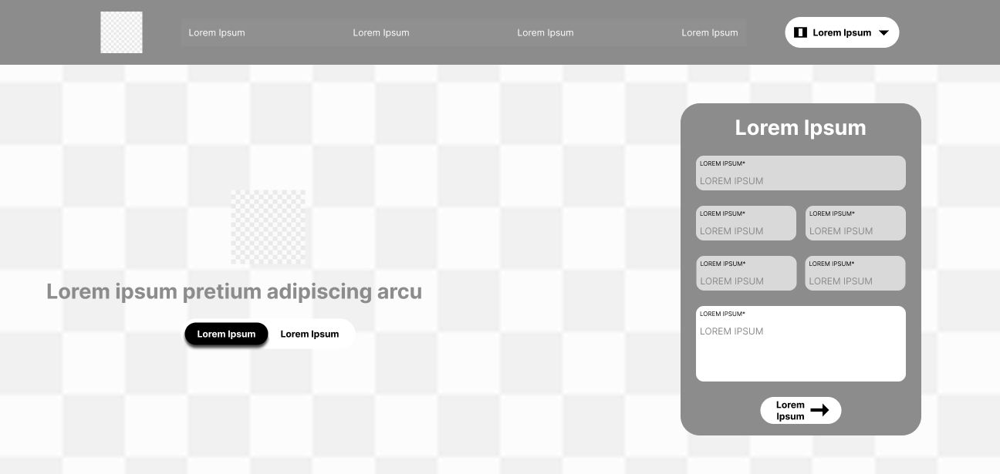</p>
<div style="page-break-before: always;"></div>

**About Us - Desktop**  
<p>En esta sección se muestra la presentación del equipo. Se aplicó alineación clara y tamaños de texto para establecer jerarquía.</p>
<p align="center"></p>
<div style="page-break-before: always;"></div>

**About the Project - Desktop**  
<p>En esta sección se muestra un video explicativo. Se usó el principio de simplicidad y reconocimiento visual.</p>
<p align="center"></p>
<div style="page-break-before: always;"></div>

**Overviews - Contractor - Desktop**  
<p>En esta sección se muestran funciones para contratistas. Se usó diseño modular y jerarquía visual en las tarjetas.</p>
<p align="center"></p>
<div style="page-break-before: always;"></div>

**Overviews - Client - Desktop**  
<p>En esta sección se muestran beneficios para clientes. Se aplicó simplicidad visual y repetición para mejorar la comprensión.</p>
<p align="center">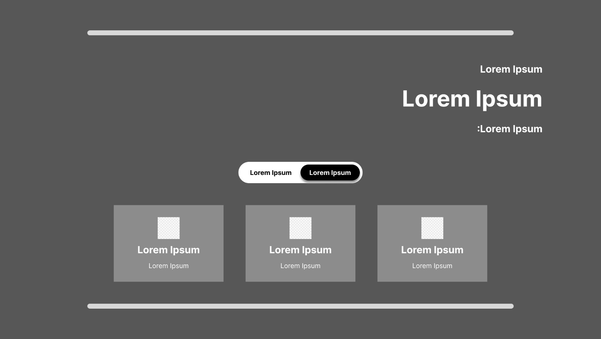</p>
<div style="page-break-before: always;"></div>

**Footer - Desktop**  
<p>En esta sección se muestra el pie de página. Se usó una estructura en columnas y se aplicó el principio de organización visual.</p>
<p align="center">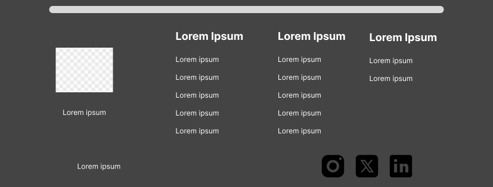</p>
<div style="page-break-before: always;"></div>

**Hero - Mobile**  
<p>En esta sección se muestra el encabezado para móvil. Se usó el principio de accesibilidad y espaciado táctil.</p>
<p align="center"></p>
<div style="page-break-before: always;"></div>

**About Us - Mobile**  
<p>En esta sección se muestra al equipo con formato vertical. Se aplicó jerarquía tipográfica y buena separación entre bloques.</p>
<p align="center"></p>
<div style="page-break-before: always;"></div>

**About the Project - Mobile**  
<p>En esta sección se muestra un video. Se usó una estructura simple para facilitar la lectura en scroll.</p>
<p align="center"></p>
<div style="page-break-before: always;"></div>

**Overviews - Contractor - Mobile**  
<p>En esta sección se muestran herramientas clave para contratistas. Se organizó en tarjetas verticales con buen espacio táctil.</p>
<p align="center"></p>
<div style="page-break-before: always;"></div>

**Overviews - Client - Mobile**  
<p>En esta sección se muestran beneficios para clientes. Se usaron tarjetas simples para navegación fácil y ordenada.</p>
<p align="center"></p>
<div style="page-break-before: always;"></div>

**Footer - Mobile**  
<p>En esta sección se muestra el pie de página en una sola columna. Se usó el principio de coherencia estructural para móviles.</p>
<p align="center">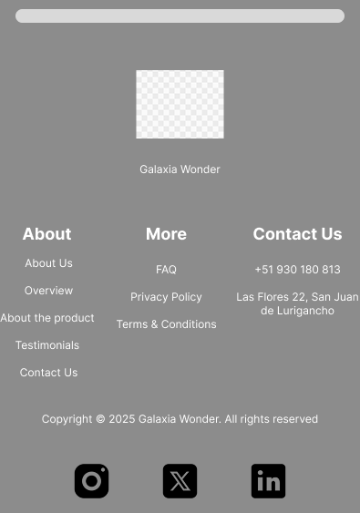</p>
<div style="page-break-before: always;"></div>

### 4.3.2. Landing Page Mock-up

<p>Esta sección presenta los mockups desarrollados, en sus versiones para navegador web en desktop y dispositivos móviles.</p>

**Hero - Desktop**  
<p>En esta sección se muestra el encabezado visual de la página con botones de acción destacados. Se usó el principio de jerarquía visual para resaltar el mensaje principal.</p>
<p align="center"></p>
<div style="page-break-before: always;"></div>

**About Us - Desktop**  
<p>En esta sección se muestra la identidad del equipo. Se aplicó el principio de coherencia visual y uso de color institucional.</p>
<p align="center">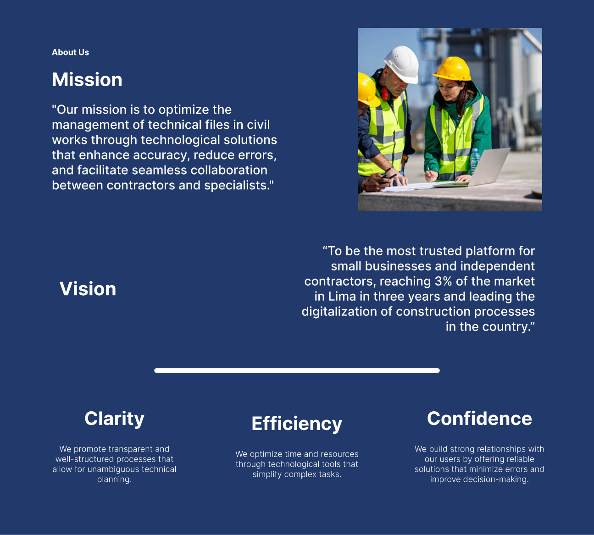</p>
<div style="page-break-before: always;"></div>

**About the Project - Desktop**  
<p>En esta sección se muestra el video explicativo del sistema. Se usó el principio de simplicidad para enfocar la atención del usuario en el contenido principal.</p>
<p align="center"></p>
<div style="page-break-before: always;"></div>

**Overviews - Contractor/Specialist - Desktop**  
<p>En esta sección se muestran las herramientas disponibles para contratistas. Se aplicó el principio de usabilidad con tarjetas claras y acciones identificables.</p>
<p align="center"></p>
<div style="page-break-before: always;"></div>

**Overviews - Client - Desktop**  
<p>En esta sección se muestran los beneficios clave para clientes. Se usó el principio de accesibilidad visual con buen contraste y textos claros.</p>
<p align="center"></p>
<div style="page-break-before: always;"></div>

**Footer - Desktop**  
<p>En esta sección se muestra el pie de página con enlaces y redes. Se aplicó el principio de coherencia para mantener la estructura del sitio.</p>
<p align="center"></p>
<div style="page-break-before: always;"></div>

**Hero - Mobile**  
<p>En esta sección se muestra el encabezado adaptado a móviles. Se usó el principio de accesibilidad para mejorar la interacción táctil.</p>
<p align="center"></p>
<div style="page-break-before: always;"></div>

**About Us - Mobile**  
<p>En esta sección se muestra la presentación del equipo en formato vertical. Se aplicó el principio de simplicidad para facilitar la lectura.</p>
<p align="center"></p>
<div style="page-break-before: always;"></div>

**About the Project - Mobile**  
<p>En esta sección se muestra un recurso audiovisual informativo. Se usó el principio de jerarquía para dar prioridad al contenido visual.</p>
<p align="center"></p>
<div style="page-break-before: always;"></div>

**Overviews - Contractor/Specialist - Mobile**  
<p>En esta sección se muestran herramientas para contratistas. Se aplicó el principio de usabilidad adaptando las tarjetas a formato scrollable.</p>
<p align="center"></p>
<div style="page-break-before: always;"></div>

**Overviews - Client - Mobile**  
<p>En esta sección se presentan beneficios para clientes. Se usó el principio de simplicidad y contraste para facilitar su comprensión en dispositivos pequeños.</p>
<p align="center"></p>
<div style="page-break-before: always;"></div>

**Footer - Mobile**  
<p>En esta sección se muestra el pie de página adaptado a móviles. Se aplicó el principio de coherencia estructural con disposición en una sola columna.</p>
<p align="center"></p>

<div style="page-break-before: always;"></div>

## 4.4. Web Applications UX/UI Design

### 4.4.1. Web Applications Wireframes. 

### 4.4.2. Web Applications Wireflow Diagrams. 

### 4.4.3. Web Applications Mock-ups. 

**Crear proyecto**


**Listar proyectos de organización**


**Editar proyecto**


**Listar hitos**


**Login**


### 4.4.4. Web Applications User Flow Diagrams. 


**1. Crear un nuevo proyecto**

- **User Goal:** Crear un proyecto en la plataforma para iniciar la planificación de su cronograma, equipo y tareas.
- **User Persona:** Contratista

**Flujo Principal (Happy Path):**
- Usuario accede al dashboard principal.
- Usuario selecciona la opción "Crear nuevo proyecto".
- Usuario completa los siguientes campos del formulario:
  - Nombre del proyecto.
  - Fecha de inicio (automáticamente el día de creación).
  - Fecha de finalización estimada.
  - Subida del contrato firmado.
  - Fecha de firma del contrato.
  - Correo de la entidad contratante.
- Usuario envía el formulario.
- El sistema valida los datos.
- El sistema crea el proyecto.
- El sistema muestra mensaje de éxito y redirige al detalle del proyecto.

**Puntos de Decisión:**
- ¿Todos los campos obligatorios fueron completados?
- ¿Fecha de finalización es válida?
- ¿Archivo del contrato adjunto?
- ¿Correo de entidad contratante válido?

**Flujos Alternativos (Unhappy Paths):**
- Campos obligatorios incompletos: mensaje de error "Debe completar todos los campos requeridos".
- Fecha de finalización anterior al inicio: error "La fecha de finalización debe ser posterior a la fecha de inicio".
- Archivo de contrato no subido: error "Debe adjuntar el contrato firmado".
- Correo inválido: error "Entidad contratante no encontrada".

**2. Consultar y visualizar lista de proyectos y sus detalles**


- **User Goal:** Consultar los proyectos accesibles para el usuario y visualizar su información general.
- **User Persona:** Miembro del equipo / Contratista

**Flujo Principal (Happy Path):**
- Usuario inicia sesión en la plataforma.
- Usuario accede a la sección "Proyectos".
- Sistema muestra la lista de proyectos accesibles, con información resumida: nombre, estado, rol del usuario.
- Usuario selecciona un proyecto de la lista.
- Sistema muestra el detalle completo del proyecto:
  - Nombre del proyecto.
  - Estado actual.
  - Fechas de inicio y finalización.
  - Entidad contratante.
  - Miembros del equipo asignado.
  - Contrato asociado (visible solo para contratistas).

**Puntos de Decisión:**
- ¿Usuario tiene permisos para ver proyectos?
- ¿Usuario pertenece al equipo del proyecto seleccionado?

**Flujos Alternativos (Unhappy Paths):**
- Usuario sin proyectos asignados: mensaje "No tienes proyectos disponibles".
- Usuario no autorizado para ver el proyecto seleccionado: error "No tienes permisos para acceder a este proyecto".

**3. Editar información general del proyecto**


- **User Goal:** Actualizar el nombre o la descripción del proyecto para reflejar cambios en el alcance o clarificaciones internas.
- **User Persona:** Contratista

**Flujo Principal (Happy Path):**
- Contratista accede al detalle del proyecto.
- Usuario selecciona la opción "Editar información general".
- Sistema despliega formulario editable con los campos actuales:
  - Nombre del proyecto.
  - Descripción del proyecto.
- Usuario realiza los cambios necesarios.
- Usuario guarda los cambios.
- Sistema valida los datos y actualiza la información.
- Sistema muestra un mensaje de éxito.

**Puntos de Decisión:**
- ¿Nuevo nombre ingresado no está vacío?
- ¿Usuario tiene permisos de edición?

**Flujos Alternativos (Unhappy Paths):**
- Nombre de proyecto vacío: error "El nombre del proyecto no puede estar vacío".
- Usuario sin permisos: error "No tienes permisos para editar este proyecto". 

**4. Cambiar constraints legales del proyecto**


- **User Goal:** Actualizar el contrato y la entidad contratante asociada al proyecto en caso de modificaciones legales o administrativas.
- **User Persona:** Contratista

**Flujo Principal (Happy Path):**
- Contratista accede al detalle del proyecto.
- Usuario selecciona la opción "Actualizar contrato y entidad contratante".
- Sistema despliega formulario para actualizar:
  - Archivo del nuevo contrato firmado.
  - Fecha de firma del nuevo contrato.
  - Nuevo correo de la entidad contratante.
- Usuario completa los campos requeridos y envía la actualización.
- Sistema valida la información.
- Sistema guarda los nuevos datos legales del proyecto.
- Sistema muestra mensaje de éxito confirmando la actualización.

**Puntos de Decisión:**
- ¿Nuevo contrato adjuntado?
- ¿Fecha de firma del contrato ingresada?
- ¿Correo de entidad contratante válido?
- ¿Usuario tiene permisos para realizar esta acción?

**Flujos Alternativos (Unhappy Paths):**
- No se adjunta contrato: error "Debe adjuntar el nuevo contrato firmado".
- Fecha de firma no ingresada: error "Debe ingresar la fecha de firma del contrato".
- Correo de entidad no válido: error "Entidad contratante no encontrada".
- Usuario sin permisos: error "No tienes permisos para actualizar los datos legales de este proyecto".

**5. Cambiar estado del proyecto**


- **User Goal:** Actualizar el estado del proyecto para reflejar su progreso o finalización.
- **User Persona:** Contratista

**Flujo Principal (Happy Path):**
- Contratista accede al detalle del proyecto.
- Usuario selecciona la opción "Cambiar estado del proyecto".
- Sistema despliega lista de estados posibles (por ejemplo: En ejecución, Finalizado, Cancelado).
- Usuario selecciona el nuevo estado deseado.
- Usuario confirma el cambio de estado.
- Sistema actualiza el estado del proyecto.
- Sistema muestra un mensaje de éxito indicando el nuevo estado.

**Puntos de Decisión:**
- ¿Nuevo estado seleccionado es válido?
- ¿Usuario tiene permisos para cambiar el estado?

**Flujos Alternativos (Unhappy Paths):**
- No se selecciona nuevo estado: error "Debe seleccionar un estado para continuar".
- Usuario sin permisos: error "No tienes permisos para cambiar el estado de este proyecto". 

**6. Eliminar proyecto**


- **User Goal:** Eliminar un proyecto que ya no será ejecutado o es innecesario conservar.
- **User Persona:** Contratista

**Flujo Principal (Happy Path):**
- Contratista accede al detalle del proyecto.
- Usuario selecciona la opción "Eliminar proyecto".
- Sistema muestra una advertencia de confirmación indicando que se eliminarán todos los recursos asociados (excepto archivos del workspace).
- Usuario debe confirmar la acción escribiendo "eliminar + nombre del proyecto" para proceder.
- Usuario envía la confirmación.
- Sistema valida la entrada.
- Sistema elimina lógicamente el proyecto (lo marca como inactivo o lo mueve a papelera).
- Sistema muestra mensaje de éxito indicando que el proyecto fue eliminado.

**Puntos de Decisión:**
- ¿Confirmación escrita correctamente?
- ¿Usuario tiene permisos para eliminar el proyecto?

**Flujos Alternativos (Unhappy Paths):**
- Confirmación incorrecta: error "El texto ingresado no coincide con el nombre del proyecto".
- Usuario sin permisos: error "No tienes permisos para eliminar este proyecto".
- Usuario cancela la operación: no se realiza ninguna acción, proyecto permanece activo.

**7. Agregar nuevos miembros al proyecto**

- **User Goal:** Incorporar nuevos miembros de la organización al equipo del proyecto, asignándoles un rol y especialidad si corresponde.
- **User Persona:** Contratista

**Flujo Principal (Happy Path):**
- Contratista accede a la sección "Equipo" dentro del detalle del proyecto.
- Usuario selecciona la opción "Agregar miembros".
- Sistema despliega lista de miembros de la organización que aún no pertenecen al proyecto.
- Usuario utiliza la barra de búsqueda para encontrar un miembro por nombre o correo si es necesario.
- Usuario selecciona uno o más miembros.
- Para cada miembro seleccionado:
  - Usuario asigna el rol (Coordinador o Especialista).
  - Si el rol es Especialista, usuario asigna la especialidad correspondiente.
- Usuario confirma la selección.
- Sistema registra la incorporación en estado pendiente de confirmación.

**Puntos de Decisión:**
- ¿Se seleccionó al menos un miembro?
- ¿Rol asignado a cada miembro?
- ¿Especialidad asignada si el rol es Especialista?

**Flujos Alternativos (Unhappy Paths):**
- No seleccionar miembros: error "Debe seleccionar al menos un miembro para agregar".
- No asignar rol: error "Debe asignar un rol a cada miembro".
- Especialidad no asignada a especialista: error "Debe asignar una especialidad si el rol es Especialista".
- Miembro ya pertenece al proyecto: el sistema impide su selección o muestra advertencia "El miembro ya es parte del proyecto". 

**8. Confirmar incorporación de miembros**

- **User Goal:** Finalizar el proceso de adición de nuevos miembros al proyecto, haciéndolos oficialmente parte del equipo.
- **User Persona:** Contratista

**Flujo Principal (Happy Path):**
- Contratista revisa la lista de miembros seleccionados para incorporación.
- Verifica que todos tengan rol y, si corresponde, especialidad asignada.
- Usuario presiona el botón "Confirmar incorporación".
- Sistema valida que toda la información esté completa.
- Sistema actualiza el equipo del proyecto agregando oficialmente a los nuevos miembros.
- Sistema muestra mensaje de éxito indicando que los miembros fueron incorporados.

**Puntos de Decisión:**
- ¿Todos los miembros tienen rol asignado?
- ¿Especialidad asignada si el rol es Especialista?

**Flujos Alternativos (Unhappy Paths):**
- Miembro sin rol: error "Todos los miembros deben tener un rol asignado".
- Especialista sin especialidad: error "Debe asignar una especialidad a todos los especialistas".
- Error de validación general: mensaje "Revise los datos antes de confirmar la incorporación". 

**9. Consultar y gestionar miembros del equipo**

- **User Goal:** Consultar la lista de miembros del proyecto y gestionar sus roles o especialidades, o eliminarlos si corresponde.
- **User Persona:** Contratista

**Flujo Principal (Happy Path):**
- Contratista accede a la sección "Equipo" dentro del detalle del proyecto.
- Sistema muestra la lista de miembros con:
  - Nombre.
  - Correo.
  - Rol asignado.
  - Especialidad (si aplica).
- Usuario puede realizar las siguientes acciones:
  - Editar rol de un miembro.
  - Editar especialidad de un miembro si su rol es Especialista.
  - Eliminar un miembro del equipo (previa confirmación).

**Puntos de Decisión:**
- ¿Usuario tiene permisos para editar o eliminar miembros?
- ¿El miembro seleccionado tiene tareas asignadas?

**Flujos Alternativos (Unhappy Paths):**
- Usuario intenta eliminar miembro con tareas asignadas: sistema muestra advertencia "Debe reasignar o eliminar tareas antes de eliminar este miembro".
- Usuario sin permisos: error "No tienes permisos para gestionar el equipo de este proyecto".
- Cancelar edición o eliminación: no se realizan cambios. 

**10. Crear un nuevo hito**


- **User Goal:** Añadir un hito al cronograma del proyecto para estructurar fases clave o entregables intermedios.
- **User Persona:** Contratista

**Flujo Principal (Happy Path):**
- Contratista accede a la sección "Cronograma" dentro del detalle del proyecto.
- Usuario selecciona la opción "Añadir hito".
- Sistema despliega formulario de creación de hito:
  - Nombre del hito.
  - Fecha de inicio.
  - Fecha de finalización.
- Usuario completa los campos y envía el formulario.
- Sistema valida la información:
  - Nombre no vacío.
  - Fechas en orden correcto.
  - Fechas dentro del rango general del proyecto.
- Sistema crea el hito.
- Sistema muestra mensaje de éxito indicando que el hito fue creado.

**Puntos de Decisión:**
- ¿Nombre del hito ingresado?
- ¿Fechas consistentes y dentro del rango permitido?
- ¿Usuario tiene permisos para crear hitos?

**Flujos Alternativos (Unhappy Paths):**
- Nombre vacío: error "El nombre del hito es obligatorio".
- Fechas inconsistentes (inicio posterior a fin): sistema ajusta automáticamente o muestra advertencia.
- Fechas fuera del rango del proyecto: error "Las fechas del hito deben estar dentro del rango del proyecto".
- Usuario sin permisos: error "No tienes permisos para añadir hitos a este proyecto".

**11. Consultar lista de hitos del proyecto**


- **User Goal:** Visualizar los hitos existentes del proyecto para conocer la estructura de su cronograma.
- **User Persona:** Miembro del proyecto

**Flujo Principal (Happy Path):**
- Usuario accede a la sección "Cronograma" dentro del detalle del proyecto.
- Sistema muestra la lista de hitos registrados, incluyendo para cada hito:
  - Nombre del hito.
  - Fecha de inicio.
  - Fecha de finalización.
- Usuario puede expandir un hito para ver las tareas asociadas si corresponde.

**Puntos de Decisión:**
- ¿Existen hitos creados en el proyecto?
- ¿Usuario tiene permisos para visualizar el cronograma?

**Flujos Alternativos (Unhappy Paths):**
- Proyecto sin hitos creados: sistema muestra mensaje "No hay hitos registrados en este proyecto".
- Usuario sin permisos: error "No tienes permisos para visualizar el cronograma de este proyecto". 

**12. Editar información de un hito**


- **User Goal:** Actualizar el nombre o las fechas de un hito para reflejar cambios en la planificación del proyecto.
- **User Persona:** Contratista

**Flujo Principal (Happy Path):**
- Contratista accede a la sección "Cronograma" del proyecto.
- Usuario selecciona el hito que desea editar.
- Usuario presiona la opción "Editar hito".
- Sistema despliega formulario editable con:
  - Nombre del hito.
  - Fecha de inicio.
  - Fecha de finalización.
- Usuario realiza las modificaciones necesarias.
- Usuario guarda los cambios.
- Sistema valida que:
  - El nombre no esté vacío.
  - Las fechas sean consistentes (inicio ≤ fin).
  - Las fechas estén dentro del rango permitido del proyecto.
- Sistema actualiza el hito y muestra mensaje de éxito.

**Puntos de Decisión:**
- ¿Nuevo nombre ingresado?
- ¿Fechas en orden correcto?
- ¿Fechas dentro del rango del proyecto?
- ¿Usuario tiene permisos para editar hitos?

**Flujos Alternativos (Unhappy Paths):**
- Nombre vacío: error "El nombre del hito es obligatorio".
- Fechas inconsistentes: sistema puede ajustar automáticamente o mostrar advertencia.
- Fechas fuera de rango: error "Las fechas del hito deben coincidir con el rango del proyecto".
- Usuario sin permisos: error "No tienes permisos para editar hitos en este proyecto". 

**13. Eliminar hito del cronograma**

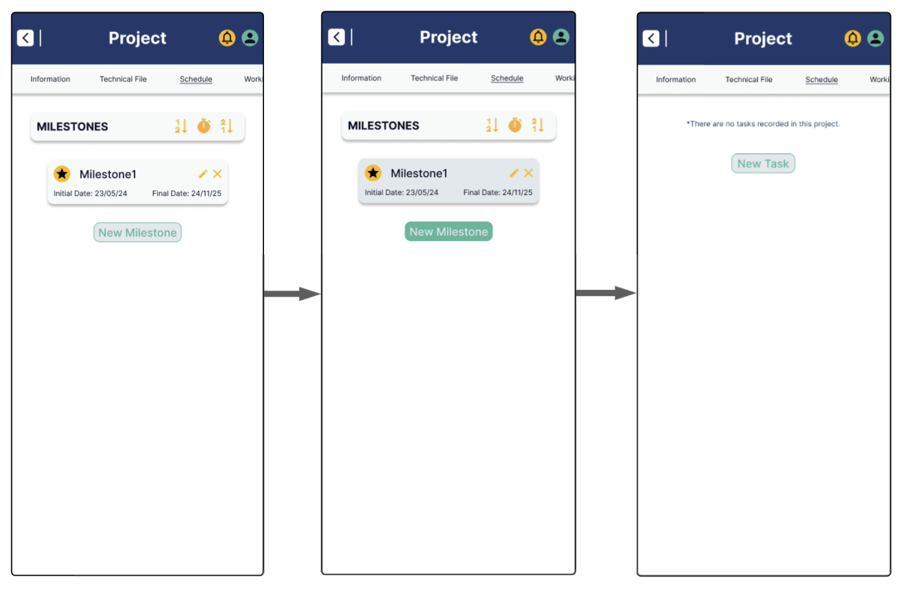

- **User Goal:** Eliminar un hito del cronograma del proyecto cuando ya no sea necesario.
- **User Persona:** Contratista

**Flujo Principal (Happy Path):**
- Contratista accede a la sección "Cronograma" del proyecto.
- Usuario selecciona el hito que desea eliminar.
- Usuario presiona la opción "Eliminar hito".
- Sistema muestra advertencia de confirmación:
  - Si el hito tiene tareas o reuniones asociadas, se informa que también serán eliminadas.
- Usuario confirma la eliminación escribiendo "eliminar + nombre del hito" para proceder.
- Sistema valida la confirmación.
- Sistema elimina el hito y los contenidos asociados si corresponde.
- Sistema muestra mensaje de éxito indicando que el hito fue eliminado.

**Puntos de Decisión:**
- ¿Hito tiene tareas o reuniones asociadas?
- ¿Confirmación escrita correctamente?
- ¿Usuario tiene permisos para eliminar hitos?

**Flujos Alternativos (Unhappy Paths):**
- Confirmación incorrecta: error "El texto ingresado no coincide con el nombre del hito".
- Usuario cancela la eliminación: no se realiza ninguna acción.
- Usuario sin permisos: error "No tienes permisos para eliminar hitos en este proyecto".

**14. Crear una nueva tarea**

- **User Goal:** Añadir una nueva tarea dentro de un hito del cronograma para organizar el trabajo del equipo.
- **User Persona:** Contratista

**Flujo Principal (Happy Path):**
- Contratista accede a la sección "Cronograma" del proyecto.
- Usuario expande el hito donde desea crear la tarea.
- Usuario selecciona la opción "Añadir tarea".
- Sistema despliega formulario para ingresar:
  - Nombre de la tarea.
  - Especialidad requerida.
  - Fecha de inicio.
  - Fecha de vencimiento.
- Usuario completa los campos y envía el formulario.
- Sistema valida:
  - Nombre no vacío.
  - Fechas en orden correcto.
  - Fechas dentro del rango del hito.
- Sistema crea la tarea en estado DRAFT.
- Sistema muestra mensaje de éxito indicando que la tarea fue creada.

**Puntos de Decisión:**
- ¿Nombre de la tarea ingresado?
- ¿Especialidad seleccionada?
- ¿Fechas consistentes y dentro del rango del hito?
- ¿Usuario tiene permisos para crear tareas?

**Flujos Alternativos (Unhappy Paths):**
- Nombre vacío: error "El nombre de la tarea es obligatorio".
- Especialidad no seleccionada: error "Debe seleccionar una especialidad".
- Fechas inconsistentes o fuera de rango: error "Las fechas deben estar dentro del rango del hito y en orden correcto".
- Usuario sin permisos: error "No tienes permisos para añadir tareas en este proyecto".

**15. Consultar lista de tareas de un hito**

- **User Goal:** Visualizar las tareas asociadas a un hito específico dentro del cronograma del proyecto.
- **User Persona:** Miembro del proyecto

**Flujo Principal (Happy Path):**
- Usuario accede a la sección "Cronograma" dentro del detalle del proyecto.
- Usuario expande el hito que desea consultar.
- Sistema muestra la lista de tareas asociadas al hito, incluyendo para cada tarea:
  - Nombre de la tarea.
  - Especialidad requerida.
  - Responsable asignado (si existe).
  - Estado de la tarea (Draft, Pending, Submitted, Reviewed).
- Usuario puede seleccionar una tarea para consultar más detalles si lo desea.

**Puntos de Decisión:**
- ¿Usuario tiene permisos para visualizar las tareas del proyecto?
- ¿Existen tareas asociadas al hito?

**Flujos Alternativos (Unhappy Paths):**
- Hito sin tareas: sistema muestra mensaje "No hay tareas registradas para este hito".
- Usuario sin permisos: error "No tienes permisos para visualizar las tareas de este proyecto". 

**16. Asignar responsable a una tarea**

- **User Goal:** Designar un miembro del equipo como responsable de una tarea para su ejecución y seguimiento.
- **User Persona:** Contratista

**Flujo Principal (Happy Path):**
- Contratista accede a la sección "Cronograma" del proyecto.
- Usuario expande el hito y localiza la tarea a asignar.
- Usuario selecciona la opción "Asignar responsable".
- Sistema despliega lista de miembros disponibles del proyecto.
- Usuario puede aplicar un filtro para mostrar solo miembros cuya especialidad coincide con la de la tarea.
- Usuario selecciona un miembro como responsable.
- Sistema actualiza la tarea asignando el responsable y cambia su estado a PENDING.
- Sistema muestra mensaje de éxito indicando que la tarea fue asignada.

**Puntos de Decisión:**
- ¿Miembro seleccionado tiene la especialidad adecuada?
- ¿Usuario tiene permisos para asignar responsables?

**Flujos Alternativos (Unhappy Paths):**
- No seleccionar responsable: error "Debe seleccionar un responsable para asignar la tarea".
- No hay miembros compatibles al aplicar filtro: mensaje "No hay miembros disponibles con la especialidad requerida".
- Usuario sin permisos: error "No tienes permisos para asignar responsables en este proyecto". 

**17. Editar información de una tarea**

- **User Goal:** Actualizar el nombre, especialidad, fechas o responsable de una tarea en función de ajustes en la planificación o el equipo.
- **User Persona:** Contratista

**Flujo Principal (Happy Path):**
- Contratista accede a la sección "Cronograma" del proyecto.
- Usuario expande el hito y localiza la tarea que desea editar.
- Usuario selecciona la opción "Editar tarea".
- Sistema despliega formulario editable para:
  - Nombre de la tarea.
  - Especialidad requerida.
  - Fecha de inicio y vencimiento.
  - Responsable asignado.
- Usuario realiza las modificaciones necesarias.
- Usuario guarda los cambios.
- Sistema valida:
  - Nombre no vacío.
  - Especialidad válida.
  - Fechas consistentes y dentro del rango del hito.
- Sistema actualiza la información de la tarea y muestra mensaje de éxito.

**Puntos de Decisión:**
- ¿Nuevo nombre ingresado?
- ¿Especialidad válida seleccionada?
- ¿Fechas consistentes y dentro del rango del hito?
- ¿Responsable actualizado cumple con la especialidad (si aplica)?
- ¿Usuario tiene permisos para editar tareas?

**Flujos Alternativos (Unhappy Paths):**
- Nombre vacío: error "El nombre de la tarea es obligatorio".
- Especialidad no seleccionada: error "Debe seleccionar una especialidad".
- Fechas inconsistentes o fuera de rango: error "Las fechas deben estar dentro del rango del hito y ser consistentes".
- Usuario sin permisos: error "No tienes permisos para editar tareas en este proyecto". 

**18. Enviar entregable de tarea**

- **User Goal:** Subir y enviar el entregable asociado a una tarea para su revisión.
- **User Persona:** Especialista

**Flujo Principal (Happy Path):**
- Especialista accede a la sección "Cronograma" del proyecto.
- Usuario expande el hito y localiza su tarea asignada.
- Usuario selecciona la opción "Enviar entregable".
- Sistema despliega formulario para:
  - Adjuntar uno o más archivos (documentos, planos, etc.).
  - Agregar comentarios adicionales si es necesario.
- Usuario adjunta archivos y escribe comentarios opcionales.
- Usuario confirma el envío del entregable.
- Sistema valida la carga de al menos un archivo.
- Sistema actualiza el estado de la tarea a SUBMITTED.
- Sistema muestra mensaje de éxito indicando que el entregable fue enviado para revisión.

**Puntos de Decisión:**
- ¿Se adjuntó al menos un archivo?
- ¿Usuario tiene permisos para enviar entregables?

**Flujos Alternativos (Unhappy Paths):**
- No adjuntar archivos: error "Debe adjuntar al menos un archivo para enviar el entregable".
- Usuario sin permisos: error "No tienes permisos para enviar entregables en esta tarea".

**19. Consultar entregables enviados**

- **User Goal:** Visualizar los entregables enviados para una tarea y consultar su estado de revisión.
- **User Persona:** Especialista / Coordinador / Contratista

**Flujo Principal (Happy Path):**
- Usuario accede a la sección "Cronograma" del proyecto.
- Usuario expande el hito y localiza la tarea deseada.
- Usuario selecciona la opción "Ver entregable" si está disponible.
- Sistema muestra los detalles del entregable:
  - Lista de archivos enviados.
  - Comentarios añadidos por el remitente.
  - Estado actual de la revisión (En revisión, Aprobado, Rechazado).
- Usuario puede descargar o previsualizar los archivos adjuntos.

**Puntos de Decisión:**
- ¿El entregable ya fue enviado?
- ¿Usuario tiene permisos para visualizar entregables?

**Flujos Alternativos (Unhappy Paths):**
- No hay entregable enviado: mensaje "Todavía no se ha enviado entregable para esta tarea".
- Usuario sin permisos: error "No tienes permisos para consultar los entregables de esta tarea".

**20. Revisar entregable enviado**

- **User Goal:** Evaluar un entregable enviado por un especialista y tomar una acción (aprobar, rechazar o solicitar ajustes).
- **User Persona:** Coordinador / Contratista

**Flujo Principal (Happy Path):**
- Usuario accede a la sección "Cronograma" del proyecto.
- Usuario expande el hito y localiza la tarea cuyo entregable desea revisar.
- Usuario selecciona la opción "Revisar entregable".
- Sistema muestra los archivos enviados y comentarios asociados.
- Usuario revisa el contenido del entregable.
- Usuario elige una acción:
  - Aprobar entregable.
  - Rechazar entregable (indicando motivos).
  - Solicitar ajustes (indicando observaciones específicas).
- Usuario confirma la acción seleccionada.
- Sistema actualiza el estado del entregable y la tarea:
  - Aprobado → tarea en estado REVIEWED.
  - Rechazado o ajustes solicitados → tarea vuelve a estado PENDING o requiere reenvío.
- Sistema muestra mensaje de éxito con la acción realizada.

**Puntos de Decisión:**
- ¿Usuario tiene permisos de revisión?
- ¿Acción seleccionada correctamente?
- ¿Comentario obligatorio en caso de rechazo o solicitud de ajustes?

**Flujos Alternativos (Unhappy Paths):**
- No seleccionar acción: error "Debe seleccionar una acción para completar la revisión".
- No ingresar comentario en rechazo o ajuste: error "Debe ingresar un comentario explicativo".
- Usuario sin permisos: error "No tienes permisos para revisar entregables en este proyecto".

**21. Presentar un Change Request**

- **User Goal:** Solicitar formalmente una modificación al proyecto mediante un Change Request.
- **User Persona:** Entidad contratante (Cliente)

**Flujo Principal (Happy Path):**
- Cliente accede al proyecto desde su cuenta en la plataforma.
- Usuario selecciona la opción "Presentar Change Request".
- Sistema despliega formulario para ingresar:
  - Título del cambio solicitado.
  - Descripción detallada del cambio.
  - Justificación del cambio.
  - Documentos adjuntos de soporte (opcional).
- Usuario completa los campos y envía la solicitud.
- Sistema valida que el título y la descripción no estén vacíos.
- Sistema crea un nuevo Change Process asociado al proyecto.
- Sistema muestra mensaje de éxito confirmando la presentación del Change Request.

**Puntos de Decisión:**
- ¿Título y descripción del cambio ingresados correctamente?
- ¿Usuario tiene permisos para presentar un Change Request?

**Flujos Alternativos (Unhappy Paths):**
- Campos obligatorios incompletos: error "Debe ingresar título y descripción para solicitar un cambio".
- Usuario sin permisos: error "No tienes permisos para presentar un Change Request en este proyecto".

**22. Presentar una Technical Query**

- **User Goal:** Formular una consulta técnica relacionada al proyecto para su evaluación y respuesta formal.
- **User Persona:** Entidad contratante (Cliente)

**Flujo Principal (Happy Path):**
- Cliente accede al proyecto desde su cuenta en la plataforma.
- Usuario selecciona la opción "Presentar Technical Query".
- Sistema despliega formulario para ingresar:
  - Título de la consulta técnica.
  - Descripción detallada de la duda o cuestión.
  - Documentos adjuntos de soporte (opcional).
- Usuario completa los campos y envía la consulta.
- Sistema valida que el título y la descripción no estén vacíos.
- Sistema crea un nuevo Change Process asociado al proyecto basado en la Technical Query.
- Sistema muestra mensaje de éxito confirmando la presentación de la Technical Query.

**Puntos de Decisión:**
- ¿Título y descripción de la consulta ingresados correctamente?
- ¿Usuario tiene permisos para presentar una Technical Query?

**Flujos Alternativos (Unhappy Paths):**
- Campos obligatorios incompletos: error "Debe ingresar título y descripción para presentar una consulta técnica".
- Usuario sin permisos: error "No tienes permisos para presentar una Technical Query en este proyecto".

**23. Consultar Change Processes creados**

- **User Goal:** Visualizar los Change Processes asociados al proyecto, su origen (Change Request o Technical Query) y su estado actual.
- **User Persona:** Coordinador / Contratista / Cliente

**Flujo Principal (Happy Path):**
- Usuario accede a la sección "Gestión de Cambios" dentro del detalle del proyecto.
- Sistema muestra la lista de Change Processes creados, incluyendo para cada uno:
  - Número o identificador.
  - Título del Change Request o Technical Query asociado.
  - Tipo de origen (Change Request o Technical Query).
  - Estado actual del Change Process (Ej: En evaluación, Aprobado, Rechazado).
- Usuario puede seleccionar un Change Process para ver su detalle completo si lo desea.

**Puntos de Decisión:**
- ¿Usuario tiene permisos para visualizar los Change Processes?
- ¿Existen Change Processes asociados al proyecto?

**Flujos Alternativos (Unhappy Paths):**
- Proyecto sin Change Processes: sistema muestra mensaje "No hay Change Processes registrados para este proyecto".
- Usuario sin permisos: error "No tienes permisos para visualizar los Change Processes de este proyecto". 

**24. Gestionar Change Order asociado**

- **User Goal:** Formalizar y gestionar la autorización de cambios en el proyecto una vez que un Change Process ha sido aprobado.
- **User Persona:** Contratista

**Flujo Principal (Happy Path):**
- Contratista accede al detalle del Change Process aprobado.
- Usuario selecciona la opción "Gestionar Change Order".
- Sistema despliega información relevante:
  - Datos del Change Process aprobado.
  - Documentación del cambio.
- Usuario genera el Change Order correspondiente:
  - Completa información adicional requerida (por ejemplo, costos, impacto en fechas si aplica).
  - Adjunta documentos oficiales (opcional).
- Usuario confirma la emisión del Change Order.
- Sistema registra el Change Order asociado al Change Process.
- Sistema actualiza el estado del Change Process indicando que ya cuenta con un Change Order emitido.
- Sistema muestra mensaje de éxito.

**Puntos de Decisión:**
- ¿Change Process está aprobado?
- ¿Usuario tiene permisos para gestionar Change Orders?

**Flujos Alternativos (Unhappy Paths):**
- Change Process no aprobado aún: error "Solo se pueden generar Change Orders de Change Processes aprobados".
- Usuario sin permisos: error "No tienes permisos para generar un Change Order en este proyecto".
- Cancelar emisión del Change Order: no se genera ningún cambio.

<div style="page-break-before: always;"></div>

## 4.5. Web Applications Prototyping

<div style="page-break-before: always;"></div>

## 4.6. Domain-Driven Software Architecture
Esta sección presenta una visión general de la arquitectura basada en DDD, desglosada en diferentes niveles de detalle que van desde el contexto general del sistema hasta los componentes más específicos que lo constituyen.

### 4.6.1. Software Architecture Context Diagram 

El sistema PropGMS es una aplicación diseñada para organizar archivos y actividades vinculadas al desarrollo de un expediente técnico en el sector de la construcción. Está orientada a contratistas independientes y pequeñas consultoras. El sistema se comunica con dos APIs externas: email para mandar notificaciones a los usuarios y una pasarela de pagos para efectuar el cobro de las suscripciones a los usuarios.


<div style="page-break-after: always;"></div>

### 4.6.2. Software Architecture Container Diagrams

El sistema PropGMS se estructura en varios contenedores que colaboran entre sí para ofrecer una experiencia fluida a los usuarios. La Web Application, desarrollada en Angular, actúa como la interfaz principal donde interactúan los distintos perfiles: contratistas que gestionan proyectos, clientes que revisan avances y especialistas que ejecutan tareas asignadas. A esta aplicación se accede desde una Landing Page pública construida con HTML, CSS y JavaScript, la cual cumple una función informativa y redirige a los usuarios hacia la plataforma principal para la creación de cuentas.

El núcleo lógico del sistema reside en una RESTful API desarrollada en Spring Boot. Esta API se encarga de procesar la lógica de negocio, responder a las peticiones del frontend y conectar con la base de datos mediante un túnel SSH seguro. Dicha base de datos, implementada en MariaDB, almacena toda la información relacionada con proyectos, usuarios, tareas, entregables y demás elementos críticos del sistema.

Además, PropGMS se comunica con dos servicios externos: una Email API, utilizada para enviar correos de validación de cuentas y notificaciones, y una Payment Gateway API, encargada de validar los pagos de suscripciones realizados por los usuarios. Toda la comunicación entre contenedores y sistemas externos se realiza mediante canales seguros como HTTPS, garantizando así la confidencialidad y la integridad de los datos.


<div style="page-break-after: always;"></div>

### 4.6.3. Software Architecture Components Diagrams

#### 4.6.3.1. Web Application Diagram

El núcleo de la aplicación, el AppComponent, actúa como el esqueleto que mantiene unida la interfaz, incluyendo navegación principal (ToolbarComponent), pie de página (FooterComponent) y el enrutamiento dinámico (RouterView) que carga componentes específicos según la navegación del usuario.

Cada funcionalidad clave del sistema, como la gestión de organizaciones, miembros, proyectos, tareas, cambios y reuniones, se orquesta a través de componentes especializados: por ejemplo, OrganizationComponent, ProjectComponent, TaskComponent y MeetingComponent, cada uno complementado por subcomponentes como listas de ítems (ListComponents) y formularios de edición (EditComponents).

Para manejar las operaciones de backend, la aplicación utiliza servicios como OrganizationService, UserService, ProjectService y otros, que abstraen la comunicación con la Web API y transforman respuestas API en modelos frontend mediante ensambladores como OrganizationAssembler o TaskAssembler.

Los flujos críticos de usuario, como autenticación (LoginComponent, RegisterComponent) y administración de suscripciones (SubscriptionComponent, BillingComponent), están centralizados en componentes dedicados, asegurando una navegación intuitiva y un acceso seguro a las funcionalidades del sistema.

Esta arquitectura basada en componentes y servicios fomenta una modularidad impecable, permitiendo que PropGMS no solo sea altamente mantenible y escalable, sino también adaptable a futuras expansiones o personalizaciones sin comprometer la estabilidad de la plataforma.


#### 4.6.3.2. API Diagram

Cada módulo de la plataforma web, como la gestión de organizaciones, proyectos o pagos, se comunica de manera segura con un controlador dedicado: OrganizationController, ProjectController, TaskController, entre otros. Estos controladores delegan la lógica de negocio a servicios internos como OrganizationService, ProjectService o PaymentService, cada uno encargado de una funcionalidad crítica del sistema, desde la administración de proyectos hasta el procesamiento de pagos.

Los servicios, a su vez, interactúan con repositorios específicos —por ejemplo, OrganizationRepository, ProjectRepository o PaymentRepository— que manejan las operaciones de lectura y escritura sobre una base de datos relacional en MariaDB, asegurando la persistencia confiable de la información.

Además, la API integra servicios externos estratégicos: NotificationService se comunica con el Email API para enviar correos electrónicos de notificaciones, mientras que PaymentService interactúa con el Payment Gateway API para validar las transacciones de pago de las suscripciones de los usuarios.

Esta organización en capas —controladores, servicios y repositorios— promueve un diseño altamente modular, testeable y escalable, permitiendo a PropGMS evolucionar de forma robusta ante futuras necesidades de crecimiento y adaptación tecnológica.


<div style="page-break-before: always;"></div>

## 4.7. Software Object-Oriented Design

### 4.7.1. Class Diagrams

Este diagrama representa una visión estructural del sistema PropGMS, destacando las entidades principales y su relación dentro del dominio. Se identifican agregados clave como Project, Milestone, Task, Meeting, TechnicalFile y Organization, los cuales capturan los conceptos fundamentales en la gestión de expedientes técnicos.

Cada entidad incluye atributos esenciales como identificadores, nombres, fechas y estados. También se aprecian relaciones de composición y agregación, por ejemplo, un Project contiene múltiples Milestones, cada uno de los cuales agrupa Tasks y Meetings. Asimismo, se muestra la vinculación entre Project y TechnicalFile, reflejando la trazabilidad entre la planificación y la documentación técnica.

El diseño enfatiza la modularidad y claridad del modelo, siendo una base sólida para la implementación orientada a objetos y la persistencia de datos.


#### 4.7.1.1. Project Management Class Diagram

Este diagrama detalla la estructura del Project Management Context dentro del sistema PropGMS, modelando entidades clave como Project, Milestone, Task y Meeting, junto con sus relaciones y comportamientos.

La clase raíz del agregado es Project, la cual agrupa atributos esenciales como nombre, presupuesto, fechas de inicio y fin, así como referencias a un contrato y un expediente técnico. Un proyecto contiene un Schedule, compuesto por varios Milestone, los cuales a su vez agrupan ScheduleItem, una abstracción que puede representar tanto reuniones (Meeting) como tareas (Task).

Cada Task incluye información sobre su especialidad, estado, fechas y el miembro del equipo responsable. Las entregas de tareas (TaskSubmission) se modelan como una entidad separada, con soporte para archivos, notas de revisión y trazabilidad de autores y revisores. Por su parte, Meeting encapsula los datos de convocatoria, participantes y tiempos de ejecución.

El modelo también contempla value objects como ProjectStatus, TaskStatus, TaskSpec y Specialty, que acotan y estructuran posibles valores del dominio. Además, se emplean fábricas para construir elementos del cronograma (ScheduleItemFactory, TaskFactory, etc.), promoviendo un diseño limpio y orientado a la creación controlada de objetos complejos.


#### 4.7.1.2. Change Management Class Diagram

Este diagrama representa la estructura del Change Management Context dentro del sistema PropGMS, el cual modela los procesos de solicitud y evaluación de cambios en un proyecto técnico.

La entidad raíz del agregado es ChangeProcess, que encapsula tanto el origen del cambio (ChangeOrigin), su estado (ChangeProcessStatus) y la justificación del mismo, como también información sobre su aprobación, rechazo y cualquier orden de cambio (ChangeOrder) o respuesta oficial (ChangeResponse). Un proceso de cambio puede iniciarse a partir de una ChangeRequest realizada por la entidad contratante o una TechnicalQuery por parte del residente de obra.

El modelo contempla value objects que acotan claramente los posibles estados (PENDING, APPROVED, REJECTED) y tipos de origen (CHANGE_REQUEST, TECHNICAL_QUERY). Además, se provee una fábrica (ChangeProcessFactory) que permite construir el agregado de manera controlada según el tipo de solicitud original.


#### 4.7.1.3. Organization Class Diagram

Este diagrama representa la estructura del Organization Context, donde se modelan las entidades responsables de la gestión de organizaciones dentro de PropGMS. La clase Organization actúa como raíz del agregado, incluyendo atributos clave como razón social, nombre comercial, RUC, creador y estado.

El proceso de incorporación de nuevos miembros se gestiona a través de la entidad OrganizationInvitation, que registra quién invita, a quién se invita, cuándo, y en qué estado se encuentra la invitación (PENDING, ACCEPTED, REJECTED). Este mecanismo permite un control claro y seguro del acceso organizacional.


#### 4.7.1.4. Notification Class Diagram

El diagrama muestra la estructura del Notifications Bounded Context, donde se modela la gestión de notificaciones dentro de PropGMS. La clase Notification es la raíz del agregado y contiene los campos necesarios para identificar al receptor, el contenido del mensaje, su fecha de creación y la categoría (NotificationCategory), que puede ser informativa, de alerta, recordatorio o del sistema.

Cada notificación está asociada a un objetivo específico mediante el value object NotificationTarget, el cual define tanto el identificador como el tipo del recurso al que hace referencia (NotificationTargetType). Estos tipos abarcan una variedad de entidades del sistema, como tareas, reuniones, cambios, proyectos, y más, permitiendo una alta contextualización de los avisos.


#### 4.7.1.5. File Class Diagram

Este diagrama modela la gestión de archivos dentro del sistema PropGMS, organizada en torno al contexto de archivos (Files Management Context). La clase File es la raíz del agregado y representa un archivo digital individual, incluyendo metadatos como nombre, tamaño, tipo MIME, URL y fecha de carga. Cada archivo está asociado a un workspace y a un miembro de la organización que lo subió.

La clase FileReference actúa como un vínculo lógico entre los archivos y los elementos del sistema que los utilizan, como contratos, carpetas técnicas o entregas de tareas. Esta referencia se define mediante el value object ReferenceSource, que encapsula tanto el identificador del objeto de origen como su tipo (ReferenceSourceType), permitiendo identificar claramente el propósito del archivo dentro del dominio.

Además, se modela la entidad Folder, la cual organiza referencias a archivos dentro de una jerarquía flexible, permitiendo carpetas anidadas mediante un parentId opcional. Esta estructura favorece la gestión ordenada y segmentada de documentos técnicos.


#### 4.7.1.6. IAM Class Diagram

Este diagrama representa el IAM Bounded Context del sistema PropGMS, encargado de gestionar el acceso y la identidad de los usuarios. La clase principal es UserAccount, la cual actúa como Aggregate Root y almacena datos como nombre de usuario, hash de contraseña, tipo de usuario (UserType), estado de la cuenta (AccountStatus) y referencias al objeto Person.

El proceso de registro se inicia a través de RegistrationRequest, que almacena la solicitud de creación de cuenta, incluyendo el correo electrónico, nombre completo, y el estado de la confirmación (RegistrationRequestStatus). La clase UserAccountFactory se encarga de transformar esta solicitud en una cuenta activa mediante un método de creación controlada.

Para la autenticación y manejo de sesiones, se utilizan objetos como AuthToken, Session y PasswordResetToken, que controlan el ciclo de vida de una sesión activa, la recuperación de cuentas y la validez de los tokens. Además, el value object Credentials encapsula el ingreso de usuario y contraseña.

Finalmente, la entidad Person representa a los individuos registrados, incluyendo datos personales como nombre, correo, teléfono, profesión y estado. Esto permite mantener separada la lógica de autenticación de la información del usuario como persona física o jurídica.


#### 4.7.1.7. Subscription Class Diagram

Este diagrama modela el Subscription Bounded Context del sistema PropGMS, encargado de gestionar las suscripciones de organizaciones a los planes del sistema. La clase Subscription actúa como Aggregate Root, e incluye información relevante como fechas de inicio y fin, estado (SubscriptionStatus), si se renueva automáticamente, y la tarifa asociada.

Cada suscripción está ligada a un SubscriptionPlan, el cual define los parámetros del plan como su nombre, duración, precio, límites de miembros, proyectos y almacenamiento, así como las características incluidas.

La clase Workspace, que representa el espacio digital de trabajo de una organización, mantiene una relación directa con la suscripción activa, reflejando los límites aplicables según el plan adquirido. Este vínculo garantiza que los recursos disponibles estén directamente controlados por el tipo de suscripción vigente.

El modelo también incluye un conjunto de estados para la suscripción (ACTIVE, EXPIRED, CANCELLED, PENDING_PAYMENT), y métodos que permiten controlar su ciclo de vida: renovación, cancelación, activación y expiración.


#### 4.7.1.8. Billing Class Diagram

Este diagrama representa la estructura del Billing Bounded Context de PropGMS, encargado de modelar el proceso de facturación dentro del sistema. La clase Invoice encapsula una factura generada a un usuario (payer), e incluye atributos clave como el monto total, fechas de emisión y vencimiento, y el estado del pago (PaymentStatus), que puede ir desde PENDING hasta PAID.

Cada factura puede incluir múltiples ítems de facturación representados por la clase BillingItem, donde se detallan los conceptos facturados, su precio unitario y el subtotal calculado. La relación uno a muchos entre Invoice y BillingItem permite una descomposición clara de los cobros.

El diseño incluye métodos para calcular montos totales, marcar facturas como pagadas y validar si se encuentran vencidas. Esto proporciona un control preciso sobre el estado financiero de cada organización dentro de la plataforma.


#### 4.7.1.9. Payment Class Diagram

Este diagrama modela el Payments Bounded Context de PropGMS, centrado en la gestión de pagos y transacciones vinculadas a facturas. La clase principal Payment actúa como Aggregate Root e incluye información como el monto, método de pago (PaymentMethodType), fecha de pago, estado (PaymentStatus) y una posible relación con un acuerdo de pago recurrente (RecurringPaymentAgreement).

Cada pago puede generar múltiples Transaction, que registran intentos de cobro, la fecha en que se realizaron, su estado (TransactionStatus) y la respuesta del gateway. Esta relación permite gestionar fallos o reintentos de manera robusta.

El modelo incluye soporte para pagos recurrentes, encapsulados en RecurringPaymentAgreement, donde se definen la frecuencia, método, fechas clave y el estado de activación. Esto facilita la automatización de cobros en suscripciones periódicas.

Los estados de pago (PENDING, AUTHORIZED, CONFIRMED, FAILED) y de transacción (INITIATED, SUCCESS, FAILURE) permiten un seguimiento detallado del flujo de fondos en la plataforma.


<div style="page-break-after: always;"></div>

### 4.7.2. Class Dictionary

#### 4.7.2.1. Project Management Class Dictionary

Este diccionario describe las clases involucradas en la gestión de proyectos dentro del sistema PropGMS.

**Class:** `Project`
- **Type**: Aggregate Root
- **Description**: Representa un proyecto de construcción y actúa como el punto central de coordinación del contrato, cronograma, tareas, reuniones y equipo.

| Attribute         | Type                    | Description                                                  |
|-------------------|-------------------------|--------------------------------------------------------------|
| id                | ProjectId               | Identificador único del proyecto                             |
| name              | String                  | Nombre del proyecto                                          |
| description       | String                  | Descripción del proyecto                                     |
| contract          | Contract                | Contrato asociado                                            |
| technicalFile     | TechnicalFile           | Expediente técnico asociado                                  |
| status            | ProjectStatus           | Estado actual del proyecto                                   |
| schedule          | Schedule                | Cronograma del proyecto con sus hitos                        |
| budget            | Money                   | Presupuesto total del proyecto                               |
| startingDate      | DateTime                | Fecha de inicio del proyecto                                 |
| endingDate        | DateTime                | Fecha de finalización del proyecto                           |
| team              | List<ProjectTeamMember> | Miembros asignados al proyecto                               |
| organizationId    | OrganizationId          | Organización propietaria del proyecto                        |
| contractor        | OrganizationMemberId    | Contratista líder                                            |
| contractingEntityId | ContractingEntityId   | Entidad contratante                                          |
| activeChangeProcessId | ChangeProcessId?     | Proceso de cambio activo (si existe)                         |

| Method                          | Return Type | Description                                                 |
|----------------------------------|-------------|-------------------------------------------------------------|
| updateStatus(newStatus)         | void        | Actualiza el estado del proyecto                            |
| updateDescription(name, desc)   | void        | Actualiza el nombre y descripción del proyecto              |
| addTeamMember(member)           | void        | Añade un miembro al equipo del proyecto                     |
| removeTeamMember(memberId)      | void        | Elimina un miembro del equipo del proyecto                  |

---

**Class:** `Milestone`
- **Type**: Entity
- **Description**: Representa un hito clave dentro del cronograma del proyecto.

| Attribute   | Type                    | Description                            |
|-------------|-------------------------|----------------------------------------|
| id          | MilestoneId             | Identificador único del hito           |
| name        | String                  | Nombre del hito                        |
| startDate   | DateTime                | Fecha de inicio del hito               |
| endDate     | DateTime                | Fecha de finalización del hito         |
| items       | List<ScheduleItem>      | Elementos programados dentro del hito  |

| Method                          | Return Type | Description                                       |
|----------------------------------|-------------|---------------------------------------------------|
| update(name, start, end)         | void        | Actualiza la información del hito                 |
| addItem(item)                    | void        | Añade un elemento al hito                         |
| removeItem(itemId)               | void        | Elimina un elemento del hito                      |

---

**Class:** `Task`
- **Type**: Entity
- **Description**: Representa una unidad de trabajo asignada a un miembro del equipo del proyecto.

| Attribute         | Type                      | Description                                 |
|-------------------|---------------------------|---------------------------------------------|
| id                | TaskId                    | Identificador único de la tarea             |
| name              | String                    | Nombre de la tarea                          |
| specialty         | Specialty                 | Especialidad técnica de la tarea            |
| status            | TaskStatus                | Estado actual de la tarea                   |
| startingDate      | DateTime                  | Fecha de inicio de la tarea                 |
| dueDate           | DateTime                  | Fecha límite de la tarea                    |
| submission        | TaskSubmission?           | Entrega asociada a la tarea (si aplica)     |
| responsible       | ProjectTeamMemberId?      | Miembro del equipo responsable              |

| Method                          | Return Type | Description                                |
|----------------------------------|-------------|--------------------------------------------|
| getStartDate()                  | DateTime    | Devuelve la fecha de inicio de la tarea    |
| getDueDate()                    | DateTime    | Devuelve la fecha límite de la tarea       |
| assignResponsible(memberId)     | void        | Asigna un responsable a la tarea           |
| updateStatus(newStatus)         | void        | Actualiza el estado de la tarea            |

#### 4.7.2.2. Change Management Class Dictionary

Este diccionario describe las clases involucradas en la gestión de cambios dentro del sistema PropGMS.

**Class:** `ChangeProcess`
- **Type**: Aggregate Root
- **Description**: Representa un proceso de cambio en un proyecto, que puede originarse por una solicitud del cliente o por una consulta técnica.

| Attribute               | Type                      | Description                                                    |
|-------------------------|---------------------------|----------------------------------------------------------------|
| id                      | ChangeProcessId           | Identificador único del proceso de cambio                      |
| origin                  | ChangeOrigin              | Origen del cambio (solicitud o consulta técnica)              |
| status                  | ChangeProcessStatus       | Estado actual del proceso de cambio                            |
| justification           | String                    | Justificación del cambio                                       |
| approvalNotes           | String?                   | Notas de aprobación (si aplica)                                |
| rejectionReason         | String?                   | Razón del rechazo (si aplica)                                  |
| response                | ChangeResponse?           | Respuesta formal emitida                                       |
| changeOrder             | ChangeOrder?              | Orden de cambio generada                                      |
| createdBy               | PersonId                  | Persona que inició el proceso                                  |
| createdAt               | DateTime                  | Fecha de creación del proceso                                  |

| Method                          | Return Type | Description                                               |
|----------------------------------|-------------|-----------------------------------------------------------|
| approve(notes)                  | void        | Aprueba el cambio con notas                               |
| reject(reason)                  | void        | Rechaza el cambio con una razón                           |
| attachChangeOrder(order)        | void        | Asocia una orden de cambio al proceso                     |
| respond(response)               | void        | Adjunta una respuesta al proceso                          |

---

**Class:** `ChangeRequest`
- **Type**: Entity
- **Description**: Representa una solicitud de cambio realizada por la entidad contratante.

| Attribute   | Type          | Description                                |
|-------------|---------------|--------------------------------------------|
| id          | UUID          | Identificador único de la solicitud        |
| description | String        | Descripción detallada del cambio solicitado|
| createdBy   | PersonId      | Persona que realizó la solicitud           |
| createdAt   | DateTime      | Fecha de creación de la solicitud          |

---

**Class:** `TechnicalQuery`
- **Type**: Entity
- **Description**: Representa una consulta técnica que puede generar un proceso de cambio.

| Attribute   | Type          | Description                                     |
|-------------|---------------|-------------------------------------------------|
| id          | UUID          | Identificador único de la consulta              |
| description | String        | Detalle de la consulta técnica                  |
| createdBy   | PersonId      | Persona que emitió la consulta                  |
| createdAt   | DateTime      | Fecha de creación de la consulta                |

---

**Class:** `ChangeResponse`
- **Type**: Value Object
- **Description**: Representa la respuesta oficial a un proceso de cambio.

| Attribute   | Type      | Description                            |
|-------------|-----------|----------------------------------------|
| content     | String    | Contenido de la respuesta              |
| createdAt   | DateTime  | Fecha de emisión de la respuesta       |

---

**Class:** `ChangeOrder`
- **Type**: Value Object
- **Description**: Representa una orden de cambio formal asociada a un proceso de cambio aprobado.

| Attribute     | Type      | Description                           |
|---------------|-----------|---------------------------------------|
| summary       | String    | Resumen del cambio autorizado         |
| issuedBy      | PersonId  | Persona que emite la orden            |
| issuedAt      | DateTime  | Fecha de emisión de la orden          |

#### 4.7.2.3. Organization Class Dictionary

Este diccionario describe las clases involucradas en la gestión de organizaciones dentro del sistema PropGMS.

**Class:** `Organization`
- **Type**: Aggregate Root
- **Description**: Representa una organización dentro del sistema, encargada de gestionar proyectos y equipos de trabajo.

| Attribute             | Type                       | Description                                               |
|-----------------------|----------------------------|-----------------------------------------------------------|
| id                    | OrganizationId             | Identificador único de la organización                    |
| legalName             | String                     | Razón social de la organización                           |
| commercialName        | String                     | Nombre comercial de la organización                       |
| ruc                   | Ruc                        | Número de RUC                                             |
| createdBy             | PersonId                   | Persona que registró la organización                      |
| createdAt             | DateTime                   | Fecha de creación                                         |
| status                | OrganizationStatus         | Estado actual de la organización                          |
| members               | List<OrganizationMember>   | Miembros de la organización                               |

| Method                          | Return Type | Description                                               |
|----------------------------------|-------------|-----------------------------------------------------------|
| activate()                      | void        | Activa la organización                                   |
| deactivate()                    | void        | Desactiva la organización                                |
| addMember(member)               | void        | Añade un nuevo miembro a la organización                 |
| removeMember(memberId)          | void        | Elimina un miembro de la organización                    |

---

**Class:** `OrganizationMember`
- **Type**: Entity
- **Description**: Representa a un miembro dentro de una organización.

| Attribute     | Type                     | Description                                       |
|---------------|--------------------------|---------------------------------------------------|
| id            | OrganizationMemberId     | Identificador del miembro                        |
| personId      | PersonId                 | Referencia a la persona                          |
| type          | OrganizationMemberType   | Rol del miembro (CONTRACTOR, WORKER)             |
| joinedAt      | DateTime                 | Fecha de incorporación a la organización         |

---

**Class:** `OrganizationInvitation`
- **Type**: Entity
- **Description**: Representa una invitación enviada a una persona para unirse a una organización.

| Attribute     | Type                     | Description                                           |
|---------------|--------------------------|-------------------------------------------------------|
| id            | UUID                     | Identificador único de la invitación                 |
| invitedBy     | OrganizationMemberId     | Miembro que realiza la invitación                   |
| email         | String                   | Correo de la persona invitada                       |
| status        | InvitationStatus         | Estado de la invitación (PENDING, ACCEPTED, REJECTED)|
| createdAt     | DateTime                 | Fecha de creación de la invitación                  |

#### 4.7.2.4. Notifications Class Dictionary

Este diccionario describe las clases involucradas en la gestión de notificaciones dentro del sistema PropGMS.

**Class:** `Notification`
- **Type**: Aggregate Root
- **Description**: Representa una notificación enviada a un usuario sobre eventos relevantes dentro del sistema.

| Attribute         | Type                       | Description                                               |
|-------------------|----------------------------|-----------------------------------------------------------|
| id                | NotificationId             | Identificador único de la notificación                    |
| recipientId       | PersonId                   | Identificador del destinatario de la notificación         |
| content           | String                     | Contenido del mensaje de la notificación                  |
| category          | NotificationCategory       | Categoría de la notificación (ej. alerta, recordatorio)   |
| isRead            | Boolean                    | Indica si la notificación ha sido leída                   |
| createdAt         | DateTime                   | Fecha de creación de la notificación                      |
| target            | NotificationTarget         | Objeto de referencia relacionado con la notificación      |

---

**Class:** `NotificationTarget`
- **Type**: Value Object
- **Description**: Representa el objetivo al que está asociada una notificación (como una tarea, reunión, proyecto, etc.).

| Attribute     | Type                     | Description                                           |
|---------------|--------------------------|-------------------------------------------------------|
| id            | UUID                     | Identificador del objeto relacionado                 |
| type          | NotificationTargetType   | Tipo de objeto relacionado                           |

---

**Class:** `NotificationCategory`
- **Type**: Value Object
- **Description**: Define la categoría de una notificación.

| Attribute   | Type     | Description                          |
|-------------|----------|--------------------------------------|
| value       | String   | Valor que representa la categoría    |

#### 4.7.2.5. Files Management Class Dictionary

Este diccionario describe las clases involucradas en la gestión de archivos dentro del sistema PropGMS.

**Class:** `File`
- **Type**: Aggregate Root
- **Description**: Representa un archivo digital almacenado en el sistema, incluyendo metadatos relevantes.

| Attribute         | Type               | Description                                          |
|-------------------|--------------------|------------------------------------------------------|
| id                | FileId             | Identificador único del archivo                     |
| name              | String             | Nombre del archivo                                  |
| mimeType          | String             | Tipo MIME del archivo                               |
| size              | Int                | Tamaño del archivo en bytes                         |
| uploadedAt        | DateTime           | Fecha de carga del archivo                          |
| uploadedBy        | OrganizationMemberId | Miembro que subió el archivo                      |
| url               | String             | URL de acceso al archivo                            |
| workspaceId       | WorkspaceId        | Espacio de trabajo al que pertenece el archivo      |

---

**Class:** `FileReference`
- **Type**: Entity
- **Description**: Representa una referencia a un archivo desde otro elemento del sistema, como un contrato o tarea.

| Attribute     | Type               | Description                                          |
|---------------|--------------------|------------------------------------------------------|
| id            | UUID               | Identificador de la referencia                      |
| fileId        | FileId             | Identificador del archivo referenciado              |
| source        | ReferenceSource    | Fuente que origina la referencia                    |

---

**Class:** `ReferenceSource`
- **Type**: Value Object
- **Description**: Describe el objeto del sistema desde el cual se está referenciando un archivo.

| Attribute   | Type                 | Description                                     |
|-------------|----------------------|-------------------------------------------------|
| id          | UUID                 | Identificador del objeto origen                |
| type        | ReferenceSourceType  | Tipo del objeto origen                         |

---

**Class:** `Folder`
- **Type**: Entity
- **Description**: Representa una carpeta que organiza referencias de archivos de forma jerárquica.

| Attribute     | Type      | Description                                        |
|---------------|-----------|----------------------------------------------------|
| id            | UUID      | Identificador único de la carpeta                 |
| name          | String    | Nombre de la carpeta                              |
| parentId      | UUID?     | Identificador de la carpeta superior (si existe)  |
| createdBy     | PersonId  | Persona que creó la carpeta                       |
| createdAt     | DateTime  | Fecha de creación de la carpeta                   |

#### 4.7.2.6. Identity and Access Management Class Dictionary

Este diccionario describe las clases involucradas en la gestión de identidad y acceso dentro del sistema PropGMS.

**Class:** `UserAccount`
- **Type**: Aggregate Root
- **Description**: Representa una cuenta de usuario dentro del sistema, incluyendo sus credenciales, rol y estado.

| Attribute     | Type             | Description                                           |
|---------------|------------------|-------------------------------------------------------|
| id            | UserId           | Identificador único de la cuenta                     |
| fullName      | FullName         | Nombre completo del usuario                          |
| email         | Email            | Correo electrónico del usuario                       |
| passwordHash  | String           | Hash de la contraseña                                |
| role          | Role             | Rol del usuario en el sistema                        |
| status        | AccountStatus    | Estado actual de la cuenta                           |

| Method                          | Return Type | Description                                              |
|----------------------------------|-------------|----------------------------------------------------------|
| activate()                      | void        | Activa la cuenta de usuario                             |
| deactivate()                    | void        | Desactiva la cuenta de usuario                          |
| block()                         | void        | Bloquea la cuenta de usuario                            |
| changePassword(newHash)        | void        | Cambia la contraseña de la cuenta                       |
| updateEmail(newEmail)          | void        | Actualiza el correo electrónico del usuario             |

---

**Class:** `RegistrationRequest`
- **Type**: Entity
- **Description**: Representa una solicitud de registro pendiente de confirmación.

| Attribute     | Type                   | Description                                        |
|---------------|------------------------|----------------------------------------------------|
| id            | UUID                   | Identificador único de la solicitud               |
| fullName      | FullName               | Nombre completo del solicitante                  |
| email         | Email                  | Correo electrónico del solicitante               |
| status        | RegistrationRequestStatus | Estado de la solicitud de registro            |
| createdAt     | DateTime               | Fecha de creación de la solicitud                 |

---

**Class:** `Person`
- **Type**: Entity
- **Description**: Representa a una persona dentro del sistema, vinculada a una cuenta.

| Attribute     | Type          | Description                                  |
|---------------|---------------|----------------------------------------------|
| id            | PersonId      | Identificador único de la persona           |
| fullName      | FullName      | Nombre completo                             |
| email         | Email         | Correo electrónico                          |
| phone         | Phone         | Número de teléfono                          |
| profession    | Profession?   | Profesión (si es aplicable)                 |
| status        | PersonStatus  | Estado actual de la persona                 |

---

**Class:** `AuthToken`
- **Type**: Entity
- **Description**: Representa un token de autenticación generado para un usuario.

| Attribute   | Type       | Description                                 |
|-------------|------------|---------------------------------------------|
| token       | String     | Token de acceso                             |
| issuedAt    | DateTime   | Fecha de emisión del token                  |
| expiresAt   | DateTime   | Fecha de expiración del token               |

---

**Class:** `Session`
- **Type**: Entity
- **Description**: Representa una sesión activa del usuario en el sistema.

| Attribute     | Type      | Description                            |
|---------------|-----------|----------------------------------------|
| id            | UUID      | Identificador de la sesión             |
| userId        | UserId    | Usuario asociado a la sesión           |
| createdAt     | DateTime  | Fecha de inicio de la sesión           |
| expiredAt     | DateTime  | Fecha de expiración de la sesión       |

---

**Class:** `PasswordResetToken`
- **Type**: Entity
- **Description**: Token utilizado para restablecer la contraseña de una cuenta.

| Attribute   | Type       | Description                                   |
|-------------|------------|-----------------------------------------------|
| token       | String     | Token único de restablecimiento               |
| userId      | UserId     | Cuenta asociada al token                      |
| expiresAt   | DateTime   | Fecha de expiración del token                 |

#### 4.7.2.7. Subscription Class Dictionary

Este diccionario describe las clases involucradas en la gestión de suscripciones dentro del sistema PropGMS.

**Class:** `Subscription`
- **Type**: Aggregate Root
- **Description**: Representa una suscripción activa o pasada que una organización ha adquirido para acceder a funcionalidades del sistema.

| Attribute         | Type                      | Description                                               |
|-------------------|---------------------------|-----------------------------------------------------------|
| id                | SubscriptionId            | Identificador único de la suscripción                     |
| plan              | SubscriptionPlan          | Plan asociado a la suscripción                            |
| status            | SubscriptionStatus        | Estado actual de la suscripción                           |
| startDate         | DateTime                  | Fecha de inicio de la suscripción                         |
| endDate           | DateTime                  | Fecha de fin de la suscripción                            |
| autoRenew         | Boolean                   | Indica si la suscripción se renovará automáticamente      |
| price             | Money                     | Precio de la suscripción                                  |
| assignedWorkspace | WorkspaceId               | Workspace asociado a esta suscripción                     |

| Method                          | Return Type | Description                                               |
|----------------------------------|-------------|-----------------------------------------------------------|
| activate()                      | void        | Activa la suscripción                                     |
| cancel()                        | void        | Cancela la suscripción                                    |
| renew()                         | void        | Renueva la suscripción si está activa                     |
| expire()                        | void        | Marca la suscripción como expirada                        |

---

**Class:** `SubscriptionPlan`
- **Type**: Entity
- **Description**: Define un plan de suscripción con su configuración y límites.

| Attribute             | Type     | Description                                                |
|-----------------------|----------|------------------------------------------------------------|
| id                    | PlanId   | Identificador del plan                                     |
| name                  | String   | Nombre del plan                                            |
| durationInDays        | Int      | Duración del plan en días                                  |
| price                 | Money    | Precio del plan                                            |
| maxMembers            | Int      | Límite de miembros permitidos                              |
| maxProjects           | Int      | Límite de proyectos permitidos                             |
| maxStorageMB          | Int      | Límite de almacenamiento en MB                             |
| features              | List<String> | Lista de características incluidas en el plan         |

---

**Class:** `Workspace`
- **Type**: Entity
- **Description**: Representa el espacio digital de trabajo asignado a una organización.

| Attribute     | Type          | Description                                      |
|---------------|---------------|--------------------------------------------------|
| id            | WorkspaceId   | Identificador único del workspace               |
| name          | String        | Nombre del workspace                            |
| ownerId       | OrganizationId| Organización propietaria del workspace          |
| currentSubscription | SubscriptionId? | Suscripción actualmente activa              |

#### 4.7.2.8. Billing Class Dictionary

Este diccionario describe las clases involucradas en la gestión de facturación dentro del sistema PropGMS.

**Class:** `Invoice`
- **Type**: Aggregate Root
- **Description**: Representa una factura generada por el sistema para una organización o usuario.

| Attribute         | Type              | Description                                              |
|-------------------|-------------------|----------------------------------------------------------|
| id                | InvoiceId         | Identificador único de la factura                       |
| payer             | PersonId          | Persona responsable del pago                            |
| issuedAt          | DateTime          | Fecha de emisión de la factura                          |
| dueDate           | DateTime          | Fecha de vencimiento de la factura                      |
| status            | PaymentStatus     | Estado actual del pago de la factura                    |
| items             | List<BillingItem> | Ítems incluidos en la factura                           |

| Method                          | Return Type | Description                                               |
|----------------------------------|-------------|-----------------------------------------------------------|
| calculateTotal()                | Money       | Calcula el monto total de la factura                      |
| markAsPaid()                    | void        | Marca la factura como pagada                              |
| isOverdue()                     | boolean     | Verifica si la factura se encuentra vencida               |

---

**Class:** `BillingItem`
- **Type**: Entity
- **Description**: Representa un ítem específico dentro de una factura.

| Attribute   | Type     | Description                          |
|-------------|----------|--------------------------------------|
| name        | String   | Nombre del ítem                      |
| unitPrice   | Money    | Precio unitario del ítem             |
| quantity    | Int      | Cantidad facturada                   |
| subtotal    | Money    | Subtotal calculado                   |

#### 4.7.2.9. Payments Class Dictionary

Este diccionario describe las clases involucradas en la gestión de pagos dentro del sistema PropGMS.

**Class:** `Payment`
- **Type**: Aggregate Root
- **Description**: Representa un pago realizado para una factura específica.

| Attribute         | Type                          | Description                                                |
|-------------------|-------------------------------|------------------------------------------------------------|
| id                | PaymentId                     | Identificador único del pago                               |
| amount            | Money                         | Monto pagado                                               |
| method            | PaymentMethodType             | Método de pago utilizado                                   |
| status            | PaymentStatus                 | Estado actual del pago                                     |
| paidAt            | DateTime                      | Fecha en la que se realizó el pago                         |
| recurringAgreement| RecurringPaymentAgreement?    | Acuerdo de pago recurrente (si aplica)                     |

| Method                          | Return Type | Description                                               |
|----------------------------------|-------------|-----------------------------------------------------------|
| confirm()                       | void        | Confirma el pago                                          |
| fail(reason)                    | void        | Marca el pago como fallido                                |
| authorize()                     | void        | Autoriza el pago antes de confirmarlo                     |

---

**Class:** `Transaction`
- **Type**: Entity
- **Description**: Representa un intento de realizar un pago, exitoso o fallido.

| Attribute   | Type            | Description                                |
|-------------|------------------|--------------------------------------------|
| id          | UUID            | Identificador de la transacción            |
| paymentId   | PaymentId       | Pago al que pertenece la transacción       |
| status      | TransactionStatus| Estado de la transacción                   |
| attemptedAt | DateTime        | Fecha del intento de transacción           |
| message     | String          | Mensaje de respuesta del gateway           |

---

**Class:** `RecurringPaymentAgreement`
- **Type**: Entity
- **Description**: Representa un acuerdo de pagos recurrentes para renovar automáticamente suscripciones.

| Attribute     | Type      | Description                                      |
|---------------|-----------|--------------------------------------------------|
| id            | UUID      | Identificador del acuerdo                        |
| method        | PaymentMethodType | Método utilizado para los pagos recurrentes  |
| frequency     | String    | Frecuencia del cobro (mensual, anual, etc.)      |
| startDate     | DateTime  | Fecha de inicio del acuerdo                      |
| status        | String    | Estado del acuerdo                               |

<div style="page-break-before: always;"></div>

## 4.8. Database Design

Para el proyecto ProP GMS se ha seleccionado el motor de base de datos MariaDB debido a su escalabilidad. Esta elección se basa en la experiencia del equipo con motores de bases de datos similares.

### 4.8.1. Database Diagram

El modelo general de base de datos de PropGMS refleja una arquitectura modular basada en contextos delimitados (bounded contexts), alineados con los principios de Domain-Driven Design. Cada contexto modela una parte funcional del sistema, tales como gestión de proyectos, usuarios, archivos, pagos, suscripciones, notificaciones y organizaciones.

Se identifican entidades clave como projects, tasks, invoices, payments, user_accounts, organizations, entre muchas otras, conectadas mediante claves foráneas que garantizan la integridad referencial entre dominios. Las relaciones entre contextos están cuidadosamente controladas para evitar acoplamientos innecesarios y fomentar una evolución independiente de cada módulo.

El diseño promueve escalabilidad, trazabilidad y una clara separación de responsabilidades, facilitando tanto el mantenimiento como la extensión futura del sistema.


#### 4.7.1.1. Project Management Database Diagram

El diseño de base de datos del contexto de gestión de proyectos representa la estructura encargada de organizar y supervisar los proyectos técnicos dentro del sistema PropGMS. La tabla principal projects se conecta con otras tablas relacionadas como schedules, milestones, tasks, meetings y project_team_members, lo que permite modelar de forma estructurada el ciclo de vida completo de un proyecto.

Cada proyecto se clasifica mediante la tabla project_status y se vincula con un equipo técnico registrado en la tabla project_team_members, el cual especifica roles y especialidades mediante las tablas role y specialty. Las tareas que componen un proyecto se organizan por hitos y pueden incluir entregas evaluables a través de task_submissions, que a su vez están enlazadas a archivos mediante la tabla task_submission_files.

Las reuniones de coordinación también están modeladas, permitiendo registrar su temática, fechas y participantes. Este diseño facilita la planificación, el control de avance y la trazabilidad técnica del proyecto, asegurando una gestión estructurada y alineada con los procesos reales de consultoras y contratistas técnicos.


#### 4.7.1.2. Change Management Database Diagram

El diseño del contexto de gestión de cambios permite registrar y controlar las modificaciones solicitadas durante el desarrollo de un proyecto técnico en PropGMS. La tabla principal change_processes centraliza toda la información relacionada a los procesos de cambio, incluyendo su origen, estado, justificación y vínculos con órdenes y respuestas.

Las solicitudes de cambio pueden tener origen técnico o contractual, diferenciadas mediante la tabla origin_types. El estado del proceso se gestiona con la tabla change_status. Cada proceso puede generar una orden de cambio formal a través de la tabla change_orders, o recibir una respuesta por medio de la tabla change_responses, que contiene notas y fechas relevantes de la retroalimentación.

Esta estructura permite mantener un historial claro de las decisiones, fechas y responsables asociados a cada modificación, facilitando la trazabilidad y gobernanza del proyecto.


#### 4.7.1.3. Organization Database Diagram

El diseño del contexto de organización permite modelar las entidades jurídicas y su estructura de miembros dentro del sistema PropGMS. La tabla principal organizations almacena la información esencial como razón social, nombre comercial, RUC y su estado, referenciado desde la tabla organization_status.

El proceso de incorporación de personas a una organización se gestiona mediante la tabla organization_invitations, que permite registrar a quién se invitó, quién realizó la invitación y el estado de la misma, con ayuda de la tabla invitation_status. Una vez aceptada, la persona se convierte en miembro mediante la tabla organization_members, que vincula personas con organizaciones de forma formal y estructurada.

Este diseño permite tener un control completo sobre el ciclo de vida de una organización en la plataforma, desde su creación hasta la gestión de sus miembros, manteniendo trazabilidad y control de acceso claro.


#### 4.7.1.4. Notification Database Diagram

El diseño del contexto de notificaciones permite gestionar la comunicación interna del sistema PropGMS dirigida a usuarios. La tabla notifications almacena los mensajes que se envían a cada persona, registrando su título, contenido, destinatario, fecha de creación y la categoría de la notificación.

Las categorías disponibles están definidas en la tabla notification_categories, que permite clasificar los mensajes como informativos, alertas, recordatorios, entre otros. Esta estructura facilita una experiencia más clara y ordenada para los usuarios, permitiendo diferenciar el tipo y propósito de cada notificación dentro de la plataforma.


#### 4.7.1.5. File Database Diagram

El contexto de gestión de archivos permite organizar y clasificar los documentos digitales que se generan o se utilizan dentro del sistema PropGMS. La tabla principal files almacena información clave de cada archivo, como su tamaño, ubicación, fecha de carga, autor y su tipo.

Los archivos pueden agruparse opcionalmente dentro de carpetas, modeladas en la tabla folders, que además se encuentran asociadas a un espacio de trabajo específico. Cada archivo también está clasificado por tipo mediante la tabla file_type, lo que permite diferenciar su propósito o categoría, como contratos, entregas o documentos técnicos.

Este diseño facilita una organización clara y estructurada de los recursos digitales, asegurando su trazabilidad y una experiencia eficiente de gestión documental.


#### 4.7.1.6. IAM Database Diagram

El contexto de gestión de identidad y acceso permite administrar las credenciales y el estado de los usuarios del sistema PropGMS. La tabla user_accounts almacena los datos de inicio de sesión, incluyendo tipo de usuario, estado de la cuenta, fechas relevantes y vínculo opcional con la tabla persons, donde se detalla información personal como nombre completo, correo y teléfono.

Cada cuenta está categorizada según su tipo mediante la tabla user_types y su estado actual se define por la tabla account_statuses, lo que permite distinguir usuarios activos, inactivos o bloqueados.

Este diseño proporciona una base robusta para la autenticación, autorización y trazabilidad de los usuarios dentro de la plataforma, garantizando seguridad y control en el acceso al sistema.


#### 4.7.1.7. Subscription Database Diagram

El contexto de suscripciones permite administrar los planes comerciales que habilitan el acceso a las funcionalidades del sistema PropGMS. La tabla subscriptions registra cada suscripción adquirida, incluyendo su plan, duración, costo, estado y la persona asociada.

Los planes disponibles están definidos en la tabla subscription_plans, donde se especifican características como duración en días, capacidad máxima de miembros, almacenamiento y número de proyectos. El estado actual de cada suscripción se controla mediante la tabla subscription_statuses.


#### 4.7.1.8. Billing Database Diagram

El contexto de facturación permite registrar y estructurar las transacciones comerciales dentro del sistema PropGMS. La tabla principal invoices representa las facturas emitidas a los usuarios o entidades, incluyendo montos, fechas clave, moneda utilizada y estado de pago, gestionado a través de la tabla payment_statuses.

Cada factura puede incluir múltiples ítems, detallados en la tabla billing_items, donde se especifican los conceptos facturados, sus precios unitarios y subtotales. Esta organización permite una descomposición clara de los servicios cobrados, facilitando tanto el seguimiento contable como la generación de reportes.

Este modelo de datos asegura que los procesos de cobro sean transparentes, auditables y fácilmente integrables con otros componentes financieros del sistema.


#### 4.7.1.9. Payment Database Diagram

El contexto de pagos se encarga de registrar las operaciones financieras asociadas al cobro de facturas dentro del sistema PropGMS. La tabla payments almacena cada pago realizado, incluyendo su monto, moneda, método utilizado, estado, fecha de realización y la factura a la que corresponde.

El diseño contempla acuerdos de pago recurrente, representados en la tabla recurring_payment_agreements, que permiten automatizar la facturación periódica según el método de pago asociado, especificado en la tabla payment_method_types.

Cada pago puede tener múltiples intentos de transacción registrados en la tabla transactions, la cual guarda la respuesta del gateway de pagos junto con su estado, definido por la tabla transaction_statuses. El estado general del pago se controla mediante la tabla payment_statuses.

Esta estructura robusta permite gestionar pagos únicos y recurrentes con trazabilidad completa de los intentos y resultados, facilitando la integración con plataformas de pago externas.


<div style="page-break-before: always;"></div>


<div style="page-break-before: always;"></div>

# Capítulo V: Product Implementation, Validation & Deployment

## 5.1. Software Configuration Management

### 5.1.1. Software Development Environment Configuration

En Galaxia Wonder hemos adoptado una serie de herramientas tanto familiares como más recientes para el diseño, desarrollo y despliegue de nuestra solución de software. En la siguiente tabla a continuación, se presentan las principales herramientas a utilizar por el equipo.

<table>
    <thead>
        <tr>
            <th>Nombre</th>
            <th>Propósito de uso en el proyecto</th>
            <th>Enlace de referencia / descarga</th>
        </tr>
    </thead>
    <tbody>
        <tr>
            <td>UXPressia</td>
            <td><strong>UX/UI Design:</strong> Artefactos de UX</td>
            <td><a href="https://uxpressia.com/" target="_blank">UXPressia Web Application</a></td>
        </tr>
        <tr>
            <td>Miro</td>
            <td><strong>UX/UI Design:</strong> As-Is & To-Be Scenario Mapping</td>
            <td><a href="https://miro.com/es/app/" target="_blank">Descargar Miro</a></td>
        </tr>
        <tr>
            <td>Figma</td>
            <td><strong>UX/UI Design:</strong> Wireframes, Mockups & Prototyping</td>
            <td><a href="https://www.figma.com/es-la/downloads/" target="_blank">Descargar Figma</a></td>
        </tr>
        <tr>
            <td>LucidChart</td>
            <td><strong>UX/UI Design:</strong> Wireflows & Userflows</td>
            <td><a href="https://www.lucidchart.com/" target="_blank">LucidChart Web</a></td>
        </tr>
        <tr>
            <td>Vertabelo</td>
            <td><strong>Software Architecture Design:</strong> Database Diagram</td>
            <td><a href="https://vertabelo.com/" target="_blank">Vertabelo Web</a></td>
        </tr>
        <tr>
            <td>PlantUML</td>
            <td><strong>Software Architecture Design:</strong> UML y C4 Model</td>
            <td><a href="https://plantuml.com/es/" target="_blank">PlantUML Web</a></td>
        </tr>
        <tr>
            <td>VSCode</td>
            <td><strong>IDE:</strong> Editor de código ligero y versátil para múltiples lenguajes</td>
            <td><a href="https://code.visualstudio.com/" target="_blank">Descargar VSCode</a></td>
        </tr>
        <tr>
            <td>WebStorm</td>
            <td><strong>IDE:</strong> Desarrollo especializado en JavaScript y frameworks modernos</td>
            <td><a href="https://www.jetbrains.com/webstorm/" target="_blank">WebStorm Web</a></td>
        </tr>
        <tr>
            <td>IntelliJ IDEA</td>
            <td><strong>IDE:</strong> Desarrollo en Java y tecnologías enterprise</td>
            <td><a href="https://www.jetbrains.com/idea/" target="_blank">IntelliJ IDEA Web</a></td>
        </tr>
        <tr>
            <td>Java</td>
            <td><strong>Lenguaje de Programación:</strong> Backend robusto y multiplataforma</td>
            <td><a href="https://www.oracle.com/java/technologies/javase-downloads.html" target="_blank">Descargar Java</a></td>
        </tr>
        <tr>
            <td>Node.js</td>
            <td><strong>Entorno de Ejecución:</strong> JavaScript del lado del servidor</td>
            <td><a href="https://nodejs.org/" target="_blank">Descargar Node.js</a></td>
        </tr>
        <tr>
            <td>npm</td>
            <td><strong>Gestor de Paquetes:</strong> Manejo de dependencias para proyectos JS</td>
            <td><a href="https://www.npmjs.com/" target="_blank">Sitio de npm</a></td>
        </tr>
        <tr>
            <td>Angular</td>
            <td><strong>Framework:</strong> Desarrollo de aplicaciones web SPA con TypeScript</td>
            <td><a href="https://angular.io/" target="_blank">Angular Web</a></td>
        </tr>
        <tr>
            <td>Spring Boot</td>
            <td><strong>Proyecto del Framework Spring:</strong> Desarrollo de APIs RESTful y aplicaciones backend en Java con configuración mínima</td>
            <td><a href="https://spring.io/projects/spring-boot" target="_blank">Spring Boot Web</a></td>
        </tr>
    </tbody>
</table>

### 5.1.2. Source Code Management

En Galaxia Wonder, la gestión del código fuente de las soluciones se realiza a través de Git como sistema de control de versiones y GitHub, como repositorio de alojamiento descentralizado.

Se adjunta a continuación los enlaces de los repositorios de GitHub:
- Landing Page: [https://github.com/GalaxiaWonder-OpenSource/LandingPage](https://github.com/GalaxiaWonder-OpenSource/LandingPage)
- FrontEnd Web Application: [https://github.com/GalaxiaWonder-OpenSource/FrontEnd](https://github.com/GalaxiaWonder-OpenSource/FrontEnd)
- RESTful API: [https://github.com/GalaxiaWonder-OpenSource/API](https://github.com/GalaxiaWonder-OpenSource/API)
- ProP GMS Web Service: [https://github.com/GalaxiaWonder-OpenSource/Platform](https://github.com/GalaxiaWonder-OpenSource/Platform)

Para su gestión interna, se aplicará GitFlow. Se explican a continuación las ramas a crear, así como las convenciones a utilizar para nombrarlas:

**RAMAS PRINCIPALES**

- **main**: Rama principal de producción. Aquí se encuentran las versiones estables del proyecto, listas para ser desplegadas. Toda publicación oficial se hace desde esta rama.

- **develop**: Rama de desarrollo. Aquí se integran las nuevas funcionalidades antes de ser lanzadas a producción. Es la base para las ramas de tipo *feature*, *release* y *bugfix*.

**RAMAS SECUNDARIAS**

- **feature/**: Ramas para el desarrollo de nuevas funcionalidades. Se crean a partir de `develop` y, una vez completadas, se integran de nuevo en `develop`.
  - **Convención de nombres**:  
    `feature/story-id`  
    Ejemplo: `feature/us77`

- **bugfix/**: Ramas para la correción de errores detectados en fase de desarrollo. Se crean a partir de `develop` y, una vez completadas, se integran de nuevo en `develop`.
  - **Convención de nombres**:  
    `bugfix/story-id`  
    Ejemplo: `feature/us77`

- **release/**: Ramas para preparar una nueva versión de producción. Se crean desde `develop` cuando ya se ha alcanzado un conjunto estable de funcionalidades. Sirven para realizar pruebas, ajustes menores y documentación. Al finalizar, se integran en `main` y `develop`.
  - **Convención de nombres**:  
    `release/x.y.z`  
    Ejemplo: `release/1.0.0`

- **hotfix/**: Ramas para corregir errores críticos detectados tardíamente en producción. Se crean desde `main` y se integran tanto en `main` como en `develop` (o en `release`, si hubiere alguna rama de ese tipo activa).
  - **Convención de nombres**:  
    `hotfix/story-id`  
    Ejemplo: `hotfix/swr35`

### 5.1.3. Source Code Style Guide & Coding Conventions

En esta sección se establecen las guías de estilo y convenciones de codificación que el equipo adoptará para mantener la consistencia, legibilidad y calidad del código fuente.

**LENGUAJES DE PROGRAMACIÓN**

Para el desarrollo de la solución, se utlizarán los siguientes lenguajes de programación y marcado:
- HTML  
- CSS  
- JavaScript  
- TypeScript  
- Java

**CONVENCIONES GENERALES**
Para todos los lenguajes de programación y marcado mencionados:
- Se aplicará el uso de nomenclaturas en inglés.
- Se nombraran variables, constantes, elementos y clases de forma explícita.
- Se usará saltos de linea vacíos para separar unidades lógicas diferentes del código.
- Se promoverá la reutilización de código.

**CONVECIONES ESPECÍFICAS**

A continuación, se describen las convenciones principales a aplicar por lenguaje:

**HTML & CSS:** Se aplicaran las recomendaciones del HTML Style Guide and Coding Conventions y el Google HTML/CSS Style Guide, que indican:
- Escribir etiquetas y atributos en minúsculas.
- Utilizar indentación de 2 espacios.
- Utilizar clases con nombres descriptivos y en `kebab-case`.
- Evitar el uso de estilos en línea.
- Separar el contenido (HTML) de la presentación (CSS).

**JavaScript & TypeScript:** Se adoptarán las recomendaciones del Google JavaScript Style Guide y el Google TypeScript Style Guide.
- Usar `camelCase` para variables y funciones.
- Usar `PascalCase` para clases y componentes.
- Definir constantes en `UPPER_SNAKE_CASE`.
- Evitar el uso de `var`, preferir `let` y `const`.
- Usar funciones flecha (`=>`) siempre que sea posible.
- Documentar funciones y clases con comentarios JSDoc.
- Diseñar y codificar orientados al desacoplamiento.
- Aplicar tipado estricto (para typescript).

**Java:** Seguir el Google Java Style Guide.
- Usar `camelCase` para métodos y variables.
- Usar `PascalCase` para clases e interfaces.
- Agrupar paquetes de forma coherente y ordenada (`com.empresa.proyecto.modulo`).
- Usar anotaciones correctamente (`@Override`, `@Autowired`, etc.).
- Seguir prácticas de desarrollo recomendadas por **Spring Boot** como la inyección de dependencias, uso de DTOs, controladores REST, etc.

### 5.1.4 Software Deployment Configuration

**LANDING PAGE DEPLOYMENT**

La landing page del proyecto se desplegará utilizando GitHub Pages, una plataforma gratuita proporcionada por GitHub para alojar sitios web estáticos directamente desde un repositorio. Esta solución permite mostrar públicamente la interfaz sin necesidad de servidores externos o configuraciones complicadas.

1. El despliegue se realiza a partir de la rama principal del repositorio (main), asegurando que las versiones mas estables del equipo de desarrollo estén siempre disponibles para visualización inmediata.


Enlace para acceder a la landing page: [https://galaxiawonder-opensource.github.io/LandingPage/](https://galaxiawonder-opensource.github.io/LandingPage/)


<div style="page-break-before: always;"></div>

## 5.2. Landing Page, Services & Applications Implementation

### 5.2.1. Sprint 1

#### 5.2.1.1. Sprint Planning 1

<table cellpadding="6" cellspacing="0" style="border-collapse: collapse; width: 100%;">
  <tr>
    <th colspan="2"><strong>Sprint #</strong></th>
    <td colspan="2">Sprint 1</td>
  </tr>
  <tr>
    <th colspan="4" style="background-color: #d9d9d9;"><strong>Sprint Planning Background</strong></th>
  </tr>
  <tr>
    <th style="width: 20%;">Date</th>
    <td colspan="3">2025-04-22</td>
  </tr>
  <tr>
    <th>Time</th>
    <td colspan="3">07:40 PM</td>
  </tr>
  <tr>
    <th>Location</th>
    <td colspan="3">Mediante una videollamada en Discord.</td>
  </tr>
  <tr>
    <th>Prepared By</th>
    <td colspan="3">Orozco Torres, Álvaro Joaquín</td>
  </tr>
  <tr>
    <th>Attendees (to planning meeting)</th>
    <td colspan="3">Aponte Cruzado, Andrea Marielena / León Vivas, Fabrizio Amir / López Acuña, Mario Joaquín / Reaño Delgadillo, Henry Paolo</td>
  </tr>
  <tr>
    <th>Sprint 0 Review Summary</th>
    <td colspan="3">No hubo Sprint anterior (este es el primer sprint)</td>
  </tr>
  <tr>
    <th>Sprint 0 Retrospective Summary</th>
    <td colspan="3">No hubo Sprint anterior (este es el primer sprint)</td>
  </tr>
  <tr>
    <th colspan="4" style="background-color: #d9d9d9;"><strong>Sprint Goal & User Stories</strong></th>
  </tr>
  <tr>
    <th>Sprint 1 Goal</th>
    <td colspan="3">Nuestro foco está en dar visibilidad al producto, sus principales caracterísiticas y beneficios a nuestros usuarios. Creemos que expande nuestro alcance comercial y genera confianza e interés por parte de nuestros usuarios. Esto será confirmado cuando los usuarios comiencen a contactarnos mediante el envío del formulario en la landing page.</td>
  </tr>
  <tr>
    <th>Sprint 1 Velocity</th>
    <td colspan="3">20 Story Points</td>
  </tr>
  <tr>
    <th>Sum of Story Points</th>
    <td colspan="3">18 Story Points</td>
  </tr>
</table>

<div style="page-break-before: always;"></div>

#### 5.2.1.2. Aspect Leaders and Collaborators

Debido a la presión por completar el Sprint 1 a tiempo, no se manejó a gran detalle una coordinación de aspectos. Se acordó establecer como aspecto general el desarrollo de la Landing Page, del cual el lider fue Fabrizio León.

<table cellpadding="6" cellspacing="0" style="border-collapse: collapse; width: 100%;">
  <tr>
    <th>Team Member <br>(Last Name, First Name)</th>
    <th>GitHub Username</th>
    <th>Landing Page <br>Leader (L) / Collaborator (C)</th>
  </tr>
  <tr>
    <td>Aponte Cruzado, Andrea Marielena</td>
    <td>iconicmiau</td>
    <td>C</td>
  </tr>
  <tr>
    <td>León Vivas, Fabrizio Amir</td>
    <td>CodyLionVivo</td>
    <td>L</td>
  </tr>
  <tr>
    <td>López Acuña, Mario Joaquín</td>
    <td>tertegen</td>
    <td>C</td>
  </tr>
  <tr>
    <td>Orozco Torres, Álvaro Joaquín</td>
    <td>L1LZ4Z</td>
    <td>C</td>
  </tr>
  <tr>
    <td>Reaño Delgadillo, Henry Paolo</td>
    <td>PaoloHRRR</td>
    <td>C</td>
  </tr>
</table>

<div style="page-break-before: always;"></div>

#### 5.2.1.3. Sprint Backlog 1


<a href="https://galaxiawonder.youtrack.cloud/dashboard?id=213-2" target="_blank">Ver tablero en YouTrack</a>

<b>Credenciales:</b>
<ul>
  <li>
    Correo: 
    <span style="cursor: default; color: inherit; text-decoration: none;">
      invitadogw&#64;galaxiawonder.com
    </span>
  </li>
  <li>Contraseña: GA14x4W0nd3r</li>
</ul>

<table cellpadding="6" cellspacing="0">
  <tr>
    <th colspan="8">Sprint #</th>
    <td colspan="8">Sprint n</td>
  </tr>
  <tr>
    <th colspan="2">User Story</th>
    <th colspan="6">Work-Item / Task</th>
  </tr>
  <tr>
    <th>Id</th>
    <th>Title</th>
    <th>Id</th>
    <th>Title</th>
    <th>Description</th>
    <th>Estimation (Hours)</th>
    <th>Assigned To</th>
    <th>Status<br>(Done / In-Process / To-Review / Done)</th>
  </tr>
        <tr>
            <td>SWR01</td>
            <td>Cambiar segmento objetivo</td>
            <td>SWR01-1</td>
            <td>Codear el HTML</td>
            <td>Crear las estructuras de marcado semántico correspondientes al componente o sección</td>
            <td>1</td>
            <td>León Vivas, Fabrizio Amir</td>
            <td>Done</td>
        </tr>
        <tr>
            <td></td><td></td>
            <td>SWR01-2</td>
            <td>Codear el CSS</td>
            <td>Crear y aplicar los estilos correspondientes al componente o sección</td>
            <td>1</td>
            <td>León Vivas, Fabrizio Amir</td>
            <td>Done</td>
        </tr>
        <tr>
            <td>SWR06</td>
            <td>Call to action Contratista</td>
            <td>SWR06-1</td>
            <td>Codear el HTML</td>
            <td>Crear las estructuras de marcado semántico correspondientes al componente o sección</td>
            <td>1</td>
            <td>León Vivas, Fabrizio Amir</td>
            <td>Done</td>
        </tr>
        <tr>
            <td></td><td></td>
            <td>SWR06-2</td>
            <td>Codear el CSS</td>
            <td>Crear y aplicar los estilos correspondientes al componente o sección</td>
            <td>1</td>
            <td>León Vivas, Fabrizio Amir</td>
            <td>Done</td>
        </tr>
        <tr>
            <td>SWR07</td>
            <td>Call to action Cliente</td>
            <td>SWR07-1</td>
            <td>Codear el HTML</td>
            <td>Crear las estructuras de marcado semántico correspondientes al componente o sección</td>
            <td>1</td>
            <td>León Vivas, Fabrizio Amir</td>
            <td>Done</td>
        </tr>
        <tr>
            <td></td><td></td>
            <td>SWR07-2</td>
            <td>Codear el CSS</td>
            <td>Crear y aplicar los estilos correspondientes al componente o sección</td>
            <td>1</td>
            <td>León Vivas, Fabrizio Amir</td>
            <td>Done</td>
        </tr>
        <tr>
            <td>SWR05</td>
            <td>Hero Section Contratista</td>
            <td>SWR05-1</td>
            <td>Codear el HTML</td>
            <td>Crear las estructuras de marcado semántico correspondientes al componente o sección</td>
            <td>1</td>
            <td>León Vivas, Fabrizio Amir</td>
            <td>Done</td>
        </tr>
        <tr>
            <td></td><td></td>
            <td>SWR05-2</td>
            <td>Codear el CSS</td>
            <td>Crear y aplicar los estilos correspondientes al componente o sección</td>
            <td>1</td>
            <td>León Vivas, Fabrizio Amir</td>
            <td>Done</td>
        </tr>
        <tr>
            <td>SWR04</td>
            <td>Hero Section Cliente</td>
            <td>SWR04-1</td>
            <td>Codear el HTML</td>
            <td>Crear las estructuras de marcado semántico correspondientes al componente o sección</td>
            <td>1</td>
            <td>León Vivas, Fabrizio Amir</td>
            <td>Done</td>
        </tr>
        <tr>
            <td></td><td></td>
            <td>SWR04-2</td>
            <td>Codear el CSS</td>
            <td>Crear y aplicar los estilos correspondientes al componente o sección</td>
            <td>1</td>
            <td>León Vivas, Fabrizio Amir</td>
            <td>Done</td>
        </tr>
        <tr>
            <td>SWR09</td>
            <td>Overview contratista</td>
            <td>SWR09-1</td>
            <td>Codear el HTML</td>
            <td>Crear las estructuras de marcado semántico correspondientes al componente o sección</td>
            <td>1</td>
            <td>León Vivas, Fabrizio Amir</td>
            <td>Done</td>
        </tr>
        <tr>
            <td></td><td></td>
            <td>SWR09-2</td>
            <td>Codear el CSS</td>
            <td>Crear y aplicar los estilos correspondientes al componente o sección</td>
            <td>1</td>
            <td>León Vivas, Fabrizio Amir</td>
            <td>Done</td>
        </tr>
        <tr>
            <td>SWR08</td>
            <td>Overview cliente</td>
            <td>SWR08-1</td>
            <td>Codear el HTML</td>
            <td>Crear las estructuras de marcado semántico correspondientes al componente o sección</td>
            <td>1</td>
            <td>León Vivas, Fabrizio Amir</td>
            <td>Done</td>
        </tr>
        <tr>
            <td></td><td></td>
            <td>SWR08-2</td>
            <td>Codear el CSS</td>
            <td>Crear y aplicar los estilos correspondientes al componente o sección</td>
            <td>1</td>
            <td>León Vivas, Fabrizio Amir</td>
            <td>Done</td>
        </tr>
        <tr>
            <td>SWR11</td>
            <td>Beneficios contratista</td>
            <td>SWR11-1</td>
            <td>Codear el HTML</td>
            <td>Crear las estructuras de marcado semántico correspondientes al componente o sección</td>
            <td>1</td>
            <td>León Vivas, Fabrizio Amir</td>
            <td>Done</td>
        </tr>
        <tr>
            <td></td><td></td>
            <td>SWR11-2</td>
            <td>Codear el CSS</td>
            <td>Crear y aplicar los estilos correspondientes al componente o sección</td>
            <td>1</td>
            <td>León Vivas, Fabrizio Amir</td>
            <td>Done</td>
        </tr>
        <tr>
            <td>SWR10</td>
            <td>Beneficios cliente</td>
            <td>SWR10-1</td>
            <td>Codear el HTML</td>
            <td>Crear las estructuras de marcado semántico correspondientes al componente o sección</td>
            <td>1</td>
            <td>León Vivas, Fabrizio Amir</td>
            <td>Done</td>
        </tr>
        <tr>
            <td></td><td></td>
            <td>SWR10-2</td>
            <td>Codear el CSS</td>
            <td>Crear y aplicar los estilos correspondientes al componente o sección</td>
            <td>1</td>
            <td>León Vivas, Fabrizio Amir</td>
            <td>Done</td>
        </tr>
        <tr>
            <td>SWR16</td>
            <td>About The Product</td>
            <td>SWR16-1</td>
            <td>Codear el HTML</td>
            <td>Crear las estructuras de marcado semántico correspondientes al componente o sección</td>
            <td>1</td>
            <td>León Vivas, Fabrizio Amir</td>
            <td>Done</td>
        </tr>
        <tr>
            <td></td><td></td>
            <td>SWR16-2</td>
            <td>Codear el CSS</td>
            <td>Crear y aplicar los estilos correspondientes al componente o sección</td>
            <td>1</td>
            <td>León Vivas, Fabrizio Amir</td>
            <td>Done</td>
        </tr>
        <tr>
            <td>SWR03</td>
            <td>About Us</td>
            <td>SWR03-1</td>
            <td>Codear el HTML</td>
            <td>Crear las estructuras de marcado semántico correspondientes al componente o sección</td>
            <td>1</td>
            <td>León Vivas, Fabrizio Amir</td>
            <td>Done</td>
        </tr>
        <tr>
            <td></td><td></td>
            <td>SWR03-2</td>
            <td>Codear el CSS</td>
            <td>Crear y aplicar los estilos correspondientes al componente o sección</td>
            <td>1</td>
            <td>León Vivas, Fabrizio Amir</td>
            <td>Done</td>
        </tr>
        <tr>
            <td>SWR13</td>
            <td>Testimonios contratista</td>
            <td>SWR13-1</td>
            <td>Codear el HTML</td>
            <td>Crear las estructuras de marcado semántico correspondientes al componente o sección</td>
            <td>1</td>
            <td>León Vivas, Fabrizio Amir</td>
            <td>Done</td>
        </tr>
        <tr>
            <td></td><td></td>
            <td>SWR13-2</td>
            <td>Codear el CSS</td>
            <td>Crear y aplicar los estilos correspondientes al componente o sección</td>
            <td>1</td>
            <td>León Vivas, Fabrizio Amir</td>
            <td>Done</td>
        </tr>
                <tr>
            <td>SWR12</td>
            <td>Testimonios cliente</td>
            <td>SWR12-1</td>
            <td>Codear el HTML</td>
            <td>Crear las estructuras de marcado semántico correspondientes al componente o sección</td>
            <td>1</td>
            <td>León Vivas, Fabrizio Amir</td>
            <td>Done</td>
        </tr>
        <tr>
            <td></td><td></td>
            <td>SWR12-2</td>
            <td>Codear el CSS</td>
            <td>Crear y aplicar los estilos correspondientes al componente o sección</td>
            <td>1</td>
            <td>León Vivas, Fabrizio Amir</td>
            <td>Done</td>
        </tr>
        <tr>
            <td>SWR02</td>
            <td>Internacionalización</td>
            <td>SWR02-1</td>
            <td>Codear el HTML</td>
            <td>Crear las estructuras de marcado semántico correspondientes al componente o sección</td>
            <td>1</td>
            <td>León Vivas, Fabrizio Amir</td>
            <td>Done</td>
        </tr>
        <tr>
            <td></td><td></td>
            <td>SWR02-2</td>
            <td>Codear el CSS</td>
            <td>Crear y aplicar los estilos correspondientes al componente o sección</td>
            <td>1</td>
            <td>León Vivas, Fabrizio Amir</td>
            <td>Done</td>
        </tr>
        <tr>
            <td>SWR18</td>
            <td>Planes</td>
            <td>SWR18-1</td>
            <td>Codear el HTML</td>
            <td>Crear las estructuras de marcado semántico correspondientes al componente o sección</td>
            <td>1</td>
            <td>León Vivas, Fabrizio Amir</td>
            <td>Done</td>
        </tr>
        <tr>
            <td></td><td></td>
            <td>SWR18-2</td>
            <td>Codear el CSS</td>
            <td>Crear y aplicar los estilos correspondientes al componente o sección</td>
            <td>1</td>
            <td>León Vivas, Fabrizio Amir</td>
            <td>Done</td>
        </tr>
        <tr>
            <td>SWR14</td>
            <td>Footer</td>
            <td>SWR14-1</td>
            <td>Codear el HTML</td>
            <td>Crear las estructuras de marcado semántico correspondientes al componente o sección</td>
            <td>1</td>
            <td>León Vivas, Fabrizio Amir</td>
            <td>Done</td>
        </tr>
        <tr>
            <td></td><td></td>
            <td>SWR14-2</td>
            <td>Codear el CSS</td>
            <td>Crear y aplicar los estilos correspondientes al componente o sección</td>
            <td>1</td>
            <td>León Vivas, Fabrizio Amir</td>
            <td>Done</td>
        </tr>
        <tr>
            <td>SWR17</td>
            <td>Términos y condiciones de uso</td>
            <td>SWR17-1</td>
            <td>Codear el HTML</td>
            <td>Crear las estructuras de marcado semántico correspondientes al componente o sección</td>
            <td>1</td>
            <td>León Vivas, Fabrizio Amir</td>
            <td>Done</td>
        </tr>
        <tr>
            <td></td><td></td>
            <td>SWR17-2</td>
            <td>Codear el CSS</td>
            <td>Crear y aplicar los estilos correspondientes al componente o sección</td>
            <td>1</td>
            <td>León Vivas, Fabrizio Amir</td>
            <td>Done</td>
        </tr>
        <tr>
            <td>SWR15</td>
            <td>Header</td>
            <td>SWR15-1</td>
            <td>Codear el HTML</td>
            <td>Crear las estructuras de marcado semántico correspondientes al componente o sección</td>
            <td>1</td>
            <td>León Vivas, Fabrizio Amir</td>
            <td>Done</td>
        </tr>
        <tr>
            <td></td><td></td>
            <td>SWR15-2</td>
            <td>Codear el CSS</td>
            <td>Crear y aplicar los estilos correspondientes al componente o sección</td>
            <td>1</td>
            <td>León Vivas, Fabrizio Amir</td>
            <td>Done</td>
        </tr>
</table>

<div style="page-break-before: always;"></div>

#### 5.2.1.4. Development Evidence for Sprint Review

En el Sprint 1, se realizó una primera implementación de la Landing Page utilizando HTML, CSS y JavaScript estándar.

| Repository | Branch | Commit Id | Commit Message | Commit Message Body | Commit on |
| - | - | - | - | - | - |
| LandingPage | feature/swr14 | c0280860da324d508c57f2ce0f20f0d07c5c7fc8 | chore: add base html structure |   | 24/04/2025 |
| LandingPage | feature/swr14 | cdf3c43c2ae65a3b3d376533000745d943d11b36 | chore: add css style for the footer |   | 24/04/2025 |
| LandingPage | feature/swr14 | 391ef8145bd877cdab1cdd3ddbe526f64d5e2cc3 | feat(swr14): add html code for the footer |   | 24/04/2025 |
| LandingPage | feature/swr16 | ff602386552405addae234831b560ba6cfe5371d | feat(swr16): add css style for the testimonials section |   | 25/04/2025 |
| LandingPage | feature/swr16 | 44b11ecef00abbbdc146c617af644f10cfbbcc6a | feat(swr16): add responsive style for the testimonials section |   | 25/04/2025 |
| LandingPage | feature/swr16 | 83e52386354b64f4ad4ddbf5b7880c3cfdcc06c2 | feat(swr16): add html code and assets for the testimonials section |   | 25/04/2025 |
| LandingPage | feature/swr18 | 9c2ecce449679f5c0310553c80aa293c5949320b | feat(swr18): add css and responsive style for the plans section |   | 25/04/2025 |
| LandingPage | feature/swr18 | a308466d66e3a3a60c22fd39ade4ed80462498be | feat(swr18): add global styles to resize the landing |   | 25/04/2025 |
| LandingPage | feature/swr18 | 6409299a278f60e2f8b634578609d8fef11c8abc | feat(swr18): add html code and assets for the plans section |   | 25/04/2025 |
| LandingPage | feature/swr09 | ae6644ab5e17fc77edbd92796b1aa5a398804fa1 | feat(swr09): add css and responsive style for the overview contractor section |   | 25/04/2025 |
| LandingPage | feature/swr09 | 31d5ce0c9c306a796d60c24ab74d71492f91db2d | feat(swr09): import overview css file in style css file |   | 25/04/2025 |
| LandingPage | feature/swr09 | 9a9b43ea362684df35dc4b1bcf5638a1dd446c60 | feat(swr09): add html code and assets for the overview contractor section |   | 25/04/2025 |
| LandingPage | feature/swr09 | 99c188191c5213ad23a198f9d7824ec0de6ae3c3 | feat(swr09): add google font link and change the title |   | 25/04/2025 |
| LandingPage | feature/swr03 | ded4de2f86feedf1966f0654c22cd3e61f4950fc | feat(swr03): add assets for the about us section |   | 25/04/2025 |
| LandingPage | feature/swr03 | 62d562bbd563f07a35fe357e1f77aed1d948c404 | feat(swr03): add css and responsive style for the about us section |   | 25/04/2025 |
| LandingPage | feature/swr03 | 3c2226be5b31df871bc6f0a00041fa6707c8ac4d | feat(swr03): add html code for the about us section |   | 25/04/2025 |
| LandingPage | feature/swr05 | bb6c3af5abd72d36eb7470f425b15da3257e26f0 | feat(swr05): add assets for the hero contractor section |   | 25/04/2025 |
| LandingPage | feature/swr05 | 4c083ec09d305b04a6969e150d8bc9e4cd461c8d | feat(swr05): add css and responsive style for the hero contractor section |   | 25/04/2025 |
| LandingPage | feature/swr05 | 800b22233bae05a70ae26ffcc71c12c2fe9d84d6 | feat(swr05): add html code for the hero contractor section |   | 25/04/2025 |
| LandingPage | feature/swr15 | 394c46a3a439edbfdd06f511a88c2a4b18c7fc58 | feat(swr15): add assets for the header section |   | 25/04/2025 |
| LandingPage | feature/swr15 | f7b907d1e40d493826566de9618b476097fbd050 | feat(swr15): add css and responsive style for the header section |   | 25/04/2025 |
| LandingPage | feature/swr15 | 9ac4e3dfddb6d589860992c165337b43acf47a9a | feat(swr15): add html code for the header section |   | 25/04/2025 |
| LandingPage | feature/swr13 | b6b07c1830b3afa8f90b52817c6cb7dd0427c5be | feat(swr13): add assets for the about the product section |   | 25/04/2025 |
| LandingPage | feature/swr13 | 8a8d134c794d760725b1c25c8e1570ba631ec32c | feat(swr13): add css and responsive style for about the product section |   | 25/04/2025 |
| LandingPage | feature/swr13 | 458a2639f0c4bd29fae6ca75630717d843c9ee0a | feat(swr13): add html code for about the product section |   | 25/04/2025 |
| LandingPage | bugfix/all | ede47fd561d8e5f126c9e5741cccb951e771dab8 | bugfix(all): change html and css for better spacing and display |   | 26/04/2025 |

<div style="page-break-before: always;"></div>

#### 5.2.1.5. Execution Evidence for Sprint Review

Se presenta a modo de evidencia un video y capturas de las principales vistas implementadas. Enlace al video: [https://upcedupe-my.sharepoint.com/:v:/g/personal/u20221e247_upc_edu_pe/Eef8AaDopq1BkrLP5OpQuGgB-geWGBvFVLlh4fa_Z79gWA?nav=eyJyZWZlcnJhbEluZm8iOnsicmVmZXJyYWxBcHAiOiJTdHJlYW1XZWJBcHAiLCJyZWZlcnJhbFZpZXciOiJTaGFyZURpYWxvZy1MaW5rIiwicmVmZXJyYWxBcHBQbGF0Zm9ybSI6IldlYiIsInJlZmVycmFsTW9kZSI6InZpZXcifX0%3D&e=HhQ2rF](https://upcedupe-my.sharepoint.com/:v:/g/personal/u20221e247_upc_edu_pe/Eef8AaDopq1BkrLP5OpQuGgB-geWGBvFVLlh4fa_Z79gWA?nav=eyJyZWZlcnJhbEluZm8iOnsicmVmZXJyYWxBcHAiOiJTdHJlYW1XZWJBcHAiLCJyZWZlcnJhbFZpZXciOiJTaGFyZURpYWxvZy1MaW5rIiwicmVmZXJyYWxBcHBQbGF0Zm9ybSI6IldlYiIsInJlZmVycmFsTW9kZSI6InZpZXcifX0%3D&e=HhQ2rF)

**HERO SECTION**

Contiene el formulario de contacto con una frase llamativa


<div style="page-break-after: always;"></div>

**ABOUT US**

Contiene información sobre nuestra startup


<div style="page-break-after: always;"></div>

**FEATURES**

Detalla, para grupo por segmento, cuales son las principales funcionalidades del producto


<div style="page-break-after: always;"></div>

**PLANS**

Se presentan los planes de suscripción (los diseñados provisionalmente)


<div style="page-break-after: always;"></div>

**FOOTER Y TESTIMONIALS**

Junto al footer con información de contacto, se presentan testimonios de usuarios


<div style="page-break-after: always;"></div>

#### 5.2.1.6. Services Documentation Evidence for Sprint Review

No hubo desarrollo del API en este Sprint 1.

#### 5.2.1.7. Software Deployment Evidence for Sprint Review

Para este primer versión de la Landing Page, el despliegue incluyó:

1. Creación del primer release a partir de lo avanzado en develop.
2. Integración del código en la branch de producción (main).
3. Configuración de GitHub Pages para su despliegue a partir de la rama de producción.

#### 5.2.1.8. Team Collaboration Insights during Sprint

Para este primer Sprint, el equipo ha fallado en tener una participación completa en el desarrollo de la Landing Page, cayendo la responsabilidad del desarrollo en León Vivas, Fabrizio Amir. Se añadió demás un trabajo de correción de emergencia previo despligue realizado por Orozco Torres, Álvaro Joaquín, fuera de lo planificado en el Sprint Planning.

<div style="page-break-before: always;"></div>


<div style="page-break-before: always;"></div>


<div style="page-break-before: always;"></div>

# Conclusiones

- En el ámbito de desarrollo, se ha completado exitosamente la primera implementación y el despliegue de la landing page de nuestro producto.
- En el ámbito financiero, se ha validado la existencia de un mercado activo que presenta una necesidad real de soluciones tecnológicas como la que ofrecemos.
- En el ámbito de diseño, a través de la elicitación de requisitos, se ha logrado una comprensión profunda del modelo de negocio, lo que ha permitido aplicar el conocimiento de dominio para diseñar una solución funcionalmente sólida y con una interfaz orientada a la experiencia del usuario.
- En el ámbito de trabajo en equipo, se han identificado una serie de falencias que han impedido lograr una colaboración efectiva, que deberán resolverse a medida del avance del proyecto.

<div style="page-break-before: always;"></div>

# Bibliografía

<p style="padding-left: 30px; text-indent: -30px;">
  Conosce - datos abiertos. (s/f). Gob.Pe. Recuperado el 9 de abril de 2025, de 
  <a style="word-break: break-all; overflow-wrap: break-word; text-decoration: none;" href="https://bi.seace.gob.pe/pentaho/api/repos/%3Apublic%3Aportal%3Adatosabiertos.html/content?userid=public&password=key">
    https://bi.seace.gob.pe/pentaho/api/repos/%3Apublic%3Aportal%3Adatosabiertos.html/content?userid=public&password=key
  </a>
</p>

<p style="padding-left: 30px; text-indent: -30px;">
  Instituto Nacional de Estadística e Informática. (s/f). Gob.pe. Recuperado el 9 de abril de 2025, de 
  <a style="word-break: break-all; overflow-wrap: break-word; text-decoration: none;" href="https://www.inei.gob.pe">
    https://www.inei.gob.pe
  </a>
</p>

<p style="padding-left: 30px; text-indent: -30px;">
  Ministerio de Vivienda, Construcción y Saneamiento. (s/f). Gob.pe. Recuperado el 9 de abril de 2025, de 
  <a style="word-break: break-all; overflow-wrap: break-word; text-decoration: none;" href="https://www.gob.pe/vivienda">
    https://www.gob.pe/vivienda
  </a>
</p>


<div style="page-break-before: always;"></div>

# Anexos

- Organización de GitHub: [Enlace](https://github.com/GalaxiaWonder-OpenSource)
- Organización YouTrack: [Enlace](https://galaxiawonder.youtrack.cloud/projects/0-6)
- Despliegue Landing Page: [Enlace](https://galaxiawonder-opensource.github.io/LandingPage/)
- Video exposición TB1: [Enlace](https://upcedupe-my.sharepoint.com/:v:/g/personal/u20221e247_upc_edu_pe/ERtHWpdBfrdHrm7U2tOCxzwBDHdOpDxJ_wwfz-ZTDKtxcA?nav=eyJyZWZlcnJhbEluZm8iOnsicmVmZXJyYWxBcHAiOiJTdHJlYW1XZWJBcHAiLCJyZWZlcnJhbFZpZXciOiJTaGFyZURpYWxvZy1MaW5rIiwicmVmZXJyYWxBcHBQbGF0Zm9ybSI6IldlYiIsInJlZmVycmFsTW9kZSI6InZpZXcifX0%3D&e=9LvT0v)


<div style="page-break-before: always;"></div>

