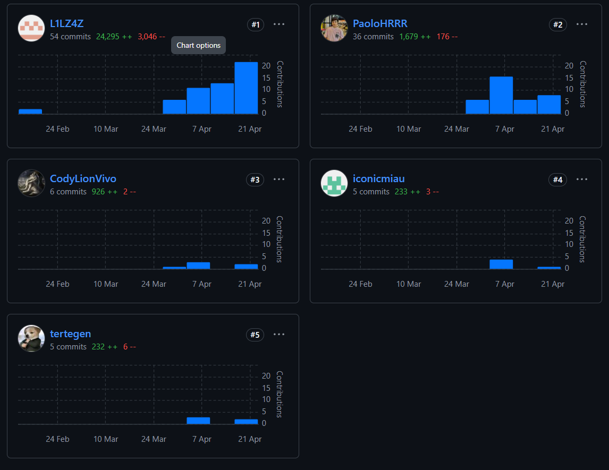

# Project Report Collaboration Insights

El desarrollo del informe se realizó en un repositorio dedicado en la organización de GitHub. Enlace: [https://github.com/GalaxiaWonder-OpenSource/ProjectReport](https://github.com/GalaxiaWonder-OpenSource/ProjectReport)

Se presenta una tabla que especifica qué miembro del equipo se corresponde con qué usuario de GitHub.

<table cellpadding="6" cellspacing="0" style="border-collapse: collapse; width: 100%;">
  <tr>
    <th>Team Member  (Last Name, First Name)</th>
    <th>GitHub Username</th>
  </tr>
  <tr>
    <td>Aponte Cruzado, Andrea Marielena</td>
    <td>iconicmiau</td>
  </tr>
  <tr>
    <td>León Vivas, Fabrizio Amir</td>
    <td>CodyLionVivo</td>
  </tr>
  <tr>
    <td>López Acuña, Mario Joaquín</td>
    <td>tertegen</td>
  </tr>
  <tr>
    <td>Orozco Torres, Álvaro Joaquín</td>
    <td>L1LZ4Z</td>
  </tr>
  <tr>
    <td>Reaño Delgadillo, Henry Paolo</td>
    <td>PaoloHRRR</td>
  </tr>
</table>

**TB1**

Para este entregable que ha elaborado el informe desde el capitulo I hasta el capítulo V en base al proceso de investigación realizado en equipo y diseño del sistema (integralmente).

**TP**

Para este entregable que ha elaborado la documentación del sprint 2 del informe en base al proceso de desarrollo del equipo.

**TB2**

Para este entregable que ha elaborado la documentación del sprint 3 del informe en base al proceso de desarrollo del equipo.

**TF**

Para este entregable que ha elaborado la documentación del sprint 4 del informe en base al proceso de desarrollo del equipo.

