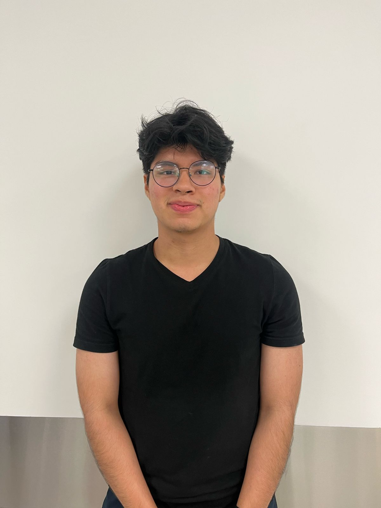

# Capítulo I: Introducción

## 1.1. Startup Profile

### 1.1.1. Descripción de la Startup
Galaxia Wonder está comprometida con la transformación digital en el sector de la ingeniería civil. Nos especializamos en el desarrollo de soluciones tecnológicas que optimizan la planificación, gestión y ejecución de proyectos de construcción, reduciendo errores en los expedientes técnicos y mejorando la colaboración entre equipos multidisciplinarios.

Misión: Nuestra misión es optimizar la gestión y coordinación de los expedientes técnicos en el sector de obras civiles a través de soluciones tecnológicas innovadoras. Buscamos reducir errores en la recopilación y procesamiento de información, mejorando la eficiencia y precisión en la toma de decisiones. Mediante herramientas accesibles y colaborativas, facilitamos el trabajo de contratistas y especialistas, asegurando un flujo de información claro y estructurado.

Visión: Nuestro objetivo es convertirnos en la plataforma de mayor confianza para pequeñas empresas y contratistas independientes que elaboran expedientes técnicos, destacándonos por reducir errores y optimizar la eficiencia operativa. En los próximos tres años, aspiramos a alcanzar el 3% de las empresas consultoras de obra en Lima Metropolitana, impulsando la modernización y digitalización de los procesos constructivos en todo el país.

### 1.1.2. Perfiles de integrantes del equipo

<table style="width: 100%; border-collapse: collapse; margin-bottom: 20px;">
        <thead>
            <tr>
                <th style="border: 1px solid #ddd; padding: 10px; text-align: left; width: 25%;">Foto</th>
                <th style="border: 1px solid #ddd; padding: 10px; text-align: left; width: 15%;">Nombres y Apellidos</th>
                <th style="border: 1px solid #ddd; padding: 10px; text-align: left; width: 15%;">Código de Alumno</th>
                <th style="border: 1px solid #ddd; padding: 10px; text-align: left; width: 15%;">Carrera</th>
                <th style="border: 1px solid #ddd; padding: 10px; text-align: left; width: 30%;">Habilidades</th>
            </tr>
        </thead>
        <tbody>
            <tr>
                <td style="border: 1px solid #ddd; padding: 10px; text-align: left; background-color: #f2f2f2; color: #333;"></td>
                <td style="border: 1px solid #ddd; padding: 10px; text-align: left; background-color: #f2f2f2; color: #333;">Aponte Cruzado, Andrea Marielena</td>
                <td style="border: 1px solid #ddd; padding: 10px; text-align: left; background-color: #f2f2f2; color: #333;">202224135</td>
                <td style="border: 1px solid #ddd; padding: 10px; text-align: left; background-color: #f2f2f2; color: #333;">Ingeniería de Software</td>
                <td style="max-width: 300px; overflow: hidden; text-overflow: ellipsis; white-space: normal;">
                    <ul>
                        <li>Diseño web</li>
                        <li>Gestión y diseño de bases de datos SQL y noSQL</li>
                        <li>Programación en C++ y Python</li>
                    </ul>
                </td>
            </tr>
            <tr>
                <td style="border: 1px solid #ddd; padding: 10px; text-align: left; background-color: #f2f2f2; color: #333;"></td>
                <td style="border: 1px solid #ddd; padding: 10px; text-align: left; background-color: #f2f2f2; color: #333;">León Vivas, Fabrizio Amir</td>
                <td style="border: 1px solid #ddd; padding: 10px; text-align: left; background-color: #f2f2f2; color: #333;">20211b994</td>
                <td style="border: 1px solid #ddd; padding: 10px; text-align: left; background-color: #f2f2f2; color: #333;">Ingeniería de Software</td>
                <td style="max-width: 300px; overflow: hidden; text-overflow: ellipsis; white-space: normal;">
                    <ul>
                        <li>Desarrollo front-end</li>
                        <li>Conocimiento de TI en sistemas basados en UNIX</li>
                        <li>Competente en C++, JavaScript y Python</li>
                        <li>Experiencia con Frameworks ágiles</li>
                    </ul>
                </td> 
            </tr>
            <tr>
                <td style="border: 1px solid #ddd; padding: 10px; text-align: left; background-color: #f2f2f2; color: #333;"></td>
                <td style="border: 1px solid #ddd; padding: 10px; text-align: left; background-color: #f2f2f2; color: #333;">Lopez Acuña, Mario Joaquín</td>
                <td style="border: 1px solid #ddd; padding: 10px; text-align: left; background-color: #f2f2f2; color: #333;">202116250</td>
                <td style="border: 1px solid #ddd; padding: 10px; text-align: left; background-color: #f2f2f2; color: #333;">Ingenería de Software</td>
                <td style="max-width: 300px; overflow: hidden; text-overflow: ellipsis; white-space: normal;">
                    <ul>
                        <li>Diseño web</li>
                        <li>Manejo de Azure para la gestión de máquinas virtuales</li>
                        <li>Conocimiento en sistemas Linux</li>
                        <li>Competente en C++, JavaScript y Python</li> 
                    </ul>
                </td>
            </tr>
            <tr>
                <td style="border: 1px solid #ddd; padding: 10px; text-align: left; background-color: #f2f2f2; color: #333;"></td>
                <td style="border: 1px solid #ddd; padding: 10px; text-align: left; background-color: #f2f2f2; color: #333;">Orozco Torres, Álvaro Joaquín</td>
                <td style="border: 1px solid #ddd; padding: 10px; text-align: left; background-color: #f2f2f2; color: #333;">202220783</td>
                <td style="border: 1px solid #ddd; padding: 10px; text-align: left; background-color: #f2f2f2; color: #333;">Ingenería de Software</td>
                <td style="max-width: 300px; overflow: hidden; text-overflow: ellipsis; white-space: normal;">
                    <ul>
                        <li>Programación con Python y JavaScript</li>
                        <li>Fundamentos de arquitectura de software</li>
                        <li>Diseño UX/UI con figma</li>
                        <li>Aplicación de herramientas y prácticas para la agilidad</li>
                        <li>Buenas prácticas de programación orientada a objetos, patrones, code quality & readability</li>
                    </ul>
                </td>
            </tr>
            <tr>
                <td style="border: 1px solid #ddd; padding: 10px; text-align: left; background-color: #f2f2f2; color: #333;"></td>
                <td style="border: 1px solid #ddd; padding: 10px; text-align: left; background-color: #f2f2f2; color: #333;">Reaño Delgadillo, Henry Paolo</td>
                <td style="border: 1px solid #ddd; padding: 10px; text-align: left; background-color: #f2f2f2; color: #333;">20221e247</td>
                <td style="border: 1px solid #ddd; padding: 10px; text-align: left; background-color: #f2f2f2; color: #333;">Ingenería de Software</td>
                <td style="max-width: 300px; overflow: hidden; text-overflow: ellipsis; white-space: normal;">
                    <ul>
                        <li>Conocimiento en sistemas operativos tipo Linux</li>
                        <li>Manejo de Azure para la gestión de máquinas virtuales</li>
                        <li>Conocimiento avanzado en sistemas Linux.</li>
                        <li>Familiaridad con SOA y Layered Architecture.</li>
                    </ul>
                </td> 
            </tr>
        </tbody>
</table>

## 1.2. Solution Profile

### 1.2.1. Antecedentes y problemática

**Aproximación preliminar a los antecedentes**

En el sector de la ingeniería civil, la planificación y coordinación de cronogramas en proyectos de construcción representa un desafío significativo para empresas consultoras y contratistas independientes. La falta de herramientas eficientes para gestionar estos procesos genera problemas como retrasos en la ejecución de las obras, dificultades en la gestión documental y una toma de decisiones poco ágil debido a la complejidad de manejar múltiples proyectos simultáneamente.

Además, muchas empresas pequeñas dependen de sistemas de gestión de archivos en la nube que no están diseñados específicamente para la planificación de proyectos, mientras que otras incluso carecen de un sistema estructurado, recurriendo a métodos desorganizados o herramientas genéricas que no optimizan su flujo de trabajo. Esta falta de estandarización dificulta la organización y el acceso rápido a información crítica, afectando directamente la eficiencia en la coordinación de actividades, la trazabilidad de los cambios en los cronogramas y la comunicación entre las distintas áreas del proyecto.

**Objetivos de la Solución:**

El sistema de planificación de proyectos de ingeniería civil propuesto busca abordar estos problemas proporcionando una plataforma centralizada que permita garantizar y optimizar la gestión de planificación. Entre sus principales objetivos están:
- Reducir el tiempo que toma la replanificación ante errores o ajustes en los cronogramas.
- Agilizar la toma de decisiones empresariales mediante una mejor estructuración y visualización de la información.
- Mejorar la comunicación y coordinación entre distintas áreas involucradas en los proyectos.

**Alcance y Restricciones:**

- La solución debe adaptarse a empresas consultoras y contratistas independientes con distintos niveles de adopción tecnológica, priorizando una interfaz intuitiva y de fácil uso para minimizar barreras de entrada.

- Para asegurar su adopción, deberá ser accesible desde dispositivos móviles y computadoras, garantizar la seguridad de los datos y permitir la integración con sistemas existentes. Además, debe ser escalable y eficiente, evitando complejidad innecesaria que dificulte su implementación.

**Análisis 5W+2H**

***What?***

Falta de control y coordinación de documentos y errores en la toma de datos que persisten durante el desarrollo y posterior entrega del expediente técnico que generan sobrecostos, retrasos y problemas legales.

***Why?***

Falta de un sistema centralizado que facilite la recopilación, almacenamiento y validación de datos en el expediente ténico.

***Who?***

A empresas pequeñas y contratistas independientes de consultoria de obras.

***When?***

En la actualidad, de manera continua a lo largo del tiempo.

***Where?***

En la planificación de un proyecto de obra civil, antes de su adjudicación.

***How?***

Se mide a través del los sobrecostos del expediente técnico.

***How much?***

A la gran mayoría de contratistas que realizan expedientes técnicos.

### 1.2.2 Lean UX Process.

#### 1.2.2.1. Lean UX Problem Statements.

Actualmente, el sector de consultoría en obras civiles se centra principalmente en la rápida elaboración de expedientes técnicos. Sin embargo, se suelen pasar por alto aspectos cruciales como la correcta organización de documentos, la comunicación y coordinación entre áreas, y la adaptación a los cambios.

Nuestro producto aborda estos problemas mediante funcionalidades que incluyen la gestión de múltiples proyectos, la segmentación del expediente técnico, un sistema de comunicación transversal a las especialidades y un sistema de control de cambios durante el desarrollo y la entrega del expediente técnico.

Por ello, nuestro enfoque inicial está dirigido a pequeñas empresas y contratistas independientes de consultoría en obras civiles.

Consideraremos que el problema está resuelto cuando estas pequeñas empresas o contratistas independientes logren reducir en un 50% el tiempo dedicado a replanificar errores durante el desarrollo del expediente técnico.

#### 1.2.2.2. Lean UX Assumptions.

**Business Outcomes**
* Alcanzar el 3% de las empresas consultoras de obras en Lima Metropolitana en un plazo de 3 años.
* Reducir en un 50% el tiempo necesario para replanificar ante errores de planificación.

**Users**

**1. Víctor Umeres - Contratista, Dueño de empresa constructora**
* Tomar decisiones estratégicas sobre múltiples proyectos.
* Conocer, evaluar y considerar múltiples datos.
* Mantener un flujo de trabajo organizado.
* Gestionar los cambios en planificación.

**2. Ana Ramos - Especialista de área**
* Realizar trabajos de investigación obteniendo datos precisos.
* Organizar datos de manera legible, bajo estándares claros.

**User Outcomes**

**1. Víctor Umeres - Contratista, Dueño de empresa constructora**
* Agilizar la toma de decisiones empresariales.
* Sentir control y dominio del sistema.
* Responder eficazmente al cambio.

**2. Ana Ramos - Especialista de área**
* Garantizar una entrega a tiempo de su sección correspondiente de la memoria descriptiva.
* Obtener datos precisos y de calidad.
* Mejorar la comunicación y coordinación con distintas áreas.

**Solutions**

* Dashboard de proyectos
* Comunicados 
* Recordatorios
* Subir y descargar archivos
* Documentación de funcionalidades
* Gestión de calendarios
* Gestión de proyectos
* Mensajes
* Ficheros para documentos compartidos
* Replanteo de documentos post-entrega
* Creación de ajustes contractuales
* Creación de plantillas métricas

#### 1.2.2.3. Lean UX Hypothesis Statements.

Hemos formulado como equipo las siguientes hipótesis orientadas a probar las distintas funcionalidades que hemos obtenido como parte del Lean UX Process:

* Creemos que lograremos llegar al 3% de las empresas consultoras de obra de Lima Metropolitana en 3 años si Víctor alcanza sentir control y dominio del sistema con documentación de funcionalidades
* Creemos que lograremos  llegar al 3% de las empresas consultoras de obra de Lima Metropolitana en 3 años si Ana Ramos alcanza mejorar la comunicación y coordinación con distintas áreas con ficheros para documentos compartidos 
* Creemos que lograremos  llegar al 3% de las empresas consultoras de obra de Lima Metropolitana en 3 años si Ana Ramos alcanza mejorar la comunicación y coordinación con distintas áreas con subir y descargar archivos
* Creemos que lograremos incrementar en un 50% la cantidad de proyectos planificados a tiempo en 5 años si Víctor Umeres alcanza responder eficazmente al cambio con creación de ajustes contractuales.
* Creemos que lograremos incrementar en un 50% la cantidad de proyectos planificados a tiempo en 5 años si Víctor Umeres alcanza responder eficazmente al cambio con replanteo de documentos post-entrega.
* Creemos que lograremos incrementar en un 50% la cantidad de proyectos planificados a tiempo en 5 años si Víctor Umeres alcanza agilizar la toma de decisiones empresariales con dashboard de proyectos.
* Creemos que lograremos incrementar en un 50% la cantidad de proyectos planificados a tiempo en 5 años si Víctor Umeres alcanza agilizar la toma de decisiones empresariales con gestión de proyectos.
* Creemos que lograremos incrementar en un 50% la cantidad de proyectos planificados a tiempo en 5 años si Víctor Umeres alcanza agilizar la toma de decisiones empresariales con gestión de calendarios.
* Creemos que lograremos incrementar en un 50% la cantidad de proyectos planificados a tiempo en 5 años si Ana Ramos alcanza mejorar la comunicación y coordinación con distintas áreas con mensajes.
* Creemos que lograremos incrementar en un 50% la cantidad de proyectos planificados a tiempo en 5 años si Ana Ramos alcanza garantizar una entrega a tiempo de su sección correspondiente de la memoria descriptiva con comunicados.
* Creemos que lograremos incrementar en un 50% la cantidad de proyectos planificados a tiempo en 5 años si Ana Ramos alcanza garantizar una entrega a tiempo de su sección correspondiente de la memoria descriptiva con recordatorios.
* Creemos que lograremos reducir en 50% el tiempo que toma replanificar ante errores de planificación si Carlos Mendoza alcanza solicitar ajustes contractuales de forma oportuna con solicitud de ajustes contractuales.
* Creemos que lograremos llegar al 3% de las empresas consultoras de obra de Lima Metropolitana en 3 añossi Carlos Mendoza alcanza control de seguimiento para verificar la planificación de la obra con resumen de detalles clave.
* Creemos que lograremos llegar al 3% de las empresas consultoras de obra de Lima Metropolitana en 3 años si Carlos Mendoza alcanza control de seguimiento para verificar la planificación de la obra con permisos de acceso al cliente.

#### 1.2.2.4. Lean UX Canvas.

El Lean UX Canvas del proyecto muestra un enfoque claro hacia la mejora de la planificación de proyectos en ingeniería civil, orientado principalmente a consultoras pequeñas y contratistas independientes. Se identificaron problemáticas como la coordinación de cronogramas, la recopilación de datos técnicos y el uso limitado de herramientas digitales. Las soluciones propuestas incluyen funcionalidades como dashboards, gestión de calendarios, archivos compartidos y comunicación interna. Los usuarios clave —como especialistas de área, contratistas y entidades contratantes— validan estas necesidades. El objetivo es aumentar en un 50% los proyectos entregados a tiempo en 5 años y alcanzar al 3% del mercado en Lima Metropolitana en 3 años.

## 1.3. Segmentos Objetivo
**1. Contratista**

Según los datos del OSCE, se observa que la mayoría de los líderes son hombres de aproximadamente 40 años con estudios universitarios que les permiten gestionar proyectos de menor escala con eficiencia y calidad. 

Investigaciones adicionales del INEI y del Ministerio de Vivienda respaldan esta tendencia, evidenciando que en el sector de la construcción las empresas son lideradas por profesionales en edades similares, lo que se traduce en un perfil sólido y enfocado en la optimización de recursos.

- Género: Masculino
- Edad promedio: 40 años
- Formación: Nivel universitario en ingeniería civil o áreas afines

**2. Especialista de Área**

Los datos del OSCE sugieren que estos expertos, en su mayoría hombres, tienen una edad promedio de 38 años y cuentan con estudios de posgrado o especializaciones en técnicas avanzadas. 

Los análisis del INEI confirman que la formación especializada es un factor clave en la competitividad del sector.

- Género: Masculino
- Edad promedio: 38 años
- Formación: Estudios de posgrado o especialización de técnica avanzada

**3. Entidad Contratante**

Según el análisis de los datos del OSCE, los clientes, en su mayoría hombres, tienen en promedio de 35 años y cuentan con formación que varía entre lo técnico y lo universitario. 

Esta información es complementada por estudios del INEI y por reportes del Ministerio de Vivienda, que indican que el perfil del contratante individual se orienta hacia la búsqueda de soluciones accesibles y de alta calidad, fundamentales para la realización de proyectos residenciales o comerciales en pequeña escala.

- Género: Masculino
- Edad promedio: 35 años
- Formación: Nivel tecnico y universitario

