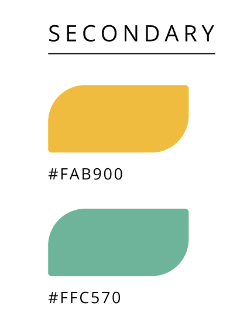
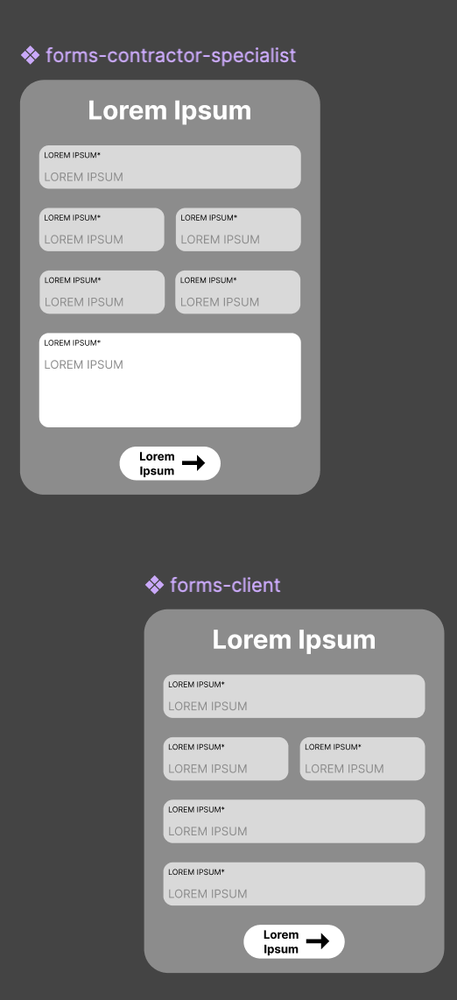
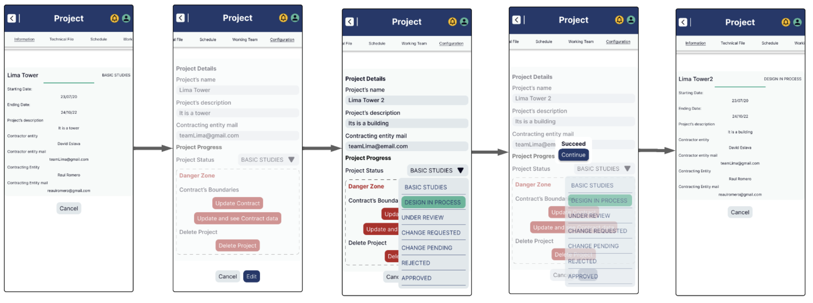
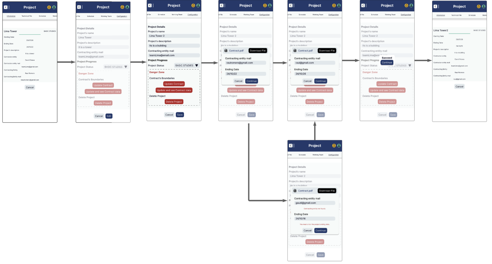
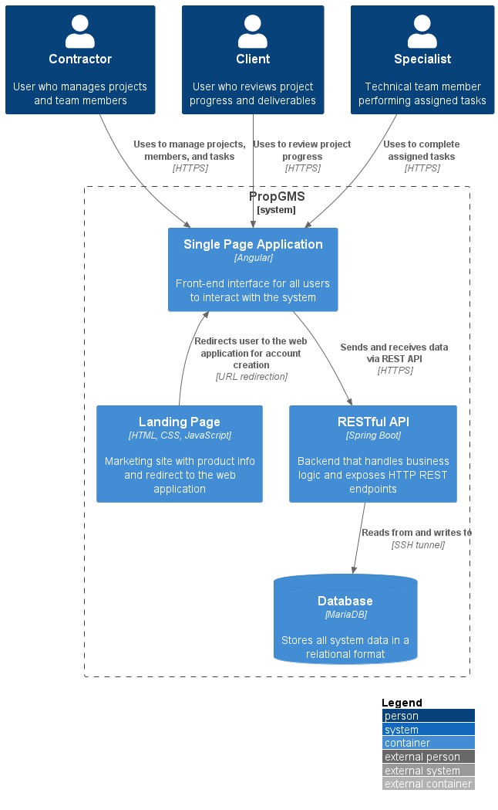

# Capítulo IV: Product Design

## 4.1. Style Guidelines

### 4.1.1. General Style Guidelines

**Branding**

**Descripcion general de la marca**

La startup Galaxia Wonder está comprometida con la transformación digital en el sector de la ingeniería civil. Nos especializamos en el desarrollo de soluciones tecnológicas que optimizan la planificación, gestión y ejecución de proyectos de construcción, reduciendo errores en los expedientes técnicos y mejorando la colaboración entre equipos multidisciplinarios.

<p align="center"></p>

**Mision:**

Nuestra misión es optimizar la gestión y coordinación de los expedientes técnicos en el sector de obras civiles a través de soluciones tecnológicas innovadoras. Buscamos reducir errores en la recopilación y procesamiento de información, mejorando la eficiencia y precisión en la toma de decisiones. Mediante herramientas accesibles y colaborativas, facilitamos el trabajo de contratistas y especialistas, asegurando un flujo de información claro y estructurado.

**Vision:**

Nuestro objetivo es convertirnos en la plataforma de mayor confianza para pequeñas empresas y contratistas independientes que elaboran expedientes técnicos, destacándonos por reducir errores y optimizar la eficiencia operativa. En los próximos tres años, aspiramos a alcanzar el 3% de las empresas consultoras de obra en Lima Metropolitana, impulsando la modernización y digitalización de los procesos constructivos en todo el país.

**Nombre del producto:**

El nombre de la propuesta de solucion es ProP GMS. La idea surge de la unión de cinco palabras “Project Planning Galacticos Managing System”. Este aspecto se relaciona con el dilema que busca solventar la plataforma y el rubro al que direcciona.

<p align="center"></p>

<div style="page-break-before: always;"></div>

**Colores:**

La apariencia visual de una plataforma influye directamente en cómo es percibida, especialmente en campos técnicos como la ingeniería civil. Por ello, se ha diseñado una paleta cromática estratégica, alineada con los principios de la psicología del color y orientada a transmitir profesionalismo, claridad y funcionalidad.

Los colores primarios seleccionados son:

<li>Azul profundo (#22396B), que comunica confianza, seriedad y estabilidad.

<li>Gris claro (#E1E8EC), ideal para aportar limpieza visual y resaltar contenidos sin generar distracción.

<p align="center"></p>

Como colores secundarios se han incorporado:

<li>Amarillo vibrante (#FAB900), que aporta energía y dinamismo, asociado a la innovación y acción.

<li>Verde agua (#FFC570), que aporta frescura, equilibrio y se vincula con la sostenibilidad y el entorno natural.

<p align="center"></p>

<div style="page-break-before: always;"></div>

La paleta se completa con colores neutros:
<br>
<li>Negro azulado (#0C0C20), que proporciona contraste y fuerza visual.

<li>Blanco suave (#F6FAF9), que garantiza legibilidad y mantiene una estética limpia y profesional.

<p align="center"></p>

**Tipografia:**

La tipografía cumple un papel clave en la estructuración del contenido y en la orientación del usuario a lo largo de la interfaz. En este proyecto, se optó por el uso de la fuente Inter, seleccionada por su legibilidad y versatilidad en entornos digitales. La jerarquía visual se organiza en distintos niveles que definen claramente titulares, párrafos y elementos interactivos, asegurando una navegación fluida y coherente.

<p align="center"></p>

<div style="page-break-before: always;"></div>

**Encabezado:**

Los encabezados se dividen en tres estilos principales:
Display 1 (Bold, 40.5px) para titulares destacados.
Header 1 (Bold, 47px) para títulos principales.
Header 2 (Bold, 18px) para subtítulos o secciones intermedias.

<p align="center"></p>

**Parrafo:**

Los textos de párrafo siguen un enfoque funcional con:

Paragraph 1 (Regular, 12px) para bloques de texto estándar.
Paragraph 2 (Regular, 8px) para detalles secundarios o notas.

<p align="center"></p>

**Botones y enlaces:**

Para botones y enlaces, se utilizan estilos en negrita de 12px, diferenciando los botones en negro y los hipervínculos en verde agua, manteniendo la coherencia con la identidad cromática del sistema.

<p align="center"></p>

### 4.1.2. Web Style Guidelines

**Header**

El componente es una barra de navegacion que permite al usuario acceder a las secciones de la pagina web
<br>
<p align="center"></p>
<br>

**Botones**

Este conjunto de botones de accion, incluye opciones para descargar, exportar, denegar, aprobar, enviar y para que acceda a las redes sociales de la empresa.
<br>

<p align="center"></p>
<br>

**Boton internacional**

Este par de botones nos brindan la pagina web en ingles y español para que le usuario lo pueda cambiar.

<br>
<p align="center"></p>

<div style="page-break-before: always;"></div>

**Formulario**

Estos formularios son para que los usuarios se contacten con nosotros si necesitan  informacion 
<br>
<p align="center"></p>

<div style="page-break-before: always;"></div>

<div style="page-break-before: always;"></div>

## 4.2. Information Architecture

Information Architecture es el proceso de estructurar, organizar y etiquetar el contenido de un sistema digital de forma lógica y usable, facilitando la navegación, el acceso eficiente a la información y la comprensión del producto por parte del usuario. En el contexto de ProP GMS, nuestra plataforma en la nube para la gestión de proyectos de ingeniería civil, la AI es fundamental para que los usuarios puedan acceder fácilmente a funciones críticas como la planificación de tareas, el control de presupuesto, la gestión documental y la elaboración del expediente técnico.

### 4.2.1. Organization Systems

En ProP GMS, la arquitectura de la información se diseña estratégicamente para ofrecer una experiencia de usuario clara, eficiente y adaptada a tres tipos principales de usuarios: contratistas, especialistas de área y contratantes. Cada grupo accede a diferentes módulos y niveles de interacción con el sistema, lo que exige una organización inteligente del contenido tanto en su estructura visual como en su categorización.

A nivel visual, el sistema aplica una **organización jerárquica** en módulos como el dashboard principal, donde se prioriza la presentación del estado general de los proyectos, hitos relevantes y alertas. Esta jerarquía visual ayuda especialmente a los contratantes, quienes necesitan una visión panorámica para la toma de decisiones. Por otro lado, se utiliza una **organización secuencial** en flujos como la creación de organizaciones, miembros y cronogramas, siguiendo pasos lógicos que guían a los contratistas o especialistas en el ingreso de datos complejos, minimizando errores. Además, en la gestión de cronogramas y seguimiento de hitos, se incorpora una **organización matricial**, útil para comparar variables interrelacionadas como tareas, fechas y responsables, especialmente valiosa para los especialistas de área.

Respecto a la **categorización de contenido**, se utiliza un **enfoque alfabético** en elementos como nombres de organizaciones, miembros y proyectos, lo cual agiliza la búsqueda en listas extensas. En los módulos de cronogramas y control de hitos, se aplica una **organización cronológica**, lo que permite a los usuarios revisar el progreso y evolución del proyecto en orden temporal. Asimismo, se estructura el **contenido por tópicos** en áreas como la documentación técnica o la configuración de entidades, agrupando funciones similares bajo secciones claras como "Organizaciones", "Miembros", "Proyectos" y "Cronogramas". Finalmente, la **organización por audiencia** permite ofrecer vistas y funcionalidades diferenciadas: los contratistas podrán gestionar proyectos y cronogramas, los especialistas editar hitos y controlar el avance, y los contratantes visualizar informes y estados generales.

Esta combinación de **estrategias organizativas** garantiza que cada usuario encuentre lo que necesita en el momento preciso, optimizando su productividad y reduciendo la fricción en el uso del sistema. ProP GMS no solo organiza proyectos, sino que también organiza la experiencia del usuario para que sea tan robusta como intuitiva.

### 4.2.2. Labeling Systems

En este sistema, se utilizan etiquetas claras y mínimas para guiar a los usuarios —principalmente **contratistas**— a través de la plataforma, asegurando que puedan encontrar y comprender fácilmente las funcionalidades disponibles. Las etiquetas han sido seleccionadas con simplicidad y coherencia en mente, promoviendo una navegación intuitiva y evitando la sobrecarga cognitiva.

Por ejemplo, la etiqueta **Subscription** está asociada con la selección y gestión de planes. Esta etiqueta permite a los **contratistas** identificar rápidamente dónde activar o cambiar su plan actual. La etiqueta **Payments** conduce a las secciones donde los usuarios pueden visualizar y completar transacciones relacionadas con su suscripción, y se encuentra estrechamente vinculada a **Invoices** y **Subscription**.

Por su parte, **Invoices** representa el historial de facturación y las notificaciones relacionadas con cargos pendientes o completados. Los usuarios la asocian con recordatorios y el resumen financiero de su actividad. La etiqueta **Authentication** engloba funcionalidades como **Login**, **Sign up**, recuperación de contraseña y seguridad de credenciales, agrupando todos los accesos de identidad bajo un mismo concepto comprensible.

La etiqueta **Profile** indica el espacio donde los usuarios pueden editar, actualizar o gestionar su información personal y profesional. **Notifications** alerta a los usuarios sobre eventos importantes, especialmente respecto a pagos, tareas asignadas o cambios en los proyectos. **Dashboard** funciona como el centro de control donde se muestra un resumen de **Projects**, fechas clave e indicadores de desempeño.

La etiqueta **Change Requests** se utiliza para representar las solicitudes de modificación al proyecto, ya sea por parte de la entidad contratante o el equipo técnico, y está vinculada al historial de cambios y sus estados de aprobación. **Tasks** contiene la información sobre tareas asignadas, fechas límite y seguimiento del progreso, mientras que **Meetings** corresponde a la sección dedicada a las reuniones del proyecto, con una asociación directa con **Tasks** y **Schedule**.

**Schedule** agrupa **Tasks**, **Milestones** y **Meetings** dentro de un formato visual de cronograma para facilitar la planificación y seguimiento del proyecto. La etiqueta **Projects** lleva a la lista de proyectos gestionados en la plataforma. Por su parte, **Members** indica el área donde se pueden gestionar los roles y participantes de cada proyecto, y **Organization** hace referencia a la estructura organizativa detrás del usuario, incluyendo configuración de suscripción y control de acceso de los miembros.

Como ejemplo concreto de representación de datos, un proyecto puede tener distintos estados a lo largo de su ciclo de vida. Las etiquetas como **Draft**, **In progress**, **On hold**, **Cancelled** y **Completed** permiten al usuario identificar rápidamente el estado actual del proyecto. Estas etiquetas son simples, consistentes y reflejan claramente el progreso del trabajo, lo que mejora la experiencia del usuario y reduce posibles ambigüedades.

Asimismo, la etiqueta **Contact** puede aparecer en el pie de página, pero se relaciona mentalmente con contenidos como **Support**, **Help Center** o redes sociales, ayudando al usuario a anticipar qué tipo de información encontrará, aunque esté distribuida en distintas secciones del sitio.

Este sistema asegura que todos los usuarios, sin importar su nivel técnico, puedan navegar la plataforma con confianza, gracias a etiquetas predecibles y significativas que reflejan sus necesidades y objetivos.

<div style="page-break-before: always;"></div>

### 4.2.3. SEO Tags and Meta Tags

Los SEO Tags y Meta Tags son elementos fundamentales del código HTML que contribuyen significativamente al posicionamiento de un sitio web en los motores de búsqueda (SEO). Además, permiten definir cómo se muestra la información de la página cuando se comparte en redes sociales o aparece en los resultados de búsqueda de Google. A continuación, se detallan los SEO Tags y Meta Tags correspondientes a cada nivel.

<div style="font-size: 22px;">
  <strong>Landing Page</strong>
</div>

La Landing Page es la página pública principal del sitio. Su objetivo es atraer tráfico orgánico, mejorar el posicionamiento en motores de búsqueda y generar conversiones (registro, contacto, etc.). Por ello, requiere etiquetas orientadas al SEO, visibilidad y marketing digital.

**Title**

Propósito: Define el título que aparece en la pestaña del navegador y en los resultados de búsqueda.
```html
<title>Civil Engineering Project Management in the Cloud with ProP GMS</title>
```

**Meta Description**

Propósito: Resumen del contenido de la página. Aparece debajo del título en Google y afecta directamente la tasa de clics (CTR).
```html
<meta name="description" content="Optimize your civil engineering projects with our cloud-based platform. Planning, budgeting, technical files, and document management all in one place.">
```

**Meta Keywords**

Propósito: Palabras clave relacionadas con el contenido. Aunque tienen poco impacto en SEO moderno, aún se usan en algunas plataformas
```html
<meta name="keywords" content="civil engineering, project management, construction planning, budgeting, document control, cloud engineering software, technical files">
```

**Author**

Propósito: Especifica al autor del sitio o equipo de desarrollo.
```html
<meta name="author" content="Galaxia Wonder">
```

**Copyright**

Propósito: Se utiliza para informar que el conteniedo del sitio web está protegido por derechos de autor.
```html
<meta name="copyright" content="© 2025 Galaxia Wonder. All rights reserved.">
```

**Character encoding**

Propósito: Especificar la codificación de caracteres que debe utilizar el navegador al interpretar el contenido de una página HTML.
```html
<meta charset="utf-8">
```

<div style="page-break-before: always;"></div>

<div style="font-size: 22px;">
  <strong>Web Application</strong>
</div>

La Web Application es el panel privado para usuarios registrados. Aquí el enfoque no es atraer visitantes, sino mejorar la experiencia de usuario y mantener orden y estructura en la interfaz.

**Title**

Propósito: Muestra el nombre del proyecto activo o sección dentro del dashboard.
```html
<title>ProP GMS - Project Control</title>
```

**Meta Description**

Propósito: Aunque esta parte no se indexa, tener una descripción mejora la organización del contenido en navegadores o apps conectadas.
```html
<meta name="description" content="Monitor your projects, manage tasks, control budgets, and upload technical documentation from a single dashboard.">
```

**No Index**

Propósito: Evita que los motores de búsqueda indexen el dashboard privado.
```html
<meta name="robots" content="noindex, nofollow">
```

**Author**

Propósito: Especifica al autor del sitio o equipo de desarrollo.
```html
<meta name="author" content="Galaxia Wonder">
```

**Copyright**

Propósito: Se utiliza para informar que el conteniedo del sitio web está protegido por derechos de autor.
```html
<meta name="copyright" content="© 2025 Galaxia Wonder. All rights reserved.">
```

<div style="page-break-before: always;"></div>

### 4.2.4. Searching Systems

El sistema de búsqueda de **ProP GMS** ha sido diseñado para brindar a los usuarios una experiencia fluida, intuitiva y rápida a la hora de encontrar información específica dentro de un entorno con múltiples entidades y un alto volumen de datos. Las búsquedas están orientadas a tres perfiles principales de usuario: **contratistas**, **especialistas** y **entidades contratantes**, quienes interactúan con **Projects**, **Schedules**, **Teams**, **Tasks**, **Documents** y **Organizations**.

Desde la perspectiva del usuario, la funcionalidad de búsqueda busca minimizar la frustración y maximizar la eficiencia, permitiendo encontrar lo que se necesita en pocos pasos y con gran precisión.

El sistema permitirá búsquedas por texto directo. Esto significa que los usuarios podrán ingresar términos como el nombre de un **Project**, un **Organization Member** o una **Specialty**, y el sistema ofrecerá coincidencias relevantes. Por ejemplo, al escribir **Topography**, se podrán mostrar **Tasks**, **Meetings** o **Organization Members** que tengan esa especialidad.

También será posible buscar por **email** o **username**. Esta funcionalidad está especialmente pensada para facilitar la gestión de miembros en **Organizations** o **Projects**, reduciendo el tiempo que normalmente se emplea en la búsqueda manual dentro de listas extensas.

La búsqueda estará segmentada por tipo de entidad, lo cual quiere decir que el usuario podrá limitar los resultados según el contenido que necesite explorar: **Projects**, **Tasks**, **Meetings**, **Milestones**, **Organization Members**, entre otros.

Adicionalmente, el sistema contará con filtros por estado de entidad. Uno de los más importantes será el estado del proyecto (**ProjectStatus**), que ayuda al usuario a enfocar su búsqueda en proyectos que se encuentran en fases como **BASIC_STUDIES**, **DESIGN_IN_PROGRESS**, **UNDER_REVIEW**, **CHANGE_REQUESTED**, **CHANGE_PENDING** o **APPROVED**.

Otro filtro esencial será el estado de las tareas (**TaskStatus**), que permitirá a los **especialistas** y **coordinadores** ver rápidamente qué **Tasks** están en estado **DRAFT**, **PENDING**, **SUBMITTED**, **APPROVED** o **REJECTED**.

El filtro de especialidad técnica (**Specialty**) permitirá segmentar la información según disciplinas profesionales como **ARCHITECTURE**, **STRUCTURES**, **HSA**, **TOPOGRAPHY**, **SANITATION**, **ELECTRICITY** o **COMMUNICATIONS**. Esto es especialmente útil cuando se desea encontrar **Tasks** o **Organization Members** con un perfil técnico específico.

El objetivo principal del sistema de búsqueda de **ProP GMS** es que **contratistas**, **especialistas** y **entidades contratantes** accedan sin fricciones a la información crítica que necesitan, en un entorno ordenado, filtrable y accesible desde cualquier módulo del producto.

### 4.2.5. Navigation Systems

El sistema de navegación de **ProP GMS** está diseñado para guiar a los usuarios de forma intuitiva y eficiente a través de todos los componentes del producto, ya sea desde la **Landing Page** o dentro de la **Web Application**. Se ha estructurado una experiencia coherente que facilite la orientación y permita a los usuarios alcanzar sus objetivos sin fricciones.

En la **Landing Page**, se implementa una navegación clara mediante un **Header** fijo que contiene enlaces ancla hacia secciones clave como **About Us**, **Overviews**, **About the Product**, **Testimonials** y **Contact Us**, junto con una selección de idioma. El **Footer** también ofrece accesos rápidos a secciones auxiliares.

Dentro de la **Web Application**, **ProP GMS** ha sido diseñada con una estructura adaptable a los distintos perfiles de usuario: **contratistas**, **especialistas** y **entidades contratantes**. La interfaz utiliza una **Sidebar** fija que agrupa las funcionalidades principales por categoría. También se emplean **breadcrumbs** y cabeceras contextuales.

Para los **contratistas**, la navegación se centra en el control y la gestión integral de los **Projects**. Desde el módulo **Dashboard**, pueden acceder rápidamente a **Projects**, crear nuevos, asignar **Organization Members**, establecer objetivos y subir **Documents**. La navegación continúa hacia **Schedules**, **Tasks** y **Meetings**, que están interconectados dentro de cada **Project**. También tienen acceso a la gestión de **Organizations** y **Organization Members**.

Los **especialistas** comparten un flujo similar al de los **contratistas**, pero con funcionalidades ajustadas a su nivel de permisos. Desde su **Dashboard**, acceden a los **Projects** en los que participan, gestionan sus **Tasks**, asisten a **Meetings**, colaboran en el **Schedule** y actualizan su **Profile**.

Las **entidades contratantes** acceden a una navegación centrada en el monitoreo del **Project**. Desde su panel inicial, ingresan a la vista de **Projects**, consultan el avance general mediante los **Schedules**, y revisan la sección de **Change Requests** para enviar comentarios o requerimientos relacionados con entregables y fechas.

Todo el sistema ha sido diseñado para ofrecer claridad y control a los **contratistas**, facilitando una comunicación efectiva y una toma de decisiones informada por parte de las **entidades contratantes**.

<div style="page-break-before: always;"></div>

## 4.3. Landing Page UI Design

La propuesta de UI para la landing page responde a la necesidad de traducir correctamente las decisiones tomadas en la sección de arquitectura de información. Partiendo de una estructura modular, el equipo ha organizado visualmente los contenidos clave de la plataforma, priorizando la segmentación por tipo de usuario: miembros de la organización (contratista y especialista) y clientes, resaltando los beneficios principales para cada uno. Esta segmentación no solo facilita la navegación, sino que también permite adaptar el mensaje y los llamados a la acción a las necesidades específicas de cada perfil.

Para ello, se aplicaron principios establecidos en el diseño de páginas web, tales como la simplicidad visual, el uso de jerarquías tipográficas, el nivel de contraste y el diseño responsive. Estas decisiones buscan optimizar la experiencia del usuario y facilitar su recorrido por la página, asegurando una rápida comprensión de la propuesta de valor del sistema. Además, se priorizó una disposición que permita destacar funcionalidades clave vinculadas a la gestión de tareas y el seguimiento técnico, reforzando así el propósito de la interfaz.

### 4.3.1. Landing Page Wireframe

<p>Esta sección presenta los wireframes desarrollados, en sus versiones para navegador web en desktop y dispositivos móviles.</p>

**Hero - Desktop**  
<p>En esta sección se muestra el encabezado de la página. Se usó el principio de jerarquía visual y espaciado para guiar la atención del usuario.</p>
<p align="center"></p>
<div style="page-break-before: always;"></div>

**About Us - Desktop**  
<p>En esta sección se muestra la presentación del equipo. Se aplicó alineación clara y tamaños de texto para establecer jerarquía.</p>
<p align="center"></p>
<div style="page-break-before: always;"></div>

**About the Project - Desktop**  
<p>En esta sección se muestra un video explicativo. Se usó el principio de simplicidad y reconocimiento visual.</p>
<p align="center"></p>
<div style="page-break-before: always;"></div>

**Overviews - Contractor - Desktop**  
<p>En esta sección se muestran funciones para contratistas. Se usó diseño modular y jerarquía visual en las tarjetas.</p>
<p align="center"></p>
<div style="page-break-before: always;"></div>

**Overviews - Client - Desktop**  
<p>En esta sección se muestran beneficios para clientes. Se aplicó simplicidad visual y repetición para mejorar la comprensión.</p>
<p align="center"></p>
<div style="page-break-before: always;"></div>

**Footer - Desktop**  
<p>En esta sección se muestra el pie de página. Se usó una estructura en columnas y se aplicó el principio de organización visual.</p>
<p align="center"></p>
<div style="page-break-before: always;"></div>

**Hero - Mobile**  
<p>En esta sección se muestra el encabezado para móvil. Se usó el principio de accesibilidad y espaciado táctil.</p>
<p align="center"></p>
<div style="page-break-before: always;"></div>

**About Us - Mobile**  
<p>En esta sección se muestra al equipo con formato vertical. Se aplicó jerarquía tipográfica y buena separación entre bloques.</p>
<p align="center"></p>
<div style="page-break-before: always;"></div>

**About the Project - Mobile**  
<p>En esta sección se muestra un video. Se usó una estructura simple para facilitar la lectura en scroll.</p>
<p align="center"></p>
<div style="page-break-before: always;"></div>

**Overviews - Contractor - Mobile**  
<p>En esta sección se muestran herramientas clave para contratistas. Se organizó en tarjetas verticales con buen espacio táctil.</p>
<p align="center"></p>
<div style="page-break-before: always;"></div>

**Overviews - Client - Mobile**  
<p>En esta sección se muestran beneficios para clientes. Se usaron tarjetas simples para navegación fácil y ordenada.</p>
<p align="center"></p>
<div style="page-break-before: always;"></div>

**Footer - Mobile**  
<p>En esta sección se muestra el pie de página en una sola columna. Se usó el principio de coherencia estructural para móviles.</p>
<p align="center"></p>
<div style="page-break-before: always;"></div>

### 4.3.2. Landing Page Mock-up

<p>Esta sección presenta los mockups desarrollados, en sus versiones para navegador web en desktop y dispositivos móviles.</p>

**Hero - Desktop**  
<p>En esta sección se muestra el encabezado visual de la página con botones de acción destacados. Se usó el principio de jerarquía visual para resaltar el mensaje principal.</p>
<p align="center"></p>
<div style="page-break-before: always;"></div>

**About Us - Desktop**  
<p>En esta sección se muestra la identidad del equipo. Se aplicó el principio de coherencia visual y uso de color institucional.</p>
<p align="center"></p>
<div style="page-break-before: always;"></div>

**About the Project - Desktop**  
<p>En esta sección se muestra el video explicativo del sistema. Se usó el principio de simplicidad para enfocar la atención del usuario en el contenido principal.</p>
<p align="center"></p>
<div style="page-break-before: always;"></div>

**Overviews - Contractor/Specialist - Desktop**  
<p>En esta sección se muestran las herramientas disponibles para contratistas. Se aplicó el principio de usabilidad con tarjetas claras y acciones identificables.</p>
<p align="center"></p>
<div style="page-break-before: always;"></div>

**Overviews - Client - Desktop**  
<p>En esta sección se muestran los beneficios clave para clientes. Se usó el principio de accesibilidad visual con buen contraste y textos claros.</p>
<p align="center"></p>
<div style="page-break-before: always;"></div>

**Footer - Desktop**  
<p>En esta sección se muestra el pie de página con enlaces y redes. Se aplicó el principio de coherencia para mantener la estructura del sitio.</p>
<p align="center"></p>
<div style="page-break-before: always;"></div>

**Hero - Mobile**  
<p>En esta sección se muestra el encabezado adaptado a móviles. Se usó el principio de accesibilidad para mejorar la interacción táctil.</p>
<p align="center"></p>
<div style="page-break-before: always;"></div>

**About Us - Mobile**  
<p>En esta sección se muestra la presentación del equipo en formato vertical. Se aplicó el principio de simplicidad para facilitar la lectura.</p>
<p align="center"></p>
<div style="page-break-before: always;"></div>

**About the Project - Mobile**  
<p>En esta sección se muestra un recurso audiovisual informativo. Se usó el principio de jerarquía para dar prioridad al contenido visual.</p>
<p align="center"></p>
<div style="page-break-before: always;"></div>

**Overviews - Contractor/Specialist - Mobile**  
<p>En esta sección se muestran herramientas para contratistas. Se aplicó el principio de usabilidad adaptando las tarjetas a formato scrollable.</p>
<p align="center"></p>
<div style="page-break-before: always;"></div>

**Overviews - Client - Mobile**  
<p>En esta sección se presentan beneficios para clientes. Se usó el principio de simplicidad y contraste para facilitar su comprensión en dispositivos pequeños.</p>
<p align="center"></p>
<div style="page-break-before: always;"></div>

**Footer - Mobile**  
<p>En esta sección se muestra el pie de página adaptado a móviles. Se aplicó el principio de coherencia estructural con disposición en una sola columna.</p>
<p align="center"></p>

<div style="page-break-before: always;"></div>

## 4.4. Web Applications UX/UI Design

### 4.4.1. Web Applications Wireframes. 

### 4.4.2. Web Applications Wireflow Diagrams. 

### 4.4.3. Web Applications Mock-ups. 

**Crear proyecto**


**Listar proyectos de organización**


**Editar proyecto**


**Listar hitos**


**Login**


### 4.4.4. Web Applications User Flow Diagrams. 


**1. Crear un nuevo proyecto**

- **User Goal:** Crear un proyecto en la plataforma para iniciar la planificación de su cronograma, equipo y tareas.
- **User Persona:** Contratista

**Flujo Principal (Happy Path):**
- Usuario accede al dashboard principal.
- Usuario selecciona la opción "Crear nuevo proyecto".
- Usuario completa los siguientes campos del formulario:
  - Nombre del proyecto.
  - Fecha de inicio (automáticamente el día de creación).
  - Fecha de finalización estimada.
  - Subida del contrato firmado.
  - Fecha de firma del contrato.
  - Correo de la entidad contratante.
- Usuario envía el formulario.
- El sistema valida los datos.
- El sistema crea el proyecto.
- El sistema muestra mensaje de éxito y redirige al detalle del proyecto.

**Puntos de Decisión:**
- ¿Todos los campos obligatorios fueron completados?
- ¿Fecha de finalización es válida?
- ¿Archivo del contrato adjunto?
- ¿Correo de entidad contratante válido?

**Flujos Alternativos (Unhappy Paths):**
- Campos obligatorios incompletos: mensaje de error "Debe completar todos los campos requeridos".
- Fecha de finalización anterior al inicio: error "La fecha de finalización debe ser posterior a la fecha de inicio".
- Archivo de contrato no subido: error "Debe adjuntar el contrato firmado".
- Correo inválido: error "Entidad contratante no encontrada".

**2. Consultar y visualizar lista de proyectos y sus detalles**


- **User Goal:** Consultar los proyectos accesibles para el usuario y visualizar su información general.
- **User Persona:** Miembro del equipo / Contratista

**Flujo Principal (Happy Path):**
- Usuario inicia sesión en la plataforma.
- Usuario accede a la sección "Proyectos".
- Sistema muestra la lista de proyectos accesibles, con información resumida: nombre, estado, rol del usuario.
- Usuario selecciona un proyecto de la lista.
- Sistema muestra el detalle completo del proyecto:
  - Nombre del proyecto.
  - Estado actual.
  - Fechas de inicio y finalización.
  - Entidad contratante.
  - Miembros del equipo asignado.
  - Contrato asociado (visible solo para contratistas).

**Puntos de Decisión:**
- ¿Usuario tiene permisos para ver proyectos?
- ¿Usuario pertenece al equipo del proyecto seleccionado?

**Flujos Alternativos (Unhappy Paths):**
- Usuario sin proyectos asignados: mensaje "No tienes proyectos disponibles".
- Usuario no autorizado para ver el proyecto seleccionado: error "No tienes permisos para acceder a este proyecto".

**3. Editar información general del proyecto**


- **User Goal:** Actualizar el nombre o la descripción del proyecto para reflejar cambios en el alcance o clarificaciones internas.
- **User Persona:** Contratista

**Flujo Principal (Happy Path):**
- Contratista accede al detalle del proyecto.
- Usuario selecciona la opción "Editar información general".
- Sistema despliega formulario editable con los campos actuales:
  - Nombre del proyecto.
  - Descripción del proyecto.
- Usuario realiza los cambios necesarios.
- Usuario guarda los cambios.
- Sistema valida los datos y actualiza la información.
- Sistema muestra un mensaje de éxito.

**Puntos de Decisión:**
- ¿Nuevo nombre ingresado no está vacío?
- ¿Usuario tiene permisos de edición?

**Flujos Alternativos (Unhappy Paths):**
- Nombre de proyecto vacío: error "El nombre del proyecto no puede estar vacío".
- Usuario sin permisos: error "No tienes permisos para editar este proyecto". 

**4. Cambiar constraints legales del proyecto**


- **User Goal:** Actualizar el contrato y la entidad contratante asociada al proyecto en caso de modificaciones legales o administrativas.
- **User Persona:** Contratista

**Flujo Principal (Happy Path):**
- Contratista accede al detalle del proyecto.
- Usuario selecciona la opción "Actualizar contrato y entidad contratante".
- Sistema despliega formulario para actualizar:
  - Archivo del nuevo contrato firmado.
  - Fecha de firma del nuevo contrato.
  - Nuevo correo de la entidad contratante.
- Usuario completa los campos requeridos y envía la actualización.
- Sistema valida la información.
- Sistema guarda los nuevos datos legales del proyecto.
- Sistema muestra mensaje de éxito confirmando la actualización.

**Puntos de Decisión:**
- ¿Nuevo contrato adjuntado?
- ¿Fecha de firma del contrato ingresada?
- ¿Correo de entidad contratante válido?
- ¿Usuario tiene permisos para realizar esta acción?

**Flujos Alternativos (Unhappy Paths):**
- No se adjunta contrato: error "Debe adjuntar el nuevo contrato firmado".
- Fecha de firma no ingresada: error "Debe ingresar la fecha de firma del contrato".
- Correo de entidad no válido: error "Entidad contratante no encontrada".
- Usuario sin permisos: error "No tienes permisos para actualizar los datos legales de este proyecto".

**5. Cambiar estado del proyecto**



- **User Goal:** Actualizar el estado del proyecto para reflejar su progreso o finalización.
- **User Persona:** Contratista

**Flujo Principal (Happy Path):**
- Contratista accede al detalle del proyecto.
- Usuario selecciona la opción "Cambiar estado del proyecto".
- Sistema despliega lista de estados posibles (por ejemplo: En ejecución, Finalizado, Cancelado).
- Usuario selecciona el nuevo estado deseado.
- Usuario confirma el cambio de estado.
- Sistema actualiza el estado del proyecto.
- Sistema muestra un mensaje de éxito indicando el nuevo estado.

**Puntos de Decisión:**
- ¿Nuevo estado seleccionado es válido?
- ¿Usuario tiene permisos para cambiar el estado?

**Flujos Alternativos (Unhappy Paths):**
- No se selecciona nuevo estado: error "Debe seleccionar un estado para continuar".
- Usuario sin permisos: error "No tienes permisos para cambiar el estado de este proyecto". 

**6. Eliminar proyecto**



- **User Goal:** Eliminar un proyecto que ya no será ejecutado o es innecesario conservar.
- **User Persona:** Contratista

**Flujo Principal (Happy Path):**
- Contratista accede al detalle del proyecto.
- Usuario selecciona la opción "Eliminar proyecto".
- Sistema muestra una advertencia de confirmación indicando que se eliminarán todos los recursos asociados (excepto archivos del workspace).
- Usuario debe confirmar la acción escribiendo "eliminar + nombre del proyecto" para proceder.
- Usuario envía la confirmación.
- Sistema valida la entrada.
- Sistema elimina lógicamente el proyecto (lo marca como inactivo o lo mueve a papelera).
- Sistema muestra mensaje de éxito indicando que el proyecto fue eliminado.

**Puntos de Decisión:**
- ¿Confirmación escrita correctamente?
- ¿Usuario tiene permisos para eliminar el proyecto?

**Flujos Alternativos (Unhappy Paths):**
- Confirmación incorrecta: error "El texto ingresado no coincide con el nombre del proyecto".
- Usuario sin permisos: error "No tienes permisos para eliminar este proyecto".
- Usuario cancela la operación: no se realiza ninguna acción, proyecto permanece activo.

**7. Agregar nuevos miembros al proyecto**

- **User Goal:** Incorporar nuevos miembros de la organización al equipo del proyecto, asignándoles un rol y especialidad si corresponde.
- **User Persona:** Contratista

**Flujo Principal (Happy Path):**
- Contratista accede a la sección "Equipo" dentro del detalle del proyecto.
- Usuario selecciona la opción "Agregar miembros".
- Sistema despliega lista de miembros de la organización que aún no pertenecen al proyecto.
- Usuario utiliza la barra de búsqueda para encontrar un miembro por nombre o correo si es necesario.
- Usuario selecciona uno o más miembros.
- Para cada miembro seleccionado:
  - Usuario asigna el rol (Coordinador o Especialista).
  - Si el rol es Especialista, usuario asigna la especialidad correspondiente.
- Usuario confirma la selección.
- Sistema registra la incorporación en estado pendiente de confirmación.

**Puntos de Decisión:**
- ¿Se seleccionó al menos un miembro?
- ¿Rol asignado a cada miembro?
- ¿Especialidad asignada si el rol es Especialista?

**Flujos Alternativos (Unhappy Paths):**
- No seleccionar miembros: error "Debe seleccionar al menos un miembro para agregar".
- No asignar rol: error "Debe asignar un rol a cada miembro".
- Especialidad no asignada a especialista: error "Debe asignar una especialidad si el rol es Especialista".
- Miembro ya pertenece al proyecto: el sistema impide su selección o muestra advertencia "El miembro ya es parte del proyecto". 

**8. Confirmar incorporación de miembros**

- **User Goal:** Finalizar el proceso de adición de nuevos miembros al proyecto, haciéndolos oficialmente parte del equipo.
- **User Persona:** Contratista

**Flujo Principal (Happy Path):**
- Contratista revisa la lista de miembros seleccionados para incorporación.
- Verifica que todos tengan rol y, si corresponde, especialidad asignada.
- Usuario presiona el botón "Confirmar incorporación".
- Sistema valida que toda la información esté completa.
- Sistema actualiza el equipo del proyecto agregando oficialmente a los nuevos miembros.
- Sistema muestra mensaje de éxito indicando que los miembros fueron incorporados.

**Puntos de Decisión:**
- ¿Todos los miembros tienen rol asignado?
- ¿Especialidad asignada si el rol es Especialista?

**Flujos Alternativos (Unhappy Paths):**
- Miembro sin rol: error "Todos los miembros deben tener un rol asignado".
- Especialista sin especialidad: error "Debe asignar una especialidad a todos los especialistas".
- Error de validación general: mensaje "Revise los datos antes de confirmar la incorporación". 

**9. Consultar y gestionar miembros del equipo**

- **User Goal:** Consultar la lista de miembros del proyecto y gestionar sus roles o especialidades, o eliminarlos si corresponde.
- **User Persona:** Contratista

**Flujo Principal (Happy Path):**
- Contratista accede a la sección "Equipo" dentro del detalle del proyecto.
- Sistema muestra la lista de miembros con:
  - Nombre.
  - Correo.
  - Rol asignado.
  - Especialidad (si aplica).
- Usuario puede realizar las siguientes acciones:
  - Editar rol de un miembro.
  - Editar especialidad de un miembro si su rol es Especialista.
  - Eliminar un miembro del equipo (previa confirmación).

**Puntos de Decisión:**
- ¿Usuario tiene permisos para editar o eliminar miembros?
- ¿El miembro seleccionado tiene tareas asignadas?

**Flujos Alternativos (Unhappy Paths):**
- Usuario intenta eliminar miembro con tareas asignadas: sistema muestra advertencia "Debe reasignar o eliminar tareas antes de eliminar este miembro".
- Usuario sin permisos: error "No tienes permisos para gestionar el equipo de este proyecto".
- Cancelar edición o eliminación: no se realizan cambios. 

**10. Crear un nuevo hito**


- **User Goal:** Añadir un hito al cronograma del proyecto para estructurar fases clave o entregables intermedios.
- **User Persona:** Contratista

**Flujo Principal (Happy Path):**
- Contratista accede a la sección "Cronograma" dentro del detalle del proyecto.
- Usuario selecciona la opción "Añadir hito".
- Sistema despliega formulario de creación de hito:
  - Nombre del hito.
  - Fecha de inicio.
  - Fecha de finalización.
- Usuario completa los campos y envía el formulario.
- Sistema valida la información:
  - Nombre no vacío.
  - Fechas en orden correcto.
  - Fechas dentro del rango general del proyecto.
- Sistema crea el hito.
- Sistema muestra mensaje de éxito indicando que el hito fue creado.

**Puntos de Decisión:**
- ¿Nombre del hito ingresado?
- ¿Fechas consistentes y dentro del rango permitido?
- ¿Usuario tiene permisos para crear hitos?

**Flujos Alternativos (Unhappy Paths):**
- Nombre vacío: error "El nombre del hito es obligatorio".
- Fechas inconsistentes (inicio posterior a fin): sistema ajusta automáticamente o muestra advertencia.
- Fechas fuera del rango del proyecto: error "Las fechas del hito deben estar dentro del rango del proyecto".
- Usuario sin permisos: error "No tienes permisos para añadir hitos a este proyecto".

**11. Consultar lista de hitos del proyecto**


- **User Goal:** Visualizar los hitos existentes del proyecto para conocer la estructura de su cronograma.
- **User Persona:** Miembro del proyecto

**Flujo Principal (Happy Path):**
- Usuario accede a la sección "Cronograma" dentro del detalle del proyecto.
- Sistema muestra la lista de hitos registrados, incluyendo para cada hito:
  - Nombre del hito.
  - Fecha de inicio.
  - Fecha de finalización.
- Usuario puede expandir un hito para ver las tareas asociadas si corresponde.

**Puntos de Decisión:**
- ¿Existen hitos creados en el proyecto?
- ¿Usuario tiene permisos para visualizar el cronograma?

**Flujos Alternativos (Unhappy Paths):**
- Proyecto sin hitos creados: sistema muestra mensaje "No hay hitos registrados en este proyecto".
- Usuario sin permisos: error "No tienes permisos para visualizar el cronograma de este proyecto". 

**12. Editar información de un hito**


- **User Goal:** Actualizar el nombre o las fechas de un hito para reflejar cambios en la planificación del proyecto.
- **User Persona:** Contratista

**Flujo Principal (Happy Path):**
- Contratista accede a la sección "Cronograma" del proyecto.
- Usuario selecciona el hito que desea editar.
- Usuario presiona la opción "Editar hito".
- Sistema despliega formulario editable con:
  - Nombre del hito.
  - Fecha de inicio.
  - Fecha de finalización.
- Usuario realiza las modificaciones necesarias.
- Usuario guarda los cambios.
- Sistema valida que:
  - El nombre no esté vacío.
  - Las fechas sean consistentes (inicio ≤ fin).
  - Las fechas estén dentro del rango permitido del proyecto.
- Sistema actualiza el hito y muestra mensaje de éxito.

**Puntos de Decisión:**
- ¿Nuevo nombre ingresado?
- ¿Fechas en orden correcto?
- ¿Fechas dentro del rango del proyecto?
- ¿Usuario tiene permisos para editar hitos?

**Flujos Alternativos (Unhappy Paths):**
- Nombre vacío: error "El nombre del hito es obligatorio".
- Fechas inconsistentes: sistema puede ajustar automáticamente o mostrar advertencia.
- Fechas fuera de rango: error "Las fechas del hito deben coincidir con el rango del proyecto".
- Usuario sin permisos: error "No tienes permisos para editar hitos en este proyecto". 

**13. Eliminar hito del cronograma**


- **User Goal:** Eliminar un hito del cronograma del proyecto cuando ya no sea necesario.
- **User Persona:** Contratista

**Flujo Principal (Happy Path):**
- Contratista accede a la sección "Cronograma" del proyecto.
- Usuario selecciona el hito que desea eliminar.
- Usuario presiona la opción "Eliminar hito".
- Sistema muestra advertencia de confirmación:
  - Si el hito tiene tareas o reuniones asociadas, se informa que también serán eliminadas.
- Usuario confirma la eliminación escribiendo "eliminar + nombre del hito" para proceder.
- Sistema valida la confirmación.
- Sistema elimina el hito y los contenidos asociados si corresponde.
- Sistema muestra mensaje de éxito indicando que el hito fue eliminado.

**Puntos de Decisión:**
- ¿Hito tiene tareas o reuniones asociadas?
- ¿Confirmación escrita correctamente?
- ¿Usuario tiene permisos para eliminar hitos?

**Flujos Alternativos (Unhappy Paths):**
- Confirmación incorrecta: error "El texto ingresado no coincide con el nombre del hito".
- Usuario cancela la eliminación: no se realiza ninguna acción.
- Usuario sin permisos: error "No tienes permisos para eliminar hitos en este proyecto".

**14. Crear una nueva tarea**

- **User Goal:** Añadir una nueva tarea dentro de un hito del cronograma para organizar el trabajo del equipo.
- **User Persona:** Contratista

**Flujo Principal (Happy Path):**
- Contratista accede a la sección "Cronograma" del proyecto.
- Usuario expande el hito donde desea crear la tarea.
- Usuario selecciona la opción "Añadir tarea".
- Sistema despliega formulario para ingresar:
  - Nombre de la tarea.
  - Especialidad requerida.
  - Fecha de inicio.
  - Fecha de vencimiento.
- Usuario completa los campos y envía el formulario.
- Sistema valida:
  - Nombre no vacío.
  - Fechas en orden correcto.
  - Fechas dentro del rango del hito.
- Sistema crea la tarea en estado DRAFT.
- Sistema muestra mensaje de éxito indicando que la tarea fue creada.

**Puntos de Decisión:**
- ¿Nombre de la tarea ingresado?
- ¿Especialidad seleccionada?
- ¿Fechas consistentes y dentro del rango del hito?
- ¿Usuario tiene permisos para crear tareas?

**Flujos Alternativos (Unhappy Paths):**
- Nombre vacío: error "El nombre de la tarea es obligatorio".
- Especialidad no seleccionada: error "Debe seleccionar una especialidad".
- Fechas inconsistentes o fuera de rango: error "Las fechas deben estar dentro del rango del hito y en orden correcto".
- Usuario sin permisos: error "No tienes permisos para añadir tareas en este proyecto".

**15. Consultar lista de tareas de un hito**

- **User Goal:** Visualizar las tareas asociadas a un hito específico dentro del cronograma del proyecto.
- **User Persona:** Miembro del proyecto

**Flujo Principal (Happy Path):**
- Usuario accede a la sección "Cronograma" dentro del detalle del proyecto.
- Usuario expande el hito que desea consultar.
- Sistema muestra la lista de tareas asociadas al hito, incluyendo para cada tarea:
  - Nombre de la tarea.
  - Especialidad requerida.
  - Responsable asignado (si existe).
  - Estado de la tarea (Draft, Pending, Submitted, Reviewed).
- Usuario puede seleccionar una tarea para consultar más detalles si lo desea.

**Puntos de Decisión:**
- ¿Usuario tiene permisos para visualizar las tareas del proyecto?
- ¿Existen tareas asociadas al hito?

**Flujos Alternativos (Unhappy Paths):**
- Hito sin tareas: sistema muestra mensaje "No hay tareas registradas para este hito".
- Usuario sin permisos: error "No tienes permisos para visualizar las tareas de este proyecto". 

**16. Asignar responsable a una tarea**

- **User Goal:** Designar un miembro del equipo como responsable de una tarea para su ejecución y seguimiento.
- **User Persona:** Contratista

**Flujo Principal (Happy Path):**
- Contratista accede a la sección "Cronograma" del proyecto.
- Usuario expande el hito y localiza la tarea a asignar.
- Usuario selecciona la opción "Asignar responsable".
- Sistema despliega lista de miembros disponibles del proyecto.
- Usuario puede aplicar un filtro para mostrar solo miembros cuya especialidad coincide con la de la tarea.
- Usuario selecciona un miembro como responsable.
- Sistema actualiza la tarea asignando el responsable y cambia su estado a PENDING.
- Sistema muestra mensaje de éxito indicando que la tarea fue asignada.

**Puntos de Decisión:**
- ¿Miembro seleccionado tiene la especialidad adecuada?
- ¿Usuario tiene permisos para asignar responsables?

**Flujos Alternativos (Unhappy Paths):**
- No seleccionar responsable: error "Debe seleccionar un responsable para asignar la tarea".
- No hay miembros compatibles al aplicar filtro: mensaje "No hay miembros disponibles con la especialidad requerida".
- Usuario sin permisos: error "No tienes permisos para asignar responsables en este proyecto". 

**17. Editar información de una tarea**

- **User Goal:** Actualizar el nombre, especialidad, fechas o responsable de una tarea en función de ajustes en la planificación o el equipo.
- **User Persona:** Contratista

**Flujo Principal (Happy Path):**
- Contratista accede a la sección "Cronograma" del proyecto.
- Usuario expande el hito y localiza la tarea que desea editar.
- Usuario selecciona la opción "Editar tarea".
- Sistema despliega formulario editable para:
  - Nombre de la tarea.
  - Especialidad requerida.
  - Fecha de inicio y vencimiento.
  - Responsable asignado.
- Usuario realiza las modificaciones necesarias.
- Usuario guarda los cambios.
- Sistema valida:
  - Nombre no vacío.
  - Especialidad válida.
  - Fechas consistentes y dentro del rango del hito.
- Sistema actualiza la información de la tarea y muestra mensaje de éxito.

**Puntos de Decisión:**
- ¿Nuevo nombre ingresado?
- ¿Especialidad válida seleccionada?
- ¿Fechas consistentes y dentro del rango del hito?
- ¿Responsable actualizado cumple con la especialidad (si aplica)?
- ¿Usuario tiene permisos para editar tareas?

**Flujos Alternativos (Unhappy Paths):**
- Nombre vacío: error "El nombre de la tarea es obligatorio".
- Especialidad no seleccionada: error "Debe seleccionar una especialidad".
- Fechas inconsistentes o fuera de rango: error "Las fechas deben estar dentro del rango del hito y ser consistentes".
- Usuario sin permisos: error "No tienes permisos para editar tareas en este proyecto". 

**18. Enviar entregable de tarea**

- **User Goal:** Subir y enviar el entregable asociado a una tarea para su revisión.
- **User Persona:** Especialista

**Flujo Principal (Happy Path):**
- Especialista accede a la sección "Cronograma" del proyecto.
- Usuario expande el hito y localiza su tarea asignada.
- Usuario selecciona la opción "Enviar entregable".
- Sistema despliega formulario para:
  - Adjuntar uno o más archivos (documentos, planos, etc.).
  - Agregar comentarios adicionales si es necesario.
- Usuario adjunta archivos y escribe comentarios opcionales.
- Usuario confirma el envío del entregable.
- Sistema valida la carga de al menos un archivo.
- Sistema actualiza el estado de la tarea a SUBMITTED.
- Sistema muestra mensaje de éxito indicando que el entregable fue enviado para revisión.

**Puntos de Decisión:**
- ¿Se adjuntó al menos un archivo?
- ¿Usuario tiene permisos para enviar entregables?

**Flujos Alternativos (Unhappy Paths):**
- No adjuntar archivos: error "Debe adjuntar al menos un archivo para enviar el entregable".
- Usuario sin permisos: error "No tienes permisos para enviar entregables en esta tarea".

**19. Consultar entregables enviados**

- **User Goal:** Visualizar los entregables enviados para una tarea y consultar su estado de revisión.
- **User Persona:** Especialista / Coordinador / Contratista

**Flujo Principal (Happy Path):**
- Usuario accede a la sección "Cronograma" del proyecto.
- Usuario expande el hito y localiza la tarea deseada.
- Usuario selecciona la opción "Ver entregable" si está disponible.
- Sistema muestra los detalles del entregable:
  - Lista de archivos enviados.
  - Comentarios añadidos por el remitente.
  - Estado actual de la revisión (En revisión, Aprobado, Rechazado).
- Usuario puede descargar o previsualizar los archivos adjuntos.

**Puntos de Decisión:**
- ¿El entregable ya fue enviado?
- ¿Usuario tiene permisos para visualizar entregables?

**Flujos Alternativos (Unhappy Paths):**
- No hay entregable enviado: mensaje "Todavía no se ha enviado entregable para esta tarea".
- Usuario sin permisos: error "No tienes permisos para consultar los entregables de esta tarea".

**20. Revisar entregable enviado**

- **User Goal:** Evaluar un entregable enviado por un especialista y tomar una acción (aprobar, rechazar o solicitar ajustes).
- **User Persona:** Coordinador / Contratista

**Flujo Principal (Happy Path):**
- Usuario accede a la sección "Cronograma" del proyecto.
- Usuario expande el hito y localiza la tarea cuyo entregable desea revisar.
- Usuario selecciona la opción "Revisar entregable".
- Sistema muestra los archivos enviados y comentarios asociados.
- Usuario revisa el contenido del entregable.
- Usuario elige una acción:
  - Aprobar entregable.
  - Rechazar entregable (indicando motivos).
  - Solicitar ajustes (indicando observaciones específicas).
- Usuario confirma la acción seleccionada.
- Sistema actualiza el estado del entregable y la tarea:
  - Aprobado → tarea en estado REVIEWED.
  - Rechazado o ajustes solicitados → tarea vuelve a estado PENDING o requiere reenvío.
- Sistema muestra mensaje de éxito con la acción realizada.

**Puntos de Decisión:**
- ¿Usuario tiene permisos de revisión?
- ¿Acción seleccionada correctamente?
- ¿Comentario obligatorio en caso de rechazo o solicitud de ajustes?

**Flujos Alternativos (Unhappy Paths):**
- No seleccionar acción: error "Debe seleccionar una acción para completar la revisión".
- No ingresar comentario en rechazo o ajuste: error "Debe ingresar un comentario explicativo".
- Usuario sin permisos: error "No tienes permisos para revisar entregables en este proyecto".

**21. Presentar un Change Request**

- **User Goal:** Solicitar formalmente una modificación al proyecto mediante un Change Request.
- **User Persona:** Entidad contratante (Cliente)

**Flujo Principal (Happy Path):**
- Cliente accede al proyecto desde su cuenta en la plataforma.
- Usuario selecciona la opción "Presentar Change Request".
- Sistema despliega formulario para ingresar:
  - Título del cambio solicitado.
  - Descripción detallada del cambio.
  - Justificación del cambio.
  - Documentos adjuntos de soporte (opcional).
- Usuario completa los campos y envía la solicitud.
- Sistema valida que el título y la descripción no estén vacíos.
- Sistema crea un nuevo Change Process asociado al proyecto.
- Sistema muestra mensaje de éxito confirmando la presentación del Change Request.

**Puntos de Decisión:**
- ¿Título y descripción del cambio ingresados correctamente?
- ¿Usuario tiene permisos para presentar un Change Request?

**Flujos Alternativos (Unhappy Paths):**
- Campos obligatorios incompletos: error "Debe ingresar título y descripción para solicitar un cambio".
- Usuario sin permisos: error "No tienes permisos para presentar un Change Request en este proyecto".

**22. Presentar una Technical Query**

- **User Goal:** Formular una consulta técnica relacionada al proyecto para su evaluación y respuesta formal.
- **User Persona:** Entidad contratante (Cliente)

**Flujo Principal (Happy Path):**
- Cliente accede al proyecto desde su cuenta en la plataforma.
- Usuario selecciona la opción "Presentar Technical Query".
- Sistema despliega formulario para ingresar:
  - Título de la consulta técnica.
  - Descripción detallada de la duda o cuestión.
  - Documentos adjuntos de soporte (opcional).
- Usuario completa los campos y envía la consulta.
- Sistema valida que el título y la descripción no estén vacíos.
- Sistema crea un nuevo Change Process asociado al proyecto basado en la Technical Query.
- Sistema muestra mensaje de éxito confirmando la presentación de la Technical Query.

**Puntos de Decisión:**
- ¿Título y descripción de la consulta ingresados correctamente?
- ¿Usuario tiene permisos para presentar una Technical Query?

**Flujos Alternativos (Unhappy Paths):**
- Campos obligatorios incompletos: error "Debe ingresar título y descripción para presentar una consulta técnica".
- Usuario sin permisos: error "No tienes permisos para presentar una Technical Query en este proyecto".

**23. Consultar Change Processes creados**

- **User Goal:** Visualizar los Change Processes asociados al proyecto, su origen (Change Request o Technical Query) y su estado actual.
- **User Persona:** Coordinador / Contratista / Cliente

**Flujo Principal (Happy Path):**
- Usuario accede a la sección "Gestión de Cambios" dentro del detalle del proyecto.
- Sistema muestra la lista de Change Processes creados, incluyendo para cada uno:
  - Número o identificador.
  - Título del Change Request o Technical Query asociado.
  - Tipo de origen (Change Request o Technical Query).
  - Estado actual del Change Process (Ej: En evaluación, Aprobado, Rechazado).
- Usuario puede seleccionar un Change Process para ver su detalle completo si lo desea.

**Puntos de Decisión:**
- ¿Usuario tiene permisos para visualizar los Change Processes?
- ¿Existen Change Processes asociados al proyecto?

**Flujos Alternativos (Unhappy Paths):**
- Proyecto sin Change Processes: sistema muestra mensaje "No hay Change Processes registrados para este proyecto".
- Usuario sin permisos: error "No tienes permisos para visualizar los Change Processes de este proyecto". 

**24. Gestionar Change Order asociado**

- **User Goal:** Formalizar y gestionar la autorización de cambios en el proyecto una vez que un Change Process ha sido aprobado.
- **User Persona:** Contratista

**Flujo Principal (Happy Path):**
- Contratista accede al detalle del Change Process aprobado.
- Usuario selecciona la opción "Gestionar Change Order".
- Sistema despliega información relevante:
  - Datos del Change Process aprobado.
  - Documentación del cambio.
- Usuario genera el Change Order correspondiente:
  - Completa información adicional requerida (por ejemplo, costos, impacto en fechas si aplica).
  - Adjunta documentos oficiales (opcional).
- Usuario confirma la emisión del Change Order.
- Sistema registra el Change Order asociado al Change Process.
- Sistema actualiza el estado del Change Process indicando que ya cuenta con un Change Order emitido.
- Sistema muestra mensaje de éxito.

**Puntos de Decisión:**
- ¿Change Process está aprobado?
- ¿Usuario tiene permisos para gestionar Change Orders?

**Flujos Alternativos (Unhappy Paths):**
- Change Process no aprobado aún: error "Solo se pueden generar Change Orders de Change Processes aprobados".
- Usuario sin permisos: error "No tienes permisos para generar un Change Order en este proyecto".
- Cancelar emisión del Change Order: no se genera ningún cambio.

<div style="page-break-before: always;"></div>

## 4.5. Web Applications Prototyping

<div style="page-break-before: always;"></div>

## 4.6. Domain-Driven Software Architecture
Esta sección presenta una visión general de la arquitectura basada en DDD, desglosada en diferentes niveles de detalle que van desde el contexto general del sistema hasta los componentes más específicos que lo constituyen.

### 4.6.1. Software Architecture Context Diagram 

El sistema PropGMS es una aplicación diseñada para organizar archivos y actividades vinculadas al desarrollo de un expediente técnico en el sector de la construcción. Está orientada a contratistas independientes y pequeñas consultoras. El sistema se comunica con dos APIs externas: email para mandar notificaciones a los usuarios y una pasarela de pagos para efectuar el cobro de las suscripciones a los usuarios.


<div style="page-break-after: always;"></div>

### 4.6.2. Software Architecture Container Diagrams

El sistema PropGMS se estructura en varios contenedores que colaboran entre sí para ofrecer una experiencia fluida a los usuarios. La Web Application, desarrollada en Angular, actúa como la interfaz principal donde interactúan los distintos perfiles: contratistas que gestionan proyectos, clientes que revisan avances y especialistas que ejecutan tareas asignadas. A esta aplicación se accede desde una Landing Page pública construida con HTML, CSS y JavaScript, la cual cumple una función informativa y redirige a los usuarios hacia la plataforma principal para la creación de cuentas.

El núcleo lógico del sistema reside en una RESTful API desarrollada en Spring Boot. Esta API se encarga de procesar la lógica de negocio, responder a las peticiones del frontend y conectar con la base de datos mediante un túnel SSH seguro. Dicha base de datos, implementada en MariaDB, almacena toda la información relacionada con proyectos, usuarios, tareas, entregables y demás elementos críticos del sistema.

Además, PropGMS se comunica con dos servicios externos: una Email API, utilizada para enviar correos de validación de cuentas y notificaciones, y una Payment Gateway API, encargada de validar los pagos de suscripciones realizados por los usuarios. Toda la comunicación entre contenedores y sistemas externos se realiza mediante canales seguros como HTTPS, garantizando así la confidencialidad y la integridad de los datos.



<div style="page-break-after: always;"></div>

### 4.6.3. Software Architecture Components Diagrams

#### 4.6.3.1. Web Application Diagram

El núcleo de la aplicación, el AppComponent, actúa como el esqueleto que mantiene unida la interfaz, incluyendo navegación principal (ToolbarComponent), pie de página (FooterComponent) y el enrutamiento dinámico (RouterView) que carga componentes específicos según la navegación del usuario.

Cada funcionalidad clave del sistema, como la gestión de organizaciones, miembros, proyectos, tareas, cambios y reuniones, se orquesta a través de componentes especializados: por ejemplo, OrganizationComponent, ProjectComponent, TaskComponent y MeetingComponent, cada uno complementado por subcomponentes como listas de ítems (ListComponents) y formularios de edición (EditComponents).

Para manejar las operaciones de backend, la aplicación utiliza servicios como OrganizationService, UserService, ProjectService y otros, que abstraen la comunicación con la Web API y transforman respuestas API en modelos frontend mediante ensambladores como OrganizationAssembler o TaskAssembler.

Los flujos críticos de usuario, como autenticación (LoginComponent, RegisterComponent) y administración de suscripciones (SubscriptionComponent, BillingComponent), están centralizados en componentes dedicados, asegurando una navegación intuitiva y un acceso seguro a las funcionalidades del sistema.

Esta arquitectura basada en componentes y servicios fomenta una modularidad impecable, permitiendo que PropGMS no solo sea altamente mantenible y escalable, sino también adaptable a futuras expansiones o personalizaciones sin comprometer la estabilidad de la plataforma.


#### 4.6.3.2. API Diagram

Cada módulo de la plataforma web, como la gestión de organizaciones, proyectos o pagos, se comunica de manera segura con un controlador dedicado: OrganizationController, ProjectController, TaskController, entre otros. Estos controladores delegan la lógica de negocio a servicios internos como OrganizationService, ProjectService o PaymentService, cada uno encargado de una funcionalidad crítica del sistema, desde la administración de proyectos hasta el procesamiento de pagos.

Los servicios, a su vez, interactúan con repositorios específicos —por ejemplo, OrganizationRepository, ProjectRepository o PaymentRepository— que manejan las operaciones de lectura y escritura sobre una base de datos relacional en MariaDB, asegurando la persistencia confiable de la información.

Además, la API integra servicios externos estratégicos: NotificationService se comunica con el Email API para enviar correos electrónicos de notificaciones, mientras que PaymentService interactúa con el Payment Gateway API para validar las transacciones de pago de las suscripciones de los usuarios.

Esta organización en capas —controladores, servicios y repositorios— promueve un diseño altamente modular, testeable y escalable, permitiendo a PropGMS evolucionar de forma robusta ante futuras necesidades de crecimiento y adaptación tecnológica.


<div style="page-break-before: always;"></div>

## 4.7. Software Object-Oriented Design

### 4.7.1. Class Diagrams

Este diagrama representa una visión estructural del sistema PropGMS, destacando las entidades principales y su relación dentro del dominio. Se identifican agregados clave como Project, Milestone, Task, Meeting, TechnicalFile y Organization, los cuales capturan los conceptos fundamentales en la gestión de expedientes técnicos.

Cada entidad incluye atributos esenciales como identificadores, nombres, fechas y estados. También se aprecian relaciones de composición y agregación, por ejemplo, un Project contiene múltiples Milestones, cada uno de los cuales agrupa Tasks y Meetings. Asimismo, se muestra la vinculación entre Project y TechnicalFile, reflejando la trazabilidad entre la planificación y la documentación técnica.

El diseño enfatiza la modularidad y claridad del modelo, siendo una base sólida para la implementación orientada a objetos y la persistencia de datos.


#### 4.7.1.1. Project Management Class Diagram

Este diagrama detalla la estructura del Project Management Context dentro del sistema PropGMS, modelando entidades clave como Project, Milestone, Task y Meeting, junto con sus relaciones y comportamientos.

La clase raíz del agregado es Project, la cual agrupa atributos esenciales como nombre, presupuesto, fechas de inicio y fin, así como referencias a un contrato y un expediente técnico. Un proyecto contiene un Schedule, compuesto por varios Milestone, los cuales a su vez agrupan ScheduleItem, una abstracción que puede representar tanto reuniones (Meeting) como tareas (Task).

Cada Task incluye información sobre su especialidad, estado, fechas y el miembro del equipo responsable. Las entregas de tareas (TaskSubmission) se modelan como una entidad separada, con soporte para archivos, notas de revisión y trazabilidad de autores y revisores. Por su parte, Meeting encapsula los datos de convocatoria, participantes y tiempos de ejecución.

El modelo también contempla value objects como ProjectStatus, TaskStatus, TaskSpec y Specialty, que acotan y estructuran posibles valores del dominio. Además, se emplean fábricas para construir elementos del cronograma (ScheduleItemFactory, TaskFactory, etc.), promoviendo un diseño limpio y orientado a la creación controlada de objetos complejos.


#### 4.7.1.2. Change Management Class Diagram

Este diagrama representa la estructura del Change Management Context dentro del sistema PropGMS, el cual modela los procesos de solicitud y evaluación de cambios en un proyecto técnico.

La entidad raíz del agregado es ChangeProcess, que encapsula tanto el origen del cambio (ChangeOrigin), su estado (ChangeProcessStatus) y la justificación del mismo, como también información sobre su aprobación, rechazo y cualquier orden de cambio (ChangeOrder) o respuesta oficial (ChangeResponse). Un proceso de cambio puede iniciarse a partir de una ChangeRequest realizada por la entidad contratante o una TechnicalQuery por parte del residente de obra.

El modelo contempla value objects que acotan claramente los posibles estados (PENDING, APPROVED, REJECTED) y tipos de origen (CHANGE_REQUEST, TECHNICAL_QUERY). Además, se provee una fábrica (ChangeProcessFactory) que permite construir el agregado de manera controlada según el tipo de solicitud original.


#### 4.7.1.3. Organization Class Diagram

Este diagrama representa la estructura del Organization Context, donde se modelan las entidades responsables de la gestión de organizaciones dentro de PropGMS. La clase Organization actúa como raíz del agregado, incluyendo atributos clave como razón social, nombre comercial, RUC, creador y estado.

El proceso de incorporación de nuevos miembros se gestiona a través de la entidad OrganizationInvitation, que registra quién invita, a quién se invita, cuándo, y en qué estado se encuentra la invitación (PENDING, ACCEPTED, REJECTED). Este mecanismo permite un control claro y seguro del acceso organizacional.


#### 4.7.1.4. Notification Class Diagram

El diagrama muestra la estructura del Notifications Bounded Context, donde se modela la gestión de notificaciones dentro de PropGMS. La clase Notification es la raíz del agregado y contiene los campos necesarios para identificar al receptor, el contenido del mensaje, su fecha de creación y la categoría (NotificationCategory), que puede ser informativa, de alerta, recordatorio o del sistema.

Cada notificación está asociada a un objetivo específico mediante el value object NotificationTarget, el cual define tanto el identificador como el tipo del recurso al que hace referencia (NotificationTargetType). Estos tipos abarcan una variedad de entidades del sistema, como tareas, reuniones, cambios, proyectos, y más, permitiendo una alta contextualización de los avisos.


#### 4.7.1.5. File Class Diagram

Este diagrama modela la gestión de archivos dentro del sistema PropGMS, organizada en torno al contexto de archivos (Files Management Context). La clase File es la raíz del agregado y representa un archivo digital individual, incluyendo metadatos como nombre, tamaño, tipo MIME, URL y fecha de carga. Cada archivo está asociado a un workspace y a un miembro de la organización que lo subió.

La clase FileReference actúa como un vínculo lógico entre los archivos y los elementos del sistema que los utilizan, como contratos, carpetas técnicas o entregas de tareas. Esta referencia se define mediante el value object ReferenceSource, que encapsula tanto el identificador del objeto de origen como su tipo (ReferenceSourceType), permitiendo identificar claramente el propósito del archivo dentro del dominio.

Además, se modela la entidad Folder, la cual organiza referencias a archivos dentro de una jerarquía flexible, permitiendo carpetas anidadas mediante un parentId opcional. Esta estructura favorece la gestión ordenada y segmentada de documentos técnicos.


#### 4.7.1.6. IAM Class Diagram

Este diagrama representa el IAM Bounded Context del sistema PropGMS, encargado de gestionar el acceso y la identidad de los usuarios. La clase principal es UserAccount, la cual actúa como Aggregate Root y almacena datos como nombre de usuario, hash de contraseña, tipo de usuario (UserType), estado de la cuenta (AccountStatus) y referencias al objeto Person.

El proceso de registro se inicia a través de RegistrationRequest, que almacena la solicitud de creación de cuenta, incluyendo el correo electrónico, nombre completo, y el estado de la confirmación (RegistrationRequestStatus). La clase UserAccountFactory se encarga de transformar esta solicitud en una cuenta activa mediante un método de creación controlada.

Para la autenticación y manejo de sesiones, se utilizan objetos como AuthToken, Session y PasswordResetToken, que controlan el ciclo de vida de una sesión activa, la recuperación de cuentas y la validez de los tokens. Además, el value object Credentials encapsula el ingreso de usuario y contraseña.

Finalmente, la entidad Person representa a los individuos registrados, incluyendo datos personales como nombre, correo, teléfono, profesión y estado. Esto permite mantener separada la lógica de autenticación de la información del usuario como persona física o jurídica.


#### 4.7.1.7. Subscription Class Diagram

Este diagrama modela el Subscription Bounded Context del sistema PropGMS, encargado de gestionar las suscripciones de organizaciones a los planes del sistema. La clase Subscription actúa como Aggregate Root, e incluye información relevante como fechas de inicio y fin, estado (SubscriptionStatus), si se renueva automáticamente, y la tarifa asociada.

Cada suscripción está ligada a un SubscriptionPlan, el cual define los parámetros del plan como su nombre, duración, precio, límites de miembros, proyectos y almacenamiento, así como las características incluidas.

La clase Workspace, que representa el espacio digital de trabajo de una organización, mantiene una relación directa con la suscripción activa, reflejando los límites aplicables según el plan adquirido. Este vínculo garantiza que los recursos disponibles estén directamente controlados por el tipo de suscripción vigente.

El modelo también incluye un conjunto de estados para la suscripción (ACTIVE, EXPIRED, CANCELLED, PENDING_PAYMENT), y métodos que permiten controlar su ciclo de vida: renovación, cancelación, activación y expiración.


#### 4.7.1.8. Billing Class Diagram

Este diagrama representa la estructura del Billing Bounded Context de PropGMS, encargado de modelar el proceso de facturación dentro del sistema. La clase Invoice encapsula una factura generada a un usuario (payer), e incluye atributos clave como el monto total, fechas de emisión y vencimiento, y el estado del pago (PaymentStatus), que puede ir desde PENDING hasta PAID.

Cada factura puede incluir múltiples ítems de facturación representados por la clase BillingItem, donde se detallan los conceptos facturados, su precio unitario y el subtotal calculado. La relación uno a muchos entre Invoice y BillingItem permite una descomposición clara de los cobros.

El diseño incluye métodos para calcular montos totales, marcar facturas como pagadas y validar si se encuentran vencidas. Esto proporciona un control preciso sobre el estado financiero de cada organización dentro de la plataforma.


#### 4.7.1.9. Payment Class Diagram

Este diagrama modela el Payments Bounded Context de PropGMS, centrado en la gestión de pagos y transacciones vinculadas a facturas. La clase principal Payment actúa como Aggregate Root e incluye información como el monto, método de pago (PaymentMethodType), fecha de pago, estado (PaymentStatus) y una posible relación con un acuerdo de pago recurrente (RecurringPaymentAgreement).

Cada pago puede generar múltiples Transaction, que registran intentos de cobro, la fecha en que se realizaron, su estado (TransactionStatus) y la respuesta del gateway. Esta relación permite gestionar fallos o reintentos de manera robusta.

El modelo incluye soporte para pagos recurrentes, encapsulados en RecurringPaymentAgreement, donde se definen la frecuencia, método, fechas clave y el estado de activación. Esto facilita la automatización de cobros en suscripciones periódicas.

Los estados de pago (PENDING, AUTHORIZED, CONFIRMED, FAILED) y de transacción (INITIATED, SUCCESS, FAILURE) permiten un seguimiento detallado del flujo de fondos en la plataforma.


<div style="page-break-after: always;"></div>

### 4.7.2. Class Dictionary

#### 4.7.2.1. Project Management Class Dictionary

Este diccionario describe las clases involucradas en la gestión de proyectos dentro del sistema PropGMS.

**Class:** `Project`
- **Type**: Aggregate Root
- **Description**: Representa un proyecto de construcción y actúa como el punto central de coordinación del contrato, cronograma, tareas, reuniones y equipo.

| Attribute         | Type                    | Description                                                  |
|-------------------|-------------------------|--------------------------------------------------------------|
| id                | ProjectId               | Identificador único del proyecto                             |
| name              | String                  | Nombre del proyecto                                          |
| description       | String                  | Descripción del proyecto                                     |
| contract          | Contract                | Contrato asociado                                            |
| technicalFile     | TechnicalFile           | Expediente técnico asociado                                  |
| status            | ProjectStatus           | Estado actual del proyecto                                   |
| schedule          | Schedule                | Cronograma del proyecto con sus hitos                        |
| budget            | Money                   | Presupuesto total del proyecto                               |
| startingDate      | DateTime                | Fecha de inicio del proyecto                                 |
| endingDate        | DateTime                | Fecha de finalización del proyecto                           |
| team              | List<ProjectTeamMember> | Miembros asignados al proyecto                               |
| organizationId    | OrganizationId          | Organización propietaria del proyecto                        |
| contractor        | OrganizationMemberId    | Contratista líder                                            |
| contractingEntityId | ContractingEntityId   | Entidad contratante                                          |
| activeChangeProcessId | ChangeProcessId?     | Proceso de cambio activo (si existe)                         |

| Method                          | Return Type | Description                                                 |
|----------------------------------|-------------|-------------------------------------------------------------|
| updateStatus(newStatus)         | void        | Actualiza el estado del proyecto                            |
| updateDescription(name, desc)   | void        | Actualiza el nombre y descripción del proyecto              |
| addTeamMember(member)           | void        | Añade un miembro al equipo del proyecto                     |
| removeTeamMember(memberId)      | void        | Elimina un miembro del equipo del proyecto                  |

---

**Class:** `Milestone`
- **Type**: Entity
- **Description**: Representa un hito clave dentro del cronograma del proyecto.

| Attribute   | Type                    | Description                            |
|-------------|-------------------------|----------------------------------------|
| id          | MilestoneId             | Identificador único del hito           |
| name        | String                  | Nombre del hito                        |
| startDate   | DateTime                | Fecha de inicio del hito               |
| endDate     | DateTime                | Fecha de finalización del hito         |
| items       | List<ScheduleItem>      | Elementos programados dentro del hito  |

| Method                          | Return Type | Description                                       |
|----------------------------------|-------------|---------------------------------------------------|
| update(name, start, end)         | void        | Actualiza la información del hito                 |
| addItem(item)                    | void        | Añade un elemento al hito                         |
| removeItem(itemId)               | void        | Elimina un elemento del hito                      |

---

**Class:** `Task`
- **Type**: Entity
- **Description**: Representa una unidad de trabajo asignada a un miembro del equipo del proyecto.

| Attribute         | Type                      | Description                                 |
|-------------------|---------------------------|---------------------------------------------|
| id                | TaskId                    | Identificador único de la tarea             |
| name              | String                    | Nombre de la tarea                          |
| specialty         | Specialty                 | Especialidad técnica de la tarea            |
| status            | TaskStatus                | Estado actual de la tarea                   |
| startingDate      | DateTime                  | Fecha de inicio de la tarea                 |
| dueDate           | DateTime                  | Fecha límite de la tarea                    |
| submission        | TaskSubmission?           | Entrega asociada a la tarea (si aplica)     |
| responsible       | ProjectTeamMemberId?      | Miembro del equipo responsable              |

| Method                          | Return Type | Description                                |
|----------------------------------|-------------|--------------------------------------------|
| getStartDate()                  | DateTime    | Devuelve la fecha de inicio de la tarea    |
| getDueDate()                    | DateTime    | Devuelve la fecha límite de la tarea       |
| assignResponsible(memberId)     | void        | Asigna un responsable a la tarea           |
| updateStatus(newStatus)         | void        | Actualiza el estado de la tarea            |

#### 4.7.2.2. Change Management Class Dictionary

Este diccionario describe las clases involucradas en la gestión de cambios dentro del sistema PropGMS.

**Class:** `ChangeProcess`
- **Type**: Aggregate Root
- **Description**: Representa un proceso de cambio en un proyecto, que puede originarse por una solicitud del cliente o por una consulta técnica.

| Attribute               | Type                      | Description                                                    |
|-------------------------|---------------------------|----------------------------------------------------------------|
| id                      | ChangeProcessId           | Identificador único del proceso de cambio                      |
| origin                  | ChangeOrigin              | Origen del cambio (solicitud o consulta técnica)              |
| status                  | ChangeProcessStatus       | Estado actual del proceso de cambio                            |
| justification           | String                    | Justificación del cambio                                       |
| approvalNotes           | String?                   | Notas de aprobación (si aplica)                                |
| rejectionReason         | String?                   | Razón del rechazo (si aplica)                                  |
| response                | ChangeResponse?           | Respuesta formal emitida                                       |
| changeOrder             | ChangeOrder?              | Orden de cambio generada                                      |
| createdBy               | PersonId                  | Persona que inició el proceso                                  |
| createdAt               | DateTime                  | Fecha de creación del proceso                                  |

| Method                          | Return Type | Description                                               |
|----------------------------------|-------------|-----------------------------------------------------------|
| approve(notes)                  | void        | Aprueba el cambio con notas                               |
| reject(reason)                  | void        | Rechaza el cambio con una razón                           |
| attachChangeOrder(order)        | void        | Asocia una orden de cambio al proceso                     |
| respond(response)               | void        | Adjunta una respuesta al proceso                          |

---

**Class:** `ChangeRequest`
- **Type**: Entity
- **Description**: Representa una solicitud de cambio realizada por la entidad contratante.

| Attribute   | Type          | Description                                |
|-------------|---------------|--------------------------------------------|
| id          | UUID          | Identificador único de la solicitud        |
| description | String        | Descripción detallada del cambio solicitado|
| createdBy   | PersonId      | Persona que realizó la solicitud           |
| createdAt   | DateTime      | Fecha de creación de la solicitud          |

---

**Class:** `TechnicalQuery`
- **Type**: Entity
- **Description**: Representa una consulta técnica que puede generar un proceso de cambio.

| Attribute   | Type          | Description                                     |
|-------------|---------------|-------------------------------------------------|
| id          | UUID          | Identificador único de la consulta              |
| description | String        | Detalle de la consulta técnica                  |
| createdBy   | PersonId      | Persona que emitió la consulta                  |
| createdAt   | DateTime      | Fecha de creación de la consulta                |

---

**Class:** `ChangeResponse`
- **Type**: Value Object
- **Description**: Representa la respuesta oficial a un proceso de cambio.

| Attribute   | Type      | Description                            |
|-------------|-----------|----------------------------------------|
| content     | String    | Contenido de la respuesta              |
| createdAt   | DateTime  | Fecha de emisión de la respuesta       |

---

**Class:** `ChangeOrder`
- **Type**: Value Object
- **Description**: Representa una orden de cambio formal asociada a un proceso de cambio aprobado.

| Attribute     | Type      | Description                           |
|---------------|-----------|---------------------------------------|
| summary       | String    | Resumen del cambio autorizado         |
| issuedBy      | PersonId  | Persona que emite la orden            |
| issuedAt      | DateTime  | Fecha de emisión de la orden          |

#### 4.7.2.3. Organization Class Dictionary

Este diccionario describe las clases involucradas en la gestión de organizaciones dentro del sistema PropGMS.

**Class:** `Organization`
- **Type**: Aggregate Root
- **Description**: Representa una organización dentro del sistema, encargada de gestionar proyectos y equipos de trabajo.

| Attribute             | Type                       | Description                                               |
|-----------------------|----------------------------|-----------------------------------------------------------|
| id                    | OrganizationId             | Identificador único de la organización                    |
| legalName             | String                     | Razón social de la organización                           |
| commercialName        | String                     | Nombre comercial de la organización                       |
| ruc                   | Ruc                        | Número de RUC                                             |
| createdBy             | PersonId                   | Persona que registró la organización                      |
| createdAt             | DateTime                   | Fecha de creación                                         |
| status                | OrganizationStatus         | Estado actual de la organización                          |
| members               | List<OrganizationMember>   | Miembros de la organización                               |

| Method                          | Return Type | Description                                               |
|----------------------------------|-------------|-----------------------------------------------------------|
| activate()                      | void        | Activa la organización                                   |
| deactivate()                    | void        | Desactiva la organización                                |
| addMember(member)               | void        | Añade un nuevo miembro a la organización                 |
| removeMember(memberId)          | void        | Elimina un miembro de la organización                    |

---

**Class:** `OrganizationMember`
- **Type**: Entity
- **Description**: Representa a un miembro dentro de una organización.

| Attribute     | Type                     | Description                                       |
|---------------|--------------------------|---------------------------------------------------|
| id            | OrganizationMemberId     | Identificador del miembro                        |
| personId      | PersonId                 | Referencia a la persona                          |
| type          | OrganizationMemberType   | Rol del miembro (CONTRACTOR, WORKER)             |
| joinedAt      | DateTime                 | Fecha de incorporación a la organización         |

---

**Class:** `OrganizationInvitation`
- **Type**: Entity
- **Description**: Representa una invitación enviada a una persona para unirse a una organización.

| Attribute     | Type                     | Description                                           |
|---------------|--------------------------|-------------------------------------------------------|
| id            | UUID                     | Identificador único de la invitación                 |
| invitedBy     | OrganizationMemberId     | Miembro que realiza la invitación                   |
| email         | String                   | Correo de la persona invitada                       |
| status        | InvitationStatus         | Estado de la invitación (PENDING, ACCEPTED, REJECTED)|
| createdAt     | DateTime                 | Fecha de creación de la invitación                  |

#### 4.7.2.4. Notifications Class Dictionary

Este diccionario describe las clases involucradas en la gestión de notificaciones dentro del sistema PropGMS.

**Class:** `Notification`
- **Type**: Aggregate Root
- **Description**: Representa una notificación enviada a un usuario sobre eventos relevantes dentro del sistema.

| Attribute         | Type                       | Description                                               |
|-------------------|----------------------------|-----------------------------------------------------------|
| id                | NotificationId             | Identificador único de la notificación                    |
| recipientId       | PersonId                   | Identificador del destinatario de la notificación         |
| content           | String                     | Contenido del mensaje de la notificación                  |
| category          | NotificationCategory       | Categoría de la notificación (ej. alerta, recordatorio)   |
| isRead            | Boolean                    | Indica si la notificación ha sido leída                   |
| createdAt         | DateTime                   | Fecha de creación de la notificación                      |
| target            | NotificationTarget         | Objeto de referencia relacionado con la notificación      |

---

**Class:** `NotificationTarget`
- **Type**: Value Object
- **Description**: Representa el objetivo al que está asociada una notificación (como una tarea, reunión, proyecto, etc.).

| Attribute     | Type                     | Description                                           |
|---------------|--------------------------|-------------------------------------------------------|
| id            | UUID                     | Identificador del objeto relacionado                 |
| type          | NotificationTargetType   | Tipo de objeto relacionado                           |

---

**Class:** `NotificationCategory`
- **Type**: Value Object
- **Description**: Define la categoría de una notificación.

| Attribute   | Type     | Description                          |
|-------------|----------|--------------------------------------|
| value       | String   | Valor que representa la categoría    |

#### 4.7.2.5. Files Management Class Dictionary

Este diccionario describe las clases involucradas en la gestión de archivos dentro del sistema PropGMS.

**Class:** `File`
- **Type**: Aggregate Root
- **Description**: Representa un archivo digital almacenado en el sistema, incluyendo metadatos relevantes.

| Attribute         | Type               | Description                                          |
|-------------------|--------------------|------------------------------------------------------|
| id                | FileId             | Identificador único del archivo                     |
| name              | String             | Nombre del archivo                                  |
| mimeType          | String             | Tipo MIME del archivo                               |
| size              | Int                | Tamaño del archivo en bytes                         |
| uploadedAt        | DateTime           | Fecha de carga del archivo                          |
| uploadedBy        | OrganizationMemberId | Miembro que subió el archivo                      |
| url               | String             | URL de acceso al archivo                            |
| workspaceId       | WorkspaceId        | Espacio de trabajo al que pertenece el archivo      |

---

**Class:** `FileReference`
- **Type**: Entity
- **Description**: Representa una referencia a un archivo desde otro elemento del sistema, como un contrato o tarea.

| Attribute     | Type               | Description                                          |
|---------------|--------------------|------------------------------------------------------|
| id            | UUID               | Identificador de la referencia                      |
| fileId        | FileId             | Identificador del archivo referenciado              |
| source        | ReferenceSource    | Fuente que origina la referencia                    |

---

**Class:** `ReferenceSource`
- **Type**: Value Object
- **Description**: Describe el objeto del sistema desde el cual se está referenciando un archivo.

| Attribute   | Type                 | Description                                     |
|-------------|----------------------|-------------------------------------------------|
| id          | UUID                 | Identificador del objeto origen                |
| type        | ReferenceSourceType  | Tipo del objeto origen                         |

---

**Class:** `Folder`
- **Type**: Entity
- **Description**: Representa una carpeta que organiza referencias de archivos de forma jerárquica.

| Attribute     | Type      | Description                                        |
|---------------|-----------|----------------------------------------------------|
| id            | UUID      | Identificador único de la carpeta                 |
| name          | String    | Nombre de la carpeta                              |
| parentId      | UUID?     | Identificador de la carpeta superior (si existe)  |
| createdBy     | PersonId  | Persona que creó la carpeta                       |
| createdAt     | DateTime  | Fecha de creación de la carpeta                   |

#### 4.7.2.6. Identity and Access Management Class Dictionary

Este diccionario describe las clases involucradas en la gestión de identidad y acceso dentro del sistema PropGMS.

**Class:** `UserAccount`
- **Type**: Aggregate Root
- **Description**: Representa una cuenta de usuario dentro del sistema, incluyendo sus credenciales, rol y estado.

| Attribute     | Type             | Description                                           |
|---------------|------------------|-------------------------------------------------------|
| id            | UserId           | Identificador único de la cuenta                     |
| fullName      | FullName         | Nombre completo del usuario                          |
| email         | Email            | Correo electrónico del usuario                       |
| passwordHash  | String           | Hash de la contraseña                                |
| role          | Role             | Rol del usuario en el sistema                        |
| status        | AccountStatus    | Estado actual de la cuenta                           |

| Method                          | Return Type | Description                                              |
|----------------------------------|-------------|----------------------------------------------------------|
| activate()                      | void        | Activa la cuenta de usuario                             |
| deactivate()                    | void        | Desactiva la cuenta de usuario                          |
| block()                         | void        | Bloquea la cuenta de usuario                            |
| changePassword(newHash)        | void        | Cambia la contraseña de la cuenta                       |
| updateEmail(newEmail)          | void        | Actualiza el correo electrónico del usuario             |

---

**Class:** `RegistrationRequest`
- **Type**: Entity
- **Description**: Representa una solicitud de registro pendiente de confirmación.

| Attribute     | Type                   | Description                                        |
|---------------|------------------------|----------------------------------------------------|
| id            | UUID                   | Identificador único de la solicitud               |
| fullName      | FullName               | Nombre completo del solicitante                  |
| email         | Email                  | Correo electrónico del solicitante               |
| status        | RegistrationRequestStatus | Estado de la solicitud de registro            |
| createdAt     | DateTime               | Fecha de creación de la solicitud                 |

---

**Class:** `Person`
- **Type**: Entity
- **Description**: Representa a una persona dentro del sistema, vinculada a una cuenta.

| Attribute     | Type          | Description                                  |
|---------------|---------------|----------------------------------------------|
| id            | PersonId      | Identificador único de la persona           |
| fullName      | FullName      | Nombre completo                             |
| email         | Email         | Correo electrónico                          |
| phone         | Phone         | Número de teléfono                          |
| profession    | Profession?   | Profesión (si es aplicable)                 |
| status        | PersonStatus  | Estado actual de la persona                 |

---

**Class:** `AuthToken`
- **Type**: Entity
- **Description**: Representa un token de autenticación generado para un usuario.

| Attribute   | Type       | Description                                 |
|-------------|------------|---------------------------------------------|
| token       | String     | Token de acceso                             |
| issuedAt    | DateTime   | Fecha de emisión del token                  |
| expiresAt   | DateTime   | Fecha de expiración del token               |

---

**Class:** `Session`
- **Type**: Entity
- **Description**: Representa una sesión activa del usuario en el sistema.

| Attribute     | Type      | Description                            |
|---------------|-----------|----------------------------------------|
| id            | UUID      | Identificador de la sesión             |
| userId        | UserId    | Usuario asociado a la sesión           |
| createdAt     | DateTime  | Fecha de inicio de la sesión           |
| expiredAt     | DateTime  | Fecha de expiración de la sesión       |

---

**Class:** `PasswordResetToken`
- **Type**: Entity
- **Description**: Token utilizado para restablecer la contraseña de una cuenta.

| Attribute   | Type       | Description                                   |
|-------------|------------|-----------------------------------------------|
| token       | String     | Token único de restablecimiento               |
| userId      | UserId     | Cuenta asociada al token                      |
| expiresAt   | DateTime   | Fecha de expiración del token                 |

#### 4.7.2.7. Subscription Class Dictionary

Este diccionario describe las clases involucradas en la gestión de suscripciones dentro del sistema PropGMS.

**Class:** `Subscription`
- **Type**: Aggregate Root
- **Description**: Representa una suscripción activa o pasada que una organización ha adquirido para acceder a funcionalidades del sistema.

| Attribute         | Type                      | Description                                               |
|-------------------|---------------------------|-----------------------------------------------------------|
| id                | SubscriptionId            | Identificador único de la suscripción                     |
| plan              | SubscriptionPlan          | Plan asociado a la suscripción                            |
| status            | SubscriptionStatus        | Estado actual de la suscripción                           |
| startDate         | DateTime                  | Fecha de inicio de la suscripción                         |
| endDate           | DateTime                  | Fecha de fin de la suscripción                            |
| autoRenew         | Boolean                   | Indica si la suscripción se renovará automáticamente      |
| price             | Money                     | Precio de la suscripción                                  |
| assignedWorkspace | WorkspaceId               | Workspace asociado a esta suscripción                     |

| Method                          | Return Type | Description                                               |
|----------------------------------|-------------|-----------------------------------------------------------|
| activate()                      | void        | Activa la suscripción                                     |
| cancel()                        | void        | Cancela la suscripción                                    |
| renew()                         | void        | Renueva la suscripción si está activa                     |
| expire()                        | void        | Marca la suscripción como expirada                        |

---

**Class:** `SubscriptionPlan`
- **Type**: Entity
- **Description**: Define un plan de suscripción con su configuración y límites.

| Attribute             | Type     | Description                                                |
|-----------------------|----------|------------------------------------------------------------|
| id                    | PlanId   | Identificador del plan                                     |
| name                  | String   | Nombre del plan                                            |
| durationInDays        | Int      | Duración del plan en días                                  |
| price                 | Money    | Precio del plan                                            |
| maxMembers            | Int      | Límite de miembros permitidos                              |
| maxProjects           | Int      | Límite de proyectos permitidos                             |
| maxStorageMB          | Int      | Límite de almacenamiento en MB                             |
| features              | List<String> | Lista de características incluidas en el plan         |

---

**Class:** `Workspace`
- **Type**: Entity
- **Description**: Representa el espacio digital de trabajo asignado a una organización.

| Attribute     | Type          | Description                                      |
|---------------|---------------|--------------------------------------------------|
| id            | WorkspaceId   | Identificador único del workspace               |
| name          | String        | Nombre del workspace                            |
| ownerId       | OrganizationId| Organización propietaria del workspace          |
| currentSubscription | SubscriptionId? | Suscripción actualmente activa              |

#### 4.7.2.8. Billing Class Dictionary

Este diccionario describe las clases involucradas en la gestión de facturación dentro del sistema PropGMS.

**Class:** `Invoice`
- **Type**: Aggregate Root
- **Description**: Representa una factura generada por el sistema para una organización o usuario.

| Attribute         | Type              | Description                                              |
|-------------------|-------------------|----------------------------------------------------------|
| id                | InvoiceId         | Identificador único de la factura                       |
| payer             | PersonId          | Persona responsable del pago                            |
| issuedAt          | DateTime          | Fecha de emisión de la factura                          |
| dueDate           | DateTime          | Fecha de vencimiento de la factura                      |
| status            | PaymentStatus     | Estado actual del pago de la factura                    |
| items             | List<BillingItem> | Ítems incluidos en la factura                           |

| Method                          | Return Type | Description                                               |
|----------------------------------|-------------|-----------------------------------------------------------|
| calculateTotal()                | Money       | Calcula el monto total de la factura                      |
| markAsPaid()                    | void        | Marca la factura como pagada                              |
| isOverdue()                     | boolean     | Verifica si la factura se encuentra vencida               |

---

**Class:** `BillingItem`
- **Type**: Entity
- **Description**: Representa un ítem específico dentro de una factura.

| Attribute   | Type     | Description                          |
|-------------|----------|--------------------------------------|
| name        | String   | Nombre del ítem                      |
| unitPrice   | Money    | Precio unitario del ítem             |
| quantity    | Int      | Cantidad facturada                   |
| subtotal    | Money    | Subtotal calculado                   |

#### 4.7.2.9. Payments Class Dictionary

Este diccionario describe las clases involucradas en la gestión de pagos dentro del sistema PropGMS.

**Class:** `Payment`
- **Type**: Aggregate Root
- **Description**: Representa un pago realizado para una factura específica.

| Attribute         | Type                          | Description                                                |
|-------------------|-------------------------------|------------------------------------------------------------|
| id                | PaymentId                     | Identificador único del pago                               |
| amount            | Money                         | Monto pagado                                               |
| method            | PaymentMethodType             | Método de pago utilizado                                   |
| status            | PaymentStatus                 | Estado actual del pago                                     |
| paidAt            | DateTime                      | Fecha en la que se realizó el pago                         |
| recurringAgreement| RecurringPaymentAgreement?    | Acuerdo de pago recurrente (si aplica)                     |

| Method                          | Return Type | Description                                               |
|----------------------------------|-------------|-----------------------------------------------------------|
| confirm()                       | void        | Confirma el pago                                          |
| fail(reason)                    | void        | Marca el pago como fallido                                |
| authorize()                     | void        | Autoriza el pago antes de confirmarlo                     |

---

**Class:** `Transaction`
- **Type**: Entity
- **Description**: Representa un intento de realizar un pago, exitoso o fallido.

| Attribute   | Type            | Description                                |
|-------------|------------------|--------------------------------------------|
| id          | UUID            | Identificador de la transacción            |
| paymentId   | PaymentId       | Pago al que pertenece la transacción       |
| status      | TransactionStatus| Estado de la transacción                   |
| attemptedAt | DateTime        | Fecha del intento de transacción           |
| message     | String          | Mensaje de respuesta del gateway           |

---

**Class:** `RecurringPaymentAgreement`
- **Type**: Entity
- **Description**: Representa un acuerdo de pagos recurrentes para renovar automáticamente suscripciones.

| Attribute     | Type      | Description                                      |
|---------------|-----------|--------------------------------------------------|
| id            | UUID      | Identificador del acuerdo                        |
| method        | PaymentMethodType | Método utilizado para los pagos recurrentes  |
| frequency     | String    | Frecuencia del cobro (mensual, anual, etc.)      |
| startDate     | DateTime  | Fecha de inicio del acuerdo                      |
| status        | String    | Estado del acuerdo                               |

<div style="page-break-before: always;"></div>

