# Capítulo V: Product Implementation, Validation & Deployment

## 5.1. Software Configuration Management

### 5.1.1. Software Development Environment Configuration

En Galaxia Wonder hemos adoptado una serie de herramientas tanto familiares como más recientes para el diseño, desarrollo y despliegue de nuestra solución de software. En la siguiente tabla a continuación, se presentan las principales herramientas a utilizar por el equipo.

<table>
    <thead>
        <tr>
            <th>Nombre</th>
            <th>Propósito de uso en el proyecto</th>
            <th>Enlace de referencia / descarga</th>
        </tr>
    </thead>
    <tbody>
        <tr>
            <td>UXPressia</td>
            <td><strong>UX/UI Design:</strong> Artefactos de UX</td>
            <td><a href="https://uxpressia.com/" target="_blank">UXPressia Web Application</a></td>
        </tr>
        <tr>
            <td>Miro</td>
            <td><strong>UX/UI Design:</strong> As-Is & To-Be Scenario Mapping</td>
            <td><a href="https://miro.com/es/app/" target="_blank">Descargar Miro</a></td>
        </tr>
        <tr>
            <td>Figma</td>
            <td><strong>UX/UI Design:</strong> Wireframes, Mockups & Prototyping</td>
            <td><a href="https://www.figma.com/es-la/downloads/" target="_blank">Descargar Figma</a></td>
        </tr>
        <tr>
            <td>LucidChart</td>
            <td><strong>UX/UI Design:</strong> Wireflows & Userflows</td>
            <td><a href="https://www.lucidchart.com/" target="_blank">LucidChart Web</a></td>
        </tr>
        <tr>
            <td>Vertabelo</td>
            <td><strong>Software Architecture Design:</strong> Database Diagram</td>
            <td><a href="https://vertabelo.com/" target="_blank">Vertabelo Web</a></td>
        </tr>
        <tr>
            <td>PlantUML</td>
            <td><strong>Software Architecture Design:</strong> UML y C4 Model</td>
            <td><a href="https://plantuml.com/es/" target="_blank">PlantUML Web</a></td>
        </tr>
        <tr>
            <td>VSCode</td>
            <td><strong>IDE:</strong> Editor de código ligero y versátil para múltiples lenguajes</td>
            <td><a href="https://code.visualstudio.com/" target="_blank">Descargar VSCode</a></td>
        </tr>
        <tr>
            <td>WebStorm</td>
            <td><strong>IDE:</strong> Desarrollo especializado en JavaScript y frameworks modernos</td>
            <td><a href="https://www.jetbrains.com/webstorm/" target="_blank">WebStorm Web</a></td>
        </tr>
        <tr>
            <td>IntelliJ IDEA</td>
            <td><strong>IDE:</strong> Desarrollo en Java y tecnologías enterprise</td>
            <td><a href="https://www.jetbrains.com/idea/" target="_blank">IntelliJ IDEA Web</a></td>
        </tr>
        <tr>
            <td>Java</td>
            <td><strong>Lenguaje de Programación:</strong> Backend robusto y multiplataforma</td>
            <td><a href="https://www.oracle.com/java/technologies/javase-downloads.html" target="_blank">Descargar Java</a></td>
        </tr>
        <tr>
            <td>Node.js</td>
            <td><strong>Entorno de Ejecución:</strong> JavaScript del lado del servidor</td>
            <td><a href="https://nodejs.org/" target="_blank">Descargar Node.js</a></td>
        </tr>
        <tr>
            <td>npm</td>
            <td><strong>Gestor de Paquetes:</strong> Manejo de dependencias para proyectos JS</td>
            <td><a href="https://www.npmjs.com/" target="_blank">Sitio de npm</a></td>
        </tr>
        <tr>
            <td>Angular</td>
            <td><strong>Framework:</strong> Desarrollo de aplicaciones web SPA con TypeScript</td>
            <td><a href="https://angular.io/" target="_blank">Angular Web</a></td>
        </tr>
        <tr>
            <td>Spring Boot</td>
            <td><strong>Proyecto del Framework Spring:</strong> Desarrollo de APIs RESTful y aplicaciones backend en Java con configuración mínima</td>
            <td><a href="https://spring.io/projects/spring-boot" target="_blank">Spring Boot Web</a></td>
        </tr>
    </tbody>
</table>

### 5.1.2. Source Code Management

En Galaxia Wonder, la gestión del código fuente de las soluciones se realiza a través de Git como sistema de control de versiones y GitHub, como repositorio de alojamiento descentralizado.

Se adjunta a continuación los enlaces de los repositorios de GitHub:
- Landing Page: [https://github.com/GalaxiaWonder-OpenSource/LandingPage](https://github.com/GalaxiaWonder-OpenSource/LandingPage)
- FrontEnd Web Application: [https://github.com/GalaxiaWonder-OpenSource/FrontEnd](https://github.com/GalaxiaWonder-OpenSource/FrontEnd)
- RESTful API: [https://github.com/GalaxiaWonder-OpenSource/API](https://github.com/GalaxiaWonder-OpenSource/API)
- ProP GMS Web Service: [https://github.com/GalaxiaWonder-OpenSource/Platform](https://github.com/GalaxiaWonder-OpenSource/Platform)

Para su gestión interna, se aplicará GitFlow. Se explican a continuación las ramas a crear, así como las convenciones a utilizar para nombrarlas:

**RAMAS PRINCIPALES**

- **main**: Rama principal de producción. Aquí se encuentran las versiones estables del proyecto, listas para ser desplegadas. Toda publicación oficial se hace desde esta rama.

- **develop**: Rama de desarrollo. Aquí se integran las nuevas funcionalidades antes de ser lanzadas a producción. Es la base para las ramas de tipo *feature*, *release* y *bugfix*.

**RAMAS SECUNDARIAS**

- **feature/**: Ramas para el desarrollo de nuevas funcionalidades. Se crean a partir de `develop` y, una vez completadas, se integran de nuevo en `develop`.
  - **Convención de nombres**:  
    `feature/epic-id`  
    Ejemplo: `feature/ep10`

- **bugfix/**: Ramas para la correción de errores detectados en fase de desarrollo. Se crean a partir de `develop` y, una vez completadas, se integran de nuevo en `develop`.
  - **Convención de nombres**:  
    `bugfix/story-id`  
    Ejemplo: `feature/us77`

- **release/**: Ramas para preparar una nueva versión de producción. Se crean desde `develop` cuando ya se ha alcanzado un conjunto estable de funcionalidades. Sirven para realizar pruebas, ajustes menores y documentación. Al finalizar, se integran en `main` y `develop`.
  - **Convención de nombres**:  
    `release/x.y.z`  
    Ejemplo: `release/1.0.0`

- **hotfix/**: Ramas para corregir errores críticos detectados tardíamente en producción. Se crean desde `main` y se integran tanto en `main` como en `develop` (o en `release`, si hubiere alguna rama de ese tipo activa).
  - **Convención de nombres**:  
    `hotfix/story-id`  
    Ejemplo: `hotfix/swr35`

### 5.1.3. Source Code Style Guide & Coding Conventions

En esta sección se establecen las guías de estilo y convenciones de codificación que el equipo adoptará para mantener la consistencia, legibilidad y calidad del código fuente.

**LENGUAJES DE PROGRAMACIÓN**

Para el desarrollo de la solución, se utlizarán los siguientes lenguajes de programación y marcado:
- HTML  
- CSS  
- JavaScript  
- TypeScript  
- Java

**CONVENCIONES GENERALES**
Para todos los lenguajes de programación y marcado mencionados:
- Se aplicará el uso de nomenclaturas en inglés.
- Se nombraran variables, constantes, elementos y clases de forma explícita.
- Se usará saltos de linea vacíos para separar unidades lógicas diferentes del código.
- Se promoverá la reutilización de código.

**CONVECIONES ESPECÍFICAS**

A continuación, se describen las convenciones principales a aplicar por lenguaje:

**HTML & CSS:** Se aplicaran las recomendaciones del HTML Style Guide and Coding Conventions y el Google HTML/CSS Style Guide, que indican:
- Escribir etiquetas y atributos en minúsculas.
- Utilizar indentación de 2 espacios.
- Utilizar clases con nombres descriptivos y en `kebab-case`.
- Evitar el uso de estilos en línea.
- Separar el contenido (HTML) de la presentación (CSS).

**JavaScript & TypeScript:** Se adoptarán las recomendaciones del Google JavaScript Style Guide y el Google TypeScript Style Guide.
- Usar `camelCase` para variables y funciones.
- Usar `PascalCase` para clases y componentes.
- Definir constantes en `UPPER_SNAKE_CASE`.
- Evitar el uso de `var`, preferir `let` y `const`.
- Usar funciones flecha (`=>`) siempre que sea posible.
- Documentar funciones y clases con comentarios JSDoc.
- Diseñar y codificar orientados al desacoplamiento.
- Aplicar tipado estricto (para typescript).

**Java:** Seguir el Google Java Style Guide.
- Usar `camelCase` para métodos y variables.
- Usar `PascalCase` para clases e interfaces.
- Agrupar paquetes de forma coherente y ordenada (`com.empresa.proyecto.modulo`).
- Usar anotaciones correctamente (`@Override`, `@Autowired`, etc.).
- Seguir prácticas de desarrollo recomendadas por **Spring Boot** como la inyección de dependencias, uso de DTOs, controladores REST, etc.

### 5.1.4 Software Deployment Configuration

**LANDING PAGE DEPLOYMENT**

La landing page del proyecto se desplegará utilizando GitHub Pages, una plataforma gratuita proporcionada por GitHub para alojar sitios web estáticos directamente desde un repositorio. Esta solución permite mostrar públicamente la interfaz sin necesidad de servidores externos o configuraciones complicadas.

1. El despliegue se realiza a partir de la rama principal del repositorio (main), asegurando que las versiones mas estables del equipo de desarrollo estén siempre disponibles para visualización inmediata.

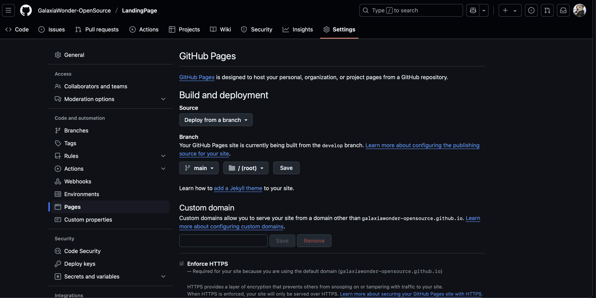

Enlace para acceder a la landing page: [https://galaxiawonder-opensource.github.io/LandingPage/](https://galaxiawonder-opensource.github.io/LandingPage/)

**LANDING PAGE V2 DEPLOYMENT**

Para la segunda implementación de la landing page del proyecto, se decidió utilizar Netlify. Para ello, se siguio el siguiente proceso:

1. Seleccionar la opción de importar un proyecto existente.

2. Seleccionamos mediante GitHub

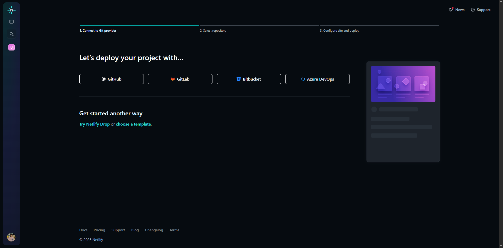

3. Seleccionamos la opción de organización

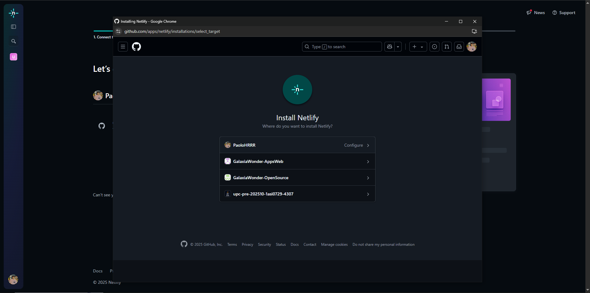

4. Seleccionamos el repositorio de la landing page

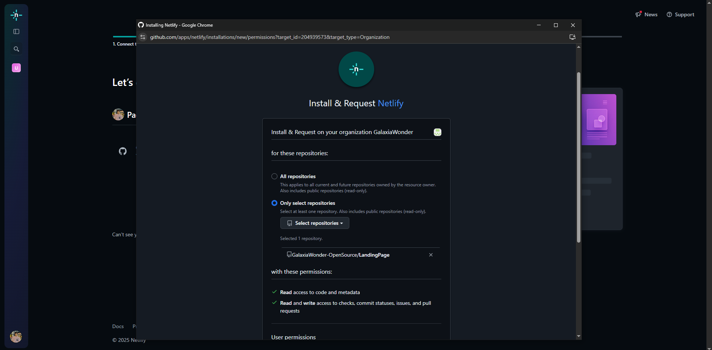

5. Se refleja las configuraciones en el dashboard

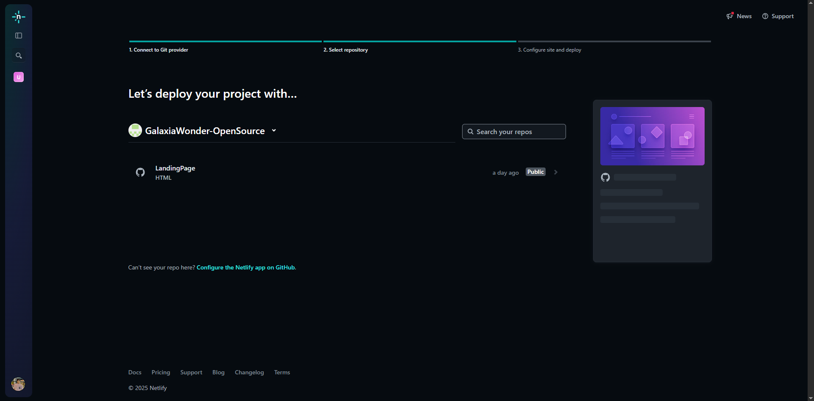

6. Configuramos el sitename (url) del web page, la rama y el comando de build y guardamos los cambios.

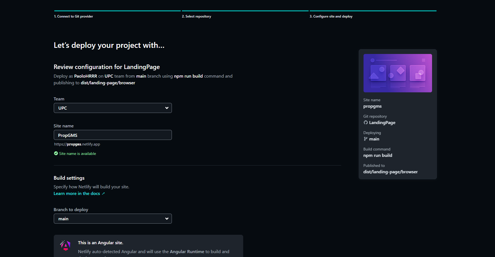

**WEB APPLICATION DEPLOYMENT**

Para la primera implementación de la web application se decidió utilizar Azure. Para ello, se siguio el siguiente proceso:

1. Seleccionar la opción de Aplicación Web Estática

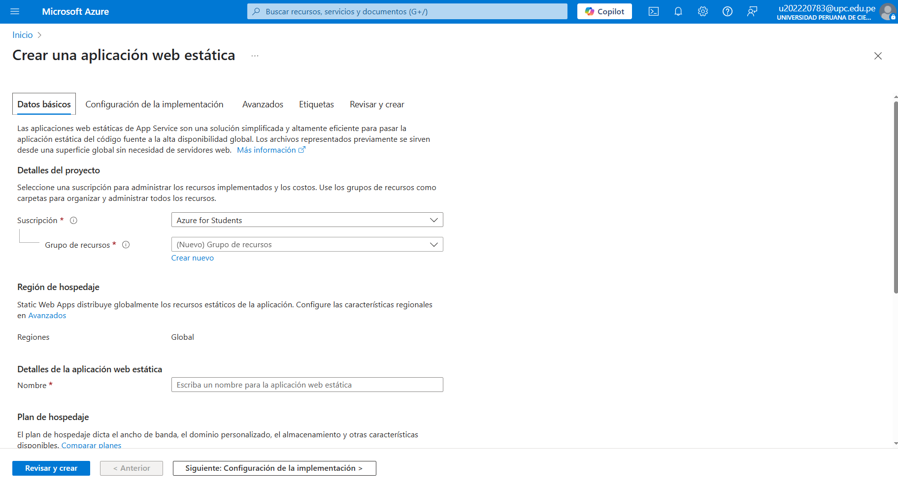

2. Configurar nombre, organización, repositorio y rama

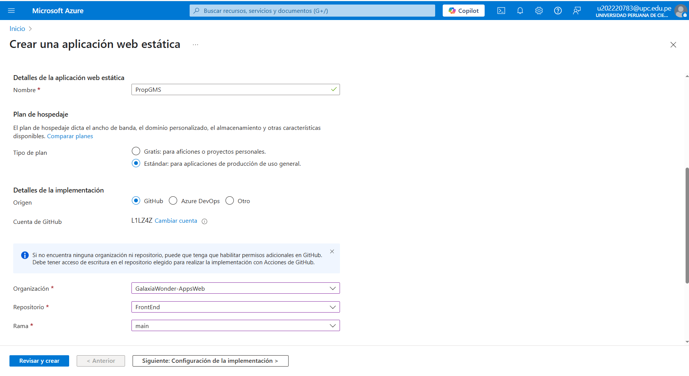

3. Configuración de build

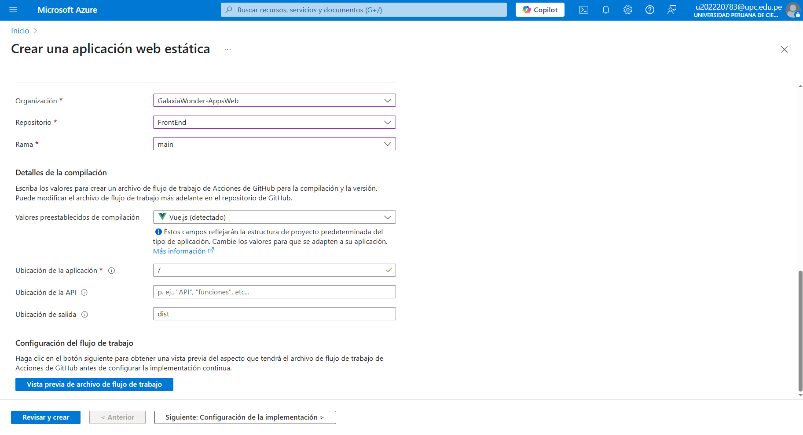

4. Revisamos los detalles antes de crear

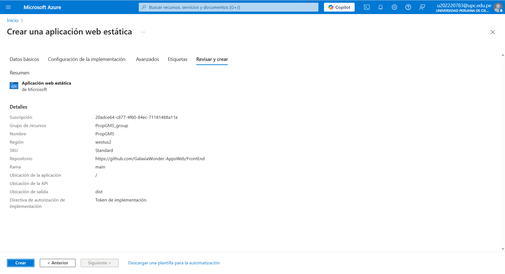

5. Agregar variables de entorno

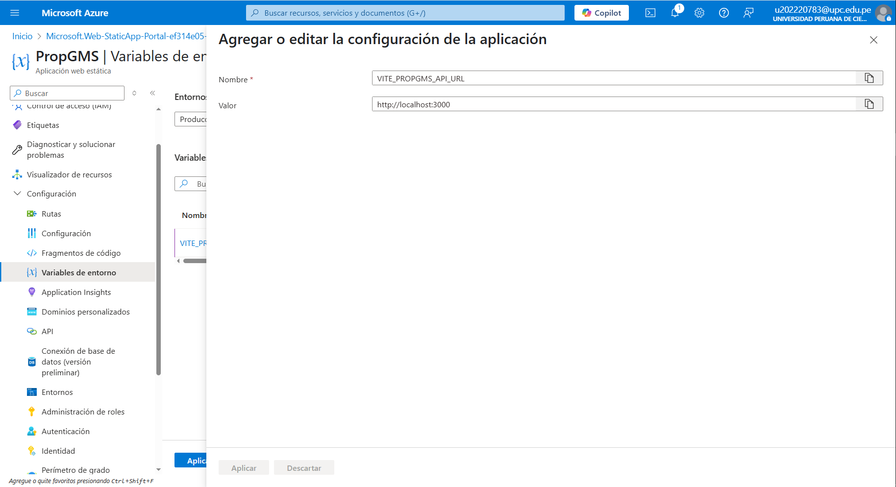

## 5.2. Landing Page, Services & Applications Implementation

### 5.2.1. Sprint 1

#### 5.2.1.1. Sprint Planning 1

<table cellpadding="6" cellspacing="0" style="border-collapse: collapse; width: 100%;">
  <tr>
    <th colspan="2"><strong>Sprint #</strong></th>
    <td colspan="2">Sprint 1</td>
  </tr>
  <tr>
    <th colspan="4" style="background-color: #d9d9d9;"><strong>Sprint Planning Background</strong></th>
  </tr>
  <tr>
    <th style="width: 20%;">Date</th>
    <td colspan="3">2025-04-22</td>
  </tr>
  <tr>
    <th>Time</th>
    <td colspan="3">07:40 PM</td>
  </tr>
  <tr>
    <th>Location</th>
    <td colspan="3">Mediante una videollamada en Discord.</td>
  </tr>
  <tr>
    <th>Prepared By</th>
    <td colspan="3">Orozco Torres, Álvaro Joaquín</td>
  </tr>
  <tr>
    <th>Attendees (to planning meeting)</th>
    <td colspan="3">Aponte Cruzado, Andrea Marielena / León Vivas, Fabrizio Amir / López Acuña, Mario Joaquín / Reaño Delgadillo, Henry Paolo</td>
  </tr>
  <tr>
    <th>Sprint 0 Review Summary</th>
    <td colspan="3">No hubo Sprint anterior (este es el primer sprint)</td>
  </tr>
  <tr>
    <th>Sprint 0 Retrospective Summary</th>
    <td colspan="3">No hubo Sprint anterior (este es el primer sprint)</td>
  </tr>
  <tr>
    <th colspan="4" style="background-color: #d9d9d9;"><strong>Sprint Goal & User Stories</strong></th>
  </tr>
  <tr>
    <th>Sprint 1 Goal</th>
    <td colspan="3">Nuestro foco está en dar visibilidad al producto, sus principales caracterísiticas y beneficios a nuestros usuarios. Creemos que expande nuestro alcance comercial y genera confianza e interés por parte de nuestros usuarios. Esto será confirmado cuando los usuarios comiencen a contactarnos mediante el envío del formulario en la landing page.</td>
  </tr>
  <tr>
    <th>Sprint 1 Velocity</th>
    <td colspan="3">20 Story Points</td>
  </tr>
  <tr>
    <th>Sum of Story Points</th>
    <td colspan="3">18 Story Points</td>
  </tr>
</table>

#### 5.2.1.2. Aspect Leaders & Collaborators

Debido a la presión por completar el Sprint 1 a tiempo, no se manejó a gran detalle una coordinación de aspectos. Se acordó establecer como aspecto general el desarrollo de la Landing Page, del cual el lider fue Fabrizio León.

<table cellpadding="6" cellspacing="0" style="border-collapse: collapse; width: 100%;">
  <tr>
    <th>Team Member  (Last Name, First Name)</th>
    <th>GitHub Username</th>
    <th>Landing Page  Leader (L) / Collaborator (C)</th>
  </tr>
  <tr>
    <td>Aponte Cruzado, Andrea Marielena</td>
    <td>iconicmiau</td>
    <td>C</td>
  </tr>
  <tr>
    <td>León Vivas, Fabrizio Amir</td>
    <td>CodyLionVivo</td>
    <td>L</td>
  </tr>
  <tr>
    <td>López Acuña, Mario Joaquín</td>
    <td>tertegen</td>
    <td>C</td>
  </tr>
  <tr>
    <td>Orozco Torres, Álvaro Joaquín</td>
    <td>L1LZ4Z</td>
    <td>C</td>
  </tr>
  <tr>
    <td>Reaño Delgadillo, Henry Paolo</td>
    <td>PaoloHRRR</td>
    <td>C</td>
  </tr>
</table>

#### 5.2.1.3. Sprint Backlog 1

<a href="https://galaxiawonder.youtrack.cloud/dashboard?id=213-2" target="_blank">Ver tablero en YouTrack</a>

<b>Credenciales:</b>
<ul>
  <li>
    Correo: 
    
      invitadogw&#64;galaxiawonder.com
    
  </li>
  <li>Contraseña: GA14x4W0nd3r</li>
</ul>

<table cellpadding="6" cellspacing="0">
  <tr>
    <th colspan="8">Sprint #</th>
    <td colspan="8">Sprint n</td>
  </tr>
  <tr>
    <th colspan="2">User Story</th>
    <th colspan="6">Work-Item / Task</th>
  </tr>
  <tr>
    <th>Id</th>
    <th>Title</th>
    <th>Id</th>
    <th>Title</th>
    <th>Description</th>
    <th>Estimation (Hours)</th>
    <th>Assigned To</th>
    <th>Status (To-Do / In-Process / To-Review / Done)</th>
  </tr>
        <tr>
            <td>SWR01</td>
            <td>Cambiar segmento objetivo</td>
            <td>SWR01-1</td>
            <td>Codear el HTML</td>
            <td>Crear las estructuras de marcado semántico correspondientes al componente o sección</td>
            <td>1</td>
            <td>León Vivas, Fabrizio Amir</td>
            <td>Done</td>
        </tr>
        <tr>
            <td></td><td></td>
            <td>SWR01-2</td>
            <td>Codear el CSS</td>
            <td>Crear y aplicar los estilos correspondientes al componente o sección</td>
            <td>1</td>
            <td>León Vivas, Fabrizio Amir</td>
            <td>Done</td>
        </tr>
        <tr>
            <td>SWR06</td>
            <td>Call to action Contratista</td>
            <td>SWR06-1</td>
            <td>Codear el HTML</td>
            <td>Crear las estructuras de marcado semántico correspondientes al componente o sección</td>
            <td>1</td>
            <td>León Vivas, Fabrizio Amir</td>
            <td>Done</td>
        </tr>
        <tr>
            <td></td><td></td>
            <td>SWR06-2</td>
            <td>Codear el CSS</td>
            <td>Crear y aplicar los estilos correspondientes al componente o sección</td>
            <td>1</td>
            <td>León Vivas, Fabrizio Amir</td>
            <td>Done</td>
        </tr>
        <tr>
            <td>SWR07</td>
            <td>Call to action Cliente</td>
            <td>SWR07-1</td>
            <td>Codear el HTML</td>
            <td>Crear las estructuras de marcado semántico correspondientes al componente o sección</td>
            <td>1</td>
            <td>León Vivas, Fabrizio Amir</td>
            <td>Done</td>
        </tr>
        <tr>
            <td></td><td></td>
            <td>SWR07-2</td>
            <td>Codear el CSS</td>
            <td>Crear y aplicar los estilos correspondientes al componente o sección</td>
            <td>1</td>
            <td>León Vivas, Fabrizio Amir</td>
            <td>Done</td>
        </tr>
        <tr>
            <td>SWR05</td>
            <td>Hero Section Contratista</td>
            <td>SWR05-1</td>
            <td>Codear el HTML</td>
            <td>Crear las estructuras de marcado semántico correspondientes al componente o sección</td>
            <td>1</td>
            <td>León Vivas, Fabrizio Amir</td>
            <td>Done</td>
        </tr>
        <tr>
            <td></td><td></td>
            <td>SWR05-2</td>
            <td>Codear el CSS</td>
            <td>Crear y aplicar los estilos correspondientes al componente o sección</td>
            <td>1</td>
            <td>León Vivas, Fabrizio Amir</td>
            <td>Done</td>
        </tr>
        <tr>
            <td>SWR04</td>
            <td>Hero Section Cliente</td>
            <td>SWR04-1</td>
            <td>Codear el HTML</td>
            <td>Crear las estructuras de marcado semántico correspondientes al componente o sección</td>
            <td>1</td>
            <td>León Vivas, Fabrizio Amir</td>
            <td>Done</td>
        </tr>
        <tr>
            <td></td><td></td>
            <td>SWR04-2</td>
            <td>Codear el CSS</td>
            <td>Crear y aplicar los estilos correspondientes al componente o sección</td>
            <td>1</td>
            <td>León Vivas, Fabrizio Amir</td>
            <td>Done</td>
        </tr>
        <tr>
            <td>SWR09</td>
            <td>Overview contratista</td>
            <td>SWR09-1</td>
            <td>Codear el HTML</td>
            <td>Crear las estructuras de marcado semántico correspondientes al componente o sección</td>
            <td>1</td>
            <td>León Vivas, Fabrizio Amir</td>
            <td>Done</td>
        </tr>
        <tr>
            <td></td><td></td>
            <td>SWR09-2</td>
            <td>Codear el CSS</td>
            <td>Crear y aplicar los estilos correspondientes al componente o sección</td>
            <td>1</td>
            <td>León Vivas, Fabrizio Amir</td>
            <td>Done</td>
        </tr>
        <tr>
            <td>SWR08</td>
            <td>Overview cliente</td>
            <td>SWR08-1</td>
            <td>Codear el HTML</td>
            <td>Crear las estructuras de marcado semántico correspondientes al componente o sección</td>
            <td>1</td>
            <td>León Vivas, Fabrizio Amir</td>
            <td>Done</td>
        </tr>
        <tr>
            <td></td><td></td>
            <td>SWR08-2</td>
            <td>Codear el CSS</td>
            <td>Crear y aplicar los estilos correspondientes al componente o sección</td>
            <td>1</td>
            <td>León Vivas, Fabrizio Amir</td>
            <td>Done</td>
        </tr>
        <tr>
            <td>SWR11</td>
            <td>Beneficios contratista</td>
            <td>SWR11-1</td>
            <td>Codear el HTML</td>
            <td>Crear las estructuras de marcado semántico correspondientes al componente o sección</td>
            <td>1</td>
            <td>León Vivas, Fabrizio Amir</td>
            <td>Done</td>
        </tr>
        <tr>
            <td></td><td></td>
            <td>SWR11-2</td>
            <td>Codear el CSS</td>
            <td>Crear y aplicar los estilos correspondientes al componente o sección</td>
            <td>1</td>
            <td>León Vivas, Fabrizio Amir</td>
            <td>Done</td>
        </tr>
        <tr>
            <td>SWR10</td>
            <td>Beneficios cliente</td>
            <td>SWR10-1</td>
            <td>Codear el HTML</td>
            <td>Crear las estructuras de marcado semántico correspondientes al componente o sección</td>
            <td>1</td>
            <td>León Vivas, Fabrizio Amir</td>
            <td>Done</td>
        </tr>
        <tr>
            <td></td><td></td>
            <td>SWR10-2</td>
            <td>Codear el CSS</td>
            <td>Crear y aplicar los estilos correspondientes al componente o sección</td>
            <td>1</td>
            <td>León Vivas, Fabrizio Amir</td>
            <td>Done</td>
        </tr>
        <tr>
            <td>SWR16</td>
            <td>About The Product</td>
            <td>SWR16-1</td>
            <td>Codear el HTML</td>
            <td>Crear las estructuras de marcado semántico correspondientes al componente o sección</td>
            <td>1</td>
            <td>León Vivas, Fabrizio Amir</td>
            <td>Done</td>
        </tr>
        <tr>
            <td></td><td></td>
            <td>SWR16-2</td>
            <td>Codear el CSS</td>
            <td>Crear y aplicar los estilos correspondientes al componente o sección</td>
            <td>1</td>
            <td>León Vivas, Fabrizio Amir</td>
            <td>Done</td>
        </tr>
        <tr>
            <td>SWR03</td>
            <td>About Us</td>
            <td>SWR03-1</td>
            <td>Codear el HTML</td>
            <td>Crear las estructuras de marcado semántico correspondientes al componente o sección</td>
            <td>1</td>
            <td>León Vivas, Fabrizio Amir</td>
            <td>Done</td>
        </tr>
        <tr>
            <td></td><td></td>
            <td>SWR03-2</td>
            <td>Codear el CSS</td>
            <td>Crear y aplicar los estilos correspondientes al componente o sección</td>
            <td>1</td>
            <td>León Vivas, Fabrizio Amir</td>
            <td>Done</td>
        </tr>
        <tr>
            <td>SWR13</td>
            <td>Testimonios contratista</td>
            <td>SWR13-1</td>
            <td>Codear el HTML</td>
            <td>Crear las estructuras de marcado semántico correspondientes al componente o sección</td>
            <td>1</td>
            <td>León Vivas, Fabrizio Amir</td>
            <td>Done</td>
        </tr>
        <tr>
            <td></td><td></td>
            <td>SWR13-2</td>
            <td>Codear el CSS</td>
            <td>Crear y aplicar los estilos correspondientes al componente o sección</td>
            <td>1</td>
            <td>León Vivas, Fabrizio Amir</td>
            <td>Done</td>
        </tr>
                <tr>
            <td>SWR12</td>
            <td>Testimonios cliente</td>
            <td>SWR12-1</td>
            <td>Codear el HTML</td>
            <td>Crear las estructuras de marcado semántico correspondientes al componente o sección</td>
            <td>1</td>
            <td>León Vivas, Fabrizio Amir</td>
            <td>Done</td>
        </tr>
        <tr>
            <td></td><td></td>
            <td>SWR12-2</td>
            <td>Codear el CSS</td>
            <td>Crear y aplicar los estilos correspondientes al componente o sección</td>
            <td>1</td>
            <td>León Vivas, Fabrizio Amir</td>
            <td>Done</td>
        </tr>
        <tr>
            <td>SWR02</td>
            <td>Internacionalización</td>
            <td>SWR02-1</td>
            <td>Codear el HTML</td>
            <td>Crear las estructuras de marcado semántico correspondientes al componente o sección</td>
            <td>1</td>
            <td>León Vivas, Fabrizio Amir</td>
            <td>Done</td>
        </tr>
        <tr>
            <td></td><td></td>
            <td>SWR02-2</td>
            <td>Codear el CSS</td>
            <td>Crear y aplicar los estilos correspondientes al componente o sección</td>
            <td>1</td>
            <td>León Vivas, Fabrizio Amir</td>
            <td>Done</td>
        </tr>
        <tr>
            <td>SWR18</td>
            <td>Planes</td>
            <td>SWR18-1</td>
            <td>Codear el HTML</td>
            <td>Crear las estructuras de marcado semántico correspondientes al componente o sección</td>
            <td>1</td>
            <td>León Vivas, Fabrizio Amir</td>
            <td>Done</td>
        </tr>
        <tr>
            <td></td><td></td>
            <td>SWR18-2</td>
            <td>Codear el CSS</td>
            <td>Crear y aplicar los estilos correspondientes al componente o sección</td>
            <td>1</td>
            <td>León Vivas, Fabrizio Amir</td>
            <td>Done</td>
        </tr>
        <tr>
            <td>SWR14</td>
            <td>Footer</td>
            <td>SWR14-1</td>
            <td>Codear el HTML</td>
            <td>Crear las estructuras de marcado semántico correspondientes al componente o sección</td>
            <td>1</td>
            <td>León Vivas, Fabrizio Amir</td>
            <td>Done</td>
        </tr>
        <tr>
            <td></td><td></td>
            <td>SWR14-2</td>
            <td>Codear el CSS</td>
            <td>Crear y aplicar los estilos correspondientes al componente o sección</td>
            <td>1</td>
            <td>León Vivas, Fabrizio Amir</td>
            <td>Done</td>
        </tr>
        <tr>
            <td>SWR17</td>
            <td>Términos y condiciones de uso</td>
            <td>SWR17-1</td>
            <td>Codear el HTML</td>
            <td>Crear las estructuras de marcado semántico correspondientes al componente o sección</td>
            <td>1</td>
            <td>León Vivas, Fabrizio Amir</td>
            <td>Done</td>
        </tr>
        <tr>
            <td></td><td></td>
            <td>SWR17-2</td>
            <td>Codear el CSS</td>
            <td>Crear y aplicar los estilos correspondientes al componente o sección</td>
            <td>1</td>
            <td>León Vivas, Fabrizio Amir</td>
            <td>Done</td>
        </tr>
        <tr>
            <td>SWR15</td>
            <td>Header</td>
            <td>SWR15-1</td>
            <td>Codear el HTML</td>
            <td>Crear las estructuras de marcado semántico correspondientes al componente o sección</td>
            <td>1</td>
            <td>León Vivas, Fabrizio Amir</td>
            <td>Done</td>
        </tr>
        <tr>
            <td></td><td></td>
            <td>SWR15-2</td>
            <td>Codear el CSS</td>
            <td>Crear y aplicar los estilos correspondientes al componente o sección</td>
            <td>1</td>
            <td>León Vivas, Fabrizio Amir</td>
            <td>Done</td>
        </tr>
</table>

#### 5.2.1.4. Development Evidence for Sprint Review

En el Sprint 1, se realizó una primera implementación de la Landing Page utilizando HTML, CSS y JavaScript estándar.

| Repository | Branch | Commit Id | Commit Message | Commit Message Body | Commit on |
| - | - | - | - | - | - |
| LandingPage | feature/swr14 | c0280860da324d508c57f2ce0f20f0d07c5c7fc8 | chore: add base html structure |   | 24/04/2025 |
| LandingPage | feature/swr14 | cdf3c43c2ae65a3b3d376533000745d943d11b36 | chore: add css style for the footer |   | 24/04/2025 |
| LandingPage | feature/swr14 | 391ef8145bd877cdab1cdd3ddbe526f64d5e2cc3 | feat(swr14): add html code for the footer |   | 24/04/2025 |
| LandingPage | feature/swr16 | ff602386552405addae234831b560ba6cfe5371d | feat(swr16): add css style for the testimonials section |   | 25/04/2025 |
| LandingPage | feature/swr16 | 44b11ecef00abbbdc146c617af644f10cfbbcc6a | feat(swr16): add responsive style for the testimonials section |   | 25/04/2025 |
| LandingPage | feature/swr16 | 83e52386354b64f4ad4ddbf5b7880c3cfdcc06c2 | feat(swr16): add html code and assets for the testimonials section |   | 25/04/2025 |
| LandingPage | feature/swr18 | 9c2ecce449679f5c0310553c80aa293c5949320b | feat(swr18): add css and responsive style for the plans section |   | 25/04/2025 |
| LandingPage | feature/swr18 | a308466d66e3a3a60c22fd39ade4ed80462498be | feat(swr18): add global styles to resize the landing |   | 25/04/2025 |
| LandingPage | feature/swr18 | 6409299a278f60e2f8b634578609d8fef11c8abc | feat(swr18): add html code and assets for the plans section |   | 25/04/2025 |
| LandingPage | feature/swr09 | ae6644ab5e17fc77edbd92796b1aa5a398804fa1 | feat(swr09): add css and responsive style for the overview contractor section |   | 25/04/2025 |
| LandingPage | feature/swr09 | 31d5ce0c9c306a796d60c24ab74d71492f91db2d | feat(swr09): import overview css file in style css file |   | 25/04/2025 |
| LandingPage | feature/swr09 | 9a9b43ea362684df35dc4b1bcf5638a1dd446c60 | feat(swr09): add html code and assets for the overview contractor section |   | 25/04/2025 |
| LandingPage | feature/swr09 | 99c188191c5213ad23a198f9d7824ec0de6ae3c3 | feat(swr09): add google font link and change the title |   | 25/04/2025 |
| LandingPage | feature/swr03 | ded4de2f86feedf1966f0654c22cd3e61f4950fc | feat(swr03): add assets for the about us section |   | 25/04/2025 |
| LandingPage | feature/swr03 | 62d562bbd563f07a35fe357e1f77aed1d948c404 | feat(swr03): add css and responsive style for the about us section |   | 25/04/2025 |
| LandingPage | feature/swr03 | 3c2226be5b31df871bc6f0a00041fa6707c8ac4d | feat(swr03): add html code for the about us section |   | 25/04/2025 |
| LandingPage | feature/swr05 | bb6c3af5abd72d36eb7470f425b15da3257e26f0 | feat(swr05): add assets for the hero contractor section |   | 25/04/2025 |
| LandingPage | feature/swr05 | 4c083ec09d305b04a6969e150d8bc9e4cd461c8d | feat(swr05): add css and responsive style for the hero contractor section |   | 25/04/2025 |
| LandingPage | feature/swr05 | 800b22233bae05a70ae26ffcc71c12c2fe9d84d6 | feat(swr05): add html code for the hero contractor section |   | 25/04/2025 |
| LandingPage | feature/swr15 | 394c46a3a439edbfdd06f511a88c2a4b18c7fc58 | feat(swr15): add assets for the header section |   | 25/04/2025 |
| LandingPage | feature/swr15 | f7b907d1e40d493826566de9618b476097fbd050 | feat(swr15): add css and responsive style for the header section |   | 25/04/2025 |
| LandingPage | feature/swr15 | 9ac4e3dfddb6d589860992c165337b43acf47a9a | feat(swr15): add html code for the header section |   | 25/04/2025 |
| LandingPage | feature/swr13 | b6b07c1830b3afa8f90b52817c6cb7dd0427c5be | feat(swr13): add assets for the about the product section |   | 25/04/2025 |
| LandingPage | feature/swr13 | 8a8d134c794d760725b1c25c8e1570ba631ec32c | feat(swr13): add css and responsive style for about the product section |   | 25/04/2025 |
| LandingPage | feature/swr13 | 458a2639f0c4bd29fae6ca75630717d843c9ee0a | feat(swr13): add html code for about the product section |   | 25/04/2025 |
| LandingPage | bugfix/all | ede47fd561d8e5f126c9e5741cccb951e771dab8 | bugfix(all): change html and css for better spacing and display |   | 26/04/2025 |

#### 5.2.1.5. Execution Evidence for Sprint Review

Se presenta a modo de evidencia un video y capturas de las principales vistas implementadas. Enlace al video: [https://upcedupe-my.sharepoint.com/:v:/g/personal/u20221e247_upc_edu_pe/Eef8AaDopq1BkrLP5OpQuGgB-geWGBvFVLlh4fa_Z79gWA?nav=eyJyZWZlcnJhbEluZm8iOnsicmVmZXJyYWxBcHAiOiJTdHJlYW1XZWJBcHAiLCJyZWZlcnJhbFZpZXciOiJTaGFyZURpYWxvZy1MaW5rIiwicmVmZXJyYWxBcHBQbGF0Zm9ybSI6IldlYiIsInJlZmVycmFsTW9kZSI6InZpZXcifX0%3D&e=HhQ2rF](https://upcedupe-my.sharepoint.com/:v:/g/personal/u20221e247_upc_edu_pe/Eef8AaDopq1BkrLP5OpQuGgB-geWGBvFVLlh4fa_Z79gWA?nav=eyJyZWZlcnJhbEluZm8iOnsicmVmZXJyYWxBcHAiOiJTdHJlYW1XZWJBcHAiLCJyZWZlcnJhbFZpZXciOiJTaGFyZURpYWxvZy1MaW5rIiwicmVmZXJyYWxBcHBQbGF0Zm9ybSI6IldlYiIsInJlZmVycmFsTW9kZSI6InZpZXcifX0%3D&e=HhQ2rF)

**HERO SECTION**

Contiene el formulario de contacto con una frase llamativa

**ABOUT US**

Contiene información sobre nuestra startup

**FEATURES**

Detalla, para grupo por segmento, cuales son las principales funcionalidades del producto

**PLANS**

Se presentan los planes de suscripción (los diseñados provisionalmente)

**FOOTER Y TESTIMONIALS**

Junto al footer con información de contacto, se presentan testimonios de usuarios

#### 5.2.1.6. Services Documentation Evidence for Sprint Review

No hubo desarrollo del API en este Sprint 1.

#### 5.2.1.7. Software Deployment Evidence for Sprint Review

Para este primer versión de la Landing Page, el despliegue incluyó:

1. Creación del primer release a partir de lo avanzado en develop.
2. Integración del código en la branch de producción (main).
3. Configuración de GitHub Pages para su despliegue a partir de la rama de producción.

#### 5.2.1.8. Team Collaboration Insights during Sprint

Para este primer Sprint, el equipo ha fallado en tener una participación completa en el desarrollo de la Landing Page, cayendo la responsabilidad del desarrollo en León Vivas, Fabrizio Amir. Se añadió demás un trabajo de correción de emergencia previo despligue realizado por Orozco Torres, Álvaro Joaquín, fuera de lo planificado en el Sprint Planning.

### 5.2.2. Sprint 2

#### 5.2.2.1. Sprint Planning 2

<table cellpadding="6" cellspacing="0" style="border-collapse: collapse; width: 100%;">
  <tr>
    <th colspan="2"><strong>Sprint #</strong></th>
    <td colspan="2">Sprint 2</td>
  </tr>
  <tr>
    <th colspan="4" style="background-color: #d9d9d9;"><strong>Sprint Planning Background</strong></th>
  </tr>
  <tr>
    <th style="width: 20%;">Date</th>
    <td colspan="3">2025-04-28</td>
  </tr>
  <tr>
    <th>Time</th>
    <td colspan="3">07:40 PM</td>
  </tr>
  <tr>
    <th>Location</th>
    <td colspan="3">Biblioteca Monterrico - Cubículo de estudiantes</td>
  </tr>
  <tr>
    <th>Prepared By</th>
    <td colspan="3">Orozco Torres, Álvaro Joaquín</td>
  </tr>
  <tr>
    <th>Attendees (to planning meeting)</th>
    <td colspan="3">Aponte Cruzado, Andrea Marielena / Orozco Torres, Álvaro Joaquín / Reaño Delgadillo, Henry Paolo</td>
  </tr>
  <tr>
    <th>Sprint 1 Review Summary</th>
    <td colspan="3">El sprint anterior logró realizar una primera implementación de la Landing Page. Sin embargo, esta implementación no ha llegado a cumplir con las expectativas de los miembros del equipo, quienes identifican una oportunidad de mejora en utilizar el framework de Angular para facilitar su mantenibilidad, aspecto y permitir además implementar ciertas funcionalidades que no lograron a completarse en la primera versión.</td>
  </tr>
  <tr>
    <th>Sprint 1 Retrospective Summary</th>
    <td colspan="3">Se identificó una ligera falta de coordinación debido principalmente a la presión del tiempo para el primer entregable. Para el sprint actual, se decidió mantener el mismo modo de organización debido a</td>
  </tr>
  <tr>
    <th colspan="4" style="background-color: #d9d9d9;"><strong>Sprint Goal & User Stories</strong></th>
  </tr>
  <tr>
    <th>Sprint 2 Goal</th>
    <td colspan="3">Nuestro foco está en implementar el front-end con alta fidelidad al diseño de UX/UI previsto por el equipo, tanto en la aplicación web como landing page. Creemos que expande nos permite no solo mostrar el alcance de proyecto claramente, sino también identificar posibles puntos de mejora los distintos workflows. Esto será confirmado cuando se realice una evaluación según heurísticas de usabilidad.</td>
  </tr>
  <tr>
    <th>Sprint 2 Velocity</th>
    <td colspan="3">70 Story Points</td>
  </tr>
  <tr>
    <th>Sum of Story Points</th>
    <td colspan="3">176 Story Points</td>
  </tr>
</table>

#### 5.2.2.2. Aspect Leaders & Collaborators

Para el Sprint 2, se proyectan actividades como la segunda versión del Landing Page y la implementación de las vistas del Web Application.

<table cellpadding="6" cellspacing="0" style="border-collapse: collapse; width: 100%;">
  <tr>
    <th>Team Member  (Last Name, First Name)</th>
    <th>GitHub Username</th>
    <th>Landing Page Leader (L) / Collaborator (C)</th>
    <th>Web Application UX/UI Leader (L) / Collaborator (C)</th>
    <th>Web Application DDD Architecture Leader (L) / Collaborator (C)</th>
  </tr>
  <tr>
    <td>Aponte Cruzado, Andrea Marielena</td>
    <td>iconicmiau</td>
    <td>C</td>
    <td>L</td>
    <td>C</td>
  </tr>
  <tr>
    <td>Orozco Torres, Álvaro Joaquín</td>
    <td>CodyLionVivo</td>
    <td>C</td>
    <td>C</td>
    <td>C</td>
  </tr>
  <tr>
    <td>López Acuña, Mario Joaquín</td>
    <td>tertegen</td>
    <td>C</td>
    <td>C</td>
    <td>C</td>
  </tr>
  <tr>
    <td>Orozco Torres, Álvaro Joaquín</td>
    <td>L1LZ4Z</td>
    <td>C</td>
    <td>C</td>
    <td>L</td>
  </tr>
  <tr>
    <td>Reaño Delgadillo, Henry Paolo</td>
    <td>PaoloHRRR</td>
    <td>L</td>
    <td>C</td>
    <td>C</td>
  </tr>
</table>

#### 5.2.2.3. Sprint Backlog 2

<a href="https://galaxiawonder.youtrack.cloud/dashboard?id=213-2" target="_blank">Ver tablero en YouTrack</a>

<b>Credenciales:</b>
<ul>
  <li>
    Correo: 
    
      invitadogw&#64;galaxiawonder.com
    
  </li>
  <li>Contraseña: GA14x4W0nd3r</li>
</ul>

<table cellpadding="6" cellspacing="0">
  <tr>
    <th colspan="8">Sprint #</th>
    <td colspan="8">Sprint n</td>
  </tr>
  <tr>
    <th colspan="2">User Story</th>
    <th colspan="6">Work-Item / Task</th>
  </tr>
  <tr>
    <th>Id</th>
    <th>Title</th>
    <th>Id</th>
    <th>Title</th>
    <th>Description</th>
    <th>Estimation (Hours)</th>
    <th>Assigned To</th>
    <th>Status (To-do / In-Process / To-Review / Done)</th>
  </tr>
        <tr>
            <td>SWR01</td>
            <td>Cambiar segmento objetivo</td>
            <td>SWR01-1</td>
            <td>Codear el HTML</td>
            <td>Crear las estructuras de marcado semántico correspondientes al componente o sección</td>
            <td>1</td>
            <td>Orozco Torres, Álvaro Joaquín</td>
            <td>Done</td>
        </tr>
        <tr>
            <td></td><td></td>
            <td>SWR01-2</td>
            <td>Codear el CSS</td>
            <td>Crear y aplicar los estilos correspondientes al componente o sección</td>
            <td>1</td>
            <td>Orozco Torres, Álvaro Joaquín</td>
            <td>Done</td>
        </tr>
        <tr>
            <td>SWR06</td>
            <td>Call to action Contratista</td>
            <td>SWR06-1</td>
            <td>Codear el HTML</td>
            <td>Crear las estructuras de marcado semántico correspondientes al componente o sección</td>
            <td>1</td>
            <td>Orozco Torres, Álvaro Joaquín</td>
            <td>Done</td>
        </tr>
        <tr>
            <td></td><td></td>
            <td>SWR06-2</td>
            <td>Codear el CSS</td>
            <td>Crear y aplicar los estilos correspondientes al componente o sección</td>
            <td>1</td>
            <td>Orozco Torres, Álvaro Joaquín</td>
            <td>Done</td>
        </tr>
        <tr>
            <td>SWR07</td>
            <td>Call to action Cliente</td>
            <td>SWR07-1</td>
            <td>Codear el HTML</td>
            <td>Crear las estructuras de marcado semántico correspondientes al componente o sección</td>
            <td>1</td>
            <td>Orozco Torres, Álvaro Joaquín</td>
            <td>Done</td>
        </tr>
        <tr>
            <td></td><td></td>
            <td>SWR07-2</td>
            <td>Codear el CSS</td>
            <td>Crear y aplicar los estilos correspondientes al componente o sección</td>
            <td>1</td>
            <td>Orozco Torres, Álvaro Joaquín</td>
            <td>Done</td>
        </tr>
        <tr>
            <td>SWR05</td>
            <td>Hero Section Contratista</td>
            <td>SWR05-1</td>
            <td>Codear el HTML</td>
            <td>Crear las estructuras de marcado semántico correspondientes al componente o sección</td>
            <td>1</td>
            <td>Orozco Torres, Álvaro Joaquín</td>
            <td>Done</td>
        </tr>
        <tr>
            <td></td><td></td>
            <td>SWR05-2</td>
            <td>Codear el CSS</td>
            <td>Crear y aplicar los estilos correspondientes al componente o sección</td>
            <td>1</td>
            <td>Orozco Torres, Álvaro Joaquín</td>
            <td>Done</td>
        </tr>
        <tr>
            <td>SWR04</td>
            <td>Hero Section Cliente</td>
            <td>SWR04-1</td>
            <td>Codear el HTML</td>
            <td>Crear las estructuras de marcado semántico correspondientes al componente o sección</td>
            <td>1</td>
            <td>Orozco Torres, Álvaro Joaquín</td>
            <td>Done</td>
        </tr>
        <tr>
            <td></td><td></td>
            <td>SWR04-2</td>
            <td>Codear el CSS</td>
            <td>Crear y aplicar los estilos correspondientes al componente o sección</td>
            <td>1</td>
            <td>Orozco Torres, Álvaro Joaquín</td>
            <td>Done</td>
        </tr>
        <tr>
            <td>SWR09</td>
            <td>Overview contratista</td>
            <td>SWR09-1</td>
            <td>Codear el HTML</td>
            <td>Crear las estructuras de marcado semántico correspondientes al componente o sección</td>
            <td>1</td>
            <td>Orozco Torres, Álvaro Joaquín</td>
            <td>Done</td>
        </tr>
        <tr>
            <td></td><td></td>
            <td>SWR09-2</td>
            <td>Codear el CSS</td>
            <td>Crear y aplicar los estilos correspondientes al componente o sección</td>
            <td>1</td>
            <td>Orozco Torres, Álvaro Joaquín</td>
            <td>Done</td>
        </tr>
        <tr>
            <td>SWR08</td>
            <td>Overview cliente</td>
            <td>SWR08-1</td>
            <td>Codear el HTML</td>
            <td>Crear las estructuras de marcado semántico correspondientes al componente o sección</td>
            <td>1</td>
            <td>Orozco Torres, Álvaro Joaquín</td>
            <td>Done</td>
        </tr>
        <tr>
            <td></td><td></td>
            <td>SWR08-2</td>
            <td>Codear el CSS</td>
            <td>Crear y aplicar los estilos correspondientes al componente o sección</td>
            <td>1</td>
            <td>Orozco Torres, Álvaro Joaquín</td>
            <td>Done</td>
        </tr>
        <tr>
            <td>SWR11</td>
            <td>Beneficios contratista</td>
            <td>SWR11-1</td>
            <td>Codear el HTML</td>
            <td>Crear las estructuras de marcado semántico correspondientes al componente o sección</td>
            <td>1</td>
            <td>Orozco Torres, Álvaro Joaquín</td>
            <td>Done</td>
        </tr>
        <tr>
            <td></td><td></td>
            <td>SWR11-2</td>
            <td>Codear el CSS</td>
            <td>Crear y aplicar los estilos correspondientes al componente o sección</td>
            <td>1</td>
            <td>Orozco Torres, Álvaro Joaquín</td>
            <td>Done</td>
        </tr>
        <tr>
            <td>SWR10</td>
            <td>Beneficios cliente</td>
            <td>SWR10-1</td>
            <td>Codear el HTML</td>
            <td>Crear las estructuras de marcado semántico correspondientes al componente o sección</td>
            <td>1</td>
            <td>Orozco Torres, Álvaro Joaquín</td>
            <td>Done</td>
        </tr>
        <tr>
            <td></td><td></td>
            <td>SWR10-2</td>
            <td>Codear el CSS</td>
            <td>Crear y aplicar los estilos correspondientes al componente o sección</td>
            <td>1</td>
            <td>Orozco Torres, Álvaro Joaquín</td>
            <td>Done</td>
        </tr>
        <tr>
            <td>SWR16</td>
            <td>About The Product</td>
            <td>SWR16-1</td>
            <td>Codear el HTML</td>
            <td>Crear las estructuras de marcado semántico correspondientes al componente o sección</td>
            <td>1</td>
            <td>Reaño Delgadillo, Henry Paolo</td>
            <td>Done</td>
        </tr>
        <tr>
            <td></td><td></td>
            <td>SWR16-2</td>
            <td>Codear el CSS</td>
            <td>Crear y aplicar los estilos correspondientes al componente o sección</td>
            <td>1</td>
            <td>Reaño Delgadillo, Henry Paolo</td>
            <td>Done</td>
        </tr>
        <tr>
            <td>SWR03</td>
            <td>About Us</td>
            <td>SWR03-1</td>
            <td>Codear el HTML</td>
            <td>Crear las estructuras de marcado semántico correspondientes al componente o sección</td>
            <td>1</td>
            <td>Reaño Delgadillo, Henry Paolo</td>
            <td>Done</td>
        </tr>
        <tr>
            <td></td><td></td>
            <td>SWR03-2</td>
            <td>Codear el CSS</td>
            <td>Crear y aplicar los estilos correspondientes al componente o sección</td>
            <td>1</td>
            <td>Reaño Delgadillo, Henry Paolo</td>
            <td>Done</td>
        </tr>
        <tr>
            <td>SWR13</td>
            <td>Testimonios contratista</td>
            <td>SWR13-1</td>
            <td>Codear el HTML</td>
            <td>Crear las estructuras de marcado semántico correspondientes al componente o sección</td>
            <td>1</td>
            <td>Reaño Delgadillo, Henry Paolo</td>
            <td>Done</td>
        </tr>
        <tr>
            <td></td><td></td>
            <td>SWR13-2</td>
            <td>Codear el CSS</td>
            <td>Crear y aplicar los estilos correspondientes al componente o sección</td>
            <td>1</td>
            <td>Reaño Delgadillo, Henry Paolo</td>
            <td>Done</td>
        </tr>
                <tr>
            <td>SWR12</td>
            <td>Testimonios cliente</td>
            <td>SWR12-1</td>
            <td>Codear el HTML</td>
            <td>Crear las estructuras de marcado semántico correspondientes al componente o sección</td>
            <td>1</td>
            <td>Reaño Delgadillo, Henry Paolo</td>
            <td>Done</td>
        </tr>
        <tr>
            <td></td><td></td>
            <td>SWR12-2</td>
            <td>Codear el CSS</td>
            <td>Crear y aplicar los estilos correspondientes al componente o sección</td>
            <td>1</td>
            <td>Reaño Delgadillo, Henry Paolo</td>
            <td>Done</td>
        </tr>
        <tr>
            <td>SWR02</td>
            <td>Internacionalización</td>
            <td>SWR02-1</td>
            <td>Codear el HTML</td>
            <td>Crear las estructuras de marcado semántico correspondientes al componente o sección</td>
            <td>1</td>
            <td>Orozco Torres, Álvaro Joaquín</td>
            <td>Done</td>
        </tr>
        <tr>
            <td></td><td></td>
            <td>SWR02-2</td>
            <td>Codear el CSS</td>
            <td>Crear y aplicar los estilos correspondientes al componente o sección</td>
            <td>1</td>
            <td>Orozco Torres, Álvaro Joaquín</td>
            <td>Done</td>
        </tr>
        <tr>
            <td>SWR18</td>
            <td>Planes</td>
            <td>SWR18-1</td>
            <td>Codear el HTML</td>
            <td>Crear las estructuras de marcado semántico correspondientes al componente o sección</td>
            <td>1</td>
            <td>Reaño Delgadillo, Henry Paolo</td>
            <td>Done</td>
        </tr>
        <tr>
            <td></td><td></td>
            <td>SWR18-2</td>
            <td>Codear el CSS</td>
            <td>Crear y aplicar los estilos correspondientes al componente o sección</td>
            <td>1</td>
            <td>Reaño Delgadillo, Henry Paolo</td>
            <td>Done</td>
        </tr>
        <tr>
            <td>SWR14</td>
            <td>Footer</td>
            <td>SWR14-1</td>
            <td>Codear el HTML</td>
            <td>Crear las estructuras de marcado semántico correspondientes al componente o sección</td>
            <td>1</td>
            <td>Aponte Cruzado, Andrea Marielena</td>
            <td>Done</td>
        </tr>
        <tr>
            <td></td><td></td>
            <td>SWR14-2</td>
            <td>Codear el CSS</td>
            <td>Crear y aplicar los estilos correspondientes al componente o sección</td>
            <td>1</td>
            <td>Aponte Cruzado, Andrea Marielena</td>
            <td>Done</td>
        </tr>
        <tr>
            <td>SWR17</td>
            <td>Términos y condiciones de uso</td>
            <td>SWR17-1</td>
            <td>Codear el HTML</td>
            <td>Crear las estructuras de marcado semántico correspondientes al componente o sección</td>
            <td>1</td>
            <td>Reaño Delgadillo, Henry Paolo</td>
            <td>Done</td>
        </tr>
        <tr>
            <td></td><td></td>
            <td>SWR17-2</td>
            <td>Codear el CSS</td>
            <td>Crear y aplicar los estilos correspondientes al componente o sección</td>
            <td>1</td>
            <td>Reaño Delgadillo, Henry Paolo</td>
            <td>Done</td>
        </tr>
        <tr>
            <td>SWR15</td>
            <td>Header</td>
            <td>SWR15-1</td>
            <td>Codear el HTML</td>
            <td>Crear las estructuras de marcado semántico correspondientes al componente o sección</td>
            <td>1</td>
            <td>Orozco Torres, Álvaro Joaquín</td>
            <td>Done</td>
        </tr>
        <tr>
            <td></td><td></td>
            <td>SWR15-2</td>
            <td>Codear el CSS</td>
            <td>Crear y aplicar los estilos correspondientes al componente o sección</td>
            <td>1</td>
            <td>Orozco Torres, Álvaro Joaquín</td>
            <td>Done</td>
        </tr>
  <tr>
    <td>US001</td>
    <td>Ingresar nombre del proyecto</td>
    <td>US001-1</td>
    <td>Diseñar campo de entrada</td>
    <td>Crear un campo de texto para ingresar el nombre del proyecto con validación obligatoria</td>
    <td>2</td>
    <td>Orozco Torres, Álvaro Joaquín</td>
    <td>Done</td>
  </tr>
  <tr>
    <td></td><td></td>
    <td>US001-2</td>
    <td>Validar campo al enviar</td>
    <td>Mostrar mensaje de error si el nombre está vacío al hacer submit</td>
    <td>1</td>
    <td>Orozco Torres, Álvaro Joaquín</td>
    <td>Done</td>
  </tr>
  <tr>
    <td></td><td></td>
    <td>US001-3</td>
    <td>Guardar nombre en backend</td>
    <td>Enviar solicitud al backend y guardar el nombre del proyecto en la base de datos</td>
    <td>2</td>
    <td>Orozco Torres, Álvaro Joaquín</td>
    <td>Done</td>
  </tr>
  <tr>
    <td>US002</td>
    <td>Ingresar fecha de inicio del proyecto</td>
    <td>US002-1</td>
    <td>Prellenar fecha actual</td>
    <td>Configurar el campo para que muestre la fecha actual al cargar el formulario</td>
    <td>1</td>
    <td>Orozco Torres, Álvaro Joaquín</td>
    <td>Done</td>
  </tr>
  <tr>
    <td></td><td></td>
    <td>US002-2</td>
    <td>Deshabilitar edición manual</td>
    <td>Evitar que el usuario edite la fecha de inicio automáticamente asignada</td>
    <td>1</td>
    <td>Orozco Torres, Álvaro Joaquín</td>
    <td>Done</td>
  </tr>
  <tr>
    <td>US003</td>
    <td>Ingresar fecha de finalización del proyecto</td>
    <td>US003-1</td>
    <td>Validar fecha posterior</td>
    <td>Verificar que la fecha de finalización sea posterior a la actual</td>
    <td>2</td>
    <td>Orozco Torres, Álvaro Joaquín</td>
    <td>Done</td>
  </tr>
  <tr>
    <td></td><td></td>
    <td>US003-2</td>
    <td>Mostrar mensajes de error</td>
    <td>Notificar al usuario si la fecha ingresada no es válida</td>
    <td>1</td>
    <td>Orozco Torres, Álvaro Joaquín</td>
    <td>Done</td>
  </tr>
  <tr>
    <td>US004</td>
    <td>Asociar contrato firmado y su fecha al proyecto</td>
    <td>US004-1</td>
    <td>Implementar campo de archivo</td>
    <td>Permitir seleccionar archivos locales en formatos PDF, DOCX, JPG, etc.</td>
    <td>2</td>
    <td>Orozco Torres, Álvaro Joaquín</td>
    <td>Done</td>
  </tr>
  <tr>
    <td></td><td></td>
    <td>US004-2</td>
    <td>Subir archivo al workspace</td>
    <td>Guardar el archivo en el repositorio de la organización y referenciarlo al proyecto</td>
    <td>2</td>
    <td>Orozco Torres, Álvaro Joaquín</td>
    <td>Done</td>
  </tr>
  <tr>
    <td></td><td></td>
    <td>US004-3</td>
    <td>Validar fecha y archivo</td>
    <td>Evitar envío del formulario si no se subió contrato o falta la fecha</td>
    <td>1</td>
    <td>Orozco Torres, Álvaro Joaquín</td>
    <td>Done</td>
  </tr>
  <tr>
    <td>US005</td>
    <td>Seleccionar entidad contratante del proyecto</td>
    <td>US005-1</td>
    <td>Crear input de correo electrónico</td>
    <td>Diseñar el campo para ingresar correo de la entidad contratante</td>
    <td>1</td>
    <td>Orozco Torres, Álvaro Joaquín</td>
    <td>Done</td>
  </tr>
  <tr>
    <td></td><td></td>
    <td>US005-2</td>
    <td>Validar correo registrado</td>
    <td>Verificar si el correo corresponde a una entidad contratante existente</td>
    <td>2</td>
    <td>Orozco Torres, Álvaro Joaquín</td>
    <td>Done</td>
  </tr>
  <tr>
    <td>US006</td>
    <td>Visualizar listado de proyectos accesibles</td>
    <td>US006-1</td>
    <td>Mostrar lista de proyectos</td>
    <td>Renderizar una tabla o lista con proyectos accesibles al usuario</td>
    <td>2</td>
    <td>Orozco Torres, Álvaro Joaquín</td>
    <td>Done</td>
  </tr>
  <tr>
    <td></td><td></td>
    <td>US006-2</td>
    <td>Mostrar estado y rol</td>
    <td>Incluir en cada proyecto el estado y rol del usuario</td>
    <td>1</td>
    <td>Orozco Torres, Álvaro Joaquín</td>
    <td>Done</td>
  </tr>
<tr>
  <td>US007</td>
  <td>Consultar los detalles de un proyecto específico</td>
  <td>US007-1</td>
  <td>Diseñar vista de detalle de proyecto</td>
  <td>Implementar componente que muestre los detalles como nombre, estado, fechas y miembros</td>
  <td>2</td>
  <td>Orozco Torres, Álvaro Joaquín</td>
  <td>Done</td>
</tr>
<tr>
  <td></td><td></td>
  <td>US007-2</td>
  <td>Gestionar permisos de visualización</td>
  <td>Restringir secciones según si el usuario es contratista o miembro regular</td>
  <td>2</td>
  <td>Orozco Torres, Álvaro Joaquín</td>
  <td>Done</td>
</tr>
<tr>
  <td>US008</td>
  <td>Editar nombre y descripción de un proyecto</td>
  <td>US008-1</td>
  <td>Agregar formulario editable</td>
  <td>Habilitar formulario en la sección de configuración para editar nombre y descripción</td>
  <td>2</td>
  <td>Orozco Torres, Álvaro Joaquín</td>
  <td>Done</td>
</tr>
<tr>
  <td></td><td></td>
  <td>US008-2</td>
  <td>Validar campos requeridos</td>
  <td>Impedir envío si el campo nombre está vacío</td>
  <td>1</td>
  <td>Orozco Torres, Álvaro Joaquín</td>
  <td>Done</td>
</tr>
<tr>
  <td>US009</td>
  <td>Cambiar el estado del proyecto</td>
  <td>US009-1</td>
  <td>Agregar selector de estado</td>
  <td>Permitir al contratista elegir un nuevo estado para el proyecto</td>
  <td>1</td>
  <td>Orozco Torres, Álvaro Joaquín</td>
  <td>Done</td>
</tr>
<tr>
  <td></td><td></td>
  <td>US009-2</td>
  <td>Verificar permisos del usuario</td>
  <td>Bloquear opción de cambiar estado si el usuario no es contratista</td>
  <td>1</td>
  <td>Orozco Torres, Álvaro Joaquín</td>
  <td>Done</td>
</tr>
<tr>
  <td>US010</td>
  <td>Actualizar entidad contratante y contrato del proyecto</td>
  <td>US010-1</td>
  <td>Permitir nueva carga de archivo</td>
  <td>Habilitar nuevo input de archivo para subir contrato actualizado</td>
  <td>2</td>
  <td>Orozco Torres, Álvaro Joaquín</td>
  <td>Done</td>
</tr>
<tr>
  <td></td><td></td>
  <td>US010-2</td>
  <td>Validar nuevo correo de entidad</td>
  <td>Verificar que el correo ingresado esté vinculado a una entidad registrada</td>
  <td>2</td>
  <td>Orozco Torres, Álvaro Joaquín</td>
  <td>Done</td>
</tr>
<tr>
  <td>US011</td>
  <td>Eliminar un proyecto</td>
  <td>US011-1</td>
  <td>Diseñar alerta de confirmación</td>
  <td>Mostrar mensaje advirtiendo que se eliminarán los datos del proyecto</td>
  <td>1</td>
  <td>Orozco Torres, Álvaro Joaquín</td>
  <td>Done</td>
</tr>
<tr>
  <td></td><td></td>
  <td>US011-2</td>
  <td>Solicitar texto de confirmación</td>
  <td>Validar que el usuario escriba "delete + nombre" antes de eliminar</td>
  <td>2</td>
  <td>Orozco Torres, Álvaro Joaquín</td>
  <td>Done</td>
</tr>
<tr>
  <td>US012</td>
  <td>Agregar miembro de organización al equipo de proyecto</td>
  <td>US012-1</td>
  <td>Diseñar selector de miembros</td>
  <td>Mostrar lista de miembros disponibles de la organización y permitir selección</td>
  <td>2</td>
  <td>Aponte Cruzado, Andrea Marielena</td>
  <td>Done</td>
</tr>
<tr>
  <td></td><td></td>
  <td>US012-2</td>
  <td>Validar duplicados</td>
  <td>Evitar añadir miembros que ya pertenecen al equipo</td>
  <td>1</td>
  <td>Aponte Cruzado, Andrea Marielena</td>
  <td>Done</td>
</tr>
<tr>
  <td>US013</td>
  <td>Buscar miembro por nombre o correo dentro de la organización</td>
  <td>US013-1</td>
  <td>Implementar input de búsqueda</td>
  <td>Agregar un campo que permita filtrar miembros por nombre o correo</td>
  <td>2</td>
  <td>Aponte Cruzado, Andrea Marielena</td>
  <td>Done</td>
</tr>
<tr>
  <td></td><td></td>
  <td>US013-2</td>
  <td>Mostrar mensaje si no hay coincidencias</td>
  <td>Alertar al usuario cuando no se encuentren resultados para el filtro</td>
  <td>1</td>
  <td>Aponte Cruzado, Andrea Marielena</td>
  <td>Done</td>
</tr>
<tr>
  <td>US014</td>
  <td>Seleccionar rol del miembro del equipo</td>
  <td>US014-1</td>
  <td>Diseñar selector de rol</td>
  <td>Permitir elegir entre 'COORDINATOR' o 'especialista' al asignar un miembro</td>
  <td>1</td>
  <td>Orozco Torres, Álvaro Joaquín</td>
  <td>Done</td>
</tr>
<tr>
  <td></td><td></td>
  <td>US014-2</td>
  <td>Validar selección de rol</td>
  <td>Mostrar error si el contratista intenta confirmar sin asignar rol</td>
  <td>1</td>
  <td>Orozco Torres, Álvaro Joaquín</td>
  <td>Done</td>
</tr>
<tr>
  <td>US015</td>
  <td>Seleccionar especialidad del miembro del equipo</td>
  <td>US015-1</td>
  <td>Mostrar campo de especialidad si es especialista</td>
  <td>Solo mostrar el campo cuando se seleccione el rol 'especialista'</td>
  <td>1</td>
  <td>Aponte Cruzado, Andrea Marielena</td>
  <td>Done</td>
</tr>
<tr>
  <td></td><td></td>
  <td>US015-2</td>
  <td>Validar especialidad obligatoria</td>
  <td>Impedir confirmar incorporación si no se seleccionó especialidad</td>
  <td>1</td>
  <td>Aponte Cruzado, Andrea Marielena</td>
  <td>Done</td>
</tr>
<tr>
  <td>US016</td>
  <td>Confirmar incorporación de los miembros seleccionados al proyecto</td>
  <td>US016-1</td>
  <td>Implementar botón de confirmación</td>
  <td>Permitir confirmar el agregado de miembros correctamente configurados</td>
  <td>1</td>
  <td>Orozco Torres, Álvaro Joaquín</td>
  <td>Done</td>
</tr>
<tr>
  <td></td><td></td>
  <td>US016-2</td>
  <td>Validar datos antes de confirmar</td>
  <td>Mostrar error si no se seleccionó un miembro o falta algún dato obligatorio</td>
  <td>2</td>
  <td>Orozco Torres, Álvaro Joaquín</td>
  <td>Done</td>
</tr>
<tr>
  <td>US017</td>
  <td>Visualizar listado de miembros del equipo del proyecto</td>
  <td>US017-1</td>
  <td>Renderizar tabla de miembros</td>
  <td>Mostrar nombre, rol y especialidad (si aplica) para cada miembro del proyecto</td>
  <td>2</td>
  <td>Aponte Cruzado, Andrea Marielena</td>
  <td>Done</td>
</tr>
<tr>
  <td></td><td></td>
  <td>US017-2</td>
  <td>Controlar visibilidad de acciones</td>
  <td>Ocultar botón de editar/eliminar para el usuario actual</td>
  <td>1</td>
  <td>Aponte Cruzado, Andrea Marielena</td>
  <td>To Do</td>
</tr>
<tr>
  <td>US018</td>
  <td>Editar el rol de un miembro del equipo del proyecto</td>
  <td>US018-1</td>
  <td>Mostrar formulario de edición</td>
  <td>Permitir al contratista cambiar el rol del miembro seleccionado</td>
  <td>1</td>
  <td>Orozco Torres, Álvaro Joaquín</td>
  <td>To Do</td>
</tr>
<tr>
  <td></td><td></td>
  <td>US018-2</td>
  <td>Validar nuevo rol</td>
  <td>Impedir guardar si no se seleccionó un nuevo rol</td>
  <td>1</td>
  <td>Orozco Torres, Álvaro Joaquín</td>
  <td>To Do</td>
</tr>
<tr>
  <td>US019</td>
  <td>Editar la especialidad de un miembro del equipo del proyecto</td>
  <td>US019-1</td>
  <td>Actualizar especialidad si es especialista</td>
  <td>Mostrar campo de especialidad y permitir su edición si el rol es 'especialista'</td>
  <td>2</td>
  <td>Orozco Torres, Álvaro Joaquín</td>
  <td>To Do</td>
</tr>
<tr>
  <td></td><td></td>
  <td>US019-2</td>
  <td>Ocultar campo si no aplica</td>
  <td>Ocultar el campo de especialidad si el rol no es 'especialista'</td>
  <td>1</td>
  <td>Orozco Torres, Álvaro Joaquín</td>
  <td>To Do</td>
</tr>
<tr>
  <td>US020</td>
  <td>Eliminar un miembro sin tareas asignadas</td>
  <td>US020-1</td>
  <td>Solicitar texto de confirmación</td>
  <td>Requerir que el usuario escriba 'eliminar + nombre' antes de confirmar</td>
  <td>1</td>
  <td>Orozco Torres, Álvaro Joaquín</td>
  <td>To Do</td>
</tr>
<tr>
  <td></td><td></td>
  <td>US020-2</td>
  <td>Eliminar miembro y mostrar mensaje</td>
  <td>Eliminar del equipo y notificar éxito si se confirma correctamente</td>
  <td>1</td>
  <td>Orozco Torres, Álvaro Joaquín</td>
  <td>To Do</td>
</tr>
<tr>
  <td>US021</td>
  <td>Eliminar un miembro con tareas o reuniones asignadas</td>
  <td>US021-1</td>
  <td>Mostrar advertencia previa</td>
  <td>Informar que sus tareas pasarán a estado DRAFT y saldrá de las reuniones</td>
  <td>2</td>
  <td>Orozco Torres, Álvaro Joaquín</td>
  <td>To Do</td>
</tr>
<tr>
  <td></td><td></td>
  <td>US021-2</td>
  <td>Eliminar miembro y actualizar sistema</td>
  <td>Eliminar miembro, cambiar tareas a DRAFT y sacarlo de todas las reuniones</td>
  <td>2</td>
  <td>Orozco Torres, Álvaro Joaquín</td>
  <td>To Do</td>
</tr>
<tr>
  <td>US022</td>
  <td>Visualizar opción de añadir hito al cronograma</td>
  <td>US022-1</td>
  <td>Mostrar botón de añadir hito</td>
  <td>Mostrar opción visible solo si el usuario es contratista</td>
  <td>1</td>
  <td>Orozco Torres, Álvaro Joaquín</td>
  <td>To Do</td>
</tr>
<tr>
  <td></td><td></td>
  <td>US022-2</td>
  <td>Desplegar formulario al seleccionar</td>
  <td>Mostrar formulario emergente al hacer clic en "Añadir hito"</td>
  <td>1</td>
  <td>Orozco Torres, Álvaro Joaquín</td>
  <td>To Do</td>
</tr>
<tr>
  <td>US023</td>
  <td>Ingresar nombre del hito del cronograma</td>
  <td>US023-1</td>
  <td>Diseñar campo de nombre</td>
  <td>Campo obligatorio dentro del formulario de creación de hito</td>
  <td>1</td>
  <td>Orozco Torres, Álvaro Joaquín</td>
  <td>To Do</td>
</tr>
<tr>
  <td></td><td></td>
  <td>US023-2</td>
  <td>Validar nombre obligatorio</td>
  <td>Mostrar error si se intenta confirmar sin nombre</td>
  <td>1</td>
  <td>Orozco Torres, Álvaro Joaquín</td>
  <td>To Do</td>
</tr>
<tr>
  <td>US024</td>
  <td>Ingresar fechas de inicio y fin del hito</td>
  <td>US024-1</td>
  <td>Diseñar campos de fecha</td>
  <td>Mostrar campos de fecha de inicio y fin al cargar el formulario</td>
  <td>2</td>
  <td>Lopez Acuña, Mario Joaquín</td>
  <td>To Do</td>
</tr>
<tr>
  <td></td><td></td>
  <td>US024-2</td>
  <td>Sincronizar fechas inconsistentes</td>
  <td>Actualizar automáticamente la otra fecha si hay inconsistencia</td>
  <td>2</td>
  <td>Lopez Acuña, Mario Joaquín</td>
  <td>To Do</td>
</tr>
<tr>
  <td>US025</td>
  <td>Confirmar creación del hito</td>
  <td>US025-1</td>
  <td>Validar datos completos</td>
  <td>Verificar que nombre y fechas estén completos y válidos antes de guardar</td>
  <td>1</td>
  <td>Lopez Acuña, Mario Joaquín</td>
  <td>To Do</td>
</tr>
<tr>
  <td></td><td></td>
  <td>US025-2</td>
  <td>Guardar hito y notificar</td>
  <td>Guardar nuevo hito y mostrar mensaje de éxito</td>
  <td>1</td>
  <td>Lopez Acuña, Mario Joaquín</td>
  <td>To Do</td>
</tr>
<tr>
  <td>US026</td>
  <td>Visualizar lista de hitos del cronograma del proyecto</td>
  <td>US026-1</td>
  <td>Renderizar lista de hitos</td>
  <td>Mostrar nombre, fecha de inicio y fin de cada hito</td>
  <td>2</td>
  <td>Orozco Torres, Álvaro Joaquín</td>
  <td>To Do</td>
</tr>
<tr>
  <td></td><td></td>
  <td>US026-2</td>
  <td>Mostrar controles según rol</td>
  <td>Si el usuario es contratista, mostrar botones de editar y eliminar</td>
  <td>2</td>
  <td>Orozco Torres, Álvaro Joaquín</td>
  <td>To Do</td>
</tr>
<tr>
  <td>US027</td>
  <td>Editar nombre de un hito del cronograma</td>
  <td>US027-1</td>
  <td>Prellenar campo de nombre</td>
  <td>Mostrar el nombre actual del hito en el formulario de edición</td>
  <td>1</td>
  <td>Leon Vivas, Fabrizio Amir</td>
  <td>To Do</td>
</tr>
<tr>
  <td></td><td></td>
  <td>US027-2</td>
  <td>Validar nombre obligatorio</td>
  <td>Evitar guardar si el campo de nombre está vacío</td>
  <td>1</td>
  <td>Leon Vivas, Fabrizio Amir</td>
  <td>To Do</td>
</tr>
<tr>
  <td>US028</td>
  <td>Editar fechas de inicio y fin de un hito</td>
  <td>US028-1</td>
  <td>Mostrar fechas actuales al editar</td>
  <td>Prellenar fechas actuales en formulario de edición de hito</td>
  <td>1</td>
  <td>Leon Vivas, Fabrizio Amir</td>
  <td>To Do</td>
</tr>
<tr>
  <td></td><td></td>
  <td>US028-2</td>
  <td>Sincronizar fechas inconsistentes</td>
  <td>Ajustar automáticamente la fecha de fin/inicio si hay inconsistencia</td>
  <td>2</td>
  <td>Leon Vivas, Fabrizio Amir</td>
  <td>To Do</td>
</tr>
<tr>
  <td>US029</td>
  <td>Eliminar un hito del cronograma</td>
  <td>US029-1</td>
  <td>Confirmar con input de texto</td>
  <td>Solicitar que el usuario escriba "eliminar + nombre del hito" para confirmar</td>
  <td>1</td>
  <td>Leon Vivas, Fabrizio Amir</td>
  <td>To Do</td>
</tr>
<tr>
  <td></td><td></td>
  <td>US029-2</td>
  <td>Cancelar eliminación correctamente</td>
  <td>No realizar cambios si el usuario cancela la acción desde el diálogo</td>
  <td>1</td>
  <td>Leon Vivas, Fabrizio Amir</td>
  <td>To Do</td>
</tr>
<tr>
  <td>US030</td>
  <td>Confirmar eliminación de un hito con contenido asociado</td>
  <td>US030-1</td>
  <td>Mostrar advertencia por contenido</td>
  <td>Advertir que se eliminarán tareas y reuniones asociadas al hito</td>
  <td>1</td>
  <td>Leon Vivas, Fabrizio Amir</td>
  <td>To Do</td>
</tr>
<tr>
  <td></td><td></td>
  <td>US030-2</td>
  <td>Eliminar hito y contenido</td>
  <td>Eliminar el hito junto con todas sus tareas y reuniones si se confirma</td>
  <td>2</td>
  <td>Leon Vivas, Fabrizio Amir</td>
  <td>To Do</td>
</tr>
<tr>
  <td>US031</td>
  <td>Configurar orden de visualización de hitos del cronograma</td>
  <td>US031-1</td>
  <td>Mostrar menú de orden</td>
  <td>Mostrar opciones 'Más próximos primero', 'Último al inicio', 'Primero al inicio'</td>
  <td>1</td>
  <td>Orozco Torres, Álvaro Joaquín</td>
  <td>To Do</td>
</tr>
<tr>
  <td></td><td></td>
  <td>US031-2</td>
  <td>Aplicar orden seleccionado</td>
  <td>Reordenar lista de hitos según la opción seleccionada por el usuario</td>
  <td>1</td>
  <td>Orozco Torres, Álvaro Joaquín</td>
  <td>To Do</td>
</tr>
<tr>
  <td>US032</td>
  <td>Visualizar lista de tareas del cronograma por hito</td>
  <td>US032-1</td>
  <td>Mostrar tareas según rol</td>
  <td>Mostrar todas las tareas si el usuario es contratista o coordinador, o solo las asignadas si es especialista</td>
  <td>2</td>
  <td>Orozco Torres, Álvaro Joaquín</td>
  <td>To Do</td>
</tr>
<tr>
  <td></td><td></td>
  <td>US032-2</td>
  <td>Mostrar botones de acción</td>
  <td>Permitir editar o eliminar tareas solo si el usuario es contratista</td>
  <td>2</td>
  <td>Orozco Torres, Álvaro Joaquín</td>
  <td>To Do</td>
</tr>
<tr>
  <td>US033</td>
  <td>Ingresar nombre y especialidad de la tarea</td>
  <td>US033-1</td>
  <td>Diseñar campos del formulario</td>
  <td>Mostrar campos obligatorios para nombre de tarea y selección de especialidad</td>
  <td>2</td>
  <td>Lopez Acuña, Mario Joaquín</td>
  <td>To Do</td>
</tr>
<tr>
  <td></td><td></td>
  <td>US033-2</td>
  <td>Validar ambos campos</td>
  <td>Evitar avanzar si no se ingresó nombre o especialidad</td>
  <td>1</td>
  <td>Lopez Acuña, Mario Joaquín</td>
  <td>To Do</td>
</tr>
<tr>
  <td>US034</td>
  <td>Ingresar nombre de la tarea</td>
  <td>US034-1</td>
  <td>Mostrar campo de nombre</td>
  <td>Diseñar campo obligatorio visible al crear una tarea</td>
  <td>1</td>
  <td>Lopez Acuña, Mario Joaquín</td>
  <td>To Do</td>
</tr>
<tr>
  <td></td><td></td>
  <td>US034-2</td>
  <td>Validar campo obligatorio</td>
  <td>Mostrar error si se deja vacío al confirmar</td>
  <td>1</td>
  <td>Lopez Acuña, Mario Joaquín</td>
  <td>To Do</td>
</tr>
<tr>
  <td>US035</td>
  <td>Seleccionar especialidad de la tarea</td>
  <td>US035-1</td>
  <td>Diseñar lista de especialidades</td>
  <td>Incluir lista desplegable con especialidades disponibles al crear tarea</td>
  <td>1</td>
  <td>Orozco Torres, Álvaro Joaquín</td>
  <td>To Do</td>
</tr>
<tr>
  <td></td><td></td>
  <td>US035-2</td>
  <td>Validar selección de especialidad</td>
  <td>Bloquear confirmación si no se seleccionó especialidad</td>
  <td>1</td>
  <td>Orozco Torres, Álvaro Joaquín</td>
  <td>To Do</td>
</tr>
<tr>
  <td>US036</td>
  <td>Ingresar fechas de inicio y vencimiento de la tarea</td>
  <td>US036-1</td>
  <td>Diseñar campos de fechas</td>
  <td>Mostrar campos separados para ingreso de fecha de inicio y vencimiento</td>
  <td>1</td>
  <td>Leon Vivas, Fabrizio Amir</td>
  <td>To Do</td>
</tr>
<tr>
  <td></td><td></td>
  <td>US036-2</td>
  <td>Validar fechas y ajustar</td>
  <td>Bloquear si faltan fechas, ajustar si están fuera de orden o del rango del hito</td>
  <td>2</td>
  <td>Leon Vivas, Fabrizio Amir</td>
  <td>To Do</td>
</tr>
<tr>
  <td>US037</td>
  <td>Confirmar creación de la tarea</td>
  <td>US037-1</td>
  <td>Validar campos obligatorios</td>
  <td>Verificar que se ingresaron nombre, especialidad, fecha de inicio y vencimiento antes de guardar</td>
  <td>2</td>
  <td>Leon Vivas, Fabrizio Amir</td>
  <td>To Do</td>
</tr>
<tr>
  <td></td><td></td>
  <td>US037-2</td>
  <td>Guardar tarea en estado DRAFT</td>
  <td>Guardar la tarea en el sistema con estado inicial DRAFT y mostrar mensaje de confirmación</td>
  <td>1</td>
  <td>Leon Vivas, Fabrizio Amir</td>
  <td>To Do</td>
</tr>
<tr>
  <td>US038</td>
  <td>Asignar responsable a una tarea</td>
  <td>US038-1</td>
  <td>Mostrar lista de miembros</td>
  <td>Mostrar todos los miembros del equipo en un selector</td>
  <td>1</td>
  <td>Aponte Cruzado, Andrea Marielena</td>
  <td>To Do</td>
</tr>
<tr>
  <td></td><td></td>
  <td>US038-2</td>
  <td>Asignar responsable y cambiar estado</td>
  <td>Asignar responsable y actualizar estado de la tarea a PENDING</td>
  <td>1</td>
  <td>Aponte Cruzado, Andrea Marielena</td>
  <td>To Do</td>
</tr>
<tr>
  <td>US039</td>
  <td>Filtrar responsables por especialidad afín a la tarea</td>
  <td>US039-1</td>
  <td>Mostrar opción de filtro</td>
  <td>Mostrar switch o checkbox para activar el filtro por especialidad</td>
  <td>1</td>
  <td>Orozco Torres, Álvaro Joaquín</td>
  <td>To Do</td>
</tr>
<tr>
  <td></td><td></td>
  <td>US039-2</td>
  <td>Aplicar filtro de especialidad</td>
  <td>Mostrar solo miembros cuya especialidad coincida con la de la tarea al activar el filtro</td>
  <td>1</td>
  <td>Orozco Torres, Álvaro Joaquín</td>
  <td>To Do</td>
</tr>
<tr>
  <td>US040</td>
  <td>Editar nombre de una tarea</td>
  <td>US040-1</td>
  <td>Mostrar campo prellenado</td>
  <td>Mostrar nombre actual de la tarea en el formulario de edición</td>
  <td>1</td>
  <td>Lopez Acuña, Mario Joaquín</td>
  <td>To Do</td>
</tr>
<tr>
  <td></td><td></td>
  <td>US040-2</td>
  <td>Confirmar edición de nombre</td>
  <td>Actualizar nombre de la tarea y mostrar mensaje de éxito</td>
  <td>1</td>
  <td>Lopez Acuña, Mario Joaquín</td>
  <td>To Do</td>
</tr>
<tr>
  <td>US041</td>
  <td>Editar nombre de una tarea (validación)</td>
  <td>US041-1</td>
  <td>Validar campo obligatorio</td>
  <td>Impedir guardar si el nombre está vacío y mostrar mensaje de error</td>
  <td>1</td>
  <td>Lopez Acuña, Mario Joaquín</td>
  <td>To Do</td>
</tr>
<tr>
  <td></td><td></td>
  <td>US041-2</td>
  <td>Confirmar edición de nombre</td>
  <td>Actualizar el nombre y notificar éxito si el campo fue completado correctamente</td>
  <td>1</td>
  <td>Lopez Acuña, Mario Joaquín</td>
  <td>To Do</td>
</tr>
<tr>
  <td>US042</td>
  <td>Editar especialidad de una tarea</td>
  <td>US042-1</td>
  <td>Mostrar especialidad actual</td>
  <td>Prellenar el campo de especialidad en formulario de edición con el valor actual</td>
  <td>1</td>
  <td>Orozco Torres, Álvaro Joaquín</td>
  <td>To Do</td>
</tr>
<tr>
  <td></td><td></td>
  <td>US042-2</td>
  <td>Validar especialidad obligatoria</td>
  <td>Evitar guardar si no se selecciona ninguna especialidad</td>
  <td>1</td>
  <td>Orozco Torres, Álvaro Joaquín</td>
  <td>To Do</td>
</tr>
<tr>
  <td>US043</td>
  <td>Editar fechas de inicio y vencimiento de una tarea</td>
  <td>US043-1</td>
  <td>Mostrar fechas actuales</td>
  <td>Prellenar campos con las fechas actuales de la tarea</td>
  <td>1</td>
  <td>Reaño Delgadillo, Henry Paolo</td>
  <td>To Do</td>
</tr>
<tr>
  <td></td><td></td>
  <td>US043-2</td>
  <td>Validar rango y consistencia</td>
  <td>Asegurar que las fechas estén dentro del rango del hito y sean cronológicamente coherentes</td>
  <td>2</td>
  <td>Reaño Delgadillo, Henry Paolo</td>
  <td>To Do</td>
</tr>
<tr>
  <td>US044</td>
  <td>Activar filtro por especialidad al seleccionar responsable de una tarea</td>
  <td>US044-1</td>
  <td>Mostrar switch de filtro</td>
  <td>Mostrar checkbox o switch para activar el filtro por especialidad técnica</td>
  <td>1</td>
  <td>Reaño Delgadillo, Henry Paolo</td>
  <td>To Do</td>
</tr>
<tr>
  <td></td><td></td>
  <td>US044-2</td>
  <td>Filtrar lista según especialidad</td>
  <td>Mostrar solo miembros cuya especialidad coincide con la de la tarea cuando el filtro está activo</td>
  <td>1</td>
  <td>Reaño Delgadillo, Henry Paolo</td>
  <td>To Do</td>
</tr>
<tr>
  <td>US045</td>
  <td>Visualizar opción de entregar una tarea</td>
  <td>US045-1</td>
  <td>Validar visibilidad del botón</td>
  <td>Mostrar botón de entrega solo si el usuario es responsable y la tarea está en estado PENDING</td>
  <td>1</td>
  <td>Orozco Torres, Álvaro Joaquín</td>
  <td>To Do</td>
</tr>
<tr>
  <td></td><td></td>
  <td>US045-2</td>
  <td>Ocultar botón para otros roles</td>
  <td>Ocultar la opción de entrega si el usuario no es responsable de la tarea</td>
  <td>1</td>
  <td>Orozco Torres, Álvaro Joaquín</td>
  <td>To Do</td>
</tr>
<tr>
  <td>US046</td>
  <td>Adjuntar archivos en la entrega de tarea</td>
  <td>US046-1</td>
  <td>Mostrar input de archivo</td>
  <td>Mostrar campo para subir documentos desde el dispositivo (PDF, DOCX, JPG, PNG)</td>
  <td>1</td>
  <td>Orozco Torres, Álvaro Joaquín</td>
  <td>To Do</td>
</tr>
<tr>
  <td></td><td></td>
  <td>US046-2</td>
  <td>Subir y referenciar archivos</td>
  <td>Subir los archivos al workspace y crear referencias de tipo TASK_SUBMISSION en la entrega</td>
  <td>2</td>
  <td>Orozco Torres, Álvaro Joaquín</td>
  <td>To Do</td>
</tr>
<tr>
  <td>US047</td>
  <td>Escribir notas en la entrega de tarea</td>
  <td>US047-1</td>
  <td>Mostrar campo de notas</td>
  <td>Incluir input de texto para comentarios adicionales en la entrega</td>
  <td>1</td>
  <td>Aponte Cruzado, Andrea Marielena</td>
  <td>To Do</td>
</tr>
<tr>
  <td></td><td></td>
  <td>US047-2</td>
  <td>Guardar notas en el entregable</td>
  <td>Guardar comentarios escritos junto a los archivos entregados</td>
  <td>1</td>
  <td>Aponte Cruzado, Andrea Marielena</td>
  <td>To Do</td>
</tr>
<tr>
  <td>US048</td>
  <td>Enviar entrega de tarea</td>
  <td>US048-1</td>
  <td>Validar archivos adjuntos</td>
  <td>Verificar que haya al menos un archivo válido adjunto antes de permitir la entrega</td>
  <td>1</td>
  <td>Aponte Cruzado, Andrea Marielena</td>
  <td>To Do</td>
</tr>
<tr>
  <td></td><td></td>
  <td>US048-2</td>
  <td>Marcar tarea como entregada</td>
  <td>Registrar entrega, cambiar estado a SUBMITTED y mostrar mensaje de éxito</td>
  <td>1</td>
  <td>Aponte Cruzado, Andrea Marielena</td>
  <td>To Do</td>
</tr>
<tr>
  <td>US049</td>
  <td>Visualizar tareas pendientes de revisión</td>
  <td>US049-1</td>
  <td>Filtrar tareas por estado SUBMITTED</td>
  <td>Mostrar solo las tareas entregadas que están pendientes de revisión</td>
  <td>1</td>
  <td>Orozco Torres, Álvaro Joaquín</td>
  <td>To Do</td>
</tr>
<tr>
  <td></td><td></td>
  <td>US049-2</td>
  <td>Deshabilitar revisión si no está enviada</td>
  <td>Bloquear acciones de revisión si la tarea no tiene estado SUBMITTED</td>
  <td>1</td>
  <td>Orozco Torres, Álvaro Joaquín</td>
  <td>To Do</td>
</tr>
<tr>
  <td>US050</td>
  <td>Aprobar entrega de tarea</td>
  <td>US050-1</td>
  <td>Mostrar botón de aprobación</td>
  <td>Mostrar opción de aprobar solo si la tarea está en estado SUBMITTED</td>
  <td>1</td>
  <td>Orozco Torres, Álvaro Joaquín</td>
  <td>To Do</td>
</tr>
<tr>
  <td></td><td></td>
  <td>US050-2</td>
  <td>Confirmar y registrar aprobación</td>
  <td>Cambiar estado a APPROVED y guardar auditoría con fecha y revisor</td>
  <td>1</td>
  <td>Orozco Torres, Álvaro Joaquín</td>
  <td>To Do</td>
</tr>
<tr>
  <td>US051</td>
  <td>Rechazar entrega de tarea con retroalimentación</td>
  <td>US051-1</td>
  <td>Mostrar campo de retroalimentación</td>
  <td>Mostrar input obligatorio al seleccionar la opción de rechazo</td>
  <td>1</td>
  <td>Leon Vivas, Fabrizio Amir</td>
  <td>To Do</td>
</tr>
<tr>
  <td></td><td></td>
  <td>US051-2</td>
  <td>Guardar rechazo y comentarios</td>
  <td>Cambiar estado a REJECTED, guardar nota del revisor y mostrar mensaje</td>
  <td>1</td>
  <td>Leon Vivas, Fabrizio Amir</td>
  <td>To Do</td>
</tr>
<tr>
  <td>US052</td>
  <td>Volver a enviar una tarea rechazada</td>
  <td>US052-1</td>
  <td>Mostrar botón de nueva entrega</td>
  <td>Mostrar la opción de reenvío solo si la tarea está en estado REJECTED</td>
  <td>1</td>
  <td>Leon Vivas, Fabrizio Amir</td>
  <td>To Do</td>
</tr>
<tr>
  <td></td><td></td>
  <td>US052-2</td>
  <td>Subir nuevos archivos</td>
  <td>Permitir adjuntar archivos desde el dispositivo para la nueva entrega</td>
  <td>1</td>
  <td>Leon Vivas, Fabrizio Amir</td>
  <td>To Do</td>
</tr>
<tr>
  <td>US053</td>
  <td>Eliminar una tarea del cronograma</td>
  <td>US053-1</td>
  <td>Solicitar confirmación de texto</td>
  <td>Requerir que se escriba 'eliminar + nombre de la tarea' para confirmar la acción</td>
  <td>1</td>
  <td>Orozco Torres, Álvaro Joaquín</td>
  <td>To Do</td>
</tr>
<tr>
  <td></td><td></td>
  <td>US053-2</td>
  <td>Ejecutar eliminación tras confirmación válida</td>
  <td>Eliminar la tarea si la confirmación es correcta y mostrar mensaje de éxito</td>
  <td>1</td>
  <td>Orozco Torres, Álvaro Joaquín</td>
  <td>To Do</td>
</tr>
<tr>
  <td>US054</td>
  <td>Visualizar lista de reuniones del cronograma por hito</td>
  <td>US054-1</td>
  <td>Filtrar reuniones por rol</td>
  <td>Mostrar todas las reuniones si es contratista/coordinador o solo las propias si es especialista</td>
  <td>2</td>
  <td>Lopez Acuña, Mario Joaquín</td>
  <td>To Do</td>
</tr>
<tr>
  <td></td><td></td>
  <td>US054-2</td>
  <td>Mostrar opción de añadir reunión</td>
  <td>Mostrar el botón de "Añadir reunión" solo si el usuario tiene rol adecuado</td>
  <td>1</td>
  <td>Lopez Acuña, Mario Joaquín</td>
  <td>To Do</td>
</tr>
<tr>
  <td>US055</td>
  <td>Visualizar detalles de una reunión</td>
  <td>US055-1</td>
  <td>Mostrar campos detallados</td>
  <td>Renderizar tema, fecha, hora, convocante y participantes si el usuario tiene acceso</td>
  <td>2</td>
  <td>Orozco Torres, Álvaro Joaquín</td>
  <td>To Do</td>
</tr>
<tr>
  <td></td><td></td>
  <td>US055-2</td>
  <td>Bloquear acceso no autorizado</td>
  <td>Impedir el acceso a detalles si el usuario no forma parte del equipo</td>
  <td>1</td>
  <td>Orozco Torres, Álvaro Joaquín</td>
  <td>To Do</td>
</tr>
<tr>
  <td>US056</td>
  <td>Ingresar tema de la reunión</td>
  <td>US056-1</td>
  <td>Mostrar campo de tema</td>
  <td>Incluir campo obligatorio para ingresar el tema al crear una reunión</td>
  <td>1</td>
  <td>Leon Vivas, Fabrizio Amir</td>
  <td>To Do</td>
</tr>
<tr>
  <td></td><td></td>
  <td>US056-2</td>
  <td>Validar campo obligatorio</td>
  <td>Mostrar error si se intenta guardar sin completar el tema</td>
  <td>1</td>
  <td>Leon Vivas, Fabrizio Amir</td>
  <td>To Do</td>
</tr>
<tr>
  <td>US057</td>
  <td>Ingresar descripción de la reunión</td>
  <td>US057-1</td>
  <td>Mostrar campo de descripción</td>
  <td>Incluir campo de texto opcional para brindar más contexto sobre la reunión</td>
  <td>1</td>
  <td>Orozco Torres, Álvaro Joaquín</td>
  <td>To Do</td>
</tr>
<tr>
  <td></td><td></td>
  <td>US057-2</td>
  <td>Guardar descripción si se completa</td>
  <td>Incluir la descripción en los detalles de la reunión al guardar</td>
  <td>1</td>
  <td>Orozco Torres, Álvaro Joaquín</td>
  <td>To Do</td>
</tr>
<tr>
  <td>US058</td>
  <td>Ingresar fechas y horarios de la reunión</td>
  <td>US058-1</td>
  <td>Diseñar campos de fecha y hora</td>
  <td>Mostrar campos para fecha y hora de inicio y fin de la reunión</td>
  <td>2</td>
  <td>Orozco Torres, Álvaro Joaquín</td>
  <td>To Do</td>
</tr>
<tr>
  <td></td><td></td>
  <td>US058-2</td>
  <td>Validar fechas obligatorias y rango</td>
  <td>Impedir guardar si faltan fechas o están fuera del rango del hito</td>
  <td>2</td>
  <td>Orozco Torres, Álvaro Joaquín</td>
  <td>To Do</td>
</tr>
<tr>
  <td>US059</td>
  <td>Ingresar fechas y horarios de la reunión</td>
  <td>US059-1</td>
  <td>Ajustar fechas automáticamente</td>
  <td>Sincronizar fechas si la hora de inicio es posterior a la de fin (y viceversa)</td>
  <td>1</td>
  <td>Reaño Delgadillo, Henry Paolo</td>
  <td>To Do</td>
</tr>
<tr>
  <td></td><td></td>
  <td>US059-2</td>
  <td>Bloquear fechas fuera del hito</td>
  <td>Mostrar advertencia si las fechas no están dentro del rango del hito</td>
  <td>1</td>
  <td>Reaño Delgadillo, Henry Paolo</td>
  <td>To Do</td>
</tr>
<tr>
  <td>US060</td>
  <td>Añadir participantes a una reunión</td>
  <td>US060-1</td>
  <td>Listar miembros del proyecto</td>
  <td>Mostrar todos los miembros disponibles para convocarlos a la reunión</td>
  <td>1</td>
  <td>Reaño Delgadillo, Henry Paolo</td>
  <td>To Do</td>
</tr>
<tr>
  <td></td><td></td>
  <td>US060-2</td>
  <td>Seleccionar uno o más participantes</td>
  <td>Permitir marcar a varios usuarios como convocados</td>
  <td>1</td>
  <td>Reaño Delgadillo, Henry Paolo</td>
  <td>To Do</td>
</tr>
<tr>
  <td>US061</td>
  <td>Buscar participantes por nombre o correo en reuniones</td>
  <td>US061-1</td>
  <td>Habilitar búsqueda en lista</td>
  <td>Permitir al usuario escribir sobre la lista para activar filtrado</td>
  <td>1</td>
  <td>Reaño Delgadillo, Henry Paolo</td>
  <td>To Do</td>
</tr>
<tr>
  <td></td><td></td>
  <td>US061-2</td>
  <td>Filtrar resultados dinámicamente</td>
  <td>Mostrar solo miembros cuyo nombre o correo coincidan con el texto</td>
  <td>1</td>
  <td>Reaño Delgadillo, Henry Paolo</td>
  <td>To Do</td>
</tr>
<tr>
  <td>US062</td>
  <td>Eliminar participantes de una reunión</td>
  <td>US062-1</td>
  <td>Mostrar lista editable</td>
  <td>Mostrar nombres de los participantes seleccionados junto a un botón de eliminación</td>
  <td>1</td>
  <td>Orozco Torres, Álvaro Joaquín</td>
  <td>To Do</td>
</tr>
<tr>
  <td></td><td></td>
  <td>US062-2</td>
  <td>Eliminar participante de la lista</td>
  <td>Quitar al participante seleccionado en tiempo real y actualizar la lista</td>
  <td>1</td>
  <td>Orozco Torres, Álvaro Joaquín</td>
  <td>To Do</td>
</tr>
<tr>
  <td>US063</td>
  <td>Confirmar creación de la reunión</td>
  <td>US063-1</td>
  <td>Validar campos obligatorios</td>
  <td>Verificar que se haya ingresado tema, fechas válidas y al menos un participante</td>
  <td>2</td>
  <td>Orozco Torres, Álvaro Joaquín</td>
  <td>To Do</td>
</tr>
<tr>
  <td></td><td></td>
  <td>US063-2</td>
  <td>Registrar reunión y notificar</td>
  <td>Guardar la reunión en el cronograma, asignar convocante y mostrar mensaje</td>
  <td>1</td>
  <td>Orozco Torres, Álvaro Joaquín</td>
  <td>To Do</td>
</tr>
<tr>
  <td>US064</td>
  <td>Editar tema de una reunión</td>
  <td>US064-1</td>
  <td>Mostrar campo prellenado</td>
  <td>Prellenar campo de tema en el formulario de edición con valor actual</td>
  <td>1</td>
  <td>Orozco Torres, Álvaro Joaquín</td>
  <td>To Do</td>
</tr>
<tr>
  <td></td><td></td>
  <td>US064-2</td>
  <td>Guardar nuevo tema</td>
  <td>Actualizar el tema de la reunión si es válido y mostrar mensaje de éxito</td>
  <td>1</td>
  <td>Orozco Torres, Álvaro Joaquín</td>
  <td>To Do</td>
</tr>
<tr>
  <td>US065</td>
  <td>Editar descripción de una reunión</td>
  <td>US065-1</td>
  <td>Prellenar descripción actual</td>
  <td>Mostrar campo de descripción con el texto existente al editar</td>
  <td>1</td>
  <td>Aponte Cruzado, Andrea Marielena</td>
  <td>To Do</td>
</tr>
<tr>
  <td></td><td></td>
  <td>US065-2</td>
  <td>Actualizar descripción</td>
  <td>Guardar nueva descripción y mostrar mensaje de confirmación</td>
  <td>1</td>
  <td>Aponte Cruzado, Andrea Marielena</td>
  <td>To Do</td>
</tr>
<tr>
  <td>US066</td>
  <td>Editar fechas y horarios de una reunión</td>
  <td>US066-1</td>
  <td>Mostrar fechas actuales</td>
  <td>Prellenar campos con fechas y horas actuales al editar reunión</td>
  <td>1</td>
  <td>Aponte Cruzado, Andrea Marielena</td>
  <td>To Do</td>
</tr>
<tr>
  <td></td><td></td>
  <td>US066-2</td>
  <td>Validar rango del hito</td>
  <td>Ajustar automáticamente fechas inconsistentes y bloquear si están fuera del rango del hito</td>
  <td>2</td>
  <td>Aponte Cruzado, Andrea Marielena</td>
  <td>To Do</td>
</tr>
<tr>
  <td>US067</td>
  <td>Editar participantes de una reunión</td>
  <td>US067-1</td>
  <td>Mostrar lista editable de participantes</td>
  <td>Mostrar la lista actual de participantes con opciones para añadir y eliminar</td>
  <td>1</td>
  <td>Orozco Torres, Álvaro Joaquín</td>
  <td>To Do</td>
</tr>
<tr>
  <td></td><td></td>
  <td>US067-2</td>
  <td>Guardar cambios de participantes</td>
  <td>Actualizar la lista de participantes tras añadir o quitar miembros y mostrar mensaje de confirmación</td>
  <td>1</td>
  <td>Orozco Torres, Álvaro Joaquín</td>
  <td>To Do</td>
</tr>
<tr>
  <td>US068</td>
  <td>Cancelar una reunión del cronograma</td>
  <td>US068-1</td>
  <td>Solicitar confirmación textual</td>
  <td>Solicitar que el usuario escriba 'cancelar + nombre del tema' para confirmar la cancelación</td>
  <td>1</td>
  <td>Orozco Torres, Álvaro Joaquín</td>
  <td>To Do</td>
</tr>
<tr>
  <td></td><td></td>
  <td>US068-2</td>
  <td>Cancelar reunión y notificar</td>
  <td>Eliminar reunión si la confirmación es válida y mostrar mensaje de éxito. Bloquear si es inválida</td>
  <td>2</td>
  <td>Orozco Torres, Álvaro Joaquín</td>
  <td>To Do</td>
</tr>
<tr>
  <td>US069</td>
  <td>Visualizar estructura del expediente técnico del proyecto</td>
  <td>US069-1</td>
  <td>Renderizar árbol de carpetas</td>
  <td>Mostrar carpetas y subcarpetas jerárquicamente tipo árbol</td>
  <td>2</td>
  <td>Aponte Cruzado, Andrea Marielena</td>
  <td>To Do</td>
</tr>
<tr>
  <td></td><td></td>
  <td>US069-2</td>
  <td>Listar archivos referenciados</td>
  <td>Mostrar nombre, tipo y fecha de archivos al expandir carpeta</td>
  <td>1</td>
  <td>Aponte Cruzado, Andrea Marielena</td>
  <td>To Do</td>
</tr>
<tr>
  <td>US070</td>
  <td>Ver detalles de un archivo referenciado</td>
  <td>US070-1</td>
  <td>Mostrar metadata del archivo</td>
  <td>Ver nombre, tipo, autor, fecha y ubicación original</td>
  <td>1</td>
  <td>Orozco Torres, Álvaro Joaquín</td>
  <td>To Do</td>
</tr>
<tr>
  <td></td><td></td>
  <td>US070-2</td>
  <td>Descargar o previsualizar</td>
  <td>Permitir descarga o vista previa si es PDF o imagen</td>
  <td>1</td>
  <td>Orozco Torres, Álvaro Joaquín</td>
  <td>To Do</td>
</tr>
<tr>
  <td>US071</td>
  <td>Crear carpeta dentro del expediente técnico</td>
  <td>US071-1</td>
  <td>Mostrar opción para contratista</td>
  <td>Solo mostrar opción de creación de carpeta si es contratista</td>
  <td>1</td>
  <td>Orozco Torres, Álvaro Joaquín</td>
  <td>To Do</td>
</tr>
<tr>
  <td></td><td></td>
  <td>US071-2</td>
  <td>Validar nombre y crear</td>
  <td>Crear carpeta con nombre válido dentro del directorio seleccionado</td>
  <td>1</td>
  <td>Orozco Torres, Álvaro Joaquín</td>
  <td>To Do</td>
</tr>
<tr>
  <td>US072</td>
  <td>Renombrar carpeta del expediente</td>
  <td>US072-1</td>
  <td>Prellenar nombre actual</td>
  <td>Mostrar campo editable con el nombre actual de la carpeta</td>
  <td>1</td>
  <td>Leon Vivas, Fabrizio Amir</td>
  <td>To Do</td>
</tr>
<tr>
  <td></td><td></td>
  <td>US072-2</td>
  <td>Validar nuevo nombre</td>
  <td>Bloquear si está vacío y confirmar si es válido</td>
  <td>1</td>
  <td>Leon Vivas, Fabrizio Amir</td>
  <td>To Do</td>
</tr>
<tr>
  <td>US073</td>
  <td>Eliminar carpeta del expediente</td>
  <td>US073-1</td>
  <td>Solicitar confirmación manual</td>
  <td>Requerir que el usuario escriba 'eliminar + nombre de carpeta'</td>
  <td>1</td>
  <td>Orozco Torres, Álvaro Joaquín</td>
  <td>To Do</td>
</tr>
<tr>
  <td></td><td></td>
  <td>US073-2</td>
  <td>Ejecutar o cancelar eliminación</td>
  <td>Eliminar carpeta si la confirmación es válida, bloquear si no</td>
  <td>2</td>
  <td>Orozco Torres, Álvaro Joaquín</td>
  <td>To Do</td>
</tr>
<tr>
  <td>US074</td>
  <td>Añadir referencia a archivo al expediente</td>
  <td>US074-1</td>
  <td>Mostrar opción para añadir referencia</td>
  <td>Mostrar botón u opción solo si el usuario es contratista</td>
  <td>1</td>
  <td>Orozco Torres, Álvaro Joaquín</td>
  <td>To Do</td>
</tr>
<tr>
  <td></td><td></td>
  <td>US074-2</td>
  <td>Seleccionar archivo del workspace</td>
  <td>Mostrar listado de archivos existentes en el workspace y permitir su selección como referencia</td>
  <td>1</td>
  <td>Orozco Torres, Álvaro Joaquín</td>
  <td>To Do</td>
</tr>
<tr>
  <td></td><td></td>
  <td>US074-3</td>
  <td>Confirmar inclusión y asociar</td>
  <td>Crear una referencia de tipo TECHNICAL_FILE_FOLDER hacia el archivo y asociarlo a la carpeta actual</td>
  <td>2</td>
  <td>Orozco Torres, Álvaro Joaquín</td>
  <td>To Do</td>
</tr>
<tr>
  <td>US075</td>
  <td>Eliminar referencia a archivo del expediente técnico</td>
  <td>US075-1</td>
  <td>Mostrar opción para eliminar referencia</td>
  <td>Mostrar ícono o botón de eliminación solo si el usuario es contratista</td>
  <td>1</td>
  <td>Leon Vivas, Fabrizio Amir</td>
  <td>To Do</td>
</tr>
<tr>
  <td></td><td></td>
  <td>US075-2</td>
  <td>Confirmar y ejecutar eliminación</td>
  <td>Eliminar únicamente la referencia (sin afectar el archivo original) y mostrar mensaje de éxito</td>
  <td>1</td>
  <td>Leon Vivas, Fabrizio Amir</td>
  <td>To Do</td>
</tr>
<tr>
  <td>US076</td>
  <td>Iniciar solicitud de cambio desde una solicitud de cambio</td>
  <td>US076-1</td>
  <td>Mostrar formulario de solicitud</td>
  <td>Mostrar campos para descripción del cambio al iniciar una nueva solicitud</td>
  <td>1</td>
  <td>Orozco Torres, Álvaro Joaquín</td>
  <td>To Do</td>
</tr>
<tr>
  <td></td><td></td>
  <td>US076-2</td>
  <td>Validar campos obligatorios</td>
  <td>Evitar continuar si la descripción está vacía</td>
  <td>1</td>
  <td>Orozco Torres, Álvaro Joaquín</td>
  <td>To Do</td>
</tr>
<tr>
  <td>US077</td>
  <td>Iniciar solicitud de cambio desde una consulta técnica</td>
  <td>US077-1</td>
  <td>Mostrar formulario para consulta técnica</td>
  <td>Permitir ingresar la descripción del problema técnico observado</td>
  <td>1</td>
  <td>Reaño Delgadillo, Henry Paolo</td>
  <td>To Do</td>
</tr>
<tr>
  <td></td><td></td>
  <td>US077-2</td>
  <td>Crear proceso de cambio desde consulta</td>
  <td>Vincular consulta técnica a proceso PENDING si no existe otro en curso</td>
  <td>2</td>
  <td>Reaño Delgadillo, Henry Paolo</td>
  <td>To Do</td>
</tr>
<tr>
  <td>US078</td>
  <td>Visualizar detalles de proceso de cambio</td>
  <td>US078-1</td>
  <td>Mostrar justificación del cambio</td>
  <td>Mostrar descripción del origen y motivo del proceso al contratista</td>
  <td>1</td>
  <td>Reaño Delgadillo, Henry Paolo</td>
  <td>To Do</td>
</tr>
<tr>
  <td></td><td></td>
  <td>US078-2</td>
  <td>Mostrar tipo y origen</td>
  <td>Mostrar si el cambio se originó por solicitud o consulta técnica con ID</td>
  <td>1</td>
  <td>Reaño Delgadillo, Henry Paolo</td>
  <td>To Do</td>
</tr>
<tr>
  <td>US079</td>
  <td>Ver proceso de cambio iniciados</td>
  <td>US079-1</td>
  <td>Listar procesos de cambio</td>
  <td>Mostrar lista de procesos con origen, fecha, estado y resumen</td>
  <td>1</td>
  <td>Orozco Torres, Álvaro Joaquín</td>
  <td>To Do</td>
</tr>
<tr>
  <td></td><td></td>
  <td>US079-2</td>
  <td>Filtrar procesos por estado</td>
  <td>Permitir filtrar por estado: PENDING, APPROVED, REJECTED</td>
  <td>1</td>
  <td>Orozco Torres, Álvaro Joaquín</td>
  <td>To Do</td>
</tr>
<tr>
  <td>US080</td>
  <td>Ver proceso de cambio iniciados (Entidad contratante)</td>
  <td>US080-1</td>
  <td>Listar procesos iniciados por la entidad</td>
  <td>Filtrar la lista para mostrar solo los procesos iniciados por su organización</td>
  <td>1</td>
  <td>Orozco Torres, Álvaro Joaquín</td>
  <td>To Do</td>
</tr>
<tr>
  <td></td><td></td>
  <td>US080-2</td>
  <td>Visualizar estado y respuesta</td>
  <td>Mostrar el estado actualizado del proceso y la respuesta del contratista</td>
  <td>1</td>
  <td>Orozco Torres, Álvaro Joaquín</td>
  <td>To Do</td>
</tr>
<tr>
  <td>US081</td>
  <td>Restringir acceso a procesos iniciados fuera de la organización</td>
  <td>US081-1</td>
  <td>Validar pertenencia a organización</td>
  <td>Impedir acceso a procesos de cambio iniciados por otra organización</td>
  <td>1</td>
  <td>Orozco Torres, Álvaro Joaquín</td>
  <td>To Do</td>
</tr>
<tr>
  <td></td><td></td>
  <td>US081-2</td>
  <td>Mostrar mensaje de restricción</td>
  <td>Mostrar mensaje indicando que el proceso no está disponible si no se tiene acceso</td>
  <td>1</td>
  <td>Orozco Torres, Álvaro Joaquín</td>
  <td>To Do</td>
</tr>
<tr>
  <td>US082</td>
  <td>Aprobar un proceso de cambio</td>
  <td>US082-1</td>
  <td>Ingresar descripción de aprobación</td>
  <td>Solicitar campo obligatorio con justificación de la aprobación</td>
  <td>1</td>
  <td>Lopez Acuña, Mario Joaquín</td>
  <td>To Do</td>
</tr>
<tr>
  <td></td><td></td>
  <td>US082-2</td>
  <td>Actualizar estado y generar adicional</td>
  <td>Cambiar estado a APPROVED y crear adicional de obra asociado</td>
  <td>2</td>
  <td>Lopez Acuña, Mario Joaquín</td>
  <td>To Do</td>
</tr>
<tr>
  <td>US083</td>
  <td>Rechazar un proceso de cambio</td>
  <td>US083-1</td>
  <td>Ingresar motivo de rechazo</td>
  <td>Solicitar campo obligatorio para explicar el rechazo</td>
  <td>1</td>
  <td>Lopez Acuña, Mario Joaquín</td>
  <td>To Do</td>
</tr>
<tr>
  <td></td><td></td>
  <td>US083-2</td>
  <td>Actualizar estado a REJECTED</td>
  <td>Cambiar estado del proceso de cambio a REJECTED y mostrar mensaje</td>
  <td>1</td>
  <td>Lopez Acuña, Mario Joaquín</td>
  <td>To Do</td>
</tr>
<tr>
  <td>US084</td>
  <td>Solicitar datos para registrar adicional de obra al aprobar</td>
  <td>US084-1</td>
  <td>Mostrar campos requeridos</td>
  <td>Solicitar descripción del cambio y selección de hito relacionado</td>
  <td>2</td>
  <td>Orozco Torres, Álvaro Joaquín</td>
  <td>To Do</td>
</tr>
<tr>
  <td></td><td></td>
  <td>US084-2</td>
  <td>Validar campos y registrar adicional</td>
  <td>Verificar campos obligatorios y registrar adicional de obra si son válidos</td>
  <td>2</td>
  <td>Orozco Torres, Álvaro Joaquín</td>
  <td>To Do</td>
</tr>
<tr>
  <td>US085</td>
  <td>Crear nuevo hito a partir de un adicional de obra aprobado</td>
  <td>US085-1</td>
  <td>Solicitar datos del nuevo hito</td>
  <td>Pedir nombre, fecha de inicio y fecha de fin para el nuevo hito</td>
  <td>2</td>
  <td>Orozco Torres, Álvaro Joaquín</td>
  <td>To Do</td>
</tr>
<tr>
  <td></td><td></td>
  <td>US085-2</td>
  <td>Validar rango y coherencia</td>
  <td>Verificar que las fechas estén dentro del rango del proyecto y corregir inconsistencias automáticamente</td>
  <td>2</td>
  <td>Orozco Torres, Álvaro Joaquín</td>
  <td>To Do</td>
</tr>
<tr>
  <td>US086</td>
  <td>Registrar respuesta al cambio luego de aprobar o rechazar</td>
  <td>US086-1</td>
  <td>Registrar respuesta por aprobación</td>
  <td>Guardar respuesta con fecha, autor y motivo cuando el proceso se aprueba</td>
  <td>1</td>
  <td>Aponte Cruzado, Andrea Marielena</td>
  <td>To Do</td>
</tr>
<tr>
  <td></td><td></td>
  <td>US086-2</td>
  <td>Registrar respuesta por rechazo</td>
  <td>Guardar respuesta con fecha, autor y motivo cuando el proceso se rechaza</td>
  <td>1</td>
  <td>Aponte Cruzado, Andrea Marielena</td>
  <td>To Do</td>
</tr>
<tr>
  <td>US087</td>
  <td>Crear una organización</td>
  <td>US087-1</td>
  <td>Mostrar botón para crear organización</td>
  <td>Mostrar opción de creación si el usuario tiene sesión iniciada</td>
  <td>1</td>
  <td>Aponte Cruzado, Andrea Marielena</td>
  <td>To Do</td>
</tr>
<tr>
  <td></td><td></td>
  <td>US087-2</td>
  <td>Redirigir si no hay workspace</td>
  <td>Redirigir a la sección de suscripciones si no se tiene workspace disponible</td>
  <td>1</td>
  <td>Aponte Cruzado, Andrea Marielena</td>
  <td>To Do</td>
</tr>
<tr>
  <td>US088</td>
  <td>Crear una organización</td>
  <td>US088-1</td>
  <td>Mostrar formulario de creación</td>
  <td>Desplegar formulario para ingresar datos de la organización</td>
  <td>1</td>
  <td>Orozco Torres, Álvaro Joaquín</td>
  <td>To Do</td>
</tr>
<tr>
  <td></td><td></td>
  <td>US088-2</td>
  <td>Validar formulario</td>
  <td>Verificar campos requeridos antes de confirmar creación</td>
  <td>1</td>
  <td>Orozco Torres, Álvaro Joaquín</td>
  <td>To Do</td>
</tr>
<tr>
  <td>US089</td>
  <td>Ingresar razón social de la organización</td>
  <td>US089-1</td>
  <td>Mostrar campo de razón social</td>
  <td>Incluir campo obligatorio en el formulario para razón social</td>
  <td>1</td>
  <td>Orozco Torres, Álvaro Joaquín</td>
  <td>To Do</td>
</tr>
<tr>
  <td></td><td></td>
  <td>US089-2</td>
  <td>Validar campo obligatorio</td>
  <td>Mostrar mensaje de error si no se ingresó razón social</td>
  <td>1</td>
  <td>Orozco Torres, Álvaro Joaquín</td>
  <td>To Do</td>
</tr>
<tr>
  <td>US090</td>
  <td>Ingresar nombre comercial de la organización</td>
  <td>US090-1</td>
  <td>Mostrar campo de nombre comercial</td>
  <td>Incluir campo opcional en el formulario para nombre comercial</td>
  <td>1</td>
  <td>Leon Vivas, Fabrizio Amir</td>
  <td>To Do</td>
</tr>
<tr>
  <td></td><td></td>
  <td>US090-2</td>
  <td>Guardar nombre comercial si se ingresa</td>
  <td>Registrar nombre comercial solo si se completó el campo</td>
  <td>1</td>
  <td>Leon Vivas, Fabrizio Amir</td>
  <td>To Do</td>
</tr>
<tr>
  <td>US091</td>
  <td>Ingresar RUC de la organización</td>
  <td>US091-1</td>
  <td>Mostrar campo de RUC</td>
  <td>Incluir campo obligatorio de RUC en el formulario de creación de organización</td>
  <td>1</td>
  <td>Leon Vivas, Fabrizio Amir</td>
  <td>To Do</td>
</tr>
<tr>
  <td></td><td></td>
  <td>US091-2</td>
  <td>Validar formato del RUC</td>
  <td>Verificar que tenga 11 dígitos y que sean numéricos antes de continuar</td>
  <td>2</td>
  <td>Leon Vivas, Fabrizio Amir</td>
  <td>To Do</td>
</tr>
<tr>
  <td>US092</td>
  <td>Confirmar creación de la organización</td>
  <td>US092-1</td>
  <td>Verificar que todos los campos estén completos</td>
  <td>Evitar crear la organización si falta algún campo obligatorio o contiene errores</td>
  <td>2</td>
  <td>Orozco Torres, Álvaro Joaquín</td>
  <td>To Do</td>
</tr>
<tr>
  <td></td><td></td>
  <td>US092-2</td>
  <td>Registrar organización y mostrar éxito</td>
  <td>Registrar la organización con estado ACTIVO y mostrar mensaje de éxito</td>
  <td>1</td>
  <td>Orozco Torres, Álvaro Joaquín</td>
  <td>To Do</td>
</tr>
<tr>
  <td>US093</td>
  <td>Visualizar organizaciones</td>
  <td>US093-1</td>
  <td>Listar organizaciones del usuario</td>
  <td>Mostrar todas las organizaciones en las que el usuario participa con su estado y rol</td>
  <td>2</td>
  <td>Orozco Torres, Álvaro Joaquín</td>
  <td>To Do</td>
</tr>
<tr>
  <td></td><td></td>
  <td>US093-2</td>
  <td>Mostrar mensaje si no pertenece a ninguna</td>
  <td>Mostrar aviso si el usuario no pertenece a ninguna organización registrada</td>
  <td>1</td>
  <td>Orozco Torres, Álvaro Joaquín</td>
  <td>To Do</td>
</tr>
<tr>
  <td>US094</td>
  <td>Acceder al dashboard de una organización</td>
  <td>US094-1</td>
  <td>Acceder desde lista de organizaciones</td>
  <td>Permitir navegar al dashboard al hacer clic sobre una organización válida</td>
  <td>1</td>
  <td>Orozco Torres, Álvaro Joaquín</td>
  <td>To Do</td>
</tr>
<tr>
  <td></td><td></td>
  <td>US094-2</td>
  <td>Restringir acceso a organizaciones ajenas</td>
  <td>Mostrar error si intenta acceder a una organización no registrada en su lista</td>
  <td>1</td>
  <td>Orozco Torres, Álvaro Joaquín</td>
  <td>To Do</td>
</tr>
<tr>
  <td>US095</td>
  <td>Editar razón social de la organización</td>
  <td>US095-1</td>
  <td>Mostrar campo editable</td>
  <td>Permitir edición del campo solo si el usuario es contratista de la organización</td>
  <td>1</td>
  <td>Reaño Delgadillo, Henry Paolo</td>
  <td>To Do</td>
</tr>
<tr>
  <td></td><td></td>
  <td>US095-2</td>
  <td>Guardar nueva razón social</td>
  <td>Actualizar valor si es válido, de lo contrario mostrar error</td>
  <td>1</td>
  <td>Reaño Delgadillo, Henry Paolo</td>
  <td>To Do</td>
</tr>
<tr>
  <td>US096</td>
  <td>Editar nombre comercial de la organización</td>
  <td>US096-1</td>
  <td>Mostrar campo editable</td>
  <td>Habilitar edición del nombre comercial solo si el usuario es contratista</td>
  <td>1</td>
  <td>Lopez Acuña, Mario Joaquín</td>
  <td>To Do</td>
</tr>
<tr>
  <td></td><td></td>
  <td>US096-2</td>
  <td>Actualizar nombre comercial</td>
  <td>Guardar nuevo nombre comercial y marcarlo como campo opcional</td>
  <td>1</td>
  <td>Lopez Acuña, Mario Joaquín</td>
  <td>To Do</td>
</tr>
<tr>
  <td>US097</td>
  <td>Editar nombre comercial de la organización</td>
  <td>US097-1</td>
  <td>Mostrar acción solo si es contratista</td>
  <td>Mostrar botón de edición únicamente al contratista de la organización</td>
  <td>1</td>
  <td>Lopez Acuña, Mario Joaquín</td>
  <td>To Do</td>
</tr>
<tr>
  <td></td><td></td>
  <td>US097-2</td>
  <td>Impedir edición si no es contratista</td>
  <td>No permitir mostrar el campo si el usuario no es contratista</td>
  <td>1</td>
  <td>Orozco Torres, Álvaro Joaquín</td>
  <td>To Do</td>
</tr>
<tr>
  <td>US098</td>
  <td>Eliminar organización (estado INACTIVE)</td>
  <td>US098-1</td>
  <td>Mostrar opción de eliminar</td>
  <td>Permitir eliminar la organización solo si el usuario es contratista</td>
  <td>1</td>
  <td>Orozco Torres, Álvaro Joaquín</td>
  <td>To Do</td>
</tr>
<tr>
  <td></td><td></td>
  <td>US098-2</td>
  <td>Marcar como INACTIVE</td>
  <td>Actualizar estado de la organización a INACTIVE sin eliminar datos aún</td>
  <td>1</td>
  <td>Orozco Torres, Álvaro Joaquín</td>
  <td>To Do</td>
</tr>
<tr>
  <td>US099</td>
  <td>Eliminar definitivamente la organización (vía confirmación por correo)</td>
  <td>US099-1</td>
  <td>Mostrar opción solo si es contratista</td>
  <td>Mostrar la opción de eliminación forzada solo al contratista</td>
  <td>1</td>
  <td>Orozco Torres, Álvaro Joaquín</td>
  <td>To Do</td>
</tr>
<tr>
  <td></td><td></td>
  <td>US099-2</td>
  <td>Solicitar confirmación vía correo</td>
  <td>Enviar enlace/código de confirmación y proceder con la eliminación definitiva</td>
  <td>2</td>
  <td>Orozco Torres, Álvaro Joaquín</td>
  <td>To Do</td>
</tr>
<tr>
  <td>US100</td>
  <td>Invitar a una persona a la organización</td>
  <td>US100-1</td>
  <td>Mostrar opción de invitar</td>
  <td>Mostrar botón de invitar a nuevos miembros en configuración si el usuario es contratista</td>
  <td>1</td>
  <td>Reaño Delgadillo, Henry Paolo</td>
  <td>To Do</td>
</tr>
<tr>
  <td></td><td></td>
  <td>US100-2</td>
  <td>Enviar invitación por correo</td>
  <td>Enviar correo con invitación y registrar estado como PENDING al confirmar</td>
  <td>1</td>
  <td>Reaño Delgadillo, Henry Paolo</td>
  <td>To Do</td>
</tr>
<tr>
  <td>US101</td>
  <td>Validar que no exista ya una invitación pendiente</td>
  <td>US101-1</td>
  <td>Verificar existencia de invitación</td>
  <td>Evitar duplicidad revisando si ya hay una invitación en estado PENDING</td>
  <td>1</td>
  <td>Aponte Cruzado, Andrea Marielena</td>
  <td>To Do</td>
</tr>
<tr>
  <td></td><td></td>
  <td>US101-2</td>
  <td>Mostrar mensaje si hay duplicado</td>
  <td>Alertar que ya existe una invitación activa y bloquear reenvío</td>
  <td>1</td>
  <td>Aponte Cruzado, Andrea Marielena</td>
  <td>To Do</td>
</tr>
<tr>
  <td>US102</td>
  <td>Impedir invitar a alguien que ya es miembro</td>
  <td>US102-1</td>
  <td>Verificar membresía activa</td>
  <td>Comprobar si la persona ya pertenece a la organización antes de enviar invitación</td>
  <td>1</td>
  <td>Orozco Torres, Álvaro Joaquín</td>
  <td>To Do</td>
</tr>
<tr>
  <td></td><td></td>
  <td>US102-2</td>
  <td>Mostrar error si ya es miembro</td>
  <td>Mostrar mensaje de advertencia cuando ya pertenece a la organización</td>
  <td>1</td>
  <td>Orozco Torres, Álvaro Joaquín</td>
  <td>To Do</td>
</tr>
<tr>
  <td>US103</td>
  <td>Ver listado de invitaciones enviadas</td>
  <td>US103-1</td>
  <td>Listar todas las invitaciones</td>
  <td>Mostrar historial de invitaciones enviadas con su estado</td>
  <td>2</td>
  <td>Orozco Torres, Álvaro Joaquín</td>
  <td>To Do</td>
</tr>
<tr>
  <td></td><td></td>
  <td>US103-2</td>
  <td>Mostrar mensaje si no hay registros</td>
  <td>Mostrar mensaje claro si no hay ninguna invitación enviada</td>
  <td>1</td>
  <td>Orozco Torres, Álvaro Joaquín</td>
  <td>To Do</td>
</tr>
<tr>
  <td>US104</td>
  <td>Aceptar o rechazar una invitación recibida</td>
  <td>US104-1</td>
  <td>Mostrar invitaciones pendientes</td>
  <td>Listar todas las invitaciones en estado PENDING dirigidas al usuario</td>
  <td>1</td>
  <td>Orozco Torres, Álvaro Joaquín</td>
  <td>To Do</td>
</tr>
<tr>
  <td></td><td></td>
  <td>US104-2</td>
  <td>Actualizar estado según respuesta</td>
  <td>Actualizar a ACCEPTED o REJECTED según acción tomada por el usuario</td>
  <td>1</td>
  <td>Orozco Torres, Álvaro Joaquín</td>
  <td>To Do</td>
</tr>
<tr>
  <td>US105</td>
  <td>Mostrar estado de las invitaciones</td>
  <td>US105-1</td>
  <td>Mostrar estado de cada invitación</td>
  <td>Mostrar si la invitación está PENDING, ACCEPTED o REJECTED</td>
  <td>1</td>
  <td>Aponte Cruzado, Andrea Marielena</td>
  <td>To Do</td>
</tr>
<tr>
  <td></td><td></td>
  <td>US105-2</td>
  <td>Actualizar visual al cambiar estado</td>
  <td>Actualizar estado visualmente en la lista cuando cambie el estado de la invitación</td>
  <td>1</td>
  <td>Aponte Cruzado, Andrea Marielena</td>
  <td>To Do</td>
</tr>
<tr>
  <td>US106</td>
  <td>Eliminar miembro de la organización</td>
  <td>US106-1</td>
  <td>Verificar tareas asignadas</td>
  <td>Mostrar advertencia si el miembro tiene tareas activas. Si no tiene, eliminar directamente</td>
  <td>2</td>
  <td>Orozco Torres, Álvaro Joaquín</td>
  <td>To Do</td>
</tr>
<tr>
  <td></td><td></td>
  <td>US106-2</td>
  <td>Actualizar tareas a estado DRAFT</td>
  <td>Si tiene tareas, cambiar su estado a DRAFT y luego eliminar al miembro</td>
  <td>2</td>
  <td>Orozco Torres, Álvaro Joaquín</td>
  <td>To Do</td>
</tr>
<tr>
  <td>US107</td>
  <td>Notificar a los participantes cuando se crea una reunión</td>
  <td>US107-1</td>
  <td>Generar notificación para cada participante</td>
  <td>Al confirmar una reunión, generar notificación con tema, fecha y hora</td>
  <td>2</td>
  <td>Orozco Torres, Álvaro Joaquín</td>
  <td>To Do</td>
</tr>
<tr>
  <td></td><td></td>
  <td>US107-2</td>
  <td>Clasificar notificación como REMINDER</td>
  <td>Asignar categoría REMINDER y target como entidad MEETING</td>
  <td>1</td>
  <td>Orozco Torres, Álvaro Joaquín</td>
  <td>To Do</td>
</tr>
<tr>
  <td>US108</td>
  <td>Notificar al responsable cuando se acerca la fecha límite de una tarea</td>
  <td>US108-1</td>
  <td>Evaluar condición temporal</td>
  <td>Detectar si faltan 48 horas o menos para la fecha límite</td>
  <td>1</td>
  <td>Orozco Torres, Álvaro Joaquín</td>
  <td>To Do</td>
</tr>
<tr>
  <td></td><td></td>
  <td>US108-2</td>
  <td>Enviar recordatorio al responsable</td>
  <td>Enviar mensaje con nombre y fecha límite de la tarea</td>
  <td>1</td>
  <td>Orozco Torres, Álvaro Joaquín</td>
  <td>To Do</td>
</tr>
<tr>
  <td>US109</td>
  <td>Notificar cuando se emite una respuesta a una solicitud de cambio</td>
  <td>US109-1</td>
  <td>Detectar respuesta formal</td>
  <td>Al aprobar o rechazar un proceso de cambio, generar notificación</td>
  <td>1</td>
  <td>Orozco Torres, Álvaro Joaquín</td>
  <td>To Do</td>
</tr>
<tr>
  <td></td><td></td>
  <td>US109-2</td>
  <td>Notificar al originador</td>
  <td>Incluir título con el resultado y resumen de la nota en la notificación</td>
  <td>1</td>
  <td>Orozco Torres, Álvaro Joaquín</td>
  <td>To Do</td>
</tr>
<tr>
  <td>US110</td>
  <td>Notificar cuando se crea un nuevo hito como parte de un cambio aprobado</td>
  <td>US110-1</td>
  <td>Detectar creación de hito</td>
  <td>Tras aprobar un cambio, detectar si se ha creado un nuevo hito</td>
  <td>1</td>
  <td>Orozco Torres, Álvaro Joaquín</td>
  <td>To Do</td>
</tr>
<tr>
  <td></td><td></td>
  <td>US110-2</td>
  <td>Notificar al equipo del proyecto</td>
  <td>Generar mensaje a todos los miembros del proyecto con detalles del hito</td>
  <td>1</td>
  <td>Orozco Torres, Álvaro Joaquín</td>
  <td>To Do</td>
</tr>
<tr>
  <td>US111</td>
  <td>Notificar a un usuario cuando es invitado a una organización</td>
  <td>US111-1</td>
  <td>Generar notificación al registrar invitación</td>
  <td>Crear notificación automática al registrar invitación en el sistema</td>
  <td>1</td>
  <td>Orozco Torres, Álvaro Joaquín</td>
  <td>To Do</td>
</tr>
<tr>
  <td></td><td></td>
  <td>US111-2</td>
  <td>Mostrar nombre de la organización</td>
  <td>Incluir nombre de la organización como parte del mensaje de la notificación</td>
  <td>1</td>
  <td>Orozco Torres, Álvaro Joaquín</td>
  <td>To Do</td>
</tr>
<tr>
  <td>US112</td>
  <td>Notificar recordatorio de vencimiento de factura</td>
  <td>US112-1</td>
  <td>Detectar facturas próximas a vencer</td>
  <td>Ejecutar revisión automática para detectar facturas a 3 días del vencimiento</td>
  <td>1</td>
  <td>Orozco Torres, Álvaro Joaquín</td>
  <td>To Do</td>
</tr>
<tr>
  <td></td><td></td>
  <td>US112-2</td>
  <td>Enviar alerta al responsable</td>
  <td>Enviar notificación con categoría ALERT y mensaje personalizado al responsable</td>
  <td>1</td>
  <td>Orozco Torres, Álvaro Joaquín</td>
  <td>To Do</td>
</tr>
<tr>
  <td>US113</td>
  <td>Visualizar lista de notificaciones recibidas</td>
  <td>US113-1</td>
  <td>Mostrar listado ordenado</td>
  <td>Listar notificaciones del usuario ordenadas por fecha (más recientes primero)</td>
  <td>2</td>
  <td>Orozco Torres, Álvaro Joaquín</td>
  <td>To Do</td>
</tr>
<tr>
  <td></td><td></td>
  <td>US113-2</td>
  <td>Mostrar mensaje si no hay notificaciones</td>
  <td>Mostrar mensaje claro si no existen notificaciones registradas</td>
  <td>1</td>
  <td>Orozco Torres, Álvaro Joaquín</td>
  <td>To Do</td>
</tr>
<tr>
  <td>US114</td>
  <td>Ver detalles de una notificación específica</td>
  <td>US114-1</td>
  <td>Mostrar contenido completo</td>
  <td>Mostrar título, mensaje completo, fecha, categoría y target relacionado</td>
  <td>2</td>
  <td>Orozco Torres, Álvaro Joaquín</td>
  <td>To Do</td>
</tr>
<tr>
  <td></td><td></td>
  <td>US114-2</td>
  <td>Permitir navegación al target</td>
  <td>Habilitar enlace al recurso relacionado (tarea, reunión, factura, etc.)</td>
  <td>1</td>
  <td>Orozco Torres, Álvaro Joaquín</td>
  <td>To Do</td>
</tr>
<tr>
  <td>US115</td>
  <td>Eliminar notificación manualmente</td>
  <td>US115-1</td>
  <td>Mostrar opción de eliminar</td>
  <td>Agregar botón de eliminar junto a cada notificación en la lista</td>
  <td>1</td>
  <td>Orozco Torres, Álvaro Joaquín</td>
  <td>To Do</td>
</tr>
<tr>
  <td></td><td></td>
  <td>US115-2</td>
  <td>Eliminar y mostrar confirmación</td>
  <td>Eliminar notificación seleccionada y mostrar mensaje de éxito</td>
  <td>1</td>
  <td>Orozco Torres, Álvaro Joaquín</td>
  <td>To Do</td>
</tr>
<tr>
  <td>US116</td>
  <td>Eliminar automáticamente notificaciones antiguas</td>
  <td>US116-1</td>
  <td>Detectar notificaciones antiguas</td>
  <td>Buscar notificaciones con más de 90 días desde su fecha de creación</td>
  <td>1</td>
  <td>Aponte Cruzado, Andrea Marielena</td>
  <td>To Do</td>
</tr>
<tr>
  <td></td><td></td>
  <td>US116-2</td>
  <td>Eliminar notificaciones detectadas</td>
  <td>Ejecutar limpieza automática eliminando esas notificaciones del sistema</td>
  <td>1</td>
  <td>Aponte Cruzado, Andrea Marielena</td>
  <td>To Do</td>
</tr>
<tr>
  <td>US117</td>
  <td>Elegir tipo de cuenta al iniciar el registro</td>
  <td>US117-1</td>
  <td>Mostrar selector de tipo de cuenta</td>
  <td>Mostrar las opciones CLIENT_USER y ORGANIZATION_USER al iniciar el registro</td>
  <td>1</td>
  <td>Lopez Acuña, Mario Joaquín</td>
  <td>To Do</td>
</tr>
<tr>
  <td></td><td></td>
  <td>US117-2</td>
  <td>Validar selección antes de continuar</td>
  <td>No permitir continuar con el registro si no se selecciona un tipo de cuenta</td>
  <td>1</td>
  <td>Lopez Acuña, Mario Joaquín</td>
  <td>To Do</td>
</tr>
<tr>
  <td>US118</td>
  <td>Mostrar campos de registro según tipo de cuenta seleccionado</td>
  <td>US118-1</td>
  <td>Mostrar campos para CLIENT_USER</td>
  <td>Mostrar nombre completo, correo electrónico y contraseña si se selecciona CLIENT_USER</td>
  <td>1</td>
  <td>Orozco Torres, Álvaro Joaquín</td>
  <td>To Do</td>
</tr>
<tr>
  <td></td><td></td>
  <td>US118-2</td>
  <td>Mostrar campos para ORGANIZATION_USER</td>
  <td>Mostrar además profesión y número de colegiatura si se selecciona ORGANIZATION_USER</td>
  <td>1</td>
  <td>Orozco Torres, Álvaro Joaquín</td>
  <td>To Do</td>
</tr>
<tr>
  <td>US119</td>
  <td>Validar campos requeridos según tipo de cuenta</td>
  <td>US119-1</td>
  <td>Validar CLIENT_USER</td>
  <td>Bloquear registro si falta nombre, correo o contraseña para CLIENT_USER</td>
  <td>1</td>
  <td>Orozco Torres, Álvaro Joaquín</td>
  <td>To Do</td>
</tr>
<tr>
  <td></td><td></td>
  <td>US119-2</td>
  <td>Validar ORGANIZATION_USER</td>
  <td>Bloquear registro si falta profesión o número de colegiatura en ORGANIZATION_USER</td>
  <td>1</td>
  <td>Orozco Torres, Álvaro Joaquín</td>
  <td>To Do</td>
</tr>
<tr>
  <td>US120</td>
  <td>Validar si el correo ya está registrado o en uso en una solicitud pendiente</td>
  <td>US120-1</td>
  <td>Detectar si el correo ya tiene cuenta</td>
  <td>Mostrar advertencia si el correo ya está vinculado a un UserAccount</td>
  <td>1</td>
  <td>Orozco Torres, Álvaro Joaquín</td>
  <td>To Do</td>
</tr>
<tr>
  <td></td><td></td>
  <td>US120-2</td>
  <td>Detectar solicitud en estado CONFIRMATION_PENDING</td>
  <td>Mostrar mensaje e instrucción de confirmación si el correo ya está en uso por una solicitud activa</td>
  <td>1</td>
  <td>Orozco Torres, Álvaro Joaquín</td>
  <td>To Do</td>
</tr>
<tr>
  <td>US121</td>
  <td>Confirmar el registro mediante enlace recibido por correo</td>
  <td>US121-1</td>
  <td>Validar token de confirmación</td>
  <td>Verificar que el enlace recibido sea válido y dentro del periodo de vigencia</td>
  <td>1</td>
  <td>Reaño Delgadillo, Henry Paolo</td>
  <td>To Do</td>
</tr>
<tr>
  <td></td><td></td>
  <td>US121-2</td>
  <td>Mostrar resultado de la confirmación</td>
  <td>Mostrar mensaje si el registro fue exitoso o si el enlace expiró</td>
  <td>1</td>
  <td>Reaño Delgadillo, Henry Paolo</td>
  <td>To Do</td>
</tr>
<tr>
  <td>US122</td>
  <td>Iniciar sesión desde el formulario de login</td>
  <td>US122-1</td>
  <td>Mostrar formulario de login</td>
  <td>Desplegar campos de correo electrónico y contraseña para iniciar sesión</td>
  <td>1</td>
  <td>Orozco Torres, Álvaro Joaquín</td>
  <td>To Do</td>
</tr>
<tr>
  <td></td><td></td>
  <td>US122-2</td>
  <td>Generar sesión activa</td>
  <td>Validar credenciales e iniciar sesión con redirección al dashboard</td>
  <td>1</td>
  <td>Orozco Torres, Álvaro Joaquín</td>
  <td>To Do</td>
</tr>
<tr>
  <td>US123</td>
  <td>Mostrar error si las credenciales son incorrectas</td>
  <td>US123-1</td>
  <td>Detectar credenciales inválidas</td>
  <td>Mostrar mensaje claro si el correo o contraseña no coinciden</td>
  <td>1</td>
  <td>Orozco Torres, Álvaro Joaquín</td>
  <td>To Do</td>
</tr>
<tr>
  <td></td><td></td>
  <td>US123-2</td>
  <td>Bloquear acceso</td>
  <td>No permitir avanzar al sistema si las credenciales no son válidas</td>
  <td>1</td>
  <td>Orozco Torres, Álvaro Joaquín</td>
  <td>To Do</td>
</tr>
<tr>
  <td>US124</td>
  <td>Mantener sesión activa mientras el usuario interactúa</td>
  <td>US124-1</td>
  <td>Detectar actividad del usuario</td>
  <td>Extender duración de la sesión si hay acciones recientes (clics, navegación, etc.)</td>
  <td>2</td>
  <td>Orozco Torres, Álvaro Joaquín</td>
  <td>To Do</td>
</tr>
<tr>
  <td></td><td></td>
  <td>US124-2</td>
  <td>Evitar cierre de sesión con actividad</td>
  <td>No cerrar sesión automáticamente si el usuario sigue trabajando</td>
  <td>1</td>
  <td>Orozco Torres, Álvaro Joaquín</td>
  <td>To Do</td>
</tr>
<tr>
  <td>US125</td>
  <td>Cerrar sesión manualmente desde el sistema</td>
  <td>US125-1</td>
  <td>Mostrar opción de cerrar sesión</td>
  <td>Mostrar botón 'Cerrar sesión' en el menú principal para cualquier usuario autenticado</td>
  <td>1</td>
  <td>Leon Vivas, Fabrizio Amir</td>
  <td>To Do</td>
</tr>
<tr>
  <td></td><td></td>
  <td>US125-2</td>
  <td>Finalizar sesión y redirigir</td>
  <td>Eliminar token y redirigir a la pantalla de login al cerrar sesión</td>
  <td>1</td>
  <td>Leon Vivas, Fabrizio Amir</td>
  <td>To Do</td>
</tr>
<tr>
  <td>US126</td>
  <td>Solicitar restablecimiento de contraseña desde el login</td>
  <td>US126-1</td>
  <td>Mostrar opción '¿Olvidaste tu contraseña?'</td>
  <td>Agregar enlace en login que permita acceder al formulario de recuperación</td>
  <td>1</td>
  <td>Orozco Torres, Álvaro Joaquín</td>
  <td>To Do</td>
</tr>
<tr>
  <td></td><td></td>
  <td>US126-2</td>
  <td>Enviar token por correo</td>
  <td>Generar token de restablecimiento y enviarlo al correo si es válido</td>
  <td>2</td>
  <td>Orozco Torres, Álvaro Joaquín</td>
  <td>To Do</td>
</tr>
<tr>
  <td>US127</td>
  <td>Ver mensaje de confirmación tras solicitar restablecimiento</td>
  <td>US127-1</td>
  <td>Mostrar mensaje al enviar solicitud</td>
  <td>Mostrar confirmación genérica tras enviar el formulario de recuperación</td>
  <td>1</td>
  <td>Leon Vivas, Fabrizio Amir</td>
  <td>To Do</td>
</tr>
<tr>
  <td>US128</td>
  <td>Acceder al formulario de nueva contraseña desde el enlace recibido</td>
  <td>US128-1</td>
  <td>Validar token al acceder</td>
  <td>Verificar el enlace y mostrar formulario solo si el token es válido</td>
  <td>1</td>
  <td>Orozco Torres, Álvaro Joaquín</td>
  <td>To Do</td>
</tr>
<tr>
  <td></td><td></td>
  <td>US128-2</td>
  <td>Mostrar campos de nueva contraseña</td>
  <td>Incluir campos para nueva contraseña y confirmación de contraseña</td>
  <td>1</td>
  <td>Orozco Torres, Álvaro Joaquín</td>
  <td>To Do</td>
</tr>
<tr>
  <td>US129</td>
  <td>Ver mensaje de éxito al completar el restablecimiento</td>
  <td>US129-1</td>
  <td>Confirmar restablecimiento exitoso</td>
  <td>Mostrar mensaje de éxito al guardar nueva contraseña</td>
  <td>1</td>
  <td>Orozco Torres, Álvaro Joaquín</td>
  <td>To Do</td>
</tr>
<tr>
  <td></td><td></td>
  <td>US129-2</td>
  <td>Ofrecer enlace para volver al login</td>
  <td>Incluir enlace directo para volver a iniciar sesión después de restablecer</td>
  <td>1</td>
  <td>Orozco Torres, Álvaro Joaquín</td>
  <td>To Do</td>
</tr>
<tr>
  <td>US130</td>
  <td>Visualizar información personal registrada</td>
  <td>US130-1</td>
  <td>Mostrar datos personales</td>
  <td>Mostrar nombre completo, correo, teléfono y, si aplica, profesión y colegiatura</td>
  <td>2</td>
  <td>Orozco Torres, Álvaro Joaquín</td>
  <td>To Do</td>
</tr>
<tr>
  <td></td><td></td>
  <td>US130-2</td>
  <td>Habilitar edición posterior</td>
  <td>Mostrar botón o enlace para editar los datos si el usuario está autenticado</td>
  <td>1</td>
  <td>Orozco Torres, Álvaro Joaquín</td>
  <td>To Do</td>
</tr>
<tr>
  <td>US131</td>
  <td>Editar nombre completo del perfil</td>
  <td>US131-1</td>
  <td>Mostrar campo editable con nombre actual</td>
  <td>Permitir al usuario editar su nombre completo desde el perfil personal</td>
  <td>1</td>
  <td>Orozco Torres, Álvaro Joaquín</td>
  <td>To Do</td>
</tr>
<tr>
  <td></td><td></td>
  <td>US131-2</td>
  <td>Actualizar nombre en base de datos</td>
  <td>Guardar el nuevo nombre y mostrar mensaje de confirmación</td>
  <td>1</td>
  <td>Orozco Torres, Álvaro Joaquín</td>
  <td>To Do</td>
</tr>
<tr>
  <td>US132</td>
  <td>Editar correo electrónico personal</td>
  <td>US132-1</td>
  <td>Mostrar campo editable con correo actual</td>
  <td>Permitir modificar el correo desde la sección de edición de perfil</td>
  <td>1</td>
  <td>Orozco Torres, Álvaro Joaquín</td>
  <td>To Do</td>
</tr>
<tr>
  <td></td><td></td>
  <td>US132-2</td>
  <td>Actualizar correo en sistema</td>
  <td>Actualizar el valor del correo y mostrar mensaje de éxito</td>
  <td>1</td>
  <td>Orozco Torres, Álvaro Joaquín</td>
  <td>To Do</td>
</tr>
<tr>
  <td>US133</td>
  <td>Editar número de teléfono</td>
  <td>US133-1</td>
  <td>Mostrar campo con número actual</td>
  <td>Permitir edición del número telefónico registrado en perfil</td>
  <td>1</td>
  <td>Orozco Torres, Álvaro Joaquín</td>
  <td>To Do</td>
</tr>
<tr>
  <td></td><td></td>
  <td>US133-2</td>
  <td>Guardar nuevo número</td>
  <td>Actualizar el número de teléfono y mostrar mensaje de éxito</td>
  <td>1</td>
  <td>Orozco Torres, Álvaro Joaquín</td>
  <td>To Do</td>
</tr>
<tr>
  <td>US134</td>
  <td>Visualizar los planes de suscripción disponibles</td>
  <td>US134-1</td>
  <td>Mostrar sección de suscripciones</td>
  <td>Mostrar lista de planes con nombre, precio, duración y beneficios</td>
  <td>2</td>
  <td>Orozco Torres, Álvaro Joaquín</td>
  <td>To Do</td>
</tr>
<tr>
  <td>US135</td>
  <td>Visualizar los planes de suscripción disponibles</td>
  <td>US135-1</td>
  <td>Mostrar catálogo completo</td>
  <td>Mostrar planes disponibles a usuarios autenticados desde sección de suscripción</td>
  <td>1</td>
  <td>Orozco Torres, Álvaro Joaquín</td>
  <td>To Do</td>
</tr>
<tr>
  <td>US136</td>
  <td>Contratar un nuevo plan de suscripción</td>
  <td>US136-1</td>
  <td>Seleccionar plan desde el catálogo</td>
  <td>Mostrar resumen del plan seleccionado y solicitar confirmación</td>
  <td>1</td>
  <td>Orozco Torres, Álvaro Joaquín</td>
  <td>To Do</td>
</tr>
<tr>
  <td></td><td></td>
  <td>US136-2</td>
  <td>Crear suscripción y asociar workspace</td>
  <td>Al completar el pago, registrar suscripción activa y asociar un nuevo workspace con sus restricciones</td>
  <td>2</td>
  <td>Orozco Torres, Álvaro Joaquín</td>
  <td>To Do</td>
</tr>
<tr>
  <td>US137</td>
  <td>Ver detalles de la suscripción activa</td>
  <td>US137-1</td>
  <td>Mostrar datos del plan actual</td>
  <td>Mostrar nombre, fecha de inicio, vencimiento, estado, límites de proyectos, miembros y almacenamiento</td>
  <td>2</td>
  <td>Orozco Torres, Álvaro Joaquín</td>
  <td>To Do</td>
</tr>
<tr>
  <td>US138</td>
  <td>Cancelar una suscripción activa y mostrar restricciones asociadas</td>
  <td>US138-1</td>
  <td>Mostrar advertencia al cancelar</td>
  <td>Mostrar consecuencias como pérdida de acceso a funciones al finalizar la vigencia</td>
  <td>1</td>
  <td>Orozco Torres, Álvaro Joaquín</td>
  <td>To Do</td>
</tr>
<tr>
  <td></td><td></td>
  <td>US138-2</td>
  <td>Completar cancelación y actualizar estado</td>
  <td>Cambiar estado de suscripción a CANCELLED y mostrar confirmación</td>
  <td>1</td>
  <td>Orozco Torres, Álvaro Joaquín</td>
  <td>To Do</td>
</tr>
<tr>
  <td>US139</td>
  <td>Visualizar facturas generadas por suscripciones</td>
  <td>US139-1</td>
  <td>Mostrar lista de facturas</td>
  <td>Listar facturas con monto total, fecha de emisión, vencimiento y estado de pago</td>
  <td>2</td>
  <td>Orozco Torres, Álvaro Joaquín</td>
  <td>To Do</td>
</tr>
<tr>
  <td>US140</td>
  <td>Visualizar el detalle de una factura</td>
  <td>US140-1</td>
  <td>Mostrar desglose de factura</td>
  <td>Incluir descripción, precio unitario, subtotal, total, fechas y estado de pago</td>
  <td>2</td>
  <td>Orozco Torres, Álvaro Joaquín</td>
  <td>To Do</td>
</tr>
<tr>
  <td>US141</td>
  <td>Iniciar pago manual de una factura pendiente</td>
  <td>US141-1</td>
  <td>Mostrar botón de pago en factura</td>
  <td>Permitir acceder al flujo de pago desde la vista detallada de una factura con estado PENDING</td>
  <td>1</td>
  <td>Orozco Torres, Álvaro Joaquín</td>
  <td>To Do</td>
</tr>
<tr>
  <td></td><td></td>
  <td>US141-2</td>
  <td>Actualizar estado tras pago exitoso</td>
  <td>Actualizar estado a PAID al confirmar el pago con la pasarela y mostrar mensaje de éxito</td>
  <td>2</td>
  <td>Orozco Torres, Álvaro Joaquín</td>
  <td>To Do</td>
</tr>
<tr>
  <td>US142</td>
  <td>Activar o desactivar pago automático</td>
  <td>US142-1</td>
  <td>Mostrar opción de pago automático</td>
  <td>Permitir activar o desactivar desde la configuración de la suscripción</td>
  <td>1</td>
  <td>Orozco Torres, Álvaro Joaquín</td>
  <td>To Do</td>
</tr>
<tr>
  <td></td><td></td>
  <td>US142-2</td>
  <td>Actualizar estado del acuerdo</td>
  <td>Crear o cancelar acuerdo de pago automático según la acción del usuario y mostrar mensaje</td>
  <td>2</td>
  <td>Orozco Torres, Álvaro Joaquín</td>
  <td>To Do</td>
</tr>
<tr>
  <td>US143</td>
  <td>Ver intentos de pago realizados (transacciones)</td>
  <td>US143-1</td>
  <td>Listar historial de intentos</td>
  <td>Mostrar fecha, estado (éxito/fallo) y tipo de intento (manual o automático) por cada transacción</td>
  <td>2</td>
  <td>Reaño Delgadillo, Henry Paolo</td>
  <td>To Do</td>
</tr>
<tr>
  <td>US144</td>
  <td>Ver detalles del workspace asociado a su suscripción</td>
  <td>US144-1</td>
  <td>Mostrar capacidad del workspace</td>
  <td>Mostrar cantidad máxima de proyectos, miembros y almacenamiento disponible</td>
  <td>1</td>
  <td>Orozco Torres, Álvaro Joaquín</td>
  <td>To Do</td>
</tr>
<tr>
  <td></td><td></td>
  <td>US144-2</td>
  <td>Mostrar organización asociada</td>
  <td>Indicar a qué organización está vinculado el workspace actual</td>
  <td>1</td>
  <td>Orozco Torres, Álvaro Joaquín</td>
  <td>To Do</td>
</tr>
<tr>
  <td>US145</td>
  <td>Mostrar advertencia si la organización está inactiva por falta de workspace</td>
  <td>US145-1</td>
  <td>Detectar estado inactivo por falta de workspace</td>
  <td>Verificar si la organización está marcada como INACTIVE y mostrar mensaje contextual</td>
  <td>1</td>
  <td>Orozco Torres, Álvaro Joaquín</td>
  <td>To Do</td>
</tr>
<tr>
  <td></td><td></td>
  <td>US145-2</td>
  <td>Sugerir activación o renovación</td>
  <td>Mostrar botón o enlace para contratar un plan y reactivar la organización</td>
  <td>1</td>
  <td>Orozco Torres, Álvaro Joaquín</td>
  <td>To Do</td>
</tr>
<tr>
  <td>US146</td>
  <td>Mostrar advertencia al intentar exceder el número máximo de miembros permitidos</td>
  <td>US146-1</td>
  <td>Verificar límite de miembros</td>
  <td>Validar si el número actual de miembros ha alcanzado el máximo permitido por el plan</td>
  <td>1</td>
  <td>Reaño Delgadillo, Henry Paolo</td>
  <td>To Do</td>
</tr>
<tr>
  <td></td><td></td>
  <td>US146-2</td>
  <td>Mostrar mensaje de advertencia</td>
  <td>Mostrar mensaje informando que se alcanzó el límite y sugerir actualizar el plan</td>
  <td>1</td>
  <td>Reaño Delgadillo, Henry Paolo</td>
  <td>To Do</td>
</tr>
<tr>
  <td>US147</td>
  <td>Mostrar advertencia al intentar subir archivos que superan la capacidad del workspace</td>
  <td>US147-1</td>
  <td>Detectar espacio insuficiente</td>
  <td>Validar que los archivos seleccionados no excedan la capacidad del plan contratado</td>
  <td>1</td>
  <td>Orozco Torres, Álvaro Joaquín</td>
  <td>To Do</td>
</tr>
<tr>
  <td></td><td></td>
  <td>US147-2</td>
  <td>Mostrar mensaje y opciones</td>
  <td>Informar sobre el límite alcanzado y sugerir eliminar archivos o actualizar plan</td>
  <td>1</td>
  <td>Orozco Torres, Álvaro Joaquín</td>
  <td>To Do</td>
</tr>
<tr>
  <td>US148</td>
  <td>Cambiar el idioma preferido desde la configuración de cuenta</td>
  <td>US148-1</td>
  <td>Mostrar selector de idioma</td>
  <td>Permitir seleccionar idioma entre las opciones disponibles desde configuración</td>
  <td>1</td>
  <td>Orozco Torres, Álvaro Joaquín</td>
  <td>To Do</td>
</tr>
<tr>
  <td></td><td></td>
  <td>US148-2</td>
  <td>Guardar preferencia y aplicar cambio</td>
  <td>Actualizar la preferencia y aplicar el nuevo idioma al recargar la interfaz</td>
  <td>1</td>
  <td>Orozco Torres, Álvaro Joaquín</td>
  <td>To Do</td>
</tr>
</table>

#### 5.2.2.4. Development Evidence for Sprint Review

En el Sprint 2, se realizó una primera implementación de la Landing Page utilizando HTML, CSS y JavaScript estándar.

| Repository | Branch | Commit Id | Commit Message | Commit Message Body | Commit on |
| - | - | - | - | - | - |
| LandingPage | develop | adb91bf6aa8eaf662d84868128ee24fe32511538 | initial commit |   | 3/05/2025 |
| LandingPage | develop | 07e65efb639f4a8421f0bce7003750974d1796fb | chore: add project dependencies |   | 3/05/2025 |
| LandingPage | develop | cc32dd86a8aeb78e208e7bfe2c84c693557378ec | chore: remove default app component html structure |   | 3/05/2025 |
| LandingPage | feature/swr02 | 7f15f5c312dbc1be0a8bdba6e3ec6cbfd5e25e90 | chore: set up i18n configuration |   | 3/05/2025 |
| LandingPage | feature/swr02 | 1a773307e13d922248b11f70deae203948feaa0d | feat(swr02): add basic sections on english and spanish dictionary |   | 3/05/2025 |
| LandingPage | feature/swr02 | 7913f6c3454316e52edd04d0e56abcc42fe71f92 | feat(swr02): add languge switcher component |   | 3/05/2025 |
| LandingPage | develop | 7926547fc05da0ee7720d70a7af5be13e47ccc01 | Merge branch 'swr02' into 'develop' |   | 3/05/2025 |
| LandingPage | feature/swr15 | 63803f3458915294e41a66f610648598ed4cd2bf | refactor(swr02): change angular.json to serve src/assets folder for better maintainability |   | 3/05/2025 |
| LandingPage | feature/swr15 | 37eb3aad4b36a56fbcc83d19e1b279003f4b443f | feat(swr15): add toolbar component |   | 3/05/2025 |
| LandingPage | feature/swr01 | 5a77ed6d369ede8fd52cbc192c401d5661170d13 | feat(swr01): add user type enum |   | 3/05/2025 |
| LandingPage | feature/swr01 | abf30559e7610e8c2f1f3531abe0c1988d8c18fd | feat(swr01): add user type service |   | 3/05/2025 |
| LandingPage | feature/swr01 | dde6222439a8655ac94a7656b8c12308bdf6d5f9 | feat(swr01): add user type switcher component |   | 3/05/2025 |
| LandingPage | develop | 793a889976f4616ee06f6d80f7f0c9151dcc089b | refactor: move landing page specific components into landing page folder |   | 3/05/2025 |
| LandingPage | feature/swr06 | ee4fd56c84e9de8c0ad4e3d9ceabfff6c7dc103e | feat(swr06): add call to action for contractor user segment |   | 3/05/2025 |
| LandingPage | feature/swr07 | ca70f1d8de881c141946990c7f1c5aa7b33cff2c | feat(swr07): add call to action for client user segment |   | 3/05/2025 |
| LandingPage | feature/swr05 | 920a9f88d2341c3876f0356d341c1145f90ab99f | feat(swr05): add hero section for contractor user segment |   | 3/05/2025 |
| LandingPage | feature/swr04 | 53a04ca6cef0fc00813e5a8cc2178836a362ce6c | feat(swr04): add hero section for client user segment |   | 3/05/2025 |
| LandingPage | feature/swr09 | 3c46ea19b2affa09c8fd5d5045c6d3587e1b973d | feat(swr09): add overview for contractor user segment |   | 3/05/2025 |
| LandingPage | feature/swr08 | 46d128c83da07dfd6e4c2e1edf99547c78c8da2a | chore: add overview card interface |   | 3/05/2025 |
| LandingPage | feature/swr08 | f5629165a6685d3aeb743314c484c69afe7ba74b | refactor(swr08): refactor overview and overview carousel to follow single reponsibility principle |   | 3/05/2025 |
| LandingPage | feature/swr08 | 39af60fcca56995a9e6ae5a951cc177d44414a76 | feat(swr08): add overview list component |   | 3/05/2025 |
| LandingPage | develop | 207de11563770ff6eda4a74150dead5247cfdb72 | bugfix(develop): fix merging errors |   | 3/05/2025 |
| LandingPage | feature/swr14 | d20e336255c22279cb42aee553c65cceae586a47 | feat(swr14): add footer component |   | 3/05/2025 |
| LandingPage | feature/swr03 | 7c165b401ee4184942a905239782eb5a2f11d963 | feat(swr03): add about us component |   | 3/05/2025 |
| LandingPage | feature/swr18 | 0a4eeeed4deb4afe7bbb4a02cc69c2182dd863de | feat(swr18): add plans component |   | 3/05/2025 |
| LandingPage | feature/swr18 | adf0ba332dea4da5c8f22cec2386da031e13de59 | chore(swr18): add styles to learn more button in plans component |   | 3/05/2025 |
| LandingPage | feature/swr18 | 1c18647016a78e6186ec2e5dd3d2bae72b4b5d45 | bugfix(swr18): fix change plan button styles |   | 3/05/2025 |
| LandingPage | feature/swr16 | 666f8646fc35aec1c8f98c7a0a308706f143ce8f | feat(swr16): add about the product component |   | 3/05/2025 |
| LandingPage | feature/swr13 | dbe23b761b9440088ec493fa5aecd6bd08fa813f | feat(swr13): add testimonial model |   | 3/05/2025 |
| LandingPage | feature/swr13 | a5c93439879b95d24f72e79eb501e508657a3114 | feat(swr13): add testimonial list component |   | 3/05/2025 |
| LandingPage | feature/swr13 | e22f0c2d60ac67112ef79b8eedd988f978b9464f | feat(swr13): add testimonial carousel component |   | 3/05/2025 |
| LandingPage | feature/swr12 | 20cdc06a1cea69dff10c2cdaa6959ecbd2e8d86d | feat(swr12): add client testimonial in testimonial model |   | 3/05/2025 |
| LandingPage | feature/swr17 | 1f45fcba0e79f437bd3b828f3ec605b6e9020aed | chore(swr17): add terms and conditions in i18n json files |   | 3/05/2025 |
| LandingPage | feature/swr17 | 126b04364fbb8d4346de66d458d697a72cd79398 | feat(swr17): add terms and conditions component |   | 3/05/2025 |
| LandingPage | feature/swr17 | 1eb8a4750ea95434dd7c7904673d86ccf386701e | feat(swr17): add email of galaxia wonder in terms and conditions |   | 3/05/2025 |
| LandingPage | feature/swr17 | ba9a19f68671664cf914e0d3f6320b135b283021 | chore(swr17): add styles in terms and conditions component |   | 3/05/2025 |
| LandingPage | feature/swr15 | fafec32b6e6505d8b9c74476388c4dc90febb2a3 | feat(swr15): add navigation to sections in the toolbar component |   | 3/05/2025 |
| LandingPage | bugfix/swr17 | 22a7dc22d3d0526209863782761a3b1d7ed944e0 | bugfix(swr17): remove unnecessary buttons in the terms and conditions dialog |   | 3/05/2025 |
| LandingPage | release/tp | 418ecbdaf8acd65dc159fbe3b14a81a01cedaec9 | chore(tp): add prop gms title and logo in index |   | 4/05/2025 |
| LandingPage | release/tp | 15fcc54b83a65c0af2bce5bf17b69af25730d775 | bugfix(tp): remove duplicate product logo in folder images |   | 4/05/2025 |
| LandingPage | release/tp | 91a3c02b17332f822022e6bc2de779d09cf42b4f | chore(tp): add startup name in toolbar component |   | 4/05/2025 |
| FrontEnd | develop | 79d8c5f74704aec3976f109628db6f2a8da83a0d | chore: add angular material dependencies |   | 10/05/2025 |
| FrontEnd | develop | e2d09bf44016b4e0e00b11984a505c51538c44e4 | chore: add ngx translate dependencies |   | 10/05/2025 |
| FrontEnd | feature/ep15 | 08123d967dcc8018c392368697f7de1e2b944b11 | chore: add json server and set up fake api |   | 10/05/2025 |
| FrontEnd | feature/ep15 | 75990e18728f01314844250a3d985eeff6dff3b5 | feat(environments): add environments authentication endpoint path |   | 10/05/2025 |
| FrontEnd | feature/ep15 | 5902eafca05bb233eab4280d3998e3d90be51f7d | feat(i18n): add i18n support |   | 10/05/2025 |
| FrontEnd | feature/ep15 | c2cb80c3fb47b25af36b628a8e92910e7738cc8e | feat(i18n): add language switcher component |   | 10/05/2025 |
| FrontEnd | feature/ep15 | 3fb87737d0ec48c73cba4dc4c2067aefacb32ba4 | feat: add create dynamic service factory |   | 10/05/2025 |
| FrontEnd | feature/ep15 | 73c070d82c2143082f1752b0af6955e2de38fbf2 | feat(ep15): add iam model |   | 10/05/2025 |
| FrontEnd | feature/ep15 | fd83886d9034d6d84ccb26e67db8916b3fb31195 | bugfix: fix get endpoint not processing query params |   | 10/05/2025 |
| FrontEnd | feature/ep15 | a595956e4e5f145a6e7b21305c6f4b4f0f785662 | feat(ep15): add iam context model |   | 11/05/2025 |
| FrontEnd | feature/ep15 | b1538b6c75a1d7b9a681bb0a113090129fbce018 | chore: add dynamic service generation interfaces and utility functions |   | 11/05/2025 |
| FrontEnd | feature/ep15 | 2c8604bf508350914b54213b972c273a7a50dd5c | feat(ep15): add user account service |   | 11/05/2025 |
| FrontEnd | feature/ep15 | f48716017824c8d2bab1b2959c32e583798ec151 | feat(ep15): add person service |   | 11/05/2025 |
| FrontEnd | feature/ep15 | 348bb480358500e0c99fda46e65d4fcc47af3c79 | feat(ep15): add registration request service |   | 11/05/2025 |
| FrontEnd | feature/ep15 | f5a34bc4b4248973994d00fec33625f556b581c6 | feat(ep15): add registration form component |   | 11/05/2025 |
| FrontEnd | feature/ep15 | bd1c44fbd29377d790084f0340d78fdfda646cda | feat(ep15): add registration page |   | 11/05/2025 |
| FrontEnd | bugfix/ep15 | 9cd35e9cd5a4909f6b424ce4521866717afe9a2d | bugfix(ep15): fix merging errors into develop for correct navigation |   | 11/05/2025 |
| FrontEnd | feature/ep16 | 670c96080679c9ffa7f05be3948d36b52542bb4d | feat(ep15): add login form component |   | 11/05/2025 |
| FrontEnd | feature/ep16 | 04e6236a051a78823380b07031b91c3638036060 | feat(ep15): add login page |   | 11/05/2025 |
| FrontEnd | feature/ep16 | e6aa505b21d38293bebb1804a53b6b7f2bb3a5db | chore: add testing user data for testing |   | 11/05/2025 |
| FrontEnd | feature/ep16 | 41f35bd5e32c7e65cd3f802211d5587826022ea0 | chore: create organization context ids |   | 11/05/2025 |
| FrontEnd | feature/ep09 | 38d34d6a7bcb138c981440d8c7d1e41be57d1176 | bugfix(ep09): fix typo on contractor value |   | 12/05/2025 |
| FrontEnd | feature/ep09 | b7428c8657ed0ad8d86bf989dccd030a43988fc7 | feat(ep09): add organization model |   | 12/05/2025 |
| FrontEnd | feature/ep09 | 1a725062481aceaf5352b7af5e35a142294e8bdb | feat(ep09): add get by id method to person service |   | 12/05/2025 |
| FrontEnd | feature/ep09 | f2bcc7ee449d9789d47c7688e5920f533ff1eeeb | feat(ep09): add person id field to session service |   | 12/05/2025 |
| FrontEnd | feature/ep09 | 97021c0fb7fb082a57a0bb84923bab4d86b0557f | feat(ep09): add organization service |   | 12/05/2025 |
| FrontEnd | feature/ep09 | ff77c107d30332eacbcf99f9d9f8b2c675513c66 | feat(ep09): add organization member service |   | 12/05/2025 |
| FrontEnd | feature/ep09 | b250d03b936c100937c85d96f683e35e3aa0090d | feat(ep09): add organization invitation service |   | 12/05/2025 |
| FrontEnd | feature/ep09 | 8bfdc303e01cfbf8201bf088c3d94acb95cf52f8 | feat(ep09): add organization card component |   | 12/05/2025 |
| FrontEnd | feature/ep09 | f24c04e0f7694777e975300d65c675d70e8002be | feat(ep09): add organization button component |   | 12/05/2025 |
| FrontEnd | feature/ep09 | 36b7fe8fda25e27d880e2c4a750fd89554ece44c | feat(ep09): add create organization modal component |   | 12/05/2025 |
| FrontEnd | feature/ep09 | 628b484c97315b8a547311393a48cf5468bf61a7 | feat(ep09): add organization list component |   | 12/05/2025 |
| FrontEnd | feature/ep09 | 127e86a7fa0f5e2a74050d900aa335c6bd9201a7 | feat(ep09): add session storage of person id on login page |   | 12/05/2025 |
| FrontEnd | feature/ep09 | 17f1dc4dcc6c9e2f2b0e5561f39bc5d7b851b772 | feat(ep09); add organization tab component |   | 12/05/2025 |
| FrontEnd | feature/ep09 | b99c59b3a84a7952b5ad0f3a38bbaeefaf883e82 | feat(ep09): add on click function for cards |   | 14/05/2025 |
| FrontEnd | feature/ep11 | 7dbb2b8d15843b178c31c0c660b8dc2cd8bde671 | bugfix(ep09): fix organization creation form not registering commercial name |   | 14/05/2025 |
| FrontEnd | feature/ep11 | 4a73e46952e1dda06fe1338a8d2964aa541cfa9c | feat(ep11): add organization information tab |   | 14/05/2025 |
| FrontEnd | feature/ep09 | 6fd9a1fb8e69698e3162e28c14bac198e3bc307d | feat(footer): add footer content component |   | 10/05/2025 |
| FrontEnd | feature/ep16 | 580c809395a30f8fee6f7ca2637e4e7cea6953d3 | feat(ep16): add session service |   | 10/05/2025 |
| FrontEnd | feature/ep16 | 5083c0cf6ac95398ec4b8a33d3d9bcea532ad95b | refactor(ep16): change session service to iam folder |   | 10/05/2025 |
| FrontEnd | feature/ep16 | af821ec79868aaf7aea0a29215f5a8df29cc1225 | feat(ep16): add user type class in iam context |   | 10/05/2025 |
| FrontEnd | feature/ep16 | 5f1d4a14af20f8fc17374214c7f2d1842564de7d | feat(ep16): add organization role in organizations context |   | 10/05/2025 |
| FrontEnd | feature/ep16 | a8b09170eaa982568861490b7f15f4e5eefdbcb8 | feat(ep16): add project role class in project context |   | 10/05/2025 |
| FrontEnd | feature/ep16 | fd6c2302ff691a98437f857aeb7aab6d2208caa9 | chore(ep16): change session service to save data in local storage |   | 10/05/2025 |
| FrontEnd | feature/ep16 | dd6297893bbd11e5156f5cae02d7891d6af17694 | chore: add worker page routing |   | 10/05/2025 |
| FrontEnd | feature/ep16 | 56f916c2c78329db499e5926b785d4f843e4df9d | chore: add client page routing |   | 10/05/2025 |
| FrontEnd | feature/ep16 | 91bb9d18a9f587f87b9e869ace6f1abc63cb807c | chore(i18n): add navigation translations |   | 10/05/2025 |
| FrontEnd | feature/ep16 | 533da42002d0774fae1b983ae5394530f8eac079 | chore(ep16): add milestone id in session service |   | 10/05/2025 |
| FrontEnd | feature/ep16 | ca67c8144e958fb7d7d378deed2e175294d8165a | feat(ep16): add component layout in organization context |   | 10/05/2025 |
| FrontEnd | feature/ep16 | 368ba2f934916a6c710d6c94fbe8ec1dc9cb692b | feat(ep16): add component layout in iam context |   | 10/05/2025 |
| FrontEnd | feature/ep16 | f1cf6206a2b7b215b2c7869ffd1b7649ab11bd88 | chore: add organization page routing |   | 10/05/2025 |
| FrontEnd | feature/ep16 | 40950d432ab46dca0a62b2ea21e14743a9115d9b | bugfix: fix logic and visual bugs in worker and client toolbar |   | 10/05/2025 |
| FrontEnd | feature/ep16 | 108e2a68ae3013c19af9c992e5aaa7d0b5c45d84 | feat(ep16): add component layout in project context |   | 10/05/2025 |
| FrontEnd | feature/ep16 | 3883d0a83511e8b4e42053ad4e79745bbd04c3fb | chore: add project page routing |   | 10/05/2025 |
| FrontEnd | feature/ep16 | ec9d126c3981e569f391eb93c9606efadd6744e0 | chore: add milestone page routing |   | 10/05/2025 |
| FrontEnd | feature/ep16 | d9f54280a1c3efa2cf2bace8e8b4072aa7445ecf | chore: add unauthorized page routing |   | 10/05/2025 |
| FrontEnd | feature/ep16 | 115cc066fb9561c31c992116d71a39255dc4b6bd | feat(ep16): add organization member guard in organization context to verify security of routes |   | 10/05/2025 |
| FrontEnd | feature/ep16 | 9507426ad0f55cffe470f3f55e1c35a83f650fd5 | feat(ep16): add project access guard in project context to verify security of routes |   | 10/05/2025 |
| FrontEnd | feature/ep16 | 9b4a6f85a6dd575247c33c431c4d031d6d1425c5 | feat(ep16): add milestone access guard in project context to verify security of routes |   | 10/05/2025 |
| FrontEnd | feature/ep16 | 2f0eefc4df99d01522b756f7b1b75785efac83b1 | chore: add application route architecture |   | 10/05/2025 |
| FrontEnd | feature/ep16 | 9007283b256a6e517c23422f6fda52291530573c | bugfix(ep16): change user type validations to match with user role enum |   | 11/05/2025 |
| FrontEnd | feature/ep16 | eb5066b975668311d0424379b8ab18e11a40abc7 | bugfix(ep16): fix register page not using form data role |   | 11/05/2025 |
| FrontEnd | feature/ep07 | 034904fb63468f232bc959c7c4d6f6807d0dda61 | feat(ep07): add change order value object in changes context |   | 12/05/2025 |
| FrontEnd | feature/ep07 | 966ae7580384623cc3e644e91559c582392ffd89 | feat(ep07): add change response value object in changes context |   | 12/05/2025 |
| FrontEnd | feature/ep07 | 28c6d82e48d86ed6ad1ae2f331bd89958194b9a0 | feat(ep07): add change process entity in changes context |   | 12/05/2025 |
| FrontEnd | feature/ep07 | e78a03703ba15f9c1a94654b4aac5ebed8fd8343 | feat(ep07): add change process service in change context |   | 12/05/2025 |
| FrontEnd | feature/ep10 | c1e48d5400de8b3ef0e3665592aa1e4a156fc549 | bugfix(ep10): : fix session service not using person id |   | 14/05/2025 |
| FrontEnd | feature/ep10 | 790cf81804dbf15a5077461a200a9b1300b20006 | bugfix(ep10): fix session service not using organization member type |   | 14/05/2025 |
| FrontEnd | feature/ep10 | 1334977456f602ce0350178d70435624de6bc0cc | feat(ep10): add configuration organization form |   | 14/05/2025 |
| FrontEnd | bugfix/ep10 | aaf8ed374be5130168c51bbcbc52f41b8ee3d84c | bugfix(ep10): fix i18n in configuration organization form |   | 15/05/2025 |
| FrontEnd | bugfix/ep10 | ad8114e131c4576b259efbc981a2573d5d2d9475 | bufgix(ep10): fix error and confirmation messages in configuration organization form |   | 15/05/2025 |
| FrontEnd | feature/ep07 | c971a25498c3a7fc769076f4552294c72bd1184f | feat(ep07): update of the entities, services an components of project |   | 14/05/2025 |
| FrontEnd | feature/ep07 | ffd0ada02177071c2df1546a6c64f4d8e16192d6 | feat(ep07): update project bounded context |   | 14/05/2025 |

#### 5.2.2.5. Execution Evidence for Sprint Review

<strong>LANDING PAGE</strong>

Se presenta a modo de evidencia un video y capturas de las principales vistas implementadas para la segunda versión del landing page. Enlace al video: [Enlace](https://upcedupe-my.sharepoint.com/:v:/g/personal/u20221e247_upc_edu_pe/ER3JHnjqbxtMrj57QBcSqcMBO5uDwPEgnHdhBC_ofBmQYw?nav=eyJyZWZlcnJhbEluZm8iOnsicmVmZXJyYWxBcHAiOiJTdHJlYW1XZWJBcHAiLCJyZWZlcnJhbFZpZXciOiJTaGFyZURpYWxvZy1MaW5rIiwicmVmZXJyYWxBcHBQbGF0Zm9ybSI6IldlYiIsInJlZmVycmFsTW9kZSI6InZpZXcifX0%3D&e=T7hOz6)

**HERO SECTION CONTRATISTA**

Contiene una frase e imagen alusiva a las necesidades de este segmento. Proporciona un botón que redirige a la página de registro.

**HERO SECTION CLIENTE**

Contiene una frase e imagen alusiva a las necesidades de este segmento. Proporciona un botón que redirige a la página de registro.

**ABOUT US**

Contiene una la misión, visión y valores de la startup.

**OVERVIEW CONTRATISTA**

Contiene un resumen de los principales features de la aplicación web.

**OVERVIEW CLIENTE**

Contiene un resumen de los principales features de la aplicación web.

**PLANES**

Muestra los principales planes de suscripción con sus beneficios.

**REVIEWS Y FOOTER**

Muestra reviews de usuarios de cada segmento y, debajo, el footer con información de relevante como los términos de uso y datos de contacto.

<strong>WEB APPLICATION</strong>

Se presenta a modo de evidencia un video y capturas de las principales vistas implementadas para la primera versión. Enlace al video: [Enlace](https://upcedupe-my.sharepoint.com/:v:/g/personal/u20221e247_upc_edu_pe/Ee0BRLkm8UtIqEEy78tjwxgBmSbX22hY4dGRdd8HwxeDCA?nav=eyJyZWZlcnJhbEluZm8iOnsicmVmZXJyYWxBcHAiOiJTdHJlYW1XZWJBcHAiLCJyZWZlcnJhbFZpZXciOiJTaGFyZURpYWxvZy1MaW5rIiwicmVmZXJyYWxBcHBQbGF0Zm9ybSI6IldlYiIsInJlZmVycmFsTW9kZSI6InZpZXcifX0%3D&e=ev0jw0)

**LOGIN Y REGISTER CONTRATISTA/CLIENT**

Muestra credenciales de acceso, username y contraseña del usuario. Contiene opción de registro de usuario en caso no lo esté. Proporciona un botón para ingresar a aplicación.

**ORGANIZATION CONTRATISTA**

Muestra vista principal de la organización, donde se encuentra la lista de organizaciones de las que es miembro el usuario.

**ORGANIZATION INFORMATION CONTRATISTA**

Muestra la pestaña información, la cual es también la vista por default al ingresar a organización.

**ORGANIZATION CONFIGURATION CONTRATISTA**

Muestra la pestaña configuración, donde se pueden editar datos de la organización, pero solo para la entidad contratista.

**PROJECT CLIENT**

Muestra vista principal de los clientes, donde se encuentra la lista de proyectos de los que es miembro el usuario.

#### 5.2.2.6. Services Documentation Evidence for Sprint Review

No hubo desarrollo del API en este Sprint 2.

#### 5.2.2.7. Software Deployment Evidence for Sprint Review

Para este segundo sprint, se creó la segunda versión de la Landing Page, cuyo despliegue incluyó:

1. Creación del primer release a partir de lo avanzado en develop.
2. Integración del código en la branch de producción (main).
3. Configuración de Netlify para el despliegue.
4. Un hotfix y un redespliegue tras el deploy de la aplicación web.

Además se llevó a cabo el desarrollo de la aplicación web, cuyo despliegue incluyó:

1. Creación del primer release a partir de lo avanzado en develop.
2. Integración del código en la branch de producción (main).
3. Configuración en Azure para el despliegue.
4. Un hotfix debido a un error de producción con las variables de entorno.

#### 5.2.2.8. Team Collaboration Insights during Sprint

En este segundo sprint se ha fallado en lograr el objetivo de implementar a totalidad toda la interfaz funcional de la aplicación web, pero se ha conseguido un avance total del desarrollo del modelo y los servicios.

### 5.2.3. Sprint 3

#### 5.2.3.1. Sprint Planning 3

<table cellpadding="6" cellspacing="0" style="border-collapse: collapse; width: 100%;">
  <tr>
    <th colspan="2"><strong>Sprint #</strong></th>
    <td colspan="2">Sprint 3</td>
  </tr>
  <tr>
    <th colspan="4" style="background-color: #d9d9d9;"><strong>Sprint Planning Background</strong></th>
  </tr>
  <tr>
    <th style="width: 20%;">Date</th>
    <td colspan="3">2025-05-16</td>
  </tr>
  <tr>
    <th>Time</th>
    <td colspan="3">07:00 PM</td>
  </tr>
  <tr>
    <th>Location</th>
    <td colspan="3">Reunión virtual -  Discord</td>
  </tr>
  <tr>
    <th>Prepared By</th>
    <td colspan="3">Orozco Torres, Álvaro Joaquín</td>
  </tr>
  <tr>
    <th>Attendees (to planning meeting)</th>
    <td colspan="3">Aponte Cruzado, Andrea Marielena / Orozco Torres, Álvaro Joaquín / León Vivas, Fabrizio Amir</td>
  </tr>
  <tr>
    <th>Sprint 2 Review Summary</th>
    <td colspan="3">El sprint anterior logró realizar la segunda implementación de la Landing Page utilizando el framework de Angular. Se logró realizar un avance de la implementación del Web Application front-end. Sin embargo, este quedó inconcluso y quedaron múltiples task pendientes en estado "To-Do".</td>
  </tr>
  <tr>
    <th>Sprint 2 Retrospective Summary</th>
    <td colspan="3">Se identificó la necesidad de ajustar el modo de trabajo del equipo, a fin de permitir la colaboración efectiva y el desarrollo de capacidades multidisciplinarias por parte de cada miembro del equipo.</td>
  </tr>
  <tr>
    <th colspan="4" style="background-color: #d9d9d9;"><strong>Sprint Goal & User Stories</strong></th>
  </tr>
  <tr>
    <th>Sprint 3 Goal</th>
    <td colspan="3">Nuestro foco es cubrir la deuda técnica acumulada del sprint 2, redefinir y desarrollar las funcionalidades esenciales que permitan realizar un primer despliegue funcional del producto, con el fin de validar su aporte al caso de negocio. Buscamos obtener retroalimentación directa de usuarios reales mediante entrevistas de validación, lo cual nos permitirá confirmar hipótesis, ajustar requisitos no correctamente elicitados y asegurar que la solución responde a necesidades reales.</td>
  </tr>
  <tr>
    <th>Sprint 3 Velocity</th>
    <td colspan="3">XX Story Points</td>
  </tr>
  <tr>
    <th>Sum of Story Points</th>
    <td colspan="3">133 Story Points</td>
  </tr>
</table>

#### 5.2.3.2. Aspect Leaders and Collaborators

Para el Sprint 3, se proyectan actividades como y la implementación del FrontEnd y BackEnd de la Web Application.

<table cellpadding="6" cellspacing="0" style="border-collapse: collapse; width: 100%;">
  <tr>
    <th>Team Member  (Last Name, First Name)</th>
    <th>GitHub Username</th>
    <th>Web Application Front-End Leader (L) / Collaborator (C)</th>
    <th>Web Application Back-End Leader (L) / Collaborator (C)</th>
  </tr>
  <tr>
    <td>Aponte Cruzado, Andrea Marielena</td>
    <td>iconicmiau</td>
    <td>C</td>
    <td>C</td>
  </tr>
  <tr>
    <td>Orozco Torres, Álvaro Joaquín</td>
    <td>CodyLionVivo</td>
    <td>C</td>
    <td>C</td>
  </tr>
  <tr>
    <td>López Acuña, Mario Joaquín</td>
    <td>tertegen</td>
    <td>C</td>
    <td>C</td>
  </tr>
  <tr>
    <td>Orozco Torres, Álvaro Joaquín</td>
    <td>L1LZ4Z</td>
    <td>L</td>
    <td>L</td>
  </tr>
  <tr>
    <td>Reaño Delgadillo, Henry Paolo</td>
    <td>PaoloHRRR</td>
    <td>C</td>
    <td>C</td>
  </tr>
</table>

#### 5.2.3.3. Sprint Backlog 3

<a href="https://galaxiawonder.youtrack.cloud/dashboard?id=213-2" target="_blank">Ver tablero en YouTrack</a>

<b>Credenciales:</b>
<ul>
  <li>
    Correo: 
    
      invitadogw&#64;galaxiawonder.com
    
  </li>
  <li>Contraseña: GA14x4W0nd3r</li>
</ul>

<table cellpadding="6" cellspacing="0">
  <tr>
    <th colspan="8">Sprint #</th>
    <td colspan="8">Sprint n</td>
  </tr>
  <tr>
    <th colspan="2">User Story</th>
    <th colspan="6">Work-Item / Task</th>
  </tr>
  <tr>
    <th>Id</th>
    <th>Title</th>
    <th>Id</th>
    <th>Title</th>
    <th>Description</th>
    <th>Estimation (Hours)</th>
    <th>Assigned To</th>
    <th>Status (To-do / In-Process / To-Review / Done)</th>
<tr>
  <td></td><td></td>
  <td>US017-2</td>
  <td>Controlar visibilidad de acciones</td>
  <td>Ocultar botón de editar/eliminar para el usuario actual</td>
  <td>1</td>
  <td>Aponte Cruzado, Andrea Marielena</td>
  <td>Done</td>
</tr>
<tr>
  <td>US018</td>
  <td>Editar el rol de un miembro del equipo del proyecto</td>
  <td>US018-1</td>
  <td>Mostrar formulario de edición</td>
  <td>Permitir al contratista cambiar el rol del miembro seleccionado</td>
  <td>1</td>
  <td>Orozco Torres, Álvaro Joaquín</td>
  <td>Done</td>
</tr>
<tr>
  <td></td><td></td>
  <td>US018-2</td>
  <td>Validar nuevo rol</td>
  <td>Impedir guardar si no se seleccionó un nuevo rol</td>
  <td>1</td>
  <td>Orozco Torres, Álvaro Joaquín</td>
  <td>Done</td>
</tr>
<tr>
  <td>US019</td>
  <td>Editar la especialidad de un miembro del equipo del proyecto</td>
  <td>US019-1</td>
  <td>Actualizar especialidad si es especialista</td>
  <td>Mostrar campo de especialidad y permitir su edición si el rol es 'especialista'</td>
  <td>2</td>
  <td>Orozco Torres, Álvaro Joaquín</td>
  <td>Done</td>
</tr>
<tr>
  <td></td><td></td>
  <td>US019-2</td>
  <td>Ocultar campo si no aplica</td>
  <td>Ocultar el campo de especialidad si el rol no es 'especialista'</td>
  <td>1</td>
  <td>Orozco Torres, Álvaro Joaquín</td>
  <td>Done</td>
</tr>
<tr>
  <td>US020</td>
  <td>Eliminar un miembro sin tareas asignadas</td>
  <td>US020-1</td>
  <td>Solicitar texto de confirmación</td>
  <td>Requerir que el usuario escriba 'eliminar + nombre' antes de confirmar</td>
  <td>1</td>
  <td>Orozco Torres, Álvaro Joaquín</td>
  <td>Done</td>
</tr>
<tr>
  <td></td><td></td>
  <td>US020-2</td>
  <td>Eliminar miembro y mostrar mensaje</td>
  <td>Eliminar del equipo y notificar éxito si se confirma correctamente</td>
  <td>1</td>
  <td>Orozco Torres, Álvaro Joaquín</td>
  <td>Done</td>
</tr>
<tr>
  <td>US021</td>
  <td>Eliminar un miembro con tareas o reuniones asignadas</td>
  <td>US021-1</td>
  <td>Mostrar advertencia previa</td>
  <td>Informar que sus tareas pasarán a estado DRAFT y saldrá de las reuniones</td>
  <td>2</td>
  <td>Orozco Torres, Álvaro Joaquín</td>
  <td>Done</td>
</tr>
<tr>
  <td></td><td></td>
  <td>US021-2</td>
  <td>Eliminar miembro y actualizar sistema</td>
  <td>Eliminar miembro, cambiar tareas a DRAFT y sacarlo de todas las reuniones</td>
  <td>2</td>
  <td>Orozco Torres, Álvaro Joaquín</td>
  <td>Done</td>
</tr>
<tr>
  <td>US022</td>
  <td>Visualizar opción de añadir hito al cronograma</td>
  <td>US022-1</td>
  <td>Mostrar botón de añadir hito</td>
  <td>Mostrar opción visible solo si el usuario es contratista</td>
  <td>1</td>
  <td>Orozco Torres, Álvaro Joaquín</td>
  <td>Done</td>
</tr>
<tr>
  <td></td><td></td>
  <td>US022-2</td>
  <td>Desplegar formulario al seleccionar</td>
  <td>Mostrar formulario emergente al hacer clic en "Añadir hito"</td>
  <td>1</td>
  <td>Orozco Torres, Álvaro Joaquín</td>
  <td>Done</td>
</tr>
<tr>
  <td>US023</td>
  <td>Ingresar nombre del hito del cronograma</td>
  <td>US023-1</td>
  <td>Diseñar campo de nombre</td>
  <td>Campo obligatorio dentro del formulario de creación de hito</td>
  <td>1</td>
  <td>Orozco Torres, Álvaro Joaquín</td>
  <td>Done</td>
</tr>
<tr>
  <td></td><td></td>
  <td>US023-2</td>
  <td>Validar nombre obligatorio</td>
  <td>Mostrar error si se intenta confirmar sin nombre</td>
  <td>1</td>
  <td>Orozco Torres, Álvaro Joaquín</td>
  <td>Done</td>
</tr>
<tr>
  <td>US024</td>
  <td>Ingresar fechas de inicio y fin del hito</td>
  <td>US024-1</td>
  <td>Diseñar campos de fecha</td>
  <td>Mostrar campos de fecha de inicio y fin al cargar el formulario</td>
  <td>2</td>
  <td>Lopez Acuña, Mario Joaquín</td>
  <td>Done</td>
</tr>
<tr>
  <td></td><td></td>
  <td>US024-2</td>
  <td>Sincronizar fechas inconsistentes</td>
  <td>Actualizar automáticamente la otra fecha si hay inconsistencia</td>
  <td>2</td>
  <td>Lopez Acuña, Mario Joaquín</td>
  <td>Done</td>
</tr>
<tr>
  <td>US025</td>
  <td>Confirmar creación del hito</td>
  <td>US025-1</td>
  <td>Validar datos completos</td>
  <td>Verificar que nombre y fechas estén completos y válidos antes de guardar</td>
  <td>1</td>
  <td>Lopez Acuña, Mario Joaquín</td>
  <td>Done</td>
</tr>
<tr>
  <td></td><td></td>
  <td>US025-2</td>
  <td>Guardar hito y notificar</td>
  <td>Guardar nuevo hito y mostrar mensaje de éxito</td>
  <td>1</td>
  <td>Lopez Acuña, Mario Joaquín</td>
  <td>Done</td>
</tr>
<tr>
  <td>US026</td>
  <td>Visualizar lista de hitos del cronograma del proyecto</td>
  <td>US026-1</td>
  <td>Renderizar lista de hitos</td>
  <td>Mostrar nombre, fecha de inicio y fin de cada hito</td>
  <td>2</td>
  <td>Orozco Torres, Álvaro Joaquín</td>
  <td>Done</td>
</tr>
<tr>
  <td></td><td></td>
  <td>US026-2</td>
  <td>Mostrar controles según rol</td>
  <td>Si el usuario es contratista, mostrar botones de editar y eliminar</td>
  <td>2</td>
  <td>Orozco Torres, Álvaro Joaquín</td>
  <td>Done</td>
</tr>
<tr>
  <td>US027</td>
  <td>Editar nombre de un hito del cronograma</td>
  <td>US027-1</td>
  <td>Prellenar campo de nombre</td>
  <td>Mostrar el nombre actual del hito en el formulario de edición</td>
  <td>1</td>
  <td>Leon Vivas, Fabrizio Amir</td>
  <td>Done</td>
</tr>
<tr>
  <td></td><td></td>
  <td>US027-2</td>
  <td>Validar nombre obligatorio</td>
  <td>Evitar guardar si el campo de nombre está vacío</td>
  <td>1</td>
  <td>Leon Vivas, Fabrizio Amir</td>
  <td>Done</td>
</tr>
<tr>
  <td>US032</td>
  <td>Visualizar lista de tareas del cronograma por hito</td>
  <td>US032-1</td>
  <td>Mostrar tareas según rol</td>
  <td>Mostrar todas las tareas si el usuario es contratista o coordinador, o solo las asignadas si es especialista</td>
  <td>2</td>
  <td>Orozco Torres, Álvaro Joaquín</td>
  <td>Done</td>
</tr>
<tr>
  <td></td><td></td>
  <td>US032-2</td>
  <td>Mostrar botones de acción</td>
  <td>Permitir editar o eliminar tareas solo si el usuario es contratista</td>
  <td>2</td>
  <td>Orozco Torres, Álvaro Joaquín</td>
  <td>Done</td>
</tr>
<tr>
  <td>US033</td>
  <td>Ingresar nombre y especialidad de la tarea</td>
  <td>US033-1</td>
  <td>Diseñar campos del formulario</td>
  <td>Mostrar campos obligatorios para nombre de tarea y selección de especialidad</td>
  <td>2</td>
  <td>Lopez Acuña, Mario Joaquín</td>
  <td>Done</td>
</tr>
<tr>
  <td></td><td></td>
  <td>US033-2</td>
  <td>Validar ambos campos</td>
  <td>Evitar avanzar si no se ingresó nombre o especialidad</td>
  <td>1</td>
  <td>Lopez Acuña, Mario Joaquín</td>
  <td>Done</td>
</tr>
<tr>
  <td>US034</td>
  <td>Ingresar nombre de la tarea</td>
  <td>US034-1</td>
  <td>Mostrar campo de nombre</td>
  <td>Diseñar campo obligatorio visible al crear una tarea</td>
  <td>1</td>
  <td>Lopez Acuña, Mario Joaquín</td>
  <td>Done</td>
</tr>
<tr>
  <td></td><td></td>
  <td>US034-2</td>
  <td>Validar campo obligatorio</td>
  <td>Mostrar error si se deja vacío al confirmar</td>
  <td>1</td>
  <td>Lopez Acuña, Mario Joaquín</td>
  <td>Done</td>
</tr>
<tr>
  <td>US035</td>
  <td>Seleccionar especialidad de la tarea</td>
  <td>US035-1</td>
  <td>Diseñar lista de especialidades</td>
  <td>Incluir lista desplegable con especialidades disponibles al crear tarea</td>
  <td>1</td>
  <td>Orozco Torres, Álvaro Joaquín</td>
  <td>Done</td>
</tr>
<tr>
  <td></td><td></td>
  <td>US035-2</td>
  <td>Validar selección de especialidad</td>
  <td>Bloquear confirmación si no se seleccionó especialidad</td>
  <td>1</td>
  <td>Orozco Torres, Álvaro Joaquín</td>
  <td>Done</td>
</tr>
<tr>
  <td>US036</td>
  <td>Ingresar fechas de inicio y vencimiento de la tarea</td>
  <td>US036-1</td>
  <td>Diseñar campos de fechas</td>
  <td>Mostrar campos separados para ingreso de fecha de inicio y vencimiento</td>
  <td>1</td>
  <td>Leon Vivas, Fabrizio Amir</td>
  <td>Done</td>
</tr>
<tr>
  <td></td><td></td>
  <td>US036-2</td>
  <td>Validar fechas y ajustar</td>
  <td>Bloquear si faltan fechas, ajustar si están fuera de orden o del rango del hito</td>
  <td>2</td>
  <td>Leon Vivas, Fabrizio Amir</td>
  <td>Done</td>
</tr>
<tr>
  <td>US037</td>
  <td>Confirmar creación de la tarea</td>
  <td>US037-1</td>
  <td>Validar campos obligatorios</td>
  <td>Verificar que se ingresaron nombre, especialidad, fecha de inicio y vencimiento antes de guardar</td>
  <td>2</td>
  <td>Leon Vivas, Fabrizio Amir</td>
  <td>Done</td>
</tr>
<tr>
  <td></td><td></td>
  <td>US037-2</td>
  <td>Guardar tarea en estado DRAFT</td>
  <td>Guardar la tarea en el sistema con estado inicial DRAFT y mostrar mensaje de confirmación</td>
  <td>1</td>
  <td>Leon Vivas, Fabrizio Amir</td>
  <td>Done</td>
</tr>
<tr>
  <td>US038</td>
  <td>Asignar responsable a una tarea</td>
  <td>US038-1</td>
  <td>Mostrar lista de miembros</td>
  <td>Mostrar todos los miembros del equipo en un selector</td>
  <td>1</td>
  <td>Aponte Cruzado, Andrea Marielena</td>
  <td>Done</td>
</tr>
<tr>
  <td></td><td></td>
  <td>US038-2</td>
  <td>Asignar responsable y cambiar estado</td>
  <td>Asignar responsable y actualizar estado de la tarea a PENDING</td>
  <td>1</td>
  <td>Aponte Cruzado, Andrea Marielena</td>
  <td>Done</td>
</tr>
<tr>
  <td>US039</td>
  <td>Filtrar responsables por especialidad afín a la tarea</td>
  <td>US039-1</td>
  <td>Mostrar opción de filtro</td>
  <td>Mostrar switch o checkbox para activar el filtro por especialidad</td>
  <td>1</td>
  <td>Orozco Torres, Álvaro Joaquín</td>
  <td>Done</td>
</tr>
<tr>
  <td></td><td></td>
  <td>US039-2</td>
  <td>Aplicar filtro de especialidad</td>
  <td>Mostrar solo miembros cuya especialidad coincida con la de la tarea al activar el filtro</td>
  <td>1</td>
  <td>Orozco Torres, Álvaro Joaquín</td>
  <td>Done</td>
</tr>
<tr>
  <td>US040</td>
  <td>Editar nombre de una tarea</td>
  <td>US040-1</td>
  <td>Mostrar campo prellenado</td>
  <td>Mostrar nombre actual de la tarea en el formulario de edición</td>
  <td>1</td>
  <td>Lopez Acuña, Mario Joaquín</td>
  <td>Done</td>
</tr>
<tr>
  <td></td><td></td>
  <td>US040-2</td>
  <td>Confirmar edición de nombre</td>
  <td>Actualizar nombre de la tarea y mostrar mensaje de éxito</td>
  <td>1</td>
  <td>Lopez Acuña, Mario Joaquín</td>
  <td>Done</td>
</tr>
<tr>
  <td>US041</td>
  <td>Editar nombre de una tarea (validación)</td>
  <td>US041-1</td>
  <td>Validar campo obligatorio</td>
  <td>Impedir guardar si el nombre está vacío y mostrar mensaje de error</td>
  <td>1</td>
  <td>Lopez Acuña, Mario Joaquín</td>
  <td>Done</td>
</tr>
<tr>
  <td></td><td></td>
  <td>US041-2</td>
  <td>Confirmar edición de nombre</td>
  <td>Actualizar el nombre y notificar éxito si el campo fue completado correctamente</td>
  <td>1</td>
  <td>Lopez Acuña, Mario Joaquín</td>
  <td>Done</td>
</tr>
<tr>
  <td>US042</td>
  <td>Editar especialidad de una tarea</td>
  <td>US042-1</td>
  <td>Mostrar especialidad actual</td>
  <td>Prellenar el campo de especialidad en formulario de edición con el valor actual</td>
  <td>1</td>
  <td>Orozco Torres, Álvaro Joaquín</td>
  <td>Done</td>
</tr>
<tr>
  <td></td><td></td>
  <td>US042-2</td>
  <td>Validar especialidad obligatoria</td>
  <td>Evitar guardar si no se selecciona ninguna especialidad</td>
  <td>1</td>
  <td>Orozco Torres, Álvaro Joaquín</td>
  <td>Done</td>
</tr>
<tr>
  <td>US043</td>
  <td>Editar fechas de inicio y vencimiento de una tarea</td>
  <td>US043-1</td>
  <td>Mostrar fechas actuales</td>
  <td>Prellenar campos con las fechas actuales de la tarea</td>
  <td>1</td>
  <td>Reaño Delgadillo, Henry Paolo</td>
  <td>Done</td>
</tr>
<tr>
  <td></td><td></td>
  <td>US043-2</td>
  <td>Validar rango y consistencia</td>
  <td>Asegurar que las fechas estén dentro del rango del hito y sean cronológicamente coherentes</td>
  <td>2</td>
  <td>Reaño Delgadillo, Henry Paolo</td>
  <td>Done</td>
</tr>
<tr>
  <td>US044</td>
  <td>Activar filtro por especialidad al seleccionar responsable de una tarea</td>
  <td>US044-1</td>
  <td>Mostrar switch de filtro</td>
  <td>Mostrar checkbox o switch para activar el filtro por especialidad técnica</td>
  <td>1</td>
  <td>Reaño Delgadillo, Henry Paolo</td>
  <td>Done</td>
</tr>
<tr>
  <td></td><td></td>
  <td>US044-2</td>
  <td>Filtrar lista según especialidad</td>
  <td>Mostrar solo miembros cuya especialidad coincide con la de la tarea cuando el filtro está activo</td>
  <td>1</td>
  <td>Reaño Delgadillo, Henry Paolo</td>
  <td>Done</td>
</tr>
<tr>
  <td>US049</td>
  <td>Visualizar tareas pendientes de revisión</td>
  <td>US049-1</td>
  <td>Filtrar tareas por estado SUBMITTED</td>
  <td>Mostrar solo las tareas entregadas que están pendientes de revisión</td>
  <td>1</td>
  <td>Orozco Torres, Álvaro Joaquín</td>
  <td>To Do</td>
</tr>
<tr>
  <td></td><td></td>
  <td>US049-2</td>
  <td>Deshabilitar revisión si no está enviada</td>
  <td>Bloquear acciones de revisión si la tarea no tiene estado SUBMITTED</td>
  <td>1</td>
  <td>Orozco Torres, Álvaro Joaquín</td>
  <td>To Do</td>
</tr>
<tr>
  <td>US050</td>
  <td>Aprobar entrega de tarea</td>
  <td>US050-1</td>
  <td>Mostrar botón de aprobación</td>
  <td>Mostrar opción de aprobar solo si la tarea está en estado SUBMITTED</td>
  <td>1</td>
  <td>Orozco Torres, Álvaro Joaquín</td>
  <td>To Do</td>
</tr>
<tr>
  <td></td><td></td>
  <td>US050-2</td>
  <td>Confirmar y registrar aprobación</td>
  <td>Cambiar estado a APPROVED y guardar auditoría con fecha y revisor</td>
  <td>1</td>
  <td>Orozco Torres, Álvaro Joaquín</td>
  <td>To Do</td>
</tr>
<tr>
  <td>US051</td>
  <td>Rechazar entrega de tarea con retroalimentación</td>
  <td>US051-1</td>
  <td>Mostrar campo de retroalimentación</td>
  <td>Mostrar input obligatorio al seleccionar la opción de rechazo</td>
  <td>1</td>
  <td>Leon Vivas, Fabrizio Amir</td>
  <td>To Do</td>
</tr>
<tr>
  <td></td><td></td>
  <td>US051-2</td>
  <td>Guardar rechazo y comentarios</td>
  <td>Cambiar estado a REJECTED, guardar nota del revisor y mostrar mensaje</td>
  <td>1</td>
  <td>Leon Vivas, Fabrizio Amir</td>
  <td>To Do</td>
</tr>
<tr>
  <td>US052</td>
  <td>Volver a enviar una tarea rechazada</td>
  <td>US052-1</td>
  <td>Mostrar botón de nueva entrega</td>
  <td>Mostrar la opción de reenvío solo si la tarea está en estado REJECTED</td>
  <td>1</td>
  <td>Leon Vivas, Fabrizio Amir</td>
  <td>To Do</td>
</tr>
<tr>
  <td></td><td></td>
  <td>US052-2</td>
  <td>Subir nuevos archivos</td>
  <td>Permitir adjuntar archivos desde el dispositivo para la nueva entrega</td>
  <td>1</td>
  <td>Leon Vivas, Fabrizio Amir</td>
  <td>To Do</td>
</tr>
<tr>
  <td>US053</td>
  <td>Eliminar una tarea del cronograma</td>
  <td>US053-1</td>
  <td>Solicitar confirmación de texto</td>
  <td>Requerir que se escriba 'eliminar + nombre de la tarea' para confirmar la acción</td>
  <td>1</td>
  <td>Orozco Torres, Álvaro Joaquín</td>
  <td>Done</td>
</tr>
<tr>
  <td></td><td></td>
  <td>US053-2</td>
  <td>Ejecutar eliminación tras confirmación válida</td>
  <td>Eliminar la tarea si la confirmación es correcta y mostrar mensaje de éxito</td>
  <td>1</td>
  <td>Orozco Torres, Álvaro Joaquín</td>
  <td>Done</td>
</tr>
<tr>
  <td>US054</td>
  <td>Visualizar lista de reuniones del cronograma por hito</td>
  <td>US054-1</td>
  <td>Filtrar reuniones por rol</td>
  <td>Mostrar todas las reuniones si es contratista/coordinador o solo las propias si es especialista</td>
  <td>2</td>
  <td>Lopez Acuña, Mario Joaquín</td>
  <td>To Do</td>
</tr>
<tr>
  <td></td><td></td>
  <td>US054-2</td>
  <td>Mostrar opción de añadir reunión</td>
  <td>Mostrar el botón de "Añadir reunión" solo si el usuario tiene rol adecuado</td>
  <td>1</td>
  <td>Lopez Acuña, Mario Joaquín</td>
  <td>To Do</td>
</tr>
<tr>
  <td>US055</td>
  <td>Visualizar detalles de una reunión</td>
  <td>US055-1</td>
  <td>Mostrar campos detallados</td>
  <td>Renderizar tema, fecha, hora, convocante y participantes si el usuario tiene acceso</td>
  <td>2</td>
  <td>Orozco Torres, Álvaro Joaquín</td>
  <td>To Do</td>
</tr>
<tr>
  <td></td><td></td>
  <td>US055-2</td>
  <td>Bloquear acceso no autorizado</td>
  <td>Impedir el acceso a detalles si el usuario no forma parte del equipo</td>
  <td>1</td>
  <td>Orozco Torres, Álvaro Joaquín</td>
  <td>To Do</td>
</tr>
<tr>
  <td>US056</td>
  <td>Ingresar tema de la reunión</td>
  <td>US056-1</td>
  <td>Mostrar campo de tema</td>
  <td>Incluir campo obligatorio para ingresar el tema al crear una reunión</td>
  <td>1</td>
  <td>Leon Vivas, Fabrizio Amir</td>
  <td>To Do</td>
</tr>
<tr>
  <td></td><td></td>
  <td>US056-2</td>
  <td>Validar campo obligatorio</td>
  <td>Mostrar error si se intenta guardar sin completar el tema</td>
  <td>1</td>
  <td>Leon Vivas, Fabrizio Amir</td>
  <td>To Do</td>
</tr>
<tr>
  <td>US057</td>
  <td>Ingresar descripción de la reunión</td>
  <td>US057-1</td>
  <td>Mostrar campo de descripción</td>
  <td>Incluir campo de texto opcional para brindar más contexto sobre la reunión</td>
  <td>1</td>
  <td>Orozco Torres, Álvaro Joaquín</td>
  <td>To Do</td>
</tr>
<tr>
  <td></td><td></td>
  <td>US057-2</td>
  <td>Guardar descripción si se completa</td>
  <td>Incluir la descripción en los detalles de la reunión al guardar</td>
  <td>1</td>
  <td>Orozco Torres, Álvaro Joaquín</td>
  <td>To Do</td>
</tr>
<tr>
  <td>US058</td>
  <td>Ingresar fechas y horarios de la reunión</td>
  <td>US058-1</td>
  <td>Diseñar campos de fecha y hora</td>
  <td>Mostrar campos para fecha y hora de inicio y fin de la reunión</td>
  <td>2</td>
  <td>Orozco Torres, Álvaro Joaquín</td>
  <td>To Do</td>
</tr>
<tr>
  <td></td><td></td>
  <td>US058-2</td>
  <td>Validar fechas obligatorias y rango</td>
  <td>Impedir guardar si faltan fechas o están fuera del rango del hito</td>
  <td>2</td>
  <td>Orozco Torres, Álvaro Joaquín</td>
  <td>To Do</td>
</tr>
<tr>
  <td>US059</td>
  <td>Ingresar fechas y horarios de la reunión</td>
  <td>US059-1</td>
  <td>Ajustar fechas automáticamente</td>
  <td>Sincronizar fechas si la hora de inicio es posterior a la de fin (y viceversa)</td>
  <td>1</td>
  <td>Reaño Delgadillo, Henry Paolo</td>
  <td>To Do</td>
</tr>
<tr>
  <td></td><td></td>
  <td>US059-2</td>
  <td>Bloquear fechas fuera del hito</td>
  <td>Mostrar advertencia si las fechas no están dentro del rango del hito</td>
  <td>1</td>
  <td>Reaño Delgadillo, Henry Paolo</td>
  <td>To Do</td>
</tr>
<tr>
  <td>US060</td>
  <td>Añadir participantes a una reunión</td>
  <td>US060-1</td>
  <td>Listar miembros del proyecto</td>
  <td>Mostrar todos los miembros disponibles para convocarlos a la reunión</td>
  <td>1</td>
  <td>Reaño Delgadillo, Henry Paolo</td>
  <td>To Do</td>
</tr>
<tr>
  <td></td><td></td>
  <td>US060-2</td>
  <td>Seleccionar uno o más participantes</td>
  <td>Permitir marcar a varios usuarios como convocados</td>
  <td>1</td>
  <td>Reaño Delgadillo, Henry Paolo</td>
  <td>To Do</td>
</tr>
<tr>
  <td>US061</td>
  <td>Buscar participantes por nombre o correo en reuniones</td>
  <td>US061-1</td>
  <td>Habilitar búsqueda en lista</td>
  <td>Permitir al usuario escribir sobre la lista para activar filtrado</td>
  <td>1</td>
  <td>Reaño Delgadillo, Henry Paolo</td>
  <td>To Do</td>
</tr>
<tr>
  <td></td><td></td>
  <td>US061-2</td>
  <td>Filtrar resultados dinámicamente</td>
  <td>Mostrar solo miembros cuyo nombre o correo coincidan con el texto</td>
  <td>1</td>
  <td>Reaño Delgadillo, Henry Paolo</td>
  <td>To Do</td>
</tr>
<tr>
  <td>US062</td>
  <td>Eliminar participantes de una reunión</td>
  <td>US062-1</td>
  <td>Mostrar lista editable</td>
  <td>Mostrar nombres de los participantes seleccionados junto a un botón de eliminación</td>
  <td>1</td>
  <td>Orozco Torres, Álvaro Joaquín</td>
  <td>To Do</td>
</tr>
<tr>
  <td></td><td></td>
  <td>US062-2</td>
  <td>Eliminar participante de la lista</td>
  <td>Quitar al participante seleccionado en tiempo real y actualizar la lista</td>
  <td>1</td>
  <td>Orozco Torres, Álvaro Joaquín</td>
  <td>To Do</td>
</tr>
<tr>
  <td>US063</td>
  <td>Confirmar creación de la reunión</td>
  <td>US063-1</td>
  <td>Validar campos obligatorios</td>
  <td>Verificar que se haya ingresado tema, fechas válidas y al menos un participante</td>
  <td>2</td>
  <td>Orozco Torres, Álvaro Joaquín</td>
  <td>To Do</td>
</tr>
<tr>
  <td></td><td></td>
  <td>US063-2</td>
  <td>Registrar reunión y notificar</td>
  <td>Guardar la reunión en el cronograma, asignar convocante y mostrar mensaje</td>
  <td>1</td>
  <td>Orozco Torres, Álvaro Joaquín</td>
  <td>To Do</td>
</tr>
<tr>
  <td>US064</td>
  <td>Editar tema de una reunión</td>
  <td>US064-1</td>
  <td>Mostrar campo prellenado</td>
  <td>Prellenar campo de tema en el formulario de edición con valor actual</td>
  <td>1</td>
  <td>Orozco Torres, Álvaro Joaquín</td>
  <td>To Do</td>
</tr>
<tr>
  <td></td><td></td>
  <td>US064-2</td>
  <td>Guardar nuevo tema</td>
  <td>Actualizar el tema de la reunión si es válido y mostrar mensaje de éxito</td>
  <td>1</td>
  <td>Orozco Torres, Álvaro Joaquín</td>
  <td>To Do</td>
</tr>
<tr>
  <td>US065</td>
  <td>Editar descripción de una reunión</td>
  <td>US065-1</td>
  <td>Prellenar descripción actual</td>
  <td>Mostrar campo de descripción con el texto existente al editar</td>
  <td>1</td>
  <td>Aponte Cruzado, Andrea Marielena</td>
  <td>To Do</td>
</tr>
<tr>
  <td></td><td></td>
  <td>US065-2</td>
  <td>Actualizar descripción</td>
  <td>Guardar nueva descripción y mostrar mensaje de confirmación</td>
  <td>1</td>
  <td>Aponte Cruzado, Andrea Marielena</td>
  <td>To Do</td>
</tr>
<tr>
  <td>US066</td>
  <td>Editar fechas y horarios de una reunión</td>
  <td>US066-1</td>
  <td>Mostrar fechas actuales</td>
  <td>Prellenar campos con fechas y horas actuales al editar reunión</td>
  <td>1</td>
  <td>Aponte Cruzado, Andrea Marielena</td>
  <td>To Do</td>
</tr>
<tr>
  <td></td><td></td>
  <td>US066-2</td>
  <td>Validar rango del hito</td>
  <td>Ajustar automáticamente fechas inconsistentes y bloquear si están fuera del rango del hito</td>
  <td>2</td>
  <td>Aponte Cruzado, Andrea Marielena</td>
  <td>To do</td>
</tr>
<tr>
  <td>US067</td>
  <td>Editar participantes de una reunión</td>
  <td>US067-1</td>
  <td>Mostrar lista editable de participantes</td>
  <td>Mostrar la lista actual de participantes con opciones para añadir y eliminar</td>
  <td>1</td>
  <td>Orozco Torres, Álvaro Joaquín</td>
  <td>To Do</td>
</tr>
<tr>
  <td></td><td></td>
  <td>US067-2</td>
  <td>Guardar cambios de participantes</td>
  <td>Actualizar la lista de participantes tras añadir o quitar miembros y mostrar mensaje de confirmación</td>
  <td>1</td>
  <td>Orozco Torres, Álvaro Joaquín</td>
  <td>To Do</td>
</tr>
<tr>
  <td>US068</td>
  <td>Cancelar una reunión del cronograma</td>
  <td>US068-1</td>
  <td>Solicitar confirmación textual</td>
  <td>Solicitar que el usuario escriba 'cancelar + nombre del tema' para confirmar la cancelación</td>
  <td>1</td>
  <td>Orozco Torres, Álvaro Joaquín</td>
  <td>To Do</td>
</tr>
<tr>
  <td></td><td></td>
  <td>US068-2</td>
  <td>Cancelar reunión y notificar</td>
  <td>Eliminar reunión si la confirmación es válida y mostrar mensaje de éxito. Bloquear si es inválida</td>
  <td>2</td>
  <td>Orozco Torres, Álvaro Joaquín</td>
  <td>To Do</td>
</tr>
<tr>
  <td>US076</td>
  <td>Iniciar solicitud de cambio desde una solicitud de cambio</td>
  <td>US076-1</td>
  <td>Mostrar formulario de solicitud</td>
  <td>Mostrar campos para descripción del cambio al iniciar una nueva solicitud</td>
  <td>1</td>
  <td>Orozco Torres, Álvaro Joaquín</td>
  <td>Done</td>
</tr>
<tr>
  <td></td><td></td>
  <td>US076-2</td>
  <td>Validar campos obligatorios</td>
  <td>Evitar continuar si la descripción está vacía</td>
  <td>1</td>
  <td>Orozco Torres, Álvaro Joaquín</td>
  <td>Done</td>
</tr>
<tr>
  <td>US077</td>
  <td>Iniciar solicitud de cambio desde una consulta técnica</td>
  <td>US077-1</td>
  <td>Mostrar formulario para consulta técnica</td>
  <td>Permitir ingresar la descripción del problema técnico observado</td>
  <td>1</td>
  <td>Reaño Delgadillo, Henry Paolo</td>
  <td>Done</td>
</tr>
<tr>
  <td></td><td></td>
  <td>US077-2</td>
  <td>Crear proceso de cambio desde consulta</td>
  <td>Vincular consulta técnica a proceso PENDING si no existe otro en curso</td>
  <td>2</td>
  <td>Reaño Delgadillo, Henry Paolo</td>
  <td>Done</td>
</tr>
<tr>
  <td>US078</td>
  <td>Visualizar detalles de proceso de cambio</td>
  <td>US078-1</td>
  <td>Mostrar justificación del cambio</td>
  <td>Mostrar descripción del origen y motivo del proceso al contratista</td>
  <td>1</td>
  <td>Reaño Delgadillo, Henry Paolo</td>
  <td>Done</td>
</tr>
<tr>
  <td></td><td></td>
  <td>US078-2</td>
  <td>Mostrar tipo y origen</td>
  <td>Mostrar si el cambio se originó por solicitud o consulta técnica con ID</td>
  <td>1</td>
  <td>Reaño Delgadillo, Henry Paolo</td>
  <td>Done</td>
</tr>
<tr>
  <td>US079</td>
  <td>Ver proceso de cambio iniciados</td>
  <td>US079-1</td>
  <td>Listar procesos de cambio</td>
  <td>Mostrar lista de procesos con origen, fecha, estado y resumen</td>
  <td>1</td>
  <td>Orozco Torres, Álvaro Joaquín</td>
  <td>Done</td>
</tr>
<tr>
  <td></td><td></td>
  <td>US079-2</td>
  <td>Filtrar procesos por estado</td>
  <td>Permitir filtrar por estado: PENDING, APPROVED, REJECTED</td>
  <td>1</td>
  <td>Orozco Torres, Álvaro Joaquín</td>
  <td>Done</td>
</tr>
<tr>
  <td>US082</td>
  <td>Aprobar un proceso de cambio</td>
  <td>US082-1</td>
  <td>Ingresar descripción de aprobación</td>
  <td>Solicitar campo obligatorio con justificación de la aprobación</td>
  <td>1</td>
  <td>Lopez Acuña, Mario Joaquín</td>
  <td>Done</td>
</tr>
<tr>
  <td></td><td></td>
  <td>US082-2</td>
  <td>Actualizar estado y generar adicional</td>
  <td>Cambiar estado a APPROVED y crear adicional de obra asociado</td>
  <td>2</td>
  <td>Lopez Acuña, Mario Joaquín</td>
  <td>Done</td>
</tr>
<tr>
  <td>US083</td>
  <td>Rechazar un proceso de cambio</td>
  <td>US083-1</td>
  <td>Ingresar motivo de rechazo</td>
  <td>Solicitar campo obligatorio para explicar el rechazo</td>
  <td>1</td>
  <td>Lopez Acuña, Mario Joaquín</td>
  <td>Done</td>
</tr>
<tr>
  <td></td><td></td>
  <td>US083-2</td>
  <td>Actualizar estado a REJECTED</td>
  <td>Cambiar estado del proceso de cambio a REJECTED y mostrar mensaje</td>
  <td>1</td>
  <td>Lopez Acuña, Mario Joaquín</td>
  <td>Done</td>
</tr>
<tr>
  <td>US084</td>
  <td>Solicitar datos para registrar adicional de obra al aprobar</td>
  <td>US084-1</td>
  <td>Mostrar campos requeridos</td>
  <td>Solicitar descripción del cambio y selección de hito relacionado</td>
  <td>2</td>
  <td>Orozco Torres, Álvaro Joaquín</td>
  <td>To Do</td>
</tr>
<tr>
  <td></td><td></td>
  <td>US084-2</td>
  <td>Validar campos y registrar adicional</td>
  <td>Verificar campos obligatorios y registrar adicional de obra si son válidos</td>
  <td>2</td>
  <td>Orozco Torres, Álvaro Joaquín</td>
  <td>To Do</td>
</tr>
<tr>
  <td>US085</td>
  <td>Crear nuevo hito a partir de un adicional de obra aprobado</td>
  <td>US085-1</td>
  <td>Solicitar datos del nuevo hito</td>
  <td>Pedir nombre, fecha de inicio y fecha de fin para el nuevo hito</td>
  <td>2</td>
  <td>Orozco Torres, Álvaro Joaquín</td>
  <td>To Do</td>
</tr>
<tr>
  <td></td><td></td>
  <td>US085-2</td>
  <td>Validar rango y coherencia</td>
  <td>Verificar que las fechas estén dentro del rango del proyecto y corregir inconsistencias automáticamente</td>
  <td>2</td>
  <td>Orozco Torres, Álvaro Joaquín</td>
  <td>To do</td>
</tr>
<tr>
  <td>US086</td>
  <td>Registrar respuesta al cambio luego de aprobar o rechazar</td>
  <td>US086-1</td>
  <td>Registrar respuesta por aprobación</td>
  <td>Guardar respuesta con fecha, autor y motivo cuando el proceso se aprueba</td>
  <td>1</td>
  <td>Aponte Cruzado, Andrea Marielena</td>
  <td>Done</td>
</tr>
<tr>
  <td></td><td></td>
  <td>US086-2</td>
  <td>Registrar respuesta por rechazo</td>
  <td>Guardar respuesta con fecha, autor y motivo cuando el proceso se rechaza</td>
  <td>1</td>
  <td>Aponte Cruzado, Andrea Marielena</td>
  <td>Done</td>
</tr>
<tr>
  <td>US087</td>
  <td>Crear una organización</td>
  <td>US087-1</td>
  <td>Mostrar botón para crear organización</td>
  <td>Mostrar opción de creación si el usuario tiene sesión iniciada</td>
  <td>1</td>
  <td>Aponte Cruzado, Andrea Marielena</td>
  <td>Done</td>
</tr>
<tr>
  <td></td><td></td>
  <td>US087-2</td>
  <td>Redirigir si no hay workspace</td>
  <td>Redirigir a la sección de suscripciones si no se tiene workspace disponible</td>
  <td>1</td>
  <td>Aponte Cruzado, Andrea Marielena</td>
  <td>Done</td>
</tr>
<tr>
  <td>US088</td>
  <td>Crear una organización</td>
  <td>US088-1</td>
  <td>Mostrar formulario de creación</td>
  <td>Desplegar formulario para ingresar datos de la organización</td>
  <td>1</td>
  <td>Orozco Torres, Álvaro Joaquín</td>
  <td>Done</td>
</tr>
<tr>
  <td></td><td></td>
  <td>US088-2</td>
  <td>Validar formulario</td>
  <td>Verificar campos requeridos antes de confirmar creación</td>
  <td>1</td>
  <td>Orozco Torres, Álvaro Joaquín</td>
  <td>Done</td>
</tr>
<tr>
  <td>US089</td>
  <td>Ingresar razón social de la organización</td>
  <td>US089-1</td>
  <td>Mostrar campo de razón social</td>
  <td>Incluir campo obligatorio en el formulario para razón social</td>
  <td>1</td>
  <td>Orozco Torres, Álvaro Joaquín</td>
  <td>Done</td>
</tr>
<tr>
  <td></td><td></td>
  <td>US089-2</td>
  <td>Validar campo obligatorio</td>
  <td>Mostrar mensaje de error si no se ingresó razón social</td>
  <td>1</td>
  <td>Orozco Torres, Álvaro Joaquín</td>
  <td>Done</td>
</tr>
<tr>
  <td>US090</td>
  <td>Ingresar nombre comercial de la organización</td>
  <td>US090-1</td>
  <td>Mostrar campo de nombre comercial</td>
  <td>Incluir campo opcional en el formulario para nombre comercial</td>
  <td>1</td>
  <td>Leon Vivas, Fabrizio Amir</td>
  <td>Done</td>
</tr>
<tr>
  <td></td><td></td>
  <td>US090-2</td>
  <td>Guardar nombre comercial si se ingresa</td>
  <td>Registrar nombre comercial solo si se completó el campo</td>
  <td>1</td>
  <td>Leon Vivas, Fabrizio Amir</td>
  <td>Done</td>
</tr>
<tr>
  <td>US091</td>
  <td>Ingresar RUC de la organización</td>
  <td>US091-1</td>
  <td>Mostrar campo de RUC</td>
  <td>Incluir campo obligatorio de RUC en el formulario de creación de organización</td>
  <td>1</td>
  <td>Leon Vivas, Fabrizio Amir</td>
  <td>Done</td>
</tr>
<tr>
  <td></td><td></td>
  <td>US091-2</td>
  <td>Validar formato del RUC</td>
  <td>Verificar que tenga 11 dígitos y que sean numéricos antes de continuar</td>
  <td>2</td>
  <td>Leon Vivas, Fabrizio Amir</td>
  <td>Done</td>
</tr>
<tr>
  <td>US092</td>
  <td>Confirmar creación de la organización</td>
  <td>US092-1</td>
  <td>Verificar que todos los campos estén completos</td>
  <td>Evitar crear la organización si falta algún campo obligatorio o contiene errores</td>
  <td>2</td>
  <td>Orozco Torres, Álvaro Joaquín</td>
  <td>Done</td>
</tr>
<tr>
  <td></td><td></td>
  <td>US092-2</td>
  <td>Registrar organización y mostrar éxito</td>
  <td>Registrar la organización con estado ACTIVO y mostrar mensaje de éxito</td>
  <td>1</td>
  <td>Orozco Torres, Álvaro Joaquín</td>
  <td>Done</td>
</tr>
<tr>
  <td>US093</td>
  <td>Visualizar organizaciones</td>
  <td>US093-1</td>
  <td>Listar organizaciones del usuario</td>
  <td>Mostrar todas las organizaciones en las que el usuario participa con su estado y rol</td>
  <td>2</td>
  <td>Orozco Torres, Álvaro Joaquín</td>
  <td>Done</td>
</tr>
<tr>
  <td></td><td></td>
  <td>US093-2</td>
  <td>Mostrar mensaje si no pertenece a ninguna</td>
  <td>Mostrar aviso si el usuario no pertenece a ninguna organización registrada</td>
  <td>1</td>
  <td>Orozco Torres, Álvaro Joaquín</td>
  <td>Done</td>
</tr>
<tr>
  <td>US094</td>
  <td>Acceder al dashboard de una organización</td>
  <td>US094-1</td>
  <td>Acceder desde lista de organizaciones</td>
  <td>Permitir navegar al dashboard al hacer clic sobre una organización válida</td>
  <td>1</td>
  <td>Orozco Torres, Álvaro Joaquín</td>
  <td>Done</td>
</tr>
<tr>
  <td></td><td></td>
  <td>US094-2</td>
  <td>Restringir acceso a organizaciones ajenas</td>
  <td>Mostrar error si intenta acceder a una organización no registrada en su lista</td>
  <td>1</td>
  <td>Orozco Torres, Álvaro Joaquín</td>
  <td>Done</td>
</tr>
<tr>
  <td>US095</td>
  <td>Editar razón social de la organización</td>
  <td>US095-1</td>
  <td>Mostrar campo editable</td>
  <td>Permitir edición del campo solo si el usuario es contratista de la organización</td>
  <td>1</td>
  <td>Reaño Delgadillo, Henry Paolo</td>
  <td>Done</td>
</tr>
<tr>
  <td></td><td></td>
  <td>US095-2</td>
  <td>Guardar nueva razón social</td>
  <td>Actualizar valor si es válido, de lo contrario mostrar error</td>
  <td>1</td>
  <td>Reaño Delgadillo, Henry Paolo</td>
  <td>Done</td>
</tr>
<tr>
  <td>US096</td>
  <td>Editar nombre comercial de la organización</td>
  <td>US096-1</td>
  <td>Mostrar campo editable</td>
  <td>Habilitar edición del nombre comercial solo si el usuario es contratista</td>
  <td>1</td>
  <td>Lopez Acuña, Mario Joaquín</td>
  <td>Done</td>
</tr>
<tr>
  <td></td><td></td>
  <td>US096-2</td>
  <td>Actualizar nombre comercial</td>
  <td>Guardar nuevo nombre comercial y marcarlo como campo opcional</td>
  <td>1</td>
  <td>Lopez Acuña, Mario Joaquín</td>
  <td>Done</td>
</tr>
<tr>
  <td>US097</td>
  <td>Editar nombre comercial de la organización</td>
  <td>US097-1</td>
  <td>Mostrar acción solo si es contratista</td>
  <td>Mostrar botón de edición únicamente al contratista de la organización</td>
  <td>1</td>
  <td>Lopez Acuña, Mario Joaquín</td>
  <td>Done</td>
</tr>
<tr>
  <td></td><td></td>
  <td>US097-2</td>
  <td>Impedir edición si no es contratista</td>
  <td>No permitir mostrar el campo si el usuario no es contratista</td>
  <td>1</td>
  <td>Orozco Torres, Álvaro Joaquín</td>
  <td>Done</td>
</tr>
<tr>
  <td>US100</td>
  <td>Invitar a una persona a la organización</td>
  <td>US100-1</td>
  <td>Mostrar opción de invitar</td>
  <td>Mostrar botón de invitar a nuevos miembros en configuración si el usuario es contratista</td>
  <td>1</td>
  <td>Reaño Delgadillo, Henry Paolo</td>
  <td>Done</td>
</tr>
<tr>
  <td></td><td></td>
  <td>US100-2</td>
  <td>Enviar invitación por correo</td>
  <td>Enviar correo con invitación y registrar estado como PENDING al confirmar</td>
  <td>1</td>
  <td>Reaño Delgadillo, Henry Paolo</td>
  <td>Done</td>
</tr>
<tr>
  <td>US101</td>
  <td>Validar que no exista ya una invitación pendiente</td>
  <td>US101-1</td>
  <td>Verificar existencia de invitación</td>
  <td>Evitar duplicidad revisando si ya hay una invitación en estado PENDING</td>
  <td>1</td>
  <td>Aponte Cruzado, Andrea Marielena</td>
  <td>Done</td>
</tr>
<tr>
  <td></td><td></td>
  <td>US101-2</td>
  <td>Mostrar mensaje si hay duplicado</td>
  <td>Alertar que ya existe una invitación activa y bloquear reenvío</td>
  <td>1</td>
  <td>Aponte Cruzado, Andrea Marielena</td>
  <td>Done</td>
</tr>
<tr>
  <td>US102</td>
  <td>Impedir invitar a alguien que ya es miembro</td>
  <td>US102-1</td>
  <td>Verificar membresía activa</td>
  <td>Comprobar si la persona ya pertenece a la organización antes de enviar invitación</td>
  <td>1</td>
  <td>Orozco Torres, Álvaro Joaquín</td>
  <td>Done</td>
</tr>
<tr>
  <td></td><td></td>
  <td>US102-2</td>
  <td>Mostrar error si ya es miembro</td>
  <td>Mostrar mensaje de advertencia cuando ya pertenece a la organización</td>
  <td>1</td>
  <td>Orozco Torres, Álvaro Joaquín</td>
  <td>Done</td>
</tr>
<tr>
  <td>US103</td>
  <td>Ver listado de invitaciones enviadas</td>
  <td>US103-1</td>
  <td>Listar todas las invitaciones</td>
  <td>Mostrar historial de invitaciones enviadas con su estado</td>
  <td>2</td>
  <td>Orozco Torres, Álvaro Joaquín</td>
  <td>Done</td>
</tr>
<tr>
  <td></td><td></td>
  <td>US103-2</td>
  <td>Mostrar mensaje si no hay registros</td>
  <td>Mostrar mensaje claro si no hay ninguna invitación enviada</td>
  <td>1</td>
  <td>Orozco Torres, Álvaro Joaquín</td>
  <td>Done</td>
</tr>
<tr>
  <td>US104</td>
  <td>Aceptar o rechazar una invitación recibida</td>
  <td>US104-1</td>
  <td>Mostrar invitaciones pendientes</td>
  <td>Listar todas las invitaciones en estado PENDING dirigidas al usuario</td>
  <td>1</td>
  <td>Orozco Torres, Álvaro Joaquín</td>
  <td>Done</td>
</tr>
<tr>
  <td></td><td></td>
  <td>US104-2</td>
  <td>Actualizar estado según respuesta</td>
  <td>Actualizar a ACCEPTED o REJECTED según acción tomada por el usuario</td>
  <td>1</td>
  <td>Orozco Torres, Álvaro Joaquín</td>
  <td>Done</td>
</tr>
<tr>
  <td>US105</td>
  <td>Mostrar estado de las invitaciones</td>
  <td>US105-1</td>
  <td>Mostrar estado de cada invitación</td>
  <td>Mostrar si la invitación está PENDING, ACCEPTED o REJECTED</td>
  <td>1</td>
  <td>Aponte Cruzado, Andrea Marielena</td>
  <td>Done</td>
</tr>
<tr>
  <td></td><td></td>
  <td>US105-2</td>
  <td>Actualizar visual al cambiar estado</td>
  <td>Actualizar estado visualmente en la lista cuando cambie el estado de la invitación</td>
  <td>1</td>
  <td>Aponte Cruzado, Andrea Marielena</td>
  <td>Done</td>
</tr>
<tr>
  <td>US106</td>
  <td>Eliminar miembro de la organización</td>
  <td>US106-1</td>
  <td>Verificar tareas asignadas</td>
  <td>Mostrar advertencia si el miembro tiene tareas activas. Si no tiene, eliminar directamente</td>
  <td>2</td>
  <td>Orozco Torres, Álvaro Joaquín</td>
  <td>Done</td>
</tr>
<tr>
  <td></td><td></td>
  <td>US106-2</td>
  <td>Actualizar tareas a estado DRAFT</td>
  <td>Si tiene tareas, cambiar su estado a DRAFT y luego eliminar al miembro</td>
  <td>2</td>
  <td>Orozco Torres, Álvaro Joaquín</td>
  <td>Done</td>
</tr>
<tr>
  <td>US117</td>
  <td>Elegir tipo de cuenta al iniciar el registro</td>
  <td>US117-1</td>
  <td>Mostrar selector de tipo de cuenta</td>
  <td>Mostrar las opciones CLIENT_USER y ORGANIZATION_USER al iniciar el registro</td>
  <td>1</td>
  <td>Lopez Acuña, Mario Joaquín</td>
  <td>Done</td>
</tr>
<tr>
  <td></td><td></td>
  <td>US117-2</td>
  <td>Validar selección antes de continuar</td>
  <td>No permitir continuar con el registro si no se selecciona un tipo de cuenta</td>
  <td>1</td>
  <td>Lopez Acuña, Mario Joaquín</td>
  <td>Done</td>
</tr>
<tr>
  <td>US118</td>
  <td>Mostrar campos de registro según tipo de cuenta seleccionado</td>
  <td>US118-1</td>
  <td>Mostrar campos para CLIENT_USER</td>
  <td>Mostrar nombre completo, correo electrónico y contraseña si se selecciona CLIENT_USER</td>
  <td>1</td>
  <td>Orozco Torres, Álvaro Joaquín</td>
  <td>Done</td>
</tr>
<tr>
  <td></td><td></td>
  <td>US118-2</td>
  <td>Mostrar campos para ORGANIZATION_USER</td>
  <td>Mostrar además profesión y número de colegiatura si se selecciona ORGANIZATION_USER</td>
  <td>1</td>
  <td>Orozco Torres, Álvaro Joaquín</td>
  <td>Done</td>
</tr>
<tr>
  <td>US119</td>
  <td>Validar campos requeridos según tipo de cuenta</td>
  <td>US119-1</td>
  <td>Validar CLIENT_USER</td>
  <td>Bloquear registro si falta nombre, correo o contraseña para CLIENT_USER</td>
  <td>1</td>
  <td>Orozco Torres, Álvaro Joaquín</td>
  <td>Done</td>
</tr>
<tr>
  <td></td><td></td>
  <td>US119-2</td>
  <td>Validar ORGANIZATION_USER</td>
  <td>Bloquear registro si falta profesión o número de colegiatura en ORGANIZATION_USER</td>
  <td>1</td>
  <td>Orozco Torres, Álvaro Joaquín</td>
  <td>Done</td>
</tr>
<tr>
  <td>US120</td>
  <td>Validar si el correo ya está registrado o en uso en una solicitud pendiente</td>
  <td>US120-1</td>
  <td>Detectar si el correo ya tiene cuenta</td>
  <td>Mostrar advertencia si el correo ya está vinculado a un UserAccount</td>
  <td>1</td>
  <td>Orozco Torres, Álvaro Joaquín</td>
  <td>Done</td>
</tr>
<tr>
  <td></td><td></td>
  <td>US120-2</td>
  <td>Detectar solicitud en estado CONFIRMATION_PENDING</td>
  <td>Mostrar mensaje e instrucción de confirmación si el correo ya está en uso por una solicitud activa</td>
  <td>1</td>
  <td>Orozco Torres, Álvaro Joaquín</td>
  <td>Done</td>
</tr>
<tr>
  <td>US122</td>
  <td>Iniciar sesión desde el formulario de login</td>
  <td>US122-1</td>
  <td>Mostrar formulario de login</td>
  <td>Desplegar campos de correo electrónico y contraseña para iniciar sesión</td>
  <td>1</td>
  <td>Orozco Torres, Álvaro Joaquín</td>
  <td>Done</td>
</tr>
<tr>
  <td></td><td></td>
  <td>US122-2</td>
  <td>Generar sesión activa</td>
  <td>Validar credenciales e iniciar sesión con redirección al dashboard</td>
  <td>1</td>
  <td>Orozco Torres, Álvaro Joaquín</td>
  <td>Done</td>
</tr>
<tr>
  <td>US123</td>
  <td>Mostrar error si las credenciales son incorrectas</td>
  <td>US123-1</td>
  <td>Detectar credenciales inválidas</td>
  <td>Mostrar mensaje claro si el correo o contraseña no coinciden</td>
  <td>1</td>
  <td>Orozco Torres, Álvaro Joaquín</td>
  <td>Done</td>
</tr>
<tr>
  <td></td><td></td>
  <td>US123-2</td>
  <td>Bloquear acceso</td>
  <td>No permitir avanzar al sistema si las credenciales no son válidas</td>
  <td>1</td>
  <td>Orozco Torres, Álvaro Joaquín</td>
  <td>Done</td>
</tr>
<tr>
  <td>US124</td>
  <td>Mantener sesión activa mientras el usuario interactúa</td>
  <td>US124-1</td>
  <td>Detectar actividad del usuario</td>
  <td>Extender duración de la sesión si hay acciones recientes (clics, navegación, etc.)</td>
  <td>2</td>
  <td>Orozco Torres, Álvaro Joaquín</td>
  <td>Done</td>
</tr>
<tr>
  <td></td><td></td>
  <td>US124-2</td>
  <td>Evitar cierre de sesión con actividad</td>
  <td>No cerrar sesión automáticamente si el usuario sigue trabajando</td>
  <td>1</td>
  <td>Orozco Torres, Álvaro Joaquín</td>
  <td>Done</td>
</tr>
<tr>
  <td>US125</td>
  <td>Cerrar sesión manualmente desde el sistema</td>
  <td>US125-1</td>
  <td>Mostrar opción de cerrar sesión</td>
  <td>Mostrar botón 'Cerrar sesión' en el menú principal para cualquier usuario autenticado</td>
  <td>1</td>
  <td>Leon Vivas, Fabrizio Amir</td>
  <td>Done</td>
</tr>
<tr>
  <td></td><td></td>
  <td>US125-2</td>
  <td>Finalizar sesión y redirigir</td>
  <td>Eliminar token y redirigir a la pantalla de login al cerrar sesión</td>
  <td>1</td>
  <td>Leon Vivas, Fabrizio Amir</td>
  <td>Done</td>
</tr>
<tr>
  <td>US130</td>
  <td>Visualizar información personal registrada</td>
  <td>US130-1</td>
  <td>Mostrar datos personales</td>
  <td>Mostrar nombre completo, correo, teléfono y, si aplica, profesión y colegiatura</td>
  <td>2</td>
  <td>Orozco Torres, Álvaro Joaquín</td>
  <td>To Do</td>
</tr>
<tr>
  <td></td><td></td>
  <td>US130-2</td>
  <td>Habilitar edición posterior</td>
  <td>Mostrar botón o enlace para editar los datos si el usuario está autenticado</td>
  <td>1</td>
  <td>Orozco Torres, Álvaro Joaquín</td>
  <td>To Do</td>
</tr>
<tr>
  <td>US131</td>
  <td>Editar nombre completo del perfil</td>
  <td>US131-1</td>
  <td>Mostrar campo editable con nombre actual</td>
  <td>Permitir al usuario editar su nombre completo desde el perfil personal</td>
  <td>1</td>
  <td>Orozco Torres, Álvaro Joaquín</td>
  <td>To Do</td>
</tr>
<tr>
  <td></td><td></td>
  <td>US131-2</td>
  <td>Actualizar nombre en base de datos</td>
  <td>Guardar el nuevo nombre y mostrar mensaje de confirmación</td>
  <td>1</td>
  <td>Orozco Torres, Álvaro Joaquín</td>
  <td>To Do</td>
</tr>
<tr>
  <td>US132</td>
  <td>Editar correo electrónico personal</td>
  <td>US132-1</td>
  <td>Mostrar campo editable con correo actual</td>
  <td>Permitir modificar el correo desde la sección de edición de perfil</td>
  <td>1</td>
  <td>Orozco Torres, Álvaro Joaquín</td>
  <td>To Do</td>
</tr>
<tr>
  <td></td><td></td>
  <td>US132-2</td>
  <td>Actualizar correo en sistema</td>
  <td>Actualizar el valor del correo y mostrar mensaje de éxito</td>
  <td>1</td>
  <td>Orozco Torres, Álvaro Joaquín</td>
  <td>To Do</td>
</tr>
<tr>
  <td>US133</td>
  <td>Editar número de teléfono</td>
  <td>US133-1</td>
  <td>Mostrar campo con número actual</td>
  <td>Permitir edición del número telefónico registrado en perfil</td>
  <td>1</td>
  <td>Orozco Torres, Álvaro Joaquín</td>
  <td>To Do</td>
</tr>
</table>

#### 5.2.3.4. Development Evidence for Sprint Review

Para el sprint 3 se proyectan actividades como implementacion del FrontEnd y BackEnd de la Web Application.

| Repository | Branch | Commit Id | Commit Message | Commit Message Body | Commit on |
| - | - | - | - | - | - |
| FrontEnd | feature/ep07 | c971a25498c3a7fc769076f4552294c72bd1184f | feat(ep07): update of the entities, services an components of project |   | 14/05/2025 |
| FrontEnd | feature/ep07 | ffd0ada02177071c2df1546a6c64f4d8e16192d6 | feat(ep07): update project bounded context |   | 14/05/2025 |
| FrontEnd | feature/ep07 | d4995079735cac019ffd5ba77f1874a0f85d395b | feat(ep07): create a project feature updated. |   | 31/05/2025 |
| FrontEnd | feature/ep07 | 041255c4c5eafdf73a007d66f75924dc2626afff | bugfix(ep07): update project-tab.component.html |   | 1/06/2025 |
| FrontEnd | feature/ep07 | 8c0a3a8ef0d998754b36cad5e4018b8cd96bc2cd | bugfix(ep07): merging ep07 with ep02 |   | 1/06/2025 |
| FrontEnd | feature/ep01 | 247e6468a024e7830550f7a4af7ea7f40807df1c | feat(ep01): manage project information |   | 6/06/2025 |
| FrontEnd | feature/ep01 | 3b3855b617828190de82fc80e31ea1f5493080d4 | feat(ep01): update routes and setting in project management |   | 7/06/2025 |
| FrontEnd | feature/ep01 | f1f664a69338081a88f68630004c3d40117ef6a4 | feat(ep01): update project settings. |   | 7/06/2025 |
| FrontEnd | feature/ep01 | e5b625762780e9348eb5e9db0db7b0d7910098ca | bugfix(ep01): update members management of organizations |   | 8/06/2025 |
| FrontEnd | feature/ep01 | 40d30ec9685d7982b62f4262b6a526cb456af79f | feat(ep01): show the project tab in the projects view |   | 28/05/2025 |
| FrontEnd | feature/ep07 | 0642af58e3bb1ecb6aa9eb3314e6f5f641bd7383 | feat(ep07): show the project tab in the project view. |   | 28/05/2025 |
| FrontEnd | develop | 4964e15bd3c9d325fcf5fe5b223883aba561a639 | bugfix(develop): fix the error console |   | 28/05/2025 |
| FrontEnd | feature/ep02 | e764b369e97c121ad7b528c91689f6ee48d16512 | feat(ep09): signup page replace fake api with original backend api |   | 12/06/2025 |
| FrontEnd | feature/ep02 | 2948d0c36070d716bd8fca3b2ca346d243ae556f | chore: add token to session service |   | 12/06/2025 |
| FrontEnd | feature/ep07 | 12526f089636746193378e5b070e6727a1f97ae5 | feat: add project components |   | 27/05/2025 |
| FrontEnd | feature/ep07 | 811956cb099f8e61695ccfe392d4ed71fd76db21 | feat: add projects tab components |   | 28/05/2025 |
| FrontEnd | feature/ep07 | 811956cb099f8e61695ccfe392d4ed71fd76db21 | feat: add projects tab components |   | 28/05/2025 |
| FrontEnd | feature/ep02 | 98688740e6b37567ef18c77fb0c83942a17bd42b | feat: add security guard for members |   | 1/06/2025 |
| FrontEnd | feature/ep02 | 272f84302cb1474776569bc4795dc19b1b43e8a5 | feat: add members load component |   | 2/06/2025 |
| FrontEnd | feature/ep02 | 0ef84f7b8c6606a1ecb69b4f0be05702e1382750 | fix: project for organization members |   | 3/06/2025 |
| FrontEnd | feature/ep02 | 511986431cae04d215fea8fcde7140ceebc781b6 | fix: add organization member name |   | 3/06/2025 |
| FrontEnd | feature/ep02 | 04aa7c29809526b76cd9f399df37fa606e6b938a | feat: add css for organization members |   | 3/06/2025 |
| FrontEnd | feature/ep02 | ff368123e40b953e02d765eeea7e8ab021334726 | feat: add validation for organization members |   | 3/06/2025 |
| FrontEnd | feature/ep02 | 06ae0dda3628783f160d99512e6d50279d5c2dde | feat: add new validation for organization members |   | 3/06/2025 |
| FrontEnd | feature/ep02 | ed60f89d89f57cce3895fcd46611fe223b9e8405 | feat: new logic to load members |   | 3/06/2025 |
| FrontEnd | feature/ep02 | 8a2d81e189e0b90d2fb513f0df9df9c92fcb49ef | fix: validation filter |   | 3/06/2025 |
| FrontEnd | feature/ep02 | 823fe48ce00e662f0406df39d15a03b50c723783 | feat: add load member, add and delete icon |   | 4/06/2025 |
| FrontEnd | feature/ep02 | 2027607a1e803062909e1e5ffdc41f6076e7fc16 | feat: add css for members |   | 4/06/2025 |
| FrontEnd | feature/ep02 | dabeede833c4e933f3ba494e72f24e27a5af2561 | feat: add logic to invite members |   | 4/06/2025 |
| FrontEnd | feature/ep02 | b7868ec649cb2999161e1ca94636544448217111 | feat: add css for invitation modal |   | 4/06/2025 |
| FrontEnd | feature/ep02 | bf10896d3973f0f550e0ebd06ef28e40eace7102 | fix: eliminate delete component |   | 7/06/2025 |
| FrontEnd | feature/ep02 | 2151681d2d9a659e835d890d7b117e4f82cdf309 | feat: add final logic for members component |   | 7/06/2025 |
| FrontEnd | feature/ep02 | 90a125878084a19155fb113034b0721ff05cdfdb | fix: eliminate v.o |   | 9/06/2025 |
| FrontEnd | feature/ep02 | 2ac97eb0996d7ae37483e041131067e5910edd1b | fix: include new replacements for v.o  |   | 10/06/2025 |
| FrontEnd | feature/ep02 | c4d8c4f3d6c8c409dcca13c11428d9e3e7fb7ce2 | fix: member component v.o |   | 11/06/2025 |
| FrontEnd | feature/ep02 | 32d2d57659477cc7a0fded7e7394ca3ea34ce3a9 | feat: add members and invitations logic |   | 12/06/2025 |
| FrontEnd | feature/ep08 | 9b8d7401d9dae25f4b4858ad4b7dab38f73ca9cb | fix: v.o from change process |   | 13/06/2025 |
| FrontEnd | feature/ep02 | 4f0185f7f925d5aa128fdb0eac0ad235eef7e357 | feat: change fake api for endpoint config at organization |   | 15/06/2025 |
| FrontEnd | develop | 6f6d5eac207461b9216ddcbf39244678f2acb744 | fix: project toolbar |   | 15/06/2025 |
| FrontEnd | feature/ep08 | 4bf878a98cc75ae58c78df3143c5e854ed13f3f7 | feat: add change management bounded context |   | 16/06/2025 |
| FrontEnd | feature/ep08 | 5644f36d78d01b1c59571a49e70674debee72c11 | feat: add validation features for change management |   | 16/06/2025 |
| FrontEnd | feature/ep08 | 5fc394e210d754371c17d5e80aa69c534132d12e | fix: change management bounded context |   | 16/06/2025 |
| FrontEnd | feature/ep08 | 2ada993c1a2e73a890623272e8ad2fd1f69ad9cd | fix: delete console logs |   | 16/06/2025 |
| FrontEnd | develop | 0bc583781d00e157b4380a8d5ce5e22788d4ff56 | fix: milestones and tasks components |   | 17/06/2025 |
| FrontEnd | develop | 14de127167334eb1a2ae30268d085374039a0047 | fix: organization member invitation status |   | 18/06/2025 |
| FrontEnd | develop | e1c43adc3c735ccc52478ef493d4daaf9330cd21 | -m |   | 18/06/2025 |
| FrontEnd | develop | ffe3ea9dfe6e616d46810ca401d007d3234d3d29 | feix: add change management componenets, i18n, and project info component |   | 19/06/2025 |
| FrontEnd | develop | 5349a4009e7ff8f2c531dde59d49e5db3b901b7b | feat: add validationa for project information |   | 19/06/2025 |
| Platform | feature/ep15 | 909fd669bb9f609e4ec4dd2f453ca9fee90503b1 | feat(ep15): add user type entity controller endpoints and 'user_types' table enum autoinitialization |   | 31/05/2025 |
| Platform | feature/ep15 | 4050478bc93c96cbbec8513914e427c3694915cf | feat(ep15): add person entity controller endpoints and 'persons' table autoinitialization |   | 1/06/2025 |
| Platform | feature/ep15 | 4e2c81f6a34e7c4def7715bb74f7fefd9939274a | feat(ep15): add sign up feature |   | 11/06/2025 |
| Platform | feature/ep15 | 2fd3f1448de4e77b4cfb4f12f6f23bb456a2c13d | feat(ep15): add sign in feature |   | 11/06/2025 |
| Platform | feature/ep10 | 69905df4512b24eb6d3a226840b4e11e20cb3177 | feat(ep10): add organization statuses auto seeding by application ready event listener |   | 12/06/2025 |
| Platform | support/ep15 | 1cd652b3a407688718564b8894389ad7fc865b50 | refactor(ep15): change seeding upon start to be done by application ready event handler |   | 12/06/2025 |
| Platform | support/ep15 | 78d3c5b00b4c8c43ba365d9e99d931244b82f1dc | refactor(ep15): change person id behavior and moved its value object into shared folder |   | 12/06/2025 |
| Platform | feature/ep11 | 26bcf21701ccfc9a1bb20d5029bef50171f71521 | refactor(ep11): separate enum and entity responsiblity for OrganizationStatuses |   | 12/06/2025 |
| Platform | feature/ep11 | 475186c9772c4850d6b500ec0207a4e23cc28fc0 | refactor(ep11): change organization id into a record type and move it into the shared domain model folder |   | 12/06/2025 |
| Platform | feature/ep11 | 10a8047a836c4501c5e64a34e40d4b54a2004755 | docs(ep11): change jsdocs for organizations domain model |   | 12/06/2025 |
| Platform | feature/ep11 | 0d06c9716214e05223841000407980760390b5c0 | feat(ep11): add organization member types auto seeding by application ready event listener |   | 12/06/2025 |
| Platform | feature/ep11 | ae1e5460bb0807f6409065f90e1a3a9354540ec2 | feat(ep11): add organization invitation status auto seeding by application ready event listener |   | 12/06/2025 |
| Platform | feature/ep11 | e94bedb7a8c9786fc4a046af39049b03e6a16c26 | feat(ep11): add IAMContextFacade and get profiledetails methods |   | 12/06/2025 |
| Platform | feature/ep11 | 51b6ec43c5f92eb81c3475ab57939ef883427098 | feat(ep11): add get person id function to iam context facade |   | 12/06/2025 |
| Platform | feature/ep11 | 29edac61e7e9db190dac92f050af657ce7a2ba69 | feat(ep11): add invite person to organization feature |   | 13/06/2025 |
| Platform | feature/ep11 | 16c1bb5ece70b94dcd93537a461a553f94e7f242 | docs(ep11): add API documentation for create organization invitation endpoint |   | 13/06/2025 |
| Platform | feature/ep11 | f9818f50484dba4208ad8f5a1f90b3388f338867 | feat(ep11): add accept organization invitation feature |   | 13/06/2025 |
| Platform | feature/ep11 | 45a5afb2fa818d145c22bb92b356eadd1fd8dad9 | feat(ep11): add reject invitation feature |   | 14/06/2025 |
| Platform | feature/ep11 | 901dbb63514ab7ea42a076e3e226b6364e68a1f9 | bugfix(ep11): fix creating an organization not automatically inserting creator as a member |   | 14/06/2025 |
| Platform | feature/ep11 | f5a5325aa0cb4aa141c572b2ecdc18336a62a8f1 | bugfix(ep11): fix organization resource returning whole value object on certain fields |   | 14/06/2025 |
| Platform | feature/ep11 | c52de7c3b38107b8b803a03e3bb466f4d5896dc9 | docs: refactor and upgrade documentation for application internal and outbound services |   | 14/06/2025 |
| Platform | feature/ep11 | 458f65593665fa1e12ab0be146e051dc3fb1e23f | feat(ep11): add get organization invitations feature |   | 14/06/2025 |
| Platform | feature/ep11 | b5bf4a623e227e329dd3a6b68f584cc5bad2b42c | feat(ep11): add get organization members feature |   | 14/06/2025 |
| Platform | feature/ep11 | 6b337ff61ee4efcfa48b8570b35fc11911153879 | feat(ep11): add delete organization member feature |   | 14/06/2025 |
| Platform | feature/ep09 | 645fdcbacfaf72622b1ceebad03b272fe9e05300 | feat(ep09): add fetch organizations by organization member person id |   | 14/06/2025 |
| Platform | develop | 199ca570b859b3cbfd780c77355255d8f2c24d79 | chore: add security configuration to use bearer token auth and allow swagger to add auth header |   | 15/06/2025 |
| Platform | develop | b865005f683381a2fad33198a1e6b8e8f064d8f9 | chore: update flyway SQL foreign keys for iam and organization context |   | 15/06/2025 |
| Platform | feature/ep01 | d7af32f2e3a7598f3cf31c7ae57988ac9eb21a16 | feat(ep01): add organization status auto seeding command |   | 15/06/2025 |
| Platform | feature/ep01 | e7252abd3cab04309f3f656d16dccf11010a7560 | feat(ep01): add specialty auto seeding |   | 15/06/2025 |
| Platform | feature/ep01 | 9b4e513a1fce04dccb37b9846f56ff5ab890090f | feat(ep01): add task status auto seeding |   | 15/06/2025 |
| Platform | feature/ep01 | 1f0906341de4952f274be2593340f02a3e9fc6e4 | feat(ep01): partial implementation of bounded context |   | 16/06/2025 |
| FrontEnd | develop | 70af94eaa0513c0c03520c33d7ea6846086b346d | refactor: cleanse model by removing unnecesary value object classes with no validation rules |   | 18/06/2025 |
| FrontEnd | develop | 04068e23afd0ce3e8d7c3478525571c9ced0a53d | refactor: change phone vo validation to ensure E.164 format |   | 18/06/2025 |
| FrontEnd | develop | 818d33375b3c4fa8d6e76c3b09b22b6ca7260ae5 | bugfix: fix enum values on i18n file to properly display translation on both languages |   | 18/06/2025 |
| FrontEnd | develop | 799e721cc464a0501c08b39c8df75c775434bd3e | bugfix: fix register feature not storing data on dbjson |   | 18/06/2025 |
| FrontEnd | develop | b4aee29fee65aef368b924798dd4115f9ab60d5a | bugfix: fix login feature not logging |   | 18/06/2025 |
| FrontEnd | develop | 6ac42fbe76492d6f72b079038d9f2c6ce2891f80 | refactor: fix naming conventions and value references for many classes on front end for readbility and error prevention |   | 18/06/2025 |
| FrontEnd | develop | 89c29236112ab68a03003dc5ee30c6920ee6b96f | bugfix: fix my invitations tab behavior and add i18n |   | 18/06/2025 |
| FrontEnd | develop | 2e2e81f5c7575cc81aa80caba8dd25d3b800ca5a | bugfix: fix i18n display for organization members tab |   | 18/06/2025 |
| FrontEnd | develop | 3487e9324ce4ec00e78b5acbf3c40eb175bd2f8f | bugfix: fix invitation creation and rendering (but not the feature) |   | 18/06/2025 |
| FrontEnd | develop | 28983a3090468f63f5f6b2dd35f2284a37c43894 | bugfix: fix invitation list display table (but not accepting or rejecting the invitation) |   | 18/06/2025 |
| FrontEnd | develop | 194e2efcf6c35ead85551a421e402dfbb729d9fb | bugfix: minor bugfix on db.json organization members data schema |   | 18/06/2025 |
| FrontEnd | develop | 22470071c7ad7874812924a92fdde0e362ee6e28 | bugfix: remove unused input fields from components that were conflicting with project functionality |   | 18/06/2025 |
| FrontEnd | develop | 18cafdfbe67e87067808a5d5b1425ec8f96702fe | bugfix: fix project creation |   | 18/06/2025 |
| FrontEnd | develop | 4fee93167c09f1de019f81b419c8ee755a5cffb1 | bugfix: fix project not having contracting entity info |   | 18/06/2025 |
| Platform | feature/ep09 | 910d9c123e2e15cfb2923609dccc5c836febb38f | refactor: embedded profile details inside organization member entity and resource model |   | 19/06/2025 |
| Platform | feature/ep01 | e646e422742533c505aaa4c57f058d5f0b3ec6e0 | Merge 'develop' branch into 'feature/ep01' |   | 19/06/2025 |
| Platform | feature/ep01 | e61808f9a95f8beac7daf45f16ab5eb2dbe5975e | feat(ep01): finish domain model |   | 19/06/2025 |
| Platform | feature/ep01 | 1184f6f846027e622d89274b0c861ea04fa52952 | feat(ep01): add create organization feature |   | 20/06/2025 |
| Platform | feature/ep01 | b3ba15e115330444c4b7fc03de29c38ac9ec2bf9 | feat: allow organization update resource to have nullable fields and add support for 'legalName' update |   | 20/06/2025 |
| Platform | feature/ep01 | 6b05aa9e7e70255dc717c0efdf47e9e666cb5b7c | chore: add 'NON_APPLICABLE' specialty enum value |   | 20/06/2025 |
| Platform | feature/ep01 | efe6307aa9fd8064f4ffd2a83331f81adb1c9b9d | feat: add retrieve all PENDING invitations by person ID |   | 20/06/2025 |
| Platform | feature/ep01 | 8bb850de339e74b87f7167e2c21eccabaee63a65 | bugfix: fix get all invitations by person ID not showing inviter's data |   | 21/06/2025 |
| FrontEnd | release/tb2 | 624c569c313c655b4c7d85c2e298f907024f600a | release(tb2): replace login and register fake api endpoint for real api endpoint |   | 20/06/2025 |
| FrontEnd | release/tb2 | 36c4420adb98b64bfeeba80d099e8c5be1dbf3c0 | release(tb2): replace create organization endpoint for real api endpoint |   | 20/06/2025 |
| FrontEnd | release/tb2 | 0d3e38219318d6a91d164b549505315f8e9e6b51 | release(tb2): replace list organizacion by person id endpoint for real api endpoint |   | 20/06/2025 |
| FrontEnd | release/tb2 | a55c811540e6d53209bf75adf11f29c356ce8169 | release(tb2): replace get all members of organization fake api endpoint for real api endpoint |   | 20/06/2025 |
| FrontEnd | release/tb2 | 7286fe226b8dfc4d4cd6fed8f3da1168bf2b5b5c | release(tb2): replace invite organization member fake api endpoint for real api endpoint |   | 20/06/2025 |
| FrontEnd | release/tb2 | 0342aeb2a518a7fd68a8082a1651a02605e6957f | release(tb2): replace delete organizacion fake api endpoint for real api endpoint |   | 20/06/2025 |
| Platform | feature/ep09 | 7a988fa328c4445c4a01af2d5dcbdb7bc5d6fc9d | feat(ep09): add OrganizationSource aggregate in organizations bounded context |   | 31/05/2025 |
| Platform | feature/ep09 | db907c984ba8b713110643230ad82dfc4a707cc6 | feat(ep09): add OrganizationSource queries |   | 31/05/2025 |
| Platform | feature/ep09 | c0b90dde13c79cf9e8b967c4d3dc6506be851a15 | feat(ep09): add organization service contracts |   | 31/05/2025 |
| Platform | feature/ep09 | fac1b6fbe874513575c43f6c119b494f65acb6a5 | feat(ep09): add organization repository |   | 31/05/2025 |
| Platform | feature/ep09 | ce55c47635d8024fc6b0bc4f7374eb687efc5c66 | refactor(ep09): move infrastucture to organization context |   | 31/05/2025 |
| Platform | feature/ep09 | 9463f758189c01466604682d2cff35329a14de17 | feat(ep09): add command and query service implementation for organization |   | 31/05/2025 |
| Platform | feature/ep09 | 234b9ce62412235ba2255b0af711d87277de8815 | feat(ep09): add resource and assemblers for rest interface layer in organization context |   | 31/05/2025 |
| Platform | feature/ep09 | 8a88d9a415a3df514a3d9a83545e0d6ff7564c4d | feat(ep09): add organization inbound service |   | 31/05/2025 |
| Platform | feature/ep09 | 5aef0aa56a5f5b8b6672355ea9cc7308731c80da | bugfix(ep09): fix create a organization is not using post mapping |   | 31/05/2025 |
| Platform | feature/ep09 | b45febd7574dd726bda09dbe9b5339461078ee29 | bugfix(ep09): change create organization needs status as a parameter |   | 31/05/2025 |
| Platform | feature/ep09 | 7afd73304cb3af870261bdeeef57c9a443e18cc1 | refactor(ep09): change folder order in organization infrastructure |   | 31/05/2025 |
| Platform | feature/ep09 | 2cf959f70e7cc25cfe1e48560b7918519224839d | feat(ep09): add commercial name, legal name and person id value objects |   | 7/06/2025 |
| Platform | feature/ep09 | f322303e33ea59c18d38f434ec211f780b130ff9 | refactor(ep09): organization is not using legal name, commercial name, person id value objects |   | 7/06/2025 |
| Platform | feature/ep09 | e1b4be5d28300cdf59d6b9bafd22f550e7c2d404 | refactor(ep09): create organization command is not using native data as parameters |   | 7/06/2025 |
| Platform | feature/ep09 | 836777aeed482a68ff43a0bb097f525e630dad88 | refactor(ep09): layer interfaces of organization is not using value objects |   | 7/06/2025 |
| Platform | feature/ep09 | 0fee842fadc40ba0d63db8148f5020ec2e1ac723 | feat(ep09): add organization delete command interface |   | 8/06/2025 |
| Platform | feature/ep09 | 17363276e124107d4637fc29680586c2224b7a25 | feat(ep09): add organization delete command implementation |   | 8/06/2025 |
| Platform | feature/ep09 | 17363276e124107d4637fc29680586c2224b7a25 | feat(ep09): add delete organization endpoint |   | 8/06/2025 |
| Platform | feature/ep10 | a3e6049e578873220a48d897ad30d65ffb778eb1 | feat(ep10): add update organization command service |   | 9/06/2025 |
| Platform | feature/ep10 | f182c394b76e4be40fbee5c355e5f9bcb940e8fe | feat(ep10): add update organization implementation |   | 9/06/2025 |
| Platform | feature/ep10 | 5d931aa858ad515906f2e4861b4f4b00db951624 | feat(ep10): add update organization endpoint |   | 9/06/2025 |
| Platform | feature/ep10 | 6ed3731842f0396932b4393ef6e302829977c2ef | fix(ep10): fix invalid validation in update organization command |   | 9/06/2025 |
| Platform | feature/ep11 | e90cfdedcb5017b4f9288ce04a7aaf3ba07f481c | feat(ep11): add organization member id in shared context |   | 9/06/2025 |
| Platform | feature/ep11 | 751d01b3844b300ff75e1f6c5f5f020a6291d276 | feat(ep11): add organization member entity and command to create an organization member |   | 10/06/2025 |
| Platform | feature/ep07 | 2a6b7fab6b541827519bdca3f8826d02531f647a | feat(ep07): add aggregates and entities in domain model change context |   | 20/06/2025 |
| Platform | feature/ep07 | 4408f804fec8148f1633b0b908e5f6e4494ae487 | refactor(ep07): refactor change order to aggregate |   | 20/06/2025 |
| Platform | feature/ep07 | c49139f3784f00abbd499858322c740dbe2c9379 | refactor(ep07): refactor change response to value object |   | 20/06/2025 |
| Platform | feature/ep07 | 380d51620ef4b9c40232fd11b9cd0f5d3548d366 | bugfix(ep07): fix change process is not using correct response format |   | 20/06/2025 |
| Platform | feature/ep07 | 2148ba25c4245a00ee3cfb29e076011fc64d6850 | feat(ep07): add change origin, change process, change process statuses repositories in change context |   | 20/06/2025 |
| Platform | feature/ep07 | 1c5bc9e328db41c08636816ad115bff4531c326a | feat(ep07): add change process command service in change context |   | 20/06/2025 |
| Platform | feature/ep07 | 9da90fc22cf41f5e705d838dbadbc53306e74dfb | feat(persistency): add configuration to persist change process statuses and change origins |   | 20/06/2025 |
| Platform | feature/ep07 | c5ff21a1e71592617884cc8c293331311f2e8036 | feat(ep07): add change process endpoint |   | 20/06/2025 |

#### 5.2.3.5. Execution Evidence for Sprint Review

#### 5.2.3.6. Services Documentation Evidence for Sprint Review

A lo largo del sprint, se ha logrado cubrir gran parte de los servicios web que pertenecían a lo proyectado a desarrollar en este sprint. Se presenta a continuación una tabla informativa:

<table style="font-size: 90%; width: 100%; border-collapse: collapse;">
  <thead>
    <tr>
      <th>🧭 Endpoint</th>
      <th>⚙️ Acción</th>
      <th>🔁 HTTP</th>
      <th>📥 Ejemplo de solicitud</th>
      <th>📤 Ejemplo de respuesta</th>
      <th>🌐 URL</th>
    </tr>
  </thead>
  <tbody>
    <tr>
      <td><code>/api/v1/organizations</code></td>
      <td>Crear una organización</td>
      <td><code>POST</code></td>
      <td>
        <pre>{
  "legalName": "Constructora Soluciones Integrales S.A.C.",
  "commercialName": "Solintec",
  "ruc": "20547896541",
  "createdBy": 12
}</pre>
      </td>
      <td>
        <strong>201 Created</strong>
        <pre>{
  "id": 7,
  "legalName": "Constructora Soluciones Integrales S.A.C.",
  "commercialName": "Solintec",
  "ruc": "20547896541",
  "createdBy": 12,
  "status": "ACTIVE",
  "createdAt": "2025-06-21T07:31:49.826Z"
}</pre>
        <strong>400 Bad Request</strong>
        <pre>{
  "message": "Missing required fields or invalid RUC format"
}</pre>
      </td>
      <td><strong>http://localhost:8080/</strong></td>
    </tr>
    <tr>
      <td><code>/api/v1/organizations/invitations</code></td>
      <td>Invitar a una persona a una organización por correo</td>
      <td><code>POST</code></td>
      <td>
        <pre>{
  "organizationId": 7,
  "email": "sofia.ramirez@solintec.com"
}</pre>
      </td>
      <td>
        <strong>201 Created</strong>
        <pre>{
  "id": 15,
  "organizationName": "Solintec",
  "invitedBy": "Luis Torres",
  "status": "PENDING",
  "invitedAt": "2025-06-21T08:04:38.498Z",
  "invitedPerson": null
}</pre>
        <strong>400 Bad Request</strong>
        <pre>{
  "message": "Email already invited or user is already a member"
}</pre>
        <strong>404 Not Found</strong>
        <pre>{
  "message": "Organization not found or user profile unavailable"
}</pre>
      </td>
      <td><strong>http://localhost:8080/</strong></td>
    </tr>
    <tr>
      <td><code>/api/v1/organizations/{id}</code></td>
      <td>Obtener organización por ID</td>
      <td><code>GET</code></td>
      <td>
        <code>/api/v1/organizations/7</code> 
        <em>Path Param:</em> <code>id: number</code>
      </td>
      <td>
        <strong>200 OK</strong>
        <pre>{
  "id": 7,
  "legalName": "Constructora Soluciones Integrales S.A.C.",
  "commercialName": "Solintec",
  "ruc": "20547896541",
  "createdBy": 12,
  "status": "ACTIVE",
  "createdAt": "2025-06-21T08:27:56.218Z"
}</pre>
        <strong>404 Not Found</strong>
        <pre>{
  "message": "Organization with ID 7 not found"
}</pre>
      </td>
      <td><strong>http://localhost:8080/</strong></td>
    </tr>
    <tr>
  <td><code>/api/v1/organizations/{id}</code></td>
  <td>Actualizar información de una organización</td>
  <td><code>PATCH</code></td>
  <td>
    <code>/api/v1/organizations/2</code> 
    <em>Path Param:</em> <code>id: number</code>
     
     
    <strong>Body:</strong>
    <pre>{
  "commercialName": "Realio Consultores S.A.C.",
  "legalName": "Realio Consultores"
}</pre>
  </td>
  <td>
    <strong>200 OK</strong>
    <pre>{
  "message": "Organization with ID 2 successfully updated"
}</pre>
    <strong>400 Bad Request</strong>
    <pre>{
  "message": "Invalid JSON format or missing fields"
}</pre>
    <strong>404 Not Found</strong>
    <pre>{
  "message": "Organization with ID 2 not found"
}</pre>
  </td>
  <td><strong>http://localhost:8080/</strong></td>
</tr>
<tr>
  <td><code>/api/v1/organizations/invitations/{id}/reject</code></td>
  <td>Rechazar una invitación pendiente</td>
  <td><code>PATCH</code></td>
  <td>
    <code>/api/v1/organizations/invitations/5/reject</code> 
    <em>Path Param:</em> <code>id: number</code>
  </td>
  <td>
    <strong>201 Created</strong>
    <pre>{
  "id": 5,
  "organizationName": "Realio Consultores S.A.C.",
  "invitedBy": "Henry Reaño",
  "status": "REJECTED",
  "invitedAt": "2025-06-21T07:43:19.464+00:00",
  "invitedPerson": null
}</pre>
    <strong>404 Not Found</strong>
    <pre>{
  "message": "Invitation with ID 5 not found"
}</pre>
    <strong>409 Conflict</strong>
    <pre>{
  "message": "Invitation is no longer pending and cannot be rejected"
}</pre>
  </td>
  <td><strong>http://localhost:8080/</strong></td>
</tr>
<tr>
  <td><code>/api/v1/organizations/invitations/{id}/accept</code></td>
  <td>Aceptar una invitación pendiente</td>
  <td><code>PATCH</code></td>
  <td>
    <code>/api/v1/organizations/invitations/6/accept</code> 
    <em>Path Param:</em> <code>id: number</code>
  </td>
  <td>
    <strong>201 Created</strong>
    <pre>{
  "id": 6,
  "organizationName": "Realio Consultores S.A.C.",
  "invitedBy": "Henry Reaño",
  "status": "ACCEPTED",
  "invitedAt": "2025-06-21T07:45:54.066+00:00",
  "invitedPerson": null
}</pre>
    <strong>404 Not Found</strong>
    <pre>{
  "message": "Invitation with ID 6 not found"
}</pre>
    <strong>409 Conflict</strong>
    <pre>{
  "message": "Invitation is no longer pending and cannot be accepted"
}</pre>
  </td>
  <td><strong>http://localhost:8080/</strong></td>
</tr>
<tr>
  <td><code>/api/v1/organizations/{organizationId}/members</code></td>
  <td>Listar miembros activos de una organización</td>
  <td><code>GET</code></td>
  <td>
    <code>/api/v1/organizations/2/members</code> 
    <em>Path Param:</em> <code>organizationId: number</code>
  </td>
  <td>
    <strong>200 OK</strong>
    <pre>[
  {
    "id": 2,
    "fullName": "Henry Reaño",
    "memberType": "CONTRACTOR",
    "joinedAt": "2025-06-21T04:40:53.914+00:00"
  },
  {
    "id": 3,
    "fullName": "Carlos Ochoa",
    "memberType": "WORKER",
    "joinedAt": "2025-06-21T04:42:02.115+00:00"
  }
]</pre>
    <strong>404 Not Found</strong>
    <pre>{
  "message": "Organization with ID 2 not found"
}</pre>
  </td>
  <td><strong>http://localhost:8080/</strong></td>
</tr>
<tr>
  <td><code>/api/v1/organizations/{organizationId}/invitations</code></td>
  <td>Listar invitaciones asociadas a una organización</td>
  <td><code>GET</code></td>
  <td>
    <code>/api/v1/organizations/2/invitations</code> 
    <em>Path Param:</em> <code>organizationId: number</code>
  </td>
  <td>
    <strong>200 OK</strong>
    <pre>[
  {
    "id": 10,
    "organizationName": "Realio Consultores S.A.C.",
    "invitedBy": "Henry Reaño",
    "status": "PENDING",
    "invitedAt": "2025-06-21T07:50:50.941Z",
    "invitedPerson": null
  }
]</pre>
    <strong>404 Not Found</strong>
    <pre>{
  "message": "Organization with ID 2 not found"
}</pre>
  </td>
  <td><strong>http://localhost:8080/</strong></td>
</tr>
<tr>
  <td><code>/api/v1/organizations/invitations/by-person-id/{personId}</code></td>
  <td>Listar invitaciones pendientes por persona</td>
  <td><code>GET</code></td>
  <td>
    <code>/api/v1/organizations/invitations/by-person-id/8</code> 
    <em>Path Param:</em> <code>personId: number</code>
  </td>
  <td>
    <strong>200 OK</strong>
    <pre>[
  {
    "id": 14,
    "organizationName": "Realio Consultores S.A.C.",
    "invitedBy": "Henry Reaño",
    "status": "PENDING",
    "invitedAt": "2025-06-21T07:51:45.018Z",
    "invitedPerson": null
  }
]</pre>
    <strong>404 Not Found</strong>
    <pre>{
  "message": "No invitations found for person ID 8"
}</pre>
  </td>
  <td><strong>http://localhost:8080/</strong></td>
</tr>
<tr>
  <td><code>/api/v1/organizations/by-person-id/{id}</code></td>
  <td>Listar organizaciones donde una persona es miembro</td>
  <td><code>GET</code></td>
  <td>
    <code>/api/v1/organizations/by-person-id/8</code> 
    <em>Path Param:</em> <code>id: number</code>
  </td>
  <td>
    <strong>200 OK</strong>
    <pre>[
  {
    "id": 2,
    "legalName": "Realio Consultores S.A.C.",
    "commercialName": "Realio",
    "ruc": "20103254678",
    "createdBy": 12,
    "status": "ACTIVE",
    "createdAt": "2025-06-21T07:53:16.111Z"
  }
]</pre>
    <strong>404 Not Found</strong>
    <pre>{
  "message": "No organizations found for person ID 8"
}</pre>
  </td>
  <td><strong>http://localhost:8080/</strong></td>
</tr>
<tr>
  <td><code>/api/v1/organizations/{ruc}</code></td>
  <td>Eliminar una organización por RUC</td>
  <td><code>DELETE</code></td>
  <td>
    <code>/api/v1/organizations/20101720201</code> 
    <em>Path Param:</em> <code>ruc: string</code>
  </td>
  <td>
    <strong>200 OK</strong>
    <pre>{
  "message": "Organization with RUC 20101720201 was successfully deleted"
}</pre>
    <strong>404 Not Found</strong>
    <pre>{
  "message": "Organization with RUC 20101720201 not found"
}</pre>
  </td>
  <td><strong>http://localhost:8080/</strong></td>
</tr>
<tr>
  <td><code>/api/v1/organizations/members/{memberId}</code></td>
  <td>Eliminar un miembro de la organización</td>
  <td><code>DELETE</code></td>
  <td>
    <code>/api/v1/organizations/members/12</code> 
    <em>Path Param:</em> <code>memberId: number</code>
  </td>
  <td>
    <strong>204 No Content</strong>
    <pre>
Miembro con ID 12 eliminado exitosamente.
    </pre>
    <strong>400 Bad Request</strong>
    <pre>{
  "message": "Cannot delete a CONTRACTOR member"
}</pre>
    <strong>404 Not Found</strong>
    <pre>{
  "message": "Member with ID 12 not found"
}</pre>
  </td>
  <td><strong>http://localhost:8080/</strong></td>
</tr>
  </tbody>
  <tr>
  <td><code>/api/v1/projects</code></td>
  <td>Crear un nuevo proyecto</td>
  <td><code>POST</code></td>
  <td>
    <pre>{
  "projectName": "Ampliación Planta San Juan",
  "description": "Proyecto de ampliación de infraestructura industrial en Cajamarca.",
  "startDate": "2025-06-21T08:02:10.727Z",
  "endDate": "2025-12-15T08:02:10.727Z",
  "organizationId": 2,
  "contractingEntityEmail": "luis.mendez@realio.com"
}</pre>
  </td>
  <td>
    <strong>200 OK</strong>
    <pre>{
  "id": 17,
  "projectName": "Ampliación Planta San Juan",
  "description": "Proyecto de ampliación de infraestructura industrial en Cajamarca.",
  "status": "PLANNED",
  "startDate": "2025-06-21T08:02:10.727Z",
  "endDate": "2025-12-15T08:02:10.727Z",
  "organizationId": 2,
  "contractingEntityId": 9
}</pre>
  </td>
  <td><strong>http://localhost:8080/</strong></td>
</tr>
<tr>
  <td><code>/api/v1/projects/by-person-id/{id}</code></td>
  <td>Listar proyectos donde participa una persona</td>
  <td><code>GET</code></td>
  <td>
    <code>/api/v1/projects/by-person-id/8</code> 
    <em>Path Param:</em> <code>id: number</code>
  </td>
  <td>
    <strong>200 OK</strong>
    <pre>[
  {
    "id": 21,
    "projectName": "Instalación de planta solar",
    "description": "Proyecto de instalación fotovoltaica en Arequipa.",
    "status": "IN_PROGRESS",
    "startDate": "2025-06-21T08:02:24.232Z",
    "endDate": "2025-12-01T08:02:24.232Z",
    "organizationId": 6,
    "contractingEntityId": 9
  }
]</pre>
    <strong>404 Not Found</strong>
    <pre>{
  "message": "No projects found for person ID 8"
}</pre>
  </td>
  <td><strong>http://localhost:8080/</strong></td>
</tr>
<tr>
  <td><code>/api/v1/auth/signup</code></td>
  <td>Registro de un nuevo usuario</td>
  <td><code>POST</code></td>
  <td>
    <pre>{
  "userName": "chkioson",
  "password": "C$D#Gf01",
  "userType": "TYPE_WORKER",
  "firstName": "Jesús",
  "lastName": "Uribe",
  "email": "jesus@example.com",
  "phone": "+51321987789"
}</pre>
  </td>
  <td>
    <strong>200 OK</strong>
    <pre>{
  "userName": "chkioson",
  "userType": "TYPE_WORKER",
  "personId": 14
}</pre>
  </td>
  <td><strong>http://localhost:8080/</strong></td>
</tr>
<tr>
  <td><code>/api/v1/auth/signin</code></td>
  <td>Inicio de sesión</td>
  <td><code>POST</code></td>
  <td>
    <pre>{
  "userName": "chkiosor",
  "password": "ASDFGH!#"
}</pre>
  </td>
  <td>
    <strong>200 OK</strong>
    <pre>{
  "user": {
    "userName": "chkiosor",
    "userType": "TYPE_WORKER",
    "personId": 14
  },
  "token": "eyJhbGciOiJIUzI1NiIsInR5cCI6..."
}</pre>
  </td>
  <td><strong>http://localhost:8080/</strong></td>
</tr>
</table>
>>>>>>> Stashed changes

#### 5.2.3.7. Software Deployment Evidence for Sprint Review

Para este tercer sprint, se llevó a cabo el desarrollo de la aplicación web, cuyo despliegue incluyó:

1. Creación del primer release a partir de lo avanzado en develop.
2. Integración del código en la branch de producción (main).
3. Configuración en Azure para el despliegue.
4. Un hotfix debido a un error de producción con las variables de entorno.

#### 5.2.3.8. Team Collaboration Insights during Sprint

Se ha logrado en mayor medida cumplir el objetivo de desarrollar las funcionalidades core del producto con fin de obtener feedback por parte de los usuarios. Sin embargo, se identifican aspectos de mejora como calidad de código que deberán ser resueltos en el próximo y último sprint.

## 5.3. Validation Interviews

## 5.3. Validation Interviews

Dentro de la sección "Validation Interviews" de nuestro proyecto, dirigimos nuestros esfuerzos a perfeccionar la plataforma web diseñada para la planificación y gestión de proyectos en el ámbito de la ingeniería civil. Esta etapa resulta esencial para comprender mejor las dinámicas del trabajo en obra, por lo que establece un canal de comunicación cercano con los usuarios clave: contratistas, especialistas y clientes. Mediante entrevistas de validación, buscamos recoger sus opiniones, necesidades y recomendaciones, de modo que la herramienta digital vaya sintonía con su realidad. Lo mencionado ayudará a que la solución no solo cumpla con los estándares técnicos, sino que también reuna las condiciones reales del trabajo y las expectativas de los usuarios involucrados.

### 5.3.1. Diseño de entrevistas

En este apartado se exponen las metas de usuarios en concordancia con nuestras entrevistas. Estos user goals nos permiten comprender mejor las prioridades y expectativas de los usuarios, asegurando que la plataforma refleje fielmente su forma de trabajar en proyectos de la vida real.

**User Goals**

**User Goal: Iniciar sesión**  
**User persona:** Contratistas, especialistas y clientes.  
**Flujo:** El usuario accede a la aplicación desplegada y visualiza un formulario que le solicita su nombre de usuario y contraseña. Una vez que el sistema valida correctamente las credenciales, le concede acceso y lo redirige a su dashboard principal, donde se muestran las funcionalidades correspondientes a su rol. En caso contrario, permanece en la pantalla de inicio de sesión y se le indica que vuelva a ingresar sus datos.

**User Goal: Navegar por el dashboard principal**  
**User persona:** Contratistas y especialistas.  
**Flujo:** Tras iniciar sesión, el usuario es dirigido automáticamente al dashboard principal de la organización. Esta pantalla incluye distintas secciones que le facilitan el trabajo: la sección “Información” proporciona detalles generales sobre la organización a la que pertenece; la sección “Proyectos” le permite visualizar el listado completo de proyectos activos; la sección “Miembros” le muestra la lista de integrantes, junto con la posibilidad de invitar nuevos miembros en caso de que tenga perfil de contratista; y la sección “Configuración” le brinda acceso a las opciones para modificar los datos legales y comerciales de la organización.

**User Goal: Crear una organización**  
**User persona:** Contratistas.  
**Flujo:** El usuario accede a la sección “Organizaciones”, donde puede registrar una nueva entidad. La plataforma le ofrece un formulario que solicita el nombre legal, el nombre comercial y el número de RUC. Una vez que se validan estos datos, la nueva organización queda automáticamente registrada y visible en el listado para su consulta y gestión posterior.

**User Goal: Crear un proyecto**  
**User persona:** Contratistas.  
**Flujo:** Al ingresar a una organización, el usuario accede a la sección “Proyectos”, donde dispone de una opción para registrar un nuevo proyecto. La plataforma le presenta un formulario para completar el nombre del proyecto, la descripción del mismo, el cliente al que está asociado y las fechas de inicio y fin. Una vez que los datos son validados y la creación queda confirmada, el proyecto se incluye automáticamente en la lista y queda disponible para su consulta y gestión.

**User Goal: Crear cambios**  
**User persona:** Clientes.  
**Flujo:** Desde la vista del cliente, el usuario ingresa a la sección “Proyecto”, donde dispone de una opción para registrar un cambio. La plataforma presenta un formulario en el que es necesario describir el nombre del cambio y su motivo en el campo de descripción. Una vez que la información es completada, el cambio queda listo para ser enviado al contratista responsable del proyecto para su revisión y posterior solución.

**User Goal: Registrar miembros**  
**User persona:** Contratistas.  
**Flujo:** Desde una organización o proyecto, el usuario accede a la sección “Miembros”, donde dispone de una opción para incorporar nuevos integrantes. La plataforma le presenta un formulario que requiere el correo electrónico y el rol asignado. Una vez que la información es validada y la invitación queda confirmada, el nuevo miembro se incluye automáticamente en la lista de participantes.

**User Goal: Ver organizaciones**  
**User persona:** Contratistas, especialistas.  
**Flujo:** Una vez en el dashboard, el usuario ingresa a la sección “Organizaciones”, donde dispone del listado completo de las organizaciones asociadas a su cuenta. La plataforma le permite seleccionar cualquiera de ellas para consultar la vista detallada.

**User Goal: Ver proyectos**  
**User persona:** Contratistas, especialistas y clientes.  
**Flujo:** Desde el dashboard o dentro de una organización específica, el usuario accede a la sección “Proyectos”, donde dispone del listado completo de proyectos activos. La plataforma le permite seleccionar cualquiera de ellos para consultar su vista detallada, que incluye las secciones “Información”, “Cronograma”, “Equipo de trabajo”, “Gestión de cambios” y “Configuración”, disponibles según el rol que tenga el usuario.

**User Goal: Crear hitos y tareas**  
**User persona:** Contratistas y especialistas.  
**Flujo:** Al ingresar a un proyecto, el usuario accede a la sección “Cronograma”, donde dispone de las opciones para registrar un nuevo hito y una nueva tarea. La plataforma le presenta un formulario que incluye campos para asignar un responsable (y, si corresponde, su especialidad), definir el nombre y la descripción, establecer las fechas de inicio y fin, y seleccionar el estado actual. Una vez que la información es validada y confirmada, el hito o tarea queda registrado, visible para todo el equipo y listo para que la persona asignada pueda resolver la tarea cuando corresponda.

### 5.3.2. Registro de entrevistas

<table style="
          width: 100%;
          border-collapse: collapse;
          font-family: Arial, sans-serif;
          margin-bottom: 40px;">
  <thead>
    <tr>
      <th style="
            text-align: left;
            padding: 12px;
            background-color: #f0f0f0;
            font-size: 22px;"><strong>SEGMENTO OBJETIVO: CONTRATISTA</strong></th>
      <th style="
            text-align: left;
            padding: 12px;
            background-color: #f0f0f0;
            font-size: 22px;"><strong>#1</strong></th>
    </tr>
  </thead>
  <tbody>
    <tr>
      <td colspan="2" style="padding: 0; vertical-align: top; background-color: #fff border-top: 1px solid #ddd;" style="padding: 0; vertical-align: top; background-color: #fff border-top: 1px solid #ddd;">
        

          

            
Datos generales

            <ul style="margin: 0; padding-left: 20px; list-style-type: disc; font-size: 1.05em; line-height: 1.7; color: #333;">
              <li><strong>Nombres:</strong> William Martín</li>
              <li><strong>Apellidos:</strong> Salcedo Vásquez</li>
              <li><strong>Edad:</strong> 57</li>
              <li><strong>Distrito:</strong> San Juan de Lurigancho</li>
              <li><strong>URL Entrevista:</strong> <a href="https://upcedupe-my.sharepoint.com/:v:/g/personal/u202224135_upc_edu_pe/EcevWNDfG6dBnrGYQPSWrzEB4IRn6nz58E08LabLr1X9UA?e=ntuur9&nav=eyJyZWZlcnJhbEluZm8iOnsicmVmZXJyYWxBcHAiOiJTdHJlYW1XZWJBcHAiLCJyZWZlcnJhbFZpZXciOiJTaGFyZURpYWxvZy1MaW5rIiwicmVmZXJyYWxBcHBQbGF0Zm9ybSI6IldlYiIsInJlZmVycmFsTW9kZSI6InZpZXcifX0%3D" target="_blank">Ver video</a></li>
              <li><strong>Timestamp:</strong> 00:00</li>
              <li><strong>Duración:</strong> 05:40</li>
            </ul>
          

          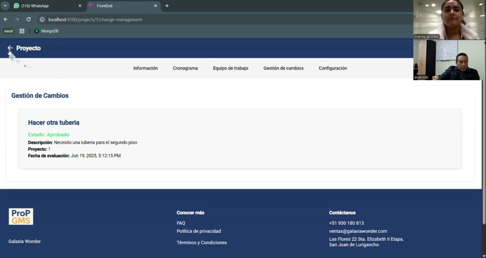
        

      </td>
    </tr>
    <tr>
      <td colspan="2" style="padding: 0; vertical-align: top; background-color: #fff border-top: 1px solid #ddd;">
        

          
Resumen

          <ul style="padding-left: 20px; list-style-type: disc; color: #333; font-size: 1em; margin: 0;">
            <li><strong>Personalidad:</strong> Guardian.
              </ul>
            </li>
              </ul>
            <ul style="margin: 0; padding: 24px; list-style-type: disc; color: #333; font-size: 1em; line-height: 1.7;">
              <li><strong>Análisis:</strong> Durante la entrevista de validación, William Salcedo, autenticado como la entidad contratante, evaluó la plataforma y destacó que la interfaz le resultó amigable y sencilla de comprender. Asimismo, valoró que el flujo de trabajo estuviera bien organizado y fuera fácil de seguir, en línea con el User Goal: Iniciar sesión y el User Goal: Navegar por el dashboard principal, que le brindan una experiencia ordenada y coherente. Sin embargo, sugirió dos mejoras clave para optimizar su experiencia: la incorporación de un sistema de notificaciones que le permita enterarse en tiempo real (vía correo electrónico registrado) sobre nuevos cambios o actualizaciones que involucren su rol, y la posibilidad de visualizar y gestionar los diferentes estados del proyecto que actualmente no se muestran en la plataforma.</li>
            </ul>
            </li>
          </ul>
        

      </td>
    </tr>
  </tbody>
</table>

<table class="tabla-entrevista">
  <thead>
    <tr>
      <th style="
            text-align: left;
            padding: 12px;
            background-color: #f0f0f0;
            font-size: 22px;"><strong>SEGMENTO OBJETIVO: CONTRATISTA</strong></th>
      <th><strong>#2</strong></th>
    </tr>
  </thead>
  <tbody>
    <tr>
      <td colspan="2" style="padding: 0; vertical-align: top; background-color: #fff border-top: 1px solid #ddd;">
        

          

            
Datos generales

            <ul style="margin: 0; padding-left: 20px; list-style-type: disc; font-size: 1.05em; line-height: 1.7; color: #333;">
              <li><strong>Nombres:</strong> Raúl Fernando</li>
              <li><strong>Apellidos:</strong> Reaño García</li>
              <li><strong>Edad:</strong> 56</li>
              <li><strong>Distrito:</strong> San Juan de Lurigancho</li>
              <li><strong>URL Entrevista:</strong> <a href="https://upcedupe-my.sharepoint.com/:v:/g/personal/u202224135_upc_edu_pe/EcevWNDfG6dBnrGYQPSWrzEB4IRn6nz58E08LabLr1X9UA?e=ntuur9&nav=eyJyZWZlcnJhbEluZm8iOnsicmVmZXJyYWxBcHAiOiJTdHJlYW1XZWJBcHAiLCJyZWZlcnJhbFZpZXciOiJTaGFyZURpYWxvZy1MaW5rIiwicmVmZXJyYWxBcHBQbGF0Zm9ybSI6IldlYiIsInJlZmVycmFsTW9kZSI6InZpZXcifX0%3D" target="_blank">Ver video</a></li>
              <li><strong>Timestamp:</strong> 05:51</li>
              <li><strong>Duración:</strong> 11:06</li>
            </ul>
          

          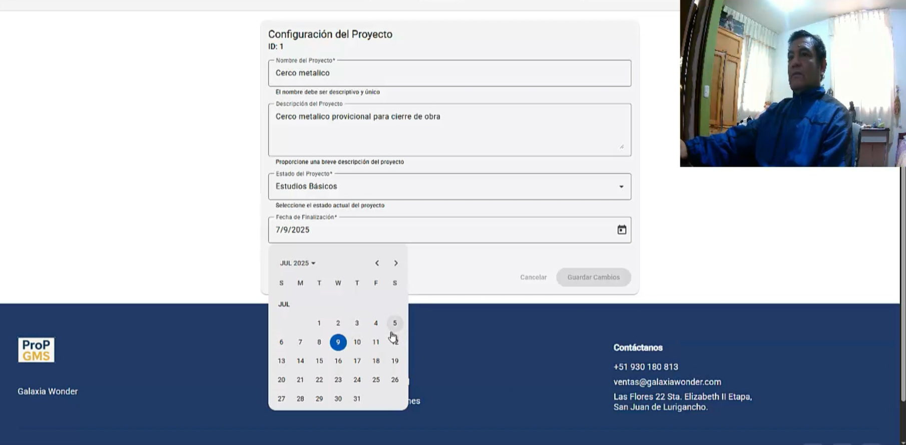
        

      </td>
    </tr>
    <tr>
      <td colspan="2" style="padding: 0; vertical-align: top; background-color: #fff border-top: 1px solid #ddd;">
        

          
Resumen

          <ul style="padding-left: 20px; list-style-type: disc; color: #333; font-size: 1em; margin: 0;">
            <li><strong>Personalidad:</strong> Guardián. 
              </ul>
            </li>
          </ul>
          <ul style="margin: 0; padding: 24px; list-style-type: disc; color: #333; font-size: 1em; line-height: 1.7;">
            <li><strong>Análisis:</strong> Durante la entrevista de validación, Raúl Reaño, en su rol de contratista, se sintió bastante conforme con la plataforma y destacó que la estructura le resultaba clara y funcional. Asimismo, valoró positivamente la internacionalización y consideró que el cronograma debería dividirse en dos partes: cronograma de trabajo y avance de proyecto. En la vista de avance, sugirió que se pudieran incluir precios, valorizaciones y estimaciones económicas relacionadas con los hitos, para que el progreso del proyecto sea más completo y transparente. Finalmente, comentó que la paleta de colores es sencilla y práctica, facilitando su uso e interpretación.</li>
          </ul>  
        

      </td>
    </tr>
  </tbody>
</table>

<table class="tabla-entrevista">
  <thead>
    <tr>
      <th style="
            text-align: left;
            padding: 12px;
            background-color: #f0f0f0;
            font-size: 22px;"><strong>SEGMENTO OBJETIVO: CONTRATISTA</strong></th>
      <th><strong>#3</strong></th>
    </tr>
  </thead>
  <tbody>
    <tr>
      <td colspan="2" style="padding: 0; vertical-align: top; background-color: #fff border-top: 1px solid #ddd;">
        

          

            
Datos generales

            <ul style="margin: 0; padding-left: 20px; list-style-type: disc; font-size: 1.05em; line-height: 1.7; color: #333;">
              <li><strong>Nombres:</strong> Victor Manuel</li>
              <li><strong>Apellidos:</strong> León Reyes</li>
              <li><strong>Edad:</strong> 52</li>
              <li><strong>Distrito:</strong> San Borja</li>
              <li><strong>URL Entrevista:</strong> <a href="https://upcedupe-my.sharepoint.com/:v:/g/personal/u202224135_upc_edu_pe/EcevWNDfG6dBnrGYQPSWrzEB4IRn6nz58E08LabLr1X9UA?e=ntuur9&nav=eyJyZWZlcnJhbEluZm8iOnsicmVmZXJyYWxBcHAiOiJTdHJlYW1XZWJBcHAiLCJyZWZlcnJhbFZpZXciOiJTaGFyZURpYWxvZy1MaW5rIiwicmVmZXJyYWxBcHBQbGF0Zm9ybSI6IldlYiIsInJlZmVycmFsTW9kZSI6InZpZXcifX0%3D" target="_blank">Ver video</a></li>
              <li><strong>Timestamp:</strong> 11:07</li>
              <li><strong>Duración:</strong> 16:54</li>
            </ul>
          

          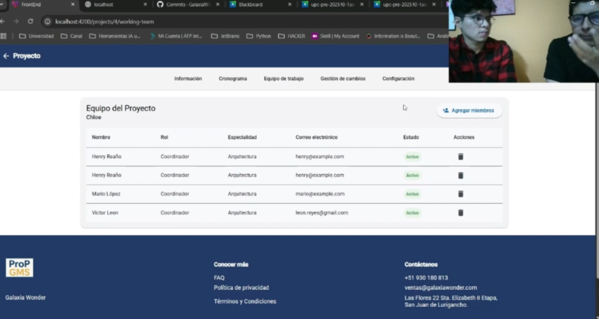
        

      </td>
    </tr>
    <tr>
      <td colspan="2" style="padding: 0; vertical-align: top; background-color: #fff border-top: 1px solid #ddd;">
        

          
Resumen

          <ul style="padding-left: 20px; list-style-type: disc; color: #333; font-size: 1em; margin: 0;">
            <li><strong>Personalidad:</strong> Guardián.
              </ul>
            <ul style="margin: 0; padding: 24px; list-style-type: disc; color: #333; font-size: 1em; line-height: 1.7;">
                <li><strong>Análisis:</strong> Durante la entrevista de validación, Victor León, en su rol de contratista, comentó que la plataforma le resultó muy intuitiva y sencilla de comprender, sin necesidad de conocimientos expertos para su uso. Destacó que las etapas y fases del proyecto se muestran claramente en el dashboard, facilitando mantener el orden en todo momento. Asimismo, alineado con el User Goal: Registrar cambios y el User Goal: Navegar por el dashboard principal, sugirió implementar más validaciones o respaldos cuando se realiza una solicitud de cambio. Consideró que debería existir algún mecanismo contractual que le otorgue mayor formalidad y legalidad a la modificación, evitando problemas futuros entre las partes.</li>
              </ul>
            </li>
          </ul>
        

      </td>
    </tr>
  </tbody>
</table>

<table class="tabla-entrevista">
  <thead>
    <tr>
      <th style="
            text-align: left;
            padding: 12px;
            background-color: #f0f0f0;
            font-size: 22px;"><strong>SEGMENTO OBJETIVO: ESPECIALISTA</strong></th>
      <th><strong>#1</strong></th>
    </tr>
  </thead>
  <tbody>
    <tr>
      <td colspan="2" style="padding: 0; vertical-align: top; background-color: #fff border-top: 1px solid #ddd;">
        

          

            
Datos generales

            <ul style="margin: 0; padding-left: 20px; list-style-type: disc; font-size: 1.05em; line-height: 1.7; color: #333;">
              <li><strong>Nombres:</strong> Victor Otto</li>
              <li><strong>Apellidos:</strong> Reinoso Diaz</li>
              <li><strong>Edad:</strong> 26</li>
              <li><strong>Distrito:</strong> La Molina</li>
              <li><strong>URL Entrevista:</strong> <a href="https://upcedupe-my.sharepoint.com/:v:/g/personal/u202224135_upc_edu_pe/EcevWNDfG6dBnrGYQPSWrzEB4IRn6nz58E08LabLr1X9UA?e=ntuur9&nav=eyJyZWZlcnJhbEluZm8iOnsicmVmZXJyYWxBcHAiOiJTdHJlYW1XZWJBcHAiLCJyZWZlcnJhbFZpZXciOiJTaGFyZURpYWxvZy1MaW5rIiwicmVmZXJyYWxBcHBQbGF0Zm9ybSI6IldlYiIsInJlZmVycmFsTW9kZSI6InZpZXcifX0%3D" target="_blank">Ver video</a></li>
              <li><strong>Timestamp:</strong> 16:55</li>
              <li><strong>Duración:</strong> 21:59</li>
            </ul>
          

          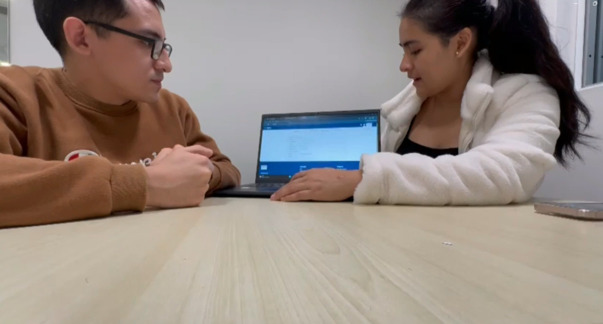
        

      </td>
    </tr>
    <tr>
      <td colspan="2" style="padding: 0; vertical-align: top; background-color: #fff border-top: 1px solid #ddd;">
        

          
Resumen

          <ul style="padding-left: 20px; list-style-type: disc; color: #333; font-size: 1em; margin: 0;">
            <li><strong>Personalidad:</strong> Racional. 
              </ul>
            </li>
          </ul>
            <ul style="margin: 0; padding: 24px; list-style-type: disc; color: #333; font-size: 1em; line-height: 1.7;">
                <li><strong>Análisis:</strong> Durante la entrevista de validación, Victor Reinoso, en su rol de especialista, comentó que la plataforma es funcional, pero que los colores actuales son demasiado intensos y las letras en gris tienden a opacar la visión del contenido. Asimismo, sugirió que sería recomendable eliminar algunas vistas que podrían resultar confusas o redundantes para el usuario, alineándose con el User Goal: Navegar por el dashboard principal y el User Goal: Ver proyectos, con el fin de que la experiencia sea más clara y sencilla. Por último, mencionó que, desde la perspectiva del modelo de negocio, la herramienta es adecuada y cumple con su propósito principal.</li>
              </ul>
        

      </td>
    </tr>
  </tbody>
</table>

<table class="tabla-entrevista">
  <thead>
    <tr>
      <th style="
            text-align: left;
            padding: 12px;
            background-color: #f0f0f0;
            font-size: 22px;"><strong>SEGMENTO OBJETIVO: ESPECIALISTA</strong></th>
      <th><strong>#2</strong></th>
    </tr>
  </thead>
  <tbody>
    <tr>
      <td colspan="2" style="padding: 0; vertical-align: top; background-color: #fff border-top: 1px solid #ddd;">
        

          

            
Datos generales

            <ul style="margin: 0; padding-left: 20px; list-style-type: disc; font-size: 1.05em; line-height: 1.7; color: #333;">
              <li><strong>Nombres:</strong> Jorge Raúl</li>
              <li><strong>Apellidos:</strong> García Torres</li>
              <li><strong>Edad:</strong> 27</li>
              <li><strong>Distrito:</strong> San Miguel</li>
              <li><strong>URL Entrevista:</strong> <a href="https://upcedupe-my.sharepoint.com/:v:/g/personal/u202224135_upc_edu_pe/EcevWNDfG6dBnrGYQPSWrzEB4IRn6nz58E08LabLr1X9UA?e=ntuur9&nav=eyJyZWZlcnJhbEluZm8iOnsicmVmZXJyYWxBcHAiOiJTdHJlYW1XZWJBcHAiLCJyZWZlcnJhbFZpZXciOiJTaGFyZURpYWxvZy1MaW5rIiwicmVmZXJyYWxBcHBQbGF0Zm9ybSI6IldlYiIsInJlZmVycmFsTW9kZSI6InZpZXcifX0%3D" target="_blank">Ver video</a></li>
              <li><strong>Timestamp:</strong> 22:00</li>
              <li><strong>Duración:</strong> 27:22</li>
            </ul>
          

          
        

      </td>
    </tr>
    <tr>
      <td colspan="2" style="padding: 0; vertical-align: top; background-color: #fff border-top: 1px solid #ddd;">
        

          
Resumen

          <ul style="padding-left: 20px; list-style-type: disc; color: #333; font-size: 1em; margin: 0;">
            <li><strong>Personalidad:</strong> Guardián. 
              </ul>
            </li>
          </ul>
            <ul style="margin: 0; padding: 24px; list-style-type: disc; color: #333; font-size: 1em; line-height: 1.7;">
                <li><strong>Análisis:</strong> Durante la entrevista de validación, Jorge, en su rol de especialista, mencionó que la plataforma es bastante clara y que la presentación visual lo invita a seguir explorando. Asimismo, destacó que la información que se le muestra está bien adaptada a su rol como ingeniero, facilitando el acceso a su equipo de trabajo y a los proyectos que le corresponden, en línea con el User Goal: Navegar por el dashboard principal y el User Goal: Ver proyectos. Por último, comentó que la paleta de colores es adecuada y contribuye a que la experiencia sea sencilla y atractiva.</li>
              </ul>
        

      </td>
    </tr>
  </tbody>
</table>

<table class="tabla-entrevista">
  <thead>
    <tr>
      <th style="
            text-align: left;
            padding: 12px;
            background-color: #f0f0f0;
            font-size: 22px;"><strong>SEGMENTO OBJETIVO: ESPECIALISTA</strong></th>
      <th><strong>#3</strong></th>
    </tr>
  </thead>
  <tbody>
    <tr>
      <td colspan="2" style="padding: 0; vertical-align: top; background-color: #fff border-top: 1px solid #ddd;">
        

          

            
Datos generales

            <ul style="margin: 0; padding-left: 20px; list-style-type: disc; font-size: 1.05em; line-height: 1.7; color: #333;">
              <li><strong>Nombres:</strong> Raúl Eduardo</li>
              <li><strong>Apellidos:</strong> Medina Fernandez</li>
              <li><strong>Edad:</strong> 30</li>
              <li><strong>Distrito:</strong> Surquillo</li>
              <li><strong>URL Entrevista:</strong> <a href="https://upcedupe-my.sharepoint.com/:v:/g/personal/u202224135_upc_edu_pe/EcevWNDfG6dBnrGYQPSWrzEB4IRn6nz58E08LabLr1X9UA?e=ntuur9&nav=eyJyZWZlcnJhbEluZm8iOnsicmVmZXJyYWxBcHAiOiJTdHJlYW1XZWJBcHAiLCJyZWZlcnJhbFZpZXciOiJTaGFyZURpYWxvZy1MaW5rIiwicmVmZXJyYWxBcHBQbGF0Zm9ybSI6IldlYiIsInJlZmVycmFsTW9kZSI6InZpZXcifX0%3D" target="_blank">Ver video</a></li>
              <li><strong>Timestamp:</strong> 27:23</li>
              <li><strong>Duración:</strong> 32:53</li>
            </ul>
          

          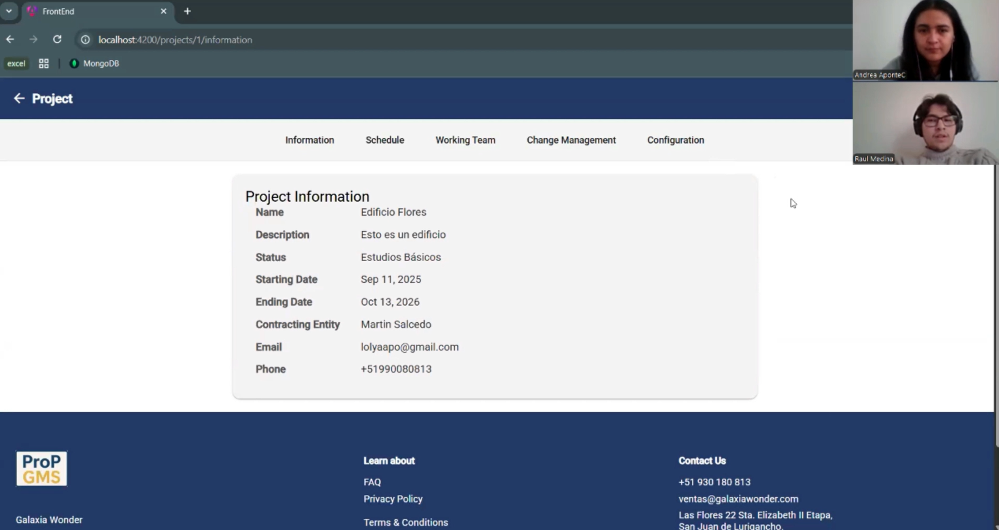
        

      </td>
    </tr>
    <tr>
      <td colspan="2" style="padding: 0; vertical-align: top; background-color: #fff border-top: 1px solid #ddd;">
        

          
Resumen

          <ul style="padding-left: 20px; list-style-type: disc; color: #333; font-size: 1em; margin: 0;">
            <li><strong>Personalidad:</strong> Guardián. 
              </ul>
            </li>
          </ul>
            <ul style="margin: 0; padding: 24px; list-style-type: disc; color: #333; font-size: 1em; line-height: 1.7;">
                <li><strong>Análisis:</strong> Durante la entrevista de validación, Raúl, en su rol de especialista, destacó que la plataforma le pareció muy clara y sencilla, con una ruta de navegación bien definida y fácil de comprender. También mencionó que los colores elegidos resultan agradables y transmiten una sensación profesional, logrando una experiencia visualmente armoniosa desde el primer ingreso sin necesidad de asistencia externa. Este feedback se alinea con el User Goal: Iniciar sesión y el User Goal: Navegar por el dashboard principal, que buscan ofrecer a los usuarios una interacción intuitiva, ordenada y que inspire confianza.</li>
              </ul>
        

      </td>
    </tr>
  </tbody>
</table>

<table class="tabla-entrevista">
  <thead>
    <tr>
      <th style="
            text-align: left;
            padding: 12px;
            background-color: #f0f0f0;
            font-size: 22px;"><strong>SEGMENTO OBJETIVO: ENTIDAD CONTRATANTE</strong></th>
      <th><strong>#1</strong></th>
    </tr>
  </thead>
  <tbody>
    <tr>
      <td colspan="2" style="padding: 0; vertical-align: top; background-color: #fff border-top: 1px solid #ddd;">
        

          

            
Datos generales

            <ul style="margin: 0; padding-left: 20px; list-style-type: disc; font-size: 1.05em; line-height: 1.7; color: #333;">
              <li><strong>Nombres:</strong> Leonardo Jesús </li>
              <li><strong>Apellidos:</strong> Caballa Huamán </li>
              <li><strong>Edad:</strong> 28</li>
              <li><strong>Distrito:</strong> Jesús María</li>
              <li><strong>URL Entrevista:</strong> <a href="https://upcedupe-my.sharepoint.com/:v:/g/personal/u202224135_upc_edu_pe/EcevWNDfG6dBnrGYQPSWrzEB4IRn6nz58E08LabLr1X9UA?e=ntuur9&nav=eyJyZWZlcnJhbEluZm8iOnsicmVmZXJyYWxBcHAiOiJTdHJlYW1XZWJBcHAiLCJyZWZlcnJhbFZpZXciOiJTaGFyZURpYWxvZy1MaW5rIiwicmVmZXJyYWxBcHBQbGF0Zm9ybSI6IldlYiIsInJlZmVycmFsTW9kZSI6InZpZXcifX0%3D" target="_blank">Ver video</a></li>
              <li><strong>Timestamp:</strong> 32:54</li>
              <li><strong>Duración:</strong> 37:59</li>
            </ul>
          

          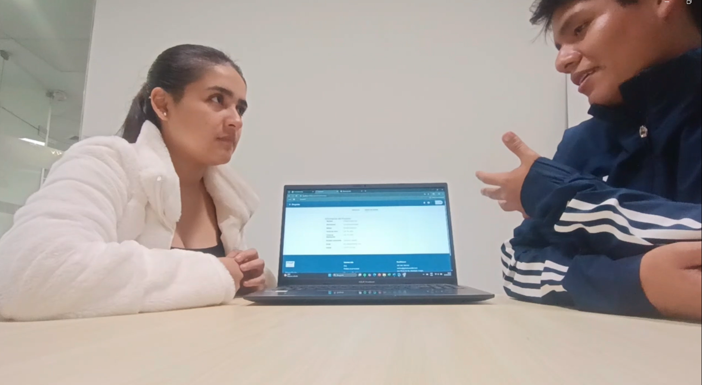
        

      </td>
    </tr>
    <tr>
      <td colspan="2" style="padding: 0; vertical-align: top; background-color: #fff border-top: 1px solid #ddd;">
        

          
Resumen

          <ul style="padding-left: 20px; list-style-type: disc; color: #333; font-size: 1em; margin: 0;">
            <li><strong>Personalidad:</strong> Idealista. 
              </ul>
            </li>
          </ul>
             <ul style="margin: 0; padding: 24px; list-style-type: disc; color: #333; font-size: 1em; line-height: 1.7;">
                <li><strong>Análisis:</strong> Durante la entrevista de validación, Leonardo, en su rol de cliente, mencionó que es consciente de que las personas pueden cambiar de idea y que el User Goal: Registrar cambios le parece muy adecuado para cómo funciona un proyecto. Asimismo, comentó que el esquema de colores es neutral y que sería interesante diferenciar visualmente cada sección con tonalidades propias, manteniendo un ruteo de vistas bien organizado y fácil de comprender. Por último, sugirió integrar una comunicación directa con el contratista que le permita pedir fotos o adjuntar documentos cuando solicite cambios, lo que se asocia a los User Goals: Registrar cambios y Ver proyectos, ya que mejora la transparencia y la colaboración entre las partes involucradas.</li>
              </ul>
        

      </td>
    </tr>
  </tbody>
</table>

<table class="tabla-entrevista">
  <thead>
    <tr>
      <th style="
            text-align: left;
            padding: 12px;
            background-color: #f0f0f0;
            font-size: 22px;"><strong>SEGMENTO OBJETIVO: ENTIDAD CONTRATANTE</strong></th>
      <th><strong>#2</strong></th>
    </tr>
  </thead>
  <tbody>
    <tr>
      <td colspan="2" style="padding: 0; vertical-align: top; background-color: #fff border-top: 1px solid #ddd;">
        

          

            
Datos generales

            <ul style="margin: 0; padding-left: 20px; list-style-type: disc; font-size: 1.05em; line-height: 1.7; color: #333;">
              <li><strong>Nombres:</strong> Alvaro Martin</li>
              <li><strong>Apellidos:</strong> Torres Huamaní </li>
              <li><strong>Edad:</strong> 27</li>
              <li><strong>Distrito:</strong> San Juan de Lurigancho</li>
              <li><strong>URL Entrevista:</strong> <a href="https://upcedupe-my.sharepoint.com/:v:/g/personal/u202224135_upc_edu_pe/EcevWNDfG6dBnrGYQPSWrzEB4IRn6nz58E08LabLr1X9UA?e=ntuur9&nav=eyJyZWZlcnJhbEluZm8iOnsicmVmZXJyYWxBcHAiOiJTdHJlYW1XZWJBcHAiLCJyZWZlcnJhbFZpZXciOiJTaGFyZURpYWxvZy1MaW5rIiwicmVmZXJyYWxBcHBQbGF0Zm9ybSI6IldlYiIsInJlZmVycmFsTW9kZSI6InZpZXcifX0%3D" target="_blank">Ver video</a></li>
              <li><strong>Timestamp:</strong> 38:00</li>
              <li><strong>Duración:</strong> 42:49</li>
            </ul>
          

          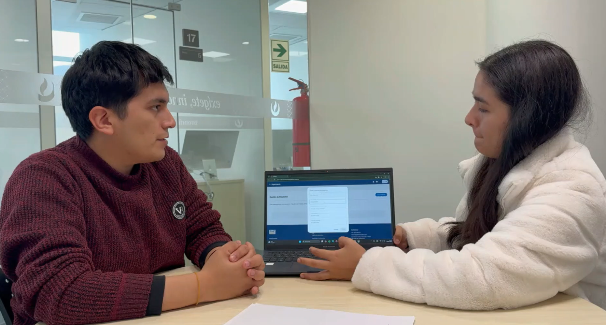
        

      </td>
    </tr>
    <tr>
      <td colspan="2" style="padding: 0; vertical-align: top; background-color: #fff border-top: 1px solid #ddd;">
        

          
Resumen

          <ul style="padding-left: 20px; list-style-type: disc; color: #333; font-size: 1em; margin: 0;">
            <li><strong>Personalidad:</strong> Idealista. 
              </ul>
            </li>
          </ul>
            <ul style="margin: 0; padding: 24px; list-style-type: disc; color: #333; font-size: 1em; line-height: 1.7;">
            <li><strong>Análisis:</strong> Durante la entrevista de validación, Álvaro, en su rol de cliente, destacó que la opción de internacionalización le pareció muy útil y bien lograda para usuarios de diferentes idiomas. También mencionó que el campo para registrar el número telefónico debería estar mejor implementado en el registro, ya que no queda claro qué tipo de número se espera, mejorando así el User Goal: Iniciar sesión y el User Goal: Ver proyecto. Por último, sugirió que una notificación visual en la campanita que confirme si un cambio solicitado ha sido aprobado o desaprobado sería muy útil, lo cual está alineado con el User Goal: Registrar cambios y aporta mayor transparencia y control al proceso.</li>
              </ul>
        

      </td>
    </tr>
  </tbody>
</table>

<table class="tabla-entrevista">
  <thead>
    <tr>
      <th style="
            text-align: left;
            padding: 12px;
            background-color: #f0f0f0;
            font-size: 22px;"><strong>SEGMENTO OBJETIVO: ENTIDAD CONTRATANTE</strong></th>
      <th><strong>#3</strong></th>
    </tr>
  </thead>
  <tbody>
    <tr>
      <td colspan="2" style="padding: 0; vertical-align: top; background-color: #fff border-top: 1px solid #ddd;">
        

          

            
Datos generales

            <ul style="margin: 0; padding-left: 20px; list-style-type: disc; font-size: 1.05em; line-height: 1.7; color: #333;">
              <li><strong>Nombres:</strong> Aaron Patrick</li>
              <li><strong>Apellidos:</strong> Ravines Diaz</li>
              <li><strong>Edad:</strong> 27</li>
              <li><strong>Distrito:</strong> San Borja</li>
              <li><strong>URL Entrevista:</strong> <a href="https://upcedupe-my.sharepoint.com/:v:/g/personal/u202224135_upc_edu_pe/EcevWNDfG6dBnrGYQPSWrzEB4IRn6nz58E08LabLr1X9UA?e=ntuur9&nav=eyJyZWZlcnJhbEluZm8iOnsicmVmZXJyYWxBcHAiOiJTdHJlYW1XZWJBcHAiLCJyZWZlcnJhbFZpZXciOiJTaGFyZURpYWxvZy1MaW5rIiwicmVmZXJyYWxBcHBQbGF0Zm9ybSI6IldlYiIsInJlZmVycmFsTW9kZSI6InZpZXcifX0%3D" target="_blank">Ver video</a></li>
              <li><strong>Timestamp:</strong> 42:50</li>
              <li><strong>Duración:</strong> 48:16</li>
            </ul>
          

          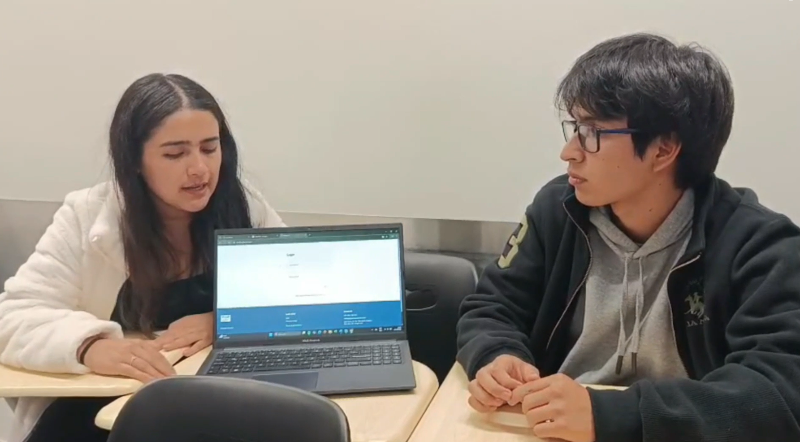
        

      </td>
    </tr>
    <tr>
      <td colspan="2" style="padding: 0; vertical-align: top; background-color: #fff border-top: 1px solid #ddd;">
        

          
Resumen

          <ul style="padding-left: 20px; list-style-type: disc; color: #333; font-size: 1em; margin: 0;">
            <li><strong>Personalidad:</strong> Idealista. 
              </ul>
            </li>
          </ul>
            <ul style="margin: 0; padding: 24px; list-style-type: disc; color: #333; font-size: 1em; line-height: 1.7;">
                <li><strong>Análisis:</strong> Durante la entrevista de validación, Aaron, en su rol de cliente, mencionó que el proceso le pareció correcto y que no ha sido difícil interactuar con la interfaz, destacando que los colores elegidos transmiten tranquilidad y que todo está bien organizado. Esta facilidad de uso y comodidad al navegar por la plataforma está alineada con el User Goal: Ver Proyecto, ya que le ha permitido comprender y moverse por las distintas secciones sin complicaciones.</li>
              </ul>
        

      </td>
    </tr>
  </tbody>
</table>

### 5.3.3. Análisis de entrevistas

### Análisis de entrevistas

**CONTRATISTAS**

**1. Resumen:** Este segmento agrupa a clientes entre 52 y 57 años que han acumulado experiencia y estabilidad profesional a lo largo de su carrera. Por lo general, buscan materializar proyectos grandes en el ámbito privado como público. Valoran la transparencia, el seguimiento detallado del avance de obra y el cumplimiento estricto de tiempos y presupuestos, asegurándose de que el resultado final sea funcional, duradero y alineado con su visión.

**2. Edad:** Las edades de los entrevistados de este segmento varían desde los 52 hasta los 57 años de edad. Se toma como edad representativa la media aritmética de los datos.

| Entrevistado | Victor León | Raúl Reaño | William Salcedo | Valor representativo |
|-|-|-|-|-|
| **Edad** | 52 | 56 | 57 | 55 |

**3. Personalidad:** La totalidad de los entrevistados (100%) se alínean al arquetipo de personalidad *Guardián*, debido a su respeto irrestricto y meticuloso de las normas y acuerdos. Se toma este arquetipo de personalidad como representativo.

| Entrevistado | Victor León | Raúl Reaño | William Salcedo | Valor representativo |
|-|-|-|-|-|
| **Personalidad** | Guardián | Guardián | Guardián | Guardián |

**ESPECIALISTA DE ÁREA**

**1. Resumen:** Los especialistas de área son en su mayoría varones adultos entre los 26 y 30 años, con formación en Ingeniería Civil y experiencia desarrollada dentro de una especialidad técnica. Muchos de ellos llegaron a su posición actual a través de la práctica profesional en empresas del rubro, aunque algunas áreas, como TI, requieren formación específica. Son personas estructuradas, con un fuerte apego a las normas y procesos establecidos, lo que les permite mantener el orden en sus funciones. Sin embargo, enfrentan ciertas dificultades en la comunicación con otras especialidades, influenciadas por la rigidez de las estructuras organizacionales en las que trabajan.

**2. Edad:** Las edades de los entrevistados de este segmento varían desde los 26 hasta los 30 años de edad. Se toma como edad representativa la media aritmética de los datos.

| Entrevistado | Victor Reinoso | Jorge Garcia | Raul Medina | Valor representativo |
|-|-|-|-|-|
| **Edad** | 26 | 27 | 30 | 28 |

**3. Personalidad:** La gran mayoría de los entrevistados (100%) se alínean al arquetipo de personalidad *Guardián*, mientras que la menor parte (33.3%) refleja una personalidad de tipo *Racional*. Se toma el arquetipo *Guardián* como representativo.

| Entrevistado | Victor Reinoso | Jorge Garcia | Raul Medina | Valor representativo |
|-|-|-|-|-|
| **Personalidad** | Racional | Guardián | Guardián | Guardián |

**ENTIDAD CONTRATANTE**

**1. Resumen:** Los clientes (formalmente llamados "La Entidad Contratante") son predominantemente varones adultos jóvenes entre los 27 y 28 años de edad, con entre 1 y 3 años de experiencia laboral. Se destacan por ser ambiciosos y estratégicos, pensar bien las cosas y tener mucho cuidado de que “todo marche de acuerdo al plan”. Buscan los servicios de consultoría principalmente para la planificación de su primera vivienda a futuro. Sus principales preocupaciones son el cumplimiento de plazos y la satisfacción de sus expectativas.

**2. Edad:** Las edades de los entrevistados de este segmento varían desde los 27 hasta los 28 años de edad. Se toma como edad representativa la media aritmética de los datos.

| Entrevistado | Leonardo Caballa | Álvaro Torres | Aaron Ravines | Valor representativo |
|-|-|-|-|-|
| **Edad** | 28 | 27 | 27 | 27 |

**3. Personalidad:** La totalidad de los entrevistados (100%) se alínean al arquetipo de personalidad *Idealista*, debido a que reflejan un alto grado de meticulosidad, cuidado y respeto a la ley de por medio a lograr sus objetivos personales.

| Entrevistado | Leonardo Caballa | Álvaro Torres | Aaron Ravines | Valor representativo |
|-|-|-|-|-|
| **Edad** | 28 | 27 | 27 | 27 |

## 5.3.3 UX Heuristics & Principles Evaluation  
**Usability – Inclusive Design – Information Architecture**

**CARRERA**  : Ingeniería de Software  
**CURSO**    : Desarollo de aplicaciones Open Source 
**SECCIÓN**  : 4307
**PROFESORES**: Todos  
**AUDITOR**  : Entrevistados  
**CLIENTE(S)**: Andrea Aponte, Fabrizio León, Mario Lopez, Álvaro Orozco y Henry Reaño

##### SITE o APP A EVALUAR:  
PropGMS

##### TAREAS A EVALUAR:  
1. Registro de un usuario nuevo
2. Creación de una organización
3. Configuración de una organización
4. Invitación de una organización
5. Aceptar invitación de una organización
6. Rechazar invitación de una organización

No estan incluidas en esta versión de la evaluación las siguientes tareas:
1. Creación de un proyecto
2. Configuración de un proyecto
3. Gestionar equipo de un proyecto
4. Crear tarea
5. Crear reunión
6. Asignar responsables a tareas

##### ESCALA DE SEVERIDAD:

Los errores serán puntuados tomando en cuenta la siguiente escala de severidad

| Nivel | Descripción |
|-------|-------------|
| 1     | Problema superficial: puede ser fácilmente superado por el usuario o ocurre con muy poco frecuencia. No necesita ser arreglado a no ser que exista disponibilidad de tiempo. |
| 2     | Problema menor: puede ocurrir un poco más frecuentemente o es un poco más difícil de superar para el usuario. Se le debería asignar una prioridad baja resolverlo de cara al siguiente release. |
| 3     | Problema mayor: ocurre frecuentemente o los usuarios no son capaces de resolverlos. Es importante que sean corregidos y se les debe asignar una prioridad alta. |
| 4     | Problema muy grave: un error de gran impacto que impide al usuario continuar con el uso de la herramienta. Es imperativo que sea corregido antes del lanzamiento. |

---

###### TABLA RESUMEN:
| # | Problema | Escala de severidad | Heurística/Principio violado(a) |
|---|---------|---------------------|---------------------------------|
| 1 | Falta un componente que indique automáticamente el prefijo telefónico (+51) en el campo de número de teléfono. | 2 | Usabilidad: Prevención de errores |
| 2 | No existe un botón visible para cambiar el idioma desde el inicio, obligando al usuario a buscarlo manualmente. | 2 | Usabilidad: Flexibilidad y control del usuario |
| 3 | El color gris del texto y los íconos es muy similar al fondo blanco, dificultando la lectura y generando problemas de accesibilidad. | 3 | Accesibilidad: Contraste visual |
| 4 | Falta consistencia visual entre distintas secciones del sitio (botones, fuentes y estilos varían entre páginas). | 2 | Usabilidad: Consistencia y estándares |

---

#### DESCRIPCIÓN DE PROBLEMAS:

**PROBLEMA #1:**  
**En la creación de cuenta no se especifica que se debe utilizar el formato E.164 para el número de teléfono**  
**Severidad:** 3  
**Heurística violada:** Usabilidad - Ayuda y documentación  
**Problema:**  
Los usuarios no saben qué formato es válido para su número telefónico y esto genera errores en el registro.

**PROBLEMA #2:**  
**Falta un componente que indique automáticamente el prefijo telefónico (+51)**  
**Severidad:** 2  
**Heurísti**

###### DESCRIPCIÓN DE PROBLEMAS:

**PROBLEMA #1:** Falta un componente que indique automáticamente el prefijo telefónico (+51) en el campo de número de teléfono

Severidad: 3
Heurística violada: Usabilidad - Prevención de errores

Problema:
Al crear una cuenta, el usuario debe colocar su número telefónico sin saber qué formato es válido, generando errores. Una mejora es incluir un componente visible que muestre automáticamente el prefijo (+51) o que permita elegirlo de una lista desplegable. 

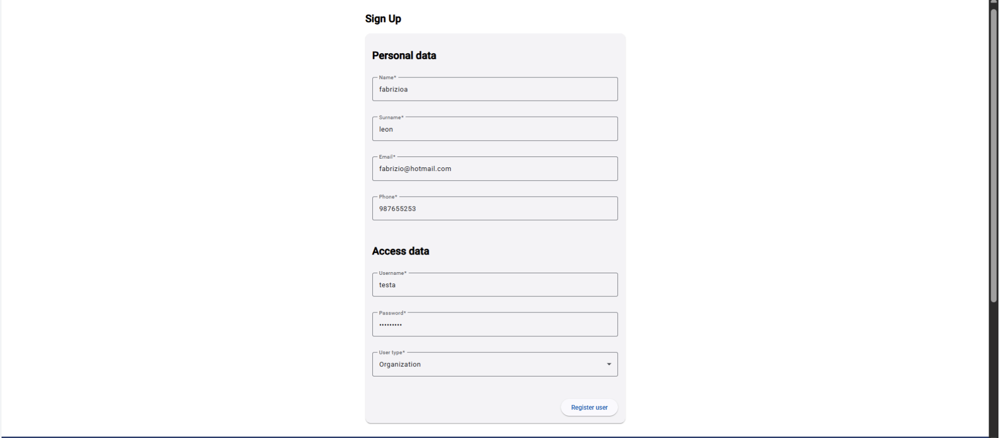

Recomendación:
Se recomienda que el campo del número telefónico tenga el prefijo +51 preestablecido o que incluya un selector desplegable con los prefijos de los países de la región.

**PROBLEMA #2:** No existe un botón visible para cambiar el idioma desde el inicio, obligando al usuario a buscarlo manualmente

Severidad: 1
Heurística violada: Usabilidad - Flexibilidad y control del usuario 

Problema:
La pantalla inicial carece de un botón visible para la internacionalización (cambio de idioma). Esto hace que usuarios que no sean de habla castellana deban navegar sin comprender el contenido hasta que logren encontrar dónde cambiarlo, afectando negativamente la experiencia.

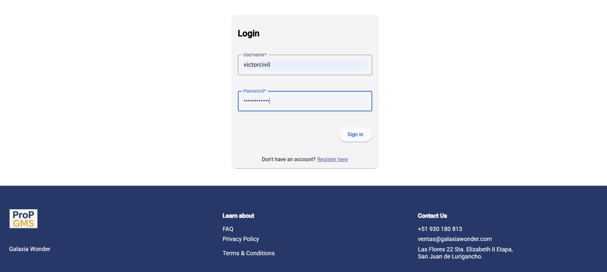

Recomendación:
Se recomienda colocar un botón o ícono visible y accesible (por ejemplo, en la esquina superior derecha de la pantalla) que permita cambiar el idioma de inmediato. Puede mostrarse como un ícono de globo terráqueo o una bandera, junto a una etiqueta breve EN/ES, de modo que sea reconocible y facilite que los usuarios internacionales cambien la configuración sin esfuerzo.

**PROBLEMA #3:**  El color gris del texto y los íconos es muy similar al fondo blanco
Severidad: 3  
Heurística violada: Accesibilidad – Contraste visual  

Problema: 
El texto y los íconos en color gris tienen muy poco contraste contra el fondo blanco, lo que dificulta su lectura, especialmente para usuarios con daltonismo o visión reducida. Esto genera una experiencia de uso incómoda e inaccesible.

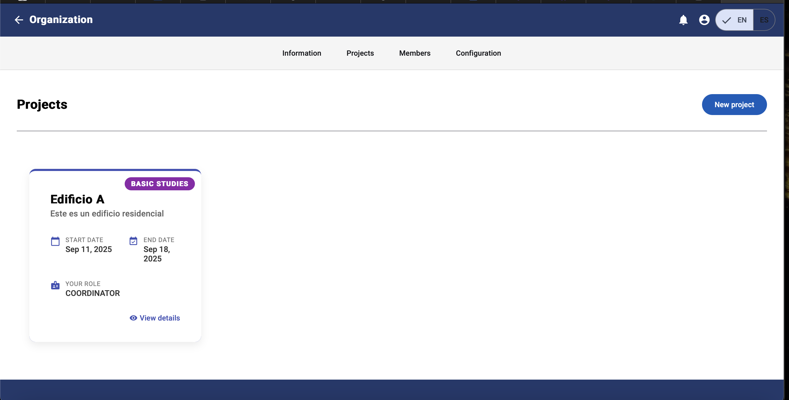

Recomendación: 
Aumentar el contraste entre texto/íconos y el fondo ajustando la paleta de colores para que cumpla con los estándares de accesibilidad. Por ejemplo, utilizar un gris más oscuro o añadir un leve fondo que facilite la distinción de los elementos.

**PROBLEMA #4:**  Falta consistencia visual entre distintas secciones del sitio
Severidad: 2  
Heurística violada: Usabilidad – Consistencia y estándares  

Problema:  
Los estilos, tipografías, tamaños y disposición de los componentes varían entre páginas, causando confusión y transmitiendo una sensación poco profesional y desorganizada. Esto puede hacer que el usuario no sepa qué esperar en cada pantalla.

Recomendación: 
Definir una guía de estilos unificada que incluya paleta de colores, tipografías, tamaños y componentes estandarizados para que sean reutilizados en todo el sitio. Así se logrará mayor consistencia, mejor experiencia y una imagen más sólida del producto.

## 5.4. Video About-the-Product

Enlace para visualizar el video:

Enlace del video subido a YouTube: <a href="https://youtu.be/f5uTd_Pkm54">About the Product</a>

Enlace del video subido a Stream: <a href="https://upcedupe-my.sharepoint.com/:v:/g/personal/u202116250_upc_edu_pe/EWgGpLYRIXhEsXuHk-JNmjMB1ZVB9kF2D78DR2FLj_S9yA?nav=eyJyZWZlcnJhbEluZm8iOnsicmVmZXJyYWxBcHAiOiJPbmVEcml2ZUZvckJ1c2luZXNzIiwicmVmZXJyYWxBcHBQbGF0Zm9ybSI6IldlYiIsInJlZmVycmFsTW9kZSI6InZpZXciLCJyZWZlcnJhbFZpZXciOiJNeUZpbGVzTGlua0NvcHkifX0&e=1PVXoL">About the Product</a>

