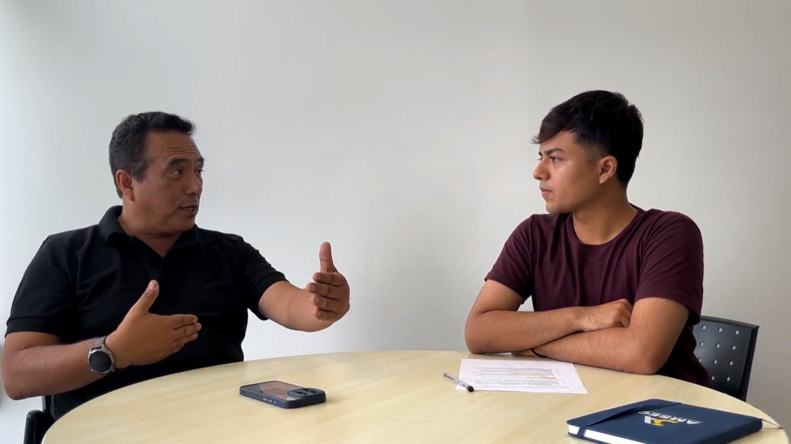
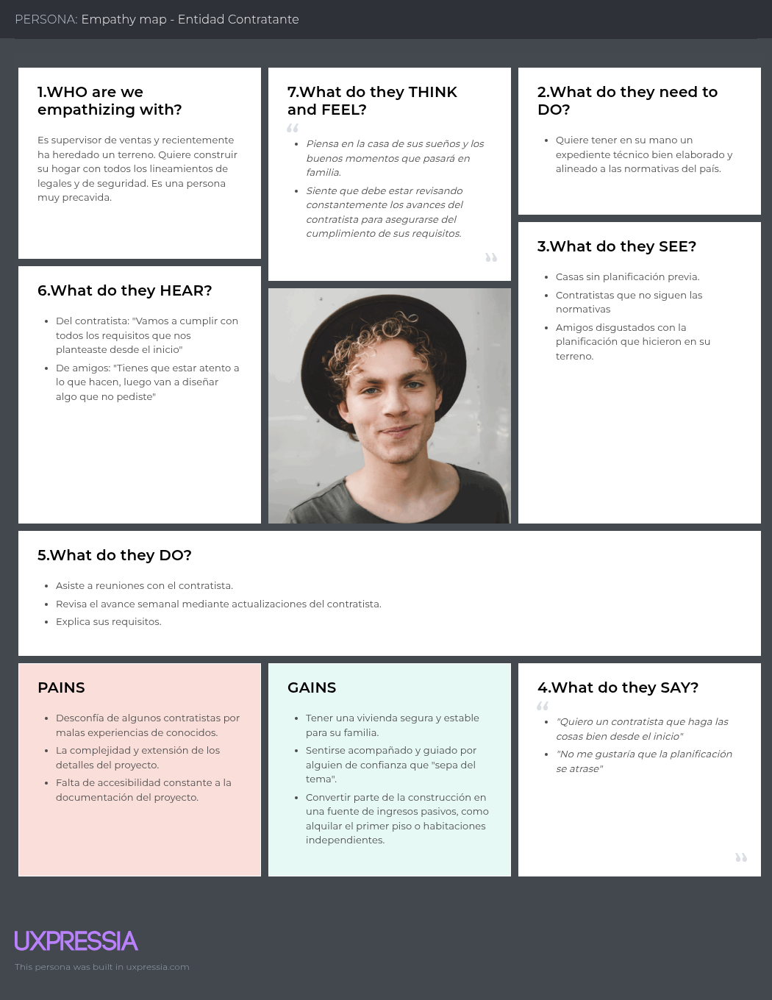

# Capítulo II: Requirements Elicitation & Analysis

## 2.1. Competidores
### 2.1.1. Análisis Competitivo
El análisis competitivo es fundamental para desarrollar una estrategia sólida en el mercado, ya que permite comprender qué soluciones existen, cómo operan y qué valor ofrecen a los clientes. A través de esta metodología, se pueden detectar brechas en el mercado y evaluar qué necesidades de los clientes aún no están cubiertas. Por ese motivo, se presentará el siguiente cuadro con el análisis competitivo correspondiente.

<table style="width: 100%; border-collapse: collapse; text-align: left; page-break-inside: auto;">
    <thead>
        <tr>
            <th style="border: 1px solid #000; padding: 10px; font-weight: bold;" colspan="6">Competitive Analysis Landscape</th>
        </tr>
        <tr>
            <th style="border: 1px solid #000; padding: 10px;font-weight: bold;" colspan="2" rowspan="2">¿Por qué llevar a cabo este análisis?</th>
            <th style="border: 1px solid #000; padding: 10px;font-weight: bold;" colspan="4">¿Cuáles son las principales ventajas competitivas frente a nuestros competidores?</th>
        </tr>
        <tr>
            <td style="border: 1px solid #000; padding: 10px;" colspan="4">El resultado de analizar el mercado y a los competidores directos e indirectos proporciona datos que serán utilizados para delimitar estrategias con el fin de posicionar nuestro producto en el mercado competitivo.</td>
        </tr>
        <tr>
            <th style="border: 1px solid #000; padding: 10px;font-weight: bold;" colspan="2">(En la cabecera colocar por cada competidor nombre y logo)</th>
            <th style="border: 1px solid #000; padding: 10px;font-weight: bold; width: 20%; text-align: center;">Galaxia Wonder
            
            </th>
            <th style="border: 1px solid #000; padding: 10px;font-weight: bold; width: 20%; text-align: center;">
                Autodesk Construction Cloud
                
            </th>
            <th style="border: 1px solid #000; padding: 10px;font-weight: bold; width: 20%; text-align: center;">
                Procore
                
            </th>
            <th style="border: 1px solid #000; padding: 10px;font-weight: bold; width: 20%; text-align: center;">
                Deltek ComputerEase
                
            </th>
        </tr>
    </thead>
    <tbody>
        <tr>
            <th style="border: 1px solid #000; padding: 10px; font-weight: normal; width: 12%; writing-mode: tb-rl; text-align: center; vertical-align: middle; white-space: nowrap; font-weight: bold; width: 8%;" rowspan="2">Perfil</th>
            <th style="border: 1px solid #000; padding: 10px; font-weight: normal; width: 12%;">Overview</th>
            <td style="border: 1px solid #000; padding: 10px;" style="text-align:center;">
                Galaxia Wonder ofrece un sistema de gestión de proyectos de ingeniería civil diseñado para contratistas, consultoras pequeñas de obras y subcontratistas. La plataforma permite gestionar proyectos, planificar cronogramas, controlar costos, administrar documentación técnica y organizar expedientes técnicos en un solo lugar, asegurando eficiencia y cumplimiento de plazos.
            </td>
            <td style="border: 1px solid #000; padding: 10px;" style="text-align:center;">
                Esta plataforma conecta flujos de trabajo, equipos y datos en todas las etapas de la construcción, facilitando la colaboración y mejorando la eficiencia en proyectos de construcción.
            </td>
            <td style="border: 1px solid #000; padding: 10px;" style="text-align:center;">
                Procore ofrece una solución integral en línea para la gestión de proyectos de construcción, incluyendo control de costos, comunicaciones y colaboración, utilizada ampliamente en la industria.
            </td>
            <td style="border: 1px solid #000; padding: 10px;" style="text-align:center;">
                Software de contabilidad y gestión de proyectos de construcción que integra costos laborales con herramientas remotas, ayudando a las empresas a gestionar eficazmente sus proyectos y finanzas.
            </td>
        </tr>
        <tr>
            <th style="border: 1px solid #000; padding: 10px; font-weight: normal; width: 12%;">Ventaja competitiva ¿Qué valor ofrece a los clientes?</th>
            <td style="border: 1px solid #000; padding: 10px;" style="text-align:center;">
                Galaxia Wonder se diferencia por ser una nube especializada en la gestión de proyectos de ingeniería civil, ofreciendo una solución integral que combina planificación, control de costos, gestión documental y expedientes técnicos en una sola plataforma.
            </td>
            <td style="border: 1px solid #000; padding: 10px;" style="text-align:center;">
                Ofrece una integración completa de herramientas para la gestión de proyectos de construcción, desde el diseño hasta la adjudicación.
            </td>
            <td style="border: 1px solid #000; padding: 10px;" style="text-align:center;">
                Procore destaca por su interfaz intuitiva y facilidad de uso, lo que permite a los equipos de construcción gestionar proyectos de manera efectiva sin necesidad de una curva de aprendizaje extensa.
            </td>
            <td style="border: 1px solid #000; padding: 10px;" style="text-align:center;">
                Se enfoca en ofrecer una solución integral para la planificación y gestión de proyectos en el sector de la construccción.
            </td>
        </tr>
        <tr>
            <th style="border: 1px solid #000; padding: 10px; font-weight: normal; width: 12%; writing-mode: tb-rl; text-align: center; vertical-align: middle; white-space: nowrap; font-weight: bold; width: 8%;" rowspan="5">Perfil de marketing</th>
            <th style="border: 1px solid #000; padding: 10px; font-weight: normal; width: 12%;">Mercado objetivo</th>
            <td style="border: 1px solid #000; padding: 10px;">
                <ul>
                    <li>Contratistas independientes.</li>
                    <li>Consultoras pequeñas de obras.</li>
                </ul>
            </td>
            <td style="border: 1px solid #000; padding: 10px;">
                <ul>
                    <li>Grandes empresas de construcción.</li>
                    <li>Consultoras de ingeniería.</li>
                </ul>
            </td>
            <td style="border: 1px solid #000; padding: 10px;">
                <ul>
                    <li>Contratistas generales.</li>
                    <li>Subcontratistas.</li>
                    <li>Empresas constructoras.</li>
                </ul>
            </td>
            <td style="border: 1px solid #000; padding: 10px;">
                <ul>
                    <li>Contratistas de construcción.</li>
                </ul>
            </td>
        </tr>
        <tr>
            <th style="border: 1px solid #000; padding: 10px; font-weight: normal; width: 12%;">Estrategias de marketing</th>
            <td style="border: 1px solid #000; padding: 10px;">
                <ul>
                    <li>Prueba Gratuita de 14 o 30 Días.</li>
                    <li>Casos de Éxito.</li>
                    <li>Campañas de redes sociales.</li>
                </ul> 
            </td>
            <td style="border: 1px solid #000; padding: 10px;">
                <ul>
                    <li>Marketing de Contenidos.</li>
                    <li>Webinars y Formación en Línea.</li>
                    <li>Publicidad Digital y Redes Sociales.</li>
                </ul>
            </td>
            <td style="border: 1px solid #000; padding: 10px;">
                <ul>
                    <li>Email Marketing.</li>
                    <li>Convenios con Empresas Constructoras y Gobiernos.</li>
                    <li>Eventos en línea.</li>
                </ul>
            </td>
            <td style="border: 1px solid #000; padding: 10px;">
                <ul>
                    <li>Eventos y Webinars de Capacitación.</li>
                    <li>Estrategia de Publicidad Directa.</li>
                    <li>Referencias y Testimonios.</li>
                </ul>
            </td>
        </tr>
        <tr>
            <th style="border: 1px solid #000; padding: 10px; font-weight: normal; width: 12%;">Productos & Servicios</th>
            <td style="border: 1px solid #000; padding: 10px;">
                <ul>
                    <li>Aplicación web para gestión de proyectos, planificación y optimización de recursos para agilizar los procesos y plazos del desarrollo de un proyecto.</li>
                    <li>Gestor de expedientes y fichas técnicas en base a roles predefinidos.</li>
                    <li>Funciona como nube para almacenamiento de documentos.</li>
                </ul>
            </td>
            <td style="border: 1px solid #000; padding: 10px;">
                <ul>
                    <li>Plataforma para la gestión de licitaciones y conexión con contratistas, facilitando la comunicación durante las fases iniciales del proyecto.</li>
                    <li>Herramienta para la gestión de planos y documentos en proyectos de construcción, permitiendo a los equipos acceder y actualizar información en tiempo real en la obra.</li>
                    <li>Servicios adicionales para adaptar el software a las necesidades específicas de cada cliente o tipo de proyecto.</li>
                </ul>
            </td>
            <td style="border: 1px solid #000; padding: 10px;">
                <ul>
                    <li>Construction Financials: Herramienta enfocada en la gestión financiera del proyecto, como presupuestos, órdenes de cambio y pagos a contratistas, integrando la contabilidad con la gestión del proyecto.</li>
                    <li>Consultoría personalizada: Servicios de implementación y consultoría para adaptar el software a las necesidades de cada cliente.</li>
                </ul>
            </td>
            <td style="border: 1px solid #000; padding: 10px;">
                <ul>
                    <li>Software de contabilidad para la construcción</li>
                    <li>Gestión de proyectos: Herramienta de gestión integral que ayuda a los contratistas a planificar, programar y controlar los proyectos, asegurando que se mantengan dentro del presupuesto y cronograma.</li>
                    <li>Soporte técnico y consultoría</li>
                </ul>
            </td>
        </tr>
        <tr>
            <th style="border: 1px solid #000; padding: 10px; font-weight: normal; width: 12%;">Precios & Costos</th>
            <td style="border: 1px solid #000; padding: 10px;" style="text-align:center;">
                Galaxia Wonder brinda una modelo de precios basado en suscripción. Además, evalua las funciones y caracteristicas del software en base al cliente.
            </td>
            <td style="border: 1px solid #000; padding: 10px;" style="text-align:center;">
                Utiliza un modelo de precios basado en suscripción. Ofrece prubas gratuitas para su producto BIM 360.
            </td>
            <td style="border: 1px solid #000; padding: 10px;" style="text-align:center;">
                Procore utiliza un modelo de precios basado en suscripción. Los precios varian dependiendo de la organización, rondando entre $1,000 a $2,000 USD al mes. Además, ofrece una prueba gratuita de 14 días.
            </td>
            <td style="border: 1px solid #000; padding: 10px;" style="text-align:center;">
                Deltek ComputerEase ofrece un modelo basado en suscripción o licencias perpetuas, dependiendo de las necesidades del cliente. Asimismo, cuenta con una demostración gratuita que debe ser solicitada.
            </td>
        </tr>
        <tr>
            <th style="border: 1px solid #000; padding: 10px; font-weight: normal; width: 12%;">Canales de distribución (Web y/o Móvil)</th>
            <td style="border: 1px solid #000; padding: 10px;" style="text-align:center;">
                Aplicación web.
            </td>
            <td style="border: 1px solid #000; padding: 10px;" style="text-align:center;">
                Dispone de aplicación web y aplicación móvil.
            </td>
            <td style="border: 1px solid #000; padding: 10px;" style="text-align:center;">
                Dispone de aplicación web y aplicación móvil.
            </td>
            <td style="border: 1px solid #000; padding: 10px;" style="text-align:center;">
                Solo dispone de aplicación web.
            </td>
        </tr>
        <tr>
            <th style="border: 1px solid #000; padding: 10px; font-weight: normal; width: 12%; writing-mode: tb-rl; text-align: center; vertical-align: middle; white-space: nowrap; font-weight: bold; width: 8%;" rowspan="6">Análisis SWOT</th>
            <th style="border: 1px solid #000; padding: 10px; font-weight: normal; width: 12%;" colspan="5">Realice esto para su startup y sus competidores. Sus fortalezas deberían apoyar sus oportunidades y contribuir a lo que ustedes definen como su posible ventaja competitiva.</th>
        </tr>
        <tr>
            <th style="border: 1px solid #000; padding: 10px; font-weight: normal; width: 12%;">Fortalezas</th>
            <td style="border: 1px solid #000; padding: 10px;">
                <ul>
                    <li>Enfoque Específico en Ingeniería Civil.</li>
                    <li>Funciona como una nube.</li>
                    <li>Gestión Integral de Expedientes Técnicos.</li>
                </ul>
            </td>
            <td style="border: 1px solid #000; padding: 10px;">
                <ul>
                    <li>Es uno de los líderes en la tecnología BIM, lo que le permite ofrecer soluciones avanzadas para la gestión de la construcción desde la planificación hasta la adjudicación.</li>
                    <li>Esta posicionada como el estándar en la industria de la construcción.</li>
                    <li>Su infraestructura en la nube permite que los equipos de trabajo se conecten de manera remota desde cualquier lugar y dispositivo.</li>
                </ul>
            </td>
            <td style="border: 1px solid #000; padding: 10px;">
                <ul>
                    <li>Amplia red de colaboradores e integraciones con otros sistemas de la industria.</li>
                    <li>Ofrece una solución compacta, convirtiéndose en una opción atractiva para las grandes empresas.</li>
                </ul>
            </td>
            <td style="border: 1px solid #000; padding: 10px;">
                <ul>
                    <li>Ofrece tanto herramientas de contabilidad como de gestión de proyectos, lo que permite a los contratistas tener una visión clara de sus operaciones y finanzas.</li>
                    <li>Deltek ha ganado una base de clientes leales que aprecian la fiabilidad y la precisión de su software en la gestión financiera.</li>
                </ul>
            </td>
        </tr>
        <tr>
            <th style="border: 1px solid #000; padding: 10px; font-weight: normal; width: 12%;">Debilidades</th>
            <td style="border: 1px solid #000; padding: 10px;">
                <ul>
                    <li>Dependencia de Internet.</li>
                    <li>Requiere inversión en marketing y captación de clientes.</li>
                    <li>Funcionalidades menos competitivas.
                </ul>
            </td>
            <td style="border: 1px solid #000; padding: 10px;">
                <ul>
                    <li>El precio de las suscripciones puede ser alto, especialmente para empresas pequeñas o medianas.</li>
                    <li>Los productos de Autodesk pueden ser complejos y requerir tiempo para aprender a usarlos de manera eficiente, lo que puede ser una barrera para empresas pequeñas o sin experiencia.</li>
                </ul>
            </td>
            <td style="border: 1px solid #000; padding: 10px;">
                <ul>
                    <li>Aunque tiene muchas funciones, la personalización de algunas herramientas puede ser limitada en comparación con otros competidores.</li>
                    <li>Los costos de suscripciones pueden ser prohibitivos para pequeñas empresas o aquellos con presupuestos ajustados, especialmente cuando se incluyen módulos adicionales.</li>
                </ul>
            </td>
            <td style="border: 1px solid #000; padding: 10px;">
                <ul>
                    <li>Enfoque limitado en gestión de proyectos.</li>
                    <li>Interfaz menos moderna.</li>
                    <li>Precios menos competitivos.</li>
                </ul>
            </td>
        </tr>
        <tr>
            <th style="border: 1px solid #000; padding: 10px; font-weight: normal; width: 12%;">Oportunidades</th>
            <td style="border: 1px solid #000; padding: 10px;">
                <ul>
                    <li>Crecimiento del Sector Construcción.</li>
                    <li>Digitalización y Transformación Digital.</li>
                    <li>Integración con Otras Plataformas.</li>
                </ul>
            </td>
            <td style="border: 1px solid #000; padding: 10px;">
                <ul>
                    <li>Expansión a nuevos mercados.</li>
                    <li>Aumento de la demanda de soluciones colaborativas.</li>
                    <li>Avances tecnológicos.</li>
                </ul>
            </td>
            <td style="border: 1px solid #000; padding: 10px;">
                <ul>
                    <li>Crecimiento en mercados internacionales.</li>
                    <li>Innovación en la automatización.</li>
                    <li>Ampliación de funcionalidades.</li>
                </ul>
            </td>
            <td style="border: 1px solid #000; padding: 10px;">
                <ul>
                    <li>Expansión a nuevas funciones.</li>
                    <li>Integración con nuevas tecnologías.</li>
                    <li>Adopción de nuevas plataformas móviles.</li>
                </ul>
            </td>
        </tr>
        <tr>
            <th style="border: 1px solid #000; padding: 10px; font-weight: normal; width: 12%;">Amenazas</th>
            <td style="border: 1px solid #000; padding: 10px;">
                <ul>
                    <li>Resistencia al Cambio por Parte de Empresas Tradicionales.</li>
                    <li>Preocupaciones de Seguridad y Privacidad.</li>
                    <li>Integración al mercado como una startup emergente.</li>
                </ul>
            </td>
            <td style="border: 1px solid #000; padding: 10px;">
                <ul>
                    <li>Competencia creciente.</li>
                    <li>Riesgo de obsolescencia.</li>
                    <li>Condiciones económicas globales.</li>
                </ul>
            </td>
            <td style="border: 1px solid #000; padding: 10px;">
                <ul>
                    <li>Problemas con la adopción en mercados más pequeños.</li>
                    <li>Desafíos de integración.</li>
                </ul>
            </td>
            <td style="border: 1px solid #000; padding: 10px;">
                <ul>
                    <li>Presión de precios bajos.</li>
                    <li>Cambios tecnológicos rápidos.</li>
                    <li>Competencia de plataformas más completas.</li>
                </ul>
            </td>
        </tr>
    </tbody>
</table>

### 2.1.2. Estrategias y tácticas frente a competidores

#### 1. Destacar la Especialización en Ingeniería Civil y la Excelencia Técnica
* Contexto:
    * Fortalezas de competidores: Se posicionan como estándar en la industria, poseen amplia red de colaboradores e integraciones, y ofrecen herramientas integrales para gestionar operaciones y finanzas.
    * Nuestras fortalezas: Enfoque específico en ingeniería civil, funcionamiento basado en la nube y gestión integral de expedientes técnicos.
* Tactica:
    * Utilizar estudios de caso y campañas de marketing que demuestren la eficacia de nuestra solución y resalten nuestra experiencia en el área.

#### 2. Ofrecer Precios Competitivos y Optimizar la Usabilidad
* Contexto:
    * Debilidades de competidores: Ofrecen precios elevados para empresas pequeñas o medianas y presentan un enfoque limitado en la gestión de proyectos.
    * Nuestras debilidades: Requieren mayor inversión en marketing y captación de clientes, y dependen en gran medida de la conectividad a Internet.
* Tactica:
    * Realizar pruebas de usabilidad para garantizar que nuestra interfaz sea intuitiva y accesible, proporcionando una experiencia de usuario óptima.

#### 3. Aprovechar el Crecimiento del Mercado y la Transformación Digital
* Contexto:
    * Oportunidades del mercado: Aumento de la demanda de soluciones colaborativas y expansión en mercados internacionales.
    * Nuestras oportunidades: Crecimiento del sector de la construcción y aceleración de la digitalización.
* Tactica:
    * Lanzar campañas digitales dirigidas a aquellas empresas que aún no han modernizado sus procesos, con el objetivo de captar nuevos clientes y ampliar nuestra presencia en el mercado.

#### 4. Posicionar una Plataforma Flexible, Segura y Centrada en el Cliente
* Contexto:
    * Amenazas de competidores: Problemas de adopción en mercados pequeños, rápidos cambios tecnológicos y competencia creciente.
    * Nuestras amenazas: Resistencia al cambio por parte de empresas tradicionales y preocupaciones en materia de seguridad y privacidad.
* Tácticas:
    * Adaptar la herramienta a las necesidades específicas de cada usuario, reduciendo la curva de aprendizaje y ofreciendo soporte continuo para facilitar la adopción y generar confianza.
    * Ofrecer garantías y certificaciones de seguridad que respalden nuestro compromiso con la protección de la información.
    * Permitir a los clientes dar retroalimentación u observaciones sobre el avance del proyecto.

## 2.2. Entrevistas

### 2.2.1. Diseño de entrevistas

**Lista de preguntas**

Cada conjunto de preguntas fue elaborado de forma específica para los distintos segmentos objetivo y están enfocadas en entender cómo trabajan, qué herramientas usan y qué problemas enfrentan al planificar o modificar proyectos técnicos. Para asegurar que el flujo de la entrevista fluya, recreamos una conversación completa, simulando una entrevista real. Esto permitió detectar momentos en los que el ritmo se rompía o había redundancias. A partir de ese ejercicio, ajustamos el orden de las preguntas, cuidando que se mantuviera el enfoque natural sin perder precisión técnica.

Las preguntas enumeradas con un solo número corresponden a las preguntas principales, pensadas para guiar la entrevista y generar insights valiosos. Por otro lado, se incluyen preguntas complementarias que permiten profundizar la conversación según la respuesta del entrevistado. 

**Preguntas para Contratista / Proyectista**

**Empathy and Persona**

1. Primero, díganos un poco sobre usted y a qué se dedica.
  1.1. En base a su respuesta, se pregunta los campos que no se hayan podido llenar directamente según el formato presente en Plantilla de datos generales.
2. Cuéntenos, ¿Cómo luce un día típico de trabajo para usted?
3. ¿Qué herramientas utiliza en su día a día para realizar o apoyarse en el desarrollo de estas labores?
4. De estas actividades, ¿Qué parte identifica usted como la más laboriosa o frustrante?
5. ¿Qué cree que necesite para revertir esta situación?
6. Y de ellas, ¿Cuál cree usted que es la más importante, y por qué razón?

**Domain Model**

7. Describir el dominio en base a lo aprendido autónomamente y en base a ello.
  7.1. ¿Las secciones que hemos planteado son correctas? ¿Son un reflejo de su trabajo?
  7.2. ¿Cuál de estas (del nuevo modelo) considera que es la más importante o fundamental para el éxito de la planificación del proyecto? ¿Por qué razón?
8. En base a su experiencia, ¿Cómo organiza los documentos de un expediente técnico? (directorios, carpetas, documentos)
9. ¿Cómo es la organización y repartición de tareas en la elaboración de un expediente técnico?
10. ¿Qué valor tiene la comunicación entre especialistas del expediente técnico?
11. ¿Qué otras áreas de la organización se involucran directa o indirectamente en la elaboración de los expedientes técnicos? ¿Cómo se relacionan con el equipo principal?
12. ¿Qué tan importante es el cumplimiento de plazos con respecto al expediente técnico? ¿Se realizan estimaciones de tiempo?
13. ¿Es posible que deba realizar cambios al expediente técnico durante su desarrollo o tras la adjudicación de la obra?
    - ¿Cómo se realiza este proceso y qué tan importante o difícil resulta para la organización lidiar con él?

> La pregunta 13 es fundamental para validar nuestra hipótesis de Lean UX Iteración # 3.

**Preguntas para Especialista de área**

**Empathy and Persona**

1. Primero, díganos un poco sobre usted y a qué se dedica.
  1.1. En base a su respuesta, se pregunta los campos que no se hayan podido llenar directamente según el formato presente en Plantilla de datos generales.
2. Cuéntenos, ¿Cómo es trabajar en la elaboración de un expediente técnico de obra / proyecto?
3. ¿Qué herramientas utiliza para apoyarse en el desarrollo de estas labores?
4. De estas actividades, ¿Qué parte identifica usted como la más laboriosa o frustrante?
5. ¿Qué cree que necesite para revertir esta situación?
6. Y de ellas, ¿Cuál cree usted que es la más importante, y por qué razón?

**Domain Model**

7. ¿Cómo obtiene la información o datos necesarios para elaborar su parte del expediente técnico?
8. ¿Qué procesos sigue para transformar esa información en entregables o documentos técnicos?
9. ¿Cómo presenta o entrega finalmente su trabajo? ¿En qué formato y a través de qué canal?
10. ¿Qué estándares, normativas o lineamientos debe cumplir en su especialidad?
11. ¿Cómo asegura que su trabajo cumpla con los cronogramas establecidos?
12. ¿Qué tan fácil o difícil es coordinar con su equipo directo? ¿Qué herramientas utilizan para ello?
13. ¿Cómo se comunica con otras áreas técnicas (como estructuras, arquitectura, etc.) durante el desarrollo del expediente?

**Tabla de datos generales**

La plantilla de datos generales permite obtener información básica sobre los entrevistados, como su entorno, personalidad, herramientas favoritas y preferencias tecnológicas. Esta información sirve como punto de partida para profundizar durante la entrevista.

<table style="
        width: 100%;
        text-align: left;
        font-size: 14px;">
  <thead>
    <tr>
      <th style="width: 50%; border: 1px solid #000;">Campo</th>
      <th style="width: 50%; border: 1px solid #000;">Valor</th>
    </tr>
  </thead>
  <tbody>
    <tr><td style="border: 1px solid #000;">Género</td><td style="border: 1px solid #000;"></td></tr>
    <tr><td style="border: 1px solid #000;">Personalidad</td><td style="border: 1px solid #000;"></td></tr>
    <tr><td style="border: 1px solid #000;">Nombre</td><td style="border: 1px solid #000;"></td></tr>
    <tr><td style="border: 1px solid #000;">Edad</td><td style="border: 1px solid #000;"></td></tr>
    <tr><td style="border: 1px solid #000;">Ocupación</td><td style="border: 1px solid #000;"></td></tr>
    <tr><td style="border: 1px solid #000;">Estado Civil</td><td style="border: 1px solid #000;"></td></tr>
    <tr><td style="border: 1px solid #000;">Dispositivos favoritos</td><td style="border: 1px solid #000;"></td></tr>
    <tr><td style="border: 1px solid #000;">Browsers (Safari, Google, Chrome, Mozilla, Edge, etc.)</td><td style="border: 1px solid #000;"></td></tr>
    <tr><td style="border: 1px solid #000;">Canales o medios de comunicación</td><td style="border: 1px solid #000;"></td></tr>
    <tr><td style="border: 1px solid #000;">Marcas e influencers</td><td style="border: 1px solid #000;"></td></tr>
  </tbody>
</table>

### 2.2.2. Registro de entrevistas

<table style="
          width: 100%;
          border-collapse: collapse;
          font-family: Arial, sans-serif;
          margin-bottom: 40px;">
  <thead>
    <tr>
      <th style="
            text-align: left;
            padding: 12px;
            background-color: #f0f0f0;
            font-size: 22px;"><strong>SEGMENTO OBJETIVO: CONTRATISTA</strong></th>
      <th style="
            text-align: left;
            padding: 12px;
            background-color: #f0f0f0;
            font-size: 22px;"><strong>#1</strong></th>
    </tr>
  </thead>
  <tbody>
    <tr>
      <td colspan="2" style="padding: 0; vertical-align: top; background-color: #fff border-top: 1px solid #ddd;" style="padding: 0; vertical-align: top; background-color: #fff border-top: 1px solid #ddd;">
        

          

            
Datos generales

            <ul style="margin: 0; padding-left: 20px; list-style-type: disc; font-size: 1.05em; line-height: 1.7; color: #333;">
              <li><strong>Nombres:</strong> William Martín</li>
              <li><strong>Apellidos:</strong> Salcedo Vásquez</li>
              <li><strong>Edad:</strong> 57</li>
              <li><strong>Distrito:</strong> San Juan de Lurigancho</li>
              <li><strong>URL Entrevista:</strong> <a href="https://upcedupe-my.sharepoint.com/:v:/g/personal/u20221e247_upc_edu_pe/EREC9iNRgJhIinK3osJI6IYBrl5jviZ00gGwKmbTa1DFvA?nav=eyJyZWZlcnJhbEluZm8iOnsicmVmZXJyYWxBcHAiOiJTdHJlYW1XZWJBcHAiLCJyZWZlcnJhbFZpZXciOiJTaGFyZURpYWxvZy1MaW5rIiwicmVmZXJyYWxBcHBQbGF0Zm9ybSI6IldlYiIsInJlZmVycmFsTW9kZSI6InZpZXcifX0%3D&e=LTJHiH" target="_blank">Ver video</a></li>
              <li><strong>Timestamp:</strong> 00:00</li>
              <li><strong>Duración:</strong> 04:51</li>
            </ul>
          

          
        

      </td>
    </tr>
    <tr>
      <td colspan="2" style="padding: 0; vertical-align: top; background-color: #fff border-top: 1px solid #ddd;">
        

          
Resumen

          <ul style="padding-left: 20px; list-style-type: disc; color: #333; font-size: 1em; margin: 0;">
            <li><strong>Personalidad:</strong> Guardian. Demuestra un claro respeto por las normas y el cumplimiento de los acuerdos.</li>
            <li><strong>Marcas:</strong> Microsoft y Autodesk Inc. Principalmente sigue marcas porque ofrecen herramientas o soluciones valiosas para su trabajo.</li>
            <li><strong>Uso de tecnología:</strong> Medio, práctico. Posee habilidades de navegación, ofimática y uso de software específico para su trabajo.</li>
            <li><strong>Canales:</strong> Plataformas y herramientas de Microsoft (Microsoft Teams, por ejemplo). Demuestra un grado de integración alto con las herramientas de ofimática de Microsoft.</li>
            <li><strong>Browsers:</strong> Google Chrome. Sin una razón específica, posiblemente debido a la popularidad de Google.</li>
            <li><strong>Dispositivos:</strong> Celular y Laptop. Esto es debido a la portabilidad, lo que le permite seguir trabajando sin estar atado a una oficina.</li>
            <li><strong>Background:</strong> Su experiencia ha estado tanto en la parte administrativa (como gerente) como en la parte operativa (como residente de obra), actividad que suele extrañar. </li>
            <li>
              <strong>Frustraciones:</strong>
              <ul style="list-style-type: circle; padding-left: 20px;">
                <li>El factor distancia, pues no siempre puede estar en el lugar de la obra para dar su mejor juicio.</li>
                <li>La poca interconexión entre sistemas, pues muchos procesos dependen de autorizaciones que terminan en lo manual, muchas veces.</li>
              </ul>
            </li>
            <li>
              <strong>Flujos principales:</strong>
              <ul style="list-style-type: circle; padding-left: 20px;">
                <li>Comunicación / contacto con el cliente.</li>
                <li>Seguimiento de normativas y acuerdos (contratos).</li>
                <li>Conceder y solicitar autorización entre distintas áreas.</li>
                <li>Seguimiento y cumplimiento de calendarización.</li>
              </ul>
            </li>
          </ul>
        

      </td>
    </tr>
  </tbody>
</table>

<table class="tabla-entrevista">
  <thead>
    <tr>
      <th style="
            text-align: left;
            padding: 12px;
            background-color: #f0f0f0;
            font-size: 22px;"><strong>SEGMENTO OBJETIVO: CONTRATISTA</strong></th>
      <th><strong>#2</strong></th>
    </tr>
  </thead>
  <tbody>
    <tr>
      <td colspan="2" style="padding: 0; vertical-align: top; background-color: #fff border-top: 1px solid #ddd;">
        

          

            
Datos generales

            <ul style="margin: 0; padding-left: 20px; list-style-type: disc; font-size: 1.05em; line-height: 1.7; color: #333;">
              <li><strong>Nombres:</strong> Mario Encarnación</li>
              <li><strong>Apellidos:</strong> López Saldaña</li>
              <li><strong>Edad:</strong> 64</li>
              <li><strong>Distrito:</strong> La Molina</li>
              <li><strong>URL Entrevista:</strong> <a href="https://upcedupe-my.sharepoint.com/:v:/g/personal/u20221e247_upc_edu_pe/EREC9iNRgJhIinK3osJI6IYBrl5jviZ00gGwKmbTa1DFvA?nav=eyJyZWZlcnJhbEluZm8iOnsicmVmZXJyYWxBcHAiOiJTdHJlYW1XZWJBcHAiLCJyZWZlcnJhbFZpZXciOiJTaGFyZURpYWxvZy1MaW5rIiwicmVmZXJyYWxBcHBQbGF0Zm9ybSI6IldlYiIsInJlZmVycmFsTW9kZSI6InZpZXcifX0%3D&e=LTJHiH" target="_blank">Ver video</a></li>
              <li><strong>Timestamp:</strong> 04:52</li>
              <li><strong>Duración:</strong> 04:37</li>
            </ul>
          

          
        

      </td>
    </tr>
    <tr>
      <td colspan="2" style="padding: 0; vertical-align: top; background-color: #fff border-top: 1px solid #ddd;">
        

          
Resumen

          <ul style="padding-left: 20px; list-style-type: disc; color: #333; font-size: 1em; margin: 0;">
            <li><strong>Personalidad:</strong> Guardián. Lleva la gran responsabilidad de dirigir una empresa con más de 30 años en el mercado que trabaja para el Estado Peruano. El cumplimiento de las normativas, los acuerdos y las expectativas de los clientes son su máxima prioridad.</li>
            <li><strong>Marcas:</strong> Microsoft, Autodesk Inc y S10. Son herramientas que utiliza en su trabajo.</li>
            <li><strong>Uso de tecnología:</strong> Minimo. Su empresa refleja un nivel de adopción de la tecnología bastante bajo, incluyendo prácticas poco convencionales como almacenar archivos en discos duros físicos.</li>
            <li><strong>Canales:</strong> WhatsApp. Lo usa como medio de comunicación y transferencia de archivos.</li>
            <li><strong>Browsers:</strong> Google Chrome. Sin razón en particular, posiblemente por la popularidad de Google.</li>
            <li><strong>Dispositivos:</strong> Celular y Laptop. Debido a su portabilidad.</li>
            <li><strong>Background:</strong> En 1992 fundó su empresa dedicada a la ejecución de obras para empresas privadas, consolidando experiencia como residente de obra. En la actualidad su empresa se dedica a la consultoría y elaboración de expedientes técnicos para el Estado Peruano.</li>
            <li>
              <strong>Frustraciones:</strong>
              <ul style="list-style-type: circle; padding-left: 20px;">
                <li>La adopción de tecnología.</li>
                <li>Capacitación de personal.</li>
              </ul>
            </li>
            <li>
              <strong>Flujos principales:</strong>
              <ul style="list-style-type: circle; padding-left: 20px;">
                <li>Estudios básicos (medidas descriptivas).</li>
                <li>Elaboración y seguimiento de calendario.</li>
                <li>Gestión de observaciones y compatibilidad.</li>
                <li>Seguimiento del contrato.</li>
              </ul>
            </li>
          </ul>
        

      </td>
    </tr>
  </tbody>
</table>

<table class="tabla-entrevista">
  <thead>
    <tr>
      <th style="
            text-align: left;
            padding: 12px;
            background-color: #f0f0f0;
            font-size: 22px;"><strong>SEGMENTO OBJETIVO: CONTRATISTA</strong></th>
      <th><strong>#3</strong></th>
    </tr>
  </thead>
  <tbody>
    <tr>
      <td colspan="2" style="padding: 0; vertical-align: top; background-color: #fff border-top: 1px solid #ddd;">
        

          

            
Datos generales

            <ul style="margin: 0; padding-left: 20px; list-style-type: disc; font-size: 1.05em; line-height: 1.7; color: #333;">
              <li><strong>Nombres:</strong> Raúl Fernando</li>
              <li><strong>Apellidos:</strong> Reaño García</li>
              <li><strong>Edad:</strong> 56</li>
              <li><strong>Distrito:</strong> San Juan de Lurigancho</li>
              <li><strong>URL Entrevista:</strong> <a href="https://upcedupe-my.sharepoint.com/:v:/g/personal/u20221e247_upc_edu_pe/EREC9iNRgJhIinK3osJI6IYBrl5jviZ00gGwKmbTa1DFvA?nav=eyJyZWZlcnJhbEluZm8iOnsicmVmZXJyYWxBcHAiOiJTdHJlYW1XZWJBcHAiLCJyZWZlcnJhbFZpZXciOiJTaGFyZURpYWxvZy1MaW5rIiwicmVmZXJyYWxBcHBQbGF0Zm9ybSI6IldlYiIsInJlZmVycmFsTW9kZSI6InZpZXcifX0%3D&e=LTJHiH" target="_blank">Ver video</a></li>
              <li><strong>Timestamp:</strong> 09:29</li>
              <li><strong>Duración:</strong> 04:01</li>
            </ul>
          

          
        

      </td>
    </tr>
    <tr>
      <td colspan="2" style="padding: 0; vertical-align: top; background-color: #fff border-top: 1px solid #ddd;">
        

          
Resumen

          <ul style="padding-left: 20px; list-style-type: disc; color: #333; font-size: 1em; margin: 0;">
            <li><strong>Personalidad:</strong> Guardián. Como contratista de ejecución de obra, entiende la importancia de seguir lo establecido en el expediente técnico.</li>
            <li><strong>Marcas:</strong> Microsoft, Autodesk Inc y S10. Son herramientas que utiliza en su trabajo.</li>
            <li><strong>Uso de tecnología:</strong> Mínimo. Su empresa refleja un nivel de adopción de la tecnología bastante bajo, sin un grado de integración completa en las operaciones de empresa.</li>
            <li><strong>Canales:</strong> WhatsApp y Telegram. Los usa como canales de comunicación.</li>
            <li><strong>Browsers:</strong> Google Chrome. Sin razón en particular, posiblemente por la popularidad de Google.</li>
            <li><strong>Dispositivos:</strong> Celular y PC. Son aquellos que le resultan más familiares.</li>
            <li><strong>Background:</strong> Es gerente de su propia empresa dedicada a la ejecución de acabados finos en obras, públicas o privadas.</li>
            <li>
              <strong>Frustraciones:</strong>
              <ul style="list-style-type: circle; padding-left: 20px;">
                <li>Realizar consultas al residente de obra ante incompatibilidad de planos.</li>
              </ul>
            </li>
            <li>
              <strong>Flujos principales:</strong>
              <ul style="list-style-type: circle; padding-left: 20px;">
                <li>Seguir y cumplir los lineamientos de el expediente técnico.</li>
                <li>Realizar consultas o solicitar revisiones ante incompatibilidad de planos.</li>
              </ul>
            </li>
          </ul>
        

      </td>
    </tr>
  </tbody>
</table>

<table class="tabla-entrevista">
  <thead>
    <tr>
      <th style="
            text-align: left;
            padding: 12px;
            background-color: #f0f0f0;
            font-size: 22px;"><strong>SEGMENTO OBJETIVO: ESPECIALISTA</strong></th>
      <th><strong>#1</strong></th>
    </tr>
  </thead>
  <tbody>
    <tr>
      <td colspan="2" style="padding: 0; vertical-align: top; background-color: #fff border-top: 1px solid #ddd;">
        

          

            
Datos generales

            <ul style="margin: 0; padding-left: 20px; list-style-type: disc; font-size: 1.05em; line-height: 1.7; color: #333;">
              <li><strong>Nombres:</strong> Luis Enrique</li>
              <li><strong>Apellidos:</strong> Agreda Sobrino</li>
              <li><strong>Edad:</strong> 26</li>
              <li><strong>Distrito:</strong> Surco</li>
              <li><strong>URL Entrevista:</strong> <a href="https://upcedupe-my.sharepoint.com/:v:/g/personal/u20221e247_upc_edu_pe/EREC9iNRgJhIinK3osJI6IYBrl5jviZ00gGwKmbTa1DFvA?nav=eyJyZWZlcnJhbEluZm8iOnsicmVmZXJyYWxBcHAiOiJTdHJlYW1XZWJBcHAiLCJyZWZlcnJhbFZpZXciOiJTaGFyZURpYWxvZy1MaW5rIiwicmVmZXJyYWxBcHBQbGF0Zm9ybSI6IldlYiIsInJlZmVycmFsTW9kZSI6InZpZXcifX0%3D&e=LTJHiH" target="_blank">Ver video</a></li>
              <li><strong>Timestamp:</strong> 13:30</li>
              <li><strong>Duración:</strong> 04:00</li>
            </ul>
          

          
        

      </td>
    </tr>
    <tr>
      <td colspan="2" style="padding: 0; vertical-align: top; background-color: #fff border-top: 1px solid #ddd;">
        

          
Resumen

          <ul style="padding-left: 20px; list-style-type: disc; color: #333; font-size: 1em; margin: 0;">
            <li><strong>Personalidad:</strong> Racional. Busca trabajar de manera eficiente, en el justo nivel de cumplimiento de estándares.</li>
            <li><strong>Marcas:</strong> Microsoft, Autodesk Inc, S10 y Apple. Son marcas que proporcionan herramientas útiles para su trabajo, como Microsoft Project.</li>
            <li><strong>Uso de tecnología:</strong> Bajo. Como asistente de costos y cronograma, se encarga de la digitalización de las operaciones de la empresa para la que trabaja. Para ello, ha tenido que aprender a utilizar todas las herramientas necesarias. Sin embargo, demuestra un bajo nivel de competencia digital, lo que afecta su capacidad de adopción de nuevas herramientas.</li>
            <li><strong>Canales:</strong> WhatsApp. Su principal medio de comunicación con su equipo.</li>
            <li><strong>Browsers:</strong> Google Chrome y Safari. Usa un celular iPhone, para el cual utiliza Safari. En su PC utiliza Google Chrome.</li>
            <li><strong>Dispositivos:</strong> Celular y PC. Son aquellos que soportan las herramientas que necesita para realizar su trabajo.</li>
            <li><strong>Background:</strong> Es asistente de costos y cronograma. Se encarga de la fase de digitalización de los procesos para la empresa que trabaja.</li>
            <li>
              <strong>Frustraciones:</strong>
              <ul style="list-style-type: circle; padding-left: 20px;">
                <li>Aprender nuevas herramientas de software.</li>
                <li>Transferencia de archivos.</li>
              </ul>
            </li>
            <li>
              <strong>Flujos principales:</strong>
              <ul style="list-style-type: circle; padding-left: 20px;">
                <li>Seguir y cumplir los lineamientos de el expediente técnico.</li>
                <li>Realizar consultas o solicitar revisiones ante incompatibilidad de planos.</li>
              </ul>
            </li>
          </ul>
        

      </td>
    </tr>
  </tbody>
</table>

<table class="tabla-entrevista">
  <thead>
    <tr>
      <th style="
            text-align: left;
            padding: 12px;
            background-color: #f0f0f0;
            font-size: 22px;"><strong>SEGMENTO OBJETIVO: ESPECIALISTA</strong></th>
      <th><strong>#2</strong></th>
    </tr>
  </thead>
  <tbody>
    <tr>
      <td colspan="2" style="padding: 0; vertical-align: top; background-color: #fff border-top: 1px solid #ddd;">
        

          

            
Datos generales

            <ul style="margin: 0; padding-left: 20px; list-style-type: disc; font-size: 1.05em; line-height: 1.7; color: #333;">
              <li><strong>Nombres:</strong> Manuel Bejamín</li>
              <li><strong>Apellidos:</strong> Anyaypoma Ocon</li>
              <li><strong>Edad:</strong> 45</li>
              <li><strong>Distrito:</strong> Surco</li>
              <li><strong>URL Entrevista:</strong> <a href="https://upcedupe-my.sharepoint.com/:v:/g/personal/u20221e247_upc_edu_pe/EREC9iNRgJhIinK3osJI6IYBrl5jviZ00gGwKmbTa1DFvA?nav=eyJyZWZlcnJhbEluZm8iOnsicmVmZXJyYWxBcHAiOiJTdHJlYW1XZWJBcHAiLCJyZWZlcnJhbFZpZXciOiJTaGFyZURpYWxvZy1MaW5rIiwicmVmZXJyYWxBcHBQbGF0Zm9ybSI6IldlYiIsInJlZmVycmFsTW9kZSI6InZpZXcifX0%3D&e=LTJHiH" target="_blank">Ver video</a></li>
              <li><strong>Timestamp:</strong> 17:31</li>
              <li><strong>Duración:</strong> 04:47</li>
            </ul>
          

          
        

      </td>
    </tr>
    <tr>
      <td colspan="2" style="padding: 0; vertical-align: top; background-color: #fff border-top: 1px solid #ddd;">
        

          
Resumen

          <ul style="padding-left: 20px; list-style-type: disc; color: #333; font-size: 1em; margin: 0;">
            <li><strong>Personalidad:</strong> Guardián. Demuestra un gran compromiso por mantener el cumplimiento de normativas y estándares, aunque eso resulte en complicaciones.</li>
            <li><strong>Marcas:</strong> Microsoft y Cisco. Marcas de alta envergadura que proporcionan herramientas especializadas, confiables y robustas para su trabajo.</li>
            <li><strong>Uso de tecnología:</strong> Alto. Como jefe de TIC en el INEN, posee un gran entendimiento y habilidad para el manejo de la tecnología, necesario para la posición que ocupa y formando parte de su quehacer diario.</li>
            <li><strong>Canales:</strong> WhatsApp y X (Twitter). </li>
            <li><strong>Browsers:</strong> Google Chrome, Firefox e Internet Explorer. Usa estos browsers según la compatibilidad de ciertos sistemas legacy con los que debe interactuar como parte de su trabajo.</li>
            <li><strong>Dispositivos:</strong> PC, Laptop y Celular</li>
            <li><strong>Background:</strong> Trabaja en el INEN desde hace más de 10 años como especialista en Redes y Telecomunicaciones.</li>
            <li>
              <strong>Frustraciones:</strong>
              <ul style="list-style-type: circle; padding-left: 20px;">
                <li>Elaboración de documentación exhaustiva en conformidad con la ley.</li>
              </ul>
            </li>
            <li>
              <strong>Flujos principales:</strong>
              <ul style="list-style-type: circle; padding-left: 20px;">
                <li>Reuniones de coordinación de especialistas.</li>
                <li>Elaboración de documentación para los expedientes técnicos.</li>
              </ul>
            </li>
          </ul>
        

      </td>
    </tr>
  </tbody>
</table>

<table class="tabla-entrevista">
  <thead>
    <tr>
      <th style="
            text-align: left;
            padding: 12px;
            background-color: #f0f0f0;
            font-size: 22px;"><strong>SEGMENTO OBJETIVO: ESPECIALISTA</strong></th>
      <th><strong>#3</strong></th>
    </tr>
  </thead>
  <tbody>
    <tr>
      <td colspan="2" style="padding: 0; vertical-align: top; background-color: #fff border-top: 1px solid #ddd;">
        

          

            
Datos generales

            <ul style="margin: 0; padding-left: 20px; list-style-type: disc; font-size: 1.05em; line-height: 1.7; color: #333;">
              <li><strong>Nombres:</strong> Jesús Josecarlos</li>
              <li><strong>Apellidos:</strong> Merino Fernández</li>
              <li><strong>Edad:</strong> 35</li>
              <li><strong>Distrito:</strong> Trujillo</li>
              <li><strong>URL Entrevista:</strong> <a href="https://upcedupe-my.sharepoint.com/:v:/g/personal/u20221e247_upc_edu_pe/EREC9iNRgJhIinK3osJI6IYBrl5jviZ00gGwKmbTa1DFvA?nav=eyJyZWZlcnJhbEluZm8iOnsicmVmZXJyYWxBcHAiOiJTdHJlYW1XZWJBcHAiLCJyZWZlcnJhbFZpZXciOiJTaGFyZURpYWxvZy1MaW5rIiwicmVmZXJyYWxBcHBQbGF0Zm9ybSI6IldlYiIsInJlZmVycmFsTW9kZSI6InZpZXcifX0%3D&e=LTJHiH" target="_blank">Ver video</a></li>
              <li><strong>Timestamp:</strong> 22:18</li>
              <li><strong>Duración:</strong> 04:55</li>
            </ul>
          

          
        

      </td>
    </tr>
    <tr>
      <td colspan="2" style="padding: 0; vertical-align: top; background-color: #fff border-top: 1px solid #ddd;">
        

          
Resumen

          <ul style="padding-left: 20px; list-style-type: disc; color: #333; font-size: 1em; margin: 0;">
            <li><strong>Personalidad:</strong> Guardián. Demuestra un profundo entendimiento y aceptación de las normativas que constriñen su trabajo y se alinea siempre a su cumplimiento.</li>
            <li><strong>Marcas:</strong> Autodesk Inc y Microsoft. Principalmente por software especializado de trabajo.</li>
            <li><strong>Uso de tecnología:</strong> Medio. Posee dominio suficiente de la tecnología que utiliza y la integra naturalmente en su flujo de trabajo diario.</li>
            <li><strong>Canales:</strong> Instagram, X (Twitter) y WhatsApp. En su mayoría son redes de uso personal.</li>
            <li><strong>Browsers:</strong> Brave</li>
            <li><strong>Dispositivos:</strong> Celular y PC.</li>
            <li><strong>Background:</strong> Es ingeniero civil de profesión y tiene un profundo entendimiento del funcionamiento del proceso de planificación y ejecución de proyectos.</li>
            <li>
              <strong>Frustraciones:</strong>
              <ul style="list-style-type: circle; padding-left: 20px;">
                <li>Solucionar errores en los expedientes técnicos causados por mala praxis de otros especialistas de área.</li>
                <li>Coordinar la elaboración del expediente técnico en conjunto a múltiples especialistas de área.</li>
              </ul>
            </li>
            <li>
              <strong>Flujos principales:</strong>
              <ul style="list-style-type: circle; padding-left: 20px;">
                <li>Reuniones de coordinación de especialistas.</li>
                <li>Cumplir con los entregables (avances de los expedientes por etapas).</li>
                <li>Cálculo de materiales de obra y precios unitarios (presupuesto por área de especialidad).</li>
                <li>Analizar datos para identificar posibles riesgos.</li>
              </ul>
            </li>
          </ul>
        

      </td>
    </tr>
  </tbody>
</table>

<table class="tabla-entrevista">
  <thead>
    <tr>
      <th style="
            text-align: left;
            padding: 12px;
            background-color: #f0f0f0;
            font-size: 22px;"><strong>SEGMENTO OBJETIVO: ENTIDAD CONTRATANTE</strong></th>
      <th><strong>#1</strong></th>
    </tr>
  </thead>
  <tbody>
    <tr>
      <td colspan="2" style="padding: 0; vertical-align: top; background-color: #fff border-top: 1px solid #ddd;">
        

          

            
Datos generales

            <ul style="margin: 0; padding-left: 20px; list-style-type: disc; font-size: 1.05em; line-height: 1.7; color: #333;">
              <li><strong>Nombres:</strong> Aldo Kevin</li>
              <li><strong>Apellidos:</strong> Apolinario Vivas</li>
              <li><strong>Edad:</strong> 34</li>
              <li><strong>Distrito:</strong> El Agustino</li>
              <li><strong>URL Entrevista:</strong> <a href="https://upcedupe-my.sharepoint.com/:v:/g/personal/u20221e247_upc_edu_pe/EREC9iNRgJhIinK3osJI6IYBrl5jviZ00gGwKmbTa1DFvA?nav=eyJyZWZlcnJhbEluZm8iOnsicmVmZXJyYWxBcHAiOiJTdHJlYW1XZWJBcHAiLCJyZWZlcnJhbFZpZXciOiJTaGFyZURpYWxvZy1MaW5rIiwicmVmZXJyYWxBcHBQbGF0Zm9ybSI6IldlYiIsInJlZmVycmFsTW9kZSI6InZpZXcifX0%3D&e=LTJHiH" target="_blank">Ver video</a></li>
              <li><strong>Timestamp:</strong> 27:14</li>
              <li><strong>Duración:</strong> 03:00</li>
            </ul>
          

          
        

      </td>
    </tr>
    <tr>
      <td colspan="2" style="padding: 0; vertical-align: top; background-color: #fff border-top: 1px solid #ddd;">
        

          
Resumen

          <ul style="padding-left: 20px; list-style-type: disc; color: #333; font-size: 1em; margin: 0;">
            <li><strong>Personalidad:</strong> Idealista. Persigue sus objetivos personales sin comprometer su ética.</li>
            <li><strong>Marcas:</strong> Podcasts de educación en general.</li>
            <li><strong>Uso de tecnología:</strong> Medio-bajo. Usa frecuentemente la tecnología a nivel personal para consumir contenidos en línea.</li>
            <li><strong>Canales:</strong> LinkedIn. </li>
            <li><strong>Browsers:</strong> Google Chrome y Safari. Usa estos browsers según el dispositivo que esté utilizando.</li>
            <li><strong>Dispositivos:</strong> Laptop y Celular</li>
            <li><strong>Background:</strong> Trabaja en el INEN desde hace más de 10 años como especialista en Redes y Telecomunicaciones.</li>
            <li>
              <strong>Frustraciones:</strong>
              <ul style="list-style-type: circle; padding-left: 20px;">
                <li>Asegurar que sus expectativas sean cumplidas por el proyectista.</li>
              </ul>
            </li>
            <li>
              <strong>Flujos principales:</strong>
              <ul style="list-style-type: circle; padding-left: 20px;">
                <li>Contactar con el proyectista.</li>
                <li>Presentar el requerimiento del proyecto.</li>
              </ul>
            </li>
          </ul>
        

      </td>
    </tr>
  </tbody>
</table>

<table class="tabla-entrevista">
  <thead>
    <tr>
      <th style="
            text-align: left;
            padding: 12px;
            background-color: #f0f0f0;
            font-size: 22px;"><strong>SEGMENTO OBJETIVO: ENTIDAD CONTRATANTE</strong></th>
      <th><strong>#2</strong></th>
    </tr>
  </thead>
  <tbody>
    <tr>
      <td colspan="2" style="padding: 0; vertical-align: top; background-color: #fff border-top: 1px solid #ddd;">
        

          

            
Datos generales

            <ul style="margin: 0; padding-left: 20px; list-style-type: disc; font-size: 1.05em; line-height: 1.7; color: #333;">
              <li><strong>Nombres:</strong> Lucero Martina</li>
              <li><strong>Apellidos:</strong> Villanes Santillán</li>
              <li><strong>Edad:</strong> 26</li>
              <li><strong>Distrito:</strong> Villa María del Triunfo</li>
              <li><strong>URL Entrevista:</strong> <a href="https://upcedupe-my.sharepoint.com/:v:/g/personal/u20221e247_upc_edu_pe/EREC9iNRgJhIinK3osJI6IYBrl5jviZ00gGwKmbTa1DFvA?nav=eyJyZWZlcnJhbEluZm8iOnsicmVmZXJyYWxBcHAiOiJTdHJlYW1XZWJBcHAiLCJyZWZlcnJhbFZpZXciOiJTaGFyZURpYWxvZy1MaW5rIiwicmVmZXJyYWxBcHBQbGF0Zm9ybSI6IldlYiIsInJlZmVycmFsTW9kZSI6InZpZXcifX0%3D&e=LTJHiH" target="_blank">Ver video</a></li>
              <li><strong>Timestamp:</strong> 30:15</li>
              <li><strong>Duración:</strong> 01:44</li>
            </ul>
          

          
        

      </td>
    </tr>
    <tr>
      <td colspan="2" style="padding: 0; vertical-align: top; background-color: #fff border-top: 1px solid #ddd;">
        

          
Resumen

          <ul style="padding-left: 20px; list-style-type: disc; color: #333; font-size: 1em; margin: 0;">
            <li><strong>Personalidad:</strong> Idealista. Persigue sus objetivos personales sin comprometer su ética.</li>
            <li><strong>Marcas:</strong> Vlogs en general.</li>
            <li><strong>Uso de tecnología:</strong> Medio-bajo. Usa frecuentemente la tecnología a nivel personal para consumir contenidos en línea.</li>
            <li><strong>Canales:</strong> TikTok e Instagram. </li>
            <li><strong>Browsers:</strong> Google Chrome y Edge.</li>
            <li><strong>Dispositivos:</strong> Laptop y Celular</li>
            <li><strong>Background:</strong> Es ingeniera industrial con 5 años de experiencia en el año de logística.</li>
            <li>
              <strong>Frustraciones:</strong>
              <ul style="list-style-type: circle; padding-left: 20px;">
                <li>Asegurar que el proyecto sea finalizado a tiempo.</li>
              </ul>
            </li>
            <li>
              <strong>Flujos principales:</strong>
              <ul style="list-style-type: circle; padding-left: 20px;">
                <li>Contactar con el proyectista.</li>
                <li>Supervisar el avance del proyecto.</li>
              </ul>
            </li>
          </ul>
        

      </td>
    </tr>
  </tbody>
</table>

<table class="tabla-entrevista">
  <thead>
    <tr>
      <th style="
            text-align: left;
            padding: 12px;
            background-color: #f0f0f0;
            font-size: 22px;"><strong>SEGMENTO OBJETIVO: ENTIDAD CONTRATANTE</strong></th>
      <th><strong>#3</strong></th>
    </tr>
  </thead>
  <tbody>
    <tr>
      <td colspan="2" style="padding: 0; vertical-align: top; background-color: #fff border-top: 1px solid #ddd;">
        

          

            
Datos generales

            <ul style="margin: 0; padding-left: 20px; list-style-type: disc; font-size: 1.05em; line-height: 1.7; color: #333;">
              <li><strong>Nombres:</strong> Álvaro Martín</li>
              <li><strong>Apellidos:</strong> Torres Huamaní</li>
              <li><strong>Edad:</strong> 27</li>
              <li><strong>Distrito:</strong> San Juan de Lurigancho</li>
              <li><strong>URL Entrevista:</strong> <a href="https://upcedupe-my.sharepoint.com/:v:/g/personal/u20221e247_upc_edu_pe/EREC9iNRgJhIinK3osJI6IYBrl5jviZ00gGwKmbTa1DFvA?nav=eyJyZWZlcnJhbEluZm8iOnsicmVmZXJyYWxBcHAiOiJTdHJlYW1XZWJBcHAiLCJyZWZlcnJhbFZpZXciOiJTaGFyZURpYWxvZy1MaW5rIiwicmVmZXJyYWxBcHBQbGF0Zm9ybSI6IldlYiIsInJlZmVycmFsTW9kZSI6InZpZXcifX0%3D&e=LTJHiH" target="_blank">Ver video</a></li>
              <li><strong>Timestamp:</strong> 31:59</li>
              <li><strong>Duración:</strong> 03:56</li>
            </ul>
          

          
        

      </td>
    </tr>
    <tr>
      <td colspan="2" style="padding: 0; vertical-align: top; background-color: #fff border-top: 1px solid #ddd;">
        

          
Resumen

          <ul style="padding-left: 20px; list-style-type: disc; color: #333; font-size: 1em; margin: 0;">
            <li><strong>Personalidad:</strong> Idealista. Demuestra ser bastante deliberado en cuanto persigue sus objetivos y metas personales.</li>
            <li><strong>Marcas:</strong> Álvaro Soler.</li>
            <li><strong>Uso de tecnología:</strong> Medio-bajo. Usa frecuentemente la tecnología a nivel personal para consumir contenidos en línea.</li>
            <li><strong>Canales:</strong> TikTok e Instagram. </li>
            <li><strong>Browsers:</strong> Google Chrome.</li>
            <li><strong>Dispositivos:</strong> Celular.</li>
            <li><strong>Background:</strong> Es electricista de profesión y está comenzando a formar una familia.</li>
            <li>
              <strong>Frustraciones:</strong>
              <ul style="list-style-type: circle; padding-left: 20px;">
                <li>Asegurar que el proyectista haga un trabajo de calidad.</li>
              </ul>
            </li>
            <li>
              <strong>Flujos principales:</strong>
              <ul style="list-style-type: circle; padding-left: 20px;">
                <li>Contactar con el proyectista.</li>
                <li>Supervisar el avance del proyecto.</li>
              </ul>
            </li>
          </ul>
        

      </td>
    </tr>
  </tbody>
</table>

### 2.2.3. Análisis de entrevistas

**CONTRATISTAS**

**1. Resumen:** Los contratistas son en su mayoría varones adultos con experiencia previa como residentes de obra. Actualmente desempeñan la función de gerentes en oficinas, alejados del área operativa, lo cual les genera cierta nostalgia por “los viejos tiempos” en campo. Son personas sencillas, de trato directo y verbo fluido, con un alto respeto por las normas y los acuerdos establecidos. Presentan ciertas dificultades en el uso de tecnologías digitales, aunque muestran disposición al aprendizaje, motivados principalmente por aumentar la eficiencia de su organización.

**2. Edad:**  Las edades de los entrevistados de este segmento varían desde los 56 hasta los 64 años de edad. Se toma como edad representativa la media aritmética de los datos.

| Entrevistado | Mario López | Raúl Reaño | William Salcedo | Valor representativo |
|-|-|-|-|-|
| **Edad** | 64 | 56 | 57 | 59 |

**3. Personalidad:** La totalidad de los entrevistados (100%) se alínean al arquetipo de personalidad *Guardián*, debido a su respeto irrestricto y meticuloso de las normas y acuerdos. Se toma este arquetipo de personalidad como representativo.

| Entrevistado | Mario López | Raúl Reaño | William Salcedo | Valor representativo |
|-|-|-|-|-|
| **Personalidad** | Guardián | Guardián | Guardián | Guardián |

**4. Marcas e influencers:** La totalidad de los entrevistados (100%) mencionó las marcas Microsoft y Autodesk. De ellos, la gran mayoría (66.7%) mencionaron la marca S10. Se toma como marcas representativas Microsoft, Autodesk y S10.

| Marca | Frecuencia Absoluta | Frecuencia Relativa | Entrevistados que la siguen (%) |
|-|-|-|-|
| Microsoft | 3 | 37.5% | 100% |
| Autodesk Inc. | 3 | 37.5% | 100% |
| S10 | 2 | 25% | 66.7% |
| **Total** | 8 | 100% | - |

**5. Uso de tecnología:** La gran mayoría de los entrevistados (66.7%) demostró un nivel bajo de dominio e integración de la tecnología en su trabajo y vida diaria, mientras que la menor parte (33.3%) mostró un nivel intermedio. Se toma como nivel de uso de tecnología representativo el nivel Bajo.

| Nivel de uso de tecnología | Frecuencia Absoluta | % de entrevistados en este nivel |
|-|-|-|
| Bajo | 2 | 66.7% |
| Medio | 1 | 33.3% |
| Alto | 0 | 0% |
| **Total** | 3 | 100% |

**6. Canales:** La gran mayoría de los entrevistados (66.7%) mencionó utilizar WhatsApp como canal de comunicación, especialmente para el trabajo, mientras que la menor parte (33.3%) mencionó utilizar el ecosistema de Microsoft y Telegram.

| Canal de comunicación | Frecuencia Absoluta | Frecuencia Relativa | Entrevistados que lo usan (%) |
|-|-|-|-|
| WhatsApp | 2 | 50% | 66.7% |
| Ecosistema Microsoft | 1 | 25% | 33.3% |
| Telegram | 1 | 25% | 33.3% |
| **Total** | 4 | 100% | - |

**7. Browsers:** La totalidad de los entrevistados (100%) mencionó utilizar exclusivamente Google Chrome como su navegador web. Esta preferencia podría estar relacionada con su bajo nivel de dominio tecnológico, lo que los lleva a mantenerse en entornos digitales conocidos y seguros, sin explorar otras alternativas disponibles. Se toma como representativa la única alternativa mencionada.

| Navegador Web | Frecuencia Absoluta | Frecuencia Relativa | Entrevistados que lo usan (%) |
|-|-|-|-|
| Google Chrome | 3 | 100% | 100% |
| **Total** | 3 | 100% | - |

**8. Dispositivos:** La totalidad de los entrevistados (100%) mencionó utilizar el celular como herramienta principal para acceder a recursos digitales. La gran mayoría (66.7%) reportó el uso de Laptops, mientras que una menor parte reportó el uso de computadoras de escritorio (33.3%). Se toma como representativa la clara tendencia hacia la portabilidad (Celular y Laptop).

| Dispositivo | Frecuencia Absoluta | Frecuencia Relativa | Entrevistados que lo usan (%) |
|-|-|-|-|
| Celular | 3 | 50% | 100% |
| Laptop | 2 | 33.3% | 66.7% |
| PC | 1 | 16.7% | 33.3% |
| **Total** | 6 | 100% | - |

**9. Flujos principales:** La totalidad de los entrevistados (100%) señaló la importancia del seguimiento y cumplimiento del calendario. La gran mayoría (66.7%) destacó la importancia del seguimiento del contrato y la gestión de observaciones y compatibilidad de los planos. De manera aislada se mencionaron otros flujos como el contacto con el cliente o la recaudación ded medidas descriptivas, entre otras. Estos últimos flujos tienen cierto grado de solapamiento con los flujos principales mayoritarios, cumpliendo un rol de apoyo o soporte.

| Flujo de trabajo | Frecuencia Absoluta | Frecuencia Relativa | Entrevistados que lo priorizan (%) |
|-|-|-|-|
| Comunicación / contacto con el cliente | 1 | 9.1% | 33.3% |
| Conceder y solicitar autorización entre distintas áreas | 1 | 9.1% | 33.3% |
| Estudios básicos (medidas descriptivas) | 1 | 9.1% | 33.3% |
| Elaboración del calendario | 1 | 9.1% | 33.3% |
| Seguimiento y cumplimiento del calendario | 3 | 27.3% | 100% |
| Seguimiento del contrato | 2 | 18.2% | 66.7% |
| Gestión de observaciones y compatibilidad de planos | 2 | 18.2% | 66.7% |
| **Total** | 11 | 100% | - |

**ESPECIALISTA DE ÁREA**

**1. Resumen:** Los especialistas de área son en su mayoría varones adultos entre los 26 y 45 años, con formación en Ingeniería Civil y experiencia desarrollada dentro de una especialidad técnica. Muchos de ellos llegaron a su posición actual a través de la práctica profesional en empresas del rubro, aunque algunas áreas, como TI, requieren formación específica. Son personas estructuradas, con un fuerte apego a las normas y procesos establecidos, lo que les permite mantener el orden en sus funciones. Sin embargo, enfrentan ciertas dificultades en la comunicación con otras especialidades, influenciadas por la rigidez de las estructuras organizacionales en las que trabajan.

**2. Edad:**  Las edades de los entrevistados de este segmento varían desde los 26 hasta los 45 años de edad. Se toma como edad representativa la media aritmética de los datos.

| Entrevistado | Luis Agreda | Manuel Anaypoma | Jesús Merino | Valor representativo |
|-|-|-|-|-|
| **Edad** | 26 | 45 | 35 | 35 |

**3. Personalidad:** La gran mayoría de los entrevistados (100%) se alínean al arquetipo de personalidad *Guardián*, mientras que la menor parte (33.3%) refleja una personalidad de tipo *Racional*. Se toma el arquetipo *Guardián* como representativo.

| Entrevistado | Luis Agreda | Manuel Anaypoma | Jesús Merino | Valor representativo |
|-|-|-|-|-|
| **Personalidad** | Racional | Guardián | Guardián | Guardián |

**4. Marcas e influencers:** La totalidad de los entrevistados (100%) mencionó seguir la marca Microsoft. De ellos, la gran mayoría (66.7%) mencionaron la marca Autodesk, mientras que se encontraron casos aislados (33.3%) de S10, Cisco y Apple. Se toma como marcas representativas Microsoft y Autodesk.

| Marca | Frecuencia Absoluta | Frecuencia Relativa | Entrevistados que la siguen (%) |
|-|-|-|-|
| Microsoft | 3 | 37.5% | 100% |
| Autodesk Inc. | 2 | 25% | 66.7% |
| S10 | 1 | 12.5% | 33.3% |
| Cisco | 1 | 12.5% | 33.3% |
| Apple | 1 | 12.5% | 33.3% |
| **Total** | 8 | 100% | - |

**5. Uso de tecnología:** Los entrevistados mostraron niveles de dominio de la tecnología variados, que se correlacionan tanto con su edad como con sus respectivas especialidades. Se asigna un peso numérico a los niveles de habilidad y se toma como representativo el nivel que tenga como nivel el más próximo al promedio ponderado (Medio).

| Nivel de uso de tecnología | Frecuencia Absoluta | % de entrevistados en este nivel | Peso | Promedio Ponderado |
|-|-|-|-|-|
| Bajo | 1 | 33.3% | 1 | 0.3 |
| Medio | 1 | 33.3% | 2 | 0.7 |
| Alto | 1 | 33.3% | 3 | 1 |
| **Total** | 3 | 100% | - | 2 |

**6. Canales:** La totalidad de los entrevistados mencionó utilizar WhatsApp como canal de comunicación, especialmente para el trabajo. Por otro lado, la gran mayoría (66.7%) mencionó utilizar X (Twitter), mientras que la menor parte (33.3%) mencionó utilizar Instagram.

| Canal de comunicación | Frecuencia Absoluta | Frecuencia Relativa | Entrevistados que lo usan (%) |
|-|-|-|-|
| WhatsApp | 3 | 50% | 100% |
| X (Twitter) | 2 | 33.3% | 66.7% |
| Instagram | 1 | 16.7% | 33.3% |
| **Total** | 6 | 100% | - |

**7. Browsers:** La gran mayoría de los entrevistados (66.7%) reportó utilizar Google Chrome como su navegador por defecto. Sin embargo, se presentaron casos particulares de utilizar otros navegadores de forma complementaria (correspondientes a 33.3%). Por ejemplo, usar Safari cuando se usa el teléfono iPhone o Internet Explorer debido a la necesidad de interactuar con sistemas Legacy. Se toma como representativo el uso de Google Chrome, pero se tiene presente los posibles casos adicionales de uso de otros navegadores debido a necesidades del momento.

| Navegador Web | Frecuencia Absoluta | Frecuencia Relativa | Entrevistados que lo usan (%) |
|-|-|-|-|
| Google Chrome | 2 | 40% | 66.7% |
| Safari | 1 | 20% | 33.3% |
| Firefox | 1 | 20% | 33.3% |
| Internet Explorer | 1 | 20% | 33.% |
| **Total** | 5 | 100% | - |

**8. Dispositivos:** La totalidad de los entrevistados (100%) mencionó utilizar el celular como herramienta principal para acceder a recursos digitales. La gran mayoría (66.7%) reportó el uso de Laptops, mientras que una menor parte reportó el uso de computadoras de escritorio (33.3%). Se toma como representativa la clara tendencia hacia la portabilidad (Celular y Laptop).

| Dispositivo | Frecuencia Absoluta | Frecuencia Relativa | Entrevistados que lo usan (%) |
|-|-|-|-|
| Celular | 3 | 50% | 100% |
| PC | 3 | 33.3% | 66.7% |
| Laptop | 1 | 16.7% | 33.3% |
| **Total** | 6 | 100% | - |

**9. Flujos principales:** La gran mayoría de los entrevistados destacaron la importancia de las reuniones de coordinación con otros especialistas. El resto de actividades destacadas fueron aquellas relacionadas con su propia área de especialidad dentro de la empresa que trabajan. Se toma como presentativo conjuntos de actividades relacionadas a un único fin conjunto:
- Análisis de información y elaboración de documentación
- Comunicación e intercambio de información
- Seguimiento y cumplimiento de planificación 

<table class="tabla-flujos">
  <thead>
    <tr>
      <th>Categoría</th>
      <th>Flujo de trabajo</th>
      <th>Frecuencia Absoluta</th>
      <th>Frecuencia Relativa</th>
      <th>Entrevistados que lo priorizan (%)</th>
    </tr>
  </thead>
  <tbody>
    <tr>
      <td rowspan="2"><strong>Comunicación e intercambio de información</strong></td>
      <td style="border: 1px solid #000;">Reuniones de coordinación de especialistas</td>
      <td style="border: 1px solid #000;">2</td>
      <td style="border: 1px solid #000;">25%</td>
      <td style="border: 1px solid #000;">2</td>
    </tr>
    <tr>
      <td style="border: 1px solid #000;">Realizar consultas o solicitar revisiones ante incompatibilidad de planos</td>
      <td style="border: 1px solid #000;">1</td>
      <td style="border: 1px solid #000;">12.5%</td>
      <td style="border: 1px solid #000;">1</td>
    </tr>
    <tr>
      <td rowspan="2"><strong>Seguimiento y cumplimiento de planificación</strong></td>
      <td style="border: 1px solid #000;">Seguir y cumplir los lineamientos de el expediente técnico</td>
      <td style="border: 1px solid #000;">1</td>
      <td style="border: 1px solid #000;">12.5%</td>
      <td style="border: 1px solid #000;">1</td>
    </tr>
    <tr>
      <td style="border: 1px solid #000;">Cumplir con los entregables</td>
      <td style="border: 1px solid #000;">1</td>
      <td style="border: 1px solid #000;">12.5%</td>
      <td style="border: 1px solid #000;">1</td>
    </tr>
    <tr>
      <td rowspan="3"><strong>Análisis de información y elaboración de documentación</strong></td>
      <td style="border: 1px solid #000;">Analizar datos para identificar posibles riesgos</td>
      <td style="border: 1px solid #000;">1</td>
      <td style="border: 1px solid #000;">12.5%</td>
      <td style="border: 1px solid #000;">1</td>
    </tr>
    <tr>
      <td style="border: 1px solid #000;">Cálculo de materiales de obra y precios unitarios</td>
      <td style="border: 1px solid #000;">1</td>
      <td style="border: 1px solid #000;">12.5%</td>
      <td style="border: 1px solid #000;">1</td>
    </tr>
    <tr>
      <td style="border: 1px solid #000;">Elaboración de documentación para los expedientes técnicos</td>
      <td style="border: 1px solid #000;">1</td>
      <td style="border: 1px solid #000;">12.5%</td>
      <td style="border: 1px solid #000;">1</td>
    </tr>
    <tr>
      <td style="border: 1px solid #000;"><strong>Total</strong></td>
      <td style="border: 1px solid #000;">8</td>
      <td style="border: 1px solid #000;">100%</td>
      <td style="border: 1px solid #000;">-</td>
      <td style="border: 1px solid #000;"></td>
    </tr>
  </tbody>
</table>

**ENTIDAD CONTRATANTE**

**1. Resumen:** Los clientes (formalmente llamados "La Entidad Contrante") son predominante varones adultos jóvenes entre los 26 y 34 años de edad con entre 5 a 10 años de experiencia laboral. Se destacan por ser ambiciosos y estratégicos, pensar bien las cosas y tener mucho cuidado de que "las cosas marchen de acuerdo al plan". Buscan los servicios de consultoría principalmente para la planificación de su vivienda a futuro, pero también existen intereses de realizar negocios (alquiler, por ejemplo). Sus principales preocupaciones son el cumplimiento de plazos y sus expectativas.

**2. Edad:**  Las edades de los entrevistados de este segmento varían desde los 26 hasta los 34 años de edad. Se toma como edad representativa la media aritmética de los datos.

| Entrevistado | Aldo Apolinario | Lucero Villanes | Álvaro Torres | Valor representativo |
|-|-|-|-|-|
| **Edad** | 34 | 26 | 27 | 29 |

**3. Personalidad:** La totalidad de los entrevistados (100%) se alínean al arquetipo de personalidad *Idealista*, debido a que reflejan un alto grado de meticulosidad, cuidado y respeto a la ley de por medio a lograr sus objetivos personales.

| Entrevistado | Aldo Apolinario | Lucero Villanes | Álvaro Torres | Valor representativo |
|-|-|-|-|-|
| **Personalidad** | Idealista | Idealista | Idealista | Idealista |

**4. Marcas e influencers:** Los entrevistados no proporcionaron muchos detalles sobre las marcas e influencers que siguen (salvo a una única expeción) sin mostrar un concenso o tendencia clara. Se obtiene del análisis el entendimiento de que el perfil del entrevistado es el seguimiento de marcas e influencers en general y se toma dicha noción como representativa.

| Marca | Frecuencia Absoluta | Frecuencia Relativa | Entrevistados que la siguen (%) |
|-|-|-|-|
| Álvaro Soler | 1 | 33.3% | 33.3% |
| Vlogs en general | 1 | 33.3% | 33.3% |
| Podcasts en general | 1 | 33.3% | 33.3% |
| **Total** | 8 | 100% | - |

**5. Uso de tecnología:** La totalidad de los entrevistados (100%) demostraron un nivel de uso de la tecnología Medio. Se toma este nivel como representativo.

| Nivel de uso de tecnología | Frecuencia Absoluta | % de entrevistados en este nivel |
|-|-|-|
| Bajo | 0 | 0% |
| Medio | 3 | 100% |
| Alto | 0 | 0% |
| **Total** | 3 | 100% |

**6. Canales:** La gran mayoría de los entrevistados (66.7%) mencionó utilizar TikTok e Instagram como canal de comunicación, especialmente para el trabajo, mientras que la menor parte (33.3%) mencionó utilizar LinkedIn. Se toma como representativo el uso de las dos primeras redes sociales.

| Canal de comunicación | Frecuencia Absoluta | Frecuencia Relativa | Entrevistados que lo usan (%) |
|-|-|-|-|
| TikTok | 2 | 40% | 66.7% |
| Instagram | 2 | 40% | 66.7% |
| LinkedIn | 1 | 20% | 33.3% |
| **Total** | 5 | 100% | - |

**7. Browsers:** La totalidad de los entrevistados (100%) mencionó utilizar Google Chrome como su navegador web. Se mencionaron casos aislados (33.3%) de uso de Safari y Edge. Se toma como representativo el uso de Chrome, y se considera a Safari por la posibilidad de tener un dispositivo de Apple.

| Navegador Web | Frecuencia Absoluta | Frecuencia Relativa | Entrevistados que lo usan (%) |
|-|-|-|-|
| Google Chrome | 3 | 60% | 100% |
| Safari | 1 | 20% | 33.3% |
| Edge | 1 | 20% | 33.3% |
| **Total** | 5 | 100% | - |

**8. Dispositivos:** La totalidad de los entrevistados (100%) mencionó utilizar el celular como herramienta principal para acceder a recursos digitales. De ellos, la gran mayoría (66.7%) reportó el uso de Laptops. Se toma como representativa la clara tendencia hacia la portabilidad (Celular y Laptop).

| Dispositivo | Frecuencia Absoluta | Frecuencia Relativa | Entrevistados que lo usan (%) |
|-|-|-|-|
| Celular | 3 | 60% | 100% |
| Laptop | 2 | 40% | 66.7% |
| **Total** | 5 | 100% | - |

**9. Flujos principales:** La totalidad de los entrevistados (100%) señaló la importancia del seguimiento y cumplimiento del calendario. La gran mayoría (66.7%) destacó la importancia del seguimiento del contrato y la gestión de observaciones y compatibilidad de los planos. De manera aislada se mencionaron otros flujos como el contacto con el cliente o la recaudación ded medidas descriptivas, entre otras. Estos últimos flujos tienen cierto grado de solapamiento con los flujos principales mayoritarios, cumpliendo un rol de apoyo o soporte.

| Flujo de trabajo | Frecuencia Absoluta | Frecuencia Relativa | Entrevistados que lo priorizan (%) |
|-|-|-|-|
| Contactar con el proyectista | 3 | 50% | 100% |
| Supervisar el avance del proyecto | 2 | 33.3% | 66.7% |
| Presentar el requerimiento del proyecto | 1 | 16.7% | 33.3% |
| **Total** | 6 | 100% | - |

## 2.3. Needfinding

### 2.3.1. User Personas

Para la construcción de los segmentos objetivo, se consideraron principalmente características demográficas obtenidas a partir de las entrevistas, las cuales sirvieron de base tanto para definir los perfiles de los User Personas como para identificar sus motivaciones e intereses. De manera complementaria, se incorporaron habilidades y preferencias relacionadas con el uso de tecnología y herramientas, también derivadas del análisis de las entrevistas.

**Contratistas**

Edilberto Cáceres representa el segmento objetivo de Contratistas. Trabaja como generente general de su empresa consultora de obras. Es una persona muy experimentada en su trabajo que mantiene siempre una reputación impecable con respecto al cumplimiento de términos de referencia y normativas vigentes. Se destaca por su capacidad de liderazgo y manejo de equipos multifuncionales así como su manejo de los tiempos y cronogramas. 

  

**Especialistas**

José Rodríguez representa el segmento objetivo de Especialistas. Es arquitecto de profesión con mucha experiencia. Es una persona motivada, amante de la arquitectura. Tiene un fuerte sentido del cumplimiento de las normativas dentro de sus actividades en el trabajo. Se destaca por su alta capacidad para comunicarse con otros especialistas y por su capacidad de ánalisis.

  

**Entidad contratante**

Alfonso Villarán representa el segmento objetivo de Entidad contratante. Se encuentra buscando un contratista para poder planificar su hogar en un terreno heredado. Es una persona precavida y que vela por la seguridad de su futura familia. Es alguien muy afín a la tecnología.

  

### 2.3.2. User Task Matrix

Se considera para la realización de este User Task Matrix los User Persona, sus actividades, frecuencia e importancia.

<table border="1" cellpadding="5" cellspacing="0">
  <thead>
    <tr>
      <th rowspan="2">Task</th>
      <th colspan="2">Adilberto Cáceres</th>
      <th colspan="2">José Rodríguez</th>
      <th colspan="2">Alfonso Villarán</th>
    </tr>
    <tr>
      <th>Frecuencia</th>
      <th>Importancia</th>
      <th>Frecuencia</th>
      <th>Importancia</th>
      <th>Frecuencia</th>
      <th>Importancia</th>
    </tr>
  </thead>
  <tbody>
    <tr><td>Contacto con cliente</td><td>Alta</td><td>Alta</td><td>Baja</td><td>Alta</td><td>Nunca</td><td>Baja</td></tr>
    <tr><td>Conceder autorización de comunicación de áreas</td><td>Media</td><td>Alta</td><td>Baja</td><td>Alta</td><td>Nunca</td><td>Alta</td></tr>
    <tr><td>Planificación de cronogramas</td><td>Media</td><td>Alta</td><td>Media</td><td>Alta</td><td>Baja</td><td>Media</td></tr>
    <tr><td>Cumplimiento de cronogramas</td><td>Alta</td><td>Alta</td><td>Alta</td><td>Alta</td><td>Nunca</td><td>Baja</td></tr>
    <tr><td>Planificación de estudios básicos</td><td>Media</td><td>Alta</td><td>Alta</td><td>Alta</td><td>Nunca</td><td>Baja</td></tr>
    <tr><td>Ejecución de estudios básicos</td><td>Baja</td><td>Alta</td><td>Media</td><td>Alta</td><td>Nunca</td><td>Baja</td></tr>
    <tr><td>Seguimiento de normativas</td><td>Alta</td><td>Alta</td><td>Alta</td><td>Alta</td><td>Media</td><td>Alta</td></tr>
    <tr><td>Consultar a otras áreas</td><td>Media</td><td>Alta</td><td>Alta</td><td>Alta</td><td>Nunca</td><td>Baja</td></tr>
    <tr><td>Solicitar revisiones</td><td>Nunca</td><td>Baja</td><td>Alta</td><td>Alta</td><td>Alta</td><td>Alta</td></tr>
    <tr><td>Reuniones de coordinación</td><td>Alta</td><td>Alta</td><td>Alta</td><td>Media</td><td>Media</td><td>Alta</td></tr>
    <tr><td>Entregar avances de expediente</td><td>Media</td><td>Alta</td><td>Alta</td><td>Alta</td><td>Media</td><td>Baja</td></tr>
    <tr><td>Cálculo de materiales y precios unitarios</td><td>Media</td><td>Alta</td><td>Alta</td><td>Alta</td><td>Nunca</td><td>Baja</td></tr>
    <tr><td>Comunicarse con contratista</td><td>Nunca</td><td>Baja</td><td>Media</td><td>Alta</td><td>Alta</td><td>Alta</td></tr>
    <tr><td>Explicar requisitos</td><td>Media</td><td>Alta</td><td>Nunca</td><td>Baja</td><td>Alta</td><td>Alta</td></tr>
    <tr><td>Supervisar cumplimiento de requisitos</td><td>Alta</td><td>Alta</td><td>Media</td><td>Alta</td><td>Alta</td><td>Alta</td></tr>
  </tbody>
</table>

**INTERPRETACIÓN DE RESULTADOS**

* Edilberto Cáceres: Como contratista, participa frecuentemente en reuniones y coordinaciones tanto con el cliente como con los especialistas. Da especial importancia al cumplimiento de las normativas y los términos de referencia del proyecto. Para él, todas las etapas del expediente técnico —desde la coordinación inicial con el cliente hasta la elaboración de cada sección— son fundamentales.

* José Rodríguez: En su rol de especialista, mantiene una alta frecuencia de interacción con el contratista y otras especialidades. Considera crucial que el contratista realice revisiones constantes sobre sus entregables, ya que esto garantiza la coherencia e integración del expediente técnico.

* Alfonso Villarán: Como entidad contratante, realiza revisiones frecuentes sobre el avance del expediente técnico, siendo esta su actividad más importante. Sus tareas principales están enfocadas en la comunicación con el contratista y en asegurar el cumplimiento de los requisitos establecidos.

### 2.3.3. User Journey Mapping

Se desarrolla el User Journey Mapping en base al As-Is del flujo de trabajo de los User Persona anteriormente elaborados.

**Contratista**

Se representa el flujo de trabajo del contratista en relación con el ciclo de vida de la planificación del proyecto, específicamente en la elaboración del expediente técnico. Se hace especial énfasis en las actividades vinculadas a la toma de requisitos del cliente, la recolección de datos de suelos y estudios básicos, así como en la elaboración de planos y cronogramas. A partir del análisis, se concluye que varios de estos procesos presentan oportunidades claras de automatización.

  

**Especialista**

Se representa el flujo de trabajo habitual del especialista en el contexto de la elaboración de tareas dentro del expediente técnico. Se destaca especialmente la comunicación transversal entre distintas especialidades, identificando que esta interacción ocurre de forma constante y diaria a lo largo del proceso.

  

**Entidad contratante**

Se representa el flujo habitual del contratante, desde la comunicación inicial con el contratista hasta la toma de requisitos y el inicio de la planificación y elaboración de los distintos documentos del expediente técnico. Se hace especial énfasis en el rol activo del cliente como supervisor del cumplimiento de sus propios requisitos a lo largo del proceso.

  

### 2.3.4. Empathy Mapping

**Contratistas**

Se representan las necesidades, frustraciones y oportunidades del contratista, así como las percepciones de su entorno y sus propias observaciones. Se concluye que el contratista desempeña un rol central en la elaboración del expediente técnico, participando activamente en múltiples acciones clave a lo largo del proceso.

  

**Especialistas**

Se representan las necesidades, frustraciones y oportunidades del especialista, así como las percepciones de su entorno y sus propias observaciones. Se hace especial énfasis en la importancia de la comunicación entre especialidades, la participación en reuniones de coordinación y el cumplimiento riguroso de las normativas establecidas.

  

**Entidad contratante**

Se representan las necesidades, frustraciones y oportunidades de la entidad contratante, junto con las percepciones de su entorno y sus propias observaciones. Se destaca especialmente la influencia de las experiencias compartidas por colegas y conocidos, así como la comunicación constante y directa que mantiene con el contratista a lo largo del proceso.

  

### 2.3.5. As-is Scenario Mapping

Para elaborar esta sección del As-Is Scenario Mapping, el equipo trabajó en conjunto poniéndose en el lugar de los usuarios, con el objetivo de generar descripciones que reflejaran los pain points identificados en el Empathy Map. Aunque se contemplaron más tareas durante el análisis, el resultado final fue acotado de acuerdo con el alcance definido para nuestro proyecto.

**Contratista**

Este escenario representa el flujo de trabajo dentro del ciclo de vida de la planificación del proyecto. Se hace especial énfasis en el cumplimiento de los términos de referencia y en el seguimiento continuo durante la elaboración del expediente técnico.

  

**Especialista**

Este escenario representa el flujo de trabajo del especialista durante la entrega de un encargo relacionado con el expediente técnico. Se resalta la importancia del cumplimiento de las normativas vigentes y la comunicación constante con otras especialidades para garantizar la coherencia y calidad del proyecto.

  

**Entidad contratante**

Este escenario representa el flujo de trabajo de la entidad contratante, desde el primer contacto con el contratista hasta el seguimiento del proyecto. Se hace especial énfasis en la verificación y cumplimiento de los requisitos establecidos.

  

## 2.4. Ubiquitous Language

### 2.4.1. Core

**Project Management (Gestión de proyectos)**

El bounded context de Project Management está dedicado a la planificación, ejecución y seguimiento de proyectos de construcción o ingeniería. Su enfoque se centra en la coordinación de tareas, el manejo de recursos, el monitoreo del progreso y la organización de roles. Este contexto asegura que todos los aspectos del proyecto estén alineados con los objetivos, plazos y presupuestos definidos, y que los especialistas trabajen de forma eficaz hacia los entregables acordados.

**1. Project (Proyecto):** Unidad estructurada de trabajo con objetivos, fechas y alcance definidos. Incluye múltiples tareas, hitos y recursos humanos, y está asociada a un contrato específico y tiene como producto final desarrollo de un expediente técnico.  
**2. Technical File (Expediente técnico):** El expediente técnico es un conjunto ordenado y sistemático de documentos que sustentan la viabilidad técnica, económica, ambiental y legal de un proyecto. Incluye planos, especificaciones, presupuestos, cronogramas, estudios de impacto, y otros documentos necesarios para su aprobación y ejecución. 
**3. Contractor (Contratista / Proyectista):** Persona responsable de ejecutar el proyecto. Firma un contrato con la entidad contratante y administra los recursos y personal de campo. 
**4. Coordinator (Coordinador):** Rol dentro del sistema encargado de la gestión operativa y documental del proyecto. 
**5. Specialist (Especialista):** Profesional técnico que participa en el proyecto con funciones específicas: ingeniero estructural, sanitario, eléctrico, arquitecto, etc. 
**6. Contracting entity (Entidad contratante):** Persona que encarga y financia el proyecto. Define los lineamientos y da seguimiento a la planificación del proyecto. 
**7. Schedule (Cronograma):** Representación temporal del proyecto. Incluye la calendarización de cada hito, tarea, actividades como reuniones y su duración estimada. 
**8. Milestone (Hito):** Evento clave dentro del cronograma que marca un avance importante o entregable específico del proyecto. 
**9. Task (Tarea):** Actividad puntual y necesaria asignada al especialista de área para alcanzar uno o más hitos del proyecto. 
**10. Meeting (Reunión):** Espacio programado para coordinar, resolver problemas o validar avances del proyecto. 
**11. Memorandum (Ayuda Memoria):** Documento breve que resume una reunión, visita o decisión técnica. 
**12. Risk Assessment Sheet (Ficha de riesgo):** Documento que identifica y evalúa riesgos potenciales del proyecto. 
**13. Descriptive memories of specialty (Memorias descriptivas de especialidad):** Descripciones técnicas de cada disciplina (estructura, sanitarios, eléctricos, etc.) que justifican diseño y soluciones propuestas. 
**14. Technical specifications (Especificaciones técnicas):** Detalles de calidad, materiales y ejecución para cada elemento del proyecto. 
**15. Budget (Presupuesto):** Estimación total de costos del proyecto, desglosado por partidas y rubros. 
**16. Quantity Take-Off (Metrados):** Cálculo de cantidades de obra (volúmenes, áreas, longitudes) basado en planos. 
**17. Medium Voltage System (Sistema de media tensión):** Infraestructura eléctrica que opera entre 1 kV y 35 kV. Se usa para distribución de energía en obras que requieren alto consumo (edificios, plantas, etc.). 
**18. Soil Mechanics Study (Estudio de mecánica de suelos):** Análisis de las propiedades del terreno donde se construirá, clave para diseño de cimentaciones. 
**19. Topographic Survey (Levantamiento topográfico):** Registro de la forma, elevación y características del terreno. Sirve de base para el diseño de planos. 
**20. Plains (Planos):** Representaciones gráficas del proyecto (arquitectura, estructuras, instalaciones, etc.). Estos pueden ser planos de estado actual o planos de especialidad. 
**21. Technical File Preparation Budget (Presupuesto de elaboración del expediente técnico):** Estimación del costo asociado al desarrollo completo del expediente técnico del proyecto. 
**22. Performance (Desempeño):** Indicador de cumplimiento de los hitos en el plazo previsto. 

**Change Management (Gestión del cambio)**

Este contexto se encarga de gestionar y documentar todas las modificaciones que afectan el proyecto durante su ejecución, ya sea en alcance, plazos, costos o diseño. Incluye el manejo de cambios contractuales formales, consultas técnicas, discrepancias entre planos y rediseños en campo. La trazabilidad y aprobación adecuada de estos cambios es crítica para mantener el control y la transparencia del proyecto.

**1. Change (Cambio):** Un término general que se refiere a cualquier modificación realizada al alcance, costo, cronograma o especificaciones técnicas del proyecto original. 
**2. Change Order (Adicional de obra):** Documento formal que aprueba costos o trabajos adicionales fuera del contrato original. Puede originarse por solicitud del cliente, incompatibilidades técnicas o condiciones imprevistas en obra. 
**3. Change Request (Solicitud de cambio):** Condición o especificación técnica o requisito solicitada por la Entidad Contratante (o su representante) durante el proceso de elaboración de un expediente técnico. 
**4. Technical query (Consulta técnica):** Pregunta formal que se genera durante la obra cuando hay ambigüedad o duda en la documentación técnica (planos, metrados, especificaciones). 
**5. Incompatibility of plans (Incompatibilidad de planos):** Discrepancia entre planos de distintas especialidades o versiones, que impide o dificulta la ejecución directa de la obra. Debe resolverse mediante coordinación técnica y puede derivar en una consulta técnica o un cambio de diseño. 
**6. Field redesign (Replanteo de obra):** Rediseño parcial que se realiza en campo debido a condiciones imprevistas, errores en planos o cambios validados. 
**7. Contractor (Contratista / Proyectista):** Persona ejecutora del proyecto. Responsable de la supervisión del diseño conforme a los planos, especificaciones y contrato. 
**8. Contracting entity (Entidad contratante):** Persona que encarga y financia el proyecto. Define los lineamientos y da seguimiento a la planificación del proyecto. 
**9. Contracting entity supervisor (Supervisor):** Profesional que representa a la entidad contratante en obra. Se encarga de supervisar la ejecución, verificar metrados, validar planos, y evaluar cualquier consulta o cambio. 
**10. Site Worker (Operario de obra):** Persona que ejecuta la obra, es decir, instala, construye, excava, vacía o pinta, dependiendo de su especialidad. 

### 2.4.2. Support

**Organizations (Organizaciones)**

El contexto de organizaciones se encarga de la estructura interna de una empresa consultora de obra. Aquí se administran las organizaciones, sus miembros e invitaciones.

**1. Organization (Organización):** Representa a la empresa consultora de obra dentro del sistema. 
**2. Legal name (Razón ocial):** Nombre legal bajo el cual la empresa está registrada y opera, y es utilizado en todos los trámites y documentos legales. 
**3. Commercial name (Nombre comercial):** Nombre con el que se identifica su actividad económica, diferenciándose de otras empresas, ya sean similares o diferentes. 
**4. RUC (RUC):** Se trata de un identificador que identifica a una empresa como contribuyente para cualquier tipo de trámite o declaración que el contribuyente desee realizar en la Sunat. 
**5. Organization member (Miembro de organización):** Se trata de un trabajador de la organización. Es un empleado que se ha vinculado a la empresa consultora y que puede ser ingresado como miembro de un proyecto. 
**6. Worker (Trabajador):** Se trata del rol de los trabajadores dentro de la organización. 

**Notifications (Notificaciones)**

El contexto de notificaciones se encarga de gestionar el envío de mensajes relevantes dentro del sistema. Estos mensajes son generados por un coordinador y enviados a los usuarios correspondientes, quienes deben tomar conocimiento o realizar alguna acción sobre eventos o situaciones específicas. Las notificaciones se priorizan según su urgencia y se entregan a través de canales definidos.

**1. Notification (Notificación):** Representa un mensaje generado por un coordinador. La notificación comunica información importante a uno o más destinatarios para que tomen conocimiento o acción sobre una situación específica. 
**2. Sender (Remitente):** Es la entidad que origina la notificación. Puede ser un usuario o el propio sistema de manera automática. 
**3. Addressee (Destinatario):** Es el usuario designado para recibir la notificación. 
**4. Notification priority (Prioridad de notificación):** Indica el nivel de urgencia o criticidad de la notificación. 
**5. Coordinator (Coordinador):** Rol asignado a un usuario que puede ser miembro de la organización o ser parte de la entidad contratante. Envía notificación de reuniones a los especialistas, notificaciones de entrega de tareas. 
**6. Specialist (Especialista):** Rol asignado a un miembro de la organización o subcontratado. Reciben notificaciones de reuniones o notificaciones de tareas. 

**Files Management (Gestión de archivos)**

Este contexto gestiona los archivos dentro del sistema. Modela los archivos en carpetas y los relaciona a la sección donde se encuentran en el proyecto.

**1. Folder (Carpeta):** Es un espacio que agrupa archivos del expediente técnico. Puede encontrarse dentro de otra carpeta y puede tener carpetas dentro. 
**2. File (Archivo):** Es un elemento de una carpeta. Guarda información valiosa del expediente técnico en formato pdf, word, etc. 
**3. Workspace (Espacio de trabajo):** Es el espacio de trabajo que adquiere una organización para poder planificar sus proyectos dentro del sistema. 

### 2.4.3. Generic

**Identity and Access Management (Gestión de identidad y acceso)**

El contexto de Identity and Access Management (IAM) se encarga de la asignación de roles y permisos A través de este contexto se asegura la correcta administración de accesos y roles, permitiendo una gestión eficiente y segura de los proyectos y equipos.

**1. Organization (Organización):** Unidad estructural dentro del sistema que representa a una empresa consultora. Agrupa usuarios (miembros) bajo una misma identidad corporativa y permite la gestión centralizada de proyectos, equipos y recursos humanos asociados. 
**2. Profile (Perfil):** Representación profesional de un usuario. Contiene su información personal relevante de acuerdo a su tipo de usuario. 
**3. User Type (Tipo de usuario):** Establece el tipo de usuario. Este puede ser Miembro de Organización o Entidad Contratante. 
**4. Organization Member (Miembro de Organización):** Tipo de usuario que pertenece a una Organización y trabaja en la elaboración de expedientes técnicos en un proyecto de esta. 
**5. ID Number (Número de documento):** Identificador legal de la entidad contratante o empresa consultora. En el caso de Entidades Contratantes, este puede ser DNI o RUC, según se trata de una persona natural o jurídica. En el caso de Empresas Consultoras, se tratará siempre de un RUC. 
**6. Contact Information (Información de contacto):** Grupo de datos como correo, número de teléfono y/o redes sociales de un usuario que permiten establecer contacto con este de forma externa a la plataforma. 
**7. License Number (Código de colegiado):** Documento o registro oficial que respalda la capacitación o habilitación del usuario para ejercer determinada función técnica. 
**8. Contractor (Contratista / Proyectista):** Rol asignado a un único miembro de la organización, típicamente el gerente. Se encarga de añadir miembros a su organización, gestionar todos los proyectos de la organización en general. 
**9. Contracting entity (Entidad contratante):** Rol asignado a un usuario ajeno a la organización. Puede solicitar cambios y realizar seguimiento a un proyecto por el que haya contratado al proyectista. 
**10. Project manager (Jefe de proyecto):** Rol asignado a un miembro de la organización. Este rol se encarga de supervisar el desarrollo de un proyecto, organizar reuniones de coordinación y garantizar el cumplimiento de las expectativas del cliente y las normas vigentes. 
**11. Coordinator (Coordinador):** Rol asignado a un usuario que puede ser miembro de la organización o ser parte de la entidad contratante. Apoya al jefe de proyecto en cuestiones más específicas, desempeñando las mismas o similares funciones de manera constante. 
**12. Specialist (Especialista):** Rol asignado a un miembro de la organización o subcontratado. Se encarga de realizar y entregar tareas para cumplir hitos relacionados a su especialidad. 
**13. Speciality (Especialidad):** Área técnica en la que el usuario se desempeña profesionalmente, como arquitectura, estructuras, saneamiento, electricidad, etc. 
**14. Architect (Arquitecto):** Subrol de especialista encargado del diseño arquitectónico del proyecto. Se responsabiliza de la organización espacial, funcional y estética del edificio, elaborando planos arquitectónicos y coordinando con las demás especialidades. 
**15. Health and security consultant (Consultor en salud y seguridad):** Subrol de especialista responsable de identificar y prevenir riesgos laborales y de obra. Asesora al equipo de diseño en materia de seguridad desde la etapa de anteproyecto y elabora planes de seguridad y salud aplicables a la ejecución. 
**16. Surveyor (Topógrafo):** Subrol encargado de realizar levantamientos del terreno para generar información precisa sobre cotas, pendientes y límites del predio. Esta información sirve como base para el diseño y la ejecución del proyecto. 
**17. Structural Engineer (Ingeniero estructural):** Subrol de especialista que diseña y calcula la estructura portante del proyecto. Se encarga de definir elementos como vigas, columnas y fundaciones, asegurando estabilidad y seguridad frente a cargas permanentes y eventuales. 
**18. Sanitary Engineer (Ingeniero sanitario):** Subrol de especialista responsable del diseño de sistemas de agua potable, desagüe, drenaje pluvial y ventilación sanitaria. Garantiza el funcionamiento eficiente y seguro de las instalaciones sanitarias del proyecto. 
**19. Electrical Engineer (Ingeniero eléctrico):** Subrol de especialista encargado de diseñar las instalaciones eléctricas del proyecto, incluyendo iluminación, tomacorrientes, tableros y protección. Asegura el cumplimiento de normas técnicas y la eficiencia energética. 
**20. Communications engineer (Ingeniero de comunicaciones):** Subrol de especialista que diseña los sistemas de telecomunicaciones del edificio, como red de datos, telefonía, CCTV y control de acceso. Coordina con el equipo eléctrico y arquitectónico para la correcta integración de estas redes. 

**Billing (Facturación)**

Contexto encargado de gestionar la generación, emisión y control de facturas relacionadas a los contratos del proyecto. Administra montos, conceptos, fechas, estados de pago y documentos relacionados con cobros por servicios o entregables.

**1. Invoice (Factura):** Documento comercial que detalla los servicios prestados o entregables completados, junto con sus respectivos montos, impuestos y fechas. Es generado por el contratista y dirigido a la entidad contratante. 
**2. Billing Item (Ítem de facturación):** Elemento individual dentro de una factura que representa un concepto específico facturado (por ejemplo, avance de obra, expediente entregado, adicional aprobado). 
**3. Payment Status (Estado de pago):** Indica la situación actual de una factura: pendiente, en revisión, aprobada, rechazada o pagada. 
**4. Pending (Pendiente):** La factura ha sido emitida, pero aún no ha sido revisada por la entidad contratante. Está a la espera de validación. 
**5. Under Review (En revisión):** La factura está siendo evaluada por el supervisor o responsable de control. Se verifica su consistencia con el contrato, los entregables y los documentos adjuntos. 
**6. Approved (Aprobada):** La factura ha sido validada por la entidad contratante. Se encuentra autorizada para su pago dentro del plazo establecido. 
**7. Rejected (Rechazada):** La factura fue evaluada y no cumple con los requisitos contractuales o presenta errores. Se debe corregir y reenviar. 
**8. Paid (Pagada):** La factura ha sido cancelada total o parcialmente por la entidad contratante. El pago ha sido realizado al contratista. 

**Subscription (Suscripción)**

Bounded context encargado de gestionar el ciclo de vida de las suscripciones de usuarios o entidades dentro del sistema. Incluye la administración de planes, fechas de inicio y vencimiento, renovaciones, periodos de prueba, tarifas y estados. Este contexto asegura el control sobre el acceso a funcionalidades o servicios sujetos a suscripción, permitiendo aplicar reglas comerciales, restricciones y notificaciones automatizadas según el estado de cada suscripción.

**1. Subscription (Suscripción):** Acuerdo que permite a un usuario o entidad acceder a servicios, funcionalidades o información durante un periodo definido, bajo condiciones específicas (como tarifas, límites de uso, etc.). 
**2. Subscription Plan (Plan de suscripción):** Conjunto de condiciones que definen el nivel de acceso, duración, precio y beneficios de la suscripción. Puede haber distintos planes según el perfil del usuario. 
**3. Start Date (Fecha de inicio):** Fecha en la que comienza la vigencia de la suscripción. Marca el momento desde el cual el usuario puede hacer uso del servicio contratado. 
**4. End Date (Fecha de finalización):** Fecha en la que termina la vigencia de la suscripción, salvo que sea renovada o extendida. 
**5. Renewal (Renovación):** Acción de extender la suscripción una vez vencido el periodo anterior, ya sea de forma automática o manual. 
**6. Subscription Fee (Tarifa de suscripción):** Monto que el usuario debe pagar para acceder al servicio dentro del plan elegido. 

**Payments (Pagos)**

Bounded context encargado de gestionar el procesamiento de pagos dentro del sistema. Incluye la ejecución de transacciones mediante pasarelas externas, la validación de métodos de pago, la autorización y confirmación de operaciones, así como el seguimiento de estados de cada transacción

**1. Payment (Pago):** Representa la acción de pagar una factura u obligación 
**2. Payment Method (Método de pago):** Representa el método de pago como tarjeta de crédito, débito, transferencia bancaria. 
**3. Transaction (Transacción):** Representa el intento de pago y sus datos (monto, método, resultado, etc.). 
**4. Payment reference (Referencia de pago):** Código único para asociar pago con factura. 

