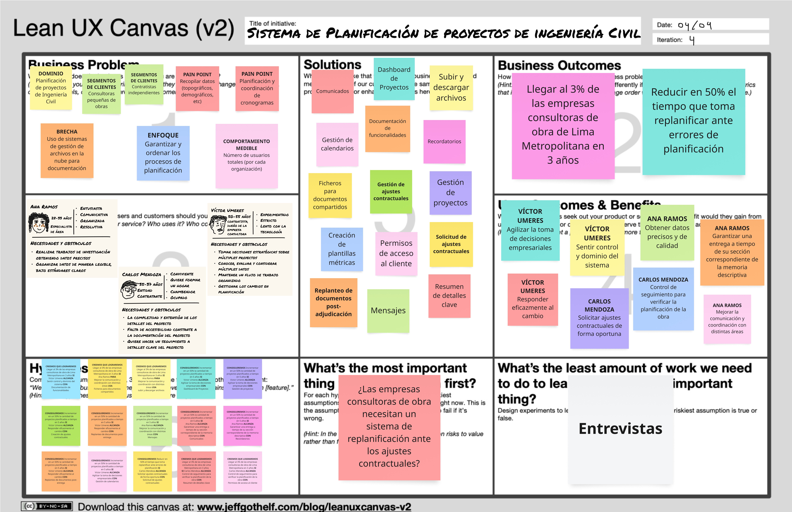

## 1.2. Solution Profile
### 1.2.1. Antecedentes y problemática
**What?**

Falta de control y coordinación de documentos y errores en la toma de datos que persisten durante el desarrollo y posterior entrega del expediente técnico que generan sobrecostos, retrasos y problemas legales.

**Why?**

Falta de un sistema centralizado que facilite la recopilación, almacenamiento y validación de datos en el expediente ténico.

**Who?**

A empresas pequeñas y contratistas independientes de consultoria de obras.

**When?**

En la actualidad, de manera continua a lo largo del tiempo.

**Where?**

En la planificación de un proyecto de obra civil, antes de su adjudicación.

**How?**

Se mide a través del los sobrecostos del expediente técnico.

**How much?**

A la gran mayoría de contratistas que realizan expedientes técnicos.

### 1.2.2 Lean UX Process.
#### 1.2.2.1. Lean UX Problem Statements.
Actualmente, el sector de consultoría en obras civiles se centra principalmente en la rápida elaboración de expedientes técnicos. Sin embargo, se suelen pasar por alto aspectos cruciales como la correcta organización de documentos, la comunicación y coordinación entre áreas, y la adaptación a los cambios.

Nuestro producto aborda estos problemas mediante funcionalidades que incluyen la gestión de múltiples proyectos, la segmentación del expediente técnico, un sistema de comunicación transversal a las especialidades y un sistema de control de cambios durante el desarrollo y la entrega del expediente técnico.

Por ello, nuestro enfoque inicial está dirigido a pequeñas empresas y contratistas independientes de consultoría en obras civiles.

Consideraremos que el problema está resuelto cuando estas pequeñas empresas o contratistas independientes logren reducir en un 50% el tiempo dedicado a replanificar errores durante el desarrollo del expediente técnico.

#### 1.2.2.2. Lean UX Assumptions.
**Business Outcomes**
* Alcanzar el 3% de las empresas consultoras de obras en Lima Metropolitana en un plazo de 3 años.
* Reducir en un 50% el tiempo necesario para replanificar ante errores de planificación.

**Users**

**Víctor Umeres - Contratista, Dueño de empresa constructora**
* Tomar decisiones estratégicas sobre múltiples proyectos.
* Conocer, evaluar y considerar múltiples datos.
* Mantener un flujo de trabajo organizado.
* Gestionar los cambios en planificación.

**Ana Ramos - Especialista de área**
* Realizar trabajos de investigación obteniendo datos precisos.
* Organizar datos de manera legible, bajo estándares claros.

**User Outcomes**

**Víctor Umeres - Contratista, Dueño de empresa constructora**
* Agilizar la toma de decisiones empresariales.
* Sentir control y dominio del sistema.
* Responder eficazmente al cambio.

**Ana Ramos - Especialista de área**
* Garantizar una entrega a tiempo de su sección correspondiente de la memoria descriptiva.
* Obtener datos precisos y de calidad.
* Mejorar la comunicación y coordinación con distintas áreas.

**Solutions**

* Dashboard de proyectos
* Comunicados 
* Recordatorios
* Subir y descargar archivos
* Documentación de funcionalidades
* Gestión de calendarios
* Gestión de proyectos
* Mensajes
* Ficheros para documentos compartidos
* Replanteo de documentos post-entrega
* Creación de ajustes contractuales
* Creación de plantillas métricas

#### 1.2.2.3. Lean UX Hypothesis Statements.

* Creemos que lograremos llegar al 3% de las empresas consultoras de obra de Lima Metropolitana en 3 años si Víctor alcanza sentir control y dominio del sistema con documentación de funcionalidades
* Creemos que lograremos  llegar al 3% de las empresas consultoras de obra de Lima Metropolitana en 3 años si Ana Ramos alcanza mejorar la comunicación y coordinación con distintas áreas con ficheros para documentos compartidos 
* Creemos que lograremos  llegar al 3% de las empresas consultoras de obra de Lima Metropolitana en 3 años si Ana Ramos alcanza mejorar la comunicación y coordinación con distintas áreas con subir y descargar archivos
* Creemos que lograremos incrementar en un 50% la cantidad de proyectos planificados a tiempo en 5 años si Víctor Umeres alcanza responder eficazmente al cambio con creación de ajustes contractuales.
* Creemos que lograremos incrementar en un 50% la cantidad de proyectos planificados a tiempo en 5 años si Víctor Umeres alcanza responder eficazmente al cambio con replanteo de documentos post-entrega.
* Creemos que lograremos incrementar en un 50% la cantidad de proyectos planificados a tiempo en 5 años si Víctor Umeres alcanza agilizar la toma de decisiones empresariales con dashboard de proyectos.
* Creemos que lograremos incrementar en un 50% la cantidad de proyectos planificados a tiempo en 5 años si Víctor Umeres alcanza agilizar la toma de decisiones empresariales con gestión de proyectos.
* Creemos que lograremos incrementar en un 50% la cantidad de proyectos planificados a tiempo en 5 años si Víctor Umeres alcanza agilizar la toma de decisiones empresariales con gestión de calendarios.
* Creemos que lograremos incrementar en un 50% la cantidad de proyectos planificados a tiempo en 5 años si Ana Ramos alcanza mejorar la comunicación y coordinación con distintas áreas con mensajes.
* Creemos que lograremos incrementar en un 50% la cantidad de proyectos planificados a tiempo en 5 años si Ana Ramos alcanza garantizar una entrega a tiempo de su sección correspondiente de la memoria descriptiva con comunicados.
* Creemos que lograremos incrementar en un 50% la cantidad de proyectos planificados a tiempo en 5 años si Ana Ramos alcanza garantizar una entrega a tiempo de su sección correspondiente de la memoria descriptiva con recordatorios.

#### 1.2.2.4. Lean UX Canvas.

### 1.3. Segmentos objetivo.