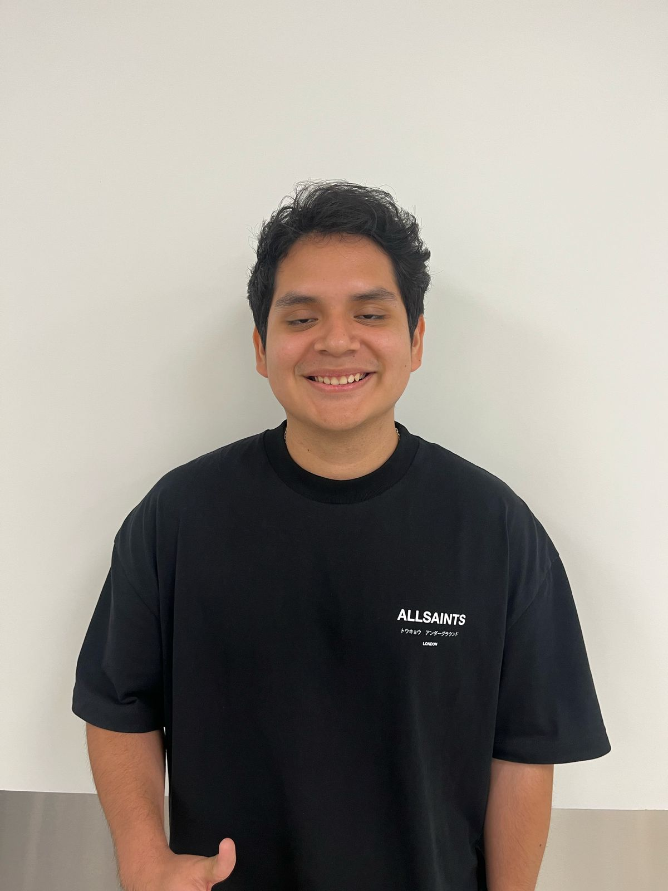
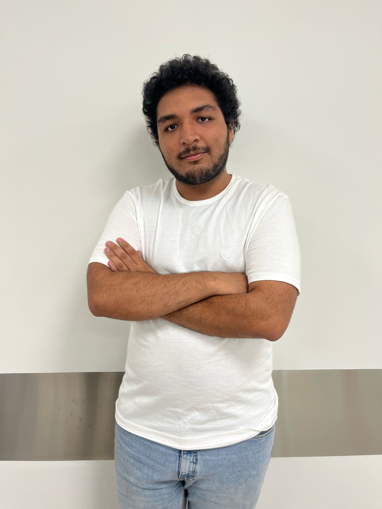

## 1.1. Startup Profile
### 1.1.1. Descripción de la Startup
<table class="tabla-equipo">
        <thead>
            <tr>
                <th>Foto</th>
                <th>Nombres y Apellidos</th>
                <th>Código de Alumno</th>
                <th>Carrera</th>
                <th>Habilidades</th>
            </tr>
        </thead>
        <tbody>
            <tr>
                <td></td>
                <td>Aponte Cruzado, Andrea Marielena</td>
                <td>202224135</td>
                <td>Ingeniería de Software</td>
                <td class="skills">
                    <ul>
                        <li>Diseño web</li>
                        <li>Gestión y diseño de bases de datos SQL y noSQL</li>
                        <li>Programación en C++ y Python</li>
                    </ul>
                </td>
            </tr>
            <tr>
                <td></td>
                <td>León Vivas, Fabrizio Amir</td>
                <td>20211b994</td>
                <td>Ingeniería de Software</td>
                <td class="skills">
                    <ul>
                        <li>Desarrollo front-end</li>
                        <li>Conocimiento de TI en sistemas basados en UNIX</li>
                        <li>Competente en C++, JavaScript y Python</li>
                        <li>Experiencia con Frameworks ágiles</li>
                    </ul>
                </td> 
            </tr>
            <tr>
                <td></td>
                <td>Lopez Acuña, Mario Joaquín</td>
                <td>202116250</td>
                <td>Ingenería de Software</td>
                <td class="skills">
                    <ul>
                        <li>Diseño web</li>
                        <li>Manejo de Azure para la gestión de máquinas virtuales</li>
                        <li>Conocimiento en sistemas Linux</li>
                        <li>Competente en C++, JavaScript y Python</li> 
                    </ul>
                </td>
            </tr>
            <tr>
                <td></td>
                <td>Orozco Torres, Álvaro Joaquín</td>
                <td>202220783</td>
                <td>Ingenería de Software</td>
                <td class="skills">
                    <ul>
                        <li>Programación con Python y JavaScript</li>
                        <li>Fundamentos de arquitectura de software</li>
                        <li>Diseño UX/UI con figma</li>
                        <li>Aplicación de herramientas y prácticas para la agilidad</li>
                        <li>Buenas prácticas de programación orientada a objetos, patrones, code quality & readability</li>
                    </ul>
                </td>
            </tr>
            <tr>
                <td></td>
                <td>Reaño Delgadillo, Henry Paolo</td>
                <td>20221e247</td>
                <td>Ingenería de Software</td>
                <td class="skills">
                    <ul>
                        <li>Conocimiento en sistemas operativos tipo Linux</li>
                        <li>Manejo de Azure para la gestión de máquinas virtuales</li>
                        <li>Conocimiento avanzado en sistemas Linux.</li>
                        <li>Familiaridad con SOA y Layered Architecture.</li>
                    </ul>
                </td> 
            </tr>
        </tbody>
</table>