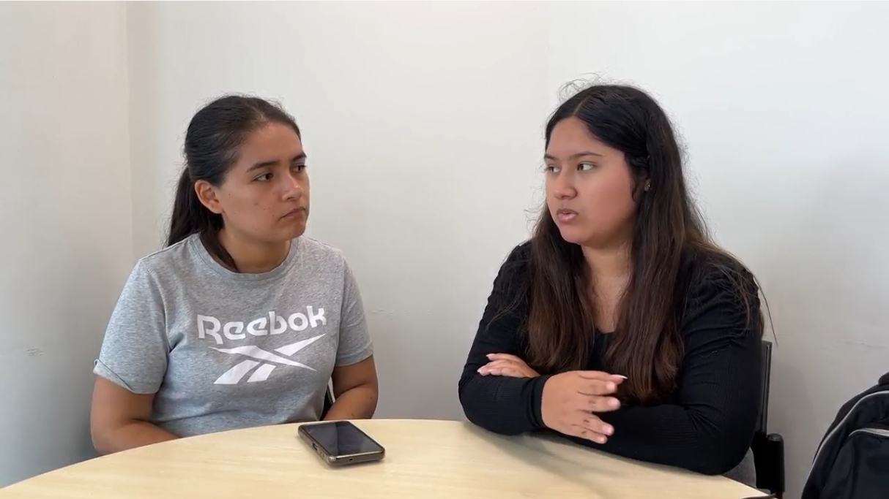

## 2.2. Entrevistas

### 2.2.1. Diseño de entrevistas

**Lista de preguntas**

Cada conjunto de preguntas fue elaborado de forma específica para los distintos segmentos objetivo y están enfocadas en entender cómo trabajan, qué herramientas usan y qué problemas enfrentan al planificar o modificar proyectos técnicos. Para asegurar que el flujo de la entrevista fluya, recreamos una conversación completa, simulando una entrevista real. Esto permitió detectar momentos en los que el ritmo se rompía o había redundancias. A partir de ese ejercicio, ajustamos el orden de las preguntas, cuidando que se mantuviera el enfoque natural sin perder precisión técnica.

Las preguntas enumeradas con un solo número corresponden a las preguntas principales, pensadas para guiar la entrevista y generar insights valiosos. Por otro lado, se incluyen preguntas complementarias que permiten profundizar la conversación según la respuesta del entrevistado. 

**Preguntas para Contratista / Proyectista**

**Empathy and Persona**

1. Primero, díganos un poco sobre usted y a qué se dedica.
  1.1. En base a su respuesta, se pregunta los campos que no se hayan podido llenar directamente según el formato presente en Plantilla de datos generales.
2. Cuéntenos, ¿Cómo luce un día típico de trabajo para usted?
3. ¿Qué herramientas utiliza en su día a día para realizar o apoyarse en el desarrollo de estas labores?
4. De estas actividades, ¿Qué parte identifica usted como la más laboriosa o frustrante?
5. ¿Qué cree que necesite para revertir esta situación?
6. Y de ellas, ¿Cuál cree usted que es la más importante, y por qué razón?

**Domain Model**

7. Describir el dominio en base a lo aprendido autónomamente y en base a ello.
  7.1. ¿Las secciones que hemos planteado son correctas? ¿Son un reflejo de su trabajo?
  7.2. ¿Cuál de estas (del nuevo modelo) considera que es la más importante o fundamental para el éxito de la planificación del proyecto? ¿Por qué razón?
8. En base a su experiencia, ¿Cómo organiza los documentos de un expediente técnico? (directorios, carpetas, documentos)
9. ¿Cómo es la organización y repartición de tareas en la elaboración de un expediente técnico?
10. ¿Qué valor tiene la comunicación entre especialistas del expediente técnico?
11. ¿Qué otras áreas de la organización se involucran directa o indirectamente en la elaboración de los expedientes técnicos? ¿Cómo se relacionan con el equipo principal?
12. ¿Qué tan importante es el cumplimiento de plazos con respecto al expediente técnico? ¿Se realizan estimaciones de tiempo?
13. ¿Es posible que deba realizar cambios al expediente técnico durante su desarrollo o tras la adjudicación de la obra?
    - ¿Cómo se realiza este proceso y qué tan importante o difícil resulta para la organización lidiar con él?

> La pregunta 13 es fundamental para validar nuestra hipótesis de Lean UX Iteración # 3.

**Preguntas para Especialista de área**

**Empathy and Persona**

1. Primero, díganos un poco sobre usted y a qué se dedica.
  1.1. En base a su respuesta, se pregunta los campos que no se hayan podido llenar directamente según el formato presente en Plantilla de datos generales.
2. Cuéntenos, ¿Cómo es trabajar en la elaboración de un expediente técnico de obra / proyecto?
3. ¿Qué herramientas utiliza para apoyarse en el desarrollo de estas labores?
4. De estas actividades, ¿Qué parte identifica usted como la más laboriosa o frustrante?
5. ¿Qué cree que necesite para revertir esta situación?
6. Y de ellas, ¿Cuál cree usted que es la más importante, y por qué razón?

**Domain Model**

7. ¿Cómo obtiene la información o datos necesarios para elaborar su parte del expediente técnico?
8. ¿Qué procesos sigue para transformar esa información en entregables o documentos técnicos?
9. ¿Cómo presenta o entrega finalmente su trabajo? ¿En qué formato y a través de qué canal?
10. ¿Qué estándares, normativas o lineamientos debe cumplir en su especialidad?
11. ¿Cómo asegura que su trabajo cumpla con los cronogramas establecidos?
12. ¿Qué tan fácil o difícil es coordinar con su equipo directo? ¿Qué herramientas utilizan para ello?
13. ¿Cómo se comunica con otras áreas técnicas (como estructuras, arquitectura, etc.) durante el desarrollo del expediente?

**Tabla de datos generales**

La plantilla de datos generales permite obtener información básica sobre los entrevistados, como su entorno, personalidad, herramientas favoritas y preferencias tecnológicas. Esta información sirve como punto de partida para profundizar durante la entrevista.

<table class="interview-table">
  <thead>
    <tr>
      <th style="width: 50%;">Campo</th>
      <th style="width: 50%;">Valor</th>
    </tr>
  </thead>
  <tbody>
    <tr><td>Género</td><td></td></tr>
    <tr><td>Personalidad</td><td></td></tr>
    <tr><td>Nombre</td><td></td></tr>
    <tr><td>Edad</td><td></td></tr>
    <tr><td>Ocupación</td><td></td></tr>
    <tr><td>Estado Civil</td><td></td></tr>
    <tr><td>Dispositivos favoritos</td><td></td></tr>
    <tr><td>Browsers (Safari, Google, Chrome, Mozilla, Edge, etc.)</td><td></td></tr>
    <tr><td>Canales o medios de comunicación</td><td></td></tr>
    <tr><td>Marcas e influencers</td><td></td></tr>
  </tbody>
</table>

### 2.2.2. Registro de entrevistas

<table class="tabla-entrevista">
  <thead>
    <tr>
      <th><strong>SEGMENTO OBJETIVO: CONTRATISTA</strong></th>
      <th><strong>#1</strong></th>
    </tr>
  </thead>
  <tbody>
    <tr>
      <td colspan="2">
        

          

            
Datos generales

            <ul>
              <li><strong>Nombres:</strong> William Martín</li>
              <li><strong>Apellidos:</strong> Salcedo Vásquez</li>
              <li><strong>Edad:</strong> 57</li>
              <li><strong>Distrito:</strong> San Juan de Lurigancho</li>
              <li><strong>URL Entrevista:</strong> <a href="https://upcedupe-my.sharepoint.com/:v:/g/personal/u20221e247_upc_edu_pe/EREC9iNRgJhIinK3osJI6IYBrl5jviZ00gGwKmbTa1DFvA?nav=eyJyZWZlcnJhbEluZm8iOnsicmVmZXJyYWxBcHAiOiJTdHJlYW1XZWJBcHAiLCJyZWZlcnJhbFZpZXciOiJTaGFyZURpYWxvZy1MaW5rIiwicmVmZXJyYWxBcHBQbGF0Zm9ybSI6IldlYiIsInJlZmVycmFsTW9kZSI6InZpZXcifX0%3D&e=LTJHiH" target="_blank">Ver video</a></li>
              <li><strong>Timestamp:</strong> 00:00</li>
              <li><strong>Duración:</strong> 04:51</li>
            </ul>
          

          
        

      </td>
    </tr>
    <tr>
      <td colspan="2">
        

          
Resumen

          <ul>
            <li><strong>Personalidad:</strong> Guardian. Demuestra un claro respeto por las normas y el cumplimiento de los acuerdos.</li>
            <li><strong>Marcas:</strong> Microsoft y Autodesk Inc. Principalmente sigue marcas porque ofrecen herramientas o soluciones valiosas para su trabajo.</li>
            <li><strong>Uso de tecnología:</strong> Medio, práctico. Posee habilidades de navegación, ofimática y uso de software específico para su trabajo.</li>
            <li><strong>Canales:</strong> Plataformas y herramientas de Microsoft (Microsoft Teams, por ejemplo). Demuestra un grado de integración alto con las herramientas de ofimática de Microsoft.</li>
            <li><strong>Browsers:</strong> Google Chrome. Sin una razón específica, posiblemente debido a la popularidad de Google.</li>
            <li><strong>Dispositivos:</strong> Celular y Laptop. Esto es debido a la portabilidad, lo que le permite seguir trabajando sin estar atado a una oficina.</li>
            <li><strong>Background:</strong> Su experiencia ha estado tanto en la parte administrativa (como gerente) como en la parte operativa (como residente de obra), actividad que suele extrañar. </li>
            <li>
              <strong>Frustraciones:</strong>
              <ul>
                <li>El factor distancia, pues no siempre puede estar en el lugar de la obra para dar su mejor juicio.</li>
                <li>La poca interconexión entre sistemas, pues muchos procesos dependen de autorizaciones que terminan en lo manual, muchas veces.</li>
              </ul>
            </li>
            <li>
              <strong>Flujos principales:</strong>
              <ul>
                <li>Comunicación / contacto con el cliente.</li>
                <li>Seguimiento de normativas y acuerdos (contratos).</li>
                <li>Conceder y solicitar autorización entre distintas áreas.</li>
                <li>Seguimiento y cumplimiento de calendarización.</li>
              </ul>
            </li>
          </ul>
        

      </td>
    </tr>
  </tbody>
</table>

<table class="tabla-entrevista">
  <thead>
    <tr>
      <th><strong>SEGMENTO OBJETIVO: CONTRATISTA</strong></th>
      <th><strong>#2</strong></th>
    </tr>
  </thead>
  <tbody>
    <tr>
      <td colspan="2">
        

          

            
Datos generales

            <ul>
              <li><strong>Nombres:</strong> Mario Encarnación</li>
              <li><strong>Apellidos:</strong> López Saldaña</li>
              <li><strong>Edad:</strong> 64</li>
              <li><strong>Distrito:</strong> La Molina</li>
              <li><strong>URL Entrevista:</strong> <a href="https://upcedupe-my.sharepoint.com/:v:/g/personal/u20221e247_upc_edu_pe/EREC9iNRgJhIinK3osJI6IYBrl5jviZ00gGwKmbTa1DFvA?nav=eyJyZWZlcnJhbEluZm8iOnsicmVmZXJyYWxBcHAiOiJTdHJlYW1XZWJBcHAiLCJyZWZlcnJhbFZpZXciOiJTaGFyZURpYWxvZy1MaW5rIiwicmVmZXJyYWxBcHBQbGF0Zm9ybSI6IldlYiIsInJlZmVycmFsTW9kZSI6InZpZXcifX0%3D&e=LTJHiH" target="_blank">Ver video</a></li>
              <li><strong>Timestamp:</strong> 04:52</li>
              <li><strong>Duración:</strong> 04:37</li>
            </ul>
          

          
        

      </td>
    </tr>
    <tr>
      <td colspan="2">
        

          
Resumen

          <ul>
            <li><strong>Personalidad:</strong> Guardián. Lleva la gran responsabilidad de dirigir una empresa con más de 30 años en el mercado que trabaja para el Estado Peruano. El cumplimiento de las normativas, los acuerdos y las expectativas de los clientes son su máxima prioridad.</li>
            <li><strong>Marcas:</strong> Microsoft, Autodesk Inc y S10. Son herramientas que utiliza en su trabajo.</li>
            <li><strong>Uso de tecnología:</strong> Minimo. Su empresa refleja un nivel de adopción de la tecnología bastante bajo, incluyendo prácticas poco convencionales como almacenar archivos en discos duros físicos.</li>
            <li><strong>Canales:</strong> WhatsApp. Lo usa como medio de comunicación y transferencia de archivos.</li>
            <li><strong>Browsers:</strong> Google Chrome. Sin razón en particular, posiblemente por la popularidad de Google.</li>
            <li><strong>Dispositivos:</strong> Celular y Laptop. Debido a su portabilidad.</li>
            <li><strong>Background:</strong> En 1992 fundó su empresa dedicada a la ejecución de obras para empresas privadas, consolidando experiencia como residente de obra. En la actualidad su empresa se dedica a la consultoría y elaboración de expedientes técnicos para el Estado Peruano.</li>
            <li>
              <strong>Frustraciones:</strong>
              <ul>
                <li>La adopción de tecnología.</li>
                <li>Capacitación de personal.</li>
              </ul>
            </li>
            <li>
              <strong>Flujos principales:</strong>
              <ul>
                <li>Estudios básicos (medidas descriptivas).</li>
                <li>Elaboración y seguimiento de calendario.</li>
                <li>Gestión de observaciones y compatibilidad.</li>
                <li>Seguimiento del contrato.</li>
              </ul>
            </li>
          </ul>
        

      </td>
    </tr>
  </tbody>
</table>

<table class="tabla-entrevista">
  <thead>
    <tr>
      <th><strong>SEGMENTO OBJETIVO: CONTRATISTA</strong></th>
      <th><strong>#3</strong></th>
    </tr>
  </thead>
  <tbody>
    <tr>
      <td colspan="2">
        

          

            
Datos generales

            <ul>
              <li><strong>Nombres:</strong> Raúl Fernando</li>
              <li><strong>Apellidos:</strong> Reaño García</li>
              <li><strong>Edad:</strong> 56</li>
              <li><strong>Distrito:</strong> San Juan de Lurigancho</li>
              <li><strong>URL Entrevista:</strong> <a href="https://upcedupe-my.sharepoint.com/:v:/g/personal/u20221e247_upc_edu_pe/EREC9iNRgJhIinK3osJI6IYBrl5jviZ00gGwKmbTa1DFvA?nav=eyJyZWZlcnJhbEluZm8iOnsicmVmZXJyYWxBcHAiOiJTdHJlYW1XZWJBcHAiLCJyZWZlcnJhbFZpZXciOiJTaGFyZURpYWxvZy1MaW5rIiwicmVmZXJyYWxBcHBQbGF0Zm9ybSI6IldlYiIsInJlZmVycmFsTW9kZSI6InZpZXcifX0%3D&e=LTJHiH" target="_blank">Ver video</a></li>
              <li><strong>Timestamp:</strong> 09:29</li>
              <li><strong>Duración:</strong> 04:01</li>
            </ul>
          

          
        

      </td>
    </tr>
    <tr>
      <td colspan="2">
        

          
Resumen

          <ul>
            <li><strong>Personalidad:</strong> Guardián. Como contratista de ejecución de obra, entiende la importancia de seguir lo establecido en el expediente técnico.</li>
            <li><strong>Marcas:</strong> Microsoft, Autodesk Inc y S10. Son herramientas que utiliza en su trabajo.</li>
            <li><strong>Uso de tecnología:</strong> Mínimo. Su empresa refleja un nivel de adopción de la tecnología bastante bajo, sin un grado de integración completa en las operaciones de empresa.</li>
            <li><strong>Canales:</strong> WhatsApp y Telegram. Los usa como canales de comunicación.</li>
            <li><strong>Browsers:</strong> Google Chrome. Sin razón en particular, posiblemente por la popularidad de Google.</li>
            <li><strong>Dispositivos:</strong> Celular y PC. Son aquellos que le resultan más familiares.</li>
            <li><strong>Background:</strong> Es gerente de su propia empresa dedicada a la ejecución de acabados finos en obras, públicas o privadas.</li>
            <li>
              <strong>Frustraciones:</strong>
              <ul>
                <li>Realizar consultas al residente de obra ante incompatibilidad de planos.</li>
              </ul>
            </li>
            <li>
              <strong>Flujos principales:</strong>
              <ul>
                <li>Seguir y cumplir los lineamientos de el expediente técnico.</li>
                <li>Realizar consultas o solicitar revisiones ante incompatibilidad de planos.</li>
              </ul>
            </li>
          </ul>
        

      </td>
    </tr>
  </tbody>
</table>

<table class="tabla-entrevista">
  <thead>
    <tr>
      <th><strong>SEGMENTO OBJETIVO: ESPECIALISTA</strong></th>
      <th><strong>#1</strong></th>
    </tr>
  </thead>
  <tbody>
    <tr>
      <td colspan="2">
        

          

            
Datos generales

            <ul>
              <li><strong>Nombres:</strong> Luis Enrique</li>
              <li><strong>Apellidos:</strong> Agreda Sobrino</li>
              <li><strong>Edad:</strong> 26</li>
              <li><strong>Distrito:</strong> Surco</li>
              <li><strong>URL Entrevista:</strong> <a href="https://upcedupe-my.sharepoint.com/:v:/g/personal/u20221e247_upc_edu_pe/EREC9iNRgJhIinK3osJI6IYBrl5jviZ00gGwKmbTa1DFvA?nav=eyJyZWZlcnJhbEluZm8iOnsicmVmZXJyYWxBcHAiOiJTdHJlYW1XZWJBcHAiLCJyZWZlcnJhbFZpZXciOiJTaGFyZURpYWxvZy1MaW5rIiwicmVmZXJyYWxBcHBQbGF0Zm9ybSI6IldlYiIsInJlZmVycmFsTW9kZSI6InZpZXcifX0%3D&e=LTJHiH" target="_blank">Ver video</a></li>
              <li><strong>Timestamp:</strong> 13:30</li>
              <li><strong>Duración:</strong> 04:00</li>
            </ul>
          

          
        

      </td>
    </tr>
    <tr>
      <td colspan="2">
        

          
Resumen

          <ul>
            <li><strong>Personalidad:</strong> Racional. Busca trabajar de manera eficiente, en el justo nivel de cumplimiento de estándares.</li>
            <li><strong>Marcas:</strong> Microsoft, Autodesk Inc, S10 y Apple. Son marcas que proporcionan herramientas útiles para su trabajo, como Microsoft Project.</li>
            <li><strong>Uso de tecnología:</strong> Bajo. Como asistente de costos y cronograma, se encarga de la digitalización de las operaciones de la empresa para la que trabaja. Para ello, ha tenido que aprender a utilizar todas las herramientas necesarias. Sin embargo, demuestra un bajo nivel de competencia digital, lo que afecta su capacidad de adopción de nuevas herramientas.</li>
            <li><strong>Canales:</strong> WhatsApp. Su principal medio de comunicación con su equipo.</li>
            <li><strong>Browsers:</strong> Google Chrome y Safari. Usa un celular iPhone, para el cual utiliza Safari. En su PC utiliza Google Chrome.</li>
            <li><strong>Dispositivos:</strong> Celular y PC. Son aquellos que soportan las herramientas que necesita para realizar su trabajo.</li>
            <li><strong>Background:</strong> Es asistente de costos y cronograma. Se encarga de la fase de digitalización de los procesos para la empresa que trabaja.</li>
            <li>
              <strong>Frustraciones:</strong>
              <ul>
                <li>Aprender nuevas herramientas de software.</li>
                <li>Transferencia de archivos.</li>
              </ul>
            </li>
            <li>
              <strong>Flujos principales:</strong>
              <ul>
                <li>Seguir y cumplir los lineamientos de el expediente técnico.</li>
                <li>Realizar consultas o solicitar revisiones ante incompatibilidad de planos.</li>
              </ul>
            </li>
          </ul>
        

      </td>
    </tr>
  </tbody>
</table>

<table class="tabla-entrevista">
  <thead>
    <tr>
      <th><strong>SEGMENTO OBJETIVO: ESPECIALISTA</strong></th>
      <th><strong>#2</strong></th>
    </tr>
  </thead>
  <tbody>
    <tr>
      <td colspan="2">
        

          

            
Datos generales

            <ul>
              <li><strong>Nombres:</strong> Manuel Bejamín</li>
              <li><strong>Apellidos:</strong> Anyaypoma Ocon</li>
              <li><strong>Edad:</strong> 45</li>
              <li><strong>Distrito:</strong> Surco</li>
              <li><strong>URL Entrevista:</strong> <a href="https://upcedupe-my.sharepoint.com/:v:/g/personal/u20221e247_upc_edu_pe/EREC9iNRgJhIinK3osJI6IYBrl5jviZ00gGwKmbTa1DFvA?nav=eyJyZWZlcnJhbEluZm8iOnsicmVmZXJyYWxBcHAiOiJTdHJlYW1XZWJBcHAiLCJyZWZlcnJhbFZpZXciOiJTaGFyZURpYWxvZy1MaW5rIiwicmVmZXJyYWxBcHBQbGF0Zm9ybSI6IldlYiIsInJlZmVycmFsTW9kZSI6InZpZXcifX0%3D&e=LTJHiH" target="_blank">Ver video</a></li>
              <li><strong>Timestamp:</strong> 17:31</li>
              <li><strong>Duración:</strong> 04:47</li>
            </ul>
          

          
        

      </td>
    </tr>
    <tr>
      <td colspan="2">
        

          
Resumen

          <ul>
            <li><strong>Personalidad:</strong> Guardián. Demuestra un gran compromiso por mantener el cumplimiento de normativas y estándares, aunque eso resulte en complicaciones.</li>
            <li><strong>Marcas:</strong> Microsoft y Cisco. Marcas de alta envergadura que proporcionan herramientas especializadas, confiables y robustas para su trabajo.</li>
            <li><strong>Uso de tecnología:</strong> Alto. Como jefe de TIC en el INEN, posee un gran entendimiento y habilidad para el manejo de la tecnología, necesario para la posición que ocupa y formando parte de su quehacer diario.</li>
            <li><strong>Canales:</strong> WhatsApp y X (Twitter). </li>
            <li><strong>Browsers:</strong> Google Chrome, Firefox e Internet Explorer. Usa estos browsers según la compatibilidad de ciertos sistemas legacy con los que debe interactuar como parte de su trabajo.</li>
            <li><strong>Dispositivos:</strong> PC, Laptop y Celular</li>
            <li><strong>Background:</strong> Trabaja en el INEN desde hace más de 10 años como especialista en Redes y Telecomunicaciones.</li>
            <li>
              <strong>Frustraciones:</strong>
              <ul>
                <li>Elaboración de documentación exhaustiva en conformidad con la ley.</li>
              </ul>
            </li>
            <li>
              <strong>Flujos principales:</strong>
              <ul>
                <li>Reuniones de coordinación de especialistas.</li>
                <li>Elaboración de documentación para los expedientes técnicos.</li>
              </ul>
            </li>
          </ul>
        

      </td>
    </tr>
  </tbody>
</table>

<table class="tabla-entrevista">
  <thead>
    <tr>
      <th><strong>SEGMENTO OBJETIVO: ESPECIALISTA</strong></th>
      <th><strong>#3</strong></th>
    </tr>
  </thead>
  <tbody>
    <tr>
      <td colspan="2">
        

          

            
Datos generales

            <ul>
              <li><strong>Nombres:</strong> Jesús Josecarlos</li>
              <li><strong>Apellidos:</strong> Merino Fernández</li>
              <li><strong>Edad:</strong> 35</li>
              <li><strong>Distrito:</strong> Trujillo</li>
              <li><strong>URL Entrevista:</strong> <a href="https://upcedupe-my.sharepoint.com/:v:/g/personal/u20221e247_upc_edu_pe/EREC9iNRgJhIinK3osJI6IYBrl5jviZ00gGwKmbTa1DFvA?nav=eyJyZWZlcnJhbEluZm8iOnsicmVmZXJyYWxBcHAiOiJTdHJlYW1XZWJBcHAiLCJyZWZlcnJhbFZpZXciOiJTaGFyZURpYWxvZy1MaW5rIiwicmVmZXJyYWxBcHBQbGF0Zm9ybSI6IldlYiIsInJlZmVycmFsTW9kZSI6InZpZXcifX0%3D&e=LTJHiH" target="_blank">Ver video</a></li>
              <li><strong>Timestamp:</strong> 22:18</li>
              <li><strong>Duración:</strong> 04:55</li>
            </ul>
          

          
        

      </td>
    </tr>
    <tr>
      <td colspan="2">
        

          
Resumen

          <ul>
            <li><strong>Personalidad:</strong> Guardián. Demuestra un profundo entendimiento y aceptación de las normativas que constriñen su trabajo y se alinea siempre a su cumplimiento.</li>
            <li><strong>Marcas:</strong> Autodesk Inc y Microsoft. Principalmente por software especializado de trabajo.</li>
            <li><strong>Uso de tecnología:</strong> Medio. Posee dominio suficiente de la tecnología que utiliza y la integra naturalmente en su flujo de trabajo diario.</li>
            <li><strong>Canales:</strong> Instagram, X (Twitter) y WhatsApp. En su mayoría son redes de uso personal.</li>
            <li><strong>Browsers:</strong> Brave</li>
            <li><strong>Dispositivos:</strong> Celular y PC.</li>
            <li><strong>Background:</strong> Es ingeniero civil de profesión y tiene un profundo entendimiento del funcionamiento del proceso de planificación y ejecución de proyectos.</li>
            <li>
              <strong>Frustraciones:</strong>
              <ul>
                <li>Solucionar errores en los expedientes técnicos causados por mala praxis de otros especialistas de área.</li>
                <li>Coordinar la elaboración del expediente técnico en conjunto a múltiples especialistas de área.</li>
              </ul>
            </li>
            <li>
              <strong>Flujos principales:</strong>
              <ul>
                <li>Reuniones de coordinación de especialistas.</li>
                <li>Cumplir con los entregables (avances de los expedientes por etapas).</li>
                <li>Cálculo de materiales de obra y precios unitarios (presupuesto por área de especialidad).</li>
                <li>Analizar datos para identificar posibles riesgos.</li>
              </ul>
            </li>
          </ul>
        

      </td>
    </tr>
  </tbody>
</table>

<table class="tabla-entrevista">
  <thead>
    <tr>
      <th><strong>SEGMENTO OBJETIVO: ENTIDAD CONTRATANTE</strong></th>
      <th><strong>#1</strong></th>
    </tr>
  </thead>
  <tbody>
    <tr>
      <td colspan="2">
        

          

            
Datos generales

            <ul>
              <li><strong>Nombres:</strong> Aldo Kevin</li>
              <li><strong>Apellidos:</strong> Apolinario Vivas</li>
              <li><strong>Edad:</strong> 34</li>
              <li><strong>Distrito:</strong> El Agustino</li>
              <li><strong>URL Entrevista:</strong> <a href="https://upcedupe-my.sharepoint.com/:v:/g/personal/u20221e247_upc_edu_pe/EREC9iNRgJhIinK3osJI6IYBrl5jviZ00gGwKmbTa1DFvA?nav=eyJyZWZlcnJhbEluZm8iOnsicmVmZXJyYWxBcHAiOiJTdHJlYW1XZWJBcHAiLCJyZWZlcnJhbFZpZXciOiJTaGFyZURpYWxvZy1MaW5rIiwicmVmZXJyYWxBcHBQbGF0Zm9ybSI6IldlYiIsInJlZmVycmFsTW9kZSI6InZpZXcifX0%3D&e=LTJHiH" target="_blank">Ver video</a></li>
              <li><strong>Timestamp:</strong> 27:14</li>
              <li><strong>Duración:</strong> 03:00</li>
            </ul>
          

          
        

      </td>
    </tr>
    <tr>
      <td colspan="2">
        

          
Resumen

          <ul>
            <li><strong>Personalidad:</strong> Idealista. Persigue sus objetivos personales sin comprometer su ética.</li>
            <li><strong>Marcas:</strong> Podcasts de educación en general.</li>
            <li><strong>Uso de tecnología:</strong> Medio-bajo. Usa frecuentemente la tecnología a nivel personal para consumir contenidos en línea.</li>
            <li><strong>Canales:</strong> LinkedIn. </li>
            <li><strong>Browsers:</strong> Google Chrome y Safari. Usa estos browsers según el dispositivo que esté utilizando.</li>
            <li><strong>Dispositivos:</strong> Laptop y Celular</li>
            <li><strong>Background:</strong> Trabaja en el INEN desde hace más de 10 años como especialista en Redes y Telecomunicaciones.</li>
            <li>
              <strong>Frustraciones:</strong>
              <ul>
                <li>Asegurar que sus expectativas sean cumplidas por el proyectista.</li>
              </ul>
            </li>
            <li>
              <strong>Flujos principales:</strong>
              <ul>
                <li>Contactar con el proyectista.</li>
                <li>Presentar el requerimiento del proyecto.</li>
              </ul>
            </li>
          </ul>
        

      </td>
    </tr>
  </tbody>
</table>

<table class="tabla-entrevista">
  <thead>
    <tr>
      <th><strong>SEGMENTO OBJETIVO: ENTIDAD CONTRATANTE</strong></th>
      <th><strong>#2</strong></th>
    </tr>
  </thead>
  <tbody>
    <tr>
      <td colspan="2">
        

          

            
Datos generales

            <ul>
              <li><strong>Nombres:</strong> Lucero Martina</li>
              <li><strong>Apellidos:</strong> Villanes Santillán</li>
              <li><strong>Edad:</strong> 26</li>
              <li><strong>Distrito:</strong> Villa María del Triunfo</li>
              <li><strong>URL Entrevista:</strong> <a href="https://upcedupe-my.sharepoint.com/:v:/g/personal/u20221e247_upc_edu_pe/EREC9iNRgJhIinK3osJI6IYBrl5jviZ00gGwKmbTa1DFvA?nav=eyJyZWZlcnJhbEluZm8iOnsicmVmZXJyYWxBcHAiOiJTdHJlYW1XZWJBcHAiLCJyZWZlcnJhbFZpZXciOiJTaGFyZURpYWxvZy1MaW5rIiwicmVmZXJyYWxBcHBQbGF0Zm9ybSI6IldlYiIsInJlZmVycmFsTW9kZSI6InZpZXcifX0%3D&e=LTJHiH" target="_blank">Ver video</a></li>
              <li><strong>Timestamp:</strong> 30:15</li>
              <li><strong>Duración:</strong> 01:44</li>
            </ul>
          

          
        

      </td>
    </tr>
    <tr>
      <td colspan="2">
        

          
Resumen

          <ul>
            <li><strong>Personalidad:</strong> Idealista. Persigue sus objetivos personales sin comprometer su ética.</li>
            <li><strong>Marcas:</strong> Vlogs en general.</li>
            <li><strong>Uso de tecnología:</strong> Medio-bajo. Usa frecuentemente la tecnología a nivel personal para consumir contenidos en línea.</li>
            <li><strong>Canales:</strong> TikTok e Instagram. </li>
            <li><strong>Browsers:</strong> Google Chrome y Edge.</li>
            <li><strong>Dispositivos:</strong> Laptop y Celular</li>
            <li><strong>Background:</strong> Es ingeniera industrial con 5 años de experiencia en el año de logística.</li>
            <li>
              <strong>Frustraciones:</strong>
              <ul>
                <li>Asegurar que el proyecto sea finalizado a tiempo.</li>
              </ul>
            </li>
            <li>
              <strong>Flujos principales:</strong>
              <ul>
                <li>Contactar con el proyectista.</li>
                <li>Supervisar el avance del proyecto.</li>
              </ul>
            </li>
          </ul>
        

      </td>
    </tr>
  </tbody>
</table>

<table class="tabla-entrevista">
  <thead>
    <tr>
      <th><strong>SEGMENTO OBJETIVO: ENTIDAD CONTRATANTE</strong></th>
      <th><strong>#3</strong></th>
    </tr>
  </thead>
  <tbody>
    <tr>
      <td colspan="2">
        

          

            
Datos generales

            <ul>
              <li><strong>Nombres:</strong> Álvaro Martín</li>
              <li><strong>Apellidos:</strong> Torres Huamaní</li>
              <li><strong>Edad:</strong> 27</li>
              <li><strong>Distrito:</strong> San Juan de Lurigancho</li>
              <li><strong>URL Entrevista:</strong> <a href="https://upcedupe-my.sharepoint.com/:v:/g/personal/u20221e247_upc_edu_pe/EREC9iNRgJhIinK3osJI6IYBrl5jviZ00gGwKmbTa1DFvA?nav=eyJyZWZlcnJhbEluZm8iOnsicmVmZXJyYWxBcHAiOiJTdHJlYW1XZWJBcHAiLCJyZWZlcnJhbFZpZXciOiJTaGFyZURpYWxvZy1MaW5rIiwicmVmZXJyYWxBcHBQbGF0Zm9ybSI6IldlYiIsInJlZmVycmFsTW9kZSI6InZpZXcifX0%3D&e=LTJHiH" target="_blank">Ver video</a></li>
              <li><strong>Timestamp:</strong> 31:59</li>
              <li><strong>Duración:</strong> 03:56</li>
            </ul>
          

          
        

      </td>
    </tr>
    <tr>
      <td colspan="2">
        

          
Resumen

          <ul>
            <li><strong>Personalidad:</strong> Idealista. Demuestra ser bastante deliberado en cuanto persigue sus objetivos y metas personales.</li>
            <li><strong>Marcas:</strong> Álvaro Soler.</li>
            <li><strong>Uso de tecnología:</strong> Medio-bajo. Usa frecuentemente la tecnología a nivel personal para consumir contenidos en línea.</li>
            <li><strong>Canales:</strong> TikTok e Instagram. </li>
            <li><strong>Browsers:</strong> Google Chrome.</li>
            <li><strong>Dispositivos:</strong> Celular.</li>
            <li><strong>Background:</strong> Es electricista de profesión y está comenzando a formar una familia.</li>
            <li>
              <strong>Frustraciones:</strong>
              <ul>
                <li>Asegurar que el proyectista haga un trabajo de calidad.</li>
              </ul>
            </li>
            <li>
              <strong>Flujos principales:</strong>
              <ul>
                <li>Contactar con el proyectista.</li>
                <li>Supervisar el avance del proyecto.</li>
              </ul>
            </li>
          </ul>
        

      </td>
    </tr>
  </tbody>
</table>