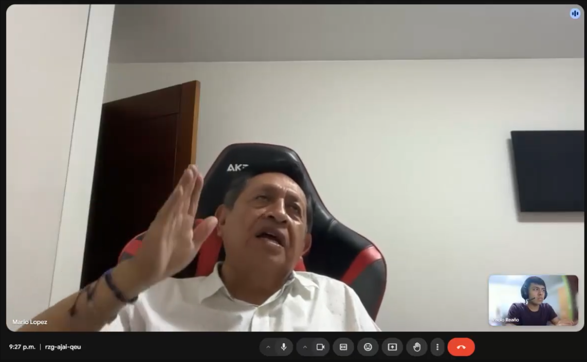
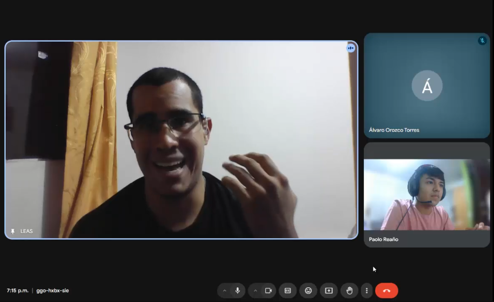
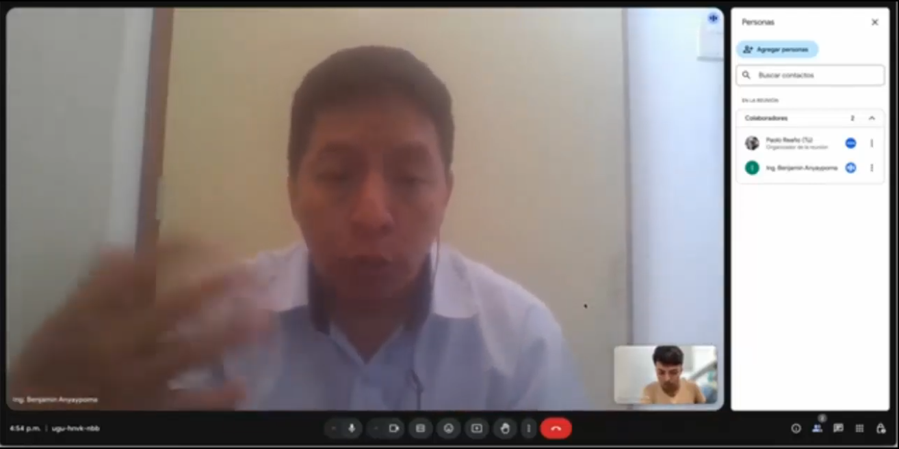
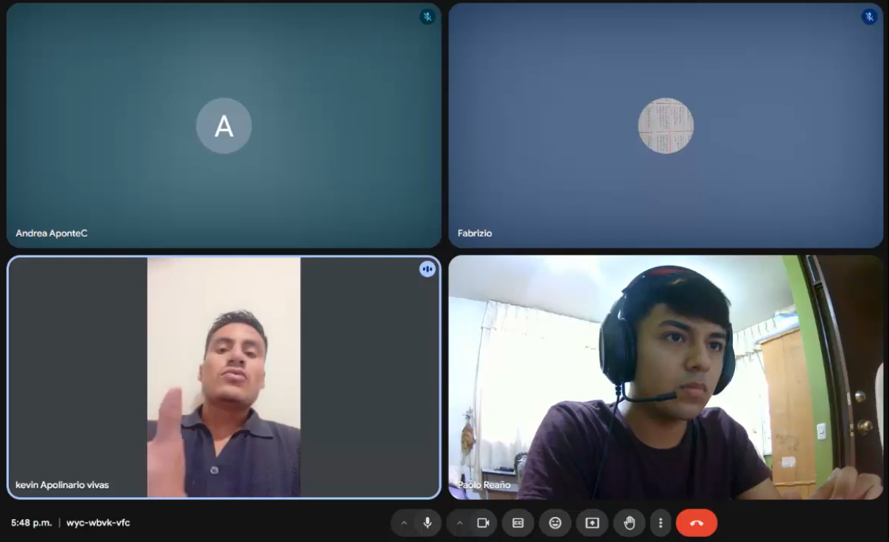
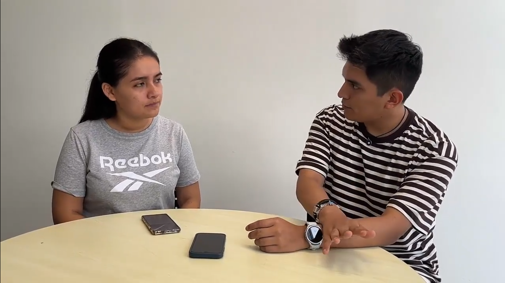

## 2.2. Entrevistas

### 2.2.1. Diseño de entrevistas

**Lista de preguntas**

Cada conjunto de preguntas fue elaborado de forma específica para los distintos segmentos objetivo y están enfocadas en entender cómo trabajan, qué herramientas usan y qué problemas enfrentan al planificar o modificar proyectos técnicos. Para asegurar que el flujo de la entrevista fluya, recreamos una conversación completa, simulando una entrevista real. Esto permitió detectar momentos en los que el ritmo se rompía o había redundancias. A partir de ese ejercicio, ajustamos el orden de las preguntas, cuidando que se mantuviera el enfoque natural sin perder precisión técnica.

Las preguntas enumeradas con un solo número corresponden a las preguntas principales, pensadas para guiar la entrevista y generar insights valiosos. Por otro lado, se incluyen preguntas complementarias que permiten profundizar la conversación según la respuesta del entrevistado. 

**Preguntas para Contratista / Proyectista**

**Empathy and Persona**

1. Primero, díganos un poco sobre usted y a qué se dedica.
  1.1. En base a su respuesta, se pregunta los campos que no se hayan podido llenar directamente según el formato presente en Plantilla de datos generales.
2. Cuéntenos, ¿Cómo luce un día típico de trabajo para usted?
3. ¿Qué herramientas utiliza en su día a día para realizar o apoyarse en el desarrollo de estas labores?
4. De estas actividades, ¿Qué parte identifica usted como la más laboriosa o frustrante?
5. ¿Qué cree que necesite para revertir esta situación?
6. Y de ellas, ¿Cuál cree usted que es la más importante, y por qué razón?

**Domain Model**

7. Describir el dominio en base a lo aprendido autónomamente y en base a ello.
  7.1. ¿Las secciones que hemos planteado son correctas? ¿Son un reflejo de su trabajo?
  7.2. ¿Cuál de estas (del nuevo modelo) considera que es la más importante o fundamental para el éxito de la planificación del proyecto? ¿Por qué razón?
8. En base a su experiencia, ¿Cómo organiza los documentos de un expediente técnico? (directorios, carpetas, documentos)
9. ¿Cómo es la organización y repartición de tareas en la elaboración de un expediente técnico?
10. ¿Qué valor tiene la comunicación entre especialistas del expediente técnico?
11. ¿Qué otras áreas de la organización se involucran directa o indirectamente en la elaboración de los expedientes técnicos? ¿Cómo se relacionan con el equipo principal?
12. ¿Qué tan importante es el cumplimiento de plazos con respecto al expediente técnico? ¿Se realizan estimaciones de tiempo?
13. ¿Es posible que deba realizar cambios al expediente técnico durante su desarrollo o tras la adjudicación de la obra?
    - ¿Cómo se realiza este proceso y qué tan importante o difícil resulta para la organización lidiar con él?

> La pregunta 13 es fundamental para validar nuestra hipótesis de Lean UX Iteración # 3.

**Preguntas para Especialista de área**

**Empathy and Persona**

1. Primero, díganos un poco sobre usted y a qué se dedica.
  1.1. En base a su respuesta, se pregunta los campos que no se hayan podido llenar directamente según el formato presente en Plantilla de datos generales.
2. Cuéntenos, ¿Cómo es trabajar en la elaboración de un expediente técnico de obra / proyecto?
3. ¿Qué herramientas utiliza para apoyarse en el desarrollo de estas labores?
4. De estas actividades, ¿Qué parte identifica usted como la más laboriosa o frustrante?
5. ¿Qué cree que necesite para revertir esta situación?
6. Y de ellas, ¿Cuál cree usted que es la más importante, y por qué razón?

**Domain Model**

7. ¿Cómo obtiene la información o datos necesarios para elaborar su parte del expediente técnico?
8. ¿Qué procesos sigue para transformar esa información en entregables o documentos técnicos?
9. ¿Cómo presenta o entrega finalmente su trabajo? ¿En qué formato y a través de qué canal?
10. ¿Qué estándares, normativas o lineamientos debe cumplir en su especialidad?
11. ¿Cómo asegura que su trabajo cumpla con los cronogramas establecidos?
12. ¿Qué tan fácil o difícil es coordinar con su equipo directo? ¿Qué herramientas utilizan para ello?
13. ¿Cómo se comunica con otras áreas técnicas (como estructuras, arquitectura, etc.) durante el desarrollo del expediente?

**Tabla de datos generales**

La plantilla de datos generales permite obtener información básica sobre los entrevistados, como su entorno, personalidad, herramientas favoritas y preferencias tecnológicas. Esta información sirve como punto de partida para profundizar durante la entrevista.

<table style="
        width: 100%;
        text-align: left;
        font-size: 14px;">
  <thead>
    <tr>
      <th style="width: 50%; border: 1px solid #000;">Campo</th>
      <th style="width: 50%; border: 1px solid #000;">Valor</th>
    </tr>
  </thead>
  <tbody>
    <tr><td style="border: 1px solid #000;">Género</td><td style="border: 1px solid #000;"></td></tr>
    <tr><td style="border: 1px solid #000;">Personalidad</td><td style="border: 1px solid #000;"></td></tr>
    <tr><td style="border: 1px solid #000;">Nombre</td><td style="border: 1px solid #000;"></td></tr>
    <tr><td style="border: 1px solid #000;">Edad</td><td style="border: 1px solid #000;"></td></tr>
    <tr><td style="border: 1px solid #000;">Ocupación</td><td style="border: 1px solid #000;"></td></tr>
    <tr><td style="border: 1px solid #000;">Estado Civil</td><td style="border: 1px solid #000;"></td></tr>
    <tr><td style="border: 1px solid #000;">Dispositivos favoritos</td><td style="border: 1px solid #000;"></td></tr>
    <tr><td style="border: 1px solid #000;">Browsers (Safari, Google, Chrome, Mozilla, Edge, etc.)</td><td style="border: 1px solid #000;"></td></tr>
    <tr><td style="border: 1px solid #000;">Canales o medios de comunicación</td><td style="border: 1px solid #000;"></td></tr>
    <tr><td style="border: 1px solid #000;">Marcas e influencers</td><td style="border: 1px solid #000;"></td></tr>
  </tbody>
</table>

### 2.2.2. Registro de entrevistas

<table style="
          width: 100%;
          border-collapse: collapse;
          font-family: Arial, sans-serif;
          margin-bottom: 40px;">
  <thead>
    <tr>
      <th style="
            text-align: left;
            padding: 12px;
            background-color: #f0f0f0;
            font-size: 22px;"><strong>SEGMENTO OBJETIVO: CONTRATISTA</strong></th>
      <th style="
            text-align: left;
            padding: 12px;
            background-color: #f0f0f0;
            font-size: 22px;"><strong>#1</strong></th>
    </tr>
  </thead>
  <tbody>
    <tr>
      <td colspan="2" style="padding: 0; vertical-align: top; background-color: #fff border-top: 1px solid #ddd;" style="padding: 0; vertical-align: top; background-color: #fff border-top: 1px solid #ddd;">
        

          

            
Datos generales

            <ul style="margin: 0; padding-left: 20px; list-style-type: disc; font-size: 1.05em; line-height: 1.7; color: #333;">
              <li><strong>Nombres:</strong> William Martín</li>
              <li><strong>Apellidos:</strong> Salcedo Vásquez</li>
              <li><strong>Edad:</strong> 57</li>
              <li><strong>Distrito:</strong> San Juan de Lurigancho</li>
              <li><strong>URL Entrevista:</strong> <a href="https://upcedupe-my.sharepoint.com/:v:/g/personal/u20221e247_upc_edu_pe/EREC9iNRgJhIinK3osJI6IYBrl5jviZ00gGwKmbTa1DFvA?nav=eyJyZWZlcnJhbEluZm8iOnsicmVmZXJyYWxBcHAiOiJTdHJlYW1XZWJBcHAiLCJyZWZlcnJhbFZpZXciOiJTaGFyZURpYWxvZy1MaW5rIiwicmVmZXJyYWxBcHBQbGF0Zm9ybSI6IldlYiIsInJlZmVycmFsTW9kZSI6InZpZXcifX0%3D&e=LTJHiH" target="_blank">Ver video</a></li>
              <li><strong>Timestamp:</strong> 00:00</li>
              <li><strong>Duración:</strong> 04:51</li>
            </ul>
          

          
        

      </td>
    </tr>
    <tr>
      <td colspan="2" style="padding: 0; vertical-align: top; background-color: #fff border-top: 1px solid #ddd;">
        

          
Resumen

          <ul style="padding-left: 20px; list-style-type: disc; color: #333; font-size: 1em; margin: 0;">
            <li><strong>Personalidad:</strong> Guardian. Demuestra un claro respeto por las normas y el cumplimiento de los acuerdos.</li>
            <li><strong>Marcas:</strong> Microsoft y Autodesk Inc. Principalmente sigue marcas porque ofrecen herramientas o soluciones valiosas para su trabajo.</li>
            <li><strong>Uso de tecnología:</strong> Medio, práctico. Posee habilidades de navegación, ofimática y uso de software específico para su trabajo.</li>
            <li><strong>Canales:</strong> Plataformas y herramientas de Microsoft (Microsoft Teams, por ejemplo). Demuestra un grado de integración alto con las herramientas de ofimática de Microsoft.</li>
            <li><strong>Browsers:</strong> Google Chrome. Sin una razón específica, posiblemente debido a la popularidad de Google.</li>
            <li><strong>Dispositivos:</strong> Celular y Laptop. Esto es debido a la portabilidad, lo que le permite seguir trabajando sin estar atado a una oficina.</li>
            <li><strong>Background:</strong> Su experiencia ha estado tanto en la parte administrativa (como gerente) como en la parte operativa (como residente de obra), actividad que suele extrañar. </li>
            <li>
              <strong>Frustraciones:</strong>
              <ul style="list-style-type: circle; padding-left: 20px;">
                <li>El factor distancia, pues no siempre puede estar en el lugar de la obra para dar su mejor juicio.</li>
                <li>La poca interconexión entre sistemas, pues muchos procesos dependen de autorizaciones que terminan en lo manual, muchas veces.</li>
              </ul>
            </li>
            <li>
              <strong>Flujos principales:</strong>
              <ul style="list-style-type: circle; padding-left: 20px;">
                <li>Comunicación / contacto con el cliente.</li>
                <li>Seguimiento de normativas y acuerdos (contratos).</li>
                <li>Conceder y solicitar autorización entre distintas áreas.</li>
                <li>Seguimiento y cumplimiento de calendarización.</li>
              </ul>
            </li>
          </ul>
        

      </td>
    </tr>
  </tbody>
</table>

<table class="tabla-entrevista">
  <thead>
    <tr>
      <th style="
            text-align: left;
            padding: 12px;
            background-color: #f0f0f0;
            font-size: 22px;"><strong>SEGMENTO OBJETIVO: CONTRATISTA</strong></th>
      <th><strong>#2</strong></th>
    </tr>
  </thead>
  <tbody>
    <tr>
      <td colspan="2" style="padding: 0; vertical-align: top; background-color: #fff border-top: 1px solid #ddd;">
        

          

            
Datos generales

            <ul style="margin: 0; padding-left: 20px; list-style-type: disc; font-size: 1.05em; line-height: 1.7; color: #333;">
              <li><strong>Nombres:</strong> Mario Encarnación</li>
              <li><strong>Apellidos:</strong> López Saldaña</li>
              <li><strong>Edad:</strong> 64</li>
              <li><strong>Distrito:</strong> La Molina</li>
              <li><strong>URL Entrevista:</strong> <a href="https://upcedupe-my.sharepoint.com/:v:/g/personal/u20221e247_upc_edu_pe/EREC9iNRgJhIinK3osJI6IYBrl5jviZ00gGwKmbTa1DFvA?nav=eyJyZWZlcnJhbEluZm8iOnsicmVmZXJyYWxBcHAiOiJTdHJlYW1XZWJBcHAiLCJyZWZlcnJhbFZpZXciOiJTaGFyZURpYWxvZy1MaW5rIiwicmVmZXJyYWxBcHBQbGF0Zm9ybSI6IldlYiIsInJlZmVycmFsTW9kZSI6InZpZXcifX0%3D&e=LTJHiH" target="_blank">Ver video</a></li>
              <li><strong>Timestamp:</strong> 04:52</li>
              <li><strong>Duración:</strong> 04:37</li>
            </ul>
          

          
        

      </td>
    </tr>
    <tr>
      <td colspan="2" style="padding: 0; vertical-align: top; background-color: #fff border-top: 1px solid #ddd;">
        

          
Resumen

          <ul style="padding-left: 20px; list-style-type: disc; color: #333; font-size: 1em; margin: 0;">
            <li><strong>Personalidad:</strong> Guardián. Lleva la gran responsabilidad de dirigir una empresa con más de 30 años en el mercado que trabaja para el Estado Peruano. El cumplimiento de las normativas, los acuerdos y las expectativas de los clientes son su máxima prioridad.</li>
            <li><strong>Marcas:</strong> Microsoft, Autodesk Inc y S10. Son herramientas que utiliza en su trabajo.</li>
            <li><strong>Uso de tecnología:</strong> Minimo. Su empresa refleja un nivel de adopción de la tecnología bastante bajo, incluyendo prácticas poco convencionales como almacenar archivos en discos duros físicos.</li>
            <li><strong>Canales:</strong> WhatsApp. Lo usa como medio de comunicación y transferencia de archivos.</li>
            <li><strong>Browsers:</strong> Google Chrome. Sin razón en particular, posiblemente por la popularidad de Google.</li>
            <li><strong>Dispositivos:</strong> Celular y Laptop. Debido a su portabilidad.</li>
            <li><strong>Background:</strong> En 1992 fundó su empresa dedicada a la ejecución de obras para empresas privadas, consolidando experiencia como residente de obra. En la actualidad su empresa se dedica a la consultoría y elaboración de expedientes técnicos para el Estado Peruano.</li>
            <li>
              <strong>Frustraciones:</strong>
              <ul style="list-style-type: circle; padding-left: 20px;">
                <li>La adopción de tecnología.</li>
                <li>Capacitación de personal.</li>
              </ul>
            </li>
            <li>
              <strong>Flujos principales:</strong>
              <ul style="list-style-type: circle; padding-left: 20px;">
                <li>Estudios básicos (medidas descriptivas).</li>
                <li>Elaboración y seguimiento de calendario.</li>
                <li>Gestión de observaciones y compatibilidad.</li>
                <li>Seguimiento del contrato.</li>
              </ul>
            </li>
          </ul>
        

      </td>
    </tr>
  </tbody>
</table>

<table class="tabla-entrevista">
  <thead>
    <tr>
      <th style="
            text-align: left;
            padding: 12px;
            background-color: #f0f0f0;
            font-size: 22px;"><strong>SEGMENTO OBJETIVO: CONTRATISTA</strong></th>
      <th><strong>#3</strong></th>
    </tr>
  </thead>
  <tbody>
    <tr>
      <td colspan="2" style="padding: 0; vertical-align: top; background-color: #fff border-top: 1px solid #ddd;">
        

          

            
Datos generales

            <ul style="margin: 0; padding-left: 20px; list-style-type: disc; font-size: 1.05em; line-height: 1.7; color: #333;">
              <li><strong>Nombres:</strong> Raúl Fernando</li>
              <li><strong>Apellidos:</strong> Reaño García</li>
              <li><strong>Edad:</strong> 56</li>
              <li><strong>Distrito:</strong> San Juan de Lurigancho</li>
              <li><strong>URL Entrevista:</strong> <a href="https://upcedupe-my.sharepoint.com/:v:/g/personal/u20221e247_upc_edu_pe/EREC9iNRgJhIinK3osJI6IYBrl5jviZ00gGwKmbTa1DFvA?nav=eyJyZWZlcnJhbEluZm8iOnsicmVmZXJyYWxBcHAiOiJTdHJlYW1XZWJBcHAiLCJyZWZlcnJhbFZpZXciOiJTaGFyZURpYWxvZy1MaW5rIiwicmVmZXJyYWxBcHBQbGF0Zm9ybSI6IldlYiIsInJlZmVycmFsTW9kZSI6InZpZXcifX0%3D&e=LTJHiH" target="_blank">Ver video</a></li>
              <li><strong>Timestamp:</strong> 09:29</li>
              <li><strong>Duración:</strong> 04:01</li>
            </ul>
          

          
        

      </td>
    </tr>
    <tr>
      <td colspan="2" style="padding: 0; vertical-align: top; background-color: #fff border-top: 1px solid #ddd;">
        

          
Resumen

          <ul style="padding-left: 20px; list-style-type: disc; color: #333; font-size: 1em; margin: 0;">
            <li><strong>Personalidad:</strong> Guardián. Como contratista de ejecución de obra, entiende la importancia de seguir lo establecido en el expediente técnico.</li>
            <li><strong>Marcas:</strong> Microsoft, Autodesk Inc y S10. Son herramientas que utiliza en su trabajo.</li>
            <li><strong>Uso de tecnología:</strong> Mínimo. Su empresa refleja un nivel de adopción de la tecnología bastante bajo, sin un grado de integración completa en las operaciones de empresa.</li>
            <li><strong>Canales:</strong> WhatsApp y Telegram. Los usa como canales de comunicación.</li>
            <li><strong>Browsers:</strong> Google Chrome. Sin razón en particular, posiblemente por la popularidad de Google.</li>
            <li><strong>Dispositivos:</strong> Celular y PC. Son aquellos que le resultan más familiares.</li>
            <li><strong>Background:</strong> Es gerente de su propia empresa dedicada a la ejecución de acabados finos en obras, públicas o privadas.</li>
            <li>
              <strong>Frustraciones:</strong>
              <ul style="list-style-type: circle; padding-left: 20px;">
                <li>Realizar consultas al residente de obra ante incompatibilidad de planos.</li>
              </ul>
            </li>
            <li>
              <strong>Flujos principales:</strong>
              <ul style="list-style-type: circle; padding-left: 20px;">
                <li>Seguir y cumplir los lineamientos de el expediente técnico.</li>
                <li>Realizar consultas o solicitar revisiones ante incompatibilidad de planos.</li>
              </ul>
            </li>
          </ul>
        

      </td>
    </tr>
  </tbody>
</table>

<table class="tabla-entrevista">
  <thead>
    <tr>
      <th style="
            text-align: left;
            padding: 12px;
            background-color: #f0f0f0;
            font-size: 22px;"><strong>SEGMENTO OBJETIVO: ESPECIALISTA</strong></th>
      <th><strong>#1</strong></th>
    </tr>
  </thead>
  <tbody>
    <tr>
      <td colspan="2" style="padding: 0; vertical-align: top; background-color: #fff border-top: 1px solid #ddd;">
        

          

            
Datos generales

            <ul style="margin: 0; padding-left: 20px; list-style-type: disc; font-size: 1.05em; line-height: 1.7; color: #333;">
              <li><strong>Nombres:</strong> Luis Enrique</li>
              <li><strong>Apellidos:</strong> Agreda Sobrino</li>
              <li><strong>Edad:</strong> 26</li>
              <li><strong>Distrito:</strong> Surco</li>
              <li><strong>URL Entrevista:</strong> <a href="https://upcedupe-my.sharepoint.com/:v:/g/personal/u20221e247_upc_edu_pe/EREC9iNRgJhIinK3osJI6IYBrl5jviZ00gGwKmbTa1DFvA?nav=eyJyZWZlcnJhbEluZm8iOnsicmVmZXJyYWxBcHAiOiJTdHJlYW1XZWJBcHAiLCJyZWZlcnJhbFZpZXciOiJTaGFyZURpYWxvZy1MaW5rIiwicmVmZXJyYWxBcHBQbGF0Zm9ybSI6IldlYiIsInJlZmVycmFsTW9kZSI6InZpZXcifX0%3D&e=LTJHiH" target="_blank">Ver video</a></li>
              <li><strong>Timestamp:</strong> 13:30</li>
              <li><strong>Duración:</strong> 04:00</li>
            </ul>
          

          
        

      </td>
    </tr>
    <tr>
      <td colspan="2" style="padding: 0; vertical-align: top; background-color: #fff border-top: 1px solid #ddd;">
        

          
Resumen

          <ul style="padding-left: 20px; list-style-type: disc; color: #333; font-size: 1em; margin: 0;">
            <li><strong>Personalidad:</strong> Racional. Busca trabajar de manera eficiente, en el justo nivel de cumplimiento de estándares.</li>
            <li><strong>Marcas:</strong> Microsoft, Autodesk Inc, S10 y Apple. Son marcas que proporcionan herramientas útiles para su trabajo, como Microsoft Project.</li>
            <li><strong>Uso de tecnología:</strong> Bajo. Como asistente de costos y cronograma, se encarga de la digitalización de las operaciones de la empresa para la que trabaja. Para ello, ha tenido que aprender a utilizar todas las herramientas necesarias. Sin embargo, demuestra un bajo nivel de competencia digital, lo que afecta su capacidad de adopción de nuevas herramientas.</li>
            <li><strong>Canales:</strong> WhatsApp. Su principal medio de comunicación con su equipo.</li>
            <li><strong>Browsers:</strong> Google Chrome y Safari. Usa un celular iPhone, para el cual utiliza Safari. En su PC utiliza Google Chrome.</li>
            <li><strong>Dispositivos:</strong> Celular y PC. Son aquellos que soportan las herramientas que necesita para realizar su trabajo.</li>
            <li><strong>Background:</strong> Es asistente de costos y cronograma. Se encarga de la fase de digitalización de los procesos para la empresa que trabaja.</li>
            <li>
              <strong>Frustraciones:</strong>
              <ul style="list-style-type: circle; padding-left: 20px;">
                <li>Aprender nuevas herramientas de software.</li>
                <li>Transferencia de archivos.</li>
              </ul>
            </li>
            <li>
              <strong>Flujos principales:</strong>
              <ul style="list-style-type: circle; padding-left: 20px;">
                <li>Seguir y cumplir los lineamientos de el expediente técnico.</li>
                <li>Realizar consultas o solicitar revisiones ante incompatibilidad de planos.</li>
              </ul>
            </li>
          </ul>
        

      </td>
    </tr>
  </tbody>
</table>

<table class="tabla-entrevista">
  <thead>
    <tr>
      <th style="
            text-align: left;
            padding: 12px;
            background-color: #f0f0f0;
            font-size: 22px;"><strong>SEGMENTO OBJETIVO: ESPECIALISTA</strong></th>
      <th><strong>#2</strong></th>
    </tr>
  </thead>
  <tbody>
    <tr>
      <td colspan="2" style="padding: 0; vertical-align: top; background-color: #fff border-top: 1px solid #ddd;">
        

          

            
Datos generales

            <ul style="margin: 0; padding-left: 20px; list-style-type: disc; font-size: 1.05em; line-height: 1.7; color: #333;">
              <li><strong>Nombres:</strong> Manuel Bejamín</li>
              <li><strong>Apellidos:</strong> Anyaypoma Ocon</li>
              <li><strong>Edad:</strong> 45</li>
              <li><strong>Distrito:</strong> Surco</li>
              <li><strong>URL Entrevista:</strong> <a href="https://upcedupe-my.sharepoint.com/:v:/g/personal/u20221e247_upc_edu_pe/EREC9iNRgJhIinK3osJI6IYBrl5jviZ00gGwKmbTa1DFvA?nav=eyJyZWZlcnJhbEluZm8iOnsicmVmZXJyYWxBcHAiOiJTdHJlYW1XZWJBcHAiLCJyZWZlcnJhbFZpZXciOiJTaGFyZURpYWxvZy1MaW5rIiwicmVmZXJyYWxBcHBQbGF0Zm9ybSI6IldlYiIsInJlZmVycmFsTW9kZSI6InZpZXcifX0%3D&e=LTJHiH" target="_blank">Ver video</a></li>
              <li><strong>Timestamp:</strong> 17:31</li>
              <li><strong>Duración:</strong> 04:47</li>
            </ul>
          

          
        

      </td>
    </tr>
    <tr>
      <td colspan="2" style="padding: 0; vertical-align: top; background-color: #fff border-top: 1px solid #ddd;">
        

          
Resumen

          <ul style="padding-left: 20px; list-style-type: disc; color: #333; font-size: 1em; margin: 0;">
            <li><strong>Personalidad:</strong> Guardián. Demuestra un gran compromiso por mantener el cumplimiento de normativas y estándares, aunque eso resulte en complicaciones.</li>
            <li><strong>Marcas:</strong> Microsoft y Cisco. Marcas de alta envergadura que proporcionan herramientas especializadas, confiables y robustas para su trabajo.</li>
            <li><strong>Uso de tecnología:</strong> Alto. Como jefe de TIC en el INEN, posee un gran entendimiento y habilidad para el manejo de la tecnología, necesario para la posición que ocupa y formando parte de su quehacer diario.</li>
            <li><strong>Canales:</strong> WhatsApp y X (Twitter). </li>
            <li><strong>Browsers:</strong> Google Chrome, Firefox e Internet Explorer. Usa estos browsers según la compatibilidad de ciertos sistemas legacy con los que debe interactuar como parte de su trabajo.</li>
            <li><strong>Dispositivos:</strong> PC, Laptop y Celular</li>
            <li><strong>Background:</strong> Trabaja en el INEN desde hace más de 10 años como especialista en Redes y Telecomunicaciones.</li>
            <li>
              <strong>Frustraciones:</strong>
              <ul style="list-style-type: circle; padding-left: 20px;">
                <li>Elaboración de documentación exhaustiva en conformidad con la ley.</li>
              </ul>
            </li>
            <li>
              <strong>Flujos principales:</strong>
              <ul style="list-style-type: circle; padding-left: 20px;">
                <li>Reuniones de coordinación de especialistas.</li>
                <li>Elaboración de documentación para los expedientes técnicos.</li>
              </ul>
            </li>
          </ul>
        

      </td>
    </tr>
  </tbody>
</table>

<table class="tabla-entrevista">
  <thead>
    <tr>
      <th style="
            text-align: left;
            padding: 12px;
            background-color: #f0f0f0;
            font-size: 22px;"><strong>SEGMENTO OBJETIVO: ESPECIALISTA</strong></th>
      <th><strong>#3</strong></th>
    </tr>
  </thead>
  <tbody>
    <tr>
      <td colspan="2" style="padding: 0; vertical-align: top; background-color: #fff border-top: 1px solid #ddd;">
        

          

            
Datos generales

            <ul style="margin: 0; padding-left: 20px; list-style-type: disc; font-size: 1.05em; line-height: 1.7; color: #333;">
              <li><strong>Nombres:</strong> Jesús Josecarlos</li>
              <li><strong>Apellidos:</strong> Merino Fernández</li>
              <li><strong>Edad:</strong> 35</li>
              <li><strong>Distrito:</strong> Trujillo</li>
              <li><strong>URL Entrevista:</strong> <a href="https://upcedupe-my.sharepoint.com/:v:/g/personal/u20221e247_upc_edu_pe/EREC9iNRgJhIinK3osJI6IYBrl5jviZ00gGwKmbTa1DFvA?nav=eyJyZWZlcnJhbEluZm8iOnsicmVmZXJyYWxBcHAiOiJTdHJlYW1XZWJBcHAiLCJyZWZlcnJhbFZpZXciOiJTaGFyZURpYWxvZy1MaW5rIiwicmVmZXJyYWxBcHBQbGF0Zm9ybSI6IldlYiIsInJlZmVycmFsTW9kZSI6InZpZXcifX0%3D&e=LTJHiH" target="_blank">Ver video</a></li>
              <li><strong>Timestamp:</strong> 22:18</li>
              <li><strong>Duración:</strong> 04:55</li>
            </ul>
          

          
        

      </td>
    </tr>
    <tr>
      <td colspan="2" style="padding: 0; vertical-align: top; background-color: #fff border-top: 1px solid #ddd;">
        

          
Resumen

          <ul style="padding-left: 20px; list-style-type: disc; color: #333; font-size: 1em; margin: 0;">
            <li><strong>Personalidad:</strong> Guardián. Demuestra un profundo entendimiento y aceptación de las normativas que constriñen su trabajo y se alinea siempre a su cumplimiento.</li>
            <li><strong>Marcas:</strong> Autodesk Inc y Microsoft. Principalmente por software especializado de trabajo.</li>
            <li><strong>Uso de tecnología:</strong> Medio. Posee dominio suficiente de la tecnología que utiliza y la integra naturalmente en su flujo de trabajo diario.</li>
            <li><strong>Canales:</strong> Instagram, X (Twitter) y WhatsApp. En su mayoría son redes de uso personal.</li>
            <li><strong>Browsers:</strong> Brave</li>
            <li><strong>Dispositivos:</strong> Celular y PC.</li>
            <li><strong>Background:</strong> Es ingeniero civil de profesión y tiene un profundo entendimiento del funcionamiento del proceso de planificación y ejecución de proyectos.</li>
            <li>
              <strong>Frustraciones:</strong>
              <ul style="list-style-type: circle; padding-left: 20px;">
                <li>Solucionar errores en los expedientes técnicos causados por mala praxis de otros especialistas de área.</li>
                <li>Coordinar la elaboración del expediente técnico en conjunto a múltiples especialistas de área.</li>
              </ul>
            </li>
            <li>
              <strong>Flujos principales:</strong>
              <ul style="list-style-type: circle; padding-left: 20px;">
                <li>Reuniones de coordinación de especialistas.</li>
                <li>Cumplir con los entregables (avances de los expedientes por etapas).</li>
                <li>Cálculo de materiales de obra y precios unitarios (presupuesto por área de especialidad).</li>
                <li>Analizar datos para identificar posibles riesgos.</li>
              </ul>
            </li>
          </ul>
        

      </td>
    </tr>
  </tbody>
</table>

<table class="tabla-entrevista">
  <thead>
    <tr>
      <th style="
            text-align: left;
            padding: 12px;
            background-color: #f0f0f0;
            font-size: 22px;"><strong>SEGMENTO OBJETIVO: ENTIDAD CONTRATANTE</strong></th>
      <th><strong>#1</strong></th>
    </tr>
  </thead>
  <tbody>
    <tr>
      <td colspan="2" style="padding: 0; vertical-align: top; background-color: #fff border-top: 1px solid #ddd;">
        

          

            
Datos generales

            <ul style="margin: 0; padding-left: 20px; list-style-type: disc; font-size: 1.05em; line-height: 1.7; color: #333;">
              <li><strong>Nombres:</strong> Aldo Kevin</li>
              <li><strong>Apellidos:</strong> Apolinario Vivas</li>
              <li><strong>Edad:</strong> 34</li>
              <li><strong>Distrito:</strong> El Agustino</li>
              <li><strong>URL Entrevista:</strong> <a href="https://upcedupe-my.sharepoint.com/:v:/g/personal/u20221e247_upc_edu_pe/EREC9iNRgJhIinK3osJI6IYBrl5jviZ00gGwKmbTa1DFvA?nav=eyJyZWZlcnJhbEluZm8iOnsicmVmZXJyYWxBcHAiOiJTdHJlYW1XZWJBcHAiLCJyZWZlcnJhbFZpZXciOiJTaGFyZURpYWxvZy1MaW5rIiwicmVmZXJyYWxBcHBQbGF0Zm9ybSI6IldlYiIsInJlZmVycmFsTW9kZSI6InZpZXcifX0%3D&e=LTJHiH" target="_blank">Ver video</a></li>
              <li><strong>Timestamp:</strong> 27:14</li>
              <li><strong>Duración:</strong> 03:00</li>
            </ul>
          

          
        

      </td>
    </tr>
    <tr>
      <td colspan="2" style="padding: 0; vertical-align: top; background-color: #fff border-top: 1px solid #ddd;">
        

          
Resumen

          <ul style="padding-left: 20px; list-style-type: disc; color: #333; font-size: 1em; margin: 0;">
            <li><strong>Personalidad:</strong> Idealista. Persigue sus objetivos personales sin comprometer su ética.</li>
            <li><strong>Marcas:</strong> Podcasts de educación en general.</li>
            <li><strong>Uso de tecnología:</strong> Medio-bajo. Usa frecuentemente la tecnología a nivel personal para consumir contenidos en línea.</li>
            <li><strong>Canales:</strong> LinkedIn. </li>
            <li><strong>Browsers:</strong> Google Chrome y Safari. Usa estos browsers según el dispositivo que esté utilizando.</li>
            <li><strong>Dispositivos:</strong> Laptop y Celular</li>
            <li><strong>Background:</strong> Trabaja en el INEN desde hace más de 10 años como especialista en Redes y Telecomunicaciones.</li>
            <li>
              <strong>Frustraciones:</strong>
              <ul style="list-style-type: circle; padding-left: 20px;">
                <li>Asegurar que sus expectativas sean cumplidas por el proyectista.</li>
              </ul>
            </li>
            <li>
              <strong>Flujos principales:</strong>
              <ul style="list-style-type: circle; padding-left: 20px;">
                <li>Contactar con el proyectista.</li>
                <li>Presentar el requerimiento del proyecto.</li>
              </ul>
            </li>
          </ul>
        

      </td>
    </tr>
  </tbody>
</table>

<table class="tabla-entrevista">
  <thead>
    <tr>
      <th style="
            text-align: left;
            padding: 12px;
            background-color: #f0f0f0;
            font-size: 22px;"><strong>SEGMENTO OBJETIVO: ENTIDAD CONTRATANTE</strong></th>
      <th><strong>#2</strong></th>
    </tr>
  </thead>
  <tbody>
    <tr>
      <td colspan="2" style="padding: 0; vertical-align: top; background-color: #fff border-top: 1px solid #ddd;">
        

          

            
Datos generales

            <ul style="margin: 0; padding-left: 20px; list-style-type: disc; font-size: 1.05em; line-height: 1.7; color: #333;">
              <li><strong>Nombres:</strong> Lucero Martina</li>
              <li><strong>Apellidos:</strong> Villanes Santillán</li>
              <li><strong>Edad:</strong> 26</li>
              <li><strong>Distrito:</strong> Villa María del Triunfo</li>
              <li><strong>URL Entrevista:</strong> <a href="https://upcedupe-my.sharepoint.com/:v:/g/personal/u20221e247_upc_edu_pe/EREC9iNRgJhIinK3osJI6IYBrl5jviZ00gGwKmbTa1DFvA?nav=eyJyZWZlcnJhbEluZm8iOnsicmVmZXJyYWxBcHAiOiJTdHJlYW1XZWJBcHAiLCJyZWZlcnJhbFZpZXciOiJTaGFyZURpYWxvZy1MaW5rIiwicmVmZXJyYWxBcHBQbGF0Zm9ybSI6IldlYiIsInJlZmVycmFsTW9kZSI6InZpZXcifX0%3D&e=LTJHiH" target="_blank">Ver video</a></li>
              <li><strong>Timestamp:</strong> 30:15</li>
              <li><strong>Duración:</strong> 01:44</li>
            </ul>
          

          
        

      </td>
    </tr>
    <tr>
      <td colspan="2" style="padding: 0; vertical-align: top; background-color: #fff border-top: 1px solid #ddd;">
        

          
Resumen

          <ul style="padding-left: 20px; list-style-type: disc; color: #333; font-size: 1em; margin: 0;">
            <li><strong>Personalidad:</strong> Idealista. Persigue sus objetivos personales sin comprometer su ética.</li>
            <li><strong>Marcas:</strong> Vlogs en general.</li>
            <li><strong>Uso de tecnología:</strong> Medio-bajo. Usa frecuentemente la tecnología a nivel personal para consumir contenidos en línea.</li>
            <li><strong>Canales:</strong> TikTok e Instagram. </li>
            <li><strong>Browsers:</strong> Google Chrome y Edge.</li>
            <li><strong>Dispositivos:</strong> Laptop y Celular</li>
            <li><strong>Background:</strong> Es ingeniera industrial con 5 años de experiencia en el año de logística.</li>
            <li>
              <strong>Frustraciones:</strong>
              <ul style="list-style-type: circle; padding-left: 20px;">
                <li>Asegurar que el proyecto sea finalizado a tiempo.</li>
              </ul>
            </li>
            <li>
              <strong>Flujos principales:</strong>
              <ul style="list-style-type: circle; padding-left: 20px;">
                <li>Contactar con el proyectista.</li>
                <li>Supervisar el avance del proyecto.</li>
              </ul>
            </li>
          </ul>
        

      </td>
    </tr>
  </tbody>
</table>

<table class="tabla-entrevista">
  <thead>
    <tr>
      <th style="
            text-align: left;
            padding: 12px;
            background-color: #f0f0f0;
            font-size: 22px;"><strong>SEGMENTO OBJETIVO: ENTIDAD CONTRATANTE</strong></th>
      <th><strong>#3</strong></th>
    </tr>
  </thead>
  <tbody>
    <tr>
      <td colspan="2" style="padding: 0; vertical-align: top; background-color: #fff border-top: 1px solid #ddd;">
        

          

            
Datos generales

            <ul style="margin: 0; padding-left: 20px; list-style-type: disc; font-size: 1.05em; line-height: 1.7; color: #333;">
              <li><strong>Nombres:</strong> Álvaro Martín</li>
              <li><strong>Apellidos:</strong> Torres Huamaní</li>
              <li><strong>Edad:</strong> 27</li>
              <li><strong>Distrito:</strong> San Juan de Lurigancho</li>
              <li><strong>URL Entrevista:</strong> <a href="https://upcedupe-my.sharepoint.com/:v:/g/personal/u20221e247_upc_edu_pe/EREC9iNRgJhIinK3osJI6IYBrl5jviZ00gGwKmbTa1DFvA?nav=eyJyZWZlcnJhbEluZm8iOnsicmVmZXJyYWxBcHAiOiJTdHJlYW1XZWJBcHAiLCJyZWZlcnJhbFZpZXciOiJTaGFyZURpYWxvZy1MaW5rIiwicmVmZXJyYWxBcHBQbGF0Zm9ybSI6IldlYiIsInJlZmVycmFsTW9kZSI6InZpZXcifX0%3D&e=LTJHiH" target="_blank">Ver video</a></li>
              <li><strong>Timestamp:</strong> 31:59</li>
              <li><strong>Duración:</strong> 03:56</li>
            </ul>
          

          
        

      </td>
    </tr>
    <tr>
      <td colspan="2" style="padding: 0; vertical-align: top; background-color: #fff border-top: 1px solid #ddd;">
        

          
Resumen

          <ul style="padding-left: 20px; list-style-type: disc; color: #333; font-size: 1em; margin: 0;">
            <li><strong>Personalidad:</strong> Idealista. Demuestra ser bastante deliberado en cuanto persigue sus objetivos y metas personales.</li>
            <li><strong>Marcas:</strong> Álvaro Soler.</li>
            <li><strong>Uso de tecnología:</strong> Medio-bajo. Usa frecuentemente la tecnología a nivel personal para consumir contenidos en línea.</li>
            <li><strong>Canales:</strong> TikTok e Instagram. </li>
            <li><strong>Browsers:</strong> Google Chrome.</li>
            <li><strong>Dispositivos:</strong> Celular.</li>
            <li><strong>Background:</strong> Es electricista de profesión y está comenzando a formar una familia.</li>
            <li>
              <strong>Frustraciones:</strong>
              <ul style="list-style-type: circle; padding-left: 20px;">
                <li>Asegurar que el proyectista haga un trabajo de calidad.</li>
              </ul>
            </li>
            <li>
              <strong>Flujos principales:</strong>
              <ul style="list-style-type: circle; padding-left: 20px;">
                <li>Contactar con el proyectista.</li>
                <li>Supervisar el avance del proyecto.</li>
              </ul>
            </li>
          </ul>
        

      </td>
    </tr>
  </tbody>
</table>

### 2.2.3. Análisis de entrevistas

**CONTRATISTAS**

**1. Resumen:** Los contratistas son en su mayoría varones adultos con experiencia previa como residentes de obra. Actualmente desempeñan la función de gerentes en oficinas, alejados del área operativa, lo cual les genera cierta nostalgia por “los viejos tiempos” en campo. Son personas sencillas, de trato directo y verbo fluido, con un alto respeto por las normas y los acuerdos establecidos. Presentan ciertas dificultades en el uso de tecnologías digitales, aunque muestran disposición al aprendizaje, motivados principalmente por aumentar la eficiencia de su organización.

**2. Edad:**  Las edades de los entrevistados de este segmento varían desde los 56 hasta los 64 años de edad. Se toma como edad representativa la media aritmética de los datos.

| Entrevistado | Mario López | Raúl Reaño | William Salcedo | Valor representativo |
|-|-|-|-|-|
| **Edad** | 64 | 56 | 57 | 59 |

**3. Personalidad:** La totalidad de los entrevistados (100%) se alínean al arquetipo de personalidad *Guardián*, debido a su respeto irrestricto y meticuloso de las normas y acuerdos. Se toma este arquetipo de personalidad como representativo.

| Entrevistado | Mario López | Raúl Reaño | William Salcedo | Valor representativo |
|-|-|-|-|-|
| **Personalidad** | Guardián | Guardián | Guardián | Guardián |

**4. Marcas e influencers:** La totalidad de los entrevistados (100%) mencionó las marcas Microsoft y Autodesk. De ellos, la gran mayoría (66.7%) mencionaron la marca S10. Se toma como marcas representativas Microsoft, Autodesk y S10.

| Marca | Frecuencia Absoluta | Frecuencia Relativa | Entrevistados que la siguen (%) |
|-|-|-|-|
| Microsoft | 3 | 37.5% | 100% |
| Autodesk Inc. | 3 | 37.5% | 100% |
| S10 | 2 | 25% | 66.7% |
| **Total** | 8 | 100% | - |

**5. Uso de tecnología:** La gran mayoría de los entrevistados (66.7%) demostró un nivel bajo de dominio e integración de la tecnología en su trabajo y vida diaria, mientras que la menor parte (33.3%) mostró un nivel intermedio. Se toma como nivel de uso de tecnología representativo el nivel Bajo.

| Nivel de uso de tecnología | Frecuencia Absoluta | % de entrevistados en este nivel |
|-|-|-|
| Bajo | 2 | 66.7% |
| Medio | 1 | 33.3% |
| Alto | 0 | 0% |
| **Total** | 3 | 100% |

**6. Canales:** La gran mayoría de los entrevistados (66.7%) mencionó utilizar WhatsApp como canal de comunicación, especialmente para el trabajo, mientras que la menor parte (33.3%) mencionó utilizar el ecosistema de Microsoft y Telegram.

| Canal de comunicación | Frecuencia Absoluta | Frecuencia Relativa | Entrevistados que lo usan (%) |
|-|-|-|-|
| WhatsApp | 2 | 50% | 66.7% |
| Ecosistema Microsoft | 1 | 25% | 33.3% |
| Telegram | 1 | 25% | 33.3% |
| **Total** | 4 | 100% | - |

**7. Browsers:** La totalidad de los entrevistados (100%) mencionó utilizar exclusivamente Google Chrome como su navegador web. Esta preferencia podría estar relacionada con su bajo nivel de dominio tecnológico, lo que los lleva a mantenerse en entornos digitales conocidos y seguros, sin explorar otras alternativas disponibles. Se toma como representativa la única alternativa mencionada.

| Navegador Web | Frecuencia Absoluta | Frecuencia Relativa | Entrevistados que lo usan (%) |
|-|-|-|-|
| Google Chrome | 3 | 100% | 100% |
| **Total** | 3 | 100% | - |

**8. Dispositivos:** La totalidad de los entrevistados (100%) mencionó utilizar el celular como herramienta principal para acceder a recursos digitales. La gran mayoría (66.7%) reportó el uso de Laptops, mientras que una menor parte reportó el uso de computadoras de escritorio (33.3%). Se toma como representativa la clara tendencia hacia la portabilidad (Celular y Laptop).

| Dispositivo | Frecuencia Absoluta | Frecuencia Relativa | Entrevistados que lo usan (%) |
|-|-|-|-|
| Celular | 3 | 50% | 100% |
| Laptop | 2 | 33.3% | 66.7% |
| PC | 1 | 16.7% | 33.3% |
| **Total** | 6 | 100% | - |

**9. Flujos principales:** La totalidad de los entrevistados (100%) señaló la importancia del seguimiento y cumplimiento del calendario. La gran mayoría (66.7%) destacó la importancia del seguimiento del contrato y la gestión de observaciones y compatibilidad de los planos. De manera aislada se mencionaron otros flujos como el contacto con el cliente o la recaudación ded medidas descriptivas, entre otras. Estos últimos flujos tienen cierto grado de solapamiento con los flujos principales mayoritarios, cumpliendo un rol de apoyo o soporte.

| Flujo de trabajo | Frecuencia Absoluta | Frecuencia Relativa | Entrevistados que lo priorizan (%) |
|-|-|-|-|
| Comunicación / contacto con el cliente | 1 | 9.1% | 33.3% |
| Conceder y solicitar autorización entre distintas áreas | 1 | 9.1% | 33.3% |
| Estudios básicos (medidas descriptivas) | 1 | 9.1% | 33.3% |
| Elaboración del calendario | 1 | 9.1% | 33.3% |
| Seguimiento y cumplimiento del calendario | 3 | 27.3% | 100% |
| Seguimiento del contrato | 2 | 18.2% | 66.7% |
| Gestión de observaciones y compatibilidad de planos | 2 | 18.2% | 66.7% |
| **Total** | 11 | 100% | - |

**ESPECIALISTA DE ÁREA**

**1. Resumen:** Los especialistas de área son en su mayoría varones adultos entre los 26 y 45 años, con formación en Ingeniería Civil y experiencia desarrollada dentro de una especialidad técnica. Muchos de ellos llegaron a su posición actual a través de la práctica profesional en empresas del rubro, aunque algunas áreas, como TI, requieren formación específica. Son personas estructuradas, con un fuerte apego a las normas y procesos establecidos, lo que les permite mantener el orden en sus funciones. Sin embargo, enfrentan ciertas dificultades en la comunicación con otras especialidades, influenciadas por la rigidez de las estructuras organizacionales en las que trabajan.

**2. Edad:**  Las edades de los entrevistados de este segmento varían desde los 26 hasta los 45 años de edad. Se toma como edad representativa la media aritmética de los datos.

| Entrevistado | Luis Agreda | Manuel Anaypoma | Jesús Merino | Valor representativo |
|-|-|-|-|-|
| **Edad** | 26 | 45 | 35 | 35 |

**3. Personalidad:** La gran mayoría de los entrevistados (100%) se alínean al arquetipo de personalidad *Guardián*, mientras que la menor parte (33.3%) refleja una personalidad de tipo *Racional*. Se toma el arquetipo *Guardián* como representativo.

| Entrevistado | Luis Agreda | Manuel Anaypoma | Jesús Merino | Valor representativo |
|-|-|-|-|-|
| **Personalidad** | Racional | Guardián | Guardián | Guardián |

**4. Marcas e influencers:** La totalidad de los entrevistados (100%) mencionó seguir la marca Microsoft. De ellos, la gran mayoría (66.7%) mencionaron la marca Autodesk, mientras que se encontraron casos aislados (33.3%) de S10, Cisco y Apple. Se toma como marcas representativas Microsoft y Autodesk.

| Marca | Frecuencia Absoluta | Frecuencia Relativa | Entrevistados que la siguen (%) |
|-|-|-|-|
| Microsoft | 3 | 37.5% | 100% |
| Autodesk Inc. | 2 | 25% | 66.7% |
| S10 | 1 | 12.5% | 33.3% |
| Cisco | 1 | 12.5% | 33.3% |
| Apple | 1 | 12.5% | 33.3% |
| **Total** | 8 | 100% | - |

**5. Uso de tecnología:** Los entrevistados mostraron niveles de dominio de la tecnología variados, que se correlacionan tanto con su edad como con sus respectivas especialidades. Se asigna un peso numérico a los niveles de habilidad y se toma como representativo el nivel que tenga como nivel el más próximo al promedio ponderado (Medio).

| Nivel de uso de tecnología | Frecuencia Absoluta | % de entrevistados en este nivel | Peso | Promedio Ponderado |
|-|-|-|-|-|
| Bajo | 1 | 33.3% | 1 | 0.3 |
| Medio | 1 | 33.3% | 2 | 0.7 |
| Alto | 1 | 33.3% | 3 | 1 |
| **Total** | 3 | 100% | - | 2 |

**6. Canales:** La totalidad de los entrevistados mencionó utilizar WhatsApp como canal de comunicación, especialmente para el trabajo. Por otro lado, la gran mayoría (66.7%) mencionó utilizar X (Twitter), mientras que la menor parte (33.3%) mencionó utilizar Instagram.

| Canal de comunicación | Frecuencia Absoluta | Frecuencia Relativa | Entrevistados que lo usan (%) |
|-|-|-|-|
| WhatsApp | 3 | 50% | 100% |
| X (Twitter) | 2 | 33.3% | 66.7% |
| Instagram | 1 | 16.7% | 33.3% |
| **Total** | 6 | 100% | - |

**7. Browsers:** La gran mayoría de los entrevistados (66.7%) reportó utilizar Google Chrome como su navegador por defecto. Sin embargo, se presentaron casos particulares de utilizar otros navegadores de forma complementaria (correspondientes a 33.3%). Por ejemplo, usar Safari cuando se usa el teléfono iPhone o Internet Explorer debido a la necesidad de interactuar con sistemas Legacy. Se toma como representativo el uso de Google Chrome, pero se tiene presente los posibles casos adicionales de uso de otros navegadores debido a necesidades del momento.

| Navegador Web | Frecuencia Absoluta | Frecuencia Relativa | Entrevistados que lo usan (%) |
|-|-|-|-|
| Google Chrome | 2 | 40% | 66.7% |
| Safari | 1 | 20% | 33.3% |
| Firefox | 1 | 20% | 33.3% |
| Internet Explorer | 1 | 20% | 33.% |
| **Total** | 5 | 100% | - |

**8. Dispositivos:** La totalidad de los entrevistados (100%) mencionó utilizar el celular como herramienta principal para acceder a recursos digitales. La gran mayoría (66.7%) reportó el uso de Laptops, mientras que una menor parte reportó el uso de computadoras de escritorio (33.3%). Se toma como representativa la clara tendencia hacia la portabilidad (Celular y Laptop).

| Dispositivo | Frecuencia Absoluta | Frecuencia Relativa | Entrevistados que lo usan (%) |
|-|-|-|-|
| Celular | 3 | 50% | 100% |
| PC | 3 | 33.3% | 66.7% |
| Laptop | 1 | 16.7% | 33.3% |
| **Total** | 6 | 100% | - |

**9. Flujos principales:** La gran mayoría de los entrevistados destacaron la importancia de las reuniones de coordinación con otros especialistas. El resto de actividades destacadas fueron aquellas relacionadas con su propia área de especialidad dentro de la empresa que trabajan. Se toma como presentativo conjuntos de actividades relacionadas a un único fin conjunto:
- Análisis de información y elaboración de documentación
- Comunicación e intercambio de información
- Seguimiento y cumplimiento de planificación 

<table class="tabla-flujos">
  <thead>
    <tr>
      <th>Categoría</th>
      <th>Flujo de trabajo</th>
      <th>Frecuencia Absoluta</th>
      <th>Frecuencia Relativa</th>
      <th>Entrevistados que lo priorizan (%)</th>
    </tr>
  </thead>
  <tbody>
    <tr>
      <td rowspan="2"><strong>Comunicación e intercambio de información</strong></td>
      <td style="border: 1px solid #000;">Reuniones de coordinación de especialistas</td>
      <td style="border: 1px solid #000;">2</td>
      <td style="border: 1px solid #000;">25%</td>
      <td style="border: 1px solid #000;">2</td>
    </tr>
    <tr>
      <td style="border: 1px solid #000;">Realizar consultas o solicitar revisiones ante incompatibilidad de planos</td>
      <td style="border: 1px solid #000;">1</td>
      <td style="border: 1px solid #000;">12.5%</td>
      <td style="border: 1px solid #000;">1</td>
    </tr>
    <tr>
      <td rowspan="2"><strong>Seguimiento y cumplimiento de planificación</strong></td>
      <td style="border: 1px solid #000;">Seguir y cumplir los lineamientos de el expediente técnico</td>
      <td style="border: 1px solid #000;">1</td>
      <td style="border: 1px solid #000;">12.5%</td>
      <td style="border: 1px solid #000;">1</td>
    </tr>
    <tr>
      <td style="border: 1px solid #000;">Cumplir con los entregables</td>
      <td style="border: 1px solid #000;">1</td>
      <td style="border: 1px solid #000;">12.5%</td>
      <td style="border: 1px solid #000;">1</td>
    </tr>
    <tr>
      <td rowspan="3"><strong>Análisis de información y elaboración de documentación</strong></td>
      <td style="border: 1px solid #000;">Analizar datos para identificar posibles riesgos</td>
      <td style="border: 1px solid #000;">1</td>
      <td style="border: 1px solid #000;">12.5%</td>
      <td style="border: 1px solid #000;">1</td>
    </tr>
    <tr>
      <td style="border: 1px solid #000;">Cálculo de materiales de obra y precios unitarios</td>
      <td style="border: 1px solid #000;">1</td>
      <td style="border: 1px solid #000;">12.5%</td>
      <td style="border: 1px solid #000;">1</td>
    </tr>
    <tr>
      <td style="border: 1px solid #000;">Elaboración de documentación para los expedientes técnicos</td>
      <td style="border: 1px solid #000;">1</td>
      <td style="border: 1px solid #000;">12.5%</td>
      <td style="border: 1px solid #000;">1</td>
    </tr>
    <tr>
      <td style="border: 1px solid #000;"><strong>Total</strong></td>
      <td style="border: 1px solid #000;">8</td>
      <td style="border: 1px solid #000;">100%</td>
      <td style="border: 1px solid #000;">-</td>
      <td style="border: 1px solid #000;"></td>
    </tr>
  </tbody>
</table>

**ENTIDAD CONTRATANTE**

**1. Resumen:** Los clientes (formalmente llamados "La Entidad Contrante") son predominante varones adultos jóvenes entre los 26 y 34 años de edad con entre 5 a 10 años de experiencia laboral. Se destacan por ser ambiciosos y estratégicos, pensar bien las cosas y tener mucho cuidado de que "las cosas marchen de acuerdo al plan". Buscan los servicios de consultoría principalmente para la planificación de su vivienda a futuro, pero también existen intereses de realizar negocios (alquiler, por ejemplo). Sus principales preocupaciones son el cumplimiento de plazos y sus expectativas.

**2. Edad:**  Las edades de los entrevistados de este segmento varían desde los 26 hasta los 34 años de edad. Se toma como edad representativa la media aritmética de los datos.

| Entrevistado | Aldo Apolinario | Lucero Villanes | Álvaro Torres | Valor representativo |
|-|-|-|-|-|
| **Edad** | 34 | 26 | 27 | 29 |

**3. Personalidad:** La totalidad de los entrevistados (100%) se alínean al arquetipo de personalidad *Idealista*, debido a que reflejan un alto grado de meticulosidad, cuidado y respeto a la ley de por medio a lograr sus objetivos personales.

| Entrevistado | Aldo Apolinario | Lucero Villanes | Álvaro Torres | Valor representativo |
|-|-|-|-|-|
| **Personalidad** | Idealista | Idealista | Idealista | Idealista |

**4. Marcas e influencers:** Los entrevistados no proporcionaron muchos detalles sobre las marcas e influencers que siguen (salvo a una única expeción) sin mostrar un concenso o tendencia clara. Se obtiene del análisis el entendimiento de que el perfil del entrevistado es el seguimiento de marcas e influencers en general y se toma dicha noción como representativa.

| Marca | Frecuencia Absoluta | Frecuencia Relativa | Entrevistados que la siguen (%) |
|-|-|-|-|
| Álvaro Soler | 1 | 33.3% | 33.3% |
| Vlogs en general | 1 | 33.3% | 33.3% |
| Podcasts en general | 1 | 33.3% | 33.3% |
| **Total** | 8 | 100% | - |

**5. Uso de tecnología:** La totalidad de los entrevistados (100%) demostraron un nivel de uso de la tecnología Medio. Se toma este nivel como representativo.

| Nivel de uso de tecnología | Frecuencia Absoluta | % de entrevistados en este nivel |
|-|-|-|
| Bajo | 0 | 0% |
| Medio | 3 | 100% |
| Alto | 0 | 0% |
| **Total** | 3 | 100% |

**6. Canales:** La gran mayoría de los entrevistados (66.7%) mencionó utilizar TikTok e Instagram como canal de comunicación, especialmente para el trabajo, mientras que la menor parte (33.3%) mencionó utilizar LinkedIn. Se toma como representativo el uso de las dos primeras redes sociales.

| Canal de comunicación | Frecuencia Absoluta | Frecuencia Relativa | Entrevistados que lo usan (%) |
|-|-|-|-|
| TikTok | 2 | 40% | 66.7% |
| Instagram | 2 | 40% | 66.7% |
| LinkedIn | 1 | 20% | 33.3% |
| **Total** | 5 | 100% | - |

**7. Browsers:** La totalidad de los entrevistados (100%) mencionó utilizar Google Chrome como su navegador web. Se mencionaron casos aislados (33.3%) de uso de Safari y Edge. Se toma como representativo el uso de Chrome, y se considera a Safari por la posibilidad de tener un dispositivo de Apple.

| Navegador Web | Frecuencia Absoluta | Frecuencia Relativa | Entrevistados que lo usan (%) |
|-|-|-|-|
| Google Chrome | 3 | 60% | 100% |
| Safari | 1 | 20% | 33.3% |
| Edge | 1 | 20% | 33.3% |
| **Total** | 5 | 100% | - |

**8. Dispositivos:** La totalidad de los entrevistados (100%) mencionó utilizar el celular como herramienta principal para acceder a recursos digitales. De ellos, la gran mayoría (66.7%) reportó el uso de Laptops. Se toma como representativa la clara tendencia hacia la portabilidad (Celular y Laptop).

| Dispositivo | Frecuencia Absoluta | Frecuencia Relativa | Entrevistados que lo usan (%) |
|-|-|-|-|
| Celular | 3 | 60% | 100% |
| Laptop | 2 | 40% | 66.7% |
| **Total** | 5 | 100% | - |

**9. Flujos principales:** La totalidad de los entrevistados (100%) señaló la importancia del seguimiento y cumplimiento del calendario. La gran mayoría (66.7%) destacó la importancia del seguimiento del contrato y la gestión de observaciones y compatibilidad de los planos. De manera aislada se mencionaron otros flujos como el contacto con el cliente o la recaudación ded medidas descriptivas, entre otras. Estos últimos flujos tienen cierto grado de solapamiento con los flujos principales mayoritarios, cumpliendo un rol de apoyo o soporte.

| Flujo de trabajo | Frecuencia Absoluta | Frecuencia Relativa | Entrevistados que lo priorizan (%) |
|-|-|-|-|
| Contactar con el proyectista | 3 | 50% | 100% |
| Supervisar el avance del proyecto | 2 | 33.3% | 66.7% |
| Presentar el requerimiento del proyecto | 1 | 16.7% | 33.3% |
| **Total** | 6 | 100% | - |