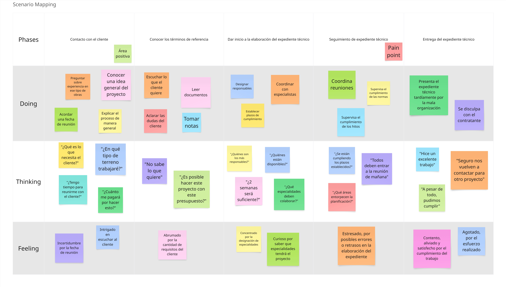

## 2.3. Needfinding

### 2.3.1. User Personas

Para la construcción de los segmentos objetivo, se consideraron principalmente características demográficas obtenidas a partir de las entrevistas, las cuales sirvieron de base tanto para definir los perfiles de los User Personas como para identificar sus motivaciones e intereses. De manera complementaria, se incorporaron habilidades y preferencias relacionadas con el uso de tecnología y herramientas, también derivadas del análisis de las entrevistas.

**Contratistas**

Edilberto Cáceres representa el segmento objetivo de Contratistas. Trabaja como generente general de su empresa consultora de obras. Es una persona muy experimentada en su trabajo que mantiene siempre una reputación impecable con respecto al cumplimiento de términos de referencia y normativas vigentes. Se destaca por su capacidad de liderazgo y manejo de equipos multifuncionales así como su manejo de los tiempos y cronogramas. 

  

**Especialistas**

José Rodríguez representa el segmento objetivo de Especialistas. Es arquitecto de profesión con mucha experiencia. Es una persona motivada, amante de la arquitectura. Tiene un fuerte sentido del cumplimiento de las normativas dentro de sus actividades en el trabajo. Se destaca por su alta capacidad para comunicarse con otros especialistas y por su capacidad de ánalisis.

  

**Entidad contratante**

Alfonso Villarán representa el segmento objetivo de Entidad contratante. Se encuentra buscando un contratista para poder planificar su hogar en un terreno heredado. Es una persona precavida y que vela por la seguridad de su futura familia. Es alguien muy afín a la tecnología.

  

### 2.3.2. User Task Matrix

Se considera para la realización de este User Task Matrix los User Persona, sus actividades, frecuencia e importancia.

<table border="1" cellpadding="5" cellspacing="0">
  <thead>
    <tr>
      <th rowspan="2">Task</th>
      <th colspan="2">Edilberto Cáceres</th>
      <th colspan="2">José Rodríguez</th>
      <th colspan="2">Alfonso Villarán</th>
    </tr>
    <tr>
      <th>Frecuencia</th>
      <th>Importancia</th>
      <th>Frecuencia</th>
      <th>Importancia</th>
      <th>Frecuencia</th>
      <th>Importancia</th>
    </tr>
  </thead>
  <tbody>
    <tr><td>Contacto con cliente</td><td>Alta</td><td>Alta</td><td>Baja</td><td>Alta</td><td>Nunca</td><td>Baja</td></tr>
    <tr><td>Conceder autorización de comunicación de áreas</td><td>Media</td><td>Alta</td><td>Baja</td><td>Alta</td><td>Nunca</td><td>Alta</td></tr>
    <tr><td>Planificación de cronogramas</td><td>Media</td><td>Alta</td><td>Media</td><td>Alta</td><td>Baja</td><td>Media</td></tr>
    <tr><td>Cumplimiento de cronogramas</td><td>Alta</td><td>Alta</td><td>Alta</td><td>Alta</td><td>Nunca</td><td>Baja</td></tr>
    <tr><td>Planificación de estudios básicos</td><td>Media</td><td>Alta</td><td>Alta</td><td>Alta</td><td>Nunca</td><td>Baja</td></tr>
    <tr><td>Ejecución de estudios básicos</td><td>Baja</td><td>Alta</td><td>Media</td><td>Alta</td><td>Nunca</td><td>Baja</td></tr>
    <tr><td>Seguimiento de normativas</td><td>Alta</td><td>Alta</td><td>Alta</td><td>Alta</td><td>Media</td><td>Alta</td></tr>
    <tr><td>Consultar a otras áreas</td><td>Media</td><td>Alta</td><td>Alta</td><td>Alta</td><td>Nunca</td><td>Baja</td></tr>
    <tr><td>Solicitar revisiones</td><td>Nunca</td><td>Baja</td><td>Alta</td><td>Alta</td><td>Alta</td><td>Alta</td></tr>
    <tr><td>Reuniones de coordinación</td><td>Alta</td><td>Alta</td><td>Alta</td><td>Media</td><td>Media</td><td>Alta</td></tr>
    <tr><td>Entregar avances de expediente</td><td>Media</td><td>Alta</td><td>Alta</td><td>Alta</td><td>Media</td><td>Baja</td></tr>
    <tr><td>Cálculo de materiales y precios unitarios</td><td>Media</td><td>Alta</td><td>Alta</td><td>Alta</td><td>Nunca</td><td>Baja</td></tr>
    <tr><td>Comunicarse con contratista</td><td>Nunca</td><td>Baja</td><td>Media</td><td>Alta</td><td>Alta</td><td>Alta</td></tr>
    <tr><td>Explicar requisitos</td><td>Media</td><td>Alta</td><td>Nunca</td><td>Baja</td><td>Alta</td><td>Alta</td></tr>
    <tr><td>Supervisar cumplimiento de requisitos</td><td>Alta</td><td>Alta</td><td>Media</td><td>Alta</td><td>Alta</td><td>Alta</td></tr>
  </tbody>
</table>

**INTERPRETACIÓN DE RESULTADOS**

* Edilberto Cáceres: Como contratista, participa frecuentemente en reuniones y coordinaciones tanto con el cliente como con los especialistas. Da especial importancia al cumplimiento de las normativas y los términos de referencia del proyecto. Para él, todas las etapas del expediente técnico —desde la coordinación inicial con el cliente hasta la elaboración de cada sección— son fundamentales.

* José Rodríguez: En su rol de especialista, mantiene una alta frecuencia de interacción con el contratista y otras especialidades. Considera crucial que el contratista realice revisiones constantes sobre sus entregables, ya que esto garantiza la coherencia e integración del expediente técnico.

* Alfonso Villarán: Como entidad contratante, realiza revisiones frecuentes sobre el avance del expediente técnico, siendo esta su actividad más importante. Sus tareas principales están enfocadas en la comunicación con el contratista y en asegurar el cumplimiento de los requisitos establecidos.

### 2.3.3. User Journey Mapping

Se desarrolla el User Journey Mapping en base al As-Is del flujo de trabajo de los User Persona anteriormente elaborados.

**Contratista**

Se representa el flujo de trabajo del contratista en relación con el ciclo de vida de la planificación del proyecto, específicamente en la elaboración del expediente técnico. Se hace especial énfasis en las actividades vinculadas a la toma de requisitos del cliente, la recolección de datos de suelos y estudios básicos, así como en la elaboración de planos y cronogramas. A partir del análisis, se concluye que varios de estos procesos presentan oportunidades claras de automatización.

  

**Especialista**

Se representa el flujo de trabajo habitual del especialista en el contexto de la elaboración de tareas dentro del expediente técnico. Se destaca especialmente la comunicación transversal entre distintas especialidades, identificando que esta interacción ocurre de forma constante y diaria a lo largo del proceso.

  

**Entidad contratante**

Se representa el flujo habitual del contratante, desde la comunicación inicial con el contratista hasta la toma de requisitos y el inicio de la planificación y elaboración de los distintos documentos del expediente técnico. Se hace especial énfasis en el rol activo del cliente como supervisor del cumplimiento de sus propios requisitos a lo largo del proceso.

  

### 2.3.4. Empathy Mapping

**Contratistas**

Se representan las necesidades, frustraciones y oportunidades del contratista, así como las percepciones de su entorno y sus propias observaciones. Se concluye que el contratista desempeña un rol central en la elaboración del expediente técnico, participando activamente en múltiples acciones clave a lo largo del proceso.

  

**Especialistas**

Se representan las necesidades, frustraciones y oportunidades del especialista, así como las percepciones de su entorno y sus propias observaciones. Se hace especial énfasis en la importancia de la comunicación entre especialidades, la participación en reuniones de coordinación y el cumplimiento riguroso de las normativas establecidas.

  

**Entidad contratante**

Se representan las necesidades, frustraciones y oportunidades de la entidad contratante, junto con las percepciones de su entorno y sus propias observaciones. Se destaca especialmente la influencia de las experiencias compartidas por colegas y conocidos, así como la comunicación constante y directa que mantiene con el contratista a lo largo del proceso.

  

### 2.3.5. As-is Scenario Mapping

Para elaborar esta sección del As-Is Scenario Mapping, el equipo trabajó en conjunto poniéndose en el lugar de los usuarios, con el objetivo de generar descripciones que reflejaran los pain points identificados en el Empathy Map. Aunque se contemplaron más tareas durante el análisis, el resultado final fue acotado de acuerdo con el alcance definido para nuestro proyecto.

**Contratista**

Este escenario representa el flujo de trabajo dentro del ciclo de vida de la planificación del proyecto. Se hace especial énfasis en el cumplimiento de los términos de referencia y en el seguimiento continuo durante la elaboración del expediente técnico.

  

**Especialista**

Este escenario representa el flujo de trabajo del especialista durante la entrega de un encargo relacionado con el expediente técnico. Se resalta la importancia del cumplimiento de las normativas vigentes y la comunicación constante con otras especialidades para garantizar la coherencia y calidad del proyecto.

  

**Entidad contratante**

Este escenario representa el flujo de trabajo de la entidad contratante, desde el primer contacto con el contratista hasta el seguimiento del proyecto. Se hace especial énfasis en la verificación y cumplimiento de los requisitos establecidos.

  

