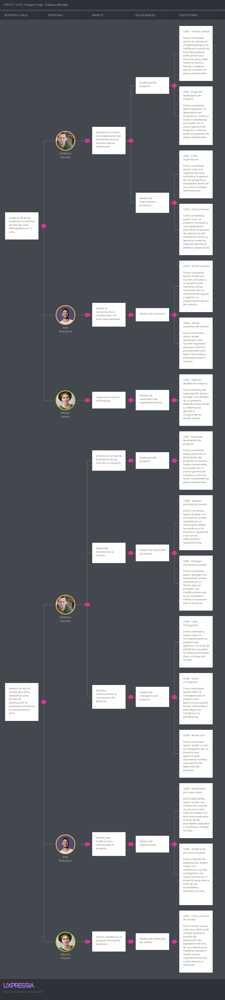

## 3.3. Impact Mapping

Para la elaboración del Impact Mapping del producto se tomaron en cuenta los Business Goals planteados anteriormente, así como los User Persona que representan a nuestros segmentos y las User Stories creadas para ProP GMS.

Se concluye, a partir del artefacto analizado, que los tres segmentos identificados son fundamentales para alcanzar los objetivos establecidos por la empresa.

En primer lugar, lograr que el 3% de las empresas consultoras de obras en Lima utilicen ProP GMS será realidad si:

* Edilberto Cáceres es consciente del desempeño temporal en el cumplimiento de los hitos del expediente técnico.

* José Rodríguez participa activamente en las reuniones del proyecto.

* Alfonso Villarán supervisa de forma constante el cumplimiento de sus requisitos durante la elaboración del expediente técnico.

En segundo lugar, la meta de reducir en un 50% el tiempo requerido para replanificar un expediente técnico se podrá alcanzar si:

* Edilberto Cáceres responde con eficacia ante los cambios, siendo notificado oportunamente de cada solicitud del cliente y organizando adecuadamente el cronograma y los hitos del proyecto.

* José Rodríguez recibe notificaciones a tiempo sobre nuevas tareas asignadas y reuniones creadas.

* Alfonso Villarán solicita modificaciones de manera oportuna durante el desarrollo del expediente técnico.