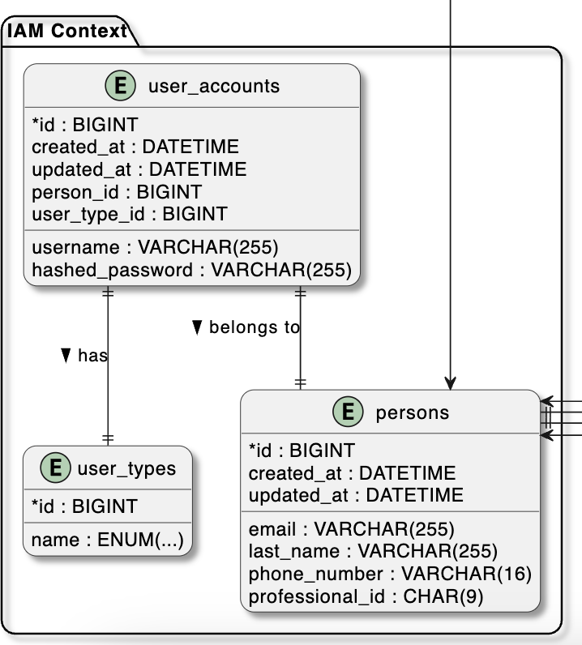

## 4.8. Database Design

Para el proyecto ProP GMS se ha seleccionado el motor de base de datos MariaDB debido a su escalabilidad. Esta elección se basa en la experiencia del equipo con motores de bases de datos similares.

### 4.8.1. Database Diagram

El modelo general de base de datos de PropGMS refleja una arquitectura modular basada en contextos delimitados (bounded contexts), alineados con los principios de Domain-Driven Design. Cada contexto modela una parte funcional del sistema, tales como gestión de proyectos, usuarios, archivos, pagos, suscripciones, notificaciones y organizaciones.

Se identifican entidades clave como projects, tasks, invoices, payments, user_accounts, organizations, entre muchas otras, conectadas mediante claves foráneas que garantizan la integridad referencial entre dominios. Las relaciones entre contextos están cuidadosamente controladas para evitar acoplamientos innecesarios y fomentar una evolución independiente de cada módulo.

El diseño promueve escalabilidad, trazabilidad y una clara separación de responsabilidades, facilitando tanto el mantenimiento como la extensión futura del sistema.

#### 4.8.1.1. Project Management Database Diagram

El diseño de base de datos del contexto de gestión de proyectos representa la estructura encargada de organizar y supervisar los proyectos técnicos dentro del sistema PropGMS. La tabla principal projects se conecta con otras tablas relacionadas como schedules, milestones, tasks, meetings y project_team_members, lo que permite modelar de forma estructurada el ciclo de vida completo de un proyecto.

Cada proyecto se clasifica mediante la tabla project_status y se vincula con un equipo técnico registrado en la tabla project_team_members, el cual especifica roles y especialidades mediante las tablas role y specialty. Las tareas que componen un proyecto se organizan por hitos y pueden incluir entregas evaluables a través de task_submissions, que a su vez están enlazadas a archivos mediante la tabla task_submission_files.

Las reuniones de coordinación también están modeladas, permitiendo registrar su temática, fechas y participantes. Este diseño facilita la planificación, el control de avance y la trazabilidad técnica del proyecto, asegurando una gestión estructurada y alineada con los procesos reales de consultoras y contratistas técnicos.

#### 4.8.1.2. Change Management Database Diagram

El diseño del contexto de gestión de cambios permite registrar y controlar las modificaciones solicitadas durante el desarrollo de un proyecto técnico en PropGMS. La tabla principal change_processes centraliza toda la información relacionada a los procesos de cambio, incluyendo su origen, estado, justificación y vínculos con órdenes y respuestas.

Las solicitudes de cambio pueden tener origen técnico o contractual, diferenciadas mediante la tabla origin_types. El estado del proceso se gestiona con la tabla change_status. Cada proceso puede generar una orden de cambio formal a través de la tabla change_orders, o recibir una respuesta por medio de la tabla change_responses, que contiene notas y fechas relevantes de la retroalimentación.

Esta estructura permite mantener un historial claro de las decisiones, fechas y responsables asociados a cada modificación, facilitando la trazabilidad y gobernanza del proyecto.

#### 4.8.1.3. Organization Database Diagram

El diseño del contexto de organización permite modelar las entidades jurídicas y su estructura de miembros dentro del sistema PropGMS. La tabla principal organizations almacena la información esencial como razón social, nombre comercial, RUC y su estado, referenciado desde la tabla organization_status.

El proceso de incorporación de personas a una organización se gestiona mediante la tabla organization_invitations, que permite registrar a quién se invitó, quién realizó la invitación y el estado de la misma, con ayuda de la tabla invitation_status. Una vez aceptada, la persona se convierte en miembro mediante la tabla organization_members, que vincula personas con organizaciones de forma formal y estructurada.

Este diseño permite tener un control completo sobre el ciclo de vida de una organización en la plataforma, desde su creación hasta la gestión de sus miembros, manteniendo trazabilidad y control de acceso claro.

#### 4.8.1.4. Notification Database Diagram

El diseño del contexto de notificaciones permite gestionar la comunicación interna del sistema PropGMS dirigida a usuarios. La tabla notifications almacena los mensajes que se envían a cada persona, registrando su título, contenido, destinatario, fecha de creación y la categoría de la notificación.

Las categorías disponibles están definidas en la tabla notification_categories, que permite clasificar los mensajes como informativos, alertas, recordatorios, entre otros. Esta estructura facilita una experiencia más clara y ordenada para los usuarios, permitiendo diferenciar el tipo y propósito de cada notificación dentro de la plataforma.

#### 4.8.1.5. File Database Diagram

El contexto de gestión de archivos permite organizar y clasificar los documentos digitales que se generan o se utilizan dentro del sistema PropGMS. La tabla principal files almacena información clave de cada archivo, como su tamaño, ubicación, fecha de carga, autor y su tipo.

Los archivos pueden agruparse opcionalmente dentro de carpetas, modeladas en la tabla folders, que además se encuentran asociadas a un espacio de trabajo específico. Cada archivo también está clasificado por tipo mediante la tabla file_type, lo que permite diferenciar su propósito o categoría, como contratos, entregas o documentos técnicos.

Este diseño facilita una organización clara y estructurada de los recursos digitales, asegurando su trazabilidad y una experiencia eficiente de gestión documental.

#### 4.8.1.6. IAM Database Diagram

El contexto de gestión de identidad y acceso permite administrar las credenciales y el estado de los usuarios del sistema PropGMS. La tabla user_accounts almacena los datos de inicio de sesión, incluyendo tipo de usuario, estado de la cuenta, fechas relevantes y vínculo opcional con la tabla persons, donde se detalla información personal como nombre completo, correo y teléfono.

Cada cuenta está categorizada según su tipo mediante la tabla user_types y su estado actual se define por la tabla account_statuses, lo que permite distinguir usuarios activos, inactivos o bloqueados.

Este diseño proporciona una base robusta para la autenticación, autorización y trazabilidad de los usuarios dentro de la plataforma, garantizando seguridad y control en el acceso al sistema.

#### 4.8.1.7. Subscription Database Diagram

El contexto de suscripciones permite administrar los planes comerciales que habilitan el acceso a las funcionalidades del sistema PropGMS. La tabla subscriptions registra cada suscripción adquirida, incluyendo su plan, duración, costo, estado y la persona asociada.

Los planes disponibles están definidos en la tabla subscription_plans, donde se especifican características como duración en días, capacidad máxima de miembros, almacenamiento y número de proyectos. El estado actual de cada suscripción se controla mediante la tabla subscription_statuses.

#### 4.8.1.8. Billing Database Diagram

El contexto de facturación permite registrar y estructurar las transacciones comerciales dentro del sistema PropGMS. La tabla principal invoices representa las facturas emitidas a los usuarios o entidades, incluyendo montos, fechas clave, moneda utilizada y estado de pago, gestionado a través de la tabla payment_statuses.

Cada factura puede incluir múltiples ítems, detallados en la tabla billing_items, donde se especifican los conceptos facturados, sus precios unitarios y subtotales. Esta organización permite una descomposición clara de los servicios cobrados, facilitando tanto el seguimiento contable como la generación de reportes.

Este modelo de datos asegura que los procesos de cobro sean transparentes, auditables y fácilmente integrables con otros componentes financieros del sistema.

#### 4.8.1.9. Payment Database Diagram

El contexto de pagos se encarga de registrar las operaciones financieras asociadas al cobro de facturas dentro del sistema PropGMS. La tabla payments almacena cada pago realizado, incluyendo su monto, moneda, método utilizado, estado, fecha de realización y la factura a la que corresponde.

El diseño contempla acuerdos de pago recurrente, representados en la tabla recurring_payment_agreements, que permiten automatizar la facturación periódica según el método de pago asociado, especificado en la tabla payment_method_types.

Cada pago puede tener múltiples intentos de transacción registrados en la tabla transactions, la cual guarda la respuesta del gateway de pagos junto con su estado, definido por la tabla transaction_statuses. El estado general del pago se controla mediante la tabla payment_statuses.

Esta estructura robusta permite gestionar pagos únicos y recurrentes con trazabilidad completa de los intentos y resultados, facilitando la integración con plataformas de pago externas.

