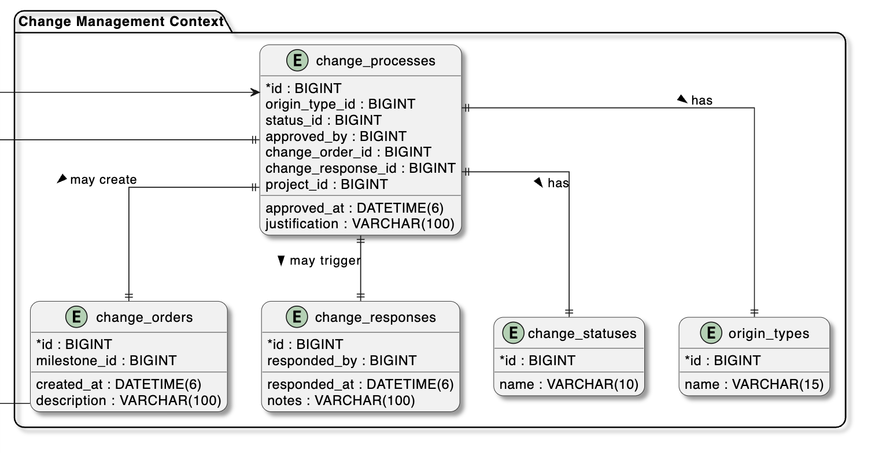

## 4.8. Database Design

Para el proyecto ProP GMS se ha seleccionado el motor de base de datos MariaDB debido a su escalabilidad. Esta elección se basa en la experiencia del equipo con motores de bases de datos similares.

### 4.8.1. Database Diagram

El modelo general de base de datos de PropGMS refleja una arquitectura modular basada en contextos delimitados (bounded contexts), alineados con los principios de Domain-Driven Design. Cada contexto modela una parte funcional del sistema, tales como gestión de proyectos, usuarios, archivos, pagos, suscripciones, notificaciones y organizaciones.

Se identifican entidades clave como projects, tasks, invoices, payments, user_accounts, organizations, entre muchas otras, conectadas mediante claves foráneas que garantizan la integridad referencial entre dominios. Las relaciones entre contextos están cuidadosamente controladas para evitar acoplamientos innecesarios y fomentar una evolución independiente de cada módulo.

El diseño promueve escalabilidad, trazabilidad y una clara separación de responsabilidades, facilitando tanto el mantenimiento como la extensión futura del sistema.

#### 4.8.1.1. Project Management Database Diagram

El diseño de base de datos del contexto de gestión de proyectos representa la estructura encargada de organizar y supervisar los proyectos técnicos dentro del sistema PropGMS. La tabla principal projects se conecta con otras tablas relacionadas como schedules, milestones, tasks, meetings y project_team_members, lo que permite modelar de forma estructurada el ciclo de vida completo de un proyecto.

Cada proyecto se clasifica mediante la tabla project_status y se vincula con un equipo técnico registrado en la tabla project_team_members, el cual especifica roles y especialidades mediante las tablas role y specialty. Las tareas que componen un proyecto se organizan por hitos y pueden incluir entregas evaluables a través de task_submissions, que a su vez están enlazadas a archivos mediante la tabla task_submission_files.

Las reuniones de coordinación también están modeladas, permitiendo registrar su temática, fechas y participantes. Este diseño facilita la planificación, el control de avance y la trazabilidad técnica del proyecto, asegurando una gestión estructurada y alineada con los procesos reales de consultoras y contratistas técnicos.

#### 4.8.1.2. Change Management Database Diagram

El diseño del contexto de gestión de cambios permite registrar y controlar las modificaciones solicitadas durante el desarrollo de un proyecto técnico en PropGMS. La tabla principal change_processes centraliza toda la información relacionada a los procesos de cambio, incluyendo su origen, estado, justificación y vínculos con órdenes y respuestas.

Las solicitudes de cambio pueden tener origen técnico o contractual, diferenciadas mediante la tabla origin_types. El estado del proceso se gestiona con la tabla change_status. Cada proceso puede generar una orden de cambio formal a través de la tabla change_orders, o recibir una respuesta por medio de la tabla change_responses, que contiene notas y fechas relevantes de la retroalimentación.

Esta estructura permite mantener un historial claro de las decisiones, fechas y responsables asociados a cada modificación, facilitando la trazabilidad y gobernanza del proyecto.

#### 4.8.1.3. Organization Database Diagram

El diseño del contexto de organización permite modelar las entidades jurídicas y su estructura de miembros dentro del sistema PropGMS. La tabla principal organizations almacena la información esencial como razón social, nombre comercial, RUC y su estado, referenciado desde la tabla organization_status.

El proceso de incorporación de personas a una organización se gestiona mediante la tabla organization_invitations, que permite registrar a quién se invitó, quién realizó la invitación y el estado de la misma, con ayuda de la tabla invitation_status. Una vez aceptada, la persona se convierte en miembro mediante la tabla organization_members, que vincula personas con organizaciones de forma formal y estructurada.

Este diseño permite tener un control completo sobre el ciclo de vida de una organización en la plataforma, desde su creación hasta la gestión de sus miembros, manteniendo trazabilidad y control de acceso claro.

#### 4.8.1.4. IAM Database Diagram

El contexto de gestión de identidad y acceso permite administrar las credenciales y el estado de los usuarios del sistema PropGMS. La tabla user_accounts almacena los datos de inicio de sesión, incluyendo tipo de usuario, estado de la cuenta, fechas relevantes y vínculo opcional con la tabla persons, donde se detalla información personal como nombre completo, correo y teléfono.

Cada cuenta está categorizada según su tipo mediante la tabla user_types y su estado actual se define por la tabla account_statuses, lo que permite distinguir usuarios activos, inactivos o bloqueados.

Este diseño proporciona una base robusta para la autenticación, autorización y trazabilidad de los usuarios dentro de la plataforma, garantizando seguridad y control en el acceso al sistema.

