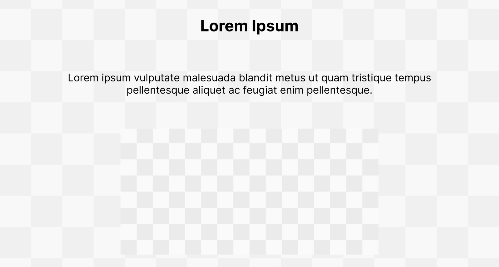
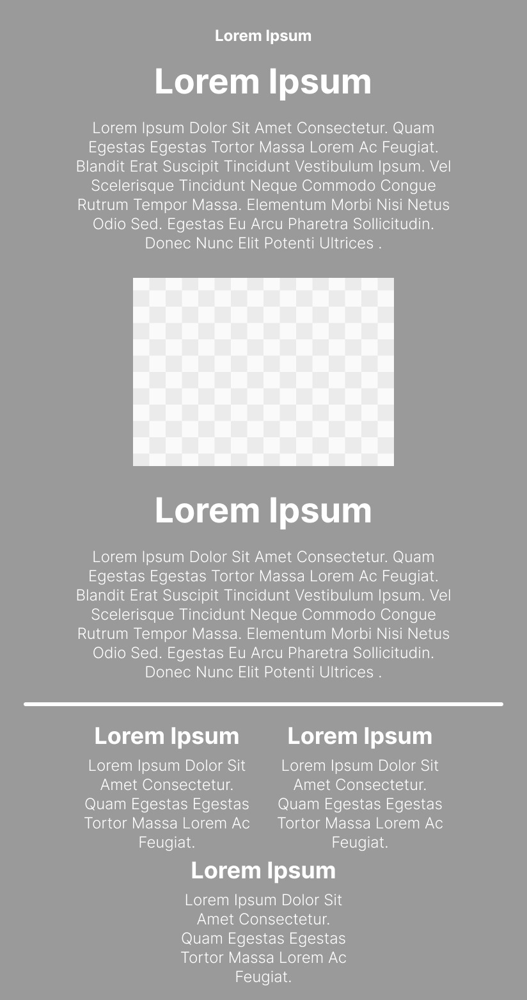
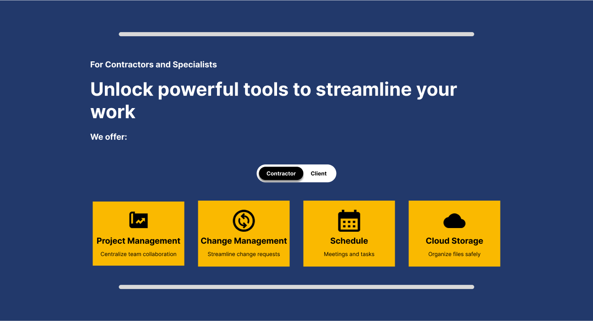
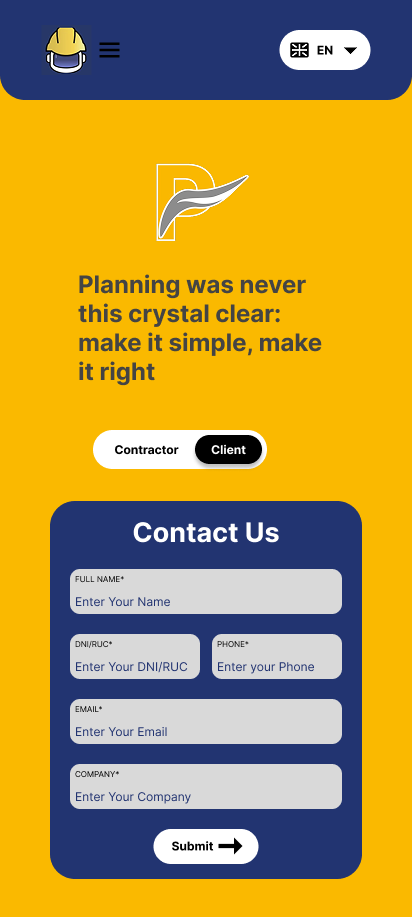
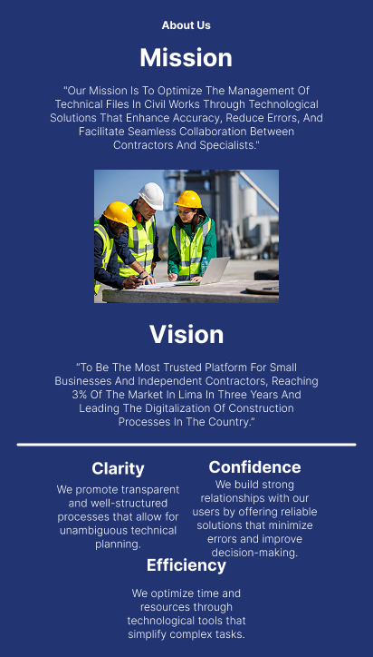
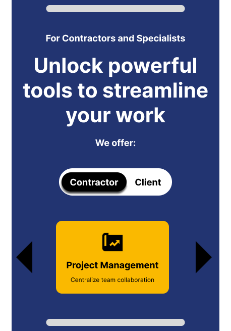
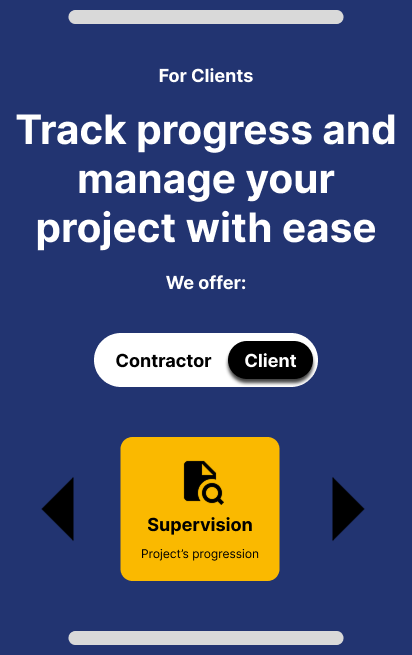

## 4.3. Landing Page UI Design

La propuesta de UI para la landing page responde a la necesidad de traducir correctamente las decisiones tomadas en la sección de arquitectura de información. Partiendo de una estructura modular, el equipo ha organizado visualmente los contenidos clave de la plataforma, priorizando la segmentación por tipo de usuario: miembros de la organización (contratista y especialista) y clientes, resaltando los beneficios principales para cada uno. Esta segmentación no solo facilita la navegación, sino que también permite adaptar el mensaje y los llamados a la acción a las necesidades específicas de cada perfil.

Para ello, se aplicaron principios establecidos en el diseño de páginas web, tales como la simplicidad visual, el uso de jerarquías tipográficas, el nivel de contraste y el diseño responsive. Estas decisiones buscan optimizar la experiencia del usuario y facilitar su recorrido por la página, asegurando una rápida comprensión de la propuesta de valor del sistema. Además, se priorizó una disposición que permita destacar funcionalidades clave vinculadas a la gestión de tareas y el seguimiento técnico, reforzando así el propósito de la interfaz.

### 4.3.1. Landing Page Wireframe

Esta sección presenta los wireframes desarrollados, en sus versiones para navegador web en desktop y dispositivos móviles.

**Hero - Desktop**  

En esta sección se muestra el encabezado de la página. Se usó el principio de jerarquía visual y espaciado para guiar la atención del usuario.

**About Us - Desktop**  

En esta sección se muestra la presentación del equipo. Se aplicó alineación clara y tamaños de texto para establecer jerarquía.

**About the Project - Desktop**  

En esta sección se muestra un video explicativo. Se usó el principio de simplicidad y reconocimiento visual.

**Overviews - Contractor - Desktop**  

En esta sección se muestran funciones para contratistas. Se usó diseño modular y jerarquía visual en las tarjetas.

**Overviews - Client - Desktop**  

En esta sección se muestran beneficios para clientes. Se aplicó simplicidad visual y repetición para mejorar la comprensión.

**Footer - Desktop**  

En esta sección se muestra el pie de página. Se usó una estructura en columnas y se aplicó el principio de organización visual.

**Hero - Mobile**  

En esta sección se muestra el encabezado para móvil. Se usó el principio de accesibilidad y espaciado táctil.

**About Us - Mobile**  

En esta sección se muestra al equipo con formato vertical. Se aplicó jerarquía tipográfica y buena separación entre bloques.

**About the Project - Mobile**  

En esta sección se muestra un video. Se usó una estructura simple para facilitar la lectura en scroll.

**Overviews - Contractor - Mobile**  

En esta sección se muestran herramientas clave para contratistas. Se organizó en tarjetas verticales con buen espacio táctil.

**Overviews - Client - Mobile**  

En esta sección se muestran beneficios para clientes. Se usaron tarjetas simples para navegación fácil y ordenada.

**Footer - Mobile**  

En esta sección se muestra el pie de página en una sola columna. Se usó el principio de coherencia estructural para móviles.

### 4.3.2. Landing Page Mock-up

Esta sección presenta los mockups desarrollados, en sus versiones para navegador web en desktop y dispositivos móviles.

**Hero - Desktop**  

En esta sección se muestra el encabezado visual de la página con botones de acción destacados. Se usó el principio de jerarquía visual para resaltar el mensaje principal.

**About Us - Desktop**  

En esta sección se muestra la identidad del equipo. Se aplicó el principio de coherencia visual y uso de color institucional.

**About the Project - Desktop**  

En esta sección se muestra el video explicativo del sistema. Se usó el principio de simplicidad para enfocar la atención del usuario en el contenido principal.

**Overviews - Contractor/Specialist - Desktop**  

En esta sección se muestran las herramientas disponibles para contratistas. Se aplicó el principio de usabilidad con tarjetas claras y acciones identificables.

**Overviews - Client - Desktop**  

En esta sección se muestran los beneficios clave para clientes. Se usó el principio de accesibilidad visual con buen contraste y textos claros.

**Footer - Desktop**  

En esta sección se muestra el pie de página con enlaces y redes. Se aplicó el principio de coherencia para mantener la estructura del sitio.

**Hero - Mobile**  

En esta sección se muestra el encabezado adaptado a móviles. Se usó el principio de accesibilidad para mejorar la interacción táctil.

**About Us - Mobile**  

En esta sección se muestra la presentación del equipo en formato vertical. Se aplicó el principio de simplicidad para facilitar la lectura.

**About the Project - Mobile**  

En esta sección se muestra un recurso audiovisual informativo. Se usó el principio de jerarquía para dar prioridad al contenido visual.

**Overviews - Contractor/Specialist - Mobile**  

En esta sección se muestran herramientas para contratistas. Se aplicó el principio de usabilidad adaptando las tarjetas a formato scrollable.

**Overviews - Client - Mobile**  

En esta sección se presentan beneficios para clientes. Se usó el principio de simplicidad y contraste para facilitar su comprensión en dispositivos pequeños.

**Footer - Mobile**  

En esta sección se muestra el pie de página adaptado a móviles. Se aplicó el principio de coherencia estructural con disposición en una sola columna.

