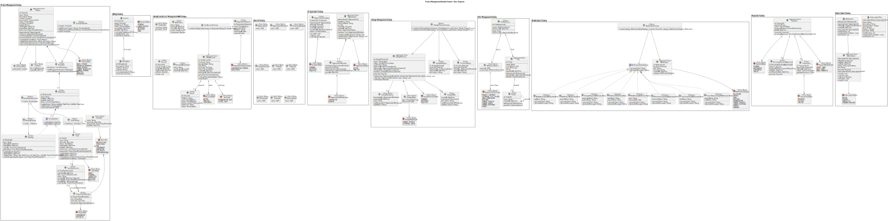
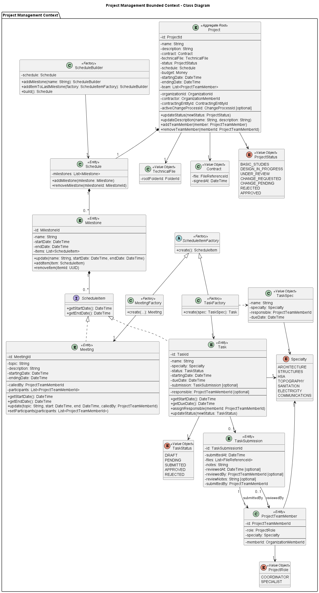
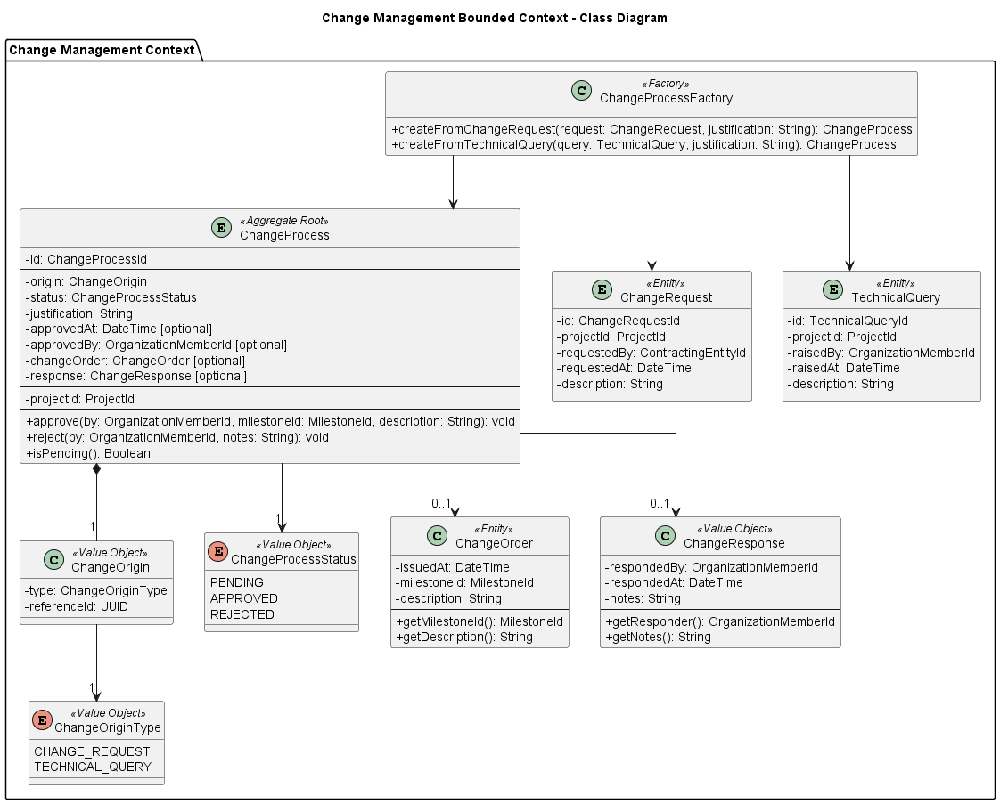
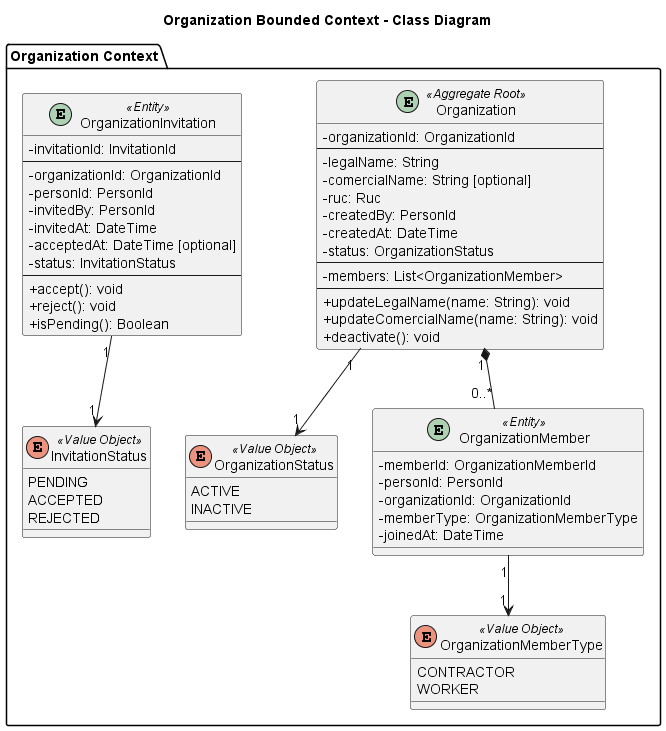
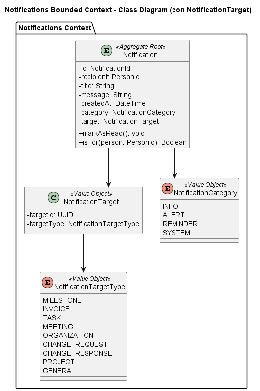
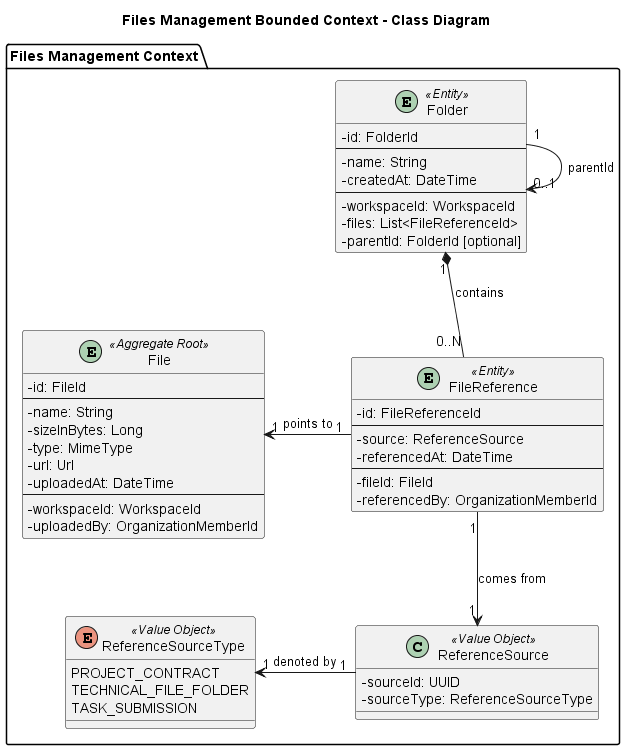
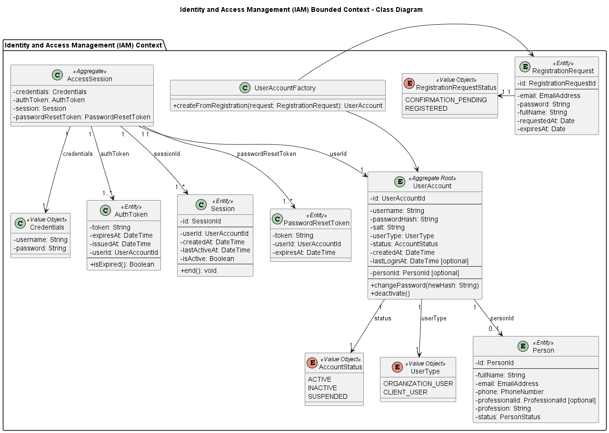
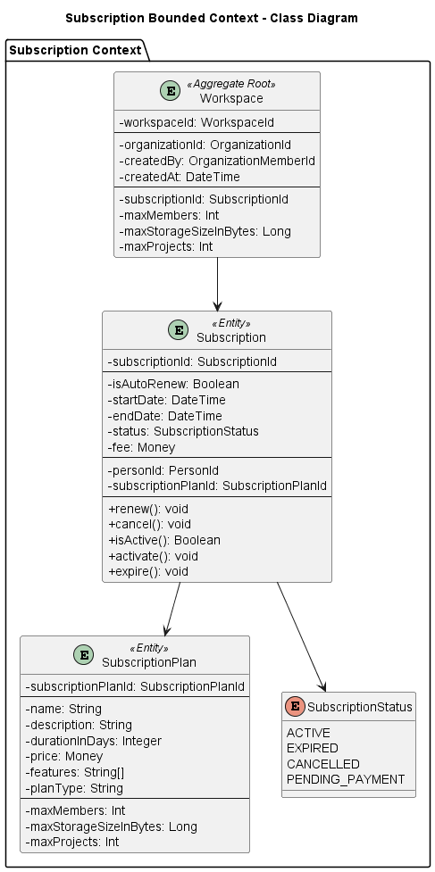
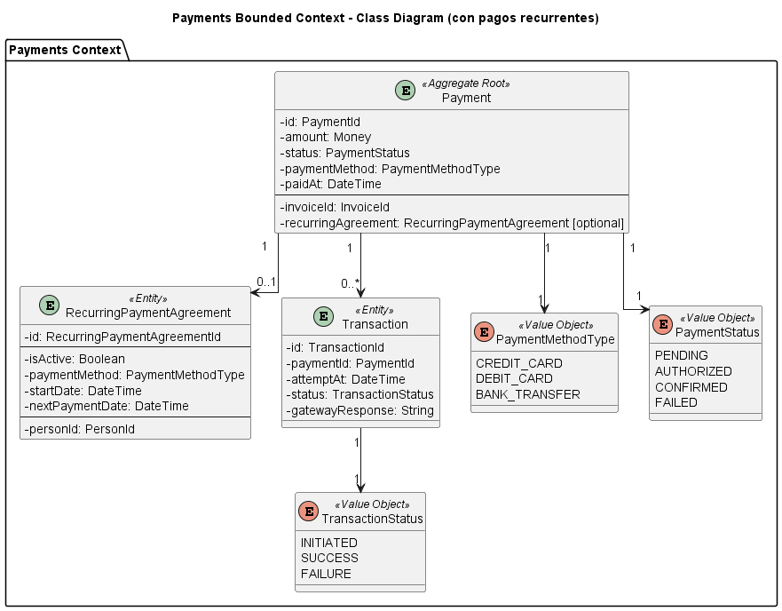

## 4.7. Software Object-Oriented Design

### 4.7.1. Class Diagrams

Este diagrama representa una visión estructural del sistema PropGMS, destacando las entidades principales y su relación dentro del dominio. Se identifican agregados clave como Project, Milestone, Task, Meeting, TechnicalFile y Organization, los cuales capturan los conceptos fundamentales en la gestión de expedientes técnicos.

Cada entidad incluye atributos esenciales como identificadores, nombres, fechas y estados. También se aprecian relaciones de composición y agregación, por ejemplo, un Project contiene múltiples Milestones, cada uno de los cuales agrupa Tasks y Meetings. Asimismo, se muestra la vinculación entre Project y TechnicalFile, reflejando la trazabilidad entre la planificación y la documentación técnica.

El diseño enfatiza la modularidad y claridad del modelo, siendo una base sólida para la implementación orientada a objetos y la persistencia de datos.

#### 4.7.1.1. Project Management Class Diagram

Este diagrama detalla la estructura del Project Management Context dentro del sistema PropGMS, modelando entidades clave como Project, Milestone, Task y Meeting, junto con sus relaciones y comportamientos.

La clase raíz del agregado es Project, la cual agrupa atributos esenciales como nombre, presupuesto, fechas de inicio y fin, así como referencias a un contrato y un expediente técnico. Un proyecto contiene un Schedule, compuesto por varios Milestone, los cuales a su vez agrupan ScheduleItem, una abstracción que puede representar tanto reuniones (Meeting) como tareas (Task).

Cada Task incluye información sobre su especialidad, estado, fechas y el miembro del equipo responsable. Las entregas de tareas (TaskSubmission) se modelan como una entidad separada, con soporte para archivos, notas de revisión y trazabilidad de autores y revisores. Por su parte, Meeting encapsula los datos de convocatoria, participantes y tiempos de ejecución.

El modelo también contempla value objects como ProjectStatus, TaskStatus, TaskSpec y Specialty, que acotan y estructuran posibles valores del dominio. Además, se emplean fábricas para construir elementos del cronograma (ScheduleItemFactory, TaskFactory, etc.), promoviendo un diseño limpio y orientado a la creación controlada de objetos complejos.

#### 4.7.1.2. Change Management Class Diagram

Este diagrama representa la estructura del Change Management Context dentro del sistema PropGMS, el cual modela los procesos de solicitud y evaluación de cambios en un proyecto técnico.

La entidad raíz del agregado es ChangeProcess, que encapsula tanto el origen del cambio (ChangeOrigin), su estado (ChangeProcessStatus) y la justificación del mismo, como también información sobre su aprobación, rechazo y cualquier orden de cambio (ChangeOrder) o respuesta oficial (ChangeResponse). Un proceso de cambio puede iniciarse a partir de una ChangeRequest realizada por la entidad contratante o una TechnicalQuery por parte del residente de obra.

El modelo contempla value objects que acotan claramente los posibles estados (PENDING, APPROVED, REJECTED) y tipos de origen (CHANGE_REQUEST, TECHNICAL_QUERY). Además, se provee una fábrica (ChangeProcessFactory) que permite construir el agregado de manera controlada según el tipo de solicitud original.

#### 4.7.1.3. Organization Class Diagram

Este diagrama representa la estructura del Organization Context, donde se modelan las entidades responsables de la gestión de organizaciones dentro de PropGMS. La clase Organization actúa como raíz del agregado, incluyendo atributos clave como razón social, nombre comercial, RUC, creador y estado.

El proceso de incorporación de nuevos miembros se gestiona a través de la entidad OrganizationInvitation, que registra quién invita, a quién se invita, cuándo, y en qué estado se encuentra la invitación (PENDING, ACCEPTED, REJECTED). Este mecanismo permite un control claro y seguro del acceso organizacional.

#### 4.7.1.4. Notification Class Diagram

El diagrama muestra la estructura del Notifications Bounded Context, donde se modela la gestión de notificaciones dentro de PropGMS. La clase Notification es la raíz del agregado y contiene los campos necesarios para identificar al receptor, el contenido del mensaje, su fecha de creación y la categoría (NotificationCategory), que puede ser informativa, de alerta, recordatorio o del sistema.

Cada notificación está asociada a un objetivo específico mediante el value object NotificationTarget, el cual define tanto el identificador como el tipo del recurso al que hace referencia (NotificationTargetType). Estos tipos abarcan una variedad de entidades del sistema, como tareas, reuniones, cambios, proyectos, y más, permitiendo una alta contextualización de los avisos.

#### 4.7.1.5. File Class Diagram

Este diagrama modela la gestión de archivos dentro del sistema PropGMS, organizada en torno al contexto de archivos (Files Management Context). La clase File es la raíz del agregado y representa un archivo digital individual, incluyendo metadatos como nombre, tamaño, tipo MIME, URL y fecha de carga. Cada archivo está asociado a un workspace y a un miembro de la organización que lo subió.

La clase FileReference actúa como un vínculo lógico entre los archivos y los elementos del sistema que los utilizan, como contratos, carpetas técnicas o entregas de tareas. Esta referencia se define mediante el value object ReferenceSource, que encapsula tanto el identificador del objeto de origen como su tipo (ReferenceSourceType), permitiendo identificar claramente el propósito del archivo dentro del dominio.

Además, se modela la entidad Folder, la cual organiza referencias a archivos dentro de una jerarquía flexible, permitiendo carpetas anidadas mediante un parentId opcional. Esta estructura favorece la gestión ordenada y segmentada de documentos técnicos.

#### 4.7.1.6. IAM Class Diagram

Este diagrama representa el IAM Bounded Context del sistema PropGMS, encargado de gestionar el acceso y la identidad de los usuarios. La clase principal es UserAccount, la cual actúa como Aggregate Root y almacena datos como nombre de usuario, hash de contraseña, tipo de usuario (UserType), estado de la cuenta (AccountStatus) y referencias al objeto Person.

El proceso de registro se inicia a través de RegistrationRequest, que almacena la solicitud de creación de cuenta, incluyendo el correo electrónico, nombre completo, y el estado de la confirmación (RegistrationRequestStatus). La clase UserAccountFactory se encarga de transformar esta solicitud en una cuenta activa mediante un método de creación controlada.

Para la autenticación y manejo de sesiones, se utilizan objetos como AuthToken, Session y PasswordResetToken, que controlan el ciclo de vida de una sesión activa, la recuperación de cuentas y la validez de los tokens. Además, el value object Credentials encapsula el ingreso de usuario y contraseña.

Finalmente, la entidad Person representa a los individuos registrados, incluyendo datos personales como nombre, correo, teléfono, profesión y estado. Esto permite mantener separada la lógica de autenticación de la información del usuario como persona física o jurídica.

#### 4.7.1.7. Subscription Class Diagram

Este diagrama modela el Subscription Bounded Context del sistema PropGMS, encargado de gestionar las suscripciones de organizaciones a los planes del sistema. La clase Subscription actúa como Aggregate Root, e incluye información relevante como fechas de inicio y fin, estado (SubscriptionStatus), si se renueva automáticamente, y la tarifa asociada.

Cada suscripción está ligada a un SubscriptionPlan, el cual define los parámetros del plan como su nombre, duración, precio, límites de miembros, proyectos y almacenamiento, así como las características incluidas.

La clase Workspace, que representa el espacio digital de trabajo de una organización, mantiene una relación directa con la suscripción activa, reflejando los límites aplicables según el plan adquirido. Este vínculo garantiza que los recursos disponibles estén directamente controlados por el tipo de suscripción vigente.

El modelo también incluye un conjunto de estados para la suscripción (ACTIVE, EXPIRED, CANCELLED, PENDING_PAYMENT), y métodos que permiten controlar su ciclo de vida: renovación, cancelación, activación y expiración.

#### 4.7.1.8. Billing Class Diagram

Este diagrama representa la estructura del Billing Bounded Context de PropGMS, encargado de modelar el proceso de facturación dentro del sistema. La clase Invoice encapsula una factura generada a un usuario (payer), e incluye atributos clave como el monto total, fechas de emisión y vencimiento, y el estado del pago (PaymentStatus), que puede ir desde PENDING hasta PAID.

Cada factura puede incluir múltiples ítems de facturación representados por la clase BillingItem, donde se detallan los conceptos facturados, su precio unitario y el subtotal calculado. La relación uno a muchos entre Invoice y BillingItem permite una descomposición clara de los cobros.

El diseño incluye métodos para calcular montos totales, marcar facturas como pagadas y validar si se encuentran vencidas. Esto proporciona un control preciso sobre el estado financiero de cada organización dentro de la plataforma.

#### 4.7.1.9. Payment Class Diagram

Este diagrama modela el Payments Bounded Context de PropGMS, centrado en la gestión de pagos y transacciones vinculadas a facturas. La clase principal Payment actúa como Aggregate Root e incluye información como el monto, método de pago (PaymentMethodType), fecha de pago, estado (PaymentStatus) y una posible relación con un acuerdo de pago recurrente (RecurringPaymentAgreement).

Cada pago puede generar múltiples Transaction, que registran intentos de cobro, la fecha en que se realizaron, su estado (TransactionStatus) y la respuesta del gateway. Esta relación permite gestionar fallos o reintentos de manera robusta.

El modelo incluye soporte para pagos recurrentes, encapsulados en RecurringPaymentAgreement, donde se definen la frecuencia, método, fechas clave y el estado de activación. Esto facilita la automatización de cobros en suscripciones periódicas.

Los estados de pago (PENDING, AUTHORIZED, CONFIRMED, FAILED) y de transacción (INITIATED, SUCCESS, FAILURE) permiten un seguimiento detallado del flujo de fondos en la plataforma.

