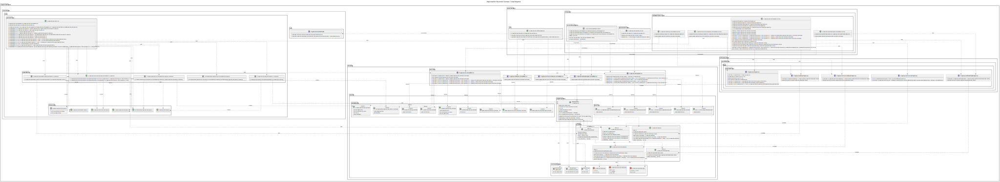

## 4.7. Software Object-Oriented Design

### 4.7.1. Class Diagrams

Este diagrama representa una visión estructural del sistema PropGMS, destacando las entidades principales y su relación dentro del dominio. Se identifican agregados clave como Project, Milestone, Task, Meeting, TechnicalFile y Organization, los cuales capturan los conceptos fundamentales en la gestión de expedientes técnicos.

Cada entidad incluye atributos esenciales como identificadores, nombres, fechas y estados. También se aprecian relaciones de composición y agregación, por ejemplo, un Project contiene múltiples Milestones, cada uno de los cuales agrupa Tasks y Meetings. Asimismo, se muestra la vinculación entre Project y TechnicalFile, reflejando la trazabilidad entre la planificación y la documentación técnica.

El diseño enfatiza la modularidad y claridad del modelo, siendo una base sólida para la implementación orientada a objetos y la persistencia de datos.

#### 4.7.1.1. Project Management Class Diagram

Este diagrama detalla la estructura del Project Management Context dentro del sistema PropGMS, modelando entidades clave como Project, Milestone, Task y Meeting, junto con sus relaciones y comportamientos.

La clase raíz del agregado es Project, la cual agrupa atributos esenciales como nombre, presupuesto, fechas de inicio y fin, así como referencias a un contrato y un expediente técnico. Un proyecto contiene un Schedule, compuesto por varios Milestone, los cuales a su vez agrupan ScheduleItem, una abstracción que puede representar tanto reuniones (Meeting) como tareas (Task).

Cada Task incluye información sobre su especialidad, estado, fechas y el miembro del equipo responsable. Las entregas de tareas (TaskSubmission) se modelan como una entidad separada, con soporte para archivos, notas de revisión y trazabilidad de autores y revisores. Por su parte, Meeting encapsula los datos de convocatoria, participantes y tiempos de ejecución.

El modelo también contempla value objects como ProjectStatus, TaskStatus, TaskSpec y Specialty, que acotan y estructuran posibles valores del dominio. Además, se emplean fábricas para construir elementos del cronograma (ScheduleItemFactory, TaskFactory, etc.), promoviendo un diseño limpio y orientado a la creación controlada de objetos complejos.

#### 4.7.1.2. Change Management Class Diagram

Este diagrama representa la estructura del Change Management Context dentro del sistema PropGMS, el cual modela los procesos de solicitud y evaluación de cambios en un proyecto técnico.

La entidad raíz del agregado es ChangeProcess, que encapsula tanto el origen del cambio (ChangeOrigin), su estado (ChangeProcessStatus) y la justificación del mismo, como también información sobre su aprobación, rechazo y cualquier orden de cambio (ChangeOrder) o respuesta oficial (ChangeResponse). Un proceso de cambio puede iniciarse a partir de una ChangeRequest realizada por la entidad contratante o una TechnicalQuery por parte del residente de obra.

El modelo contempla value objects que acotan claramente los posibles estados (PENDING, APPROVED, REJECTED) y tipos de origen (CHANGE_REQUEST). Además, se provee una fábrica (ChangeProcessFactory) que permite construir el agregado de manera controlada según el tipo de solicitud original.

#### 4.7.1.3. Organization Class Diagram

Este diagrama representa la estructura del Organization Context, donde se modelan las entidades responsables de la gestión de organizaciones dentro de PropGMS. La clase Organization actúa como raíz del agregado, incluyendo atributos clave como razón social, nombre comercial, RUC, creador y estado.

El proceso de incorporación de nuevos miembros se gestiona a través de la entidad OrganizationInvitation, que registra quién invita, a quién se invita, cuándo, y en qué estado se encuentra la invitación (PENDING, ACCEPTED, REJECTED). Este mecanismo permite un control claro y seguro del acceso organizacional.

#### 4.7.1.4. IAM Class Diagram
Este diagrama representa el IAM Bounded Context del sistema PropGMS, encargado de gestionar el acceso y la identidad de los usuarios. La clase principal es UserAccount, la cual actúa como Aggregate Root y almacena datos como nombre de usuario, hash de contraseña, tipo de usuario (UserType), estado de la cuenta (AccountStatus) y referencias al objeto Person.

El proceso de registro se inicia a través de RegistrationRequest, que almacena la solicitud de creación de cuenta, incluyendo el correo electrónico, nombre completo, y el estado de la confirmación (RegistrationRequestStatus). La clase UserAccountFactory se encarga de transformar esta solicitud en una cuenta activa mediante un método de creación controlada.

Para la autenticación y manejo de sesiones, se utilizan objetos como AuthToken, Session y PasswordResetToken, que controlan el ciclo de vida de una sesión activa, la recuperación de cuentas y la validez de los tokens. Además, el value object Credentials encapsula el ingreso de usuario y contraseña.

Finalmente, la entidad Person representa a los individuos registrados, incluyendo datos personales como nombre, correo, teléfono, profesión y estado. Esto permite mantener separada la lógica de autenticación de la información del usuario como persona física o jurídica.

### 4.7.2. Class Dictionary

#### 4.7.2.1. Project Management Class Dictionary

Este diccionario describe las clases involucradas en la gestión de proyectos dentro del sistema PropGMS.

**Class:** `Project`
- **Type**: Aggregate Root
- **Description**: Representa un proyecto de construcción y actúa como el punto central de coordinación del contrato, cronograma, tareas, reuniones y equipo.

| Attribute         | Type                    | Description                                                  |
|-------------------|-------------------------|--------------------------------------------------------------|
| id                | ProjectId               | Identificador único del proyecto                             |
| name              | String                  | Nombre del proyecto                                          |
| description       | String                  | Descripción del proyecto                                     |
| contract          | Contract                | Contrato asociado                                            |                                 |
| status            | ProjectStatus           | Estado actual del proyecto                                   |
| schedule          | Schedule                | Cronograma del proyecto con sus hitos                        |
| budget            | Money                   | Presupuesto total del proyecto                               |
| startingDate      | DateTime                | Fecha de inicio del proyecto                                 |
| endingDate        | DateTime                | Fecha de finalización del proyecto                           |
| team              | List<ProjectTeamMember> | Miembros asignados al proyecto                               |
| organizationId    | OrganizationId          | Organización propietaria del proyecto                        |
| contractor        | OrganizationMemberId    | Contratista líder                                            |
| contractingEntityId | ContractingEntityId   | Entidad contratante                                          |
| activeChangeProcessId | ChangeProcessId?     | Proceso de cambio activo (si existe)                         |

| Method                          | Return Type | Description                                                 |
|----------------------------------|-------------|-------------------------------------------------------------|
| updateStatus(newStatus)         | void        | Actualiza el estado del proyecto                            |
| updateDescription(name, desc)   | void        | Actualiza el nombre y descripción del proyecto              |
| addTeamMember(member)           | void        | Añade un miembro al equipo del proyecto                     |
| removeTeamMember(memberId)      | void        | Elimina un miembro del equipo del proyecto                  |

---

**Class:** `Milestone`
- **Type**: Entity
- **Description**: Representa un hito clave dentro del cronograma del proyecto.

| Attribute   | Type                    | Description                            |
|-------------|-------------------------|----------------------------------------|
| id          | MilestoneId             | Identificador único del hito           |
| name        | String                  | Nombre del hito                        |
| startDate   | DateTime                | Fecha de inicio del hito               |
| endDate     | DateTime                | Fecha de finalización del hito         |
| items       | List<ScheduleItem>      | Elementos programados dentro del hito  |

| Method                          | Return Type | Description                                       |
|----------------------------------|-------------|---------------------------------------------------|
| update(name, start, end)         | void        | Actualiza la información del hito                 |
| addItem(item)                    | void        | Añade un elemento al hito                         |
| removeItem(itemId)               | void        | Elimina un elemento del hito                      |

---

**Class:** `Task`
- **Type**: Entity
- **Description**: Representa una unidad de trabajo asignada a un miembro del equipo del proyecto.

| Attribute         | Type                      | Description                                 |
|-------------------|---------------------------|---------------------------------------------|
| id                | TaskId                    | Identificador único de la tarea             |
| name              | String                    | Nombre de la tarea                          |
| specialty         | Specialty                 | Especialidad técnica de la tarea            |
| status            | TaskStatus                | Estado actual de la tarea                   |
| startingDate      | DateTime                  | Fecha de inicio de la tarea                 |
| dueDate           | DateTime                  | Fecha límite de la tarea                    |
| submission        | TaskSubmission?           | Entrega asociada a la tarea (si aplica)     |
| responsible       | ProjectTeamMemberId?      | Miembro del equipo responsable              |

| Method                          | Return Type | Description                                |
|----------------------------------|-------------|--------------------------------------------|
| getStartDate()                  | DateTime    | Devuelve la fecha de inicio de la tarea    |
| getDueDate()                    | DateTime    | Devuelve la fecha límite de la tarea       |
| assignResponsible(memberId)     | void        | Asigna un responsable a la tarea           |
| updateStatus(newStatus)         | void        | Actualiza el estado de la tarea            |

#### 4.7.2.2. Change Management Class Dictionary

Este diccionario describe las clases involucradas en la gestión de cambios dentro del sistema PropGMS.

**Class:** `ChangeProcess`
- **Type**: Aggregate Root
- **Description**: Representa un proceso de cambio en un proyecto, que puede originarse por una solicitud del cliente o por una consulta técnica.

| Attribute               | Type                      | Description                                                    |
|-------------------------|---------------------------|----------------------------------------------------------------|
| id                      | ChangeProcessId           | Identificador único del proceso de cambio                      |
| origin                  | ChangeOrigin              | Origen del cambio (solicitud o consulta técnica)              |
| status                  | ChangeProcessStatus       | Estado actual del proceso de cambio                            |
| justification           | String                    | Justificación del cambio                                       |
| approvalNotes           | String?                   | Notas de aprobación (si aplica)                                |
| rejectionReason         | String?                   | Razón del rechazo (si aplica)                                  |
| response                | ChangeResponse?           | Respuesta formal emitida                                       |
| changeOrder             | ChangeOrder?              | Orden de cambio generada                                      |
| createdBy               | PersonId                  | Persona que inició el proceso                                  |
| createdAt               | DateTime                  | Fecha de creación del proceso                                  |

| Method                          | Return Type | Description                                               |
|----------------------------------|-------------|-----------------------------------------------------------|
| approve(notes)                  | void        | Aprueba el cambio con notas                               |
| reject(reason)                  | void        | Rechaza el cambio con una razón                           |
| attachChangeOrder(order)        | void        | Asocia una orden de cambio al proceso                     |
| respond(response)               | void        | Adjunta una respuesta al proceso                          |

---

**Class:** `ChangeRequest`
- **Type**: Entity
- **Description**: Representa una solicitud de cambio realizada por la entidad contratante.

| Attribute   | Type          | Description                                |
|-------------|---------------|--------------------------------------------|
| id          | BIGINT          | Identificador único de la solicitud        |
| description | String        | Descripción detallada del cambio solicitado|
| createdBy   | PersonId      | Persona que realizó la solicitud           |
| createdAt   | DateTime      | Fecha de creación de la solicitud          |

---

**Class:** `TechnicalQuery`
- **Type**: Entity
- **Description**: Representa una consulta técnica que puede generar un proceso de cambio.

| Attribute   | Type          | Description                                     |
|-------------|---------------|-------------------------------------------------|
| id          | BIGINT          | Identificador único de la consulta              |
| description | String        | Detalle de la consulta técnica                  |
| createdBy   | PersonId      | Persona que emitió la consulta                  |
| createdAt   | DateTime      | Fecha de creación de la consulta                |

---

**Class:** `ChangeResponse`
- **Type**: Value Object
- **Description**: Representa la respuesta oficial a un proceso de cambio.

| Attribute   | Type      | Description                            |
|-------------|-----------|----------------------------------------|
| content     | String    | Contenido de la respuesta              |
| createdAt   | DateTime  | Fecha de emisión de la respuesta       |

---

**Class:** `ChangeOrder`
- **Type**: Value Object
- **Description**: Representa una orden de cambio formal asociada a un proceso de cambio aprobado.

| Attribute     | Type      | Description                           |
|---------------|-----------|---------------------------------------|
| summary       | String    | Resumen del cambio autorizado         |
| issuedBy      | PersonId  | Persona que emite la orden            |
| issuedAt      | DateTime  | Fecha de emisión de la orden          |

#### 4.7.2.3. Organization Class Dictionary

Este diccionario describe las clases involucradas en la gestión de organizaciones dentro del sistema PropGMS.

**Class:** `Organization`
- **Type**: Aggregate Root
- **Description**: Representa una organización dentro del sistema, encargada de gestionar proyectos y equipos de trabajo.

| Attribute             | Type                       | Description                                               |
|-----------------------|----------------------------|-----------------------------------------------------------|
| id                    | OrganizationId             | Identificador único de la organización                    |
| legalName             | String                     | Razón social de la organización                           |
| commercialName        | String                     | Nombre comercial de la organización                       |
| ruc                   | Ruc                        | Número de RUC                                             |
| createdBy             | PersonId                   | Persona que registró la organización                      |
| createdAt             | DateTime                   | Fecha de creación                                         |
| status                | OrganizationStatus         | Estado actual de la organización                          |
| members               | List<OrganizationMember>   | Miembros de la organización                               |

| Method                          | Return Type | Description                                               |
|----------------------------------|-------------|-----------------------------------------------------------|
| activate()                      | void        | Activa la organización                                   |
| deactivate()                    | void        | Desactiva la organización                                |
| addMember(member)               | void        | Añade un nuevo miembro a la organización                 |
| removeMember(memberId)          | void        | Elimina un miembro de la organización                    |

---

**Class:** `OrganizationMember`
- **Type**: Entity
- **Description**: Representa a un miembro dentro de una organización.

| Attribute     | Type                     | Description                                       |
|---------------|--------------------------|---------------------------------------------------|
| id            | OrganizationMemberId     | Identificador del miembro                        |
| personId      | PersonId                 | Referencia a la persona                          |
| type          | OrganizationMemberType   | Rol del miembro (CONTRACTOR, WORKER)             |
| joinedAt      | DateTime                 | Fecha de incorporación a la organización         |

---

**Class:** `OrganizationInvitation`
- **Type**: Entity
- **Description**: Representa una invitación enviada a una persona para unirse a una organización.

| Attribute     | Type                     | Description                                           |
|---------------|--------------------------|-------------------------------------------------------|
| id            | BIGINT                     | Identificador único de la invitación                 |
| invitedBy     | OrganizationMemberId     | Miembro que realiza la invitación                   |
| email         | String                   | Correo de la persona invitada                       |
| status        | InvitationStatus         | Estado de la invitación (PENDING, ACCEPTED, REJECTED)|
| createdAt     | DateTime                 | Fecha de creación de la invitación                  |

#### 4.7.2.4. Identity and Access Management Class Dictionary

Este diccionario describe las clases involucradas en la gestión de identidad y acceso dentro del sistema PropGMS.

**Class:** `UserAccount`
- **Type**: Aggregate Root
- **Description**: Representa una cuenta de usuario dentro del sistema, incluyendo sus credenciales, rol y estado.

| Attribute     | Type             | Description                                           |
|---------------|------------------|-------------------------------------------------------|
| id            | UserId           | Identificador único de la cuenta                     |
| fullName      | FullName         | Nombre completo del usuario                          |
| email         | Email            | Correo electrónico del usuario                       |
| passwordHash  | String           | Hash de la contraseña                                |
| role          | Role             | Rol del usuario en el sistema                        |
| status        | AccountStatus    | Estado actual de la cuenta                           |

| Method                          | Return Type | Description                                              |
|----------------------------------|-------------|----------------------------------------------------------|
| activate()                      | void        | Activa la cuenta de usuario                             |
| deactivate()                    | void        | Desactiva la cuenta de usuario                          |
| block()                         | void        | Bloquea la cuenta de usuario                            |
| changePassword(newHash)        | void        | Cambia la contraseña de la cuenta                       |
| updateEmail(newEmail)          | void        | Actualiza el correo electrónico del usuario             |

---

**Class:** `RegistrationRequest`
- **Type**: Entity
- **Description**: Representa una solicitud de registro pendiente de confirmación.

| Attribute     | Type                   | Description                                        |
|---------------|------------------------|----------------------------------------------------|
| id            | BIGINT                   | Identificador único de la solicitud               |
| fullName      | FullName               | Nombre completo del solicitante                  |
| email         | Email                  | Correo electrónico del solicitante               |
| status        | RegistrationRequestStatus | Estado de la solicitud de registro            |
| createdAt     | DateTime               | Fecha de creación de la solicitud                 |

---

**Class:** `Person`
- **Type**: Entity
- **Description**: Representa a una persona dentro del sistema, vinculada a una cuenta.

| Attribute     | Type          | Description                                  |
|---------------|---------------|----------------------------------------------|
| id            | PersonId      | Identificador único de la persona           |
| fullName      | FullName      | Nombre completo                             |
| email         | Email         | Correo electrónico                          |
| phone         | Phone         | Número de teléfono                          |
| profession    | Profession?   | Profesión (si es aplicable)                 |
| status        | PersonStatus  | Estado actual de la persona                 |

---

**Class:** `AuthToken`
- **Type**: Entity
- **Description**: Representa un token de autenticación generado para un usuario.

| Attribute   | Type       | Description                                 |
|-------------|------------|---------------------------------------------|
| token       | String     | Token de acceso                             |
| issuedAt    | DateTime   | Fecha de emisión del token                  |
| expiresAt   | DateTime   | Fecha de expiración del token               |

---

**Class:** `Session`
- **Type**: Entity
- **Description**: Representa una sesión activa del usuario en el sistema.

| Attribute     | Type      | Description                            |
|---------------|-----------|----------------------------------------|
| id            | BIGINT      | Identificador de la sesión             |
| userId        | UserId    | Usuario asociado a la sesión           |
| createdAt     | DateTime  | Fecha de inicio de la sesión           |
| expiredAt     | DateTime  | Fecha de expiración de la sesión       |

---

**Class:** `PasswordResetToken`
- **Type**: Entity
- **Description**: Token utilizado para restablecer la contraseña de una cuenta.

| Attribute   | Type       | Description                                   |
|-------------|------------|-----------------------------------------------|
| token       | String     | Token único de restablecimiento               |
| userId      | UserId     | Cuenta asociada al token                      |
| expiresAt   | DateTime   | Fecha de expiración del token                 |
