## 4.1. Style Guidelines

### 4.1.1. General Style Guidelines

**Branding**

**Descripcion general de la marca**

La startup Galaxia Wonder está comprometida con la transformación digital en el sector de la ingeniería civil. Nos especializamos en el desarrollo de soluciones tecnológicas que optimizan la planificación, gestión y ejecución de proyectos de construcción, reduciendo errores en los expedientes técnicos y mejorando la colaboración entre equipos multidisciplinarios.

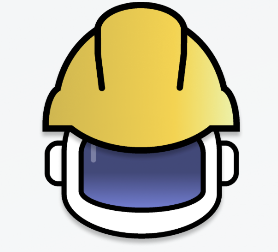

**Mision:**

Nuestra misión es optimizar la gestión y coordinación de los expedientes técnicos en el sector de obras civiles a través de soluciones tecnológicas innovadoras. Buscamos reducir errores en la recopilación y procesamiento de información, mejorando la eficiencia y precisión en la toma de decisiones. Mediante herramientas accesibles y colaborativas, facilitamos el trabajo de contratistas y especialistas, asegurando un flujo de información claro y estructurado.

**Vision:**

Nuestro objetivo es convertirnos en la plataforma de mayor confianza para pequeñas empresas y contratistas independientes que elaboran expedientes técnicos, destacándonos por reducir errores y optimizar la eficiencia operativa. En los próximos tres años, aspiramos a alcanzar el 3% de las empresas consultoras de obra en Lima Metropolitana, impulsando la modernización y digitalización de los procesos constructivos en todo el país.

**Nombre del producto:**

El nombre de la propuesta de solucion es ProP GMS. La idea surge de la unión de cinco palabras “Project Planning Galacticos Managing System”. Este aspecto se relaciona con el dilema que busca solventar la plataforma y el rubro al que direcciona.

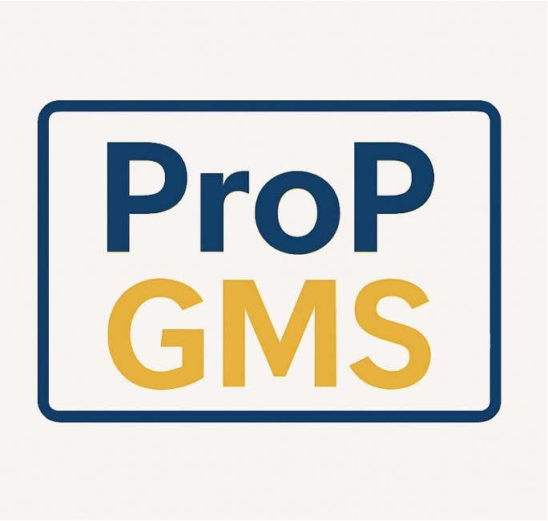

**Colores:**

La apariencia visual de una plataforma influye directamente en cómo es percibida, especialmente en campos técnicos como la ingeniería civil. Por ello, se ha diseñado una paleta cromática estratégica, alineada con los principios de la psicología del color y orientada a transmitir profesionalismo, claridad y funcionalidad.

Los colores primarios seleccionados son:

<li>Azul profundo (#22396B), que comunica confianza, seriedad y estabilidad.

<li>Gris claro (#E1E8EC), ideal para aportar limpieza visual y resaltar contenidos sin generar distracción.

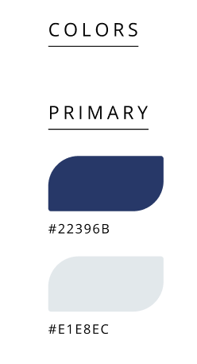

Como colores secundarios se han incorporado:

<li>Amarillo vibrante (#FAB900), que aporta energía y dinamismo, asociado a la innovación y acción.

<li>Verde agua (#FFC570), que aporta frescura, equilibrio y se vincula con la sostenibilidad y el entorno natural.

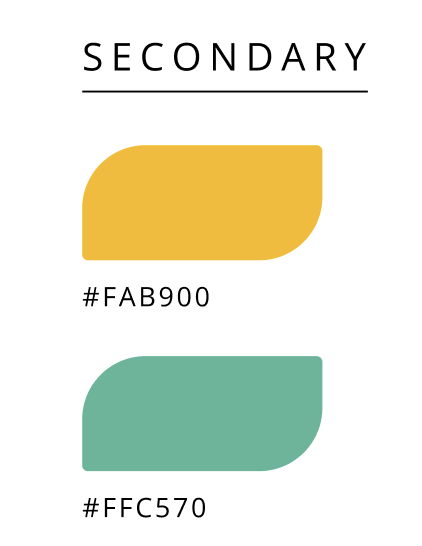

La paleta se completa con colores neutros:
 
<li>Negro azulado (#0C0C20), que proporciona contraste y fuerza visual.

<li>Blanco suave (#F6FAF9), que garantiza legibilidad y mantiene una estética limpia y profesional.

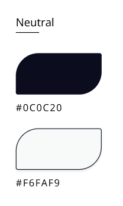

**Tipografia:**

La tipografía cumple un papel clave en la estructuración del contenido y en la orientación del usuario a lo largo de la interfaz. En este proyecto, se optó por el uso de la fuente Inter, seleccionada por su legibilidad y versatilidad en entornos digitales. La jerarquía visual se organiza en distintos niveles que definen claramente titulares, párrafos y elementos interactivos, asegurando una navegación fluida y coherente.

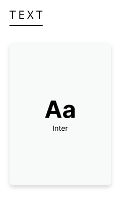

**Encabezado:**

Los encabezados se dividen en tres estilos principales:
Display 1 (Bold, 40.5px) para titulares destacados.
Header 1 (Bold, 47px) para títulos principales.
Header 2 (Bold, 18px) para subtítulos o secciones intermedias.

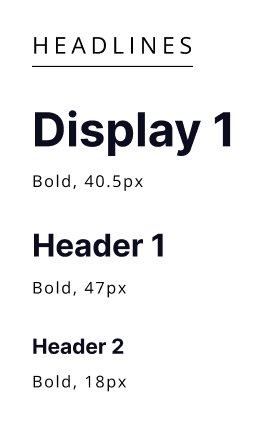

**Parrafo:**

Los textos de párrafo siguen un enfoque funcional con:

Paragraph 1 (Regular, 12px) para bloques de texto estándar.
Paragraph 2 (Regular, 8px) para detalles secundarios o notas.

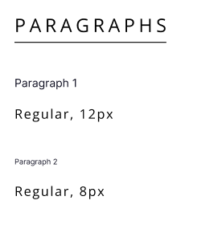

**Botones y enlaces:**

Para botones y enlaces, se utilizan estilos en negrita de 12px, diferenciando los botones en negro y los hipervínculos en verde agua, manteniendo la coherencia con la identidad cromática del sistema.

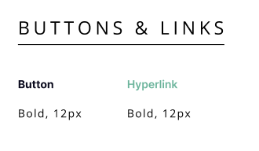

### 4.1.2. Web Style Guidelines

**Header**

El componente es una barra de navegacion que permite al usuario acceder a las secciones de la pagina web
 

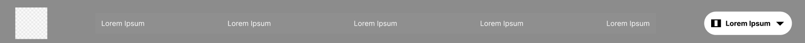

 

**Botones**

Este conjunto de botones de accion, incluye opciones para descargar, exportar, denegar, aprobar, enviar y para que acceda a las redes sociales de la empresa.
 

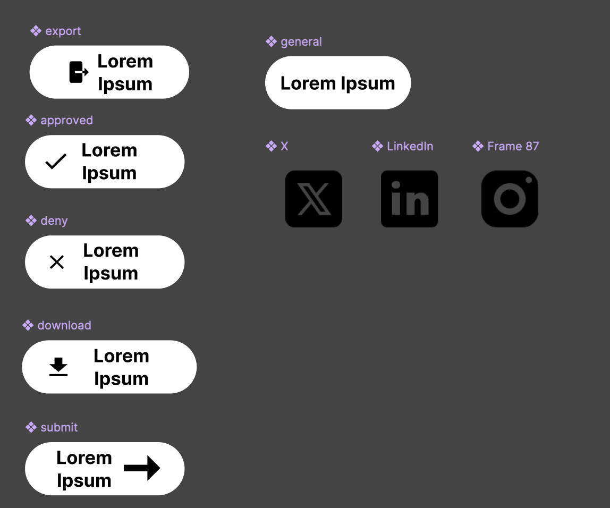

 

**Boton internacional**

Este par de botones nos brindan la pagina web en ingles y español para que le usuario lo pueda cambiar.

 

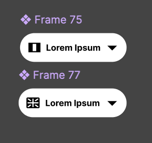

**Formulario**

Estos formularios son para que los usuarios se contacten con nosotros si necesitan  informacion 
 

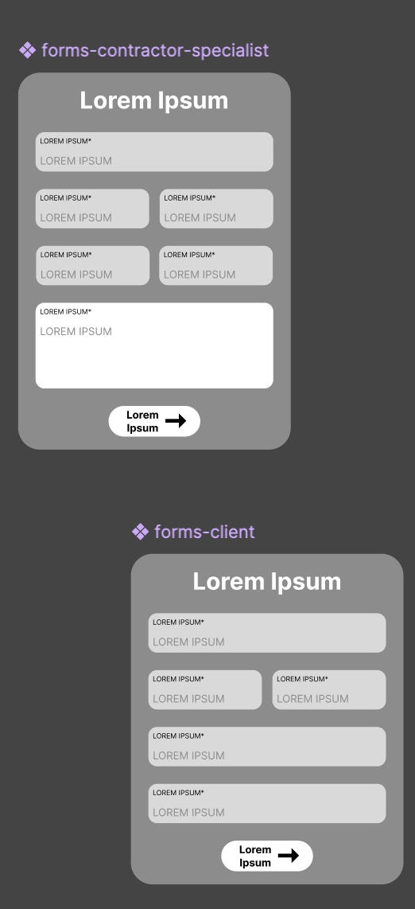

