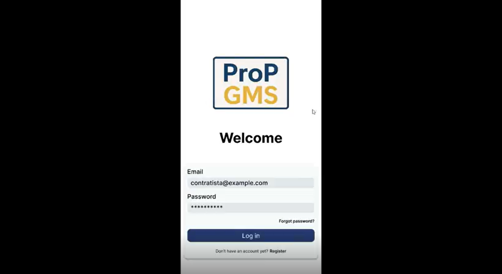

## 4.5. Web Applications Prototyping
Para el desarrollo de los prototipos de la interfaz de usuario orientados a navegadores web en entornos Desktop y Mobile, se adoptaron una serie de principios clave que guiaron el diseño. En primer lugar, se priorizó la claridad y facilidad de uso, procurando que la navegación resultara intuitiva y que los usuarios comprendieran con facilidad las funcionalidades principales, tales como el registro de procesos y la consulta de reportes estadísticos. En segundo lugar, se aplicaron criterios de diseño adaptable (responsive design) para asegurar la compatibilidad de la aplicación con distintos tamaños de pantalla, permitiendo así una experiencia consistente independientemente del dispositivo utilizado. Finalmente, se puso énfasis en la presentación de información relevante, procurando mostrar únicamente los datos esenciales para el perfil de usuario al que se dirige la aplicación.

Enlace para acceder al video de explicación del <a href="https://upcedupe-my.sharepoint.com/:v:/g/personal/u20211b994_upc_edu_pe/EQXb8kwTRW1JsIjq76EiawIBSVFvOBnmGCS3Wmu5zYUhOQ?nav=eyJyZWZlcnJhbEluZm8iOnsicmVmZXJyYWxBcHAiOiJTdHJlYW1XZWJBcHAiLCJyZWZlcnJhbFZpZXciOiJTaGFyZURpYWxvZy1MaW5rIiwicmVmZXJyYWxBcHBQbGF0Zm9ybSI6IldlYiIsInJlZmVycmFsTW9kZSI6InZpZXcifX0%3D&e=0fERvI">Web Applications Prototyping</a>

Enlace para acceder al <a href= "https://www.figma.com/proto/58D13IoOvL8qDbERBSw8nX/Web-Application-Prototyping?node-id=0-1&t=a4MLV1z9mhD1XMI7-1">Flujo</a>