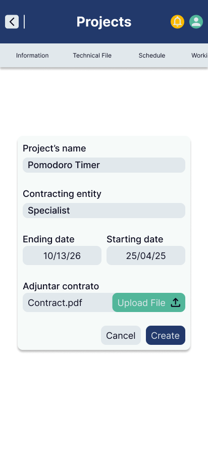
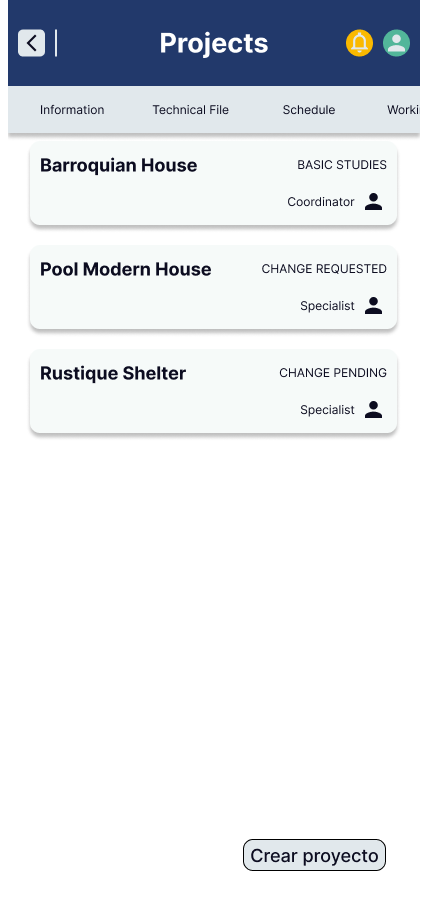
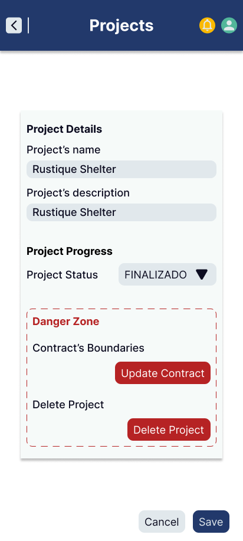
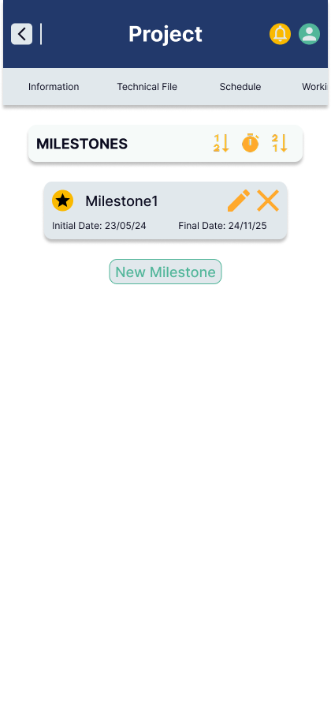
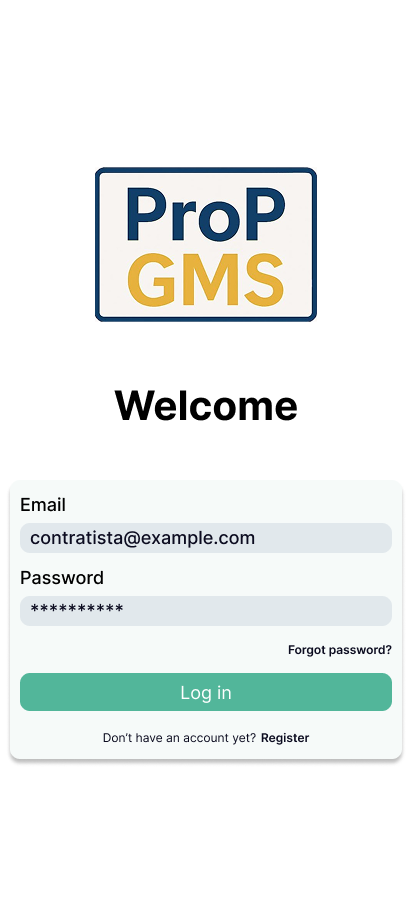
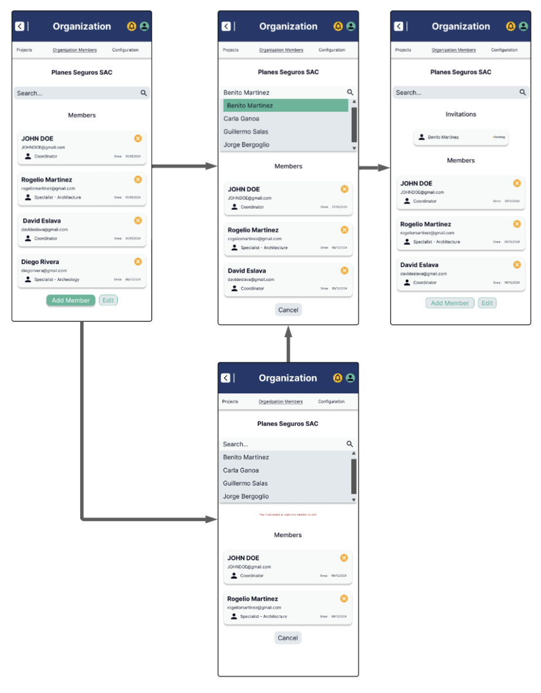

## 4.4. Web Applications UX/UI Design

### 4.4.1. Web Applications Wireframes. 

### 4.4.2. Web Applications Wireflow Diagrams. 

### 4.4.3. Web Applications Mock-ups. 

**Crear proyecto**

**Listar proyectos de organización**

**Editar proyecto**

**Listar hitos**

**Login**

### 4.4.4. Web Applications User Flow Diagrams. 

**1. Crear un nuevo proyecto**

- **User Goal:** Crear un proyecto dentro de la organización activa para iniciar la planificación de su cronograma, equipo y tareas.
- **User Persona:** Contratista

**Flujo Principal (Happy Path):**
- Sistema muestra la vista de la organización seleccionada que muestra la barra de navegación de organización.
- Sistema muestra por default la pestaña "Información" de la organización, que incluye:
  - Nombre comercial (o razón social).
  - El contratista dueño de la organización.
  - La fecha de creación de la organización.
  - El RUC de la organización.
- Usuario selecciona la pestaña de proyectos de la organización.
- Sistema muestra la lista de todos los proyectos de la organización, con información resumida: nombre, estado, rol del usuario.
- Usuario selecciona la opción "Crear nuevo proyecto".
- Sistema despliega formulario de creación con los siguientes campos:
  - Nombre del proyecto.
  - Descripción del proyecto.
  - Fecha de inicio (asignada automáticamente como fecha actual, no editable).
  - Fecha de finalización estimada.
  - Subida del contrato firmado.
  - Fecha de firma del contrato.
  - Correo de la entidad contratante (debe estar registrada).
- Usuario completa el formulario y lo envía.
- Sistema valida los datos ingresados.
- Sistema crea el proyecto dentro de la organización activa.
- Sistema muestra un mensaje de éxito y redirige al detalle del proyecto creado.

**Puntos de Decisión:**
- ¿Todos los campos obligatorios fueron completados? (Todos excepto descripción)
- ¿La fecha de finalización es posterior a la de inicio?
- ¿El correo de la entidad contratante pertenece a una entidad registrada?

**Flujos Alternativos (Unhappy Paths):**
- Campos obligatorios incompletos: error "Debe completar todos los campos requeridos".
- Fecha de finalización anterior a la fecha de inicio: error "La fecha de finalización debe ser posterior a la fecha de inicio".
- Correo de entidad contratante inválido o no registrado: error "Entidad contratante no encontrada".

**2. Consultar y visualizar lista de proyectos y sus detalles**

- **User Goal:** Consultar los proyectos accesibles para el usuario y visualizar su información general.
- **User Persona:** Contratista

**Flujo Principal (Happy Path):**
- Sistema muestra la vista de la organización seleccionada que muestra la barra de navegación de organización.
- Usuario selecciona la pestaña "Proyectos" de la organización.
- Sistema muestra la lista de todos los proyectos de la organización, con información resumida: nombre, estado, rol del usuario.
- Usuario selecciona un proyecto de la lista.
- Sistema muestra la vista del proyecto seleccionado que muestra la barra de navegación de proyecto.
- Sistema carga por default la pestaña "Información" del proyecto, que incluye:
  - Nombre del proyecto.
  - Estado actual.
  - Fechas de inicio y finalización.
  - Entidad contratante.

**Puntos de Decisión:**
- No hay puntos de decisión en este flujo.

**Flujos Alternativos (Unhappy Paths):**
- No hay unhappy paths para este flujo.

**3. Editar información general del proyecto**

- **User Goal:** Actualizar el nombre o la descripción del proyecto para reflejar cambios en el alcance o clarificaciones internas.
- **User Persona:** Contratista

**Flujo Principal (Happy Path):**
- Sistema muestra la vista del proyecto seleccionado que muestra la barra de navegación de proyecto.
- Usuario selecciona la pestaña "Configuración".
- Sistema despliega una vista con los detalles actuales del proyecto:
  - Nombre del proyecto.
  - Descripción del proyecto.
  - Estado del proyecto.
  - La "zona de peligro", que muestra la opción de editar restricciones contractuales y eliminar proyecto.
- Los campos de nombre y descripción pueden reescribirse, como si se tratara de un formulario.
- Usuario cambia el nombre y/o descripción del proyecto.
- Sistema valida los datos y actualiza la información.
- Sistema muestra un mensaje de éxito.

**Puntos de Decisión:**
- ¿Nuevo nombre ingresado no está vacío?

**Flujos Alternativos (Unhappy Paths):**
- Nombre de proyecto vacío: error "El nombre del proyecto no puede estar vacío".

**4. Cambiar estado del proyecto**

- **User Goal:** Actualizar el estado del proyecto para reflejar su progreso o finalización.
- **User Persona:** Contratista

**Flujo Principal (Happy Path):**
- Sistema muestra la vista del proyecto seleccionado que muestra la barra de navegación de proyecto.
- Usuario selecciona la pestaña "Configuración".
- Sistema despliega una vista con los detalles actuales del proyecto:
  - Nombre del proyecto.
  - Descripción del proyecto.
  - Estado del proyecto.
  - La "zona de peligro", que muestra la opción de editar restricciones contractuales y eliminar proyecto.
- El campo de estado del proyecto puede desplegarse como una lista de opciones.
- Usuario selecciona un nuevo estado para el proyecto de la lista desplegable.
- Sistema valida los datos y actualiza la información.
- Sistema muestra un mensaje de éxito.

**Puntos de Decisión:**
- No hay puntos de decisión en este flujo.

**Flujos Alternativos (Unhappy Paths):**
- No hay unhappy paths para este flujo.

**5. Cambiar correo de entidad contratante y fecha de finalización**

- **User Goal:** Actualizar la entidad contratante y fecha de finalización del proyecto en caso de modificaciones administrativas.
- **User Persona:** Contratista

**Flujo Principal (Happy Path):**
- Sistema muestra la vista del proyecto seleccionado que muestra la barra de navegación de proyecto.
- Usuario selecciona la pestaña "Configuración".
- Sistema despliega una vista con los detalles actuales del proyecto:
  - Nombre del proyecto.
  - Descripción del proyecto.
  - Estado del proyecto.
  - La "zona de peligro", que muestra la opción de editar restricciones contractuales y eliminar proyecto.
- Usuario selecciona la opción "Cambiar restricciones contractuales".
- Sistema despliega una vista con los detalles contractuales actuales del proyecto:
  - Archivo del nuevo contrato firmado.
  - Correo de la entidad contratante.
  - Fecha de finalización del proyecto.
- Los campos de correo de entidad contratante y fecha de finalización pueden reescribirse, como si se tratara de un formulario.
- Usuario cambia el correo de entidad contratante y/o fecha de finalización.
- Sistema valida la información.
- Sistema guarda los nuevos datos.
- Sistema muestra mensaje de éxito confirmando la actualización.

**Puntos de Decisión:**
- ¿Fecha de firma del contrato ingresada?
- ¿Correo de entidad contratante válido?

**Flujos Alternativos (Unhappy Paths):**
- Fecha de firma no ingresada: error "Debe ingresar la fecha de finalización del proyecto.".
- Correo de entidad no válido: error "Entidad contratante no encontrada".

**6. Cambiar contrato del proyecto**

- **User Goal:** Actualizar el contrato del proyecto en caso de modificaciones legales.
- **User Persona:** Contratista

**Flujo Principal (Happy Path):**
- Sistema muestra la vista del proyecto seleccionado que muestra la barra de navegación de proyecto.
- Usuario selecciona la pestaña "Configuración".
- Sistema despliega una vista con los detalles actuales del proyecto:
  - Nombre del proyecto.
  - Descripción del proyecto.
  - Estado del proyecto.
  - La "zona de peligro", que muestra la opción de editar restricciones contractuales y eliminar proyecto.
- Usuario selecciona la opción "Cambiar restricciones contractuales".
- Sistema despliega una vista con los detalles contractuales actuales del proyecto:
  - Archivo del nuevo contrato firmado.
  - Correo de la entidad contratante.
  - Fecha de finalización del proyecto.
- El campo de contrato debe ser un botón que permita elegir entre subir un nuevo archivo o elegir uno del workspace de la organización.
- Si usuario elige elige workspace, debe visualizar la lista de archivos del workspace, incluyendo:
  - Nombre del archivo.
  - Extensión del archivo.
- Si el usuario elige subir nuevo archivo, debe permitir subir un archivo desde su dispositivo.
  - Sistema valida que haya espacio suficiente en el workspace para el nuevo archivo antes de subirlo.
- Sistema guarda la referencia al nuevo contrato.
- Sistema muestra mensaje de éxito confirmando la actualización.

**Puntos de Decisión:**
- ¿Qué método para adjuntar nuevo contrato elige el usuario?
- ¿La organización del proyecto cuenta con suficiente espacio en su workspace?

**Flujos Alternativos (Unhappy Paths):**
- Espacio insuficiente en workspace: error "No hay suficiente espacio en el workspace".

**7. Eliminar proyecto**

- **User Goal:** Eliminar un proyecto que ya no será ejecutado o es innecesario conservar.
- **User Persona:** Contratista

**Flujo Principal (Happy Path):**
- Sistema muestra la vista del proyecto seleccionado que muestra la barra de navegación de proyecto.
- Usuario selecciona la pestaña "Configuración".
- Sistema despliega una vista con los detalles actuales del proyecto:
  - Nombre del proyecto.
  - Descripción del proyecto.
  - Estado del proyecto.
  - La "zona de peligro", que muestra la opción de editar restricciones contractuales y eliminar proyecto.
- Usuario selecciona la opción "Eliminar proyecto".
- Sistema muestra una advertencia de confirmación indicando que se eliminarán todos los recursos asociados (excepto archivos del workspace).
- Usuario debe confirmar la acción escribiendo "eliminar + nombre del proyecto" para proceder.
- Usuario envía la confirmación.
- Sistema valida la entrada.
- Sistema elimina lógicamente el proyecto (lo marca como inactivo o lo mueve a papelera).
- Sistema muestra mensaje de éxito indicando que el proyecto fue eliminado.

**Puntos de Decisión:**
- ¿Confirmación escrita correctamente?

**Flujos Alternativos (Unhappy Paths):**
- Confirmación incorrecta: error "El texto ingresado no coincide con el nombre del proyecto".

**8. Agregar nuevos miembros al proyecto**

- **User Goal:** Incorporar nuevos miembros de la organización al equipo del proyecto, asignándoles un rol y especialidad si corresponde.
- **User Persona:** Contratista

**Flujo Principal (Happy Path):**
- Contratista accede a la sección "Equipo" dentro del detalle del proyecto.
- Usuario selecciona la opción "Agregar miembros".
- Sistema despliega lista de miembros de la organización que aún no pertenecen al proyecto.
- Usuario utiliza la barra de búsqueda para encontrar un miembro por nombre o correo si es necesario.
- Usuario selecciona uno o más miembros.
- Para cada miembro seleccionado:
  - Usuario asigna el rol (Coordinador o Especialista).
  - Si el rol es Especialista, usuario asigna la especialidad correspondiente.
- Usuario confirma la selección.
- Sistema registra la incorporación en estado pendiente de confirmación.

**Puntos de Decisión:**
- ¿Se seleccionó al menos un miembro?
- ¿Rol asignado a cada miembro?
- ¿Especialidad asignada si el rol es Especialista?

**Flujos Alternativos (Unhappy Paths):**
- No seleccionar miembros: error "Debe seleccionar al menos un miembro para agregar".
- No asignar rol: error "Debe asignar un rol a cada miembro".
- Especialidad no asignada a especialista: error "Debe asignar una especialidad si el rol es Especialista".
- Miembro ya pertenece al proyecto: el sistema impide su selección o muestra advertencia "El miembro ya es parte del proyecto". 

**9. Confirmar incorporación de miembros**

- **User Goal:** Finalizar el proceso de adición de nuevos miembros al proyecto, haciéndolos oficialmente parte del equipo.
- **User Persona:** Contratista

**Flujo Principal (Happy Path):**
- Contratista revisa la lista de miembros seleccionados para incorporación.
- Verifica que todos tengan rol y, si corresponde, especialidad asignada.
- Usuario presiona el botón "Confirmar incorporación".
- Sistema valida que toda la información esté completa.
- Sistema actualiza el equipo del proyecto agregando oficialmente a los nuevos miembros.
- Sistema muestra mensaje de éxito indicando que los miembros fueron incorporados.

**Puntos de Decisión:**
- ¿Todos los miembros tienen rol asignado?
- ¿Especialidad asignada si el rol es Especialista?

**Flujos Alternativos (Unhappy Paths):**
- Miembro sin rol: error "Todos los miembros deben tener un rol asignado".
- Especialista sin especialidad: error "Debe asignar una especialidad a todos los especialistas".
- Error de validación general: mensaje "Revise los datos antes de confirmar la incorporación". 

**10. Consultar y gestionar miembros del equipo**

- **User Goal:** Consultar la lista de miembros del proyecto y gestionar sus roles o especialidades, o eliminarlos si corresponde.
- **User Persona:** Contratista

**Flujo Principal (Happy Path):**
- Contratista accede a la sección "Equipo" dentro del detalle del proyecto.
- Sistema muestra la lista de miembros con:
  - Nombre.
  - Correo.
  - Rol asignado.
  - Especialidad (si aplica).
- Usuario puede realizar las siguientes acciones:
  - Editar rol de un miembro.
  - Editar especialidad de un miembro si su rol es Especialista.
  - Eliminar un miembro del equipo (previa confirmación).

**Puntos de Decisión:**
- ¿El miembro seleccionado tiene tareas asignadas?

**Flujos Alternativos (Unhappy Paths):**
- Usuario intenta eliminar miembro con tareas asignadas: sistema muestra advertencia "Debe reasignar o eliminar tareas antes de eliminar este miembro".
- Cancelar edición o eliminación: no se realizan cambios. 

**11. Crear un nuevo hito**

- **User Goal:** Añadir un hito al cronograma del proyecto para estructurar fases clave o entregables intermedios.
- **User Persona:** Contratista

**Flujo Principal (Happy Path):**
- Contratista accede a la sección "Cronograma" dentro del detalle del proyecto.
- Usuario selecciona la opción "Añadir hito".
- Sistema despliega formulario de creación de hito:
  - Nombre del hito.
  - Fecha de inicio.
  - Fecha de finalización.
- Usuario completa los campos y envía el formulario.
- Sistema valida la información:
  - Nombre no vacío.
  - Fechas en orden correcto.
  - Fechas dentro del rango general del proyecto.
- Sistema crea el hito.
- Sistema muestra mensaje de éxito indicando que el hito fue creado.

**Puntos de Decisión:**
- ¿Nombre del hito ingresado?
- ¿Fechas consistentes y dentro del rango permitido?

**Flujos Alternativos (Unhappy Paths):**
- Nombre vacío: error "El nombre del hito es obligatorio".
- Fechas inconsistentes (inicio posterior a fin): sistema ajusta automáticamente o muestra advertencia.
- Fechas fuera del rango del proyecto: error "Las fechas del hito deben estar dentro del rango del proyecto".

**12. Consultar lista de hitos del proyecto**

- **User Goal:** Visualizar los hitos existentes del proyecto para conocer la estructura de su cronograma.
- **User Persona:** Miembro del proyecto

**Flujo Principal (Happy Path):**
- Usuario accede a la sección "Cronograma" dentro del detalle del proyecto.
- Sistema muestra la lista de hitos registrados, incluyendo para cada hito:
  - Nombre del hito.
  - Fecha de inicio.
  - Fecha de finalización.
- Usuario puede expandir un hito para ver las tareas asociadas si corresponde.

**Puntos de Decisión:**
- ¿Existen hitos creados en el proyecto?

**Flujos Alternativos (Unhappy Paths):**
- Proyecto sin hitos creados: sistema muestra mensaje "No hay hitos registrados en este proyecto".

**13. Editar información de un hito**

- **User Goal:** Actualizar el nombre o las fechas de un hito para reflejar cambios en la planificación del proyecto.
- **User Persona:** Contratista

**Flujo Principal (Happy Path):**
- Contratista accede a la sección "Cronograma" del proyecto.
- Usuario selecciona el hito que desea editar.
- Usuario presiona la opción "Editar hito".
- Sistema despliega formulario editable con:
  - Nombre del hito.
  - Fecha de inicio.
  - Fecha de finalización.
- Usuario realiza las modificaciones necesarias.
- Usuario guarda los cambios.
- Sistema valida que:
  - El nombre no esté vacío.
  - Las fechas sean consistentes (inicio ≤ fin).
  - Las fechas estén dentro del rango permitido del proyecto.
- Sistema actualiza el hito y muestra mensaje de éxito.

**Puntos de Decisión:**
- ¿Nuevo nombre ingresado?
- ¿Fechas en orden correcto?
- ¿Fechas dentro del rango del proyecto?

**Flujos Alternativos (Unhappy Paths):**
- Nombre vacío: error "El nombre del hito es obligatorio".
- Fechas inconsistentes: sistema puede ajustar automáticamente o mostrar advertencia.
- Fechas fuera de rango: error "Las fechas del hito deben coincidir con el rango del proyecto".

**14. Eliminar hito del cronograma**

- **User Goal:** Eliminar un hito del cronograma del proyecto cuando ya no sea necesario.
- **User Persona:** Contratista

**Flujo Principal (Happy Path):**
- Contratista accede a la sección "Cronograma" del proyecto.
- Usuario selecciona el hito que desea eliminar.
- Usuario presiona la opción "Eliminar hito".
- Sistema muestra advertencia de confirmación:
  - Si el hito tiene tareas o reuniones asociadas, se informa que también serán eliminadas.
- Usuario confirma la eliminación escribiendo "eliminar + nombre del hito" para proceder.
- Sistema valida la confirmación.
- Sistema elimina el hito y los contenidos asociados si corresponde.
- Sistema muestra mensaje de éxito indicando que el hito fue eliminado.

**Puntos de Decisión:**
- ¿Hito tiene tareas o reuniones asociadas?
- ¿Confirmación escrita correctamente?

**Flujos Alternativos (Unhappy Paths):**
- Confirmación incorrecta: error "El texto ingresado no coincide con el nombre del hito".
- Usuario cancela la eliminación: no se realiza ninguna acción.

**15. Crear una nueva tarea**

- **User Goal:** Añadir una nueva tarea dentro de un hito del cronograma para organizar el trabajo del equipo.
- **User Persona:** Contratista

**Flujo Principal (Happy Path):**
- Contratista accede a la sección "Cronograma" del proyecto.
- Usuario expande el hito donde desea crear la tarea.
- Usuario selecciona la opción "Añadir tarea".
- Sistema despliega formulario para ingresar:
  - Nombre de la tarea.
  - Especialidad requerida.
  - Fecha de inicio.
  - Fecha de vencimiento.
- Usuario completa los campos y envía el formulario.
- Sistema valida:
  - Nombre no vacío.
  - Fechas en orden correcto.
  - Fechas dentro del rango del hito.
- Sistema crea la tarea en estado DRAFT.
- Sistema muestra mensaje de éxito indicando que la tarea fue creada.

**Puntos de Decisión:**
- ¿Nombre de la tarea ingresado?
- ¿Especialidad seleccionada?
- ¿Fechas consistentes y dentro del rango del hito?

**Flujos Alternativos (Unhappy Paths):**
- Nombre vacío: error "El nombre de la tarea es obligatorio".
- Especialidad no seleccionada: error "Debe seleccionar una especialidad".
- Fechas inconsistentes o fuera de rango: error "Las fechas deben estar dentro del rango del hito y en orden correcto".

**16. Consultar lista de tareas de un hito**

- **User Goal:** Visualizar las tareas asociadas a un hito específico dentro del cronograma del proyecto.
- **User Persona:** Miembro del proyecto

**Flujo Principal (Happy Path):**
- Usuario accede a la sección "Cronograma" dentro del detalle del proyecto.
- Usuario expande el hito que desea consultar.
- Sistema muestra la lista de tareas asociadas al hito, incluyendo para cada tarea:
  - Nombre de la tarea.
  - Especialidad requerida.
  - Responsable asignado (si existe).
  - Estado de la tarea (Draft, Pending, Submitted, Reviewed).
- Usuario puede seleccionar una tarea para consultar más detalles si lo desea.

**Puntos de Decisión:**
- ¿Existen tareas asociadas al hito?

**Flujos Alternativos (Unhappy Paths):**
- Hito sin tareas: sistema muestra mensaje "No hay tareas registradas para este hito".

**17. Asignar responsable a una tarea**

- **User Goal:** Designar un miembro del equipo como responsable de una tarea para su ejecución y seguimiento.
- **User Persona:** Contratista

**Flujo Principal (Happy Path):**
- Contratista accede a la sección "Cronograma" del proyecto.
- Usuario expande el hito y localiza la tarea a asignar.
- Usuario selecciona la opción "Asignar responsable".
- Sistema despliega lista de miembros disponibles del proyecto.
- Usuario puede aplicar un filtro para mostrar solo miembros cuya especialidad coincide con la de la tarea.
- Usuario selecciona un miembro como responsable.
- Sistema actualiza la tarea asignando el responsable y cambia su estado a PENDING.
- Sistema muestra mensaje de éxito indicando que la tarea fue asignada.

**Puntos de Decisión:**
- ¿Miembro seleccionado tiene la especialidad adecuada?

**Flujos Alternativos (Unhappy Paths):**
- No seleccionar responsable: error "Debe seleccionar un responsable para asignar la tarea".
- No hay miembros compatibles al aplicar filtro: mensaje "No hay miembros disponibles con la especialidad requerida".

**18. Editar información de una tarea**

- **User Goal:** Actualizar el nombre, especialidad, fechas o responsable de una tarea en función de ajustes en la planificación o el equipo.
- **User Persona:** Contratista

**Flujo Principal (Happy Path):**
- Contratista accede a la sección "Cronograma" del proyecto.
- Usuario expande el hito y localiza la tarea que desea editar.
- Usuario selecciona la opción "Editar tarea".
- Sistema despliega formulario editable para:
  - Nombre de la tarea.
  - Especialidad requerida.
  - Fecha de inicio y vencimiento.
  - Responsable asignado.
- Usuario realiza las modificaciones necesarias.
- Usuario guarda los cambios.
- Sistema valida:
  - Nombre no vacío.
  - Especialidad válida.
  - Fechas consistentes y dentro del rango del hito.
- Sistema actualiza la información de la tarea y muestra mensaje de éxito.

**Puntos de Decisión:**
- ¿Nuevo nombre ingresado?
- ¿Especialidad válida seleccionada?
- ¿Fechas consistentes y dentro del rango del hito?
- ¿Responsable actualizado cumple con la especialidad (si aplica)?

**Flujos Alternativos (Unhappy Paths):**
- Nombre vacío: error "El nombre de la tarea es obligatorio".
- Especialidad no seleccionada: error "Debe seleccionar una especialidad".
- Fechas inconsistentes o fuera de rango: error "Las fechas deben estar dentro del rango del hito y ser consistentes".

**19. Enviar entregable de tarea**

- **User Goal:** Subir y enviar el entregable asociado a una tarea para su revisión.
- **User Persona:** Especialista

**Flujo Principal (Happy Path):**
- Especialista accede a la sección "Cronograma" del proyecto.
- Usuario expande el hito y localiza su tarea asignada.
- Usuario selecciona la opción "Enviar entregable".
- Sistema despliega formulario para:
  - Adjuntar uno o más archivos (documentos, planos, etc.).
  - Agregar comentarios adicionales si es necesario.
- Usuario adjunta archivos y escribe comentarios opcionales.
- Usuario confirma el envío del entregable.
- Sistema valida la carga de al menos un archivo.
- Sistema actualiza el estado de la tarea a SUBMITTED.
- Sistema muestra mensaje de éxito indicando que el entregable fue enviado para revisión.

**Puntos de Decisión:**
- ¿Se adjuntó al menos un archivo?

**Flujos Alternativos (Unhappy Paths):**
- No adjuntar archivos: error "Debe adjuntar al menos un archivo para enviar el entregable".

**20. Consultar entregables enviados**

- **User Goal:** Visualizar los entregables enviados para una tarea y consultar su estado de revisión.
- **User Persona:** Especialista / Coordinador / Contratista

**Flujo Principal (Happy Path):**
- Usuario accede a la sección "Cronograma" del proyecto.
- Usuario expande el hito y localiza la tarea deseada.
- Usuario selecciona la opción "Ver entregable" si está disponible.
- Sistema muestra los detalles del entregable:
  - Lista de archivos enviados.
  - Comentarios añadidos por el remitente.
  - Estado actual de la revisión (En revisión, Aprobado, Rechazado).
- Usuario puede descargar o previsualizar los archivos adjuntos.

**Puntos de Decisión:**
- ¿El entregable ya fue enviado?

**Flujos Alternativos (Unhappy Paths):**
- No hay entregable enviado: mensaje "Todavía no se ha enviado entregable para esta tarea".

**21. Revisar entregable enviado**

- **User Goal:** Evaluar un entregable enviado por un especialista y tomar una acción (aprobar, rechazar o solicitar ajustes).
- **User Persona:** Coordinador / Contratista

**Flujo Principal (Happy Path):**
- Usuario accede a la sección "Cronograma" del proyecto.
- Usuario expande el hito y localiza la tarea cuyo entregable desea revisar.
- Usuario selecciona la opción "Revisar entregable".
- Sistema muestra los archivos enviados y comentarios asociados.
- Usuario revisa el contenido del entregable.
- Usuario elige una acción:
  - Aprobar entregable.
  - Rechazar entregable (indicando motivos).
  - Solicitar ajustes (indicando observaciones específicas).
- Usuario confirma la acción seleccionada.
- Sistema actualiza el estado del entregable y la tarea:
  - Aprobado → tarea en estado REVIEWED.
  - Rechazado o ajustes solicitados → tarea vuelve a estado PENDING o requiere reenvío.
- Sistema muestra mensaje de éxito con la acción realizada.

**Puntos de Decisión:**
- ¿Acción seleccionada correctamente?
- ¿Comentario obligatorio en caso de rechazo o solicitud de ajustes?

**Flujos Alternativos (Unhappy Paths):**
- No seleccionar acción: error "Debe seleccionar una acción para completar la revisión".
- No ingresar comentario en rechazo o ajuste: error "Debe ingresar un comentario explicativo".

**22. Presentar un Change Request**

- **User Goal:** Solicitar formalmente una modificación al proyecto mediante un Change Request.
- **User Persona:** Entidad contratante (Cliente)

**Flujo Principal (Happy Path):**
- Cliente accede al proyecto desde su cuenta en la plataforma.
- Usuario selecciona la opción "Presentar Change Request".
- Sistema despliega formulario para ingresar:
  - Título del cambio solicitado.
  - Descripción detallada del cambio.
  - Justificación del cambio.
  - Documentos adjuntos de soporte (opcional).
- Usuario completa los campos y envía la solicitud.
- Sistema valida que el título y la descripción no estén vacíos.
- Sistema crea un nuevo Change Process asociado al proyecto.
- Sistema muestra mensaje de éxito confirmando la presentación del Change Request.

**Puntos de Decisión:**
- ¿Título y descripción del cambio ingresados correctamente?

**Flujos Alternativos (Unhappy Paths):**
- Campos obligatorios incompletos: error "Debe ingresar título y descripción para solicitar un cambio".

**23. Presentar una Technical Query**

- **User Goal:** Formular una consulta técnica relacionada al proyecto para su evaluación y respuesta formal.
- **User Persona:** Entidad contratante (Cliente)

**Flujo Principal (Happy Path):**
- Cliente accede al proyecto desde su cuenta en la plataforma.
- Usuario selecciona la opción "Presentar Technical Query".
- Sistema despliega formulario para ingresar:
  - Título de la consulta técnica.
  - Descripción detallada de la duda o cuestión.
  - Documentos adjuntos de soporte (opcional).
- Usuario completa los campos y envía la consulta.
- Sistema valida que el título y la descripción no estén vacíos.
- Sistema crea un nuevo Change Process asociado al proyecto basado en la Technical Query.
- Sistema muestra mensaje de éxito confirmando la presentación de la Technical Query.

**Puntos de Decisión:**
- ¿Título y descripción de la consulta ingresados correctamente?

**Flujos Alternativos (Unhappy Paths):**
- Campos obligatorios incompletos: error "Debe ingresar título y descripción para presentar una consulta técnica".

**24. Consultar Change Processes creados**

- **User Goal:** Visualizar los Change Processes asociados al proyecto, su origen (Change Request o Technical Query) y su estado actual.
- **User Persona:** Coordinador / Contratista / Cliente

**Flujo Principal (Happy Path):**
- Usuario accede a la sección "Gestión de Cambios" dentro del detalle del proyecto.
- Sistema muestra la lista de Change Processes creados, incluyendo para cada uno:
  - Número o identificador.
  - Título del Change Request o Technical Query asociado.
  - Tipo de origen (Change Request o Technical Query).
  - Estado actual del Change Process (Ej: En evaluación, Aprobado, Rechazado).
- Usuario puede seleccionar un Change Process para ver su detalle completo si lo desea.

**Puntos de Decisión:**
- ¿Existen Change Processes asociados al proyecto?

**Flujos Alternativos (Unhappy Paths):**
- Proyecto sin Change Processes: sistema muestra mensaje "No hay Change Processes registrados para este proyecto".

**25. Gestionar Change Order asociado**

- **User Goal:** Formalizar y gestionar la autorización de cambios en el proyecto una vez que un Change Process ha sido aprobado.
- **User Persona:** Contratista

**Flujo Principal (Happy Path):**
- Contratista accede al detalle del Change Process aprobado.
- Usuario selecciona la opción "Gestionar Change Order".
- Sistema despliega información relevante:
  - Datos del Change Process aprobado.
  - Documentación del cambio.
- Usuario genera el Change Order correspondiente:
  - Completa información adicional requerida (por ejemplo, costos, impacto en fechas si aplica).
  - Adjunta documentos oficiales (opcional).
- Usuario confirma la emisión del Change Order.
- Sistema registra el Change Order asociado al Change Process.
- Sistema actualiza el estado del Change Process indicando que ya cuenta con un Change Order emitido.
- Sistema muestra mensaje de éxito.

**Puntos de Decisión:**
- ¿Change Process está aprobado?

**Flujos Alternativos (Unhappy Paths):**
- Change Process no aprobado aún: error "Solo se pueden generar Change Orders de Change Processes aprobados".
- Cancelar emisión del Change Order: no se genera ningún cambio.