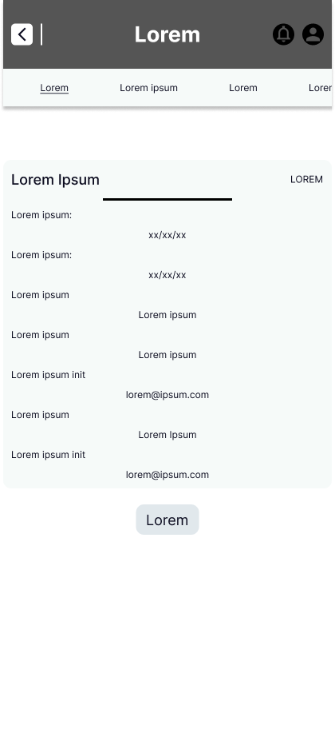
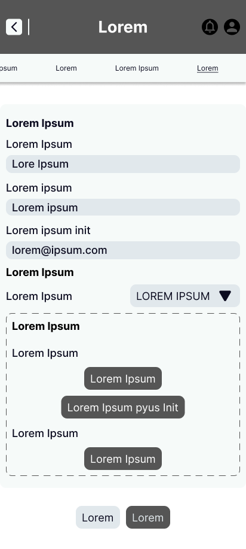
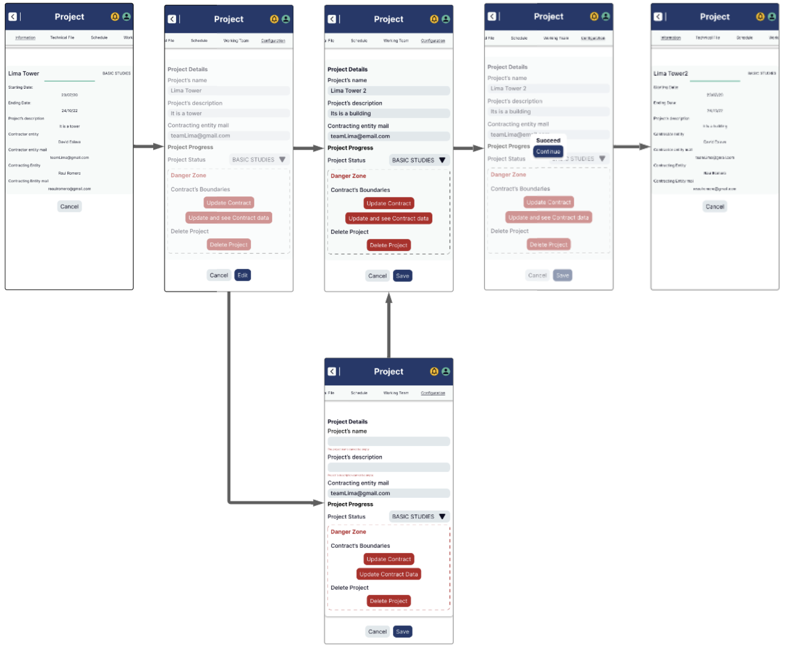
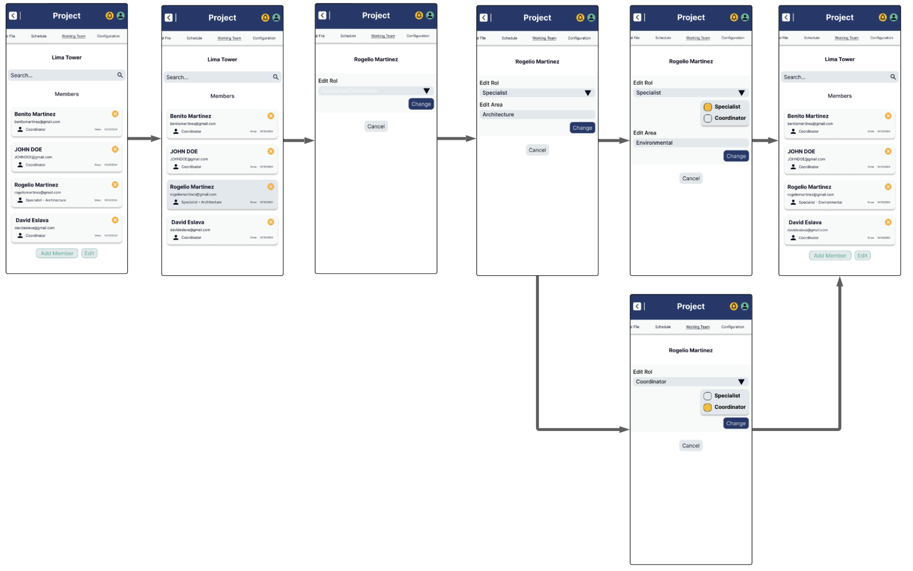
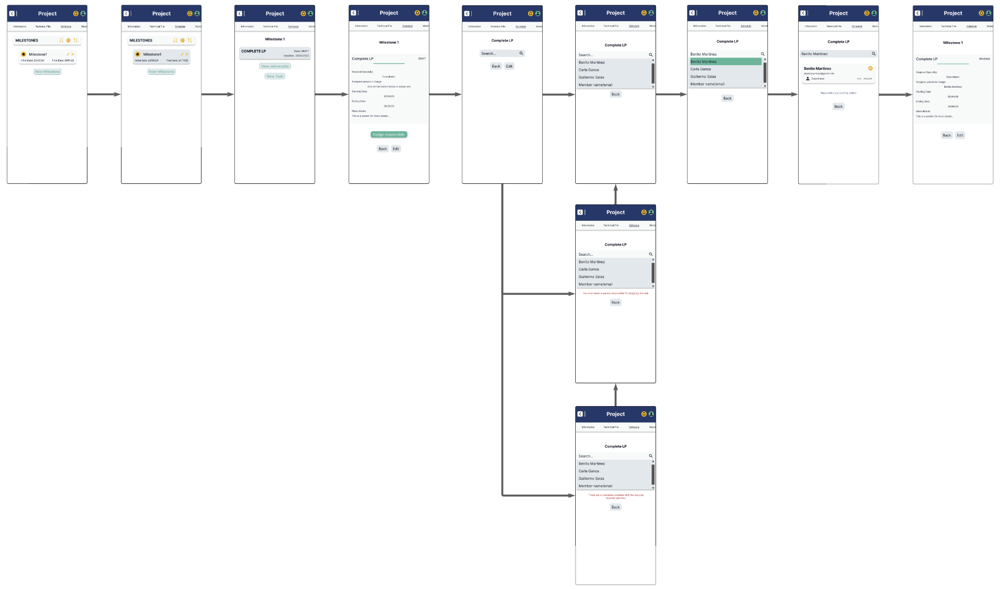

## 4.4. Web Applications UX/UI Design

### 4.4.1. Web Applications Wireframes. 

Enlace para acceder al <a href="https://www.figma.com/design/K68n9DnQRThT5DihRPAQId/SoftwareGestion?node-id=2105-1303&t=8pukcXo2ixT5RZ4d-1">Figma</a>

**Iniciar sesion**

**Informacion de organizacion**

**Crear proyecto**

**Informacion del proyecto**

**Configuracion del proyecto**

**Miembros del proyecto**

**Subir contrato**

**Creacion de milestone**

**Informacion de tarea**

**Estado de proyecto**

**Proceso de cambio del proyecto**

### 4.4.2. Web Applications Wireflow Diagrams. 

Enlace para acceder al <a href="https://lucid.app/lucidchart/61958854-f009-480f-b122-df53bd8ab153/edit?viewport_loc=-9091%2C-7108%2C21047%2C10719%2C0_0&invitationId=inv_a67952f0-a49f-4210-bb72-2e9b6b4d129d">Lucid Chart</a>

**1. Invitar miembros a una organizacion**

**User Goal: Invitar a un nuevo miembro a la organización.**

**User Persona:** Contratista

El sistema carga la vista principal de la organización con la pestaña "Miembros de la organización" activa. Desde esta vista, el usuario selecciona la opción "Agregar miembro", lo que despliega un buscador con una lista de usuarios disponibles para ser invitados. El usuario selecciona a uno de ellos y hace clic en el botón "Continuar". A continuación, el sistema actualiza la sección de invitaciones mostrando al nuevo usuario como invitado. Finalmente, el usuario puede ver el listado de personas pendientes de aceptar la invitación.

**2. Crear un nuevo proyecto**

**User Goal: Crear un proyecto dentro de la organización activa para iniciar la planificación de su cronograma, equipo y tareas.**

**User Persona:** Contratista

El sistema presenta la vista de la organización seleccionada con la barra de navegación específica de organización visible. Por defecto, se muestra la pestaña "Información", donde el usuario puede ver el nombre comercial o razón social, el contratista propietario de la organización, la fecha de creación y el RUC. A continuación, el usuario accede a la pestaña de proyectos de la organización. El sistema muestra una lista de proyectos existentes, cada uno con su nombre, estado actual y el rol que desempeña el usuario. Desde esta vista, el usuario selecciona la opción "Crear nuevo proyecto", tras lo cual el sistema despliega un formulario con los siguientes campos: nombre del proyecto, descripción, fecha de inicio (prellenada con la fecha actual y no editable), fecha estimada de finalización, carga del contrato firmado, fecha de firma del contrato y correo electrónico de la entidad contratante (que debe estar previamente registrada). El usuario completa todos los campos y envía el formulario. El sistema valida los datos ingresados y, si todo es correcto, crea el nuevo proyecto dentro de la organización activa. Finalmente, se muestra un mensaje de éxito y el sistema redirige automáticamente al detalle del proyecto recién creado.

**3. Consultar y visualizar lista de proyectos y sus detalles**

**User Goal: Consultar los proyectos accesibles para el usuario y visualizar su información general.**

**User Persona:** Contratista

El sistema carga la vista de la organización seleccionada, mostrando la barra de navegación correspondiente. Desde esta vista, el usuario accede a la pestaña "Proyectos", donde el sistema presenta un listado de todos los proyectos vinculados a la organización, incluyendo información resumida como el nombre del proyecto, su estado actual y el rol del usuario dentro de cada uno. El usuario selecciona uno de los proyectos disponibles. A continuación, el sistema muestra la vista específica del proyecto elegido, incluyendo la barra de navegación de proyecto. De forma predeterminada, se carga la pestaña "Información", donde se detallan el nombre del proyecto, su estado actual, las fechas de inicio y finalización, y la entidad contratante responsable.

**4. Editar información general del proyecto**

**User Goal: Actualizar el nombre o la descripción del proyecto para reflejar cambios en el alcance o clarificaciones internas.**

**User Persona:** Contratista

El sistema presenta la vista del proyecto seleccionado, incluyendo la barra de navegación específica del proyecto. El usuario accede a la pestaña "Configuración", donde el sistema despliega una vista con los detalles actuales del proyecto: nombre, descripción, estado y una sección denominada "zona de peligro", que permite editar las restricciones contractuales y eliminar el proyecto. Los campos de nombre y descripción están habilitados para edición directa, como en un formulario. El usuario modifica uno o ambos campos. Una vez realizados los cambios, el sistema valida la información ingresada y, si es correcta, actualiza los datos del proyecto. Finalmente, se muestra un mensaje confirmando que la operación fue exitosa.

**5. Cambiar estado del proyecto**

**User Goal: Actualizar el estado del proyecto para reflejar su progreso o finalización.**

**User Persona:** Contratista

El sistema presenta la vista del proyecto seleccionado, mostrando la barra de navegación correspondiente. El usuario accede a la pestaña "Configuración", donde se despliega una vista con los detalles actuales del proyecto: nombre, descripción, estado y una sección de “zona de peligro” que incluye opciones para editar restricciones contractuales y eliminar el proyecto. El campo correspondiente al estado del proyecto está habilitado como una lista desplegable. El usuario selecciona un nuevo estado desde dicha lista. Una vez realizado el cambio, el sistema valida la información y actualiza el estado del proyecto. Finalmente, se muestra un mensaje confirmando que la actualización se realizó con éxito.

**6. Cambiar correo de entidad contratante y fecha de finalización**

**User Goal: Actualizar la entidad contratante y fecha de finalización del proyecto en caso de modificaciones administrativas.**

**User Persona:** Contratista

El sistema muestra la vista del proyecto seleccionado con su respectiva barra de navegación. El usuario accede a la pestaña "Configuración", donde se despliega una vista con los detalles actuales del proyecto, incluyendo el nombre, la descripción, el estado y una sección llamada "zona de peligro", que permite editar las restricciones contractuales o eliminar el proyecto. El usuario selecciona la opción "Cambiar restricciones contractuales". El sistema presenta una nueva vista con los datos contractuales actuales del proyecto: el archivo del contrato firmado, el correo de la entidad contratante y la fecha estimada de finalización. Los campos de correo y fecha están habilitados para edición. El usuario modifica uno o ambos datos, y al enviar los cambios, el sistema valida la información ingresada. Si todo es correcto, guarda los nuevos valores y muestra un mensaje de éxito confirmando la actualización.

**7. Cambiar contrato del proyecto**

**User Goal: Actualizar el contrato del proyecto en caso de modificaciones legales.**

**User Persona:** Contratista

El sistema presenta la vista del proyecto seleccionado junto con la barra de navegación correspondiente. El usuario accede a la pestaña "Configuración", donde se despliega una vista con los detalles actuales del proyecto: nombre, descripción, estado y una sección denominada "zona de peligro", que permite editar las restricciones contractuales o eliminar el proyecto. El usuario selecciona la opción "Cambiar restricciones contractuales". A continuación, el sistema muestra una nueva vista con los datos contractuales actuales del proyecto, incluyendo el archivo del contrato firmado, el correo de la entidad contratante y la fecha estimada de finalización.

**8. Eliminar proyecto**

**User Goal: Eliminar un proyecto que ya no será ejecutado o es innecesario conservar.**

**User Persona:** Contratista

El sistema muestra la vista del proyecto seleccionado con su barra de navegación correspondiente. El usuario accede a la pestaña "Configuración", donde se presentan los detalles actuales del proyecto: nombre, descripción, estado y una sección denominada "zona de peligro", que permite editar las restricciones contractuales o eliminar el proyecto. El usuario selecciona la opción "Eliminar proyecto".
El sistema muestra una advertencia de confirmación, informando que la eliminación del proyecto implica la pérdida de todos los recursos asociados, excepto los archivos almacenados en el espacio de trabajo. Para confirmar la acción, el usuario debe escribir manualmente la frase “eliminar + nombre del proyecto” en un campo de texto. Tras enviar la confirmación, el sistema valida que la entrada coincida exactamente con el formato solicitado. Si es correcta, el sistema procede a eliminar el proyecto. Finalmente, se muestra un mensaje de éxito notificando que el proyecto ha sido eliminado satisfactoriamente.

**9. Agregar nuevos miembros al proyecto**

**User Goal: Incorporar nuevos miembros de la organización al equipo del proyecto, asignándoles un rol y especialidad si corresponde.**

**User Persona:** Contratista

El contratista accede a la sección "Equipo" dentro del detalle del proyecto. Desde esta vista, el usuario selecciona la opción "Agregar miembros". El sistema despliega una lista con los miembros de la organización que aún no forman parte del proyecto. En caso de ser necesario, el usuario puede utilizar la barra de búsqueda para filtrar los resultados por nombre o correo electrónico.
Luego, el usuario selecciona uno o más miembros de la lista. Para cada persona seleccionada, se solicita la asignación de un rol, que puede ser Coordinador o Especialista. En caso de asignar el rol de Especialista, el sistema también requiere definir la especialidad correspondiente. Una vez completadas las asignaciones, el usuario confirma la acción. El sistema registra la incorporación de los miembros en estado pendiente de confirmación.

**10. Confirmar incorporación de miembros**

**User Goal: Finalizar el proceso de adición de nuevos miembros al proyecto, haciéndolos oficialmente parte del equipo.**

**User Persona:** Contratista

El contratista revisa la lista de miembros seleccionados para su incorporación al proyecto. Durante esta revisión, verifica que cada miembro tenga asignado un rol y, en caso de que el rol sea Especialista, que también cuente con una especialidad definida. Una vez confirmada la integridad de la información, el usuario presiona el botón "Confirmar incorporación". El sistema valida que todos los datos requeridos estén completos y correctamente asignados. Si la validación es exitosa, el sistema actualiza oficialmente el equipo del proyecto, incorporando a los nuevos miembros. Finalmente, se muestra un mensaje de éxito confirmando que la incorporación se ha realizado correctamente.

**11. Consultar y gestionar miembros del equipo**

**User Goal: Consultar la lista de miembros del proyecto y gestionar sus roles o especialidades.**

**User Persona:** Contratista

El contratista accede a la sección "Equipo" dentro del detalle del proyecto. El sistema presenta una lista de los miembros actuales del equipo, incluyendo para cada uno su nombre, correo electrónico, rol asignado y, en caso de corresponder, la especialidad asociada. Desde esta vista, el usuario puede realizar acciones específicas como editar el rol de cualquier miembro del equipo. Si el rol asignado es "Especialista", también se habilita la opción para modificar su especialidad correspondiente.

**12. Crear un nuevo hito**

**User Goal: Añadir un hito al cronograma del proyecto para estructurar fases clave o entregables intermedios.**

**User Persona:** Contratista

El contratista accede a la sección "Cronograma" dentro del detalle del proyecto. Desde esta vista, el usuario selecciona la opción "Añadir hito". El sistema despliega un formulario de creación que solicita el nombre del hito, la fecha de inicio y la fecha de finalización. El usuario completa todos los campos requeridos y envía el formulario. El sistema procede a validar la información ingresada, asegurando que el nombre no esté vacío, que las fechas estén en el orden cronológico correcto y que dichas fechas se encuentren dentro del rango general definido para el proyecto. Si la validación es exitosa, el sistema crea el nuevo hito y muestra un mensaje confirmando su creación satisfactoria.

**13. Consultar lista de hitos del proyecto**

**User Goal: Visualizar los hitos existentes del proyecto para conocer la estructura de su cronograma.**

**User Persona:** Miembro del proyecto

El usuario accede a la sección "Cronograma" dentro del detalle del proyecto. El sistema muestra una lista de los hitos registrados, presentando para cada uno su nombre, fecha de inicio y fecha de finalización. Desde esta vista, el usuario puede interactuar con la lista expandiendo cualquier hito que lo permita, con el fin de visualizar las tareas asociadas a dicho hito, en caso de que existan.

**14. Editar información de un hito**

**User Goal: Actualizar el nombre o las fechas de un hito para reflejar cambios en la planificación del proyecto.**

**User Persona:** Contratista

El contratista accede a la sección "Cronograma" del proyecto y selecciona el hito que desea modificar. Luego, el usuario presiona la opción "Editar hito", tras lo cual el sistema despliega un formulario editable con los campos correspondientes: nombre del hito, fecha de inicio y fecha de finalización. El usuario realiza las modificaciones necesarias y guarda los cambios. El sistema valida que el nombre no esté vacío, que las fechas estén en un orden cronológico válido (fecha de inicio menor o igual a la fecha de finalización), y que ambas fechas se encuentren dentro del rango permitido del proyecto. Si la validación es exitosa, el sistema actualiza el hito con la nueva información y muestra un mensaje confirmando la actualización.

**15. Eliminar hito del cronograma**

**User Goal: Eliminar un hito del cronograma del proyecto cuando ya no sea necesario.**

**User Persona:** Contratista

El contratista accede a la sección "Cronograma" del proyecto y selecciona el hito que desea eliminar. El usuario presiona la opción "Eliminar hito", tras lo cual el sistema muestra una advertencia de confirmación. En caso de que el hito tenga tareas o reuniones asociadas, se informa claramente que estos elementos también serán eliminados. Para confirmar la acción, el usuario debe escribir la frase "eliminar + nombre del hito". El sistema valida que la confirmación coincida exactamente con lo solicitado. Si la validación es correcta, el sistema elimina el hito junto con los contenidos asociados, en caso de haberlos, y muestra un mensaje de éxito indicando que la operación se realizó satisfactoriamente.

**16. Crear una nueva tarea**

**User Goal: Añadir una nueva tarea dentro de un hito del cronograma para organizar el trabajo del equipo.**

**User Persona:** Contratista

El contratista accede a la sección "Cronograma" del proyecto y expande el hito en el que desea crear una nueva tarea. Desde allí, el usuario selecciona la opción "Añadir tarea". El sistema despliega un formulario que solicita los siguientes datos: nombre de la tarea, especialidad requerida, fecha de inicio y fecha de vencimiento. El usuario completa todos los campos y envía el formulario. A continuación, el sistema valida que el nombre no esté vacío, que las fechas estén en el orden correcto (inicio ≤ vencimiento) y que ambas se encuentren dentro del rango definido por el hito. Si la validación es exitosa, el sistema crea la nueva tarea en estado DRAFT y muestra un mensaje confirmando que la tarea fue creada satisfactoriamente.

**17. Consultar lista de tareas de un hito**

**User Goal: Visualizar las tareas asociadas a un hito específico dentro del cronograma del proyecto.**

**User Persona:** Contratista

El usuario accede a la sección "Cronograma" dentro del detalle del proyecto y expande el hito que desea consultar. El sistema muestra la lista de tareas asociadas a ese hito, presentando para cada una de ellas su nombre, la especialidad requerida, el responsable asignado en caso de que exista, y el estado actual de la tarea, que puede ser Draft, Pending, Submitted o Reviewed. Si lo desea, el usuario puede seleccionar una tarea específica para consultar más detalles sobre su contenido o estado.

**18. Asignar responsable a una tarea**

**User Goal: Designar un miembro del equipo como responsable de una tarea para su ejecución y seguimiento.**

**User Persona:** Miembro del proyecto

El contratista accede a la sección "Cronograma" del proyecto, expande el hito correspondiente y localiza la tarea que desea asignar. Luego, selecciona la opción "Asignar responsable". El sistema despliega una lista con los miembros del proyecto disponibles para asumir la tarea. Opcionalmente, el usuario puede aplicar un filtro para mostrar únicamente aquellos miembros cuya especialidad coincida con la requerida por la tarea. A continuación, el usuario selecciona un miembro como responsable. El sistema actualiza la tarea, asignando al responsable elegido y cambiando automáticamente su estado a PENDING. Finalmente, se muestra un mensaje de éxito que confirma que la tarea fue asignada correctamente.

**19. Editar información de una tarea**

**User Goal: Actualizar el nombre, especialidad, fechas o responsable de una tarea en función de ajustes en la planificación o el equipo.**

**User Persona:** Contratista

El contratista accede a la sección "Cronograma" del proyecto, expande el hito correspondiente y localiza la tarea que desea editar. El usuario selecciona la opción "Editar tarea", tras lo cual el sistema despliega un formulario editable con los campos actuales: nombre de la tarea, especialidad requerida, fecha de inicio, fecha de vencimiento y responsable asignado. El usuario realiza las modificaciones necesarias y guarda los cambios. El sistema valida que el nombre no esté vacío, que la especialidad sea válida, y que las fechas estén en orden cronológico y dentro del rango establecido por el hito. Si la validación es exitosa, el sistema actualiza la información de la tarea y muestra un mensaje de éxito confirmando la edición.

**20. Enviar entregable de tarea**

**User Goal: Subir y enviar el entregable asociado a una tarea para su revisión.**

**User Persona:** Especialista

El especialista accede a la sección "Cronograma" del proyecto, expande el hito correspondiente y localiza la tarea que le ha sido asignada. El usuario selecciona la opción "Enviar entregable". El sistema despliega un formulario que permite adjuntar uno o más archivos relacionados con la tarea —como documentos, planos u otros insumos—, y ofrece un campo opcional para agregar comentarios adicionales. El usuario adjunta los archivos requeridos, incluye comentarios si lo desea y confirma el envío del entregable. El sistema valida que se haya cargado al menos un archivo. Si la validación es exitosa, actualiza el estado de la tarea a SUBMITTED y muestra un mensaje de éxito indicando que el entregable fue enviado para revisión.

**21. Consultar entregables enviados**

**User Goal: Visualizar los entregables enviados para una tarea y consultar su estado de revisión.**

**User Persona:** Coordinador / Contratista / Cliente

El usuario accede a la sección "Cronograma" del proyecto, expande el hito correspondiente y localiza la tarea deseada. Si la tarea cuenta con un entregable disponible, el usuario selecciona la opción "Ver entregable". El sistema muestra una vista con los detalles del entregable, incluyendo la lista de archivos enviados, los comentarios añadidos por el remitente y el estado actual del proceso de revisión, que puede ser En revisión, Aprobado o Rechazado. Desde esta misma vista, el usuario puede descargar o previsualizar los archivos adjuntos según lo requiera.

**22. Revisar entregable enviado**

**User Goal: Evaluar un entregable enviado por un especialista y tomar una acción (aprobar, rechazar o solicitar ajustes).**

**User Persona:** Coordinador / Contratista

El usuario accede a la sección "Cronograma" del proyecto, expande el hito correspondiente y localiza la tarea cuyo entregable desea revisar. A continuación, selecciona la opción "Revisar entregable". El sistema presenta los archivos enviados junto con los comentarios asociados al envío. El usuario analiza el contenido del entregable y elige una de las acciones disponibles: aprobar el entregable, rechazarlo indicando los motivos, o solicitar ajustes especificando observaciones puntuales. Una vez seleccionada la acción, el usuario la confirma. El sistema actualiza el estado tanto del entregable como de la tarea: si se aprueba, la tarea pasa al estado REVIEWED; si se rechaza o se solicitan ajustes, la tarea vuelve al estado PENDING o queda a la espera de un nuevo envío. Finalmente, el sistema muestra un mensaje de éxito confirmando la acción realizada.

**23. Presentar un Change Request**

**User Goal: Solicitar formalmente una modificación al proyecto mediante un Change Request.**

**User Persona:** Entidad contratante (Cliente)

El cliente accede al proyecto desde su cuenta en la plataforma y selecciona la opción "Presentar Change Request". El sistema despliega un formulario que permite ingresar el título del cambio solicitado, una descripción detallada, la justificación del cambio y, de forma opcional, adjuntar documentos de soporte. El usuario completa los campos requeridos y envía la solicitud. El sistema valida que tanto el título como la descripción no estén vacíos. Si la información es válida, se crea un nuevo proceso de cambio (Change Process) vinculado al proyecto correspondiente. Finalmente, el sistema muestra un mensaje de éxito confirmando que la solicitud de cambio ha sido presentada correctamente.

**24. Presentar una Technical Query**

**User Goal: Formular una consulta técnica relacionada al proyecto para su evaluación y respuesta formal.**

**User Persona:** Entidad contratante (Cliente)

El cliente accede al proyecto desde su cuenta en la plataforma y selecciona la opción "Presentar Technical Query". El sistema despliega un formulario que permite ingresar el título de la consulta técnica, una descripción detallada de la duda o cuestión, y de forma opcional, adjuntar documentos de soporte. El usuario completa los campos requeridos y envía la consulta. El sistema valida que tanto el título como la descripción no estén vacíos. Si la información es válida, se crea un nuevo Change Process asociado al proyecto, clasificado como una Technical Query. Finalmente, el sistema muestra un mensaje de éxito confirmando que la consulta ha sido registrada correctamente.

**25. Consultar Change Processes creados**

**User Goal: Visualizar los Change Processes asociados al proyecto, su origen (Change Request o Technical Query) y su estado actual.**

**User Persona:** Coordinador / Contratista / Cliente

El usuario accede a la sección "Gestión de Cambios" dentro del detalle del proyecto. El sistema muestra una lista de los Change Processes creados, presentando para cada uno su número o identificador, el título del Change Request o Technical Query asociado, el tipo de origen correspondiente (ya sea un Change Request o una Technical Query) y el estado actual del proceso, como por ejemplo En evaluación, Aprobado o Rechazado. Desde esta vista, el usuario puede seleccionar cualquiera de los procesos listados para consultar su detalle completo, si así lo desea.

**26. Aprobar Change Process**

**User Goal: Revisar y aprobar formalmente un Change Process propuesto para habilitar la posterior emisión de un Change Order**

**User Persona:** Contratista

El contratista accede al detalle de un Change Process pendiente de aprobación. El sistema despliega la información relevante del caso, incluyendo la descripción del cambio propuesto, la justificación técnica o contractual y la documentación de soporte adjunta por quien presentó la solicitud. Tras revisar la información, el usuario selecciona la opción "Aprobar Change Process". El sistema solicita una confirmación para continuar. Una vez confirmada la acción, el sistema actualiza el estado del Change Process a “Aprobado” y muestra un mensaje de éxito. A partir de ese momento, se habilita la opción “Gestionar Change Order” para continuar con la implementación del cambio aprobado.

### 4.4.3. Web Applications Mock-ups. 

Enlace para acceder al <a href="https://www.figma.com/design/K68n9DnQRThT5DihRPAQId/SoftwareGestion?node-id=2105-1303&t=8pukcXo2ixT5RZ4d-1">Figma</a>

**Crear proyecto**

**Listar proyectos de organización**

**Editar proyecto**

**Listar hitos**

**Login**

**Informacion de organizacion**

**Configuracion del proyecto**

**Adjuntar contrato**

**Informacion de proyecto**

**Miembros del proyecto**

**Vista de tarea**

**Proceso de cambio del proyecto**

**Asignar tarea**

### 4.4.4. Web Applications User Flow Diagrams. 

Enlace para acceder al <a href="https://lucid.app/lucidchart/61958854-f009-480f-b122-df53bd8ab153/edit?viewport_loc=-9091%2C-7108%2C21047%2C10719%2C0_0&invitationId=inv_a67952f0-a49f-4210-bb72-2e9b6b4d129d">Lucid Chart</a>

**1. Invitar miembros a una organizacion**

- **User Goal:** Invitar a un nuevo miembro a la organización.
- **User Persona:** Contratista

**Flujo Principal (Happy Path):**
- Sistema muestra la vista de la organización con pestaña activa “Organization Members”.
- Usuario hace clic en el botón "Add Member".
- Sistema muestra un buscador con la lista de posibles usuarios a invitar.
- Usuario selecciona un nombre de la lista.
- Usuario hace clic en el botón "Continue".
- Sistema actualiza la sección de “Invitations” con el nuevo usuario invitado.
- Usuario puede visualizar los usuarios pendientes de invitación.

**Puntos de Decisión:**
- Si el usuario ya fue invitado o pertenece a la organización, el sistema muestra un mensaje de error: "You must select at least one member to add."

**Flujos Alternativos (Unhappy Paths):**
- Usuario debe seleccionar otro nombre o cancelar la acción.

**2. Crear un nuevo proyecto**

- **User Goal:** Crear un proyecto dentro de la organización activa para iniciar la planificación de su cronograma, equipo y tareas.
- **User Persona:** Contratista

**Flujo Principal (Happy Path):**
- Sistema muestra la vista de la organización seleccionada que muestra la barra de navegación de organización.
- Sistema muestra por default la pestaña "Información" de la organización, que incluye:
  - Nombre comercial (o razón social).
  - El contratista dueño de la organización.
  - La fecha de creación de la organización.
  - El RUC de la organización.
- Usuario selecciona la pestaña de proyectos de la organización.
- Sistema muestra la lista de todos los proyectos de la organización, con información resumida: nombre, estado, rol del usuario.
- Usuario selecciona la opción "Crear nuevo proyecto".
- Sistema despliega formulario de creación con los siguientes campos:
  - Nombre del proyecto.
  - Descripción del proyecto.
  - Fecha de inicio (asignada automáticamente como fecha actual, no editable).
  - Fecha de finalización estimada.
  - Subida del contrato firmado.
  - Fecha de firma del contrato.
  - Correo de la entidad contratante (debe estar registrada).
- Usuario completa el formulario y lo envía.
- Sistema valida los datos ingresados.
- Sistema crea el proyecto dentro de la organización activa.
- Sistema muestra un mensaje de éxito y redirige al detalle del proyecto creado.

**Puntos de Decisión:**
- ¿Todos los campos obligatorios fueron completados? (Todos excepto descripción)
- ¿La fecha de finalización es posterior a la de inicio?
- ¿El correo de la entidad contratante pertenece a una entidad registrada?

**Flujos Alternativos (Unhappy Paths):**
- Campos obligatorios incompletos: error "Debe completar todos los campos requeridos".
- Fecha de finalización anterior a la fecha de inicio: error "La fecha de finalización debe ser posterior a la fecha de inicio".
- Correo de entidad contratante inválido o no registrado: error "Entidad contratante no encontrada".

**3. Consultar y visualizar lista de proyectos y sus detalles**

- **User Goal:** Consultar los proyectos accesibles para el usuario y visualizar su información general.
- **User Persona:** Contratista

**Flujo Principal (Happy Path):**
- Sistema muestra la vista de la organización seleccionada que muestra la barra de navegación de organización.
- Usuario selecciona la pestaña "Proyectos" de la organización.
- Sistema muestra la lista de todos los proyectos de la organización, con información resumida: nombre, estado, rol del usuario.
- Usuario selecciona un proyecto de la lista.
- Sistema muestra la vista del proyecto seleccionado que muestra la barra de navegación de proyecto.
- Sistema carga por default la pestaña "Información" del proyecto, que incluye:
  - Nombre del proyecto.
  - Estado actual.
  - Fechas de inicio y finalización.
  - Entidad contratante.

**Puntos de Decisión:**
- No hay puntos de decisión en este flujo.

**Flujos Alternativos (Unhappy Paths):**
- No hay unhappy paths para este flujo.

**4. Editar información general del proyecto**

- **User Goal:** Actualizar el nombre o la descripción del proyecto para reflejar cambios en el alcance o clarificaciones internas.
- **User Persona:** Contratista

**Flujo Principal (Happy Path):**
- Sistema muestra la vista del proyecto seleccionado que muestra la barra de navegación de proyecto.
- Usuario selecciona la pestaña "Configuración".
- Sistema despliega una vista con los detalles actuales del proyecto:
  - Nombre del proyecto.
  - Descripción del proyecto.
  - Estado del proyecto.
  - La "zona de peligro", que muestra la opción de editar restricciones contractuales y eliminar proyecto.
- Los campos de nombre y descripción pueden reescribirse, como si se tratara de un formulario.
- Usuario cambia el nombre y/o descripción del proyecto.
- Sistema valida los datos y actualiza la información.
- Sistema muestra un mensaje de éxito.

**Puntos de Decisión:**
- ¿Nuevo nombre ingresado no está vacío?

**Flujos Alternativos (Unhappy Paths):**
- Nombre de proyecto vacío: error "El nombre del proyecto no puede estar vacío".

**5. Cambiar estado del proyecto**

- **User Goal:** Actualizar el estado del proyecto para reflejar su progreso o finalización.
- **User Persona:** Contratista

**Flujo Principal (Happy Path):**
- Sistema muestra la vista del proyecto seleccionado que muestra la barra de navegación de proyecto.
- Usuario selecciona la pestaña "Configuración".
- Sistema despliega una vista con los detalles actuales del proyecto:
  - Nombre del proyecto.
  - Descripción del proyecto.
  - Estado del proyecto.
  - La "zona de peligro", que muestra la opción de editar restricciones contractuales y eliminar proyecto.
- El campo de estado del proyecto puede desplegarse como una lista de opciones.
- Usuario selecciona un nuevo estado para el proyecto de la lista desplegable.
- Sistema valida los datos y actualiza la información.
- Sistema muestra un mensaje de éxito.

**Puntos de Decisión:**
- No hay puntos de decisión en este flujo.

**Flujos Alternativos (Unhappy Paths):**
- No hay unhappy paths para este flujo.

**6. Cambiar correo de entidad contratante y fecha de finalización**

- **User Goal:** Actualizar la entidad contratante y fecha de finalización del proyecto en caso de modificaciones administrativas.
- **User Persona:** Contratista

**Flujo Principal (Happy Path):**
- Sistema muestra la vista del proyecto seleccionado que muestra la barra de navegación de proyecto.
- Usuario selecciona la pestaña "Configuración".
- Sistema despliega una vista con los detalles actuales del proyecto:
  - Nombre del proyecto.
  - Descripción del proyecto.
  - Estado del proyecto.
  - La "zona de peligro", que muestra la opción de editar restricciones contractuales y eliminar proyecto.
- Usuario selecciona la opción "Cambiar restricciones contractuales".
- Sistema despliega una vista con los detalles contractuales actuales del proyecto:
  - Archivo del nuevo contrato firmado.
  - Correo de la entidad contratante.
  - Fecha de finalización del proyecto.
- Los campos de correo de entidad contratante y fecha de finalización pueden reescribirse, como si se tratara de un formulario.
- Usuario cambia el correo de entidad contratante y/o fecha de finalización.
- Sistema valida la información.
- Sistema guarda los nuevos datos.
- Sistema muestra mensaje de éxito confirmando la actualización.

**Puntos de Decisión:**
- ¿Fecha de firma del contrato ingresada?
- ¿Correo de entidad contratante válido?

**Flujos Alternativos (Unhappy Paths):**
- Fecha de firma no ingresada: error "Debe ingresar la fecha de finalización del proyecto.".
- Correo de entidad no válido: error "Entidad contratante no encontrada".

**7. Cambiar contrato del proyecto**

- **User Goal:** Actualizar el contrato del proyecto en caso de modificaciones legales.
- **User Persona:** Contratista

**Flujo Principal (Happy Path):**
- Sistema muestra la vista del proyecto seleccionado que muestra la barra de navegación de proyecto.
- Usuario selecciona la pestaña "Configuración".
- Sistema despliega una vista con los detalles actuales del proyecto:
  - Nombre del proyecto.
  - Descripción del proyecto.
  - Estado del proyecto.
  - La "zona de peligro", que muestra la opción de editar restricciones contractuales y eliminar proyecto.
- Usuario selecciona la opción "Cambiar restricciones contractuales".
- Sistema despliega una vista con los detalles contractuales actuales del proyecto:
  - Archivo del nuevo contrato firmado.
  - Correo de la entidad contratante.
  - Fecha de finalización del proyecto.
- El campo de contrato debe ser un botón que permita elegir entre subir un nuevo archivo o elegir uno del workspace de la organización.
- Si usuario elige elige workspace, debe visualizar la lista de archivos del workspace, incluyendo:
  - Nombre del archivo.
  - Extensión del archivo.
- Si el usuario elige subir nuevo archivo, debe permitir subir un archivo desde su dispositivo.
  - Sistema valida que haya espacio suficiente en el workspace para el nuevo archivo antes de subirlo.
- Sistema guarda la referencia al nuevo contrato.
- Sistema muestra mensaje de éxito confirmando la actualización.

**Puntos de Decisión:**
- ¿Qué método para adjuntar nuevo contrato elige el usuario?
- ¿La organización del proyecto cuenta con suficiente espacio en su workspace?

**Flujos Alternativos (Unhappy Paths):**
- Espacio insuficiente en workspace: error "No hay suficiente espacio en el workspace".

**8. Eliminar proyecto**

- **User Goal:** Eliminar un proyecto que ya no será ejecutado o es innecesario conservar.
- **User Persona:** Contratista

**Flujo Principal (Happy Path):**
- Sistema muestra la vista del proyecto seleccionado que muestra la barra de navegación de proyecto.
- Usuario selecciona la pestaña "Configuración".
- Sistema despliega una vista con los detalles actuales del proyecto:
  - Nombre del proyecto.
  - Descripción del proyecto.
  - Estado del proyecto.
  - La "zona de peligro", que muestra la opción de editar restricciones contractuales y eliminar proyecto.
- Usuario selecciona la opción "Eliminar proyecto".
- Sistema muestra una advertencia de confirmación indicando que se eliminarán todos los recursos asociados (excepto archivos del workspace).
- Usuario debe confirmar la acción escribiendo "eliminar + nombre del proyecto" para proceder.
- Usuario envía la confirmación.
- Sistema valida la entrada.
- Sistema elimina el proyecto.
- Sistema muestra mensaje de éxito indicando que el proyecto fue eliminado.

**Puntos de Decisión:**
- ¿Confirmación escrita correctamente?

**Flujos Alternativos (Unhappy Paths):**
- Confirmación incorrecta: error "El texto ingresado no coincide con el nombre del proyecto".

**9. Agregar nuevos miembros al proyecto**

- **User Goal:** Incorporar nuevos miembros de la organización al equipo del proyecto, asignándoles un rol y especialidad si corresponde.
- **User Persona:** Contratista

**Flujo Principal (Happy Path):**
- Contratista accede a la sección "Equipo" dentro del detalle del proyecto.
- Usuario selecciona la opción "Agregar miembros".
- Sistema despliega lista de miembros de la organización que aún no pertenecen al proyecto.
- Usuario utiliza la barra de búsqueda para encontrar un miembro por nombre o correo si es necesario.
- Usuario selecciona uno o más miembros.
- Para cada miembro seleccionado:
  - Usuario asigna el rol (Coordinador o Especialista).
  - Si el rol es Especialista, usuario asigna la especialidad correspondiente.
- Usuario confirma la selección.
- Sistema registra la incorporación en estado pendiente de confirmación.

**Puntos de Decisión:**
- ¿Se seleccionó al menos un miembro?
- ¿Rol asignado a cada miembro?
- ¿Especialidad asignada si el rol es Especialista?

**Flujos Alternativos (Unhappy Paths):**
- No seleccionar miembros: error "Debe seleccionar al menos un miembro para agregar".
- No asignar rol: error "Debe asignar un rol a cada miembro".
- Especialidad no asignada a especialista: error "Debe asignar una especialidad si el rol es Especialista".
- Miembro ya pertenece al proyecto: el sistema impide su selección o muestra advertencia "El miembro ya es parte del proyecto". 

**10. Confirmar incorporación de miembros**

- **User Goal:** Finalizar el proceso de adición de nuevos miembros al proyecto, haciéndolos oficialmente parte del equipo.
- **User Persona:** Contratista

**Flujo Principal (Happy Path):**
- Contratista revisa la lista de miembros seleccionados para incorporación.
- Verifica que todos tengan rol y, si corresponde, especialidad asignada.
- Usuario presiona el botón "Confirmar incorporación".
- Sistema valida que toda la información esté completa.
- Sistema actualiza el equipo del proyecto agregando oficialmente a los nuevos miembros.
- Sistema muestra mensaje de éxito indicando que los miembros fueron incorporados.

**Puntos de Decisión:**
- ¿Todos los miembros tienen rol asignado?
- ¿Especialidad asignada si el rol es Especialista?

**Flujos Alternativos (Unhappy Paths):**
- Miembro sin rol: error "Todos los miembros deben tener un rol asignado".
- Especialista sin especialidad: error "Debe asignar una especialidad a todos los especialistas".
- Error de validación general: mensaje "Revise los datos antes de confirmar la incorporación". 

**11. Consultar y gestionar miembros del equipo**

- **User Goal:** Consultar la lista de miembros del proyecto y gestionar sus roles o especialidades.
- **User Persona:** Contratista

**Flujo Principal (Happy Path):**
- Contratista accede a la sección "Equipo" dentro del detalle del proyecto.
- Sistema muestra la lista de miembros con:
  - Nombre.
  - Correo.
  - Rol asignado.
  - Especialidad (si aplica).
- Usuario puede realizar las siguientes acciones:
  - Editar rol de un miembro.
- Editar especialidad de un miembro si su rol es Especialista.

**Puntos de Decisión:**
- ¿El miembro seleccionado tiene tareas asignadas?

**Flujos Alternativos (Unhappy Paths):**
- Cancelar edición: no se realizan cambios. 

**12. Crear un nuevo hito**

- **User Goal:** Añadir un hito al cronograma del proyecto para estructurar fases clave o entregables intermedios.
- **User Persona:** Contratista

**Flujo Principal (Happy Path):**
- Contratista accede a la sección "Cronograma" dentro del detalle del proyecto.
- Usuario selecciona la opción "Añadir hito".
- Sistema despliega formulario de creación de hito:
  - Nombre del hito.
  - Fecha de inicio.
  - Fecha de finalización.
- Usuario completa los campos y envía el formulario.
- Sistema valida la información:
  - Nombre no vacío.
  - Fechas en orden correcto.
  - Fechas dentro del rango general del proyecto.
- Sistema crea el hito.
- Sistema muestra mensaje de éxito indicando que el hito fue creado.

**Puntos de Decisión:**
- ¿Nombre del hito ingresado?
- ¿Fechas consistentes y dentro del rango permitido?

**Flujos Alternativos (Unhappy Paths):**
- Nombre vacío: error "El nombre del hito es obligatorio".
- Fechas inconsistentes (inicio posterior a fin): sistema ajusta automáticamente o muestra advertencia.
- Fechas fuera del rango del proyecto: error "Las fechas del hito deben estar dentro del rango del proyecto".

**13. Consultar lista de hitos del proyecto**

- **User Goal:** Visualizar los hitos existentes del proyecto para conocer la estructura de su cronograma.
- **User Persona:** Miembro del proyecto

**Flujo Principal (Happy Path):**
- Usuario accede a la sección "Cronograma" dentro del detalle del proyecto.
- Sistema muestra la lista de hitos registrados, incluyendo para cada hito:
  - Nombre del hito.
  - Fecha de inicio.
  - Fecha de finalización.
- Usuario puede expandir un hito para ver las tareas asociadas si corresponde.

**Puntos de Decisión:**
- ¿Existen hitos creados en el proyecto?

**Flujos Alternativos (Unhappy Paths):**
- Proyecto sin hitos creados: sistema muestra mensaje "No hay hitos registrados en este proyecto".

**14. Editar información de un hito**

- **User Goal:** Actualizar el nombre o las fechas de un hito para reflejar cambios en la planificación del proyecto.
- **User Persona:** Contratista

**Flujo Principal (Happy Path):**
- Contratista accede a la sección "Cronograma" del proyecto.
- Usuario selecciona el hito que desea editar.
- Usuario presiona la opción "Editar hito".
- Sistema despliega formulario editable con:
  - Nombre del hito.
  - Fecha de inicio.
  - Fecha de finalización.
- Usuario realiza las modificaciones necesarias.
- Usuario guarda los cambios.
- Sistema valida que:
  - El nombre no esté vacío.
  - Las fechas sean consistentes (inicio ≤ fin).
  - Las fechas estén dentro del rango permitido del proyecto.
- Sistema actualiza el hito y muestra mensaje de éxito.

**Puntos de Decisión:**
- ¿Nuevo nombre ingresado?
- ¿Fechas en orden correcto?
- ¿Fechas dentro del rango del proyecto?

**Flujos Alternativos (Unhappy Paths):**
- Nombre vacío: error "El nombre del hito es obligatorio".
- Fechas inconsistentes: sistema puede ajustar automáticamente o mostrar advertencia.
- Fechas fuera de rango: error "Las fechas del hito deben coincidir con el rango del proyecto".

**15. Eliminar hito del cronograma**

- **User Goal:** Eliminar un hito del cronograma del proyecto cuando ya no sea necesario.
- **User Persona:** Contratista

**Flujo Principal (Happy Path):**
- Contratista accede a la sección "Cronograma" del proyecto.
- Usuario selecciona el hito que desea eliminar.
- Usuario presiona la opción "Eliminar hito".
- Sistema muestra advertencia de confirmación:
  - Si el hito tiene tareas o reuniones asociadas, se informa que también serán eliminadas.
- Usuario confirma la eliminación escribiendo "eliminar + nombre del hito" para proceder.
- Sistema valida la confirmación.
- Sistema elimina el hito y los contenidos asociados si corresponde.
- Sistema muestra mensaje de éxito indicando que el hito fue eliminado.

**Puntos de Decisión:**
- ¿Hito tiene tareas o reuniones asociadas?
- ¿Confirmación escrita correctamente?

**Flujos Alternativos (Unhappy Paths):**
- Confirmación incorrecta: error "El texto ingresado no coincide con el nombre del hito".
- Usuario cancela la eliminación: no se realiza ninguna acción.

**16. Crear una nueva tarea**

- **User Goal:** Añadir una nueva tarea dentro de un hito del cronograma para organizar el trabajo del equipo.
- **User Persona:** Contratista

**Flujo Principal (Happy Path):**
- Contratista accede a la sección "Cronograma" del proyecto.
- Usuario expande el hito donde desea crear la tarea.
- Usuario selecciona la opción "Añadir tarea".
- Sistema despliega formulario para ingresar:
  - Nombre de la tarea.
  - Especialidad requerida.
  - Fecha de inicio.
  - Fecha de vencimiento.
- Usuario completa los campos y envía el formulario.
- Sistema valida:
  - Nombre no vacío.
  - Fechas en orden correcto.
  - Fechas dentro del rango del hito.
- Sistema crea la tarea en estado DRAFT.
- Sistema muestra mensaje de éxito indicando que la tarea fue creada.

**Puntos de Decisión:**
- ¿Nombre de la tarea ingresado?
- ¿Especialidad seleccionada?
- ¿Fechas consistentes y dentro del rango del hito?

**Flujos Alternativos (Unhappy Paths):**
- Nombre vacío: error "El nombre de la tarea es obligatorio".
- Especialidad no seleccionada: error "Debe seleccionar una especialidad".
- Fechas inconsistentes o fuera de rango: error "Las fechas deben estar dentro del rango del hito y en orden correcto".

**17. Consultar lista de tareas de un hito**

- **User Goal:** Visualizar las tareas asociadas a un hito específico dentro del cronograma del proyecto.
- **User Persona:** Miembro del proyecto

**Flujo Principal (Happy Path):**
- Usuario accede a la sección "Cronograma" dentro del detalle del proyecto.
- Usuario expande el hito que desea consultar.
- Sistema muestra la lista de tareas asociadas al hito, incluyendo para cada tarea:
  - Nombre de la tarea.
  - Especialidad requerida.
  - Responsable asignado (si existe).
  - Estado de la tarea (Draft, Pending, Submitted, Reviewed).
- Usuario puede seleccionar una tarea para consultar más detalles si lo desea.

**Puntos de Decisión:**
- ¿Existen tareas asociadas al hito?

**Flujos Alternativos (Unhappy Paths):**
- Hito sin tareas: sistema muestra mensaje "No hay tareas registradas para este hito".

**18. Asignar responsable a una tarea**

- **User Goal:** Designar un miembro del equipo como responsable de una tarea para su ejecución y seguimiento.
- **User Persona:** Contratista

**Flujo Principal (Happy Path):**
- Contratista accede a la sección "Cronograma" del proyecto.
- Usuario expande el hito y localiza la tarea a asignar.
- Usuario selecciona la opción "Asignar responsable".
- Sistema despliega lista de miembros disponibles del proyecto.
- Usuario puede aplicar un filtro para mostrar solo miembros cuya especialidad coincide con la de la tarea.
- Usuario selecciona un miembro como responsable.
- Sistema actualiza la tarea asignando el responsable y cambia su estado a PENDING.
- Sistema muestra mensaje de éxito indicando que la tarea fue asignada.

**Puntos de Decisión:**
- ¿Miembro seleccionado tiene la especialidad adecuada?

**Flujos Alternativos (Unhappy Paths):**
- No seleccionar responsable: error "Debe seleccionar un responsable para asignar la tarea".
- No hay miembros compatibles al aplicar filtro: mensaje "No hay miembros disponibles con la especialidad requerida".

**19. Editar información de una tarea**

- **User Goal:** Actualizar el nombre, especialidad, fechas o responsable de una tarea en función de ajustes en la planificación o el equipo.
- **User Persona:** Contratista

**Flujo Principal (Happy Path):**
- Contratista accede a la sección "Cronograma" del proyecto.
- Usuario expande el hito y localiza la tarea que desea editar.
- Usuario selecciona la opción "Editar tarea".
- Sistema despliega formulario editable para:
  - Nombre de la tarea.
  - Especialidad requerida.
  - Fecha de inicio y vencimiento.
  - Responsable asignado.
- Usuario realiza las modificaciones necesarias.
- Usuario guarda los cambios.
- Sistema valida:
  - Nombre no vacío.
  - Especialidad válida.
  - Fechas consistentes y dentro del rango del hito.
- Sistema actualiza la información de la tarea y muestra mensaje de éxito.

**Puntos de Decisión:**
- ¿Nuevo nombre ingresado?
- ¿Especialidad válida seleccionada?
- ¿Fechas consistentes y dentro del rango del hito?
- ¿Responsable actualizado cumple con la especialidad (si aplica)?

**Flujos Alternativos (Unhappy Paths):**
- Nombre vacío: error "El nombre de la tarea es obligatorio".
- Especialidad no seleccionada: error "Debe seleccionar una especialidad".
- Fechas inconsistentes o fuera de rango: error "Las fechas deben estar dentro del rango del hito y ser consistentes".

**20. Enviar entregable de tarea**

- **User Goal:** Subir y enviar el entregable asociado a una tarea para su revisión.
- **User Persona:** Especialista

**Flujo Principal (Happy Path):**
- Especialista accede a la sección "Cronograma" del proyecto.
- Usuario expande el hito y localiza su tarea asignada.
- Usuario selecciona la opción "Enviar entregable".
- Sistema despliega formulario para:
  - Adjuntar uno o más archivos (documentos, planos, etc.).
  - Agregar comentarios adicionales si es necesario.
- Usuario adjunta archivos y escribe comentarios opcionales.
- Usuario confirma el envío del entregable.
- Sistema valida la carga de al menos un archivo.
- Sistema actualiza el estado de la tarea a SUBMITTED.
- Sistema muestra mensaje de éxito indicando que el entregable fue enviado para revisión.

**Puntos de Decisión:**
- ¿Se adjuntó al menos un archivo?

**Flujos Alternativos (Unhappy Paths):**
- No adjuntar archivos: error "Debe adjuntar al menos un archivo para enviar el entregable".

**21. Consultar entregables enviados**

- **User Goal:** Visualizar los entregables enviados para una tarea y consultar su estado de revisión.
- **User Persona:** Especialista / Coordinador / Contratista

**Flujo Principal (Happy Path):**
- Usuario accede a la sección "Cronograma" del proyecto.
- Usuario expande el hito y localiza la tarea deseada.
- Usuario selecciona la opción "Ver entregable" si está disponible.
- Sistema muestra los detalles del entregable:
  - Lista de archivos enviados.
  - Comentarios añadidos por el remitente.
  - Estado actual de la revisión (En revisión, Aprobado, Rechazado).
- Usuario puede descargar o previsualizar los archivos adjuntos.

**Puntos de Decisión:**
- ¿El entregable ya fue enviado?

**Flujos Alternativos (Unhappy Paths):**
- No hay entregable enviado: mensaje "Todavía no se ha enviado entregable para esta tarea".

**22. Revisar entregable enviado**

- **User Goal:** Evaluar un entregable enviado por un especialista y tomar una acción (aprobar, rechazar o solicitar ajustes).
- **User Persona:** Coordinador / Contratista

**Flujo Principal (Happy Path):**
- Usuario accede a la sección "Cronograma" del proyecto.
- Usuario expande el hito y localiza la tarea cuyo entregable desea revisar.
- Usuario selecciona la opción "Revisar entregable".
- Sistema muestra los archivos enviados y comentarios asociados.
- Usuario revisa el contenido del entregable.
- Usuario elige una acción:
  - Aprobar entregable.
  - Rechazar entregable (indicando motivos).
  - Solicitar ajustes (indicando observaciones específicas).
- Usuario confirma la acción seleccionada.
- Sistema actualiza el estado del entregable y la tarea:
  - Aprobado → tarea en estado REVIEWED.
  - Rechazado o ajustes solicitados → tarea vuelve a estado PENDING o requiere reenvío.
- Sistema muestra mensaje de éxito con la acción realizada.

**Puntos de Decisión:**
- ¿Acción seleccionada correctamente?
- ¿Comentario obligatorio en caso de rechazo o solicitud de ajustes?

**Flujos Alternativos (Unhappy Paths):**
- No seleccionar acción: error "Debe seleccionar una acción para completar la revisión".
- No ingresar comentario en rechazo o ajuste: error "Debe ingresar un comentario explicativo".

**23. Presentar un Change Request**

- **User Goal:** Solicitar formalmente una modificación al proyecto mediante un Change Request.
- **User Persona:** Entidad contratante (Cliente)

**Flujo Principal (Happy Path):**
- Cliente accede al proyecto desde su cuenta en la plataforma.
- Usuario selecciona la opción "Presentar Change Request".
- Sistema despliega formulario para ingresar:
  - Título del cambio solicitado.
  - Descripción detallada del cambio.
  - Justificación del cambio.
  - Documentos adjuntos de soporte (opcional).
- Usuario completa los campos y envía la solicitud.
- Sistema valida que el título y la descripción no estén vacíos.
- Sistema crea un nuevo Change Process asociado al proyecto.
- Sistema muestra mensaje de éxito confirmando la presentación del Change Request.

**Puntos de Decisión:**
- ¿Título y descripción del cambio ingresados correctamente?

**Flujos Alternativos (Unhappy Paths):**
- Campos obligatorios incompletos: error "Debe ingresar título y descripción para solicitar un cambio".

**24. Presentar una Technical Query**

- **User Goal:** Formular una consulta técnica relacionada al proyecto para su evaluación y respuesta formal.
- **User Persona:** Entidad contratante (Cliente)

**Flujo Principal (Happy Path):**
- Cliente accede al proyecto desde su cuenta en la plataforma.
- Usuario selecciona la opción "Presentar Technical Query".
- Sistema despliega formulario para ingresar:
  - Título de la consulta técnica.
  - Descripción detallada de la duda o cuestión.
  - Documentos adjuntos de soporte (opcional).
- Usuario completa los campos y envía la consulta.
- Sistema valida que el título y la descripción no estén vacíos.
- Sistema crea un nuevo Change Process asociado al proyecto basado en la Technical Query.
- Sistema muestra mensaje de éxito confirmando la presentación de la Technical Query.

**Puntos de Decisión:**
- ¿Título y descripción de la consulta ingresados correctamente?

**Flujos Alternativos (Unhappy Paths):**
- Campos obligatorios incompletos: error "Debe ingresar título y descripción para presentar una consulta técnica".

**25. Consultar Change Processes creados**

- **User Goal:** Visualizar los Change Processes asociados al proyecto, su origen (Change Request o Technical Query) y su estado actual.
- **User Persona:** Coordinador / Contratista / Cliente

**Flujo Principal (Happy Path):**
- Usuario accede a la sección "Gestión de Cambios" dentro del detalle del proyecto.
- Sistema muestra la lista de Change Processes creados, incluyendo para cada uno:
  - Número o identificador.
  - Título del Change Request o Technical Query asociado.
  - Tipo de origen (Change Request o Technical Query).
  - Estado actual del Change Process (Ej: En evaluación, Aprobado, Rechazado).
- Usuario puede seleccionar un Change Process para ver su detalle completo si lo desea.

**Puntos de Decisión:**
- ¿Existen Change Processes asociados al proyecto?

**Flujos Alternativos (Unhappy Paths):**
- Proyecto sin Change Processes: sistema muestra mensaje "No hay Change Processes registrados para este proyecto".

**26. Aprobar Change Process**

- **User Goal:** Revisar y aprobar formalmente un Change Process propuesto para habilitar la posterior emisión de un Change Order.
- **User Persona:** Contratista

**Flujo Principal (Happy Path):**
- Contratista accede al detalle de un Change Process pendiente de aprobación.
- Sistema muestra la siguiente información:
- Sistema despliega información relevante:
  - Descripción del cambio propuesto.
  - Justificación técnica o contractual.
  - Documentación soporte (adjunta por quien propone el cambio).
- Usuario revisa la información y selecciona "Aprobar Change Process".
- Sistema solicita confirmación.
- Usuario confirma la aprobación.
- Sistema actualiza el estado del Change Process a “Aprobado”.
- Sistema muestra mensaje de éxito y habilita la opción “Gestionar Change Order”.

**Puntos de Decisión:**
- ¿El usuario tiene permisos para aprobar cambios?
- ¿La información del Change Process está completa?