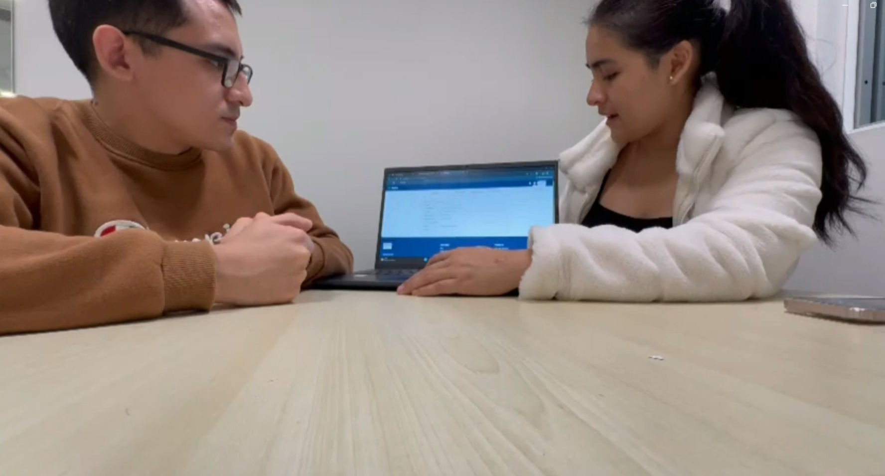
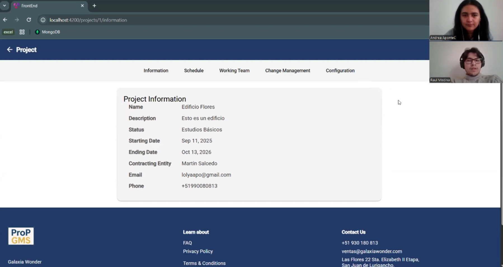
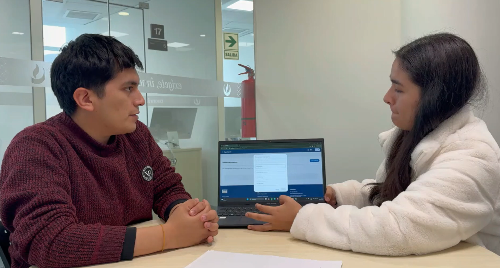
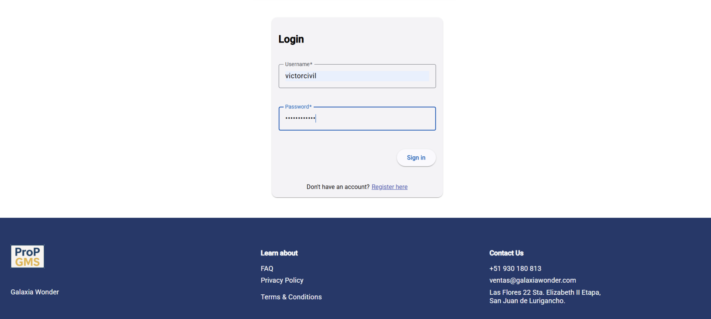
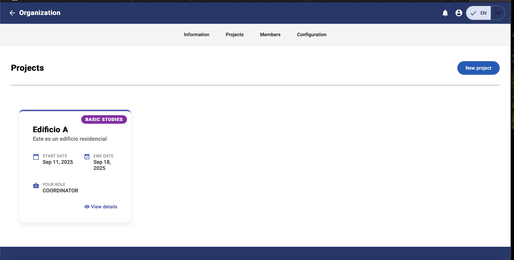

<<<<<<< Updated upstream
=======
<<<<<<< Updated upstream
## 5.3. Validation Interviews
=======
>>>>>>> Stashed changes
## 5.3. Validation Interviews

Dentro de la sección "Validation Interviews" de nuestro proyecto, dirigimos nuestros esfuerzos a perfeccionar la plataforma web diseñada para la planificación y gestión de proyectos en el ámbito de la ingeniería civil. Esta etapa resulta esencial para comprender mejor las dinámicas del trabajo en obra, por lo que establece un canal de comunicación cercano con los usuarios clave: contratistas, especialistas y clientes. Mediante entrevistas de validación, buscamos recoger sus opiniones, necesidades y recomendaciones, de modo que la herramienta digital vaya sintonía con su realidad. Lo mencionado ayudará a que la solución no solo cumpla con los estándares técnicos, sino que también reuna las condiciones reales del trabajo y las expectativas de los usuarios involucrados.

### 5.3.1. Diseño de entrevistas

En este apartado se exponen las metas de usuarios en concordancia con nuestras entrevistas. Estos user goals nos permiten comprender mejor las prioridades y expectativas de los usuarios, asegurando que la plataforma refleje fielmente su forma de trabajar en proyectos de la vida real.

**User Goals**

**User Goal: Iniciar sesión**  
**User persona:** Contratistas, especialistas y clientes.  
**Flujo:** El usuario accede a la aplicación desplegada y visualiza un formulario que le solicita su nombre de usuario y contraseña. Una vez que el sistema valida correctamente las credenciales, le concede acceso y lo redirige a su dashboard principal, donde se muestran las funcionalidades correspondientes a su rol. En caso contrario, permanece en la pantalla de inicio de sesión y se le indica que vuelva a ingresar sus datos.

**User Goal: Navegar por el dashboard principal**  
**User persona:** Contratistas y especialistas.  
**Flujo:** Tras iniciar sesión, el usuario es dirigido automáticamente al dashboard principal de la organización. Esta pantalla incluye distintas secciones que le facilitan el trabajo: la sección “Información” proporciona detalles generales sobre la organización a la que pertenece; la sección “Proyectos” le permite visualizar el listado completo de proyectos activos; la sección “Miembros” le muestra la lista de integrantes, junto con la posibilidad de invitar nuevos miembros en caso de que tenga perfil de contratista; y la sección “Configuración” le brinda acceso a las opciones para modificar los datos legales y comerciales de la organización.

**User Goal: Crear una organización**  
**User persona:** Contratistas.  
**Flujo:** El usuario accede a la sección “Organizaciones”, donde puede registrar una nueva entidad. La plataforma le ofrece un formulario que solicita el nombre legal, el nombre comercial y el número de RUC. Una vez que se validan estos datos, la nueva organización queda automáticamente registrada y visible en el listado para su consulta y gestión posterior.

**User Goal: Crear un proyecto**  
**User persona:** Contratistas.  
**Flujo:** Al ingresar a una organización, el usuario accede a la sección “Proyectos”, donde dispone de una opción para registrar un nuevo proyecto. La plataforma le presenta un formulario para completar el nombre del proyecto, la descripción del mismo, el cliente al que está asociado y las fechas de inicio y fin. Una vez que los datos son validados y la creación queda confirmada, el proyecto se incluye automáticamente en la lista y queda disponible para su consulta y gestión.

**User Goal: Crear cambios**  
**User persona:** Clientes.  
**Flujo:** Desde la vista del cliente, el usuario ingresa a la sección “Proyecto”, donde dispone de una opción para registrar un cambio. La plataforma presenta un formulario en el que es necesario describir el nombre del cambio y su motivo en el campo de descripción. Una vez que la información es completada, el cambio queda listo para ser enviado al contratista responsable del proyecto para su revisión y posterior solución.

**User Goal: Registrar miembros**  
**User persona:** Contratistas.  
**Flujo:** Desde una organización o proyecto, el usuario accede a la sección “Miembros”, donde dispone de una opción para incorporar nuevos integrantes. La plataforma le presenta un formulario que requiere el correo electrónico y el rol asignado. Una vez que la información es validada y la invitación queda confirmada, el nuevo miembro se incluye automáticamente en la lista de participantes.

**User Goal: Ver organizaciones**  
**User persona:** Contratistas, especialistas.  
**Flujo:** Una vez en el dashboard, el usuario ingresa a la sección “Organizaciones”, donde dispone del listado completo de las organizaciones asociadas a su cuenta. La plataforma le permite seleccionar cualquiera de ellas para consultar la vista detallada.

**User Goal: Ver proyectos**  
**User persona:** Contratistas, especialistas y clientes.  
**Flujo:** Desde el dashboard o dentro de una organización específica, el usuario accede a la sección “Proyectos”, donde dispone del listado completo de proyectos activos. La plataforma le permite seleccionar cualquiera de ellos para consultar su vista detallada, que incluye las secciones “Información”, “Cronograma”, “Equipo de trabajo”, “Gestión de cambios” y “Configuración”, disponibles según el rol que tenga el usuario.

**User Goal: Crear hitos y tareas**  
**User persona:** Contratistas y especialistas.  
**Flujo:** Al ingresar a un proyecto, el usuario accede a la sección “Cronograma”, donde dispone de las opciones para registrar un nuevo hito y una nueva tarea. La plataforma le presenta un formulario que incluye campos para asignar un responsable (y, si corresponde, su especialidad), definir el nombre y la descripción, establecer las fechas de inicio y fin, y seleccionar el estado actual. Una vez que la información es validada y confirmada, el hito o tarea queda registrado, visible para todo el equipo y listo para que la persona asignada pueda resolver la tarea cuando corresponda.

### 5.3.2. Registro de entrevistas

<table style="
          width: 100%;
          border-collapse: collapse;
          font-family: Arial, sans-serif;
          margin-bottom: 40px;">
  <thead>
    <tr>
      <th style="
            text-align: left;
            padding: 12px;
            background-color: #f0f0f0;
            font-size: 22px;"><strong>SEGMENTO OBJETIVO: CONTRATISTA</strong></th>
      <th style="
            text-align: left;
            padding: 12px;
            background-color: #f0f0f0;
            font-size: 22px;"><strong>#1</strong></th>
    </tr>
  </thead>
  <tbody>
    <tr>
      <td colspan="2" style="padding: 0; vertical-align: top; background-color: #fff border-top: 1px solid #ddd;" style="padding: 0; vertical-align: top; background-color: #fff border-top: 1px solid #ddd;">
        

          

            
Datos generales

            <ul style="margin: 0; padding-left: 20px; list-style-type: disc; font-size: 1.05em; line-height: 1.7; color: #333;">
              <li><strong>Nombres:</strong> William Martín</li>
              <li><strong>Apellidos:</strong> Salcedo Vásquez</li>
              <li><strong>Edad:</strong> 57</li>
              <li><strong>Distrito:</strong> San Juan de Lurigancho</li>
              <li><strong>URL Entrevista:</strong> <a href="https://upcedupe-my.sharepoint.com/:v:/g/personal/u202224135_upc_edu_pe/EcevWNDfG6dBnrGYQPSWrzEB4IRn6nz58E08LabLr1X9UA?e=ntuur9&nav=eyJyZWZlcnJhbEluZm8iOnsicmVmZXJyYWxBcHAiOiJTdHJlYW1XZWJBcHAiLCJyZWZlcnJhbFZpZXciOiJTaGFyZURpYWxvZy1MaW5rIiwicmVmZXJyYWxBcHBQbGF0Zm9ybSI6IldlYiIsInJlZmVycmFsTW9kZSI6InZpZXcifX0%3D" target="_blank">Ver video</a></li>
              <li><strong>Timestamp:</strong> 00:00</li>
              <li><strong>Duración:</strong> 05:40</li>
            </ul>
          

          
        

      </td>
    </tr>
    <tr>
      <td colspan="2" style="padding: 0; vertical-align: top; background-color: #fff border-top: 1px solid #ddd;">
        

          
Resumen

          <ul style="padding-left: 20px; list-style-type: disc; color: #333; font-size: 1em; margin: 0;">
            <li><strong>Personalidad:</strong> Guardian.
              </ul>
            </li>
              </ul>
            <ul style="margin: 0; padding: 24px; list-style-type: disc; color: #333; font-size: 1em; line-height: 1.7;">
              <li><strong>Análisis:</strong> Durante la entrevista de validación, William Salcedo, autenticado como la entidad contratante, evaluó la plataforma y destacó que la interfaz le resultó amigable y sencilla de comprender. Asimismo, valoró que el flujo de trabajo estuviera bien organizado y fuera fácil de seguir, en línea con el User Goal: Iniciar sesión y el User Goal: Navegar por el dashboard principal, que le brindan una experiencia ordenada y coherente. Sin embargo, sugirió dos mejoras clave para optimizar su experiencia: la incorporación de un sistema de notificaciones que le permita enterarse en tiempo real (vía correo electrónico registrado) sobre nuevos cambios o actualizaciones que involucren su rol, y la posibilidad de visualizar y gestionar los diferentes estados del proyecto que actualmente no se muestran en la plataforma.</li>
            </ul>
            </li>
          </ul>
        

      </td>
    </tr>
  </tbody>
</table>

<table class="tabla-entrevista">
  <thead>
    <tr>
      <th style="
            text-align: left;
            padding: 12px;
            background-color: #f0f0f0;
            font-size: 22px;"><strong>SEGMENTO OBJETIVO: CONTRATISTA</strong></th>
      <th><strong>#2</strong></th>
    </tr>
  </thead>
  <tbody>
    <tr>
      <td colspan="2" style="padding: 0; vertical-align: top; background-color: #fff border-top: 1px solid #ddd;">
        

          

            
Datos generales

            <ul style="margin: 0; padding-left: 20px; list-style-type: disc; font-size: 1.05em; line-height: 1.7; color: #333;">
              <li><strong>Nombres:</strong> Raúl Fernando</li>
              <li><strong>Apellidos:</strong> Reaño García</li>
              <li><strong>Edad:</strong> 56</li>
              <li><strong>Distrito:</strong> San Juan de Lurigancho</li>
              <li><strong>URL Entrevista:</strong> <a href="https://upcedupe-my.sharepoint.com/:v:/g/personal/u202224135_upc_edu_pe/EcevWNDfG6dBnrGYQPSWrzEB4IRn6nz58E08LabLr1X9UA?e=ntuur9&nav=eyJyZWZlcnJhbEluZm8iOnsicmVmZXJyYWxBcHAiOiJTdHJlYW1XZWJBcHAiLCJyZWZlcnJhbFZpZXciOiJTaGFyZURpYWxvZy1MaW5rIiwicmVmZXJyYWxBcHBQbGF0Zm9ybSI6IldlYiIsInJlZmVycmFsTW9kZSI6InZpZXcifX0%3D" target="_blank">Ver video</a></li>
              <li><strong>Timestamp:</strong> 05:51</li>
              <li><strong>Duración:</strong> 11:06</li>
            </ul>
          

          
        

      </td>
    </tr>
    <tr>
      <td colspan="2" style="padding: 0; vertical-align: top; background-color: #fff border-top: 1px solid #ddd;">
        

          
Resumen

          <ul style="padding-left: 20px; list-style-type: disc; color: #333; font-size: 1em; margin: 0;">
            <li><strong>Personalidad:</strong> Guardián. 
              </ul>
            </li>
          </ul>
          <ul style="margin: 0; padding: 24px; list-style-type: disc; color: #333; font-size: 1em; line-height: 1.7;">
            <li><strong>Análisis:</strong> Durante la entrevista de validación, Raúl Reaño, en su rol de contratista, se sintió bastante conforme con la plataforma y destacó que la estructura le resultaba clara y funcional. Asimismo, valoró positivamente la internacionalización y consideró que el cronograma debería dividirse en dos partes: cronograma de trabajo y avance de proyecto. En la vista de avance, sugirió que se pudieran incluir precios, valorizaciones y estimaciones económicas relacionadas con los hitos, para que el progreso del proyecto sea más completo y transparente. Finalmente, comentó que la paleta de colores es sencilla y práctica, facilitando su uso e interpretación.</li>
          </ul>  
        

      </td>
    </tr>
  </tbody>
</table>

<table class="tabla-entrevista">
  <thead>
    <tr>
      <th style="
            text-align: left;
            padding: 12px;
            background-color: #f0f0f0;
            font-size: 22px;"><strong>SEGMENTO OBJETIVO: CONTRATISTA</strong></th>
      <th><strong>#3</strong></th>
    </tr>
  </thead>
  <tbody>
    <tr>
      <td colspan="2" style="padding: 0; vertical-align: top; background-color: #fff border-top: 1px solid #ddd;">
        

          

            
Datos generales

            <ul style="margin: 0; padding-left: 20px; list-style-type: disc; font-size: 1.05em; line-height: 1.7; color: #333;">
              <li><strong>Nombres:</strong> Victor Manuel</li>
              <li><strong>Apellidos:</strong> León Reyes</li>
              <li><strong>Edad:</strong> 52</li>
              <li><strong>Distrito:</strong> San Borja</li>
              <li><strong>URL Entrevista:</strong> <a href="https://upcedupe-my.sharepoint.com/:v:/g/personal/u202224135_upc_edu_pe/EcevWNDfG6dBnrGYQPSWrzEB4IRn6nz58E08LabLr1X9UA?e=ntuur9&nav=eyJyZWZlcnJhbEluZm8iOnsicmVmZXJyYWxBcHAiOiJTdHJlYW1XZWJBcHAiLCJyZWZlcnJhbFZpZXciOiJTaGFyZURpYWxvZy1MaW5rIiwicmVmZXJyYWxBcHBQbGF0Zm9ybSI6IldlYiIsInJlZmVycmFsTW9kZSI6InZpZXcifX0%3D" target="_blank">Ver video</a></li>
              <li><strong>Timestamp:</strong> 11:07</li>
              <li><strong>Duración:</strong> 16:54</li>
            </ul>
          

          
        

      </td>
    </tr>
    <tr>
      <td colspan="2" style="padding: 0; vertical-align: top; background-color: #fff border-top: 1px solid #ddd;">
        

          
Resumen

          <ul style="padding-left: 20px; list-style-type: disc; color: #333; font-size: 1em; margin: 0;">
            <li><strong>Personalidad:</strong> Guardián.
              </ul>
            <ul style="margin: 0; padding: 24px; list-style-type: disc; color: #333; font-size: 1em; line-height: 1.7;">
                <li><strong>Análisis:</strong> Durante la entrevista de validación, Victor León, en su rol de contratista, comentó que la plataforma le resultó muy intuitiva y sencilla de comprender, sin necesidad de conocimientos expertos para su uso. Destacó que las etapas y fases del proyecto se muestran claramente en el dashboard, facilitando mantener el orden en todo momento. Asimismo, alineado con el User Goal: Registrar cambios y el User Goal: Navegar por el dashboard principal, sugirió implementar más validaciones o respaldos cuando se realiza una solicitud de cambio. Consideró que debería existir algún mecanismo contractual que le otorgue mayor formalidad y legalidad a la modificación, evitando problemas futuros entre las partes.</li>
              </ul>
            </li>
          </ul>
        

      </td>
    </tr>
  </tbody>
</table>

<table class="tabla-entrevista">
  <thead>
    <tr>
      <th style="
            text-align: left;
            padding: 12px;
            background-color: #f0f0f0;
            font-size: 22px;"><strong>SEGMENTO OBJETIVO: ESPECIALISTA</strong></th>
      <th><strong>#1</strong></th>
    </tr>
  </thead>
  <tbody>
    <tr>
      <td colspan="2" style="padding: 0; vertical-align: top; background-color: #fff border-top: 1px solid #ddd;">
        

          

            
Datos generales

            <ul style="margin: 0; padding-left: 20px; list-style-type: disc; font-size: 1.05em; line-height: 1.7; color: #333;">
              <li><strong>Nombres:</strong> Victor Otto</li>
              <li><strong>Apellidos:</strong> Reinoso Diaz</li>
              <li><strong>Edad:</strong> 26</li>
              <li><strong>Distrito:</strong> La Molina</li>
              <li><strong>URL Entrevista:</strong> <a href="https://upcedupe-my.sharepoint.com/:v:/g/personal/u202224135_upc_edu_pe/EcevWNDfG6dBnrGYQPSWrzEB4IRn6nz58E08LabLr1X9UA?e=ntuur9&nav=eyJyZWZlcnJhbEluZm8iOnsicmVmZXJyYWxBcHAiOiJTdHJlYW1XZWJBcHAiLCJyZWZlcnJhbFZpZXciOiJTaGFyZURpYWxvZy1MaW5rIiwicmVmZXJyYWxBcHBQbGF0Zm9ybSI6IldlYiIsInJlZmVycmFsTW9kZSI6InZpZXcifX0%3D" target="_blank">Ver video</a></li>
              <li><strong>Timestamp:</strong> 16:55</li>
              <li><strong>Duración:</strong> 21:59</li>
            </ul>
          

          
        

      </td>
    </tr>
    <tr>
      <td colspan="2" style="padding: 0; vertical-align: top; background-color: #fff border-top: 1px solid #ddd;">
        

          
Resumen

          <ul style="padding-left: 20px; list-style-type: disc; color: #333; font-size: 1em; margin: 0;">
            <li><strong>Personalidad:</strong> Racional. 
              </ul>
            </li>
          </ul>
            <ul style="margin: 0; padding: 24px; list-style-type: disc; color: #333; font-size: 1em; line-height: 1.7;">
                <li><strong>Análisis:</strong> Durante la entrevista de validación, Victor Reinoso, en su rol de especialista, comentó que la plataforma es funcional, pero que los colores actuales son demasiado intensos y las letras en gris tienden a opacar la visión del contenido. Asimismo, sugirió que sería recomendable eliminar algunas vistas que podrían resultar confusas o redundantes para el usuario, alineándose con el User Goal: Navegar por el dashboard principal y el User Goal: Ver proyectos, con el fin de que la experiencia sea más clara y sencilla. Por último, mencionó que, desde la perspectiva del modelo de negocio, la herramienta es adecuada y cumple con su propósito principal.</li>
              </ul>
        

      </td>
    </tr>
  </tbody>
</table>

<table class="tabla-entrevista">
  <thead>
    <tr>
      <th style="
            text-align: left;
            padding: 12px;
            background-color: #f0f0f0;
            font-size: 22px;"><strong>SEGMENTO OBJETIVO: ESPECIALISTA</strong></th>
      <th><strong>#2</strong></th>
    </tr>
  </thead>
  <tbody>
    <tr>
      <td colspan="2" style="padding: 0; vertical-align: top; background-color: #fff border-top: 1px solid #ddd;">
        

          

            
Datos generales

            <ul style="margin: 0; padding-left: 20px; list-style-type: disc; font-size: 1.05em; line-height: 1.7; color: #333;">
              <li><strong>Nombres:</strong> Jorge Raúl</li>
              <li><strong>Apellidos:</strong> García Torres</li>
              <li><strong>Edad:</strong> 27</li>
              <li><strong>Distrito:</strong> San Miguel</li>
              <li><strong>URL Entrevista:</strong> <a href="https://upcedupe-my.sharepoint.com/:v:/g/personal/u202224135_upc_edu_pe/EcevWNDfG6dBnrGYQPSWrzEB4IRn6nz58E08LabLr1X9UA?e=ntuur9&nav=eyJyZWZlcnJhbEluZm8iOnsicmVmZXJyYWxBcHAiOiJTdHJlYW1XZWJBcHAiLCJyZWZlcnJhbFZpZXciOiJTaGFyZURpYWxvZy1MaW5rIiwicmVmZXJyYWxBcHBQbGF0Zm9ybSI6IldlYiIsInJlZmVycmFsTW9kZSI6InZpZXcifX0%3D" target="_blank">Ver video</a></li>
              <li><strong>Timestamp:</strong> 22:00</li>
              <li><strong>Duración:</strong> 27:22</li>
            </ul>
          

          
        

      </td>
    </tr>
    <tr>
      <td colspan="2" style="padding: 0; vertical-align: top; background-color: #fff border-top: 1px solid #ddd;">
        

          
Resumen

          <ul style="padding-left: 20px; list-style-type: disc; color: #333; font-size: 1em; margin: 0;">
            <li><strong>Personalidad:</strong> Guardián. 
              </ul>
            </li>
          </ul>
            <ul style="margin: 0; padding: 24px; list-style-type: disc; color: #333; font-size: 1em; line-height: 1.7;">
                <li><strong>Análisis:</strong> Durante la entrevista de validación, Jorge, en su rol de especialista, mencionó que la plataforma es bastante clara y que la presentación visual lo invita a seguir explorando. Asimismo, destacó que la información que se le muestra está bien adaptada a su rol como ingeniero, facilitando el acceso a su equipo de trabajo y a los proyectos que le corresponden, en línea con el User Goal: Navegar por el dashboard principal y el User Goal: Ver proyectos. Por último, comentó que la paleta de colores es adecuada y contribuye a que la experiencia sea sencilla y atractiva.</li>
              </ul>
        

      </td>
    </tr>
  </tbody>
</table>

<table class="tabla-entrevista">
  <thead>
    <tr>
      <th style="
            text-align: left;
            padding: 12px;
            background-color: #f0f0f0;
            font-size: 22px;"><strong>SEGMENTO OBJETIVO: ESPECIALISTA</strong></th>
      <th><strong>#3</strong></th>
    </tr>
  </thead>
  <tbody>
    <tr>
      <td colspan="2" style="padding: 0; vertical-align: top; background-color: #fff border-top: 1px solid #ddd;">
        

          

            
Datos generales

            <ul style="margin: 0; padding-left: 20px; list-style-type: disc; font-size: 1.05em; line-height: 1.7; color: #333;">
              <li><strong>Nombres:</strong> Raúl Eduardo</li>
              <li><strong>Apellidos:</strong> Medina Fernandez</li>
              <li><strong>Edad:</strong> 30</li>
              <li><strong>Distrito:</strong> Surquillo</li>
              <li><strong>URL Entrevista:</strong> <a href="https://upcedupe-my.sharepoint.com/:v:/g/personal/u202224135_upc_edu_pe/EcevWNDfG6dBnrGYQPSWrzEB4IRn6nz58E08LabLr1X9UA?e=ntuur9&nav=eyJyZWZlcnJhbEluZm8iOnsicmVmZXJyYWxBcHAiOiJTdHJlYW1XZWJBcHAiLCJyZWZlcnJhbFZpZXciOiJTaGFyZURpYWxvZy1MaW5rIiwicmVmZXJyYWxBcHBQbGF0Zm9ybSI6IldlYiIsInJlZmVycmFsTW9kZSI6InZpZXcifX0%3D" target="_blank">Ver video</a></li>
              <li><strong>Timestamp:</strong> 27:23</li>
              <li><strong>Duración:</strong> 32:53</li>
            </ul>
          

          
        

      </td>
    </tr>
    <tr>
      <td colspan="2" style="padding: 0; vertical-align: top; background-color: #fff border-top: 1px solid #ddd;">
        

          
Resumen

          <ul style="padding-left: 20px; list-style-type: disc; color: #333; font-size: 1em; margin: 0;">
            <li><strong>Personalidad:</strong> Guardián. 
              </ul>
            </li>
          </ul>
            <ul style="margin: 0; padding: 24px; list-style-type: disc; color: #333; font-size: 1em; line-height: 1.7;">
                <li><strong>Análisis:</strong> Durante la entrevista de validación, Raúl, en su rol de especialista, destacó que la plataforma le pareció muy clara y sencilla, con una ruta de navegación bien definida y fácil de comprender. También mencionó que los colores elegidos resultan agradables y transmiten una sensación profesional, logrando una experiencia visualmente armoniosa desde el primer ingreso sin necesidad de asistencia externa. Este feedback se alinea con el User Goal: Iniciar sesión y el User Goal: Navegar por el dashboard principal, que buscan ofrecer a los usuarios una interacción intuitiva, ordenada y que inspire confianza.</li>
              </ul>
        

      </td>
    </tr>
  </tbody>
</table>

<table class="tabla-entrevista">
  <thead>
    <tr>
      <th style="
            text-align: left;
            padding: 12px;
            background-color: #f0f0f0;
            font-size: 22px;"><strong>SEGMENTO OBJETIVO: ENTIDAD CONTRATANTE</strong></th>
      <th><strong>#1</strong></th>
    </tr>
  </thead>
  <tbody>
    <tr>
      <td colspan="2" style="padding: 0; vertical-align: top; background-color: #fff border-top: 1px solid #ddd;">
        

          

            
Datos generales

            <ul style="margin: 0; padding-left: 20px; list-style-type: disc; font-size: 1.05em; line-height: 1.7; color: #333;">
              <li><strong>Nombres:</strong> Leonardo Jesús </li>
              <li><strong>Apellidos:</strong> Caballa Huamán </li>
              <li><strong>Edad:</strong> 28</li>
              <li><strong>Distrito:</strong> Jesús María</li>
              <li><strong>URL Entrevista:</strong> <a href="https://upcedupe-my.sharepoint.com/:v:/g/personal/u202224135_upc_edu_pe/EcevWNDfG6dBnrGYQPSWrzEB4IRn6nz58E08LabLr1X9UA?e=ntuur9&nav=eyJyZWZlcnJhbEluZm8iOnsicmVmZXJyYWxBcHAiOiJTdHJlYW1XZWJBcHAiLCJyZWZlcnJhbFZpZXciOiJTaGFyZURpYWxvZy1MaW5rIiwicmVmZXJyYWxBcHBQbGF0Zm9ybSI6IldlYiIsInJlZmVycmFsTW9kZSI6InZpZXcifX0%3D" target="_blank">Ver video</a></li>
              <li><strong>Timestamp:</strong> 32:54</li>
              <li><strong>Duración:</strong> 37:59</li>
            </ul>
          

          
        

      </td>
    </tr>
    <tr>
      <td colspan="2" style="padding: 0; vertical-align: top; background-color: #fff border-top: 1px solid #ddd;">
        

          
Resumen

          <ul style="padding-left: 20px; list-style-type: disc; color: #333; font-size: 1em; margin: 0;">
            <li><strong>Personalidad:</strong> Idealista. 
              </ul>
            </li>
          </ul>
             <ul style="margin: 0; padding: 24px; list-style-type: disc; color: #333; font-size: 1em; line-height: 1.7;">
                <li><strong>Análisis:</strong> Durante la entrevista de validación, Leonardo, en su rol de cliente, mencionó que es consciente de que las personas pueden cambiar de idea y que el User Goal: Registrar cambios le parece muy adecuado para cómo funciona un proyecto. Asimismo, comentó que el esquema de colores es neutral y que sería interesante diferenciar visualmente cada sección con tonalidades propias, manteniendo un ruteo de vistas bien organizado y fácil de comprender. Por último, sugirió integrar una comunicación directa con el contratista que le permita pedir fotos o adjuntar documentos cuando solicite cambios, lo que se asocia a los User Goals: Registrar cambios y Ver proyectos, ya que mejora la transparencia y la colaboración entre las partes involucradas.</li>
              </ul>
        

      </td>
    </tr>
  </tbody>
</table>

<table class="tabla-entrevista">
  <thead>
    <tr>
      <th style="
            text-align: left;
            padding: 12px;
            background-color: #f0f0f0;
            font-size: 22px;"><strong>SEGMENTO OBJETIVO: ENTIDAD CONTRATANTE</strong></th>
      <th><strong>#2</strong></th>
    </tr>
  </thead>
  <tbody>
    <tr>
      <td colspan="2" style="padding: 0; vertical-align: top; background-color: #fff border-top: 1px solid #ddd;">
        

          

            
Datos generales

            <ul style="margin: 0; padding-left: 20px; list-style-type: disc; font-size: 1.05em; line-height: 1.7; color: #333;">
              <li><strong>Nombres:</strong> Alvaro Martin</li>
              <li><strong>Apellidos:</strong> Torres Huamaní </li>
              <li><strong>Edad:</strong> 27</li>
              <li><strong>Distrito:</strong> San Juan de Lurigancho</li>
              <li><strong>URL Entrevista:</strong> <a href="https://upcedupe-my.sharepoint.com/:v:/g/personal/u202224135_upc_edu_pe/EcevWNDfG6dBnrGYQPSWrzEB4IRn6nz58E08LabLr1X9UA?e=ntuur9&nav=eyJyZWZlcnJhbEluZm8iOnsicmVmZXJyYWxBcHAiOiJTdHJlYW1XZWJBcHAiLCJyZWZlcnJhbFZpZXciOiJTaGFyZURpYWxvZy1MaW5rIiwicmVmZXJyYWxBcHBQbGF0Zm9ybSI6IldlYiIsInJlZmVycmFsTW9kZSI6InZpZXcifX0%3D" target="_blank">Ver video</a></li>
              <li><strong>Timestamp:</strong> 38:00</li>
              <li><strong>Duración:</strong> 42:49</li>
            </ul>
          

          
        

      </td>
    </tr>
    <tr>
      <td colspan="2" style="padding: 0; vertical-align: top; background-color: #fff border-top: 1px solid #ddd;">
        

          
Resumen

          <ul style="padding-left: 20px; list-style-type: disc; color: #333; font-size: 1em; margin: 0;">
            <li><strong>Personalidad:</strong> Idealista. 
              </ul>
            </li>
          </ul>
            <ul style="margin: 0; padding: 24px; list-style-type: disc; color: #333; font-size: 1em; line-height: 1.7;">
            <li><strong>Análisis:</strong> Durante la entrevista de validación, Álvaro, en su rol de cliente, destacó que la opción de internacionalización le pareció muy útil y bien lograda para usuarios de diferentes idiomas. También mencionó que el campo para registrar el número telefónico debería estar mejor implementado en el registro, ya que no queda claro qué tipo de número se espera, mejorando así el User Goal: Iniciar sesión y el User Goal: Ver proyecto. Por último, sugirió que una notificación visual en la campanita que confirme si un cambio solicitado ha sido aprobado o desaprobado sería muy útil, lo cual está alineado con el User Goal: Registrar cambios y aporta mayor transparencia y control al proceso.</li>
              </ul>
        

      </td>
    </tr>
  </tbody>
</table>

<table class="tabla-entrevista">
  <thead>
    <tr>
      <th style="
            text-align: left;
            padding: 12px;
            background-color: #f0f0f0;
            font-size: 22px;"><strong>SEGMENTO OBJETIVO: ENTIDAD CONTRATANTE</strong></th>
      <th><strong>#3</strong></th>
    </tr>
  </thead>
  <tbody>
    <tr>
      <td colspan="2" style="padding: 0; vertical-align: top; background-color: #fff border-top: 1px solid #ddd;">
        

          

            
Datos generales

            <ul style="margin: 0; padding-left: 20px; list-style-type: disc; font-size: 1.05em; line-height: 1.7; color: #333;">
              <li><strong>Nombres:</strong> Aaron Patrick</li>
              <li><strong>Apellidos:</strong> Ravines Diaz</li>
              <li><strong>Edad:</strong> 27</li>
              <li><strong>Distrito:</strong> San Borja</li>
              <li><strong>URL Entrevista:</strong> <a href="https://upcedupe-my.sharepoint.com/:v:/g/personal/u202224135_upc_edu_pe/EcevWNDfG6dBnrGYQPSWrzEB4IRn6nz58E08LabLr1X9UA?e=ntuur9&nav=eyJyZWZlcnJhbEluZm8iOnsicmVmZXJyYWxBcHAiOiJTdHJlYW1XZWJBcHAiLCJyZWZlcnJhbFZpZXciOiJTaGFyZURpYWxvZy1MaW5rIiwicmVmZXJyYWxBcHBQbGF0Zm9ybSI6IldlYiIsInJlZmVycmFsTW9kZSI6InZpZXcifX0%3D" target="_blank">Ver video</a></li>
              <li><strong>Timestamp:</strong> 42:50</li>
              <li><strong>Duración:</strong> 48:16</li>
            </ul>
          

          
        

      </td>
    </tr>
    <tr>
      <td colspan="2" style="padding: 0; vertical-align: top; background-color: #fff border-top: 1px solid #ddd;">
        

          
Resumen

          <ul style="padding-left: 20px; list-style-type: disc; color: #333; font-size: 1em; margin: 0;">
            <li><strong>Personalidad:</strong> Idealista. 
              </ul>
            </li>
          </ul>
            <ul style="margin: 0; padding: 24px; list-style-type: disc; color: #333; font-size: 1em; line-height: 1.7;">
                <li><strong>Análisis:</strong> Durante la entrevista de validación, Aaron, en su rol de cliente, mencionó que el proceso le pareció correcto y que no ha sido difícil interactuar con la interfaz, destacando que los colores elegidos transmiten tranquilidad y que todo está bien organizado. Esta facilidad de uso y comodidad al navegar por la plataforma está alineada con el User Goal: Ver Proyecto, ya que le ha permitido comprender y moverse por las distintas secciones sin complicaciones.</li>
              </ul>
        

      </td>
    </tr>
  </tbody>
</table>

<<<<<<< Updated upstream
### 5.3.3. Análisis de entrevistas
=======
### Análisis de entrevistas
>>>>>>> Stashed changes

**CONTRATISTAS**

**1. Resumen:** Este segmento agrupa a clientes entre 52 y 57 años que han acumulado experiencia y estabilidad profesional a lo largo de su carrera. Por lo general, buscan materializar proyectos grandes en el ámbito privado como público. Valoran la transparencia, el seguimiento detallado del avance de obra y el cumplimiento estricto de tiempos y presupuestos, asegurándose de que el resultado final sea funcional, duradero y alineado con su visión.

**2. Edad:** Las edades de los entrevistados de este segmento varían desde los 52 hasta los 57 años de edad. Se toma como edad representativa la media aritmética de los datos.

| Entrevistado | Victor León | Raúl Reaño | William Salcedo | Valor representativo |
|-|-|-|-|-|
| **Edad** | 52 | 56 | 57 | 55 |

**3. Personalidad:** La totalidad de los entrevistados (100%) se alínean al arquetipo de personalidad *Guardián*, debido a su respeto irrestricto y meticuloso de las normas y acuerdos. Se toma este arquetipo de personalidad como representativo.

| Entrevistado | Victor León | Raúl Reaño | William Salcedo | Valor representativo |
|-|-|-|-|-|
| **Personalidad** | Guardián | Guardián | Guardián | Guardián |

**ESPECIALISTA DE ÁREA**

**1. Resumen:** Los especialistas de área son en su mayoría varones adultos entre los 26 y 30 años, con formación en Ingeniería Civil y experiencia desarrollada dentro de una especialidad técnica. Muchos de ellos llegaron a su posición actual a través de la práctica profesional en empresas del rubro, aunque algunas áreas, como TI, requieren formación específica. Son personas estructuradas, con un fuerte apego a las normas y procesos establecidos, lo que les permite mantener el orden en sus funciones. Sin embargo, enfrentan ciertas dificultades en la comunicación con otras especialidades, influenciadas por la rigidez de las estructuras organizacionales en las que trabajan.

**2. Edad:** Las edades de los entrevistados de este segmento varían desde los 26 hasta los 30 años de edad. Se toma como edad representativa la media aritmética de los datos.

| Entrevistado | Victor Reinoso | Jorge Garcia | Raul Medina | Valor representativo |
|-|-|-|-|-|
| **Edad** | 26 | 27 | 30 | 28 |

**3. Personalidad:** La gran mayoría de los entrevistados (100%) se alínean al arquetipo de personalidad *Guardián*, mientras que la menor parte (33.3%) refleja una personalidad de tipo *Racional*. Se toma el arquetipo *Guardián* como representativo.

| Entrevistado | Victor Reinoso | Jorge Garcia | Raul Medina | Valor representativo |
|-|-|-|-|-|
| **Personalidad** | Racional | Guardián | Guardián | Guardián |

**ENTIDAD CONTRATANTE**

**1. Resumen:** Los clientes (formalmente llamados "La Entidad Contratante") son predominantemente varones adultos jóvenes entre los 27 y 28 años de edad, con entre 1 y 3 años de experiencia laboral. Se destacan por ser ambiciosos y estratégicos, pensar bien las cosas y tener mucho cuidado de que “todo marche de acuerdo al plan”. Buscan los servicios de consultoría principalmente para la planificación de su primera vivienda a futuro. Sus principales preocupaciones son el cumplimiento de plazos y la satisfacción de sus expectativas.

**2. Edad:** Las edades de los entrevistados de este segmento varían desde los 27 hasta los 28 años de edad. Se toma como edad representativa la media aritmética de los datos.

| Entrevistado | Leonardo Caballa | Álvaro Torres | Aaron Ravines | Valor representativo |
|-|-|-|-|-|
| **Edad** | 28 | 27 | 27 | 27 |

**3. Personalidad:** La totalidad de los entrevistados (100%) se alínean al arquetipo de personalidad *Idealista*, debido a que reflejan un alto grado de meticulosidad, cuidado y respeto a la ley de por medio a lograr sus objetivos personales.

| Entrevistado | Leonardo Caballa | Álvaro Torres | Aaron Ravines | Valor representativo |
|-|-|-|-|-|
| **Edad** | 28 | 27 | 27 | 27 |
<<<<<<< Updated upstream
=======

## 5.3.3 UX Heuristics & Principles Evaluation  
**Usability – Inclusive Design – Information Architecture**

**CARRERA**  : Ingeniería de Software  
**CURSO**    : Desarollo de aplicaciones Open Source 
**SECCIÓN**  : 4307
**PROFESORES**: Todos  
**AUDITOR**  : Entrevistados  
**CLIENTE(S)**: Andrea Aponte, Fabrizio León, Mario Lopez, Álvaro Orozco y Henry Reaño

##### SITE o APP A EVALUAR:  
PropGMS

##### TAREAS A EVALUAR:  
1. Registro de un usuario nuevo
2. Creación de una organización
3. Configuración de una organización
4. Invitación de una organización
5. Aceptar invitación de una organización
6. Rechazar invitación de una organización

No estan incluidas en esta versión de la evaluación las siguientes tareas:
1. Creación de un proyecto
2. Configuración de un proyecto
3. Gestionar equipo de un proyecto
4. Crear tarea
5. Crear reunión
6. Asignar responsables a tareas

##### ESCALA DE SEVERIDAD:

Los errores serán puntuados tomando en cuenta la siguiente escala de severidad

| Nivel | Descripción |
|-------|-------------|
| 1     | Problema superficial: puede ser fácilmente superado por el usuario o ocurre con muy poco frecuencia. No necesita ser arreglado a no ser que exista disponibilidad de tiempo. |
| 2     | Problema menor: puede ocurrir un poco más frecuentemente o es un poco más difícil de superar para el usuario. Se le debería asignar una prioridad baja resolverlo de cara al siguiente release. |
| 3     | Problema mayor: ocurre frecuentemente o los usuarios no son capaces de resolverlos. Es importante que sean corregidos y se les debe asignar una prioridad alta. |
| 4     | Problema muy grave: un error de gran impacto que impide al usuario continuar con el uso de la herramienta. Es imperativo que sea corregido antes del lanzamiento. |

---

###### TABLA RESUMEN:
| # | Problema | Escala de severidad | Heurística/Principio violado(a) |
|---|---------|---------------------|---------------------------------|
| 1 | Falta un componente que indique automáticamente el prefijo telefónico (+51) en el campo de número de teléfono. | 2 | Usabilidad: Prevención de errores |
| 2 | No existe un botón visible para cambiar el idioma desde el inicio, obligando al usuario a buscarlo manualmente. | 2 | Usabilidad: Flexibilidad y control del usuario |
| 3 | El color gris del texto y los íconos es muy similar al fondo blanco, dificultando la lectura y generando problemas de accesibilidad. | 3 | Accesibilidad: Contraste visual |
| 4 | Falta consistencia visual entre distintas secciones del sitio (botones, fuentes y estilos varían entre páginas). | 2 | Usabilidad: Consistencia y estándares |

---

#### DESCRIPCIÓN DE PROBLEMAS:

**PROBLEMA #1:**  
**En la creación de cuenta no se especifica que se debe utilizar el formato E.164 para el número de teléfono**  
**Severidad:** 3  
**Heurística violada:** Usabilidad - Ayuda y documentación  
**Problema:**  
Los usuarios no saben qué formato es válido para su número telefónico y esto genera errores en el registro.

**PROBLEMA #2:**  
**Falta un componente que indique automáticamente el prefijo telefónico (+51)**  
**Severidad:** 2  
**Heurísti**

###### DESCRIPCIÓN DE PROBLEMAS:

**PROBLEMA #1:** Falta un componente que indique automáticamente el prefijo telefónico (+51) en el campo de número de teléfono

Severidad: 3
Heurística violada: Usabilidad - Prevención de errores

Problema:
Al crear una cuenta, el usuario debe colocar su número telefónico sin saber qué formato es válido, generando errores. Una mejora es incluir un componente visible que muestre automáticamente el prefijo (+51) o que permita elegirlo de una lista desplegable. 

Recomendación:
Se recomienda que el campo del número telefónico tenga el prefijo +51 preestablecido o que incluya un selector desplegable con los prefijos de los países de la región.

**PROBLEMA #2:** No existe un botón visible para cambiar el idioma desde el inicio, obligando al usuario a buscarlo manualmente

Severidad: 1
Heurística violada: Usabilidad - Flexibilidad y control del usuario 

Problema:
La pantalla inicial carece de un botón visible para la internacionalización (cambio de idioma). Esto hace que usuarios que no sean de habla castellana deban navegar sin comprender el contenido hasta que logren encontrar dónde cambiarlo, afectando negativamente la experiencia.

Recomendación:
Se recomienda colocar un botón o ícono visible y accesible (por ejemplo, en la esquina superior derecha de la pantalla) que permita cambiar el idioma de inmediato. Puede mostrarse como un ícono de globo terráqueo o una bandera, junto a una etiqueta breve EN/ES, de modo que sea reconocible y facilite que los usuarios internacionales cambien la configuración sin esfuerzo.

**PROBLEMA #3:**  El color gris del texto y los íconos es muy similar al fondo blanco
Severidad: 3  
Heurística violada: Accesibilidad – Contraste visual  

Problema: 
El texto y los íconos en color gris tienen muy poco contraste contra el fondo blanco, lo que dificulta su lectura, especialmente para usuarios con daltonismo o visión reducida. Esto genera una experiencia de uso incómoda e inaccesible.

Recomendación: 
Aumentar el contraste entre texto/íconos y el fondo ajustando la paleta de colores para que cumpla con los estándares de accesibilidad. Por ejemplo, utilizar un gris más oscuro o añadir un leve fondo que facilite la distinción de los elementos.

**PROBLEMA #4:**  Falta consistencia visual entre distintas secciones del sitio
Severidad: 2  
Heurística violada: Usabilidad – Consistencia y estándares  

Problema:  
Los estilos, tipografías, tamaños y disposición de los componentes varían entre páginas, causando confusión y transmitiendo una sensación poco profesional y desorganizada. Esto puede hacer que el usuario no sepa qué esperar en cada pantalla.

Recomendación: 
Definir una guía de estilos unificada que incluya paleta de colores, tipografías, tamaños y componentes estandarizados para que sean reutilizados en todo el sitio. Así se logrará mayor consistencia, mejor experiencia y una imagen más sólida del producto.
>>>>>>> Stashed changes
>>>>>>> Stashed changes
