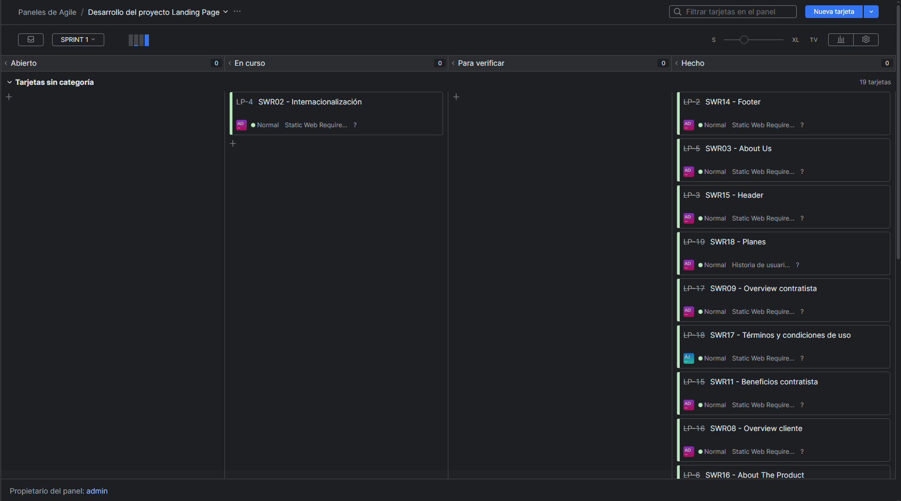

### 5.2.2. Sprint 2

#### 5.2.2.1. Sprint Planning 2

<table cellpadding="6" cellspacing="0" style="border-collapse: collapse; width: 100%;">
  <tr>
    <th colspan="2"><strong>Sprint #</strong></th>
    <td colspan="2">Sprint 2</td>
  </tr>
  <tr>
    <th colspan="4" style="background-color: #d9d9d9;"><strong>Sprint Planning Background</strong></th>
  </tr>
  <tr>
    <th style="width: 20%;">Date</th>
    <td colspan="3">2025-04-28</td>
  </tr>
  <tr>
    <th>Time</th>
    <td colspan="3">07:40 PM</td>
  </tr>
  <tr>
    <th>Location</th>
    <td colspan="3">Biblioteca Monterrico - Cubículo de estudiantes</td>
  </tr>
  <tr>
    <th>Prepared By</th>
    <td colspan="3">Orozco Torres, Álvaro Joaquín</td>
  </tr>
  <tr>
    <th>Attendees (to planning meeting)</th>
    <td colspan="3">Aponte Cruzado, Andrea Marielena / Orozco Torres, Álvaro Joaquín / Reaño Delgadillo, Henry Paolo</td>
  </tr>
  <tr>
    <th>Sprint 1 Review Summary</th>
    <td colspan="3">El sprint anterior logró realizar una primera implementación de la Landing Page. Sin embargo, esta implementación no ha llegado a cumplir con las expectativas de los miembros del equipo, quienes identifican una oportunidad de mejora en utilizar el framework de Angular para facilitar su mantenibilidad, aspecto y permitir además implementar ciertas funcionalidades que no lograron a completarse en la primera versión.</td>
  </tr>
  <tr>
    <th>Sprint 1 Retrospective Summary</th>
    <td colspan="3">Se identificó una ligera falta de coordinación debido principalmente a la presión del tiempo para el primer entregable. Para el sprint actual, se decidió mantener el mismo modo de organización debido a</td>
  </tr>
  <tr>
    <th colspan="4" style="background-color: #d9d9d9;"><strong>Sprint Goal & User Stories</strong></th>
  </tr>
  <tr>
    <th>Sprint 2 Goal</th>
    <td colspan="3">Nuestro foco está en implementar el front-end con alta fidelidad al diseño de UX/UI previsto por el equipo, tanto en la aplicación web como landing page. Creemos que expande nos permite no solo mostrar el alcance de proyecto claramente, sino también identificar posibles puntos de mejora los distintos workflows. Esto será confirmado cuando se realice una evaluación según heurísticas de usabilidad.</td>
  </tr>
  <tr>
    <th>Sprint 2 Velocity</th>
    <td colspan="3">70 Story Points</td>
  </tr>
  <tr>
    <th>Sum of Story Points</th>
    <td colspan="3">176 Story Points</td>
  </tr>
</table>

#### 5.2.2.2. Aspect Leaders and Collaborators

Para el Sprint 2, se proyectan actividades como la segunda versión del Landing Page y la implementación de las vistas del Web Application.

<table cellpadding="6" cellspacing="0" style="border-collapse: collapse; width: 100%;">
  <tr>
    <th>Team Member  (Last Name, First Name)</th>
    <th>GitHub Username</th>
    <th>Landing Page Leader (L) / Collaborator (C)</th>
    <th>Web Application UX/UI Leader (L) / Collaborator (C)</th>
    <th>Web Application DDD Architecture Leader (L) / Collaborator (C)</th>
  </tr>
  <tr>
    <td>Aponte Cruzado, Andrea Marielena</td>
    <td>iconicmiau</td>
    <td>C</td>
    <td>L</td>
    <td>C</td>
  </tr>
  <tr>
    <td>Orozco Torres, Álvaro Joaquín</td>
    <td>CodyLionVivo</td>
    <td>C</td>
    <td>C</td>
    <td>C</td>
  </tr>
  <tr>
    <td>López Acuña, Mario Joaquín</td>
    <td>tertegen</td>
    <td>C</td>
    <td>C</td>
    <td>C</td>
  </tr>
  <tr>
    <td>Orozco Torres, Álvaro Joaquín</td>
    <td>L1LZ4Z</td>
    <td>C</td>
    <td>C</td>
    <td>L</td>
  </tr>
  <tr>
    <td>Reaño Delgadillo, Henry Paolo</td>
    <td>PaoloHRRR</td>
    <td>L</td>
    <td>C</td>
    <td>C</td>
  </tr>
</table>

#### 5.2.2.3. Sprint Backlog 2

<a href="https://galaxiawonder.youtrack.cloud/dashboard?id=213-2" target="_blank">Ver tablero en YouTrack</a>

<b>Credenciales:</b>
<ul>
  <li>
    Correo: 
    
      invitadogw&#64;galaxiawonder.com
    
  </li>
  <li>Contraseña: GA14x4W0nd3r</li>
</ul>

<table cellpadding="6" cellspacing="0">
  <tr>
    <th colspan="8">Sprint #</th>
    <td colspan="8">Sprint n</td>
  </tr>
  <tr>
    <th colspan="2">User Story</th>
    <th colspan="6">Work-Item / Task</th>
  </tr>
  <tr>
    <th>Id</th>
    <th>Title</th>
    <th>Id</th>
    <th>Title</th>
    <th>Description</th>
    <th>Estimation (Hours)</th>
    <th>Assigned To</th>
    <th>Status (Done / In-Process / To-Review / Done)</th>
  </tr>
        <tr>
            <td>SWR01</td>
            <td>Cambiar segmento objetivo</td>
            <td>SWR01-1</td>
            <td>Codear el HTML</td>
            <td>Crear las estructuras de marcado semántico correspondientes al componente o sección</td>
            <td>1</td>
            <td>Orozco Torres, Álvaro Joaquín</td>
            <td>Done</td>
        </tr>
        <tr>
            <td></td><td></td>
            <td>SWR01-2</td>
            <td>Codear el CSS</td>
            <td>Crear y aplicar los estilos correspondientes al componente o sección</td>
            <td>1</td>
            <td>Orozco Torres, Álvaro Joaquín</td>
            <td>Done</td>
        </tr>
        <tr>
            <td>SWR06</td>
            <td>Call to action Contratista</td>
            <td>SWR06-1</td>
            <td>Codear el HTML</td>
            <td>Crear las estructuras de marcado semántico correspondientes al componente o sección</td>
            <td>1</td>
            <td>Orozco Torres, Álvaro Joaquín</td>
            <td>Done</td>
        </tr>
        <tr>
            <td></td><td></td>
            <td>SWR06-2</td>
            <td>Codear el CSS</td>
            <td>Crear y aplicar los estilos correspondientes al componente o sección</td>
            <td>1</td>
            <td>Orozco Torres, Álvaro Joaquín</td>
            <td>Done</td>
        </tr>
        <tr>
            <td>SWR07</td>
            <td>Call to action Cliente</td>
            <td>SWR07-1</td>
            <td>Codear el HTML</td>
            <td>Crear las estructuras de marcado semántico correspondientes al componente o sección</td>
            <td>1</td>
            <td>Orozco Torres, Álvaro Joaquín</td>
            <td>Done</td>
        </tr>
        <tr>
            <td></td><td></td>
            <td>SWR07-2</td>
            <td>Codear el CSS</td>
            <td>Crear y aplicar los estilos correspondientes al componente o sección</td>
            <td>1</td>
            <td>Orozco Torres, Álvaro Joaquín</td>
            <td>Done</td>
        </tr>
        <tr>
            <td>SWR05</td>
            <td>Hero Section Contratista</td>
            <td>SWR05-1</td>
            <td>Codear el HTML</td>
            <td>Crear las estructuras de marcado semántico correspondientes al componente o sección</td>
            <td>1</td>
            <td>Orozco Torres, Álvaro Joaquín</td>
            <td>Done</td>
        </tr>
        <tr>
            <td></td><td></td>
            <td>SWR05-2</td>
            <td>Codear el CSS</td>
            <td>Crear y aplicar los estilos correspondientes al componente o sección</td>
            <td>1</td>
            <td>Orozco Torres, Álvaro Joaquín</td>
            <td>Done</td>
        </tr>
        <tr>
            <td>SWR04</td>
            <td>Hero Section Cliente</td>
            <td>SWR04-1</td>
            <td>Codear el HTML</td>
            <td>Crear las estructuras de marcado semántico correspondientes al componente o sección</td>
            <td>1</td>
            <td>Orozco Torres, Álvaro Joaquín</td>
            <td>Done</td>
        </tr>
        <tr>
            <td></td><td></td>
            <td>SWR04-2</td>
            <td>Codear el CSS</td>
            <td>Crear y aplicar los estilos correspondientes al componente o sección</td>
            <td>1</td>
            <td>Orozco Torres, Álvaro Joaquín</td>
            <td>Done</td>
        </tr>
        <tr>
            <td>SWR09</td>
            <td>Overview contratista</td>
            <td>SWR09-1</td>
            <td>Codear el HTML</td>
            <td>Crear las estructuras de marcado semántico correspondientes al componente o sección</td>
            <td>1</td>
            <td>Orozco Torres, Álvaro Joaquín</td>
            <td>Done</td>
        </tr>
        <tr>
            <td></td><td></td>
            <td>SWR09-2</td>
            <td>Codear el CSS</td>
            <td>Crear y aplicar los estilos correspondientes al componente o sección</td>
            <td>1</td>
            <td>Orozco Torres, Álvaro Joaquín</td>
            <td>Done</td>
        </tr>
        <tr>
            <td>SWR08</td>
            <td>Overview cliente</td>
            <td>SWR08-1</td>
            <td>Codear el HTML</td>
            <td>Crear las estructuras de marcado semántico correspondientes al componente o sección</td>
            <td>1</td>
            <td>Orozco Torres, Álvaro Joaquín</td>
            <td>Done</td>
        </tr>
        <tr>
            <td></td><td></td>
            <td>SWR08-2</td>
            <td>Codear el CSS</td>
            <td>Crear y aplicar los estilos correspondientes al componente o sección</td>
            <td>1</td>
            <td>Orozco Torres, Álvaro Joaquín</td>
            <td>Done</td>
        </tr>
        <tr>
            <td>SWR11</td>
            <td>Beneficios contratista</td>
            <td>SWR11-1</td>
            <td>Codear el HTML</td>
            <td>Crear las estructuras de marcado semántico correspondientes al componente o sección</td>
            <td>1</td>
            <td>Orozco Torres, Álvaro Joaquín</td>
            <td>Done</td>
        </tr>
        <tr>
            <td></td><td></td>
            <td>SWR11-2</td>
            <td>Codear el CSS</td>
            <td>Crear y aplicar los estilos correspondientes al componente o sección</td>
            <td>1</td>
            <td>Orozco Torres, Álvaro Joaquín</td>
            <td>Done</td>
        </tr>
        <tr>
            <td>SWR10</td>
            <td>Beneficios cliente</td>
            <td>SWR10-1</td>
            <td>Codear el HTML</td>
            <td>Crear las estructuras de marcado semántico correspondientes al componente o sección</td>
            <td>1</td>
            <td>Orozco Torres, Álvaro Joaquín</td>
            <td>Done</td>
        </tr>
        <tr>
            <td></td><td></td>
            <td>SWR10-2</td>
            <td>Codear el CSS</td>
            <td>Crear y aplicar los estilos correspondientes al componente o sección</td>
            <td>1</td>
            <td>Orozco Torres, Álvaro Joaquín</td>
            <td>Done</td>
        </tr>
        <tr>
            <td>SWR16</td>
            <td>About The Product</td>
            <td>SWR16-1</td>
            <td>Codear el HTML</td>
            <td>Crear las estructuras de marcado semántico correspondientes al componente o sección</td>
            <td>1</td>
            <td>Reaño Delgadillo, Henry Paolo</td>
            <td>Done</td>
        </tr>
        <tr>
            <td></td><td></td>
            <td>SWR16-2</td>
            <td>Codear el CSS</td>
            <td>Crear y aplicar los estilos correspondientes al componente o sección</td>
            <td>1</td>
            <td>Reaño Delgadillo, Henry Paolo</td>
            <td>Done</td>
        </tr>
        <tr>
            <td>SWR03</td>
            <td>About Us</td>
            <td>SWR03-1</td>
            <td>Codear el HTML</td>
            <td>Crear las estructuras de marcado semántico correspondientes al componente o sección</td>
            <td>1</td>
            <td>Reaño Delgadillo, Henry Paolo</td>
            <td>Done</td>
        </tr>
        <tr>
            <td></td><td></td>
            <td>SWR03-2</td>
            <td>Codear el CSS</td>
            <td>Crear y aplicar los estilos correspondientes al componente o sección</td>
            <td>1</td>
            <td>Reaño Delgadillo, Henry Paolo</td>
            <td>Done</td>
        </tr>
        <tr>
            <td>SWR13</td>
            <td>Testimonios contratista</td>
            <td>SWR13-1</td>
            <td>Codear el HTML</td>
            <td>Crear las estructuras de marcado semántico correspondientes al componente o sección</td>
            <td>1</td>
            <td>Reaño Delgadillo, Henry Paolo</td>
            <td>Done</td>
        </tr>
        <tr>
            <td></td><td></td>
            <td>SWR13-2</td>
            <td>Codear el CSS</td>
            <td>Crear y aplicar los estilos correspondientes al componente o sección</td>
            <td>1</td>
            <td>Reaño Delgadillo, Henry Paolo</td>
            <td>Done</td>
        </tr>
                <tr>
            <td>SWR12</td>
            <td>Testimonios cliente</td>
            <td>SWR12-1</td>
            <td>Codear el HTML</td>
            <td>Crear las estructuras de marcado semántico correspondientes al componente o sección</td>
            <td>1</td>
            <td>Reaño Delgadillo, Henry Paolo</td>
            <td>Done</td>
        </tr>
        <tr>
            <td></td><td></td>
            <td>SWR12-2</td>
            <td>Codear el CSS</td>
            <td>Crear y aplicar los estilos correspondientes al componente o sección</td>
            <td>1</td>
            <td>Reaño Delgadillo, Henry Paolo</td>
            <td>Done</td>
        </tr>
        <tr>
            <td>SWR02</td>
            <td>Internacionalización</td>
            <td>SWR02-1</td>
            <td>Codear el HTML</td>
            <td>Crear las estructuras de marcado semántico correspondientes al componente o sección</td>
            <td>1</td>
            <td>Orozco Torres, Álvaro Joaquín</td>
            <td>Done</td>
        </tr>
        <tr>
            <td></td><td></td>
            <td>SWR02-2</td>
            <td>Codear el CSS</td>
            <td>Crear y aplicar los estilos correspondientes al componente o sección</td>
            <td>1</td>
            <td>Orozco Torres, Álvaro Joaquín</td>
            <td>Done</td>
        </tr>
        <tr>
            <td>SWR18</td>
            <td>Planes</td>
            <td>SWR18-1</td>
            <td>Codear el HTML</td>
            <td>Crear las estructuras de marcado semántico correspondientes al componente o sección</td>
            <td>1</td>
            <td>Reaño Delgadillo, Henry Paolo</td>
            <td>Done</td>
        </tr>
        <tr>
            <td></td><td></td>
            <td>SWR18-2</td>
            <td>Codear el CSS</td>
            <td>Crear y aplicar los estilos correspondientes al componente o sección</td>
            <td>1</td>
            <td>Reaño Delgadillo, Henry Paolo</td>
            <td>Done</td>
        </tr>
        <tr>
            <td>SWR14</td>
            <td>Footer</td>
            <td>SWR14-1</td>
            <td>Codear el HTML</td>
            <td>Crear las estructuras de marcado semántico correspondientes al componente o sección</td>
            <td>1</td>
            <td>Orozco Torres, Álvaro Joaquín</td>
            <td>Done</td>
        </tr>
        <tr>
            <td></td><td></td>
            <td>SWR14-2</td>
            <td>Codear el CSS</td>
            <td>Crear y aplicar los estilos correspondientes al componente o sección</td>
            <td>1</td>
            <td>Orozco Torres, Álvaro Joaquín</td>
            <td>Done</td>
        </tr>
        <tr>
            <td>SWR17</td>
            <td>Términos y condiciones de uso</td>
            <td>SWR17-1</td>
            <td>Codear el HTML</td>
            <td>Crear las estructuras de marcado semántico correspondientes al componente o sección</td>
            <td>1</td>
            <td>Reaño Delgadillo, Henry Paolo</td>
            <td>Done</td>
        </tr>
        <tr>
            <td></td><td></td>
            <td>SWR17-2</td>
            <td>Codear el CSS</td>
            <td>Crear y aplicar los estilos correspondientes al componente o sección</td>
            <td>1</td>
            <td>Reaño Delgadillo, Henry Paolo</td>
            <td>Done</td>
        </tr>
        <tr>
            <td>SWR15</td>
            <td>Header</td>
            <td>SWR15-1</td>
            <td>Codear el HTML</td>
            <td>Crear las estructuras de marcado semántico correspondientes al componente o sección</td>
            <td>1</td>
            <td>Orozco Torres, Álvaro Joaquín</td>
            <td>Done</td>
        </tr>
        <tr>
            <td></td><td></td>
            <td>SWR15-2</td>
            <td>Codear el CSS</td>
            <td>Crear y aplicar los estilos correspondientes al componente o sección</td>
            <td>1</td>
            <td>Orozco Torres, Álvaro Joaquín</td>
            <td>Done</td>
        </tr>
</table>

#### 5.2.2.4. Development Evidence for Sprint Review

En el Sprint 1, se realizó una primera implementación de la Landing Page utilizando HTML, CSS y JavaScript estándar.

| Repository | Branch | Commit Id | Commit Message | Commit Message Body | Commit on |
| - | - | - | - | - | - |
| LandingPage | develop | adb91bf6aa8eaf662d84868128ee24fe32511538 | initial commit |   | 3/05/2025 |
| LandingPage | develop | 07e65efb639f4a8421f0bce7003750974d1796fb | chore: add project dependencies |   | 3/05/2025 |
| LandingPage | develop | cc32dd86a8aeb78e208e7bfe2c84c693557378ec | chore: remove default app component html structure |   | 3/05/2025 |
| LandingPage | feature/swr02 | 7f15f5c312dbc1be0a8bdba6e3ec6cbfd5e25e90 | chore: set up i18n configuration |   | 3/05/2025 |
| LandingPage | feature/swr02 | 1a773307e13d922248b11f70deae203948feaa0d | feat(swr02): add basic sections on english and spanish dictionary |   | 3/05/2025 |
| LandingPage | feature/swr02 | 7913f6c3454316e52edd04d0e56abcc42fe71f92 | feat(swr02): add languge switcher component |   | 3/05/2025 |
| LandingPage | develop | 7926547fc05da0ee7720d70a7af5be13e47ccc01 | Merge branch 'swr02' into 'develop' |   | 3/05/2025 |
| LandingPage | feature/swr15 | 63803f3458915294e41a66f610648598ed4cd2bf | refactor(swr02): change angular.json to serve src/assets folder for better maintainability |   | 3/05/2025 |
| LandingPage | feature/swr15 | 37eb3aad4b36a56fbcc83d19e1b279003f4b443f | feat(swr15): add toolbar component |   | 3/05/2025 |
| LandingPage | feature/swr01 | 5a77ed6d369ede8fd52cbc192c401d5661170d13 | feat(swr01): add user type enum |   | 3/05/2025 |
| LandingPage | feature/swr01 | abf30559e7610e8c2f1f3531abe0c1988d8c18fd | feat(swr01): add user type service |   | 3/05/2025 |
| LandingPage | feature/swr01 | dde6222439a8655ac94a7656b8c12308bdf6d5f9 | feat(swr01): add user type switcher component |   | 3/05/2025 |
| LandingPage | develop | 793a889976f4616ee06f6d80f7f0c9151dcc089b | refactor: move landing page specific components into landing page folder |   | 3/05/2025 |
| LandingPage | feature/swr06 | ee4fd56c84e9de8c0ad4e3d9ceabfff6c7dc103e | feat(swr06): add call to action for contractor user segment |   | 3/05/2025 |
| LandingPage | feature/swr07 | ca70f1d8de881c141946990c7f1c5aa7b33cff2c | feat(swr07): add call to action for client user segment |   | 3/05/2025 |
| LandingPage | feature/swr05 | 920a9f88d2341c3876f0356d341c1145f90ab99f | feat(swr05): add hero section for contractor user segment |   | 3/05/2025 |
| LandingPage | feature/swr04 | 53a04ca6cef0fc00813e5a8cc2178836a362ce6c | feat(swr04): add hero section for client user segment |   | 3/05/2025 |
| LandingPage | feature/swr09 | 3c46ea19b2affa09c8fd5d5045c6d3587e1b973d | feat(swr09): add overview for contractor user segment |   | 3/05/2025 |
| LandingPage | feature/swr08 | 46d128c83da07dfd6e4c2e1edf99547c78c8da2a | chore: add overview card interface |   | 3/05/2025 |
| LandingPage | feature/swr08 | f5629165a6685d3aeb743314c484c69afe7ba74b | refactor(swr08): refactor overview and overview carousel to follow single reponsibility principle |   | 3/05/2025 |
| LandingPage | feature/swr08 | 39af60fcca56995a9e6ae5a951cc177d44414a76 | feat(swr08): add overview list component |   | 3/05/2025 |
| LandingPage | develop | 207de11563770ff6eda4a74150dead5247cfdb72 | bugfix(develop): fix merging errors |   | 3/05/2025 |
| LandingPage | feature/swr14 | d20e336255c22279cb42aee553c65cceae586a47 | feat(swr14): add footer component |   | 3/05/2025 |
| LandingPage | feature/swr03 | 7c165b401ee4184942a905239782eb5a2f11d963 | feat(swr03): add about us component |   | 3/05/2025 |
| LandingPage | feature/swr18 | 0a4eeeed4deb4afe7bbb4a02cc69c2182dd863de | feat(swr18): add plans component |   | 3/05/2025 |
| LandingPage | feature/swr18 | adf0ba332dea4da5c8f22cec2386da031e13de59 | chore(swr18): add styles to learn more button in plans component |   | 3/05/2025 |
| LandingPage | feature/swr18 | 1c18647016a78e6186ec2e5dd3d2bae72b4b5d45 | bugfix(swr18): fix change plan button styles |   | 3/05/2025 |
| LandingPage | feature/swr16 | 666f8646fc35aec1c8f98c7a0a308706f143ce8f | feat(swr16): add about the product component |   | 3/05/2025 |
| LandingPage | feature/swr13 | dbe23b761b9440088ec493fa5aecd6bd08fa813f | feat(swr13): add testimonial model |   | 3/05/2025 |
| LandingPage | feature/swr13 | a5c93439879b95d24f72e79eb501e508657a3114 | feat(swr13): add testimonial list component |   | 3/05/2025 |
| LandingPage | feature/swr13 | e22f0c2d60ac67112ef79b8eedd988f978b9464f | feat(swr13): add testimonial carousel component |   | 3/05/2025 |
| LandingPage | feature/swr12 | 20cdc06a1cea69dff10c2cdaa6959ecbd2e8d86d | feat(swr12): add client testimonial in testimonial model |   | 3/05/2025 |
| LandingPage | feature/swr17 | 1f45fcba0e79f437bd3b828f3ec605b6e9020aed | chore(swr17): add terms and conditions in i18n json files |   | 3/05/2025 |
| LandingPage | feature/swr17 | 126b04364fbb8d4346de66d458d697a72cd79398 | feat(swr17): add terms and conditions component |   | 3/05/2025 |
| LandingPage | feature/swr17 | 1eb8a4750ea95434dd7c7904673d86ccf386701e | feat(swr17): add email of galaxia wonder in terms and conditions |   | 3/05/2025 |
| LandingPage | feature/swr17 | ba9a19f68671664cf914e0d3f6320b135b283021 | chore(swr17): add styles in terms and conditions component |   | 3/05/2025 |
| LandingPage | feature/swr15 | fafec32b6e6505d8b9c74476388c4dc90febb2a3 | feat(swr15): add navigation to sections in the toolbar component |   | 3/05/2025 |
| LandingPage | bugfix/swr17 | 22a7dc22d3d0526209863782761a3b1d7ed944e0 | bugfix(swr17): remove unnecessary buttons in the terms and conditions dialog |   | 3/05/2025 |
| LandingPage | release/tp | 418ecbdaf8acd65dc159fbe3b14a81a01cedaec9 | chore(tp): add prop gms title and logo in index |   | 4/05/2025 |
| LandingPage | release/tp | 15fcc54b83a65c0af2bce5bf17b69af25730d775 | bugfix(tp): remove duplicate product logo in folder images |   | 4/05/2025 |
| LandingPage | release/tp | 91a3c02b17332f822022e6bc2de779d09cf42b4f | chore(tp): add startup name in toolbar component |   | 4/05/2025 |

#### 5.2.2.5. Execution Evidence for Sprint Review

#### 5.2.2.6. Services Documentation Evidence for Sprint Review

#### 5.2.2.7. Software Deployment Evidence for Sprint Review

#### 5.2.2.8. Team Collaboration Insights during Sprint