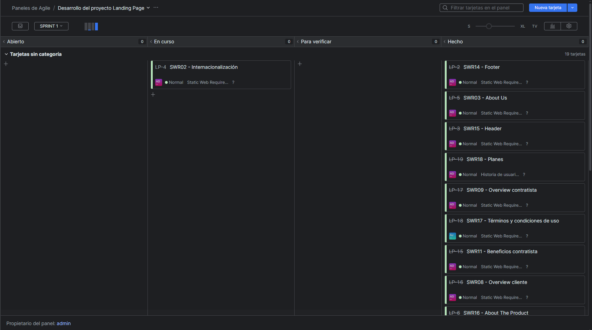
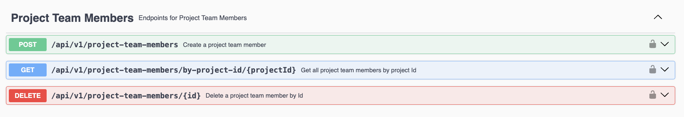

### 5.2.4. Sprint 4

#### 5.2.4.1. Sprint Planning 4

<table cellpadding="6" cellspacing="0" style="border-collapse: collapse; width: 100%;">
  <tr>
    <th colspan="2"><strong>Sprint #</strong></th>
    <td colspan="2">Sprint 4</td>
  </tr>
  <tr>
    <th colspan="4" style="background-color: #d9d9d9;"><strong>Sprint Planning Background</strong></th>
  </tr>
  <tr>
    <th style="width: 20%;">Date</th>
    <td colspan="3">2025-06-23</td>
  </tr>
  <tr>
    <th>Time</th>
    <td colspan="3">10:30 AM</td>
  </tr>
  <tr>
    <th>Location</th>
    <td colspan="3">Biblioteca Monterrico - Cubículo de estudiantes</td>
  </tr>
  <tr>
    <th>Prepared By</th>
    <td colspan="3">Orozco Torres, Álvaro Joaquín</td>
  </tr>
  <tr>
    <th>Attendees (to planning meeting)</th>
    <td colspan="3">Aponte Cruzado, Andrea Marielena / Orozco Torres, Álvaro Joaquín / León Vivas, Fabrizio Amir / Lopez Acuña, Mario Joaquin</td>
  </tr>
  <tr>
    <th>Sprint 3 Review Summary</th>
    <td colspan="3">El sprint anterior logró completar la implementación del backend. Se avanzó en el desarrollo de la aplicación web front-end con Angular y TypeScript; sin embargo, esta quedó inconclusa y quedaron múltiples tareas pendientes en estado "To-Do".</td>
  </tr>
  <tr>
    <th>Sprint 3 Retrospective Summary</th>
    <td colspan="3">Se identificó la necesidad de ajustar el modo de trabajo del equipo, a fin de permitir la colaboración efectiva y el desarrollo de capacidades multidisciplinarias por parte de cada miembro del equipo.</td>
  </tr>
  <tr>
    <th colspan="4" style="background-color: #d9d9d9;"><strong>Sprint Goal & User Stories</strong></th>
  </tr>
  <tr>
    <th>Sprint 4 Goal</th>
    <td colspan="3">Nuestro foco es cubrir la deuda técnica acumulada del sprint 3, redefinir y desarrollar las funcionalidades esenciales del producto, con el fin de validar su aporte al caso de negocio. Por ello, buscamos entregar una versión funcional de la aplicación para obtener retroalimentación directa de usuarios reales, lo cual nos permitirá confirmar hipótesis, ajustar requisitos no correctamente elicitados y asegurar que la solución responde a necesidades reales</td>
  </tr>
  <tr>
    <th>Sprint 4 Velocity</th>
    <td colspan="3">42 Story Points</td>
  </tr>
  <tr>
    <th>Sum of Story Points</th>
    <td colspan="3">131 Story Points</td>
  </tr>
  
</table>

#### 5.2.4.2. Aspect Leaders and Collaborators

Para el Sprint 4, se proyectan actividades como y la implementación del FrontEnd y BackEnd de la Web Application.

<table cellpadding="6" cellspacing="0" style="border-collapse: collapse; width: 100%;">
  <tr>
    <th>Team Member  (Last Name, First Name)</th>
    <th>GitHub Username</th>
    <th>Web Application Front-End Leader (L) / Collaborator (C)</th>
    <th>Web Application Back-End Leader (L) / Collaborator (C)</th>
  </tr>
  <tr>
    <td>Aponte Cruzado, Andrea Marielena</td>
    <td>iconicmiau</td>
    <td>C</td>
    <td>C</td>
  </tr>
  <tr>
    <td>Orozco Torres, Álvaro Joaquín</td>
    <td>CodyLionVivo</td>
    <td>C</td>
    <td>C</td>
  </tr>
  <tr>
    <td>López Acuña, Mario Joaquín</td>
    <td>tertegen</td>
    <td>C</td>
    <td>C</td>
  </tr>
  <tr>
    <td>Orozco Torres, Álvaro Joaquín</td>
    <td>L1LZ4Z</td>
    <td>L</td>
    <td>L</td>
  </tr>
  <tr>
    <td>Reaño Delgadillo, Henry Paolo</td>
    <td>PaoloHRRR</td>
    <td>C</td>
    <td>C</td>
  </tr>
</table>

#### 5.2.4.3. Sprint Backlog 4

<a href="https://galaxiawonder.youtrack.cloud/dashboard?id=213-2" target="_blank">Ver tablero en YouTrack</a>

<b>Credenciales:</b>
<ul>
  <li>
    Correo: 
    
      invitadogw&#64;galaxiawonder.com
    
  </li>
  <li>Contraseña: GA14x4W0nd3r</li>
</ul>

<table cellpadding="6" cellspacing="0">
  <tr>
    <th colspan="8">Sprint 4</th>
    <td colspan="8">Sprint n</td>
  </tr>
  <tr>
    <th colspan="2">User Story</th>
    <th colspan="6">Work-Item / Task</th>
  </tr>
  <tr>
    <th>Id</th>
    <th>Title</th>
    <th>Id</th>
    <th>Title</th>
    <th>Description</th>
    <th>Estimation (Hours)</th>
    <th>Assigned To</th>
    <th>Status (To-do / In-Process / To-Review / Done)</th>
<tr>
  <td>TS01</td>
  <td>Crear organización</td>
  <td>TS01-1</td>
  <td>Registrar organización exitosamente</td>
  <td>Implementar endpoint POST /organizations y devolver 201 Created con datos completos</td>
  <td>2</td>
  <td>León Vivas, Fabrizio Amir</td>
  <td>Done</td>
</tr>
<tr>
  <td></td><td></td>
  <td>TS01-2</td>
  <td>Validar datos incompletos o inválidos</td>
  <td>Responder 400 Bad Request si faltan campos obligatorios o tienen formato inválido</td>
  <td>2</td>
  <td>León Vivas, Fabrizio Amir</td>
  <td>Done</td>
</tr>

<tr>
  <td>TS02</td>
  <td>Listar organizaciones</td>
  <td>TS02-1</td>
  <td>Listar organizaciones exitosamente</td>
  <td>Implementar GET /organizations para devolver lista de organizaciones con 200 OK</td>
  <td>2</td>
  <td>Reaño Delgadillo, Henry Paolo</td>
  <td>Done</td>
</tr>
<tr>
  <td></td><td></td>
  <td>TS02-2</td>
  <td>Usuario sin organizaciones</td>
  <td>Responder 200 OK con lista vacía si usuario no tiene organizaciones</td>
  <td>2</td>
  <td>Reaño Delgadillo, Henry Paolo</td>
  <td>Done</td>
</tr>

<tr>
  <td>TS03</td>
  <td>Detalles de una organización</td>
  <td>TS03-1</td>
  <td>Obtener detalles exitosamente</td>
  <td>Implementar GET /organizations/{id} y devolver datos completos con 200 OK</td>
  <td>2</td>
  <td>León Vivas, Fabrizio Amir</td>
  <td>Done</td>
</tr>
<tr>
  <td></td><td></td>
  <td>TS03-2</td>
  <td>Organización no encontrada</td>
  <td>Responder 404 Not Found si la organización no existe</td>
  <td>2</td>
  <td>León Vivas, Fabrizio Amir</td>
  <td>Done</td>
</tr>

<tr>
  <td>TS04</td>
  <td>Actualizar información de organización</td>
  <td>TS04-1</td>
  <td>Actualizar organización exitosamente</td>
  <td>Implementar PATCH /organizations/{id} para actualizar datos válidos y devolver 200 OK</td>
  <td>2</td>
  <td>Reaño Delgadillo, Henry Paolo</td>
  <td>Done</td>
</tr>
<tr>
  <td></td><td></td>
  <td>TS04-2</td>
  <td>Validar datos inválidos o no encontrados</td>
  <td>Responder 400 Bad Request o 404 Not Found según errores de validación o inexistencia</td>
  <td>2</td>
  <td>Reaño Delgadillo, Henry Paolo</td>
  <td>Done</td>
</tr>

<tr>
  <td>TS05</td>
  <td>Eliminar organización (soft delete)</td>
  <td>TS05-1</td>
  <td>Solicitud de eliminación exitosa</td>
  <td>Implementar DELETE /organizations/{id} para marcar como deletion_pending y devolver 202 Accepted</td>
  <td>2</td>
  <td>León Vivas, Fabrizio Amir</td>
  <td>Done</td>
</tr>
<tr>
  <td></td><td></td>
  <td>TS05-2</td>
  <td>Organización ya marcada o no encontrada</td>
  <td>Responder 409 Conflict o 404 Not Found si ya está en proceso o no existe</td>
  <td>2</td>
  <td>León Vivas, Fabrizio Amir</td>
  <td>Done</td>
</tr>
<tr>
  <td>TS06</td>
  <td>Añadir miembro a organización</td>
  <td>TS06-1</td>
  <td>Añadir miembro exitosamente</td>
  <td>Implementar POST para agregar miembro con rol asignado y devolver 201 Created</td>
  <td>2</td>
  <td>León Vivas, Fabrizio Amir</td>
  <td>Done</td>
</tr>
<tr>
  <td></td><td></td>
  <td>TS06-2</td>
  <td>Validar datos inválidos o miembro existente</td>
  <td>Responder 400 o 409 si datos son inválidos o el miembro ya existe</td>
  <td>2</td>
  <td>León Vivas, Fabrizio Amir</td>
  <td>Done</td>
</tr>

<tr>
  <td>TS07</td>
  <td>Actualizar estado de miembro de organización</td>
  <td>TS07-1</td>
  <td>Cambiar estado exitosamente</td>
  <td>Implementar PATCH para actualizar estado (activo, suspendido, removido) con 200 OK</td>
  <td>2</td>
  <td>Reaño Delgadillo, Henry Paolo</td>
  <td>Done</td>
</tr>
<tr>
  <td></td><td></td>
  <td>TS07-2</td>
  <td>Validar estado inválido o miembro no encontrado</td>
  <td>Responder 400 o 404 si estado es inválido o miembro no existe</td>
  <td>2</td>
  <td>Reaño Delgadillo, Henry Paolo</td>
  <td>Done</td>
</tr>

<tr>
  <td>TS08</td>
  <td>Añadir proyecto a organización</td>
  <td>TS08-1</td>
  <td>Crear proyecto exitosamente</td>
  <td>Implementar POST para crear proyecto con datos válidos y devolver 201 Created</td>
  <td>2</td>
  <td>León Vivas, Fabrizio Amir</td>
  <td>Done</td>
</tr>
<tr>
  <td></td><td></td>
  <td>TS08-2</td>
  <td>Validar datos inválidos u organización no encontrada</td>
  <td>Responder 400 o 404 según error en datos o inexistencia de organización</td>
  <td>2</td>
  <td>León Vivas, Fabrizio Amir</td>
  <td>Done</td>
</tr>

<tr>
  <td>TS09</td>
  <td>Listar proyectos de organización</td>
  <td>TS09-1</td>
  <td>Listar proyectos exitosamente</td>
  <td>Implementar GET para devolver lista de proyectos con 200 OK</td>
  <td>2</td>
  <td>Reaño Delgadillo, Henry Paolo</td>
  <td>Done</td>
</tr>
<tr>
  <td></td><td></td>
  <td>TS09-2</td>
  <td>Organización sin proyectos o no encontrada</td>
  <td>Responder 200 con lista vacía o 404 si la organización no existe</td>
  <td>2</td>
  <td>Reaño Delgadillo, Henry Paolo</td>
  <td>Done</td>
</tr>

<tr>
  <td>TS10</td>
  <td>Detalles de un proyecto</td>
  <td>TS10-1</td>
  <td>Obtener detalles de proyecto exitosamente</td>
  <td>Implementar GET /projects/{id} para devolver datos completos con 200 OK</td>
  <td>2</td>
  <td>León Vivas, Fabrizio Amir</td>
  <td>Done</td>
</tr>
<tr>
  <td></td><td></td>
  <td>TS10-2</td>
  <td>Proyecto no encontrado</td>
  <td>Responder 404 Not Found si el proyecto no existe</td>
  <td>2</td>
  <td>León Vivas, Fabrizio Amir</td>
  <td>Done</td>
  <tr>
  <td>TS16</td>
  <td>Obtener detalles de cronograma</td>
  <td>TS16-1</td>
  <td>Obtener cronograma exitosamente</td>
  <td>Implementar GET para devolver cronograma con fechas e hitos con 200 OK</td>
  <td>2</td>
  <td>León Vivas, Fabrizio Amir</td>
  <td>Done</td>
</tr>
<tr>
  <td></td><td></td>
  <td>TS16-2</td>
  <td>Proyecto sin cronograma o no encontrado</td>
  <td>Responder 404 Not Found si el proyecto no tiene cronograma o no existe</td>
  <td>2</td>
  <td>León Vivas, Fabrizio Amir</td>
  <td>Done</td>
</tr>

<tr>
  <td>TS17</td>
  <td>Añadir hito al cronograma</td>
  <td>TS17-1</td>
  <td>Añadir hito exitosamente</td>
  <td>Implementar POST para crear hito con datos válidos y devolver 201 Created</td>
  <td>2</td>
  <td>Reaño Delgadillo, Henry Paolo</td>
  <td>Done</td>
</tr>
<tr>
  <td></td><td></td>
  <td>TS17-2</td>
  <td>Validar datos inválidos o conflicto</td>
  <td>Responder 400 o 409 si datos son inválidos o proyecto no tiene cronograma</td>
  <td>2</td>
  <td>Reaño Delgadillo, Henry Paolo</td>
  <td>Done</td>
</tr>

<tr>
  <td>TS18</td>
  <td>Listar hitos del cronograma</td>
  <td>TS18-1</td>
  <td>Listar hitos exitosamente</td>
  <td>Implementar GET para devolver lista de hitos con 200 OK</td>
  <td>2</td>
  <td>León Vivas, Fabrizio Amir</td>
  <td>Done</td>
</tr>
<tr>
  <td></td><td></td>
  <td>TS18-2</td>
  <td>Proyecto sin cronograma o no encontrado</td>
  <td>Responder 404 Not Found si el proyecto no tiene cronograma o no existe</td>
  <td>2</td>
  <td>León Vivas, Fabrizio Amir</td>
  <td>Done</td>
</tr>

<tr>
  <td>TS19</td>
  <td>Obtener detalles de hito</td>
  <td>TS19-1</td>
  <td>Obtener detalles de hito exitosamente</td>
  <td>Implementar GET /milestones/{id} para devolver datos completos con 200 OK</td>
  <td>2</td>
  <td>Reaño Delgadillo, Henry Paolo</td>
  <td>Done</td>
</tr>
<tr>
  <td></td><td></td>
  <td>TS19-2</td>
  <td>Hito o proyecto no encontrado</td>
  <td>Responder 404 Not Found si el hito o proyecto no existe</td>
  <td>2</td>
  <td>Reaño Delgadillo, Henry Paolo</td>
  <td>Done</td>
</tr>

<tr>
  <td>TS20</td>
  <td>Actualizar información de hito</td>
  <td>TS20-1</td>
  <td>Actualizar estado o duración exitosamente</td>
  <td>Implementar PATCH para modificar estado o duración del hito con 200 OK</td>
  <td>2</td>
  <td>León Vivas, Fabrizio Amir</td>
  <td>Done</td>
</tr>
<tr>
  <td></td><td></td>
  <td>TS20-2</td>
  <td>Validar datos inválidos o hito no encontrado</td>
  <td>Responder 400 o 404 si datos son inválidos o hito no existe en el proyecto</td>
  <td>2</td>
  <td>León Vivas, Fabrizio Amir</td>
  <td>Done</td>
</tr>
<tr>
  <td>TS21</td>
  <td>Crear tarea</td>
  <td>TS21-1</td>
  <td>Crear tarea exitosamente</td>
  <td>Implementar POST para crear tarea con datos válidos y devolver 201 Created</td>
  <td>2</td>
  <td>Reaño Delgadillo, Henry Paolo</td>
  <td>Done</td>
</tr>
<tr>
  <td></td><td></td>
  <td>TS21-2</td>
  <td>Validar datos inválidos o proyecto no encontrado</td>
  <td>Responder 400 o 404 si datos son inválidos o el proyecto no existe</td>
  <td>2</td>
  <td>Reaño Delgadillo, Henry Paolo</td>
  <td>Done</td>
</tr>

<tr>
  <td>TS22</td>
  <td>Listar tareas de hito</td>
  <td>TS22-1</td>
  <td>Listar tareas exitosamente</td>
  <td>Implementar GET para devolver lista de tareas del hito con 200 OK</td>
  <td>2</td>
  <td>León Vivas, Fabrizio Amir</td>
  <td>Done</td>
</tr>
<tr>
  <td></td><td></td>
  <td>TS22-2</td>
  <td>Hito o proyecto no encontrado</td>
  <td>Responder 404 Not Found si el hito o proyecto no existe</td>
  <td>2</td>
  <td>León Vivas, Fabrizio Amir</td>
  <td>Done</td>
</tr>

<tr>
  <td>TS23</td>
  <td>Obtener detalles de tarea</td>
  <td>TS23-1</td>
  <td>Obtener detalles de tarea exitosamente</td>
  <td>Implementar GET /tasks/{id} para devolver datos completos con 200 OK</td>
  <td>2</td>
  <td>Reaño Delgadillo, Henry Paolo</td>
  <td>Done</td>
</tr>
<tr>
  <td></td><td></td>
  <td>TS23-2</td>
  <td>Tarea o proyecto no encontrado</td>
  <td>Responder 404 Not Found si la tarea o proyecto no existe</td>
  <td>2</td>
  <td>Reaño Delgadillo, Henry Paolo</td>
  <td>Done</td>
</tr>

<tr>
  <td>TS24</td>
  <td>Actualizar información de tarea</td>
  <td>TS24-1</td>
  <td>Actualizar detalles de tarea exitosamente</td>
  <td>Implementar PATCH para modificar datos de tarea y devolver 200 OK</td>
  <td>2</td>
  <td>León Vivas, Fabrizio Amir</td>
  <td>Done</td>
</tr>
<tr>
  <td></td><td></td>
  <td>TS24-2</td>
  <td>Validar datos inválidos o tarea no encontrada</td>
  <td>Responder 400 o 404 si datos son inválidos o la tarea no existe</td>
  <td>2</td>
  <td>León Vivas, Fabrizio Amir</td>
  <td>Done</td>
</tr>

<tr>
  <td>TS25</td>
  <td>Crear solicitud de cambio</td>
  <td>TS25-1</td>
  <td>Crear solicitud exitosamente</td>
  <td>Implementar POST para registrar solicitud de cambio con 201 Created</td>
  <td>2</td>
  <td>Reaño Delgadillo, Henry Paolo</td>
  <td>Done</td>
</tr>
<tr>
  <td></td><td></td>
  <td>TS25-2</td>
  <td>Validar datos inválidos o proyecto no encontrado</td>
  <td>Responder 400 o 404 si datos son inválidos o proyecto no existe</td>
  <td>2</td>
  <td>Reaño Delgadillo, Henry Paolo</td>
  <td>Done</td>
</tr>
 <tr>
  <td>TS26</td>
  <td>Listar solicitudes de cambio</td>
  <td>TS26-1</td>
  <td>Listar solicitudes exitosamente</td>
  <td>Implementar GET para devolver lista de solicitudes con 200 OK</td>
  <td>2</td>
  <td>León Vivas, Fabrizio Amir</td>
  <td>Done</td>
</tr>
<tr>
  <td></td><td></td>
  <td>TS26-2</td>
  <td>Proyecto sin solicitudes o no encontrado</td>
  <td>Responder 200 con lista vacía o 404 si el proyecto no existe</td>
  <td>2</td>
  <td>León Vivas, Fabrizio Amir</td>
  <td>Done</td>
</tr>

<tr>
  <td>TS27</td>
  <td>Obtener detalles de solicitud de cambio</td>
  <td>TS27-1</td>
  <td>Obtener detalles exitosamente</td>
  <td>Implementar GET para devolver datos completos con 200 OK</td>
  <td>2</td>
  <td>Reaño Delgadillo, Henry Paolo</td>
  <td>Done</td>
</tr>
<tr>
  <td></td><td></td>
  <td>TS27-2</td>
  <td>Solicitud o proyecto no encontrado</td>
  <td>Responder 404 Not Found si la solicitud o proyecto no existe</td>
  <td>2</td>
  <td>Reaño Delgadillo, Henry Paolo</td>
  <td>Done</td>
</tr>

<tr>
  <td>TS28</td>
  <td>Aceptar / Denegar solicitud de cambio</td>
  <td>TS28-1</td>
  <td>Aceptar o denegar solicitud exitosamente</td>
  <td>Implementar PATCH para actualizar estado de solicitud con 200 OK</td>
  <td>2</td>
  <td>León Vivas, Fabrizio Amir</td>
  <td>Done</td>
</tr>
<tr>
  <td></td><td></td>
  <td>TS28-2</td>
  <td>Validar estado incorrecto o solicitud no encontrada</td>
  <td>Responder 400 o 404 según error de validación o inexistencia</td>
  <td>2</td>
  <td>León Vivas, Fabrizio Amir</td>
  <td>Done</td>
</tr>

<tr>
  <td>TS29</td>
  <td>Obtener detalles de desempeño de hito</td>
  <td>TS29-1</td>
  <td>Obtener detalles de desempeño exitosamente</td>
  <td>Implementar GET para devolver datos de desempeño con 200 OK</td>
  <td>2</td>
  <td>Reaño Delgadillo, Henry Paolo</td>
  <td>Done</td>
</tr>
<tr>
  <td></td><td></td>
  <td>TS29-2</td>
  <td>Hito sin tareas o no encontrado</td>
  <td>Responder 200 con mensaje o 404 si el hito no existe</td>
  <td>2</td>
  <td>Reaño Delgadillo, Henry Paolo</td>
  <td>Done</td>
</tr>
<tr>
  <td>TS35</td>
  <td>Login</td>
  <td>TS35-1</td>
  <td>Login exitoso</td>
  <td>Implementar POST /auth/login para devolver token y datos con 200 OK</td>
  <td>2</td>
  <td>Reaño Delgadillo, Henry Paolo</td>
  <td>Done</td>
</tr>
<tr>
  <td></td><td></td>
  <td>TS35-2</td>
  <td>Validar credenciales incorrectas o faltantes</td>
  <td>Responder 401 o 400 si credenciales son incorrectas o faltan campos</td>
  <td>2</td>
  <td>Reaño Delgadillo, Henry Paolo</td>
  <td>Done</td>
</tr>
<tr>
  <td>TS36</td>
  <td>Refrescar Token</td>
  <td>TS36-1</td>
  <td>Refrescar token exitosamente</td>
  <td>Implementar POST para devolver nuevo accessToken y refreshToken con 200 OK</td>
  <td>2</td>
  <td>León Vivas, Fabrizio Amir</td>
  <td>Done</td>
</tr>
<tr>
  <td></td><td></td>
  <td>TS36-2</td>
  <td>Validar token inválido o expirado</td>
  <td>Responder 401 o 403 si el token es inválido o expirado</td>
  <td>2</td>
  <td>León Vivas, Fabrizio Amir</td>
  <td>Done</td>
</tr>

<tr>
  <td>TS37</td>
  <td>Cerrar sesión + invalidar token</td>
  <td>TS37-1</td>
  <td>Cerrar sesión exitosamente</td>
  <td>Implementar POST para invalidar refreshToken y devolver 200 OK</td>
  <td>2</td>
  <td>Reaño Delgadillo, Henry Paolo</td>
  <td>Done</td>
</tr>
<tr>
  <td></td><td></td>
  <td>TS37-2</td>
  <td>Validar token inválido o faltante</td>
  <td>Responder 401 o 400 si el refreshToken es inválido o no se envía</td>
  <td>2</td>
  <td>Reaño Delgadillo, Henry Paolo</td>
  <td>Done</td>
</tr>

<tr>
  <td>TS38</td>
  <td>Registro</td>
  <td>TS38-1</td>
  <td>Registro exitoso</td>
  <td>Implementar POST para crear cuenta con 201 Created y enviar verificación</td>
  <td>2</td>
  <td>Aponte Cruzado, Andrea Marielena</td>
  <td>Done</td>
</tr>
<tr>
  <td></td><td></td>
  <td>TS38-2</td>
  <td>Validar email ya registrado o datos inválidos</td>
  <td>Responder 409 o 400 según el error</td>
  <td>2</td>
  <td>León Vivas, Fabrizio Amir</td>
  <td>Done</td>
</tr>
<tr>
  <td></td><td></td>
  <td>TS40-2</td>
  <td>Validar email no registrado o inválido</td>
  <td>Responder 404 o 400 si el email no está registrado o es inválido</td>
  <td>2</td>
  <td>León Vivas, Fabrizio Amir</td>
  <td>Done</td>
</tr>
<tr>
  <td></td><td></td>
  <td>TS41-2</td>
  <td>Validar token inválido o campos faltantes</td>
  <td>Responder 403 o 400 si el token es inválido o faltan campos</td>
  <td>2</td>
  <td>Reaño Delgadillo, Henry Paolo</td>
  <td>Done</td>

<tr>
  <td>TS42</td>
  <td>Encriptación segura de credenciales</td>
  <td>TS42-1</td>
  <td>Almacenar contraseña de forma segura</td>
  <td>Generar salt y hash con bcrypt al guardar contraseña</td>
  <td>2</td>
  <td>León Vivas, Fabrizio Amir</td>
  <td>Done</td>
<tr>
  <td>TS48</td>
  <td>Eliminar proyecto (soft delete)</td>
  <td>TS48-1</td>
  <td>Eliminar proyecto exitosamente (soft delete)</td>
  <td>Implementar DELETE para marcar proyecto como deletion_pending con 202 Accepted</td>
  <td>2</td>
  <td>León Vivas, Fabrizio Amir</td>
  <td>Done</td>
</tr>
<tr>
  <td></td><td></td>
  <td>TS48-2</td>
  <td>Validar proyecto ya marcado o inexistente</td>
  <td>Responder 409 o 404 si ya está en proceso o no existe</td>
  <td>2</td>
  <td>León Vivas, Fabrizio Amir</td>
  <td>Done</td>
</tr>
<tr>
  <td>TS49</td>
  <td>Eliminar usuario de proyecto</td>
  <td>TS49-1</td>
  <td>Eliminar usuario exitosamente</td>
  <td>Implementar DELETE para quitar miembro del proyecto con 200 OK</td>
  <td>2</td>
  <td>Reaño Delgadillo, Henry Paolo</td>
  <td>Done</td>
</tr>
<tr>
  <td></td><td></td>
  <td>TS49-2</td>
  <td>Validar usuario no pertenece o proyecto no encontrado</td>
  <td>Responder 404 Not Found si no pertenece o el proyecto no existe</td>
  <td>2</td>
  <td>Reaño Delgadillo, Henry Paolo</td>
  <td>Done</td>
</tr>
<tr>
  <td>TS57</td>
  <td>Eliminar proyecto (soft delete)</td>
  <td>TS57-1</td>
  <td>Eliminar proyecto exitosamente</td>
  <td>Implementar DELETE para marcar como deletion_pending con 202 Accepted</td>
  <td>2</td>
  <td>López Acuña, Mario Joaquín</td>
  <td>Done</td>
</tr>
<tr>
  <td></td><td></td>
  <td>TS57-2</td>
  <td>Validar proyecto ya marcado o inexistente</td>
  <td>Responder 409 o 404 si ya está en proceso o no existe</td>
  <td>2</td>
  <td>Reaño Delgadillo, Henry Paolo</td>
  <td>Done</td>
</tr>

<tr>
  <td>TS58</td>
  <td>Eliminar usuario de proyecto</td>
  <td>TS58-1</td>
  <td>Eliminar usuario exitosamente</td>
  <td>Implementar DELETE para quitar miembro del proyecto con 200 OK</td>
  <td>2</td>
  <td>León Vivas, Fabrizio Amir</td>
  <td>Done</td>
</tr>
<tr>
  <td></td><td></td>
  <td>TS58-2</td>
  <td>Validar usuario no pertenece o proyecto no encontrado</td>
  <td>Responder 404 Not Found si no pertenece o el proyecto no existe</td>
  <td>2</td>
  <td>León Vivas, Fabrizio Amir</td>
  <td>Done</td>
</tr>
<tr>
  <td>TS60</td>
  <td>Eliminar tarea</td>
  <td>TS60-1</td>
  <td>Eliminar tarea exitosamente</td>
  <td>Implementar DELETE para eliminar tarea y devolver 200 OK</td>
  <td>2</td>
  <td>León Vivas, Fabrizio Amir</td>
  <td>Done</td>
</tr>
<tr>
  <td></td><td></td>
  <td>TS60-2</td>
  <td>Validar tarea inexistente o proyecto no encontrado</td>
  <td>Responder 404 Not Found si la tarea o proyecto no existe</td>
  <td>2</td>
  <td>León Vivas, Fabrizio Amir</td>
  <td>Done</td>
</tr>
</table>

#### 5.2.4.4. Development Evidence for Sprint Review

Para el sprint 4 se proyectan actividades como implementacion de los endpoints en el BackEnd de la Web Application.

| Repository | Branch | Commit Id | Commit Message | Commit Message Body | Commit on |
| - | - | - | - | - | - |
| Platform | feature/ep07 | 2a6b7fab6b541827519bdca3f8826d02531f647a | feat(ep07): add aggregates and entities in domain model change context |   | 20/06/2025 |
| Platform | feature/ep07 | 4408f804fec8148f1633b0b908e5f6e4494ae487 | refactor(ep07): refactor change order to aggregate |   | 20/06/2025 |
| Platform | feature/ep07 | c49139f3784f00abbd499858322c740dbe2c9379 | refactor(ep07): refactor change response to value object |   | 20/06/2025 |
| Platform | feature/ep07 | 380d51620ef4b9c40232fd11b9cd0f5d3548d366 | bugfix(ep07): fix change process is not using correct response format |   | 20/06/2025 |
| Platform | feature/ep07 | 2148ba25c4245a00ee3cfb29e076011fc64d6850 | feat(ep07): add change origin, change process, change process statuses repositories in change context |   | 20/06/2025 |
| Platform | feature/ep07 | 1c5bc9e328db41c08636816ad115bff4531c326a | feat(ep07): add change process command service in change context |   | 20/06/2025 |
| Platform | feature/ep07 | 9da90fc22cf41f5e705d838dbadbc53306e74dfb | feat(persistency): add configuration to persist change process statuses and change origins |   | 20/06/2025 |
| Platform | feature/ep07 | c5ff21a1e71592617884cc8c293331311f2e8036 | feat(ep07): add change process endpoint |   | 20/06/2025 |
| Platform | feature/ep07 | 06e0e3bf2f10be37468890468d6e1066d3a5d812 | refactor(ep07): refactor change process aggregate and his commands and queries linked |   | 3/07/2025 |
| Platform | feature/ep07 | 8c06273b30dc83da60b5f42c1257cef523066fc4 | refactor(ep07): change all the domain model and implementation of create change process to use only justification and project id |   | 4/07/2025 |
| Platform | feature/ep07 | 2c184d4b71f96d3f618b05690c887329c0f42e80 | feat(ep07): add respond to change process endpoint |   | 4/07/2025 |
| Platform | feature/ep07 | f4c02d0f39bc5fe91f71b04e5da259459fa8c51a | feature(ep07): add get change process by project id endpoint  |   | 4/07/2025 |
| Platform | feature/ep01 | e376e25231c4af6122fc375d6fe31db15cb583a2 | feat(ep01): add get project by id endpoint |   | 4/07/2025 |
| Platform | feature/ep01 | 358e65d380fda4d42b8d18e3e4cc3279fda6867a | feat(ep01): add get projects by contracting entity id endpoint |   | 4/07/2025 |
| propgms | feature/config | cf48001772ad103e8d83e99d7c6755764137106e | chore: add angular material dependency |  | 21/06/2025 |
| propgms | feature/config | 577339cc47cb3302de6fcc3c1d2091606f14bcb0 | chore: add initial config for environment variables |  | 21/06/2025 |
| propgms | feature/config | 7db3113758c0a773c2c0da9936943a9093a8a174 | chore: add ngx translate depency to support i18n |  | 21/06/2025 |
| propgms | feature/config | 8aecf9fa16aaf20acbca3551318a936312a1c73a | chore: add routes behaviour |  | 21/06/2025 |
| propgms | feature/httpconfig | 2cd5b8d20107969cac270b00575d08d35281b0a6 | feat(httpconfig): add dynamic service factory method |  | 21/06/2025 |
| propgms | feature/ep15 | c8f6fab389e2abeeb703239c222ac697a70c9d26 | chore: add footer component |  | 22/06/2025 |
| propgms | feature/ep15 | f0b84c5e01d126f7cc89819ae6845df414601c35 | feat: add better responsiveness for footer component |  | 22/06/2025 |
| Platform | feature/ep15 | 64016c29b17a06b7a3ee7a2cd978b336a3a51fd1 | feat(ep15): allow signup endpoint to receive professionalId field |  | 22/06/2025 |
| propgms | feature/ep15 | c6d2f43df1b101fef9291bc806bf959e42f688b1 | feat: add register feature |  | 1/07/2025 |
| propgms | feature/ep15 | 651b57e2a31fab5213a47f2f5bbccc1b02493ca7 | feat: add login feature |  | 1/07/2025 |
| propgms | feature/ep09 | 8bb62c4918d4f08fe1431cac03e70f5f9d4dfb55 | chore: add autoredirect after login for TYPE_WORKER users |  | 1/07/2025 |
| propgms | feature/ep09 | 10a64606a41424b9d2f56bb092b67047e19b68b7 | chore(ep09): add dynamic navigation |  | 1/07/2025 |
| propgms | feature/ep09 | f1db99c9fba4eedc6f13f6a098824462ee402773 | bugfix: fix some display bugs based on screen resolution |  | 1/07/2025 |
| propgms | feature/ep09 | db3226d5f3be81156c355c5e22f2305aa6f941d1 | chore(ep09): define naming convention for dashboard layout components |  | 1/07/2025 |
| propgms | feature/ep09 | d45a6bfd9856f5114afc9d8e4124c3d5db1e3546 | refactor: change name signature for resources and assemblers |  | 1/07/2025 |
| propgms | feature/ep09 | e4bf7c93dbbe90e30351bf3d560eb191bce13647 | chore: add app context service dependency injection into base tab component |  | 2/07/2025 |
| propgms | feature/ep09 | 9902a162607e6842d70fbbe1dfac8294d25cce3f | refactor: add app context service dependency injection into base tab component |  | 2/07/2025 |
| propgms | feature/ep09 | 5e07b953b244ef5e2a5944f280a05ff022d13586 | feat(ep09): add view user's organizations feature |  | 2/07/2025 |
| propgms | feature/ep09 | 6c5a9c101b4edea16d947fa997b0a638a364829d | feat(ep09): add invitation fetch and invitation management feature |  | 2/07/2025 |
| propgms | feature/ep09 | 6c5a9c101b4edea16d947fa997b0a638a364829d | feat: add logout function |  | 2/07/2025 |
| propgms | feature/ep09 | 4776800170a3ee4ed8e177cb2fc02eccda858b3a | bugfix: fix some visual bugs on mobile display |  | 2/07/2025 |
| propgms | feature/ep09 | 40d8852ed8caa002893583de24a50b9523791bcf | feat: add create organization feature |  | 2/07/2025 |
| propgms | feature/ep09 | c181594a0edd489a190e3d00a9eacd3c9c6643dd | chore(ep09): add organization context service and inject it into app context service |  | 2/07/2025 |
| propgms | feature/ep09 | b1bf92b5b6635377e9baab1cc80c7c6e68888899 | feat(ep09): add access organization details feature |  | 2/07/2025 |
| propgms | feature/ep09 | 53c3203da63ae6d353bc91147973f7f68b91b004 | feat(ep09): add access organization details feature |  | 2/07/2025 |
| propgms | feature/ep11 | 5c30e9d0e23f9ba2806fe5c8b37a1b33c5fb7301 | feat(ep11): add visualize organization members list and delete from organization features |  | 2/07/2025 |
| propgms | feature/ep11 | 1aad67dd6be5c9d81dd5f4431aeb7857e1f8d011 | refactor: change main tag behavior to display block by default |  | 3/07/2025 |
| propgms | feature/ep11 | a4c7181330905671fdd52d48e9cd0ee9066416f1 | feat(ep11): add visualize pending invitations feature |  | 3/07/2025 |
| Platform | feature/ep11 | 88c962c979dab8a88342f4bf3d7b260fc46471ba | bugfix(ep11): add auto delete registered invitations upon expelling an organization member from organization to prevent frontend bugs |  | 3/07/2025 |
| propgms | feature/ep11 | 489bebf09d6fc1d2a1c632461bda1567f48ed541 | feat(ep11): add sending organization invitations and their corresponding validation rules |  | 3/07/2025 |
| propgms | feature/ep10 | 313004d1ff53c333d93d59708ab6b4440044ca1e | chore: change base tab switch tab behaviour to support relative routes more easily when using url params |  | 3/07/2025 |
| propgms | feature/ep10 | 9b48411305d828ece1bbc7de3423e34260ed95ce | feat(ep10): add delete organization feature |  | 3/07/2025 |
| propgms | feature/ep10 | c5130047f2415b3c085529464040ac3abbd133ed | bugfix: fix i18n errors |  | 3/07/2025 |
| propgms | feature/ep10 | 5ee83b0faf04726adb8f3dc18437d27c3630d9ce | bugfix: unify styling for worker layout |  | 3/07/2025 |
| propgms | feature/ep10 | e53e71d497bffebdb160286576710ad7ab6dc07a | bugfix: fix organization layout mobile view |  | 3/07/2025 |
| Platform | feature/ep10 | 3b9e452c68415a07d9eeace4897da8e69634f546 | bugfix: change delete organization respÃonse so that frontend properly can manage requests |  | 3/07/2025 |
| Platform | feature/ep02 | af5517ddbb4ae37600599ecf5808fd1de5a8ed34 | bugfix(ep02): fix update and delete endpoints |  | 3/07/2025 |
| propgms | feature/ep15 | 1638a70124136613a2d8af92d868b66a5cf28b30 | feat(ep15): add specialty field support on register |  | 4/07/2025 |
| Platform | feature/ep02 | eb050e835a9680903c4d410f935ea61cca8c9d20 | feat(ep02): add specialty field support on register and project creation |  | 4/07/2025 |
| propgms | feature/ep10 | bae844ee062edf53f9aa22a1207a9c02b91fa621 | bugfix(ep10): add valition case for organization id non existing to prevent access to organization layout without a valid organization |  | 4/07/2025 |
| propgms | feature/ep10 | 27aadb9baaad389b4492e5326911cb6e43ade894 | feat(ep10): add update organization feature |  | 4/07/2025 |
| propgms | feature/ep10 | 887aff3acfe8c2a996cb1321bc2c931b5b54dff3 | feat: add auto redirection from login to default view when valid user data is present on local storage |  | 4/07/2025 |
| propgms | feature/ep10 | fa8035fa55bd718ccdd4c5fd5e227fc00756c356 | feat: add navigation go back arrow button |  | 4/07/2025 |
| propgms | develop | 865673565919337fdaae0481c5a910f4d6d36e51 | Merge 'feature/ep10' into develop branch |  | 4/07/2025 |
| Platform | feature/ep02 | b1eb39b244fb649aa9240224fc59f605d42544af | bugfix(ep02): fix project creation failling to add contractor as the first project team member |  | 4/07/2025 |
| Platform | feature/ep02 | 36f9aa134f16a3ef07238474396d63634c9457e3 | bugfix(ep02): fix project team member creation not adding details like personid, name and email |  | 4/07/2025 |
| propgms | feature/ep01 | 637ed92ba71110734e015a7b91556e8ada13dd46 | feat(ep01): add project list visualization and creation |  | 4/07/2025 |
| propgms | feature/ep01 | 5d187d7eb7366676f0fcb64826f74b7ecb67a87f | feat(ep01): add update and delete project feature |  | 4/07/2025 |
| Platform | feature/ep02 | 7a5d357515a1a36000190df7e27a09e84de673bd | Merge 'develop' branch into 'feature/ep02' |  | 4/07/2025 |
| propgms | feature/ep07 | 9cbfede0316d5a9c76f16e2a90f580fb10f16213 | feat(ep07): add visualization of projects for client type users |  | 5/07/2025 |
| Platform | feature/ep01 | 97a06ad6becbb203aba6b4a7175532e53d72e196 | refactor(ep01): change change process endpoints structure |  | 5/07/2025 |
| Platform | feature/ep04 | b04cf1ea8c4358a7589ec3ee5f64901f480b5d90 | fix(ep04): fix endpoint path for change process controller again |  | 5/07/2025 |
| propgms | feature/ep07 | 880b1e43193939143433a51a2f691ad3ad4031b2 | feat(ep07): add visualize change requests |  | 5/07/2025 |
| propgms | feature/ep07 | a222bea2c33d964ac1201da8db436624cdfb0c6d | bugfix: fix summary tab component being inside a wrongfully named folder |  | 5/07/2025 |
| propgms | feature/ep07 | 96cb30c4413ffa25fc64fb44e39920ca657f82c6 | feat(ep07): add create change process |  | 5/07/2025 |
| propgms | feature/ep07 | e398a96b637876def53ea1c5ef7b26c86d82a6db | bugfix(ep07): fixed change process card not having on hover behaviour |  | 5/07/2025 |
| propgms | feature/ep07 | dfbac5fd9396e691f4404db698b62c9e98db6341 | feat: add place holder component for non implemented features |  | 5/07/2025 |
| propgms | feature/ep07 | 4fdca7ee28274d0aca4e49bcb1670cdf884cca7d | feat(ep07): add place holder for search organizations |  | 5/07/2025 |
| propgms | feature/ep07 | d0d7405064b7900d36b7a6ea925f8adbaa6030b1 | bugfix(ep07): add missing translation to spanish |  | 5/07/2025 |
| propgms | bugfix/navigation | 2a9131bef90c4345a8c79858d5b0cda325a5be3a | bugfix: fix navigation items not having support for i18n |  | 5/07/2025 |
| Platform | develop | 6d15d0a0bede63053308dae09a19d39d2dbb3bb5 | bugfix: add missing function to develop branch |  | 5/07/2025 |
| propgms | feature/ep01 | 65be224113d26d9e7e18235911d5c6f5239c343c | feat(ep01): add visualization of projects milestones |  | 5/07/2025 |
| propgms | feature/ep01 | 56995f597418cc8a6f6a5314568e2ae033228e2a | bugfix: fix wrongful labels on html components for model labels |  | 5/07/2025 |
| propgms | feature/ep01 | d526c40174afd81a5cfbc398df1fb68d77341dad | chore: clean the schedule tab disposition |  | 5/07/2025 |
| propgms | feature/ep01 | d576afc8f56a700aa116ef32429f306f01942ca7 | feat(ep01): add create new milestone feature |  | 5/07/2025 |
| propgms | develop | 9ca44f89fdad8161fbb11c9c747a0d260b565906 | chore: removed unnecesary console.logs |  | 5/07/2025 |
| propgms | feature/ep04 | d67193fb687eda58d3873672bd19929a9434404e | feat(ep04): add listing milestone tasks feature |  | 5/07/2025 |
| propgms | feature/ep04 | 7a2a70e084774c1cb9ceb461f2d6f264d1bc9116 | feat(ep04): add create task for milestone feature |  | 5/07/2025 |
| Platform | develop | eccc68be24590bc7e7a871a9e8de32f8066d9f50 | finally |  | 5/07/2025 |

#### 5.2.4.5. Execution Evidence for Sprint Review

probamos algun endpoint para validar el acceso a la base de datos (sign up en este caso)

probamos el endpoint de organization 

probamos el endpoint project

probamos algun endpoint Project Team Members

probamos algun endpoint milestones

probamos algun endpoint tasks

probamos algun endpoint change process

#### 5.2.4.6. Services Documentation Evidence for Sprint Review

A lo largo del sprint, se ha logrado cubrir gran parte de los servicios web que pertenecían a lo proyectado a desarrollar en este sprint. Se presenta a continuación una tabla informativa:

<table style="font-size: 90%; width: 100%; border-collapse: collapse;">
  <thead>
    <tr>
      <th>🧭 Endpoint</th>
      <th>⚙️ Acción</th>
      <th>🔁 HTTP</th>
      <th>📥 Ejemplo de solicitud</th>
      <th>📤 Ejemplo de respuesta</th>
      <th>🌐 URL</th>
    </tr>
  </thead>
  <tbody>
    <tr>
      <td><code>/api/v1/organizations</code></td>
      <td>Crear una organización</td>
      <td><code>POST</code></td>
      <td>
        <pre>{
  "legalName": "Constructora Soluciones Integrales S.A.C.",
  "commercialName": "Solintec",
  "ruc": "20547896541",
  "createdBy": 12
}</pre>
      </td>
      <td>
        <strong>201 Created</strong>
        <pre>{
  "id": 7,
  "legalName": "Constructora Soluciones Integrales S.A.C.",
  "commercialName": "Solintec",
  "ruc": "20547896541",
  "createdBy": 12,
  "status": "ACTIVE",
  "createdAt": "2025-06-21T07:31:49.826Z"
}</pre>
        <strong>400 Bad Request</strong>
        <pre>{
  "message": "Missing required fields or invalid RUC format"
}</pre>
      </td>
      <td><strong>http://localhost:8080/</strong></td>
    </tr>
    <tr>
      <td><code>/api/v1/organizations/invitations</code></td>
      <td>Invitar a una persona a una organización por correo</td>
      <td><code>POST</code></td>
      <td>
        <pre>{
  "organizationId": 7,
  "email": "sofia.ramirez@solintec.com"
}</pre>
      </td>
      <td>
        <strong>201 Created</strong>
        <pre>{
  "id": 15,
  "organizationName": "Solintec",
  "invitedBy": "Luis Torres",
  "status": "PENDING",
  "invitedAt": "2025-06-21T08:04:38.498Z",
  "invitedPerson": null
}</pre>
        <strong>400 Bad Request</strong>
        <pre>{
  "message": "Email already invited or user is already a member"
}</pre>
        <strong>404 Not Found</strong>
        <pre>{
  "message": "Organization not found or user profile unavailable"
}</pre>
      </td>
      <td><strong>http://localhost:8080/</strong></td>
    </tr>
    <tr>
      <td><code>/api/v1/organizations/{id}</code></td>
      <td>Obtener organización por ID</td>
      <td><code>GET</code></td>
      <td>
        <code>/api/v1/organizations/7</code> 
        <em>Path Param:</em> <code>id: number</code>
      </td>
      <td>
        <strong>200 OK</strong>
        <pre>{
  "id": 7,
  "legalName": "Constructora Soluciones Integrales S.A.C.",
  "commercialName": "Solintec",
  "ruc": "20547896541",
  "createdBy": 12,
  "status": "ACTIVE",
  "createdAt": "2025-06-21T08:27:56.218Z"
}</pre>
        <strong>404 Not Found</strong>
        <pre>{
  "message": "Organization with ID 7 not found"
}</pre>
      </td>
      <td><strong>http://localhost:8080/</strong></td>
    </tr>
    <tr>
  <td><code>/api/v1/organizations/{id}</code></td>
  <td>Actualizar información de una organización</td>
  <td><code>PATCH</code></td>
  <td>
    <code>/api/v1/organizations/2</code> 
    <em>Path Param:</em> <code>id: number</code>
     
     
    <strong>Body:</strong>
    <pre>{
  "commercialName": "Realio Consultores S.A.C.",
  "legalName": "Realio Consultores"
}</pre>
  </td>
  <td>
    <strong>200 OK</strong>
    <pre>{
  "message": "Organization with ID 2 successfully updated"
}</pre>
    <strong>400 Bad Request</strong>
    <pre>{
  "message": "Invalid JSON format or missing fields"
}</pre>
    <strong>404 Not Found</strong>
    <pre>{
  "message": "Organization with ID 2 not found"
}</pre>
  </td>
  <td><strong>http://localhost:8080/</strong></td>
</tr>
<tr>
  <td><code>/api/v1/organizations/invitations/{id}/reject</code></td>
  <td>Rechazar una invitación pendiente</td>
  <td><code>PATCH</code></td>
  <td>
    <code>/api/v1/organizations/invitations/5/reject</code> 
    <em>Path Param:</em> <code>id: number</code>
  </td>
  <td>
    <strong>201 Created</strong>
    <pre>{
  "id": 5,
  "organizationName": "Realio Consultores S.A.C.",
  "invitedBy": "Henry Reaño",
  "status": "REJECTED",
  "invitedAt": "2025-06-21T07:43:19.464+00:00",
  "invitedPerson": null
}</pre>
    <strong>404 Not Found</strong>
    <pre>{
  "message": "Invitation with ID 5 not found"
}</pre>
    <strong>409 Conflict</strong>
    <pre>{
  "message": "Invitation is no longer pending and cannot be rejected"
}</pre>
  </td>
  <td><strong>http://localhost:8080/</strong></td>
</tr>
<tr>
  <td><code>/api/v1/organizations/invitations/{id}/accept</code></td>
  <td>Aceptar una invitación pendiente</td>
  <td><code>PATCH</code></td>
  <td>
    <code>/api/v1/organizations/invitations/6/accept</code> 
    <em>Path Param:</em> <code>id: number</code>
  </td>
  <td>
    <strong>201 Created</strong>
    <pre>{
  "id": 6,
  "organizationName": "Realio Consultores S.A.C.",
  "invitedBy": "Henry Reaño",
  "status": "ACCEPTED",
  "invitedAt": "2025-06-21T07:45:54.066+00:00",
  "invitedPerson": null
}</pre>
    <strong>404 Not Found</strong>
    <pre>{
  "message": "Invitation with ID 6 not found"
}</pre>
    <strong>409 Conflict</strong>
    <pre>{
  "message": "Invitation is no longer pending and cannot be accepted"
}</pre>
  </td>
  <td><strong>http://localhost:8080/</strong></td>
</tr>
<tr>
  <td><code>/api/v1/organizations/{organizationId}/members</code></td>
  <td>Listar miembros activos de una organización</td>
  <td><code>GET</code></td>
  <td>
    <code>/api/v1/organizations/2/members</code> 
    <em>Path Param:</em> <code>organizationId: number</code>
  </td>
  <td>
    <strong>200 OK</strong>
    <pre>[
  {
    "id": 2,
    "fullName": "Henry Reaño",
    "memberType": "CONTRACTOR",
    "joinedAt": "2025-06-21T04:40:53.914+00:00"
  },
  {
    "id": 3,
    "fullName": "Carlos Ochoa",
    "memberType": "WORKER",
    "joinedAt": "2025-06-21T04:42:02.115+00:00"
  }
]</pre>
    <strong>404 Not Found</strong>
    <pre>{
  "message": "Organization with ID 2 not found"
}</pre>
  </td>
  <td><strong>http://localhost:8080/</strong></td>
</tr>
<tr>
  <td><code>/api/v1/organizations/{organizationId}/invitations</code></td>
  <td>Listar invitaciones asociadas a una organización</td>
  <td><code>GET</code></td>
  <td>
    <code>/api/v1/organizations/2/invitations</code> 
    <em>Path Param:</em> <code>organizationId: number</code>
  </td>
  <td>
    <strong>200 OK</strong>
    <pre>[
  {
    "id": 10,
    "organizationName": "Realio Consultores S.A.C.",
    "invitedBy": "Henry Reaño",
    "status": "PENDING",
    "invitedAt": "2025-06-21T07:50:50.941Z",
    "invitedPerson": null
  }
]</pre>
    <strong>404 Not Found</strong>
    <pre>{
  "message": "Organization with ID 2 not found"
}</pre>
  </td>
  <td><strong>http://localhost:8080/</strong></td>
</tr>
<tr>
  <td><code>/api/v1/organizations/invitations/by-person-id/{personId}</code></td>
  <td>Listar invitaciones pendientes por persona</td>
  <td><code>GET</code></td>
  <td>
    <code>/api/v1/organizations/invitations/by-person-id/8</code> 
    <em>Path Param:</em> <code>personId: number</code>
  </td>
  <td>
    <strong>200 OK</strong>
    <pre>[
  {
    "id": 14,
    "organizationName": "Realio Consultores S.A.C.",
    "invitedBy": "Henry Reaño",
    "status": "PENDING",
    "invitedAt": "2025-06-21T07:51:45.018Z",
    "invitedPerson": null
  }
]</pre>
    <strong>404 Not Found</strong>
    <pre>{
  "message": "No invitations found for person ID 8"
}</pre>
  </td>
  <td><strong>http://localhost:8080/</strong></td>
</tr>
<tr>
  <td><code>/api/v1/organizations/by-person-id/{id}</code></td>
  <td>Listar organizaciones donde una persona es miembro</td>
  <td><code>GET</code></td>
  <td>
    <code>/api/v1/organizations/by-person-id/8</code> 
    <em>Path Param:</em> <code>id: number</code>
  </td>
  <td>
    <strong>200 OK</strong>
    <pre>[
  {
    "id": 2,
    "legalName": "Realio Consultores S.A.C.",
    "commercialName": "Realio",
    "ruc": "20103254678",
    "createdBy": 12,
    "status": "ACTIVE",
    "createdAt": "2025-06-21T07:53:16.111Z"
  }
]</pre>
    <strong>404 Not Found</strong>
    <pre>{
  "message": "No organizations found for person ID 8"
}</pre>
  </td>
  <td><strong>http://localhost:8080/</strong></td>
</tr>
<tr>
  <td><code>/api/v1/organizations/{ruc}</code></td>
  <td>Eliminar una organización por RUC</td>
  <td><code>DELETE</code></td>
  <td>
    <code>/api/v1/organizations/20101720201</code> 
    <em>Path Param:</em> <code>ruc: string</code>
  </td>
  <td>
    <strong>200 OK</strong>
    <pre>{
  "message": "Organization with RUC 20101720201 was successfully deleted"
}</pre>
    <strong>404 Not Found</strong>
    <pre>{
  "message": "Organization with RUC 20101720201 not found"
}</pre>
  </td>
  <td><strong>http://localhost:8080/</strong></td>
</tr>
<tr>
  <td><code>/api/v1/organizations/members/{memberId}</code></td>
  <td>Eliminar un miembro de la organización</td>
  <td><code>DELETE</code></td>
  <td>
    <code>/api/v1/organizations/members/12</code> 
    <em>Path Param:</em> <code>memberId: number</code>
  </td>
  <td>
    <strong>204 No Content</strong>
    <pre>
Miembro con ID 12 eliminado exitosamente.
    </pre>
    <strong>400 Bad Request</strong>
    <pre>{
  "message": "Cannot delete a CONTRACTOR member"
}</pre>
    <strong>404 Not Found</strong>
    <pre>{
  "message": "Member with ID 12 not found"
}</pre>
  </td>
  <td><strong>http://localhost:8080/</strong></td>
</tr>
  </tbody>
  <tr>
  <td><code>/api/v1/projects</code></td>
  <td>Crear un nuevo proyecto</td>
  <td><code>POST</code></td>
  <td>
    <pre>{
  "projectName": "Ampliación Planta San Juan",
  "description": "Proyecto de ampliación de infraestructura industrial en Cajamarca.",
  "startDate": "2025-06-21T08:02:10.727Z",
  "endDate": "2025-12-15T08:02:10.727Z",
  "organizationId": 2,
  "contractingEntityEmail": "luis.mendez@realio.com"
}</pre>
  </td>
  <td>
    <strong>200 OK</strong>
    <pre>{
  "id": 17,
  "projectName": "Ampliación Planta San Juan",
  "description": "Proyecto de ampliación de infraestructura industrial en Cajamarca.",
  "status": "PLANNED",
  "startDate": "2025-06-21T08:02:10.727Z",
  "endDate": "2025-12-15T08:02:10.727Z",
  "organizationId": 2,
  "contractingEntityId": 9
}</pre>
  </td>
  <td><strong>http://localhost:8080/</strong></td>
</tr>
<tr>
  <td><code>/api/v1/project/{Id}</code></td>
  <td>Eliminar proyecto</td>
  <td><code>DELETE</code></td>
  <td>
 <code>/api/v1/project/6</code> 
    <em>Path Param:</em> <code>projectId: number</code>
  </td>
  <td>
    <strong>200 OK</strong>
    <pre>{
  "message": 	Project deleted successfully
}</pre>
<strong>400 Bad request</strong>
    <pre>{
  "message": "Project not found"
}</pre>
  </td>
  <td><strong>http://localhost:5295 /</strong></td>
</tr>
<tr>
  <td><code>/api/v1/projects/by-person-id/{id}</code></td>
  <td>Listar proyectos donde participa una persona</td>
  <td><code>GET</code></td>
  <td>
    <code>/api/v1/projects/by-person-id/8</code> 
    <em>Path Param:</em> <code>id: number</code>
  </td>
  <td>
    <strong>200 OK</strong>
    <pre>[
  {
    "id": 21,
    "projectName": "Instalación de planta solar",
    "description": "Proyecto de instalación fotovoltaica en Arequipa.",
    "status": "IN_PROGRESS",
    "startDate": "2025-06-21T08:02:24.232Z",
    "endDate": "2025-12-01T08:02:24.232Z",
    "organizationId": 6,
    "contractingEntityId": 9
  }
]</pre>
    <strong>404 Not Found</strong>
    <pre>{
  "message": "No projects found for person ID 8"
}</pre>
  </td>
  <td><strong>http://localhost:8080/</strong></td>
</tr>
<tr>
  <td><code>/api/v1/auth/signup</code></td>
  <td>Registro de un nuevo usuario</td>
  <td><code>POST</code></td>
  <td>
    <pre>{
  "userName": "chkioson",
  "password": "C$D#Gf01",
  "userType": "TYPE_WORKER",
  "firstName": "Jesús",
  "lastName": "Uribe",
  "email": "jesus@example.com",
  "phone": "+51321987789"
}</pre>
  </td>
  <td>
    <strong>200 OK</strong>
    <pre>{
  "userName": "chkioson",
  "userType": "TYPE_WORKER",
  "personId": 14
}</pre>
  </td>
  <td><strong>http://localhost:8080/</strong></td>
</tr>
<tr>
  <td><code>/api/v1/auth/signin</code></td>
  <td>Inicio de sesión</td>
  <td><code>POST</code></td>
  <td>
    <pre>{
  "userName": "chkiosor",
  "password": "ASDFGH!#"
}</pre>
  </td>
  <td>
    <strong>200 OK</strong>
    <pre>{
  "user": {
    "userName": "chkiosor",
    "userType": "TYPE_WORKER",
    "personId": 14
  },
  "token": "eyJhbGciOiJIUzI1NiIsInR5cCI6..."
}</pre>
  </td>
  <td><strong>http://localhost:8080/</strong></td>
</tr>
</table>

#### 5.2.4.7. Software Deployment Evidence for Sprint Review

Para este cuarto sprint, se llevó a cabo el desarrollo de la aplicación web, cuyo despliegue incluyó:

Creación del tercer release a partir de lo avanzado en develop.

Integración del código en la branch de producción (main).

Configuración en Azure para el despliegue.

Un hotfix debido a un error de producción con las variables de entorno.

#### 5.2.4.8. Team Collaboration Insights during Sprint

En este cuarto sprint se ha logrado el objetivo de implementar a totalidad toda la interfaz funcional de la aplicación web y se ha conseguido un avance total del desarrollo del modelo y los servicios.

